> AI训练营**9期** ，**5月初** 开班，欢迎咨询

导读：本文阅读，约 10 分钟，非常简单，请放心阅读...

我们前面说过 Harness 是在不停改错形成的工程解法，这篇文章虽然不涉及架构，但也许可以让你看到一套工程系统形成的过程

今年开始 AI Coding 重要性极高，我们会花大量篇幅做从小白到资深工程师的课题介绍，前情回顾：

  1. [《万字：AI Coding 的真实情况》](https://mp.weixin.qq.com/s?__biz=Mzg2MzcyODQ5MQ==&mid=2247499378&idx=1&sn=37c5873c8dbf39a22f27794bbfc00065&scene=21#wechat_redirect)
  2. [《AI Coding 实战：10年祖传系统，54万行代码，2周重构结束》](https://mp.weixin.qq.com/s?__biz=Mzg2MzcyODQ5MQ==&mid=2247499672&idx=1&sn=b7390fc0bb44bda67f9924d676d6853c&scene=21#wechat_redirect)
  3. [《AI Coding 实战：2周重构54万行代码，遭质疑》](https://mp.weixin.qq.com/s?__biz=Mzg2MzcyODQ5MQ==&mid=2247500076&idx=1&sn=f95caf1f2f5dbe5c6cddfdd58a95a5e2&scene=21#wechat_redirect)

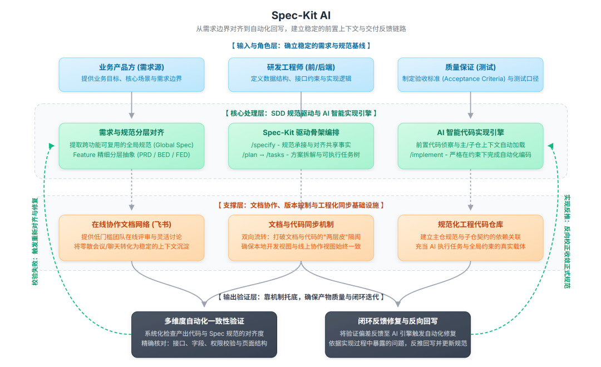

2026 那年关于 AI Coding 的神奇案例已经很多了。也有很多小伙伴在分享自己在 AI Coding 一块的经验；

但这里有个问题，作为一个技术负责人，站在团队角度，应该如何弄清楚到底应该如何与 AI 合作？

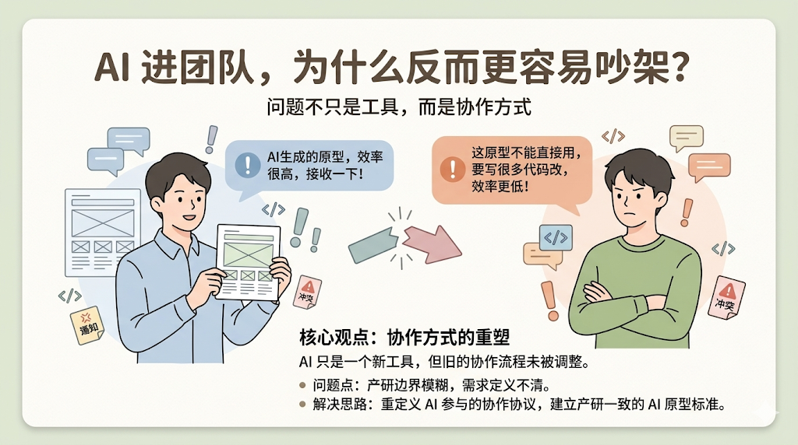

因为当前问题就已经挺多了：

  

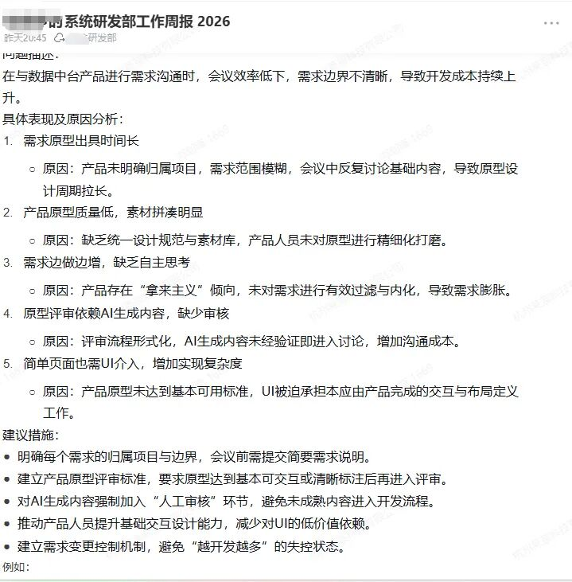

昨天同学团队里发生了激烈争执。产品用AI出原型图，前端开发拒绝接收。吵架到最后前端哭了！

为了弄清楚到底该如何与AI协作这件事，我们做了一次 ***基于 Spec-Kit 的一次生产团队落地探索*** ，实践的结果也很符合预期：

> AI 真正进入研发流程，不是先选模型/工具，而是先立规范

在实践开始前，我们原本想解决的，是如何让 AI 在人的监管下，尽可能完整地承担代码实现；但真正做进去后发现，最大的瓶颈根本不在代码生成，而在**需求边界、规则口径、接口约束、验收标准** 这些前置上下文是否稳定。

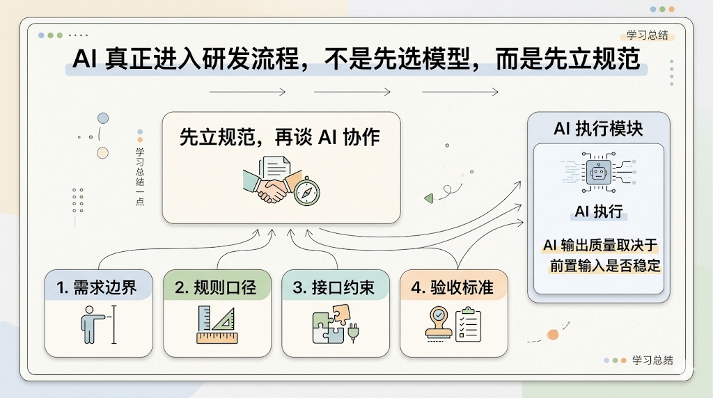

也正因为如此，我们最开始补的不是编码工具链，而是需求对齐本身。

在具体实践上，我们从飞书文档承接需求和规则，到开发同步工具连接文档和代码仓，再到最终转向基于 Spec-Kit 的 SDD，我们最后真正得到的，不是一套单独的工具用法，而是 ***一套与 AI 协作的研发范式：***

**让规范、实现、验证、修复和反馈回写逐步形成闭环，让 AI 不再只是辅助写代码，而开始在约束下参与真实研发。**

##  Spec-Kit

开始讨论之前，我们先简单说一下 Spec-Kit。

它是 GitHub 在 2025 年开源的一个工具集，核心理念是**规范驱动开发** ，Specification-Driven Development，简称 SDD。

这套工具提供了一套很轻的流程骨架：用 /specify 把需求和约束讲清楚，用 /plan 把方案拆明白，用 /tasks 列成可执行的小任务，最后让 AI 按 /implement 一步步把代码写出来。

我们之所以选择基于它来做验证，原因也很直接：不是因为它社区热度高，而是因为我们在实践中摸索出来的那套规范雏形（全局规范、feature 分层、需求/设计/验收拆开，这里后面会介绍），**和 Spec-Kit 的理念高度一致。**

因为 Spec-Kit 很好的满足了我们的想法，又很轻量级，所以我们就直接用了，但要注意： ***Spec-Kit*** 从来不是今天的重点，我们今天不是来介绍工具的，而是： ***我们是如何摸索出一套与 AI 协作的研发范式。***

好，现在正文开始...

## 我们想解决什么

一开始，我们想做的事情很明确：不是让 AI 来帮人补几段代码、写一两个页面，而是希望在人的监管下，让 AI 尽可能完整地承担代码实现。

> 能不能 100%，替代人，能替代人的 百分之多少，这重来都是一件重要的事情

辅助写代码，更像给现有研发流程打强力补丁，哪里缺就补一下。它当然有价值，但整体上并不会真正改变研发链路本身。人依然是主执行者，AI 只是一个更聪明一点的加速器。

而让 AI 尽可能完整实现代码就不一样了。这意味着 AI 不再只是边角料的补充角色，而要开始进入主流程，要真正承接需求、完成实现，并在反馈中继续收敛。

这个时候，问题就不再只是模型够不够强，而是团队有没有把输入整理到足够可执行。换句话说，这里第一个本质问题就产生了：

> AI 的问题，很多时候并不是模型强弱的问题，而是前置上下文的问题。

如果需求边界没有讲清楚，验收标准写了等于没写，那么人来实现会返工，AI 来实现同样会返工。区别无非是，人可能慢一点地出错，AI 往往能更快地把问题做大。

**AI像一个效率放大器，好的输入会被放大，坏的输入也一样会被放大。**

因为其效率极高，如果前面的边界一旦没立住，它会以一种相当敬业的方式，把问题又快又整齐地做出来。所以：

> 需要优先补的，不是编码工具与模型，而是需求、规则、接口、验收这些前置上下文的稳定表达

出发点是什么很重要，因为它意味着我们要解决的，首先不是怎么让 AI 写得更快，而是怎么先把该说清楚的东西说清楚，然后基于此再谈 AI 协作。

作为个人，可以盯着模型、盯着生成，但如果着眼于团队，先顶着的就一定是约束，这也在我们团队产生了一个情况：

> AI 对个人可能是 200%、500% 的提效，但一进入团队，数字键就要低很多

这涉及到了团队更底层的协作问题了：如果想让 AI 真正承担实现，那么团队必须先把怎么把事情讲清楚这件事做得比以前更认真。

这也是为什么，后来的整条路径没有先从代码开始，而是先从需求对齐开始。

## 文档对齐

既然问题的关键不在写代码，而在先把事情讲清楚，那么接下来的问题就变得很现实了：这些需求、规则、接口、任务、验收，到底应该靠什么来承接。

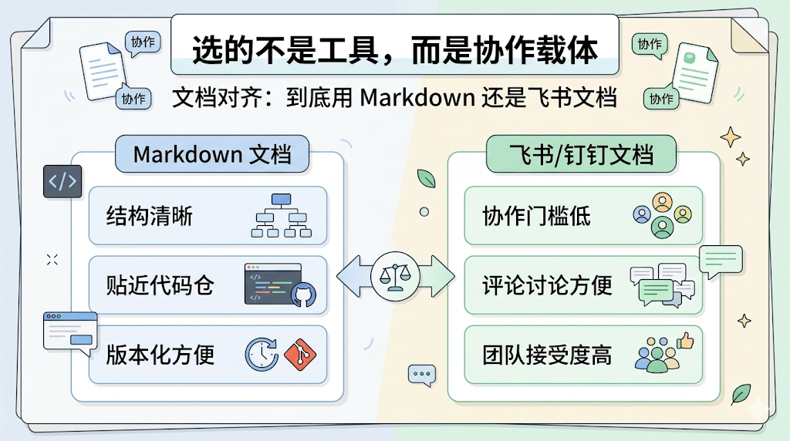

那时候我们其实调研过几种不同方式：

  1. 包括更偏工程化的 Markdown；
  2. 也包括团队内部已经广泛在用的飞书文档；

这一步看起来像是在选工具，实际上是在 ***设计协作流程*** ：我们需要的不只是一个能写字的地方，而是一个能让产品、前后端、测试、AI 共同围绕它工作的载体。

首先是 Markdown，他的优势很明显：结构清晰、天然贴近代码仓、版本化也更顺手。

但问题在于，我们是要设计**整个团队的协作流程** ，真实团队不是只由工程师组成。

只要产品、测试、业务方还需要高频参与，你就很难只站在技术上所谓“更优雅”的角度做决定。

所以，飞书/钉钉文档就出现了。他的优势恰恰在另一边，大家的接受度高，协作门槛低，评论、讨论、共享、修改都比较顺。

**很多时候，一套方法能不能落地，决定因素未必是谁更先进，而是谁更容易先跑起来。**

最终当然是选择 **钉钉/飞书** 文档咯！

这里有一个点特别想强调：我们当时并不是想多写文档。相反，我们真正想做的，是用文档把那些原本散在会议、聊天、口头约定和个人记忆里的东西，尽量往一个更稳定的结构里收。

而，这一步本来就很难，多数时候我们的规则只能控制自己，不能约束太多部门，毕竟**“写代码”** 是我们本质工作，而其他部门没有义务配合我们，除非有 ***公司降本增效的大棒*** 。

## 规范雏形

所以，飞书阶段做的事情，从最开始就已经远远不只是把文档写清楚了。

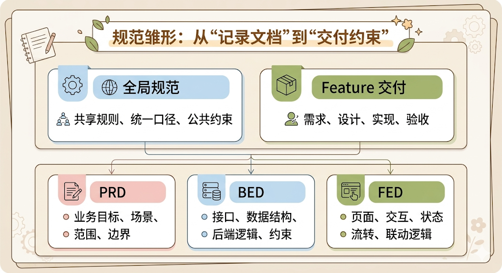

> 管理推动阶段的故事暂时不表，我们先回归文档约束本身

我们逐渐摸索出了一套很朴素、但已经带有明显规范意识的组织方式。

最开始，文档当然也带有记录属性，毕竟需求讨论、方案梳理、接口约定这些东西，总要先有地方落下来。但随着使用深入，我们明显地感受到，**文档如果只承担记一记的作用，它的价值其实很有限。** 因为记录并不会天然变成约束。

所以飞书阶段很快就出现了一个变化：文档开始不再只是为了留痕，而是开始承担交付过程里的实际作用。它不只是记录大家说过什么，而是开始承接需求对齐、实现约束、联调依据和验收口径。

再往前走一点，我们很快发现，并不是所有内容都适合混在一起写。

有些东西明显不是某一个 feature 独有的，而是很多功能都会反复引用的通用规则。比如一些统一口径、共享定义、公共约束、跨功能都适用的边界判断，这类内容如果每个 feature 都各写一份，看起来像是自给自足，实际上很快就会变成各写各的版本。

于是当时我们就开始有意识地区分两类内容：一类是全局规范，更适合沉淀那些跨 feature 复用的稳定规则；另一类是 feature 交付内容，更适合围绕某个具体功能展开需求、设计、实现和验收。

除了全局和局部的区分，feature 内部也开始逐渐形成层次。

那时候我们已经不满足于用一篇文档把所有内容糊在一起，而是开始有意识地拆分不同角色关心的内容。最典型的，就是围绕 feature 逐步形成了 PRD、BED、FED 等分层：

  1. PRD 主要承接业务目标、场景、范围、规则和需求边界；
  2. BED 主要承接后端实现设计、接口、数据结构、约束和服务逻辑；
  3. FED 主要承接前端页面、交互、状态流转、联动逻辑和实现关注点；

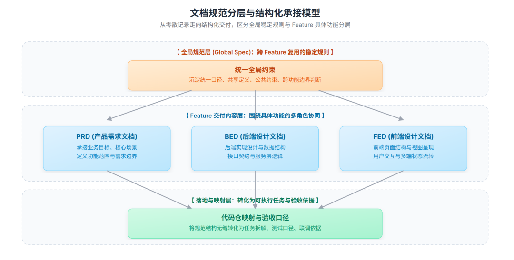

再往下，还会根据需要补充任务拆解、测试口径、验收内容等配套信息。

如果用现在的视角回头看，飞书阶段其实已经有很明显的 Spec 驱动特征了，只是那时候，我们还没有把这件事明确叫成 SDD，也还没有迁移到更适合工程化承接的结构里。

## 文档代码两层皮

飞书阶段走到后面，一个很现实的问题很快摆到了桌面上：**文档虽然开始承接交付了，但它和代码仓之间还是两张皮。**

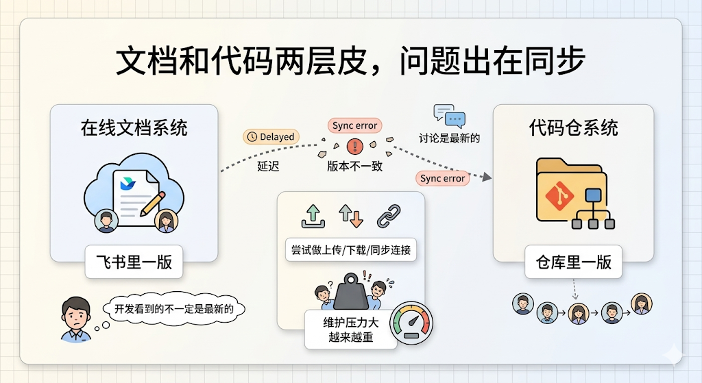

在线协作当然方便，大家都能看、都能改、都能评论。只不过一旦文档开始承担规范和约束的作用，问题就变了：**它不再只是放在那儿供人参考的材料，而是需要和代码实现建立更稳定的关系。** 否则，文档写得越认真，后面维护起来反而越容易累。

最典型的问题就是同步。

飞书里有一版，仓库内部也有一版；今天在线上改了一点，明天本地可能还是旧的；讨论时以最新版本为准，开发时看到的却不一定是同一份内容。这些问题在文档只是补充说明的阶段，还能靠人盯住；一旦文档开始承担交付约束，它们就会迅速变成真正的协作摩擦。

也正因为如此，我们后来专门开发了一个飞书文档上传、下载、同步的工具。说白了，这个工具想解决的事并不复杂：尽量把飞书里的内容和代码仓协同起来，让文档不要永远悬在仓库外面，当一个大家都说重要，但谁也不敢完全依赖的平行系统。

这个动作本身，其实已经说明了一件事：**我们当时已经不满足于在线文档协作了，而是在尝试把文档真正纳入研发链路。**

换句话说，飞书阶段走到这里，问题已经不再是文档写没写，而是文档能不能跟实现一起跑。这是一个很重要的变化。因为它意味着我们对文档的期待，已经从承接信息进一步升级成了承接协作。

但也正是在这个过程中，问题逐渐暴露出来：**同步只是表层，真正困难的是文档管理、版本约束、发布消费以及整套机制的持续维护。**

而这挺难的，越后面越难，说得直白一点，**文档越来越像代码了** ，需要版本，需要依赖关系...

这个时候，飞书就不够用了，其实大家都看得出来，这里出了一个问题：**文档同步，开始成了一个负担** 。

这个时候，Spec-Kit 的价值就出现了！

## Spec-Kit 的意义

其实从这里大家就会更清晰 Spec-Kit 出现的原因了。

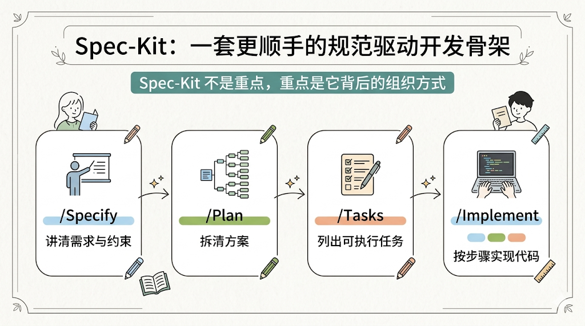

前面提到，为了解决飞书文档上传、下载、同步的问题，我们专门开发了一个工具。这个工具原本只是想补齐文档体系和代码仓之间的协同缺口，目标很务实：真的让我们那套流程走起来。

但巧的是，这个工具本身，似乎正是基于 Spec-Kit 理念开发的。

这件事在当时带来的冲击，并不是我们发现了一个新工具，而是我们第一次在实际使用里，直接感受到了另一套组织方式的手感。

Spec-Kit 最初进入我们视野时，也并不是一开始就以主角身份登场的。它不是作为一个需要全团队立刻切换过去的新范式出现的，而是先出现在一个更具体的场景里：**我们在开发飞书同步工具时，拿它作为底层组织方式来用。**

这个顺序很重要。

因为一旦从看别人怎么介绍变成自己拿来做一个东西，很多原本停留在概念层的内容，马上就会落到手感层。结构是不是清楚，边界是不是自然，需求、计划、任务、验收之间是不是顺得起来，这些事不用再靠想象判断了，做一轮就知道。

也正是在这个过程中，我们第一次不是听说 Spec-Kit 不错，而是直接上手感受到： ***这套东西的骨架，确实是顺的。***

更有意思的是，随着工具开发推进，我们并没有觉得自己在学一套完全陌生的新东西，反而越来越强烈地感受到一种熟悉感...

因为此前飞书阶段已经摸索出来的很多做法，比如区分全局规范和 feature 内容，区分需求、设计、实现、验收的职责，让文档从记录走向承接交付；

而在 Spec-Kit 这里被放进了一套更完整、更清晰的骨架里。他尤其需要大家关注的是背后的组织方式：

它让需求、计划、任务、实现、验收这些原本很容易散开的东西，第一次有机会沿着一条更自然的路径串起来。不是今天需求单独写一份，明天任务再补一份，后天测试口径另开一份，大家最后靠脑补去拼接；而是从一开始就承认，这些东西本来就应该是同一条链路上的不同节点。

也正是在这里，选择就很清晰了，直接上 Spec-Kit 就好。

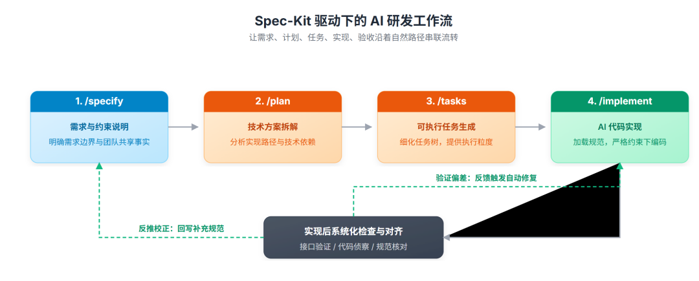

## 从 Spec-Kit 到 SDD

接下来的发展很清晰，我们开始进一步调研 SDD。

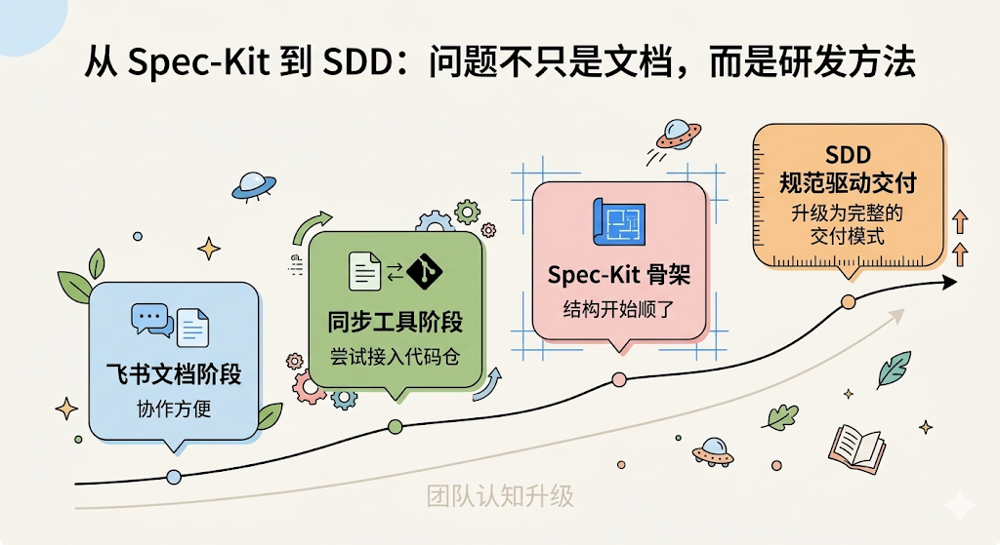

接触 Spec-Kit，更多是让我们看到了一个更合适的骨架，那么调研 SDD，则是让我们第一次把整件事从文档协作问题提升到研发方法问题来理解。

前面那条路走下来，团队其实已经积累了不少直觉：只靠文档记录不够，只靠在线协作不够，只靠同步工具也不够；规范如果不能进入运行链路，最后还是会停在看起来很重要的层面。

直到接触 SDD，这些直觉才第一次被系统地串成一句完整的话：**我们真正需要的，不是一套更会同步文档的方案，而是一套更完整的规范驱动交付模式。**

一旦这么理解，团队关心的就不再只是文档放哪儿、怎么同步、谁来改，而会变成更底层的一组问题：规范如何组织，规范如何承接共享事实，规范如何和 feature 交付衔接，规范如何进入实现仓，规范如何支持验证、修复与持续演进。

当问题被提到这个层面时，飞书体系的问题也就更清楚了。它不是不能做，而是天然更适合协作与讨论，不太适合承接一套持续运行的规范系统。

所以后来转向基于 Spec-Kit 的 SDD，并不是因为前面的飞书阶段做错了，更不是因为那套探索没有价值。恰恰相反，如果没有那一段，我们后面大概率也很难这么快走到这一步。

## 真实团队协作

紧接着我们又碰到了另一个现实问题：**Spec-Kit 很适合把单个 feature 的起手式做完整，但真实团队协作并不会停在起手式。**

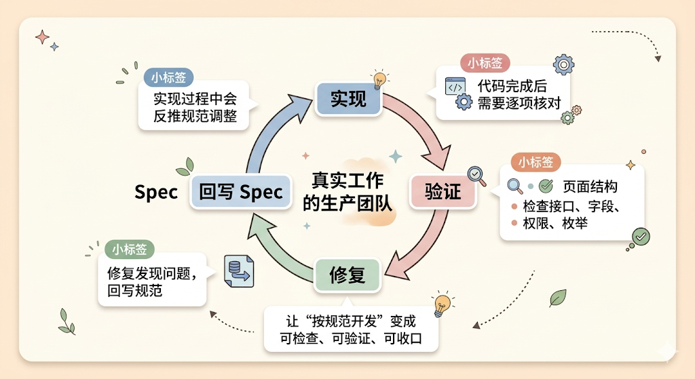

在单个 feature 里，Spec-Kit 对我们的帮助非常直接：需求编写、问题分析、方案对齐、计划拆分、验收标准，这些事情都能被组织得更清楚。过去那些容易散、容易混、容易反复口头补充的内容，第一次真正被拉进同一条链路里。

但真正进入实现阶段后，团队协作会自然冒出两个新的问题：

  * 第一，代码实现过程中，常常会反推 spec 做调整；
  * 第二，代码实现完成之后，还需要系统地检查代码和 spec 是否真的对齐；

现实里很少有哪份 spec 一开始就完全正确。需求讨论阶段看着没问题，真正一落到实现里，旧代码、已有模型、接口约束、命名习惯、边界场景、历史兼容性，这些东西就会一个接一个冒出来。

这时候你会发现，问题并不总是代码没按 spec 写。有些时候是实现偏离了规范，有些时候反而是规范本身还不够完整，甚至在个别场景下，现有代码里的某些处理方式比 spec 写得更合理。

所以，真实团队里，spec 不可能是一次写完就封版的静态产物。它必须允许被实现过程持续反向校正。否则，规范和实现之间的关系就会很快从约束变成脱节。

而在另一端，实现写完之后，到底有没有真的对上规范，也不能靠口头确认。

按 spec 开发这句话，在很多团队里都很常见。但如果没有一轮系统化检查，它很容易停留在口头层面。大家都觉得自己是按规范做的，真到接口一对、字段一拉、权限一验、页面一看，才发现所谓差不多，和真的对得上，中间通常还隔着一条不算短的路。

所以后来我们又补了一组面向实现阶段的能力。

一边约束 AI 在子仓里按规范写代码：不只是看当前 feature，还会自动加载依赖 feature 的上下文，同时读取主仓规范和子仓约定，写代码前先做既有代码侦察；

另一边在代码写完后，再把实现重新拉回规范里逐项核对，检查接口、字段、权限、枚举、页面结构这些关键点，到底有没有真的一致。

这些扩展的核心目的，不是把按规范开发说得更漂亮，而是尽量把这件事变成一件可检查、可验证、可收口的事情。

真正跑进生产团队后，我们也越来越清楚，验证这件事不能只靠最后一脚。

## 这次探索带来的变化

如果只看表面，这次探索像是在换文档结构、换协作方式、换仓库组织，甚至顺手换了一批工具。但真正发生变化的，并不是工具箱更丰富了，而是大家开始习惯并遵守这套流程了。

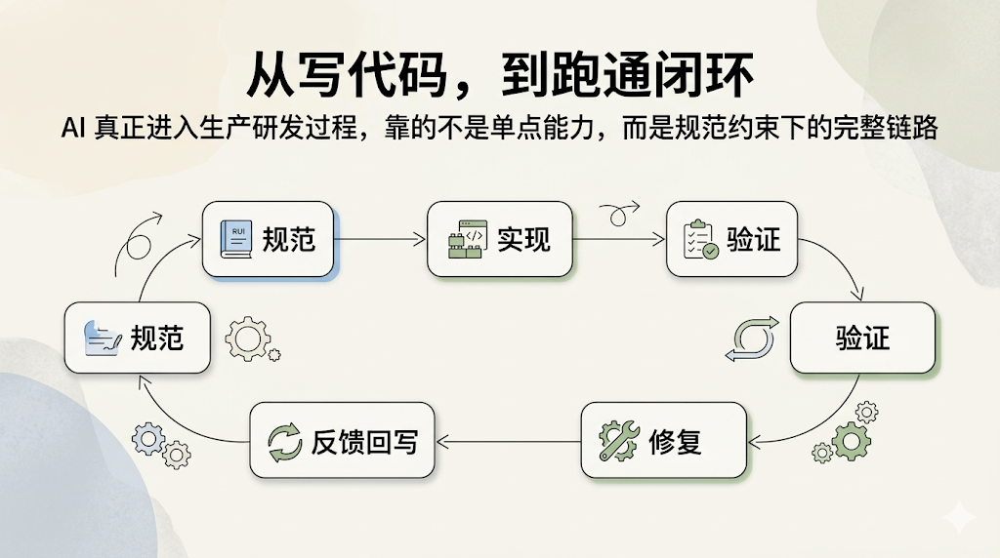

首先，**需求对齐的载体变了。研发流程开始有意识的被前置了！**

这套方式跑起来之后，需求对齐第一次开始有了更稳定的承载结构。甚至老板之前做战略需求讨论时候习惯性的忽略技术人员，现在都有所改变。

其次，**规范和实现的关系变了，** 文档和代码之间，常常是两层皮。

过去文档负责说明，代码负责落地，中间那段最关键的翻译过程，往往还是靠人脑兜底。而现在，规范不再只是写给人看的说明材料，而开始真正进入实现链路。

它既是人理解需求和边界的依据，也是 AI 消费上下文、展开实现的依据。更重要的是，它不再只是前置输入，而开始在实现过程中被持续校正、在实现完成后被重新验证。

> 总而言之，当 AI 开始读文档，当 AI 开始负责交付代码的时候，整个工作流程、工作内容全部会变化

第三，**AI 在研发中的角色变了。**

过去 AI 更像一个随叫随到的副驾驶。但随着规范、实现、验证和反馈回写逐渐串起来，AI 在研发里的位置开始变化了。

它不再只是接一个局部任务，然后吐出一段代码；而是开始沿着更完整的链路往前走：先理解规范，再完成实现，然后接受测试和校验反馈，接着继续修复问题，必要时还会把发现的问题再反推回主仓。

这个变化，逐渐有些\** **反客为主*** 了！

第四，**团队协作从靠人盯，变成靠机制托底。**

当前这套方式还有很多地方在演化，但一个很直观的变化就是：越来越多原本靠经验丰富的人盯着的事情，开始有机制先兜一层了：

主仓内部有没有自己打架，不再完全靠人翻文档；实现时发现 spec 和代码对不上，不再只能靠口头沟通；代码写完之后有没有真的按规范对齐，也不再只是拍脑袋说应该差不多。

最后，**研发链路的顺滑程度变了。**

过去最常见的状态，是每个环节都不算缺。需求有人讲，实现有人做，测试有人验，问题也总有人修，单看每个点，好像都在；但一旦连起来，就总觉得哪里不顺。

现在这套方式的价值，让这些齿轮开始更像一套传动系统。需求进入规范，规范进入实现，实现进入验证，验证再回到修复；实现过程中发现规范有问题，还能继续回写主仓，重新收敛正式口径。

从体感上说，研发过程确实变顺了。但更准确地说，它不是更快了，而是更连贯了。

但为什么老板也愿意由着我们瞎折腾，原因很简单： ***有些岗位确实会消失***...

## 结语

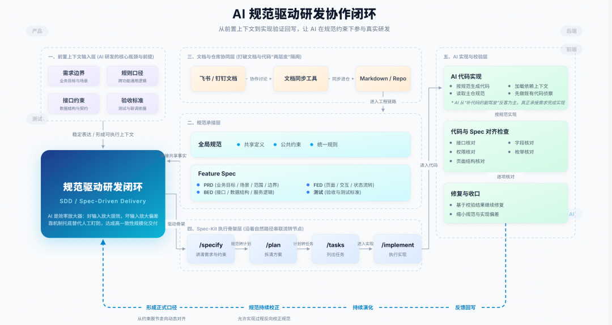

写到这里，如果要问这次探索到底让我们想明白了什么，我觉得未必是找到了一套标准答案。更准确地说，是我们终于把一些原本模糊的问题看清楚了。

首先，**真正的难点不在 AI 会不会写代码，而在前置上下文是否稳定。**

AI 不会自动修复需求边界、规则口径、接口约束、验收标准里的问题，它只会把这些问题更早、更快地暴露出来。所以这次实践给我们最直接的提醒就是：

**AI 的引入不会自动修复协作问题，它只会把协作问题暴露得更彻底。**

其次，**Spec-Kit 的价值，在于把 feature 的起手式做完整；而真实团队落地，还要继续补上实现阶段的反馈与验证链路。**

它的意义不只是提供几份模板，而是给了团队一个可以继续扩展的骨架。骨架一旦有了，后面的反馈、验证、修复和回写，才有地方可挂。

再往下，我们也越来越确认：**社区方案进入生产团队，关键不是照搬，而是持续演化。**

我们不是直接把 Spec-Kit 拿来照着用，而是从业务目标出发，先经历飞书文档、同步工具，再到方法切换。真正有效的，不是采用了什么，而是怎么把它改到自己能用。

而这次探索最重要的结果，是我们最终越来越相信：当规范、实现、验证、修复和反馈回写形成闭环时，AI 才真正开始进入生产研发过程。

它不再只是一个会补几段代码的局部工具，而开始在规范约束下，沿着一条完整链路稳定工作。

所以如果一定要把这次探索压成一句话，我更愿意这样说：

> AI 真正进入生产研发过程，不是从会写代码开始的，而是从能在规范约束下跑完一条闭环链路开始的

  

**点击上方卡片关注叶小钗公众号，查看下方二维码，添加我个人微信：**

###  往期推荐

[《系统性：如何进入AI行业？》](https://mp.weixin.qq.com/s?__biz=Mzg2MzcyODQ5MQ==&mid=2247500057&idx=1&sn=27826d0673deb3f8adf3f969540b6401&scene=21#wechat_redirect)

[《万字：Agent概述》](https://mp.weixin.qq.com/s?__biz=Mzg2MzcyODQ5MQ==&mid=2247497903&idx=1&sn=fe906b46bf43a88050c22d7a78b701b2&scene=21#wechat_redirect)

[《万字：做一个Agent-上》](https://mp.weixin.qq.com/s?__biz=Mzg2MzcyODQ5MQ==&mid=2247498889&idx=1&sn=079f99c62a1979e6bd82a20bbc9abf52&scene=21#wechat_redirect)

[《万字：做一个Agent-下》](https://mp.weixin.qq.com/s?__biz=Mzg2MzcyODQ5MQ==&mid=2247498914&idx=1&sn=f88fb3a296d667b95f709496381f4cf2&scene=21#wechat_redirect)

[《万字：理解LangChain》](https://mp.weixin.qq.com/s?__biz=Mzg2MzcyODQ5MQ==&mid=2247498404&idx=1&sn=aa2f76729ea55ad24c408456a5009a47&scene=21#wechat_redirect)

[《万字：AI Coding 的真实情况》](https://mp.weixin.qq.com/s?__biz=Mzg2MzcyODQ5MQ==&mid=2247499378&idx=1&sn=37c5873c8dbf39a22f27794bbfc00065&scene=21#wechat_redirect)

* * *

[《重要：AI学习路线图》](https://mp.weixin.qq.com/s?__biz=Mzg2MzcyODQ5MQ==&mid=2247496583&idx=1&sn=0821a0fbd4f973b27dbff47cd4de9feb&scene=21#wechat_redirect)

[《万字：个人IP，包教包会》](https://mp.weixin.qq.com/s?__biz=Mzg2MzcyODQ5MQ==&mid=2247496320&idx=1&sn=a372de0f30bf54a0cd76976961e5138b&scene=21#wechat_redirect)

[《万字：AI客服实战方法论》](https://mp.weixin.qq.com/s?__biz=Mzg2MzcyODQ5MQ==&mid=2247498987&idx=1&sn=5e3c5dc641b9eb94734ee27af0ad3381&scene=21#wechat_redirect)

[《万字：生产级别的RAG系统》](https://mp.weixin.qq.com/s?__biz=Mzg2MzcyODQ5MQ==&mid=2247496384&idx=1&sn=35f385ecb8ab7327f1b7bb450ce1020c&scene=21#wechat_redirect)

[《万字：RAG实战技巧，包教包会》](https://mp.weixin.qq.com/s?__biz=Mzg2MzcyODQ5MQ==&mid=2247497766&idx=1&sn=8d0f38328dcda7b3455146e5ce43bc26&scene=21#wechat_redirect)

* * *

[《2025年终总结》](https://mp.weixin.qq.com/s?__biz=Mzg2MzcyODQ5MQ==&mid=2247498265&idx=1&sn=e68705d02c3e42259a2edaf459add8cd&scene=21#wechat_redirect)

[《OpenClaw 会不会淘汰 Coze、Dify 这类平台？》](https://mp.weixin.qq.com/s?__biz=Mzg2MzcyODQ5MQ==&mid=2247499385&idx=1&sn=d29ddecd0b73840842deef1df0f118dd&scene=21#wechat_redirect)

[《别被 OpenClaw 带偏了，AI 公司到底该如何组织人才？》](https://mp.weixin.qq.com/s?__biz=Mzg2MzcyODQ5MQ==&mid=2247498929&idx=1&sn=60207051e94120546c2e2f22af6d82d8&scene=21#wechat_redirect)