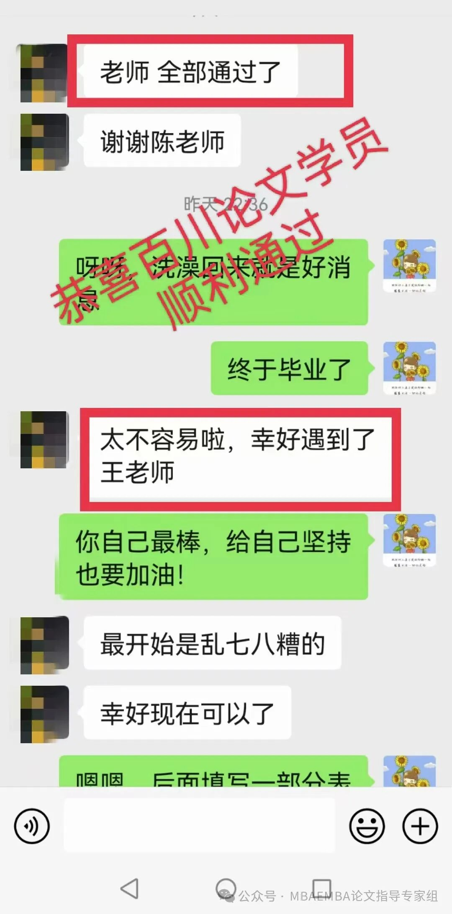
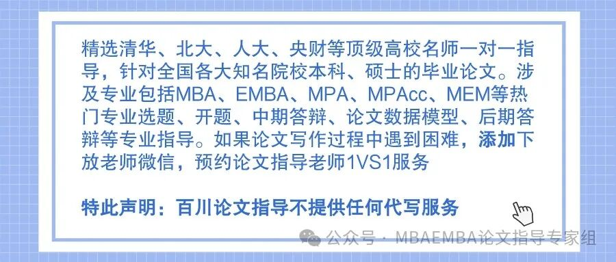

1、基于Unity3D的一种桌面级智能制造仿真系统的开发与研究  
2、A公司基于精益六西格玛的备件库存管理优化研究  
3、基于混沌猫群算法的低碳冷链物流配送路径优化  
4、CVT主动带轮轴全自动生产线的研发  
5、面向智能物流中心的服务性能研究  
6、基于群智能优化算法的物流配送路径优化研究与应用  
7、基于物流业务客户流失预测算法设计与实现  
8、基于智能优化算法的物流无人机资源调度研究  
9、基于启发式算法的物流配送路径设计与实现  
10、基于饱和方法的四旋翼携带载荷系统的控制研究  
11、具有真空干燥功能的物流车管壳式冷凝系统研究  
12、基于自组织理论的我国互联网社群电商的演化研究  
13、港口危化品物流风险评估及监管策略研究  
14、Z公司香港配送中心网购大促期间仓储出库系统的仿真与优化  
15、M公司总装车间生产物流系统仿真与优化研究  
16、中小制造企业物流外包风险管理研究 ——以M企业为例  
17、T冷链物流配送中心仓储作业系统仿真与优化研究  
18、H房地产公司自营社区商业中央仓库选址研究  
19、农业企业组织效能动态评价研究  
20、自动化物流系统在ZT烟厂原梗生产中的应用研究  
21、基于强化学习的多AGV路径规划及调度技术的研究  
22、专用汽车制造企业增值服务商业模式研究  
23、自动小车存取系统优化运行关键问题研究  
24、供应链复杂系统脆性传播模型与管控方法研究  
25、“平台—模块”主导的村镇物流生态系统演化研究  
26、BIM技术在汽车工厂项目建设中的应用研究  
27、基于混合量子算法的生产车间干扰管理问题应用研究  
28、不同主体主导下生鲜农产品供应链的利润最大化策略研究  
29、物流用角度可调式小型包裹自动分拣装置设计与研究  
30、应急救援物资储备库选址及配送优化研究  
31、大型体育赛事食品冷链物流网络构建研究  
32、物流AGV双剪叉耦合式举升机构设计及优化  
33、乙醇分割式MVR热泵精馏系统设计及其优化研究  
34、基于系统动力学的快递包装回收成本与收益研究  
35、基于MBSE的ISO/TC10/SC6标准体系及典型标准研究  
36、基于系统动力学的新能源物流车市场推广研究 ——以北京市为例  
37、基于Java EE的物流管理平台研究  
38、吊装式驮背运输车性能分析与试验研究  
39、高速高加速堆垛机防摇摆分析及其智能算法的实现  
40、多层子母穿梭车立体库货物布置设计及仿真  
41、面向跨境贸易集运的物流联动优化决策方法研究  
42、区块链技术影响下的供应链多级库存模型优化与仿真研究  
43、基于SVR-Kalman滤波的物流配送时间预测  
44、基于云平台的物流配送车辆调度系统  
45、AGV车载控制器设计与研究  
46、基于Witness的采煤机驱动齿轮加工过程仿真研究  
47、新零售下双渠道供应链网络脆弱性分析与评价研究  
48、基于系统动力学的中欧班列质量评价研究  
49、集装箱铁水联运码头陆域平面布局优化研究  
51、高铁快运作业流程优化研究  
52、粤港澳大湾区集装箱港口群集疏运系统仿真研究  
53、人因视角下的多目标车间设施布局规划研究  
54、基于双边市场理论的C2C二手平台定价策略研究  
55、基于支持向量机的FMS故障诊断研究  
56、H公司冷藏车装配车间布局优化研究  
57、基于精益思想的TY公司工厂布局优化研究  
58、冷链物流运输调度的帝国竞争算法研究  
59、T机械公司机加工车间生产系统仿真优化研究  
60、考虑拥堵的多AGV路径规划研究

  

**  
**

**写论文找百川，****论文变得很简单**

论文的成功通过只是一个起点，我们期待让更多的学员都能在百川教育的辅导下 收获学术成果。请相信我们，百川教育的全体辅导老师，具备**多年的论文辅导经验** ，一对一提供写作方案，解决你的疑问**，带你轻松完成论文** ！以下是我们学员的一些反馈：  

  

  
免责声明：部分资料来源于网络，转载目的传递更多信息和分享，仅供平台交流，不为其版权负责，如涉嫌侵权请联系我们及时修改和删除。.