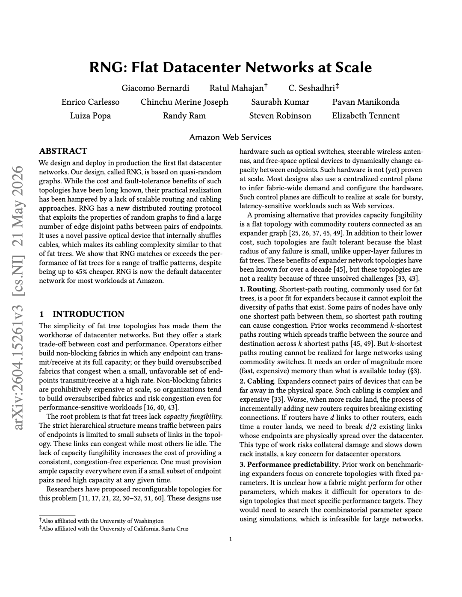
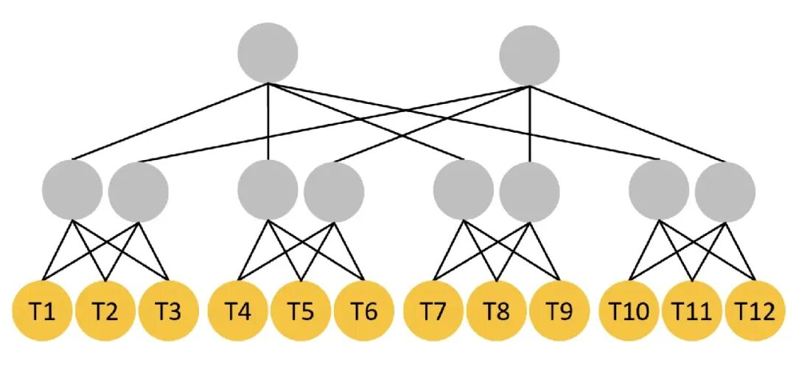
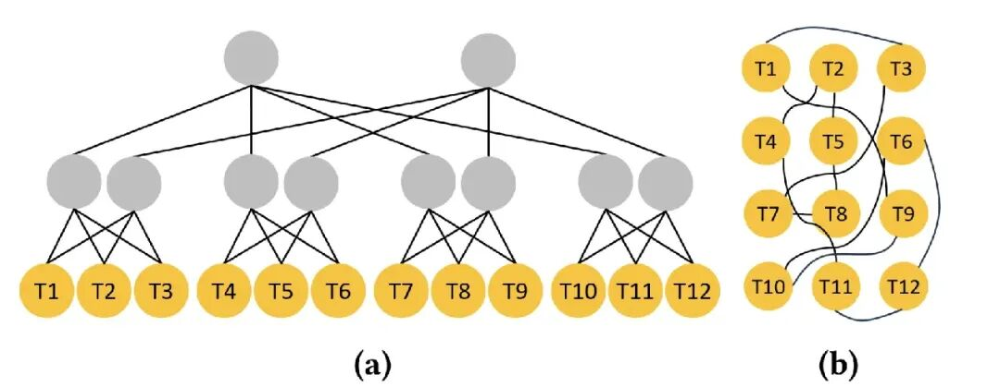
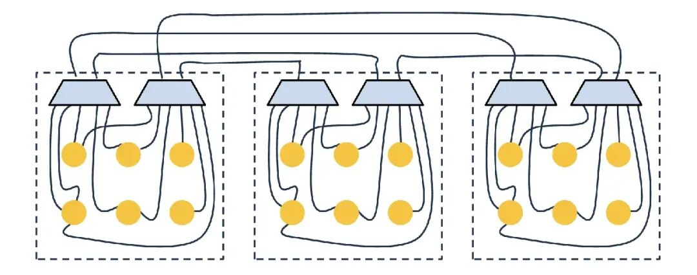
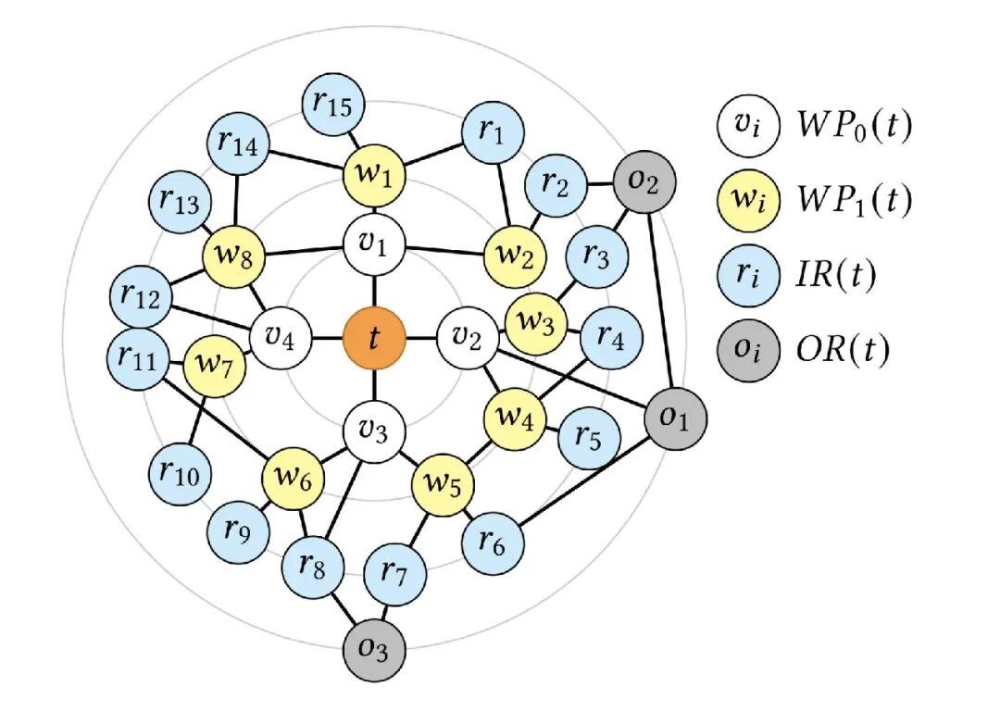

AWS 已开始在其云基础设施中部署一种全新的数据中心网络架构，以更扁平化的系统取代沿用数十年的设计模式。

AWS 表示，新系统能够提供更高的吞吐量和更低的能耗。

该架构名为弹性网络图（RNG），目前已在 AWS 爱尔兰、德国和西班牙的数据中心投入使用。

AWS 表示，该设计现已成为大多数新建数据中心的标准网络方案，并支持其大部分云工作负载。

与 GPU 或 AI 加速器相比，数据中心网络如同幕后英雄，常被人忽视。然而，它在云性能中扮演着至关重要的角色，决定着信息在庞大的服务器集群中传输的效率。随着云和 AI 工作负载日益繁重，网络瓶颈带来了一大堆难题。

几十年来，超大规模数据中心一直依赖一种名为胖树拓扑（fat-tree topology）的层级结构。在这种设计中，数据流经过多层交换机和路由器传输，这些交换机和路由器则以树状层级结构排列。

这是一种胖树网络拓扑。图中的每个节点都代表一台拥有 4 个端口的路由器，其中 T1 到 T12 这些节点各自保留 2 个端口，用来连接服务器。

这种模式的缺点在于，它将数据流集中在几条有限的路径上，容易导致拥塞，即使其他地方有未使用的网络容量。

AWS 工程师于是采用了一种基于随机图理论（random graph theory）的替代方案。随机图理论这个概念在学术研究界已被探究多年，但应用于实际环境中很困难。

图中展示了 12 台路由器（T1 至 T12）在两种网络中的连接方式：左侧是胖树网络，右侧是扁平网络。每台路由器都有 4 个端口，其中 T1 至 T12 各自保留 2 个端口，用来连接服务器。

新设计不再以固定的层级排列路由器，而是通过分布式路径网状网连接诸网络设备，从而在端点之间创建多种可能的路径。

据 AWS 声称，与传统设计相比，新架构可将数据吞吐量提高多达 33%，网络设备的功耗降低了 40%。

ShuffleBox 和 Spraypoint

这一转变需要解决几个工程技术难题，这些难题一直以来阻碍着随机图网络在超大规模数据中心的部署。

一大挑战是管理数据中心内数量庞大的光缆。

AWS 估计其全球基础设施包含约 2000 万公里长的光纤。随机网络设计带来的布线模式远比传统架构复杂得多，这使得部署和维护困难重重。

为了解决这个问题，AWS 开发了一种名为 ShuffleBox 的无源光设备。该硬件无需电源，实现电缆互连标准化，同时保持网络的准随机结构。

图中有三个服务器机房，用虚线方框表示；每个机房配有两个 ShuffleBox，用梯形表示。ShuffleBox 的一侧连接服务器，也就是黄色圆点；另一侧只负责连接其他 ShuffleBox。

AWS 表示，这种方法简化了部署，并允许在数据中心之间一致地复制该架构。

然而，在拥有数千条可能路径的网络中路由传输数据带来了另一个挑战。

传统的路由方法通常选择数量有限的优选路径。

AWS 转而开发了一种名为 Spraypoint 的协议，该协议将数据流分配到众多可用路径上，然后再将其传向目的地。

ShuffleBox 和 Spraypoint 的结合能够更好地利用网络容量，同时降低数据流集中在几个特定点的可能性。

图中展示了一个采用该路由协议的示例网络。橙色节点是目标路由器（t），黄色节点组成路径点环（wi），蓝色节点和灰色节点则分别代表内环（ri）和外环（oi）。该说明来自 AWS 对 RNG/Spraypoint 路由机制的介绍。

AWS 报告称，RNG 所需的网络硬件比以往的设计大幅减少。

AWS 数据显示，网络设备减少了 69%，而与网络相关的基础设施成本最多可降低 45%。

AWS 还估计运营成本可降低约 27%。

云头条声明：如以上内容有误或侵犯到你公司、机构、单位或个人权益，请联系我们说明理由，我们会配合，无条件删除处理。

