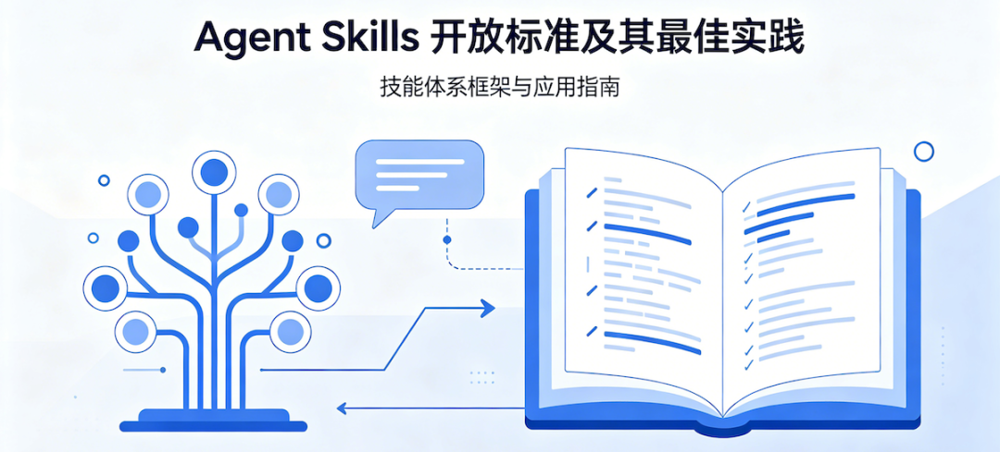
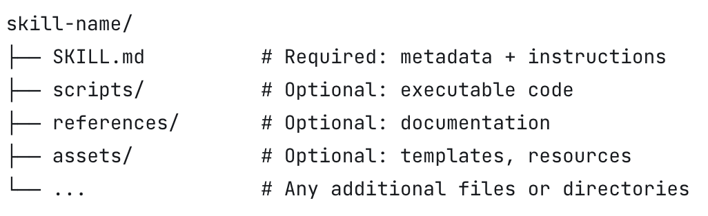
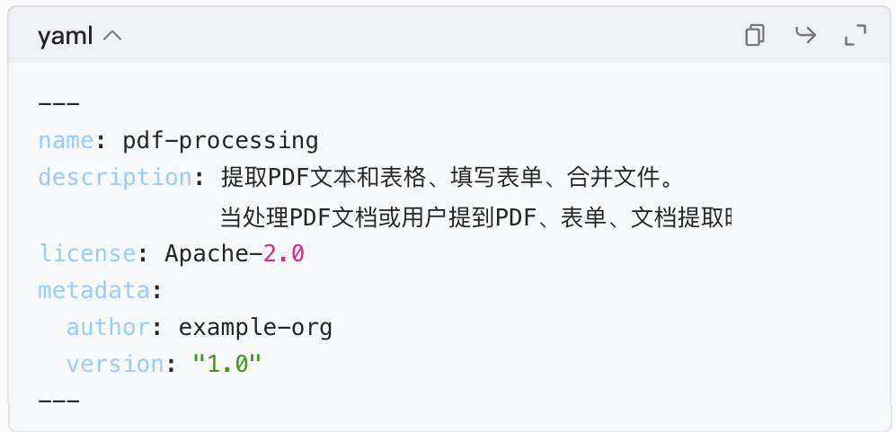

Agent Skills 是由 agentskills.io 推出的轻量级、通用、模型无关的 AI agent（智能体）技能开放标准，核心设计理念是渐进式披露和上下文高效利用，旨在解决 AI agent技能的可复用性、可分享性和执行可靠性问题。以下是对其规范、最佳实践和描述优化的系统总结，并对比当前行业其他相关标准。

一、Agent Skills 核心规范（Specification）

1\. 目录结构

一个技能是一个独立目录，必须包含 SKILL.md 核心文件，可搭配三个可选目录：

2\. SKILL.md 核心格式

文件由YAML 前置元数据和Markdown 指令主体两部分组成。

（1）YAML 前置元数据字段

**字段**| **必填**| **约束与说明**  
---|---|---  
**name**|  是| 1-64 字符，仅允许小写字母、数字和连字符；不能首尾或连续使用连字符；**必须与父目录名完全一致**  
**description**|  是| 1-1024 字符，必须同时说明**技能做什么** 和**什么时候使用** ，包含代理可识别的关键词  
**license**|  否| 许可证名称或指向许可证文件的引用  
**compatibility**|  否| 1-500 字符，说明环境要求（如 Python 版本、系统依赖、网络权限），大多数技能不需要  
**metadata**|  否| 任意键值对，用于存储自定义属性（如作者、版本）  
**allowed-tools**|  否| 实验性字段，空格分隔的预批准工具列表  
  
示例：

（2）Markdown 指令主体

无强制格式限制，推荐包含：

  * 分步操作指南

  * 输入输出示例

  * 常见边缘情况处理

  * 错误处理建议

核心约束：主体内容建议控制在500行/5000tokens以内，详细内容移至references/目录按需加载。

3\. 渐进式披露原则

标准最核心的设计，通过分层加载最大化上下文效率：

  * 元数据层（~100token）：启动时加载所有技能的name和description，用于判断是否触发

  * 指令层（<5000token）：技能被激活时加载完整SKILL.md主体

  * 资源层（按需加载）：仅在需要时加载scripts/、references/、assets/中的文件

  

4\. 验证方法

使用官方提供的skills-ref工具验证技能合规性：

运行：skills-ref validate ./my-skill

该工具会检查SKILL.md元数据格式、命名规范和目录结构。

二、最佳实践分类整理

1\. 技能来源：基于真实专业知识

避免让 LLM 凭空生成技能，所有有效技能都应扎根于实际经验：

  * 从实际任务中提取：与代理协作完成真实任务，记录成功步骤、纠正点、输入输出格式和项目特定约束

  * 从现有项目工件中合成：使用内部文档、运行手册、API 规范、代码评审意见、故障报告和版本控制历史作为素材

  * 通过实际执行迭代优化：运行技能处理真实任务，分析执行轨迹（而非仅最终输出），识别误触发、遗漏步骤和冗余内容

  

2\. 上下文管理：明智使用有限 token

技能内容会与对话历史、系统上下文竞争代理注意力，需严格控制信息密度：

  * 只添加代理不知道的内容：省略通用知识（如 "什么是 PDF"），专注于项目特定约定、领域特定流程、非明显边缘情况和推荐工具

  * 设计连贯的技能单元：技能范围应类似函数，封装一个可组合的工作单元；避免过窄（需多个技能协同）或过宽（难以精准触发）

  * 保持适度细节：简洁的分步指南 + 工作示例优于详尽文档；大多数边缘情况可交给代理自行判断

  * 用渐进式披露组织大型技能：将详细参考资料移至references/，并明确告知代理加载时机（如 "API 返回非 200 状态码时读取 references/api-errors.md"）

  

3\. 控制粒度：校准指令的具体程度

根据任务特性调整指令的刚性，平衡灵活性和可靠性：

根据任务脆弱性匹配具体度：

  * 灵活任务（如代码评审）：说明检查要点而非固定步骤，解释指令背后的目的

  * 脆弱任务（如数据库迁移）：给出精确命令和执行顺序，禁止修改

  * 提供默认值而非菜单：当有多个可选工具时，指定一个首选工具，仅简要提及替代方案

  * 优先过程而非声明：教代理解决一类问题的方法，而非给出特定问题的答案；确保技能可泛化到不同输入

  

4\. 指令模式：经过验证的有效结构

以下模式可显著提高技能执行的可靠性：

  * 陷阱（Gotchas）部分：列出代理容易犯的具体错误（如 "users 表使用软删除，查询必须包含 WHERE deleted\_at IS NULL"），这是技能中价值最高的内容

  * 输出格式模板：提供具体的 Markdown/JSON 模板，比文字描述更可靠；长模板存于assets/按需加载

  * 多步骤工作流清单：用复选框明确列出所有步骤，帮助代理跟踪进度和避免遗漏

  * 验证循环：要求代理完成工作后先运行验证脚本或自查，修复问题后再继续

  * 计划 - 验证 - 执行模式：对于批量或破坏性操作，先让代理生成结构化计划，验证通过后再执行

  

5\. 代码复用：捆绑可复用脚本

如果发现代理在多次执行中重复实现相同逻辑（如解析特定格式、生成图表、验证输出），应将其编写为经过测试的脚本，放入scripts/目录供技能调用。

三、技能描述优化指南

技能的description字段是代理判断是否触发的唯一依据，其质量直接决定技能的可用性。

1\. 有效描述的写作原则

  * 使用祈使句：以 "Use this skill when..." 开头，直接告诉代理何时行动

  * 聚焦用户意图而非实现：描述用户想要达成的目标，而非技能的内部机制

  * 适当扩大触发范围：明确列出间接适用场景（如 "即使用户没有明确提到 'CSV' 或 ' 分析 '"）

  * 保持简洁：控制在 1024 字符以内，通常几句话到一个短段落即可

  

对比示例：

❌ 差：description: Process CSV files.

✅ 好：description: 分析CSV和表格数据文件——计算汇总统计、添加派生列、生成图表和清理混乱数据。当用户有CSV、TSV或Excel文件并想要探索、转换或可视化数据时使用此技能，即使用户没有明确提到"CSV"或"分析"。

2\. 系统测试与优化流程

  * 设计评估查询集：准备约 20 个查询，其中 8-10 个应该触发，8-10 个不应该触发

  * 应该触发的查询：覆盖不同措辞、明确度、细节程度和复杂度，重点设计技能有用但关联不明显的查询

  * 不应该触发的查询：使用 "近 misses"（共享关键词但需求不同），而非完全无关的查询

  * 测试触发率：每个查询运行 3 次，计算触发率；应该触发的查询触发率 > 0.5 为通过，不应该触发的 < 0.5 为通过

  * 避免过拟合：将查询集分为训练集（60%）和验证集（40%），仅用训练集指导优化，用验证集检查泛化能力

  

迭代优化：

  * 漏触发：扩大描述范围，添加适用场景

  * 误触发：增加具体度，明确技能不做什么

  * 避免添加特定查询中的关键词，而是提炼通用概念

  * 最终验证：用 5-10 个全新的查询测试优化后的描述

  

结论

Agent Skills 是目前最适合定义可复用、可分享、通用 AI agent技能的开放标准。其基于纯文本的设计使其易于版本控制和分享，渐进式披露原则完美适配当前大模型的上下文窗口限制，而系统的最佳实践和描述优化指南则解决了技能开发中的大多数常见问题。

虽然其他框架在特定场景下有优势，但 Agent Skills 的通用性和简洁性使其成为跨平台技能共享的最佳候选。目前该标准仍在快速发展中，未来可能会与 MCP 等协议进一步融合。

