# Designing AI Chip

# Hardware and Software

Bjarke Hammersholt Roune

2026

### What is this document?

I was going to start an AI chip company and this document contains my thinking about how to make an AI chip, both software and hardware. It’s written for someone else who would be responsible for or work on an AI chip project - it is some of what you’d need to know.

I thought others might be interested in understanding the area of AI chips, as well, so most of this should be easily understandable at a hobbyist level. Some parts are more technical and require a deeper background knowledge - those are marked in bold as “for nerds”.

This document also contains anecdotes from my time in Silicon Valley that I hope will be entertaining and perhaps illuminating. They are clearly marked and so can be skipped if that doesn’t interest you.

I know that this document is now being used as part of AI chip company employee onboarding in some places, which I think is a good idea, since much of the material in this document is not easily available elsewhere.

### Who am I to write this

I have worked at Google on TPUs and at Nvidia on GPUs in positions of technical leadership and also at other companies that produce AI software and hardware like Amazon and Facebook. I was the technical software lead for TPUv3 at Google and had much involvement in choosing and designing features for the TPU hardware back then. This is my profession.

### Why did I write this

I eventually decided not to start an AI chip company for personal reasons. Part of my motivation for starting an AI chip company was that I believe that there is a better way to do things - to the benefit of investors, perhaps, but also to the benefit of customers. I hope to achieve some of the positive effects that I had hoped my company would achieve by instead writing this document and making it freely available.

### You can comment

Feel free to comment on this document to me directly or in public [on this LinkedIn post](https://www.linkedin.com/posts/bjarkeroune_designing-ai-chip-software-and-hardware-activity-7437289720855945216-3OAT) (or, if you wish, anywhere). You may also comment directly in this document using Google Docs comments, but you’ll have to ask me for access to do that first. This was initially open to all, but that turned out to be unworkable since people would make unintentional edit suggestions or select parts of or the whole document, causing it to be highlighted for every reader.

### Executive summary

My primary contention in this document is that the eventual future of AI accelerators will be AI CPUs - traditional-ish CPUs with big caches and systolic arrays and where the caches and systolic arrays take up most of the chip area and power. There are *many* details to get right to get a competitive AI chip from that idea and going over those one by one is a big part of the content in this document.

The biggest tension you’ll find in this document is between, on one side, maximizing tokens per dollar and, on the other side, grossly overprovisioning your AI chip with collectively extremely expensive and unnecessary features and capacities so that customers will receive something that resembles what they are already using and used to. The recommendations I’m giving in this document assume that you have a most excellent software team that can make this all work so that customers can use your chip easily even without gross overprovisioning. *You will absolutely not have an easy time hiring a software team that can do this.* So keep that in mind.

If you are working on AI software, you may also want to read [this post on AI compiler testing](https://www.linkedin.com/posts/bjarkeroune_testing-and-benchmarking-of-ai-compilers-activity-7400980408399691777-D-WO?utm_source%3Dshare%26utm_medium%3Dmember_desktop%26rcm%3DACoAAA7mBYMBecBP2SlOzXckZ0TFssZOAG6Qq2Y). Since I already covered testing in that document, I will not get into testing here in this document. Unrelated: I do have some ideas for [interpretable transformers](https://www.linkedin.com/posts/bjarkeroune_the-interpretable-transformer-activity-7403581645284646912-gqWd/) that I think are interesting.

### Will I work for your company?

I’m retired and not looking for a job. I do not do paid consulting. I will not run your startup and I’m not interested in receiving funding. I can’t find a founder for you. I do answer questions for free if you feel like asking them and I feel like answering them, which I probably will feel like.

- **Proposal for a hardware design (summary)
- **Systolic arrays - the foundation of AI hardware
  - Larger systolic arrays are more efficient

  - Forces limiting the size of systolic arrays

  - Numerics or how to make a cheap systolic array

  - Structured sparsity for systolic arrays

  - Mono-sized systolic arrays are unbalanced

  - Chips with larger systolic arrays are easier to make

  - Advanced section: Non-square systolic arrays

  - The tyranny of the cycles and systolic array DMAs

  - Anecdote: Systolic arrays are hot

- **Compression for activations and weights
- **Kinds of AI workload - training, decode, prefill
  - Training

  - Decode

  - Prefill

  - Decode-prefill (managed) aggregation vs disaggregation

- **Expensive HBM storage capacity
  - Weights and KV caches as reasons for large expensive HBM memories

  - Reducing the need for large memories on AI chips

- **Parallelization of an AI assistant
  - Parallelization concepts

  - Parallelization using duplication

  - Between layers parallelization of decode using pipelining

  - Between layers parallelization of prefill using pipelining

  - Within layers parallelization

  - Mixture of Experts (MoE)

- **Network topologies for AI in a MoE world
  - Networking concepts

  - Link types

  - The specter of multi-hop waste

  - The big 3: Reduce-scatter, all-gather and all-reduce

  - Mixture of experts versus network topology

  - A proposal for a networking approach

- **Co-design
  - My experience with co-design

  - Intellectual quality and good judgement

  - Also learn from the world outside your company

  - Co-design needs to be grounded in the product

  - Combinatorial search

- **A critical look at GPU features for AI
  - Kernels and warp specialization

  - Path divergence (vector subsets)

  - Software managed cache

  - Warp scheduling (memory access pipelining)

  - Needing a host computer

  - The need for many threads and kernel switching overhead

- **Software pipelining for AI kernels
  - What is (software) pipelining

  - Software pipelining is difficult by hand

  - Write a tiled software pipelining library with op fusion

  - Why not X, Y or Z?

  - Software pipelining on Nvidia GPUs aka Warp Scheduling

- **Hiring for your AI chip project
  - Sourcing candidates over email

  - Interviewing engineers

- **Talking to engineers
- **Objections and answers
  - OS interruption of the systolic arrays

  - Few have access to the kind of CPU required for this

  - The science is missing

  - This design may not be so generally applicable

  - Tokens per dollar isn’t everything

  - What about analog compute?

  - Why more FLOPs?

  - Structured sparsity sucks

  - Systolic arrays are bad for depthwise convolution

  - Are routers superior to tori?

  - What about existing AI CPUs?

## Proposal for a hardware design (summary)

Here’s a summary of my proposed design. I recommend reading this section last, but you can read it up front if you wish. The defining features are that this design is easy to do in hardware, as easy to program as a CPU and is very cheap on a computation / watts basis. I doubt anyone making an AI chip will simply adopt my plan as-is, but I would suggest going through this design and understanding, for each deviation, exactly why you think deviating from this is a good idea. I would surely also have modified the design over time if I had embarked on actually building this.

“Hold on, this is just a CPU with a systolic array attached, you mean to say you can outcompete sophisticated GPUs and AI ASICs with just this?” Yes, that’s what I believe. Most of this chip is cache and systolic array, so you do not have to deviate from a CPU approach for scalar and vector compute. CPUs are the most programmable thing and both hardware and software engineers already know how to build and use them. That’s the idea. You’ll need to read the whole document to see why this works, but here are some of the highlights of the design:

- Design a traditional CPU with extra vector compute (and registers) and attach a systolic array to each core. If your name is Intel or AMD, probably use x86, otherwise find something fast and cheap (to you) that you can make or license.
- Have a large software managed SRAM cache (MBs) that can potentially double as automatic cache if part of it is unused by a given program.
- Support DMAs between all memories and networks. Allow SRAM-network-SRAM DMAs. Offer HW 8-bit huffman compression/decompression for DMAs at HBM / link speed.

- No host computer required - your chip is a general-purpose CPU already. Ensure your chip can run Linux and TensorFlow / PyTorch. Add scalar cores with no systolic arrays.
- Do not supply a large amount of HBM for your chip. Fit weights by using multiple chips.
- Supply an SSD with your chip. Enable KV-cache to go here by using sparse attention.
- Systolic arrays support only 7 bit multiplies, not 16 bit. Sums are wider and saturate.
- Systolic arrays support 1-of-2 sparsity for the RHS - simple and allows 2x throughput.
- Primary network is a 1D or 2D torus of copper traces. Use (cheap) custom motherboards that snap onto each other in 1D or 2D, connecting the traces. No expensive cables.
- Write an XLA backend for your chip. Most users will use this device through XLA. Also support custom kernels and custom XLA ops written in standard C++ (with intrinsics).
- This design works also for training, but focuses on inference at first - that’s easier.

This avoids the expensive parts of AI chips that you don’t really need, it’s straightforward to make this hardware in RTL and you can program it like any other CPU. I don’t know why something like this isn’t the industry standard for AI chips. The industry seems to prefer pursuing novel non-CPU architectures instead.

This chip requires significant software sophistication to use well, and you’ll have to do some AI research to get sparse (indexed) attention working well along with 1:2 sparsity and, in the low-HBM configuration suggested here, it requires a large minimum installation size to run a large LLM. It is an option to modify the design to be less economical to get around these factors, which I think is still a good design, but then it will be more expensive. I cannot predict which choice there will optimize your profit, but what’s suggested here is what is best in terms of delivering maximum tokens per dollar at high volumes.

> Technical note on Groq’s LPU for nerds  Groq’s LPU design doesn’t require any HBM. Is this the same? It’s the same in terms of distributing weights to avoid needing large per-chip memory capacity for weights, leading to a matching requirement of a large installation size. However, it is not the same for dealing with KV cache requirements. Groq uses a low-batch (and therefore low token latency) approach for decode (output tokens), which drops KV cache requirements dramatically - that’s how they don’t need any HBM to store the KV cache. This means Groq’s chips do not (cannot) use large systolic arrays (which requires higher batch), which necessarily leads to worse power and area efficiency. Groq’s approach also leads to very high bandwidth requirements, which the LPU has since it uses SRAM in place of HBM. The design I’m proposing here instead uses indexed attention (leads to much lower BW requirements) to enable offloading the KV cache to SSD, so large batch and therefore large systolic arrays can still be used. But then you have to make sparse (indexed) attention work - if you (and your customers) can’t figure that one out, you’ll have to add more HBM instead, as indeed most AI chips do.
## Systolic arrays - the foundation of AI hardware

[Systolic arrays](https://en.wikipedia.org/wiki/Systolic_array) are the foundation of AI hardware (i.e. deep learning hardware). Why?

Almost all mathematical operations (OPs) in a deep learning model like a transformer are happening inside matrix multiplication. Large systolic arrays are the most efficient way to implement matrix multiplication in hardware. So, systolic arrays are the foundation of AI hardware.

An AI accelerator chip like an Nvidia GPU (e.g. Blackwell) or a Google TPU is then a way to access a systolic array. There are more elements on an AI chip than systolic arrays, but the systolic arrays are the most important element, like the engine of a car.

This document is not an explanation of what a systolic array is, or how they can be used to do matrix multiplication - I assume that you know that already, but you can get an AI assistant like Gemini to explain it to you if you haven’t heard of them before.

If tomorrow a better kind of AI is developed that doesn’t rely on matrix multiplication, then the conclusions in this document may all have to change. This doesn’t seem to be the way things are going, since matrix multiplication has been king for a long time now, but it’s a risk for any AI hardware chip producer that their current AI chip may not be useful tomorrow depending on what happens in AI research. There is no way around that situation. It was true ten years ago and it is true today.

AI chips like Nvidia GPUs and Google TPUs have a number of large systolic arrays on them. If an AI chip is made properly, then most of the electricity consumed by AI is going into powering those systolic arrays. So when you hear of AI using a lot of electricity, that’s actually systolic arrays using a lot of electricity, at least for properly designed AI hardware. This is not because systolic arrays are power inefficient - electricity requirements would be much higher without systolic arrays.

It is the systolic array that defines the upper limit of how fast and power efficient an AI chip can be. Indeed, when we talk about *utilization* of an AI chip, which should ideally be near 100%, we are mostly talking about how busy the systolic array is. The rest of the chip exists to keep the systolic array busy.

On an Nvidia GPU, the systolic arrays are inside what Nvidia calls a [TensorCore](https://www.nvidia.com/en-us/data-center/tensor-cores/). Google uses the term [Matrix Multiply Unit (MXU)](https://docs.cloud.google.com/tpu/docs/system-architecture-tpu-vm) to refer to their systolic arrays (you might notice that “multiply” doesn’t have an X in it, but x is sometimes used to mean multiplication, as in 2 x 3 = 6, so they call it MXU with an X). AMD calls their systolic arrays [Matrix Cores](https://gpuopen.com/learn/amd-lab-notes/amd-lab-notes-matrix-cores-readme/). Intel calls the interface to their systolic arrays [Advanced Matrix Extensions (AMX)](https://www.intel.com/content/www/us/en/products/docs/accelerator-engines/what-is-intel-amx.html). On Amazon Inferentia/Trainium the systolic arrays are called [NeuronCores](https://aws.amazon.com/ai/machine-learning/inferentia/). It may sound like there is a wealth of different AI chip approaches, and there of course *are* differences, but it’s all systolic arrays with some other stuff holding it together. It’s all systolic arrays. The brand names are for marketing. There *are* AI chips that don’t contain systolic arrays, like very old Nvidia GPUs. Those are not ideal for most AI applications compared to chips that do contain systolic arrays, due to poor power and area efficiency.

So next time you hear of an AI chip with Northern Lights-Speed Einstein Genius Cores, or Newton AppleFall Eureka Cores or *whatever* they are going to call them, just remember that they are talking about systolic arrays. It’s all systolic arrays. For your reference, systolic arrays were [invented in 1978](https://www.eecs.harvard.edu/htk/static/files/1978-cmu-cs-report-kung-leiserson.pdf). We are now seeing AI chips coming out with large systolic arrays in recent times because AI has created demand for such a thing. It’s not an advanced modern thing, it’s old technology with now, all of a sudden, a large customer base. If Deep Learning had been invented in 1978, there would have been a rush of systolic array chips, I mean AI chips, back then, too. It would have been the same thing. It’s not something sophisticatedly modern.

You might say that high memory and network bandwidths are also important for AI, so it isn’t just about systolic arrays. Yes, but why do we need high bandwidth for AI? It’s because systolic arrays are so efficient that you need high bandwidth to feed them - otherwise they will be waiting idle for more work to do. Without systolic arrays, the chips would be much slower and you wouldn’t need nearly as much bandwidth per chip. The AI revolution is carried on the shoulders of the cost effectiveness of systolic arrays.

**So now you know**  The engine of AI chips is systolic arrays and every company calls their particular systolic array chip something different.

I’m going to focus on Nvidia GPUs and Google TPUs for the rest of this document because I worked on both of these at Google and Nvidia, so I know them well, and also because these are the top two AI chip products in the industry as of 2026. There are many other systolic array chips, I mean AI chips, though.

> Exceptions for nerds  There are a few exceptions. Groq’s LPU doesn’t have large systolic arrays, and maybe no systolic arrays at all. The LPU is for low token latency, not economical AI. Nvidia licensed Groq technology and this is exactly what Jensen (Nvidia’s CEO) said at GTC 2026 - it’s for expensive and low latency tokens, not general economical AI. There are also analog chips, using light or electricity, that try to achieve economies in other ways - these are unproven, but possibly something that will matter in the future if they will be proven.
### Larger systolic arrays are more efficient

This section is one of the only sections in this document that has a little bit of math in it. So, to make up for that, it also has some (badly drawn) pictures. Suppose you want to multiply two N x N matrices A and B to create the matrix product C = A * B. Then you can visualize a systolic array like this:

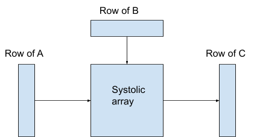

On every cycle, this systolic array takes in a vector from the left and a vector from the top and outputs a vector to the right. You can tell that this diagram is simplified, since it requires knowledge of the entire matrix B to produce a row of C, so you can’t produce any row of C until you see all of B. That’s why, in reality, the whole matrix B is fed into the systolic array and stored there and only then does it start to process rows of A. However, if you are doing many separate matrix multiplications one after the other, you can feed in the next B matrix while processing the current A matrix and outputting the prior C matrix, so in this way the left, top and right of the systolic array can be busy on every cycle, which is called 100% utilization. 100% is good. Systolic arrays also use something called skew/stagger, that complicates the picture further, but I’ll leave that out of the discussion since it isn’t relevant for this section.

The vector width of an N x N systolic array is N. What happens when we double the vector width from N to 2N, creating a 2N x 2N systolic array instead of an N x N one? It will look something like this:

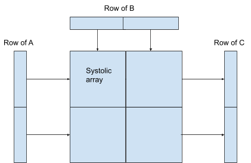

The vectors are twice as wide and the systolic array is 4 times as big, so it can do 4 times as much math per cycle. To see what we have gained by doubling the vector width, we will have to expand the picture to include the CPU (or CPU-like structure like a GPU) that is associated to each systolic array and which tells the systolic array what to do and processes the rows (i.e. vectors) from A, B and C. You can see that in the diagram below.

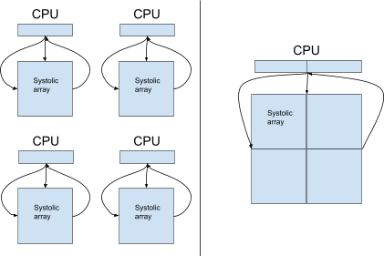

So what have we gained by using this larger systolic array? Our larger 2N x 2N systolic array is doing 4 times as much math per cycle as before, so the throughput-equivalent structure using smaller N x N systolic arrays will require 4 systolic arrays. It will also require 4 extra CPU cores, to tell the 4 systolic arrays what to do and to process their vectors. So by using a 2N x 2N systolic array instead of a n N x N one, we have reduced the number of CPU cores/work by a factor of 4. However, the CPU on the right has to process vectors that are twice as wide, which makes it more expensive, but less than twice as expensive. So by going from the left picture to the right one, we have shrunk the rest of the chip by a factor in excess of 2. Yet we didn’t lose any matrix multiplication capacity when we did this. So we have gained a factor of 2 on efficiency on the rest of the chip by doubling the vector width. Do it again, and you get a factor of 4. Do it again, and you get a factor of 8 and so on.

Couldn’t you just use the same CPU core to drive all 4 systolic arrays on the left picture? You could, but then it needs to be 4 times as capable / fast, so that doesn’t change the overall math.

These diagrams explain why we are seeing a march towards ever-larger systolic arrays for AI. Nvidia GPUs gained 4 x 4 systolic arrays in Volta (2017), got 16 x 16 systolic arrays in Turing (2018) and 64 x 64 systolic arrays in Blackwell (2025). Google TPUs have always used 128 x 128 or 256 x 256 systolic array sizes.

You might think this picture doesn’t apply to GPUs because I put a systolic array and a CPU core on the diagram, but there isn’t anything called a GPU on the diagram. For the purposes of this particular point, a GPU is just a specialized form of a CPU, one that has a lot of vector compute, so this picture applies perfectly well to GPUs. Read “GPU” where it says “CPU” in the diagram and you will get the right idea.

**Here’s a mystery to ponder**  Nvidia was already a very large and profitable company back in 2017 and GPUs were and are its main product. Meanwhile, while Google is also a very large company, the TPUv2 team within Google was small, something like 30 people in total across both hardware and software (5 people on the XLA team). Yet Google TPUs have continued to compete well with Nvidia GPUs from that time onwards. How is this possible? The answer will have in large part to do with the size of systolic arrays, I believe.

Let’s compare Volta to TPUv3 in terms of systolic array size. Volta had 4x4 systolic arrays while TPUv3 had 128x128 systolic arrays. To see what effect that has, let’s look at scalar compute and vector compute separately.

**Scalar compute**  Scalar compute includes the processing to tell the rest of an AI accelerator what it should do. We saw that a doubling in vector width gives a factor of 4 reduction in scalar work to do matrix multiplication. To go from 4 to 128 is 5 doublings of vector width, so the benefit for scalar compute of going from a 4 x 4 systolic array to a 128 x 128 systolic array is:

4^5 = 4 * 4 * 4 * 4 * 4 =  1024x

An AI chip also has to use scalar compute for doing things other than matrix multiplication, so this isn’t the whole story, but it’s a big part of the story. The TPU had to do only 1/1024th as much scalar work to drive the systolic arrays to do matrix multiplication (it’s actually even more than this since TPU vector registers are 8x128 rather than just 128, so that’s 8 * 1024 = 8192x). The scalar work is not the *main* cost on an AI chip, but it isn’t completely trivial and a factor of 1024 cannot be ignored.

**Vector compute**  We saw that a doubling in vector width gives a factor of 2 reduction in vector work outside of the systolic array. With 5 doublings from 4 to 128, that becomes a factor of:

2^5 = 2 * 2 * 2 * 2 * 2 = 32x

This is very significant. You might argue that what happens inside a systolic array is itself a kind of vector work, so we haven’t eliminated this much vector work, we just moved it inside the systolic array instead of outside. That’s technically true, but a systolic array is much more efficient than a vector processor, including for the work to retrieve inputs and store results, so what has been achieved is to move this work from a less efficient place to a much more efficient place. So the net effect is not so much as 32x but it is still very significant.

If you ask a great hardware engineer to explain this more fully, they are going to give you a long explanation involving register files, picojoules and the efficiency of data transfers around a chip, perhaps also including a digression into various alternative designs, but the overall conclusion is that much larger systolic arrays are much more efficient.

So you can start to see how a small team at Google could keep up with the might of Nvidia. There were other reasons, as well, but this is a big one. Nvidia GPUs have larger systolic arrays now, but they are still not as large as the ones on Google TPUs.

The obvious question here is then: why doesn’t everyone use even larger systolic arrays, like 1024 x 1024? That should be even more efficient, right? That is the topic of the next section.

### Forces limiting the size of systolic arrays

From our discussion so far, it appears that the most efficient AI chip will consist entirely of one very large systolic array (this is almost what TPUv1 was). The more of the area of a chip that consists of one (or several) large systolic array(s), the more efficient your chip will be. All other things being equal. So why not fill the entire chip with one large systolic array?

The most obvious reason is that the rest of the chip has to do *some* scalar and vector work, and you also need some space for caches, memory controllers and so on, so the *entire* chip can’t be just one big systolic array. In fact these other elements are a significant fraction of an AI chip, though this will be less and less the case the larger the systolic arrays get.

> Technical detail for nerds  TPUv1 was mostly one big systolic array. This requires driving it from a separate, external CPU, since there wasn’t a CPU-like element on the chip. You can do it that way, but now you have to buy a CPU to drive the systolic array(s), so arguably you didn’t save any chip area, you just put that area onto another chip that you still have to buy.
There is another more restrictive problem with overly large systolic arrays for AI. An N x N systolic array cannot *efficiently* do a matrix multiplication that is smaller than N x N. If the vectors in your AI model are 64 elements wide, and you have a 128 x 128 systolic array, your systolic array will not be used efficiently. Here is a diagram to visualize that. In the diagram, vectors are 128 elements wide but only the first 64 elements, in red, are actually being used:

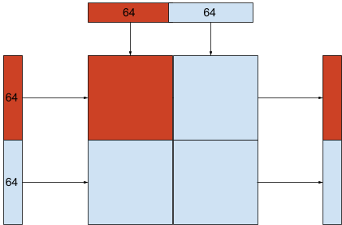

You can see that only 1/4 = 25% of the systolic array is being used. This is called 25% utilization, which is very bad. Thankfully, there is a way to improve on that picture, though it requires some complication in the software that drives the systolic array:

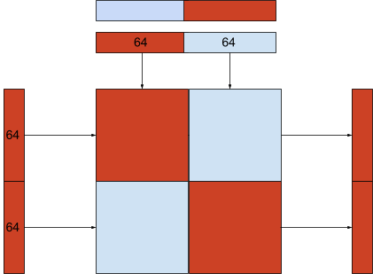

The idea is that the upper left and lower right subsets of the systolic array can be used independently, so that way 50% of the systolic array can be used. This is a consequence of the math of matrix multiplication, so you don’t need a hardware feature to enable this optimization. This way, the systolic array can be 50% utilized. But 50% utilization is still bad. We want 100%.

So we can see that every time the systolic array is twice as big as the vector width of the AI model that it runs on, then efficiency is decreased by a factor of 2 (or 4, if the software does not use the optimization mentioned above). This problem is the main reason that AI chips commonly contain many smaller systolic arrays instead of one huge one.

So the conclusion is that it is the dimensions of matrix multiplications in AI models that limits the size of systolic arrays in AI hardware. If your customer is using a small vector width in their AI models, you can’t sell them a chip with a large vector width, not unless they change their AI.

> Three dimensions for nerds  Matrix multiplication involves 3 dimensions instead of one. The diagram above is showing what happens if the middle one is smaller than the systolic array. Similar problems happen if the left or right dimensions are too small, though for those dimensions there is often some clever way to find more data to multiply so that you in effect increase those dimensions to reach 100% utilization. For example, the batch dimension in AI models serves this purpose. For the middle dimension, that we are focusing on here, “finding more data” doesn’t help: if the dot products inside the matrix multiplication only sum up so many items, then that is a hard limitation that there isn’t much you can do about. Except the optimization shown above. So that is why in this section I focus on the middle dimension, which corresponds to the vector width - it is the more fundamental limit.
The vector width of AI models is the way it is for a reason. If your model has a certain number of parameters, then there is a specific vector width that best makes use of those parameters to create a clever AI. You can use a higher vector width than that, but then your AI will be dumber if given the same number of parameters.

Following industry rules of thumb, larger LLMs have larger vector widths, so that vector widths and therefore systolic arrays are going to keep growing for as long as LLMs keep growing. Which seems to be a trend that will continue.

Let us focus on the transformer architecture, which is the driver of the current LLM AI revolution. Transformers have two different kinds of matrix multiplications: attention and feed-forward (FF). I won’t explain transformers here, but do study them if you want to know what’s going on in AI. Attention matrix multiplications are, unfortunately, not that large. FF matrix multiplications can be very large. So it is the attention component of transformers that are the most limiting for the size of systolic arrays on AI chips. Otherwise we might be seeing 1024 x 1024 systolic arrays already now, not 64 x 64 (Nvidia) and 256 x 256 (Google).

> Technical details for nerds  The full picture here is quite a bit more complex than this simplified view - isn’t attention often reported to be waiting on memory more than it is waiting on the systolic array? So that sounds like it might be acceptable to get low utilization out of a systolic array during attention, since it doesn’t need to be running very efficiently to keep up with memory when doing attention. That’s *sometimes* true, but there are still limits to how inefficient this can be. This also gets into the difference between training, prefill and decode, where memory bandwidth demands during training and prefill are far lower than during decode, so for those you do need high utilization of the systolic arrays - see the later section on this. Techniques like speculative decoding and GQA make even decode much less memory intensive, too (see the section on decode for more on this). Also, if you do it right, you can overlap attention and FF (requires deeper pipelines or, more efficiently, a model change to do them in parallel), in which case you do want high utilization of the systolic arrays always. Sparse attention, especially indexed attention, can also dramatically lower the bandwidth requirements of attention, and, in my opinion, all attention should be sparse (indexed) attention. There are also *many* techniques for making the KV cache smaller, and therefore lowering decode bandwidth requirements, that I don’t even mention in this document. The simplified conclusion from all that is what it says above: FF can use very large systolic arrays, while attention, if done right, works better with smaller systolic arrays. So it really *ought* to be transformer attention matrix multiplications that are limiting the size of systolic arrays on AI chips, though it is true that in practice, if you or your customers don’t put in the effort to make that happen, you may at times be limited on something else.
It might be surprising to hear that attention matrix multiplications are not that large, given that LLMs spend a lot of time doing attention. Shouldn’t attention be done quickly if it only uses a small matrix multiplication? The explanation is that the terminology so far has been a bit simplified. A matrix multiplication is of an N x K matrix times a K x M matrix, yielding an N x M result. So there are *three* independent dimensions, not just one N. Attention matrix multiplications are small in the sense that the K dimension is small, but the other two dimensions are often large and so the total computation is also large. The K dimension defines how many numbers are summed together to create one element of the resulting output matrix. If K is small, then a systolic array that is dimensioned to sum more numbers than that cannot get full utilization and this gets worse the larger the systolic array is compared to K. Even though K is small for attention, N and M can be large and also attention needs to do many matrix multiplications (if there are many attention heads), so that is how attention can take a long time even though K is small. In FF, all three dimensions, N, K and M, can usually be large enough to fill a systolic array.

> Detail on images and video and video for nerds  **If your AI is processing images or video, note that each pixel is only 3 values deep: red, green and blue. That can be a problem because this means that the matrix multiplications for processing an image has a K of only 3. That’s extremely small, much smaller than attention. However, this isn’t so bad as it may seem. As soon as AI starts to look at the data, we can and do immediately create a much larger K, so it’s only the very initial processing where you have K=3. Also, that initial processing might be possible to place on a CPU before you hand the data to the AI chip, since it is light weight (due to K=3), in which case you might still get 100% utilization of your AI chip during image and video processing even for a large systolic array.
> Detail on decomposable systolic arrays for nerds  **Etched’s Sohu chip uses a *decomposable* systolic array, which can be configured in hardware as either many independent systolic arrays for attention or one large systolic array for FF. This is not as complete of a solution to the problem as it may at first appear. Given that the chip is capable of running in a mode with many decomposed small systolic arrays, the expensive on-chip bandwidth and scalar/vector compute required to service that mode has to be present on the chip. So you do not get the chip area savings that a large systolic array would normally give you, in fact this approach instead costs additional area because now you also need chip area to implement the additional feature of the combined systolic array. There might still be power savings to be had from this approach, though.
> Detail on batch, token latency and KV cache for nerds  **Larger systolic arrays can also lead to a need for a larger batch dimension, which is separate from the other issues pointed out in this section. Larger batch decreases memory bandwidth requirements but lead to increased token latency and KV cache storage. See the subsection on non-square systolic arrays for more on this.
### Numerics or how to make a cheap systolic array

Not all systolic arrays are made equal. We’ve seen that larger systolic arrays are more efficient. What else matters? Numerics. Numerics matter. But what does that mean?

A matrix multiplication consists of dot products. A dot product is a sum of products of numbers, e.g. the dot product of the vectors (a, b, c) and (x, y, z) is a*x + b*y + c*z . So a dot product involves N multiplications and N - 1 additions, but additions and multiplications of *what*? Well, of numbers, but on a computer, a number is not just a number. There are different kinds of numbers. That’s what “numerics” refers to. But what are the kinds of numbers?

**FP32**  FP32 is what is called a “[float](https://en.wikipedia.org/wiki/Single-precision_floating-point_format)” in C++. It is a 32 bit floating point number. The original breakthrough deep learning network, AlexNet, used FP32 for both additions and multiplications, using an Nvidia GPU. However, FP32 addition and especially multiplication are very expensive to implement on a computer chip in terms of chip area and power.

**FP16**  FP16 is a 16 bit floating point number. This was an innovation used on Nvidia GPUs where multiplications would be done in 16 bit, while additions are still done in 32 bits (the additions require higher precision than the multiplications). It turns out you can use a lower precision for the multiplications without degrading an AI at all, so this worked well. A systolic array using FP16 requires less than half of the area and power than one using FP32. Also, if you use FP16, you only require half as much memory bandwidth and memory capacity. So going from FP32 to FP16 was a big deal.

A drawback of FP16 is that it has a much lower dynamic range than FP32, i.e. it cannot represent as large a range of numbers. This means that when training an AI model with FP16, it is necessary to [use loss scaling](https://www.graphcore.ai/posts/training-large-models-more-stably-with-automatic-loss-scaling). Loss scaling is not at all hard to do, but it does require modifying a model a little bit, so, because of this, FP16 is not a drop-in replacement for FP32 for training. For inference it *is* a drop-in replacement, since inference does not require loss scaling (losses are not calculated during AI inference). But this happened during a time where there was much AI research, but little AI use, so inference was not as important back then.

**BF16**  BF16 is also a 16 bit floating point number, but it preserves the dynamic range of FP32 at the cost of lower precision. It turns out that BF16 works just as well for AI as FP16 does, but it doesn’t require loss scaling, so it *is* a drop-in replacement for FP16. In addition, BF16 requires even less power and area to implement in hardware than FP16 does.

BF16 was introduced by Google in TPUv2, which was a bit of a scoop over Nvidia GPUs at the time, which used FP16. Nvidia later added support for BF16 to their GPUs, due to the advantages of BF16, seemingly closing the gap. But is the gap really closed? No, not really, because Nvidia GPUs still support FP16. This means that Nvidia GPUs pay the higher chip area price for implementing FP16 while Google TPUs, to this day, don’t have to do that since they don’t support and don’t need to support FP16.

**FP8**  FP8 refers to two different 8 bit floating point formats, namely E4M3 and E5M2. FP8 is not a drop-in replacement for FP32 during training or inference, though it can usually be used fairly easily during inference. FP8 is much cheaper to implement in a systolic array than BF16 is for multiplications. So Nvidia GPUs, and [now also Google TPUs](https://docs.cloud.google.com/tpu/docs/tpu7x), realize a 2x improvement in systolic array throughput when using FP8, though both still support BF16, which then runs at half speed. Also, FP8 of course takes up half as many bits as FP16, so you gain a factor of 2x on bandwidth, as well (or 4x compared to FP32).

BF16 marked a period of innovation advantage of Google over Nvidia on numerics and FP8 marked the end of that period. FP8 was invented as joint work between Nvidia, Arm and Intel and Nvidia introduced it to their GPUs *years* before Google introduced native FP8 support for TPUs. Google did have int8 support for TPUs somewhat earlier, but still behind.

**FP4**  FP4 is, as you might suspect at this point, a 4 bit floating point format. This is supported by Nvidia GPUs and possibly in the next version of Google TPUs^[[1]](#ftnt1)^. An FP4 systolic array *is* cheaper to implement than an FP8 systolic array, though since additions still have to be done in a much higher precision, and systolic arrays do have other overheads, the chip area and power advantage from using fewer bits is less and less - this benefit has diminishing returns. Still, Nvidia GPUs offer twice the systolic array throughput for FP4 than for FP8. The other big advantage of FP4, which is *not* subject to diminishing returns, is another doubling in effective memory bandwidth, since the number of bits to transfer is half as much as for FP8. Not all AI inference can use FP4, but some can and in that case it can be a significant optimization. FP4 for weights is challenging. FP4 for activations is *very* challenging.

> Integer summation for FP4 for nerds  Multiplication is generally much more expensive than summation. However, as we use fewer and fewer bits for the multiplications in a systolic array, the summations start being a greater and greater proportion of the expense, as the summation bits do not reduce as much as the multiplication bits do. So for this reason, you can end up with situations like FP4 products being summed into FP32, as is done on Nvidia GPUs - at this point, the summation may be more expensive than the product. One of the benefits of integer types is that integer summation is particularly cheap, and also you do not need as many bits for integer summation as you do for floating point summation. The product of two FP4’s can be represented in an int8 using fixed point. So it might actually be cheaper and also more accurate to sum FP4 products in integer values instead of floating point. This does not apply to MXFP4, however, as it includes additional multipliers that make FP32 summation more fitting.
**Int8**  Google TPUs and Nvidia GPUs also offer support for int8, which is an 8 bit signed integer. Floating point has some complications that are avoided by integers. Int8 works for all reasonable inference needs, though so does FP8, so if you’ve paid the hardware price for FP8, it’s not clear why you’d need Int8. Still, the support is there.

**MXFP8, MXFP6, MXFP4, NVFP4**  These are additional formats supported by Nvidia GPUs that Google TPUs do not support. Nvidia has gone a bit crazy with supporting many different formats in their systolic arrays. These are complex formats that improve numerics somewhat, so that more inference workloads can use lower precisions. There is a modest bit cost to this, e.g. MXFP4 uses 4.25 bits per number instead of the 4 bits that FP4 uses. MXFP4 and NVFP4 are for models that *almost* work in 4 bits, but not quite - they might work with these formats. MXFP6 is what you can try if that didn’t work - maybe 6 bits is enough. MXFP8 is the subject of the next nerd box. Nvidia has some customer lock-in benefits for supporting these formats, as these formats do not have as widespread support outside of Nvidia GPUs.

> The curious case of MXFP8 for nerds  MXFP8 is a complex format that aims to improve upon FP8. However, if deployment (quantization) is done properly, then you will never need higher precision than 8 bits for inference (other than for accumulators, but that isn’t what we’re talking about here). In fact, 8 bits is more than you will ever need for inference. So why would MXFP8 exist? For two reasons. High-quality quantization is some trouble to do, so people sometimes use inferior approaches that might require MXFP8 to work. Also, people sometimes experiment with 8-bit training. You can do training in 8 bits, but it isn’t easy and MXFP8 helps a bit with that.
So both Google TPUs and Nvidia GPUs support many different formats in their systolic arrays. This has the benefit of being flexible for users, but it also leads to a very significant increase in hardware complexity inside the systolic arrays. This somewhat undermines the view of systolic arrays as simple and hyper efficient hardware structures. Not all systolic arrays are made equal. Nvidia is ahead of Google in terms of innovating in the area of numerics, and they have gained a large advantage from this. However, Nvidia now supports so many different formats that, surely, they must be paying a large price for it that Google doesn’t have to pay as much. And even Google is paying what must be a significant price for the many formats TPUs do support.

TPUv1 was a pure Int8 systolic array (for multiplications). It received limited adoption within Google in part due to difficult software and in part because AI practitioners at the time did not commonly know how to prepare an AI model to run in 8 bits. That was a long time ago and this is a standard and easy thing to do now. Perhaps the market is now ready for a revival of this approach from TPUv1, leading to cheaper hardware for inference than the unnecessarily flexible Google TPUs and Nvidia GPUs - unnecessarily flexible in terms of the numerics supported inside the large systolic arrays.

Why not a chip that only does FP4? Because FP4 is not always enough precision in the systolic array for all AI needs. It sometimes is, but not always. In the future perhaps improved AI methods will enable an FP4-only approach, but we are not there so far (and may never get there). So you have to support more than 4 bits for a serious AI chip at this time.

FP8 is always good enough if you do it right, so you could make a chip that only has that. However, Int8 is simpler and also good enough, so a pure Int8 chip is a real contender for a great chip to build in my opinion. The problem here is convincing your customers. They can always use 8 bits, but they might not know how to do it, even though it is pretty easy to do these days.

Here at the end, I’ll point out that systolic array numerics do not need to be the same as scalar and vector numerics. The systolic arrays are the biggest, most expensive structures on a proper AI chip. So you want them to use cheap numerics. The vector and scalar structures on your chip are not as large, so you might support e.g. FP32 vector and scalar numerics even on a chip where the systolic arrays only support Int8. There are some AI ops like normalization and softmax that are not matmuls (and so will not run on the systolic array) that may be easier to implement that way. You don’t really need FP32 for anything, I believe, but that is the easiest.

### Structured sparsity for systolic arrays

Structured sparsity is another area where Nvidia has been innovating their systolic arrays ahead of Google’s systolic arrays.

A *sparse* matrix is one where many of the numbers are zero. A sparse representation is, usually, one where you indicate the positions of just the non-zero entries and then say what just those numbers are. Such a representation is not a good fit for a systolic array, since systolic arrays are a large regular hardware pattern that requires a regular data pattern. Sparse representations can be highly irregular. There is no structure to it. So it doesn’t work.

However, *structured* sparsity *does* work quite well for systolic arrays. In structured A-of-B sparsity, written A:B sparsity, every B entries in a row can have up to A non-zero entries. So in 2:4 sparsity, there can be 2 non-zero entries among the first 4 entries, another 2 non-zero entries among the next 4 entries and so on. So (2, 0, 0, 3, 4, 0, 1, 0) is 2:4 sparse while (2, 4, 0, 3, 0, 0, 1, 0) is not. It turns out that this kind of sparsity is a great fit for systolic arrays. [Nvidia GPUs, since Ampere, support 2:4 sparsity](https://developer.nvidia.com/blog/structured-sparsity-in-the-nvidia-ampere-architecture-and-applications-in-search-engines/). This technique can double systolic array throughput while requiring only a very most increase in chip area and power (and a big decrease in power-per-operation). Structured sparsity at 2:4 also reduces memory bandwidth and storage requirements, since the zero entries do not have to be stored and transferred. The bandwidth and storage benefit is close to 2x, but not quite equal to 2x, since it is necessary to store the location of the non-zero entries, which requires 3 bits per 4 entries. The reduction in memory bandwidth also usually would only apply to weights, not activations (i.e. vectors inside the AI that are not weights), since you usually should not sparsify activations, only weights. Google TPUs do not support this kind of sparsity as of 2025. I don’t know why not.

[The way Nvidia suggests to use 2:4 sparsity](https://developer.nvidia.com/blog/structured-sparsity-in-the-nvidia-ampere-architecture-and-applications-in-search-engines/) is to train a model densely (i.e. non-sparse) and then to later sparsity it so that it conforms to the 2:4 sparse pattern. They report that this leads to no or nearly no degradation in AI accuracy, i.e. the AI doesn’t get dumber by doing this.

Is structured sparsity always a good idea? What if it leads to a reduced accuracy (i.e. a dumber AI), even if the reduction in accuracy is only slight? Perhaps that tradeoff isn’t worth it sometimes? I will claim that you should normally always use structured sparsity if you are using an Nvidia GPU. If the possible slight reduction in accuracy concerns you, then instead train or download a model that is 50% bigger and then sparsify that instead. The result will be an increase in both speed (faster AI) and accuracy (smarter AI) at the same time. I don’t know a case where you shouldn’t use structured sparsity on an Nvidia GPU, unless you don’t have access to modify and retrain the model (as required to sparsify it). If you are supplying models to others, consider giving them the option of a sparsified model, so that they won’t have this problem.

Seems Nvidia got a factor of 2 over Google TPUs here and Google isn’t so far looking to close the gap on structured sparsity in their TPUs. Not all systolic arrays are made equal. Google was initially ahead of Nvidia in systolic array innovation, bringing large systolic arrays and BF16 to market well ahead of Nvidia. Structured sparsity is another example showing that the period where Google was ahead of Nvidia in systolic array innovation is in the past. Google is innovating strongly in other areas of AI, but not on systolic arrays. Meanwhile, Nvidia is all-steam-ahead on the topic.

Is 2:4 sparsity the best approach? I’m not sure. If I were making a chip today, I would heavily investigate the possibility of 1:2 sparsity coupled with 7 bit integer arithmetic. This allows a particularly simple and appealing data format: an 8 bit format where the first bit indicates the position of the non-zero entry (out of the next two entries) and the remaining 7 bits are the bits of that integer entry. So you’d have a 7 bit multipler systolic array that natively supports two formats: 7 bit sparse or dense integer (fixed point and integer are equivalent). The dense format would just set the upper 8th bit to zero (which aids compressibility). To have the format fit in a single vector width (instead of half of one, which is a nuisance for SIMD), you can pack together two adjacent rows into one row. If your vector registers are 32 bit, you could in this way pack together 8 rows to fill one 32 bit vector register. If a customer asks to have a matrix with a number of rows that is not a multiple of 8, I suggest defenestration as a method of resolution.

We normally talk of 4 bit and 8 bit numerics, where 8 bit is always sufficient for inference without loss of model accuracy (if quantization is done right) whereas 4 bit is just barely usable but sometimes good enough. We focus on 4 or 8 bits because those are powers of two and we in the industry are conditioned to prefer that (for good reasons? I’m not so sure). The truth is that 5 bits is usually enough and much better to work with than 4 bits. So it’s very unfortunate that 5 is not a power of 2. With 7 bits, you definitely have enough. Since we don’t really need that 8th bit, this allows dedicating that bit to sparsity instead of arithmetic, so this format I’m proposing uses 7 bit arithmetic, though, if you want, you might consider 5 or 6 bits instead.

You may need some careful AI work to sparsify to 1:2 instead of 2:4 without much loss of model accuracy. You’ll have to get some *good* AI people on this. If that works out, I think this simple Int7+1 sparse format could, potentially, be the end-state for AI inference numerics for many years to come if combined with the ideas on lossy and lossless compression described in a later section. I *do* recommend supporting dense operation where there is no sparsity, though then you can make that run at half the speed, just as Nvidia does for their structured sparsity support.

You might choose to support int8 for the dense format. Strictly speaking, this isn’t necessary, since int7 can do pretty much any model int8 can, if quantization is done properly, but many models are quantized to int8 and not int7, because int7 is not a popular datatype, so your customers will have an easier time finding off-the-shelf quantized models if you do support int8.

Do note that while sparsity works well for weights, it is much less attractive for activations. This means that the 2x compute benefit does not apply to the matrix multiplication within attention that multiplies two matrices of activations. It also does not reduce KV cache storage and bandwidth requirements - unless you do choose to apply sparsity to activations.

> 1:2 sparsity ideas  The trivial approach to achieve 1:2 sparsity is to pair adjacent columns and set the smaller entry in each pair of entries to 0. You can achieve 2:4 sparsity in the same way, which [Nvidia recommends](https://developer.nvidia.com/blog/structured-sparsity-in-the-nvidia-ampere-architecture-and-applications-in-search-engines/), followed by distilled training to recover accuracy. Nvidia also recommends combining quantization with this transformation, doing both at the same time. There are surely *many* improvements that can be made here and which *may* allow using 1:2 sparsity with no or little loss of accuracy. For example, you can likely get a better initial error by setting up a matching problem of columns so that columns with least co-error are matched instead of doing it randomly. Another approach you might try is to place a progressively stronger L1 loss on the smaller of the two entries in each pair instead of setting it to zero directly. After a while of that, collect the best, say, minimum 50% of column pairs that now have minimum error, preserve those column matches and rematch the other columns since we now have evidence that those were not as good matches (the training process pushed back too strongly) and then retry that. You might this way in the end have a difficult residue of a few columns that simply cannot find a good match. You might, if necessary, match those last few columns with a 0 column, which in effect completely preserves the last few difficult columns by disabling the optimization for those. There is also the option of using repeated lottery hypothesis training for distilled models (that aren’t as expensive to train) - this ought to be the most powerful technique for this. You could also notice that sum of errors or sum of squares of errors in the weights is not quite the ideal matching / error metric, rather you’d measure the difference in dot product values across a representative set of input vectors. Surely there are many other ideas such as this that can push structured sparsity further, and, I suspect (but do not know), all the way to making 1:2 sparsity a technique that can always be used. If the proposed research project here fails, which it might, one can instead adopt Nvidia’s (and AMD’s) approach and use 2:4 sparsity instead, which is already proven to work, but this format is more complex, not quite as bit efficient for weight storage, it’s not so SIMD-friendly as 7+1 bit is, and it requires a bit more complication in the hardware. Note that 1:2 can be converted to 2:4 losslessly, but not the other way around. Another option you might consider is Int6+2 sparse 2:4. That’s likely similar or a bit cheaper than Int7+1 sparse 1:2 in hardware. This all depends on proving these approaches via excellent quantization and training recipes that always work. If you think that most of your customers are too simple to follow a recipe for this, even if given an easy script, then this feature is less attractive. If you want to help humanity, though, then it is on you to figure out a situation where you *can* get customers to do this easily - easily enough that they will do it and do it well. One way to get there is to provide the quantized and sparsified models yourself or be your own customer.
> Detail on TPU SparseCore for nerds  You may think that Google TPUs support sparsity because they contain a so-called SparseCore. However, SparseCore has nothing to do with structured sparsity in systolic arrays. The SparseCore doesn’t contain any systolic arrays and it doesn’t do matrix multiplication. It’s “sparse” in the sense of accessing the expensive HBM memory on the TPU at a lower granularity, so it can efficiently retrieve data in smaller pieces than the main TPU core(s) can, making it in that way more similar to a traditional CPU. It’s supposed to be used for embedding table lookups, not matrix multiplications. TPUs can also do *block sparse* matrix multiplication, but that doesn’t work *anywhere near* so well as structured sparsity (it is not a popular technique) and *block* sparse is not a hardware feature - it’s something you implement in software. XLA:GPU can do structured 2:4 sparsity, but that won’t work on XLA:TPU. TPUs really are missing a hardware feature here.

If you are thinking of replicating a SparseCore on your AI chip, then I’d suggest to put a regular CPU core on there instead. That’ll serve as a “SparseCore” and also be more general.
> Structured sparsity for training for nerds  It would be perfectly possible to use structured sparsity also for training, but it is complicated by the need to transpose matrices during the backwards pass of training. Inference doesn’t involve transposing matrices, but training does. A systolic array needs some additional special features aimed at training to get full advantage of structured sparsity during training. Also, it is necessary to select a sparsity pattern that remains A:B structured sparse even after transposition - not a big problem, but it has to be done. Nvidia’s current structured sparsity hardware support is aimed at inference, not training, so it’s not a technique that is used for inference currently. With some improvements to the hardware I believe everyone should use it also for training, and I predict that this will happen eventually, but I don’t predict that “eventually” is going to be soon. People are still getting used to structured sparsity for inference.
### Mono-sized systolic arrays are unbalanced

Recall that transformers have two kinds of matrix multiplications: attention and FF. These are both important for the performance of transformer models. A complicating factor in designing AI hardware is that the matrix multiplications inside attention are small (the K dimension is small), currently usually on the order of 16 to 128 elements. The matrix multiplications inside FF are much larger, determined by d_model, which can be e.g. 8,192 elements for a large model.

Google TPUs have large systolic arrays, now 256 x 256. This implies that they are *very* efficient for FF matrix multiplications but have lower utilization on attention, which does not fit as well with a vector size so large as 256. Nvidia GPUs have smaller systolic arrays (now 64 x 64 in Blackwell, 1/16th the size of 256 x 256), which implies that they have the potential for higher utilization on attention (depending on memory bandwidth, which is also a significant factor for attention) but are hardware-inefficient for FF since small systolic arrays are inherently inefficient compared to larger ones. So both Google TPUs and Nvidia GPUs have a problem here.

> Technical AI comment for nerds  You can do attention that uses a higher vector width, thus increasing utilization numbers on TPUs. That’s easy, assuming you are training your own model - just put in a bigger number for the attention vector width in your model definition. However, attention inherently is most cost effective with vectors that are not as large as what is optimal for FF. So increasing utilization by increasing the vector width is still inefficient, just in a different way than showing low utilization. An interested reader might read up on ideas such as [Grouped-Query Attention (GQA)](https://arxiv.org/pdf/2305.13245), which reduces the issue by making larger vector widths optimal. While it reduces the issue, it still does not eliminate it entirely. More on this in a later section.
As a chip designer, what should you do? FF works best with a wide vector width. Attention works best with a smaller one. My proposed solution is based on noticing that both Google TPUs and Nvidia GPUs contain multiple independent cores. All the cores on a given GPU have the same vector width and all the cores on a given TPU have the same vector width. What if you took half of an NVidia GPU to do attention and half of a Google TPU to do FF and combined them on a single chip? Then the hardware would always be doing something that it is optimal for. Google and Nvidia are unlikely to agree to produce such a chip, though, but we can achieve this solution without mixing products from different companies. My suggestion is to have one FF core with a huge systolic array, to be used for FF, and also having several smaller attention cores, each with a smaller systolic array, to be used for attention. All on the same chip. This way attention can have high utilization (like on an Nvidia GPU) and FF can be implemented efficiently in hardware (like on a TPU).

This solution solves the mismatch between the optimal vector size for attention and FF. There are some challenges with this idea, though I will argue that they are not serious problems.

**Problem: One more thing to understand**  This is yet another thing for people writing software for your chip to understand and design around. That’s a genuine negative. However, at least for Google TPUs, the people programming these things are not naive users and this is the least of the complexity that they have to manage. For Nvidia, this is maybe a technique for expensive products like Blackwell, not necessarily something for a budget GPU.

**Problem: Finding the right balance**  First, FF cores *can* do attention and attention cores *can* do FF, just not as efficiently (otherwise Nvidia GPUs could not do FF at all and TPUs could not do attention at all - but of course they can). So when you choose to dimension the area for FF and attention cores on your chip, you are choosing the ratio of FF operations to attention operations that AI practitioner should be aiming for when using your hardware, to keep all the cores doing what they are best at. So then AI practitioners now must go along with the ratio you have chosen between attention and FF or get reduced efficiency. Whatever ratio you choose as a chip designer, it will be suboptimal in some contexts. This is a problem, yes, but it’s still an improvement even if you choose a bad ratio: currently, using the terminology being used here, TPUs are 100% FF cores and GPUs are 100% attention cores. 100% to either side is the most unbalanced you can be. So, if you, wisely, pick *any* ratio that isn’t 100% to either side, this will be an improvement regardless of the context (no AI transformer does *only* attention or *only* FF - both are heavy computations and both are needed). So if you are terrorized by the idea of having to pick a balance, just do 50% / 50% by OPs (you can’t just do half attention cores and half FF cores, since one attention core will be far smaller than one FF core, so that isn’t balanced) . It will be better balanced than what is on Nvidia GPUs or Google TPUs, which are fully unbalanced due to using mono-sized MMUs.

> *****Very***  technical implementation aspect for nerds  **There is an issue here if you have an implementation where the same systolic array is first doing attention and then doing FF. In order for an attention core to be able to do *just* attention, and an FF core to be able to do *just* FF, which is ideal, you would need to pipeline the two. If you didn’t already do that, you now need potentially twice as many stages in your pipeline as before, in order to partition the work, increasing KV cache memory demands and increasing latency. The easiest solution is to just still use all the cores for both purposes, even if it is not optimal, entirely solving the issue and still providing higher throughput compared to a mono-sized MMU architecture. However, the *true* solution, which can also halve your latency (instead of increasing it), is to modify the model so that attention and FF run in parallel. Do note that it is a benefit to overlap FF and attention also because attention requires more memory bandwidth than FF. So if you don’t overlap them, you might be limited by memory bandwidth during attention and then have idle memory bandwidth that is wasted during FF. The net result is that you need more overall memory bandwidth if you don’t overlap these two, leading to a more expensive chip. This is another example where AI chips are over-provisioned today due to poor software implementation.
**Problem: Creating the software and hardware**  It may at first appear that if you have two different kinds of cores on your system, that then you would need to implement everything twice, both in software and hardware: Once for a small vector width (attention cores) and once for a large vector width (FF cores). The important thing to notice here is that the cores differ only by the vector width, nothing else. So, if in your software and hardware, you never mention the vector width, other than by a constant named something like VECTOR_WIDTH, you can use the exact same code for both kinds of cores. You could even run the same binary, unmodified, since the ISA doesn’t need to change depending on the vector width.

If you make the (vector) cache size proportional to the vector width, as you probably should, even cache hierarchy optimizations can be unchanged between cores of differing vector widths, since the number of vectors you can fit in the cache is the same.

There are reasons to avoid depending on the vector width in your code (in both hardware and software) beyond just being able to have differing vector widths on the same chip:

*Reason 1: Vector widths already change between generations of the same hardware*

Both Nvidia and Google have changed the vector width of their devices between generations. Nvidia have done it several times. So having a dependency on the vector width is bad business. It will cause unnecessary software and hardware (RTL) rewrites between generations.

*Reason 2: Not doing this dramatically worsens your testing story in software*

When you test your AI software for your AI chip, you need to provide each test with inputs and expected outputs to see if sw and hw does the calculation correctly. You will of course have to test the situation with multiple tiles, i.e. inputs larger than the systolic array size. So if your tile size is 256 x 256, you necessarily have to write tests with more than 256 * 256 = 65536 numbers in them. You will likely need 100s if not 1000s of tests (or even more than that - the TPUv2 test system would have been the fifth largest computer in the world by flops at the time, though this is primarily due to how fast TPUv2 was compared to other computers). You ideally have to manually understand and verify each number in each test. All 65536 of them. For each test. That’s a bad time. If your software is parametrized on the vector width, you can write tests for 2x2 tiles and you can be confident that it will also work for 256 x 256 tiles (maybe have a *few* tests in that size). This may sound like a detail, but in practical terms, it is a *big* deal. How many in the industry are using this idea today? As far as I know, no one. It’s a good idea. *Even if* the hardware that you are developing has mono-sized systolic arrays, you should still write your software tests as if the vector width was variable (you’ll then need a simulator that supports varying the vector width).

You might think that testing doesn’t sound important enough to drive a decision such as this, even in part. I’d suggest that you might be underestimating the importance of testing for AI software.

Reason 3: *Not doing this worsens your testing story in hardware, too*

Hardware testing has the same benefits here as software testing. Also, hardware designs are commonly tested on Field-Programmable Gate Arrays (FPGA - look it up if you don’t know what it is). Many hardware designs will not fit on an FPGA in their entirety, which leads to a lot of trouble when testing designs on an FPGA. If you were so absolutely brilliant as to parametrize also your hardware design on the vector width, you can FPGA test a 2x2 systolic array and a 2-wide vector width and then maybe it *will* fit on your FPGA. So do that. Even if your final product doesn’t support varying the vector width, it’s still to your benefit to develop your chip as if it would. So *no*, you don’t need to implement two different chips, just parametrize the vector width also in your hardware design. A given core on the chip must have a specific vector width, of course, but your RTL/Verilog/whatever definition of the core design can leave it as a symbolic constant. Testing and debugging a 2-wide chip is easier than debugging a 256-wide chip. It’s true in software and it’s also true in hardware.

The summary is that having a chip with a varying vector width among its cores ends up forcing both software and hardware teams to do something that they should be doing anyway. If you are creating an AI chip, this idea isn’t mandatory to be competitive, but I think it’s something to consider carefully.

### Chips with larger systolic arrays are easier to make

Larger systolic arrays has implications for the competitive landscape of AI chip products. The larger the systolic arrays can be, the easier it is to implement competitive AI chip hardware. Why is that? It’s because the pieces of AI chips that keep getting more area are the systolic arrays and caches. The rest are shrinking away in terms of % of area. Or should be, if you are doing it right.

Systolic arrays and caches are not hard to make compared to e.g. the awesome complexity of an optimized traditional CPU. It is everything *around* the systolic array that gets to be complex, because that part around the systolic array resembles a traditional CPU - or actually *is* a traditional CPU, which I think is ideal.

If a traditional CPU is the most complex thing hardware engineers have ever made, which is true, why do I say that making a traditional CPU is easier than the alternative of making some bespoke and inflexible AI chip that doesn’t very obviously resemble a CPU? What traditional CPUs have going for them in terms of hardware complexity is that, while they *are* complex, *all* educated hardware engineers already know exactly how to make them. A hardware engineering degree is pretty much a years-long education in precisely how to make traditional CPUs. They all know how. So if you are going to make something in hardware that is complex, you are way ahead of the game if the thing you’re making is a traditional CPU. So CPUs are not simple, but, even so, they are easy to make for people with a hardware engineering degree (outcompeting Intel or AMD on making a CPU is not easy, of course, but just making an OK CPU is not hard for hardware engineers). They are also the easiest thing to program for people with a software engineering degree. So you can see that there is a benefit here.

If the systolic arrays are very large, then it doesn’t even matter as much if you can do the CPU-like pieces around it very efficiently in terms of area and power, because that’s then a smaller and smaller part of the chip the larger the systolic arrays get. Therefore, the minimum required sophistication in terms of creating competitive AI hardware progressively reduces the larger the systolic arrays get. There is a benefit to greater AI hardware complexity, but it is less and less required to harvest that benefit the larger the systolic arrays are.

The *software* is no easier to make regardless of the size of the systolic arrays, though (also no harder, once you are beyond a certain size), so the minimum required hardware complexity reduces with the size of systolic arrays but the software complexity is the same regardless. The software complexity required to use an AI chip at high utilization is very high, even if the ideas later in this document do help to reduce it significantly. For this reason, it is a poor idea to create a hardware structure around your systolic array that is hard to program in order to save on the hardware. That saves you hardware cost on the progressively smaller hardware piece (the non-systolic array and non-cache piece), while costing you on software complexity, which is already too high. Not a good trade. This argument is false for small systolic arrays and becomes increasingly true the larger the systolic arrays are.

I therefore predict that the eventual future of AI hardware is just standard CPUs, fully and flexibly programmable as any standard CPU is, driving very large systolic arrays. Here “standard CPU” still includes high memory bandwidth, fast network, high vector compute etc.

There is nothing easier to program than a CPU. GPUs are programmable via CUDA, but CUDA is not an improvement on C++ (on which CUDA is based). The amazing thing about CUDA is that it makes GPUs generally programmable *at all* - that’s genuinely amazing. But GPUs are not as easily programmable as CPUs are because C++ is easier than CUDA. CPUs are the most programmable thing and that’s why CPUs are the *eventual* future of AI, not GPUs - because CPUs can be more convenient and more efficient drivers of systolic arrays than GPUs can be.

But hold on, using Nvidia software that runs on GPUs seems to work well for a lot of AI practitioners? Well, yes, that’s because Nvidia has invested massively in that CUDA software, and so has the entire AI community. It is definitely possible to build easy-to-use software for Nvidia GPUs - Nvidia does it anew with every new generation of GPUs. I’m saying it would have been easier to have built that same software for CPUs. That isn’t happening because the AI CPUs currently available are not sufficiently competitive.

Jensen is the CEO of Nvidia, and if you watch some of his interviews, one thing I’ve noticed is that where others speak of a CUDA moat, Jensen speaks more about the benefits of the CUDA *ecosystem*. I think Jensen is right to focus there. Far from CUDA being a benefit, I would say that Nvidia is stuck in a CUDA *swamp*, but [the fourth castle stood](https://www.youtube.com/watch?v%3Dw82CqjaDKmA). It’s not CUDA that’s amazing, it’s what Nvidia and others have built and continue to build on top of it. Something that would have been easier to do without having to use CUDA, but, never the less, it was done with CUDA and now, unfortunately, we have a big CUDA ecosystem / swamp castle.

Why aren’t the AI CPUs currently available competitive against Nvidia GPUs and Google TPUs? I believe that this is purely because Nvidia and Google have been executing better on their AI visions than AMD and Intel have - so far. The potential for the AI CPU is great, but the premier CPU companies just haven’t been realizing that potential as a matter of execution.

Nvidia is making GPUs seem not just suitable but in fact *best* for AI because their GPUs are most excellent, their execution is fantastic and their software empire is vast, but, in the very end, the future of AI will be CPUs, not GPUs. Nvidia will not be able to outrun this future forever, but if they keep up their current excellent execution, they might be able to outrun it for a long time indeed. Also, it would certainly be possible for Nvidia to create an AI CPU (Nvidia’s current CPUs are for *supporting* AI GPUs, but those CPUs aren’t themselves AI devices with large systolic arrays). So I’m not predicting the demise of Nvidia, but I am predicting that, in the end, we won’t use GPUs for AI.

### Advanced section: Non-square systolic arrays

Square systolic arrays are the easiest to deal with in software. However, there are some advantages to non-square systolic arrays and this section concerns those. This section is more mathematically involved and uses many concepts explained further on in the doc, like decode workload, token latency versus throughput, KV cache, speculative decoding and batch, so you may need to postpone reading this section if you don’t already know these concepts or you may prefer not to read this section at all if you are looking for a light read.

Suppose we are doing a matrix multiplication of tiles like this:

NxK        Left Hand Side (LHS) activations, times

KxM        Right hande side (RHS) weights, yielding a

NxM        result

In this section we will look carefully at each of these dimensions N, K and M.

### The N dimension (LHS rows)

The first thing to notice is that one row of the LHS NxK tile yields a corresponding row of the output. Rows of the LHS do not interact. So if LHS rows are passed in one at a time, a KxM systolic array is actually doing a series of 1xK times KxM matrix multiplications, yielding individual rows of size 1xM, like this:

1xK        LHS activation row, times

KxM        RHS weights, yielding a

1xM        result row

So it looks like N is not really a property of the systolic array at all, it’s just something to do with how many times we pass in a row to the systolic array. However, this isn’t how I suggest to look at it. The question is how many LHS rows N are required to get 100% utilization out of the systolic array. This is in a sense the true N of the systolic array, even if the KxM systolic array does not have a physical N dimension.

What determines N? In short, it depends on the time it takes to load the RHS tile/matrix. It takes time to load a KxM RHS tile into the systolic array and for 100% utilization, we need to have enough LHS rows to process so that this takes as long as it takes to load the next tile into the RHS. The most obvious way to make a systolic array is so that the LHS and RHS of the systolic array have identical 1:1 bandwidth. So in this case the minimum required N to get full utilization requires the LHS (NxK) and the RHS (KxM) to be the same size, which is achieved if and only if N=M. In this case, a 128x128 (KxM) systolic array will require N=128 rows to run at 100% utilization. In this case, e.g. N=1 gets only 1/128 = 1% utilization. So N is important even though it is not an obvious physical property of the systolic array.

> Terminology detail for nerds  You can pass multiple rows to a systolic array at the same time for efficiency. E.g. TPUv3 vector registers are 8x128 and you pass a whole register to the systolic array at one time, leading to something you might call an 8x128 times 128x128 systolic array, and you could think of this as meaning N=8. That’s also a sensible way to define N, in fact this is probably what people will assume you mean if you talk to them about the N of a systolic array as a third dimension, but that’s different from what I’m talking about here.
Suppose we provision the systolic array with twice as much bandwidth for the RHS as for the LHS. Then we only require N=M/2. We can generalize this to formula for the minimum required N for 100% utilization of a systolic array, namely

N = M * bw_ratio = M * (LHS bandwidth) / (RHS bandwidth) .

There are benefits to allowing a smaller N in this way. In decode attention, the N dimension corresponds to the number of query vectors, which can be low. So supporting lower N with high efficiency can increase systolic array utilization during decode attention.

In decode FF, the N dimension corresponds to batch times the number of speculated tokens. So allowing lower N can let you decrease batch, which directly leads to lower token latency (without changing network requirements) and KV cache storage requirements for decode overall - both important metrics. Do note that lowering batch does not at all improve throughput, though, so it doesn’t help with tokens per dollar.

However, the picture is not so simple as increasing the RHS bandwidth into the systolic array to support lower N. The RHS weights (or key activations in attention) are typically stored in HBM and then in SRAM (cache) before being loaded into the systolic array. So you do not only have to improve the bandwidth into the systolic array, you also have to increase HBM and SRAM bandwidth to keep up. This is an expensive optimization, but perhaps worth it in some cases to lower token latency.

Why not provision bandwidth for N=1? Some chips do this! They are known as “batch=1” or “low batch” chips. Though this is very expensive. At this point what you have isn’t really a systolic array anymore and it certainly does not capture the efficiencies that you expect from a systolic array. You will need M times as much bandwidth per operation if you do this, where e.g. M can be 128. So you need to provision 128x as much bandwidth. Expensive!

> Detail on low batch Groq LPU for nerds  The Groq LPU is precisely this kind of low batch chip with a tiny N, perhaps as small as N=1 - I haven’t been able to find a specific number for this, they might have a very small N that still isn’t quite so small as N=1. So it makes sense that the LPU does not use HBM, since HBM would be too slow for this extreme case that has very high bandwidth requirements. Instead, the LPU stores all the weights in SRAM, with a cache that must provide unusually high bandwidth. [Each LPU3 chip has a whopping 500 MB of SRAM](https://www.nvidia.com/en-us/data-center/lpx/). Such a large SRAM cache that also has to have higher bandwidth than regular SRAM caches requires a large overhead in terms of both chip power and area. Also, a 500 MB cache, big as it is for a cache, is still small compared to the size of models, so e.g. a 100B FP8 model requires at least 200 LPU3 chips just to store the weights.

I’ve written elsewhere that the LPU does not use a large systolic array. People have wondered: How can I know that, given that I don’t have access to the internals of their chip? I say that because such a tiny N in effect means that what you have is not really a systolic array, not even if you tried to make it look like a systolic array (which you could - I don’t know if they did). You are not capturing the area and power characteristics one would expect of a large systolic array.

Large systolic arrays are highly economical on a tokens per dollar basis and the LPU low-batch approach discards those benefits. So why would Nvidia license Groq technology in this case? Because all this expense leads to a valuable benefit: *very* low token latency. A batch of 64 means 64x the token latency, all other things being equal (which they aren’t!). So you can see how a low batch helps there.

Nvidia GPUs, using large systolic arrays, are already getting excellent token latency, but they do require a certain sized batch to function well for decode FF. So a Groq LPU can offer even lower token latency than an Nvidia GPU can, but at a higher price. So Nvidia is using Groq technology to serve the niche of expensive but low latency tokens. Jensen explained this during his GTC 2026 keynote, that [LPUs are for expensive (“premium”) low-latency tokens](https://youtu.be/jw_o0xr8MWU?t%3D5241), though from coverage of the event not many commentators relayed this part of what he said.

The N dimension doesn’t correspond to batch during attention, so you can do low-batch attention on a large systolic array with a large N, like on an Nvidia GPU, and still get high utilization. So if you buy LPUs, Nvidia still recommends to use GPUs for attention (and prefill), reserving the LPUs for decode FF. GPUs are more economical per token and have large HBMs to store KV cache, so this mixed strategy makes sense. Many commentators did relay the idea of this mixed strategy, but left out that this is only for high-priced low-latency tokens. Regular tokens with excellent but not extreme low latency requirements are more economically served with a pure GPU approach. In other words, with a large systolic array approach.

Groq marketing also heavily focuses on the merits of what they call static scheduling. This is sensible for them to draw attention to as a contrast to the chaos that is GPU warps, though it is not a unique thing for Groq chips. TPUs certainly also allow careful timing of things and, even on GPUs, with special techniques (that are not usually used) you can *roughly* predict when which warp will do what. Groq’s marketing around static scheduling is correct as they state it, but they exaggerate the impact and how much this differs from what happens on other chips.
### The K dimension (the reduction dimension, aka “input feature”)

This is the dimension that has been focused on in previous sections. In the previous sections, it has already been remarked that attention has low K while FF has high K. So attention limits how large of a K that you want on your systolic array. It has also been remarked in a previous section that you may prefer to have cores on your chip for attention, with a lower K (e.g. 64) and cores on your chip for FF, with a higher K (e.g. 256). In these previous sections, it has been assumed we were talking about a square systolic array with N=K=M. But what if we allowed K to be larger than the other dimensions?

Larger K is not so helpful for attention, but it is for FF. During FF, you can have feature dimensions (i.e. K dimensions) in excess of 16000. So K=1024 or even larger can be used here. Note that this feature dimension is also used for within-layer parallelism for FF across several chips, so very large systolic array K dimensions does reduce the maximum degree of parallelism that you can extract. E.g. with model K=16384 and systolic array K=1024, you can parallelize at most 16 ways, since 1024 * 16 = 16384.

Doubling K of the systolic array is roughly equivalent to having 2 systolic arrays of the previous size and using vector compute on the general scalar/vector core to add up the results. The benefit of a single systolic array with larger K is that this has fewer overheads for vector/systolic array bandwidth, control/scalar logic and vector compute on the vector core that is attached to the systolic array.

Do note that is it *very convenient* that square systolic arrays involve vectors that are all of the same vector width. If you introduce systolic arrays with a K that is not equal to M, then the vector width on the vector core is going to be different from K or from M (or both). You will have complications related to that in both hardware and software.

See [Wu et al.](https://arxiv.org/abs/2509.09505) for more on their high K approach.

### The M dimension (aka “output feature”)

Maybe doubling this dimension also makes sense? It does, in a way, but it corresponds roughly to having 2 systolic arrays with shared LHS input. So you might prefer to just have 2 systolic arrays instead, though that sharing of the LHS input does save some on-chip bandwidth and control logic, so there is *some* benefit. I don’t recommend this, but you have not done a thorough architectural exploration if you haven’t considered this, too, carefully.

If you want to increase M, you may prefer to increase K and the vector core’s vector width at the same time, because that way all the vectors are the same size, which is much simpler to work with. This just corresponds to making a larger square systolic array, so this is the standard idea that’s been assumed the whole time previously. You might choose to increase M and K without increasing N - this is simply a square systolic array with lower N, which we discussed in the previous subsection on N.

### The replication dimension

This isn’t normally thought of as a dimension of a systolic array, but it has similar effects as the other dimensions, so I’m including it here for completeness. I’ve mentioned this idea a few times already: you can also scale up systolic array compute on a chip by having several systolic arrays. Either on separate cores or by having several systolic arrays per core or both. Both Google TPUs and Nvidia GPUs have done both of these.

In general, replication by N times multiplies all costs and benefits by N. There are some exceptions to this where something can be shared. E.g. if you place two systolic arrays on the same core, you might be able to reuse some of the shared SRAM (cache) capacity.

Having many systolic arrays is normal because the size of the systolic arrays is limited by the various factors we’ve gone through in prior sections, yet one systolic array, even if it is 256 x 256, is not nearly enough to use up all the area on a modern AI chip. So people use more than one. Those systolic arrays on one chip then can share some caches and can be connected to each other at bandwidths higher than what you can reasonably provision off-chip.

### The tyranny of the cycles and systolic array DMAs

One of the things that make systolic arrays difficult to program is that they require a lot of attention from the core that drives them. This section is about that and what might be done about that issue in hardware.

Suppose you have a systolic array that takes in a LHS vector (row), a RHS vector (column) and gives out a result vector (row) every cycle. Then the core that controls the systolic array has to deal with these 3 vectors on *every cycle* just to keep the systolic array busy. You may also need to do two vector operations to read those two input vectors from somewhere and you may need to do other vector operations like softmax on the output, which can involve many vector operations. So we are up to maybe 10 vector operations per cycle and these vectors may be so wide as 256 elements. This is a lot of vector compute capacity to provision in hardware, but also in software this setup leaves very little slack to do anything else on this core and you have to set it up so that you are ready to do what you need to do on every single cycle without fail. This is challenging to deal with. You’ll need an excellent compiler to make this work out. I call this issue *cycle tyranny* - the core has to be available to deal with the systolic array on every cycle all the time.

> Cycle tyranny disaster for nerds  Why do we live under cycle tyranny? Because the alternative is that the systolic array is idle. I have personal knowledge of a chip project (not TPUs) that met disaster from not taking the issue of cycle tyranny seriously enough - they made a chip that could not ever run at full systolic array capacity no matter how you programmed it because the controlling core could not keep up with the tyranny. The degree of the tyranny of the cycles for servicing a systolic array sneaks up on people. You really must think carefully about how you will handle this.
> Unrolling to alleviate cycle tyranny for nerds  The previous story was about doing too little about the cycle tyranny. This one is about doing too much - which is much better!

When scalar compute was provisioned for TPUv2, engineers looked at example inner loops that might run on TPUv2 (which was completely different from TPUv1), and realized that these loops required a high rate of scalar compute to compute memory addresses to keep up with the systolic array. In fact, the amount of address computation they observed was so high that they added a special hardware unit just to compute addresses for loops. This unit offered very high address computation capacity, but it was somewhat difficult to use. So we never used it.

[Loop unrolling](https://en.wikipedia.org/wiki/Loop_unrolling) is an ancient and powerful compiler optimization. It turns out that unrolling loops at least a little bit makes living under cycle tyranny much easier, so for TPUs loops are always unrolled at least a little bit. As any compiler developer can tell you, unrolling loops can greatly optimize address calculations, since many addresses become constant offsets, which are cheap to compute, and that’s why we never needed the address calculating unit. The example inner loops that were used to derive the need for an address computation accelerator had not been unrolled at all, so that’s why this unit appeared to be necessary even though it wasn’t.
The issue of cycle tyranny is of course not improved if you have several systolic arrays per core. Also training is worse for this than inference since training has additional vector work to be done for updating the weights using optimizers like Adam.

There are a number of ways that you can reduce cycle tyranny. [One is 2D vector registers, e.g. TPUv2 vector registers are 8x128.](https://gwern.net/doc/ai/scaling/hardware/2021-norrie.pdf) So in this way you can provide a vector register as an input to the systolic array and that will provide 8 whole vectors (rows), so you won’t have to worry about that again until the systolic array is done with those 8 rows. That already reduces the cycle tyranny by a factor of 8. You could also have even more than 8 rows. Be aware that introducing 2D tiling can lead to very significant software and hardware complication. You might especially run into problems if the amount of data to process is not a multiple of 8, or however many rows your vector registers have.

Another approach is to have hardware queues before and after the systolic array, so that you can provide a bunch of rows in quick succession and then have the vector core do something else for a while. This helps a bit, though deep queues are not free in hardware.

You can also run the systolic array at a lower clock rate so that it is easier for the scalar/vector core that drives it to keep up - both in hardware and software. This approach was taken in early TPUs. Though if you are down to 8 bit or lower arithmetic in your systolic arrays, you are going to need a large number of such systolic arrays to fill a reasonably-sized chip with compute. If you will use slow-clocked systolic arrays, then you are going to need *even more* of them. This choice may limit available parallelism between chips and/or increase token latency.

Here’s a different idea I haven’t seen used anywhere (though it starts to be similar to dataflow designs): Systolic array DMAs. This is a DMA that delivers potentially 1000s of rows/columns from some place into (or out of) the systolic array - could be from another systolic array (maybe with a vector addition), could be SRAM, could be HBM, could be over the network from another chip. This way you much reduce the tyranny of the cycles - the core doesn’t have to service the systolic array very often in cases where what is happening is just a direct transfer from or to somewhere. During inference, the weights are always just being transferred, and so is the KV cache usually when you read it. Except for (de)compression, but in the section on that I advice adding this as a feature to DMAs. If the data being transferred in this way will not be reused, then you also avoid incurring bandwidth to read and write this data into registers or SRAM before the data goes into (or out of) the systolic array. This also allows you to stream data from your systolic array directly into (or from) some kind of networked operation (like all-reduce) or onto another core. Whether this is a good idea depends (also) on the overhead in hardware of implementing this, but it seems a promising idea to me.

The main problem with a systolic array DMA is that you may need to transform the data in some custom way before or after the systolic array. In this case, the data then has to go through the scalar/vector core in the usual way. If you have reduced the throughput of the scalar/vector core on the argument that systolic array DMAs are available, you may then in this case be unable to reach 100% systolic array utilization, being instead bottlenecked on scalar/vector compute. So you will have to keep the potential for this kind of scenario in mind if you go this way.

Systolic array DMAs also go well with my suggestion to have multiple cores, some of which do not have systolic arrays attached. These can then be used for other purposes, like input pipeline processing, running network algorithms for all-reduce, doing retrieval (for RAG or within-layer) or running the OS that I also recommend to run on the device. So these cores can do various other work without wasting capacity on the systolic arrays. In cases where the vector or scalar capacity on the core directly attached to a systolic array is exceeded, you might then be able to use systolic array DMAs to offload some of this excess work to these additional cores in a way that is particularly light on the primary systolic array scalar/vector core.

### Anecdote: Systolic arrays are hot

This section contains a long and rambling tale about managing unexpected systolic array heat production in TPUv3.

Systolic arrays contain such an incredible density of computation that the area of the chip that contains a systolic array may be far hotter than other areas of the chip. This is a problem as it could damage (melt) that one spot on your chip - which is why it is preferable for heat to be produced evenly across a chip, not all in one spot. There are ways around this, such as making a larger systolic array at a slower clock than the rest of the chip, placing systolic arrays far from each other on the chip or, in extreme cases, perhaps (perhaps not) even separating pieces of one systolic array across the chip, putting other (less hot) logic in between the pieces. This is a real concern but it is something that can be managed and it shouldn’t limit the size of systolic arrays.

Do note that systolic arrays produce far *less* heat per mathematical operation that they perform than other hardware structures. The reason that systolic arrays still produce high heat is that they are so incredibly dense with computation that the total heat gets to be high, because so much computation is achieved in a small area, even if the heat *per computation* is low.

In TPUv3, the heat production of the systolic arrays on the chip was underestimated during the design phase, which lead to a nasty surprise when the chip was produced and arrived at Google headquarters. Such things can be corrected if you modify the chip and do a whole new production run, but this would delay TPUv3 and that was not acceptable. So what then?

The hardware team did a lot of work and put in place a long list of mitigations for this issue, which meant that we were able to release TPUv3 without redoing the chip. Part of this issue was also corrected in software, using a compiler-based static analysis technique to avoid ever driving the systolic arrays in a pattern that would produce dangerous amounts of heat, based on an empirically verified mathematical model of heat production inside the chip. The result was that TPUv3 could safely run at a 25% increased clock rate due to this software solution, significantly reducing the impact of the problem. I personally came up with and wrote this software solution. I was the technical lead for the TPUv3 software.

Internally, I called this feature “compiler throttling”, which later led my manager’s manager to politely inform me that I suck at marketing. Compiler throttling sounds like something that makes the chip go slower, doesn’t it? But the actual result of the feature is to produce up to 25% faster TPUv3s and some important workloads did realize the full 25% speedup. So if it makes things go faster, why not call it Turbo Mode instead? Now that’s a nice name. As soon as he told me this, I knew that he was right, but it was too late to change the name at that point. :(

Compiler throttling, uhm, I  mean, “Turbo Mode”, was an interesting (and very challenging) project for me, but if *you* are producing a chip containing a systolic array, do make sure to carefully consider the heat production of the systolic array. You may in particular want to consider including a way for the chip to notice in hardware that it is using too much power and quickly throttle itself down in that case. TPUv3 did have a hardware throttling mechanism, but it was based on measuring temperatures after the fact, not how much electricity was flowing into the chip at any given moment. That would have been fine normally, but this response was too slow given the higher than expected heat spikes that could occur inside the systolic arrays. In other words, you might damage the chip on the inside before the higher temperatures reached the outside of the chip and caused throttling to occur. Turbo Mode was a software solution that ensured that the compiler couldn’t produce an instruction pattern that could cause that result, which made it safe to increase the maximum clock rate.

You might ask why you wouldn’t just create a cooling solution to handle the worst case without throttling. Why do chips need throttling at all? Just make it work without it. That is what I was at first wondering back then. The reason is that the worst case data patterns and instruction patterns are far, far, far more heat producing than the average case and also far worse than what will ever actually happen when the chip is used. The *really* bad data and instruction patterns cannot happen by chance, they have to be intentional to ever occur - i.e. someone is messing with your chip, not trying to do anything useful with it. So you need throttling because handling the worst case without it is far too expensive and unlikely to be of any benefit to real customers. This is true for all high performance chips, not just TPUs. That’s part of why they all have a hardware throttling feature that reduces the clock rate in response to high temperatures.

There is also another reason. If your chip is capable of briefly running at a higher speed, until it throttles down, then you can report in your marketing that your devices are capable of running at this higher speed. You don’t have to mention that they cannot sustain this speed. Nvidia GPUs are known to throttle down significantly, so Nvidia has been getting a marketing benefit from this factor. Google TPUs aren’t like that - they may throttle, but not as much. This is likely in part due to the fact that Google TPUs were initially built for internal Google use, and in this scenario marketing is not as relevant, just actual delivered performance. A conclusion from this is that you cannot directly compare ops / second numbers between Google TPUs and Nvidia GPUs, you instead have to look at numbers for long-running benchmarks that resemble your actual workload.

Even though throttling in some cases may only occur for bad workloads, you can’t just ignore the worst case, assuming or hoping that no one will be so foolish as to trigger it, since then a curious experimenter, a virus on your computer or a malicious user in Cloud could destroy all of your expensive AI hardware in a moment. In particular, what might happen in a cloud environment in this scenario is that the malicious program would destroy the hardware it was running on and then be restarted on fresh new hardware due to the datacenter automatically detecting that the hardware had failed (“oh, sorry about that, let’s get you a new machine right away”). So, without throttling, a malicious user could destroy potentially all free TPU capacity across Google’s global fleet of datacenters in this manner. So AI chips, and chips in general, do need throttling features. You might from this story also conclude that... Turbo Mode... had to be developed in a very careful manner that was probably a lot of effort to get approved for release to Google datacenters. Yep, it sure was. If you get it right, big win. If you get it wrong, completely unacceptable.

Why is 25% a big win? Well, if you invest $X in TPUs, and you get 25% more flops for free from this technique, you’ve arguably realized an economic value of 25% of $X. So if X is a big number, and it sure was, then that’s a lot of money. Much more than 100x my annual salary, in fact. I think that’s a relevant calculation since this would not have happened if I had not been at Google at the time. Unfortunately, despite this brilliant argument, I didn’t get a commission based on that calculation. Oh well.

You may have heard that salaries for higher level engineers in Silicon Valley are high, and they are. Even so, I just told you that Google could have hired much more than 100 of me for what they got out of this one project that I did and that only happened because I was there. Sometimes that happens. So this story might begin to explain why large companies are so keen to hire great engineers even at very high prices.

Another bad pattern that requires throttling is if your datacenter has a hot day, for whatever reason, leading to increased power usage - yes, unfortunately, a hotter chip draws more power, causing yet more heat. In this case, without throttling, all the AI hardware might shut itself down to protect itself all at the same time, leaving the entire data center all of a sudden without any AI capacity. If the higher heat would be due to some kind of global systemic issue, like a cooling software update that was rolled out globally, you might lose all AI capacity in your entire fleet across all datacenters all at the same time in this way. Or you might lose only your AI capacity on the currently sunny side of the Earth. Such issues are why you will find throttling features on all high performance computer chips, despite the problems throttling can cause - e.g. it causes noisy benchmarks and also you may have less AI capacity on very hot days. We had to and did make sure to avoid the potential for any such scenarios in TPUs. If you are making AI accelerator chips, you will have to consider such scenarios as well.

## Compression for activations and weights

The deep learning revolution started out with 32 bits per number, then moved down to 16 bits, then 8 bits and now even sometimes 4 bits are used with little loss of accuracy - i.e. without making the AI much dumber. This is *lossy compression* for both weights and activations and it is a standard technique in AI.

However, what about lossless compression? This might seem like an odd question, since we are already using lossy compression, and isn’t lossy compression more powerful than lossless compression? This is a misunderstanding. Lossy compression works by removing unnecessary precision. Lossless compression works by exploiting a non-uniform pattern in the data. These are different things. This is why the JPEG image format uses *both* lossy compression and lossless compression. In particular, JPEG applies [Huffman coding](https://en.wikipedia.org/wiki/Huffman_coding) to the data after it has been lossily compressed. Why don’t we do that for AI, too? I don’t know why not.

There has been [some investigation](https://arxiv.org/pdf/2502.00922) of this topic, but not much. Nvidia GPUs have hardware support for *texture* (de)compression, but that is a graphics thing, not an AI thing. There is also [a more general decompression feature in more recent Nvidia GPUs](https://developer.nvidia.com/blog/speeding-up-data-decompression-with-nvcomp-and-the-nvidia-blackwell-decompression-engine/), but it cannot at all keep up with memory speeds (~1/10th), so you’d actually get much less bw with it than without it if you compress in HBM - though you might still get some boost if you compress some of your data but not all of it. AMD has recently announced “Universal compression” for their future GPUs, which sounds interesting, but there is no detail on it so far, so it’s unknown what it is about so far.

You can see some results for Huffman encoding as applied to AI [in this paper](https://arxiv.org/pdf/2502.00922), though in that paper they did something specific to BF16 and broke it into 5 bit pieces, which isn’t going to be optimal. I’d much rather see results for 8 bit integers or FP8. [This paper](https://arxiv.org/pdf/2601.10673), which doesn’t contain much information, claims 20% reduction in data size for real-world AI workloads. This is using just lossless compression. In the paper, they want to do decompression in one cycle, which seems unnecessary, since cycle latency is not so critical for AI due to software pipelining (cycle latency is not irrelevant, but not critically important, either).

Something that has stood in the way of lossless compression for AI is that the results are variable - not all vectors compress equally well. This leads to some trouble, though this can be resolved by having high and low priority tokens. If a given batch of tokens is taking more time or space than usual, simply drop some low priority tokens and rerun them later. With this technique, mild amounts of variation, like you’d see from compression, is not a problem.

In this section, I would like to raise awareness of the usefulness of huffman encoding and decoding tables also for *lossy* compression. Such tables are more useful than it might at first seem. I think it’s something to consider including at memory and network speed in future AI accelerators.

To huffman encode e.g. an 8 bit integer, you create a table with 2^8 = 256 entries. Each entry has a bit pattern of some variable length. So you take an 8 bit integer, you look it up in the table and you output that many bits in that bit pattern. It’s that simple. The idea is that more common values receive shorter bit patterns, while rare bit patterns receive longer bit patterns, so that the net effect is to compress a vector or matrix. Suppose the longest supported bit pattern is 10 bits long. To decompress, you also have a table, now with 2^10=1024 entries. The value in the table is the original 8 bit pattern that encoded to that bit pattern, along with the encoded length (so you know how far to skip forward when decoding). So encode and decode consist of two tables that are inverse of each other. Since the decoding table is larger than the encoding table, not all entries in the decoding table will be used.

How can this be used also for *lossy* compression? When you create the encoding lookup table, you can map multiple values to the same bit pattern. In this case, that table encodes a lossy compression on top of the lossless huffman encoding. All FP4 values times 2 (to avoid halves) can be encoded as 8 bit integers, so there is literally an encoding table that encodes Int8 to FP4 and back (the times 2 just creates a fixed point representation). This doesn’t change the internals or throughput of the systolic array, which would then remain at e.g. 8 bit, but what it means is that, by varying the encoding and decoding tables, you can dynamically craft numeric formats like FP4 or any bespoke custom format for the purpose of compression and therefore saving memory storage and bandwidth. And you get the benefit of lossless compression on top of the lossy compression. So for each layer, you can run an automated optimization that finds an optimal combination of lossy and lossless compression for that one layer.

In the paper mentioned above, compression is applied only to weights and it is used right at the systolic array. That is one option. However, compression can also be applied to activations (non-weight vectors inside the AI), which means it can be used also for e.g. KV caches, not just weights. This leads to mild variability, but this can be resolved as mentioned above.

This kind of compression requires hardware support to be able to run at the speed of memory and network, both for encoding and decoding. Huffman encoding is serial, though it can be parallelized by having multiple independent streams of data within the compressed file format. If this feature would be added to the DMA feature of a chip, and software would use DMAs to access data, then it could be quite transparent to the software - it’s just a question of configuring each DMA to do (de)compression. This requires high throughput but not necessarily low latency given software that is software pipelined - which it should always be. DMAs can already have high-ish latency anyway.

I have not empirically quantified the impact of this optimization against the area and power costs, so certainly an AI chip startup ought to do that before deciding whether or not to spend chip area on this. As far as I know, there is no public research thoroughly investigating this - the above two papers is the closest thing that I’ve found and they don’t give the necessary picture to make a decision.

I believe that the Int7+1 structurally sparse format described in a previous section, if coupled with this lossy + lossless compression approach, could be quite attractive. The compression means that you can support 7 bits, but seamlessly scale down to smaller non-integer bit widths (e.g. 4.3 bits) if that is right for a given layer.

> What about TurboQuant for nerds  [TurboQuant](https://research.google/blog/turboquant-redefining-ai-efficiency-with-extreme-compression/) is a KV cache compression technology from Google. It supposedly gives ~8x reduction in KV cache size without loss of accuracy. This existing paper was introduced to the public by a Google blog post and was at that time covered widely in the press. Both the blog post and the press coverage was highly misleading. The baseline for that ~8x is 32 bits per element, which is not a serious comparison here, so the number is meaningless. In this case 8x means down to 4 bits, which has been done before, so that isn’t a new thing. In other words, the press coverage focused on something that wasn’t even improved! The actual TurboQuant advance, if the rest of the blog post is to be taken at face value, is doing what it does without retraining, without much loss of accuracy and even without calibration data. That is indeed a significant advance. So it’s not necessarily a bad result, but the true story has little resemblance to what the press reported. I’m skeptical, but perhaps TurboQuant is how you should compress KV cache. You’d have to go find that out. If it is, you’ll need to ensure that your chip is able to perform the non-trivial overhead in TurboQuant at memory speed.
## Kinds of AI workload - training, decode, prefill

This chapter explains the primary three kinds of AI load that AI chips have to support: training, prefill and decode. These are all significantly different in terms of the requirements for AI hardware and software and someone making an AI chip needs to be aware of which of these workloads they are targeting their chip at.

**Training**  This is where the weights in an AI model are updated to make the AI cleverer. It’s AI school. The AI isn’t doing anything useful here, just like students don’t do anything useful, it’s about learning to do, not doing. Training is the most challenging workload in terms of features required on the chip and in terms of the software that is required to implement training. Building a good training chip, with accompanying software, is the most challenging AI chip project. If you did the hardware and software right, your chip ought to be compute-bound during training, i.e. the bottleneck is the systolic array, not memory bandwidth or anything else.

**Inference**  This is where the AI graduates from training school and potentially starts doing useful work. The weights are no longer updated during inference. Inference is less hard to make a chip for in terms of hardware and software complexity. For a transformer model, there are two kinds of inference: prefill and decode.

**Inference: Prefill**  This is a specific kind of transformer inference where the AI reads text (or other data) that is supplied to it, but it isn’t saying anything about it, it’s just noting and remembering what is written. Prefill is less complex to implement in hardware and software than training. If you did the hardware and software right, your chip ought to be compute-bound during prefill, i.e. the bottleneck is the systolic array, not memory bandwidth or anything else.

**Inference: Decode**  This is the other kind of transformer inference, where the AI speaks in the sense of creating output like text, audio, images or video. Decode tends to be more complex to implement than prefill, but not as complex as training.

Depending on how you implement it, decode requires more memory bandwidth then prefill and training. If your software is suboptimal and you do not have much memory bandwidth on your chip, you will be memory-bound on decode. You should aim to be compute bound also for decode, but you may not be able to achieve it. Even if memory bandwidth is not an issue, decode can create unbalanced matrix multiplications that do not get as high utilization on systolic arrays. For this reason, the current price in the market to buy a decode (output) token is much higher than for a prefill (input) token, even though the amount of mathematical operations to compute per token is almost the same between prefill and decode.

You will probably have noticed that AI assistants speak to you much more than you speak to them, so AI assistants have been heavy on decode and light on prefill on average. This is even more the case for reasoning AIs that “think” to themselves before responding - generating that “thinking” involves speaking to itself, which is decode. However, AI assistants are starting to do more and more prefill. That is because AI assistants are now searching the web (and other databases) and reading large amounts of information in order to figure out how to respond, an approach called called Retrieval Augmented Generation (RAG). Due to RAG, which isn’t going away, most tokens in the future are probably going to be prefill tokens rather than decode tokens. This has significant consequences for how to build AI chips. It means that systolic arrays are as important as ever.

So an AI chip is not just an AI chip. A **training chip** requires fast systolic arrays and advanced features that aren’t needed for inference. A **prefill chip** requires fast systolic arrays. A **decode chip**, on the other hand, requires smaller systolic arrays and higher memory bandwidth than training and prefill do (at least for now - I believe that sparse (indexed) attention will greatly reduce memory bandwidth requirements for decode).

You will sometimes see chips marketed as specifically for training or inference, like Amazon Inferentia (for inference) and Amazon Trainium (for training). For inference, the industry standard as of 2026 is to do prefill and decode on the same chips and chips are not marketed as being specifically for one or the other. So this means that systolic arrays commonly lie significantly idle during decode and memory bandwidth lies significantly idle during prefill.

### Training

If you do an AI chip startup, should your first chip be a training chip? I would suggest no. Let other companies have this market. At least at first.

Training may seem to be a bigger market right now, reflecting there being currently more AI investment dollars (that go to training) than there are customer dollars (that go to inference) for AI services. As the field matures, clearly this will have to invert. There will be more money for inference, but also more competition - everyone else also started with an inference chip.

Training is a large market because it requires a lot of hardware to train very large LLMs. Many well-funded AI application startups buy vast amounts of training chips to develop their AI. They probably won’t buy many inference chips because, at first, they won’t have any customers for their AI to talk to. So the early phases of AI development involves buying a lot of training chips and no inference chips. Training chips can also do inference, just not quite as cost-effectively, so if you sell training chips, you may be able to keep a customer on your training chip even as they (hopefully) transition into having customers and therefore needing to do inference. Or you can transition them to your inference chip if you also have one of those. So it sounds smart to be a training chip company, doesn’t it? Both Google TPUs and Nvidia GPUs can do both training and inference. So follow the industry leaders and make a training chip, right?

That’s not how Google did it. TPUv1 was an inference chip, so Google didn’t start out making a training chip, either.

The problem is that training requires significantly more complexity in your software and hardware than inference does. Training chips are also more expensive to produce per chip since they require additional hardware features that are not needed for inference. If you are a startup that may have to compete on price or go bankrupt, this will matter more to you than it does for Nvidia and Google - they probably have higher amortized profit margins.

What is needed for a training chip that you don’t need for an inference chip?

**High-throughput transposition**  The backwards pass of training requires transposing weights, which you will need hardware to do, otherwise it’s too slow. This is usually not required for inference. You *can* use matrix multiplication to do transposition, so it *can* be done on existing inference systolic arrays, but this is not efficient - transposition units require *far* less power and area than a big systolic array.

It might seem that transposition hardware is required also during inference since the attention formula involves computing Q*KT, but you can get around that by having your systolic array do this operation directly instead of Q*K, i.e. always multiply together rows instead of rows times columns. You can still do all the other matrix multiplications in a transformer (and most models), since those are activations * weights (A*W), and you can transpose the weights offline instead of during inference, using that A*W = A*(WT)T.

Is there precedent for a systolic array that does A*BT? Yes, that’s how it is on TPUs, where the systolic arrays can optionally do either one of A*B and A*BT (do read [the TPUv2 hardware paper](https://gwern.net/doc/ai/scaling/hardware/2021-norrie.pdf)).

You may also be able to avoid permutation units for inference, but watch out for the data movement within multihead attention on this - if each head feature dimension is not a multiple of (e.g. equal to) your vector dimension, then you may need some way to do a permutation here. Convolutions may also be easier to implement on your hardware with some permute (and cross-lane sum) capacity. Convolution is difficult to implement well, harder than matmul. You may or may not need to implement convolution.

You  may prefer to ensure that you won’t have a problem regardless of the model by provisioning significant transpose and permute capacity also for inference, but it may not be *strictly* necessary if you keep to standard transformer models with vector-multiple tensor dimensions. I think I recommend having a permute unit anyway. Not sure about transpose. I do know you’ll sleep better if you do have it.

**Additional vector compute**  Training requires support for a variety of optimizers [like Adam](https://arxiv.org/abs/1412.6980). Such optimizers involve a significant amount of vector computation. This is in addition to what happens during inference, so you will need a higher rate of vector processing for training than for inference.

**Expensive numerics**  All inference can be done using 8 or fewer bits for the multiplications inside the systolic arrays (the additions require more but are cheaper), which makes the systolic arrays cheaper. Even so, your product will be easier to sell if it also supports 16 bit numerics, even for inference, because some inference customers just can’t be bothered to reduce to 8 bits. So it’s a choice that you have as a company for an inference chip - 8 bit or 16 bit. For training, you’re not likely to sell your chip to anyone if it only has 8 bit numerics, so it has to be 16 bits (even though I actually think 8 bits can be and will be enough for training, but that’s not industry standard and you can’t expect your customers to know how to deal with this currently).

**Additional training ops and fusions**  Much of the work to write the software for an AI inference chip is to implement a large variety of ops being used for inference. This is already more work than most vendors would like to do, but it’s necessary. There are even more ops being used for training and they tend to be more complicated than for inference.

**Increased software and hardware flexibility**  The people training really large LLMs, who are the people you most want to sell a training chip to, are AI researchers. Whole teams of AI researchers coming up with new ideas every day. They are going to be constantly trying out new ideas. This requires a lot of flexibility in the software and hardware that you supply to a customer who is looking to do large-scale training. Inference customers are unlikely to have as much of a need for flexibility of your software and hardware, even if they may still appreciate some of that. Also, some of those AI researchers aren’t necessarily very interested in the computer science of using your product. It needs to just work even while they use it in strange ways. Large inference customers tend to staff engineers who are more interested in computer science (as opposed to AI research) and with a higher tolerance for software that isn’t as easy to use but which provides their companies with tangible benefits in terms like tokens per dollar.

It’s not that you can’t do a training chip as your first chip. But do you want to? I’d suggest probably not. So, for this reason, I’m not going to go into as much detail on training in this document.

### Decode

Decode is when a model has to say something - write text, generate an image, anything where there is so-called autoregressive output. Decode is the more troublesome kind of inference to support. It doesn’t naturally fit well on a systolic array, but with enough AI research and software heroics, you can make it happen - so that’s what you will have to do.

Recall that transformers contain two kinds of layers: attention and FF. Both are problematic for decode, but, of the two, decode attention is the more problematic.

The trouble with decode is that it, if done in the straightforward way, only generates one output token at a time. This is similar to how, when you write, you only write one word at a time. This is called autoregression, meaning that the model cannot start on the next token (“word”, though a token is not always one word) until it has decided what the previous token is going to be. So it has to see (“regress on”) its own (“auto” = self) output before it can proceed. To see why this is a problem, consider this diagram of how attention works during autoregressive decode:

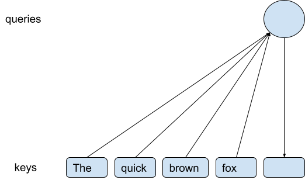

Each previous token publishes a *key* that is a vector that describes what that word is about. This was already done previously, so we are pulling these keys from what is called a KV cache (“key-value” cache - never mind what the values are). When we need to process a new token (looks like it is going to be “jumped”), we create a *query*, also a vector, that is compared to (dot-producted with) each of all the keys. Go read a proper introduction to transformers on the web if you want to know more of the details on transformer attention. The problem here is that this process corresponds to a matrix multiplication and, because we are processing only a single token, there is only a single query, which implies that the matrix multiplication has a dimension that isn’t just small, it is in fact equal to *one*. This leads to almost *no* utilization of the systolic array. So decode, if done naively, has very poor systolic array utilization, less than 1%.

Also, there can be many keys. Suppose you’ve been talking to your favorite AI for the past 2 years. If you are using an AI with what is called a long context window, and your AI is keeping track of your entire chat history, it might have to pull in as many as a million keys, just to compare each to one query vector - even if all that history is rarely relevant. This is going to require a lot of memory bandwidth, but meanwhile there is so little to do with the data that is read in from memory that the whole chip is just sitting there waiting for the memory to deliver a million keys. Worse, a transformer has multiple layers, e.g. 32 layers, so your poor AI might have to do all of this 32 times just to figure out that it should now say “jumped” as the next word. Then the *entire process* starts over from the beginning to figure out that the next word is going to be “over”. And so on, one token at a time.

Hold on, you might think. I heard somewhere that transformers use something called “batch”, i.e. a chip will process multiple conversations at the same time, and this is supposed to help with systolic array utilization. Unfortunately, batch is important for FF layers, especially during decode, but it doesn’t help much with attention, so that isn’t going to help us here. Batch might let you reuse some weights between conversations, but loading the weights isn’t the problem that we are looking at here for attention - loading the keys is, and different conversations have different keys, so there is no reuse of keys from that.

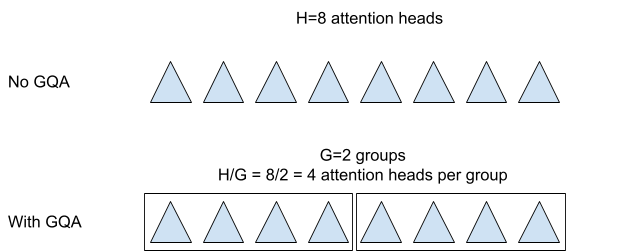

Maybe you heard that transformers use multiple attention heads. That means that this entire process doesn’t happen once per layer, it actually happens up to 128 times per layer, once for each separate attention head, each with separate key and query vectors that each reflect different properties of their tokens. By itself, this doesn’t help the situation of low efficiency at all. However, it can help a lot in combination with a technique called [Grouped Query Attention (GQA)](https://www.ibm.com/think/topics/grouped-query-attention). The idea in GQA is to reuse the same key vectors across several attention heads in G groups of size 128/G (assuming there are 128 attention heads). Each attention head has only a single query vector, but now that we’ve combined the heads into G groups of 128/G attention heads each, that use the same keys within each group, we suddenly have 128/G queries across the same keys. So this means that the matrix multiplication dimension that we are looking at increases from 1 to 128/G. This leads to much higher utilization of the systolic array. This has also reduced memory bandwidth consumption by a factor of 128/G, since we have G sets of keys to read instead of 128. On top of that, since we are now reusing the keys 128/G times, it becomes sensible to increase the size of the key (and query) vectors, to improve their quality (they contain more information), which it turns out corresponds to increasing the K dimension of the matrix multiplication, which you might recall from an earlier section is yet another thing that will increase systolic array utilization during attention. As long as we increase the size of the key vectors by less than a factor of 128/G, we’ve still gained a net benefit on memory bandwidth requirements. So GQA is a *very* important optimization.

We can do even better. It turns out that we don’t really need to do just 1 token at a time, due to a technique called [speculative decoding](https://developer.nvidia.com/blog/an-introduction-to-speculative-decoding-for-reducing-latency-in-ai-inference/). The idea is to make a cheap and informed *guess* about what the next few tokens are going to be, e.g. you might try to guess the next 3 tokens. In the case above, our guess about what comes next might be “jumped over the”. Since the model now has a guess about what the words are going to be, it can start processing what will come after “the”, even while it is also processing and making sure that “jumped”, “over” and “the” are actually what it wanted to say. This can all be done in a single step, so now we are processing 4 output tokens at a time instead of just 1. This improves key memory bandwidth requirements and systolic array utilization by an additional factor of 4. The guess in question might instead have been “jumped over pineapple”. In this case “pineapple” is wrong, which means that we wasted time processing “pineapple” and also we wasted time figuring out what the fourth token should be, since that calculation assumed that the previous token was going to be “pineapple”, but that turned out to be wrong. So we are taking a risk here. As long as the quick guesses are often correct, this is still a benefit for both memory bandwidth requirements and systolic array utilization.

Why exactly is speculative decoding a benefit? Well since we are now processing 4 tokens at a time, and we are using G groups of 128/G attention heads each (assuming there are 128 attention heads in total), we end up with a total of 4 * 128/G queries that look across the same keys. So we have improved memory consumption and systolic array utilization by an additional factor of 4 and a total factor of 4 * 128/G. If G is 8, then this is a total improvement of 64x.

The conclusion is that decode can still have poor systolic array utilization and that memory requirements can still be high, but decode is not nearly so bad as it seems at first sight because you can get this improvement by a factor of e.g. 64x by combining speculative decoding with GQA. If you have a 256 x 256 systolic array, you’d ideally get all the way to a factor of 256x, since we started at just 1, but such a large factor might not be available, so you can see how larger systolic arrays are harder to get good utilization from during attention and, especially, during attention decode.

Why don’t we pick G=1 to get a supremely fast decode (assuming there are 128 attention heads)? The trouble is that in this case there is only one set of keys per token, that all the attention heads have to share, and that isn’t very good for model quality. In other words, it tends to make the AI too much dumber, so that’s no good. Therefore we need enough G to preserve the AI’s intelligence but not so much that decode becomes too slow. This is a simplified description, but it gets the right idea.

Why not speculatively decode 16 tokens instead of just 4? That’s 4 times better, right? That is because the process by which we make these guesses is a very dumb AI that is much cheaper and faster to run than the proper AI - otherwise, the dumb AI would not be fast enough to be many tokens ahead. It is unlikely that it will be able to correctly guess so many tokens of what the much smarter proper AI is going to say. The dumb AI is going to blurt out “pineapple” (or something else wrong) long before we get to 16 tokens, and then the computation that we did for those tokens is wasted. So again there is a balance to be struck. Again, the full details here are highly complex (e.g. you can vary the number of speculated tokens depending on confidence in the guess), but this simplified view gives the right idea.

> Detail on systolic arrays for decode for nerds  There is a third optimization that might get you that last factor of 4 to get to 256 and therefore potentially 100% utilization of even a 256 x 256 systolic array. You can do this by decreasing the required N dimension - see the section on non-square systolic arrays. This is only relevant if you didn’t use the idea to have smaller systolic arrays for attention and you also aren’t memory bound.
So it seems that, with difficulty, we can probably get high utilization of a large systolic array also during decode. Many of these techniques also help memory bandwidth requirements. In general, anything that decreases the KV cache storage requirements have a similar effect on decode memory requirements, and there are *many* techniques that do this - too many to list here. The received wisdom in the field is that decode is highly memory bandwidth bound, even if you provision a lot of memory bandwidth, but the truth is that this may or may not be the case depending on how well you execute all of these optimizations. E.g. sparse/indexed attention can completely change this math - to the point that research into this may allow even SSD bandwidth to be enough for decode (!!!). The trouble is that if you do not control your customers’ software and models, then they may not be doing an optimal job here. So then you will need incredible amounts of memory bandwidth to keep them happy, which is what Nvidia GPUs and Google TPUs have and this is one of the reasons for it. So how much memory bandwidth you need to provision is a difficult question. It depends on the software.

You should be noticing a trend here - pretty much everything about how to provision an AI chip depends on the software and you can end up with answers that are 10x or 100x different depending on how well the software and the AI model itself is set up to run efficiently.

Unlike for storage, parallelization does not change decode memory bandwidth requirements for reading KV cache (unless you could then fit it all in SRAM). Parallelizing across C chips may require each chip to pull in only 1/C as many bytes from memory per token, but one hopes that this results in processing C times as many tokens in the same time, so then it cancels out to be neutral for required per-chip memory bandwidth since C * 1/C = 1.

If you are going to sell an AI chip, you have to make sure that all of these techniques work well with your hardware and that you have the right software to support your customers in doing this - otherwise your chip will be off by a factor of e.g. 64x compared to your competition. This description is highly simplified compared to the software that actually has to be written on this, and this is just one aspect of many aspects that you have to offer software support for so that people can use your AI hardware. The software side of an AI chip product is quite challenging.

> Agent multiplication for nerds  If you try using Grok’s AI assistant (note that Grok and Groq are completely different AI companies!), you may notice that it says “agents thinking”, plural, not “agent thinking”, singular. The idea is to have multiple chain-of-though agents that “see” (attend to) the keys for previous tokens and each other’s tokens. This is a further multiplier, in addition (multiplication) to speculative decode, GQA and non-square systolic arrays. With for example 4 such chains of thought, you get yet another 4x on key reuse for attention. You also gain a 4x on the batch that can be profitably applied to a single user.

Doesn’t agent multiplication only apply to parallel chain-of-thought, so we can’t say it’s a straight speedup, since we didn’t speed up the part where the AI sends you a response? That’s true, but big chains of thought are where you really need a lot of tokens, driving the need for much higher per-user token throughput than you’d otherwise need, so improving “just” that part is still a big deal.
> What about batch=1 for nerds  **Suppose you use 4x speculative decoding and 4x agent multiplication. That’s 16 batch for a single user. This might suggest that one would never need a batch=1 product. However, while these factors certainly make higher-batch products more attractive, I don’t think this completely eliminates the case for low batch.

Recall that Groq LPUs are for expensive low-latency tokens at low batch. The primary point of low token latency is to get high per-user token throughput. Now it appears that we’ve gotten that high per-user throughput anyway, or atleast 16x on that, without the overheads of batch=1 operation. So LPUs are useless? I’ve heard this argument brought up, but it isn’t quite right. If you have 16x batch for a single user, you can buy 16x as many LPUs and also get a 16x on per-user token throughput for LPUs. So LPUs are still ahead for expensive tokens at high per-user throughput.

This can still change the attractiveness of LPUs, though. For one, you now need to buy even more of them to harvest this benefit, and you already needed to buy many to run a model at all. Also, it is often the case that there is a certain rate of per-user token generation that is fast enough. A 16x on this has the potential to move a more economical approach into the fast enough range, at which point it becomes unnecessary to buy an LPU. Also, the economic efficiency of alternatives increases with higher per-user batch, since you don’t need as much bandwidth, so those expensive LPU tokens get relatively even more expensive this way.

These points also apply to on-device / embedded use cases, where people often cite the need for batch=1, since an embedded device tends to only have 1 user at a time. This is unlike a datacenter application that services many users simultaneously and can find batch that way. Given the techniques in this section, we can see that you might have more batch available than you think, also for embedded use-cases. Embedded is still probably low batch for text decode, but even just getting to batch=4 is much more efficient than batch=1.

Another point to keep in mind is that this is for text decode. For images, typically diffusion models are used, which have plenty of batch. I won’t explain diffusion models here, but you can look it up. There are also diffusion models for text, though they tend not to work quite as well. Still, if you find that you can use a text diffusion model, then that is another way to solve low-batch text decode woes.
### Prefill

Prefill does essentially the same thing as decode, except we are reading tokens that have been already written. So the AI is understanding text (or other data) that already exists (“(pre)filling the KV cache”), it isn’t generating the text. That’s important because that means we can process all the words in the text at the same time (up to the limit of the chip’s memory) instead of going one word by one word, so the picture becomes instead something like this:

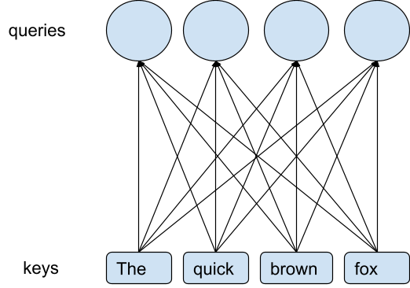

Here you can see that where before we had only one query vector to process, now we can process all the tokens at the same time, giving us as many query vectors as there are tokens. It’s much like speculative decode except we already know for sure what the next tokens will be, so there is nothing speculative about it. The input could be a whole webpage with thousands of tokens. So this dramatically improves memory bandwidth requirements, since every key that is read in from memory (or generated for the first time) is now being used potentially thousands of times every time we read it in. So we don’t have the big problem of too few query vectors that we had during decode.

Note that the same benefit of plenty of query vectors applies also to training, since training happens also on text (or other data) that is already generated. The problems with decode is an inference-specific thing.

We can still benefit from GQA during prefill. For prefill, GQA will not help with the N dimension of the matrix multiplication that we were most worried about for decode, since that dimension is already large enough (we have enough query vectors) to get full systolic array utilization in that dimension during prefill. GQA *does* help with memory bandwidth requirements also during prefill, since there will be fewer keys to read with GQA, but prefill is less likely to have a need for any improvement on memory bandwidth compared to decode, so this is less important for prefill than for decode. However, attention also has a K dimension, as mentioned in a previous section, and that dimension also needs to be large enough to fill the systolic array to get full utilization. This is where GQA can help the most during prefill. We mentioned in the section on decode that GQA is frequently combined with an increase in the width of the key and query vectors. This is another way of saying that we are increasing the vector width of the attention operation, i.e. we are directly increasing the K dimension, helping to get high (possibly 100%) utilization from systolic arrays during prefill attention. So GQA is important also for prefill.

### Decode-prefill (managed) aggregation vs disaggregation

**Default aggregation**  The default for decode and prefill is when you just do the obvious thing: do prefill and decode on the same chip using the same kernels. Mathematically, there is little difference between prefill and decode, they just have a dramatically different number for how many tokens are processed at once per conversation (e.g. 1-4 vs 256), so they can be combined and done simultaneously. In this way, the ratio of decode to prefill is variable and unmanaged - one chip might arbitrarily be doing mostly prefill while another does mostly decode.

**Disaggregation**  Decode-prefill *disaggregation* is when prefill and decode are done on separate chips. It could even be (but doesn’t have to be) different kinds of chips, since decode may require higher memory bandwidth. This requires transferring the KV cache from where it was prefilled to where it will be used for decode. The benefit of this is that it becomes possible to use software and even hardware that is specialized for just prefill or just decode.

Another issue that disaggregation can help with is that mixing prefill and decode can end up with the chip doing mostly prefill at times, since a prefill conversation/sequence can take much longer to process per step since it has many more tokens to process in one go. This can lead to increased token latency for decode, as the single decode token waits on potentially 1000s of prefill tokens to get done before it can run again. I’ve seen this cited as a benefit of disaggregation, though this would only really be a problem if the system that puts prefill and decode together in batches isn’t set up to intelligently take this into account when creating batches.

**Managed aggregation**  Decode-prefill *managed* aggregation is when you mix decode and prefill in a *managed* ratio. This is beneficial when decode is memory bound (i.e. waiting on memory) and prefill is compute-bound (i.e. waiting on systolic arrays). If you intentionally combine two such workloads together in the right ratio, you can arrive at a perfectly balanced scenario where both memory bandwidth and systolic arrays are fully utilized and neither is waiting on the other. This improves both latency (for prioritized tokens that go first) and throughput (for all tokens) compared to doing first just one and then just the other.

Managed aggregation is a term I just now made up, though in implementation this is very similar or even the same to something evidently called “chunked prefill”. The implication of managed aggregation is that you do not need as much memory bandwidth on your chip if you expect this technique to be used. It’s not just about preventing a chip from being swamped with prefill work.

**Reaching balance**  The overall ratio of decode to prefill might not reach perfect balance across your AI system, in which case it’s not possible for all chips to receive a perfectly balanced workload. However, managed aggregation can still avoid cases such as having one chip doing mostly prefill (unbalanced one way) while the chip next to it does mostly decode (unbalanced the other way). A company could set their pricing in a way that roughly achieves balance, at least for offline tokens (offline as in “you get the answer when you get it, not necessarily right now”) - many companies already price prefill (input tokens) at far lower prices than decode (output tokens). Also, if you have an infinite source of decode or prefill work that you generate yourself (automatically generated work could involve e.g. mining for inconsistent answers from your AI - e.g. answers should flip on question negation), you could use that to balance your system, doing more or less of either one depending on the balance at that moment. This also helps to ensure that your system is fully utilized at all times. Another option is to combine decode with training, in addition to prefill, since training also tends to be compute-bound (though not necessarily as much as prefill is). The important thing to keep in mind is that managed aggregation is beneficial even if it isn’t possible to reach perfect balance.

Managed aggregation leads to a minimum required ratio of prefill to decode to ensure that you are always compute bound instead of memory bound. You can make this ratio requirement more forgiving by also overlapping attention with FF - FF likely has some idle memory bandwidth that you can make available for attention by overlapping them. This works best if there are 2 or more cores per chip (for some reason called SMs on a GPU). If there is only 1 chip, and you try to multiplex attention and FF onto it simultaneously, then these two will compete for cache space which may not be a benefit in that case. To enable this overlap, you will either need pipelining with attention and FF in separate stages of the pipeline or a model change that makes attention and FF occur in parallel instead of one after the other. The latter technique also halves token latency.

A hybrid system is also possible - in this case your main server farm would be set up for near-perfect balance, but you also have a smaller set of prefill or decode-only chips (whichever you sometimes have more of) that handles unbalanced overflow.

If you built a chip that was intended for managed aggregation in this way, you could even provision it with less memory bandwidth than you’d otherwise need, lowering production cost. This is a bold (read: risky) move, since maybe not all your customers will be using managed aggregation, and if so they might see worse performance due to this choice. This is yet another example where the product that an unsophisticated customer needs is different and more expensive from what is right for a more sophisticated customer.

## Expensive HBM storage capacity

AI chips ship with large amounts of expensive RAM called HBM. Why is that? Is that really necessary? That’s the topic of this chapter.

### Weights and KV caches as reasons for large expensive HBM memories

HBM is a *very expensive* kind of RAM, i.e. computer memory. Estimates vary (companies won’t tell you what they pay for HBM), but HBM might be 3x as expensive per GB of storage compared to regular RAM. Regular RAM is already itself expensive in large quantities. HBM offers high bandwidth, and HBM is *not* so expensive in terms of $ per GB/s of bandwidth. It is a GB of HBM *storage capacity* that is very expensive. So you might think that AI chips would ship with small HBM memory capacities that still offer high bandwidth. Is that happening today? Not *at all*. Instead, the huge expensive HBM storage capacites on modern AI chips are getting larger and larger. Nvidia has announced that their Blackwell Ultra GPU will launch with an amazing 288 GB of *particularly* expensive HBM (namely HBM3e - the “e” doesn’t stand for “expensive”, but it’s fine to think of it that way^[[2]](#ftnt2)^). As a customer, you can maybe see how you could get excited about 288 GB of memory - until you remember that you’re the one paying for every GB of that.

If expensive HBM is so expensive, why do AI chips ship with so much of it? It’s mostly to store large KV caches and model weights. What is a KV cache?

In the previous sections on decode and prefill, we were looking at many key vectors. These key vectors are stored in a data structure called a KV cache, short for key-value cache. Never mind what the values are - a value vector is some vector, associated to each key vector, that is used for purposes that we won’t get into here. We will continue to focus on the *keys*.

Part of the trouble with the KV cache is, as we saw in the section on decode, that it can take a lot of memory bandwidth to inspect it (i.e. pull it into memory). Another related issue with the KV cache is that it can take a lot of memory capacity to store it. Why would that be?

The question is how many keys (and values) we have to store and how much space that will take up. Here is a formula for how much space a KV cache takes up, where each quantity in the formula is explained below.

2 * batch * layers * seq_length * attention_head_groups *

vector_width * element_size * idle_magnification * pipeline_factor

This will turn out to be potentially a *very large* amount of storage, driving the need for large expensive HBM memories.

**Value vectors x2**  The formula starts with a multiplication by 2 to account for value vectors. This is because there are as many value vectors as key vectors and value vectors take up the same amount of space as key vectors do (you can do GQA in a way so that this isn’t true, but normally it would be the case). I didn’t explain what value vectors are, and it doesn’t matter for our present purposes, but they do have to be stored, so we have to multiply by 2.

Well OK, I can explain value vectors a little bit: Value vectors are the data that keys are used to find. So if a KV cache were a phone book (which it isn’t), the key vectors would be people’s names and the value vectors would be phone numbers - a phone book is only useful if you have both. So a KV cache contains keyed (searchable) information (values) about past tokens.

**Layers L=32**  You might recall that a transformer has multiple layers L, e.g. L=32. Very large models can have significantly more layers than 32, e.g. ~100, but we’re going to go with 32 for this calculation. 32 layers is already not a small number of layers. Each layer has its own keys, so we need to multiply the number of keys by L=32.

**Sequence length N=1,000,000**  How far back can our AI remember? This is called the sequence length N or attention window length N. This can be as high as a million, so to understand the impact of what kv value storage can be, let’s say that N = 1,000,000.

Note that one may let some attention heads use a much smaller N, which is then called local attention. In this case, it is the average sequence length N that matters, not the maximum. People also at times use entirely different attention approaches for some or all of the attention, e.g. linear attention. In that case, the math ends up being different from the formula here.

**Batch B=64**  A batch of B means that that the AI is handling B independent conversations at the same time. Batch is required to get full utilization of the systolic arrays during decode for the FF layers of a transformer - we’ve been focusing on attention layers here instead of FF, but FF is also needed. For a 256 x 256 systolic array, you are going to want a batch of 256 to keep the systolic arrays busy during decode. However, if you are using speculative decoding with, say, 4 tokens (i.e. 3 tokens speculated), then you can reduce that to B=64, getting that factor of 4 from speculative decoding instead of batch. So we need to multiply the number of keys by e.g. B=64. Note that during prefill and training, we may not need to use any batch, or only very little, since, during prefill and training (but not decode), the sequence length can serve all the purposes that batch otherwise serves for FF layers. However, an AI assistant that does only prefill or only training will never do or say anything, i.e. it will output no tokens, so we need decode and therefore we need batch. Training and prefill may also need batch, but only if the sequence length is small.

**Attention head groups G=8**  How many attention heads are there? For a large model there can be e.g. 128. Without GQA, each head will have its own set of keys, so we would need to multiply by 128. However, with GQA, these heads are grouped into groups that share keys. There might be as few as 8 groups, so that we only need to multiply by G=8. So you can see how GQA is important also for reducing the storage required to store KV caches. GQA can be done so that the values are still distinct, leading to increased KV cache storage - for this calculation, we’ll assume that the values are shared within a group.

**Vector width W=128**  How wide is a key vector, i.e. how many elements (individual numbers in the vector) does it have? For a large model you might have W=128. Let’s go with that.

**Bytes S=1**  How many bytes S does it take to store *one* element (number) in a key vector? Many LLMs use 16 bit KV caches, since this is easiest, but let’s say that the creators and/or deployment team for our LLM put in the effort to get it down to 8 bits (as they *really* ought to do for anything serious). So that is S=1 byte per element (there are 8 bits in a byte). Using 4 bits is also possible, and there is research on using even fewer bits, but this can degrade model accuracy, i.e. make the AI dumber. It might be that the march of improvements to AI methods will eventually get us down to 4 bits here as an industry standard practice, but that isn’t true today. Though see the section on compression - this can help here.

**Idle magnification M=1.0**  Idle magnification (a term I just invented, I don’t know of a standard term for it) accounts for the fact that there could be many more conversations in expensive HBM memory than we are currently doing calculations with. So they are currently idle. This can happen e.g. when you are spending time reading the response from an AI assistant. During this time, the AI is waiting for your response. The conversation is not being processed during the wait, since nothing is happening. However, once you respond, you will prefer an immediate or at least a quick response from the AI. If the conversation and its KV cache is ready in memory, then the AI can pick up processing it quickly. If it is stored on an SSD somewhere, then it will take a bit of time to read it back into memory before the AI can get started on it, which slows things down. I’d recommend to get faster SSDs instead if this is a real problem, but storing idle conversations in HBM is a technique that an AI assistant might use. If only half the conversations in memory are currently being processed, that represents a KV cache idle magnification by a factor of M=2. We will assume M=1, so no magnification. To be clear, when your AI assistant waits for a minute before it responds, saying it is “thinking”, that isn’t likely due to reading KV caches into memory, which shouldn’t take that long - what it is doing is speaking to itself (generating tokens, i.e. decode) and looking at data like websites (prefill) to figure out how best to respond to your query.

You may also have an effective reduction in capacity due to fragmentation of the HBM. You can view this as also a kind of idle magnification, though it’s hard to put a specific number on that.

**Full pipelining P=1.0**  Full pipelining can multiply KV cache memory usage by up to 4x - see the section on parallelism. For this calculation, we will assume that this has not been done, but probably you should do that (it’s not good for KV cache storage requirements, but it’s great for compute utilization and network bandwidth requirements).

So how large is the KV cache with these numbers?

2 * B * L * N * G * W * S * M * P = 2 * 64 * 32 * 1,000,000 * 8 * 128 * 1 byte = 4,194 GB

That is *a lot* of expensive HBM! Large KV caches like this are a big driver of putting a lot of expensive HBM memory on AI chips. To be fair, a sequence length of N=1,000,000 is large, but this *is* a product that AI assistant companies provide, so this calculation is yielding a real number.

Recent Nvidia GPUs and Google TPUs have on the order of 100 to 200 GB of expensive HBM memory. They have so much expensive HBM memory in part due to needing to store large KV caches. However, we can see that we cannot store 4,194 GB in just 200 GB of memory, so how is this going to work? The answer is that LLMs are parallelized across many AI chips, and the KV cache is distributed across many chips, so it’s not about how much storage you can find on one chip, it’s about how much expensive HBM memory there is all together across many chips. You could distribute within the layers of a large LLM across e.g. 32 chips, in which case you need 4194 GB / 32 = 131 GB per chip for the KV cache. So you can see how you might end up needing 200 GB of expensive HBM per chip. This is a simplified view, but overall this gives the right idea.

What about weights, don’t LLMs have a lot of weights, so presumably this requires a lot of storage, too? It does, but if there are 1000 GB of weights, you can distribute that across all the chips, so if you parallelize by 32 within layers and pipeline parallelize across all of 32 layers, then you are using 32*32=1024 chips. If you distribute 1000 GB of weights across 1024 chips, then you only need to store 1 GB of weights per chip. So that’s not much. Weight storage becomes a problem if you aren’t parallelizing very much, but not otherwise. Note that KV cache storage is improved by parallelizing within layers but *not* by parallelizing between layers (pipelining). In contrast, weight storage requirements are reduced by both kinds of parallelism. See the chapter on parallelization for more detail on how parallelization changes the per chip requirements for KV cache and weight storage.

### Reducing the need for large memories on AI chips

The previous section arrived at the need for large HBM memories on AI inference chips due to needing to store large KV caches and, also, due to needing to store large weight matrices for large LLMs.

Something that I want to complain about here is that we are using N=1,000,000 for this calculation. AI assistants with such a long attention window is a real product that is being sold, so it needs to be supported, but couldn’t this be done in some more economical way? There are in fact *many* ways to resolve this problem with minimum loss of model accuracy, by turning attention into retrieval - here is [one paper for that](https://openreview.net/forum?id%3D49v8meXjHS), you can find others. I also [posted on LinkedIn](https://www.linkedin.com/posts/bjarkeroune_experts-respond-why-on-earth-do-we-not-do-activity-7413022260388802560-npP3/) about this. Ultimately I believe that we need solutions that may involve dense attention for the recent past, e.g. the past 1024 tokens, but then turns to sparse retrieval for the rest of attention history, which can then be stored on an attached SSD or perhaps even further away out in the datacenter. In this way you can reduce memory requirements from N=1,000,000 to N=1,000, an improvement by a factor of 1000. You still need to buy a large SSD, but SSDs are much less expensive than HBM per GB. So we go from 4,194 GB to 4 GB by reducing to N=1000. There are other ways of optimizing KV caches, so if you apply such ideas, too, then you can get even smaller KV caches than that, and this is *before* distributing the KV cache via within-layer parallelism. So why isn’t this happening?

Well why do I think this isn’t happening? Wouldn’t companies use these ideas of sparse retrieval for attention? Perhaps some are, but the fact is that recent Nvidia GPUs and Google TPUs are being sold with extremely large HBMs and the story is that this is to store large KV caches. So I think that the AI industry is causing the current world-wide ram shortage unnecessarily. We don’t really need all that expensive HBM after all.

If you are an AI chip startup, this seems like a relevant topic to figure out. My strong suspicion is that you can do a 32 bit chip that just has 4 GB of memory (32 bit pointers can address 2^32 B = 4 GB values), instead of the 100-300 GB that Google and Nvidia are currently selling, and if you get the software exactly right and parallelize massively then your cheap chip will be just as capable as these super expensive industry leading chips. “All you need to do” is to use per-layer retrieval for attention (past recent history) and to parallelize enough so that you can store the weights of a very large LLM in a distributed way. Current-gen HBM cannot be bought in such small quantities per stack as 4 GB (at least it looks this way from public sources, though if you ask maybe it’s possible). Once you take interposer and other costs into account, HBM is not necessarily the most economical memory technology on a GB/s per dollar basis (!), so this isn’t necessarily such a problem as you might think. Though moving away from HBM is likely going to be a better fit for smaller chips in a fast on-mb network, which will require greater discipline of per-chip cost minimization.

I do see two problems here. The first problem is that this way the minimum number of chips you need to have in order to load a big model is going to be large. A 1 TB model (which is a huge model) is going to require parallelization across *at least* 256 chips in order to run if they only have 4 GB of memory each. You can see how that’s inconvenient, especially if each of those 256 chips is expensive individually (though if you follow my ideas, they won’t be). But a 1 TB model is very large and you’ll want to parallelize within layers for speed (token latency) in any case. For serious purposes of e.g. prominent AI assistants, having a large minimum parallelization requirement is not such a big deal, since prominent AI assistants require a lot of throughput anyway, leading to a large installation regardless. You can of course go with 16 GB or 32 GB per chip instead of my extreme 4 GB - I’m putting the idea to its limit to highlight what is possible.

There is also a second problem. Above, I silently assumed that it is *me, or someone like me,* who is writing the software and deploying the model and ensuring that an SSD is used and setting everything up so that, [just precisely, everything works out](https://www.youtube.com/shorts/t4yoLNZJR6k) even with small amounts of HBM. Customers who are highly sophisticated about deploying an LLM may be able to do that for themselves. However, it is quite likely that *many* of your customers will *not* be highly sophisticated about deploying AI models, but they might still be willing to pay you many millions of dollars to buy your chips. So you end up doing very expensive things with your hardware to serve customers that wouldn’t really need all that expense if they were doing things more efficiently in software, *but they aren’t going to do things more efficiently in software, so it doesn’t matter how it would be if they did*. I suspect that this is the real explanation of the huge expensive HBMs on recent Google TPUs and Nvidia GPUs. I suspect it’s an effort to make things easier for less sophisticated customers (internal or external), even though it isn’t completely necessary. And I think this is in turn happening in part because of the high profit margins on these products. It doesn’t make that much of a difference to the bottom line to make a high-profit AI chip more expensive to produce, but it does in that case make a difference to acquire more customers.

So you can see that there might be an opportunity for a chip company that is more hands-on in helping their customers to arrive at efficient solutions in a standardized way that they can roll out across all of their customers. There may also be an opportunity for a chip startup to pivot into directly providing AI assistant services at low prices, where they can be their own customer for their own chips and drive down costs using their own excellent software. This seems to be the strategy that Groq is pursuing with their LPU chips (at least the use-their-own-hardware part). Both roads seem difficult, but I think interesting.

An objection here might be that while HBM is very expensive, the chips that Google and Nvidia are selling/renting out cost a king’s ransom as well. Very, *very* expensive. So if HBM would be e.g. 20% of the cost that leads to whatever the poor^[[3]](#ftnt3)^ customer paid (this is a guess - expensive HBM prices paid by large companies are not public, though I’ve seen estimates as high as expensive HBM being 50% of the cost), then it might not make much sense to make a less convenient product with less HBM to save just 20% on production costs. So maybe the HBM cost isn’t that important and not a place to focus currently?

I think that this kind of argument can often be in error in a non-obvious way. Why? Because I believe that you will find this kind of bloat in many places in these products, so that if you remove it all at the same time, the impact is far greater than a measly 20%, but if you remove each type of bloat individually, it will look like it is “only” 20%. And this is how all the bloat stays where it is - you can’t decide to remove one kind of bloat because it gets justified as being only a smallish percent (like 20%) of all the other bloat that you also can’t decide to remove *for the same reason*. Bloat protects bloat. For example, why do TPUs (or GPUs) need a host, a separate computer into which you connect the TPU/GPU. Why don’t TPUs just have some on-chip CPU cores ([Google already makes excellent CPUs](https://cloud.google.com/products/axion)) and then the TPU *is* the computer. I happen to know that these host computers are pretty expensive. But perhaps the host is only 10% (I don’t know the number) of the overall cost, so why change it? And so on.

I suspect that Google could make great inroads in the AI hardware market in a year or two by getting extreme and creative with lowering their TCO (total cost of ownership) at a realized tokens per dollar basis, while offering excellent software, and then also lowering their prices. I don’t think they will do this, [in part because they don’t have to](https://www.datacenterdynamics.com/en/news/google-says-tpu-demand-is-outstripping-supply-claims-8yr-old-hardware-iterations-have-100-utilization/), and I definitely don’t think Nvidia will, either, so that leaves opportunities in the market for other players to become the biggest company in the world instead of Nvidia.

> Per chip performance matters for HBM economics for nerds  Something to be aware of here is that you should not compare HBM capacities directly between two chips to understand cost effectiveness of HBM, instead you should compare something like the ratio of per-chip HBM capacity to the per-chip realized performance. To see why this is, suppose you made a chip that is half as fast as Blackwell and also it has half as much HBM. Did you improve the economics of the HBM memory in this case? No, not at all, it’s exactly the same, because you’ll need to buy twice as many chips to get something equivalent to a Blackwell, so you ended up buying exactly as much HBM as for Blackwell to get a comparable system. The same is true for other capacities on a chip than HBM. This factor is likely one of the forces leading to ever-larger chips that we see in AI accelerators. Though, in the other direction, if you start having multiple separate memory interfaces that make your memory spaces highly non-uniform, then you’ve essentially taken separate independent components and simply labeled them as one thing, but the label doesn’t change the math of what you did, though you may have a fast enough network on there that it isn’t *just* a label - in this case the math of the actual economic impact of this arrangement becomes complex to evaluate.
> Cautionary tale: The attitude that cost a trillion dollars  Back when I worked at Google on TPUs, in the TPU v1-v4 era, there existed a subtly strange situation in the company the entire time from what I was able to read between the lines over the years. From the outside, it might appear that Google was prescient in developing TPUs as a reasonably well funded effort so early as they did. Yet, on the other hand, there was internally a subtle yet clear and ever-present sense of what I’m going to describe as “neglect by unambitiousness and non-shareholder-aligned interests.” I cannot know if that persisted after I left the company, but my impression looking in from the outside is that it did.

What happened with TPUs is not so much leadership that asked for the moon and received what they asked for. In fact, it was not like that at all. TPUv1 was motivated by “if Google will ever speak to you, as an assistant or otherwise, it’s going to be too expensive to run the speech synthesis on current hardware, so let’s do something to make it less expensive for us.” TPUv1 was not rolled out widely within Google, though it did succeed significantly beyond its originally intended aims. TPUv2 was intended to deliver on precisely two internal training applications having to do with search and ads, respectively, and there was *explicitly *no ambition for anything beyond that. Once TPUs ended up becoming available for general internal use anyway, there was *explicitly* no ambition for making it available to anyone outside Google in Cloud or in any other way. Once it got into Google Cloud anyway much later, the effort for this was very small and with an unbelievably poor result if you care about Google shareholder interests - there was no ambition to make TPUs a drop-in replacement for GPUs, there was only the will to make TPUs available at all, and the investment into that effort itself was very meager. I didn’t look too closely, but it appeared to be handled overall by one person who seemed personally capable but also seemed tasked with “just get it working somehow” (that’s not a quote, it’s just my impression). I got the sense that this was something that someone somewhere decided to have happen, but not really something the company overall cared for, so it was made to happen, but not well. The result was that the way you start and run a TPU in Cloud was *different* from how you do it with a GPU, so even though XLA itself made it often possible to switch between GPU and TPU by simply changing one line that says “GPU” to instead say “TPU”, it was a somewhat more involved story for a customer to make that happen in Google Cloud, requiring more changes at a technical level. An unforced error that is hard to explain. That’s not what you would have done if you wanted to sell TPUs in Cloud *in earnest*. Since Google wasn’t selling TPUs, Google Cloud was the only way for external customers to access them.

Meanwhile, it is obvious today that Google was sitting on a trillion dollar gold mine (and may still be), and this is also what I believed back then, which was very strange for me at the time. Google as a company viewed TPUs as a way to save some money internally on AI hardware, which was a success, but Google has *never* been “all steam ahead” on making money from TPUs and I don’t see that it is today, either. There presumably is a reason for that, but I don’t know what it could reasonably be. It certainly was never explained to me when I worked there. If TPUs will not be a big part of the future of Google’s profit, it’s because Google chose that outcome as a management decision. Nvidia is the top company in the world by market cap and that could easily have been Google up there if there had simply been the will for that, I believe.

So how come Google is making a fair bit of money from TPUs these days despite all this? Google hires strong engineers and, as far as I can explain from where I was in the company, what happened with TPUs is that the bottom level of the company delivered beyond expectations for an extended period, leading Google to have a success on their hands that was never expected nor requested. Google never wanted to be an AI hardware company, it primarily wanted to minimize its own expenses on AI hardware, so what do you do in a company like that if you suddenly are sitting on potentially the most profitable project in human history? (Nvidia is the #1 company in the world by market cap, so this potential was/is factual) Evidently, you handle it with lukewarm enthusiasm - that’s what it was and, it appears to me from the outside, still is.

I once pressed a very high up manager on this, in my (rather long) reporting chain, asking why we weren’t all steam ahead on TPUs the way Nvidia was for GPUs. The initial response was “but that’s Nvidia’s main product”, I said “yes, that’s what I mean” (I could have found a better response here, I didn’t mean that Google should abandon search as our main product, although in hindsight that might have made more money for shareholders) and then I got a surprising response delivered in a *highly hostile manner*: **“are you for real with this question?”** shutting down the conversation. That’s verbatim - I will never forget that sentence. This reinforced my impression that the unambitious approach didn’t originate from my close-by reporting chain, but rather somewhere much higher up.

I was a very prominent software engineer on TPUs, I led TPUv3 software at Google and was closely involved in TPU hardware/software co-design for an extended period, yet I was *never once* asked a single question that had to do with how to be more ambitious with TPUs. I also was never once presented with any kind of statement along the lines of “if you/someone/the team can deliver X, then maybe we will do more with TPUs,” it was always just “no, we’re not doing more with TPUs.” The ambition and desire to make real money from TPUs just wasn’t there when I was there. Looking in from the outside now, I still don’t see it.

This is in contrast to Nvidia - *they* are full steam ahead. I know because I also worked at Nvidia for a time. Google doesn’t appear to be - which is wonderful news for you if you are looking to make a competing AI chip. I was never a Google director or vice president and I was not in those kinds of meetings, so I can’t say for sure what happened in those meetings, I can only report what things seemed like to me from the bottom.

I still find all this unfortunate because I believe that Google’s unambitiousness on this wasn’t only bad for Google shareholders but also bad for humanity. We need affordable and high quality AI and that has to start with AI hardware that has much better economics than what is available in the market today. Therefore, we need full-steam-ahead competition to Nvidia that Google doesn’t appear to want to provide. Other companies will need to pick up the slack and indeed there are many AI hardware companies by now. I hope to have helped with aiding that competition by writing this document to the benefit of the public.

I reached out to press@google.com for any comments they may have on this cautionary tale in particular. The automated response I got said: “If you are not a member of the press or a Google employee, you should not expect to receive a response beyond this email,” which, indeed, I haven’t.
## Parallelization of an AI assistant

This chapter gives some big picture ideas for how to parallelize an AI assistant (i.e. an LLM). This section is already somewhat complicated, and I can assure you that actually implementing these ideas at high performance is more complex than what this section makes it seem like.

If you are just looking for some light reading, you may prefer to skip straight to the co-design chapter - that one is much lighter reading that this section and the next one on AI chip networks.

To be clear, “parallelization” refers to distributing the calculations of an LLM across multiple chips and/or multiple cores within a chip. So if you have two chips, ideally things should go twice as fast. That’s parallelization. Parallelization is the reason why per-chip performance is irrelevant on its own, despite much (most?) AI chip advertising focusing entirely on this irrelevant metric. What matters is what your system can deliver at what price, not what an individual chip can deliver.

For an AI chip startup, it is critical to understand the precise impact of parallelization, which in my opinion is a highly tricky and *unintuitive* subject. Here are three facts about AI parallelism:

1. Network bandwidth is a limit on within-layer parallelization. This is why AI inference needs a fast network. Between-layers parallelization does not require nearly as much network bandwidth.
2. If you double the network bandwidth, then you may be able to do twice as much within-layer parallelization, which can as much as halve token latency. So if you have a problem with high token latency for your AI chip, as you might have if your chip requires high batch due to using large systolic arrays, then you can improve that by increasing the network bandwidth. So large systolic arrays are a force for faster networking.
3. Between-layers parallelization, i.e. pipelining, helps with weight storage requirements, but it *doesn’t* help with KV cache storage requirements. By contrast, within-layer parallelization *does* help with KV cache storage requirements, which, again, is in part limited by network bandwidth. So if you double network bw, you might be able to roughly halve per-chip HBM storage requirements if you’ve already parallellized enough to make weight storage negligible. So network bandwidth is related to how much HBM you need.

If you use Mixture-of-Experts, as is commonly done, then all this becomes even more complex. MoE is half-way a kind of within-layer parallelism, but it uses the network differently.

Another fact is that if you double the speed of your chip, then you also need a twice as fast network to keep up. That’s both obvious and intuitive, but it’s important to keep in mind.

In this chapter, I explain, among other things, why the above 3 facts are true. They are true for non-obvious reasons. I personally find these 3 facts highly surprising. If you didn’t already know these 3 facts, and you are involved in making or buying AI chips, then I suggest paying close attention to this section. Whatever calculations you make that involve parallelization, I suggest to double, triple, quadruple check that you actually understood the topic correctly. Otherwise your math will be meaningless. *Many* highly intelligent people have gotten this wrong - you wouldn’t be the first. For example, initial TPU networking was grossly overprovisioned due to getting parallelization wrong.

You can’t dimension the HBM or network bandwidth or consider the token latency without understanding parallelism, so it’s not optional to get into in detail when designing an AI chip. That is why this section is rather long and gets into quite a few details.

### Parallelization concepts

There are a variety of concepts related to parallelization. These concepts make it possible to understand the pros and cons of various parallelization methods. It’s a bit of a list, but the effect of parallelization will not be clear without these concepts, so here’s the list:

**Throughput (tokens per second)** This is the most obvious benefit of parallelization. Throughput for an LLM can be measured in tokens per second. If one chip can generate 1000 tokens per second, then two chips can generate 2000 tokens per second.

### First token latency (seconds to first token)

First token latency is the time it takes an AI to generate the first token after it starts to consider your request. First token latency can be high because the AI might have to retrieve data from disk in order to remember what the conversation is about, it might need to silently (i.e. in a way that you can’t see) talk to itself (“think”) at length, and read many web sites and other data, to figure out how it wants to respond. The AI can’t start talking to you until it knows roughly what it wants to say. So when you wait while the AI is “thinking” before saying anything, that’s first token latency. First token latency is not a parallelization-specific concept, but it can easily be confused with token latency, which is an important concept in parallelization, so I’ve defined it here separately just so I can say that this is NOT what “token latency” is.

**Token latency (ms per token)**  Token latency is the time (latency) it takes to generate one token in a steady state. It’s not to be confused with first token latency, since the first token can take much longer than other tokens. So if your AI’s response to you starts going, and then you get words one at a time pretty slowly, e.g. one token per second, that’s high token latency.

Token latency and throughput are not so closely related as it might seem. If throughput is 1000 tokens per second, then I can expect to get a 1000 token response in a second, right? No, that’s not how it works *at all*. The reason it doesn’t work that way is that throughput is counted across conversations, so if there are 1000 conversations going on simultaneously, with 1000 different customers waiting for the AI to get done responding, then they might each be receiving 1 token per second. That is still 1000 tokens per second from the AI, even if you personally don’t receive tokens that quickly.

Well, that makes sense, but what if I get all the other users to stop using the AI, so it’s just me, *then* I can get 1000 tokens per second if the throughput is rated at 1000 tokens per second, right? That sounds like it makes sense, but it’s still wrong. The AI might only be able to generate 1000 tokens per second if they are all from independent conversations. You are only offering one conversation, so you will in this case not likely be able to receive the full throughput within that one conversation. In fact your token latency might be the same regardless.

What if token latency is 1 ms (1/1000 second), then surely throughput must be 1000 tokens per second. Right? Not quite right. Throughput will be *at least *1000 tokens per second if token latency is 1 ms, but it could be much higher. Token latency is still 1 ms regardless of whether the AI generates 1 token per 1 ms or 2 tokens (from unrelated conversations) per 1 ms. In the latter case throughput is 2000 tokens per second, not 1000 tokens per second.

The conclusion here is that latency and throughput are individually simple concepts, but it can be difficult to get used to the idea that the two are not related in any simple way in general. It is not the case that higher throughput necessarily leads to lower latency or that lower latency necessarily leads to higher throughput. In fact it is often the opposite.

I may have just now given you a frustration that you may not have had until now: being frustrated with material that talks about one out of throughput and token latency, but not the other one. This makes the numbers meaningless since you cannot possibly know whether a system is both economical (throughput) and useful (token latency) without knowing something about both. The sad thing is that almost ALL material talks about only one of these and not the other. So welcome to this frustration, now that you know. You’re welcome.

**Variability**  Overall throughput and latency are *averages*. So a given token may take much more time or much less time than another one. In general, variability is highly undesirable when doing parallelism but it cannot always be avoided. Mixture-of-Experts is a prime cause of variability.

**Storage**  Storage may not seem like it would be closely tied to parallelism, but it turns out that it is a very important concept in AI Transformer parallelism because parallelism can dramatically increase or decrease per-chip storage requirements, depending on how it is done. In later sections in this chapter, we will going into the details on the effect of parallelism on the requirements for expensive HBM memory storage.

**Local vs global requirements**  In parallelism, it makes a big difference whether a number is local (per-chip) or global (overall sum). E.g. a 1 TB model requires 1 TB of expensive HBM to store. If your chip only has 100 GB of expensive HBM storage, then you can’t run the model. Right? No, because this confuses local (per-chip) and global (overall sum) capacity. The local per-chip number is 100 GB capacity of expensive HBM, but if you have 20 chips, then the global capacity of expensive HBM is 20 * 100 GB = 2 TB. You bought 2 TB of expensive HBM overall and so therefore you can fit a 1 TB model in there via parallelism.

**Minimum installation size**  The minimum installation is the number of chips and other infrastructure that you must have before your AI can function. We just discussed a notion of fitting a 1 TB model across 20 chips when it doesn’t fit on a single chip. This means that we must always have 20 chips, otherwise we cannot run the model, so the minimum installation is 20 chips (or somewhere between 10 and 20, depending on expensive HBM requirements for other things than weights). You still need 20 chips even if 20 chips generate a throughput that is far in excess of what you need. So large minimum installation sizes are inconvenient.

**Reliability**  Computers sometimes fail. Cables disconnect, fans stop turning, chips melt, many things can happen. If your AI parallelization scheme involves 1024 chips working together, then it may be that if just one of those chips fail, then your whole AI will not function and the capacity of the other 1023 chips is wasted until that one chip is identified and fixed or replaced. So parallelization magnifies failure rates by in this case a factor of 1000.

In early TPUs we had this exact problem: TPUs can function together in pods of 1024 chips, but the cables connecting them would sometimes fail, leaving the entire pod unusable until a human employee in the datacenter would walk over and identify and replace the failing cable. An individual cable would rarely fail, but among 1000s of them, needed to connect all these chips in any given pod together, it would not be so rare for *one* of them to fail. We couldn’t change the failure rate of the cables, so instead [Sameer Kumar](https://www.linkedin.com/in/sameermanepalli/) changed the parallelization software so that it still functioned well even with a few failed/unusable/missing cables. This was pretty tricky given the torus network topology that TPU pods use. The cost of this solution was to halve the effective network bandwidth of the torus, but the bandwidth of the TPUv3 torus network was overprovisioned in the first place - this is an example where overprovisioning, even unintentional overprovisioning, leads to flexibility in resolving issues that were not predicted when a chip was designed.

**Failure domain**  The failure domain of a component is the subset of a system that will cease to function if the component fails. So if a pod of 1024 TPUs stops working if a single cable breaks, then the failure domain of that cable includes all those 1024 chips. So the way that parallelization tends to increase failure rates is that it increases the size of the failure domain. If two chips are collaborating somehow, there is the potential that one of them being broken will affect the work of the other one. Minimum installation sizes tend to also be minimum failure domains, since if 20 chips are required, then the system cannot function if any of them break.

### Parallelization using duplication

The simplest way to parallelize an LLM is to have several separate instances that each handle a subset of the conversations that the assistant engages in. This is the simplest kind of parallelization to implement in software, but even this isn’t so trivial. For example, if all the customers assigned to one instance of the system start speaking to the AI at the same time, it may be necessary to load balance by quickly moving some of those conversations from one instance of the system to another one.

Here is the effect of having D duplicate instances of your system:

### Duplication by D

Throughput: Multiplied by D

Latency: No effect

Expensive HBM per chip: No effect

Reliability: Improved (if one instance fails, the others are still available)

Network bandwidth: Little change - but may need to be able to move KV caches quickly

Systolic array utilization: Unchanged (can still be 100%)

Duplication may have a negative effect on first token latency and variability if the KV cache of your conversation has to be moved from one instance to another one because the instance holding your KV cache was overloaded.

Duplication is the only form of parallelism that we will discuss that improves reliability.

### Between layers parallelization of decode using pipelining

If you have e.g. 32 layers in your model, then you can distribute those layers across 32 chips. To see how this works, this is an (extremely) simplified view of the structure of a transformer:

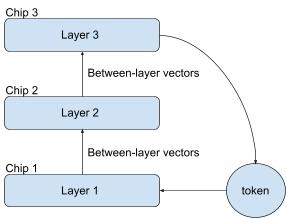

Here each transformer layer consists of an attention and an FF (sub)layer. Each layer has been placed on its own chip and the chips can exchange vectors over some kind of network. The output of layer 1 is a batch of vectors (activations) that are the input of layer 2. So layer 2 cannot get started until layer 1 is done. This is a challenge for parallelization, since this would mean that chips 1 and 3 are idle while chip 2 processes layer 2. The solution to this problem is pipelining. How this works exactly depends on whether we are doing training, prefill or decode. We’ll discuss decode in this section and look at prefill in the next section.

For decode, the objective is for layer 3 to figure out what the next token will be (or next few tokens if using speculative decode). Suppose we have 3 batches (sets) of conversations X1, X2 and X3 that we need to process (respond to / produce output tokens for).

This is the sequence of events of what occurs during decode with pipelining:

1. Chip 1 processes X1.
2. Chip 1 processes X2, Chip 2 processes X1.
3. Chip 1 processes X3, Chip 2 processes X2, Chip 3 processes X1
4. Chip 1 processes X1, Chip 2 processes X3, Chip 3 processes X2
5. Chip 1 processes X2, Chip 2 processes X1, Chip 3 processes X3
6. Chip 1 processes X3, Chip 2 processes X2, Chip 3 processes X1
7. ...

As you can see, all the chips end up being busy all at the same time. This is because we have three sets of independent conversations for the layers to process, so Chip 1 can process Layer 1 for one set of conversations while Chip 2 processes Layer 2 for another set of conversations and so on. The conversations will then flow in a circle through the layers, where the circle is closed at the final layer (Layer 3 in this diagram), where the next token is decided and then communicated back to the first layer (Layer 1) for it to start the process anew on the next token. This kind of parallelization solution where independent elements are processed at different stages simultaneously is called pipelining.

So if there were 32 layers, we would be parallelizing across 32 chips. Suppose we only have 4 chips. We can still pipeline, we just put 8 layers on each chip, creating a 4 stage pipeline to run on the 4 chips. In general, an S stage pipeline involves S chips and multiplies the throughout by S, assuming all the layers take the same amount of time to process.

The most obvious effect of pipelining across S chips in this way is to multiply throughput by S. Pipelining in this way does nothing to reduce token latency, since each individual conversation/token is only ever processed by one chip at a time. In fact, compared to using 1 chip by itself, we now have to spend time to transfer the data between chips at every stage, which will somewhat *increase* latency and reduce throughput.

Recall that parallelization using duplication gave a straight throughput increase without an increase in latency, which is better than what we are seeing here for pipelining. So why would one ever use pipelining? Pipelining has the strong benefit of reducing weight storage requirements, so that we do not need to buy as much expensive HBM. A given chip/stage only has to store the weights for its own layer(s), so if there is e.g. one layer per chip, that chip only has to store the weights of that one layer. So if there are 32 layers, we can reduce weight storage requirements *per chip* by a factor of 32 by using pipelining. Duplication does not have this important benefit.

How about KV cache storage requirements? It turns out that pipelining does nothing to reduce the weight storage requirements for KV cache. The reason for this is non-obvious. At first sight, it seems as if it should help. Each layer has its own keys, so, as for weights, wouldn’t it be true that the chip that does a given layer only has to store the keys for that layer? Yes, that is in fact true. So then haven’t we reduced the storage requirements for the KV cache *per chip* by a factor of 32, like we did for weights, if there are 32 layers? No, it doesn’t work out that way. Recall that every layer is doing separate batches of conversations. So due to pipelining we have 32 times as many batches being processed at any given time. A given conversation is going to come around the circle and back again to the same layer to produce also the token after this one (unless that was the last token), so you need to keep all the conversations in the KV cache, even the ones *currently* being processed by other layers. So we have reduced storage requirements per chip *per conversation* by 32x, yes, but we also need to process 32x as many conversations across the pipeline at any given time to keep all the chips busy (get high utilization). These two factors of 32 cancel each other out, so in the end pipelining doesn’t make any difference for KV cache storage.

Let’s look more closely at the problem of the network transfers between the chips. After processing a batch of conversations, every chip has to transfer its output to the next chip in the circle (which loops around to the first layer, via a token, at the final layer). No chip can start processing on the next batch until it has received the next batch. This means that all the chips are idle while the network transfers the data between them, and this happens every time the pipeline moves on to the next stage. This can be a long time or a short time depending on how much time it takes a chip to process a layer versus how long it takes the network to transfer the data that is the output of that layer. One solution is to accept that there will be a wait and to ensure that the network is so fast that the wait will be short. This way utilization of the systolic arrays will always be lower than 100% since we are leaving them idle during the transfers, but it might not be that much lower than 100% if you have a really fast network.

Another solution that enables 100% systolic array utilization is to double the number of pipeline stages to hide the transfer time. The way this works is that we introduce twice as many batches of conversation into the pipeline. One half of conversations are being processed by the chips, while the other half are having their data transferred over the network. At every step of the pipeline, the two halves swap places. Assuming that the network is fast enough to transfer the data in the time it takes to process an entire layer (which it should be), then the transfer will be done before the next chip is done processing its layer, which means whenever any chip is done processing a layer, it will be able to immediately start processing an input that has already been transferred to it. So none of the chips ever wait on network transfers (assuming a network transfer can process concurrently without bothering the systolic array). This does lead to lower than 100% utilization of the network, unless network bandwidth and systolic array throughput have been perfectly balanced (I wouldn’t do that - better to overprovision the network a bit).

This modified pipelining approach, that we might call full pipelining, ensures that we get a full throughput speed-up of S if we use S chips. It also *doubles* token latency. Why would that be? A given conversation now has to go through twice as many steps, and all the steps take the same amount of time as a layer, so it’s going to take twice as long to produce a token. Kv cache requirements have also doubled, since we doubled the number of conversations to store KV caches for. Weight storage is unchanged, since it doesn’t depend on the number of stages in the pipeline. A more subtle but very important thing that we have achieved is that the network now doesn’t have to be anywhere near as fast as before, since we are not waiting on it any longer. It just has to be able to complete its transfer in the (significant) time it takes to do a layer - if that is true, then it causes no slowdown at all. For this reason, when using full pipelining, the network connection between layers doesn’t have to be as fast as one might think.

To sum up, the benefit of between-layers pipelining is to greatly reduce weight storage requirements. This comes at either the cost of needing a very fast network and a small drop in throughput if we use partial pipelining or the cost will be a doubling of latency and KV cache storage requirements if we use full pipelining (but network requirements are less).

How bad is a doubling of latency? Different applications have different latency requirements. Sometimes it’s irrelevant because the customer just needs an answer sometime, could be tomorrow. For an AI assistant with a person on the other end waiting, token latency should be low, but if it is already so fast as, say, 100 tokens per second, then 50 tokens per second isn’t much worse - it’s a faster speed than people can read. It’s fast enough already. Though if you are using a reasoning model, that silently speaks to itself (“thinks”), and thus needs to generate *many* tokens that the user never sees, then perhaps token latency is more of a concern even at fast speeds and so you may (or may not) prefer to avoid full pipelining.

How bad is a doubling of KV cache storage? Well it depends on how large the KV cache is *per chip* and how much expensive HBM storage capacity you have per chip. If you are doing something reasonable with your KV cache, like using retrieval for ancient (past 1000 token) history, then a doubling might not matter at all.

Note that you can pipeline e.g. only every 4th layer instead of every layer. This means it takes 4 times as long until you have to transmit the same amount of data over the network that you otherwise had to transmit between every layer. So this drops bandwidth requirements by a factor of 4 compared to pipelining every layer. It also reduces the increase in the KV cache storage requirements, as you now have an extra network transfer pipeline stage between every 4th layer, instead of between every layer.

### Decode partial pipeline by S

Throughput: Multiplied by a bit less than S (how much less depends on network bw and latency)

Token latency: Increased, depending on network bandwidth (and latency)

Expensive HBM per chip: Divide weight storage by S, KV cache storage unchanged

Reliability: Worse. Multiply failure domain by S.

Network bandwidth: Critically important - on the critical path

Systolic array utilization: Reduced (can never reach 100%)

### Decode full pipeline by S

Throughput: Multiplied by S (assuming reasonable network bandwidth)

Token latency: Doubled (assuming reasonable network bandwidth, otherwise more)

Expensive HBM per chip: Divide weight storage by S, KV cache storage doubled

Reliability: Worse. Multiply failure domain by S.

Network bandwidth: Has no effect, as long as fast enough

Systolic array utilization: Unchanged (can still be 100%)

This was for decode. The next section concerns pipelining of prefill.

### Between layers parallelization of prefill using pipelining

Pipelining is more attractive for prefill than for decode. The reason for this is that it is not necessary to introduce extra batches of conversations in order to pipeline for prefill (and training). Steady state token latency is still increased regardless, but this way the KV cache storage requirement for S-way parallelization is reduced by a factor of S, unlike for decode. For a very large document, it is possible for all the chips in the whole system to be working on reading that same document (or conversation). The only reason to introduce a new document or conversation into the system is if the current document or conversation has been fully processed (“read”) already.

During decode, the first chip would process Layer 1 for one batch of conversations, send its output to the next chip and then proceed with processing Layer 1 for another batch of conversations and so on. The pattern for prefill is similar as for decode, but we will be looking at spans/subsets of a single document/conversation instead of batches of different conversations. So e.g. the first chip might process Layer 1 for the first 256 tokens of a document, send its output to the next chip and then proceed with processing Layer 1 for the following 256 tokens of a document and so on. Since we are looking at only the same document, full pipelining does not significantly (or at all, depending on how you do it) increase KV cache storage requirements. Also, KV cache requirements for prefill are not high in the first place anyway.

### Prefill partial pipeline by S

Throughput: Multiplied by a bit less than S (how much less depends on network bw and latency)

Token latency: Increased, depending on network bandwidth (and latency)

Expensive HBM per chip: Divide weight *and* KV cache storage by S

Reliability: Worse. Multiply failure domain by S

Network bandwidth: Critically important - on the critical path

Systolic array utilization: Reduced (can never reach 100%)

### Prefill full pipeline by S

Throughput: Multiplied by S

Token latency: Doubled

Expensive HBM per chip: Divide weight *and* KV cache storage by S

Reliability: Multiply failure domain by S

Network bandwidth: Has no effect, as long as fast enough

Systolic array utilization: Unchanged (can still be 100%)

I won’t explain much about how this works for training, since the topic is more complex, but there is a little information about it in the nerd box that is the next paragraph.

> Details on pipelined training for nerds  In training, there is initially the same forward flow of data as during prefill, followed by an opposite flow of *gradients*. The direction of the flow of data turns at the final layer, making its way from there back through all the layers until it ends up back at the first layer. The gradients are a kind of feedback about what happened during the forward pass - each layer is being told by its following layer “you told me that X, but I would have preferred you to say Y instead.” Each layer learns from this feedback and that is what happens during training. Each chip will process each text (mini- or microbatch) twice - once forward and, later, once backward. Training requires storing forward information (activations) for later use when gradients for the same text come back around. With L forward layers, it takes 2(L-1) total layers traversed (forward+backward) for gradients to make their way back to the first layer. Given that we are using a pipeline with many texts in flight at the same time, the first chip thus needs to store 2(L-1) instances of forward data (activations). This amount of storage is manageable with proper optimizations like checkpointing and also because sequence lengths during training are not so large as they can be during inference. You might train with a sequence length of 4k or 16k tokens, not 1m (except perhaps during a very brief long-sequence-length training run at the very end of training, but these are done differently and do not have to be fast, so e.g. you might store activations to SSD, which would otherwise be unacceptably slow).
### Within layers parallelization

In the section on pipelining, we assumed that each layer runs on a single chip (or several layers on one chip). It is also possible to parallelize a single layer across several chips, which is the topic of this section. This is more desirable than between-layers pipelining for reasons including that it reduces both KV cache requirements and token latency. A big cost here is that this requires much more network bandwidth than pipelining.

You may recall that a transformer layer consists of two sublayers: Attention and Feed-Forward (FF). These are parallelized in separate ways, so we will discuss each separately.

Attention is quite easy to parallelize. If there are 128 attention heads, then you can have one chip do each, so you’d be able to parallelize across 128 chips that way. This works because attention heads operate independently of each other, except a sum at the end.^[[4]](#ftnt4)^ However, you are probably using GQA, which changes the picture a bit. If GQA puts two attention heads into the same group, then you may prefer to put those two attention heads on the same chip, since then that chip will have more query vectors during decode - otherwise GQA will not have the benefits (which are important) for decode that we claimed in the section on decode. So you might only get a factor of 8, or however many GQA groups that you have, this way. You may well wish to parallelize within layers far beyond 8 chips, so we need some additional ways to parallelize beyond this.

There are other ways to parallelize attention within layers. One idea is to split the KV cache across 2 or several chips. The results of attention on two subsets can be combined at low cost across chips, so this works well. For long-context attention, you can probably get a factor of 4 to 8, maybe more, this way, so in total we are up to 64 (8 GQA groups times 8-way split of KV cache), which is pretty good. You can push it further if you like, especially if you are doing prefill (can potentially split queries), but the techniques mentioned here work for both decode and prefill.

FF works differently but also parallelizes well. FF consists primarily of two large matrix multiplications, increasing the (hidden, intermediate) vector width substantially (typically x4). You can parallelize so that each chip is responsible for a subset of the wider middle vector width. If you have a 256 x 256 systolic array and a 16k model vector width, you can potentially push this all the way to parallelizing by 16k * 4 / 256 = 256 chips while still getting 100% systolic array utilization. From this you can see that while FF requires tremendous computational power, it also parallelizes well and is a systolic array’s greatest friend. There is no difference between prefill and decode for FF, both work equally well.

Both attention and FF require an across-chips sum at the end to combine results between parallel chips. An across-chips sum is called *all-reduce*. I won’t describe all-reduce algorithms here as they are highly complex (I did the initial all-reduce software for TPUs), but there is some detail on this in the next chapter on network topologies. Per-chip bandwidth requirements for the within-layer network are a bit more than doubled when you parallelize across twice as many chips using within layer parallelization, so your network bandwidth may limit parallelization of this kind. See the nerd box if you want to know what “a bit more than doubled” means.

> Quantifying “a bit more than doubled” network bandwidth requirements for nerds  To do a distributed sum (all-reduce), the data is divided into equal 1/P chunks if there are P chips involved. Each chip is responsible for one of the chunks and so needs to receive that chunk from all the other chips. It will then sum those chunks and send back the summed result to everyone (this is a simplified view, but the math works). That is two transfers, so if the data on each chip has size X, then the total amount of data transferred from each chip is 2X. Except you don’t need to send your own chunk to yourself, so the actual amount is 2X * (1 - 1/P). The factor of 1 - 1/P is the source of “a bit more” in “a bit more than doubled”. If you go from parallelizing 2 ways to 4 ways, then the multiplication by 1 - 1/P goes from 50% to 75%, which is significant. If you go from parallelizing 64 ways to 128 ways, this is 98% to 99%, which is not significant. So this factor is mostly important when parallelizing across few chips. 1 - 1/P is especially significant for P=1, where you don’t need any bandwidth because there is no parallelization.

From this you might observe that the network transfer amount of 2X * (1 - 1/P) is roughly equal to 2X for large P and you might further observe that 2X does not depend on P. So no matter how large P gets, we never need to transfer more than 2X data per chip per step. So why would doubling P require double the network bandwidth per chip? This is because the rate of steps has doubled, so you need to do twice as many distributed sums in the same time. This is a big driver of massive bandwidth requirements for AI chips, so I figured it was worth going into some detail on.

Assume we balanced the network so it can transfer 2X bytes in the time it takes one chip to compute one batch on its own. Then with P-way within layer parallelization, we now need P times as much bandwidth to still be able to transfer 2X bytes in the time it takes to compute one batch (using P chips, which is P times as fast). And then the math is a bit more complicated than that since you need to take the factor of 1 - 1/P into account, as well. So the simplified conclusion is that doubling P requires a bit more than double the network bandwidth.
> Per-chip between-layers bandwidth requirements are neutral to within-layer parallelization  **If we do within-layer parallelization by a factor of P, then we now process P times as many batches in the same time. Doesn’t this mean that the networking requirements increase between layers by a factor of P? Not necessarily. If you have each of the P chips within a layer send only 1/P of the data forward to the next layer, then that will improve speed by a factor of P, cancelling out the fact that things now happen P times as fast. So it is neutral on a per-chip bandwidth basis if you do it this way. Since within-layer bandwidth requirements per chip increases by a factor of P here, while between-layers bandwidth is neutral per chip, you can see that you need much more bandwidth within-layer than between-layer for high degrees of within-layer parallelization. This is a big driver of high network bandwidth requirements for highly within-layer parallelized AI transformer model inference - which you need to get low token latency for large models. It also means that you might be able to put between-layer transfers on a much slower network. Another factor that facilitates this is to do several layers on the same set of chips, which reduces between-layers network requirements proportionally.
As for pipelining across layers, we now have a choice: When we need to do the network transfer for within layer parallelization, we have the option of leaving the chip idle until the network transfer completes. The other option is a 2-stage pipeline, where we double the amount of conversations in flight and one half is being processed in a layer while the other half is being transferred (all-reduced) over the network. The two halves swap places at each stage of the pipeline. As before, pipelining by 2x increases kv-cache storage requirements and token latency by the same factor (2x) but reduce network bandwidth requirements (very important!) and also ensures that we don’t wait on the network at all as long as it can do the transfer in the time it takes to do a layer.

Note that there is a communication step between attention and FF, so for full pipelining, this is 4 stages per overall transformer layer, not 2. I suggest to do a model change so that you do attention and FF independently, in parallel, so that there is no dependency between them inside an attention layer. This halves token latency and the number of stages and therefore KV cache requirements. The cost is a slight degradation in converged model accuracy. However, public transformer models that you can download are usually not done like this, so you’ll have to deal with the serial approach to use any of those - this is something that requires training a new model, you can’t easily retrofit it into an already-trained model.

Suppose you are doing full pipelining both within layers and between layers. Then the output of each layer have two network transfers back-to-back: one within layer and one between layers. Assuming the network is fast enough, you can combine those two stages into one, thereby reducing the number of stages and proportionally reducing token latency and KV cache storage.

If you combine between-layers and within-layer parallelization, the weight storage benefits *multiply*, so this is very significant. This is how you achieve parallelization by large numbers of chips, like 1024, and get down to tiny weight storage requirements per chip even for huge models. The number of chips required also multiply, of course. So does the failure domain.

> Example of the benefits of full pipelining  Suppose you have parallelized 8 ways within layer without full pipelining, and you observe an extra 25% of the time is waiting on the network. You are concerned about this overhead, so you don’t want to parallelize further. You also do not want to use full pipelining, since then your token latency will double.

Did you spot the error in thinking here? If networking is 25% extra, then if you fully pipeline, you can parallelize 4 times as much without waiting on the network at all, so that is 32x in total. You did double token latency, but now you also divided it by 4, so in total you have halved the token latency, not doubled it. And it’s better than that, because you can subtract the original 25% overhead since you no longer wait on the network.
If you are designing an AI chip, you might want to consider running a simulation of how you will parallelize across chips, rather than just using math in a spreadsheet. Ideally this would be a full implementation running in simulation (of some kind), if that is feasible given your time table and simulation resources (it might not be). The reason I give this suggestion is that it is both complex and unintuitive how network bandwidth requirements and other requirements respond to a given parallelization scheme. If you get it wrong, you may have built a chip that can’t be used in the way that you intended to use it. I am loath to admit it, but earlier in my career, I misderived (there was no one around to explain it, so I had to figure it out myself) some of this math for an embarrassingly long time. TPUv2 network bandwidths were set by someone else earlier *who also got it wrong*, leading to the network being overprovisioned (many things on TPUv2 were overprovisioned). Maybe you are sure you got it right because your engineers are more reliable at using math than I am. That’s possible, though I do have a PhD in computer algebra. Doing a simulation much reduces the risk that you got something fundamentally wrong.

> Even simulation doesn’t catch everything  When TPUv3 arrived at Google HQ, there was a problem with networking. The problem was that the TPUv3 chip wasn’t capable of driving the cables in a way that allowed communication to occur between two TPUv3 chips. You might see how this was a problem given that massive scaling is one of the selling points of TPUs. Turns out the cable communication component of the chip wasn’t functioning as expected. The team even *had* done simulations of networked chips, but they abstracted away some of the physical details of communication over a cable. A heroic and intense weeklong collaboration between the firmware team and the hardware team (that I wasn’t involved in and can take no credit for) resulted in the discovery of a way to operate the chip through software so that TPUv3 in the end did have fully functional networking without having to redo the chip, so TPUv3’s launch was not postponed. Even detailed simulations are not a guarantee, though they are useful to catch many issues.
> Cheap networking for AI chip nerds  The sum at the end of attention/FF is an all-reduce, which can be decomposed into separate reduce-scatter and all-gather operations. You can do the between-layers data transfer in-between these two operations, having all chips send their 1/P subset of the data across to the next layer of chips. So the data sent between layers per chip can be quite a bit less than that sent per chip inside layers if P is non-trivial. You may want to consider whether you can use this to produce a more economical chip. The networking solutions commonly used by AI chips are very expensive. More on this in the next chapter on network topologies.

> Bits on the network for nerds  Your bandwidth requirements also depend on features like compression and lower-bit numerics on your chip. Do be aware that network transfers are sums and so can (very unfortunately) possibly require higher bit precisions than what you are using for multiplications (inside systolic arrays), leading to increased network bandwidth requirements compared to what you might think if you assume that you can use 8 bit transfers for sums just because your systolic arrays are using 8 bits for multiplications (your systolic arrays will also be using more than 8 bits for additions). This then gets into routers versus tori, because tori need to transfer wider partial sums than routers do, during all-reduce/reduce-scatter, so that can have an effect on the required precision, also depending on the precise size of the torus. Ask your parallelization engineer to figure this out in collaboration with an AI researcher who is interested in such topics. You may not be able to find an AI researcher who was already interested in this topic (this is likely), so then you need to get someone trained up on this. This can save you from having to use 32 bits for additions on the network like many people do. 8 bits is probably not enough, 32 is too many. 16 bits is probably OK, but this can require special care and it depends on your numerics (this is perhaps the only place where FP16 can be better than BF16, and possibly int16 is best). Maybe your customers are not sophisticated enough to use anything less than 32 bits for sums (i.e. within-layer parallelization), in which case you need to be aware of that when you dimension your network bandwidth (this requires TWICE as much bandwidth). You and your customers will have an easier life with 32 bits, but you’ll need to buy a network that is twice as expensive.
### Mixture of Experts (MoE)

MoE is a complication of FF where instead of one big matrix you have N different smaller matrices called *experts*. Each matrix/expert has knowledge of different areas, so the idea is that each token is routed to only the expert(s) that have knowledge that is relevant to that token. This is a speed-up since that token then does not have to be considered in relation to weights (experts) with irrelevant knowledge, saving a lot of matrix multiplication. MoE is a powerful technique to speed up transformer models, but it causes a lot of complication in terms of deployment if you want to reach high utilization.

MoE is not necessarily a parallelization technique, you can do it without parallelization (put all the experts on one chip), but one way you parallelize this is to place each expert on a different chip or set of chips. Individually, each expert is just a regular FF layer, so it can itself be parallelized within-layer just like we saw for any other FF layer (including the implication for within-layer versus between-layer bandwidth).

The transfer to the expert and back to where the token came from can optionally be pipelined to avoid waiting on the network, with the same storage and performance implications as explained in previous sections for pipelining.

The number of experts varies wildly between models. E.g. one model like Mixtral 8×7B might have 8 experts (2 experts active, so 25% active) while another like Llama 4 “Maverick” has 128 experts (17B weights active versus total 400B, so 4% active). Google even once published a model called Switch-C 1.6T with 2048 experts, though that is not the norm today.

A big problem with mixture of experts models is that experts are not necessarily evenly used. E.g. if expert A knows about English nouns, and expert B knows about hats worn in Mongolia in 405 BC, you can see that expert A is going to be consulted more often than expert B. The result is that you need to provision many more chips to handle expert A than expert B. If suddenly people start caring about hats worn in Mongolia in 405 BC, then you need to add capacity to expert B at that time at a moment’s notice. None of what we’ve discussed so far in this document has required this kind of dynamic variability during deployment and that is the trouble with MoE.

Training of an MoE is often done in a way so that one tries to avoid uneven load among the experts by giving them a distribution of knowledge that is intended to make all experts roughly evenly in demand. Training MoE models in this way improves the evenness of demand, but it does not guarantee perfect evenness.

One of the problems with MoE models with many experts is that you may have so few conversations that consult a given expert that it doesn’t have enough conversations to process to fill a systolic array. So then it will have to operate in an inefficient way with less than 100% utilization, perhaps much less. The same chip could serve other experts while waiting to accumulate enough conversations with the less popular topic to fill a systolic array, though that will increase token latency and KV cache storage requirements.

This same issue applies even at higher loads. If you have load for 120% of an expert, and you don’t have a way to queue waiting tokens, you need to duplicate that expert so that you have two experts at 60% load. So even though you have significant load on the expert, both experts of that kind are running at only 60% systolic array utilization. So you may prefer to have *some* queueing for a MoE model.

The more massive your installation size is, the higher MoE utilization you can get even without queues, assuming you can fill the whole system with work. This is because then you will have higher multiples of the experts. We saw that 120% load leads to 60% utilization. However, 1020% load on an expert leads to assigning 11 chips to that expert (or sets of chips if parallelizing within layers), each with 1020% / 11 = 93% utilization. As you can see, the rounding effect of “one more expert” is reduced at high loads. You can approach 100% utilization on average in this way at high multiples, but it won’t reach all the way to 100% on average without queues.

You aren’t going to get 100% utilization for a MoE model without letting some tokens wait, increasing token latency and KV cache storage requirements. The simplest solution to this issue is to accept lower utilization. From listening to industry chatter, MoE as commonly implemented usually leads to MUCH lower utilization than 100%, though I think this can be improved with better software.

A more advanced system is to have a system with high-priority tokens (e.g. AI assistant tokens with a live customer waiting on the other end) and low-priority tokens (batch offline work, no or only mild token latency requirements). Then experts prioritize serving high-priority tokens immediately and low-priority tokens wait in queues that are used to fill the experts, to increase utilization. If the low-priority tokens have low attention length (you might be able to arrange that), then the KV cache storage requirements for having them wait in queues is reduced. Combining such techniques makes it possible to reach high utilization also for MoE models. You might look at projects like [vLLM](https://github.com/vllm-project/vllm) for deployment of MoE models.

The difficulties of deployment increase with the number of experts, which is likely why some MoE models have few experts. Other than deployment woes (which is a serious issue!), MoE works better with many experts.

I’m going to make a prediction here: LLMs contain massive amounts of knowledge in their weights, most of which is irrelevant most of the time. That is why MoE with many experts is so effective - it is discarding huge amounts of irrelevant weights. The problem here is that we stored so much knowledge in weights in the first place. That’s wrong. We should instead use within-layer retrieval from a vector database (not the same as RAG, RAG is not within-layer) to store most knowledge, dramatically reducing the number of weights while improving model accuracy. This will also dramatically reduce the positive impact of MoE, though I think we’ll still use it, but only with a few experts, like 4 or 8. Instead, the irrelevant knowledge will have been shipped out to a database with lots of rows that were not retrieved and were therefore free. I don’t know if it’ll go that way, but I suspect that it will. We may also have much more retrieval of small amounts of weights, like QLoRAs, in the future, which again off-loads some of what MoE achieves today. MoE is better than nothing, but we need something better still.

> Detail on MoE implications for tori versus routers  One of the great strengths of torus topologies is that in everything we’ve discussed so far, a chip only ever needs to communicate with its neighbors in the torus, making torus topologies supremely economical and efficient. This isn’t true for MoE models, since you might have to send tokens several hops away to get to an expert over there. In a routed topology, you can jump straight over there assuming its on the same router (which it might not be). In a torus the data has to be transferred through several hops in this case. This reduces the effectiveness of torus topologies, but perhaps not so much that routers become preferable. Google TPUs still use a 3D torus even though MoE models are quite popular. You can read much more about this in the next chapter on networ topologies.
> Detail on forced even distribution for nerds  There is a technique, well suited to training, that leads to perfectly even load also during inference. The technique is to force the AI to route tokens evenly no matter what. This way an underutilized expert will receive tokens that are a better fit for another expert... but that’s just too bad. So this way your system can still get 100% systolic array utilization, since everything is even. However, if this is used during inference, it also means that the responses you get from the AI might be randomly worse sometimes since the quality of your response will depend on what topics other people asked about at the same time. If it’s the same topic that you asked about as they did, maybe that expert was busy and that’s just too bad for you. For example, if you ask a question in Danish and only one of the experts know Danish, and that one wasn’t available right then, then you might get some strange answer back since the AI normally knows Danish but now suddenly it doesn’t. My understanding is that some AI assistants actually do this. Yikes! Though presumably in this case they’ve put a lot of effort into removing or reducing the worst case results for this.
## Network topologies for AI in a MoE world

In this chapter I explain router and torus topologies and the algorithms that AI workloads require to run on these networks. I will assume that you already read the previous chapter on how to parallelize AI workloads. I also explain Nvidia’s and Google’s differing approaches to AI networking and give a different proposal of my own that I think is more economical.

You may have noticed that the previous chapter on AI assistant parallelization is the most complex chapter so far. I am giving you a simplified view here, but, even so, this chapter is also complex. If you are just looking for some light reading, perhaps you’d prefer to go right to the next chapter on co-design. That one is much lighter reading.

In designing an AI chip network, you need to choose between router and torus topologies, you need to minimize cost and you need to figure out how much bandwidth you need. Figuring that out is a complex question that is the subject of this chapter. Google TPUs use very large 3D toruses with a fancy optical approach that allows reconfiguring the size of the torus. Nvidia used to offer a small NVLink 1D topology (ring topology), but in more recent times has moved to more expensive routed topologies that are still called NVLink.

I will end up recommending neither of these approaches. It’s not possible to determine what Nvidia’s cost is to produce NVLink, but it is very expensive to customers. Google’s wide torus approach is a poor fit for MoE workloads and they have used expensive optical connections. Both approaches are overly expensive for what they provide. AI chips simply have not been optimized very much for cost because customers are willing to pay high prices.

Google has sunk enormous sums into buying TPUs for its own use. I don’t know the numbers any longer, but Gemini (Google’s own AI assistant) suggests ~$100B as an all time expense to Google for all the TPUs it has produced. In that case 1% is worth $1B, and that’s only so far. So you might think this would motivate heroic cost optimization efforts, but I didn’t see that at Google when I worked there and I still don’t see it now from the outside. While minimizing cost may serve Google shareholder interests, the social reality of how this worked, at least while I worked at Google, is that the bar was to significantly beat Nvidia on cost. Not minimize cost, just significantly beat Nvidia on cost. So we had to beat Nvidia. And we did. But we did not move heaven and earth to minimize cost.

You will have to do your own math on this, but my proposal now is cheap lower-bandwidth routers on top of a cheap higher-bandwidth slim torus. No expensive cables and still a good fit for MoE workloads. Seeing why this works requires a simultaneous view across AI workloads, AI software and AI hardware. A view I aim to provide in this chapter.

### Networking concepts

Just as for parallelism, there are some concepts related to networking that need to be introduced before it is possible to discuss networking topology.

### Node

A node in a network is something that needs to transfer data to another node. Your AI chip will be a node and, if you have a router, that router is also a node. That the router is a node is a critical piece of the picture that is usually missed - it is critical because the fact that the router is a node introduces a 2x overhead on routing that is usually not noticed (more on this later). The host computer that houses your AI chip is also a separate node and this brings its own overheads.

### Link

A link is a physical connection that carries data directly between two nodes. A single link may be composed of many different components, like CPU pins, on-motherboard copper traces, networking ports and copper or optical cables. There are many ways to make a link that may omit many of these components. E.g. an on-motherboard connection omits the networking ports and the cables, which is part of why on-motherboard copper trace links are cheap. In general, the more of these components you can omit, and the shorter the distance that is traversed, the faster and cheaper a link can be in terms of both latency and bandwidth. Routing and air cooling leads to the need for longer (and therefore more expensive) links, while toruses and water cooling makes it possible to use shorter (and therefore cheaper) links.

### Link latency

Link latency is how much time it takes for one bit to traverse from one node to another across a link. There is not just a single link latency number - there are several versions of link latency depending on how much of the processing inside the chip for sending/receiving and routing you include. Link latency does not include the time it takes to transfer a large amount of data, just the time it takes to get the transfer started and, once it’s done, to notice that it is done.

I can think of a few situations where link latency becomes important for AI workloads:

1. You didn’t software pipeline. Software pipelining is important for AI, that’s why this doc has a whole chapter on that. The effect of software pipelining is to ensure that you have something else to do while waiting on latencies, so then latency becomes less important.
2. You are using an extremely large torus or mesh topology. In this case, you may have to traverse a large number of links to get from one node to another and then the latencies can add up.
3. You didn’t optimize it. Link latency is less critical for AI workloads than you might think, but if you didn’t optimize for it at all, then you might still have a problem.

If you avoid these 3 mistakes, then link latency should not be a major concern for an AI chip. Bandwidth is more important.

If the intended niche for your chip is expensive low-latency tokens, perhaps you will choose the uneconomical approach of abandoning software pipelining, since that will modestly decrease token latency. In this case link latency may be more important for your chip than it otherwise is.

> Dojo link latency for nerds  Tesla’s now-discontinued Dojo training chip was optimized for link latency. E.g. they mention a link latency of 1 cycle. For comparison, TPUv3 link latencies could be in the 100s of cycles, which is pretty high, yet that didn’t come up as a big problem, so it was OK. So the Dojo focus on low link latency has puzzled me. Looking at [page 25 of these slides](https://hc34.hotchips.org/assets/program/conference/day2/Machine%2520Learning/HotChips_tesla_dojo_uarch.pdf) might explain some of it. That slide shows a very wide 2D mesh, leading to having to traverse a great many links to communicate between far-part nodes. If they also did not aggressively software pipeline, and used small transfers, which seems possible given the low amount of SRAM on each chip (software pipelining increases SRAM requirements and so does large transfers), then that would explain the focus on link latency.
### Link bandwidth

This is how much data can be transferred across a link per unit of time. Sounds simple? Well, suppose someone says that a link has “10 gigs of bandwidth”. What do they mean?

1. Bits or bytes? B is bytes and b is bits, so 10 GB/s is 8 times faster than 10 Gb/s. Software engineers think in bytes and therefore need GB/s numbers. Hardware networking engineers think in bits and talk about Gb/s. People mix this up.
2. Bidirectional? A link can usually transfer data in both directions. Usually, 10 gigs means that you can transfer 10 gigs in both directions at the same time without one transfer competing with the other. But if you put your marketing hat on, you can see that it sounds more impressive to say that your cable is 10 + 10 = 20 gigs in this case, since that is how much data it transfers combined. So sometimes people do that.
3. Giga or Gibi? Giga is 10^9 while Gibi 2^30. It is completely normal to say Giga to mean 2^30, even though that is wrong. A GiB is 7% more than a GB, since 2^30/10^9 = 1.07.
4. Goodput or line rate? The link’s bandwidth of payload data that you care about transferring is referred to as goodput. The rate of bits the link can transfer is referred to as the line rate. These are not the same, as some of the bits transferred are about the line protocol and therefore not useful data. So if someone tells you 10 gigs, that ought to mean goodput, but it might be the line rate instead.
5. Theoretical or realized? Even if the goodput is some rate, that might be some kind of theoretical calculation that doesn’t take some practical factors into account, so the bandwidth that can actually be realized might be even less.

So you might have to ask several questions in order to figure out what someone means when they try to tell you a bandwidth number. And you have to consider the potential that they got this number from someone else and they misunderstood what this other person meant. Or they just got a number, and they have no idea about 1-5 above. The result is that communication is so difficult to do reliably on bandwidth numbers that you might prefer to run your own benchmark to figure out the ground truth for yourself. Which then everyone has to do, even though you already did it, because they can’t be sure that they are understanding you correctly, either. Isn’t this an amazing situation?

If you are involved in chip design, and someone tries to tell you *one* bandwidth number, be suspicious. It’s odd not to mention both theoretical and realized bandwidth, so what you’re being told is probably just the theoretical number. If you do planning based on that number, you might have a surprise later.

“The theoretical bandwidth is 10 GiB/s bidirectional, with realized bandwidth around 9 GiB/s.” If someone talks like this, it *probably* means that what they are saying means what it sounds like it means. But you can never be sure. It really is true: everyone has to do their own benchmarks. But you can’t do that in co-design, where the chip hasn’t been delivered yet. So then you need to bother people with a conversation about 1-5 above. If you have some way of simulating the chip, absolutely try running your own bandwidth benchmark using that.

### Transfer latency

Transfer latency is the time it takes to transfer data from one place to another. Transfer latency is at least the amount of data to transfer divided by the bandwidth. You might also include time spent waiting behind other transfers. You might also include time for occasionally resending corrupted packets. You might also include the link latency. You might also include several link latencies if this is a multi-node route. Transfer latency can mean many different things.

When people just say “latency”, you don’t know if they mean transfer latency or link latency. They might even be talking about *token* latency, which is completely different. And there are several different versions of each of those concepts, depending on what is included. To avoid some of these ambiguities, I would recommend not talking about “transfer latency”, but instead talking about “how long does the transfer take?”

So you might need to ask some questions if people start talking about “latency”. Yet from personal experience, I can tell you that people may not approve of being asked such questions, for a variety of reasons I get more into in the co-design section. An example: the employee was asked to do a measurement or calculation, and they did, and now you’re asking them questions that they don’t understand, so the employee becomes annoyed.

### Mesh topology

A 1D mesh is a line. This is a 4-wide 1D mesh, which has 4 nodes and 3 links:

A 2D mesh adds another dimension. This is a 4x4 2D mesh, which has 16 nodes and 24 links:

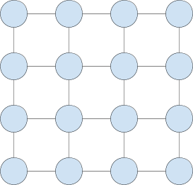

You can also have 3D or even higher-dimensional meshes. The now-discontinued Tesla Dojo training chip used a very large 2D mesh. I recommend against using a mesh topology because a torus topology is better - see the section on torus topologies.

### Torus topology

A 1D torus is a circle/ring. This is a 4-wide 1D torus, which has 4 nodes and 4 links:

In olden times, Nvidia GPUs would be connected via point-to-point NVLink in a circle topology such as this, though these days Nvidia instead sells a more expensive routed solution.

A 2D torus adds another dimension. This is a 4x4 2D torus, which has 16 nodes and 32 links:

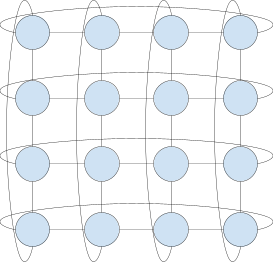

You can see that a torus is like a mesh, but with a few extra long links that wrap around, creating a circular connectivity in each dimension. You can think of a 2D torus topology as the cartesian product of two 1D tori topologies.

In mathematics, a 2D torus refers to a donut shape like this:

![Diagram](data:image/png;base64,iVBORw0KGgoAAAANSUhEUgAABAAAAAIvCAIAAABlVT4NAACAAElEQVR4XoS9iWLcOA+t2Y85tzuJ99jxksSOY8f7vlTZTve88fCcDwCpcv65SEUGQYpSqSTgAASpv/7+8M/fHz78/c/Hxnz4+MH0f/jzj+njxw8fP/7Tih9Nn0zJfFxaCkmjJWh5+eNSq/j0aXlpZXnFguWVlZXl9ndleXl1ZXltdWVtdWllaXV1eXV1BVpugtWVVdOaaX19fWBa1XLbrq+vttL6QGsbUd7YaJ/Pnz9vbWx+3vhsbmtr07ThisZou7W59WVrpC9fVGa7tf3ly852fLYb7X4x7ezsqGRq/M7u153dvZ293e3d7Z29nd2gnb29nW97X7/uNdrWZm+vSb9a8DXpm6kY6Pv37wcHB9+ntA+1qrY92D84/LH/4+DHjx8HnfbbTj9ETX5weHjYRC6KPWySAzU+NP00wdMi6Ofhj5+HR0dHqj46Om7/D3+2z/HxSWOPfh030l/T8YlaiGnUNicWNnago5Nfrer09LTxp1M6O8k/5407b5xKSefn501w0sTnZ+1zdnH+6+K8bZNay9P256zJLkJ6cXF1cXl1dnl+eXl5kdSk5y5dXl5dXl5XFUwTXlxeU2x0ZSpe/2+uodZJNQhR0o1pKLUGl23bZLe3t63MtsjNLpqsya+1vfZnke7u7oqnkzuTd7yBh1TbxPd3+owVprbj/f393cN9q71/uG/Nm/DepGpXIXl8fHx4eFCblLTi09PTw9Pjg6tooP+mRxM8jYui5UCtk/tH9fb8/OiPyEVtGz3G33dENz6HVnqkXe5FP+pkpo/+FT0+zZ6eZ2r/MHt+bJ/Hp/uqo4PeWDRvnxLOZrO2o1s+TJsFzefz2ax9Xhv/Mp/N5+1gOqD7CWoCPubV/FkfFZ6f5hIkqVZ7qmI2V+dzbXuDkV5eXoofO/lf1Nq8zOYv7xpOTkBdvj7rqDqXqspj+fu+zJ/yyNEom/n09X3nL2qmA06/Xe2SxdbhU9u2s2qXZ/6k/WkQ18ot4Z/9a2UP8ePnFZ7pl37SvUEz3SxZq7tCf+jwpX4a+pyrWncjfZacbW/ZTrDdWC/9Z+XeaweJW/KpPSdw2hY968x0w/J5gHfL98S+4yOj3U000O55FD2E2VbPW3u4HuIBTFGnx1b5EI/zgx/VkXjSS1ugH1ojP9JNZURtNR4UUaipm9v7G8vQb6W1Rio9eSu1eHNzd3sdzUXSqjfXV63VRFNSdY0upVlpXLXX50L6NBTzxVXjrF8vr5rGDo0sVX9ppWySQbCN+L9S2YXGnl+eypokYaFsgGyVsgjREkPWjNpJ0RlWLiQwMqQn/dMMpYWypDDmf/5Kwypr26zwr+OfzRTLGouQNcuM6PiXKn818ywzLmteVl52/+hns/KHx0fd7puAE1UEPzSBmQFomAKQ7O+3NsXvC6F8Lxizv9/+fGuQ5ft+CBvUqQZ7rfRNyGfEP+CiVhWfBpaMl3b3dgFROztfG9YS3BKe2m34C2TVQNnOzpcGwXYaDtveAao1hAbzZWvgQXcN+m0a8g0YMGCh6bOpmKCNzw1ZbljW/oJIDThbcdPMxrpA6Mr6RqBWGgBfwbRFDet6swS/tLy0ZGic9Gl5GRS90hD00qcPBtbG0q2tqxZAuNC5ILqwe9s2xA56LzJ4FxnMq4FhfYP7+vvX//nn79bg//zd9guU/0/bQ5A/vAEd40PsSbHOoLH+tP9iln2C+hbDVwqAv7IqflUYf9lfZbW5Ac0XyAvUdnGlyFdQNXkp23VdXQvon1f/s65/+0kK+Bvlb/qjn9BF/TbtN0bCjw0jvP/lS/uhkQn5m3QD7Ww3N0CeQKD97arVrbe9s7vTcL/Bvm7K5gzoA9rf1i2651ta5QL9Rd/8kPA8RLE9J9+/NXyvTxLN4Hnw9ES5jTZI9Bzq42LzH/Z55gP+H+y3h/vQGqBJAP/gfzwBKDTFkYRSKj9Vblspm6ZRpFaOf1m/BLo/+SVdg+RExQVqKq4JmxLsCrDxZ9J6p1aGRvzSia4K7YkbIAUqtXp2fiGwr9YX0ran0e7Uuvf8oiveM0H0qyvhfHFNeRvoX1XhEgDfFXzQFXp+AdynSblEdGWJGom1pDC/LFI0sc2SgUq56La7AWopRgg+7KhMoi3iLdY09jGmN2FqZXFtfO9lksMqRwv3oHZ2ADDV0wbeP8VZnzJZe+N6YewECwkXQBsBL4AdT0/UUtXAglBONmuknhK2BEgxgeAF9QPANYQdPgCQrdqDeKAqUlGlQmwBEFVIYNgks9mjANpTA3lzwWpAXjkeYmpfN28IVAivjuiGOqA/HW4K889rL5UD4RrA6mMnJDuXRwCOz/N8wldxy8CahZJnuiaPtG/Ae8D5jV47Wyg8Oc6Dg0aTqZPwopaT7jjAS+925gZq6MbuzZ6N2z6rv1Z08+zoxUeZ8dHZ++K4miYIewv+UIFM+3Pavv7agavnjl2Mix+n1MG5yAfQVTWjG4pdGomRTxc/lgTzF/04kuvXtruIhzb8XtP7aqZq/aRPuBI6Qr9JQOO6Q8opKN9DN5ngfn7qNord2o751eqGF8Mj0J6j4s3IeW5H0W6N50YyCdPzNKoOPp5N4/1eb/BvRXKnoABUiuHWkYJB0KMA0jjmUT0LGP86oxMUS+lZvYXDgErM9tZ4A9YPXWnFOND1jcVNr6JBU8daOYcets6+kp9g/XwpL8KUGh01rgaQLUAg+4oENfvRDcKELJcRkT2SxfEumByHki7Ou18wOAYXMk7NtMkHkBW7EJMuAdBfWzG/cBOE6puFNehvtQqlKXwGNV5RtqqS1XWwDfRPI6N/XIFmuOUD2JTLDQDhS6qPq3EDTNlgQvgD41YxxoFSaNRhQPLdDkARpQZfjPMD7XyniYCO+LaRJ/A1IqPC++2vJY03TtKfXaP8YL4CtwTBFIBtcoVgBb52GkpzVBaQBorb8kdwTo5BQrv2D+S/uRkuAdukQongyfIK1jfWkYjkESjEbCSqbUOX6QN0KmQLw3bFIe/8BGV03JB5qUH9T0v6KFq+YkTd8La5TxSbP2C83Ung+4P+DEAflnKE8gXg/4niB/sMjf5qrsDfzQcI/I8DoLGAjx+XPhjuxzFMJbGTsgRDPd4JEqA/jD2etZWVtfADKuZvfoHyqq1s6MKuGttv6GpurK5xwev6tqr0ydb1G3Ta5CdS1Ro/YfzY0Gc7AI7vt9+6eQFxc+SWOwkHoPEIG8nj3N7eE/Yn2r/bbsrmpKrku1buartxM+Rfri1UmD4eCfsA2u5//9oellZqD0Z7qHIoYET/7IWHwEOo51Do3n/zuT0YXHkF9qdkb+EggH6SisdHFVcA6yvsn1EHBSSOpF1CKTU5owRHRxWrGOi0KatSdipb5TVtiO4D6NcWBkKTtmalWKVJg22a9BylLe0rB8HSizMkUteC9OcNu1s/n1mJX/njuH7qffhuJbKYVsVm5kZxIyzHjWP7CjtRfTt4ANeXtmsSl/kqWzgUo4HibAbt0ebuVp8xeNZs5qNMcjOgzf7KjjYTfN+jbmVuKbY2zcArzB+mnSbRjC22XOb8DjseIEAS4/g7wMI0lv/AIIBJ0N6BfIMJQIZC+4Q/GSgArwipPGuvAjFFAVtEAlaj5F2DjqUExQzHHLQl9PpQKO1J4I62DeM/KVA9E6M9HJdP9P84QL2h53AABEyRZxu5GWIoI2zo8VXh7YzuB0wMtDtC2DqnLEKEkx0m76h9POhMPkOnhPLdARA4tmzWhALhnE/vpFoWGVD3qLwaGdxXqF5h+DyZkLTt64ux8kyhfajtJZzPyQukN9/AtR480F5POi/v7hN37Jzjz1zKs+O040B5aFXQPV8wfxqqxutZuzyHyzF/fpG7ZZnuB9c/xXiLNu3gOhPddx7s0b52AJ7lpHC4uOUmpG+cvO6jAOLG6/faPsZtwN37zD3w9KznIr0X7m0/EcL9boYnrEocinQ4y7soUhS/PAeccPjqtpHOzvu3O18PthxyEQ1oaM/itp59q4LFkYF2jtI1qWGyKwcMPJCI+lpQLzBF1XkoqYFGlQiFVpwqzAr8h/IVw8hqV9HSvFLPrQcPIzQdHupZtahuafXrW5qj5Ee1f2k0j/BP5CFkm4xmkkD88DY6Mj4UZdnKAbg496j1qT6nGr7GecDMjSZP49s5SpBmM4JljW22uI+nN2dgHB8g6G/oXww8phxqJTsCR4rsxWg+EUDR4dHPwxzwT2DAQEGEDksYMOO70g469Dc56tj+HBCUbEgGiHIAdGkfBTaFcJrEfoDgDWgnKhT3/C7cpBGD7wtISYDqe8Cnbx43wAHY3lX4FWpITLkX24H7mwQmqIE11yijw4MD5SHYLxAg3PwSiH+kAv0wmw4lG/Yban72Z1MfBZjX19cUid5snkDHpuuTQYB1DxGsiVZX1pfHtJfCwAqGKyrecP6KcmaWFEwXDjYtA6SX7BosyUVoRXB4B+QfVYtEGP/D38D1wu1C+B88GoADkPTX33//PwT4KeMcsCcSDkA/S0r40WE+9kEAqj/5/HVa4P5yA/QFtBVTXlG/AL4EhftXV5d0sYT928Vb5zKqtgH+TV9uiVqDTa4svwq/1ufPawH8FdcP+uxEoPpdJ56A67e35QBwW2yT3jO4klAJ49bb/aIxp12NULUbVLekXdjmFLS7VN4rN6582j3dvd927RJH1L8cACR+YAD5PfB/MAy3Eff/oVD//v5hfwj9nLZtPJk83vXc1pMcj70e6Xjs0Rdt+5MRgPZPqP7QHwF9lEurcXxC2sftlfFDTSkoamsrRk7AiaIcC4OeZ6dNzZ1eSCEWynd8pDVQOEQa9Pyy3IPQtmrVVKr1qbG+VW3bnsoPOM+gzuXZ1YV0OijfwR4pbmcAXV9d3mhAACtwfXVxHWbEAaRbW46gxoftMY28qbW8uFaIyoUrGaBrGace6Crbdj0MBdzZWIaBE11l9D/Mp0ymk3lubHChqqUBklvZZkXvaaKxhIjhqQ8P5d+4+YToAVLeQBYfhqqEFM2vkPuBZAQcz4IxhhOi+8dWcK4FbcAsscuTA94DtZ0fDYdUaEBq9kSmTSsAU6KZSU3AXQ7B6hDZG3JAD38jkto6VPS/tyn8DuQyzitPoA8FQMDK7Nm7G2ImiISnzycGFoCbOg6Hy92jyMc7Avp9lPYJXAs9K8I9G8HuSAsSwLEA9KsD+Y7bV5v3u0sIpE7snkd0FQB9pBcNmhTN1aEuAMX6jll6HFoOR3x3PjUoYS9q9vzCgaLbaklH6QC45Myqaucr5UtZF9nEuIqb9H1VXTcDYy9uRQN9q+l399epdCPdndnB+1vOX153KeIYlXJTofDxPnh/Y8cTYHpivCKJlqZ7edbpMzwmlLcPHG45HSpH7jm8ccX+80HWLnftSTejTKGg2Msd6vEPqZx8lIBVQqgRRg1D/6QKurEPAO9xAWuh21srjNixNF6prCL0IdumtwaVmCr0/q79sVZV2KWqRkJSiL8CNFU1baNhgYbprxzqsQ2QmsdwQLgERPn1uQiJyqZudy6F+8s8VRXmqapkwoTx7QCc/SIFKOyas1spYhyhX+T/2JJiSo8VTWv2lFKzuQH/y9pSRFKM43dqWVsAAPJGh4cMERQw4HNIJNGIwvKDH0IMJvsBkzjjQWYK7ctBMOD/tuekBFUlcvmq7AaDGwP+yBSaIB81YqigR0sZDRC0ci7QnqE/OT/vCWCmRCClZZCisb0FgtuxGyDq4V0hwB0PA3z5sulBgq1K/zZK3HZ2EHCxYsobHg1oTEP/n7cavtwUHP2sALUkpgZa15y0YmgqDCvwCrfhDHWh1x71XlndWF4ZkTDZQcqLaTg68fMKSUGG1h+XlhTnB+jLExDu/0QRQG6U7rygD07Y+fjxQ8hEf/+tQH94Ah/DPfirMaT2GP5/hPknXYePi0n/n8r5+KST0Mcnas8kcX+h/9VI+FnK71bbPggClPe16/n9CF00s9H+rMk12HDsf0NXPzJ/nPE//lrw/JxsvyjbJ/gO/iP8/7ndHgX6/bfdTLvtlmgM0J9bjQYAfQ0AJEfgv+7e4iLr7dtX8t+47yUfaJ/Qvp8bZ/ob8ZPhkw145qLO6XfDQ3jguP4A+uNxjudWAg/8IRl1QWkHCs7+mSiOAvqlZ05Ozn4pYxFFpVB/x/2J9VF/EfgfKKppcKYoiHWoPkb/OYoqf0BZQ0r4Eey/sB7VcGqNujZNLYCfuzhSY5F1sQqmUu7S5vo40s+4MZH+Ae6PBuPGiafapgUajRC18Gpwp6h+tStTV40Rhnl0FpAGvW9vSN1XBw75y1g2B4AcITWuoL56wwKrytX+SOCutMuDYvw3DvIFoIcw8SW0uVc8UKTZAYEBnMlTmQP3QgiGFGCFBwf1n4wwWv2jMpUFyx89SgCkUD0DAjQ2PTs/w+2f8QsANOYChRMJBQCpBwBKO8qTvYgmL3AvcM4fqDOK+Weqz8w4bwBYGdG3rMChJaTvj5gtcJ5xoPFvRHOj2cyuiIU62ThoQVh2E9iNyLqQrqA0+84C6EZjItbPLw6PJ4LtgDjK81eSc0weBTCkVl9A4nn4Bp1qV9qIhL2DRe7hiPymvmJwAUn1lzMMKSn1urDRij91LIPzl+chtSm/chWfuBSF8gnuR3cw7s4nYIfLv78+MyV1sSe/Jo21o71EybnaM6f5ZA+052dSY/X/4ibxBaLlOz5vrU7UJqlPWqkgUlKQbu2A+L39k2/s++FJkSQd3Xh2smi+PYB3fhSe7Noi5MFwJznsBi+xPAs916gCZ+ZJP/A4lx4oktRPuwYAPRI40RWeBuBmYkJdoDOkdlBE1kvSPQ2xRzijqcnA/JnliHaK1laD6MM7+RLehTkApULvNEUqPg3WX3qeQKZeop7137VocTVL9YxmTt2uIQKsgOI/V5eteyzCpVJAL8woMBSmIltaYpltikVhe8roFFEOY2bwHxYND6DZs/Nmz+QKCPu7gZJkT35h5sIyFqWdtFEN83qkqBwfkYuxLQkmW16DShPEb54PUX+qAP1GCJksxDYcA+UPi1f838LDnFQw4JAfxi7t/7cGWJoA9NJAiUOamrwIqpGT4L1G8PM9gRHoCB+ALenTe4T/PRkAnDV1A/aUBwQ+UyJGhm6dpW3+i0L/GgAQ8C8fYCsSwOUGbJIPUiTsr1pHi7eE9e0JRFZQwkuVYqKpoOi6oKmGByJdRTg2w9ZIEs+uGs2qSjC4MeuNaWgZYAzZGQA+Q0sxMLAiHyBmCBSB/o3yQ2BK7B6JPm1LzJ8BgED6pr9U/eGTpwd8lL/wj1yH2H3A/XRdW1M7l/BOwk1h+GIa+19yKhM837N97VaywyRqwnZRLNF10XWqQRNlAeVF1GVdlb+16Qws/wCiSPufkND9QtL/+CsnKdNHn+4AuAjuV5h/m8yfyPrJ+25Pt13wnrzCcBV37XehfAP/2vgmH92A8QHgmVEhM3wgPy8h4VnVk3WgyTdILIwRAIp+fOM5FvnB/nnsGL/8AAX4SymgMooS5fcAA7JffUDgWCMAJydSMxqatA+A1sr5vuw7Yv9qYN0nbRk5ko6knHoIla1BuxQmehO9WpoX5tIhmaah5QQo6adjfUmSCv1D154whivQ2DQQAeLVIMcAaCx7k5k/ELYJZiJJi/WesHnFy+A1a6mx8WtXyWrKEN60T4bNPA6AnVXyj8gD93fM5Y1k3jTAfQjBu0RIz3ynOwGCe5KFqkEHAmHywfW9qK1dgvscGTDWkGNQmEPYJWFINoi8ILCPcY4we8KaADqgoo63Eiw1rOZdRE7QUDRVs3lnGkDQvnIaFPPUTrRKH8CgUL1UtyBvg88Ae5nWIl49RfDY03hrr8R/lvCXbgV8x1oGAYSqE+DC0AamAs9jvLkaGPeTQrPYCXy0D9RsNqe0Rh0g3sBY1dmzOwcrR0sfQvA5OPaNXmOv2DcD9m3fl5c8sayto9ArcgmNtTlPmi209za8rxxOkaR6c8V4eQHotGHIxT+Bzto18ccsuUA1SjPNa5qpc41XKJHpZW7Xz18qsqF6K99IIt1sidRN4X9S5S0+sMaUosWj8oLY3VWC5Hwj7x+PBj28p/Fwdgrwonl8+Ao9oYgHQZ3mM6WHl2oXHPNXimB+4pF/tBKQWrhXYo+e9MwDRI1MHn+rhVt7AqVwtG+QohhWPzcP3p0GoZIe7uUTZPri/6YbhUpuAu7fJKNES3sFkihIEtjf6F+xFQVxekyGEYCunCHpdZONACMAQWU4RCHP8JLMTAaPmFJmasW0Sp1aWUPKg4TMIH0uFLdSwSF/z347B+A70fX4VG5AxNCwkg59yWiGGT1WPm2C/JgrHIXp5OBpUdF9THwa+qOSQFj84gXuO2QwZvhpxO85wc0B2He83yMHP+UOWD4Ale8HHgYo9KKJAeAX764W+0okkgNQsCbzHRbgEMHTb4T+PSEY0D+i/x1PAt7b+6YpAIr872h25p5CtBGx5Y/w25ZXc4ks7u1psrfL25oGsB0BYsAhTAOWyhFympDYTaWTfK61ZCI1SJF9Zgd81iAAs1IlFHp12BrEv+bZAmsbQvxJ68r9yXSYAf0Hnw6AVs5Z1iI5KiT2FgHFhdSXei6Q8XzM1P1IMo/hPoif4L9GATwJWA4ALSz/6BnF+m/c3zb/0KkAvglwX9slOQCqFb63jxLjFgMtrzr/f639XSLqD+zXkj52gHRx3pEv7saqEH/UIlEK1ufK+N+Qe7C5/nlTws3N9Qb460fqeH/4UcfffnQAtrsPINwPXzeRZpvsah76gicKE7dswH04Z/wc7H/7/tUpQHvNKWif/f2vPALc7mB6Hpt6ePKhikg/22Ii1N8RvxyAenoPfoZDH49x8/KPBf2N/hsdLMQGEtkb2mcsv7TJr19npV9o4DanLP2D1hohfi+eCe9ThMD63Qe4aDox4h/vteqlwjNXZpsDYN/g/Pw6dTHqO/U4fzvJGIgu/AnVDhOmInF/p8uYWiaL4o9jTqIFi0IVIpC9TFcMav95VR8oLKaT9W9ilMBxf5tMbZsBfXxwxr8MrAz0kKxveoq43kBYazPNrj9G7K8Le/x+FFLIfAH5Bt7t3qhBsXfCizQkIm+QYZiiHASBcs90tMSU0CWJpAujnYR2HefBDFnREbDNXYMEfgCnI0Y0QqNY5IjvY36qQUSvjfsFsiVq+wP5yAwvXJsRdHaU4EWY2pJAsVkcguL01HcsXs18xOh2DNBzeohrJ2X0k9WTRIP5/A2cOs9Tdd1bdVkHzV00YIBjMHs13M/LRbdyGJS/3xtP9n0JidvPSVjS1Z07+B4eSxz75eVNjdx+6CTaBOUViJJHPKoYZ8S05BGL+xfJo1Sak87ATKBqnZR8FJY6crdG/9XNk1tGJ5Pu+3WD7EA9vbuzREb5urWe5o/N+ZJTOtzS3LRxkeVNdk9myuDD2PP0na70OaasDF5H7QLRGSlzNChyl/lY+m88iQ/MPe4eBcyCBhC+5xEfJTC3jv0nPSh4YGYIMdxZUSXv8cxpbOKO1clcChU3pTtnE72vytAJI6OOl9xeMpIQOniqkwd9Lk+C8YGm7x3oiQYQO9Ieo2C7cEXaz5ViSpMQUqMaTb6MwJMYrIlqbZkyMVWzzpKcFHR24lUr7CUo7IWlcwqQl7iwYfxlN4C18rQmXhlT6ERpQJjdwvfDBAFTybHLx5Mx/KAjT+0ruO+Fg34NYwKiI2UHiUoC/fA4gJijnxoUaDjEMAMcYqwS+AQSyDmIvAWBIP3BF8gop2cOAIEKC313ckRGS7+PsAq+S/Y089IA7CuATIh/b0+LsmhJlojM2g+Qb2DY1pyDPWCeEd72l11tt7xukFOGKibsuQHEjpUmlKMBw+RgGEWeY66whgAAo1oUiIEAx6wbaY1KC1a0jI2Ar2G+QO+I9YsqSp4oetnoX7N/V7SFPA4g5O0MoE8xUfhT2yx/8HBAYHhQfWB7k7wC1YVL0CThAFD3IWP/uBcaW/gUUf9PcgN0UDMR0S8i1k+kny9AA/Hrwv7NB1ju6D8i/asaA2mfiPfbl+K6JW1otR+D/lrnx5c5p2mL9BNs2FET9C+sXz/bAvSHB9+zfpQGiVKie8MOZdxYeTMZ+O9qirpnqCgpLW5QjQHkzeoBLE9nd+YPRK4bwf7uAHP3g/UL/ZPsf5Ahf8nxuIdJOT/Gtb0U7u8OwA8LC9/r8fZD3kvTzJ/jHjn4pUXHcpwRuYV9QMBMuAGhngYecH/iNX9OWawz8L5VXroHo4Y8V3qPdiofoGlSL6SgqAwSj8JWGOaMQVmH+1HWfSIXLa6k+qXl3Sx1vyJGGgOouWI3aR7eUwT+vW5PTfkF7mvc2WYIQ6XwfbNT73A/FpBm8LeRAjQxeIL5RNkebFvNt9oHjcCLHQ1thuDVNI216m2Dp20E4iMkz+TdmqfrNtnOPoN6sdjTDQ0UjCX8L1N2jB6EJBzgVGzTYOMpcQ+8jxBCtXFk1ICvQu/GSElerXMRcHkXEVhOMd3AQ07biB2975BMjxzo6WL0AI5UD+DXxHod76rNjJg3/RhiCkUazbnWxFfoew0gkq0ZnSSnZFCrHTo6zoO266zzennRTF6fY8PQI9E8d3r1AIAhbOuTlm9vddBsNqVXtVOLl/hubCh5h9f4dilg6wvXe57jP+ibPc/B0P5+WTk51b6Pi69vry/+zIdL5KreZoFo+eqTVwP/44ejMuTZ2Cfwqs71V+U6fX9BzVP2odvnuTVp96W48ieVAMbA0UzOgn/x6CQZk+44l8JjlEdk94MbD4o+k+eJqGJvVwlpifj5fTXeZbI8Hj6EktjxZa943IZOfCw9wlHF8+0ezOWsAD/4CDWn/znS7VTl+b7oHVREKR8UiuYchZ5JHaSidVTqH+2cTBVLg7XtoB4VCalhTguZvERwpEZUxV9rkFQS9HDVDs2YCoxvwBxijfROQz02AkHS70D5JtM60pcXaqGYUZgSdyj7YhskUhl/YSDZJCyXglGaIYDZOrf5k9y+AfZxrMIUnmmGcZ8lLGoG9CSmDMjgajadB9hPFXArc+w03G6aww04kVCVHff3EYBW/Hl8RBQf428foMqHwIPCEiH/eQTeMNhImKEJAsASgErDMJrsWxQrFR5ohSDlCXkO8TAsIFSzT1bElGpMwDFUhU9BVl/HVVWE/QX/FVllsUUJDNBiiECgTsiOvI29rwrh7kYKNyHdbYX+FfsHE8oHIDEkASPosZaMB3A6srwFqDQiJRgd6DSxq8C/MtM3N8fAtiGumAaNAb2NQMLlBgg6rwnnrziVRpMC1lYL90tiOXzbaj6uE2yWjNBZitNwXVi+cD9eAoSQaqUD/fPP6ACEu2BefX2yc8EOjXAAOurPc4Jd80zm5T55WVJ7A/4a/uAAlBsg92jdn7U1A3pdnzVfHGN95/kw9SKufgy+UGy/Tub+NFkfxPHPE3N/t0n52o6pHoH06z7QbeK1ZDPe79kk9hp3Nb98x4NN7a7TbSVHUwv+DAvWts+ukoCGCb7fNH/9m0P+/YaGFtB/esyDM/DDQ2ZJgH1VJO6fPIdyzeMhpMppez8C7EfmXyB+qDVDNfzKxEGCA5aQ9H/c9gPuo4POHJagKAdAmoj6vsb/6AacZlYPRS+G0FXepXUq2pCcyIiQWFdKXTYdeiU3wOrVSN/qmErVM0/LjkHT8uxVCpnAP8rbWF+Qv7kT0vQ3OWosvT9xALplIL/fWacebS4Tg/m51uLXacY8fq0MnsL01wH6w+xls+DlAsS+OW338YE2mFH2UqLQEGmDkIQDIEvdJLfNMHMcakU284IDWXxk4q4nAmL+LVcWgUYVHr1IuYgRAO1MWk0EEiOCGL4A/KOC90HIi4/soERV9gUc5JyEOV2cgbMEK5/dGDCsDYBp5sBzgid1S5/AUGWbl3tggKvGdioM3sBvz6BGguLyNybhZ46SID0AH8cXGLacExBv8F1HLIaSO+hAnrOBEXrNMLkagb3VtfFtO7UGlO2WdJqUotuZ5wKIeQkUTIdqYYpmJuRBAWh9zMLi6qSL1Zv7qWb0721zUWIAgROoXpPVXgOvPzkQwY/cj0SjKo6nGozcnPAB4pvYR7PDFDvWt2jOkOs5RHXlWyTPyM01GMCgQh3ryd5pjkikp5pXLziRpi7waz9pUApZDFtxG2h/1z4nrH9OpJ6toqWfiBCq+KQhqRjpMlne4b7OysSDRod6CGNJonqsDONNNGPVICR+loOF0AlKTEJPJC+dE7qpg3hpmEeFJbSjZvuism7xBB48vUE7WhlBjX8ccg7f1yoaogkDInSn8fwYNEnF6/A/GjgjMaWQJ9sB+ss0IMcK2DTU+LAIhS+jcS0PwPbivAxHbvswss2MzFPNGMDuYIBEVzZeuXxQ4vuLGAcwhU3MImaRlFjVnvg9ObalmNSA+7+cOnQaphcHIC3yMALgpFyMO0b+WNP2Tmzfjea1rqhe0WNsf8hsYOOEI2f4AyIoRhXSIkDIgSYHyA3IxOSYiFjwBjAjuWcpJpoJbBMtvKghuIjAvyOkyguCVPE15gZ88zhADQWI0dRggTSq/MYAMjKE1PZYHsgrtXhYIHKCCgEC/zLoH0lBDSNu5+sBkG9qzUj9E750ZJl0czsHn4lCs9a8UWhmqcTS9DE/2NCfkLfnArfiuqGvaNWfvjTO8uqylszUgvmrDTkrdN4HBGK2AIC7gXNjfY8FaHpAZOYD+tlCoPdPsUBQOADNW2Ci718ftaqo6MOHv5tLoB3U2wc+McaQPgdHoQhxcu1M2gmXS+AvEwk/RfZ5RFVs3z19IV+vgbhwOABcVl/ZCSn5fyMmAHSvYKAvW87i2tain0jit9/R9HCNATU/cJd7IRwA3T0Z/qcAueQ7zytS7XqtT/uj3kTmDwk/wx08HeTiwaiHhKennpbvw4q7epxalfP71cyJ/Tx+h0b58UA2zO/xuEMN4cmnN4MD8AMHIIvB/xoWCpCSONI6Y8FXsF+jktI7YttHekMyjQ+cHp/kEv+oMzNnHsEMohbtporJy7wIisQWZoyOSF3mMp9yADxb6wKI75i+V/YJCg0uMZO6Lj2YK6XNRiH/eHcMg8Od2h4D8keiYlga1V1peeksqqqZIWe1YoHubq9ub65uNAeuRq5hmoV7xIyZAsdrbN0hNAJdtoT3cg1aDw8aQy/rKJpm5dpniGkA1cx/m0Q5uBhyp/I8OOM/BE9ev79ITUAKYIYCBDF8ECjCJXUi/klL/guROO35SdkMEZIEaqiJ1i0RGDEuEZwBlxDvpKVAmOBMT6GZKwfmpaMfo/dn5Vs8Rf8d/MTggyDas9Bd+QZshcvUeY026HAciPQVt4/ga1UVFeDTEcQrUwU5pM5fM1NIaDSgZEPMNDOmDF5FAcvsdq6lb7Knua9DVJVQJzjXSqPhRHCMOMqbIb84g1pB3rkciQ67RwcgOqxuLAbgVpVbv/rk/FouH6xyh7JZRuIh9S/vpY6VDol8g7oI7KUOhbbp3wf2Iqr0zKWG4RDwMPqSyRTxSrPWRF/6ZaZ3sEX76MoUuVuz/B2zmX+MmfqN79Ipqzwy4O48wjTcHSqr6BvVNyM3pe9HLUrLSShLx/ej7/mYHV4A/TFxeXjD8KMPadzPpUKeR8mUoaTal/6hFD8xF9mSRx3Ny5LGMKAptMA78lMvYkpAtQ89k5s74f6YFZBK5cla6A90F9F9a79Ug0L7Wu6MkuhmWDvBdGN/4OrOgX/VpsKtNwaEQn7Hm25xA0p+rdhPOAAmjQZgMmw7HBGS8WB4ubKD8AHOZXNsdLBE3R6ZonhxzlxibNrZWSwzejGYORiZxRwdD3vJuy9tN3EPZD5tcMPQdmegG9nC/W7bCSH2/Pj4tAqggF+/fv78pbTgY8YEJjT6A794cdiBAEafVfgz/QFPEG61qioAE1hlyFteILBQ4Z8DrxBa6Agq+AS8gsnSQBYFOGvI7Nse72NlOaA9rQgUDsCuFwIC3UE9/jvQgjMwgZHDSkExMLAVrwiAQJ4FUEfIChnSyg0A3CrkvbEhELy2sua/RYDnVb311mn/9b4wTbCVn6AIu/gIuzvKvqwlQA3NDeSDWlHYnsGBwPyeLWDZB705QMCfScA99g+sdw9N9o96WPrE5N5yA8oBcOZ/hPxxAHQ+Ir3lly3fx+6Ovpu+v8mXosf723U0o6V+8Jrq2lHLxYW2pu/2au01Y3vrsyZ2549XPye0lVlAu7o1cAOmGT5iOg/hUeJ68j6Kb4Mz6vtQdzAvt6s7GIa7/Jv92rrjR36huG+XQE+Xnel40uxq65MkZyDd8ljotz+3P4+9rL+f9qrVo04W4HEOEaolSuIolh5DfRwxubeUzkktUZz66CwmKjl/MZL+6RZpBDNyiFNbNN8fqLXRGOioW53eEwMF6Nkr617paytcVPNFruHwJ4nU/qD9rfJlBbAWkRDkcBGSaCnLM5WQe4pQJcFwBa+o1dD0lLBeahHWrg9tEza7Ne6nsRij/LLBMsxP8hzuPXWvTPJISsXVH+0NbsdBuMdVsANgUcz8GzsBPUhiQAAhL0agJmpEBSuehCbkTgh3JC4H5UgA1A7EE5BIyFfyntUDECfzx3upGR0FDEoS2IrcIc0Mpv/s1odPhIS89gcJCtlRVKa/IrjIoWwm8FeNwYPUukHvjTbU+kss9FcdvpXYKFa7BFzOVHvBZqNnt/oDZC94jVw7pLwkrxkj75LX17e3t9qXYiPalGTkUzLFxG/O28kL0tA2LVUjD4AjRFckJLX6seeRFoTNc9F5xxnOAes0wKvxAeZ2SDww8pJf0m1mHpYBsnvoZK5BAY1NcP3UYTLydl6GC6u6oT9+Yg8I4f/YW4lLMdPdp9nP6iRacX9y92ZKG3d7v1FNOnY4mUF1l8JrPaucpuCz+gNV/+L/B/FI8oTy+DKIh6s80/x4Bu4mS5HGM17OfqqFJKUPNaXkBEBe8aEGoVucMmiddkux6Zh2QFQZZJ1jzTYIQzfeS4TGa9trK8uIiORgKXtZ5V7HJOOKtriHeIuKhwvu7DmEog66JvB/oznByupZIIaAgffeIgyumNGsjAykfZRC2kcG+Fv5qGXesGgwJTSdsoy1l7zzgHlPmrUZtZE9OT1nPOCXQm59mB3izWC/hnGAX1oCyKMAw0Q+qtLiE/VTakAO+0c08D21Rgf51iC2AUimmQhgEq1E8lNSUE1zD8ZEBuBNeQVAo6otsAQDgayK9r6mREhreGGwNjsgsQXk1giJWryjjvtj4md/S4BeAMWrYDN/RIwThuDxAoxAFX7e3Nxg6ulmvX/Kq4WSra5C+ANrn53h4jkDDfQKFMO0utX15gr09Hj/VcTf82bB2H1irXyAeEvYaoPsWh3IKwU1bC6U/44WhLxETBk+HzTp9y/zWYej8InJvkr4WdIrCeA7lacynhlAH7JcLgEOQPs2+uqrWufHuF/fnr85gKIrBO73RSxJD+3D+9LHBwdAWN9ztTVck5KdHO4JJ6Bn+Vek37eIb5C4X8Tky+dyPCmnmxDvV7YPdxsOAFi/blOQPELkhew75X2fVdpQLIhfj1l7kALuDw7APlPy+xwAzdEh2F+ewJHw/k8WBMjHXg4ASgHezz/zhnLc0Gn/KBS0Sry8176AExE1SpkTmNBOogj2awvmD+hvRij/PLShwD0a0zpRSnBI6HcepUMpivNfhSIm4cc6W8oXoD/SpXU0ZHxfWr4Uv2WB7K9kP4bhgNF6XOdy/iW8ScdAFkjpPOJtmbT+p6ySxwTKdKUDYDOnOBkNJMRq0pLaXHiHKbl3Gb+XhDBbme37Wqc/No9O7QXf5+I8TON9kt3G/I8ECJBdZ/8IE6ojagNY6GPeoUqqHj1gIEhAlfGHoJHSqisg+jzCYmMXYbWIAQOkhP4juvpcoD/QUAgDFQU8hy0ZHH2QuQGECr4wHwTWdPpKj5fPenILH5G4lAgJZny9iKNzXu6UA/mscjdyTjjom7fg2cYldJYg2rT/b78LHdeO6ixRcghbXwbl6oeWPlx2GPi7/X2hnB2yOy2r/9wxTo9W83A/DOnB9v4EsPdJq+u+iy/Tq86fos4xTmP8Lr2oM2k/hHrBo8B9iCqO6qJi/D5gnlQQPeEY6HR0tzXB/DWHOPjd8ovwB9KxGmnmdJ1YtIof3Tlalth1mzFrvDqQx8ftVxOsa4yAbK9E8rlD7Rg18ljm+L6xFmo9NZBbxc3PbY+wHpNgcnwAybPHFvx4xyOvxzT+ehQin3o/sEwlVgqRdqBtRhEA+yqy3IBE8ezTRn1KbbiKltJSsZehfiiu4KZbBhZqcSFlMUoVCtYzOKBmZtIZkKcBL33r1yaiim95rXBUWej0Sy88Wnpds35Lk996sSGUfVR3A4HVUN1gM8IfkP2xt4CVoY2CUukUAO5toXoYC3tXtWyxia4n8bWnv7qWZlpoVDb24pyEoFONseMWEIoLxM/sYXkMQ7IQDgAhubL16R4EFSSwxZfRD8Dgv0CImjoYxaAINQL8KzfohyciFm7xEMCB0oQsYlyAmY0D/OkQCAZa8ARA/GLyHQK4ADHJUmis4TDlZe/tfcuQbEA4S3d3dpW2vdNoN/yB2grXqdoDAn5TmPGhssHhWDtI8PKL0OV2DQvkJFOJRYVRFa+OaLW9AUSkqLhK01xNXtHeAHidtwdsrHtBoJ4OlPhZn4ynB/pXMlAwq4bmXo9TCH3F0D3ydArMvyci/o1Z+qgRAKX9LGdQ/2OuJ+oDRVBftZ+6D1CnsoD7ddZTib6ryd92ZT0dgKTVz0L8axuf1z5ruq+ukS9WwP3aclm/aEZ2q1uz17XhbR+sKfQPVfhfv6gTfr5oUdgtr/LjX9l3B++YaLVidp3izzwT5/ns7cRrfb3dwQEoxB93XA5Ufddt+qMcAKhuaCC+J8XEw+CU/XSa6/nJQbRDr+pTEh62ePzSQ+ApNcUkHsYA9Hhrzs/PzPTB11f7Ug1+/HEJSkGExIuUHZ97OpKmH4VEA5R2CCbzlhy3ELlBZPaf5nxfTeuNiVKg/yYPnQjcHzTmmTUmM30b8QKXCO1b32opt9LFV1Nl7W2TX1jF9yFg16D9cwxgmvmDvEwFLZCkvSlqJsb+gz83GqQOuH+b1sj4/i5ns8mu2ZiJCv1D2EUYw327BENVWNmktMR3zr6VIGs0KB/L9bBq5kDsNRJCao3kM64fkqCZV/zJKuX/aMenWKYH/KGJk9O3RxUumYGYDTeMep6dnhNYCgLuaJeZgVTSk9Z77LX+G0MNreJV4Ix30IokUjHSJzJwGwBMwFXR3Ag294qZkkoo6gD2EAz4ngCSQoNjR5YIxZoStiolxhBQLWkwxt2FF4dQdO7lk3KsXeA1AvdUCSXPnWbTz/ZN/VYnUB0hmRft6yNGYUS6EJ7AW4Dr+D76ApG13y6U4TXYd4avov3o9n2HSTpl9+Ve1fTFh6B2ONte5IvPJuc/obwgvei/tH+V7xG02HkRu8zz9+VeqjYLTIfwmQRFKbqaa+DBldTNM8csqO7GxusRqX3lI7sQboMeA93vmRpH+7y3H3h6dP8njY+kdhscBz+L6QYo2SfRPiA/xwS00FDOMIb8+GuH0AgPGhN4ULjhMXZR+l+MTKpe22d/3Lzrok7asyu2rtlKLqCvCn3kAGj+kig0J6sGpdKsrXSuAy7j/GDp5yvNDYZvvsG1BgNiUebbnItVjctSUCxC29u40OCStqNx0XoRGB9TGpqwQbWFsGVVTDPXPQH7AD0XCCaptb/ApFIbEwQM8U8ypdbrcDDeHm8SwHLjBoxYH34w953IBTrOacFAfYcLHexXepCYghzODjpyqDERSDIO/LsdsCbXL4GEdvzqUl4mcOA8Z6U6+90Bhf7jTaj58mDwEhCrCSO9ekoCXc67YAX2XU8GEEjLwQElb3+NbXx27QmYiOruOOqPBGay3e0+AFuBTJBlwM4An4apMVEYpKqJA59zCqvfYLuuTJZ6lW1lvKcDYCHoH8A8wmmKhbc1n9ZVzrnnf2TuLCtL37MCTIL4S5PsoPcuwV/NH1AfdiI+uWlBfCSq7Y6ADhfnMXEDYBddAr5MI39hvQmYa1HkS6ZxEDkDDvzjVHlkQJXE9e1NibEPAHVJCrXvtp05fjN43IDm5ZWTFz95uwGULKbfe9cxfuQV9d/R6lI94cf3nRKAxqEA7tRyAwD65ctC3OXFA+hH/iDf44uEB49nr/MeCWiP6A+eyR/eHv88PPKsXz/MPMCHbjbgftGvSXZgVHl7lEqD6ELPOzw5OYrgv8YZ5QMgRSsN6D+W8bEQpaZBAkkilT+jIJoMIPnFMJd3VJoXzuOn6Jc1hgPgYqNzJubmYj6dGC4oxT3UyhNouN3TABQBugbcXxMTIn3/yiEkMdcaH7j1q20M8f3++TRCDv8TlNKC/vqEDbvXoDYvxdEcXqYF+61ezPalGYYQclFQvpHtpSfyPmrFvbKpkmgMIVblqy1kwxrBttEwgwyQvKc0/+CEgBEu2HdIqjaGLI/5EQnNGDoUSKpOaEAxWgpoj9HO5gQ8s/pllJMBPyEBORW4mSVua72x+Emit8zzcdJRIrkgIrijcMSIKsIlgSTnI0yfCfklDBYJ4zpU/CqkHjnqVTsXtl5EtNVgnk4CB9Php8JxF+NtHyu/V51VSWiMnKoKn+dH7kg4GL/F6F/y/1eqnCIxmQgUmTlJnIO9heBe5QYEM7Rsu/8uSduG5/NboxZDVwLa0dFAsUtd7fxR4lJ0N2HhB+HnTz5r/LcOpCGFuW4kjU5Fs7hhnN0TYXdJ6gR0bz2P0zpiF7bsoO6cHGQ/wdBfbzPzLBdTPi+1R++hBr6qKuQ5l4AeRJ5AHI8qzobbuC4HBJJKA6BAEHImjCCObWAgaZ4+ODmJSlQxmtV7iPEB2DAo4Cr/DSXmiVKhG432M9SihRVK7goPwErfOe0HQl5MKeoiaX8H/dMW2B5YolrN33LU30s+jIbDW8WMGlNm5TLXmNZrwvyhqrZFwvJl2BL9X9gIQhfO/hkdACTn6RUk1g9ru0DOxcUNwCIf17CALTUk854mvkgZvaNEYcLM8CkCipQQRFHCcapAIyYEa8LAEMGkPcCmnIHDfHvAuEioINEh7xL+HusCDQkT5QaUS2Aktquc65xsCfQqog0BXM8U9oxNewJyBjw2AMyDVLZkm4SRAIvO+JGkIclNlXe2eScAjLC/01A2MwsdN6BgavHrWhFIRD6LUlzWGtxtYNhewca6Evvfw+KGlVcE60HTgGqDcpLqlRSkwkpNzRUtrwio2xEQWbTk7CDN0f3oRT89szdyfPAJlALUWIrNPcB7aG0q64djAO4D6be/rGeaPoCHKjroH7d8HzsAUVRyTyb3+6KwalJP+/msi8hVW+fC1iWGmZLGYtgyfwNGv5ozf/rgjt8Kx08uH3HXq/rsxQ3xlcD/DmMAGlgC9oP+wweQy9kkux6GivvPt21MYOdOHdwALf1Jkk8RVflcMFXeD0RBfz88ZvrqvH7Q9OCFw03jnz9+8o6PIyf/+4EdEP7JkYf2gPgpVxHlgtBM5PywEvGvGFvscYUTSTQy2fVQD1TEq7sGFZbrHnSl53m9TTde8ZYV6UMPDkTivhRradCg0KooZTOeAHzlqb0RpoEUubnOAA/tXVTJAok8TFzGYYzrq+WN38Z1E/F+tc2PbI8Mj+ySgD42yQvZqbGr7Bgwpi1Q7h3uKWgjaxhG0IPfgewb6NfcX4ylthoF6AbyMQNpUNrd8gGU+YMcGs18k1dxtOth700OFEriQi3t7xxi4Lcxh9geyQxIIohjVrAGxlRYfwBD+ZdAuaL7OmghJ07JDQaiz8zt6WSEln0lpqe80DDQdcdPM/BiYDzwVu4Z8piASrdC+T79kBho2gFI3Pmq/+KrZ/YER5Kikifro+jjrl7tLcAmBh4B9yuZP2LoPCEyu1RJfxKpuyvv4Y93sUSzAQaoLblziugrO5wQwrEq20ZknSofWt+mmmXjznN2Q5JPehTtz78K5GdD9V/DJyHK05hnRD9+UDb4Tp4S4as/072w4FD1n0QbLpLruTH007hSXkXfS0s16QasYaK6pb2P7yZuIA1A9Xs3Ts4/dArSxdW973i/HhYeAR0CUo/xuFV2keglv7IeE1fTnmcZIU965vbUo24RD3JlClVlqQEe+mzwZPcA5nEK9NE7j8PaPrV9T1JYUnXpGEw0mQgVOQqQ5ftRHBrJIYFQydRATsK8zVGCu3QMbskFMl05YyfeJlZCTIU9AWwDGaP5gbAheA7kBWFDXHcdPsDEVqVBwmDVttyAqQtQSUGZMjvIJRnWBpVZddItFhZyYE4pQLLx07nCECa7A/1OUQwhWUCZEixQr/Qg8eD7osEBwGUwc3xE6r9SjY3+C+QkZglI0yQNuLAikGcABP4RHIocaDwDjQUURgJHjZjKbkAgLqGvHB0YHQC2OAC7u7vC+Hu5tIsdAP3d02sBdkxAfv60NjgAO/EyKHsCdgA0MYDQPw5Axv8rEm2eraArqUFgXZJbGBVYX28YOF5uu05hXXMAGg9+llCDAoGxg5T1I6ytZUEj/ccZ9it6S8CSl+AX+tebuITl/TE5R0ird65I+Emv+rInoLV/PAkY6A85/cdLjSb690HljawwzNAK631NTwYG6rwlWdFrfddM8Q2TygdCXlh/pMEB0NjJ1ubnbS/NiqQuMRL9DF8avtf0X39iMGBnh9V+2kbeGz+zbgV8APPE+OtuYFskxP8t3u9bt5duNC9dK37vqxxW35S+A3cL9I/3brvbvUKWXofxg3X9TXX3K6U/B9HE8Nj4Nd2HmsMrfzukEy/80LN7j+wO8Ay2p5Yn+TAWCdNrvMgF/Fka4Fe8UJA8H8D9GfN8T0+PT0616qeEoURClSgvkfV8TkINlaJxSe2szirVRzqxdJ7j/WcNu2uVNC2j1tMiL/wexiuwvqdVSdIRf6jU5NVv6mjpZG/UhMyfIupvbi5B9lFMG+Cq3hKbATPJ9zGFuUmIr4HsMlkmGMltLidGLZrd3D9oHT3bxbYZl+W5DQOZq/HHkh0mr74jinIE7Ripj6gbtt8WPEx68RQfc/XMhWYWKkYIaJ95gqNSenhn6ty5zkYo2vfZ+CWBiQKb8wihg0KgmacBRCOTwvAGRdrJb6CK2H5vECAIHkrANtda64O8aOYTmLvlQv379jOjqFetX+OcHJ92HIGc8lfl9Usu2AeiLdgtMK2mQHyjaE6P9o5ts42kFJCrcTiNZ145x/hVf9zI+T+G+BzCwf7c3Sg1HAD6rG4hJJVz3+Xt87vtNv9fE3PVwLtHmXNw6Q+9/an4MmLrpLHZq7tq0B7m9+/fb2/hjYz0ogEBjQm4sa6Wxir08RSE9HmoGmjx0G7GdwoaOlRX/PqSz190IvrNjfZzHx1rbr+uOvHPoXQfS8bvmzds+KtxDyt3yjfei24kov9xwyR5ICwziCTHs23Ne+5Qp/QH5jkmBgnTx9NEq+HRy6Ie+IbpvZIRE5RzeaLBZzDgd96Ql+16fnqwwih1UYoFJQNVA/j7ilMklZoqeee9ReUVgwaNP2Ya6XXprr/VjAAzgvl9uFXKVopas4i1lwZcQ1GjsRd0O6Q3ukyGB8ZQ0Y3cgVg4qIJHIhsX2Y0SYo8ad+GW2CZ3FQ7AxZACxCGwgxYo4HXZZwnHay4hbGhU+OXB8M1MXqjch9zZjnD/dDpcAN8s/HG+vtPF/0lVe+S8YRYFVNFeweADxLqCvCdYKMQZRPoMEOVwwP1FAB7NX5xmO4OCoEJHhaAK9FfR6MuAC9z//ZtwWiZfANXcRtgfLNeg3c6OF3P324V3p9gP2jFYhGFrSftsCTPu7mzZAZBnMJDh6BaTgIU7O234vbSJaRuq3WplMZ8/r/HK2loztCF/g2O9Lwy03CB02zaXQK/JcnFVL9NqhIcwugWrS1oqaFVuAWuGrq06A6hBdYF7MLy9gsY3cP/R6/g38O8Fgj6JkQMgpwEsv8T84kwByhd7lTMAxIeRxJ6ATjdJp9kznCLhiS343uLPLnkeNSlT3XPSHIBC+XmJezGvuyT21bZHHtrSb9d+twn0D85OIbS3973dFSHOvH8lkDm9Bzcg0b+GpmDlBHzbtyvQZwArf224WQeg79feZQ7cYY6C+RlQrVJ5BrIv/ZOZMwPcj/G1eOoO1QZ33b74D73uS0uAFsrvPv3CE25eyB4hhMpArRS4RwKV0qla+LNA/JnwY4GBvRqUHnTYXiskO7k/lkooQnc2Rqv1G+iXdtauaFaW8hyXcmNlTxN6vFR/SKWvQ/uXMI1HvM43a++yZcT7KZRlkuReESZ45LW9d6jLU9za36eHeI1X0J0TeB5j7DumAo8mU7sPw+iK+t9ptY32KYtLFSbZRtlRfy3KEwk/T56g50H/iOjDCDRMqdoD9MHlBiAOMU7jkYUzop/hXUVjs2Cc1hK+QYRXO7IxKzTm2gmMGxrQSp0kUhKpMx9ByMmwdh7x4JnTzye5PSOwi/6SBt6I/I2kHdGrQ+fvmgVshSkJbajK+iouAFb2nWBr8b1zo82Uj81eE/4WolWbV0F2eRsC1qKXAfK2psrFedNXi1ogPp3oPPypA5iq836U6WmYFmP8r3FiOCkq1vlXP8WPPYv/rc+YhsTZ1YXi5Ht1pyEBqXXy5rQidk2K05hr2aK3t0Dh3A5UQdwb1f7F9wBtomU0b8InCvNyJp0ARoKWGnPPZv++UfUseBdSjGJ3qO72EoZEq8gOQ2eieNxUMX0qi3gSPccmph84+O83kek5j4VHZ7m6rjQHu6AIpiEDJAhpGby6FF/qy22f5W2IjPKHHVFrdPfA4gQmrVE2jCHA3NVLiFNrPjwEoLeO1YSEOynPCcW0Aa+yUDMErM8nURyMAkIYTEzR9W0D9CD+CBhdeZIxVA5A2CCZIVFreOnKkhCqSv6qlrMbqYF52gW4T9+gwmGG/+ypl+HwsW09YSqdw21hmrG/p91YR/4P5r6MuyqGIgwgoZiAClpXqHH6Z5TfEP+PwhLGHj0K2YRCKUIjkaSgcCWZybgBR17FJPOcaVP4HglVhZeg/Vw7sYoArQa4DgS9ekaQcofq1QEOy0agNoO24QPsCfiVA7A7+AA7O4J/xRcVmBx5CBRqILqp8PTOtt4XNkWnCvcPoWqhXAmc2m7sW3kw/mwI/RsbA5UhYf6kdYXXFftfswOwNkwS0FCAZgUkSueP4/LLObMXDJ9Mcw7+WdF7xLQqqB0A+QDelz/uUzu4vIJHQirSmhcizWMH5HftuvKWIst/4dSL7AD4u3qBHzwkrou9gM9bsaDSJNhfVFh/K+b46oI74UfkH8U/GMM35vM31kdyMfGryydMjzBul6/O/+9v9nWmT/CxEBU8d2HerBqTqtua+xVeCT5k+AjC+zGoML9nxh/aKxCK74vtHjrAz0PFCj+J9AevAKE9chen63sOcH+E/jz5ShksdTBSQfwTTzmiAci+Gjsw0f6rmaukggD/KLUzv90wlBoaTdi/lB0a0FDeU69cNNZ3HKWxOfTqBPwkDRMQkYGGKgiZFHqkA4W6l6moLJ/uE0TtYCkkRRIGxhIZmvsx/KSa9h9LVY3TdD3EADaFyOCPUNm9h7mRmyaD6R3k257KcD6wmo/X59Cnk1qpIR8kfCQZicYLBl6AwWF4kACDAEoLABokPhgRRqMe3DfEB+WnKCXDuEHsRWWhHAdWwT2QkNI0AmpR4C3aFEwbsbmw2ULmxjv4PkqMxuDVt/hX98MZuBm40ztHDwVy2e1VaSoCmsOBJDQBneO4UZfNutAR53ACtK8acKAR+L5F+HxCr3gsCb45mdYqWv7m07t6U1007fVuLAmf6VHq6LXXm3aZQPls23Z8GX2DrH3lImSzRTJ2fxOONg0XJ8YuIC4QVdpL1zycPQ4QPxJXdGgcRV35iWNGg+kRi3ToF8H3yMwRwp8rvYj3Eejmzts2b/U4vG+dOLFoY9TvuzduOTsB3te3tCW+1ZNmGlbwAkEprMehvIL+JCIdijzREB66n/paFcjkmmCnDkAokWEGUa8yhm/KB+ehyAoLyYM/g5wlhfoAQFA0dQtNKrCwaT/nVYLjg+DbRppX/72Wmsq9iaVeKijXC0Ibl1YvZX475AVVFbz/aPkgWxAvIO3wkLZhVtLAMFXArxmTqQqm5/5gd2TI0sAVWRKT2QruQ5jFkpjJRYJkU2VWY2WN5D0YkOMAzg06jYnCWrWPoYKy77b4PdiXWIBEgCoJ5LM0EPk/TCf0n8n0gKIBgUxeHqychKQR0ozBfvhRUjSC/pE64s8ka4RC+shpYMhf4A20hg8grKfpm6oW6gP2a5gg2F29N0ADBTuB+MkC2t61XxDYn0nBmVVuJ2BTAHQAq/gACWhjRuu4Qqixb6S74wBAqlrfUOg/aK3i6oD+Cv33CpN9AG3A/fXmYAH4T4LwDd1/+qQ1fJjoa2Qfc32bIBwAtyedSKhf0X99esjfif9yNVo7kH2dzchz4kgorueAAEWw/x+Ji/h5WOb/vQ+wle7XttyATV7W5lStIP9gTADQL4uk/W2/rJkgancz9u95veEJKPfHo0i+i/a5n7jbEMU9OM35Ge/m/fQEDqa3u9p4Zc8f78bIgPXFG8orCWiE+zCtijYI21ONkOLx1K0/yqU/IUP/mDNk7RCJQGiKAvrFVG3he5PqU1sRnIi0H7SbfQCPdfY5vn7J4pUD/qEPz6+VSkkBvdlU6K021r3kWaJcrYid+v8O+ZemTv5G07rEhNJnq4zRfJ+8Y/6jeVDgf7QZMLZDMfnsfrA8WBTJqDIDYcxiqbsO9MMHoGVavQdygargRTaeeGUPhlUNtRiH84OelB1kwUit3TPCsuhFZcsLJXRAEUChBxcV3vP7j0pCy8IihUhAOaQAVVfVspq9anmZ3gPw6AW0NCW1iXT5yLQuYpfCauA4c07YaIjNJTrhWOMuC1DPOUj9TKAEhBFaDumbcmmqgdKCHHR3g4CVY3t3EmiQrko+NpvXuMGbAtgGtcp7KaBfjJoMVMXoECAvIm3mf0Ltt3ddLUgK+yP8bVpoYwKCi5u6JULydDOeJO2LFr/Xv7F+KMW4JNGg7zhexmrJZYyrKu9PgoWfFX+xrrZuF89AGA9HEcqj0Qm/4MwjY7N8y0BzDMy68/IE6kxiNCAD/3EaJp4A9pVrkreoHqLMhUPI0BnFkntLqSP+5+HhRf6UY3pDk1Z8do9iFpQDRD9iplEDSQZ94nWB0EYTFQRrSUQvKIqsr3rRVCrxXoOYmu9EAyvMpjxZMSH0KsqZ0AtCFmCAh3L1BfNJ0vZDvP+P9L4WC3KV48/va7slGoYCbiJNSPasesC6hTlMQgqNoL8YaEF+YWN62jY5GqCXiEl42VcLbVs7C7LXXrWvCAsO2foHY3TwE0igcKGyfoTkR7RAGLFwRdGINAqcwB95TOA9tjnMpCDhnwz8l7xQ08gfDCCq4P4IuuA79B+IIlAtwL9p99uOfACvEbS7q7jvDvODI1lox4sJyQHY9buE9+QSCEk2qWHkbsP/mgE8oM0vzvwB9P+JALaa4OrpAJEFYwdgHXwLNgYVGyw3B8AzBNZizUwB6dVVz58NOA26LnBeEB0GPN+Z9Aec+rPyybMDSPNZdnD/L7gqJ/tpRRMMYohhmTm+Df37ZV5FrcSZtVPa2Gin3k66lVfaB//G30fkgidB6Ku2onKhvO3vVMvruM38Cos2t7a7DyAPzFMxdO09I6N+iaL2O+3E8k9ft3f3thvUJ6yvn3dHw0HhDkaST90i9g3B/SLfSg3/f9dMgOE9X1qzynfYcCO2qq8F92HqDh5xfz0PYH2en8YcHf489nu5xYsmkf5xW7TwfKrYPAEDeqA/j/HpySlv9gLHA+XZmgn+fdWJ/QGUEcwpIf8LDVGeXUj1SBlZm0Vuz0UsfHZ+Fat7StlN5ks1yVlk/FsnXitkkorVNKjRXiwqdXwzjeVUFRKK1+MCPonpKY4GY2wTdiWGnruleXAsH7N0r3ffyFBJqHydsm53ygZ6vIt0f6B8msCpLeyJQFWlAlYzAvkWpAV+Ih/XIb1J1ZSQY/9nQ97/AnpwvDBsfNQa0GtNkSTgy1zrYir2Dy/gMhI5Py/eNzPsJU7086JslN8OpBpVWzh27kZByOGLKZQGUEPCejbktxBYzT46NBt3R/Jq+E7s3nzv3G2VF+SQduB1OgBG0rjgI/xChP71X4fiA0M3h6En6kj0ys5yjQZADIKPNjB/IPWlv3Xo/x+i5Xvq++YJjB398ej5XSaSsQi9P6VsNt339S3GI4bLmGfVPv+OjWmzcAK/f78snM7b78ledSYjww/Jr55jSf6hddQX/+7hV/i20b3l8wPti4t9SPuJ5J9nN+i3uveVZK4hg2cy0151ADwZDQX0kSztFo/S2EM9GlQ9a8a8QLw6lz/Sq+bT6QFqm9P0Lc+Xb0gmB4A8Osb4npQh5L6tBEIjTHUImuHZM4vrQ+dU0bIaP6YSy26CaAOpgYY9NQCgsIjdAUC/FkB7uL97vK90oJo4jOI1F7xV8s3d/c2tPvIBpLSvrYDvNVzrBUUj4VMa23pdTKh5EQalimVHRiujWQGtxuMDZVOqGZR26pKFp68M9K/0GjIkERijWRnC5i94+lsMC9huXp1nwOy9Y4BRVvwfs2tS7F9ewcmZV92wCa/XdHY7TnF0A5xEFNkBiRb46MVANTQAihiBB6CliqN7UCil4I3mJh7/bB/NacwXGRUEOnQ6EELkgZSS4L9nnsV7H6DgviHY14P9r9+/74n1Wo0hFicgJ4BnIAcB979+jfVAAYHyCkwO/JNA/kUfYKa4ba0jvx2vlN2qtea/aGH5rS1NBiiwWkMBGacWbQ4LBG3k+21xBJgVkGA50HPbAvcTQvfkGmHroIbJ9U7eVSfkr6ysK46faT+ZGiT8r7+rCvE71h+kEQA49aQ5xctu6rf8st6QpxcY7zeYn6MPCFaagHOS45IfnSdnzEhHfmF9/IVrq6kSebHCi3LSf1w+veIrrukmYf6e8/MH8C/yz7azs7stX253Z3f4XXf5pTXws+v0nxwt8rsjnPoTeT7f4/UTesXv/oF9UN9pGm/yjWUnwIxQ/j5T20H8I+4v0iMxjI5BPDD15BQpfU6jaRLyjJWHPUH8g5seTH9444E+OT1RSCCn9Y7pg1YEMRSAikFNUFt6p7adSO3RR9OTjPT1YY4vs3pRbVaNmrp74X9WlpfTNdf4aFwAXZrrNFhHirsaVTA0qOAe70GJuzZy+lXUcj/S8rYZMQHAbavsfyaZjkzvScvkVp6XVvJmxeCjGLbtTpmu9zZxJr/Ntwe9Rp6AGbuyta2cyLGdi6Z0MKjKyK8AXpjwWNqvJGXXq/gcoEG23x8kWqHQS/2oLtGISdgfXOFQZCxuGCjfEqf0CM8I7+vz3EPgKjthQmSgo+X3M0oKtJqxigu1hYcMpkCHhc+q2xAKPrOUZBdWewE2ATXJ5z0Y7BR4Ib+xeZG6hBNiV/usMAegBK72YjKFONljgKpuE7Ay+ikaMW7Ds6+Zz1PdjgiYrhvz77//TrG4+1RqzWvzQ17dbZzI4onpVOQkuBny3sufAHTsFMT581HtwpXPZtDrZCjAlbTh5Pk1s3rR0xhbprAB/nAtkJdHUb9oNQ7x8NvlfaP7hbYp8N1mRK7zkXPJmamdd3Yz96SblVI4ANyt7qNn/M81OyXk3J0arcjnwMK852sLY4o0pNlrh/j20KONn0VSkyTKJv0BhyHnp4RPmjeU+qF0RtceQWiX5iM89oXCiBdUkwmVsgq9NOVLy0kBPnhkwApQwZP7DIIY66usqU9B95oMJXAv1erm6FzvKIivAQCDfbRx6nitD2Q17uRPvxigfewixKpCMgExKtxpsCM3XhrUZsemp6TYlyKsGFamjJol7XMJ2k/rFugfWI9pww+gaKxvgxrWVNTtrUvtE6D/XH+oEsa/kGeA1S7ET0MkmHiTWoP7Zer5MCagKGHABhdPGAwAV9DE2CNwiABLTv89ctMjuwfhCaih30Jq2DNBNrF8odyDg1wblAmRUczpAAAneMCVkJWQl2Zg4gUoHGt49l1x2j3WBjXud/KGWgjCMSCgVwhntFfp3kJ9cgCQhAOwE1lARRI5BahVKiVILDko4QDAkQ9UtOnUlS/ODyL8j6RR4uEAxrnl1WB6UxhVawGkRQn9wdiTpBtoTbjfE3ZB5orZZ4w/ZwKkHyBO6T1UNwdA6UF2FzL8rzWD6BSngcwfCGZtdY0Xl7Xz0WpFa7GqEX7JeN5A/3Xm/DqmXz6Qr1yXbDK4MiRU1SX2ddM6P772qv+SOVjbfT5AoP/dHf1iHrjZ3pUnJ0r3bk+R/3itb6dvXtffsN9u5ddY4UdVzCv/9t13nhap/Qb2//btR3+ZRfvLcp+4rXELjw6A7vg/DY3Vo8HzA4NDQDodcL+oGpOxd+yXgecz21P8RED/M68WFkpBEwBKGbQmyiG0mkA3nOWkotPpqj7UlsYhvE8RVSWVlYv8eJ0fqTZUniF/JUpaCdoHkJZVMeb1juuzETtB2zLYSkwGDXs1mcI1eRv8tSI6EjZVb97g3pieBqntm2G4b8VmFe69ticmxA5AIHsz2i8kj5PlfWSfJvTgeW5dbhPWM3/CziWldexC79JcCCH4oUG3rwifMvZm667oIKYdE+5JwBGlexySgqhLlGAETzzQ8b+ZwIRe/KSaXLLQwgL+EUgU+p+uy0klEASJEIrdggHQ4CYkuNfrYJ0Fb2o4SIMG4JgB4otLGFYorQ5B8dUQjHGAElZ7IrjeSyHeVyCg4SbTRkd0SO0fKXtTSyQNfAs9/2kXhNom2IXepkC29o1a5eFnaFyFarhI40F1GuE/tL/KIxI45lO95dFp3HGzhxS8b7SUJM5zgtHHIxrC+0DaN79pUn0/umV3hkGqyPnUXiNPgz8yb0NL5g/ECkKaBexaLSoUP673VPuF3XsnTqGCqaO/ubdXfmU3052Tg1pycYNcFTchPsB4070wJuAbj7suqp/ncrDzBm7St5orr9YmHhAX9YSqr/Zgpp9Qz2KeiR2AQULtU6yo+8pj3I6ChOe6tAHP+JPX8C254wIUn3nh37CjFh8b9UnKg56tcx488Rd+QYmhwfw+4SdHOnpkxEmOaMInDaJaf0YupbKDbh+aI5CK2Vr6pm3kElg/lwK/64O3jbHqdnPtgLWAVFYzjIFhfifLAPFhgIgQUQvEx+IUrzYmbFyZMAzWxBTmVjZzSki8vb7wWDrmFeHZ+al8AM8MZnHtZpSxwhqT9wQBzLSt95nX4Yh3hyFPxyAcAG1PBQyEFBQINFpIZ0BZA3pjgGYFG/f/rJcLZwjypz6/yh+YgBNB/0AxHgogAGpquB8YpJwIpkaC/g/91rCDg1YYA6lFKrZ/AmZqtb//g/ir8Vj7r4VY/BGNgwOgOJivubhLOgAjOFRg+BuB4XQGGskfcDJQI2RMLgVtAjsXgChAX8VNR7BjjcoI/xvQNqbSgfjDukBKirEP8FkL5TRM7fB6AupVOwnhACCHSUdAtOwMH60M6lf3IozRAF4d4E/RX8wbJuN/aUnrB3lOQdtzKTOA4gArnuNrRyROixEKzq7OqTybkQzxJ9n/gf0h+UkMAuAYAP1rPEWuQl7n/JOIf9szf7f5EXfspqXHxg/JT7jzVb8wKT/cB/IG4tUSNbs3EsjY1j0EUfTdOJmiPvAHuACx3lX6ACB73/6aNq+hsR8d2fMuvXh+jrye5zS7Dqr2LmkVID/G8L9iZc9jz/fPxD/59IMWOB1y+pMB9gf0h0asXy3O8+UmVIXqcWoQ/kBpsdBZ5+cN51MkPHJp3Uc6EIpSzKWUZ2lS000q0Cw7CoN6RUGX8i2lzDbxvegusn1sBRQsaupfg8I2ADEofK+4UTTGfkDBY3DMhDXK0enHXMgi7ddgzBy7ItD1EKi9Z/BbEpbS5HGDzIUtS1lm9U8kND7aYKjM/3Na5feNaDMw2gZ6cPpywQhIOL7H/y2BeONVNg5hRyYdx786+l7FolHIvh1KDUAfPmBUxs57O/ef27ndGGGyV+eRJyJ79dIxkceDMEFkkBBjINTff0xEoc17qir1/OLVd8Cjr0KGGXBuUPVffxb7UZ2P+q9Xs0HiOPUkgX5xrzcF7wv4vxl5F87GOanaOqgbGBP/6+YvbqIEmhgooI3xPS3rmgzUSv/1kYd/f/fpB9rX/TM0YVrsZDgQ1zkudTZQb7lv0LgjP7SL8dOXPG8G/fQK3/82nM996Sf3FVFVxdf87mKdBubfM3rlWHWUF7uUAPQk5YkNtaOPKk+Ak6WKWhgIBzgL+bc/VsF45MxMD/mLeJztz8dzXbtniYE+64OO3pUjpBedeSeVpTra56FaRLskimin5/Afurapxs/DKqLyIxzoiMHNR6U3hmdAMYcLHqRFifU3H0BDrKmAQwknM5HcGcRb0LZ6f9it36yiiQHDum2DOfgDaW6YDYwXacPU3Cog5blkkJoNRuc2M4hGwqLBkvwTsa8cK2BiAC5CWcwymgs2FCPL8hkytY1ziM2LAjVzfEIbTDBGmeLIXOQaQWX3qyiJEgIkN+iPhUHwDcRkMsHJiaL5AIxwAtINUJFQf0cmAV0Edpz5UxS+QdXaExhjo5IMUwXATu/dgCJQGSnZwVvo7G3ytJ3DndB/1ws8guvKGdjNWaA1RRRhw5CSmNGfpJ2E/vA7Xll+pG2vS1lFYtmg/wUSSBYOdvh/c10fI+WEzGtaOHR9mCa83jE2gJxi8huG6J64i1TpO54UnIn9JPssFP+q2H8rK4vIyT0rzAhWhQR0aGdgdU1TlTv0h1ldX2tnzgltkL2UPsBavgvNTk/4AFyCvDSaSr2p/ClvprStnB9NxdB1V6qV4D7TAPgB9JP4B3ED5/yb+C2Laeh/R3MAdAeA9akdcT+3Rd1PELcg91zeh98U5v9xsO8F/gd5jVt9ZylPAf50guMpODrUx6t/JugXqRl5P1O4T1W+zzcyf3gG80kUKXlP6T56MTiP+bHy/4Xg9UAPqYGlCzQDwFSDhSid0iCF+1XWMp6hlS41GKkAQ2H/8wxUoMWk8pz8H/ru6pLgiIZFGRK9dpxEqtDLrHXSK3ud8MOwwCTiUlQSre7sEgr61oq+mYabIcDT7Ir4HAAmsxTDoACR3YMyKiEmDJVyYDshqigSpI8a2bawc0O8X/YvbJtC+5KE8QubZwupRboxoY8x4P749OCFf5rLYKYSezCxfj+prDmL+o12N4tPz3PcBLUFE0Dab1psOxT4EKjpeMISxfw7FingosDkAGLorYqqapUvDu/bAejyZODZBjhKApIln1jqNeK1rppgsvGIuXs2jRjtLJCeA8OiNwNtB4zdSDFhiUUGi+b+zbmtRRTf0gkJqRwHrWr/Zpa+hWXBmKr8159pTgshdPMBdoMX/m67/6tygOAEwx4cCE5n+m92q56V+5P9vGr3yeH8Rc10wO3O3FslRnVAz19902wvqpGTsQ1nV410SQaqNr2xKPyE3AkCrMf3cGNdEPaihRm1iZ8ryT9H/aCLvxHyalx8MPbSfnsEgCuZDeis92B6YSJHCbkJuQ25K7OgW/Utzm2um3Q4n+J13kmC+Z48UE/Hi9e6EtkbL0IykAv5fPMU0wMqwvvEtOPSA9otY/wpFFPaBgr1kmoKJnTguFRoqrVo4z2aPuMjaE8b67VHgiCP4p/67kRAhvDKvYMvQ9GloEgHEvrXMkF81ApvIpU55FIIy16IyUkDt7lk3J08iQg7GfhjdOC6VzDaJiB+khA+WUAq9KowiFr+TqPgkThUdnN0AIqBmkF2VE3kYoy9I4EK/VfRgwPnNvWeIGwQAACQ3c+tcMTwbtAgIYjyAkgoHlOOf/nDOwOOWK0kPAKjGAObGhwIB6AofIIpCS0d+r3C4g8PJkMBEzfgQO8RUy5QQ20JzYTgQHFO3Q7kBoQLyFcYz9FdgB/o3wMCgQZBjNCOqfiBCfBZkehC/+BSl4RtI6M9HAANBRTuNRA2QAYhbzZ8LOw8Bs/B/cU0EsIOR2AyAkD2z1rM0XUakF/Pa2yf4X8hfqF4M5oOvMIkYHyI2A+PwllEgvusMWrikM0D0DiEDqaicL3Ocb27Lpz6Zy2Fqi8Gwt/a8jCHcqG4NlwCX4525XY1CDAk/5gA+mO8369jUGbPjn+IGIWpH6wovLoa3MmftuR76QkUjYh/X6NI4pu8oL/XnMUfUJXuw8N93bLpsMZNLEYysyEfcP4PpttTsDze3au1/PUsRRG4760eIT1bScXz0J7Guv6nelVXpvWdmA/QPzgAoR2sINAFKlqToA4GHQKR5a9IBDrnMpbzF0MVWYtN36GVDOxjDNT+wJXW/AnI7khJegLvKFQrS4COqrb4m4zH3Pr1LlW87iMAQz6oCR4zkEWvPcdYc9YC32GwNGF1wP0epzbZxGjPkNgwCrTLFhq8Pz4qg9YVM4Jgo4GkKOv47PU3okSDe0s85U71OtzEGNusag/NAZhE4JgVIBs+UzY/S/J3qz5F/zMgewb+gQIhzOKzk4USt4cnYMSjEkKAy6tXRlfwFQkTJclZfulgvYoFv169WBBCWo2NHdNNZ0CJGPDxyi06MZYSvAK4eS+DOGOzN831jCOOmT/VLYkfsVmAhhPYF7vAlFxMglgFvwMHkycTMPZ35Ov/dny8jzDYcwhAPPCCvCPqLaH2IMPH5/j7v96VWnj2avsbMfh/8V/+QBxR1yM9oraj/I0pHB+Lv9N7ectsovz22VsmLiFlX6p0zrTJrobkpRgxaNvcsX3+0zeNMQ11WW0os9/A51eennDxI0WP46/sP1w9HT7Jv7XuQJpBeQOkXxoerJpVe+SQ70B603NE+7qLqoeXvJn94OjJeolbXc+T/HAvL+QHL9qrymtt0UM8jH4oh0fcEL8GBNzQ7SexAPad6XmXGkEYSiYDE2iYibaZMoNym3oCDnyMqww9PN2R6u+hz4yg9H27ko1Onp8q+OLAyEiMoDbQH2H+IjsDIkqjhh+bNWKOGbunBRFhWWoB6atYIGgyNF1UKN8Mti8mAGTja+yefICLS2e8xlvDhh0X84XkBuTC2RFus6X2H+X+jxR1suMhwQFwjO/04kwxPEz8AgWKSAZ0cXxydOwoYqEO6ChWChLEAKj8EiD5Fej/KF4fRj/gHNBLAR6wEAyQqXwAJQWxWvrhzx8ePgBENSCWcwR4k0BDX2RcC4wlNvtmRqifhG0Cu0UUG6L7tq9Mn5R9i3Qg/VdSEGhw11QA8mvixp2dcAMaGZHy5uACqIKjgNsdFSKwnaTZwEoASvIU10wEamCYCQNmA0U7kg7SLoneGpa4v5C5QbscAPOC/YrgE8QXpo8IvucCgOcV85cDoHq9Y2y9ZhHQO62E+FMioA+JD3+g5P2Mi4ZpAKMnwJcH6Jc/UF4BnpSmA2zFG5gbidHKnlvb7YJbYicsoL9/lPjN/Bvap8vYf0H8gv66CYY8H2rHu8R04I+mkZDfHy+xNhXoJ5WtHADfsvHeLkoO9pPN3274A+5/f+pZOJxE/HPiL88bT9jRSQf9RfHQ/jo585Qew36F/3mMVXtycibvQFlA1gs9pef07OLs4vKsXkqIvkgCx6NQ0DtmiFJIMgYqrLbCJbi40mQA1FlP/G9cqEgpx6ghgGI9KO3Y83mubm/0MW+fIRRoT8QMBT3gfoQo9FTf/tP1/K0yR+8V6rmTPeDNXJ2wJyMT8lzmp6qwN/7YB7BYhk1ma6ZX+VrgtJ8mfFYsP2wbBrEHzJ4b3H+6D5eBaqwmhtI7ObNfpllWuf2dT6bjYZVNrf7FL+wFATTB4/O8W/SZLX3BhUIesTVkB74jaVDGa4k8OSOZLcCjk3KEaD+PeKcx0L8NzvDS3EI5UEkAWHmgaha5OtQmCFON0GqnfwF+bwlDFe/ujQVFFY4XJBaqA1tn4yD6V+MIfotG1Kgqi5Qrn4erNsDNThPo2NtUS6H2nvRC5sxv+wnRpO9ZfCb0/x7yamhisP6KK8E3Vszd31uw/7fOmH3jiw30Og3P06dOR4viiAqdU+RCOeLeOzNG5+tMrsabkPvk6nhXnw9nPsxdpkH9OlPSL54t3e1wdIk4VnyXV3+Bqe8x7FJH/CPFzvDvaLg9F2nhfs7dsxP7lnyRVpoz0pX3dt1+bhjE45DUmr2FRF6IRxByNdIx9B8O/IsG3AaxdrQWeGYVL8h64rkm/8QLjGNBIY3sPc0fa9RQLxGbzVMLjarmD4QOfEY1OZCvv6nToBRGy4dnJ0a2z73GEx5Cx2rqFDs+MMgg0B+wHyXctk2hI3FxCNxEm/aJxE5LYtkGb5XmU5bhPrNA02osegIlKQNUVgljNDKmwP22dyIbQC0KRJurRPZhICMfVjTifpHjappTN6GwyBeytXqzmEfo6508EHZdMwG01UpBGgY4G5b5Ln6kUVIwA1TSYYcJsCE6Ojn6Kdx/7NUGf7Fq0PHRsVMZAt/kVEaKMAmQ+siA0FKOAGg+QERTha4A9wdCWiQI7TsLQzVgfreZbEFzfkOrXtNU6N81JAJJ8N0LBAEO7QnsGBy2lrH+OzAS3N+26RKE0OJdwtWjJ0Bxd5sVLVWbuNerWubiPyDeQMfCxiTPg5XlGWw6rL5uED5ibAD5SMLjRuwAfW+XtX4nGT0DZTGW/v9LkX5wfwT6058wo2OvtW6WOIrzf9If+KwpCRsaw2gnpxnKnJ+/QkB/fY2B+MblAIy4H5LXZIIJXyCLVcWF57dIvgf7I/UnCSHEjwroB/0D+ouHiPpDdgA00oQcrM9dqBf9ygmNlwBw+yb67y6BB8hyGkDe8TwJPAx40sL9x3qUfmWOnR4vpeC1R8zVfvKc9O+Mfz+FAvXpGoD7he/9ADfsr7WC9faudPwjIqA2kJWFAgPmpVngpX0YFwjob3zvV5RINUn/SF3Bo5kK9vvtvon+Y7hT451FatX05pXyd0jARM5fw3yKE1JV+gBNlwcnvXzjtfw1CtwUtZs18ZVmemk4AFUv0u72AIpuWO/f4f0nj2s/KJo0WpduWhTL0uswo4b2GCciWQS0VGTL1Lkky2X7vMJG2EnbwiejfBFZudjUlITtDfNpCWP9z7bistOZtwPaZ1+C9F68T4t4vBhAAA7Cws+8OqCRh/P9Y7Vy0EPGLMslUGcWzsyQB23YYbAT0yVNIBvS+ukNuEOxQE8eKHZhAmXs6maBz5yfnSDtzeiug8i3AfrTs1t7TCDhWB5OiRDRZkpD56xWmaiRQ01n1koskP2f2k53n3b120A5cJ6YN3XlILESzQPeOrj+4ku0CNh/a/QAAi7/FoZWSP0/5+Kzr7/lv3YCANn/qdF/k70sD/eDZkU+Ts6m/aN74LOIlu7nv//Ue6XxFKVcLeMrD+C4GBpHcWhZwgUirJ68mPEQXNcqxo/7JleEZhxMsqF7tZn+cL/zh6CKWiRJes8yVZNbyPfbq2/ad7uHA/Cuq34/58PVJxUseNr0Zrlu6npqQOrMyxd+nxIPuBiznszTfIHnTBxqO2rtL3kHAf4lkQOQxGwj/QsKNaWDWiGhmZyLOIt3D1tJNW04vDVM1VJkTvyhDWqNSn0GnbnAmNdbCMY2j56CleB+MXZTuyO8t1Vw0EcEmk/+RhZgsAg0XvAByr6kwWlFGxbqTGWtrmKg4BYbl8YuXAJaXscAQSbEXslEMjzAXmFVibElYWTNUJQDcObXbqZdlm+AHccBSGOuEQDn+Z5oUoBfJSahCQboPzoADWhohkCgDFGFII/1xrEz0n+UsxzJ/yfUJ5YRLeB++IL7yLPIIihHiv3/UPRf+CkWDz0wvCLXR9kXCcyE3SIsu7/PvMt9JWaLUfJ/NsvG7PFtX/i+gb0DFgsKKPhVK8PbBwD3T2YINGbHEHTHtDuQgL63kMF+LFm57dEAha4lVOhfK9l82SYpqNWAhAMbMysgaYTNSEDjA635k4XE7d7KQxh8gPiQC5QOwLKHBdb/Eu7HM3Cuv/fs4wBi2mE0CqET4ICN23CSj7aSrTq/n1nM687qT+hvD4avh6R8oUL/teUS68LkpfR1HNP9dcXhmmw3cT8VBfHbtu3yNcdx+EWhQvzwI+6vuwSU7xtON2E6AF0O+dYMSS3x/8PJ/XJl/RLfpJgJ8DOj+0jrqeBpUS2OdAT+JatHTuMAEsZ0nRSTqgfy709vPPZ2+9niCbSKnFPk9w0K3MsBGIB+qB0FDs68vGcKyPm5dJ6PWntdz6bR2AW1dUnS/40UWuo+abs+FpCvVkfrpfoE72ucQBMAEFpZFitda8x/RzDGejvWdZMWzrU+e+hfDe7J7rQ2v2dQ+IGk0sUMUUWN7iOwBF9WJO0QMJ8EVnB+N0gYNkWyMuIloWyflu6nB5o9K1omSZpVgD6L9sg3kHtgESYXY+yoXQD9p7TBUeUs35JUt7mfFggnXziaj0kCxv0CEzPBCkcTI1fBu/T0AOMP9VZyY5MYOnA/IBWgvCvtb/RiMi8J/QFGhY3mWq6nR0YDHxnpTR0AGmQIP9vTibb6ROckdosxCBx27+Cv8CiMk++B+Fn1exLGfpG/8+qBg+iHvqLPfuLaLbulQwW8NU2XBH+Qd5Jx/n9m9FH7wK4ivAAzrVZZMSq7nf6IebVAgfnfrR87AFCeAzhePMKqNWwPNO82cdBRUoR8QVh7wVPs2zixSZ/VjCLOQ9tWm4HiF4ToZ+ztLS9+FdsR+yQMZUb1EYw6q5T0myH27cfh7ipMX1h80Yf0LRdeXLaRI+ofiL4F9F/zdq1tO4x3xAeIUQIekNf0KHhikpk8X6ro1J9WPdmmaKAlRKMmdwhPvoYHNHSoLkp12L9QXdcqUkJmrZ8eEDvzUBGNVDyWJHlY0iEJoX3JPQSKSrRqdNtWhYZ8yCUQ4K1d+QQ953JD1T5xfvcE4Jt2r2JYB2n8+CuJ1312xmgMF7DjvQ0BeyWN0ShyTWNlIdMYw3ILv4ayilVbYTHFw25vFCxjCF129YqV8BgTwJiWOa4MoJJf2tRSCfr3J3axNT+vucIy+V7x77Rt7SScDSMA5QyUG2BGSKMhh1+Va2DUIRyilJ9IAQKrGMNI0rwBwRQFMgPYgHYq7gnw4U8INUQwDgj0Vwv33CAToGvEYA7CWrivoQGXY0X274JvgmfGe4HrAuxpc8AyoSBAoUHNDxZEBDTuTtLIO+Jvsl1PJW38jjJQev45Uf8dQdNYDki4nyVqQqRFbirYvbn5RbhYE2ApbhIhz4myAtdk0XzWu4T7K8PaFlztgYFYkkfo3ExC9/VE+RoEWFlZInC/aj8Acsv1v3rI35t1BfNX1nKQAUmRz0ueB05Jns2aJjDk6722dLrO79cH5B/x/mTiKpQbgA/QL5kZJL7Q+gG80c+zY+Ki80uM0L9+NhA/zIj1R6Zwv++ZCeke0ZAT400Z43d6Dy6pblDTz7x/m5Akn5r9Evf7/6TmDxwS0edZOsqxNj9jxviV+OMRtgL63h7r72mu7T88yX7iefB7Yo8p5OZEpSDggwT8Jbci6gk/UkxSUB6dVGxfCgtNhI5L9RbBjxvn8jObKjWg/AEBdulIyaVcUZRDiAXFSZZP6WDeBBn8TazviaZGoTeE/+AVnxeUPqV75of5RTP393oLL+RlePpesjZKypEtwQ5hZjrvHFa/HXPA+jJiDoY5NX+B1MBWM21ndwDKuFaVBITfVHiWxRZsdywOw/zsTJ+kZw8z0NUMK+4F/m3jQ4jcMEIOALAAGAFPHr5LOACNf06kEZgBHowS0yaDXhSj1S6Kbb8mvpm2Dwo0NKWA0iZ2QW4UBt+F7NEAFZLfEQX/A4Z7z8AXvQxB4rFNtHzV7NjaAeDYd+bEXvX+rwY3wa//el2dRjDgWwPdgOwD/Q43wKSy6P9VX3IS2CsC6tDbv36TlhprMoDmAAwgnCGF/1SvEYCqioP96QtCJedbvZf/X4n+x1P9PXbr64NkPERcBlO7eiV5S89kgWqvaomkCMnCaWcx3I/xBHygN3sXc35Ni2P6was8zEgxopu6Ab0vyyVFP2+J++M+jAy0dlj5M1Dd2LWFefGNlp0g77lwr3YPeKzqgRofK/NvdhZiAM2eQLwIjCe3SOoiX7ZtrfBY2UHThtXAqkivEkOxxAuMR5WF5qntM2rQ5NLccQ1FQ2oXtJ+DHe5BY6VB6FiY90J1vkhPdg+kvR+H2L9xvOIxvaTIT+l/K/wHv0tYq8NpKSGMSG0hzE0V7xR+ui5/II3RZDXq4DW+HXMDEN1c6oUBNokR6YdaN80YNjN63RpcaZIcATIZVgltTy+vFLPDBE/Qv1wCbHfJYWzGCfLpBWJh8euFnqZTv0/AzJ+pPAHQv4YEvFxoghIDE9PRES5BIJn0CjKyKRLgOdKbBPrIgGCTEqIZJRCGOkxXAdAPxEr0pUBq8cXgChRTEK6KBHaLkGjMYP9HIsF4gUDhRrwC40e9FZiRAYDlnjFno0Kh8Ds5RLDtEthVkeydna2cvNq2DfQ2gLv5ZeuzXnMruOv1L79USJyIf74abG1jS3lANQ4QYwJr662ygfw1r8nZ5GsOygPaweprAvEry8ufgPH2B+wTMBGYiQLLy+EAaA9nEcXOG+v2AVYoFtY3HxKK7Wy2CPPbR9HE38z6AeIzC7pQvoUbGhEZkv51mbbijWtRDNJy/lxc/RRTIhOL619YP3689pMOP2RsNf1jchMU/y3f7NuIO4kb6EcuRJX3Yb/tfgwrWHHXNj+g3ds/tMZnv8lzXSzF8v8/vt5EMW5cSdrtR5073e19X+VdlmzL2hf7/M97EfFFJsCSz6TLFAiAIItFZkYuSFDFq0ChXxi1Gu3XLhb/15WeSy4Al2ci/1UZyOvshb3ybn98R2iPFhJvjB/Er8VEWLSrrP8L+i+2AosR+2k3gPaN+5muZMD/+Wus/RwCv2vuBgHZv5aH9GvFUwrqH87W7uwsDEXO5a8+hzLVhCOTv3/h2vD47zL8hALo20C0LXcNMftdIynyMxb+ligUFqFjoL+VUkcK+Nn4uJF2ngeAM6Bqjr7z92cs+pKFtCJ6Xa2AflnvPWOvOzcd2Q8goWvru/oTxuNG1bv/RqSbTr2+EWDCuyHARNVsFs9aOxQoiUm+cMhE511D5c7un46SDfQ2kMpJK8ymOm+o6zm8tyrYZm/tIDVXTIsl7hyr/i28uMJKsP8oYPtfMKgb3fnK/xp6XpkapF4oKkYfAOulcfmlwOiZQPyFR7+K8XsZ392KRoeLQOSzgqSFlTX4PJbtvAMmOnD9dPgj0bqO05UUdm5vN93e5bxUavcyt2ztvO42cTtcAIXn66x0sb2qvts1wuZrrmW36lHpYy8X30h1yCn8ePQZdduXeh01nkzG6W7nfho9jMJ+eF98lLpT7keYZztHZSW7rBuwYn0G4dJ40kk0RROvKq8A5AM0H0cvr/R95SftuD7VicIfYA5dgJpvdCXl28wHEmuywQL2VZRFSNihsMMVOaK4KSGRoR2melR2k8l+c1i8B97ZGGuU7Ec4/8idFJlJBucjB22uiYQkJ37gGl5qipAsbF3QEpPUIIr2Leyyp8Sjh/Zhq57lJS3UZMVyT6F/Mog6y6h1gkmjIUY0SdIlPTaA3jTBvZz4nh6AsB70QSFAqUGgU4N8BxW46IkBCgYKWlCIwHstCtQLg67UMOO944oFRZY5AF2QU8DUeGYCG0Me0oViDzUgeml9IHAoCGqi/4GjXiuyojQBg64Xzq8YApsFk1l1ALaB0ABpDeSAdoX4FPrv6Z3yA9ggvJkXuoJJk0C/Oi325UKeooe2TT80RjXgn/HqhWKVF4hyI16wLxi4SXjZdV4k99+aICD6xxODVQB+OxUnONwAvosC/MzhHRB/1A5QL9N+zQ3YKUgBGKRQHhcynFwPKoLz/5Z6MU59V+emxU6AXNpQAJSz9I50ARWU6sceDesAtZqvVJ+oAWqV6nP37rxHFfkDuFcNEynK4WJaAv0f6a73j9ExW9R0MBeZX12h9bwU/uXALxD/qgn0Q1PPkAz/9dhB9bTNZ27jpHr9huyeSegJ7czxNehfFYC3VhL8qjjjrt4cx/m8VaC/ZtP7HXs79HDr6fMNXF9Rv8bv1uB+hf/z1gfhi4odqMn2ARsAXBbfGEyk/IygfQ7ZL74j3mQPgPiU3ZdVI5LBQ9pBcDvMC5UA6voAewVX6iBq4XiUcRHsWxkIK61CVICvstkcaEUXJ3t2pM/KvsPOze4jFcTnpR7IDeAauhTGr7CfH0ToTGNShE0RNWB9JJNkD7LGxZ+ExnaHH2qGuv/3cilUfSsAiNtjed8d6o/MROjqcH8shTnCLnxJahnnSkAnzqds95QDGjT06N0Yo3C/KmfdH/L3rzgjYKN2G5ScbWE6u2y7dTvOWTsNDLPoEGXDhVPv5SwXRvTAtUZgmNE7YgdyWnp96kIEy3JV2gTkceoco9iZQEZtpTF4/MZ52xB56tK5arwr6OpKDdCWfu/MYv2ZqkVfyQpSuSRTgnxmH/4tKHZ+l22Zm8Yo9a2lgXQ3Rlv7NPVo64DUzO2Fom4yRBHqUPsiGIHxu8929xIFwBfG5eVGNfU1cCAhQ/1I0KFPtPavAam5pNqPXz+iO49uPAB+PqWg1qNSsUwVFVb9MxTX3A+bB0lWqHq81ZH+FHk+TTrXbPLzzyEeSvNT+tXjDeVIl8/4BLnLdyjsf7y4AjiH1yTemAa6T/dMfXGZYzMieFUCg6oebyS7xf0C9KtSMT9VXvE9BXXo+oXx0uqYH/NgFlk353Rf81gsNU3i5+5bbN1M/rs4O9z7m6SAPpIM1goOlEs0HuC5lbwQlTwB96MDRHh5bkAF/8RrfdhSjLj/r7J56W8qtZekF25HciIiQf+KBUqjiaDaTBEI3LeAtvEOQU2za0z23lv0S55/9BSB1gTkD0h4gFwB760DyCYo/CA4YSxRuH+GGwT9U2hwH/pTkpI9WzwNYwbNJYRBPi78OTjCYN5qQAdXTDLwqj+ZOcyyYsukYRB/F4B5rQl4qYDHHQJiZWCzhPBE/Rs1AIT5+OFDQOaMRhmgFWjKbgFX7QrvOqWNoa3AbUXBNBgmEEafMpDr40CgjQLgybWJAqLwT0JynIdTJNyPAuDIn4Tx/+1wIGoB/TR5+89fOu7/GzrC3//zP/+jvqYqEFdEXc505x+BfPkm1uB+5TglgGnObm7qmuULRx+4t4388d2cKtRDK1XcVt/3QPknCtV68HjmbHqiJX6XgB8KmtbxTNsnKAALrRohTwaPTj83Ti+FJvCMh8qqwXM9bdX55Rs5pPSUemEvntAXr6UJkAr3TVResuSKeE+Wp12W/tYB3hACVEv0NfofenUQ/4T9eSF5XSHKvPxhAZ702zUA+k+f3puV6PVX/Sh8cRChlhrZrFGyEnxIS/Ma1jMJWBxKEf+2ZCiK8evBvlbhldpQBMeEehfWKQWgbP2pKWKXrZnvwcH3TOhdsf6BzTOaFFykjivrtyRQ6L9kA9N8DxEk5vAB/crFU0Kio/ZT41QV+ru1Tq1lybif3zF1Adp/OCkn3b7bCoX8kyht37drEI0A9+NKH4pMBdEvHSSfq3Qku7+QvbpU45Tc1ec0JsFJ9uSfGwV44q9QwxkWQ3UXeDGd3NIBTgtwrOWJVsqo2WgJorxu+6i1D0jrXIcLq5lObbZfO2rwFUGmFjRW/TjJGXNtM4f4ZAJJl0CQGnAcDYA06L/y4KtlPec9d2xNTj1D1TOIujHmhSz4+BfiKFANPdleLiHvUJ/LE3jZC/kQOig0aCXXEWu0dk5hLffVXjnYxl8os4FnnyshcHbpvw4F/XE3yL+OpX6HNv23fS62l+1Tn9tDAnQGVf+B+pCL5Qs2nRm+z7OU/6R2p/nfFZy0vx35lHhiEyDksg7Kzz2fm6kH6Mh1Xec85D3xWg+2n/1Ww2Y3Xgpq/CrxRoT8vsl71zWpbBpK/cnF6YmO1ZvrVr3tXuojPZjws6ToFT84Pe10QOYOk4pjiEtkDYHjU2YNwLjoNrmT8obF+lBD0XgaNtkWE1Nzv9IuFkOLMilHHygFIDqAO8ZpAItuhk/BO/XXksIqAAw/saDyE2iagAQEEwMQBwgUmfMN+FWvpo11CbJFf7qvt4UDWvctKw+0Mr1Vha8Sl18qgojW3hr2y9y2X1azIW7Hx+JXeYSGjJbgrcxBxvaF+S2RP+G3l9agpJ8faxkf6QalA0hvCCQAEYQaRczyu/cf9qIAFBSRi0CTgKuMtVJzFBfD/1uWB4hxM9iGGvsBMhNSO68VK7HOD3CTcJTB/YvR2WVCr0MArZcvnzkLy3P0BekAWwLjrVToTwqAl3OVIXgJAcokAVAlmsCzrU+gtQIrAAL9oxx4aqI80OwoB9kOHPv40b1RZ1TrCisFFegORlZgvEOCQNQgZEFrEwWgf1vehcL/jibwj9Lw6AOsB+sD49vejzawmP/H5p+/NGP4HzwHGiaawT+y+f/zz108C/8quF8TgXVuZfznAu7c1fwE6B9rAZNGldZBlmHfE6AXatWHAjfroUC/En2OO6lpE498tx7q3j16+Eh1j0fdNPlz6ynnB3syfsYnj2oeN2Z+CvXDh9Zn4gVZ/csD8GIGkwn3+3nzQ6ZZ6Tx2CUSzapqZAK8N8QdJ4S0/18D9rzwVmJp66PNKgPXfLS4zqF+tfuveCfqjlO+9+6jcPrQG+n/4QBWvcSv6q+m/Kgfuj1Hf2zltCPpofvG5bQ4m2FNxqH3WKfeush0b/4vl0QGmFt5V0T7N6cwbv6nbAXN4RV6jSwSHdfGrXaVuLXLPTSwmrbB1b1NfjF6VcgRbpgDBIcQLwuZnJbCjUjKmzfUm9UymC+xbMkwhxmSBatJEOGRZyB0sMhFvx4LzFaKz4zEv8vJei+x0CnDteb6fahcJXdkAS+gy2TcC22BBst6TdB0IYDrbGg4HBSy7hsrent0C7iCbFfFABZVyYDBUjXCb6NDjdBlwOMA6gAn4TktfAH3B1hzVJ7rwSbvy3Mh4hdchA+olMGe2Ur7SLFpj6y1xPi46p/TE3Bx74ekAIl0zh1xfXVwryOf6Nta/LAWAQu92n6vr63EwKolw+/W5h7lxh2t/QvOQKmSnYusZdv2O3aUrO3EQ2z7WEF3fkUFcI7fG+LDXg6t1XOGNrvLa1KfjwFFTI6Ty+lIfKpfxc+3jTq4BVNT3FRad9l4/TpeLtjbu3/rV1mNrzDnr4GLR/djtnn4sT4nwqUdAqwT4YeTEZ60SiDSH5IQHtR+SHfKweW6lT3gcnqwzKcNE/+vj0fzQyXuXp0/v77l7+X3nRTjTazgTap2KKXTyLnMROQZ07XAAGAJb6MxcoicMS104yzpkcKcThSmGBsNs+A85BMhRRlNB2KgK4XYG/+KT4qPfCRzqDvDPcGDx5O9ETpYC4BbYu+ps+D/68Z3sQ/LxyujvLM6H0huOxP9HC2u6+wDPB1DW5gNVO60zggM6FPRHqMjTvNYvsslO6NVKhf5Q1iuoZGJnrJ4TiLtJljXpBlNcIohnBxdbOtNn/I0/4IuEcgR5UYMBlYfkllowKhMCBKkPoQLWJdp0CKLAhqi5w3IGGPGXXRIQ0lvQi5Yk0tIBb98L1wjnvDPCAeQAe2z4n1MfCyzNCZM9a5KaAv1veh2ARQdQEAYdqKQArnup1cReN66j0ujpCj4AAIAASURBVNtnTg+a6I8BEp8/D9CHAITASJMQJjWPNSVA8SboAmorQgdAAXgo2DqaMGQ/vD+g68Mnng+cNcKYFaz/D1k34M59LRlgI/qD+wqb1yoBUQZ26I5mBeANaD8ArgGF7oPhpRAsOsD/atkuKmL7txogDQAFIPb+DvjRvk/wb9b30h6fu4r3if4hZUArFcgB8K/XM1uBPrMamADwwCsk35W9n9V8HzA5WqCfm1S7lAfm1+K9jwT+fWf1aSWMO778QqKE/fgnHH34FW8TD0Gjf+hlmf+fO/6H56w8AEL/YH1THlM/oKp0is/xQO95Mos0Vlp52gv3K57H78iM/ynMH+JtyUvlZXz3tqE+qvdcfpB/6wC8zbztfn9lEqDs+byx6PM6uxCzgXyFn8gjNsN+PtVMI3doy7+zfMqDmdB/myuoX1c8UaVZmD7NBEmLBu8zf7SJROYT6wTFVb9NZSBs1ExWJDS/rRlkhizjjv54vtfKpvH7Ok+n/tl65DVlMCgVIWMkNawcMIU39ZZCxzLpI2cshEjJL5JAisTy3F/GG59G+O75Q+v3nmYir0k5Oksi6nNEQH+t2wWd2lXvzyb1t3ueoB1YctMj5j2TeiH61YAOcJLY4t6GZliCaKcDIAOwsnYz3mmtADiusApXqq77QBze28Y9Ney5D0/PLZ4TmO4DobLOohvErLsaoa8E4NVWiDxETwo71ONXV/kUVNhiR4Fxf80ye6tnLtug3+hxgsirKABztwoT6V5fg+mDgIt8Mh97pe2lkb+q6MvhHMXVcequx7S++71cqz9VmSaj5PVmrYfwE6yN6ziXdeVprMJ6SC56wdbZ3fbZdvMX+FMHlJHqKceIK+sbcRT/MsR68borujH6UM+hLvvMdZYdwh1xVhZ9FXJ7CYAaD4B1iXT3Y5unWCFJ9rDUPk3dSl32HSDEi+yXTEu24Qnzy6m2dDhzrqHlxYROfWFnernV1+/+6ZrXSy2jk7kJLAP/gFWFDC7kX4jfhohjBRSZZn2B/JNSCagDux85bggWV7aMXICO8ZFisdMxIArrbF6ZmjgJ4NXel+og5cCsmyPju9XsX6VpxqQjhu9goSPxf4kLCYqB+N0kJUGf6T6I+JDT2FtNERZ0P1C4KdnkkEUhhJF6ROKljR2AftdYOOI6UOV+W83kDFe2UZXtZv9vNGWybW7yKnQO7vYOlAR3vJBm7n3S+mOfHQukwCHrABUUoI3jhVzzSeBBBUGLii9AGQg+GcDDGMS2ygFaBlCZjgKnMXzr+lgzDfSDf6wLBBoNtNSOAe8mWPr1MhmAXVW8fONUoTMkSLVeZUnl8U9LiMVmSwet0KTsoMA8AJ5RXS0Z1pCvwoGeORxIYFKlafh/6NAg1hN4UoEnyRrUroBHAqiJTn8oXSAwdcBZJbh8qNihAW5VkcygygsEDDZSlkKQpEAq3rujlYPjB6AQW7vW2FWkPfgf3wCAfPoDigTmRcL8xvUqs09BCkB1zeK+/xj4jzKDlsdBeX4yMZm1i0267LrKuxXZzxVDfFN0AKF/3Q6v82XA/0j3RFpB6wDcNd3Oh2v0fwgdAJxPYZafPdUiz883mlz/sCv6X8vs9gOhJ2WrUPIs2Q/gJ80Ja/vxszorW/7r128V+/Pq9dtXSoKV59pkeK+k/ivWp54t7wmFvEhO7t8vVb+BvIRSBExdyZtsGvhe6YH9Jo/yl0bygHvYh00Cnz8qp6cUgGIW2tK67zCenvKbIMPNpKVYIBYFYOgHn+36nEYO1RrkwwGL9pkOBROkp5jonGI1FQDYcTNZaqpwiHe3cX+T+fgmPJQaTwiTOoHYaOGx1rQg6pm+EkcSaxIxy4zeyKr0z3EK71kp2oFQv5zxFpfSEJCTNvNnyZ7IxaVssx05vKfPHSn98+SIRIAO5JFTX0Y9qwE29UkSnymfCArAah0UFVDwp6g7rAWagidqC9GtaloBAFuJAoTKVBlgtFB1uyQoYj1kpYsFqnpP8AsjNBZWWgm7yTEBfkF+DEsrW+qXYXOWrvHxMR7vINeVeliDx3TD1H3lmbu6rokpz1zJ2E03S7lJuPb2efvausZ98AZc+Khq9b3U3+UeQj0IV+5olk26nu7cfXaOWjtQ2LnU9Q5D3BAKa32PRoem7nllf8LaNHY5tgu3r+ePu9Rwvp6c0CQQLy2odpcve6GbkEge434pA3VruTmZvsxRaTDV7oWyNE3Cu5XXhzOwgF2TAXxet1RfKgttv3eG8RmBeh9l4/4Z2H/8bf9eJhictr1/4wwUr8F1QIewmgb6ZZvv7VoIpK9dl4+WhQidpWA5Fk7HyMVuRXT4KaYay4jL6UChyd7aGQt0VLyagExUBbH9sviYvSu8v9YPZg6ABAWfhAEVOWG0/joESIsG2DKlre1RmJmyLbH1HdnHbtOhs1dj93IujE9Yyg5K/OEBkBoQK1rHBU2iZtnqiF51R0a+sbFYRppboH+Qk4D5A5+1rBj4vlb1ERktvPfnHRWjAPQHe0AgDRXeaSriKFZk8qj4KIhza72wojejZ6Ux71igt9YK1gChWE6hNrOmPICVdYBVPdByATb6jz+vX7J2wCTHEKkAzDO4y0LCjQAbEAo4iqQAeOs1g01PnjzynAFZmBetgK1MzaOjA1MePFGSUFE0gMcOX3/8aGDdh5o8oMoBd2X9tgrQ0N/Y+IEUgvt3CQtymqCg6DsVaU9ZIfh3tVbYP3f/BvrfqdWCG72P7d8O2OnKjgAC99Nh0F/d6X//93/+KWXgH9wKivzJCf7BHVDRSHfJ+dOXVtc6rsyLHSvVDz6AJr6z6d7Dh/INgPjH3bC7ZN477pTKj/WBUAZ8o/vub+gpept/ta70Tzt1AB6F5144uvf8YLx88frls8z6DfQfeyiYedpuEfUy+mdqy9jMhxgPF+SnWQVeCCopA/G7bNVZ63819O+XUAv7fkh83kcC9T68/+ioHl5gv8lW8j99sQLA277G+Qj2f/78ITOKnNRfJgIbDj6XblCsR+GGzGr6TCwQQY0uaDVzT3xa2RS8DPYEW+ul1Lvp65+Y43b/oEIwTTPhJ/x5bL+aHQ+KW4B6MeSeyxuC0R/aFHQkBSC+AiYDIAxCR4vTmd2uUeEH0D5+6qNE84eohCzXzlqSUeN0eNENrACo3bMFFBhkZ7uX5HGMkPtA9Pnx8/gHwbXe6gQK+bU8l+i2GU+H03SqWCB/5PS3zTJefuOAiew1nlfzLRAwan6eWa+gZxPwg+pu5ZDOB0o9PYvOkhRFYGbieCOhlFfAVAUFWgQ604EoDuJpbhloN8BukqbMXmRAjLVTCen+XdPEdTg3fujK9t3/RhxFuaEqZbVWDh/VGOIuh4pWgHphPEhZF2DQ2019DZqdvA1rOb8F0PO9csTmPncHFz1JV02Z1eDu555wfM49BHP3YJyL0ZwM9hTlYfFJbH6LZdj8jlz5DhnXj9+3yhvicJUufUOIGlKIFPfUIVsOjrpBF0oQ1/9Jvn67cpabBgQ/284qVqomkdu3vzWFtVKHcENaPyhV2c+hMb1fFCqrqfrM12oGueUoLfV8IY3dPeuFHYo+er8Q/Jk0AvWQzh/dPq9zTx/gQLwHjNDEbm8HwYsYQecq1O7IwxNFJ4pGZSUlC8crOjljzkDxwh+9lrnge3lQu4MxeptgtEzY9x+ZMbVSsVN7ZIny/PFNhn93DGv3cuw7C419IwLIIqIY/9j75nygligIhoL1RV2DMuAUFBJQaAVpIj0oEg15J3H25euh7F3K+3+wv0+CO6SlpCTpgArW04KEXeKDDr5k5rDMcDV1WD72SGoc87bEWYDbEFhGvQj+qRIg81UA6/vz4VMtG6a6oP0g/o/KJ6j8oaARA3riFBzwEyvlnLXYuIVKAA8FpzoE8b/GKtqxQA2c3hT6F7RalgVQnz0rALK8JtpHMKxAWltv25L7CiAnXJepnmylFbzwWgEDCzo3zAIUNRPA4FGBQatB+alWEAs1Ch21jUufPn7ySGhWBF4FwepjGoAfB8AouyDoL0Bc82OtABg2KxAoBOQOCVh7a/jdBnpA+4r4b5NcBsogOtF/FADF+rjyH+f2+VuhPhCgfzk9kT+me0xRNvq/b8N/rnbG/ijJDwqNtBzPfrC6o49uwSNN5F0o927SY30cc2W4z8a3/qnjfFoNaNBfSH/8rE8820PZftjqxza90OOA/ucng9Xj/EQxlcRB/3684k0KtSYwmnhMVfX2jT4EAC0T23noSwWY9v610K9NvVp7/OVla6KD3G5bk7/VASnr45VFoW/En9dcC4ZPq//CDdIO66monvgRzYI+K7wngTyizXK+2oVxwaqgQ9gRDA6fKbn8v8r0IWDvwmED+sNb9v4UQPOHYcEUvjt1A8abw8GC7cdlspd9ATlqZfdC/6O/XcBdb3HSGejYbsxLJatEO7s/lyBUw3rLLdmqbNKfMTyx5VPG5iWx5wl59E3bKYj+2JXSAc4s00seU+ZztAprS2cFB5/IH+CaKuMZsKSXF9+QIocg/gMEFpogw0CZjq4T/qhD5pTEPsQAZQPffWCwzoWDGi71f0CnFdA06jpfEXDRRSE99cCwrl5/Ao4MKHRc4PJCQToXgtCJvRmY7Nwgsj917Fou0o56yxCsNJsDhi/R9nTwsOnPZXp4fZu+xkBXmf/rkCvW5wogHvvXdHCfaA4DVt4QPy+6uZk7o/doGqhTigG7ZRe/LFs4NVyAyz6nt7mGBV67rKO4C/42ThtKxJHupLB+XRcUfeAqUf7ufH2j66HSEwCKLnWxy4XpC3P9Ks+v4MeAX3BeZxFnzI4LdQ1jqIQt6VTVfx5bP6i+VzfiFcLM70fLI6qJgmZV1y3JIKVMzXpGDjGam7zH0C7ox87P3S+Idv32rGPQNN8s3RFelOD29FHg0ahoTVsvWusD/YaKNVRAoPV5lZNtyDTYDQef++3GEkA33nXtF9ZnHPdqrQN9Q0zF2+ZpJ2Z3P11PdgKlM+6hjrWSuuYMiJO2I1V/0R9OViZcrXxSaQrjpQ49QiYesjVYI8D7K/7OauwOAQp5SfdEBzk+SIi/QL/anRCi1AC8AD1DYMgeJZmI9FL7av5fBFtJNAk9UoEeKMIfaWj5eCADmXbaLvZV4tTtX4cuMVSHr5bCjvOxjNYuFrVR+UlTf/dVySJitaxY3PUl8EvYZ99yXx/KxAKNsjIGfVANOkBjjI82NQpsTJVAVv/3yhsa22RjfuJ8GvprawWhMQ/LBxv6vHm797omCGRO8Iqd/Pd1L6JKrSytRljSAQrfv3YGILpRo/0K30AfGP8F+Zeob4HAF7IET2Q4ZwkD+u0IKDLGfG4dYNqXjUYfaxUxYVDNBzAm9QwAFWpigIBudp0KSIbvxw88S7iWvsUPYDWgkP82uAYaNTUDN+gbTP5PMgIB5yf9LT+AgL3K/+bTTWNrD8DfKABM+FWWH8qciXMwOleg9b18ZVzn3crnY1JQEA4N+TFUTn5PKvXtuSkPHQ7lsu6N1lTbKE9sc499z6VgcYtRBaR7SQNbKb/fQP9S657wk1NJQajfiN9NXknu9at89DQ5oMxKJQ9QE+i/n1E9zX4QUQD6OfaDyhxfhfHMR79C/N9Wxtx6c3ZpB/fz1qk8Xrpaxs/vIW47wvrf14QfT/wnrF9xf0rRs6L/gvhB6uxS88Vme+8R2Z+ZSfTtQyDyFqs/Zg+vZmKmpjgeGGKxRdPXGFm+HchJCn8E30PpJo4rRD9ZMDhf1ns5BnDCaiwzZDc6lDOFGfZzJFOQFIZvhfI7TGeRJSJaJZkQKpY4NElkmajfqWFXuL8+R5FkLfCE3ZGajvRBWKb1RJE6OlyC1FJYvWzGq10f6KMsniWkOXycWThANZHcFvwncvifaxFeRLvwgodBTiP+LfeB+7dJOkA1yUCqP6HY1BeK7ZM+QCNUCEdIp/JC+GvOjwyEEjoyQBIFnwE0qxzcx7YPbMoVEFFzKewo+HhtkG1UqToRATYXA01bQUhAjnooBH2d25phM/iZ8uxfx6g8r6S6JSmnznN+kcmslBnRpMuZ6FnahFCra/zXEPnqomH+1Y1Qf+25poG+0L+2VgB6SIC4VIWcwkS9T3ThM1qVEenal2M5hHJd501B9lyImjwmgP6KCyzQr5MzLseiwDA4YzJaKm807LhaD5cTGlv7Vl5vfmWOvVx+fX+ReUtVc5MbefsJUau6Xmr8PCS7/gcGQW+sOqmLGbwuwKTzUpmjPM+EACqPUP3qT0dVrde2PrS8cnQ4t2uFXQF9jy13hPusb2v3pwVdwW+2XvDuXNsk12qCCTSdy4WXbiZ1WPkPnMx7mybK2rUT0pSAxmJxPwePU/ogM0wOhGeqVXXRCurw1WvajtBZE5Z7Ir9Ek80mUhfExo/lNOBTfP6HnA1VM7WACgFyedUO5EaQuEm9VIUJ+CVljhA1Em3flC8I4YWka0G2VMbiVRMJYu0yTXl6KKmmnHg2v8kAN9D/+GQKsQVxSd6NIJaS8FmCvuW4qpw1iBob+gay/2Lg73I5/1dUQG2DfuhDTRqEQCMuanWhFaJUOWbNhjJSAJg6HLSjWKChB2jFYJv/gUa3yUhKc4XfKGuQ/ABGXd3UXgJlX38z5woLkQXOxZgriPfqhSYLgwZbDSgQGGWgVw6GWjEAWA64WesGZL0wt9gP8EQAVZA/WoEM154drIB2w9gA3UFdeHCvI39SoNzUuHpF2imXB2AF5xQA99QE0is96FQAPLlXFAWAP/T799//1Qh3FemPAiDQP9C+VyPmfPeYhkzOn3uaq+zruQP0LzVAxBdbv94gRUONLy9N4H7dCt+OBzP6n/vrkjQpawBxuKigWJ+njx3so5/h6SNitvip2PLLOc7nsYO6Qv3Da42JZf64bP0F99vG3wXKUQDmDGAXSiPgqeVp7l15u6QW79nV1RFy4134+K5V5Bnrr5V9ldXng7Z5gxRsp3W7GvSrPGfxY/iXJqB1Pz5rVq9e5P2Ny69f8qZ1dy3DPmAx2nVsokn4ntLa56sVgJUbiWSMj1Hka1yia5IEtru2f2sBk6gZfPYbvgCR0L/aWM3xUOv+Yv0H8cs8Y3ewy98U3jkUAE3Ctb1n8O2jQxl/bpHEx0Jas74kUHewiFFgassqZFOJJ4f1a+/HsdPwW/6JKJxKRmrur6Vg5fs39O9uTaeO2j9Jph9GkyKRVuNzF0Ity0dR48cmSE1kf/bPBe/PJ5hIYAwtFwpB2YUawhcLiPFfdz5X+EjVAEcU08wn8TZnmrzoVi14qsJlxYrYeGxgfc5naAgdt8G5FOjC+NElBJlIhw/R2aOo6eoq616lMiC4kZzjetoWHGgY2hkwJ7AhthFdKKcQTBzfVNEmzslj+Do0gfMbjOY6e3BkI13tyqMA9Da0F5qeiF8l1/8aMNvYHit1A2gN611fyKRuvQKblmID8dVczA2przJuwo1dEeqVGt3P3DRoKQt/+3tJ1+pabnOVudTAaKjPyIXlaq0JuHytH2ZcpkO8+jKsrv0Bi28Aui+jO+TAJnsV0PogPbd+lHauikIfrrLOE8UgFSE/EvqGtXCEHSHV6of2amrOs75olG3jn7sX5RxYa7TtV7GIt9MvaU+1ZypMd1D12dmxlfmu2bj+4BuDh9BKU/GSNMFh3J10waoe7KT8ALY7nCiF6InsEJgwFI3kA08cFJTJTsQLHRuoN9x3jdmgK8Jiy7CyFJJTqCuJ6mGXei0mrJojJwsyi5erQXOEf2DcsVtAOYLC448c+IPgKI9xLQDPnAFkSkmTgx+eJwxJ0lg2HS6xQ5ZXR4clrZBuLeOokQxbImApds1X4/8vBzUfwHOFd4RrMu9Nsq/ennlEOQW2kHC91/JsZwB4wNjg4+dPH/ZJIIpDQJ+sDlpYv/OL7FkF2BP+YDKAMxB6RvCcMNBAxehGcP/NO0N+BwsxH0ANRkeaMVyxQHt726D/TVkBF44UMgZbmozIYvtvkBZIZ3pZSdwzSdjEn6kJbCeCPld4yCZTPIQN2mEl0wlg67RqpAMI93sicCJbYvh/9MiJLh8o7EcFeQEmLF5Bv83/BM6wC7oW6AfrUwPWXwnAfpvcFGVgS//7j90Cf/39z52/rTEQ7s9hChYy3dVUBGF/xlKNcb8UALkBCF3ShjSg42vdI+vn/Xua47xVAEalk3xO4B/c/1DzfblVtAbrP3ny0Kv8zjsuTcw/QNbzGr+KFmp+tizpxY9VutxTR/w7Cgjov9ArZ/vxTBH97lIT/SD1XBMeIJ4trfBlNbRifaKA6hksxN8FPd7Scf2UV8BPKwCqUaDPu4Hmh4q8V540bx3qUy9SYL79bh/9pvmN/KiFAB0QhOEfp55f4A/MBBovNbMB/OaT8dOTA8IUrPQ3+g+eF5l9fLEPcYn5EQ12oxz/lDzZdzInc7B9+ztnjZsn+4MOzSIPWMCr0T95GJrDGs3DOW3yZ5Cvwfo/YvL/Zj2hODU8+YdqzM21OVKx4n++fVe6t/B60xHZI0rSRKIw97dFTmSMsb8m8lZIaw50UqDuafQva5li+lVW0E+b+Y/LMKY+pyc/k8hf0hSJyxyAyF5JVB+dDnN+nsYX2k9iH44dhbOy/FEAVTQI6G1LfR8yYYFb+agLEOW8DP8TwQgOXRTczylcKNwvUpSPjzG4sRYRGMRoV0JbBrIMfoGdPadgQO/1Bft6clW+mBURrhg31K3pcKXL5gQAuktgVus3C/DKITrXVCo6UN5QWSjQ+NNQ3n4G7wrWjrKN3BmIkP3RS4Wb60tbwdXZKgAEFK6Yn0uhfx0RZK2qifD/gFxXulU5Q5iufIfPNxlOe7TcQNBp2ranK21tc8O1tVbTnVJplWD2d3t9gyvdH+5cdAa0CO8SVITfoahUhTEKPg09QD7sprQaDVeeED1MjOej+xeOBtoPGnRpTYMTpV/dgQtpLJfWjvQA1YCbO7PeTR1coy1n2CUFflFYqFv72Ev9GJmWwFtwaiXf4f28sOdSnd1HkXYivcLqU+9jH2sarEN+QocGETFoZmLW4g8lOxNucYlRhEExaVj8DWuFmZBYUkj8CqyvHVMVRlc7Q/U5dTLQMFv4MOVjp2AA/afJcwEcZhneCxtXgE+Reb7csJqz5WoYvXj+j3XlYFckLugbjZYT+iCJECtFQfwtoQ5lgPK2BJE/2rHMEiEEW8wdWDi6uE+F8b2SYSBJ3V42OMtQ/O4K98muNk2W1PueBqwZeZoHgHA33ncH1IBRtlVwX0sHIP2B+zb6Aw8S/LMuMNzwAx3AFe8CRiooSLMQR5UtloAWBzAL3Rjo73VQkIHPXisAICHPB5gJgtScAIp83lae0NdJpF5W/1o8mF2gmrKwqHoTuNFIrzWB5/IIyPzbuB/0aL3gVcF+Acj2AARKgjixMj9flgswFsX8L3z6OKsCP1L6IEWqPzQZ6GozWoiLeVQAuBC//vqjShSAafV3etBVE7hjez+wfIH769wAbPhC9P8Y7v/rcCDvlwJg+34m9brHDDFyGL8o+zUNWdVoIsb+XCKXKxP/A+c6tamfb/4gYU/tBCH+Z3pDKK+73Li+xSF7WzD8Q2B9p3Hd2P6fKdNTLwotDO+/nuxbs0N4Jtg61Cy2f2+ng+m1FUo9cN5T5Z5ift447Gc8yvXITicAT3y7t+YLsHjHpPuiE6+Le5UarZdq2fpVRAcovdxz+nkztVW4j1/rL8735WVBKrJfe2U5EFsQzzCDYBEudevFvExmNTNMCK5jhnXYBgmxMYJ+ppl/Rfk2dRzKyAEHhAYL9RIAX80Ei3Gq4cATdCd9J2GbXLHaFYP2XN6mHxW3Q/k7K79bhKgpSTmlA1g0aIUt24a8tGRF+GDBRz5pD28AxRJFRZ6lK8f1Cvd3qeTfiY1eNndZ0JFTGxF7Yj+4+ljKnkm4trENKdskQXumOOA46LsPmbkbOpyVjAdSNLCg81pzap8AlWuHIl3MufoL4HKcOyy6hMISGPO04JLIfzKHVQjGOCs46TqhF42Z1GEB3FcN0BeMaKu6wdpykE5jKzKROS7EonzpUBPGY5zeigpuqqxg/T7PHL0PgQie6ZpY8nVi/fGZdWpj018CwR40NUH5gNSr6183Cla58bxVN/36BepNH2g57xU6gE/ogBxd/38lDtwh1+uzfDUKO19z3j3tajKtg3nsf9DFz+Fjv++II8iXG3WmK68dLGRNQUrUuAPMEMgVWwFIuY+qIdjngrnay2BxVbtyqh9FDm+iXjrYRn+oA/3k1I/C7+X++qY+s2/Rcn9cUOzTlZUWKjmtaqzsQVwezzMaRjd1h7XMCwPxGjVdGvejhEg/XfQVXjTNB77sScYeSrvJMlSa+UYBqKM1b/tU/gFpCFRVKiGp9KdWMCCYwyDShangSjcG4suNaQWguJ8qZbooZigulq4kN9NHlcdOW+DUaPTsbt4387TrAGOLcgo5zNI1URHCmk82kwdMP3RpjjMidFPCQh4A0L9lxxFThL/hM/hxdIwMaYHSiH/dPZS5ymKJ9YZHQYJMqSbojBxskXdQWUFbMjJDWE2eQyxR+A0Zym4JUMnbA0tLzxxg0UwHER1Y5k4Bvc8cACkAEeEhLSJmjYDc3GM7EwQJ5av5s2MHbD2UQdFYouKJjTXm3EKXSTdiAyX7hVzeezoidsyhCOw5eAE842Z0gLfOIiQqNAQy0h6AysX3b95oC6YCRAGxShOYJCRn8PZGplthvTbaer8CgVwZEKhuiQiCBnRcFABZjJ/bdvzCDgEKqAGFMJ9LFTAJeZZbQAqAJwkoeuVpDNnlFXBmey1mBeANAGbbVnJs/w8MmhtdC/fL0h594I4VgNYQWk/o1jvRBP4lVuhfp+5UeL+VAW+T9P8vkgr9o37/VpbPcYCyAIH5x65GvX/vzn0UkI0zoqm/gLH+Do2aR9JqHj555Hyo46s9qqB/DP5PniSL6vibyb5Pnzx66nV8FzXgsR0u3n3Mag7+AXTz52/jEi4cft3nz0n/JAdAPxAOC5POWPNF/MA4ekxPz0sAf1SCVgb0CDqXf+f44Smsp3iXVuiv16Aif0R6Y/L2+M2pyb7ysukPL6Fs/XkRF5U81n2/xv5rzd4L+qLQ4weQDvAR0M+EoUb2svNXvuGk95nsQ5yid+FN4/8Xr/KreEQZLcSmDiqTsVmSdikXp2smKFWhyrLoE8xzqDgeoX3vwkdje4GZugDvpY+6sRtGbuvNNzj4Quvu0ZFYfAmGDaxHYKzbtA7pYmHT1MdKsCnQ1U5tEu0nPXa1hiQkcQXoj8oymHmOrw512TJ1VDns/kzQPEb908B0Hec+5Ot0BNH4WB6fOMQfkX52dnm2wfHUzxqNb1rLHjhxwytRU4AjMMWZeaik1cZg6QBnV0suTgqXAWcXCpUR3FaAR0MfCvRx8LRrKrMnMHvBhYXb3P/8woE1o8qhSa4ULFs6KyCnT9GkPgtCpaabfCRVwvxu0vXn1MKkOdAo1pcwEKQt1akXas20V+0W3ZhSSdCLlYGVbqId6FjBZMPTJvpc+tatR+1Q9yw3wiw3hAVad+ugX9U59b6U/tijcaUVyRa6uRm6y43HFCZ2Xb647Pq5pYoU4sAroLPnMNBIT5rW6+G21G3U4auisfxY+gmkQeS8ywgepJU9D37VuB+VQ/M1dJi9FrokOuhS/ZV8pOz9/aCuagZAX391PpqW9vUVUEs9aRRU1nXMt4AXjVeMGkZQZXKzVqXD5LqGv/Vuuv/Z5XTAjZ5amS7OgXys3tdHb/n2TR+7WR2MRnD/yalijU5lhEiIoDuwRkH1Ud1ciBD2FyZYcwRmm4G+/0oDOBVfs3WEJvNVLU7s7c/TIxlebFLBG3B8nMla4cl2sS5sHEOPgoC0sqLSt3macM0kbtHQbH9HXuxQxI8Sx5E7Tq7kb99/OhL1hyu/xZhVtn+klTqq8KNbWwIiDQ+UOEhSlGUxMay1W33/cGgG+18PsbJ5WvCoiTaAwK2eyGwvtSmrnvLzpWY685d5gKCFP1TGiCiyyd+2RcUYG34U+lBIclQBBSe/d/5Q6QMmxyh/Glt/BGYEdT4E6sjiGfQjCyhOAbZv4xDYe/tu7807RweZGv3/kUBlCcpIUWTD7otXA88L5MW2+6KCPqQNlFYAMoweELiojxLFPHtqP0CwpUiVpoo2F/4cYPRRMtMEpgJfDWQHnH1kEDsKDytP6IC8D00oAILIBZupbzWgCygAK9a/VxlCY6Dflu/MuCBXDlXA2oDQvWf54j2QAjDahnKgsJ6F7uITwN5PMJK3Otzn5sq6UFhfQL/KMfP7W9nZIXCvrEn+5qNVMVJyFCjORzetrf4N+nXjloxLqnKu1on19ZM4n5PdNfxUL5ze50XN+jW9QsNjR3l+XrxUUI8DxnAINNznMQLcowdoLkrZ+GX+N0UDqNB/kH0eW1Up8F8Gfs2Wn7h/z0H/ISXTVd0HrfDlJTbkTVNOLr15n/SOeenusf0ydPNMAramzovqV/J9XuD5PiuuT65BffRmwyOaePl3apqhQJ4CEEZDGgNYE/xLxgmazJLga2OcQ8X706V1ALUQwU8wD1j/u2MoiZls52qcqkT5f/vmhVtmnE/4b9c47QOO4O9RCVYWL8uNuLxtP20HksxoOxEipGrkYj49cQbqIP4jxwIhsdI51vwQoH/2kV1LJMu98284hkdhsnxiX0M0enIeAtWHnEiSmtQokqg+rcU/z22/v1CkvnDAiQeT/c7S3ePNmByIobosS36h/epJdUgCXYZDDI1s1cGQYsZ+9Ag2TSYWKDBCMRaO9zBOuVpMoWpmrqTmR0YlEEQz5PKhImEyg0KOMgpPGh8HVwRPVWvGL4BLE6hLkJQODRCFEX1sF3RRc7QrkKG+QcKUdq6kyCjzorCd+ugwcGQgKVDSBZ+OPj514K8+wppciy98kwVIfYq6ZsX3Tb/sUIByUmNfTmtLvL6UJxZcMr0gHW5+S+lYTmSknqu1v8JFrP7WCq65AC51Xkt0gLrU7PK7qP7XTUYFZteBnNOzpcvErmPsbmlVZF5dNAoXJrb2PeEXV5O/bLfqi3Md3P/ul59cPQi3iqvE1zk0mfy+fRY/AHkG+oZlkCU6qN8FDuxytIVG//3QVSXvVFPeh673u6ZSXoRuSpCewuMuPRlA/SaCP80LzqsN6K9X/lQzgFV5qjSjMvN72rHdBGZRJsonlUXANXA5RSMRoUSfPspmkc4iij5grF7EIdlxDCS7YqIyk4gvm6/KD4B5xcVY9Jsb+xCvtyiXQCYEIwWOCRb66URAC+IvAaGaEhyTqKEJ6npElAs2/0NIrkL/Telu6qG8ZxkqiTg2soFZYu5r/QApA/sx9kvWOneeg4UilTMpWGS5TKEd9arp+v0I+krpUfAA6e9uXzr+R9uNOiBo4b9ZKtS2/9YBVlOkDP3JUMJnKARYMgVrYtd8C/K3DhBNIIhoT4D/3du9d46YtgJAXDS4v5FVG1sbfRnza37mWs+ugdwEdU1C/PEAZJ7ny5ocvNCoePrS1v/dQKAXSRqqJaeIOnme9EGPvWCwI1REIFjNDB7qwFNh18ePMXwnvY23gsFrpaHyRh8AWo/du14yWJB7M9NWBMxf0fuWGtiXc2BGCg0FQCuK2difITKQRxbSnwrAEpBkyO+ljLdzfL2+l9QXdq3MhB7F19GLJw/0n6W+2DbhAvAtiz5AAbTvZKyPnjx9UsqYfgFK9gOQ8fNZzffon9SRX04ri+Zn4P8iEWM8JJo5Lp8AOgAPxytNQs+jl0fNwWlamgJXQPkCgP2uoTye6b14vvYGxP9QT3wIBcCvCSF0ezLxe2FfI/6o3swGkF6gN1IvqpwCnrHj99OxQPLciQD2X7Rkl9H/F1eZFcACdrYUmmWkMtxEBKzPMr5G/GJgwv374U3WBEzRFmLYOLAGMMqaEyx2Z8P/aiOxQgCHrDxrygG0XZMFO8p3R/l/V1YfTQCAI5MTlAZYtD+xADn4J7Yi9ACOGjtefF4UKWJPdETKieYAhIzsawdhU3asSnxhDYC4f4siB/dbCFKjtXXOPEnumG1H2Y4xSjaf4Qs4O7M9TBE4rjQ211o+qZFg97RAVZ87L3h1sMxWHdJXqoAL1Zme2lWew42SEBhBz3OvduTatgsaV4DnC+JAPgi3gDsI1gh/eN5wOjCIsBGYzB/Dw9QUigrsUu9GSDnhhZGYMvIIyl2qDbDV3YBzjT4Z0ihTwBCsHXDpAxu9cXl1Lo7Vufi6Xa+jAtBdVbFK/QXcz3sdNST8yoCaZ+srEMb0FTk25tpXtjXAC4QWMnbjdG5Qcz2/YCi9uQV1tUVC28b9vgzfkwUou8PNb8Hv3BbXemFilXUylRv1Bv2X8d4wHZSfS7j+g37CSbHu6+x8FiVEZAeI/uosnHeif3fLFeSn94GpqgapBK7sp8KntwLpH61iyfT1KmuPBvKgDOdDNJqa9DtfCNnr7nULw+ak/Xj4qdVRyxMFzd212gN0DUPxNF4A623+zxtE5JuQuaft8u7n7TXatxUAj4FnF6hB778KUeJbAQivwft3euzXXa+s+A06QCkATuYpfkX/xuuTg51qRgETBi5sg2gcrx5nWn+kMbos+zXZaSW4bHFWMUC7XtcJxDLIHMvvqjxrKnjYZu3m5Efm49IQYNnF4o+QC93VAmJXE1gru4ZKCsgskaxTDviRZEolrQd/zGs3Tf8iS0W83zJ+2Z6PAJUCcPhdcUHSARQBhOnN9DWhtKy9A42RSly30I4CsAp3lzVvmLJBgvQBQQevCgzc126iiHuSADpAZxQVMAF5lHMgBRpsrPykOcG2UtpSaWOlTZuCOvo4AEj72EUF7OsTd8BQAGJUZddxQa55Ow4FaxUYe+00QW/G5q2hXdB/pW/pbaP/wDxZfmMLflFRIQUUy3z8nLnCWP7RAga4fPrMoUDG/QKcLBTwTCrBY4UCFVgNcFUMi8JajHIfPdZqwUlmAyTmAzIunByjOSi6twNvB357kgAgHDS+InPQO7tG/AL9svovU3yXwr9/OS8QoD9r/ZYCcNdOg3gAcoJgfmkhd6UA7Jj/N1N++Rp8JX+r+43zXZbVH9q9a75xUKsBBfF1l0VWvMaPJA2gVDQH/jx58eIpP+iq2EnP88peLBb92ivH8ZGOOPbeKvJf2YE82fcVaaf+RDx/Ulffv9l7x2IWIjA9cP+d9Nc3eqYXitW/iDW1/SKB9lVZWrVfqlKz+zUbiL7fPavmma8z3krF8Ye+fPrCAoG88jARvfPNUGAQbSiYjGbf4UDJNCwC0xv9L4ubiDQJWHzrUE5MQ37l/t8wO6XtlEOgZkot7LLm/FKzzKaKbpAmpWSOLxXA/+3H4fh8N0P/9v3nd33aZvNDC8M475u3IrA75bUGshSRUYqJZQgR6iVSdiexHeN9xgtQlTqaD5LvxMYtCrRaHkoBOAkul0ms3QKnkpue4OuknirXtDwEdWGCga0vnUwHmM7yWwh0exJiulNVtepYGQKN5g0Y7AEAO1TnJgYsEBK7PnoI6KTRi8YposaFC4Uu15zazSGGXAaMNrZe/wJrefvLu4oIB0xxVKErof8LlgBz++akDemCCAu6LbtE0v8SLhX5DAKLgFoDRF2nnQyFgK8V28PIQXsgUYWOXDBBNWdJtAnky7/23FbXgYQd9SP7tD+qMCS9cEz8xMpcHprRLQwdVK0DrMnsNKV1W79cQzA3350mCt1tbdLNdviNLrK6rYPf3Pz69es3R3vk24FJDLVbe53T5Xr66+vceipu8AsQBLVD/ds1UXmdi7/2E5IWf/p7XZIeihpIZQN8vBxN8nhYC7tUhI+Bf37gOcA6FOWreuoGXdtx1M/wTuuGdrOebl4xvgyqJpPIFep/mfWDvb7e+v6qUn8v5Ry4dAZSTw2ot94ju5QpxRfanpiToBucm41oyMT7u5i/Zi05k0nsKSSmNeqx7lelrBKKVFxUgpV0WLNPk/lwLCYiOKR47o/Zc+l/LNatJjl3ZeOXZkDQJjxeTccy6DS315JiC/+nvIqGFfH37tEtL4HtUEwM+OZ0oqIfVhIO7QeQgwBj/xCMld8iTZVSFDEXQWmyYvDVPnHZy1wn3C5pTPCPJK7WFXMDysMU3P8HgQMQ+iwR0DVG+gL30gqy1sDYGXWOHPj8eWB2gD6db0N/4xcrB8Irn5gd8MFBzFRKASD+mUCgbdjzniz/QvnqYCL4RyhLroGoAV4zeE62NA5bwNhrpRXFSvvqbfK1oAy0B6Ctuuy+qukBAvp2AlDZiHFFjw4nMQBlQoCnAHR0UEHTOVe4oazRrJ0ABXYBwBQGOH4gBQDD/9h2OWpAwHYtFCCkL+Dtv0uOoJVaAeDvONTIXmE/jf6rdUD9v//iANUS61+jMHqfhsLdVgBcw2XV5GVdpVSYB1romPUO/GX9NR95Td8lCIq7Q7nRf+C+cyo1Gdl3wM9KWstNfzRFQ7B++bX048XKrx/6ea/tBfx/+foFziM9JZku8lqRPh3u7+z+8wkj8sePYJRU66lvnJoWxA/teTEv+biWiP9+4l2Ojb/fkw+E+Nt3lrfLlv+PSu7Zb5qm7LfD7pOh/z7v5BfP5dcE/0/NEFgo0IhdM3f3hfLjDPD289eDfS9DIlpzDGvJwpjyExRk0/63A9vqi1VNtsUuW4D7gTP9N8s7VDik+sP+xE+PfiSLvywzMtCQf0080eZ/mWwE7J3Ec/HJSm8g5udIrB/WXExcu+72DQVgjKC6yf+D5ktOlFs5smcCeqQINQibTAb4KROUO0tQIYYs/zzpLSk+WwQa5S84Xq1B/B01ix9g1EzfetD8hPYB9C3LkdZtz5PTnxQg2PGEIvoQlIexEyWh6aymCy89c5bGIk1BJP8HlDEZDs1wGuBRtV16Va0m8NmVsA37S2cKXXkt6JpdUGD34SxDfxBeKloGbOAbHD+Jqa0AOINu1161qTtw0/EvtqC710qe0nqtS9IX4WDOq/Jo/PXrxkiZ4BxgZF1wEZlwVmB6E0TvQsB9k4/YRf/r7g7VIbv1JsUF3ehEConv8a/XL3IjZefXLTjOvbDFXkUj7NDss9yKPw0g8r3dHFg/2WYoSFfrn0C3mzuvqCJlS62j8nj4kvjJ0jn9M/XCk6+v7KrpU3vXfX7Rub+U+/edKdUlu3/OPbW+NeszKd3OemzTtV1emz6mC95N0Lzr1hNR8PYaf01pBcsUfJPe7vNyJlxqrhAuAnkGrCEM9uIwvnCF8f/UaB7+04zLbalphubOZzBAA3dZQIr1ye2JHkEVMUEnZ8ccC1+V99IoX8c4Uohy9Wk26w4nR8dMgmoyB88Q9hYUn/8ptG9PgnIJWQ3AZIOwcK8fNvI4J8Ri/tcuFqUhTWqpd2cU3aVIrEUHQPwh1HBit53LlAlsSE+qKEdQmiJPd/0G+8yj23d0kAo22yF/Edydl885P+QWAA801m9lIBChCKuhsoa4id0/EHkGC3sASwZ+kZ+gdm3E3PMaAcI2n3p1YcOa9x8VEfTOc4VBPpByhDKJmOigCqUmUYoAlrEWMUFpGqDrtVqM+QXZBuanBCprBUBtyxxO4/4AQXSA8YfcMNk1gSPJG+mpo7gFpCdIMRj/Xj57nuigJ3YGCIgqLui5tk9ssFagigGsAO0SzPK0Fg+2/f+hpwYPEuA35r8n6FwhQE0DVNv0b/hvlYACBGgHvd8rP8C/DtdXwRN95QaYJFv/aNVCYBxJws+mdXST5iDoGooeaGrvAy7qofB+LlTfyei/NB6hf2F/f8l2AtAKzWgfcP+4Y/auoFQxyXcL/WX9tzaGyV9wP7+NdvTDvEyyVxxALzT/+9VzJ/9X2etHv+CBYClpnpPE+EjZdHDP8vQkQs1UekBX5JFtLaCnujcV1p9qMVh/Foj1RwFw4L+VgNR8Tkwer9JmWo88d3rnVWHvnl5kBQElib8S9fOm88KbX3yRjlB8BCdi/raJ/+ALUT1mMfkcFNzvwuHCvKopkf00Tc3AFJ5oxikuOSN8YLv217qJUB/xX9tftPuzgv4J6ql8cObR2soRLNu/nAA/hhpgp3BJhZIQmIWcSaKJJvoE9a9Flvj9aVu+KyR0JNdclnEfERdCfkn2KT+GyLJTgg0FQFY270c2nmuglrsIb9ncZNRvIx8kpE4BAW0Jr33Je5XHVvEAFv86Iz05IGqCInaCD4qyrNUGuMTo+AdlYO52leCIWhrENFIx5JEh35iqQAzVC3ZsanQ1d41jBXequjtwhgvFacyT5rzGgnyvy45vcRcBPg9yY4zYCoCxHZZmDciVgPQalQKUZfvnHNuYEMFdI+vG3RxVmS2zmyZ95m7VmKRCbEB5Gokd2o6z7nIZlFtnKGR83fefjj7NJZZ335Jc/y9rLzcoOYXg88UZiMgcxzKFfBY6cA6qieHZUr5lHaojqv5SOhgIW74OKpukG+gvXykqgT7WJOPSoaZ1UV+Av7suRl/myl6UX/mhTZeXUnZ0/ObiTboInqj6csvj5B1eAo6ihjEC3k3q48FbB7iWAlwPbvXpw7Uv/5fGYHT3SMEdrqRY5xQXVuB3tHr7BFXLu09EUGKG5ApwZNEtDiOy7b/s/yYxsRTNv5aWcDLHApmhOc0o2oFsIOgAtpWcHcM3GbDp2FE9zT9PYkY5KbOM+bDmFMhV27Vyq5o5iz87NMhkWF8rgqEAMAfMAiKs3jJCUgXx4Zr+SJ7o43UDjOxnlGlk0rRMWVhFHbCJiwls7lm1uLU3KD/SELVB04gjTA89iU6fiFvkLPlD1RRb3UIW0F87hWhZ7vbx0hPws1/QvxUA9TAMQDkgXgAlwNDCkT+uC+I3/gf6N8lu6cRBRv8KRcaSqQaH/9ABYtLwB+Uz7EUDvLiYAZKnBIvAS4AqTwbIfACTQi1mURZZXAH2D+AUEIDr9Zl2ZwabpAFg8QX0a0pAIf9URDdAWXhl+A/ALNIqwkDRx22cHtCf+sKrjlURPQf9A/1bE1BU0BOC4B85TCgf0H9vMbEDqikWAo9bgN1G6orZuXsPhUC7d2Xbl0Ufy/59If1RN/ZHQR6AoQPQj3L0gYU8uhL8c0pIlyOtJPoKlysFwN+HmoB9xf136H8I3M+9CPBfDP+G+E60hEbVc65JzqQ4LFwyT5WwCdzfOX9e4tV5hSKXH/bFi9dvXr18Y/Q/oL+2a3ofhY3VM7Mhq55et6J2C/xvqB5Qk2N7cGgF/k9ivm8UAAope6qNXyq/SkwDljMuL1sj/s845ygI7OsfGjw6gHhAUn+KYBCUefPhAlSaWajovUQKGccrpIdyelRftwbYU2a3of6ho/kd/xiWB7ML0cfGfuz93+bKi2KcMFzvDgZ9cuRVHr2Ml5M111qPZPOEgxfXbv4MAy98ryzSKhxZbZBlSNGkFgblL0bMIB6A/MxCg+hTkmnIptOfp2V82hLtZ54ELDknrI/Ac4DPaErs/hku8iFNAeySuxjezhOMy4dKaHTvctMq9S+VTMcBwaGlv/L4yOq3Ggs5lu0KQS4dzaMMPiCNRTcA91wt0TgsfksjHXqrgo/jkOT5uVRghQIbYhk3LRC2gZQK106cb2iKDkE3Bs8pVN/4L4OY5vDXQFntep5uALnQYcLPibBxXaz2wb4NcgOC1XbjK+Jqr1jya4L56ibIyBUS6UQrV8a3a9DcW1+RCoDcq18G4prmeyWHgWzyvqa6ErrhZ1D/OpYB14LLwp19iIG+bnDuntWU2fRLCYvIWcQhoT67ulJhp4dpHKibY+IKoaqpm6VyovapudHFj8tTDA33tpB9j3NjSHzhO3Tl3+XK4T3nPYi7XfQyZLh6dDL5AcYX+Z0r12D5/bzZJSrZ+gGrp9GFfhcgDtG1ViYfV3gacVKXii78zOoLRMvwEZeo0SGOVbd+ufpkFyxA4ZdUvTQ+nV0ZBcCD8rqLMPmrAFvJWgHiC0kiJu3fW5OPJEzo0paDVJ4pol9czOg/Occ4BFJ04plVAbE1UiAca4JSFAAzTc0BqL0YUXTUyjl3eOlaCJcmHTOZgsyU8dDK8q+/Yu3J/gyrtwIgp/I0/6cQQZGAH68ddnT8Q3alzh8N0Ed4OfKHWkuaUYPEKal2gN3qO0lCI+3StlLLRP7E3t/WNC8wLLFrkz+yFSG7I38HrSK+xDRCfN+agC19qs0cAGjACR+nWAD9UT5Ao4d9hQyroAWFPpFFkCAhhR9U8A+hyJ9VE3AiAPPRywh49qI/n3AIGPMk0qHJWGj8/WSMZMO/cwKthlTAFFMsqdTuQuAxgjW8SpjAnP46UTsRHCgAYH1DvldaOViTQVUDPgTue6NQHwJGjBqfy3DspQNebPMFPa+YFONPg9VtCFDXLCi3Qt4r6H2gf9v/Hzx8dP9R5gnEQB5ruhUAqHcHxH6Ip6BCg5rA7Xfv3b9z94Hg/l0t2jtq/r0zQP/9mP7tDbBSMKqtAGDy70Ih/on+Oc1yBaJZo4Af5fPh0keH/iapxBvwrFdJyy1AOXqiNEla7UuVNYcaatDfQL/1r2cvpB7w+9kD8Gz8SIoJMll7G3rb+PVeKwvUQmpRjk+l9rffyOCfJ6I0xfXxylNY1E8h9XtO6UPhg6f5Llg/1E/8hwL9Bf0pZ3L9VAA+52PsD/xXLBDKt+oN91WN+X9RBljz74uDfFbV3zWl/Zcu0KzEe5ODdD1spcviQkzq3ZKbTF8P9KmkB574O63/gy8eikFOxig2WgYS21dsTkFViN1/ITHxeGMVHTT+xkUr3G9nrpi12fr4+w1GH9lgF64UgaOTnzL+Kz3FETIgDoHM/UXG7BBC6NiBqXTGobzIJ/kEJP9MzLNDbqlnZJvc4u6TqFnheYRykWxypQacStaWhC46b7luWgtnQhKJzu8DLe85YgP0gRFgBVq7Mh2U4kbjOQI5eAUodWmYbywC9lI3lIpx1WCRoHwfznkAZAC4Ri3Bjo2nG5wtZFx4gb2dS801CLA2wMU2vEG9BfUS6wKtIy99ZAmXVTvpegLuBThvDLUKWEPzAm6RgOavxP9ot/qsnbuJSsavyxs4/ve1cWpjesrjEn7/NtyenQPWKevb/9pc0jpykWAwh9xw1C8ZpCkvfZY7898J9cAkNSXpTamQnrKhGioXmZ8J9cZah0965d/RWP1aTaUJTIzOnS9irsJq/pdOyW/DusLUV2uejYxZP7TUUJ6A5XdJn4L+a83ap0/UxCF/rOkDqVl78g6iFbCv9LkXrGuRHleyFCQ0KCvnmRIsFO3amrz9BmP8MyYCnTn4Z/IEDc/bVJUi8aUzTQOKkcKaAPMNzosvUYDRNVNaOzRD027WHZ/cD664S+54nmGV+Oy01AMY76oGEMUpveJE/gUY8pZ1swjxrAyOl2cgDmGvCeBJX57tJUmEb3kalBwahG7QCSQ8kMSTV5U01IdU9UNrCGixGqH/o3gAFO16cOhsFaFv3zZiUQK0ZsoRGTvkp1bGsVjtlHpNX1lDYEH8yOh1F+GOoLfv/osmD9jfr7TgX4XyQQFgA88YHP8PwBjaOoOImrR+aGIQhPg/aSaiZgJLBfiQSsGXd7Lm97yAjwn+EQD6+GHP039BPoAf4FBDpPEBWfVRhlRZI+yN1w5zBNBbUoW2ekAdiw2D2Yzh9hywrYjuwv0zCshzhFeVQLleXrx6KTRYENEoMlNJbUAWnjf6ZxbADDl5nikBmYYquLqUZct+/lxBQl5I+ImD3oN1a1cg+bE0AZBz04DWYwvetgpQMUC35wcX9Bduf6BP5+3cyd+TgKDyDIztX9Wwi/vZpaZPxmVxQbmssZFGEmTPpc/v4S+qTKiaAKBdOzt26PGTZ0nxCfxHkXLszzPlWlKMlaZcONuP0jDJBaDYLKsCCvXxDwP2L5O/f8V29ZDs86V+em3Hj+0JANYB9CioJk+JdErn+2/aw91UikHW9x1PYU1beV8FJrbPRz/zYGbMT78A5RrrHFtegrsX98rcfOL+1d5voP7YLaAdIXpe4ZB1er/YX7NCeHiB3/11ZcFNkwoE+YSVwGtWRnMo3H+AQX9UgtSbhZmjiX0dLJkQlOgMZcAL9+qPF2KBDfJfMT/mou4gnmmrf1iveW5sLqzhEpbLrvs47Eccv50BGIMA98LfleHnWBH8kiY/vdRMi4tECpUHQD1K3iByTu2kPgbx63NSK1+2L3sqADaSqaCeJ7KAnUbsWaDJqCapSOgO7vTIy1v2fncLGQDsmvdWclDvhuoIoQpKBTjUPW21vxxV8N4thlayyTpch0ZGZExiYzKmpL+vlOCFy6gQ6uAPKVmcyTFoigV0HdlC0HYBNbrcCBJeOYHi2iqwa3u1elR/Vws2UmicFwUAPL1tmjTafUp9r3kW6ybVAbM2YRyxWFc3dzCWFfQ3vF7hexeo17b3l0oXfo/PzS8pAF1fW76ddn//jobQB5qu/SUKW+eyqklLjyme/0YXOI8qL4dXBJid/WfC4Hn9Nwbpjg4KfNc/yE6D3H9cAjnRcrgO8W7X+Ub5kq7rd5QC4JNqIPrmIhmbphCPCs+YfrmOtGkXzfKDbulWeJLOVcW6L039jKXew1plSUCUa6wm+6nW28HnQlrrBP1FfikqlCwvnA/khaLdVbyhtuZrRPkC5vyAvK2cCwVgvvy81FuWoWa//1In5IBcWJB7+kMBf4D1DuwQ6WkS5/N2dTRW4KI+HCVnQx2fQzi+9QHVxN7hPlEwVi5NqI/ZrvgwXJrKTsnQZIngAmpA9WRAiYbyDmtqAQGeFgQWG97gK1g8BigAKTFRLQILivCSROODMSufKS4j+2iDHAprTcFOc4xlh/IMLAqA19a8JZ2bulV04IyikyT1ieGVXnBAcHBEv2CDil+sHoTIIqhCPADCHLJH2uZoXBKUYgPlACjvpRss6wcb2CuJuSJ/NL/R/xoaqZ/LTnyIfmA1QI0GUe97zWBgleYCCHiVEdbov8vgMikDwmrSB1ReJwC8YbUw4rztLFh1AP0B/KtkGMmsUesDCiohPZDgPQoAtDM7dZqtwbHWAlgyjD3lBQL1KgtOlg2zObwnxI6NAf+E/tjc70oBMNxe0f/D8gYA1IX4H6itQHyAPjH89xIHhBpwZ3SWApCuRvx3a03fMS6VIH7O96CUkibvrmrKQ0F8fxnpA0+fDM1G0wLWhD+bSdKqGIoQd+7p4kxRwh8hfd1wK15WrV48ffbiiadgz9geJfhx1n9+GH5D/ZgvFOXPz2yUrzw/ThL10ltRgXzFkA2E3zUT7i/kJ65WqXj/7u17PZCooXoQFfs/Y3541k2aFSN9mQT/JmvP8pSVPlDI38Q7OJR1ovK0U/V+Y1nWt1/uvMYQsJ45AAXu/X5//eylB8VHutvXxcB/m1oB6Aw/VDZ9M/qHiTnTvyc5wfOcK03RPEL0soAYvrP95olTYqLO4o/LVewVpyo5fMSdZbypME3Vt9822d7Cpk1wdggEr0kCyzwB95mGIgkObVo9cGUR4qepm5BMSK8ujPZzmf1jG9NWPnMRGH6KxyHhtEaPYustHiN9dZR2GI/Ju7bDbQ7dHapF+nkda/luOOCQAOOJy7LHBw1Qw1HUuJvI5fFXWXoKlDhh/4JdLkh0UkimD59ASciFzDDuXiX3cXy2UjaS/d7oLkjLmkZ16wN1rNqNHNkFctWHg+sCkl9yIZwDooKcgZMguULDyoYp8ra6zeun8+h2rXmxMqI3/qZ13DND8v9Q+YuVfssGv4wwd+nTTV3uYddKDPPrGVfqPugGqZwWei08rNON3XIjrNc/SLFGavxNfV/btW8RPbnJhAaNruv4+k3090rYW3TJFTG2jvLoOuRaCP33ogTxo1PmWG772Bvf5hcTc+uCoyP5uJvNt8gPrUeirm2oSusXyWX8iWjtJ1k/dCkAN/XFd4irFua/UHx/nBVG7boL9nrh0/Cw8wfVU+VXSkrCteY8LOPXO1Lz0XW4o5sK3+s9Pr88c82lXHXROPTmlvMt73sTr3kzkOx6nHMt8KcpQGIo8RKIpa3sBQYDw2JH+3C/TDRI2jExR3NB88OkB93xIaAZpHN8oWfKj7DUUDgVE1aKBReVfUEBP/gGSj3Q1goAzJlCGH4t5riTDgieD8PHddxNPxes31sKJgryOVMgHZA7jE9WnsGN8L1c3HQo2RfUr78/lCAIialPtIGoB4cSnm6ypMUnsCOvkchQ4wFRzSL4ih/gAMvfXF7ANckOQgvxAgADowU1CnPsC5Q0AhEIqcKn/TJESiv4+FnRB5kNjE4gJcHugvFRdNBCzhb60Zj/k/OGgvunK+C98qe/ee8pwlEDBspXgE8FZZTVH+rYjSC3d3YCFAn+OSiIylevXgzIB0pcCUwoJ4G1gXHQy5deKICZwK+UQrKhP/jTUUOKF4o7YKsQPH8qj8EzG7ghAtqNe5XvnpT3AcePlRv0sVwBWhkACqhOsUzwrgSQr+D8Qa0X5gm7y6yAMvF3WRk+791RCJB37ty7Nz6aFuA+d+472w/zia15aLeuY8L93uUvuzb1a64DJUjftIilfF1qxSiaE3U7t9IhQCJDfGYBWPd6oZ8E0J+fJD+Kc/68tvW/pnpA+vH1FCkJ7Ir1X7999UaxZG+Zcq7Hq/wAlHng+Ox59S49msb9YH1D/vd7H/SoSmFd5rs0vv/oF2PZ8rYoBIjXiXfLUT3k35WbDVjfhbyfVe6atfzViX3YaZ7gVr/2lUFMrMAG++Yg9F8hfjMayIypm8KyGGRlXqzaa39oeJ9Is3gV2cOeooEUp4979dsPcU+hfztj4bJy2g4VwD4BcLxWdjzONF91+Omk/nBtR/iIkAHi+Hb+jgHbKbxSI3vKa83PygukOH9X000CRnPdYuNvytReVXqumzucaVqcpBrCTzN9ZW2LyDwlKyg6QyRu2cXieY+kJVKXvR5NsniJF7oQCj9T/H/F9VK5CnD3iaH+3Jn6qREcufJ8wksUBpHSDsZyGWokcaUIbRnmr7J6LTBlIQdwXP0ylqnwCUaY5YFpKoy+QM+kwvqqnHEggfsBu+tJG8D9adeDFEC8AXYXcu1BwKMaHzj460YTA361DVtXqPbfq+U60LMPuV2pehMnql2G9hFDnRCwj4IEXuSQPsq3h1tEr3Woic5lSv8tI/yg//znP+rg8zASwxpJa1/ddcAyZ0BxRzpWY+onZPgN8Y3Wr6fagry52v9C3eohfsmBU/v8vrqE3Oe+x9wQXSiTH7b3Vl80F5yboMkbjuOyHuhZE/ac5JmhkGvVQ6iP4LO0unpmUCxL470urUBAv75mUw7Z+gqWppoMsXz3K5ZXI79t3irdQSz3Lp87a5ai8PrO+t25kl7kkapS761f4nPZEwzlbW4/0wQbewvtJxh00zzB53NeUTGQ8AHHGo0veI09Ampu4/I5of9diYkBbmayHV+oXz7S9Vi1mWWiEpzjC4DvEWsUVwDM047W86B+14ucGDS7zaXDodekzMwQKLhvuYAhCZRvgeEMELgFEBl0tinqGBDflZSpGEd67tmPo2MUALIDKexnBfpHxv1dw4Ca8+bpwsH98QQgGJ0ML7i/FAFLXf09cHSQBW9LbcvfjYt+u5uVg6kX3Kf2vxBwouYNjo+yin/a/yKIr+ggQYkKRhjgJEgFcO8khHELKFyoqJUBQx1HOshN4DShQkWfPyRMCOi/mS0pBUA5Q/fIHDptrBWMvcFjIsy16TiOZkKwqxRHZC1AiV4M9jRLeOC+V0wEtXoweo4ytmMiw40dlSBopbZE2+gs7FnW52mANqCd8wEEa50XqABv4D/WcICxlxIGJs/QoAbYBM88Avov1DqAo4MeGLQLvjtwZ5r1SeIP9L9viH/nvkpDAbh391/NAaCbdQBBf8KKdOD9u969lxOMf1ZIlnPft0dCV1vhP7li6IE9BvU19f35ttC4M9wPre0lLSC+k2cVU5WCy0B82/4TgKXYHwcCtQIg/K8fTnqafk17b6wDZAK4lAEcQXOauDxCo32vJvrayxTqJ+8d6Wnn8nUb4gmOS8v5brWIb9n/VwXgo1fXq7eC96TeloT6fLDCzUevGbAePXuCfr/R7P9RB2gNfh99oD0D/DVT8EKD8gqSYqwoOgAMBV6EZ3LsxrivoiKCwqqatD4Khzj58RL5OLWAsoX8EOpXKL8XbhTutwsVSt4Gw/zR9M12mq6bDLpYs/SIeHLZHfzfTl1LClolIFpO0FmFsh5BdGhysI/lUIXys1YXMkltmut2elq5O6ULTP92Z7sTqZf8Ae3sllsdOG5RqY0kOVThPKqxksD4hgiql4ZQhr0IdQn0M2XuEQlMaBSGcsfVgugOIWMRA8zgjxgbE31QGMUhQEZFCfsJcBSSmwlzCp04DEOAE4i4QH+2iuqR8tAISd2N/PTJIO0g6DT+jdIWAtUBBCHOQgEI5W7dWRuQMn1A/kKQ/u/4Fs+H/SVbcuNGn8YW9IKhnCXX9t9rKPCNaDb295fVwBM/1pVzVL6arlgbX8CEzRkc7JtInGm+d52H+KWvGeUH8N73h4Gu+f4F7DlRXZ9+X07URzFydbZysox3Xb/d/L6mdK4OXdauATdFPvXdr0ozvNIz0I9B6BfXPL8sv7IvVoUKmnJ9kRo3F+ad/AYqEs+TMKqbi+jA0lavpANk9jkjuA/XrL2cOyB9fQ7xTqizFAAN4AnQU0G44kFd37hG/5Avaq0hKA89gKA7ALk8AFoJwK+xo/0d8wNfgTuEHbDH5eSU4T9FF2Xat9FioxLMHkXn8EDzNzikmV5TFICiEzG24H+RDCaeNWzWqiMpWKOwkcUMVrg9H7FvM3ovEDaN+qrwTAH4v+F+/ugTaF+da//IuaS11jAZJpYU0qScdnwPBv45/cwObWF8yS1AfAu4FnkiD6AOJUTJH2pBSX3s/RKfCNgqSxZHArdPXrTi/i3JqB8rX2UOXTHAqgwUpsgcwiwUYAjh2YafvmjBYGF+AIkodn8ZKT9p3SGhF7XGphlss6CduYowYUIKi6h5AibhJiKp0QFU8ALD3kmI9QdPs8TsuldLBAinyWyr1YQX7PZWkUBamPW1rblB/sZ+ItUxFUD4TwREVLyPoCPlTBAGWqICvJzB5z0NgIkBAqsvyxWwKgCaBmAq8O+CnAHaVaCMlgoWRHaEfODxYzsETAN2L4FBpigBMf8LpRurZ0pAmfKdLVSmfNb1EtRHOZBKYIVBHoByFqAAZNcTDoj/ITupvQx1DboaXZBCkh4r6meSv6Cunj/ejg9fFcQfh8jA/7pHz5wlSdvgfrboUrrRvqEgfPkDlpm+/Ab1MzFlg8V9rcnpR41Oxy4/8wL9Ww1QCBBwn4fjrdH/u2WuiR+xmaOqoX8TT/EnhfXI/N+VvA8ft6E+XdCrUK+K44JU8KtoJbsM/18a2aukZP3aae9ex/n4KBWkAITowO4BFgIvLOJUA6B/KQAF+qUSiNMsOoDiESs1sXZs4Cfgx4xsw/vGVqzRmRCaHASUVD+pEfv8rmz96iz0z1E2tBxLLTD/NR+X/V5KwvfvJPNxt3gFzMU3nlzFdzoxnHG/FIMhNszvWT8S6/4RaP/n6QL/y9q0Re2ukfhRuM4a7i/0jwJgsvzbKABnbbAvBL/KzbWw03ORqoTfdgxPzISe5Gf1oLL3KOTAH8txAYKQO19pP3MlWxNwOZCiBtmQW2SGvFaADkE7YDLBI5cFb0jQbqCzxVU6UE2cgrOkJLAkCy179MHi689Ea27SZTfu7FNcLzgYYqgudNOKWV0pU/FSMXZXmCgQqA6EkUS1SIO9B4Gb19ZtbmI5N2Csb1RD+SgfPseP/yF9+tqMY5uionTrjeG9I2IyB0A1vw35s/2lCB7KdSAXaRx8DVy+3t4cQX8fyICu9zf6/Rs/Sd+UXIkP7PF12tIcuobda992rqc7NNGh7wl3jOfKl5pdnh9/XWN6/7w9VA/LaKPQDwAHQNKf+sKE8PNb6OsvT2w681Np95d0CPUZG61V55YctbwgecivPWdcraV10NOHqJuwfzQBOuTb8cCsxMg9wnIuey2W90jal/adZrfeeb/Kldi30mUVO6CDYpDOHDHY41/ahLClDSNSVuCFOzXv6g6UGbY53sr0zjWnt9cZEGtd+5xdVuqzojO7SVkzEQ/AqZizFguTKUZkpeHkHOh/XL5c9ZOOkCUaMfcgKNZwn9ShM0jGSHUgx4NiR0/kazb6VyY6iRMIDSFhPxZ+R3P28Pcl1Edyrqxa3+UST7yQ97/PFNmLoCyyGW2GA1kcr+pBgX5kOruIe6ot012pbKAS/nQLJiiboBSFbAAYSiOuP581h9AoIpMJPwrqowAwBxhFYH80k4nki+MUsGaCbTqBYc14FARKxcfPniCgqQIFjQSWgqmCnkyjxmirK1ZgpoCLt/Wp9OwKFnr7mmkC0gOWtC6UC/4V+qvYH8N+AGQs/xRUOzFnooAAnMGooiw/hQLQOgDUu60GgIFdfPRUn4THEyEPcqZge7piagDeFNABvBVgLx1gzhIuVE+WzgeoBLgCFvfAvb/4wwEc34Ue6+HDzAQYZ2ugj+UfTaUro7mY+AKt9Dx+8jwGf1dzW3xrdFu4Gb5vT7hXvq3yraACNNYP0Pft9k+U3+nFC31M/jHfaK1fGfchTfJWeTTzlLxZovwnyl9ifoD4ec6q5AdSxam6Kq9nzP08yisB4scb817vQAXM7ceXltepFWreoi9a4ksfV9RrOUnhPUb1q2IA8W6rSdn/7f4ziREcanHx5hSwA9bwbaYAZ4HFwHoOKrxH9YcKSlRcYvGn72F2rNAr/4B2FBYZJtgdSI9QEH8a7+nmpD1ekwX7StyvJO0B7ssDEBaryQCetptcnU7x6SNaAEgFYG34MgHRBK1l2ZYibmQuStE6wNjaiC95YyF1qkV8K0EnWB9qIedeygJ07iCfMyXd7Mjac9bgoTMOdB+TIB9XTmKXreW/0/EU0cdFART+Fn6P7IcACoCHDg72Tg9nJGEcYgNnUFG2wTwT03QTtNY3hFIHmY59eJ9/OQpURcmAL4MYpU10aIQkkMTIrOjrQ2q0sftbnX8Fpnf/hokZH+s4I6tp/FvQ5DURPo4zAS+q54xxb1zLIVoHF4v70gr8vTY615VYr8hJHazyn9+//x81t+l6AbVG/7rstQNnWfF9sLUv41og/ubXfzYgG8WAK+QW9i51vsLcqyZUI3QMbiwUdWhznaHfug/8duhvVG79EfOQ31E57EtxA03jpNwGXRid51lGn6iZujzfXn50RS5xqdWaJqp8N/mG16wboLE8sh7Onfvhyqs/6G+iGlL9CIEDnneH2+R2IXQ5SpbnH1P+9eb1UZVPWFi/UT6HUKOEWSpLxZdWoReYx/5SbEHIvjiD9PzzyzNbCq6aLajVaH7hIRyLSeFMDoRkFM10gnSt/heyQ8QwoXLxruZgHZIUvhYabI4QIKH/bZNdB6D/MFHx4MGTpxN2obBx5wGyF9bJgqwnNF9fmfyp5wZQU7jfyoD9w9EBjuxiXvWB8ilYGKEhmLBQSYT9YH16fNMe4acChBR0qlAiSbejb050MUkhQ9YLvjfMb2Gq9iPPCZYgRjgifCWuD2b/VVJHlC+F8hCIWrgvZZn89KdnBWxasRjKlog9EYxBqtB96QZachRdYIExQS8cAuaRZ2Bf6wq3ubP0Ac8HHtD/3Wa1YM8LdphQmVA/VDKVUGkBMsY6HKPgmTUAk8DbG6M4w7a3716/HvvEC73fAw7K+m+jL7MCQP+qdZkJAKDKJhA/BZfX6QChZzMTjcCqQexLZa15EVcAKBdNoIFx01rT5QLVDbEfPZJDwKDes4EfZqGA6RMAtPNXk4GN6Cv0f8H+d6UJRAGgbR2Cc9To0QfGrpKWatXiB4b/ClvqC+ur53p7lxpA/xPl+NfXawXARv15d8iryh10YXNPQf/avnoei39paS+ktyWpz1t+yPywiuhy3Bd+Hz0DjfujHjB5XF4ATTnp1h1NgMK79lIRvvZeia7e18PK08wTz0Pvxz3l0QVVeHlrMtO3X6G8Ro7uEfSvlyrvIdFBqARbX976JhMjRCuV1EzGsBv5I4J9wFlu1/iPDP/NsArZJ9Sn+ZqcnGZ1bf9AJTDij3rw48dP+Q6SuxPk/8PrtshzW1jfjDVEwbjeCoBdtGHSR3YF/KzYfTUceRKAidZj+YunJnAqZ7NMR0gIxAp/shXi7/w/GP6F9bE6uSyfwJk91QH/MpGV6etckfqnwvyRkVIBhPydbs9Sr2rToWVtpCw1LaFLEOuQ2SeVNg0iyJH0gIeN+ZA9jq04Ae2RUERwQmhDiCSow3tAkHVLAeoy9RsS7EyxOwg8LZ0Vfr3AoB5wAUYaXLio4LgAugGn6mLJF4o14hRy/f07M3GvDdogQeQizgiWrWGDg7kaDqcnV1A1PtDl4G/vdpndhpgu1/4vWfCp1zVWOc2Kwa8rlJ0/HoDULKcT+dL1d9nqtvze6gy+T+qgswXQ0/+XrpnjUFTsB8j4dntwotxDEcfq0mqEHoom7lX91U1tLwsdIH01lDFGihYlJwyD6QL0s1gvWJWIqSfMJEiqXq5HJ9KI3BBoVElz9DPdj/X8M5/eBZFfEqKzPLdNXB7dvOerr279PEuRoEZvX6L5Zae3gkrQHadu8nj6UK7IqCt0Wsq8yrzTeo9dJMyPSm+bCcyP3vKrTt6VLZxEbMb2/fYAqKPq52oh3kUf8InENyYH8zibZci6HoIdXtoUclFhRTq4JjJ510lDz2zzN+4XazV7bfKeWLHY/MnxiXlwFACTC1j9e1c0jlNY0GokQgFQbtBFxpA3IpalkDpDnjOAvf848wpiw5KoslTjbycVlbCjoaWkZSQ6AQ1qA9bL3DYd6d+9bDBNUEvkLuioZdfFfdwD7Ejma9bfKvrx+R+yrnCDhEIRB44RalgR+iJbP7gkLoKmsdvgXvRZvoLxX9McK+D5M1qBpwIEIGkWcIdFzHAgWVQLVUkxAGgxGYDFglsNqKmYb7NO8B6pWEgWpKCNAeX2jPNJDgRJP1jcAoaGRoqvkjhUqeONKhU/slEDwJ+E/r9yqPkLW50Ln27opcKBvFyVce4K/Y2EB0J+zC4IOVbztpgbRQ/ITQtlg26XB/p3iBD1K25/UAoApnzPDFAw/wb6K1OQNlMB2LH6ryNymkFj97FCf7wjRUDRPwpiEtzP9d+m1nqeRA1SjdC9p/9yT4igeiEtSiv7PrMHgBpu5ah5acodf/nsBYs1WAEYv9vL11HaXpPTSb+kVDk0AWreLgrAuiWITE+SXEpWHE0r6H+HDlBhaioQmTaKJPIv4omnULtzNgz2/vEiFOiPMqBag/9+u2pSTusDIpb2qMU+8vb6PQ+NnrztXcNLv1P29su6CzehpriJCBZTXEmGiN6lhvm+9m9OpiYWZ8YHjHcNrd/glDakxN6PLzWzsGRZKVvLkZdyhAXPiVzizuK/aAMO0NyYduijGJ9p/ofzS3EwlRjQHF8cBeB+iR+R0D9hP2fyAkTqpFX1lFEDNH9XHbSTRbgySVfoXzH8iD22WntzcYszpkoX0xy3FLN7VqmB+kD6UHnhnEKC8O7u7fV5BQ5B65juKAXA+QQvlJJEeGaLdYxwJjRZkp27rgsGJrdw0kpr65XRfA9rLDtx9lroXRCecFYDRxVmvh3XTYh5Yws9B94U+tzYeqkHt9WkT3o2LbsCZbrKBXQKgxqwgst3IOkvrtaUcgHZnW6QGq0A6Gb8loEcBaBJF2HXxGjwH12Oyo2tuY3yG3jPt+NXn1ZQvO6PcXTvtuuDwJWQvrMfiLKF5yxRADxk3R9X6/RXfibmrbvKkr7cwVmv8Kr+1f7Dt3eIP7cmmo+IoKbsUKvWvuepX4h6fhvrMbReO4DI36gBev3idVUbss1+80gsJ8kI3mp68ry3N/pprt007qfw+Xwljb+Zb6PRpa6vg1PQ5dXrMAsdYteqS5GGvvCyAOj25+fqrXOA+8HxBu4rb1gw/YWmB3hhrwvzK9MK4GFW4TL1RS4ST6hKDjEbhK1p59w8sY+dwxXBW08J/hGF49KK9cTVGgQyZz4VW/dHJcz+03GLB0CtzfkhKQuL31et4fsSFQkZJc5HBigfYx0AKaQCswJs6kdsIenoU1KvxN+RJBxze6nJKpY/5CpHenb/PqpE8KFn21XU/0LI4sOK/+lybw9l/v9SIp0ahe/SH8wghUBC/JsgRcGEQhcuW2Fgd4kwkOWRP7OqrP6C/UUsS6owhvIGCPoDkJzrvPYDkypKOilEEwSEImC0z8qq+dSUyxWbta1WawbI0N81Mu2qci7lqowvVhDedOiPFoOyS+CV4L7Xin2tNPGv3rx6+TqrAretGbJhWkuGuQwFoLYC8Mw5LCn8iQKPnzkKJmrA0yedMGcF/b37yA6Bh9YKPC9gF/03yMdqLwVAAT6aCADOz3pfDgm6jwKAotCjrDSqHwnva+j1CiiM+iePH+qan4z2+4+d2fSxv4YLVg40wfe5knc22l+UIe5Oxfk/B/bXDU2UFaWd+lf2AOi3KRUNxN/6wED9b726V8/8QAHgyZAeWJFkb51ZlnI/SY3+P5QTSh3eKdEn8T5UNtyH9IQv4f48+p+U36ei4fz4+5UZuF+ZQIPuBdsThcdevXPRzde3dH/0RHH/mhe4VfmDBfc3UanjtgoABbgGVCxjMpoyPcQm0WWo683Chg5wYDsH2dAmW/zh+QCy98MVBfcTx1+RkzDZyvhplsq2ObisMrXgS29Xgq030QfqpikBSgcocTJFiKNHf1o22bqEo/m0dQNpB6MGmXQhaH6uzudntbLmqSozd1d58W34L0M9djPpB7NyyNWzcwzy2R10ZVubdmsxgJbckeFFtAYOVM2lwQcFOtSBqsazf104r2kCkZtLsvR0CJBDFC5bF5gTfxUvv+oJO8pADbi0Ur4qBPbHAwO1UBJMgLmGdIF6QYECXcBBk3vshv4LA85mo2P91SawFVIHwczGoYreQd+YNNoMT29TD0KZwtox0S//EbalA9+iOisShm/UeoUK/yH+f1JOpKE0oKOA5hndqHGA7HzBDmqi4CoFzKR1ufPcBWsaGTMAXUBdNTu3t4uj9fe1chD5S/um4YjoWKz6mkbzIn27+hb9WemPlTVCFIYeOddxw+9bSVF1MehVvkRfEXRdD17XrE07W1O+fg682cQRjdt9xU1ebyZNVaNtzf/lhRzbm8wl4LXyVcWHcMUcGL9oOWqljLDlCp4jxDTg63IOyAAv/L7wBPqyt1TiipyMy4yEoKBJPnUcAe4m9iUO5qz/XV+tVJzoD1nOzq9GdaC9a8bfS4dDntpmYo567iBMIjCPzz09oPkwbLwL4ubFoU8VtYn9ZyMC2IrO4iP4eSprkkxBDgVClPRR6iC1QCh/1hwPBQBZFvR/VJKuRFnohyxa35zHAgd3LGQtQL3X9F1JNEo3+PbtCG/AlLnOrPG9BPEU21uyYP/m1cS8xJgXE1iRQJPs/IoLXioPB6L48nkmEB+Y5FAZhQAjwBI7AvTXZMwvDwDoP/DGLoCENn+0H+CT1gIAFNk78JldQBR4qba9mABqQAIrgFhCYtYEpBQUaUqwQoAU/C+MVmuz7hGzbVdARX1IIRAo3JMtuM3BKrx9U5pAgoKEIrfAEqJcaPQVyBSwCkydYPW5PoBbqKHvM2kAsY0zCfipVwkQZl6mATzWKmGqWoH3Q6sFD58Imj/URNxM1nXCHs0KYEpAfUDy9gYUlWJw/y+A/xpApNFNaAV9Rp90nPLJQ1/SQP/jI9BfGoudGqHHTx8/KRXH9FRLem3JiD8F3zUi/r1Tlv7caC/q61ss3D8K/lVQ1/QTefNSqL/mdHupBz7TAbQohRPrQ60AvEuED0oBs1LUCN7fc4FnkUe2H03RJy3oy/wXnnteiTSavvjV0Dsg7fkzKjQ91/eKsl1xvJd+81xlD51fYHdoUpRPVTS+N8KPAQB8fxvlr5WuV8XkOwXxVyLav3fNveQBMLhvbqhP8TYvjZhKgXuXwyWpCccsA7+Z7y47bgor/6lOJQBqRRjSPztydMqGJbxnLQjOL2RJc+LKkwr9j9ShcF7Z7rpSpMgfS6yyYLX8E9TPLvFCrjyXf0BhtEu2H8nh65q6ey6FwJl+PM1X0jXSF5Gv/nMC3xXJSRoQaEDJ8Rr2KnOFu8+Nbd6YGxW0EHDiAAZgoYCITfUCIYIvHGU8ciHjrsmVMXk2aeAq2ly6aS0kFNw5K2+UtWW141MPpNtBeLcA30SBYMM5dIaf8KtN3QA1djiqgTg9qfy1Qe/zvL3b29JGQju7TTZPt3ZBjU+ydO9ruC6c7cREfE3DeocJcSkrPlYG/FKHdDcTFMRRv1hkzAMGjnuoedKU1H+9QH/rLtT91J/1ZyL7vurQW27yw+ZEf/zh8gW16+1qTUdJ65FvFMeUa2WE9SJpWu959VGRJ8Jjcut8at0m/eES57NSRM1a72d7TVQ674Mrr4YaFrW5jvLzf+XPLvE+XtO8SaWls3iRMb2GS3305zpKinhVT86wZQUoA+dVIYLhrP1d6wX3KIntyEihnWZQcCFnFvWuHAs18fgPJL7nJU/ghCazPykT3lkcoVDYaXKDeikBmVrMaW1egesuDBkGH/Z+ujL2MtycTFuPCqmJTMD8k+UC6LAKnSP7lk+VQ8IeAkcHSU1QxUlqDO6lJSyCbFUMUiCpHfKv5CKikz5dY/G6sbgd1pS8bnWtZuS1+JYEl6k/8vvQ830PmPW7yH1QAVuvDraxBrrya8yL+1oN+At6gucAsGxAkInDEAJftsuRAmZAPg1+qs4zHstIKqz0JQCpcdRyVNVopbD4BD6WzrAsueRIodhwhfXbN1DgrtYOK9uu1QD9xSfQNJoFLMd/BwVROQoGnK9eJexHCoApPoFg/cb9bjdo9ephpQtswW9IKoES2wseCzY/sRqADX2ZEdCza43GhclB48B174XA8DHoj3rPEwDrq14fdAHR6P+XIoEe3H/EQsP35wIErQlwsqkYPHqSBX1l79cloak80jXKA6AvoBoFBeHXoBJdR6C/5viy5ca5oDrdqpdec6G1KC/G8Er3etzY568d4QMZ+avWv9ML4/1Y+vXrJpf/qHuVH14UfSCPRpn/KfQjtSfdUdNU/Hipgm48kZAeSC1nUc+r0b9W81WFFvVVvFs9+utkGTez/DbpdaM3s6Xmq4N5RA71583za9nmfLC+1Xh79w70OsMIEvMHnm9s3wzlwFN78UWmrchcRh/8j99YyStEE6WpABTzamtGm/XdyZQMaxXDUx3kAoAhUi/Oa5esRlm4cJqaXBRrPulAf/Hpn7D1oQYot49qIwvsbW55gHiQhDlX8Cg1SJQzCRdm90oBOIml3yMI5Z8x97c6iyS33HRRsa0tyVS4yLlMNfXtQnKZvwg+FUoulvysmH979PEGeG9DtM+M4q0YlDgXOii74bUxB/BAf5g28P9TdibqceS4lq7Hvd1V5U2yXd5tSba1WNaSKck9Tzs85z8AmSnfnm/gdIgEl4iMjCAOQBCsxQMpCaCQvT9VxUoXBjxiAoYCe8pUv0dAIjBQV1jQ0g4cVFpYaUVUrldqRmcBhrscfVY4uNIK65VoDAlaTUbUTZoDc2taq/1v2bXtytlu71xn/won7C8EP5o0lt16BoAsnDuR2CgAai7udqP5hCRH9bu78LckfHUkXHqno8rvip9KHEfPowfOZE7dM+X4Irk+2IPufEpmCSipwtv1e1eHM5O0qW9ak3/sqCMrf63WnZFYH5/qlefQoV6tHdGxHxrqqeps5nrVPJMnXf4IlKcBGRYWY8Ff6gDlnSpa3jYqrKU1G8BUm/UJn7reaJPmBJTW28oL5bdZda0OqMRvtYwAjBycV4kaBGCqVCuIU2E9dh0S6sjVPHTJIHLppQIZtHr4croHwxzFlE6wDnQUXbQy4GGQJjqBR28lMvx6GM2o7mGaXdkL0FNkfhUgE6IrCPB3WzEtTFLVTfZlDc5CkjCahWZlsCt4pli+Q5JPO3PZRci+rxjIWAVnNyCKugJ1EM0rJ6LWtJMmN2TwiRcLt/3uaAh7if7mNLgvMBBVoeoEJBSi0GzAkTYRm3jD8MM5846MNIxKDF7KBWiP5M38MX5BzqbmR8GiREMRNFLU81oesOgAE1OJK6A1jlYbDPffv3/z9o3wV7CZDLQ1FSCo7w/ovy28VgD0d0cT+KdWgU7QKD0g+4UJOJpISyk4DPg8EMXqD6fA6ovn9kwxbjWIrRg2TUDfdoIZIPjJMwcBXXAyG4StBPq3VqBFADuzAX8GpQflG8ZHB/hz4n0rAPuuPn8QJ7RnCkYv//7b0T1JR8OQPsD5OG+upq6MLJrAE2swfJNSBuTn1PRk2e5XNwD0/ywLfJU+ePGs9Cbf6AP5Wh08PziUBoaGNljcd8hGfykAXtydjZ75XVuT008o3W/GhwL0+6mQApAnZcb61HPlZwsFIM+ZHzuRtvF9q0d4VV5nWs96eQF5p4ymfjGsOjvsbpEBvbIG9/H54d2D4Lvsoz5fPuLz10VHngrgJQ9HO3bFv5AhIIklrBgjS5VO28PJztAjD58Ton8W/p8D1vdjWflrTPvugGiK8xlfoNNVATjF3l8rpZqDx38PoJNP2lGaNRQrWhsGmx6vJQk0WLPBy/n3H4TuP9NaAQf9dMMmx5bekQTG+hxt+48ssWySMuAw1YHykVWhn/Lrr7gWXUrn3ppLBv0r2/KreabXafDzh2fGl3mDlbpD5KVF77TMmSSgL5f9em8E0ieYv7lZdtVdSNUWPNGSHjLgmER2PZKgn0G5jqUfEk4ruNDaz0pXjqQp/tI510AFSpvfnO4BizjKBqBt0B643CWaGBcvXdV5QpT+tggOd6k5N3V50DxZcreY4fu6BN9tkQe8w6Q3gLJQtb/ILgWXG76rN39CVB/oPpX89/5+G5XAZ0nJLuWSTLe1Ba/TUjbo1zb4e1/4OCihi6/2nIF+TGgpuro6+b0/rjY+SYpQNpa2bl8/ge6zH46+29De70Jl321vBGYy51bPBhM+zrhm9n4m7ClUHWbBdPfAVSy80HX2B5g/uh574fFr+5VNvtq7WlWuGTa/JtQk6yNdeb/sq5vbK9ZXjHdfhvx+v5pc2bq9zPOD4QhXKnBlQ3bGFucE9DUqmS7tfSie9h9Lh7qkUhjI6qive6PpyNIFLi/PxykB6GEt1GPX4GtQ/WHPx8uKlzBIY5/reK0UQ1xGvRoqHcdz8fHvEdv9jS4u2G8xK4PPL+QoKvpxptHaMkLVPehfOBqQBAGc4HvgvmePWSdwuutQ6mgTqqM/VihwFurmNLGA2qc9KJ/UcfbIOdmxr+0QlX8jhY9PvtqnH0DfFcg2USHYfyHjgaZEAG+o8DlTApgahShW4LHHgT7VAgChGa8GNvQfysEXHJ7NeW8noOD+gKKG+Ca8fTwrAIaq7QIE/uUNJIegf4zN5CU0VIF/vEjArhn79HpgNMO8l+3kMZQCtnkV0quFn6sOMNMVDuilDcwHppHS2mDTyB4WxG96XjEqocb6jfj7SOLJk+fj8+zZCx+Fh4HTwGbSzcHLRkBccPvfssErM6F4o/QmEP8e8981GyD6n3/9+T9SAFTPjkQitfTEwV/6LJMA2gRMiF/Zv7kO0ZMZqGhHZXnmxb4E/CHL0ZA/90K3prA+d8qePztbK6/31D/GC5ZuHBa9rKW9pBvr84uu6YL40wVIj0XNE70tp5896mcK0P+uvP/rqfWjuuv33yj/Q9n1eT+6SKWK5CPEn4mAonrBNL9m9du047mXN5D0UbJHngCMGeDoMxN/OvRwQGnqgPt3hxgGEf62M+JehQX3a9deJgRk11C+wx1k0nMldu9liJwVhOgXfM+QagOLOB6p4Tcx5gLrO8Yzg3UfodSshISAdvF1UZn8OUoCSd5M61FJn1SQbuFEyyZMX0irpQcdV8kHtVRrubhHV9YNZBpjKUAZ+6nMygLLVvb6VT/I2ojzCGnP0F9rKfC14ADsCUFAGIIeC1HhalEDin7elsc8ba8n2N3pU0U4FOkarr01cPcm7EQdWnaCXOYHdKZilL/QNbCm2qavCvROV53wpU7o/1v6Db7Ec6a+4Lwu06ZMv6TJ3gjIC+vCXEvxd18rF7/JSNpm+fViJgouopPtIwWgLPKk72TD/6/UJvxONK3dbnbjk1K6ptdWne06swJ/N4tWMOh+nvpx2y6CtIExqobr9E3ean5k724vTlCLFnrr52F5Vrc3NadEBfnRuxFwXh3a8UwfU5rVBXSCyqqvk+phz9NLrwOs28ZvzjUvGQmup6rtv48Lx3MUbs4p8iok4OjO69kvvr7dz1uZ+EvdjuKvJTy3in7kHvp9N11KSXEDxpAkPGdI5/pTPoe5uJy3ogCF5nimDuwUpNRa4CXIXkLAZy2x7cS0ctcR9UcNwr0PgMZnm2V6uHYd2/j9lyY1JRBZ0OludaEeEgXu3Lb89gu66LCh/Fn8guwK5GifLYxsjbLlKTVbxq2isNOI1AhKy0zL0EwCIHMlT0s6r/URwlOCV2KlVcoLBZhOato/0KFUg+NlecCRsP+n+nhCoHQDWSSn4V+EvbJQCoDno/2T5aIsYFOGTtCRbf8ic7JjAEX/hcBUA3NJAXDaSExgTdZ+RwdaqTDbOLwm10gPsAcOfOUloAn9YpXgFcbjV0MBcKhQI8cVTwL94RhtCqse/I5As41dQbZwnpfh+3kmARwQ5+94xwOV16NJrjT+o120YA2wDTIH/YPySQwaKN4MrQOmmhF+eQepargD1f8B13kqj151GCj/TzsbGdqjZcTGb/+emPxX3N9ZvpcTavmkoP/TRPrXl8+dsqcU90h39FBe/oc65uYOWN+Jw8XR3+n5e/Tv9OoR7uchKPTv370mhhrlk35be0zsPFOTZP7noSRRoX1EgfU+Rie2n0/xtZ0ecwB5N7wC4DNL61kwP98u6wXWAcKsmJ5dZ/f9HMdjfzyj549eeIfr4cXm/fcLnyFjxiF+FGvMsD4j0VqUkakcfuzxL/Sf8UsA35OhPeT5KD/JMzn6UNBQXj2pbKL8Lq1RdxKDuJcBm8oQY/Q/6/Twfe5JXYZ5OENgDMSevGkVMz5O354Lu/J3hV6r9gNBJVn1w5+Iq1VWrcymBuvIOUoXmWeZiqGOE5Y1PVL6J8FD5Dd0pZUCMjIikmWYwxHAEQZZuWvgIfvfzQKJINLIdQANAh7qbNs7qUPbSkdtCHy5de2aMQC3VOWNPxM8NZnDWZyFU8sp+1y3gYAqB5ttdhFqI7aq+Xs1YKeJIebGCgBLQtfmneCaaQG/O4E9MnEqUXqLArDUyaVCS7rRP1A5BfxNz2Zs5asT0G/m7NCOQPcrtjapiT5SMWZNFeiClovpRDpEJ+Hiq2yp0HpIH5u62pqNigN/uUY6262Ziq2i3OhCZ2+pueEO29EopDkcZlT40foq+kd0OrsENFMzLi7s33fcV315M3nMyGytiQHK01ZHODsPpGvpHfRC51s/1UkY1udZuuEtDXAXOaE+KKUy2oXfYVrpU28u7UJiajdhnbwhOX26WBMhauPhoUvZOUyJZhrTq6a1gkubJHrIuFlMBm6oBAOUOTVEeU6TwYoBTXXMZMhEAYDfo98yBs6BNJn2+DGHlcHjo/H8fNktoEiNPO86SGXn0+y/EoP/mUxCP/wpjvvtUo5njjWUtLMSOVkOUFqBPpZhLctKyp3JTjVFHjTlo6XodwRoRKunzXcdhCKmI38tmztrIitJfXz8TXvyzIn9VeLDEfM4y4K7AtjA+OGLPYrj6qMMrkHeOGBgmOY0VkmgQmsHy4c/iWeIJfSTs0ZGc8swewXZfmochVJAaQMtTQ7I8WdWaF8gxxFFCRBsa/ss2bfLnq3EbCwQaNyvncPm6lBPCfwj9/9HkLKp1YDDw4FID5oOnVmPIFjSZBv6dgKS/d9u8dj+SfTx7yd/PvHuYI4OZLDNoaB/JyAjeBn0kyzcv+oAbCDgQKD/+uNfXgow6G+zR7O//jRntKdnQXjj/qxK1nX8ueei9OwpdfgOUgDk44Ttf3x2vH3Wu/B89Y4a90uRmER9Ww8N9JcEdz/ZJn6ew/bWKnplVW/+6G/edGkekwX9v915gKbJv0huZzyCQf1FPOKjQH5qbeavRcCC858cWdcvgbIfvdVXZT9JvW58nzdqece0AsBAX+TXTy8jL61UeAN+DP68yEfHXvlbr/xRbebFYKHj0bFCCvTg8W0C/b1Bh/oaeYpPwlZ/zQNMa76sItOiX9slSkk4Pf3KaMn4uB7XYRHmOTOw2FQWEvNMFv8ejnuwZhBndJcZ6Fz7855rD5kM+siK8/MSD7UbJUSFNdGF4oz0leojq1T48ycBf36W+SptLMss8CLbIhp36Qp7f1WARhbR2syuLLqOQIajgCHZCEi8G83WazWeKgo7WOQL4mdyoJCERPkehlhJNav+TTWphqKGTV3npmLC5ERayFvrah9R97PHIcERzEepEFki2V9vNh07UpTSqgnima1+R/S8US+BmFS9qe/V1foaOM6G5giouqUA841Yd9PFJW3Xfh4fi2TC59OXbQ8ZoDDTBbfGuLmGnEDpYOxi8sXTZHuXHcGqsp1zSgHYON7OLDJV9m6dCri/V7qKdAR/9z2hSPyN+m3yram0Ou15DFyA3LtBvxtu/OPay9/wnlbck+4ETqf9lRtnb7js/sn613z8PPA8jYRurQt3a0ip0Dre+YDFMF9ZEc/tVQz2fvCMz2/8RVyLa5sbTtNElZYX0O/RBgWgurrxG52erc3vvDidblpjg/qoVtnZQ5qBP55UZHzQJF0Bdyc8mCycjDzONrPpMQdyaDGvEpYhQ6uS3I22FaP0Wj0nlnHT1e5cgcdRHzXuSqG4NKYPUwBfs7geqC9ssskonfG/SND+DA3gtEsRFxcVHGLWNvCvCq6EAnBhF/+SVmL90PIychenP2T93xVeFlRn3iUs/P/i1LojUr2oDial8L+WDS4SWQpArQEwUaQ68Mte1wIdiA/n2HMCZOFDpJsTaLG4Bgl4HMUMCT/IZEEpwi6m5DUhkDihdfwy0VG7SHxI6n0WT76XU7WTTBp8WDUB7yEAAIMD4QsEp/GbKVbdcbSxf/p7WxuYjt/AQuBiY30SK62Y8/BwB6buZUnAgV54tUDj3oa+z1AGFvS/JJ79PZD1M68JfqYYQQQIelLW9ra5N/onsaaD+c35c9EH7AX0P3/8KbgfR/+0/DuuP8352zMOJPqUXMTT8vI36g/HySgDz5/97bD+c73v02Vvr2d2BILE9R17UcrTemcPSxPoI79Hpw8L/UP90+5RI36yekYK/cN890gHqMcsK4B5BPv4fvFp81ObmS+onv4Pjv1jU//nYP9+c8T8AuqfW/x2Ka+iUl/kC3R0wu69R0MfH1rAidb96NXUeztw/xe5B0rDF41x4Wu/1ceLGSCjSWXH0dE7Fw1hwf0cm9aiJo9cNciJ5pLfPra9P+MkBpKlTpjncsdkoJycoh6j98jDuKaAz7UpjD4/zi5bAUiFLP8assRTAbb3L6XrnMBP/FWB6YgfCRXFul5kFQ3SSk2iKDwSbz56U+C12JKS2J+X7eTjSXakbOq0iDVc6Iwkv8T0z9Yyqk6Md2RttPu5Ax0q8v1kGMBc2X1HpWnO3+gPt4WuCqmQDTxquknUmmn4ZGfTOpHq023XtxVzH2N19r8T1fp6hHXln4OdWGgYflcTm4j7C4EyV6y58td0sLL9moSXrUkI7u47qPyG+nstl3SLDVsYUJMJwvqb5bx9XInekrbl+2YrxWlcxmIgH3Q/vj8GeG5FN88RxaBo7XbN0nbJ3rkpmHuqLpv8CoueJmBr/Lt8dUp0x7pZ/Tri6yoT8EcPhhNNe9e2+X89KmvNlQNX53JDaXHVQ54Q98wTC/lxvbZRPfy91wci61/1du/VqG7DVLXl+tfebiaU1/vOGZc3qM6yLKyH77fqqp2OII0VXrOrylYGBinWkhNLc/lK0cmVxyS12zVGrFkSpp19x6+USeUaCy9ZH6WUizzWebDTgDgra1D1wKqdUmLjZ9wtu4ydJOUN5C1ZurRpZBnMu0lXIIEAcbVTNAG5/luCnNkFtAWKpNKZbEgWQkir89ogIJIIIfVbosFX716vDjzjjaC0dNTWl3vMKU13CXzf6RbcSGHia7ccb/G9R40BoBMrAKB56Ni435yhJNRcQc0DWAMoNwQrAg1IeoEiPkIN7gVzjGxWIPTR0U2o0DU7MZIFppglGJ+PC+J/awympZfSBOz9Ax4z+p9oDQj3TrGD3oPuPAVgzO+dAtAEwIFsEix+of+Cjm9RCV4JZw5seYhjUKN/qLONWl9ojYDo8EU+DXGpc2CIO23iipKvLQNW9C+cbBQ9FADFCJIvzYT+IH7SK1D/SxD9z/b8GUSFf/dS3gH1bf7PmuC//vzjr79w9xdR6V9//ruBvnvMFIPnHuba3zVM0ROc/p9NZcDfztt72fw/v5iD+0zDv+8FWd2XgyypHsTd9M2NLrXe8VdG/J2u3ylLuZtWTaBBP4lG/K934//wGFHK81TMrDTnCSPRiL/VgPUd+FgrY+QE9NGzYHojJrjvV0cs+8453k82+ZKp/7On5ayKeypO3ntfvOT3SDmVKeGZAH80t4fmfqIQAVr7qwmCeu0ZHY5rm/GG8hgV7P2vv06r5Ct7HC7DU6Yr4+DjqAYV2YyuNMA5VLJbrV49GhdVMQOkiJyaFFHq6qzfnVu0yEfTY/RZFnZ5ftZjsUduBIOM9BcXTAFn3G8ZAA1hJCwf9o4s+WGtAMkVlA/6l3CyYepCHCUl0/yZUuzKnL0dMZlS/6kZAueRg9cyiqkJgUB7wkCGO/qyVP3pFXc47FqcS2q3aI94T5E0gZLBbtPVyim/5X1bFfeYYBxaUS72QgO1GDndFLhRAuREBXeoDuj82sjpVrtE+Qxx9iFdZMwkOGzI2AiszpVEHw0xqT57o9R0B+SsaqJq6DobxYc3dP4NtTl8W03W5lBw80afun6fz7TWh8MtomilLsJGvnHAnK7GxXSHPt/g3IPyfZ35Cvabl79Q8fkW2P1vPVdwi6bBhXG8FbqetwUOWTgwnZ7KQ9Wh2x0FwKSgol1ZRzrJRgSbTFxwV2armWz/G6VVZyky0bn735ZD0fTzoRpn7ybwIRyp9Ck+VatTF82G47LntmW3+qnF5MH2o25OPdDi0Ey8+e702R8rzC5V5Vt3s5ya76JPv6Qk8lo5YC9vLKetory52BBYB5wmZo//Y1ihVZPT1cONqjLmcIiTkPvJSJdhRkNXRi6PU6pZlTW2Bev7SNhjD5uMbvZobD0hNIfVGpMZuvlvdukD7u6HQT+0DvKC9DbvOKeB3aUSDcpbctDGWa8fqDSk8KBC+mdDjtH9ueNMqGUdV8klUbVINAm7MvZTE2LufE4KmCKFF7Nai2Y1WbIWzWX1P9FCPkXzM/inCOzeuJ9E8wUV3IR005fyCDJlNmC0EuIn/KA+gStoAjL6C7rY7L/6M5iMf+zobM8fVSkCGpH4oFhA4YCnzFOCdcCFsgBZxl0EWy8yPNOHLNgMfcDrhWPhBfspsfgBCf79k2UAStc6YIPHxIkpaCn7Msj/pUPNOxH8SZYyrNhKHhwORCv8apS7Us0BGDVrJbDXxT5/AegHKjv99MlQABwxaAXbjc+f2v7egUi2RQAAgABJREFUEP2vv/7EWX8csforg4e/SUGB/M9p+fn/oRpFI61mO5E9RZwyzv8T9z/vtNH90yfWVNBs/AWeKMDRrudPgH7Z/hUkyfcLGnfthSdKmsaddehP3X1+jBXxvyqljR8PWtNrVtre7rQASmFj/VYAyMLhkTJfi0t4yHheeSTzHBfc58nuRIfO1XsgHzq9Dr2VxlI03rGPveQGBeDTUL+/eBsOh+UC8R/Xyh7e2LzSlQjT1U4UzEcKgOYGGSAcObiHkh5WamQ5wb6v8Sn+iKnTlf13jEdnjnzs4cwJg/moCoNk3pizogbyRvvadx2HSbb0cnkP3wyg1UrtzrXSVzs4EpxB1hqQfkD/d3kESSlgWdhE9WczAOg0IP3Ivl0iNTff1imjeckTlSB64BQfY9Xl5bX4U1aVTatX7lJ6WSYu003by1TTli+L5lSoosG7vVI4/xt29WTPUEnmOPJM2b+SW5Pw2j7E/lVchhYBHwIoQICMrrAeDT5GhauR2BbOu4l9VAoAgLLBSncCBe9U5zYb3wGkFjgUKqwjsIOtGc5aukucXYgLWysXZtgnOJVKQZwF7YpuC0SCpLvCY+ome9lm/va4qduy8HNJ3c/idcPf2bldckSPKuurwVw4G0NqexMV8r6/l5LQPbj+KJJLz163ZPvCumjlULNvWhVNIA6zusr9hz+YOun27r6Q+t3dw9bXKWSvrc10o0ZuvVouoOl3D4BI+ovXXdTTJVLPVX9tuPI3gvh35V1Wz94GpyD9InDM3PoBy6PuJ0rX60eVhmoX+OxbRAxQmjdxVif0lvBSLOU3DluUKyG/lt3WFIFe62rr9T6aB7i9Tjijm505Ac37aUxAQajm1x4oGDTkS7iMEFRQ0jOBOoWnCjWe1E7Dqpcxh2EmPv1dh2rUqWBBGeiuS3nQIOgiDYExd4QYon+WAWUlxQvyyMxo7xUB2m3RhpnQqNYDO5HcSjs47U1d1NUyUdAEh9p7fMX/NFWdM2LK7RGSCxEWQVbBgshaNJ5+s2JAtgXraW0j0EcSa5oEJDldRPpkCSgEHjAGsNwvTjQB4YLpGgBzRRFHtWiws8csG1iCDeKHHEtlHQNmdhO4PcBpsAReEkAytgc0wfmYSEEBWlXz3Uc8gvD7ty9QgzFAGtlGax8UKUjUcG5FfUkIHYrZyLCB5YoVX8+pAO1A1esEmjp7eHj44qVB7MHBUADG8VCHLAU+MPTF+m3OM20D4EA4NourWoHnxtJ/j9wTBdSRDtB80g39DdH/UoTQqANzTfBf/44vv0C/jf8V3Ef0R8X8SY1xHPifRb9B/3E8Uu+O8FmIf12t/Ey+PrpuazPPdxc7B/2/UHzPKEDPxreesyEHdZtI6B56B+bD8upZb3F+n3Ll70TTy/GT1nJv/3x6APgh3w518JUmfPrJ4Ai1AlDPkOj9e4UB9aP1VlNPtQCgn+Cm5WH9oM2wP2i3Ly2c+Xz0UTv66jUZivHnTx+9uHdoz0efPh15scxUqVlTz+L6vFpuab+fLx20i/c2L+0XL/wVOdanXH+s4DvKp/5iGFDc4P05xE70cPP9+9ky3Hx1tJ/MVEIezs6JZ6wap7Ol+A6Z1gOi06fTKTIsT6XiYZllVTvjabL22NHfR1RMeW8yTNNwDttDSJz/jFXH1h0ieDL6cxTf08E7YsaEBKKOk9rc14D/AlN9S6wrHPovftR+N13yA/HWZPeeNLHbjjPX8gmSfLYi0LIVmW3ODj3mXF9fAr+FEm5ki0aeXym2JnAhDvoAekoHsVcR2OJ6NQbaF4iiW1lAtR7R6evGZhT5OMGN+ry+YcPXYgo8UQ26KRtngfgoFbcGT93bxohNx1t9BOSLY+rmsfXSnERqWDfgFE0BmLaNq+9CzLRd0+5B1PzH/ZDobNMCvgNq7xxTf0Xbe60obeDepc6Nrzab+KgvS29329HkQenqb7N92HqWgAorpcnuKbh1ze/KcEhQuRvuXl6+VNHNnaYzEuDT32hU3tFq5rLg3VtBe+r85qp0E+dP7N+3n6g7KwOi7qeq5XkocK/rXx+zFD2irsKJnMjzsBIXqb6rdFyJNAv5Zd3q4fWj3m9Bp3m/Nlr9oOpkmwmZ48t2W79f81Xd1HYEcLrIK4KdNvbvoq4gTz8wut5XKmnVgeYKbjXEXOudt4chSxDoT3MCV5p4SJABNAGpE3PUMiVjIgTypV0fmRdgGGT0Y6RdiQE0Y3GlOYLe/clIPgZnhug+ms+sQGejEnA0zfE/eZPrjA9BRRVXNA0vLk6tBQyGQhHZI7XFENLq3O5AZJu5R5aPO5KxxKZF5zcHyqu5glXgguk7oXXA3xRuW4mS3SkywSQBTmiCCa3gvslZ2PIaOOloQbv+QiCTz7Xv0BGeQsI3n784umFBfxHQvxUAEh8+CNA3hjLPe4QVl8UAi76QqoL47zVrYKyvKOxOaCIB7cCG2gHqXmPRteOGEgDBTkCkx1ERQv8RmHzz5r1mBNgtWOEibVxW5Mi5czBE+vBQIP9Ahv7yTj80HVgBSDL4dhzBvwP6Hxj6khNm1p4BTY6BOYDzE8Fou9GEBjJ/6g24jPhDYHKA/3okAarHC2gc9zh//PtvwX8ajLwwfS0p6K6tCuD544XIikdUF4Tzz/NnT+Tq80SXGyVGhU4o9XxZ7Kv08wX9Wy2wsjRuZN+sF61RQX3f+/7rN6l4P68frffVz1abfI3fvdOKKLWgf4A+CdKtR7YCwCM3ElqpwiP47t1Hh/YfSXx76qnV8YuW+37UP+32ZY//vBVfiPrD1hpDhT7yJtuf6oXRnFp9DPft/VMqt188+QDxJvZLqxdV3j7+O0nLgVRK5iueO/63TCymKH4+34jqw7hTw1AmBL55Zy4z+VDn1Dn/1wA3hrbf7NsVzx/zM2paAfAcq9f71jDKmNsNPSjPoTYjclVj1F6HcnsBlb3fTqRdclGbcFFoq/8O9L/ckT2zgnhm+3Bhc7/RfgXSVivVtVxxA8tCC7sWhEqqvBiZLcf/p7KRnQh4iVJ9XLmo0+lEEt2Ove29Y2Cf2mVrvLITML3CWVMUgTAgwApY5MYuBCAQQIn4Rim0FTOIRbSCQYOxIB44nMXZybkt9E816pAAW8VvY5KAVCsATXXS5OoTiElpKuQy5xm7KNzm1Bdyn0xiyFzN9Tc8LYi/9Sds0pjdqeaaMwHdm0g0s2mbWECkoY2t6nBnLH0qbLb3MrjPSwro54gHEdVh71UY16BOvAKY5nCaYK7pdWIBlcdqiXj+5PpnP3f6xxfuTlK01bldm67TE9WoWj/NfOjM2fLM/J4836C/pvp9/VBtEv+nq9YjrMfQj+JUaPn1U88kZYdGRXm4E1623ym9mgB1nv9+0aiih9zEt7vVPgz5XhspfDvPpN2CbmWdX95ZiLGBTtG+DeRTRB3s/rvjjG0QHj2usUU4ocoel8YYJcUivPomoYxIjGM9JDKu4eyjtOIC8UkgUfHKXsKY61quV4gfPvRDZpZgd4oY3j3UK0SQOR3dIa4+1GwBYTyvaQEaprkrWbn4OcD/mSz8mjFw/VEnO8rQWkIrJqpsNinxZJ0AqYfgW8UfhPREVWhycDzvellCsyUvEhM52yLbwhhRjiz/JmWgqKX5Hp38boVAI/6j3hdIoEJLCI9sQFS2fBK6cjcpHWBZIVDeDny8hZiolYH1aNSkI3Z/9zRBVOsArmyj/3vFVHFoRR0bpJXp/0Nht7dYaL38F8N/AB5A/+3iC9QKwBvvHgyR/QfgX9sCDKTZEwUTgboEjPpqrkcVKA1wPSgNQMnpBUTOkFhmcEFizQVoNgC3+RdykBHol1c9lvSG1Mbjlch6gKZd9G9rfmkCgP6mP01DB/jD0YXSeNUb/pq+/k80J1DGfgX4XIjL8oU/9WxFXbG/zEi8qOkPiPTKeaE7cjgUoHFXDl9ohsX3MeifxMuaAeCm+2d46T195fTPD8Ov1b+iOOX0D+cN2p6Cx064z8Pxtlx9GvqXMvDBhn+mmfJsQV6mMp5Fqa3SXisSaD/lPMe8El8E+lkPkKkAXp6meomSOKmonSgJTbWud3r48UJ+dfAvyNWOXVNZXngGAtB/E4NLEy5Ae7xvGnekHjB+raOSRyTgfpb8drWz3r73u7z4e+lUQ3kR66vOpB+A6Sm9aJ/O8uSBb8ZqyAkxjg8aY7jneSM5GOurigZ9+HXUfjSrOPlpixQJxM1PQv3YUbXklPqS36pdVy93XH1EjctJrGTTV4qoqZn29q71wt8pksXwRLnlbDdE0EIWu5bRVJMOYLDubm7lbmzTnWOALAI7EOQxcfa90uasRTcGW8rCWjzXCQhD2mjpBhuqod2E48ZhrrHALzqf2Y0UACPgif4NB+HsoH9oU53vMel8Y8je/aNC1GUs591FY1B1pm/kPlE/DFMFUh8rAM38Df0W6z+mTVnEya6+PToWOIZc4U4KADdJfjVxB6KCv4dquY8HhejfbT57Ls7WVvwu/X+SIpMuOd+BqcCEu9sbuX0mEU6tAKxXcu/ARFUrusr6G1ETPtmNfsfr5vDDwdSTa31g6UMLSPx4p1qTq805pfVZ3Xl4tvlMjtA6a4h53rJOhte536m1H1/UxPdwu46g/aISUKeJbussoigZRdcoNoB9TAyOK6wiRh7GkxqmetxoSj+mHpo0Yi2YHmKEVFEOl0yNjvPVSCuaDTzswewKGZa9GfoPTRoYri9D92VBfFYbXzoeg6M4ZEinpmcFEASSBdWkJMJP9hSTlf/CdS5ibPJRioDqL1JsSeOe6iw4ns6RY6tAJAHnFAXiu6Qk0hTpSXqPI2H81ftstvg1KZ734vmzJ99XPjDgeNdMeLIbDkhmxKMBML6trC9ZZOjNhfbmAQT8baJUSBKvUhRoUfqTowA1sFmhEWR7/3tZQys+IuifeQCosja8ysqfQIvBYElM2Ga0trptT1K2dg0A5ZMAHGoCoIAiiQEfYQlJvsreYQU+f0PWBQa9BrUeCM76UKQMJu+pDIzE4VwR8Pxpf0DRDac74eOO/T0QvYj0X/YC+tM6AHi+ET+awKIA/PXE23o5jicdytqvD90N3jMKnnrPMtOThPic9MLf46mN/c8Wv3/F/OELF+jnRjTp1pS+BOjnDq7k9ddzwzYSutlF43d6qV8p7v7+/YaW512h60cdv/ZbdpJ79/aN95Fu4gl590564frQvFv8zCAn87B+irNaP67B/R+j0Ybs+78s/VXAn2SsJB/JG2hB/361jj9/1uTA8rKdHH05PrFzP+8eCYg316pBKjT0B/yfaDWAJgXYgHCPvtWIM9LezyskBx9PTMrGb8fFKhExnMFk1CO7kgfKENkaPZ31PIDpFDd/1dC4eTkG3FP7CLk0M7NKeVS9lIFHZh8F9ycw3HlsOeeK9ZkB36P8GNx/jkaRGbULvUWFdA1X2CXwPbi/pBo0BVUxEXuqdu3Fvp4gyPJeE3VcLS5AXWRJ20QUoNjGmhnfIKkHtRTAa/RGW/BBMa8dPTB4QpViqEtUEPOFxWkFenhM7b4sQ+GtNhS1h0KM/XQr2gT03xZ8DjT5Xc872GVRISq9vY57EpXHR5u2TsTWcEqQVoCtPpM2ExQaAN7acFpFIX0dX8biLs9Jt4UURXJMrxbObuzQ0sgSpLrR5Uz0HG6dv9P2z/lvWB9QuzAEl+8fNXlUbZ5l93Tyhh8MfymHBjL5apNwMvE964tGzdjKnr3j5NNtH9XMDVlPvXuF44tvrafl4rt0YHgX0fwBFybzjfK3FO6Q+KXJ9PFu51fgoufXTCnO+ubUA6Y2Wnbt39waHc5By6PyiNy0ncqy0LkLWytoJomlTtitV4z3y7rxpOWNyHutrBldlAp289lrwnjRQwdvqxNx9C/OzhABvztvDkwS1xp6NMd4490GmglR7crzCZx6vQylNYpdYa/Qhr+9RNjBEqhMYh1jlbj8cVXbq8M3U4GAfrIoazHte6xfsH4pBt5+wNZ9JltLozCg36Fumw510EaTWJFa9PQZkWUwW7pBarnr7QO1oNxJfPvuFXURqS2LSaxp/bHVbuUrgOh3ewTJKchzBWXpqwoixPyx/w7ML9ivLYUzGxAIIYzf1sNiKOC4dwYQ0D/SokSAygAhJ+I2fA+8+SioIwVgIVygV07zjZo+ey0AntGC+nzkRJ0KVVCgv/GYlYTsDdyA7V2h/8b3RnnvyxsohJnYGwQoWBDVQPzBkDpO4G91QED/tUB+qBGpYeqrw5dCswK14/hKQHYkD6Dx9+XzwTpQqJvpAtOoeADkgazZAhcI/WxRADoLR/D7KSuDn8otqGz/wu8Duhuf/3vgfJv0//7r30/+lqNPQX/pAzT5409t72V0/+ypU47ko67VRbsXcW529vK8RK6jsT4I31b/p/5G2tDXCS1vcF6uP7odh1kkMWgX8Y9jFCb4iwoQHYC7DP5/JXv/G9Z080v3T8UPuZIeCP3mVv5qzwg/Dor7+SGxZqM7frASuaiVfuC8pF1zVp+0xzVP5EqfvQ/2p2XOKw993oyg/CPtqcErhHIc0M9LWDqA/HzgH3tLLwXuPz6RD1DNxAnan2Q9P6/xVzn9xxGI99/wXq5AWgXs5b/lziNDgrbuKvpmDx/ypxW9AAXgzPnayEuDlJC6qcc4HVnXWyPgWrQ3RJLV4l0cLWsYZehNloSHY6pQLwPwDzn46K9lgDp0+3NNASvEJ524ohQAfywS2HlerbREDDM/Mgij/pVmrSUqrhKlZ9Iq2JpzLZO8fVrbkr/bxNRAX+Z4QuyZ0oOPys6zem2ccT9CVnK2xfOa4HglATyr3nh1INAffAABPhbGTX2qgnMsrL2trY5mqUllsko2To6XMkV22omhtJvImF9mSHVUyoMQEp8N21cJ/Sltbjp0hXRleCfE5xylIMIdSsUtekKuYQFjMDlWJ+X68iBsmMpbNrJV/+Qakq7kCvsgvtKGrft4flL3CcAF5a4Vduk+Hc4rITuvzRcTTOyjyPeVu7JxqZcN/P7r7Ljl9F16eHj4X+qHVLZ+TX2TrW9FM+7l8yOjvhyAtpqdWOc0sgECNyCX3W1dY8mlMrVcosvbCsZ3I1Xgsemsq+SX3eOoo/rKfiRuuYGC+4b4cEx5j5Lxa8XL0h12P53eI55/qJk35fmmhMOhOqRovXGmvOC/07RvFzUbiiN/UDu2gGkRoJNOT8KfcAkYUMNKpizEqYFpMUxozsB+jdPwT0IDWY15WQpAemeQXMlg3WEXGK6pWQkrA2WCEbw31SosM4Pp+WQB8dKD9AcUACpzRGRIxvywdcmypeUIYgXJ8qOnqYta0kGkLywHIyvtKPTjXLqBhagnzhUVoyRraQVt9F84qVLgX0nP2EvIU5OVekh8z+R7qYCce8VWdXOMFAwevn4jetBxWQwhrzZcpwWE/OWL7FbC/YEo9hDKRsLCOAYzn4+sJayAxyRT50dDeWV8ADW1U8SnmiUQdvqQfVQH9AJKFeCfbhq4XIgVD+0QmE0VNB8QwC9sV7ZdvHzMjiOQLMNx/jEiFJB8CW4c2B5sWSQPHy0K6Gg0tQzVnFcv5f8j2C8E+2r8ObQGMP6/OPQmtgPpOz90gJf4/hj94xekrL2ApodMGdJFcgoS4CZuqNG//YSM0OOkY5Se7QIE+O2677mBrOmVQhDSVMAftFRt+QLZ3K8G0irgB+wX2bXHvkCmVgBQBoz+ufxnWsWAd5O9mljlcKDvqvsxEuMeHeh2iIz4dV+kG+x6/LcCoGUaIqeym6+N/v/g35+fyGkY+dsPAc9HmHoYMmG0PjpafbIzqZQNvd5//PSefSs+Zn87HtZQPd88lOHZMY4ETzkvT9NR+dItWXSBeN2dCP0fj3dvaN44/vTrqlK/vn6Z0eyVswlg0uB5OKi9x3s+0aNC0kwtfv8+hijXyVbnJFRLxRqGGtaT7uFJlYnpUxVIMBSuHMbEHiIZJZNwPB8o42iNtuKceXdfRula1Hshh04P0pcy6mig/y21ZJjiQTMAtkL9iEQp6dXG/Z+LgerSkqOzklHmWOxd2TEnooXSlYZERQe4ljjWAju1UtuoDS1BJVBRKhzL71aGuvE3MTQtblEV3NdiFKSUhECAI5xsFns/R/DBQhL0TAvcGvLfYtxv3L6gk872EVLBaj3l1HueEvJZmJBoU8hs65W4Bqr30igajW2kIrjiPngywtKHbGO7FBnUkQaAKm+yZXxC20cW5YdCmLdSANp5xgB1dpKe0xBycgW/u6hX+QWWFtkmHuP33W6HffbVcO4K99jLBxwvvvbVWs8o1kLhqBlZek7na6v/Qve/ddbfuQO53X1S3TcZ87kwFaoT9ZW7QXM33PoXrZ5dO7/mQq4ckz/TFMXkAeJ30g+eC5it6kTFCfmUd8t92CnVZUKaMeq5gqbt/pPZpv1d1Xch9SX+fImgncpOwok3UaPwQuS3tt8zXPB+rTSbhzK95kvTwNN4/nbRKypNgUaBtQ6nw4uJ8zZzHb6uvaMYTPOXaYElChAJFIF1wFzGTxQAfDBFytVxjNtddx2WSTPa17gfN07BfUdhTnfmYAxSJYuYJkmoAdatA6imCUmEYPpNwuFBofMSbX2ciUVJkAJwLsNauCVMDfrFn4LVRIJaFuJC9khzbP321PUc/rfjoQNI8gcISBn4qgDf4rTEd4TACiBqZIFiMNDErgIQ8oxBLxWolQAOTsi2pAIwx96eyIuDJ8oRNQIy1k/SGOnLZ9n5p8FU3hLy+pGt9Te+QEb8QWfvHZQFTmkIi3fQwHJWDQr4Tcuv8eAbArujAxg3vmXfAIzJ+l9+QZ1AAQD5w39lZUAwVezXDhBUxmu5qWuy4EAkiD/UAXu6y9I9YP+h1AEYtpBrZXDM5f4zveUB2ELdZXNX9ln224WA68L48t954vkALdgF9LcCQPbPP//1VysA4dZigKKZA+hzXKl1AIjLyuU+fabvkLUOVmXGf3/bSZoiOeRmcZvA+iu1DvBqRvvRLIyy+hyOdCH91gp2Yvw3+q8fPtn3Hz+wjzSPSD06cvT/4O0nKBLfzmfvepMKU+sAenDl7yY3fxTe0gnk+6MZMsfKxeov3dixtJo+SWXW1ht+S4Ttv3gNQLD+dPPRll95FdHXaxKAyJ68urSieSkAmQ1YCU4NH3YQOplBPHH4WaYHnC20r78YJsxhgFMqY90e7WsFDH9NcMZQKN/LIkZhKnSCNBS+B2cSWvHrUR6SlLCZBndPFckIpB195atzjSRAiMTC1LLhsWj5idCSQT7GfAm5S4koRNfjytfXl4Pde/FSjYYih/icVjGnrpHoFq/46Vr6jsP2Wvt/YeaPAQ8tIpVrKqBEuWJ3VlqEIF+zVL6ZFkek+1prgpJHWGcjHSF+OcLtVZd2qz9P8JD/Xs0uBfXVaSAWmZRsbu/UJSydZXunQ9My97C2pIrAZeO5gQUdhoVqA9kbIbqoVpc+BsH391piq4ShKMVujm8MAFXrgKFGrn1JUof82aNc8AZcTPZ+mToY6Yet8PEouen++7K3CzwFZ/fFA627wmA/3GNn31EG9mjoEA/2uPkt0dt9gWmOEHyo+SQ2Usm2As3ViSDs+AHv9ZtRc94o0a1+ojs9JObcbKwh5EODrfXB3K7iVCfb5dSkndVxPaNv46xwp99fDmVO203LPyRl+mLb5QtXJ3WRnGvDtIA9eWbc203h7zXBc72VAiA/ou5tj+S65haqDVmdNt7Om357teMXBJMR4GZ5gelQ1bwUOZ25SrXT2EKqOrjO5IC95VQjTTQ09RlJXO+OaQb73pw8lg5KLx1oqHSA66ufLEoysfyJAXMdPDut2dCfNz0sM8b2EWKoF0feRRrklbbzkIlVAS6qiYKIjCExlqDP7mcIDE0Le/nvXCTQCeTOY1IdrRrwRPQC+lfBd8GUODPnEooSngOySwE4P/1+PlG+1wSILzFbuP+0XINYBqwQfKf1eUSqb6udzf5z4d+Jpga+DhyPGwDsoPsBLr7KL+jk5ItAx0L2/4m/8XpsiN8AxbkKXbhv3PyclQJsKfD5iB1RP9vq32iq00ZPhAiFA/J6//EjiF8OQo7/84YoQCt90E7CMwuQM2mzMLBfgcA4C71dQgMBGgfg934Br/95E6APsBT6NAWJDnpjnWBg1H9eHdorZYBV4VOj/IPDuaj10DRYlQgJFy8LZc0RlpYGULb1F1IO5EQjxG9PnKfPB/rPMt2n6268itQ5Ps//lDePcwri8++/5QIk5E9Np4cm8OQPIf3aUEDrC9RKB1o/Zz1CR/sZnBfPnz5X2J+nBf1B/FROoE9fd3+3ceQbk80NOBT6T9b+POXovwP694i7/lpLrXH410xN/zzrT6gfVV7/Mf/zw79LjP+3+ryfcwIk/PS8q+BTmkB6ryA/7/3ASR/NtFPh/vWRBc33Iy70n3g+/P10XPF8xGByIG+G9GW9gkX14omkk2sK4Bi0f+zVPOXTE9zPUUsA7NvnN90vfFEPDfCZH3RWYwHugxo4duP/MO4wAHVGaoAxPUVKeLeUczlLyhJSg6AyHv1kuHeCmAnZmL1HSads17c/Z8P3caTCOgQra/fNmpd1Vx7NbdGJYKCH9vJX1nJFNp/LAvir5081XAWMZJONVLK6I5AqynXoR6a5IVXAeL/MACDtkNBMLyBtawVemlSdcdzdsrdlMLZ6N8mce8pnQyNsASla/W8UWFCdN1CAV2llHsOUldPVup86xvZPrRvto2QfazellVILSqaq1/saVbmW0kbJLlNCwP/O8wTCczvgTyjJcLHgnWlFzIVgZ2mRedMSv0dLE51n7QH4a5wZvGu7vIPe27llRclNBt7FkTv8BJ2GoBxkOB+cdrwhnVaT2r6eOPqaOpCtfVtFot0rieNNZXeov93ut96/sbO5PzrlAparVvygBNtVLX1WHekmVW1zp1UB6tdd3el58fVrxuZByxX0CLj2tnroE3W2OWbqkUnn0bV2vkLq618rUUns+mspcz/nT1TOY+AO9TFc319u0Ueed35Qtaznn6M4bp/vGE1HoN3crMfgLeNFu3YYTvq5WTT5OSQwaGgWkJOlZhc5qxU+NxXgq9sSGhjSiVVmfm0w7LQGHPv8ZyKimzOOkeDYHNpc1epkJZcVUBmSa+SkAowemReSiZ9BmtL8tWPPWu9qrisYMgBNQI49kTKqMXUJqGTNuaRL2ZOQNuKWEepssWfBSbOyWCG8qNBH8lnYpows/V2CSEXMWgH4TkTQU/ncSltALkegfz9rp9yvDuL37VsCcg+tYBr83IRWQQX8USK2P46QIIRt/YYdXwQ0XNd2xaB/4osI30/r5JE2KAXxH+lDEWhHRs6jz60bTCpjaCH+PfqomOlaFyC8BLIPEpsLhZMQXCsIF/r4QQsDvGdAwTxA4I47UIPDt2Uy/kfmY1mT4TSzE0B/OaOMzxstTMXS/xKLtJcLowrIgO2ZgAF0Bxy2DmCr/zgG+r4cKXvDj/9yh3l+8Fyrgo2TB6IW7i+MrfRzR9fx3rqKEIQX0IDutUS3ovTblo+qEO+gFfR7BkB/vQag8T3tSHpeQVoIKB8thIRPLzUABQW0X5dotQWysV+TANIKRK0ETZUIw/9hFgHvYf22+vdNhzl+B2llisukJRo7iL/X+2q/Nzt0lc7X9NYBfwz7pwLAM2OvMSkA4znzY+mVKHL6yXOmp3L3YeXx1TO+cL5Y/fXjm7kuK8DxjAP39+uxwv2jXfRPyn79ejn15tnG7w2+7OFnRx7eYb3Nx0fM/Skbg8G0EJAeRR3WX6uGxmChUGQyGTBOZQQy9cD03fOSaqKQPRnOqEk0Tw9tPoR+APc7VtoaNO3CXjt0TiB/gXiPoT+0rneOufSVEbZJ4RrCGUP26MEunp749SDuwX/k4uJPNfWpGeGeiY7zT60JjuSgMuIJ+xQCSa2upA1QM26tSCwH2YSoTKtuSBpjWIu960ypj2yLTCxwU5BDEtjllWusH5kKWUrfqJVlNRmEvNr9ljb6FOoIFlnpMWcl+vCphbtvBdbda4EeyHAo8EZm4C6g1Oh/Ne1XiQB+so3/hfiNC++NkgxMxBeuEhBrfNe9rX2qis9DBeO2PTJyrz703+RMKg/4pwsw01iw+wnShRlIbLAIYrS7jmzMzqa3bWDxfTC/lQf15W9Kbw1JO9HZ+hacenSVr3f/S90ULE/D6S+kglw2/e/1/JgU0j9NQ30HlL4TQN8urvzrrVCmXK18Sal2L2UgtnxfvJvYrb+mTQDu+tHQBv1bGx47sV52fuIlTbd0whPClRR/ZqWrpScx9Yd5k3n/deukvoRoxvIAZcalcS6TnnYyFDX5HRHpwa/r5D3aWH3tippP2NzozppXbxmzB3nvdi36gf5U6xGAwKKutV0NAq6mRp6pm3Z9DS030i2qE87jQYXhxVFHuSSq1CikIYs0w50GqSKNt3t2kB18HyJ7tRMyQZTB1lmKzNZQr2G3Btu5nXA1pJPuZ3Ss4V+yIxsTaJy3wvBbKvnys4D9lD7II0mTx5asElXNF0epiMueDv+emNey98uGtigJiF/zUQPwBZI+AJWAPisJ38zanEfBRSPr+9iJAH2RNAfQPQmn5cUjZwMbE/0R9CABOImxEmiSGEE4L1gHONZn19f50xdtcDQtnkZBcYsAHkH4Ag2QpbSAlnSAxvoYXT/Yv9qcHcIO+7EWCg/0jyd3o7tgvHfvpRjsAkJjfQcOdW5AyFiPDR3RAt7UbsECmePfWzucvPlHfj94pb9+A3C1e0rg68C4TBmMnCHuQLovhP69UkCoV3lpAv4cCv0flOnckwQAbJB20i9sbV8C7fQ+AaB0sPyfCdzf0F54334+T//8UwqAPIV6DQDtjf6z1y99Pfud58+z5dw6vbN9edILDuT8M75Ygnu+FMSXorNMhQzSXSgq0B81ALj/yrE+xx0flUH5OkjHUlz/dssC97+puE4kVuJnnkBfaiGJLP99z0PjGD8fDfFrKuC9FVA9VzxePHyN9et5/RiHtkekJ946cT/lvAZAfKVOZpxP3rHKlaN/Xll9kpVDn1/ak+PvDuvDK0yEn/Vth77vqQEzns+ceVy3J7TVQXsTMhLBNJr/dnruSQDGmxrmoNNyBzJdSDMQqr8cyoC8g6QSeGS8VMCec6L6XJyN8h5bRbjxaImu9ISmy+nWOdPy6gn0/+ktugj9T5y4i59WAPwxLcM9UoTPGOS96neG1zQB4jvXAmXfWDWIae8Wey3eWhySdqy9AfRvaNulCGBLZ0lTtAKkNSrBLWa/qgHZVmeEH7l/o1l76mjaH8NfOwW5ZuOD8U9eRVMNoAoJOM3vxIQ5+1hfCsAuJ+lbhTNPt6CnNKhuDYoGHnJl+4psFLsGhxBBo2Cu4Fsg2kBnW1lJUSJGa5uNwWizGtTgb0LAO8ClyuoaaFLwNJDR9aSlrKW7naRjoO29jfSi+60h9701AYpkvHcHtxTQYacNVfVle/KAk/a1PcoCkUHnW75R1cmZej+weSKD9bsH//WVbR+mc/9K6eRBn/uH8b3qCy7I29Vm25zCV7XeVRfpVAb66hfm1uur1zsBU/wlTSLTOzVD0qVd4a5QdU5pqirc21v/snM75Pup8m2clI+Q/I/mpzqgl7sbayiz8z4jib0XYbt94MGu7NLVwnS7jbzcuhd9eEHyVs6CjRzkWjHmtR2k+QJ3xUvdVNUyK8hR8YJv7eXvEYPxRKXwGV2iHpDVNmHoAak5ob4GME8/ZkxbjylepgIgss1cs009zDJarunHpc1x8lIaAbb/2TYLvSwdBk+eRbb0/NTscXz9z2smeJKkzEISWabmdwJp2OlIwQvFus4OYuJGGWhaZSZS1UkUgDML4m9so4n8ZUIAQnBPCf7I5PeYvnu6oHBFbIVw6k+vCiBgqHSAdgpqZBJFQEGDRAPidynYRrAn+xWJBHscSOiTgZBnA7TVKYhImoCKpAkYUCm0uvgF9J0gNBB7rH4kGCilYiYcUFYDUCpmaQLvtTPAW9t+P74rZ+5G/xQRIeZtYUgZmucy0n9saxYoRQHQbrJwX71BBwCgGsS+tBuLpgU0JcBUQOHclxi+mR4wKWpQ08DJhMw8NIReCJh9gLOQJgKYAjA4Z02wpwKmNX+hvyrQp6YA/n7y159P/lReRXIBgnoxgDos0E9inQcA5q/XBBNCJTiw4jLI38gm/vq2I2FN4IB04f6XmjRxnUb/aFCvXgn6U9N3+e248UL/vuNEauVn89YNr9HYgvj9i5LWIzA0wiVWlB8WJ6wMSNPUxl56NHioSBvXy7//Axt6eRXwR6z+MwBWqwQf0XE70Kezwf7RgbNwPuQX5JjAW52AVHB0hIv/8t5qQ99e32OfHy3z/ZqYAJoH7Lfd4wIrgPVhgNAoUINFRhCPDIunT48vGCHw/PEIVaPVecU9eHyk9EyulNOwsZLHyQnod8ZNxtGysqzUI/IeRyO5/HykAPyYJh4DfksCCwOpBKmctb+aI2Ar+z0h9DuhEmZzWpjRlkSLuq6/VrBgFfa+tkqgyspPTF/C1fVKE4DPrP+Nze1N3aTSmnbnRMVkAy+nkfeCFjsQHwhyW5gel2bXmUCD0rX+AmYEV5asOEE13Sf52VznaI4ryjFajuD2lPCZRYZqgmIy4Bvlb43YwHACYXY+CSIzf7PY+8eZtGBgvZKNrpfrEf5T1PwJ4OD30Vbq7nj0GnBpsLoFIBoS/7o39O/j/a8HffSvaaJwZdzJduDRAv9G3AB/vqhoq+UMv5wQWh0tfv0qxWK9MnCqFyeM6vTvCpoMsEIS36Feb9DX0NT+Rc4Jr0sXicLgr/ggvaFUAldYtI7u53f9Ow6or5yrTx0vU7h/+DU+PYeg2oXpSYjjFs3v/vsmQLN++LpCp9MV5Asqy35OxMSO6ru1Vmn0g83zQ1tXFu9WisD8FeCSgFOPEPw8jlu/vkrV80Zab6c89fWGr++aMtc39m+79RzazpvbdQz+9U65f6H28BcN4XYF+j6qVB14XNkdhSAxp0qwMzPJIJMxbWHq9FIImC9QCw19GoaiMfTY2KOijlfMjs7SpkdZLayiViV2xtj0ICVAIz1rtHZ66I3Jrq88ZRxz0qWt/otMCXk/gRT9KKv/Kn1aeDUh8lTtQgsDEHkqKEF4btHJkapni+h0Dy1/I3ItiPU5++7lA/vyWuJZYtz7iSH6v6lG/IW+ZqPPnWkBZgBiXSR2KJCC4zd5G3xlkYBCEAppEEkwyMQLB4YG4BiFR18UQDRwH1ATqFNMAL1Ak9A/SOhz8JIjAKWCJgs+SCXwJMBHzwMM6P+5ogYZhAm9C6KZBOoXMryzYVfuHIJ24D2hxDdv7Pf9zrEfjfpV44PRo9xGiAuEDtBmZRIYmsGrAp/wjT+Bo13kFap2CPpHWwNMiFuaQCdeShkQ8j2c9MoOM/7ftv/BWtYDrPgc6K8ZgOQC1xdUX8Z95TIngJ+PpwT+kgKwpzTY/Wff6t86wEEWKvvK9klLmw+E7eXHRAXy+qpNxEgys28HmpHT3MfcNy2zLtu/f4I33OT156n0a8/ihN5pRffO9l4oAM3BC4glvqIC/kD5qJBMCOjx9Na+jvEzjl/s5U+sW2P7PvKJLqu/esD1pMvV/4snyEpLPq6gn0b2gffHhvsoAFbI844eVWh/v6J2AdK7rfeRoz9f/f5PGwAve734au7RIeqBON8U9d8DSf31kFNA/zQzAN6si8ErI1fR9/IU2iNAvtz0YxwRMUR24sIDK9OkVSHQv8bfBfdfao/GHrKVsMVGc7uX5xrNL+MMWu77GfTpIOVuobUB9iKVpFgQf0uUNQtRB2GDtGupg/gjvVaGqGARyxy7KtM+3ZC3fC2WpgoQupHNktgS2pLktttdd9EUzNkHoEg2vCHhARkxDU4oHgIKzLSAhKIA3ZbnwFJXVJgmEMcgaWIdE8hpp1X3ox5tdrw1EsqlsZgSm6twpR0sjMgwGxMi8k6IDZzoz53Ass3/E4dtfFWtAAjgc51c5CZ/1dTQlob9dbqfO52pzfayXhsWBygDkX0cDCkAS5Fxrj6tEtwZMfcnJx0KQCHiUhX0J3VcjZrz1NX1vGzuBRz3YFayhupUCTM1fWvRXuqaTVFgDO510l9MFqgGOsqDOe5QP3Ruo0/B7ADferkGGPrbHEh96v67N9ep+r7m/BQ2+vsZoJ/6jTJLMHszudueC9r0Q+inoXpMn3o0/DPf+QnkidVRfah6KwCoB36UqsPxPbf57tzJ0PoIkfXZA/rvMuc0L4k0CoBTmcW7ydJ5zXykzu8VAPnLkaCTVQGANIwsrj43ZR2oHvIy7lVIj54uuNGgFAWAcY8xrSt3uos0OnkZscYyDYIZDIPCPSp2glGybCpKNl+jd0ZxKJulMIynU1POcC1noGQkBFJTo70zGu/d47LHS0SDpcOcAijR89MfBM4OIadaipFAtEn8Ic78N6LOhAMtNSUmEx0U99jHhNlN0N0KAFqA1AAvIO4ZAPNEXhhgneC7lggXDqjVwGgBMfgJDOhjElSwKsDSgAEa4m48cAtzAEIlVgCMR1gToIifAfjMBhwff3bMUCA+QAe0Izcho/qAIpMwvxyBCjU5ZOInmVO9g2o8LD61y09lPmQ2wIsBdkhLNvUPNeCdrL6BepAVAMV+9BEV4YMy8fwRjmwdYEWYYfwjT6AC+l4IUGT/f7jGr9ovYGJ9kC85oO/hoYGyPH+kAAzOgUD/YCoxOM4KRYtrrI0OsNICz6fJPjBeEfu1uDf4X5MDChDkBQG29Hur314DUMt8nz3zbl9PvJVviDPhdaTreKHpiYNlKgCg779a7qAvcJB5jfH1/HX8XcsvirSyMvyD9cH91pt0bJM/6pf0qiUrys+j3b6it/Uvpx/5jWYAGv37x48CsJAehfFcYf7vp4gnrp87FQn/v/cMwKd+OjH8+zn2w+tEu/57kss7edXjLj1YznLT/6fencB9Q3z+ThJyX7z0hOUF6r1yV6b8VgOmz4/qlAtQMP3pKRyj/2NUgpGgH0UHk+3AY4nR/XcH9XfSFgv58DB2iTQyVdE5E51FF8H054L+Ds2ZwJ0L2Vp/gWXlQm1hQtjyPf46mEPYl4nlvA7QFx6uL7QGQMsAHAgiG3j92LH7uJ4bO6fZ4R8/L64cqGfZmCZ2qabO7PFXisDrtbnLPACiEY7p5+0tsP4nolIb9boLeQfdXvkjoC65W1E4Vlku2D/4FSA8clsxf6p0CUFYTXbwfWdX/LGWpoeuHL1jEg3dNs3JAnqK5AvRGYEnE2en5q0UgE2gP8eyzW8BT0ZpRQUzgbAVw8dAVUi6EWFfEmehsTFadVQI2AgeEDkw538aw6XeDsUnhAr28nlolYDE3QJGiSM0c1jN7QPTrajP/emKZV8HK5ujb5ENfW2H12f3XL+GBqJL9JwGCH415yttEP9Qswdmcmfu2RAAZjfx9dcMgC+pO2RWQwmdSTfhTq41cjaKFd+Jzfr1zRV5dYK6Iq9vyn3gFxTlbjSUT2Nu/pbHwF9xyzflgn/9uvcPpPK9yQSeATiQHg/VxgPJ9TW/5A2U7WJELadHn3qSdV0j5RkqP7d0u/WN0rN3Vw9/JzrdnPVN4TL6Wd1KV5FLW3N83Pi9SGqzvNdpKa3gRsviH9Fax3sGaiyC38RLXsw4/FDEaKXExjMP5nCsIW4qAD2+9ejHUZ0WZ63Zw+Z11mJNV8lrDbM/0QWuyozyw0EaMtqaaLVyrhxTSK1qGkGkKmOEl5/nxeWFozpPBQB58VOiQVPH9FkkO5Flzv5xjxaJNpcENJMsUlJZi0J9VmJ5wJlj6JUOQCtLWIliXICKohCsCoCZ5xbup5ohkOx2/O7vMv+rKia/8TkREwWgrYcTW5x8PVZcEE8aqLathl+ytVAsktMTYXy0SliKgFwVWD1wbBOn/H1wDyrkgxtELKHHR18bNX0++vjl2D7SQlZf/GFCYC6t3EX/ssMCvVZNABoAL/4bBHVs3L9QeYAHC44k28IO3PjenkI0ebN4kuP/Qx0pCgB+R6UvRPpW8UD9eanAoMwVaCogQFepAXtflDIwMPHAzC9Ww7iKDaQ7O9LA7wOja44B4TraF0gIXYi/4XopA0L8T578ZfQvBeCJbP/ZIkCe/3IG+vsPOQ7lo3ZaO+wuW714/uL5M39w6zfYlwIAB0el6fTPVb40+h8MKTQ7ZHAfrN+3pols9Cjd2dd9o4v5Cr8sEv5JZPgXvdPC3/7x/ATYy8c0ai66IjGkdmaO8njZ0r/DVJxaq65fvDGdEH/H/FE5T7kZeXDB/QX7PQHglfF6M8r2D/R3NfnKNdav0hNH8eXd1It6cnJkx59jwH1oKACnzO5Z2Y/HDoq+XnoS0FetDZqcGjtiy2d0UR+al9SCIlf6dnr2DX/E1JRP4xykMq7h3+gjsfwZ3DoBP8t7HcZHCwQ8cnr0HNVOE6/TQ+0azZORV0P2qMD+7kUZqzXGg+zV9KdlwxzLVQ2krzRFBvuSizeK06k5YUROUYX3ubFEcXDrx1Qi6/ra8w6cd5GFUgkM9/UZacH9a08BbG7l/KMo/Zoo90cOP/WZ4paA3JbPSQgslzOPZHNh+AIZwjUFGCLv6U07gwkxzBhBqdRYvzqprmxxXNbpUtPVbu/8oTlFxkhedGkOKIciHQdaGshPaoGq8rFl11/BpwAV9QUYVwnVGbzpRPRpfvdP1kX6uzVc8xU2/BKcNJTcDDS7g+/X6+z0xvBTKeHmhy2oWj4wgq+GoUKfdosH0A4aKPw//hgYF3elO/U6dQBng6QBuz7pr0HhmNYE/eiLFNBfabeyzgVnJS7Dd+pWPZSHj2Lc/BKcreYyt3O6ga2lQdjnh49P7Sv8paClKC3oGP4SKr3T98o1cBk+9QNX9Et1htIixK1+dM+p6e7q7tAWWp6HNFlIv3p/R1joLzNL0b31q7orXLMv+97dcsf4jkmMzuumzd76slcyUw+403oCt/3wz9eTrN7CvdLlTcqyGd5T8/foOjF47fnDiZjck91gqARu7hkDz615rqM4Ttz6vfarxyn6aBrndRQiMZX1MKSr6SGLhDhF1wvQF8nU4dHRQ2KXatzj7xIPlFJGU6qp6IaAolozpYgMJg3bow5YX7qCRvW1hwzNpp+LMiCsX3qF4b71ATsDkShhYfehTAVoorhhv+XUTCDakE3NSVWRXIOQgKcX52da8iaRpwluNISYxs60Dvj8NKUmZGsRCkB/tLbulIRJWF9R+LISQNLdaYH98Mz/JrQvSJ+s7YbmQAYT2j4AEDLqNCBpYt+A5pMgZlA+AjWfj7xAUR8FNxfaaUPnTBx7Y2GAkxNuKdcgyE4Wn2rZMHZVrxtOXKDAM1A+uF/Qv1YCpMirOpclv4X4iwb2b7iPLfjdu2lKfpdpAVHx3g8d4R8tFzbnzdxuVoi0jNGvXsnDXyoCYYK8QvhQ7i3jAwAeOPdAHi9FQsamQOKXr7wYYC82KNuGyfD/Qu73z58+P2AxLqAf3G9NQEDeIUM9F/BMawN6eQCLfs0Z9PwP1APch9TFc3+A/vQ+wP+BfH6sieRqpAA42xckdeZANL5G5jZeSg/Y+WLT+QkdYIJ+CPVgcIz2HeunPKzQu4D7TmQGwG5bXrqBfsZiX1n79R8/H5n+7eujVSF6aOQOhCqg2aZ6aPIE+fFCHdB6kl7a6y0uTFryC6wvkA/M10yWfNgyyaXn2/NkqucHf+B6vSfHrJ3XxNoR0f1PrFDrmJfsqz952fD6sZOPNQNr5qXU8wo7lXdbxXrRpQ3IJuDkqaL9lFbwTVv8ajaxh5toANEKvp/a80cjTG1lmBGn/lBZDQvonxLpeJkl6CNIXx+GzhosnTzXIHmhwfRSQdpsa9GkradmNZY6q7/nity8TNeCuf2H4dux4aQUaNr2h9UGanmZb2VoQpCfGv3DTAU+VgAkW/QRhL+SzuB8SAz9wWglaieeG3ngSERSnKxEoz42kd0oxIa51HR2KgBeL5ApeBGJW3m1+4Pn74IzwB2W9gUpSt7r6PAilvL075PGrWBb8LfRzFaO6Qb0KoPho7qSKiFEkayo+1lOrR21QFUYXNWzskBUJwZDAMspn6Yvxj1ploAu6bnSfFJngB6godlgxMA1AT2juXtwZ4G/PQrImxcWDCoPdbv4m+lbJKVATbYVgEheMT7fElBSlmi+a4CtsaRdlfTxGfjKgZL4CMmWfy/o7YvC1H2PA8y8TuPatCpNALC+kMrN5zO5pTjkknS2oXJoxQKQHdoOPSSdG+GjEhgN8xV9bfrdtkL16AD36s2+MXy7+UTllL4/TuTaSa9TPfduXu5eUPrhpy8mWYpig4d0sW7MTc7pyEiL83WarCP0jEGemTROn/os1xbKyVRVf/1E5o3zq9HQ2e8Fb8Kegu1VLnqC59dTP85puoOv1m9caKtWem39KteL7KHDfnu2F2SbjML6pQ8o5Sk29cCIU6MAo4oTXHaNOIOu0ESo4/HCBgj3Jq3DcwE1HC7kMfO6FjvdlA4AE6yuxjaKMNbSjoG36kwNQccejZk6sALA0H3l7dv98UjOh6jNbsycsEUDBqQpRKIJqJk6u/TuACD7H9lrEunTWF+T1yW/JlUOiaZ5bFfBCdY2str2XrIyG43F+KVlwohL/IKSRpr2JMA3G+H4nElQ66OpA/yEJLvNRMRb7C8WQJwGghbsQ4CvT7JqBNT4trNb8CRV2CFNAnz1UoHjrwQql+nyOFsJZ50AgL+tn4ZFmiDw9kezTAhfdlVcJ4BYH+VHDfLC1Aok+5g4LY31laidAuD4j8y1I4Ot34gwFmF0ANv+WxcQSqxPVgaTiBZgyD/+y/cfpSB4My5Atk3LIQhjtUDsK+8JpgUBmhIo1Fuu7Yp2g0rw6vBQIBncqxTqwMDOWNsL/ZMBlEsZEDL3sYz1ZfhX0nj+yeDLF+gZ+wbsrA1gQmD8yRqAQZ5NeDqaaBrA2xFXdyGupkkKgbyTlO5L9LXH+UffpxJ8vcb6QzNyWh/uHTex0yY8qeC8qn2bUQlWn58oAMtvll2g3717g2LX2/2+VWwf2/+9UlzonxXlPEaG/jylYXySOxCPYNSAKACmeqT9hEodUM3aCS9RsZbZAPNUg3fDL9CJVsmgAHgB/tdaAPC1lGwSX4+OpQN8+7Ks+rVbn194XtFFxTfKX8wAp1YA0Bao4rkCQv0Yyhv2NwXnU1SjEhy5LX7fiVyWoprEhKmxsDyCSCteZ8bNRAFSsJ9svKIgzd76PRZ+78Tu2uX5c/HjVBu1WFXIcJ3RP6N3Rm1CA1WrwaCUahr0mTmIp1As93skpmz4JXs0WaCsLUQ3V9qhZraa4vJGhi0iZ99YXPKX7LWlbBO1qSaSZGUqgJxWxcoRyCI5ItwT6AYC2isLIZ/mg2ytV8ku7OiL6X6q1ehe7v4NMoxmhEaUlluEMEjwyXar1YiFSPx3Ie+31eetCl7cWo4WIC1I8KlynrLwKQppLf3KUBqu+WoI+M7CzXGKoWZcO5C84VTV+S/UHe5TeRZR514I+D+g7nud1P0bSlb9mJD52HuH/hNMRvy6/vicLFC1i3yi4O87O/m0fV9AXDsUV0155ezQguwnymcaoXJTeXB+a6P+A0sXUnNXg0ABSNrfdoBG93FXswSFU0f2V1QEnenhnohM/e34FfmO/WX5Dg8OQESxHZHSyjMwydaJ+l7ld4GqiV106nRu4ckK7qcb5DfSWfSj8PCN63Y9upk/up6uChYkWnQG0YPmPSil7XaJVcqT32/ByuG7KpH3NAoj19Mvms9hBQC1eaGN7Pl0uMHfjxFFr/jm2p/MCvI+1vlppPBB0eRrTLhxAGJh7eD+a49ISngqclRjZjLfznXQAma4IQ2MPR2KYd5jI2cwlM+RtlTj9DKF3M7ACRpotT2Lhnda6dookMagCQRNLLjJz/IdcvrHpbZlubxEJfDQLcuOdQCpATfX8hf1ZmGoDUgL/rpq5A4S6gcT0SLZopBiMU4pzETmqKMlyLQloef6Cn5RE9ot70SnnjxHJio8hj/ODsGoSP/nF5ahizyVVD7/riI74Z5JD3AQP4o8FaCs7XItuy3e+Z8tgMz8Wp8AhkYC9iJuOmnjfhsTOaISYKAscKINwqwAOGEC9Kt9+TbbzomxM4Z/L4a0AVRMeVIIUx19+qJJAKWPBPg/fNK2wgW5bJM19vpCRBY40gnAakUgvfdWACB8vwP68f7JNk/vEgoGDaAAZNMAkIaX/7wZx7gJvY7jiXzMbXc2FWRNYoDUgfoTAXRA3FcHAGDyhYEDgF++FGwGHitmjrQDKQHGztEBsMU33Ide1C4BXQTEfw7uL4KvMEC7O/2iAvyxIHzVc0c5gVcCJPAQl9IzAFzWwe5KX5idfVlTGyRQjF5pFoTv77UU2j25Df+vHGTpNzQULh/1e/AD7NI//qlE+fkzA6Asz0RZ/JXmsVifno+O6mNmQL+Psf5Tsx7FPJBSSgvci4GPW2kER1oAkAmvvATzfRDxtviF0SxB2/vt7oMufnLy7ciLcr6deDk/3negf15a6d+o7/bwwaH/66kjAdcH3I8OsDNGCP5HN4Azhx4HJzhdoL/nCpiC9LBVvj0MeQrxz4gWTkD/HlF4XlEUuo4SQw249GZeky5k8vfejpex92vARbo462F84Hjt7Dv1ATU1uGe4j8VIpiCP8mOwL9vSz+l+KqmCmFHmZouhyX5DsUg5+3OPY6ZFnc1jCFREF8JSJq9Npr2Ro+IHtN8IgluqOhHfHmFyt5XCEMF8i3cQKkSkugWwZflVOQCoppBFAQ4kPfX3qCGFk2AdIJQUiyCOAlXSEuQMHVThEnna2BFIhtTNPXDcnjojO/C48cxWaUe3NIxsJxMX3SkGpdiBPpwx0Erd2VMoFv1glypqpC64Z4wbF47u5GHx3DAwl5e/QbqAL11VaYG5Tt/pllAE4KYyDeQ6AtAvZBlnGJ9dTWpZcJCuLwYO8xBc28J0td2syJfAN+pLVVuXuH7s9I9IMBVYnyZFclP65UmXB/v/K2DRnSLxPJBQkVuNz52WKbt9qR32gtIUCHde31mXqRuiW/vwn1+lyXAZ8oxClWidxp3rMSAbs3wRF9mJSt+jb/gLLJD9rmZlqM9Tmmds4yBDVBwt7MmzwP0mN5UKscuc19PH9aq6WqfjA2fa5s2K6uKUfd70fGDrN3mSjRZ+jHUf0pk4s/NUr05Uw2/hRu8mZ7qVAuDVQegAVpFVwhqhbdVUKw8689rkkMSQlIGJEUlzBBUFCC4N96hHvKtbJkBH+sYgfNrvr434q3IcI289gNHcHkGubYivTtTPlYZ2NkzXKqna9fDWMUflt+lYarbLaFgG93sGOEC/PpeeCmDoVktkR00jMz/ww7PLWSQQoSMXoCmQhryaawNqg/lLpgUu4CDQziuEteUde9L/YINhldfSuLMf5xKc1gckaj2LLtnKwoCaFLDU9cLioUVYJZAjrtSJVaRHiPsvpj0pADILLmSkcN5uA87Cn7pBg/5vWh/AJMD38Sl4AjRJ0gAmioGdFMJBB/DWpFo5DCeE/4+joZg+h9NGUusJAKp4W+B6Ya8gOQOZz17Cjc0a0QHzPi7zA437Afq9EJT4Lw36w/XMgLaQAuWn0DsDrAlbot/WRgEDnb5+4zA1b/559eZVKQKsBMCu/fL1a/YB6ECXsfqjF/ivwoNaAQj6H7SHqw8aezuxoveVCvpn7e7T3ir4b/n4Ew5Iq4GfPf3D8wVuIOef7sBLfntXL7kfgfQri+3/4MVBXerh7kU38f1I5Mt7qiQ3xnMi2P5x+y+gH/eqkXBRXP9L4xKt6lq5+vAbexLAP+WH0vzw//FkUZ4PPSKK8JOH5rMfpg+f3n/K6pOE9m/o34lg/HoSP3szr6MY+1sFyOLgYwF8x8+qFwO916Afyn57ZJz4btu+JuPyvn33JIDcfoj/6aX6+ugN9nvMRy6A8gjU2+8imfrnRGCGCaYRM2NYU4rt3mPAT06FdfQAJZTPRoZMdJq+a6Yyc59RAID1NQKGLpaJ0aYaW6UAME5qdBVPvj8anMH0ph8V4UFDOYO3UwiA5BjiPe0rvmeYjdkz8NNDw/eWT5icVCZDe8pTpxbrInKof+0lBCKbpm4kgjHM7dA1s/USqiqTECXyRpfLbaD8hTxRfy39oex7UwGwmlG4HwE/RLiqWYyXRJaQFmODsBegb0xv6GAlQyTTO2yKnIhuUHWcF/JAs3BtYRNVLTQOECML1sEjR4ZI+cwIsLpYbdrUafCFaTa6h09FIXgrCG4rhcJfh9K0TU1XmADuXjjVHXTeFBAcDxqjqxW13wvSLv376GurC1PW98zOI+pCGFMXaRcabdnbXXGBpQjIps9fY3PKfaEFi++sD5BtJhfJl21yD/LAcQ/yHRK4Lot/VXF60Si6VO7+bj6A952De0ol+fUgk7/8j6wASBPQdYrDVfh0XHNpRhSFcpH+dr/+84soqHdieElDqxD2OVJleX7lknJHKA/FISdnFOGXH1+j8B/qFlUrfP/9jNXjZtJ57vQPf6pC2KKcZ07O6NQktvbyIvOYlqut12C5Fh4G81Wyyfu1SzLld6qPvn6/XOi0NNRrde8Wfn8B7vmI7OrjN04jgb10yjEpo4E2ECgEz+BA2iemioixTaMNrj5Oeei5wTbxv1G7FzKQZizNhMBljbEqrU/ly0NSaZk5UAAYb6+1gMvjseInRzeQsUZ+Oz0+e56AQR4ZwGytzD0e/4X0y0gEcWFDplDqeeG4EV16v0jVkQXJH88aSyrZRFXS7af+TGehKdrwip2SUCqBJsCLkfSMfifjWNYJ2L6WbXLaI4jdN89Y3atQoMhjFbVYl0B3Cc69fFYqxN+xgWIWpJBZA0gQAz+hNi+CRYw6vilti+UELfrIo8F2TFs6tWzRyOckrg9yexZ2ElLC7ccgX1b/453Y6CyX7FwcLIy2CA+Kr3XHYFyxfnCdvTze49dtEzCEN7hDBMUtHASPLxCokawmB96/l43fGLOnAkD2gqIDiCrIjJYEj7S8/11qGPsKPyFpBfJh2fsYzsYLKFnM/7L7SwdQ1Bwg/qAG0i+Mr2VwP3QEniJs/E2KGuoPON7u/SJmBJ78XWhfi361icAf3lFAeP+pnH+sCKh1JgEC95WqzAtDf2/ypVhAh7lELleFddEgfr5bk1UiEd+89SQS4641c5de+fOPfgqTdLDy+Afi4wvk9Nv33uqB3/69t4+2n4+eAUeQrc3kPukjsG/Pn8/C/h8+eoF5A30j+9W6LwqyL6KOn1Th/i9y/Vcpxn7Wx9hLLn7+J18/9z7bcEgE75f+DfObUT9vnSYD0AwSBYhgXnb1CaaX33+TZ/6i5vOqn7qCWgTWn6uhLRH6MNxkMXE0ghqlZOHwUOX5Ti0SYNLgu0awMM80FprIkq5B88I+PyINs0tijHeXHmCjANRUAGP0TBTWj1QxT0Mzbj0IHIN31Qf9ey4YgxBF65FENyVBzRv723RlJ8bhsoScyiPqSgGQ5LILUNexXHSAG4loKwmSwZofKIFrY5v48uu9kiAcba9lsCtSrUT41vo/iXYh+g0LACx3nd8UgHCTtMsywdlblQ7StrqkAzIWUrkRi9QMsMuCbxp4AYPcA7BfLhbxcBDhZBFna39QAASXaS7z7GL450jCHVYn6sItAbJVzxWmhdtXaXN0mfl3jhjsu/KKHk30nLaJgHln/GYn+Iet3EZ+3dnt34sBBJ3vhMBr8a6Oygv0el6iOIHj4Uz4W21XjoBze+GDXZ3m2u4xzItzp8D/vzC9dw/G9XiqeBZAPTQJ1rtzqw3jnxMiX5txtvs0LK+5lOgbOXIiaQwN3VuBYQ8Ef+iWC6DUF+eE4oU+pO/uJD3d6Rv71DQM0mcFL/MavkV3dX+oRtrfUSsT/N0TPJSv7qsEVRNTyJoIj5DXM9zrd9eL4+p+mFmFkuY7NwGej50N1WM5n7ft7su1mUq4iNdNvjqG7PLlS2neTTW4E0zv+upBm1x0J7psF916SFlNANXKLwynXsaf1Gm+Ub7TtWhY8wtpksnJqjlJg50UBgY9zBk9TnpYLFLe86tOgPvjCSmOzBzXbfLYVBQj10+AIM/WsrJqDuPdubpjKgDbv+VFlIFlMNdQbldSVYhqgMnJ8sSNfl5eOLCcPhFIRcB9RJuXDTADEKGmLuTaOs1hF7J+RW9YDWGXnljIMoBL1TlVWp80szjF7mbR/E1zA0wIWMI2+m95DcRvJljim1EAaKHhweO0wIYhx/QgELpXRBLHC0r88WN5JB+fOEyQQYrckr0eQBMFWg1w8i1LgQ1wgEPeVmz1FPoi/59ju1Ife7MwQagBrdANptM1mErAfzHIgvVbB2gC2uHarUThQKW1UuCd9gJe3MK1QoA5gd4nygpAnP+NM40x7X6ij8iIX4FnzEQBeM3yAOPVcQTKCriC8FfcS3oPFY/EwUtw8+vGzxNRvxTGZh1wI3HI3jqgfxKy3mP6tz//M8UA9RoALR32Wt8oAE+f/jHwP1H9zRX6h1S3gvyME6vOONOh3JWU9VlzZetVmip9ML4R362/YacF6rVEemcVxSvfoAL9IYC+6I1mZF5z54ukA2gbN+sA75jf+cAPbLzPwt+3/XisyqJSi5lfR9bwLrQ+iE2fHPxnnbc6/iyvNqU/KajVhP5zNcyx1OJMkSn2PzZ93oeG/n6fxnvyxa4+vGDjT4J49qvMil5r7V+/nZ4o4u8pL7EUg53X+9y7/J6dUk0R/ZfxokcNLzZSbi1aSjOWtTJgx8TwU3p5VkYOJi/nrulFGspq9Dw/z2gZysiqadcfGq+LPDxrvPaWLHYKAu7/vFasTw/rnuS1SmB9oId4xnUxi7+WXpU82G9yHZHTRAZJZtfVxPO3wV/gX25FZfdCmO2Qa0pPsI3/Vo7+WPNxvjWg97yA89oVawD7m+11wvwxm78IbzVZLP3QrSACpC1IgR2/o3trC55rcIfSTTwpwZXrTKpl2Ot+AnoeA52dnEu9V6qghos26csc2VhvgVzjrIKZxk8DKW4MubpzwSaBfmfL5YPstqGVdQajfazCIWo2Lky1RQdwgr/pR1dXG/QKa9Ohjffuxkg00BUPGV2UoKS9Ze5+SRN4CNw13jX2BZKaBhx2gKAFHN87oH5b7hvudw/jAvhS8qFhkXDrALav53rrm9NPcG2oo5EGTEOchYD+nHy28KoA+QXNq9rVbaz3OGpQNDHOq6/W6UdEt7q2ey0jVu1HNK9A1LBe99wJgX/rJ/NKViqO6vBc3Ekn0dEPxYyRyv3h2ZNm5bOrUrevR04PjBTsa5C3u6TD+1Yh/gu5t/mO8JLyOjymu923Ve+e65q/vOMY7DdW3G8Va59pQFfjCZd9Yes1Gxv7AvXn2u42dAJxrtl7aGdUgePrp5EANn8Yf2KY0JiGIV9sgDjIHrrVCKjBswdVxUJOOKBU8f+cpKMMOaFiojDskYbqIvpWJaK31TzASmvbuUjA4sb2J7kAIXcsktTk0t6oljsoAz8F7+3i3zWZ6kaKtURDYv74Ec8fLwJmZUC8gHS8kLfQmWz/p+c/xkdxfuws9F08LycQ0LdbkISujG7iQHsKwGP6Pm38ih2yIIjvMiZOq79mANARdpcE1PJC0VcslRPx1/KAtTJ4BgIFLWk5PBv3ixlvn2PFRg+QKiqL6oReDq7yyR5BCbO+ojUWcza0+0TW6B994KNMwO9kFx481wT8x1PE2HHk3rz/Z6LK/JUTCilW/ToODY5A0QUSn0YxKKUYtBW7lIEZxLKJYPevZyRM7R3glPbJLRh9+PLAhvUXB70qAKTdCWz0DdqtAwjws4g3SN6oHngPjRpDk3CMoL/+QJ3oGs9qr9/ndG0N49Dn2zs3Ry5VqoEv9bAUFxKa1hDm13fz124dQHfotTf5glAJuFncuz3i/msphn8L/XhW1BzmSVb+/KLvtUUcSeZ9BPR1/MzjAUdPjzaciALwscL5E8Wf9JeaeGpqfrL2VON59eIWfxL8pwz/Qvsqtu5rBUCatF4LvWpzEi2ktCfa7P0fvnYBqSk8Zb8Lx3uST5t9+Chrfyosar0odnrZ9Yn0/31192dnQbn793xjaB1lOt2cM1n3oxVksNNIF8o2iFoXlWHRI6PC/3tEla0F07/mBmoxlkZWz7kC8GlF+kqzyOIV+hdrjt2jB08Bp6iw/tKB3P3ht8CIHCDCz88EpbatyWBfhzJNeSdLt9VmWypyJB8JMCasE+oHqYgQBKILZ1usybIlGdX+rxK0cv23EHXNW63Gc88K2imML9yvj7pyrVG5xDaheGguNjClK1Q1mzBroaQ5DgviPqv52tXNXRnv5fljSAHGEjLXwk0QzZZs0+gZuCM9xAqAOOKpaJxTqgE9AN9/yb/EHcUTKUBJlexdUxyfWhXG5TkbxxrhNuUN41xnj7rhne3TcApHpj5d/Qq+NKhd1Ak8YSqjwl//kdn8wfZ1WaRXTP8gmBs1APt6zN07ZHAP+t+1jnepNZCG1DqPFIC6vPVyWmFQNgm+1C813/KluDf3doLqdvxRk+pSvkwgf8fp1Jfju/jmpKZrWB1BqUAjcj+FsNWB8H464+aYSn2KfjGpvw7p/mkWJl9ERLYrm+NGXPS9FaT7h3paVH/OVJjGA8G3TgWpNPfbX/feCkCPi5RgP1eD9FrVu8OFmfQUL9l9onLXSHu47tbtZw++GGYerDPca0/rW2P0OxXoTTTq39akhLzyQPbi+G2V+u2XeEswsHxUKq7HiYbj9MVZIEaA3xLX7qQGLl1E6QCgdEN/9ez+pkGhT+e/suKv3GJqqXENodIiXFqtOJh65L5l6bCGbsZzt00KtSCjOzYeCwBcSX9cORxQE1V+GtS7XB+B8xIezB7EPYhNBPAIMiHFfshr6JLEpVrDL8kYhx8TqoK3yKyNMk2XQw2QH6wDaZ+eRw2QIJXA9RJhC9ZdIb2QRH0Z7M4Q93HsCR5AHZA1UdMIAy0IbLSnUOkJoW81IbCH7795isCIReDkO/5CpQxU9sQeznOho2CQE1YDvCI4fxISdNUA4iMkmJXgP8ZamiIw7I9vtjJGY4CxBvqrGtBM0eeP7z8R+8UBghThkdkALxK2dvD+g4Clkb2WldqIzOKB97YzQ/H/CSiVAiAKkJXpf0L/ArRx/mkk/MZKAnjYkLjWx746fPk6rvJeCyBqmN2ouxNY/RuuC7F7MTAzAULzKAS1FNihgdTEUF+A/w+3nb1QNjo7cBCi9WR9bOhPaV8bV8lXGnkSTXzDVoDq5oi8bHretQb9pH3Li7wsIwqZLP94binAE1qdrP6l1ukh+NDKgNx9eCDi/qOHSM8RifEcaT26tUw9e8vEUyc+l7t/a6iki6mnlOwJDnCovfZ/G1X0ZnjZbqbGMqGmPbx4c/K6SAs3nVrDLsd/XjDxpQDMZb6nCtePDjAt9/1KMygorVd9VshgIWO9HQqzCbl5i0tPE/b+U68M1jiG0UOZVgOaf+7gCRkBox14rPRcKulLo312BIsCoOEX9D8X/v6Up6WtM47H4ELTlRUAxu7miLmM6VCJgpSWFElUafuJXk8DfpGFU7QFBBayClJOYF3T0QLskkleNrfx1HlwPyKxrVqqc+PIeohSJBqyDSkncxc9uBPkM1VvbZv3EcktWbvVTMFICBG4lhA70rpkdlyAVimujDHBtnQGSo1CwOcmQ3mDlSqSbR60pbYNX1TXLW3pF4JRwqsGsJMaa8Vmr5a+AKFI9aITgcaAR5zUrQyFQGyFLwF6lEK52NSf1BWgqmALcYHpO+sG8LnCBXQqs9ljlkoATL8HXE4doBpKAZAW8xuwW9pCsiYbyP0Fu4Ku0ODV5zEmz5Vw2TomSyf22jG0rfkH3WB/pp4wGpHuU99NP5meh9n4mz3oO1BHlntdDUja9flNogCY6QY9lVHTG3wd3S5bzVsH6MtYidN1AvKJ5q/j781WDF1NHBSAB18kGhOfe2trVmXrt+bnq+c2Pdo/re5AnmTSEJWhlf//RXrUUT6X1cw8wELqCnuV16afar1W4y3xV/GboXedt8xeOkL1BvruxC+18Lc57lwKQ1MPICR+S/Szl2UIolUfbzWEBZ3njzjZAqWyZeHXIBd8r/ohJgF8jHEkBWU4qf4zF3Dt/j2W236vFQJeK1wztbbc1GifhGuOf+B4LEfjM+pq1e8qJmRSipXJQgX074/OOI1KJFAASsBplqCkHsrAzjR3yUd775wb3EtZsOy0JsBqYBfaJCe/3BlcCAHdcpngPy30F1ndWaF8FIAJA7SDGPb+af53OgoAEwXG8SKKv2tngAlAQCOgFez+nT2xbmDA4y3EWCJstyBgkpG/LaRHhf7tAgSm0vGznIKEmR75YjQe+1zuQF8K+pP9rNmAifmhWIGJ92joD2Z891FrRBUjNE5ACRtDov3+U7mmBUChDvnfjuhJBMQ2+PeSAEcHfQnEtX4gwzcrgP/xUljUAGFjLQA4eOUdbweQPigsbVgtLxsS0IGhOIi9kTlZtAJlK2xodvcS5veeYFk2oJkBrQFAXaBlEi8c4nMX948jJ56JcVm6zp3L4sssuP+lvy0rHt74o6W/3C/UgdevX06Iv4v4SdcUjH8VqWZapj2UMHZ/AO7rdzP0hzN/f+3jq9mAPCRwtJ7E236B/+eDlS3oGvE39cPXNJ7RwUEHWOirg1vpcbYefPTVM19Os3J+nSf7au15vD+O4YPtXwmceU60/l5v5BmvX720BPEU7k90f5QBY/t+Y3nnSajRWTv4yOnfvkAeLDSnqITHJEF8pUOnCf6jaUd9zsqtvymjGJEN4t24NxkqlO+sAvt00YXGvdTpobRG1UuP096v0buxKB+6dHQgrwa+iVG/53kziO+SRnmP+J0Vp9JaZOYczBss/BZa+AJ1UR8jnySUFjOXOFtAvEpi+J8VUr0kaUtQJ5K2pL0rkTdJYngI/Vsj5ianJctHa0f/9Lo/AaLAhyKhhrSYHKsK05PBkEZz/Xc2yTfJbu+Vs3eFgRSoEVgyyD5C9Ex9MTVPsOPV42RmCQR9uAbhOM6rtvf+YxxWGoBI5m/tR+srXAPI3N3/x5eqRurCCgw0EaXIeK+M5eGMLmWj9q66D/LQAdU+7B5J7KQNsPtEvmzhTiYEBNZVTZCykG5h+kn2q1k6v3f/fK/liPLwa3xLcO1/xjdIwJ7QvSYZ/s+KpN19A+6Yyc1nNuBB/v1cFXUclEgTFvYy4qs91L2St4/uj/b88lW6/kLz1CwqMPU32qG6aVTQSV0FlYCi+52vn2xR0jSfjwC4n2S1oeF91kfrzGhr+j3kusRF5Hr6XCY/Gitj5xp2rhOqV8lPvfn9IuhpUN7ppYgeeoahH3VzpKr44+fK27O5mt70wcsrzMHE4ODRQXym2rb2xIPD29Q1abimd/pZyNpFijSexWzhEW6fxGxfHQwlnhOovMdMV5OnUBk+Nv+XsfdgsKs40r/5wO++a6QRSihrJI1GGo0m3FEwOdrkYISNZaJNWDBZGAwIUGK/xb+f51dV3eeO2N3S1Znu6nDOPfec6qeqq6tVU45DkpQSrCksSQL2g+WsLS4iQfrYfJ2p3zT4O1iztQKqSV6fkzoSmzmGU5DqSAEQxyMKiTli0HGNYix7IqBIoH/IltlLnq4e4IIiglAOfBTFANo+DiUkpuqdMu7Ha2jptOfVQy3IcVnj8fJJrRbQCrxw6vUwHTTAfVGO+ieN/jtRCgnXiwD0YYJUgyGOEAgEe3+AmWPaUIzscXktwzfmV8qGTuEfgX5xk4BKSqAbAJmKcAJSVFCor8k8kuh/xGaB/q0QtD+B+0w1IVAGYpuKxUUZSAAZCwPKfGy0KQP/fuFMe5kL/seiU2N9jNDMCHiPAAetKey6e6+CgSo6UGgCorSAYw3f5WCgneQDNCVA9YiuSYzm+JFGHYA9fBv0//+J6mOmtIB0E9IMQJSx3e+9Eeyf6QTt9wV5NqDlFaUIBiQXn0pGqtA/37MpM7u9DwK3gO+PjhTTAZoQ4eaIdMt13IO7le6+Q3yWDuDfysu0bfdvpSztjZ/WUf5x75epX/t8tfT9+tty2kwulono2NTFI0pU0CnPCcy7/dRjV+mi9pQe9noAKaxWZOvhRg0Q3terIJTPo6+35Vj69gj72+dnMPCXow7kmbZQ0BUB4ES8z/YCijosAsbGz+FUSgS1Yiogw/wgQRAQVY1EOh12e4MVBB2RVGfkvB8m/xBM2DDI5l8kIQJxMIKUrNRkKkHXHFK/S1vgvsQulpkU7ZbmZy3rJauR105bcA9ynBGCPqlga08GjXZQiBVvT6PKtgrZ/hQDT1QD6Nvzp9p6SOuj2vwImAz+gv5z+LQdSy49LMWb4niRzHjh0esoHusab9fsCxRuAAz8ja+ERvg09atXxQJihK6aNvp3HYO6KnHa1eajH84ROAcAMdPZ0ml40zhDUReNNFQWDTYMW4RjWIhr5Gq4FX4gwj5YQBMVcaIR84/XZBQTX7SdtjyDCofN5CyhOuq4k3zuRxOzajtrrxZ5yPgD2K1Eb4ATy4Xeic7Gn8pzRGORViMFgKta5xtTE6YSHUGOq5bv/hOAbHUZF33J9ulRS5vzg6MvEsmLF1WPK8d9aGZHoIsX9YnqWlega7PicPHipVAeaKBrbalcT6wWF9nb2FMKvhfmKZKo4nteUml+o9pSwHpQ/jTS35zofbqamABbftlt94EeSJhUxQw0meh/KxZqR2UVJ8jWtcR3idPzEPqZnDELIcaw+kIJV82TdjKrNEy/BHkuvoJYfhD9gouPDb6y/c1NmvEt7Cbn3uW8ZA05voJPvOVaIQQ493hSkzcOCNKL6e6luTvhjSTyxQ95M6UNTyQiK0JY+Yj8ocSyBA+fiapQnoSWV0Vh5qcfT3v2Fmte5kRjVhyrSu55UqdejRVTwamj51FNVghohKAOsZ/qABQyPTcGRv6LIojE2ZwzjvpWDM4TC0K1NK6gBwxNGcY6R9Yqz2brczasXQyCOQ8Qjq+OHHpGnj02/efQmCrBWZQBpyscEGNujd2pBfSBu8bxkWLcH6hAxUnhBbsRDxZDQ36lQP8ABIcHxeRfMwPyWcBtwTbLUABs2uy+QK4M5mdBo2DQUYcHtUk0lwFIATDk964Cx3L/4NITjgh6AclaUibXkY70PcKM+43fQPyHh9igKAAH0iE8kOIQEd5ZzMeyJHu/MTgw5QTU7csHpB6YNCEA6GdnMMFXZ3RQjCCFC62woMqmAuDjLiKFxq5hQs47gc8FpAHVjQDehuGRgBmI3eSEFgakNb9xFjQP8Lv/tHOQ0T9m/vx7jxo5pI/VAhQAtVfPVgAWduo8OrGrcUXiZ2LX1OS/YGVg0Gl24v/E1xbu15IHf93UilCY6gYppupkpUU4AqF7SQ0LBWCiuuVvw9oPkXb7Et5XUvqeHX7qJ9cjolj+frYOHW743X9ju18/djryCIL2obkMeT2tXvLLU+vnW/Z8g38rwIb+Eb5zUW5BvCpE8+QtOhF7dgTxHopjXryNizFzJ61gUACsItz9hR/FwVREBP+UHXvA/bm6N+YBzhjxF0kqBckpSFJp2WHLzElpNpn3nKOuAPhwRtOm4P1QACQ6w18ohKzLzw0KAJA+Ctwq/H+K1KHb2js0RLmOVgBiSAjzkuaONeSsEm1OfDXMChw9/KiEoYeWjGYayYzea3yjPtleh4g9xgnOGSB4RLbWoLWGQgxZfwQQ9MMIr7F9Qx4/tC9NwK3gKVSQ5wVwCQq8QA+AD2ODWCS6abs8fjgGJWrAx7jEyEPgw2f3/kRRQaVWAAxXtuxrYduqIFmYhA2erEXEqfMshe10BV4a4OtKyix/dcd0Pf7qG7a2AuAM3YCkRYKn5ncsqwtJrxQjPYFjmiccjJrVyrBZlQ1+OVcU5VcQR18PvyB/VNX+KtQc61d6G7OXBtv9xtWJ11tRox0N+EsBGD1qyhbvtIr6iTjoBlktMDO62HL4Tn/tznVtd24dAGZTHZqiIK0hr7wub/CEog9tv5DZbTRcaFHVd2LGIzorhyh8zwbEv56m97oSV3daV9DPMgP1R/+4IfXTbeb0Ahw6nFI9lmB2vzt+YutilNVzoWd93Tpcaq9+3/IVLs6mZ7hCF3JDz1Tkm2K+i/O8qQNspKDw69Bn/OS15ytiyQ3V1NKn27CUcKsgsimOuuwKEWRYbwqvRURRNHYN9gfEeBFVuy5hW76tI3Tuo8SdJaa1B0z7YrnEW6c3Av2fW2uiWVE+VcAG6updpplKnk9pbAlueV+jQEJ7TRnkcEG5MowtoRKUzSixfkJ8uBBQvoabYXgSsM94QaqCJnBGOL5WwYVK4OHNmoHH1jNpU3PlPjOAApBOQaIcfGt+PpSBGuiLmdTTp8IdIBCCWIIPARLAHkYbrBg4pY1DY/2AEqfkNiTcIscEzxLg7R8qQQAYRSkE32SHjSMniOMOhQIusgeEdjuVgfSYFIAjWiF51ApA4P7AV/1AxMWjdvmZeGfYe0NZcN2BBveCH37egD1bfUMTADceGJQBNAGYDXDu9/JRQcv0LhFz395IyyZt7D+EoQ906kUBuLY0MFvods8eYtl3Ug2R4LHwsjAxWoFcZgpR35cB9LuhfSGwN2AbNQAdAECPQ1ApAKEP2P7P+gBF/KGqi+8R3ne0H32M+++9V+pCO81Ob1vQ/u+y1sHpd3ltcqzwTeJqSHAsBWDum++W+V8ovxA/CdL8Le8rQX/7YKF73W8nH03MTBSAvQfv39dUMu341n5cu/fw6+YPrx/Xv37D9sd4UJQxjQtNTFpiAsQvQvXUE8oTmVoBz7TKhqCfaLZG+HrYBfQ9IRavyskTDvxzxNoBdIx3SDg+o3dFiZqgkIf/HXUqLas/avpSQn+57NCH+akPyP3nBBH/uzgoCTJKEwh7A5ySR1BKqCUEHBnLOHs9TtB/T1sCTulcE5bpHcTa3xKvro7gtYA9ay/PkOxeDQw3EvCpoOPqKnWKD43ZGEBEGjKcYCXauZWMLgez6uWoxoDWx7msFqXrXmlHYkKeA1g3ss+yDQbCxjlvdUKl0/GY9Bx5LLe7cJY6MVtflzl8Xf/tCJCVa0/RBBbeObfS+PbHGsR1PoAbH8uU2Cnhut2mjZ7FNDQJsGV8bFr3R87oqlM9JPWrSlQnTiwekP+6pxKiKHsmoQtL0HbBFv5CpB1aFjLGzF9MQG3Udp3x2OvMvEGWkTR8mmzZW2RGeB9OOyBXW+/jIsaiovm8NBbM7TgOqWlvNdu66KXPc9d2wfZ4vkfUs9+/Qb86URPXVYc6XrTL0EVRdXHhku3gF2Qvt7aQ4Bg9KfSJXh1l4BIKgfh8wfFrjt9X9YfmW9Y93AkzEf0bVZOtvGn12AgLJ1hvR62iHh6GOpIoJ5/oSl/G/TdtRFs7F6mQWxeZWepyQ4dD1fBXU6nnuKhWF6DSYXbLE2UBu+shRxOOt5JWfL+kTb178Z6gG+jsPrqqw1X5faVbd8WEX8D6OCMqt6pJZaKoBNRUboR9YSwNWRbE7GIIqCLmGCUJvWZpPVulYJRR43w3oDB9ulpy8vz2TQVUpIlWtbJmICm8xtqA815AHEXnGtO+Q/SP71CK+Yn9v5gMB2cV9x9m1shRxkftKpnRftiTWFYnTEloBn34SttT1V9ZIcTFMOUdIyOcmBgX/0zuWB8U42wsH1A7j8W5KoCR18OxHHHJLlsfgF/DOuN4kopw/G14394AIiDB6VN9DwEWBghWZBhxxwgSytdCRIMOuSgTiLz1ZYagS/tISxAH3C+Lp72Dmq5gXUBbl9oMuqjNf6UDHD92TBjomHi2juaySRKsBwBZHT7KhsGLhmHd86eA2egKdMihXOAY0oWP98GM9QjyO3D4IKHhReEfZHu/TcYCmZoC0LIAwcrcPQzwuX+IO08iVgKbSO7ft5uVAQ3JDrC2xwIas/aR32NH+fKRYfuwMKmT2p2uQQ1dC4ubDNe7IR4OykBY8ZO8Fvje3ynuf1CF/GERcDTLnuXs486jd3cvRSA4LXOfdy12YV1r5mJ1824v9kUHiKO+nR2AYlevvnKCdL+X4YAlHyvvt+Cbbncg5mL2xV4NivnJb+cl29LhvNw3flT/wgrtL8XgkKeF8lnpD45p7gk7bOf+Kiq439VTnk/zqojnWCouK33T6Z9Xol4SCBw/7rnNC6m3LpRs3lcb+HkHvV2fNfKYGeAF5uUXJ973oNP49J9a0raBU9cgiYduzg+qoqVUBkrWIJWc8OxkFqUI81Io74Do6GZLXgkgZ327+kgunhnUgJKkYyLlaROt51Miw5kQHJWmLxDZkv5nvX0YBGdlWPu7inO/3ETlGeqR4xxryDxQnbdKsMKsss1KbL8lBWEtjFiMZ6qq8cp/GSDXMPFbB/DfnthIQH++D7jRoYZo2joR9YcRutJTftj2YFZFgIZPKBaogkaF7ItUwX+zTnaSNvnocADoStv5Pgvsg2AdYsuawCaLgPPUYmTTcJhJog+qCeiYwJRUcML8WaJsEJD9MegvkblbhcHYFJb+QnhDkSkZ8gwvABpFA82MvKPqgNW2ofqkMKV77iB1jKqt3nStvfp82l+0cLOPHeI7ISQtE75DElVN/93kezirUnbnvWB3mGDWudK7KE5kYA9ncgEXNDmQ9S8pcRHFQxb07KpfLYmRJurG5ALuQqgfeZ9RhzytcMFYPs+y6YctyCsK+h12Zfz+Mauro3yc+IFVbfprRsN8yKjPibLGUNNVQjmpV2N6Ir9GrHsuj6846VinsnbdqVk4Klj/mb62NBkbKus3rtyN/CdmAAaS/d7SQrYDqiFGZIYwrcsonxROi6LiWcqljDNp1wIjf7Jj5Y2cE1hLrQDITuUxXXVk+KcgqTghvBVtNLyDQrybj7Q/r8UH4e1TTSiqMaKOJMY6VKshxk2kAxjcxyjjbcP0f8ULfs/2OYGuG9RIJ2O/IgKNRjEtltMoydDp8VGBQJX21sJJNf72gdhjsmfe72K548j4nqO87IFABQ/8YShMmGEKP5+YC5BbQXJs/se5AOvkSQMV9gRAARBocbpb/QMCoQY45InCnUBmgpKEl3J3VKhw/7F0oh5xlxNHtG9AOWMLqR1i56UBv0WMIE0GeDYA07+gYHgGdWp8If6DDg0EHbQDEJsBpMk5YoUelHogfSCg/168g8o/ZQJf93rDgNwOjFJwfxGouEzkGQeIVQFaNCuzv0hOQTt3hvd/IwXlFBQH9O/wx6kdfTZg56AMgPhRCVpC+wFrezCFBLrXi4Ad4J+6Se699+UJASkAXEGQtJaupnCJYH9/K76cd0GoeYDYzStAPzdCy6ZDDSBLjP9YS9Fu4gH9BO0e7slVGgL6/EwHUNoU7B+VzDqAftv4jf3DH5Da154MtpJGGfR0wIjvSSYnmEGpDBwZrf4C/mSPMU/Fo79ohdfoX4+1HePmiXcm3xw7+ft9y5cK9G+nHvv5LMbWXXqZT2iRQCgARbzIvM8170cRqaVU96Ms0X/JF5glRygahZEPkwmBIf4PoiyElwWcV+6yf4rX8iJWEaPhfDklxGuWd0EskTutRk0I8Z0OmpbyQz9Vc8VO/wwJGPwt9bVp17kIBBoBKFAAbPSSaX6d3W0Usd9Rt/twFuNUG780FJ1fkUFsGPyo1xM5rqqxh7R1x+fxcULG7b1yz2S2I30PsOJsowY1PPPfyQCilcTAr1Q2rO9VHJ0rB/91mw/pYYQvskIK8WzaXd1eRCa1CZQfDSG+gkqH+YSxZ9Ab8G6OVJooOSvTQle0ta1UXIEnINkGuIopjmgT8NJYc5brYv3tqgey2W07DBfWkW9dD2zz7QRTAUOrqGPcAYa6OrZ/U/CjZhr4OaG+dWFpVQ5cHnjd1WYY+Kmga3AybO7V0FdK9q4UFzOm49v1lQY6V5VtbV26dKmAvqcYgrLybxHfzil/e9YdVKm/dXD0x7lIx9fQbZ7c64tSVWb+Zf2IDg8tOkAicn47yHNh9XOriR7kKh2e0oHZ8Xrws7mPIPjxxZmBz2HmBdWcgN/YydUyAcKk3MAdsH6Qe/RXiCsHqfsNDoGCtHFtCSqKokOLBSQMzcXRaVzTdVEREImjxEh+2S9CZJHl7FF7oBSekYisWaRX0/Fy3VpEZVWUnxDsKhoQvzsKXC9kD+5X3RgzckTwbIAaUJNOxlHGwxSOPXifekBhIiAsWvMz2+qUVCtqaF42/j4JsMyemGfPMP6KVE9KgfjEApqSxtOytS1rOwCNxGfC6u8xOQblarIUCoA+bBzWkUBqCMYbMjR23wGihKhZ1DfPPkC5DtgrBBYbGpF/8wD6G2xpaMfKQUc71gDSBjowQVBC+cekAxgjxfpIxVBP3I9uQFaY7NBhqwUNiR2z4d9LNQ8dTAWgHbHe8jmsuP9h70UfsFe/Df5k4chgrOhAQo+4/XgqQOAyFQDblG1abjoAZmljTZD+ftv997IaWAA0FADrAHu1nBWkj3qwJ+Pdg4hHGJxAWjjfCoBnBZTf2cB4ge5W2pD4jrDDN9qhvwsLoxGfBB4+Bf1B+d37Z4fdgX537z07du6KPX2tNNxryz8d7VTPOtHCgrJ5BYH4d+3aU2uWgf1WAPzxd5MS0A579+yOEEiy/+/RjslBxvesl5DTP5qAFQBcgGT4D1wvByxFbPWP5KmA+/feL6u/fpX7D0V0J/1G/uHzZw6wr6fgIIt7j2gKCM5RIfqqYPRfJv+uABwmPOhhO/s7OlXRcakA8cii3C4uor+qMDnsnRGUoF8JXjC9VyZm3Fp9mPkOxitHfSJ5aiGwZ+GoxptJgfB/igCKCtanXEAOlHCB0aH/UsqmObGyPDgFKViBYxinrBNF5E9JO8k7yUgbRZq8PLvaDTAj+rcY9XSoyfK61Y9de5GyFBUhvpHzKeBXzgzCfZWonoj8qarAEOJCjyi6GsWNWFs952CesuvL9p8B7DT8ENB6w76wxPdkrAqbllbCuuj82qYrdPeerGz0b7i9zspgXwljsEblHHEjMF/t50UPdSzaNISmiU4/CxhNP3mU5wzM7RRtTdHn0BbqnJniiBtcJGpxPpe94t7TsXVYIhPGVIcb9kqazVs9w4eHLFAp8VMkxvQcZ5bIbAtLreclemUBLp0iq0kTyLYXwGegK/pM0mzACDGdLhcdEatLhcexTCf4rFOTlmU64TLMTGzaRacoIHC17St/lYjrse1/VsA6marSOhTrUkP60YNottU4Fy5N8LcnDdxIVnydaetSrBGeI3XA2uKtPkdRV1hp30uuOHSDybXl189r3mIqY1AMNI1AzfKoqlZ19L12P7ri0IeCBkUrKtPz8JBsDVdbDwzPYTF5SKlf2bFOFdVxpscoln5HnWFRQTuDf9INPQj1hIs/Y3Yt+mEyDU3YXXmeIN+fgaL+tIiGvO9jUV3/IDkwaoRa7sRklgCxA+73LAE8y7iNkGsp9+5OPkX3FBrP7tJIlAglHUXTClXtHDGXkckG/kjyJBluyjtoJAt4pnYl1Q3igxgXVjRS2JcoRoyw4tdYc+ac0L8nAXrD1RxZ8OmH30e0Uh5Y7GvrvmxhDIgm4X2Pp7jP1ph5hiZT0oicdrdo6DTDvfYMULBQLSSgsurnQF8AILDBNlo8Kad/oAK0VOrCAE4igSGSgOMJWkD8slkyQzDoAErbD2JeKyirv+2kYsorKOA+VOgr80ePHHK8UMUIPaoNmLxzsLG+grZbDSggFwS0Y2cnKwMO/9/gvk3EDgUJVDxo0Og4MWEyPiRUScggoUwZpJ1Of6DB+z/zk/UAwH3RHq0C3m9NAD7It+Uw+BsVewbA2B8mlLh6J1MBcFAAEoo3VH7vwq6dO3ahDIhA/0m/y0Cgoh3/qbBA7PiVesDv7inrv5B+zCPca8QvjknQ32de2L1QmD98/aFUWbrHv7192ncfVz/schRQboB2SJaaJBefuHnt5jjokm4nGpbuYtxz9mtQJjQzrdtQeB/9VFPPH2Z9Ugfw8dAhg/hYGmKIH+CeI3NJh72UJDlRh8fxaIL6Os5RFbmmo3/6cT9huE8RWd6oSvCqmGT4N1OxuvzSxUuolIP3jlN4c1RvNSIAiqLTGegzthAPBcA1JU9ogpSBkDVzHBIl7Ji8xL6hRBNesZBX5NlTy9OSfbHJ1ypWEsIm2L4y7uAbK30bp0RtCV8S57bN5LoIiR9kI1AD9rE9pMaOoDUCR1dNSmPQWJsEo9hOGwHTMd6vYttSExriC6vRcvRvZRlcDm/rGk75MJPeB+AcMhufOf0aQcehtIhWNeTfjQAEHd9DdcbqAdRCooOVaWJW2N2YhyLlBDyEnLYEuTkXTbBcrteZ6YFT2Dej0QWpGAOiggrJjQR/lmDLdS64h05uPOI8+3zbbuylCCPs3gr3kgEgFhPOwJwoAEkzuRXpKpS5kHBfacPUrUuRpR9gLjTldLBrQByYuLqKSpkeEfYlIfkLl/RHl1dF1VZ6QStWzB9h/pa4IFO9rPXC9k1hEMfYXasD5vvfunBp5okG+HQbV+J7E9W2Xdukk2oS0L3z6zjWL9rqty5cuYauogL2/lICpq1E9Fxti3hIIjEDP/vhydKt7rozTzwbqiPvqvBYq7PoTfBV+FlqlZsmEI9TtBr6rwQkjdV1KQqmZgm05oS3vipXBYi5tZlfLqpxXEdOpQiCg2pDnQ2ET60dGmchTWpr8wdpmS3YXkCyTqrB+bR7uCu597NCoJgb3t28Fa2mISbMJRj4zaKPQvAhPbUnYtlNOq0K2uO06WmBMgmtrktNWIuMmVG/hg+PF218Oe+xIAYOIoca4sv/U+Hp0m4F0QP4/pxHKFeOeQONcS7CwOUQF4SxDtI4uXLujKNfyNgvd9kVZV0JNcBjacwVLJftfyksccQGraJx1K5sAQAfY85/hAc4BVXRiTAsntTUQE4XFOo4KaCizcJG1DEUJS1qhYA1BOfK21meDI6Dgi+QEVHXBBYXtVmq4wIVjgIsAb0gZXMNsXYMOHLMtlj5YCTSl/G2sP8R4TdhevYOPqKlAHgLWV1IuF+WYiH+PJLA2I/DT60DNmk7qfu9n7AyuRKADakEZQlPP3Vlx6gN7fMkgI3gfGI7MJBzgf4xURUSdfdlAAtG5uBwMHxjZgDPsObD35H+P7L6m9gUoP29x7E+d+xcUEu6W1DQTzN1jgU0jpaWHrJQG/oqsxB+QBPazVKGPQ79k1Metu7fJ4i/fx+bIcTd0RQAt0xmfgf9RKHyLIvusbL9FxjSmPz3eb5GykC6/RzKFBph6IUT5bBwP2mmmaIGaN/PXtcBeDpDHZ3qA/Xg8nCbb+VWT7yWAxj3K13vRr1CvEWpAxCjV7zU3uX2gxqgcr9jvM9FKp683pPSzg0BsczCoCXJFEF8JxA0kj4lX0wSUoggiiSbEGT29sG7kaBmKADd+nHWAD/2TcTcknH97bkfh5pXDbmKtJVUzfREAaiuLNuzTkT5dAyfVclsMYkz3ZjOnSfop4S1BoUU9BoolE/S1LYxOsToMibWYhDVkGdYH7E7xbImsN1+n4a3+GzIpKaB0+Os/9Mg4b4zGoLF8fBcTEbuoj7wbyM3ERgAggsTuDN/JsrASMWfAgt5LBQBL6pCJpgBmNG/iVaTMxr7pPIwU37LjvtgIBJFYKlAVL/F98fFW/4IyQkKiqPrcR0zt3DMUZaKic9oHzgs+hjOlahOGDhOmkU++r//TVz5MderkYj6VQQpkA6cLTYYBh0b/ROBaKg8B6wN341rBc9DAbhorG++fH7y42pqo39a5usOdGyHSxc2w03IEUN9irhKgLUmEeY1H+pwGf0STXUZVCjKVr4ryYtba4rr1H0s6pMDF9Rz1HY1J9xBVJ1FiKfJ8zH8WKTrOCnyHz+Nfib8fFadenR5rMeE2vkLjT3DncXjomK1yAdsSw88j5kr5mXwjpDurvz1SqoHxQYa31uuIyqoDMc7z3NlnZQHObtoE8ZAE9EheSMdIKVNsN0umOB7cUJybWpmwPjc8i+Ens4VYq3a22jiC3HO7UosEmpBXSCHh0kAA/rgozuEvF7Tx1F/goFgp6C2FDB/kPBWJBhPGERkI8JHSAvCQheIgYmQQjE0eejxBPNKD0Knam6rT+wwkBuH2exvX6AYD3XwrpYG+o4EtKz8CjMFQH8AfZGHbQ/esQSgE+MyacZ9mMueH4BNEaUGCuEaNBgJXXqS4nnDonSFk4ssNUy8ksAl9YFQAE4Y7sc+ACKzvUmAWPOO0MJI7BIwNaeSBV8Bt2RPJR0+QqkAJISjMhCONQAucTpjghrYxXqAhhUpxRwM6AcukkYHkHWZfYDxC0rUuX+/Pg2aKgy93VG8UDXUAGUH6F9pHF6M/pWMhbBh/jdezk3BMJbf12cA5EF/n8IBNQy+s6UX7AjUsqkSKA1EN9K3F1CfCQDux9ZgjW9noN/t3Pk77Q9273/cs7NlHN9zx4Ka6SSm6HfHzl07NdMAhwvyFbTL2sliBb7BiP59xQve5qBCIe3lS3r2I9YA6AZNtKWG/pkB0MbMgf/zvsdmbV7pq7z/tB9Me4FpwYfi/MCp39I/9xT4lz6QBn4/N92//3Bu7OVJpWA6G6CfLOl6ZHlq69FfZDVMKABeKa819RPl2Ig/KPB9vlp+2VjvG9pCvH7tPTwdmkG9orzbJEhzrDefRB7PEFjYhn/D9g76kUcixAp1eiBiApYZ9UdLmq/gxRjyC2FngWcTiAmG/rBSaiWcfCRSQ19QMFBnJ0aXqpOl88rAWOcck8US2j2Op0D+QFGHUUGLgGNUqBEiwX9Q8U1jyeq6xq3V8+sxgSDeYNPKwc/2sLB+rW4wKiqYpUbRDY24Wq3Xhl1pBYL9E2dfDeE5is/xZ4YmPsVEPah0lmrBH9WEERwxnB7GxHbmkPVIP/YppDCpDIKZEXuxpTfWjaPuRl6duTXMNoC0oKq1nTPjFIW0Eu7jh05J1JFhU0nsr9WVSKDSK0QvbHoHXGIWzZRw1xHUZ7gA8GVlx6IxPdLAn3neIJqP9Q2dBduDf1EuQZs+nSrdxRoeGFrm/I6nCw1bw5ngbGzPIk4RJCco7k6EKurbF2i2RH2NpVBvnT93FLDQOV16tgbQT528vEmCcn/RbjV3kZU0u/S4QylpY4V+3sj3tb9NV5n5YnQ9QxPVmv6adZwjvuCYuOupKa06cOphnlIA+pmWmPhZddqH6IeGG4PrUd3hTSnu/cUUZ6aN8zbzNZyFicCvoXYPk0/ehmqEXZ9W1W0JJUgCKMUFWb3mIazEjzBGIsF9d6ke1LkyyqvV2nqTbbb3a6oTQUjnEOLSklB0fqNHDYJWc8/EkRC4lt8bxvTIX5lb1EPU54wIcEdpGLB+yfxsOyfMY7fgs4b+nhDwBgIZAi6PGrhyqFnV9HWGA/Lx7Llz8hFi9zFtKn9eW8vHmrdcJQxFFs4ZGcc8fCoSnpyN0sp2eqoA/A/8ohqgiccNFCgeMECc5dPghyUvExyLlqZ2w1NgjKVTJ5ZOnjy9hG+PoMiJE/ZDOKl1wKktAFoA9SP6h0ZQBCUnlkeWAiAWaMq7JAGrCqcV3AKJiVP+QcJw+mPoLwWgkJ7A3lEvGFBeHOO9AIFgxYKLUE0FgO7RB0CbAqZKSAHA8aTRXjmnBBzdZ4+gEfdXGvS/LzQBmf8D+AfVVsGTncJA1DnoVV+xAACAAElEQVQbEIjf1NIC5EbjLSFsv+A/C8b4AH9cgDJtphUA7wb2H/fe+x+/u/f/uweN4N7WVgpAUyNqfgFS75xM50uvHzSBovsywP8uBf/xsge7APF9+PIgfr42dyR0gOFmYf736t5w/TH2v7/pDOB/fh6ljPV13/2r6CfEtcvaHr99PAHD00C2mLiO8UzUw5QIX88UKVD/EbuiHbMOUA+oHsmjxxY1iyUFdbFh/eNHNd+Fzd/kF0HKcL0tlC5OZwN4YU4W3DfpLWv6uefnOuVyfiWTZMw/Ge+xGScVRNiuP9pT3AIhakqUKOdEiI8zaUugdFlyZ2WcFrDU6lk4o3Rzk8T6duufE38QYB1OHZGvxaEanEqcz2ncYo5ZRLyFvEaCFPGazz2XDkX0UK2aAoA1iWY18HivSjqACGCnPSyxcFFZHaIA5JgXzUMX8JAnVx/25hRpUDfJUKdAPSKNqxjFNhxf3AeGcKUngDwohl4TnVRX47GIJh7FteRga3A5qA7n0h03bKzW9Rdl3VAMZgZD4UcxhFKhk54xVfGWkNEcpptgzUpzwcVXyoEgN9NSu+nlkmNzwe4EcPSwtXVJzOQkM0rV5TZcWHUqXdXyPLoAiqTY2NPjwqZcw3U72DnXF179FDmizvwZ/Y2iMkiZdJ0XJvZy7O/FlJH88sVLFy/Jci+vnpgrQGfANm8XoIvyTVK5XIHChWZbTXWq6YTLrFGuk/bTORPdDqXFySoT9F/NfU+kpVxgfsKXLfTPB6+k/434DUjMl21nTi9mLr21vf5AdeX6yeOBn/E2bcbLlW+BaSZYHxvtzbz5GkzrVrMtA3449EnbYtKFPX8sB9yMVTdjHV7GWBWU593UfNzkFR5J9UM4rHsacwLWNyyLmgyj57uTzBUhZNSEBU5h+5/YT1KonhdoV6U811QBUIHbIm3JOilYvzr4+bg36QDVauBHurD7ml09y9eTzrPnmC52QqSJaRnxcQoqKu//M/b4l+FKu1cmvGe0ckMOii+nyW3MWCvy+OnE8BnGsla4Kp7NYjjSRrln11W/8zzmegpg+dTSGYfaC6aJUbuN+ywJOG2fX8UDX1L0PwEDKQXh3tMBA5MBJjyEvci3A5JTngFYPHVCfYnk4GOb5LD4EHAzgJlKkzCdLC2gUNPx8gU6qQXEUJS6VkAvw63jBmKFzVADRjKWm8RzJ2Hm/akSOC5QmoZBkuOR5oKXGQ9UINMTAaQPaD+wCAq0PxcKy1MIqOppAQFZzwlM1gSYCu7WTEBh4xH0g5AL92tNbegC3QvIMYKMyWWi37FjV+zYu2AdYCdTAcL9NuhrAwClYOII5NLcB6BhfnkW7RL0V6cC/XSoxDjdUAsA8op3let/fo37sPTvlpe/PIDk689sRzgCxQwAN+X+6cYKexXGx6h+2JNZed9uFwXBH3880H9RcUb0TzbokArKFWjuYUKp5IE7ctjqZj6j9bDGX334c5Sot13LTQu+/9iHX8D9hN2BNCfAK1SvE5A+UL7opNinIth/sDD/+92FU68077P70ZsoNcFLfzRz4Ff8VMwMhgHAWD9MCwiUYiKLYCJuSoIhnop5NsUhTDiVHjkrtsqn+aRrApawK/5EEaXQmK2E+wnJG3HgUsQj2alDt1GsClGVceK8osnFeMD4septa85r38oczNYZ32IAq2FvXaOY4ueA910kD1qni9Y8PHo0TQgtrvyGNAZy0k2UAU61saHNtLwSLwZsN2S0H0fxjYT1dbLiV70hWdnquOPpAgp3SYQy0kltBqQyw36pjlXgWQDYQVSLtuVynUx6hwl4mmuizmX67IZ8OgKpVWWD5gl6Ey8BaFKl74L1/2eqr0M2Dc8XlCzUaCCrStaD9BGkjTKKfEV16p5W3cjFF7lQkD2hOceBXz47Sc63osDQFLpynOyiFgNoBfPoTtNN5qoS/C2ldA5fUfD54fM+jDdkK3F/ZfOahj6TdIH+XvgrSSuplLQRzZqwzXC1VSm3Wxfmix5OVGnR1BdLDK7T/Av5pJnDJ2r4YdKn/9jDt6MJz6TTcMiybEMOS6b61tHjhdy1gCbi9BuZTxS//XBjXRZ/9ZBHd5OXlLdD77UM9HoHeWUkm9DMUwiEZEhaCwSPuFKV5FhsJcFRsXx9oq1OZC/GYLhJJaMS9e1MaTG4rmt0oVx/1FrpOtHceVMgr9uaU9I7pLQUkCBLTX0mOkBQTjK77SqKhNgxUoij/5ORhVPZ80eZONqKBKIXI3ca9gDUx5poT2kMT7GfmIgpdhC/XWn7EHnGSwJypBV1cG9XWziOABpeuYoXVKZ/VTOEF6YHDyilIjVZwt4XGKEwg5EGHUSb0fKYrgSCH/6IBGVUaiVAH9IAnaLC+omBQiso9D9mYzogaZE4KqaC+93vwj4aMI6lGnDYKwOAbR3d2REoAR10EAVgjg6m248S6Aa5KRhFB9P8L6Z2mzLut6uPQ1EK7BvZC/hD/B1Bf6UxhYOfoVIGhJ5TBwDw73ZQHS28negAwvm1RdguqQJy3aEASgQvlL9gC3/i/9gfQGqDOPfe43qie4n838grgO9zZM/WF1em89y3a8FePXU1vsS4uPwO2txYoF/7oEXaix2YAvDeXvtjxwRujW5l3FPrVXKukjYF+k8dYL938w3VDSJdiN+bwAXEL6Bfvz9tR44WiGSd4WHqbj9FmpOKdeqieo595EHnmVaiKvhd8KSZPrwqwuV27OkKAK/QyVit3z6B1P0SeoGOZgD6nh1FvM+82f397hyLgL7Dr4L2LFX0MVMJGsuQYSYx3YOqTsmpEmdg90okbg8mlRGCY037Rhq058KplJ4rmkjN+ghT0kVwkNAldrVNZInz9PUnMdZcC3BfPNH5wSBU44ep4v3b2BQKQB+xKGLQMm3Y0V97YirjahrqlFZDDZUuonlLy7jnHbtc04gRcO6Z9xjhB6qpAC6j+JUWGkhMUEsAqdAxBA7NWmA8rxtUhZFZFA0r3SHKBTHi8oy9LsSS3IQ7HayISeWkqkDloiotRuu1Wo2lJGYC1vK0cQLsNTSewjiTQNt2/lznc0QRvRPCxyhWzu5KB+obSaX642okINJbCfucveyjPnS4vT4JqCHmy5fbRyrBZdODDz748MMPP/rIo481evyxRx9//Iknnnj8ySeeelr01NNP/eEPf/jjH5/7wzPPPPWHlnn6jyYzdWz09B+eefrpP7i6Gjz95FPt89STT6of06OPPvrYw48+9LDooYceetD0wAMP/P73v28XcMlUV8t11hepK/d33HLFYGYTrVtwD9KbWJesouHOqsSOU57jCOJ2QfEbGThfmFt6YQVA2xcP1dAZS2FguqZ6pDnHi4NuM3abdeRYRcf+rcshyj3myzW2KurMKX98Q5XnMP+qauLLboQzOQzZZ6haCamvT2TFRgilDd5cM7R1ICIITki0rBm0VnjfpCqbnIpc9Z/l7nNiEFH9SG6bAVgf0D/plMkbJaWVs3+/JKgrWj1AAegNEewmYXc4q97RhX5i4FDsoMmc8DC+dLPRuRiPwnrlKpP56kpTrbpS1u0YQzX+aW1AG0wV8bO1JER2DalaEOzVwNRn2BVlXKDi0GrZoD8GbvSBsutZUyA7EiN7IYeRxByqn8odhE6lXVLOx0usHw4cIovmEupAxzCgfy8IEN1VJSj4NKZJFAXSSuR/PCcEjqbrdeOA1o5qZqCvCujoTjFdergX87sCUDiwdACR95DteDKpdg0TRpUlOlx9oAOeFrDt32W2Wu9NZ5b96RGEybsUADgQ+sCeXC5bysBuraLdtXDfrtwioFYG43hv6G/c32jHgoz4cFpih/E/LkA77/1PFvqC/sP8n4sBpABYY9i5wysBFGS0TwUsWMkobx8ClAZZE9BkhDJ7du3eS8TPPZ4EEPTfJ0v/XusAmumADPy7a1TdplQBwqGK+16lRv/66CdQWQR5HXUAfkt+XZOegCEr8q+uOLKiDDor/iEHlzJfe8/l8zQ+dnMPKIlFRf3XxnaLi6i5x07Y7y3ehKR6SRpzeK/mZtyWrQBMgL75mXYErqrm93TyMiMUkA7tZcXJZ8kuQJoKTCdCmCTgFB/RI0tFWiNkgBhNE2fOSLZZaiEBVTuhPLKMWEAlFitNBcVB+I3SomJWQlI53fqR2nWUTLcYP4cjkMw9NQAEWdyfs9HfW0zaeYfB5NzaeTmhbkQwHw8l8u+vYYkE41xli5PMNesAc6RFb1YPJs03ZB+TM/bG6ORzd+xtBF/r8fKM2yuUp9CMzY+mFVgHHBUcsh+E4aK5moEthiI8GRJ2zLwn6wCgo2cQigl+Nt80NrHikdjFJAhCtmOghFybjqkSsE9gr58L2kr0PCKzYlYdqKfBiwoSr01hq0KjXBvg44D8SJCOhLFjoU8445KHqslEQD+HL2+ss5ke+XBA+Rdt6W+ouuHsRx55pOH5BsGfeqoh+Keee+7Z559//oUXnnv55ZdeafTaK6+9fuXKn19//Y2//PWvf7169eqbprfffufdd//RPu+993fRB//4xwfvv/+P9vnwg/c/aPT+++9/+F8fffDRh0qYxPyw1WuV3v+H6T03fs/0zjvvvPXO22+9/Vbr/G9/+xvnavSXv/zlz41eu/LqK6+8+NJLL7zwwrPPPvvMM880deLJJ59sCkO7frSFpidcvgy+F/aP+yaSwX+8JzqyAkE3cGOzKVtsrCY7eixn7zfUt3QkWILeCeSDn35ZRSgAnDFqZrZXGkpVYaq5jYkiOLpeP7Rk43nrv3u+jEorOJUSk9P+70RXpk2/oTpKVNQsgcUC73vR3CvvmhugdyWsSlAjZNiGIv4A/i3R1pV1/RJro2SbIxVpExUB8egwK09kqedK15hWSLZFsTKS6gjtAP0lvSXlVee8PghvOAwA5zu+jzih57oJSYt3PTREwtWydM3OPEbwcul3aGmX9nHKHA930gls18oFbHF0tZXUExjOGDE1aIZZTFMBK54NQCtYWZbzz4p302Tk1RTA6WVNHpz2EoIzsecmw/c4rActY/ZbFqYHPqRGcFpewgEVaLJkGKEw4okiClRQelI2S+8OFk5BPnp5gCL/TElwxb4OJ9L7/0Sif/Uz0IijqKNIQcNUACToJc+KcLhINKYwoIC3djysHYYnBlwSh9Ljf4R/Wghw5DA7BI+IEcwpGOnokqRhjtTRqdSAdji474At1ooLZO+gffrIfL1PK1kzvmV3dFeIeyNhgH4lSh9IHUDmf0Nr+9RbCcD4DhZvfxcWdrAfr7G5oH+A+XY0fg+bPwU1BSCShiAdYGGnFAAx3Ezt8PjZuVOKxoLUD5QApUWaEAgFAA8lkWL+7JKmwjfZ7YA/iuvPd2st+PJ7WAaB4d9UibT1ixM3WhMB3QvogPUwuWN557ZC/PweZNEKDvcZgPh1OR7RlJD+xtNwWFtLxOOip0IKwNEMSgWfZ052fgP+Kj2W+qvY1gGOa7vfeKzt4ZN7Zwy0mCpBgf4ivVS46/j18+E0fJjQSc3rabrQuSWaFPGOZ6wwz/21Tk6dDLHgWcJ67c1Tc2ovh40BC4RqSfJYlXDb7vFfgqsIHQCSjNNHm6f4EyC+JGDyVuwHWZIUoRkieFLflRDLJdBH+S6x7hak17yl16rjRlvgS23w4ODqHgY0eCiXikT2FqNRWqfuOmjNDXD+KMGA1QuGJmuOj0E6x+AAARPs7k+s7GNMNsHYGOYf3IObxEhfyw0NB+xmYMcilQEOPMOg/4Ae2kbzhAVjt+GIlEzADYkCtQLNSXCK1LP1Fl9teinnGTd0wQZb2XCuh9nU5b1QlnGgzurciODVsa2wHZrDpWdzWH5svuPwjy4WumWu2rD9ZngYJXrTxeivOBc1GUGprNPWBGSo9mmnp/PlEvUlbzjHxrXJ/DIoXyb7xx97+umnn332uRdfbEBa4P7VP/2pQes33njj6tUGua++/fab7733bgPkxuj/aHj9o48++i/TJ//856effvrZZ599bvoy6Kuvvvq6kf5c+/ratWvfXPvmX19/A/2r0bfftoPSZFva2VbtmugbNVIHX3/5xRdfffnVZ+1P+3yhU3wq+qx92onb2T/5+ON2GU2LeN+EwtAIbQE94cqVK3/606tNb3nhheebGtO+7JOeW2gKzkMPPfzggw9cvnRZt9hPlO5SAGX9LPFLaG5EtzeeCFOpTJXlznOTR5ppli0fCH4j+CNnmwIw9gCNZxd5zXKpA1XJU0LyC/KzpseWzmZh2pcmk+fSWznT94yTOhuvJ/1RRHM4VeqjNCjSoYdjMli3b15s0h2v9l2pXvzNmDx0M2/xuyGfnaCQhxZKxukh32yU7yWbVh50fh9d4ZxWS9EgKdZKlbQdqJhxxnVFDy3xLXmegYFWmQKwAhAaQ5INOk6kqgAxghifrzAPUGMKY4MK5cofCwOoyQJfzSnkaOWBSZ9YAVwD20DnMsI1RDoUADQBrQBeWVEkDTkHoQlotLU+QFojMiY4wu5hk0vE7+HcQ7535mGgb+BAI7dtfwM84BP44JQcA8AA9vHB+UB5+Q5UKyMTzQGcPDnvhnBCzszzVk4mBYT4CYOIj8/xVBZOxvQASCnxkgk1IIF+wX1XOSbMr12XApJpQSb22ZbzcmDwPcwAdduomGBHDMeHjQ9B+wL9GUgGClh6wHj0wIFDbB4WxmkVyCYdMDXt//vl4qK/A8rdk4b/fcb/WPi1TDaVASqgCXSMLWu6wP/IxNMnkqwGzkW5KlhoIH7nToN2sH2qAFodXKuBTUp7DYDqdyJrJaN1qo2I6b0cfrgUb/RldI//jy5Rnj64/rfvohmAYcqjCI//fb4793s+xTdtxPrG+3IOinvKr2XLv/f8GkI4Fel3zZ+zfvKDDgGbD0QE+9eWYF5FLmY+E3qWeKImLmfOHpEKupjq6XEt+NU6YGH6kzL+nxj0XTEXj+sVyBejiAoB+adUL1W+degApQ/4uKTFOhSZQ1D/QvOIA9kG6uWvyGF+5fXC8/IzNyDHoJpqFEkBMOe0lyCddgWmBSZLfiW8VrzDV5IaD1MBTUhmjP9uMiFNHacn/vpOnKe6RWdvSIUQ0CHEuyiXuM5OtK63Qf/z2t3F+J5tYkRM/zoRo0IRnBx7+BtUfKhGphg1Hc1fI2H3+QlyWm6vTnTIDtFyQzE7Zhs1TQ9K9vCrQTw7HM8IUR0QMODLgJiqAN5XDu9gaxtqGssWh+ahA3Sm0QWoAc6GFYytNLdXQyKu9Cy89AJCsYFJD3WKAC4zG86TU0S2Q6zIXBQ2n3h4y+0nwZeQ1l0VgKq9Jfu+WDp4EqMrBDlf4WQEw3FdUaWF8OydQlbJXGjLkZpAUrnlPPDAgw8+/Mgjjz7++ON/+MMfnntO+P7ll19+7bXXGia+evWtN998qwHld99tyP5dG+OF6T/++ONPPmm4WrD+C9OXX37x1VdfGI0nhP/mm+++++7f//7u+++/b4l2/OGHH3788cf2//r16z/99BPHRj8X/fTzL879YlLiZx9/8h/4zjp/4yfXp5Ofruvf9Z9a5z5L0PV/f/+9Pu06vvuuLqzRNesOTfdoighqSdNP2tf5pOkKHzfN5YMPP/yAGYZ33nnvrbfebnpCU3WawvOnK681/afdqGeeeYY5hAdMFy9fYusCqWBJ8SOZ6kef++ln2xSGuaeLx5IfWgrA5sSL7IIVkuytuxXxTKhD7aOmnz/79AVoHknovxQArja72rTLkLK8Xry5Zbn3Y+zrqZcrNQsudXyJnHXP5sR34dWVAGJ9jgB9tf0tYvYgkvbY9zvcYX3JH5OEaEjODYU2roJRaiH9cI9c89pimqixLPpI1/CdXL+bzWXMCv1z0ozfIPJOAZpomM4AEAl0wknTkkkbzngeYDAnqer5ceoYUmWhf285Zt2Armhr9K/RyqNWd4iVapBzAi4N8vCZC+TOKFp2+4wKQFKk+/A8UB+0c1VAdxYSBoACxEeOvHGFMmda01OeE4hpAaELLR8OEKK+E2CckhowGCLtsTwCmA5sFiNo0MnjSgS4Py59QHQKvaDPDJAAPtURNaClAWAKr3JcewYct+fPqCEIjIU60M3/ifeCChAGU1nNBFSp8aOWCOtPepRUQqAU2G+8Lx2g7NUCrlINtHDYGgJQFtDPUYjXHkEsEbYRPBA/cD/XxwYTfhTt3WcFIGA2mNyWeYzyHZND6AANviuizw6b9cMXyDpAhgLy8Xf33itfoHtapdQB7kWFUIP27z7b/6PjMeaP8oT49OSEtRn99bU33cdLIrTyt31PeftLE/Bd0HyH7kt3/Blu5DZy6T6cf1qCxdn+nWz1P+RZgOkKboL6kM5fP4ifOTKq5afhCAtIlKhZpKN+mvLJC8TvJ5K/gvcG+/lsB3cC+PVKnDx9QstfTlgZjj23T4L1/bLUu0SaY7yKSWO20iSWhhd7JEmA02enHATCqfbnzNLy2dMrhAvQxGKG/rTkcDzilDOWUGgCEjiaqjzryJ6J+eGkUDtz7twE7qfICwnIEXk6x6n0ijdrVAXHUwDZW8iuKRzEOe/ZEtu8iyOZfc7RPLH9t2FAfv4lz0UaLHxOF8j071HC+9TYZqQRJYz3bGN5XlHqPOSMw1iNRjXOmWJQrAqVXTdkh8OxjdOshhu7aMzRx4dW5ovW04nInPaRN86GB8ysE+68mxrdhfWNCjSQC0+omJWB6iw0gQQBdZYgoRKvT0y7frJF4A8SlQ3WlIb+uuZQx41h618d2z+ZGodlALOJVtCh2Ka8xLGxVm9gNdfh2EPQ0Gi2dQkTLZCteiON2b44kL7DoBjA8R1uicHUmle45ZP+/ve/f+ihhx577LEGW5999tkXXnjh1VdfuXLl1Tfe+EtDtw3l410jg30H919BsrenGd6wXvTj9z8Izv/4Y+F4EgXfb968cfPmLzdu/PxL+9y80Zi3bt26efuWjjdv6s+tWzdu3Ijs7ds3b9y4fVPpVkdH16maY6LoxpCuDtuJVHRDhVIUzEF/sB4hqgtu1//9j1ZNWiJUhX9/++237Wsy/8AMAxpCo3ZnmorwwQcfNN2g6UVvv/321atXr7T7+Oqrzz//fNMKnn766ccff+zhh7XwIFG1APT41PFg8DONxzFR1cYHgJ9z4MxA6hBeRa1Uml829B8vQBHcrw2egf6x1rl6KNKpt/Bzajk97pIkTEFhw/erqTfX11nfK96azBZzK9cuK53PJ2+fKjckP3EbFPH6j0JgXiBMET/nIr2pVccTR6ANmRbOG8Nb4qlS9IAwXLeEREhivRditziW44/W9W4wQzC15EfD6oEmJHJ0SEuQZno7dXNRVnCrbvJfjR0AHA3C2kjvU8OKE55ELjKPOYBBSWDiujHOnmc0XPUYV4OjBrI0bHlgXXYgIUUPbQOqzfrMoscygBiApRVEkZ1ztZzAo/SZM4rQHb6+OqIPeJy3ma/olCfwzVnSQkKBAW/96Q7kIeSPQ4ScNvZ3/CAWIhbeGKmwCqSNgY33lTYBik46YOgpTwV4LwDw0VItDygqrF84SmltEtA1gUT8uRKg5RaPaSMw/LWN4By2McuF5eQBfhSv7lQGgIXyAEplQL5Asibfb0vxIUcKimXBHAeS7Tmw6QFi1chFZf/+g4oKOrirgF2tAOxBBYgs24Tt37NXkHgPPjIqlu28B8mUtrBHXvL33dcK9u3acx8qQqF8tgogtWCQnsZ6kcL5LOAFZHegXdYAdt67IL1gQdBe6wHM2blj186FWANQhA7BeoJduwhF1P6W679mG0pBsbJifcUKAN8BVUZ/0H7S3q8vppipioLUcvfnWooDVpsGiiXYPu7PDdt0t1kHXHTA64APaedmw32Z+L3x2xT9SzGYzgfxTDRWLQM4MniVHZlH/3r8/Ci2o1z89UjrUcXVRxC/pU/kJBdb4hFQi1ktcXMDbb80Cs7Di1QkeO73yq/lvAIAZ45PTSiBPqE8+zQfFKXsGe75w9ZEcqSmFFvy9JLESMoeCxcdAfsyRqxokrOEmsg7nkDw7TGZOoAlZVQk3oIM8sEJyZlEGvnL8ZzdLodqhvgpo1n7K0Qf+D60g9WQ8jU2RKBoTeyGH47HF4fqV2pj/ZwNRx5dVB98DUejWiZ8XI+J75bz4NdGREo31OE6XAYq+AyBOZrqiM/Puqz+OAMYvOhMurisLAif2Wo+6U2DsQd7slOaDOQxrUDaJGgRjgf4oG9GIoLHKxvg4jdocwJB1GrgBP4AiMzhnu0cWePTd4LSrBXWWYpybeW0+ZYccVxqND+LOQpnjQIv9Ig38BPHuXnSBWYt7G0i+63gVDu9pgL4LYR54rPRKgP3wfoNmP7pT3/6y18E9N9666333nsPoC9D/j8/+aet+FjuG9C36823DQoXsgcrg6QnaFugXXD+tunOnTuVIP3rr+3vrfb/V6fE+e9fb//3nV/FEAcmCdJjdmQWwZmrPJceE+3ydHQVKwjiQL622+1fK73lUhSKG0mlMLQ78MN1zSqgITRqtyh0gy81gdC0gnY7m1bQlKimFbSbfPXqX15//fWXX375ueeee+qppx5//PEHH3yQn57nnJ+1HkKeJ57/gekl7FnKsUjFwu4zSjrcVwI1WV3CYQcCG+FngH7q0w8Ne9fbSY9ZUPr+iODUKz/StI6/zrSIdL7vlgIpQBAsQ4uoOZdwxvm1mD1QE3Yot6eQYbaM+ptaJCBTRSB/dzDITzn4c16ZISRHLes2Q1SurSkGEb2B7mXRF4mxLpNMd6HMWl0NsLTvaYT/3BFyHYV4zn5s7dfAQTGmJOH5GEc8uKgOfCP4NgYyuIjOqzgGMCdiHCThPS+9FljkYXLFu2XWHPg5+Qh1BYCJgVIAIr2SXkPjmA5lzSqNcT+zRv8e+o0LDBWmZkPwg4z7TrbEkqBIgApKwfdzBFwRkHGi4ZwoSEPocTn3L1pHUBCURSyhJirEtIBBUmsnx4nUAdw2ZgawwOJvjSYgcCYdIT01DNiOZoj2AHdHBQg7wBt0gEMxVSCvIYzF8voP55F2PAK2FBLtwSRxNT/oT58ZuN8zAPYQCsN/gthgAHGLvy/WBKcvUNMDMigo0F9Yf6+X0sY8QCQ4gv0NwnexOxgcY/TA/3LaF77XquAF/Qfei7NTyR0LivGjrOz+O3bcE4jfVQT8Na2g9QXuWmrHboUi4pRl+I81y/fVsmVfN9B/TyST5AkVOgBfeb9W+sbdaeXDLdNdk6ZUMf4Vdgldq3ZvdsYVjijIK2u7c3G3lnbM7wMQRfzm+TTwQBDnU8+N3HzE5DHimdNRz9wRtNDjx4/UAzqQ3g7/Tw1YT/0Je8DBEPk96W8OCsBSAvpgTrVtsryBVWfkV6ledJG1eL/Up8vqL+/AFApOzomS02lIsKVfpaddB9xfAshSTcKL5sgvL4/yvii23K+EqSOs+yXn+rZfVgCQpMi+opCGOakaNhXXtKCNaupAJINNrOkNqD9QKg7UtA6w5tkBSXyZn9rHwegcilOb2K9a3HsKmU9EAerkgc3HNU+OqxUjCsPSeljuwfQxXPZxNGnDM/IzYcqorG5t+7LPbRADNHCz2jIAFykUT8KdsRo15xKVFdgwFdDf9DrU/nHAcTPTncC0vTculUIUhqzjKytsM2TG9PbslC7g4l8uGYZXQmNRLITv1boJ5S8Kh3WUJvd8nCgSegUs8zLfLX1/OZrzRUIL29R91K/tmRpPiKiHBx946PHHHv/jH//YsP6LL774mh143n777YZHP/zwwwb0P/vsMzvqfAnQ//ZboXwh2R/kmYNzDogfoN+wL7Z5w+KboGdwf+kAoQYkBxTeCD5NWk5G/4GYAchcYHf6IZFFQYXvb2c16nDGzsnLKE7w1YVOelPpOygANLx585eG9lta8w63uOz4XqOqw3yCZjBu6J6MWgETCHgcMXnwrenataYYaNLg008/bTeftQfvvPNOU8CuXLnSfqCmFTz99NOPPvpo0wouXbqkZ9JA1u8x6r+t7Y57w0PLI8QzPHlaRCB4WfmzSA+bHnSvKd6yvT8qG/xL7SzQ/xvIn9kEPb9+kv20ZpF3DRuJC/uNxKYmANIWMENvGb5IfS+kRMkYo/t50TES903viU0cMDH8Y/4AQ6svWe75uKpFbaR9LsL2mLOGAmB5699CuU3NBxjoq54EMKLV4triUUKSX1DHELzZJDZ+QYwj+bk2mMVxte48RPMYLeQMlIYqjz+ukQpGKhcu9bxBDEjWHlbPC+U77CgDWQxnnv0mfZZ4QRoOu4ZwVkoC1rX0CEr0H0Nv0tm0061YGYgBPYtqDgAmw3rOBsQigREVGCsEuI/KcgdasvePFACKtoONQDADBVgxBcsuQC5qf49rgaTR/ElNESRGAkMdl+lUQKkBrKMOpAIbvC8YpfrBTbwPMBu3ENYCAeM61IFEdMfk3W0v71EHSNcf6wddAZisB+AIp+B+5g7VPADAFC6gtEAsiB++fX+6R1DhXoAyfkHBQQkYAgTtEczetSedgoDc+OSTMCxvCkEuCWjIfUffIVhqgBA/agCofxIP1C5AaAhB90mFMEX3/sva3+103x7i/+zZvU9Af29OYQD89zraj79RXwwhcrxU/f0N4raSqLvsH0l6WPxm+qHab3pMDv1y/pHtvykDSmxz/wrIP9CgCeBMdsQ7gh1l/696sBa1AJgFvnre9Mx6DktP4AntYeGcSM91y3pjbD+0mito1F8Mz5E52w6xwPfUgPupA2ekkQPAH2laFGYAkSKDKXRAuf6r2FGIl1fSrWeQI0WO03P2TMYvtsiKo2WNnIIkhmzqV8HqGSY4Le7sz2hoLwdItzqXpv2QmUmO0hYoX90U/3yI6GScTVB/NqXwSpPBc64+RbiHRj85TuTws2GTUowZMIkjp9JWEqUd/Wv40YC3pmGvBrRui4qaGxP7WRtuw3m3D6dJ1PRRXVkpcHPF8qsRetMwWvhg0yPxRk7B9xHdSJtRf65zNcm1xekBPIHyIyxItrCC4HK4EvTSuSN3oDgJMjqap22lSWzLDghpatQ3c7MDfeEr/aszclvmqHpuwP+ig+Xru2TphcFNX/1jonU4fLpdn2kChjvzwAMPPPLII08++eTzzz73yksv//nK629e/du7775bcP+TTz5p0POrr7TG9pvwxf/396br1683vHr9evtcbyj2l4EK8jZwfKNBYQPvBp2VHjB9pG/dvqEpAIHsanXzjipRcwTuv02/lg5wexvWr3TRXJ9V546gfef/Kst+71iXaKo0ifpSqAdQ/y6e4IDZtIH2ZXUfNEkQkwODZ1E7tJt5vakDP//clKjrqFQsfvjGrlPt2H6OnCv4rw8+lAfRm2+++cZf/3rFKsHzzzz7h6eefuyRRx+4/PuLDvPEYpJ6VvNRjKelCI+y4F+8XM9t+vbEg1rN9XRaAYjlMUb5YymJpAvThewXN3g3vUClrs1/O+Kv9443MryFEu6LZtKMt9x7fUfqlHywQ6DgOK9zMufq3IU2FJgpXBaVtRqwYZG4PpjqSypCla6/0kDWvCO65G9MCax5KqDLbakSjVY3tcSgIjRIASA9UJfGw1Aw2c+RCuXwudZnD2IgqbhAOSMg3J+pqtlGqzXwf6B8BjUtAx4MWjXMndPGwCgCVWSlIAiOB1YNr5QyEK/kngEef0sxkOftmenYvc3zB31Apnx/gP59BeByqgFzoCJ9gZampkhRVT414JnCMEUwT8SMQQNFWgwJEDLTx/Z38dSidgc7cfy4WYt2okir/yIzAAmtzDvm7QEC3EPigtOsCRSoKzWAbAOFRw4dSleg8g+fdxEXvjRWBOkDHQNqCuLv9/YAnUakCkYt+Lp//95RHbACsMepfXJ6CR2gW8mB/+gAcv+JRQGEDd23a8/CfbEKwPMANvxjjt+lBbqDKpCmfHB7g/tkFxbk85PpIGkDpnvkJBT7fO28L3cda115YmGhax0mLmJMi/KbwOErEexfX0hfV4e9++T5o1W9cXfk2U9KehJBVPeHk0+C/nmCP/xw8aNWZiiaR//5fAS+98N0VFGkrADweJVamY8WuP8YTyYsHtD+pMbDrQe7JRrHScX7H98HXo98SSZW/5PDbEAx65WrF0/v9OR17e+8N/w7nQqAFuzykit9xr49aeyXrAmpIqP/MkKky5dGdlC0cV/8WLPkWpq+tNhascAzpK8pzhJtSDRJvwHZV51zaeavNKUkkLdI21W5ZmrSNjg5RTtXTX8s1otZ8l02n0p7eLB1f9Uon9BAa3j+eBSRBuCxpGXL4BTT4BjCpAaIiwWL+QCZv6m8mRPf00EzjG0mwfZMlAtQH57HtlohnBbKYiqbHFsQoygxQdax6U6lGwoyuBnoWXABSEGTouwiDOpVp6rNccjCSdzRG27PCgx1nwpmG7aMi0jTYQCpivq/JYsqgWGcFV7qa22F4RJatQYGZWyY1T4Kq+8OL3r9aISoj1j1aAgKOx+++48/LgP/Sy+99Prrrzfg2OD++++//9FHH7EM9+uvFBDn22+F9QH6mPNHlI9Vu2Auf4V+bydEviF82/4GPtY/Z++EUX9oolbCzW5KfTgkbhuslytOMmVip/S36H9WG6rzSty+W5Nf2xUPFfLKSwFo11D96GhNJmu2b3rDX/Ym30bgX0V1T/rdo1Zw2u2NKrducbdv3Kh5Ak0UMNPy/b+/+/Zf33zblIJr33z15ZdffPb5Pz/5hAhFTSV4q6kEb7zRVIKXXnzp2T8+88QTTzz80MOXL18upx0/Ttq3q9TF2HAgQH8olhSlDkDlxPmsGchqNd1EzXqq5wimjtJu++vJa6InfXZhkAx6U6orEtVkpLF0y8KhOjH0l/BCNA38np3Kop4GcRe/siQQYikGZd2XCE2qaq4wkyRN6wxHJSR8nTBlZf72E5kZgh0Jv54WfUlwZpIjCET0n8NDNKmGwV7T8oDz04GpSl2BymuUesL7PDsHrypmaJ/EFpVDkVcbQxpcTVm5+9NmHW8PnGNxjshnw8E2UlQQyqdODOIK1+HZe+kO0h6sA4gY/Q0AhAjkDWCX4w4ntHfwqVwNfHp56QywRCUDGjk1+CoDbE7IptmQzAlKi0mFbVnNIcBJF2qBKGUdZCWLRItMBZTxVdjrmO2xwmsN8B+TS7YShmjWAQLrCdkV6itk6FUBhwT4pvjQykBASsN9zRFQBPqHnD6EE8rBYacwx6UJNQAmmLYIBvbuMoXb1UXLYtEE5AiUK4NHMqiuLbaEyOUgNE4I2E2fWPwLu+Txj/POqA+YmAdo5BXECzsE9z0XcE8uIdBaglaKZ5E7V9T/KMPTyOnSRUba3Q3/GfBHvjxyeBInXZ4OeEPfhvX3ajHA/cyVoD/pxvmYKlfczcL98NHJsPSjxTF7A98/nP/qxzvMLA8PwXCMZ+SoHIAOg/vL6186gbXJ9D1rD+JRG/5rCbAeUz22Jh7oeKhN4jQN1+FweVNg8nrwLm1LTDTsMa2XZiBeSBL1DvO/qfdmG/fnGgCnTy17GZAlxemI6kO4H5FnA5yxauAZgBA+y7gxWuwobrGwPqBf4qgbNpB4wU5y/V4z63RBSRomErb451ASVvHzwTCDI6ZENF05MyeaczQYCLCeJeueARCDhMcRua6SiHFlszjK+WPLk5I1uLV/szaMelK8BrgoZKjLY7jGwsa5X26xWWXD++OQqYaZDNoYfXYjxk8vqqrUEWTYKjcCOfobAuhjHD4BB9WQOiCSzqmT5rwB54rqA9wfmWPzOQLx+5KEtEYFwDhLXQLCzNH3AF3RWKjd8EpgP3eDclXvHhVITik3N0pTjorKN8DXEP+jjz7aEP8LL73YED+O+w3uf/zxxw3xf/nll9/YjYfQOg3lG3HykQG7UC8wV07wQ7ZKZde+FX4+jRqOxhJOE+F+mgymdIP4X3xUA2AxTXziAtnBLLojTC7kDb+OVW1MzNUp5hzd9kmd0FREVIurUC6bUzmaVFE7+lu2P/6m5mkmAXXgFrMKqRG5uKC/OKbxbpO12oSeo5OKkz5Fnju4oeXQP/18/cfr+vzwo5cda8HxtWvXvvrqq6bOaZbgo48+8HKCpuy9/vqVl19+5bnnnn3yySceeeQR1MNLDvSkJ1HPnFG+nyElpBaEeqCHS1qlPjyTLAfeYpKpHkuTOjT5QZ5MewVnZg09FWzOG+l8W7f0coW5gbQ/E4CubvI4ZkvNz7TeQTp2h3jzq8L4js91SKmtItE98gcJ1khCNrE7Ihf5GSI0yQUOoObjUNvRhXAZWnN0fxMCfGjLUaIVO84o+8+nYQhzT44SQVW5skmaMaiRRX88so1tx3FHA5Q/DGR1hHAoMjPxe7n92D3WiXSmNWWpImowACvBrH1sHSbWWJlR3uO5nXgdCZQ2DeTLr2dYDQhmWJbVj0+YCAUfFAVUvj9WBRwMaDoL0CHItkmAEydAOyMHh59AR4sB7GHAERE4XVqAOGFRjYpC/4JjcvxP3NXKtFeA1QHjMbyCbM9FMQDVyfG/bxxmjl07Dh/EHQhkP6J8u/6XCgB0jKkAlSUEBaWiAABQQfiHHJYmMiTC6V/H2OLKYBj0nyRIHHZ/awYFoYH++6QcCF17NbC98fcoKiiQO2B5LAXAUUcuQOD+Av8AffsCoQBQAacgzQNoDcDOBYXwX9gdW45ZeaD/eSobf6WT6uID7Iejk6m+7j4ifh7Ij0l3bX84/RdVdkzwY+gnMuA/SOhPrfzNX69rdcLwhPjhCYDl5+H4Ea//OHr0UDwyeoi836/W+drxXyQdwA+iFAC80toxHvHhOT6ZCkAUaXs8ZgDCH4giXqKA7MN7derUYmD41MjrBTNnmeU5vL35DuP0319vEnU8I8B/Kqf8TiFMEBOgfi0GUMjQ01IExi1JVFWyxpJoGQd+S6Jl2frPy/kmjRUujbAGlkqrZ20SkYhcQSA6mALzo3PyUdI1pwIQrBzPTZcCu/BcGwpWY2q4ifsNRHqJ7fOKB2Rp7pW+MBkqlEkFAE7rkwQ0jknJaqNK6QbjyATs9/B3F9rwXEAMh5tpppr1VcK2daWbbOs3An0MHZLIIzzHCJrie+kQ0/GYE0EjVvBf79ArlD1jjW9VmCVESPBR4GBCnJ00WGSkqjZfMNC0lGvoakCV6lIv6BtXn0nZ1KkLUgY25Yc9BoI0RwE62TSKm6NVza35RsNnDzzwwGOPPdZA/4svvvjnP/+5gf6///3vH374YYODn3/++ddff/2dqeHF66If5XBi3N9AvDGoIacJqFpO/LccG2ecAUi6eec2bQsrh0Fd0LXB4js63v61TOy35DCvj0/RAPKvQOigG74Kui6mybA6mePpRk7RdN7g/0INn9+4c1OO/Ld9N27nNAWnzmr6MgPTX+SWvuNwKeFNFHfD304a1J2+tpgv2AjNCogP3bL3lNSR4Z6TcFo3aGwCv2YKWFHQ9Lpvv/3mX98oSunnX3z26acKTfrBB++/885bb7zxxqsON/TUU088+OCDftK03HXWLe5ekRK7P2uqKtA9aP+Cncqkos6sxGK/nzz/lZ6ulJnSTEGCPHWAHrvll6VwvJKz8Pyhw5nR/KS/kBfD+2t7/1w/JVtmEWGsVw4q4VP8DZ0sGBubmpooov4oMDfSJjIeSZjk9rOuEECZ99onchKC4R00Af1M1eZJ5LSJpK86Q/o8lzMF7ugGEzXA/NgtWEw5g4YiMVKNWT5qqGI4C9OYTWJZU56rc8QIaDeesv1rzMRddiVgvZx8sqZGXgH7wQu30gzlMaAzsqv2GQ3/mvY/rWhBQeEHlAjBn6HMMMNzAJoEAO6zm5hoRCwQ4CShTSB+mJVo5ae0DOCkgv9QIbwlRIuLDc83jCTT6gkvFRBjKBXMl3X/iMz8qR5AKvH2XwJsRw97HkAoLmYHjh47TESXKR050uBixIPxQuCAhdvJKkG3/UOHUyXoIHVq+J9ktTcYQSzD5H2ADYNjBsCrfxULKJYEKGCmgugIMgOcha5xrU/C5F+AO2YA0iLv5K7dESG0fRQDFGoov9IL1gCK2dIKA9r+0IVxf+gWc0oANn5Av2cltES4LqUd/K30feqKQfwkUI/2OwqQF0N7x9/93cv//lz4eyC9/Ctdv0GCeyF9VT50sP2O+in9Ox6xs5dTBfo1uUMoKHPqYQhdMZVG9vryc3VsMbaeMO7PB649kQ5oBZQ/oeXtpmN6+sV3zNvpOzAlqQyF8vWeDS5AQPl6zUhg66+X8PQwkQdRWi+x1vh6HxAxzR4FhIVDyA7khZC+XXoUmUBmfjsXps8PwqaEjm0V4aFYsqzobM5srq6EAmB/SmrWJGkXoEUlfBHEVFAbUYRrqDqq5vCdVR9hXXUYKhgDojTGDK/bjSKNUx6DGEvWHf3TCYe2UB3XVQ0rDxtKx6jDoFfwfCAHuDDsd+d9BE2Oad2B/30WdAZ8fCikfg7VfZLdJZ1jpicgplB+I9YJlAOC4AtogERVniPOuuk6dYpZNilOYQtaVXYrTPXzNNapcyWj9RaayUisQd5yh/TZmtisPwtkHyF9+rLLiRqQJ718+XIDcI87+v5LL7105cqVN998syH+jz766LPPPmOXLPx5RmeeAUoa1MppR1iTrEHpjYKXzk5oAK+qVlkqly9NVZ6jYhYUDr4AtJrP8XuFoTfSxfmtc90eam6vAPKuOgMu1wSFQP1wFS4N9YOaNK9L1ZSB0tINiqkv5Y84d+4wrTCcKCiR/ETdutWjkUatBvK9nLj/fNWqsjRp9LPop19+vv7zjz/9+MP31gi+/+67f3l64Iv2eLSH5B//+EdTEZui+Morr/zx2Wcef+Lxhx56qD1Uevz8HG4SMEp0yQqBLP+eENAfP59aW88UgR9fAXr/iyUofrNm0zUAMRVWKwDgju8Rr2HNiY0V6qh+LSqUsFChN/TtIRsER/aLLSkUiMHNKfQfKASdP9YWBnkYUs4koel4ypbAnchKrg5aAWKctCut46DEKoBosq23IY0k93mHUjUxo48guQa4+/dX0ZpW/Yq/RsbVapxyvGkPckrYb3TlvLcRyKkAEeMXQ5jrts8aY2YfLldjVIXp2pPQ2BAD6zgKO4JQVwOKGN8N/ftuAGzqI1DgIgb9QhQtoXAfqQUUcw6QFKdgyanBkSEVBuMbr2+sCtTRhsHsHewKJ1JPUKlWTHZOSywuLhpKTWgxqdIxG2BUBn7DOrsohw2pCnhwdKg3ZOX7YQJFjtmDDioD+ud4yNEj6wj+NEZth75zMKjVfxWkXh/FqxRh+MfGvc87A5fVu5QB4LGPe/dnbNA9sQBA1JC2guxkfJ09nhAAkEMg8IXYGky43Ti/ofqdJMvkv9M+P8kJHSCiAHkSISL85J4D4fAT8F8LEcobSQoAV8OVeS7DMU2nJNSPDpTkaRFb/eU8Vfcu7iPE3S8OpfVT2ffHv9JRrfJOneBw6gL1+x72jA/H+Pn9wMjj3x89HDxSjXdMT47mnPwcwhZZDdCzyJN3giCf8TxLiz1BrCtNo/Eoxx4Z45ugdyHN/PWS1MtWL9rp9OrpzjxT6z5E8chBo4dV3ML9Mgw4kL+zWPdl5k9TfxNFNvS3ihnmnwokLIzO2pdR7owhysodSI6MUY0ZAIk9yz4f+yRpIX4E5agAbCdc8yNpE47l8zBbnBQ1IBl9OscWnfOB4WO8iVFKkemcZPBoJRHawiONUpttDNL0tJJyZg1PnnK/Mb8ILgPnZikAtGXcbc01JOeUvYvWFaa/Y2xAvP4akCuRnXipQWJ0XbU8gWIEn9mS59IJpFa+w4Ko3TmkqZTlm+CDKUqI3ob0/4XGytvalqd1RO3kyBeorL0sLhrumO/qRvwze2dfdCVglUJzPvzww08++cSLL77w2muvXf3b3977+98/+OADvHq+/vrrf/3rXwrMY68eCEQoCJm+5sBTSLZqW5SNYEGuUVNM8pkocqGW/FIUnWczcygyjAby5qc4t434o0Pxg+CMBNoeOdsvqaguab4gyddY11nfUcb/LL2JQkJOywGGy78bOUiorrxPBAD6xajFxWgCvls+L1eRAN8AfpqdUwm6YjYifmhscjN+aHkKNYWgHZs2gF7Q1EDmBxyH9Ltr167hL/TBRx+89/f3rl792+uv/+X5F1548qknH3r04d97FwIvJtGfpgPwqMpDLRSDGZtN438m9H/JT6qe4fAP2tJ70V8J3lf9GbTp//mNqxc0E26uZUZKS0I4kTXjpa62HJE8fucV/tbyDukEfxBPohJ0/mzIARJ5mFLNlHB8Y5gQgOxJ2bE7QrU4axLW5NVHCecNhUjwDKqtOtFXknuAP54rquaAYky/ei6gfQwQNVKo3ZpXCa8qHhyVglRBc9ka1IIVWxHn+jRrBR7YuhqQw1yoBzA1FA7KQHK6WY0xlyISNUMf24RN/HXP2u9fcwTLK6kD5PDfTYACAOHz47l/AAObAZg393cwR1a2OIVXloRzTgBsEudMiCChTkychE54XkDTAycCQQllnQgirzoGWoXE5C/UNYJFhWixm3b7qJKTct9gPUDC/W7kNeqDjuZKADaCPZKrB44MC0oPD8rAwXQyNxRlMYBTaZ120f3tYMS6P/zZrQCE7VtLgLVnWCtowD+2EnaplAEc5rWJFtMA6QJkwI8CsLfvHxzeN5lNrl33C99bASgKpyApATvD/4cCKQC7FEVIn0T7u2zgj2kBYvw7WxMQ92mnr0nQTy1OGKF/fb2998sfKHN9kQTIPiB/EnezEkm6zUdSP5MCYLBP4M76qQ45/o8pEvqB/WOT9RNQS37jyTgezv5eViIFQOF99BR68YkfROkAfjJDAdhOesQD67fD6ZMZ8vPUYOOfvBhZVK/WsmB9KAl+46S/Z1rES10cXuZC+STU2/LpMPVLNOiILLBdX9F7vMb3jI9hTlhxNE/pAML5yBnAv1YDWy6thgKwcmbVaoBkkhQACbWVVQf/Zx7AMwDIslEOlpQ8l+7+NpeIQi4nSQQHU1t3OZFOopK5iOsJ6F+3iHcqnEdhegRggnieNCptaNuaTYz2BvbVStiaAc3z/zJyJTHK5VjY0zOH66k6DLQkmFtvY23TJhhLhx7W24ArjWFCMShuDLv2trSdeWogD7d+Gwu1zJczNr5RtKvhZgDp9F4FkEVZYPI+XAYAoi0FSC9YQPUORGa5fRIgpvhFA7iJtqTrWG23cqckiPou6xUudDWAAlXQ9dvZupU98NCDTz791LPPPXflypW/NdD/3jsffPB+A/2ff/nF11q5+y1ROH/6KbbQAgKOeDXRteB1HRv9mmD8V2HYYKqtqRKkadhodP1PuOljD4ZzQ2bx20LSmNLDEO5E9oenTWQqXZyRGb1OOZWeI75CVSARZ09+9ldqy00Z/mlijcglv+gu3rGBnwJ94gu4Q7Qp3zzu6raLunVHderWtb++dbd1t27rNg7X0u+qGiaB7MdsJag2JuaqtSu8kyuwq8/SGnAZ+ve/v//2399c++brzxVi6NOmT7711lt/+esbf7ry2jPPPtsevAcf0v4DVkpjE7rxcUUfaE91e6liMYC0hP54j+/IdvofipLCqW+O9I5kW73RW1sb2wz/RYMQE5EuzpiFqK5WtoZIDwjqi51k5rAaIWkarYJKvK0PagAieMPaQikPVeRa9LBGCIcC+kMP4QtEV5sS7JM54SQiQIzQ/7z3lFy3icmc2FN41BSUNnQ/M4xZ6wxs4mB1GixajH1zQ2GlC+JDBfcZlKFKa2iGAvizFoBcy8TaX9n+MeFh8vda4WX7+KpaIgVtBGqgLx/gQhd4ECyfAV8EujdVnUoDXZamkGZpqgOcMPWs90GCCUw6ITcKYgTpeEphgU4snjD06tZV+fr7IzIOI6lqoLXGISQoQE5Mu3MfUWRRZ02gvoKCgQ/9XwFBFQFy3h3oSIYMApEOCkAtDDhgq39QA/YNzFMZkqdLKQDeLOx+eQXJ+72hYmP+BMnaIKzBfydi81yRMTYWdtLyvjE+D5/7Ef3biB9xgQT2jfHJWhmIXEt4X7DQB+6hLOupivYSSKwv6L/XmxF7IQJnpUi0b7c/fZ1vOf8T61NfL+6AvnvcC2s/xa1bNr25Qb7t2qWZX4Ul2ocPH6jfScqAfy3nIryrE+n6r59/sSaF2qOw2LTE3FRi0bF9jP6PaFWJXf1DvdTy32N+RgP318PHI8qTynNfiJ+EaWnUBEby63OyXrRiZ9EE9/PujQR/pKht7d8i4nR7zZclGk4vr4SACHGQdC7cflLKpN7QapVFv4QRMX9GpvSBphc4+DEEoK8snDHRWiEukY/UTwHq9b6DqlDpRhLMym1E5SmVlLf7fs+ty8hvoH/3ESWYtSWw+Qw1HcoXjWNhNEx9wF0Ng183qom2NJAHZN/eVaJu+JvezbeyKmIsB7IzoHto7Z1DmZ2pQpLT63CqT/nY10k9408/qo0HztSdJ7sKZE+6iip9V5Ivc/gx0ynovSCLr9BBD+0RtAFwavrHlgIBbVg18X6pvn7qtwqXL19+5LFHn33+uVdeffXqX6++++67H3300T//+c8vv/zSm+k22Hb9x5+u//TzT6C5xJeGob/eufPfwvbKxn5Zv0m0gthda4CPgoyNQ3asDJS8LSv+TfjJKWh+ywD3Fm4wyocyIMVA4X9MBV6zVTWPNNk70h9a0uE0fXl5DQGgqT9eCQR/DkPfmmJlsjcIV5qBiYp8HdENis0dwXyB9V9/BcdbvfF9pp44029BgltXnDoFF/Nbx9u+fmrKZ0tqScwAVA/QHGfuRHX229phLR4LTRTc/KV98Z9/+ZkAr99+9821f3391bWv//nZp+9/+MHb777DsoFnnn/u0UcfvnRZjy6vywyLQIbMn0UIrK4Dy5tInPZ2XEQIUFqJfEciDX9E9lWqzh3VtDhzCoYs+ykVJvzk1HF2NxmltMIbSVZoytJMBGjVgTYU4WDCkXBdk28Px2DOyW0TTIlTT29W9CBqIlrtGoSwXTOOH8cCFIMA/ZbK5xH5nFfNRWpVIwtkC/3ayrnYTwBam1qmaqhSAOpzimFNsGn4ETmU7Snd2/ZBsEjDac6BM6++siK9YiXi/MQaAHkKyRYXQzbDrmB9zAAk0/U1cHtLMeXHEd/Lgu0ivOx4H1YVYhmAdvwBM5xKS39GDp0sOyQN9qBmpGzVB7TU8UTD/ewsZkr8Y2Xg5JI1gXZYbMmTpxQp8USQpwVMLdHQfDs2fKVI60ZZIHw7ZisaO7QYqR4OSJWCsPYePn48AjyC/oUAjwbcH49FMiRPs3CKXyrBNrzaAwTdX6sCrAYAe/VfePjuhNEc8Jy0b88e+QgZ93cvoPukFOzdramB3bt2y2ff9vpYErDTgXx2KTqQtvOyFrDLIF+fBYUD4pMzAPb8oa1I2oQXGt+nBQcN9Rv7p79/uz7SqQns1kXqUo39/UUi6qcWQvevxy3gpuw34Nd8SBL3a7ybZiuNy0+nw/b1yd2+DodKIEq9DtzPR0qAVoX0aaB4ErSRXBLPizXMphfg+n9cu/16IUpkPQnQKiy2A4+r/H6E8L3kd0L5KMc7wEvAGzK8SyfB7fVeVZG4y3Mb9sWUXFXgNS70vxxTAbzhvP8E/Dl95uySBcRKj/uTYH9lpesDkhVNvEgrUKnllOYBMFOwx6+aDHJMn3D0n6fzXcCJEJSrBvpk52UrHxPiXJOsvZQdXDwDgJEGi/8w4buWIN6yv0D9mvz/ozgGAykK5mJqoogBhvGGAaPorlmGE5ooYUMYDMZRqsUY68HUmGCmT2T1p8xprr8xKACMx0K9MwCFJ/oZvo0vsu8Mk5lDuKAzaS5z0/MPW8YQYvqMNNn0NfQ0vfxvZBeFiZaQ7Wb6dKCjr6yqNt1j+cf9Qanw46e+G9ovyCqC+fJI1sXqC9jl+ve/v/zEE4+9+OKLr1157c233vyHN9z97PPPvvjqi2vfCPenT7/cOnDgLyTYgB7wTsb/OxmQZwCdBQSpVnRn6mNTaZxSjHfhjA3pTOcnZZAuQAzHTbIOMX/EVfaGQOfE332EsyP2LeKM6vCmVg7Da1X0VafV/Je7khb9AUCbc8u3ZuifW+Xbp7/WLG6mr5RrUP8mLlPs/wV0pp+bTaWx+091WWesO/VbNFeBW+Hm3dG/inxgW4W4pOGLVPVqouv3hfauhtJb/FW51hiwfqA9Vj83NaA9Z//69ruvr1378qsvP/300w8/+vDv//j7367+9dVXX3nuOUUXfeCBB9uT7ndPGmy9VX4DampLx4sXL1HIOwgR31aJfJVm2xSD7IcXx2/krCkT/a30u2bGOPWX73u99dsJ6aMUzUKS2Crio9Ip/UjTJNO9E1hlTxkFJkK+pPccUa3OlRTOQ0L22j6AgM4aDfRpHE8V04MtQV1zcIoBQidlWNF4pJbhJ6qjFYBxeAoWu0mGArBqJ1d8fqpikNuG5uAhstOKsH4nBlmGUVvc9JErroZZrbjzvHq5AykdAN/jctcBYtVezNyrcfj7GBso3If+EiAo4wa5AhDD+OGUg4wDNIAkASxyvzDzle6zBqcVOXRAOZNpgfD8oVRoaVF/wUVin0gzqmDVSekBi6gCi8b0SqmOML6xVvAnQYFsujVfzj+UH7HPzzHcgcLqHwqANngK9BexgMCLgSSPht/ICPqLGjId+YcEUw1PTYe8YLV2qsXLvZSB8ArqUwF2gDcHCujsIKEZF8jzAz4AvAuB7zX01/rgPV56K4wuiD4geIUDUkIhgeT5Iw+fhZ2sDsDZx5qAvIBarXsA/SB+Ep5R4L98geAkyI9FvVyN/f5DGUgFQF/+/vgyfY4DlE/igG8NCwA605S3FNKezNz0ooOxR4N+FX6/Q0djBmCkQvrH7duP589A4fBTD9PwVIUmwAE6ocfVD6Wf0sVE/DGxNRj9eYL1kCemP6mJgFhgD3bPo2YATvvdO9X17zT5W2UvJm2XhsD/0Nl6oVnzc1a7dBn9n5Xtf3nJWRSAQP3YEXK+sSsAK1oRvHz2XAQmQ0YZ91tKqYm1gnPy/menXguvEGpN3tHKIlLFtZmXRaEaCuLLbyiI0kxHDGbIQwPCPSj4q+fZG2aNvSVzy17DeNn/MfJ4GIiaMiYJ73vqOconwL1VlqGuRh3TMJ6JakgrzpjmLLJV53A1ixj/UUeDqfCsItMroZF1Mkxy9lIAqO8mAsDKylDeR3eGatKY8AtYuGRD+DrrjCeqbB23rBhU6f+FMj7JZPUtZFwf6MZ6iC5MLhGXWA4ZDj9iXNJqyXakob0mWO/rGQ9fTLtRly8/8PjjTzzz3LN/eu1Pf/3rG++881aCfoJ1asPd73/8/vpPv/wsp25RArhEcsaQdwS0xQlMmagPIAtVE7Ikfv2VyDai0UR929Z6KwAtEU1ch6IgXQDX8Osdx6/sp8DG3Hro3crXXvXJztHN3De3ODi417nUxt/L2sivd9opDdiHJrfxpYn5B9P0W3sKon2v/9bViqk+Yk6jXeavv8a15TXrDqi8Tw60b9RSTF+og5vtXHc011Ffqi52TJMoPr8OabLT9F2un18zOapzO6Iw6c5R7aZXAvg+OJRT+3e73H4miwcqQSuy7fiz6fp1LRz/4YcfIsboN998+fkXH3/80X/914fvvvvuG2+88dJLLz399NOPPf7Y7x94wO9CJx54JrgoSpeheDXilTFRmWqVLg56Mj5xjXMRB7pB09Cf9E7kfR8vYy4LlViYW4pQncyJx7HnkCObWhmMd5COheezVTUcE2u2vCRTSsPIgemjShL9h9uP6m4oQIQWEOif1h8jVHWUr2eMBn1E8ZiypuD/q22sWl2zFd98xiZKPdPQUun6nyPaqiPdkWb4mxvRmPNmcGRkXFnVrDsFUHaiHuygyzaaMr15WqCa2xjnwZooHcveKyzG/Zy6Z+qAVJj6kpYNKjALutESln4pCIOLQeENONYMxG9IHpwiwBIcYxutbOy2fxB/NScrLORVkS4P4ETRCUH/xUXjJWVPKSRQY4olsneP1waU58+iKpzENDtSQrn0AsqIQJVux1ohelRBgo6VAzmIsRxJIjtVAA4n+geROn/gsHejHSh0AAf/2e+0aET/hXUT/Nvwz3+byxu+Bjvv3VOLg8P5p1O4+4dKcJ9DAwX4N2wnbXcebREQwUFNCzkhsLCwY+dOzQNIAaAluwm431gN7P5z3oGVAMMuxXlxzFk4vuf4rfIrHzigWEhFVKgbcWAa56dId/lghPXX8YjDfWboVtNBBXY93BSAWAccv+MR7fUwkl2ARDwfDvSJ3/+E9MRNs6ioJ4T+9YyiG+jxPSmtNL174tntj7tmuvQx6T3SLIH3y1jSfhlO+F1bOr2sWD/LS6ekDMRrczrde+CYqaNZxO4Mkz9Hv99y+LOBn6D+kgO89uQgQXzmFiMrqsSKvPunHEf+QUi5YcQmw2bhDQ6728+YEJrPeKCj3ByzJYLhV/acZlEl3OEUrSOHh7TlOYleBxFv2093AGX8mEswy+wJ+tAbKGUw6yNZDmzF3BicfMjSqnPWN7DjM5puDmgbQO9VAVnZZDQgV/7qaWZYvxlR/AUXwhTOUJ2zATrm2N0GbCkD4kW1uvjss1O0HRx7yBa/J7x2EYaPBiW5w9FcJ9SDqkiAhj/gmwylok4yZpHQvqOgtPSlS5cefvjhP/7xmVdeeeXq1avv/f3vH338X5998fnX17yQ94cIz3/jp1+AZrcFWgUxwaBp+S4ULlP9bYHisPerjTnpc99JzQ3Nyw+ExO1fW/83b6X7UDAbqo9JBMe6v6Vr0OfXbvDW5alPn05BNH1xriZ0ntfs79Hqqb/4FnkxXE8jYGjxq5Tm0nHMuKlNhuOL8X25kqzv6xVTHjvmCS5HtfTpv7Nt3gMdJu+YIX+AbH2VO9ITXPKrvsTQlBNVnygMqur7B46fAPqR/L1u6deabqpwK+/A9vQtneMGj4BvF8rALe7PpJps/wofpLP4EbrtZwPQX7cFZm+lTYs1y3FLCtjNX27c+OlnKQM/xt7E/7p27cvPv/z8439+8v7777/TlIGrf3355ZebMtAe6fZg+zWTR82wrF8TX/UCjsqA34sJTd/TiKOlOUAtON60F9CoxnvBTAofn86SZZAGJNxMHj46FqDflDCJmcisjLwqiTcmqNBpyI1NyI7Hjamfjyz9uUXxwPx/jL0Hg17Fkf3Nd/7bBkWUZpTDaIICwRgwZo2NWS/YuwYTDSYHARJKk4PYT/H2Ob+q6r7PyN639OhOd3W4qW/3qerq6kbLi3Kj4BpkXFQDQcsWVkExEEwnFqh8HCMqerVUSwrI75wTw/6n8hAdh7Ax4FHvkm1YuwBweVjtRtjcQP+MpFeuBMq/kIMpSVb8ayNODbIugQKuBu7LXofXh/YkjdnDiD+IAAEGIJLAFCQNeOOCkT/oAvgxkQ0Utgxg9WWYLcAH7pw7LbflwCE4ICFbAcVqyYhLALAYIGuKoABU82ckAMyfbKirMedODxKACYRG4JRnDMw5aZsfob5TifEIBxQcaIYjW5FTcgfPVECCzCCZnLTfkYCgwH3U0UcF8Q8n4gfRCsGOuP9IGrkoclBOQWfwsAzmvWHAoUMH2kFrgT0xIHrq8IGnEnbLSZDA+IDPRQH9B0oBIKigf3F+kcQiYBz+lCGRFhk81ecdBPD996nariy1/nL+48BTYfkTpPUQ3LOnQgYJIKF/BYD7iAFEeejtndTjztcQ8y/E9NYQ7Mivlxqv9qR9P8E05rcMcArz/9rQ19NGvT3F/JIaXDQsJblRqmk6/5zN2SwajJY/Zye2/kL/mh9TvuA0Gfo834Vj+jDs8ye/Lnz3xAdWX1rMx2l6LtB8SvM6yqovPmZ/1pIEUAiw29fFYe9e9w7VM2g6sJwLkMHAXroGOgh1MYNDYpLovOjg1DFlgKTgS6UhW//qC8ce032p+9f0tMCfK31lFQJA73wXwevZjzMUgPEXVUQ8+JjyOJsUQurJpROSMFA1tEjMLPuXo8ksxYDzrwe8JI2pjIwOY0hDtGQG78Wb+TOnIjEACwZTVCRwHxwxNS6bq8FYA7R+4qfTwDy70+Lskj+c5CpysIezH1U8ngr3d3TSsf61rDyrxXTH1450oJh1kEL8cpYyU9b334WSxrt589oLv/71a6+99l9vvfn3v7/78SeffPHVl99+++2PP/740927Dx7eX119uLkpm2zU5DuychFgS91zqH53d60HbwcvtN0RmHMOoU4QXVDAUgN6I/qA2oX+BxJyV3HhV4C1deONxH4kjzZ5Ipn1lDxgQgDQxWnGAGhJglTsceU6+yMtS5jOOeynuPidsFxPjo9xbXuC5PFrUa0KGKLUHLduRO4KXU6/vDPTz1EKvh/Mo8D78Sgm5Ax+TPVsp+mKpjxgTM7F8KAGSYbnJh4pZIAieQjskAPc7xmLTNLD9tPmvrNgVl4SgtL0ElgU0YSAlCLyDNtbm5JghP0tAEguiX0JLEVo14jNTUkDD1cf3r1/96c7P7Wm+/U3X3/yyScffPDB3/72tzfeeON3v3vl1y/8+vrNG62DWpJpG59VfUzW4afyni+FTwZOMvn8mWnz9xa2QEocMhMPzood76qDSEef/gKtYvCsG0Y+yslJ6YPGi0va3x9OOkxYppaZyc2V7ARrA4Mh16SbXZJ2hk49yTJB/LFBkYNjugiO+nj7C1ryiIBUsDB1Ej2S6u318DcmlqssI1eNZTB9bDzAvayCCATUHwxfIW9kGQLAgifMr2hOQGKDCk/IY65NfWSFawVcCgA47Kix+7KNdrteryg4njHA/seIwCjBhCoR+FACAEBjxCFiWh7QDmEtDCoxF06glAIrQkH8vKrRmMfIBwFA8F5IKZMM9+fnhbPSRkhHLyM+Har/eQsAypWIH3DG0cCOLcP4xfJO1L4Q0RkZAHwYgRNpPG4DE80TOCicqYkDW5QrhlF6g6xHFIk5gdD9A18HClMfI9vwax9rY7UiGFTsHYIxBDIJPcsZkFG3V9dWWPDb7nYGcB6+gPYHnkwxAHi/XwYg6QnKmFPFumzxVGJ9XcEQzasN759a2XykjJxiBsSCUSyJgHhAYxg64nkAOO0QItbTXp/9GGmsiwF6o5bY/GqVejxlu6ERnJjTMhFvHKd9JWKeSGtHQgCgmYXIGK3Qs1NqhV7M7r+n1Ha1gCWhfyn+BxefpIT7W5MxPpvrieDwMRT6zyX5/qK69r/P04HL40NFcC/k74+YI6JCOvyRWx4FYgoyILz6BXkLsB4iUL0VD+Qx1yRLIfqmmh+4HDr+BWoTa0HrAPCR7KQr7Kji3lBEpzmQBAA8Llf3utDVLbMafRUwwYq+frkBfHX0rDnLvl5wX4PDsjfzUu6r3ta3Sw5S+WvU2w/lH0OclLNTwzLjk8/qoVC5mM3Xz4Orkfq4FE4CwDXPBixN9WSM06VNT9KgazMhD9esHha4XxbOtr5vRV49ZNW04rwID/ZXxFWF+DFW+u/JpUSd4/kEke/aSWTIzYRTtKB4C8stp/ZI8j3Jnke+ER2RAAB8uZ7mDVGDfPbffOmll//4xz/+9b//2nDSZ5999s13Av3alktu2lcx7MG4HDDHD1S2vRsCANhO2QTdbEvDz2BcqQLxfc3rrjFoC+8Z/+553y1od1gJKnoUDoGMdwP1Pnr0v48e/dxzPPqZC/JldIxO/UBe/fe2XwgukcHsKrv3c6tJ8gimR1n/LI1JhHU0QHf0UQJ37gJRAeZ+ijvSdAZ3/bMQflzEo//9+ef/JeQKFNBBJ1Ft4g/0889K5EqoRNzME5caUorNlJIQmXwlPyvJZGjeF/USIAy3ipMagXy8rmGLDcx2/Hiz3sD6hBDPRK7AMwOb1XiA+C1RsyM+6db2xtZW+23KhEiGQcqPvZBoY1M7j216P7lVbUV8586d27dvf/fdd19++eXHH//j3Xf/3kTc3/7u5ZvPagEAHxEUH8+U4iNKAcD9hlfOm+hAKhsUfBNZnbos11nuL1b6AgN1XLX7HkXMn1Bx6LhWBhkAolcU9nYfqz44SSY4LkcRBIDijKQ+FtgNEO/APJwAoeiIPyEImJ9yB5UMNShHjS9mcJ19fNGqYgfi4kUacdpoIuugYXZ6YVBj5YAlXvwJYtwsHX/Nii/I0CjMXMl5ma1yJADM5AzC6bZHcA3olhYuX5Q/DsZuEzPzHv1r6r5P48cSgctaAWjgb+MhBwEYDXmAK8AY7Qg+KQgSEEVmQwCZQUcpnSZh71ZqbAIIkoUzaCdgjxWnKQOIcV7aTwBSIq7cHCm1pnOnT82dnpP3T9MoAMABy5kRewaf9KqAOSt5Ryg4UkHK4+kktPCkjEq0r+wJPEqC9ZVTSwgQAmR4wk/TAWJGtBYBJ3xtkY5yUXX7cPjI0SOHrRPH4AcwnNA/ZAD7BD0gp0Ble+9tAozBOz4voN/h+5TSIEiWQCUJjMcnbPCjn6vDwX9s+FVwX+TlBu3oCzrAfl8pAITRvwWbiYcf7q3uEBkI6s/FpAeWzy5ELU2vEA1CXLMUpxfTXlB7f+bzmk/Y/ke+/70knLXhev20CdpQtR5FtcxcbqQcmdOSc+WxSHpaQilFBOhheWH6vP2BgvKjyQ5zXggAEc0PgBbNpxAisUvkV8aHpKggvoTzMgQ6K8Y5fX+amWt/vawnsH8s9i3S5n9iykwwdP76/rWAN3YfoV+4YJ1Bo3TiL4WE+otGLSM+f2z/zxSkuyqvAchtfemwxPEWKfRcSayQiq5u/0opqLT8dIeEoyu+epk/yqZdgLHwp8emhxZnocaJZduADl4glEdlbSHaXUPgXCKoxjNrwq4xhFQSUUrlMBMDzOLU1QXWOxmuYTJ21gSXkxSZjK2XmF73aKth2otf21VoMBb+Rw8nVR+z8DkG6yj3exYJ6oyq/Np1DePpZoec4k+FAZgEillJPazdjiivn68bsUepulrX7PC1G3bOo4Bd8980AfTFtZ90XKVf03xA+3vzueeeeeW3L//pT3/629/++uGHH3zx5Zff3vru9p07uOrHayeAKoBd4Hy77Qc322Lehu5Y4osjz5LGu4EFExQK6wEBEwcWHjVABaG24/8W07QjHG44u6OArgO4vPtzaMTB3JCvx5LGji5GSnLr6bkG1OWqysifE+xqi6yYBJieOqodo0PiLJFVRkpTArsLsYti0oD75dqKQvH/SJhfMoB/RvMO66my5qFfxiPduyUoP4d4iO1cyq+8qjHnE0rA2qVOwuJKkMidwiIvJ+IBcMZ6j7qNRyHgqQ3MiAFuJTCV01sERBKprT5VzvIAkL3NrlJIoBLt02yOWx6TTkL/Tq+GKXLFsiNq7XVDyzTUbhWV+yDtM5AeRe//9JPmBG7dutUkgX9+/s/33n/3v/7rzd///vcvvfTSs88+y3c3IngHriM8F2fFrrVC9S+Z+4Zk9dYbNKDPPsQWBPQhOleXFWxr1HsD6xKulyg+zBmSQeeamgCtKJvX5gealxqidXS9H6Uj7dHH0Cg3VNe6lOoVmNFXL2knluqB5YDIlj7DT9b/eZQl55JngBkdoBhjkki6OggD5KmcDvDryqkZqgFrYTATgl+pSQvSlRnbh6cgHTVs+tdXBZB7DKCHc0B/SgEHh5HcFTF0Sw5AC1gKQYhxfwAJFwwbzp6f2gVBLSeARNjj7Nm+lbAoNictStySGEYywGkkBEEcGTxLEiAz6F87g52xxYRmAFR2hExGWWUm1OCWsNa8Mb/x1+m5JhXMBYob0L8EAK/qzJiSZPoB4t+nEe5TAcV3zALAQAPyBJQmPa15gaNA0zRBT9xvsuf6I94WwPYv0onL9/+Rwy2psQ5aXX7E2DhsZnLFLHDfcoB9g6bCXUdwuHcGKAEgZYE+AxCQPz36/NLOgn7pfYIB/UW/+MUvnigH/1TlqQaFDljaqNOzF8FBO/s3xB8u1AZMWsSQro6mMoCU+gHzDyMUdd2/nlUG4tn66fEQ+QuT9zG8GnEgXrADDsvi54Q2iz55zDvDSRKQIOlJgNritzWjOTuRRQBobe6UWtdJsdXygqTv94Z25sscaK7sf0rJP8X9FbCdT58cUOCcJ8titkycCyGLd2KPPtC/ZwCE6RXhY7t4TmuAbPzDB0xeyQnIAxfPn2sfvdzz0wHgHUB4nkj1I+5orMePPsX53PN4Y3PNAGRnFEXSiPGyPf1YdZFdmuYKPAFqr2iB+0kdjHvoQkOJQgepuqzmry6VY3TJC5cRAOS3Pyx8pNmRpaZ+sW07M8OSFlIt5P6dUcErgRkksKSPsYbxzKFhEHNR7UhPeMXCwGKCfmoeAzWQOayKVrxTpjXxYubYGWfRTAGa/DDjYYBW4oqGXmWOwVijbbj8jEGcQZ3phiw25Cfsuf68o6GsywewiLKPDXAkW3G0vZAvVUFTePbBPT+6SK1DDE3kM0b6IQbcFPTH+v83L/7mD3/4w9tv/88nn3z81Vdfff/997fTYX8o+w28Hv38yLAsIBlYjAAwzngMCLtrPE2+gNE7Lqq8NlgXwLTauuPKlBxAolBKAkmpEw9Ske29RztGw1JXt/xhOSNYb7AqvOor3cVQyYRIEHg0vA+FQKDrllTiZDitVmnB86yG1HXZYP0MFxVnvAXCxv8KGG2LgSafPFbVOwMrfJ3YxBs4VRXQfObxmOLBRmR4ZFT2OMrJDd4IL3linqVnm0+MVD0hhwW4Zd/lOYOaB+DoHPEXMmSXSGYE336Wvra1ToLKVUK1x7milLT+0Yp0EskAsifjVMb3yKUhudn3kGSCVkq7i21tsoTaV7PrzDtNLvDqYS0d1rTAT7e//e6bL7744uN/fvLe+++/9dZbr7322osvvojkHN8X35W/IEf1ocG3aK0OhO6D/gR9gWL+FqOv8F++ZVWYxClUZtkqBpciqlJJOalosjUg+ozs8fSj64v8SeIqb+/3BgrhQZ22+sol22VqS5TquyOfOt7w5rmouVype+jql9PFKuHIWzr+hPXQlUHBdNU2/gokZz8xBjEMOXwZDuicYcu73Qdeh2OKEa/4Hhh7hqsqqDW+Ln4x/GtPdWoQs+4aVZEBBr2+ZQN7CrKOn2l8WQQwhE8FgCKYhfXxNAi0hxM4X7FLhh82+Emjn7QSCrclJQAoOZIEV1o8VJ0SAM54yqC2DiiwJEyVMwCFl7ShqiCW2adD69pAV0NloLV5BAAI9E/YgYL+ogoLDwblVIB3C0ZlXM6BTmpmQPDSa4Vt9XNc61DlT94INDeatalQOp/Uz6uHMVZvxRPXGv1rEkBk6Gu4fyS93nsGQDb/g0980D94G5itaK62rehTT/0SWA6VGPCkXfVI65+zAQRk3O99flnly0TAL375/7D5f6KFESCyqka/nFl27FSuymJAXh+XHujf8g1Uko2EAs+KcNvxx9Shvx5luPcJQYqHa45eyTAJcAyzn2ESh7DRvyZ32os8Fm80lvx6Z7jjcgd0ivYiQ7HWXKzeb39O1RyTWWpJJSGIbPODAGDrNHv+SZQ/Ek1WoWzoZ2wMF98J1L4GfWPde4+FBJO/MH0l6brLq/U1AyC9Px+kYP5ZzQjEFx6fraQGOflqfUT7c94rdrVCoGC9skprgN4guhJHLBfY8odsl3Mbc80iMO2YvRg90chxIJ0hYAvkoldt6JPdYXaO9rRAT0rHmt1rpncFjKcHbOePrQuDhLC8xwi6cWn5bffvPpv/4rhTj7EhhocVqdXtQV+cEgBw2tnHpWHgYTwjUBkgOPv5SYvXpBVDAEBssNF/DqUMtwbTyqxRPp14D4PtSuRgDUAfsAlL7QeLU5pZ4oSG3V7LvyUyTOtXPcuaqDCIyBP5jFH/Mrr/KCDY4TuwidJKCBkGJ0FNAHjpty//6T/f+Nvbb3/40UdffP7FDz9832BQw0Pr6+uypij99yPZwQN5hdusYd3a3jAsE1gTxwKAqeB2LBIFCILuosKyYgf0JyalfnF2d3/+eWIbU+D4kcxcwh4Gjhe5BvoHE9tgRtecNdtWJM+dpXx2YeViS3IgpMvetQUShXQI65o67wxx15xkcqoM82gS91cyuH9S7e5w677Ebr5vVggIPdPjqGfQHcZVcZFDhn2ndpCceamP9FqSSYC8fuYVYD2G1y1kNi8+3kduB9vsY+B2E5p+43OuMDPGI6UQYVO0KAkPLjxIHZTc2ZRUgP9TLTtBONmWnLDDhsU69y7LuDXzsC2HTutra6tNGLh7/97tO3e++eabf/7znx98+MFf/vKXJgm88MILWjxzjT0xVlJzD77Pb6p9kfbFJXjvvPrwry36CwXxIwCs6ONMAUCcgvWuR4FQCGh+LjNEFxcJfPPXXXAf1qc3gEO3S1RKClP1q0l0jNqpuOWRcqd12SyJyGoB4u7qZRS6JOWNJAFxfBIpg2I3AlXu02qHAQqONDJjlPHEAqPP4jAVAFV++B6aYkVvG5eu9OVqs85/gPf+KSdhMlz1RHcOmloxrHly7aUjTZp++wQA+QS9HIuASwwAxHsQ7z76UN9Z3/eYxQCPlQq8GKAv/xXeKMmgowoDkHAfJCsEh6WvNG4RmNFhshhAys2zZ5UqFGTToDM2kC4ycPIagEBNwv3GUw5opkA4yhxkgCD0r4JoSXMDCdiHJKAjSmGQPZlrTuBES/SaAQxGYJYeWVY9BfIb9vQeYaGGxu7HaBS3NOKAWAdbFRTchxv4twJ7wLxCu7HylQXBwsyhSS8BIKUA0SFb2gC24SgNx5u5HNfgPMLA9wqXqQ82Pt7iS1H9efIXv7Q88ETV4sXFmgqI0+T5oKe8CUBeoqiuFTlgZnsvL2w4oN3RtP7BjyPX+MaTsNZfkkCD+t5zjcenpCQ4RXpJQP59NLzvE14X0DhziH60AM0JKDB3ct7bgGlOQDMDp+ZPtpbVGk00MiN/Nah5g/4zmnWKxthaqxogFkId5qs5S5yNBi0aLP7PlqCck2V8cjb8Dzs8o3xZ/py38c9Zbdd3Rsvx4wvVn7G4Vv8iykvr78XAWrAbbsJQ+VsAiI86Ml/2fsB0KxYDwuJfMD82A67eB6B/2b0SHVxxYJphYeDSRfVg0Qm2YyyWcu+qCQH6WTrN7E+7mr8609ifRYt2bb9vK3/P5C7g8U1Tt5YEtN3vsoz96ayvpjrHS35VyCt/V6Qtkjs6T1J70JnsgTUQgxbdPcPJsnznG7PnaFfD2wwnormud0nb/S7qd21x2TKAVfW25Lm+aO/9y8gG2pFLvjsSsl/TMMzauBWPu3X2PMuyZhWawJDqOeFxRugVyRrs+ZW/yFTj9wxFFUlwLDksCc2ne8EUTjJDC98IgO+zxFQDVVRt0uqtaCfOdsHPP//sf/zHf/z5zf98/8P35Mzn229v375979691dXVjY0NK1OFnEBaiAGG7ljeQDvy62IUJqAshhzSRJrYu0ox7CZqpKg5ASFaxwHo+u25fvxUmgMQd65HIxwGf0M9apCMiFI5nfi/hrPAU3m+f2Q9d14MFCjWQHhgc3nWee/YUkga+I59JwRTN8yzGuiR5AZZKUV8SxMPwsoqEgHVb/LciHPyTEyCqtKSKxznshlP3LepnoZSdUoeS7+hfgFJWXJcNWGKpMmzqFPXq3xMVflCIS7JDaCfXBwJhXE7IRn6+er9twawaYnRrpmKsAXCQCgqMVHWGT0VoGfnAgL521oNALEqwGRbIM0SRBJzBFsbyiSRoKWr/TcBuEkC9+7f/+HO7e9ufffVV1998sknf3/v3T+98carr776/HPPq3PRRuDxLa/Yya/JcrbJpnf6ZmWzk0LCCl2W9/DyTEIUi+nHmDRQPdpCINLiUOaF0b+521qaUVD8a1q2SFCKFqi6WStEQrEyMKF2raHUgG0LH3XMkgTaQHB1wX208pcAsJQIfgxUeDEx/TjoXNGuXx4qpujf1NehUSTpiu15AvRr0EpXP5BKBtZXYstcQgLk+Xap/4X+vQbAMkCg/MwjYlBmEuCi5xlgchyHbA/DbdCPVX+kYhB03tsF2BmIQD8ZTC145aIsCALjn7944dxFbRrsgMK1TiCAh+wQEAdSLJDSMYG/HZTDJHoWY4fz58LapyMiEFPH/V4eYGyVUwEKz883AHZKhzC2mJ/S3D4C5Rfih0MYvb+gf5gASetPFOiYKFKm43Iro52mBD7FiiO6focQBqz4F7638vppr1wV3yTw381cRAgADQ0f0hxALgg+cuiQ9g+e2AJJnX5Qm+sCucHboHE4T8kOR+6A4BTih5ABQP8VaLDff/9fGf8gG/zCJkAlMfyS4pzM6P+wDJEGYWCA/lj7HBTQ9+YFXH/Bf8K68/Y0jj3NogeehZ4UBj5+duL09dTxAFl7Ubi/PViv8pVw5h1+J8Zb9XaLTg6NYG7OzUVqfbaVxgooMlR7cqNs8uUptz01Oji0SjdBT1HNhdvaM8xqOU3h0/ET0fpN5zxlRmAkQfz8ZEIQ1/69ngSQgt/Av32ikhTO2RDIHBNfp75yf9v86AsuhgMfOwIN36Al959D6V8Y3uaDFhZkGJTTkabqhqpLKs7Qo5Xmgw5Rpv/oKiwBhEbfnekVetbqVQnTXVJhJS1kqeyZsexf8BgQGH2mxx87cc0ROIvRuqeh/y1RdowuSesvaL5/VFse0P/I95R2yQZRlYZSkwNN/li4dt26MWn1NHxbpy4L+mv24udBMX4t2q6LgH+gcF3Yjesy240BO2vjdEnkzwx5DSNN8xeUCNzvi5FJQC4sJIOuwYpFCwbXtOjg+g1JJs5pDIKq8tryjWeuv/jii6+//se///3tjz/++IsvP//h9vc/3ZOdz/ra+taGTfkNYWU4sRNQz5BK+GrPy0NLQ2y0ilywF1beaepT+AwUuJMAdxevNoaD4rts/UaI2hFkwkp02AXxQf5QWcbr2gJ37oZiO/N7xiEzD/U4rIMlABi7iASqBDsfXIE+DvWO9YwZAujqGbZfw5bi7LF6AcTqPM6mnM7Go46nFfly/oTgLr6DfAoxtGx2O67RqeLlK+Dx6q0ZXkNcp19Dj0KZpZj5EDIdzr+jfCOStExVa7swpnT0KuMsnjGIeYadfAiRFhm4S9ed9xt5eCI97JmHKGBqz0K2a1ubwv9S9+vhIAMk+JeUqxysENBBK4klBEgKkHWQTIMe3L93/97tn+58//33X3zxxT/+8Y+33377j6//8TcvpQtRfYmeiFOnsaLtNTCui0/V8rkWApgVan8ZEanDse9d/SwJqE/IbzskgZwHgKojc38o2t/7jb3cGB2Z9KhF7mz71KgD6nAcFlGPVkk5uri84KlfGXBK/+M54RWn1lSANA41HKRMgUHRogYSTw+bapTRZLGPxfQQg6ig0Uoj0WCYCjED4CHv8VSZCTCu+a9UZeybGV7yglRbO4v406n1CDOl7o3HxlG4AL08gtrWl4F7GLtxBt4pYQCknKFFjEkAbxtsAcCwwfrEwT75bOounSa9I1sVnT2nfX8D84eLUEF/Gf6cOzNv6N+AUQM8AYrgGCUZP8lfSvlRFNAyojIuExibmz8l04skIzHRnEmZDOQgw31kATHBgVDsCHtSG0PBH3GjceaxEyc1J5DyQOBM4U9rlEGg4E9waYsfPe6JAjsFQgZgTiCAv9YFHymgqyiigH3hhBgQ6nJPAshUSHEA91OC1jEz4LAU8fIFavQPJh8AfBgCjZLAGPiVtwZuuL9FSxJ4otX1q9hKQKZFnAMx4CnJIQghIYhUAIh/SC6NDkhk8eZno3tT7s33an9Hg+7/KLr/9iftfRRM4Ukcm/gX+jdJLNPfk3b7Y5pB/NrvS+uAj2t+B4N/+/w5ldtG0DzmtYQXSUDxsVW5PYH+1QZzGqpISa29alWAJFdM1dSqtSOG5gBoz2fap5KfRKj/SwYoQVm+/+O7Cz0/7neVwd9VfJbaEEzfJtS4fOQ29hFqD5SP7l+Uf73wX7JBrvc1+vdCXvURuCRW/otaUWD9weVLzEXGCiVnjWiqH6pvMqmjq8W8VxYuL2hXxej/4LoDvXJ1UV0e2WAWwaEvHPpi63vsx2fR+7wsaWJgBQGge4foFciz/pIVQ2I5wYOJB5KprepIGjsKsA/qKPhFQ4k+BFJCQ5XNWCthkk2aNDbibXB58bqAviblsaUxqPdKOynptJBvxQo8DJasfb9mTg2oWOFPB2qb9RoUFFHP/01co0BAyADi1c92xoEsyB7FZFFgYUAW/ytG/rYuaGhEm/X+9vU//fGdd9/59NNPv/32mx9+/L5hmrX11fWNNaljBZfkDNNYU9BrBmA9klW9TfkFAxNEJrmM0J/gnQsGGtSh10PqbgA4gT/xcbpvPEopckaAsAQAmcJPsLYJ/G3xQGGtcw1EPoG2e1bDV2aoTpSigpN8mQVbycMF9vvtiFxhosXMcjs5hbITpi02STczNNlOE9/APTKbGWYt6Lcz206unR3Obnc6cHZjYmF4d4/2ttq1p/i062fMeZm0ydt/LKka/kA8lkodcgaB+KGZhxzXo9vjXefDzyfgCvWg6nTwKZE3CMSPK6ed1vNhTXAvuW3boqiFpxabCRRpFUFuRrZlT7bK5DmBbXmr3ZHwsKXFA+sbG+taOSx5oH04P/300zfffvPPz/7597+/88c//uHlV15+/vnnbty8vnITxf115PX8ev1hJpr3F9knC7SGx+Z8Y1cR37zrsI7flWUXQ28Wn79hPZ0bSUTJQ0/yb2jZnXP2wF0AUJ+mGqKL7pwVdWor8iKqqV3hefspdfeqss4qF0MofBgMQhuUgkHwSUxVEeRhpq8VNtXAxAxATFZDNU5dHfyBmsoiKGgmelmzBILxV66Gtwzh+Rw+Ywx1ucoPkYeAhIZhfj6nAeDEmB7Dfk0RpJtvIDthqDJXAAkBAQBzILgXu9a/k9SUMlIIdSWA/nwYM58W0pFVg0yXsQ4647UBUo4yD+DUM9r81MjIP+z+hacErVhbKcTVcBkCwGksMKYCQOH7Fk2M162ARlJmLwcVVgxBYKIyNoY8YfQvXTM/shjny/i//fOS34llytPHvSHV8WPSdWO04gmE48N6gNgNGPgr7f/hlmFUl9tZqAUA/xQAbOuo3yFtECC/QAeljo+ZAUP0p1qSpYJYsgv6B+UTBs9rUXDs9yViEqBFn/CS39L6U2mfBBCro39fxzAVgACgOzly2K5Amcs45M2/QPy+/bz/Eoz600g7HwL1BGP2BXlAPplw72P0nzs6+53FtM4pgX3LAO19nTp2cu7ESVkAyQgoGopEyRacx0HQnBb7Fs1MMLU2dm5u/qxsgJLgRiPdR2B9NefBEKiYkL6V814uMyj+Qf8XwPp19AKB+CbLNk8f5QUt/7X9TxC6f60Ijk+8iQO28M9pAZj0CN5nnF7jonqKS3gQU5exYHf+9jGmXseqCmsrJCgoPHQ8dExFeAFSX7Z4tTZCCVQe1FIut+4tnSuo1600d3xLdLDZ+aKaQQCgG2f5lz16toCVSkNn3SQECQ/Rsw8ryVAOTYecCZGNQB2XSwuVqUUxmBW8j7lsaZ2SE5WsePzSYCsbJKYUYuMeD6io/APZKxqZzdGQ7BF4P8nYlzE783jE9wjuWCr7K1D4fpQchlP3DNPAMi59WLxrFimRTRfpDE5Yeeb5Z3/76u/e+PN/ypXn559/c+u7O3fuPHj4cE0uEaXk3LFGFTS0Z2BpBBnrQcfjTuhhgW2PAJoQCK+icHY9MSBTjt1uGLO3J3W1UrWHl+xqKn8USYU6YXv65AJizUBlINzh5s+2+O++Mnemqvmef6/Qp6mHWTMwXAw3ZTg+ovCO9UfQT7TkgSKBVIs6lQLc37GYZGirlRLMEmRYV7EjQSFc2ptYUMGvMXu1dS5Xnpe9LTMbpDuBa8BxuNEPDD0+zJloPasZkuBmsD7DJ//PP/d1zDD38knusBvx7mBExuILtwrfr2eZTCT7One8eGPLmfbK+6dSSdP+YrQuGw1pRkQnE9zXIwiaeWX5nra0I/IOcw86qWSIHU1/SQZwDRYGRAp49mDVW4zdu3//x5/u3Prum88+/+f7H7735pt/fvX3v3vu18/qo7+u1TV8gfV18oEvN9HghkR0uhp969eXRug/9ABY+iHTTzqQopFT3SDh5WESoJJGTvSc/IJDb6wOeZpt0b1l5we5D7Z8QDero5Zz2RA0ZALU/wPEzwHChCoKXo09piFLRGOUcjhhvBF6CgCQBzqZ8lfSkNjnAa7EDHkTAK7G9Hha1ZpacFEbEesYMwbkUe1hMlT2Px6spZaTp9HuAGiYEEiGLXQHfB9QYBouDkijwkENaUj9WCScoikBq/8lCJw74/3EzkoeMPzBk2GTOEJkUOAcmn4pR8/Oly0QAOmMLH/mzpxDAEhTa+OseU0FWAho4N6610Ji0FxSgvyTp+aE69Dwn8i1v5Wcu0FNCPRYYamPBS/lP6ZhzpIRNAdg2Kl1wGkxBHA9bvQ/wNW+VVhgXVvBIAlgDH94uguWwoL93hCA9bSsrR0WBEMVHfH5gX3rgAH9qPUPeFnwOBWADFCGQLEGYKzrQMwDtLqeNMhnsy/Z+QD3uT7/ibW/dcUtEGA/b6+AfoWh/rziOZa51UjadoE9nP0ebPBzgn2c2Qhs8vIi7NemV65ktYyT81oSTHM5Oc9+XxIMGtmoR9MC/mmdb3n3VytrzXFOcsA8Vv+e7RohPlNXWtOSRDMF4p+1bdxZzX5FamD/0S4Iu/9M1VeTxGd4Md3/K9nzbjD1hVrHD10SnNdsQH3YfP9kzn7BnYL7DbT7CkgjETOM2e+IFoz7e3yq/h+jdGfmqNeD0/tCdaieSLW7nuocITKTf+yIa962unV1371bV6Tqr7LV+y9NYP0yyiDGFYaapdD9h07LSSD1TkNSj7pO4X4p7Vdkx09qG/Ou22eeBz8bw0jTP4vIVY8OqgEXe9KMpR9uD2aaEGCQA+XHkF4z9Z18glDYP4YKDSgMCMBNKCjf8gZ5BuigbISVe1jI267WPpQkj9kpk555y/nCCy/8x3/8x1//+tcPPvzwsy8+t1ef2/fv3x+s/GUkvenNUwsSoSLdS0P5kRosKxRlSGmN+25g0BHwFVGqITUpVBMjUiSSRDphiRyAS8JkTr5qdjmiswQf7fKePd/Dd92h9ac2zh75DU3tal9m+nlz6H973EtNfUwrnapqDA/PZ0I820yNUpXkv8L0uykpORciAW5Wt3GBPxInHapVveNVwVeyEWwVLEkPokiV2u3vpVNw2q1rsXW+Vh/8q2e7B5TmxcGH/OKzDAua/VIqp017kIhEWWGR2iSSmFC9wHk+Ad02Vx7Xb5Hn8aRUPej+RmjwPKVWUMsGLHSFDBCzAaTvbm5oCfHmtuYCHq6uPlh9+NO9u7fv/Hjr1reffvrJe++9+9Zbb73yyivPPfecOg0TH+lK9jYB+vEZaqM+OMqjpcNhSwRdv+m+BbuhoZ46VqC6RHWDs6ZBGeUsleQ9hqtT9h+j/MXeRau/n6paKulfRcWRnWSMCARYFTByOG0NEGPA6d1wfxyV4LAsrYokMwSEyqkhzPtapm1PyAmVIcgKshhKZSs7GVKZIBg3CzPJwodle7b1yQkBjjkzH8P6VAZQQIpBm/R7faA0hSwU3Efnjf4FMwRYcruhpMD/uRDRSszz+ivfJFbox46mZ7HmL2xTRwMqQfr5xPGnbUOBxpQoav7Twv1zDXWJcXqOZZdiJjXM1g5DWEcWAM9b59sC3u5VRt8C/XYD4zwjHdfPOmUhRuDiyVPiip7OeQDjS9ucGOV3z5MAV2eNxQCiWBl84ujTx48+reWsA7FTmDfIyn0AgM32lGOmIbQnAA5rJ2DPAYDG9xP8Au1PHnjqSSvuC/pbwf8r438wvji/1C5ffXlAoxAAqi4r9ftZgPsw7NNHgbxQizJHj0gAsM2PxRpd/VFjfQKDNVRX/B+V+U/q+/0cj9ryp6YDUg7w2gub/Rjhx2pfY3xPyhj5I6jpqMXdpyQCpI0XrzbFwJNhIZbzRNmGEADStX+hf9MZSQQhEug4oH9jdiH+CHtCy/LuWeC6W7++IOUje66gcWb5/wnU7y/qrDf9pRSfpTX/aSbkUKz59cyAdwo0yvfnLv1/GPAF6KeDiK6BgF180kfIejBCIQkUKWpu76GGvc2rDzLDG5yY135XbSUp7kDqEuWfx79wkkD/iHbEtXgLMPpzlfFujpr/FZnb0b+nEywAJGcC/R9HKkW2YSyRAAAzR6ugGr0y51RTZXdCy/K83wZGDZ1Cyna2QTbRNf2miqx0oKGpc+uzSFc2XYMGbZvuOAs4PbT2gcgHAcCciitzh/vXZRVEcFn6OdVm1V67YDkIj6kGKohShRvy1EgFGeE6EQA0ai4tPmNrnzff/K/33n/3Yzv0bLj/7r274P5y5G9Lh20bRWwa/8g0BeaODfcLTYLJjMGMndLiorAaUXKOgG9aUBIDIFvYzvCunYs87ZxauMoCA0HBTaHEcQWrUWZqk+OqIiHAqKoBYKIh5tooKcOXRzYSyiKgPd2ssWDlh4wu/a+zJBFYKNj2T8SVONAzKseAtgkHBueRq1oq6VVluE+keOs0vxq7ute2Vr6xrHWmoKN6Z/phGIPJe2bpl6QslZJCAtFEwzU70ZN0p9TJ9cUrEDseq9+vy+YmbsMxBADK6DX5XvxmmOHBRmlvaFQUzBO5jGdFlOpL0eXpxurR9nss0vXxvMYMfumSgiRK2EdQ3runG9oNyG0oRdhJWAH/39r0EoFNyQDrG+tr62urqw8fPLh7585tdhL4+OOP33333T/96U8vynnoDXdC1msE/g64n0t6WE3knkVqBX3O8cH7094/hzASzOoMl91/sVAYpvu31J6UAOCDekakFEP27EMjs3p1q2Zco+tUmX00gP/o0SV/KPNy6CTkCZrxQGETQ0OMQWli6gtZqVGDJIYSRqIcj2KM0t99swYjb0Fj2JWFmP+uYVGCAKnK4BweKz14WrXGzHpyWGIcSrcF2QKh/vd47YXC6PUZoBmCGasN7ku13yUBLHokBmhbILIZR2AzPBDFhT0CWOTCgIEK0ANnzDjTwucvSAYgCVQTAMkQqZAS8OlMravcF9UeAQ7MnZ6bF/SXFTZiQ/vNzQVa89/T/iOQZpwfCG/u1Il5GXgrJKh3Sh7e5QwS8Ndh4SmBxjDygVAkWwYIfb9V/sBLdP+y6klD9FFPbWFAUBbbIEFZOQvyL3Cv04/a7J3fUVvL1zyAWDM+9AeDn8cIANoP2F6AKjUwvj35APnboQH+p7RjQPoI+pU8Af1qOlfwBLj/4CBSHDoku6JDtvYB/IcIcMgu//saAG1mcCiXMHNsogF3CNz330NlAsSzYDqA7RNKBpDw1J6k7fvbf83AGOsL8+dKDE2+8Db8Wk7OnTx+6pgV/TrK5idEPb1XI3y3l/Zv7vRJCYmNdTJamxvTvOk0rQ3Qb88/lcepA/rPVqu2n3NYpy0AFKfVpm3wJBYH6K+cyhbGc/FFTb+xvumvFuTHpn1ywsWHe8lewOpzvZAbgAvB4y7goqbsLmjbcHcMA6bXty8TILv1HLqPypOCgMkSAszKSa/k3iqI6FVNWQrHy9bfP7o8elj1qq2nXGr5Ll25enlhacELgmOmdcme++mIyVu9tmgJ38+SCqLTD2ItmBX7ien7wDBQ1cyRAHRVywakxl/K4ouDRuqxtGJ9+fVYALsihzwxY452rdD+sueyC1JrAPUxTICgZVusx4MAAIAASURBVBnXMuYqdi3G7KWxnKfm46SdO9D0LMn0VdW1XEuQv8L1ewUy2aQIvOH1u2kGMNbDul7WDjppmQn6559/9ve///0777zTIMi33379/Q+3frp35+HDh2traw2sgHKEpwBARpLSMQvYbGonr92t7T0ZnxjKCUcbSGcJqegbCtuW9jYBGbCJPMmMcB1nSVt3jctADce3Y9cqo8Sd3UcNZW7tab0sa4hbli1dlN3TC0paFBgDKMv3HmeXMka5ER07FAyMO6YaMEeO7VQSR/5diUxwoirdxa5U9SYluSipJlmwENrjmQhGb3ibqk1feQHxqNDPRH5puCpdpeQizcA4UVp250Tjrnvf4Qp2Q4fNb7iGDoWJ5hknUWvZdY/Fd1SvSctoB85MzdxXhYt4R0Vk25MZWLy4nxH0FJXJFvyZspSi/gjrgfe7q6vd5dKHix9p5CvsaAH90vT7k/A8QEYRwMIcyPvgkV/FN9e3trRAYG1tffXh6r179+7cufPD999//fXXH3300X//919ef/0PL7/0G/Ur7kxsUwgKZ0HRtep/rEegyypqfK8qyP5k7FiqW6hO5Rpzlcbp7mNKAFDgmjs3xYd+SJ2HejdfW3anEgxCKYJ6RE6ApBYxq19GFu/VUeK6p0/V20bXHb29u/rE6hHOIUC8JW3zwriwIqA+M/k8GPBE9Koc2tk0lZErAgrHbMBl7VdjB9r6SeHVV8c5g8IAe/8UvHJVzoCM9SceRXVuWQVdQjvmIfjiJe0eEAPxNCDNXiIBCQqgA4ABzkIVPi814XnsfC7aQhgs4ZXClg2UIHCSZgVkKIhywcWNWYRtzDt7zu4KPRVAngtnbfXQ0M557wEwQ4WIQE0jnfYGA8JdZ2TxIz2sFapn5BW0G2x7w2CZZ8/F0uBTLbWVmhPwx7T71Kl5TQdIDEgjH4sAx3ELBOR3fsInvGeUN4+a01rh4xIMZCh+osHQk95OKoyBpHfOmYGOThEDCs0a3h61bRCigejIYAAvGKylAE+nHdDTMpofnOgcGWyBIFD+ISYFpJjXD519O2rb4FT1/+opbdYLxG+xcVMvCwGzboKeOHjwSWqKcwTib1GJATC5rNq2IAUAr/r1zIUNmGKjX+7QkkC4/Yl7NlUAQpYShJ/a/yBmFR2zFyC/Awx8wvSHd+CgpL18o/F2JRQO630bqb1YMqAxNbYbkITJOU85FdCHMswW1vIUZEox121Zjfd8bXXRZ76K9KF4042Z74FvhsB4xOy/vsALNvUhOjIL/YuZUwFwxJSJj0NX6AHsJsicFqTvKMRffcrltPyBqc4I1cbU31kJAO7aOvTnZ1dt1vovYN/onIrLm6f1LJRV5rT4B5p7sW8uxsouO8gZBNOJqluVJGDHn9IBTSjzR5goAQ0Yg9ufoqVcx9s5gzYKrxRkqKExLfKlHPeYq8F13DuTwcsjlzVefWALfRfVSKjIElXwseSM48gtyjonY7ZOhdMPD98IEQLzSd243zFl1L2Iq9rkYPzmtevPxB1dv/bcszd/97vfvfXWm++//+7nn39+69atu3el75eyXxAHfC+YDvTZBdnYzaLsf4SlOnQDaVVmI7Gu9RfkNO3at2NCtYD7Y3RAe50JFX8/x2fcBeC60I5/PfPATCy46+szaN9VQGUF25J2DQoJOEMP6CEYzFXmyLkdeL6bf5gIj/kpUhm2rC2Wmjj3S4bXMKJzbtnLZKN1ILuuzc91a2uDU25JONjS6lO5o2lHe62xpRYA1MKHJwQU0z4M1BO1+dqkp0eTnXe0lRdf11xXXlEH+LtTbYYcMqZ3bbteJm41Pz9t3aUXoEcWD5nj+NKZe1FLU27cLXWsT6Py1tG9JewnVeM9n5Oxo/kSSwJuwJ6vYMmE76Juylk7cYWkWJ4aDdv0EvSA440goeVT5c4T/W9qCc265xDYcUyvZGOrCQQbaxvrD1Yf3v3p9vfff/f5559+9MGHTRJ45ZWXm+S+1GR14372KadXiN7BIj0GP/HxT3uPkZIfAgOdIX2UekVTcrpFEGUjq10bOyyfpGRQWckqnh9QPYtNOoiFAfJ+1jthSNVoxlTEGWHWBfQeXh15yAMME3T7FfAgUtoiTQUQIg9gnaFt5Iz19DweHBnP2OhX1kBakcYI2HOa7Ps/NgFwKY+xC94epwKuTTsDMMIy1EKaBLDdz5VhvLZCr9Ol3CugI4Fx/n9IvYA1wYD1LxhpjGDjojSPsvAxxJeCMiGKtP4zAGbEMEZGE0RUTKIFsU6XPxXnn5/Xbl/QmUHxWjSf1FAc0bmk4gv7t7/zNWkg+HfCxiBCirFt8HF5BgI7inXCu8Rq4sC48pj9gU6Wmx630vq4EH/fNwB4qpTjRwmkR6D237KBXdsXMO7kGQD9HdwBlQxw0D51gNpC/FLGA8aDGuZ/sh0SoqPHH+nJA6H6jxkBOw4C+qd4IHpC/oVyruFAn26Qxf/BweEPXJn69Mu1CVAu/MXzD7cEZ5QHjP21MzJRIP4oA3AcqYN/y1czL8OzNn0Bh1+hmCXkOZvmg/wreSBaSZJS5iVWypCf5sSUE6tQ/BO3HRBc3Xa1OsVhL2EPo59o6yNh3kOLP6to2PsoZpzvD0aJfEteZ4MLUJsAaVtfz9blJzp+1U4KDz/xkZuCg1rgkkG/f9LrWwCgm+Dov2GPmF1I9C/0Psxc0hkthBpDRAZz+s/YXZOjl3O3lCjvkGZArf7PzjTyR8cdFGt/oZjTjYj+t759UZsEmNzX4wgiGMM8gHJngDMybBS/hhACWg4Q444WA4jpeIxqjxMABNdB2Ex0S0nuQHgRdbVWlblYpEV9GuRUP+NvVBgnWJHSblyzW6Ew5L3OhfYiKQNAulIub1DgBdBnxJe3EJ3BHPkIx004EojPaCdE16+30fj6zZuv/O6VN99688MPP/zyyy+/+06+/KXy31gPwMdqUaG3sC83xjH2lRJaQaE622DslsI/EflWaPeVzfYXgzN75ZmCvCE8cmao8dvl7Hn2YMcLCcgpfkoUXI7rxzmMwZ8mDfY8N7GLVLDrSjjVLlBVN6ifa9Pshu40pReORSqSqC6fTDBAkAMjnlWVVxbbukBAxp6yEw+W0vx1UCtwnXk75iCmambniADwuiK6HWf2L89luYP0KcsLWAOnmmz0NWbmmnZ4Dlxxsv2cIls8tNGgSDl1Hv+cv9+giBdKW0C1Hy9RWF9bMfCC90LeE6lSGX3NCo0zNE1xBGFCgUd+R3rZeZ15uQMnn+VsHkhX7zUXzqAHxj1luh4nN05m+wjqMwJNJPCjjt/6+uraWhMDfrr13a0vv/jsvff+/uc/v/HbV1569rn2VQvuSn2RnYR6lhXM//S99y4miXzVaUQx9TlRRXWJY9S9UcflBBzh52UAK0L80SnWn+gVdbASpnXOj+mfRfn3MVRZluwG1J18dftA9hxFkBNqmKi9w2KYYIwrCmaFs7YgK7YWmeV2imUBDXWy5zear3GTpBQASGqDqcLMA0iK8LjqEVm0YIkhhluMgQaCzTgPhwEdqCAMkGAgJ/hFgASIzYgujrpFLRLQH8GPcEAinHIuNiSd+QnJAFwC8diBYQCeNIsoSeDsAPQJQAJfA3/cCKwIzsifT8qwrYA4zs1JpWvUN5cUFuBChjIax0Ic9Cgcf0I7xTJT0P4a2Nv1vLeXTeAZePS41qCGzlpI/5gXsIb/z6e1XZjNXEC7x3JOwMA4dOIG0P4lSD5iT0AlAGg7gINg7wMo3YXQjckDoB8Q+n8K633AuVE6GF4Q/4C8eDbcX6BfpKUCkHz/IAA8iekR7ML6EFGu7GBuVyYB5eAhpjAOJ/+oRRnu5HC4/RT5Qdj4R+5QJx4/eYJ1nCHQ/wmMggb0nxS7OfDGTsRiDk3cnPQMQOOMLUANJI/FqQY0tCrNCZzOBSj+zYqh9kZ16ox2uj5NU6f5VtOvD0Cgf1jge8ZhvpbBHdDU8kf7d8Xee+cvndOWHP4w+XQvY8zjD1segRw+73m9+rb7t16CweXY86v6jkvdtkfdTaWqGzKfbmfovPoE5RglPHaJUBWM/FcXGpRHALja++IwE3KPHOQZgOR7799KksOHJS0dWyoBYKrpHznLOQbMpJI0E2bw0FgTI8lVsqwMqQRWDI5jdLStK7o0HHda8bXMhlxMiKvgtRAn5ObT6+Fq1KQ2D65dqS+uHPwFuIeJDt5yAHxdABe2nPo2KKvVZQ1s+fK7jrf+a06RB0/NJ/gX+xJQnAJSxC0v3Xz2mVd+9/u//OWvH3300VfffP3Djz/eu3dPvvzX1zcaCglc2A5h+bNlWNYCRnsAvg7lHQ41P7Q3KE13Zb/izbn2fgaAPZKpd6z63RsQ/EgzqWO0ITbMwesaFHbCDuHAdC0cGFWa3nRk6VIyF8lwHSUD7BrOSlG9l1gwlMRCbE71AxlseIbUbRTzkIF07CCFarlyGxYK/DkQANEgcIMnpxM5N6k6ahXvtsCyWaEzNulcEgkswwjlw2YGAAGh5d7dCmMhh1MPXUeD/JQmEoxTue7CIL1OJ2aeyLF4sM67ocR8qvWIxnuvx5jZulyxZaHR2TZpUX63UZB5A6p1Um8GHOEUjRZB0DQPqV5AbruyaD95nXVVxRmju9OZop0hg6/uES2Kx+i/mhXhKE57o7xzvan2LPW+NjYkA2xIAm/BNS+62VhdXb1//+6PP3z/1VdfffzJR397+y+/f+2V6zevWQYQqWdx11H9WHj0HT78CpABTskDROm+xs6Hbqd6pDEsAcBdX/xEcnKgUqwPLq2IOk11+tLypL4meuCcMy0aTzGsLPAMQnbv9P81CmgQ6fMAYzREAjgwx4FM6nyPZ1cwA3KGGvhiqPNIlRY+Cwb6XQCAwPKZgVStmsukju8ZjjXx7j11SGUNwEy2S5cuDAyVYNy/mC5BL8s2OLyHV1IhfvDDufQ4csErhhP6iyq/9ZlMBUxBv0kIx3uYTjgFhNLsB5RPtDAV4cow732CSZqfIn6OjebmOn6bE4Upx9zp+bngBDVmgHqp/AX3lXsgZICGMKU3ttVQcp4+cVKm5kVGpBMCmiZiTTeguK5J0J9M+Qn1OuAAxoH9TYWfjZxjKsA+dlrIfvZl/BNK+YOJ8iPcUH5sFNbpoPcN0MpgbH8C7XutsEUCtv3VPgBV0VN947HY/yuxfjn99EUdFu4nKS9YHO6KOCRLpyQQP89iPM4QT/lYV/+H5c/x8vAzGP/w9sa3eEpw/5QWfxv3c5whNQi1lzmt751POTJN/50B9N/l1LH5QjMtG07SGdYAkCQXP2wLMPlexNWEwEWtCsD9P1/d+H2ynLeY9fWSAQL9x0ZgXgkAzC+nny1PdgSPI2fSDgD0MaaFsWvLnqui/qvs5Lm6r7sczIGCOaSOKv1S3A8CgJX+C5kgyD8l+KlZCihffMJXh0VgzjzB8ZVE6jCQBO6P/G1YsnMew3d7ENJQdVVaNCHwAXZjExvDmGyBajyDE+quHAKhXryqeRwTWpnq5DhCy10AGEZuW/C0Afym3PinI//rYfGfVWla32sEnXjDmwrdVJ5nnnnmhRd/89of/vjff3v78y++uHXr1u3bt+89uL+2nkt7wSsgxUCZCoItgTionhUQKSkDAfgeQ3vhtgWAVeSUTomcBOZG6Lb7c1h3KI/VuFkr6DCAu0uSqKsqGYQrJ+joDkidE4misHFnO8DGBgbouSvfNS4bD0G1mA+Ha3B410tvZVivGYRg7qddA8FZ+MiFqcyWJl12tnxSnwjwXeRrSNMaiLdn/K2/mc3Uistei7fMkdTU74ukeMaOaFvVQuSXUXtebVVelGfRHe1qXkVClM66IwOYeraU3enPe1cPytUSJbVyZik/TL9QcXbx5V+ZQyTorWWfGLA3lQQQIPfLBiJdBBej9pyviWUSuihaO5fnoy6D7wU+N0IGHqNz6rXGm+0NJuZo4IwPkqeqx76+sSWJfHNDi4XXmoh+586db7/95tNP//nOO39//fU//OaF55+9+QxufqwIuKm+wS5EPfd3kz6hEP+/6YuuDRmqD7rG9GdqNya0ImP9ojL7SUar5MbKsPtv1aAuHpf+VkZUhv05R6oMFa2uPoYQE8OW+e0no6Axz8K4KQ1/rMK/evUywcVFD4iLV+3AM+pidtw5WQOgtItXLqH5v5xqNUbYhYk8oJFYNj7+AexlO+t1xRImrly84jGXSmbG8JnBPaG+CMaFy6EiHAkYAZwo+IG+v1CHj6mOtNkPVg7kP49tc+F+vJwXwpFEIJgEQDqb8gDhRFIi8L2tKmJ1JZw5/AKd0fpgOM7GHmETGWBe6H+uwzlSG8MAkCgo0X/ZHgrgKIMfVo0+juQpSDD0+DEkgcSlogKr4FWOwrgKHrVfG0SCp5ENnpZIIF9A+1bJltLcsBkx4YgQ/6HQvwtng8MtAzwZa3JT5Q/i92oABAKLB4cOae+wwxIOnhqXASARPKmthA8+dShMgKirKk3QrwDiCJcI4oeDDKAL9l0wn1F3xU5fRWB//Yz7j3oeoB7cSPV8iaLm9zHksHg1wv4TiW0QA1jvW69cDaE3i3aYt7NPG/2cRqZUy5JdmoNY+HQiPXINkgCBkgSy5dvYJwSElqoNL/Q15AqA+HQuXPBS+rN8ZnxNssHzmn19cv46+Q5Z4FvfcH6Z/ZMOg5+SARSV5X91BuoGsoPwlw/qjw4ifP6b6J7c77iTyq6KpN4ZmjI6csOyX/2huskp5L8aJv+xJ4A1L/TBZpsA8c7jv4qmQl82QJjj6zdAfwIVXcoKl6bjwdV/IRssUWvyGZjYY2s59VUeuWSfqll069TH4dCDX6tpsYA4dUiKuK457mBaB6akgUYF2wyHnGP+Cg/1kAevoMGQS6JrGm9R7nukz52BrktlxgmUJBzABIDiL7744htvvP7u+3//7PPPvrt1697du2urD7U9kdzFyCw8sEvimB1b+TcSLBJWAY0JDE+pA6aIm3ZlkJNZBNVlYtHAzZ7RWOUs3MVJi4zPXFJWGuGRs9WyI72qzfe1rZiW7XLCPYcabNoVOmQ9aED2XV0cFyUcJoQqZC8zdzIQ4LyqzplBbdQO9g10NpD17s6cWndHlCI0txVqdZAddh0d5c2iaCNvHQsGRpC/lacXpnKFW+UbG5vr216QjeK/JDpdnVYChB0/9dSFVbRfaq4PiBgZtrQb7nYKDFVPZIqzqB4/gMLH/XotGOzomfmhBpIW3Bbi1nOj1QXppfEGeAq8Gcp6MbNPaablwFk0T9OpAHBfR88gia+f3ngVEdPvU0z/uIVqyb4wXZKvo646pETaT92CrxCQXwwBfjJsqanEHgv1enlSpPIwo8nwdtr/jfX1tbUH9x/cvXv31vfff/7Zp+/+/e033njjpRdfatDfndU1yQCB/5vkfzO6jexB6NEIj3x3NQqzGIlsCk2mNKNI9E1JyfRvQsGyAAHSzwrtrqcNBDk3G1S9encwmt14JXl4qEQRgxQdf4wmuA/SMcaXIpVOWkifFqXuN/iX5Q9An9EM8pjZ1V7G8Fj/T4yClMEjrU1j5fNHBkFeR5wIP8ZciQdXJB6QcCld88XQ7y19GN4Z6KEADF7/d+HSBcyA4QTzQnoR1Epg4Q1bFZ83/Ai6JAViWPuASayvBL+EZ0Jck593pjPh47CgUNg8F0wiUEeToNMZoa/wFESSENdpATYCBdUclboW9NY4Lc+8DTfmB5I/mHktBB4pMH+tALbJj7HiY2AkhAJaUwGivhK1YGoRZkDHhHID6h7zBsDG/UDio4L2TxscD0sCCv33aNjd86fDcjB5Q/LFhJ9q/wNC/CUMaMMwiQQHRlegNRdgp0AHnjwgAcA1Bhn8ayrAWL/b/HAcabwHTJimTJk4Hc0ZEASjx2r9Z4inGWA/HvYJDH68OjsmATDwzyXdogL99ZpPxpyA2oePQfIyJfW/SE3N8oAnBBSdoYL7hKv5jg2aVp5tfvwGznpzYE0IBMgPkrWcV9Wf5UPy59an4VgDAMS/aAf/RIOTRz5R0DkcreBBAGBKYFAN2IlwkIx+LmY34y5mwVoIehb3QVq7q4j6JlEwswd0uOv+6fryqAqt/jDEd0fa8kcvvOS92cWPMBmorZMsfTQZ4KBi6tIjJWWAfRRjg5fzMmQsdamgY/0YIXKYqMmEMbWGLv+VSODhDL42yYJKc+YMyzUDEMkqIAFASwWitv+/dP1f4P6hHhC/xk1HY/2uLsZbBq9o3oALZcy+XtsGrRA1WSe3dOP6ym9+80JDCR988P6XX3z+/Y+37t2/t7q62hCjrTW2drQGU8gYnFIIRoHAPUoF0QnBBK7vCntTaEyhAFOGO0ZWj7Yx3rbVPrRj1E6GOiOc3VwE/OjR/3oDr745lMCfL3Vb2zrtoJ0FVnpywDXgDzRJmG6PWQKXQ2h4tGcjH5UrbXcSSAw4PgkX3m0lGzDDylsFhtStjY6/J8ctL8ZNisxJxdmfNEP9RHl5WzIiaWfVC92UV5k6SZxoU6KIzj3WEEnjeR2sUhUuDoEN09ZgBFVPiacHA/7wTHVEi+9CvniMmoa2NOTHXF7Fiu/otvbeqhdXr3lA/LUYoJhFbAyn1O7WNUgFSyxISWDXpyaVaxBLrqx2cvIhBBieKnnI50fRnxJ5+tGNR7sCxG/2tcJpD9yyox785saaQ3r+a2tr9+/d/fHH77/88ssP3v/wP//05xdfevHGjWfA3HQNWug/GPPUkcCUY5QuYudyaiBD9Ce9EusUqGG5q/wfT+o6NZVA7RYvRqBvWtznvEEuRFdmnTqQecWLhqtgBRzE+3MrGP5AocrDeDaGGfXIRkBcCwBiaZdLSQHovyqzjzklHjJADKBC/ogDsfbX4602AeuGuDFAa+fg9utqOoZp8iAGFJFKgFThhss6XjBskEsQLIolAAhdNNnhwqXz+tnOp2YAgBz4ISQqISC2Ci4go8NZwxWjltgr4LE0g5qcsx3kVRTfPmfSvUqArlTRFvR3yHMCuU7gjPWzOP+ZH2juNNp/oT7/ncMpEMgwMOJ8A5AhIhRiPJGm4xUd4KhMVOAE6E+8KpTvJcIg3IaH9cfh1P0LJEst7jwJkoPQ/SMJHLUdTeJxrwGwQID9T+n7SwDoCv4DAffJZrD/ZOOUG1DTr7oAIEeh2gm4V0fJRP8d+h/0coSRjtirkSG+JgHgGP1rgiNvOMhPRJ6PEuQ/niQxpZvVIr0teWY6psUY7a9ctQa+53iitnxrjcA+f8Z3zLt0MwgtPu/bwfnW5NyS2PR3FutzrAAtm+Z7Ri24/ebH5m5lf3nImlr8dAlB82gY0vnT6sY/8Y2lbA3ch/gUpdFvsrzNfxRlFo+vOjuCKOjvnP4AfnUH/FWXgqMBdyOedqTrKK1D4P7MU7p/zWeOHaJ1H/Lt424OIcGePRftyX8C6wvQd+WK2arNfycUidowhp5ZfXqH9UuaF6bPpiz51e9723jZ73QhQWMLBWfGCQeUSk1W4Xd/nW0cQtkF1dimgW7lJiC7SJVqHEQ3L807Q6YrnFjq7yeqvSbjfEUUMrDXsDo9yzDEEqirlSM/KrF/H03rl+6/fHrql8Q137h+44UXfvPnP//nRx+9//XXX9658+P9+w/s3mejQOaO1I3hCgZQZcMVwZGCLwbykUNQxqAdhypoaZ0ZvNT3/9oTsosyO/hb2W7w62fKj+s1M4+ORHdyZiADPZvnIgTiNTsRBkiRk/NWgNoiRFGvRoB2PL+xJe+lZdsCdAV3Wke7LfehHY0lnI2oMnQhoaCbsLKRK1H4AGhHwzQfMJ2lJB0Qxl+k/fZstsvbGnBhp20vKhBtuCx+fjZduQxGqmZdC5MPuJ+kdCLLoszcA74nXWrReJtDnn7jRfIJO5CfXLYxNzLnqTcRrStjQdsS2PLtDUT+ehP83bUUSKDAehWfIZpWUa4YmZEHBOArPwG19L3wkYrxVVyQP4SQJqFtz5651I63s4YqR9y77IviJra2JLnV4yU5A3st0ED/pl8tMzTrpiYGPHiw+uMPd7768usPPvjgzT+/9Ztf/+bmdW3t4T5FXUHB97F/4EjgmmYdUXC421lZrq0PZ4oU4cmAGiD63pXpjMGYAYa70Mi8POD4IqJaGFad/HJMCFCkvAZRnKNHinbQVLBHrpxZntI4AO2PwhFM17hFYlHAfeWZrhmWyi13CWBIZQytMVe7cS6EayDtFJZD9pWLE8/d46BMhmGE7xk4ZqoosERiBjgcBSssKShsqvAlWxEbloRsMGIb0AuEABDGDIHvjXimiv9CUESRC2YQF6GzUst24wuO5CFc0YboxJmPNQCNGriXDHDaCwDAipEyh5b45Mm54wb5QH3QItCxsCWBEyfn2VBMEoBB6SgGHDt2skkBqdoWYvXWYEePNYlAyFcbCCAFGDNP7GIEnj0nEBuEGUjPkDB+2uALpds9KJC9oDthRTMhJwVETx049KRWDCul5ABvHKZlwk9Qb55MpTlXF0JEBw57H7AjOhzqC5hl/qNbOtwFgK7yJ1zRY2n5M3Iq4EcZ0eMnJEzxkPULayvty1CI/4TnAeo96a3O6Q3OSQjQ1I5g/pwagdrFfHj/jIZiqoDD+rlNammvWlVuSzE22XPp7F+2cG7MfAzxAWRbr3B9AEO0FTttASBN6+KLU0BfQy4I1peZ36E+xYuasIvJO32x3a3npUEAuIg8kJqA8Oh/Sbb+sauICFWDehAUEgSqiykmlbAOKXox5UTJIR1/9Yb5FyjvuDeLbdHquJek75eoYEkgSmWnPEoU2dWmDmbJXizckRegFzF1MNQf3KWpjj+pDydJS+F4LuqPsWfQ9yd5tCJYYySrAFTQ+nbWt1Uxwfhr2nJrufz8ZBpVjaeYDL0pYLisck3G5MgyuRiiHeibsPXn2CuXVKJYuhNdee65515//fX33nvvyy+//PHHHx8+vL+xsSaEsSn9IcBixG0CIoYsBvSCIACVEQBBBZGMbkSCS3Yws6vpgQ6/6qhAAKqGtn7eza1etw3yem3OzMXAD7w3oDrLJOJsO0+VgoTb9nZYpkDSUNAwMW5Td5933q0yArdvIiZIQ2vjId/IDm5x/KASvwm2p2rcDwAoH892P23booZEUHUlbcoppJgy+Vag4OAsOt8Sxl/3awSXk2kTNfEIIre0yDiuZ9MLTCHODJ7UIlOHKKCcPrWfT9Sy/3YGaSI5kScuwBcWbyGerY3pAy+bUwXhZCDyjK+1qOVpbxQInnZZvU5oLJgNRG8+xMg9S6AB+t08FPB0UzoXckqsOnlkEmNHBXGHtWv5YNczBp4biwvgTHUNcWK1oOD7I6iri4dAI3er9kNwM+Np8HwgvUHN5YQtmX9eKby+vrq6du/evdu3b3/1xZfvvvPOG2+8/psXXrh544Z6N+F/VgeV84Cus09OFwbc7cWCpjF/5YSup/ZkOWcYrONXx6be8vGkbPyp+IrPRydv1X44AKWvp8OPY3bzyBgRibCiNVIsaivJGGrGEWRgOJmZ6qvaPmDBPusYrUQaAp1nQbat+iXo1zjIBIFjaMf6wOqhGQmimFesZbusJQPh/CfQvMbr0tYFVZHLtvYpGGCS3o+x26P3lTQFBjvg5ye2BBaUUILsESKHsQcgBEp+KSuFYwrkiOWNw8TBFmhqEFH4BwJB/TvqaljtJkZg3tTA/vxcFwY6fjtt6H9aOXScb+FTp7whgOx8sASaF76nHgNIkKNSwwHoKW0hrI1/J3bm+k9MgPSYbH2O55IBY9RTIFnxlSSoaqCrtQBl8vL0kWO4wZSp0NPHCipL+283oajMhcLtZ/NQuQOyQRBRY/MjB3OHLuHyQQaAnrLCXyb+FgMU7c6DDtVsQG4XcDBmADiBZQ3CCiB/GNwH+k/fpWj6pdU/bAGA+0kZQP6PCvqD6WeU/5VauN9PriSs41L2Hzf6H2dgTPHs0xZoDoFO71bQX5LfvKQ8qKJqE8PxTMmaU2nSfEdzPurs42x+2p+yb6uG7r+shonPoChce2aKvj99SBelr9f0XAgAgf0L9w+WPzGLx6ychQGW+dbH7w/cUe/9kX1BdAhW8TPjd0mbDkoAsLbeexNWb0K4uiQ6kd7f2SMo3VkGurHjou18Iirtv52jhZBAr3p1cTm6yOpdIZUA6ztndM/u6+mUIXp5itCVV7gyZF9fNIv7MxuzCVeXtWkXbvJKWRUOfMbhp49GCjt3zqHLbpXRpmfw3IBd8ZBHI6vNcgqyw+f4WKo8Y5GVVNRVcQfgdaLUGBDl8t8mIzz//LOvvvrKW2+9+fHHH9+yR3/DfcEy6bZ3AuTudLwVJBBjO5kdoZQJ9uqIyPw6mlkIe1vm1YIxvdo9K+YF2jp5BaaBTtVDJVkIfhQBFZEz82wJjGWUsoTb0XBwa0eOI8PlaFYbmF3l9cd4C9xlmEUG63hFBl7WMwvx7+mpyYheufvsiR8rxZVfzxgLHOP4wNqhRHdQPl0MvjsWF3/goNY1s2Kr6+trlacdnUH+YYrjcNSzlapiLpDrqbMQ9rVstUIttCVJQLJHlXJV/OKqKDsSAsDmRGzgGHY7nJ3ApgOIiKNQwTPnzQzvSDXoqaYIQRkyKI/enGUwXp62SLNAODS8ofIyM+NnMzT/aNQ+qk3qTwf/u/IOmm07zM9UixJomTQ8Yfs8KaWz6XbZg8siLMnSUZ5AXrPummfZQl6hElyybA8CmPJt7zQRdUOtTW8HZqO1tbWHDx40MeDb7775+B//+Mtbb73yu1eeffa5mDjUzKH+ZK/4+G5qiYVSdHJBUijszwnR81yzABD+QP+dDDDhL1t4WLpmhc1kI5cYEZZymFA0cP5yaYGGAaB7TqtxZEITXoxTtu7xJsEYtcZwx5gXzn/QYJWLIP0XT+4szNFw6tUCVKM6LADEhMBIrP2VRVCAfjiiy9OROiE+8wA51Guvz9L0XQ4vf5lk9N8FgJQHBAxigcAwAwD06AjEBc2RKRBQBcgj6ALIGbYQBhENsMfQJ6mgVAdXORVwVk6AAvcLiKX6lYWbp7WCM0y1C8Ip4ewZqfyN90SnT81JABAnlcFFp7z2V6TIXN9CCptycKbopBT/gM0AnHILKluUQqUOOyQBQHvVgmaBuIV8tY74qHYJaHi5SQLHne1plgWIFasC0KqP9jZsvRVQXMA8vIUeCnP9TjOcJgMQ8DSA5IGG9PuuwOEP1AJAkWopzf/hQ5xruBiRQb5EglL5SxDwXSnBNkxN/hHzGAui9afd8igPEICOm/woj1t8CgksX0JH/EXwA/enwU+T8Np7n3nVjs9j3z/vDKeN+ItoPw540onmpLY1R8MjamIrAFFvx/p3dlz6olaeojBr5NXq/W0gJjeJ2hG+pQn5U4ypOqU62PF97OJBFjb3Nuw3KeJPVRC/zwzuo8taKCwNBC7G+KGTyGnH6GCuqq9SYNBUlAlQ49KxJd/KDik9JpT6/uhZ0bhQsLb8crYINCa+/yugsPvyyjMWIZXevHr2yi8Jwps+whkytL9XPcK1cATGIafoWo5pxbiexq/UQgYFaqScTqNfGwa/kVSn2XUiwsvL1xkWiVaGnm1FPjxH6yOfAYOfOFFC/s4x99qyNwL79a+f/+Mffv/+++9++eXnt+/8+GBVbj0NmYzJtrVL1Ma2YatRhcGHSDBFsAuwMcuHs7v7826s44wMLZUoROZ2KmBVFaycDrQaJqUGEtsK4C0hpWFNgoobe8maYlphZYhslR+jo135qoyTbcjGPU6T50MGAHhZNtpVsNb0hu11p0BgCcXGsI7C/2DmQM4bW+ubsskx1DYJWbto1UDqWNWkigGFD9G1QdJop1y1SKANm5Efiog0aDjyt9a3Nte2NteFIFs1XFAkhYQQJ2qltuSQfkKVoS7YToJ2LV+K/DBbVfJlyR5k5sRTIszz97tuDQJknC/FpEUNfl8jaFYNlg/0Zq1cl1jGCpBBkKv6hxOp4u2JLCoKyD8lcs8wqwin8pSCRF5vLx2pcPhxOs4bp++Ntn9WO7rgLUykuHLuwvm1csZwP56bk3f0tKftZHy5Dx48+One3R9+/OHzzz9/++23X3311ed//fyNZ7xE2F596CxxgEZH5y7Emo2V6/LdqQ7suvyhyRKI/rN3NkSqC+JI5TVfOlL1Zo55J/UVWSiJfNSlyESzr/6y3akGFzp5DR/qk8uZ2zVZj/onygkESQSL1xg3dKYcRGo1GmGPZR7PBrmAcYfxTqNYt4yNUWkmwygutPFRtv7mxAhbU+5gfS3FY9zV9plXLy9iMXTlymLjexGANtgRa1zP5xH70qUFOwC9PI780zwXtJZQvyBDhYtwbAMM0pB7EFIvSDEpyDGDTIheCDgDpOnhAPPDFAFRqLATzLPe+SsQ19n4ndVWS7EmeCTlfNwWASM1wH/6NCKAFL/izPX9wgoxtizSFpshEcB+I6FQ+9vGROCz4UzJAceA/icGZbSgapC2Btun5RY9nftclTxgbDyxkJ9qz8Nvfqrgw/UO0Nob8Uog0ObBh4+McB86lHMCh+zWv4B9TAjk2gCIYLgBJVleg2wrpJMdPnyAKQedXsC+bP25xEL/NmCavZ+6f2+L0B+Nn8bR+D3NDIDqy9Sptj8J0O/XIxoDfoVzJy3Mzfllc2yv3EnRYLDyVyQkxN6MlCB//6e9u1dH/GHlM4iqNN9q09WyK099BueGyQHD/87kg3Lgoqz68wMbP60ZzsWpGMCnmH8lEqiitAeSNmCYAcCrWIRTbXApPQmwlyHhhVwHvJBqBs9cRoflY2L9JPd62tsr+sce8OpeMH25XzCmr+LuwSNPI/XsJpiVtOj+d1nTtaLKQPcNURDOyF9mvlgjhkaYZQ0hLA2LbEvWY9VwNRnBTDUsjXkYoyoJWk5hQADdfnZmUL+TNG+wn5SUgevevIc6rw+aftKvaYMwJgFWHN2n/B+0/nLzYQWdbtxP7MaNG3/4wx/+9rf/+fjjj27d+vbu3Turqw82Cm/tTNzRDJDIlJiYIzCl4I7VnqFr7yRDm1BUFsaS353dn0MtO62kTrWbWtWZE1VqckBR+5FTRPf6jAEmPQ7kLYyBBm8JwuFqx5OK0/5pbkQpflCy9FGg67m5067eLgQ8RkdMtiFYthFIfSNMbaxzD6r8oOqZskVgu/2VD9HA5Zs5CZBwcN0gUTIJGapsiAUEHV43yzck1bIuNc7r1cMJNwkQbpk4obMhzwTEVy168r3JEagwr8avbdtGSky3zL6+er9VZJviOxLR1EocJRtRStE8IrM5pBKgBdZxBt8TphLqUXM33GcqgBth9oD8XEDVkwURZbddnDbMupUdBPK62p2QeycN2Feuh6L86YtJs1AiNznLm1v2NOX3GK94XRZBq/fv3//xxx+/+eabf/zjH397+2//+eZ/Pffcc+ofF68CvnvHGp4GltUFyYiQHis4/kX3VQmPJTKoPs2zqtusHrv6ZLrloups1Yen8ND6vyoIRKdgGzTMqTFi2E/A2SyAxHowsrV87CzThrngmMJ+Z5yqNlVBhqQaDYkW87GpEYltMVO1z9a/Vxcux7rgyKNDDrqX0z+olXUevmUddEVs/7EY0Md9Zb5iUG99n4/mTwyGLzADoFqCH0ICoGMGn1R+YEywclXADPIZcf/5nBAoPpBpwFoNbHlnVZOtLywDzM0zG3COrQFs/wOet3cVQzeRdm0ylAPrh6FHksKgwTnjfVmKCP5bcaxYB5Oik9gCJUkK8H8boWsVqncHaxTpDbSmDyD40LEAwMLATgwwbDFgxPqj75xC0aGIT537kdTMSx6owGG7B50h8jEDcGhY2XtQBkJPyjkQlkImCQAHbFF0UKsLDksGcKXUXueUBdChwwX9obxapIK4H1gt6hsG7pfuf3wiYQJ0PI2nGukhZ2CkeC8mXlu+ufZHdl2n/EbnU8E/lzSv+SKJBLScFpMAkI0D9I+iP7C/ppxohWX2o8C5sv5Pu7cKQ9XWz+WXwIdBsIyC8PWZH5W28iLb8I1NBICR8qPtYUdCOldMy/qtHHA/wCftbkPRhVzXK2bNPKa6n76m0UV3B+6rMF2MjNGxqQuLKYHeD/a+MTpHFCcjUXZxocsDdKxVSXX96o6HIleZZXV1hGuoKKLgY/h272wBIPlSQMWgopiAdSBpyJxJeByEyAlnSaOUxkJFsorA34oP9dQJctudkeosedVhwjSmXpPdjk7l3wzo15RDj/gaYgGAnPszm7/y7LPPvvbaa+++++7XX39969Z3P/10e21tdVPYIFTOjTYNGwpbGGcEugqm/gQ2InU7UbLX9QY8qiJAJC2jTd62mLa+p6BhfFVCnrEG+PsZhlACTGF9H3kCunHkerOGXXyVTmoZTi3xJ5Hl+BACRiWyVKRD1kosREs0kC78gsJCwKE3V1BouqvJ16WYT3QmnXua3QOfnScge9W2MeB+wgXvRs7amlT+jkapaYXtvO1nc592fQD9oFWF1sCLSkEyWffqcE0WxLmoTPfWOHXXcGX0E+F8GjHLEQnweFwQL46H73ybnsdwHq+w2DacLXlhE6eifr+7tAM3W71cN2HVqTWxesUQqdkcorVUEqkVTnwf7Wo30Tw4nmii+j4h4PxcTAghVDjWY2KpAhZKbtLIqprpmMB9Z+gcntu2rIL0QHTPeQo/9XikmrbRs9v2x54tJ9vemqmJAXfv3v3+h++//ubr995777XXft+6jaVSklthgid+uxquPonuDsuf2GowEv4FkSG6U+0OIGZ1fdWNQ5FtEAB8BSJyj9nMEDGmLIfKg19Wm4oVF+GnbG0kKneiHrqSJFikkLCPMksPXx1w/8jcT5q6cMYYdssYKFbZBcXYXO46+k7AHtmx4k05AGLQ11HOg4bfYBUEGWMI7gtD5GZBZX+QoVgMAJMiQA6YYBWwzbncTQzQc26q/q888A20SA1LCywsClAhA5yR0v+MMhnuK6wkiQIIA0gRp+26fT60utrfqSDivOYEQh6Ys1WQMaO1/3YYM2cYiRBwiuNJWRIRHkmeJy0JnDx+orzViN/gqjcGbtTAKvxEvEBfgX4fwyOOAX3H/VM4TTTwPdn8N/1+GpIDy0dwPxK4H1R/AP9B4S9IAgDQ/6DLxiJgRbT9VxgbQf0SBqrLnV7xYRY4w0TIKQEA2eBpz4YEOUXP7XhgfUUd1gMdiBdZdFLbuYWfpuAI+PN2RfMi+fScy0agZiFeayNNTjyltuNM1XqQQSE1rNPy7XPW8qgba4gEZ0bLn1z+SxjZgNY/fgBq9f5GsJOD6rOByAyfr+6Cl91UGD7EV8rXKOnea/dx/Nm+7wXvFFg53TfMUjGvZEdTfQc09j4L+9QYyZc4Eb7PsNaZ2uQ8NtzzgOY9wlQqPfji0H1DlKJ3bt1xrQqg0/+/iDW+E6oxIAckDWAeiALZ13CVQ0VgcWfrqilqsyZeRR+zVjdpxXr7x9J4OqLFqQF1hiNnnzlwmrGSC32DxrKNnnvuuVdfffXtt9/+7LPPfrxz++GDB1h6jKhLMEICQGDfxCtb+GkBVbAV07bRDAiHVFDMzo4EAKGtx0AckStBCWpNulDO3t52dwdU8AhyTpGhFFclc53hjJvCV1qQIC+lQvjDot4qXsS+xTu6BcGmmWycfacMSPIovDlorHlW+rMRBu5GYKKGp5ytHdYaFqYUINiYq+Ho1XXBZvM2thsMloV+ovSGttcE1oXX/YLCpn/NGFkVbGqbJ+dSniiWAUjQLsl+nETkoVoy5ClIfdhEQaK2D5KNeGTj/+qapiY2tiQDJPmOIko4Oat+Ep02NbkByt9pf3l6+TydYUuwfnzCQ4YKp08kW6aZ9Dwqp+QyU75KzTzBCX5LVwNnEXa863r1tISeOWkv1fb7iVIG+q3JleI/nFZVtszTm3cFinbUjoOfxXrxCui61XQVJbNuXM/TAX+8U9JD1217EoAHFW1Scl8IAOtuKo0ePnxw795Pt259/+mnn/7lL395+eWXW19TyHjsPOlY6H/cvfUOqpII/Fua7P9FoMKcyM5BzcTVQvaQM9sCLOd4MXI0XNTAMR0v6NTt/M13N2QD8TPkqfhgiVpUA9kYcDX/DvTXYOpxc8JfiLn39nepxlkb24quXl5s4y1+NxiUGd9rHL8yHeiDY/kg9gWSAHBVMkFaA1AEqACcGKn4hVIIZ3p3DFpJBWMIt6PBfZg8EIBGECUcde70+XNn2tEqfIExFwRVdcuLcWGAsf6pM0Jq2rMVyw6Dt6B50ezOAODDOVuLnEyDkeJLr2/XMYKUKRUYixr6m05KQmjH47YJOg7SJ8nBWQLTIglA1v3XJICIwIilM3r4qGH/wdTFFx2QLl4W+AXURwL/t0KC9IfiNzoOkjxg6x9gvwSAQ4n7VbSi9jeUNkiifTJKbG9WNwPfdzq5bUdDQko6elzPrq+lOGFP/yf1dHnQsRqjwqB5/DGdCtnOEzqe2RHiZ/m3mPMSCiTUeWZA7SpMzcYm0gTOMAoyuV1F+6Kp0UCL2NyXthvN3Q2VaDHHto67T+UMCos6fSQX43simp9Wt7Qbo5clr0+sgMS8YBlA1j4LF0vZPxA51WXY1KeU/TgVWHD3Ql9QVL2POqDSTwzrgJXnyoK8IditAd3fY3tJSPOu2aUmxw5CrZipnjr63l4q+u6KLk9mdTtpjBgCY52Vx0FZ+cOPoSVJg5asarQ6TTjeY4yGCM8115BTAYfT2mfQaQ0D26TIyL9eMwC2BdIy4iVOEjTmvz61/8nBtXx0BIH1cf4zon+YbRRvY/lHH330/a3vHzx40AZ7I4ZEsQIPwjGERwhiwDFB8xWVBx0TQKQyjMeiKfORZYh+CmYAMidK0I54dESHmmUyp8hQTeYTCluJCpNU7pEwVDdeSA88RLhJELbvMWhKtEQ0TMyTKqnHyS8zeVGh5HVLWY02jIzT/r4hL6ncGz4HiEMPHz40Gls1HG+pDxxes35ecgJIfT3gu8SNBtpcRORTiIYqJ0RmMB9R8hOoqgg43GSRh5I3/OM8wo55g76PIJiJ+YNIWttYBbvbZChqqMdCdHywGzE/0Ml8fqL9RSqs1xSbFOvVx5sdTGNmWgIULc1E/moyxalWB8GnHjj1RezkRzHi/ipVqUVkc85Yzfx/0njZpj3E1F7cKb7FXVLrEcXRMgHvqN4UxC7CX3/91Qf/eP/Nt9588aUXW5fj7nR2r4Br9ilGXAcHs5v6Pyh6ZmnhV9QXDlRdt3rhRSF/4D6prawtePQjWxJRLR5Y7mPKoraTsWCgi55KDTWseFp5MuJotGJVQFKNXzPhJU9oF38h/VkzgI60KIf/V8JZECqwnCjQfIBX4qmMvOtdRcXm8dYjuCnHasI5wz9F/yTV9ICzSVNIZiWkSUBhicvyI9SQiUBFMS9NbQ2EWLqasgsGA7aJ6LlhHmCKhYIAUQTOokgdLCzOGvHbLKNzTgv9Sw8LxyrawYTbROC0dwkrjFekeIOFc0HzGQRVQrINshcgu5JH9QwgLa10CAMkSPHfEP6J0GID+gnIJdAgFBzLqYACzISPpgBQ4DmDTx89duTwsAT3SM4IBEc+Ob038MGDR52vNPrG/4cOSPWfAgAGPibJAU8dCGmgZgCKIlMIALUCIYyQ6vrgEOam7OAodP9C9zb1yTB/JyJBeyZ+oHqm+eD0TNp/WVxZKNDDHkgP/ZS2/mXpRnv+FtXY/ytkAE/98GJ5t/MS5vT+z9gUKAyElFVSZCD+Eg0QMN0GU+5M7b5hv/b0zbDIm11PGjcte2j3LVDbe13wdEB8POS4MED/ovrk+AiHj3E6IeC5OGz9LtEX+AtXOL92+E6STqD1DtFnAP3pdLKnqY6m5IAr4ZU46XJs7Lukbiu8eTpKN+vwROW/WDuBRSdottZyWbFE/uiqFel9YvGzVEB/jjOd+AwHmhaJ/blmSMOJp4K1qpYFbsgS4apCpanW2eMUGoOuaayL0Sy1/1XnvySLGCsMmyu6Iso4ZVKW6EjJvDbu7bUyeO9Gr9XuGmvdX//616+//vqHH3749ddf3/npTsNeBggBjAIQSan4GKBcnDHQMYt5PWrK0o9D/7Ya2kFdvxOuS5wYoYaBfKJu3gDpared1RjJNcSJ8oTbBBAAuHLuLutQIr/dBG1jhorKUf6AkwpZRmoyHenoEyzajg052WYn4NRG6lYJm6R0DcX6htX7VvYrHkeh7FUdgeAZ2HBG1eRCgc67It/Rx08FVNKYbS2FAfS+ayj6V4X3K5tJQkrMOQynaACR5E3LCDMgsopzz5viKz+RzbJrchKPFBLHVI99E0AfJAFAwDXtiOoV5CvtUzf4byKqOYcO9dUMtgv9u4YxwAyXfrTbob3BoaGqRf9rpE6zJ0CR5KjInr0MjRk6xYbag7BByx2YPaWTPq/IhryhO4pi3Io+I55XNmNkrwry4uA4unbv3k8//Hjrq6++fO+99/74+uvPPf+8dPEm+qLsgTrcNyqfXQPQM08pOlXEhpVQaqzkKSLVHbPQv/1+KtkoX3V6ZmDo3smuWJSNqhZJ99hStqC9FKfDwGlJK8Tkchq+xh2nM45Mh7BOJEFkqDyEcyxFo68BlTF3TBLJS5D9BHkzMI21jLgsBI4B2vkQCwaLnuCYcqi2kk+jPHC/MgtLlAAQcZFkgBkiFQJ7FFwZAwAVAoCfogu4CRrs/jlCEe7ZQVuAfgkFEQ9wHwJAhsv4B7KW17JBCQDijoThB0FTAP8kK4xlCmT0D+bkF07nA7BCRq6nUn2dsDbIRu1d/Q8CJjDSgPiDCmkfOXpYS4Ubrjav0L+c9ByWZc9hB1kafGhYCQCMZyMArSOecRVq36C4BcUQ6InA+P+X5U9cFZ5KbQj0dCxlaEn2YnosLH3k5/REbHV2TKp+gf/jg1+kekzKnJY/9RzT02ousBglATtsYgbAhkAnOLZX2d71nF6wtvRqf5TXiz2E+9k37owkwKJqHG5GIT66wVX77JMA2UDPYBRUrXVI6up/wvV5VBKfB9/JSHxgF6aSQIvWx+fPUDkv5oQA/AosdNPA+MTVPfS+IGYDleYAPgcuy2uAHAGJtC9h9ErqPLw3oZjmR3dCF6Y8+PKf7f5GcicovcrYYUZmbQWgnrH61uXU7l9d7n1oyRZF0Vmb6OWrHx+jI0dDRmB3zQDUMDOlJQF91pZlfkcbUxZEKhuyg4adFWNwzRikOb90+VlvnYLASGNqEEMo8L0bGkXOyDLkHzOMzDh6xW+7/es3b7zyyivvvPPOp59++sMPPzxcfSib8u3YmWg7TVYK9AALQBggmw5BTIFPMlDhx3GKkUxpIGNxALUZtOyg7/cfkFcQoAawwqWK6ZkCV860gxWeWwZ0rrW2W4q6B7K8EhMFJs6gbJwowrJ/6jMAI1oqqGRq+DWspwz9ZQqEaT85gVPA3OLMwOL1jc1VW9rA0dFoW1gbG3xNE6w/DEngIbh9dfXB6qpmCdDZK+Hhw4LyD01g+tLiz0T3UyStrmP5s5ZTBFytZi2M8skWLGYSdM3KqSdiGkqtI5/oz1qTjSS3KLyxGo/Dt6enYOJR19OGw6vZyCefqdF0q4UkbYcZjPnOvxOcTdkKbdhYyO0t8viNh9+gXXJuyUwIZ1DVdra2Ju05W9fWaOejRjmN7tooCA4F9+RwlnCIrPCL2ney1/cEM6fh+o7jabHt0LdO27ZMTlXB4VNSwfgQuNN6MkWbQ1utd0LY71Gtr9G9u/e++eabTz759H/efvvFl19q/V/rmLMzdO8lyH/NXkOvq0eM+YBJ7zeKBNen/otbTde0C0HYAomTmn468zimL4d+avXUkxmAlWHqgCiBJUaZPnrI7zP8yhAnYu/4yphUY9F+GrPNppkYT9tRo62JwY3wGPWfq4s1NKcJ7kjOq4l3jfJXLCUkRq/RP8d8kcd7wX3qzKmAPnVAWWv0xQN7JDOoTnHBAObSIAzMaDCLWViIDCNSekzgvPZGNZ0GVQH6KQUl7p8QnEL/p2ULJCJ1PmlubsR9ioL95lIAmEtqrNOn5ljxSxKoswSARgVGT5042bIiAAjoH++TAEEGsSPuJ1zMhNATKpEgYPaxpw8dtS4ecuiQ9+Bqfw8efMr7BIe//tLgF4UwkH6BzHtKEwMKh73PEwctShw2xC/0X5IAx/HKKkAsNgTIHb6OpoUTUW6VcMH94/KJ6kA8sWMnvMdyPfF63HA0IaPVF2LWmyOV9xlLw/O9sgYASYD3HWlJwVFbaTEbkznsXxA7VLulSrKkQZ8LBb+mAhRprT0bPHnGD0CEqQ9HfWYxG3Ax19ETvjDI0HAss4ds7u9WH94M8Q1fNtwf6VJC/wmXzMB6FAvmVOeiAnZDtojP42EGUxHrJq6GS58Z3B9TAdVX4jxh0RuBUcRp6oUVXYjuOLyzDbS4HDUsucdvGVpHX6dxDrkDij4+O/eKorhZVu+/pMljk6PdnQ5jT41ANU6M0Zk8GAiNRXI4Q3FlQcAyw/48EcC+aGTa/kejZhoFVWqNlxUY6xwCsQEwUS/21QD88m9/+9f/+e/PPv/s9u3b9+/fF1oSsp3A4gS+CgMRCkOQapzNfkzKsuuljeAS7BwaqK55gOG4ox1xlcEIxkTAcGRXMwCK72qLpkylzsy/x95LiXjEkQQhS38Ajq7dSK7Dd9MuEkDZAkGkgSABRdvy4FmaY91jCkSBRNHkY8cOTiK1cBIkeLsW3npITexr4GsgNSLv/4+xN2Gs4ziutv2zY4krSALcsS8E5XiJYyuy/DqKtySfLfuVbVkLxR0gFoLESuVnfP2cU1Xd95Jy3uLloLu6Z+7cmV5OVVdVHw7WNUpMwPSG9bPqgYD+y9evX8rmJxA/x8NWFoi/pVgsEO53BVOvLLJI4DqcdHDw8uXLkhMsM8TXvna2nRsW4UX5Ffuv9O2vJsWJtGPSrR4gMOinYGyWzwEBRs/nwI+LJ3fwSn4FXX7I5wrF+xD5LZ+EMBCvskqPZC+kaoPkdoQV0BngX1m9af3thmFuGMkPrOzVsDwD9ukpJv5nQ0NVW5XYAIVU+SYXlyrrCw4n8p1KtqMDg0Yz/fZ/sIvLK/X+UlczVdaJvMMJ5rdn/9Ou3UVd9xEi3MYvOpbA2m6sPXCMgPRoj/MV+Hn62N4oL+n1q/2Dly9evHj27Nnnn3/++9///uf/9uH9H3ywdk9D4j3FGNi8FwLA2/ENRDWyTTFz2EMvU6Pu2uSA7DHd2Sl+cb6LhtPX0fGvaCZCmGiiQkQBGucIpz3RaArRdJLzkYs8IdaU9A/I1TzDxrQ4+ACM0+vSpDzghGfwnl5EGZcVlggMStzPiVneaZ1n1E5OAgBRPVznrjDF1ClCEwv6QAXoK1sJg5NKFGIpStQzYf9j4PQO6D/AqptpOmG4P0B/NmZtsoHS9hMoRe2t60QKmkvTDWB/QbtZwTxLAsKEofWfFV0ThjTHaXBmpGdxAx7wp8n40yGArkpKmCEwKC4BV1pKFi4G95IEwLwJd4Na5uJMN4QxJDZmNjktgH1eoUIja2pA37lzdgdO85yC/gnxk7wSAOIPZb8pi0MS+N577DSmoP559fy+IN8c5fF39F8m+I9JAD+8fS8h3+AhMPz4/iyA+5Eqjpypc51l6tFfVbbell9Yca5KcuN1o+3Xyw6REOnQ7aCl4eMyYojPcpIFSLerOazKjPujgVqSVJsMb2C3TpX6iBDAPgBq5bTHgdwH6BNymbek7GhA0Ve8mddbFJ2NhTonySlGL4t07rd31Ier66sTW2LoWv+7ZfwzRYrh00YRaxC0pLiwPBnvX8kYjGKEEqB3skY30UoGY0YKqMryDWY5tYZUsLt0OX3cXYY55CLj4XtZC7CIAVL1rIUqaNVrvFnNK7xOcw0XS7Wk4pXlNYecC/IcM212P1JVHhVXtg6KZOeH4U8g+I2wiV0DmPcvUChOVgx8TVN57SIJOKFrGNPHiYMAUMye5leQ3rALw8b6/fv3P/74F5999tnjJ4/39vcPZe4fIMAI4IyPwYow9ATCoKaOQJAEIWYXXnnj3Y60O6+RkTCNoT+JBt2LE2CJamag5YzrhFEQxwRVxkOqlTrL4oDrML8xjDnJT90h5s7CbyHWRD2hRjCOyP6jpXE2ajwJex7qF6Z0YiSfInBKcaEl6etZE+APetOAxUZUpkLSVWRUbbj9Sri8IfsDMV+2f/r78uV+HpNekTeCj1qq0ZlJxRn5gPVhoaCOVcP3yNcY6HNKr5mnqlA3ywVTANCvi194yFNIIUFpOFgR9SdwhMXUkfwiQvEczzPlKKf98M3UK5uIo+o3kq8Iylcbn2oGfrkWHYsTbz0FDDebbE5dBjCNDVVmPG6xUezW22tDXHjMuoFXZxn6VDb66ALTlF2jJ/xFdC1Rr5mXr2rUzHK6B8GA9IT8DE+ytSuhdLZavbIju503efQlYsDjx4//+vnf/uM3v2Y14N4GS45tIJMAgCSgQa1GqpHGEcx1VhXHk0FssMz02FunkF6NMVsjPCQudeoUkycRc2oS8SKB5g2WD1ZQQy1pOokTfVZRcVxhJfVclShaGgJSfxfVBFrpmk+nCL4/mU1GTMeekSOLN5+mbRVpgl908L9EAwHxda7BgZHAfMoGwXEij8EZ0cjtIR6JwclYeuctW6AxYUBf4P52mgMV5+YgDEyRZYDrbLeK9X+uDFgAsDBAkFBhuUL/wD2D/lEGaMdr14z7gX9FCSBn+dvB5NXZaxYPYhFAaaNRaahntAqQCwECqcpbIBCgJTnDbr+p60+SLUyRMfOl1JsbUZdI0DD5hfPecvdCQHMBb2z/z2Ocnyb6obUX1ieIT4B/pAHJA4oCRIRPVgw6VSwgVgBs6/9PGBZNk8G9v/689v8qjn7D+Yps6m2/Lly6eF5SwCgAkZEAwENKcloPSw9PaR7naPNjKn1/UrytSRku3uLc7NU5NoVmU4kkrwYI/dvmh4T4lBrWi8IxpefZ4stiQFA162jB3uprWPCqRJF7xS3tC+bsXaLpdgEg+pXcfKMTotiP3pjMBQsAC4rUCVPCQvTt2OtXaZETNWqM1EaBNoQoqr/WJRWAmETXMUzQktYxE98vWgZYnjDPgaKyvKCWtWv68tTmXCtd619nOV3HKvJgbH0/g7ETE1qfFQkALOnqPPZ/cZ2aG2rLSZOmDWJ3ju4ANTNVekwYndtDoAHte46/M0ml+Vq1pl+Vay5U3H60ZdR8ixymM4nq/c4C379jTqVIYs46U+ly+9qf/eu//Od//tfXX3+9tbV1ICttpvzEMQEBwPIgBqFnK/iHIkCKDAioBscYpU43aglQP4CPN4CO8hDAZkJXDuMJ6qOYbDjk1Ir/OnGKfKuGTZkOND8AMjNPpbmHDN3O3mXncDoYO/FH4VCq1Ke41GjSld+mxEaROJoEqbLWMeIvbbpBcNf6v0qjnY6jjb9fv3rZGQLur0Dkr9DuC4t/B70N+otcVF/kdNFkXVV43WWAVlsLEAX5u9ZftyRhANnDqxNahEiZB43xa36RfmYyEW90Mh4M9nDI6gowlIsDEysAY9aP/bVsjd75UkaqlwukxV+jc8w+Pe0verIoWp3TamNBLjKNTVeJ6WacpbRPN9Gppt47RfQddRbWzab7xXgPY/pt6meFHE62ukb9OuiUHngydBM/CuK/Rq6/jtcEqoXcjFtD2t/f39558eXXX/3h0z/+9MOfr2/ewzjSig+pLmogG8dVj1fjmGaOBYAwqpyss6bRmwunKsUDO5qVViRliutU4p1U4z+zT0xDbAxm4/5xujFNnCtalXnqSoWuHnB/ccYrjJd1UVXwuUu5tc7SoF+jDtb/owCwyGJ5ygDermcxdXO2zsWa15GBFpds2OOInyMGmIQEbPg18g0/sg5HI4rAJQNZDHCFt7GN61RiCv8YHTlRNEIpp28MwoDToHnBs2ReH200JgnHgLkhpkslnBY1ABkrAI0aVNTf6w0sKhyo4ONcYctQQ5uU7iYqpgGvYot+ZXAXllXLRYe6McSXNhzI7GwxTQbVF4ZFgATbMvhhj93YMeBcGP5HYrD+/6dg1oLA95EA3mfL3nPW9w/4H/JqQIQBRYzQmXHtdqKSlktKBqgbvRBbffEjDfT9S1xNv3DK6xdqiYT7F/XpMoAf9/h8p8gvyO/DL0lv0eKaimT0XwJAvWbVpPLQIGQ3lJzptoRMWbJpNOWhgTap4LoEA+0GUALAbT5OV09wr9DpdwD/Q5ETdzHuYX2AtAQAM/HI997crAbEpdQD6eVaDQj4X92yerV7e4wUSeJrt0AFB3O1MdSABh5iEfhEsh5xrNBPjL6IE7BGNynsPa55zFqgMAa7BQSGNt4tMuAOpMI1FghGWo4NgNcGmcL1YyCu4VhhQGt01nWi8mqH/kB8EREhirmeoXvWJicnV83cmqp1c/z11PMX2famLlIJz3y+2nAz7xAY1nJ5YSMFAKfHxIYmUd+YLnIvb0RRQCFJMory+ctf/vIvf/HGXjtAK7TU0nwbQJ9hWQOGAKcDAzTZwy4UYnueUwVPtFDQRIUR3ozA4k0aAo1FAhzG5JBrnsrkpskCLAwgXnzrW9KtCcizeRPut3U1UQ/TWV/amG+Ebya/AzijCx7pA9sXT4RjTX9kC/kF7oFAitRB+5nInoA+AT0B7mHCDoFlZQGPpZCqv8Z65pV05YH1sd6Ric4UUZB4GrANjg4BwBzTa4xmtCwQeUD2/ivqH6jmS6v29c/4vuQBJxpQGzktqwu1ioftcpYrXP7y5ev2Z29vz5X3W12JAz4d5n58zcHBHrecNx8/VvcmZO8oRvXR71UdPyIRRQL9B14WiKJ2+lE4Ftdz9pMfEydEsj91diwi3d7Y4dGpd07ON1tpk196NQP+HMbqkNxJBIFlHuOGKahs3/SUAdTofIok3miiZ9mPTCNnqjTabEJzZ7OZE1zLTFNLWYI4m4xnevqWPHyqmtkRelF9i+/Z5DtxOp6D9mAuziGrW/QmbSBwJM/1eM5+p621PH369C9/+6uXAu7/4J4HInwB9CnyaOZBz0Piao3nb4H2xlVgUDYHMAf0nqE/s06Qh1Zz6vhdNFXZVJeammumSlcHAaBqLqc9T81WTsdsNlDxl1NBZqp52bOtr7aUIsGQi9KalON8ywCVEWEKjJFvm+FR2DVIsJg7//h0rQ5M2AKNsGGkxCfsEmDAAtjglFY0XyDeuMgIp2jkGOKPyN4nVtY0QHw5/85dl2UFyMobAwfdvHH9luUBcrPXrxEoCLmArKHbAPf7aoCPxpCzQH6OgoWQ0aOsy+fExFrEONPQdGYmFNDBlP6//b+Eyj+wK5yrkgBmGqbFxCW9Aq5cFso1/nX8e2cMmMHQKQCMnPNy/zXfwFvIGjyfPgAd8L+noEDOjAgfHC/cb6w/2P+0dGwI0KMA5RXP4VWgbymsb1hvmrxXW/ljAYUoMBTZ4L9+7WU9Dj2RynY333yOM+1FTC0AXE2pwC+s0H9jzwLrLQaIYwGgVRO4d31TQX83hSHbDkT9V6Cf8DVRC5ugaso3b/FRG1Z8T4z6FejHReB8x/d0mFyl3BPIdRzvDnZb62sIAFoNoMN5xW1eJkDuok55iUArA8LwXYgvyt7unQI9sjCUOH0344GKtDiIwqGEhB5rTEWKVOwxTrY5w0DmjwY7jsNg17UdvfJKWv0sJ0y3/FAUA63Cva32au8c0Nf88XXIhxJo1X5dnipQjIdiaUKb7qzrGF4PUwuVV2RBJBmgUDsJZrAJGD9WmKbhribqjNNhzY7FKeZYlPemybUXNZlhc4P7X7l/f/PDDz/8r//6z7///fOnT58Y/QOLMla6J/gACDg5ShZIc2SQgTwGjQkEU2xpLzP6NwT7TH5UMO5PxAJx7YFGji9oFCUPZCBNlCZKMebJyomQwlr6TBrcIy1W6BJhwqHryJsZnW7YeUvnO6nWVYUJMhZsZIBozhFmPe1/KJUBlMeVs/4TqOukQl860cPmGBgZFhshA43JDkp6adYHfb9wtkx5AmoHrBfIfh2YHtJZFOsbUMHnRarKvqifkswxofqvzDNHh/ZFdeJeEwBeCuXrviTXdOKMysTv9I0dIFZIBqKaH0SICHoyygH6i+GHZhyv1KseUnQgvwFX1vPPlwL5xfndRd6ct0kvnyZSRNvIgELtHGzk3hAqJ9ql4XfYlNFM4Gl9DGGBFuwGGYBe+v6iaMm04Lc8UuoYlP2I5KTALQ63EYxYn4s77DVNdNrpnggbqkBJXRJ2QswTGns+JboTz6N1AQV4UtFRyGCH6gkHbm7Pt7a++PKL//rv//7FLz76wQcfKJLCyjrLn31XQo9jHsxqQNNArIE8h+ccM52ORJzOeQyAGvJL8f/O2QGqqeGd2dVBGMh5ijB1rjmuIWuWkeGQyPOXKec4Em26NVQfmdPZDG1X57rCotRlNed6ab1OdzqmY1T8QzSOnKjrr+kOtv4AgCl44FLVsxVQlBqKVNZkoB94A0BCOBNnxcYOGT7QZoIMcFwTJHMHDFRYv3D/rYRLDXMls6P/xPm5OCD/YBllYwmUkYFUhTBA7BQ8p3BAVEgBIKFdGgLlBmENEc7KW3RWgHFWf9ox1McCj2LCt6iQ2LO7BAQcDU9hJUcB4EqXCS5HEgGgUYHey5IHjPJDOw5dRAqApY831ZrE3hfYFyDsf+QO/L5237rgSD+SAPgUxJeJ/3uWFCYFAyQB7ROcKwDnJu3+2+XOY340Ee7TpNvsx4uy8m8CANFApfE3x7+wyL//0iAMtPQgYMW6iRIhFRT5ZRTuv6Z9HPwi5vD7LnaQXuGVuXrrhf67FAC5ucjYbK61tFm2mINj9A/AV7NUew37ftpoFwBu3r4TEf7djiEJADj7+nM71sLoFfPasCtp6FEo+31W2PyIQ1cLbT/2/1VZC3zsA1JUXTeGAaB8pUMZQErjxLwGrBg3iDhcSW3966J2XI5lSg9bNXhJEughgMRk4xKXFhPzH6C/iZE0R9ig5VSHLPf9v6LI460BvUfq5KyiD4oPV3AFX0+GQMbcMcLbt8wZ8Xv67Wx+4/KaVFkDTWWDfIV3UhU54WlsbQjWmZNjUGzZO7WV17vo3iAYNPrhD3/wm9/8+q9//evTp4/393fbxHyElhSyJpQJ3tiYud4KcocQAUafCKAAwBVXB6zgI4gdW32DjI5OhkRZATnr0yt9msp7pRuKsgKVpGGH1fYm16/zzSIeTwAV3zYygEpOA8ScsqsXv5Esdj3S408gfmMac0Ayx/j2CihCh6g5A+MPEGfEmgHw4TsOP5zXGRIztKFg21KHZ9poGiz8cs/wWNjZ6D5yRuHwDg4Mx/f29ozjTc7CFyhPJir6Pc6IK1TN3d1dZ00u3RNVdnc3TskiX7Au1a4Q9/BSf8sdQbVCTvByQWXz9+ztH4R4wALFqwP/Xme1dFCyUIgv4xMz+eG/wlzKSShEgSRXO+RlnbAKw5EX52PL6hOv1c3AWXUOFhBc5NJqJ8eSNc081bJVXUHxpnQpOdP740br07NOqdtbMwbA0wVSAHBr9zeeuuu58U9gfsh8n1J8jsQIkkNvUp34Nk1WoPeJiRdEddIoiy52ws/V0JFPZULYSuL9uOG3F7e7s/P06dPP//q3X3/yHz/9yb+srTE7tHHYe5IUaVCNCGzKMuJqfO47AU8RY71oQ5oOj+0IF0GaEroayH8nmOLHpZx+u4JyzGorSjluBHfGfITearQUKvJM54Qpp8JIV5GnudpMYMmWtEpoml3WJ0icnqsZOUgRNRa0n0/ZArnEMz4AIIUEowJP94UNdJwv94ARORQVcwQYxh6lwDSziRioLAV+XGcs1dpBqDhdx0fRDYdAb2DKPEysBwnhtoyohc0EvW6yVRjAjCCMBfEpRwZAAJACd5JGmIcAoFWBOYWENCBMoFg6YoNHyNDfCR8D9JsUq0bbBUBjqQUAdP9CvKob+9uOuNeJAs8pBly8dPliO9dW9CPkLmRu8/tW3yD9PCY63iNMdkAOCyowb7jvo7NFJQA40Tjfk0vxxGZjIW9MCgCDJBCuCbp1ZBWj/PwlRfzC9gfPh7doxP0t64QfqZ+myc+3HjGPPml8b8X3271O1H8kv7kuAFzzntLK3kzn8W78EwLoHEc3xNYUm+zJf/kAqHm25nj9BvY/1xtkt0G/akbzlVzs4P1sq3FL0gHW/haI1U3GjiRhuontiAe3WG4L87voY5P9cOyotsRTYkELApAhteG+aahvkeCuyxcXWRxksEgBwGsDSmkYWl6eX2R8kY6kw/3l5YWllQXtY87II2FgwsLnbRor1DhYlxsqrnlfRo3ZfeD2IN1H7CE78Inr4NFeiXfNKOsD2/6zlUvamFBZvZsmzyJhhO9M1Vmf0NlDlX2buhUQHnVRk0kUYx94fA37hXnhAmffDz/88A9/+MODB1+/ePG8zcTHKOoOj09ZuwfNnOHsJ5Vn4OaOuD3xhzoxDHPE+fZ0ai9SsxPKj4mzkBO8mJAAJUnnYQD9xusJb/j+065x1KKD7qh9KhwQ58j4yNj/KIQZQ/+AVgbzhlzAGSjgC/JAxoFJLAiZE4RPY8B9EH2mdY5FgpbrhjtHCURfvTqyBbyw6Rgkx0VKofHHSCZhbpAhshMA5Ya5D3YxrFFOmHsCuO9jhbOvoh3D8T2dZOnAf8QJ6nJCyg8F+ieP/YtcIav1s8YKTZxoX7pLaa9TFL8lEy8H66MJzkETgMKrYaxQD2d4koL1r+11rAUXgiBBh34JcpewDDDyC/3nS4/X6iYk5mu3GRl6RQsxwv2OBJ6xZ4LBVWSynczYkjONAOC0sggAtHPjbKWVOH2j86rBm4ZeU8SSl7vtJD+k9LPsdCO9feUp8l35RCTnNxKe2+89dTggVjziV/Cw4lef6EnScbJXIRGLJAXsv3ix9UDbBXz88UdtsGrwdFX69dWE4BoeS7Meaho7O3n4hvOWUmYkj5+VzSvzPfpMTBCrmho8O3ijMemMOAV4v7osx4M4vyqvoEYi7gTygCcmLk2mKpg8f9Usxokiw/FxdhuzeRYqsyXB/eQr8r/m3rqCSayoF/O0VHUy3PUn1gAiYDcevkgDcGK+bxO/ggUFCEgw0NWFEfln/l0igYs6rAewBNaH3yC+1JoFaUQT9s93AvAUvgfS6xPqfzBSLAkMKwCJqZKJEHDjesT8uX79WsNxeAcH1ieGi0G/oVz7OG2MN5cgUICxElfnFDYUDh+HAGowcsbVjCqvxjrAgD+vzhCI3k7BqfuPUkICXSIe0ABxA+9OKsQFikMnHvmsgw+tQHbD+ULa4PrE3uesl5c80IP0yFtA5v6J/gvoG8Cbac4Uff89TIC+77MGUcPfl3LAgP65RTEwUpK1Ev9zQWD4MTP+KzFnQgK4JPHI1J6amfUor0bI1Rk99mmXAMsCek8k9JpiQaDQf7zyOcL/QyH2OdKnWovIzcerR3PhV84qU7W/+BsLAuaV+p9W3pplSbUp5grrq0fQYVL2hXkn1f7ZK6rXaZtuupNi9Eans6G/M+6Ni2nP57O00he2fQvq4DEWhLVfp+rqrbfa+Md6Byc0pnhYEVkkYJiKqJ0ep5YDrGuvkhyqJouCVtMn16RShulMrzDE4h6Azt71FaZtchRnjG6j9sS+ME6sDFv5Rt30JAPnr/dS8vrE7KIJJq8PR38nsPs/prW0HTJJg7XhDe3rAnGpdPk1s2N9NvEiEbWzqC+bIwtksCACa4TFfwo5qz/4wQf/8R+ffKbtvXZ3d4yWPDFrlyTsGox3TjBriClcGCXUkkABMHhLCHp8a05iC3EMWQxNRn1/kCvIUCcYg0vAWWARX8OQAhBvnGQ+3696cXu6UUEUqp0Ye8Fytl1NexXrh3RC9S9Jx8kUAOJpDKju2JbNAWCi3Jb8R2FYgiIZQGlog02KTNgFR62bNmCVIXvHrK9kJPNKUMiYtjTcB5OQt4CvEH63urHy3TC+ALY41scbfHd0ngRK12fPFzOgB7gPKv8B6ENTTPOx/Nm3Un83b4bvgnuQ9zJ5hbx13VwuRJDcl8dAGjV5KcCrASwIBC9wv9NFfobxZO0zbTeKEAAGn4HE/SberN5vvk2omsERmzZY0uNzKrkxGkb0GIULNdMof2hjaslhdxNO5ImMj5GubV1z8kbQ3vVH9D+SOsbYS4JOtHTgrhTVhnrJmU4Xz8L2JGe6WoD+wfFAtkTxO+iV6tDKxK+m04pOJAC0x+qfXK8AD26EXt7/jpYC/vLZn3/1y19+sHnfA/UwTq7XuJt8D8wa2Fal25gE/zWQjpyp7CqTSsxKtujx9VdiNmEikBsBI2er429MoSCkCOrL8kfTDB/Paytv+Qq/TePcN6L2mhZN40TpabMqBzHrcohMzs4xNaP6R+WmSNxLBPJGN7fYLYAkQ2jOJ9ynAICPcgcALeAZbAhQKwBRYdIcSJUnFgEcaAREEhgGJacrd74RjhScsla45bpFtoA2HGqoyZZBiZpuy4lyhPthguFjEw9kE9TFg8BvY1qm3MA5Hc2Hp92fOiYcxADB/VD2t1wxDPurgisLdhYcBak6zX+g6yXbr8h4nURhWpMhcWFjJ1zN4Nl8rwmwoVYsACg5AHKj/1YdYyCRjH9svyOr/dT1WzCIjLJTuP99Wf98v/05fy5WAMqpIL48hIHS+semZecV/Ec7fsG9pNUK/wabLqmUH3j58pX4YZcvyeoJMsfLKHqWUv9fvcoxaYZS/uYTDzLKb4Bfn6verc3vya/KCbcDgjl18S5ef0tdU5OgiQjsIwcY+nfcrwCzGdjH7SxxfjRbp2m+Skrf7z6Q+3+FGNDJ3av6TB1JqIeqy41da95xed1X3SEF4rscX6Wj3t9FmaYwas/PLy1qk3EPJcM4tcTS4bxHJxdRSWNrVunjnepr+FlYGAZDSIOp9Cc5btYZhF+LoXCpjbdUyd1YdHXPAxOXsgDgMd3kWWRNS8I5f0Bieok5FEueIThm9B6yE5fqOU8t/5h8QVOdZX81uedOLXmvbWzek09cGPaspzBgP7ki8zcUZWhzE8t+a/yRCILu3bu3yWrAxtrm/Xv/9tGHf/jD//fw4TcvXuwU7k/EY0MX7Hz0AaocS3eeuITtuDDvESIwFPCsb8DwRuYHDRa8UZTDM8F6Q/83Y9ySb0etfUc5UxyjjVR/hgCAlj+NHHxXdcoZiAQgYvjiKyQcaYwwyTiWNbbPVVkgsgJnrhaoRekx4Wf1GiMf6TQDzeAaK5T5mog+BLIHjKokUOiATQ/eUvMHtG0IWC62MokhjaVOguyEyFkzaVf4m5Ld3X2hd1T1PqsJeLu7L4TpYYp2/EfQv9JZtrNjWC9mV9sX1Hdp8bOar99g3Iu621bCFb0EkWfpGPY/ZF/ysSOyOS3HKbYJOjjQtbBzUrAj8yB9xcQzjCfYhIV8+O3Am5B7sXyNvSwQdDjYAjmdrzXI/MoOBJAN/H+oBYND9nxw07IhWYiUlg3cdaIDDZJBCNX+NP6RK4wNuxqqyf3IDb4SQ7UO4utS49El7h0DncZqW+/WkVZ2FCpM6miiLJUYY/M8LaP5fo4kNbmmBIEuTvNgD9m4zks2vB95Br/YfvbNg68//eMfP/roozZkeZitIdqUw3UNp2ugczEjlxWGOtPU6/QzmKLMlACwtmxrfixG7QzWcjFHmIZb8veHs29OW4swdNE+LU2S63uGW5EM4JnTFFOfZr2qVpypmp5PhenZEHgg4D0X1+46y4qtZyWd6ouWl+QWgJ4/OFq9Z1rPnb4QGwIdICT49GLNv8vWgISAScEVAR5cHAeUQuKWYf0tBTan0ALAhAzQqFSo6RcZMdFvsTkSaMrllUjIBVkAMNw3+DdsC8Qvde6UbvcGXsJzRINM0A8AHISBxJPdDcA1rqXu36VFaPgFU707MAj1Mup+/R2U2tpEzDjWoLcSRVVqYcCo2OIAwFreAAm7L7IZcKeWvnCOwwUhfCx5JAm8XwKAIb4EgL4aUPySB0D/77/3/XOYAGFddP78e7Ioes/uB+fPX3z/fY7G976h8wrvM5JWAPR3ZoadgIPpn5RLAVdyUUTPgmfE7glaMrk6gzRgfC+fiqgA3C9b/6mXgZQWqXpt7yI1DiK/1iuf03bABAC9gZ95epTcvHGdPX6RQ2mfNxX4H8cAo38zhf7v3JTXL56+arOkU8cvMaDlrmP6f9vbfsX2Xu4A0WOS3NOyI0ENr1e1BO04ALRP9dV2vIMUYDmevqz/eP9k54+BQGcsWqWfnR0TIFimNnAI7sNi0EE8CLtCcDpDVYw8w8jlsUxVXEFDobZSX157x4LpSgyhVX/yRI+xy1K4pI4fmlgOcJ5z12Sjry170eusdsffGNVzKSDzzAFS02fkOMfjdzg5kyeVQuSVrfRIXGBwIHaCb0lOnagv7RD/u+jeW9b/96ANML/h/+bm/c37P/zxj379u99+/sXfnzx92pDSIYjfH1u1CKwYiIBFjsLIR56yntELAjDxvzkD9RsZNGgifXxp8QPoJxGfUNlTmzWLClWMCYEhkJA5Ax2/EbKnBt/qmzIQMaiQJjX8eifIPy0SDaCcxXKBz5J+Vw/B6C2YkBN6UMExKEwMGWiycGQH/TZYfwWCR0+NjjNAqo6BWV9Jhy3cO5jOi8zp1BD2yx0Qc8Jog/UG7vf2GmTfEazfSwFgL8B3YPpdyQB8Ws2dnW2LBOLHsS5YlOdGGnDWRMYG8EVjadWpmi7d2y2BhG/Nop2XL8XqtKsbk7mQ1iiE/ff4vQdNsin5waWB80sAiPykMCB6iWp5yL062EeI8FpMkgUyJRxfKKjeqV567EOsLBZBh2w+kOZDh1i2qOi1G1I2NtLRnLrpUCu1R0o424zt8ySxvjljurImd4lKYI8TG9KdSgyg/ll2Q9fM8wz3/wF5NSCu7P5rgyIl+CKvWgD0dTX37VjT062esXNg74mVONGPdT9y/xqftl5iawcvnj59/Je//OXf//3f79+/XyOkEzW8x7C5saJhmQHaw3Ab0TcA7VT22G7aeGtk9kWSVq1OSkJBxMbBK2iWAt1DTmhnd05iTYCaqXniTB2ZlZoAwMZh8nubVPa7mslMymQ7xEQqjkNgm2K2nTQZWhpkgPZlS1rBqJpaJYis+bXHjixvmaV9eh090buGsrjhGQwEUMBmKFHEYBdgzrwWCkYKw4QBkBRuscpS9su3kAGQKiJwUMNEd8H/mP0U8nEiAH36ANyex/WxfW7euW3la6J9IbOBwzLATaQC4zGj+9wDgLpC/9cjXtCcFgRERn2y/Q4EOKvwjzIFCangqvX9lgHa3+vhVDotAMyyQYCRfUP/19BOk4kdwWzNDmIVlB28Ww16C/1eTiX45VSKD0D6gsKGUn7x4mXA9gX2EhDwRhiwCr7RuYuhrbdMEJp7QXvEAPkCgPIdGchCQEoCozBgVwALALGbgFYZyswIvm6P3b4U4bM43OsI96f2OODnzFy2gn+kfCrxyHhqjqlEpKWu7/db8eP2y3CC95A0ov+U6+KlVnZusPInzdYRuIyoLc1pj4nWaFLZzwcxwCtOfbvfW0L8YcEWi1n49zaZ1m2eRYBq6kQFos0m1KfD3JmftItzl7ht/O86Rc6qQwaR7nt5LEiIj2UBc7yUV6aB8jWyeiDQf/IZHCbGjmUvLOZIRJZzLQBo7FNiehFToxJ7Bi9i0NMpLHaKarwTBZOxl+HZW/wSxX8tVwNMGqq7Hgj5QqO2V4qjQpJnBScsAAxZTy6usKqNKpEHokj6I9vb5GXalFMX9F+n+yn1jTUnFX8shbT/1z8m43snIivj/w02HAhq8+jPfvaz3/3udw+++ebFzovXGRBdczA+ezZ/b8Da+nIBlDB1cMK4wQiiCEW+yCgDoP8tu+2epGrQIf8pUqnrIFekE+QJMCVQS9pC8BUCDWGW0E9M2x4JABGFkNPSEMEXrLRuHg5p6WX9q12BBAAk8P1xQ3E28Uh0YhoBisnZAo4FIl+FDU8o+4VmCn8K0yoAzsuMry/Uijp8CtZLQd515KjQ9wits3fgCqGbN8gWlDf6L5qA8i7d3t7OOsFMyM7prrgjcO+MQP52ZbMIaWFk7qSc8EIXz+WEvL2dlzs78Fge2KnSJq684Mda/Q/tWACQOzE+A34aVMlnoFUAsYbFB+P+MRvPWu/Bqwr4FTsmksQBhDLVypcVazJ6iQgAE+85YpOSStyvcK7HTWR8rbWfI2/5bCx7LJ8TNxu1L7eikrFVJwUAet0ZYWPdFIdSN84IN3SW2N38RjT345Pqce4vrpXHyFP5HYK0ZPEO8Qna6y4mDkznAvmnkV5UUb8r8aBIXxxyxbcaFnLEoHdaLPevM+bPzmUZu3exV0hovL2tra0vvvjit7/97b/+67+u55Kph0dGb7y0Ym91mXrWoMlfJoiUAczdeEuNonE+JghdejX2WY/5ISaR+t5VLy+7rjRHujhslUoJJdwPC9IE6JRmwLhokqt5SstTxPdW98PEF3NlTppvk/nMwmB+JWTUMyEOaGoeOQsZ5bNoqYsBo1TAvA9SYNvPQAtGDpWYL2sf2SAA7wcyXAHkDyClEEuq+dH8mx/oSMY+AjmBdlr2jrwcbzfELy9fQ6mUCnIFQCCLT6wAYItB9nYZYd8E/OtzMxLgfmN8Y78yBwLtXYdbAWBAh4kPnWhHgcmZApMiOKMM4LSB6AhTRVj+XLE10KRXQEe8Mx36Gx8rCD6UiBmA3eF0RtQ0CfqfA3ZrQwBzigDq/MMpWNkLozGQHISB+hYTAvon/n9fTsBUq6sl8g833zT35w6UtpHP9O2a6vdcluXPuPuvmePjcPZK2PxIZhpU/leHZ+2sXkTIZ6ZZXkmEB63XGelZb/gVr7nRsHAEyfwntvgVuNeeX7ckjFoSDVsgWalFE+ymQfgDt5ZcDVyNPgQAL4ZF3/F6WQTPqrruPncHoF+dzYmxE5rcXe9iCNQq0/k9ELj/C/KHY5DFA1OOAggJOSgMMoA+CzHiyL7fcN0D33IEH9AABPksD4egdhlK1vAXljyTVMOcwwE5K4N2TwwrjMI6yRKCrxBTRahkrLPR9u2eRrLUaaaOQQDIKjE3oF1yLrcC0HQSnxH023xICY6eePwtWSHgfs5E/TqG7FVN+XcLAEOVyEZCR+n9123876KPPvror3/567Nnz15K8Z/wVvpMMgrcoXna9jBCD8zWgPUQAM6EyPt8X+lGhvUuaQJAGf1EkY5vBFYaRVqY4AxbAocVAmG4MleJy0/FGzGqEZTv93nWkFQhJxULZ6Q8YOSBbUb6JBpvOWHF/nGgEmwS4tmIBjAY6l4Dx+K/HtD/61BhdgJ2KvhORa8ptNqg7MGo5t/nAzcRbiJpCgI4kxW8T/AvTTzq/BGOG3xbTy9eO25nuXD9NsjeR7OytFfyX9efKjXpq0MY0L2JuR1fBKhHtIh71ZUoJU39F61+A/ovchHCKxLt1htHzsop5OzJjZgljgk7IuP+Egb8YHn4Qv3YFFn6ImRpWA29xq0C5quQDCC/I78arefwHs181TcniI+0/tBhayxHeH+wf1ns3xzNRnp7WuYRZkLG9MjSAsJqe26A2izA0XJUB3LviOYqK6JqwEW6fKxemZP95d1w35wyvcsKQHOD+LqAjsEcKr/jgjZpytMRrX0n/olOVV1+sY2Ccs1NohSPiucWcpO7l5/6y9d4Beg97u09fPjwz3/+88cff9wGsRqu25jmfdhTL2Mz/VbAOOxBm6E6BQAdB62KTio7z5gCBPz9H92SMD9ryiLNMr6oT2HGEavPL5YEPGOsIgks2R9g1U7Aw5ymufEdWSfWVnRCeiPU3JdHf8i5qAgzniXW4dtlNMkypXu2zdM1R8sDz1o8q/0KxOdcHwJAkmo19J88YwKpC/uJiSvmsTcYyHmXosUcFJGGMUYsdl900lDecCgt/8M90hwHSW8VC9CnCAAZ/dsWA6h/kz2ASaTTsCw0wvwHyw1pab0sAMbTsRYK5hwCaCBDQVNlG4yclVFJ4zREqYrXhPa7pYmpFyQ6VeKyc/IAgFfAtZFxb0Ffp63sb0XmXEqj+gTUbBkWyB8Qbut/G+bEakAKBtb7G69r4y62BgsQz+Zf597LdHcRHkMAWQBAGAhJouSAdAa4pO1+5ZI86Psj+I/3AnsH+Xdi/H8pxKB29P7JfhBO+Bn5aU4dx+dujpl+B6KZudmr1+e63KaXma/3GgKAXUAM/FkzQmaUIJAt5kYuNlnlH8F+3C5lINSbJi2VtnhLDVS8MmaDtOYVQq3tgwruRz9xZ8mVtrGnVZFL7wwCgDvtonx8JJ3fUbcmgM8CgcDov63PC/sL+ctFIIeDMgRa1LjATl06K8cDRRbT1eY9LCEAlK6ChcfQSXC+R6IVIvYzOqL7nxwNzY5MiAYavOKCDI8o9Jc1LFsDM7F2W34AkYtLLVoAwJozFe6c33H/BK2m1kcJQD/ZiPyzLpW/P9qiFwjuuSenFymHPOv4ggbodf31ro6qS3WrfZcSwIc/WTF1/DmHBfXidW/wZfsfAn62a37wwQf/55e//Pzzz3ex+D84OnqFIhMEcwiAOT4KMC1YIeRxaOjBasCZdfshABi4JxKYJgB9uhK+GTb5qlN8OqpLMU6s3fS5cf3uLeBTRkpg0e7u8BgTpWNFawRMmY5H1T5X756a7MkVAY6ENwjJ+VqJ9hRAdQHgjmWz7IIBlYxY//Vgyj+J/tuhnFABlKGH1h655hvTCLliBnMQ7q/CsvKFBTcPFvO7rAaUJBAnNjS8s2ebfmv6t9rHMoBrGoI7bYbFAYkBAf0LwTuh0pATMgspua0iSwV86lvG7/IpPtdZ3ZIZFFJ5r69LvNhrF4qPxBoZBe3v76RsE09AQYR20zlZ8lI8HFWHDOXNdyL5+y/3d0v0UlHL7rMOkOSiyk697qQD9l7z9sRsRoyW2uKi1f+dWBlAtc/2t2pEvS3Jumy0MXPjnGq6NFt1DQsAY7Ux7e7g9JuUq08mRQXXGbtPJd1JR0rZ3sdA/z7l7c5IJ2xSPhZHyhIICKobgDl8Net1NsxDlxC/QM+GNTd50bfeh5GVXoJXAKLLtKby+DHmQJ988smPfvQjj8k58sk7awD2MQq2Ad7KoaFk0NGgYfGQrrGZUXMYlgnGUBOHEzUXmOH0O0nXAPH7XDJomTQlapWb+eu7SRquIF+w+J5tNQGi11diITVj4gr6G/0vL68xawu1e861Ai6uIORvSaCCfi4KG3iOLjHACZ8o5R9FxhdC/He1MgDJIAjQYf9gI5A4yrYH1G+tvzwQXWq4csfejwoHFExxYLIXUgkDE7ZA1Bu2CAhPyiKjL+lkG+631tUrBmwLYN0s+M0wDnMNoNtAqHZnu08wqDDx4dtHU0sLW0ZYeWfHRJE5AFJwPxsA2xn1CosIQNQmJhiyGuIa/RYlPL7kFQBzUgZoSJv9tC5rNeCSfH2FwXvUTYNzA3MnpNYH1fP3vPYGbp8L2AK9573BBiMgp9uJ4yLA92T9T4RRX86JC1pl0G3Z/TfkDt+rLZYM8vPuSzbAM9hVZhAA2q/kw7OQgOQHwZ9LMEeUXwLAlcHyx0y/QjOdvqrdfq834W02ZYAh9r9e/OzsDYL/IAncVIRPNy6M/rUQoB3ngOophhrle2HK6J/mqfBXZt7WHzdlZ9UTkIDv4g3TZIAb2T2GFi9l/+1Q/A9En4uFs8hpK2+C/S8syuk3O6k7Z/vnvXsV9ks9fMG2PZGRfqB2CvHos2wIjsm/GbLz0RVs6K9yrsNmvN0VakXjjS6jQciDVw1wq6nhyHHvHZRVXE1K+OH0Igw29W9lrUkX0scMJkDLa2H6nwM9PgCeEIrzTvIVOsgWzOaEIeSOwvX0RYCNsO+fkC7qgi1tNX+h+bqs+XHZ/41qrWBzc/Pe/fhsbN7b2Ny4d5+bauwPP/zwj3/69MHDbxoUOkqdNyikwRJD/5M2PQPKDS+YvdPuf4pqXqdKNzwIEeGNNgE2HFE2QDxOAkL1Q/0BH5wISEQRuERnObLot1p5EII/OeYLABBYOftXmH/a7QpC+6gfNSEMFCXQxyQj8Just10UCl2Z9x+mlX+BQpNhPSBlUnlscowa43xqGpjKydUh8AVSdxoM3WtAN9x24e0DbEG6QORE9gWCTWJ08L3dsHXH5Ryt0Vc2EiNz2/Rie6t9tre3trZqHWArqWXNj7qt5tazKt3efr619VxnPE/O9vNW5cXW9k5cjTtB3e/bSPgv2N++uiXabe8gCCAh8BMkAOxoxUC/y44KQY250yWZVqOdGJJPneLsBOlhlgwQ1PcpM58XpZcV5LRfaL1uAtT0l690+HMTXbRgPxuQRdhYWpea2atjyZISNSVbNqk1FgSgbJyyBFJzNLOKxrTbp9Nu4ajT1RercpWa2btYdjpB/BMtBZwhhmcPPcuVO3O6m/5AzhZzqrTIX+SFxG8R5t1r45a8AqIq8RD8ZPzrEAMsKR1rm4DoWe2IZ/Dz58+//PKLP/zhv372s59tpBqFQXBtnW2Dc0j0Tuc59q59VxS1zL6DWZw1qfmF5tuks9yuKIfg8AWQgRH3EHOP0uspOQSt2DQIEN8nsGGmW9aUWVlzxmwxV1lfQE+mCZQZ2fwiKkitNi4KMH+jh2POFeJ3BU/hWN7GPJ4GvTH1SwDIU6JIR+v+Fgv3C8bPawMBGxQA84VAAt8nPBEtUmOKVG7YgzofRM8awZ3bd0l4XyPU/aK6oHK4DRjzGETZo9JIKTjCXbKktkFGXy6wLZB1uMJyuTOYxQHihM6WGtjywNwN/IMNC2fDB6CAImCShEz/2Ul2jsUAM230zzmsC/BpNJsuqFeugfZJpHr6yuy1JgMgCSSsNXy9kqDXlAJAAGlwMDEzIaHpcAaQDIDO/cKF9216Y0xeRJkkArx9k8gWif2+GBYADPqdNfz3CgA7ivlMYX2+6ELY/0yQUL6Bvu8yKH+Mf8AliT38kMt4M1yyMwBP4UqYSUHwplcApojHLHJaRwtkV3kpcxj6XMfYJ973NXZ8mKDZ9rKx87G9/w1ix7IHQAiPrbXQfLJpuZ3ZqkzZm4imtEgapxIhA1TbraP3vvA6lxt9kdq9dgXLnnDHq2kY1ikGqMjdqvVEFuwkl2PTo786qgL9dd7LhdoRhC4f2vylRfYDaOcusiGIIwXEMJFRw2IoWGmnIwDYulHjDkMGoxBxD8ZhTldYZmyjVsUFijog9WHUmlwNUJZrijTMtQMygIbYPgSLlePt6tLyyqJG6UD/bVhfWl1cwQrIy8Kx5rs+if6dfotDQuY0mmiqmpagUS3JSqfQ/0DUqumkEi5LJf3/TuuTIgEny1LI2Za4f/8+tj6bhPzfvI+377379zbv3/vFL37xt7/97fnW8wZcZOYP7rcBQcu06RZDhWNQQ5jQHws3KI5+QwVDUE6mcHCC5vM3OatTQKkAQaryJ8BAFAIX6pSz1P2DCU66KbOOUkAifhg0gA3aSQD6wEN84mZF7a8AfSdBMAdpcTCfEyE14QxCtsjOR7GPJBCotjfkPT6yzcdIBiKH3UBZkeS1za1xpCu0NB6m4ZO6b0W/sCjQc19Or/sg/QZX5bMrS3cwLbp8YVzBW+vC0yQGZExG6vhdQDMIXkC7fbZfoLAPBG/8/QKr/fbZEvh2pe0GnloFH6mMABDwvfim58+B+4NI8DyruE47buv4TEUSCHTB59v85d52tpEHUrRobY+v0z36jlqdnZQQdIMhrPALIf8EPBYq79IXLClYPuK57A3of4qD2j8XCThlz/ueaYlATgWC/iEWWCCwCJCCQbxWL9nkQs4Bbr+Hrw8QCRoofem4Qq8kDaK0lvew25OkR/YkPsJLwP4DLDTRAAV2A/UK1SuIKKmxKHqjzYXoJ4BnN2/3X2TlU0SAqJDSwrFk+OpQJyEJhL6/lb8B4r+JjiZSxz5T9U5y7YV8neBNcyayJDxEWH3AfZwqHhc92gZAp8L+lur1S+1xEz/bAoDlKne+JmTVpnetSTx+/PBPf/rTL3/5y/v3N1cEr73euSENv8ZGHLHWYoVW3HEs1thbo2gfTqsCp/aazCYsFMBrEF9R6WKTRzb6Whfcl7WQP0VrmocQIFZQSvlWl3MRe5jX3gH3i1y6amdiLSKIy2zoCZGEhAjXFzfm0DY7y4onLIKIASpJoKXnZQDkiKBL0uhrhuferBBc0KwuOEA8jyKvBZCw+U8chTdQLE5sBnx32BvYuER7j3ZaqNBCgWUId4KpM4CmZQT9ZeiPqt9SgiB+AiJVLlIkFYKpjMsA4mBibR+AJDS3wTGAw4EztP7CccJ14D4zSwBw5QYOG3Rspde0H3AgRBFg0mRJwFrmVnM2lctzc6DPRgKg7AUgAeCqsGtA2it4spYFkEFsCQANEbvaFWDw5XSaFaKWQJBoOjE27sHG4ra9tzQArwH1NAaSKIDxTxgCxdFSgLyASzgw6HeCI+URBjQsf0rZ7y3Hpsg3l6b/YcN0Sd4M/incc5cEnG4H7Y6mH2/EHw/rcsRC8hMp0D+SHnWsueSTb4n2Cq8iujnq0yAAYPBj54+5q7x46/61H0AP+nlzTlFnW25WPr+J/+UKrJwNy66zFBCmPtEiOS8FgKmElghuhogbDTtIuXl510DuNCKJwggC3eDH3c9mPNrjC8TvI3x18UT/DejPl72foL829kK7v+CwPuB6NvZCbYDo3+ova+mA8UO6AY1EHrOW5cDkkc4JLrugqGSG/UB+hfoJ68kwAfIpMdgN6fGY1M7DzWsV+x8LAOhp4Eph449RvlZtGc9dl6FdcwT/PE6nkKDTGfdJFMqHz/SgGaVPGKieUDKtVpSeItcxzvcVnHChKxi+/78IAONlTbJ97VkLEo3W2Ccz7nV9894vf/V/Gvp/6mg/R9YzynRe0IKsksLZcayJvJC6ZvdThycHbuTUn05+Z9bufysMIQ5aRlhvTokD4vqqefIGA4C8Jif0uEASKvRFki7OTi0WSEAwnZ3gE2mriJNTBWJP0HNonGQdKkCC2PwRydGY6vDo5PVrRB3bG/CRljFgB2gD708Qh1YAOKSbr1Heq9q6K/XBDtNvtbFQY5BAfzsQrgen07BTP/BeueB+e8I2bPoSc5edfbxky+6lgL5U5IBmoG26526Di1Gc89l+3oB3qxPoWZgaFM4nQPXW1s6zBt+B7K0aEL6d/3xbiH7A/QN1ff9Az7pEsGVxAgGAFYFtBAAdVe3F8+cvnj3ffraFiAGL3yBPYt8SHOD9zvYunBHiVx3uO/nm6IHgIuyH42Pi+/7QnOVMhCdHMt3d39eCyr4ff5DyWofZ2+NVxhtkLwVBfdYN2p9XkunYfgCboSYFgv5bCyH9mhYghHqgAEGIBpSr6YBiZR2U5kHIDkeKGuRmacJeiAYYTsMjqUs6FK8auS30voMsBbhHOFH9V90NudrME/q4rez65htsnNe64LAmwPFbPj1Lf/W2YtF//UUTZn7tOt++CWsfXTvWEune8i0oSmcAxqAUe0zxwLpDwKG7nN9Rk/6ePHnyl7989sknv2ojHuP5hiaClVXG4wlytIYYjdt/j+rOFq1lNDbG1TXkiYnwbg33q7rG+iYKrNkDWFPGBh+mGQWEYH4J05+oIWLSkhywmusANYHVvFbMyTmuX6dmQ6ZZXOdqeX0RE56VRTsMLMvjjlpo5RYXQPzG/ob3mogVHnRZFrlyIjHDEQAAgABJREFUBLDNTytcEaBPCq1hWAT5XNgSD0wC8e1jMNKpEEglgDULWAEhBgymQfNYKedJ+Acr2z7zChC0IIbdBBAJItqPw6LcHUGSYBIG1apQ+L+LBDLxN76HWhYnzTL9x6jDawCJ/iFjP8O/kWZvgPcbhgQrpo9oVZsdSDgTmlP9oqsRMkgCwKwWARrEDz12J2PaTIeC21h3xisA7dhkgBmgMxi6JbQHMOnuBxARNoX5RRcvaGGAJK6+EgHOX2wfYnYGjD+HkzAlrAwk9i/Qn4ZAWgjARuj7TQCIi+fXSBZg0cFMCwYOA+qbS6bvc4IsAFyGMP03NU79+P6QRFczXtKVsPlh/UQlMwr2PytlPystWnCB/FaSeKHDC7uq19l3+W3CH4FgUfy7GfGilTDSRyyg6cReFAgC1xEFiGDlpsgi1G1WqdqRIqUL/Zucdcv28XauZ1napTH3CjK2Y1s9BAD1Jcj9aj46p7sZC3NKeKlOQoCNf0KgxyKoofv5heX28SKgpf9C8EthF2QxwN7A0ht4uEHxH6uQJl9CywUyGNLw1KoA9sOscZps2mga+R4EVaGPniahcwVgE+LP+AxQjLyN1rHVaR/M90MAyGwWteHbiwWrsaos66CinDLWpB5al8X/1EQyRT5vPbG+JyCJEDEJibrFv9K+7KYh/UbqqOqIxRF8ov3Y0F+nrWP54/obGysEKdr4yb/85Le//81XX33V4NrLl1jWjvPrSejeAv0jCcie/lSgQSghwEHM4iJP8xDL+wT/Meh3BSe8FxiJ1AKC478tZ98omjqr6A3Vwqr4JCGL7kehfxR3XKBBwCHpOOP8OM1vPMG0yabYAS8Sd5XF9uuIPQgdCLRZ388CwOGElb8pzEUUQOb1q31F9bS+H2X/y9Any/ZEBCeV+abGbPBluyF7swGqWOQ7Iqf14FjHpCo8UTH5wMUiZIB2CBffUP/LDocSEHpyUM8b5Qugx7kuFb+lrdLfDjzf0ggAFg+k3veVKE7cHxKCQb+v9l0kqUDXp6IzyA9cOO+2PQl+0PgDX2xvsbgx4Z8g2tnmV/CxXFQPKh7n4PYwygZ7OBCbY8FMwoPWBPZwr94D3ivEkEU4J9QAkAow7NIqwEu0/mkypJCgwqgvZaYS0qM/FhWkyUYWPbRtCzk7BuB/kh+IVnosNxXZCLk9Y5nGQtbRWfTKoNNQohcDsZr6usbYNU5PQ0ofj+IHRTfXtnrudwHZ1W3dvwvNj+RLfSfpFLx+dVl944m7toOMDcIMN8xdS2iKzgpFN6z+p7UYtoFrr+/5s2df/v2LX//61z/96U83N3MpgGGWJVBbZg6D8So6+HVDc0x69JFOKIb0NrQC4jeA/lxqTRtBqtSDthU60g151hgsS/UFnnfiss66ghOes4YpbJkIn8qUzn6qZunF8HYTw9Vc1FD94nKD8gtG9nWRSDDfeu6WZe+KJt8mKzBpT83d4cvnc0Pv75lbakIEBpsBiDe/RNSQCVFBngNG8SbLBgL1oPhMNNCCZnOs2USDRCauMAHrWQiQLZCYRP1xRCCQksQASwLGSHewH5LhBEEVhfq1JnDDn9LA5kLALeluSdgz4DrGGoX7mzwg3NcQIJsBmzkrrA8aZIdgm4ZHbNCC/tdyD4G5AfEbWEZiFovzKroq9H+FPYGvjFp/kGsHujPg/AS9hYcvWzt+pUkCV4yi4QgktwTB9GsxQGTUXeC8/W8ywKVz5y9oky7QOl4C6PwJ5mOngFgN+L69AkoAKBnAqwEc33/vewnxC/2zCOAVB4kBEffTH5sl+Z5832N6+I0zrAu0n8QD4IkENx9HJa6U+l9LKi6R+l92PteuzGKnhSwgiyukgI7/Ze81SARkvTO03z2Bfq5j5zMXhj03EApS609Tk9+5DIHwEKChychMCTv12hzNxmjawyI/Mvfpi1kB+gP2d/LilzqDP1ooQ/XvJbLwDXB3SnJvpEPekWxg8E8HFppPoj8zVCAHkNDYAY+hQUkOXlUMqaGT6kxsW+iTGTjwFlbYUJQXyw37ewDTWKiU/i5rXCuLQ2d9qaiUxCU8UNaK68rS2urSavtIDljVsMuJcggg2wbtNoCj9U9NPzp9zwAsFeNGtg5EF4esOFSQvj40Sx7rBbPXjb4F67+TfCfC9HEVheYJxM/3TH+iBGwvsp2PJjaVqiCAvwWBNmnJ/QCG/QFk9P/pp59+9dWXDW4CQgr8p4XAEfrFHlm8LAqslxPejz2ArO4jIfLkTh0RikVtrEuRET/awAAWCAPo8rEl8L68/Qo+Pa+cvFMZNaQ3IYlSW+KD7LULGw2MKGcgNK5S9+OCib4/f7psig8AbDbTRiUbBtyyMxigxutQ7TsnrAf4sI64QcNXKPVBj5j2O44l/EgDJ2XYY9pN31si3sh4BRt3FNmNi+FMeuWm3Y5kgEbGxLL2aVBYtbekTTcBhAHQRupiYGwjAx7QNdg61fzPGrXDlsqz/tOnT0k8J0EFHVrd58+fKPG88bfItk8rg6nLPOV67c/T509bUYgF7UPNLWXzOvpqlXBnz1RLaxFxb6rMbxClbKJCmRK1R1ZygX/7DoseW/GgJBeIEcsdfnTxsCU4lDAw6VQQf7UuAMnzYq8hzMiG24B3VmZL4/jQCHjV0TgUpsaKaYuOtBb1NxpTmJQ1DCsYq8hS4rw+xMRFRkFpL+QuGTLAKcL5iUV0tdxyA3aTj4z6k7quOm8IAC6KatGx6dnVf93FgsOpStvmvyRzOva33wq7qyZmPPoXnOjFVBSN2Uqo17/xjakjswBwpqvlT9G96xdw37KV4q+7JxZ6Mqbyw1XvZGdovYL2vlob+eKLL/70pz99/PHHTQbQ6HqPUTQcAhjwPTyvra+s4hGMGCALn1VCR4cyiE8bqj01bLAU4HWD0PIogcrGg7mngJhExHHRimaeNQkAfE0Q8kamO/rPLEvmazIrQn2/osgWw3wXzEzkvGrVmBcCWia8gTVvKp2nLOU+OUzi6RegiVxuwZrgR6JUdrxOL6Zxj9yIWQeYBxZIItDMXiDAcCJAv9B8cdDkY3LQ0ci8WHclJIBkZL1MAYIBRkQgfuMcQ527t++wHcAd6T97dETrTytCuk+Qt7BEAOn8w9rizm0EAAO1wUWz1PyF4kB5gf8jOSctsNW8LgiMSLRQTEYEDAfnYESBwpAIAOY3Mtz36e1E8CiA9cq1WYFVFNZNBrDlD9mZmb4vmLT/YfZjMu4FJ2MCJBsghIER7UOxLJCJyzgHC5ynUt7eAMVp/xtaN3AfTH7O2QYIV+C08MciSISOH5kAsYAVAON+XQHSV0QcIuF7bH4c9gcRxbfVjZYmZID6tZdmJOXoWI+h1Sncb+h/Jf19cbNQwo9Tz51Nf/VGvAkAqwF+SSWu6XgjGCD/2bkbelt6Z9EiWAHg1Y/o3y3SYiQtTMJAI9olwL+1whuSAWJfOp/iVh4rVrluZb7LbqlxjwJx0V2CgYa+PznRqaqrVXqK7x7rrmtaGnqy/y4SmD8ohgYNGEQYUOUq8oke2pYGtyQn5B6gj8hMD4WrFdtHO39lzB7GH6dczafU0TGYyepEjcKh+89PKF2ovLbMHMB47WgPKHU03K+T0CgcA/q6Vn5zfJdBP+O+loM1AcRUEjJAUQD2IfvOdKrnmZq4ApNVm21W790Dwrf5hu8JAeAeWW3+a1C/SZ1OvpSkAIJVMGHhBMfZ7crt7I8+/sVf/0qsz4aApHBMt8MTxfkJGeAkcH6AAPR/Vg5qF92w4YmJvFC7Eo3DyTnN94QMBrAZ+FaCRAAOUzvjUBt7xZeWQjGvYFziPYxC36l7O8pLNTiCQvGw4SKFUzR2SRRhDHEi42ECHCEAHB0T5+jo6JVMdwzGjDACUQxkoO/ESww+wPqh6AX4E5Jf29FaQQwlWAQgWmG8F8F5ZKVuFX8gfqA/fq57u/i/yibfuH8bu3nSArUvlA09Pah3G2ufZzasNzQ20AdYC9BvbRmXG7KLAOvG31XUqKH5JxwA/S4C97fPk6dA/+ccnoiePn3s0lbtyZNHLauPpIQtpILHT588RQDY4oic8Jwrc8Zjvt7iBPdgSYA7QjoA/SNd+JaVFaNJAdvILJIfvLZAQhUa7vdPLuEASyQ9HElAIP4QIZAGcIjwo2tiwPburqQCUXtTXhx4obUCpDS2JyvDIV7XS21UsKuFGjwI4hPyQLl0++gGo6PlxKASKV+nf3CFEYViy1tzDtF3J94teqU1gcMuphLtStVOZFEkkYDWfnp8SAysY9YIjkDlQ3coMcBpd6g8Rt80p/rglOOvDHtOJL8jxauQwYAhIgz8IF+zTpy8LFe1AKCz8OlXyamNEItOyyM4iZ8v8N86a4hNRa8izG57L+1tthb7+eef/+pXv7r/wf1Vlkg1eG4w4IPjGSE30O5rkETpkwu/+qzKTJQFAUZ7CQAasDH6z3QIAFXqacITgRNcZUD2k+Q9wjKT+N5neUbzzl8xDw40xdEMu5CzIiayqL5WFlncYMplEV6LBo3QhHVrW+bcXExg3WApvjFncM/OzhZxxcIGtvWPhYAAD2kmEHKCMYet/MH+8xgSSxm5KMuf1EveDSfEkAESpMiO6Ba2QtL3Q1ZxyjlYKKgSUEP29hhIAAReEhJjh1UFEU2V/6RREAWT3sBjWgKAsL3wnlAfqwElDwQglD3INZmKT/AHaucKaiboF1VNF0kNbRMVYOrV2StNBvBqwBUFBQpfV+IETWi6r+Q6gAExmBmJIYBxoWiTgwEVwEZNL47xv6lAuyuYU8p+AL9MhThqp4Bzivzps97XNsLfP/ceAkAKFVb2B/k7LloAAP37Vvw3bsuJ+FX8DEQFRzgC+uuHlhgwM3OxiUBW99cDQYK6dsUe1lcy4I/tfbD9kWBQr6TeBwF/JLd5HSfFPkQCyXYO/mORj+KwAipbMen7pdon/H80JnPax41vovmB8tvBqP2O0rdxeDHuv+1gPm8TiwTqIfPztyUn92peBTC5+7mDqWs5JldE5mo9cXHhjsYKS/SxGuj+3D7z4RAsw38i93uV0T1fAUJVn8FD5IFCn04edFTK0gAD2VD0TsqzFp3sQyYGlgycaytLkhva4LaEDCD1/YpG0hyFEQCWKV0myqfKPaxrpNZYLiIV8RvWUA4NcYEkHnDNHP1B57qI/cDWbcCTRV0/9BaVpBFCgrfj5Y9WqA3wjeZN6z0iUNgCkdVJLrqHuNDkAa6h6Q3yTMbctrH2gx/88JNP/uOLv/+9wRrD2UNm0KCj4yOMXnA4PNUGQ14H8ARc+MBz9zTVpD6SZ/0xO8VphOq+KyDPhAMUw+cNe4SeCrK41BABJHDGBsBYPJ8dDVKBtIanWPYcKcw6KAFQZEhElJVjwEKaWDSQT5zTowanLAYosg+ADZSG5XZX+QtVCM8dyuzH+v5EeNI37oftwSttxZVqY8HEMD3fQfGvra72MGjByXVPBu6Kf7ONEl/WPkTsVxicCcN3YKtAsACwUD4c6cid7WlhYtD01nMb9xviFwHHAehPG/IGnj97/AxM/0QfCDSfRP0G6Ds1geDx48ePJAk8Nfp/hmjQOI98KkXPEAMS90OTl5U0IDnhmbC+v8IigTnt6F/UzpQg8aRJCfwcKIScyOTaQpFPb0c/pW0vlWRUU6eHZxulL4Z9izPhv7YRsvMAKzgo/4MiKwFg10FawyGVxqANBw7YZSDWjA5wFwj3ADwFXh+wtHRM9kigHyeAQ3sR1ALUgfzLWSBg2UrrAiarxY+0MjCIBNmpLdZD7g7uy+5NgaxTSD6WDOCsu3L296AzYveyzHaW/Tr78kSnfruDm6b48R1K5pcGJ9ONHyGPgtodyhGiJRGUJkk/Wh2WVTyeLd3Rdlkv2SysyQD//skn93/wwTojeRv8l9fXl9bWifkWA77WaonWrMFcIz+GnW3wRBXUUX1W1qjrMdZMhAniC7GIsKITmI5ETBvfQSUUtDrLCkJdRe2anvVQYk1MhY4WCpTXFWrFIGhME+xutXvcsVDg2dabjlnF1shLABRJGyeOJ/Rl6+k8V4u0mGDDXdb/pRXE8F8RBbvq0M4AkVEBiH8AIdSZgCKxMoARgtJ3MzphLBGg1hQokgOAAY68ix0YxfgHi2eKbA7EJqppI90QkrYOVlbAajD7uZ0RGqcQf4J+QbnIzqHJ9W5Ptu62WQfQEERolbHphuQDrQLwb1YLAEaPhfUL/TtdAgC26EKkFReIdI9XSe7KtRl2Bb521eAekqVQkwfQhg/GMqwAyBnA6wBmmhJ72xInIPoYlkf2/u/jEhB6e/EE7FHto/K/4PA+sRrwfvtI8Z+EhPD+++ED4LPzK/193e5fLslxN5cvx28YyWjfJe0/v/kKu/y2RwNTDwFGav2vSPF/Bcx/GQt/RVy6WtF+ZPCT8hdxVV3UX8Yc/LnU/CMRaDdoMhgAeTMIC4KVctoBZQkypQCyNCCBe+L+YxFku59cHwjRQNDf7FzP6i2YJj/g/1u5MTBAXqT+xWKZe5rpzmBIN9BdfWJlbV6b/lqcX1IU/1rEaz2Qft7+2li/tALW98uFCAFAaoAYT2rE6bQSS5BSK5BfketSIPo+ZKloIluXWlmxAADlOEkdJ4KhIW8V9f+KNB0U+1Kq5AWBFQ3wa4zbQtsa21c9vHtwtwmQ0T/jex/9Qx7ImsBxMV0aM0RNFebEJCHrUDNctqqBHuMcFgCE5pUwkBdf1j95Y5IB4nRPP76HzU34kgAkROR6hWe4Vvv+B5u/+c1vHzz4Zmtru02QnjVZRs9g5IDiI2kMNSfXzFsIwLE6nK5ZvB3lkBtTuOHAmywt0A9+kJHAm4whGHzP9gQAiSvoLC5RWV/nNMya21cd5TWVI1qIXCFP8Vpm99Tc/AgQ5B+mv5gQKIZP2Q0caUXABtgEE1HkH6EHpCPje1NodkPxD+RHChDBeSlHXmBhj0APasTUJ4P07xNtxh8I9f8OoFQGPmKhtwaTKmN42rCLj1AD9i/Cnj6xbyQsAJA17gf/SnGvcqPqogkYrmMq8gPou06D+YnywfRJj548ffjk6aPkgfNVjTRZCwC6Lvknvgz/fVmXso6AnPCM72lnPXvWjr49/yIvPzgLwJeF0FNbJeWvdqn8j0MAEEdCj8iPZNvuBfmICv2Lw+M2x8/cFVtyTxsP25FAxll7vMthf2Xgv6glDg52919uA/rVQLD2OmCjMRuGObqoglUK/ctMhVblLYUPj1yELCDcb4sgSQhqpofeVDibaFjsHRKb1vZsxzjtqJEjAxj0SyAOondkMNyBGV3baVPvlG/CsIdEQH2i9ChlaTxW+dRPv82uH7xMdBpKO7mP041zzbDSHoHqbo+Q5eMmj7UCYCZdWB1Yu5cgMxGCKdZeeBl6PzutMfzt87/96pN//+d//ucVbEQXN9abDLCc4zBzwEYtBcSysK1/dASge4SH7aHbdYpDirFb9kNMMIX7wzpotVv+mKg1xWmUZ8Xp7cgUJvWXKyyzpX1MjkkxY6q+a0cNudTB9zSqqTckgZxT07DHVkOICOSY+BXuj0iAy0vzkgFqhV8AwOp/IoEs4TwQuvqWWJSRcK0AACGIOaiYgQISVvy7akD8wS7IkCMxCuEK7ywIpiSqmQe1YM8TgAdMFJp/ox0pToFO+nSqswr3G9NXlnMG+58xfSP9AQB2ge2rILyBO+h3Qp8AioEawwTIFWaBn5Dh52zY/+BsCjpVEfDUm4ehtr5mLb8MgmwaNNM+12avdhMgYV+WBrQkYIgvXB0fZ4HPFg8uDS7CwzqAATnHSxcvXLqID/D5C/wpEI8zAL4AWgW4iIgQm4W99/57/8RCgDyAxVG1EgB83VwECK+AQPeXcEnOW0EE0F1PECxZNRXFL7fl0+VYBzH6vyrfXx5jbLnc+YX1efzxIiQSpO+2yeX5zma1AHBNa0BEb51NU58bsQQAuQXcZBs5N7BoYdVg3LDMjBpkvRdYCAAy6b9pUdXgPtq3bP+L02jB1nIuHuiO5GMlJzxp7oaBXat+y7hfS2zIAwvqzQsE71QvTAkeJjwZ6ycxNDAC6MhwIeYi4J4hQaSrlb2QlwI8cCzZWJEhiHHK41UnxjCNczFMRTbGPobFYawcyPg+Pgx/CiWkcS1khnZTGts1vHrgTsVPG8dhetwHqmt0F0djveaKhNbrrCaj8lkP86GooDq1PqB5JU+XMQ9BqV2hjlzH6L9QfhruY80DuHdy2AHAOn/RJi6+6xTe8+wV6v91fg6P7kc/+uHvf//bhw8fCqwErtXESSDCQ4W7CX259OhhOZxiAJP3qaz0mZlDEogJOzA8RE2wgOF9QIkzGQ+cYaET0T/7yaJwBbb572AtcKYLJmmpADLc79jlGE0nGnyvALAIINgwqEIDKIAVsKoOvisAsKQ4LDOMAv0lA4AjRIb7TgjldRLUCDhoaiCvm/oY8QvsIxkIVG5hp76HKXvYpdjmB7jakChI1gBWCSm0Afc44QpJBzjWsVA7xwT9AuH8cbrIyD1gemQfGaM3aoB9rJPMJ48ePUoo3xIPXf9x0iNRXQR6FLKBM48ePQTp6xLknzz25ajX2E9Dkqhbqrt9ZueDd5FRvn7sEwsFPCj8Dl44HQJRptqz5SlOSAK7MgfqawISA5pYYGEMSQCsb1lge2LzgUrIr2N7j8it4d69pxij9kY1U9Ijn/2wHLPDeLgI4BqQhAighliNU2tSrA+4xSbk7V7Cav9HWuOSAMAneO4pEopjoYAKA2UFda3IWsyWG+4ZxnjdHk/+PCf4HIcAoH6KAJDWO3Tikg1MU11+zFbaN+CEu/ZZCgO+sbrbInOiYyP55ENDjI+e67dhAby97y+++vJ3v/vdj3/8wzYqrhOwRxqeYWy3AOCIDgB2JoIA6evrqyy4QhOntBmHAzOJlETS1bQaNlsV6PckQsITUJKnKuYzzn/HXAbZqHVV05YsYINiloxEGfBY2dUjZLQZMGZYUcsA4jX7Ktg/RwQAuQQoWBC1DO7N9/zOIr8EACvsfKpPXlTgf6N2HwM2WIpIsgUByH5BMcTnF62ALDIyqXRwtFXRbaL9KOyPSoV07ljf3zD9TQGk2xn7xJ4ANpcG+qR5j0SAu+E+iYRw9+ZNtP4G/VNkeFbgrUDaze4HXC4BzgbwmxIDChR2bbKifxphtvxVhwFNqAm4nGPjqUKegNLZax2wigC6V1H8K21DoNSGGwZfkXn7zLXLCvzvIsHmEAAInZ+69QuEBw10Xcr3IvnjXvSKAKD9UpcNzmcwUNC9jH/InnvPUYG+/x6x/70mEAKA4L6Ni85dZNvhkgHO6ajP5S6I+JbqtvzzMGZC1Y9fs3/VDB7Q/vGXrPuX/n/ioRnc2+JfBHi/diVwf7CG16A3dHVOb8Iv1cx6nfrDR+H82efrBqGkaA032TSuvEoS/cvsh8bUPndk/+PGN9FAgyqbDXoi5P9QBLnnqIfIpSa7kMXhecKGdtF56F1h+eM+W4novQuK/wlSbww29fBnCYddjQ5A/EXkAoF+ZWMgcHqk5Fidb047eZXKLT1l3cgWYfy12oL/K94SeEpfEqQBso+tb1fTRT28WgaI6J+NF05gRHhgxcAju8Z9rxDUBLHWFfph0mPcHzhbo3/H/crGlOAjmB4yOm+MFRT2YdLT/t7vtj6B7Tdk9y9BwBJDFrE+oP287AvcmJsQMoBPXR9Fi/ubP/3pTz/946dG/2CJMBVAWaZ0OxwkMkDNFgpDheHAIS99c09yAy8TqD3jgTh9NszooyRgZrvEm//51qbDfHLR4IyMdI1JRgA1/Q/UtZVO+LadNaErTZzEb+vgXzYSh6kvRFl49Oo1CwIHCb+kNQzE77QRv4+Gbgb64P9JMuiPsP3QEHYm7MzTpKfb9qRmersh1m1FyxRUbakXYP3nGP2Ik4TNjKx3bDwzUgPNzwT0nzwL4C30DL9g+mNAPGDdQNwJHRs6f/jo0TcDJzA9yP1hS1NZ6YffPHroZKv/zeOHDyP7SCdxVqv+EHhP2t/eTnmoc32ivusRcgS2RHyePJ2QHXTznFpigHh2NtAv1erFMxwUnjzxAzGB/6F6LM+fydAorKEC9/vvFi4EuAoI/cdL6a8JIWALp4H0G3YVRDf2WA4/4pQCiCPkVFJsSDzZSlrLsc3YbsiUIQ/sEzoqxM5X2kFMmwrTJl+Kg6m/YD+ewsdaCHAj90qAJfnKgv7VEegREhno2kM3EbFaNnSusvfTDiAaANR11XnfRLgejwRvBh2Ae3d2c1zxpwSAKcpeH3JCDQLu8se5fFfk2+73pmz1eu576OA8qyN3Z/C/u3B75nsHTSo7aPLegwcPPv3003/5l59u2NsqxmrUN2TXWAwAxK9h+r++bmMh1xmHdAdtC4rpYQ0Iv57VVsSuycgVVzvQD+if2f+dgPhS09dUKaZlgBAA3uZAkkWGWVjEYjomQJ2vSXYo70Df0/qyZICwBUplXx5dxRS6fJsFTxFgQgLA3buEBnJNTI9FgT+ERlIiIODn3fkG5dP0f6CIcNItgiYUo3clHty6awB227uq3tIf/CclLBTcmqKO91PrD64LcmBQsP5NUrcN94X4wX2F/hMuzjogZGFIrMpVFICztM1z6JTtPICcMKeolDL690Zgs9ob7Grs/8VH24FJ3c8HOcCWPwbGVoVfFtJvIkH5ACSivoC5zUy4BIDpvVGAtPCjD4CN/isNZG+JSxcw+rlw7v3zxPlEBEgTIMP97zfm+e+/f4ENAewMED4ACfrjiob4ljqchskth1Ti+7s06PwjhSBwST8WAUA/NgUAiUHG/aXv51l3koCl41Ueq1gD8Z70JgjuqQ8vDLP/Lti5TVTjMOxv/FsY+LSGE2tGvVHBEbKX6b/bH80x4b4TdYLbsZiDeJDewNnO4yJ0CGF79w0X0XfgRHdS1wpyNVncWc1Px9Of4BjlLyr2z3JK8wwCoU9nlNGSoEYEUaU94rQxxJyqIGaG8FdxMWOwwhCxKzZCANBAtPIWsl+1bh4vJ9Ku4FrrUsvUKSOcl4JmZWN9o0kN64oIpzE8FP+u6CuIwxVsdZMgnPG97HC+mwDi+lIus4FP7rpkhr5WoKs5MeL/DFMhIyDuDqC/gZ5fMB+wn5DfxLZeWdSI79aCQLv4T/71J3/6v39umHJvf3dAxlKES/cPUIhNstAgGvwrwI7mexnpeo4fKUu1AnDG9N+O7RJV03DAsOBUev0g4n4wj/sy+kTCqMKzvuIDQjXxa+7H5RcV5bHcfIUGjAmUONH9QwEIQhfKf2Eoh/PHgsIRWqRvDRrQGGTErzA+/EUeEHBrHNCdXD8N9ITsQPtOWzEc0F+J7bA+NxNgKU5LyODnRXiyylhF+untbZCrWe0fwsFzKcJxnDW6fQqwBfELK3egD3B+2hXtLWEk7f9A86RC6ongA6JXqalh929adpAKXE9uAK72WBICCn0QPUKGLiIZwFRXS3r4KKUS0P8z/AEeD4sPCfqpoBtvn8rG79Ip3FermTXKbog/vogXP3ho6SfgB4h05RCkXSRAADPy32bzBBJ+X7tDHFJjfgsD7Y3bWGgvQoha3x/gvqXdisJUSOQ25qNFzWK6TdIsOewb9+NznrsJaCWgtVjc1r1clchXYq2XtsyQeKBObehcunO8+SMVUDuU7ienhBNVrxLIPgknnDO6rDuzeyu2fN/+D1Z8Tex/I2s+qkWv99/IFn8kXV9XTn2/mf5e1/EdUmQ7P+5WhnwMTWS1AGLDJ4ifHKMb0XudfZ22QBbm9Ub223tsbfP3v//9j3/8Y43PWgReW2EFmHFzg/GfIdpuvgzOmjJqJO+keUHTQAkGESZIpDOYxFYdbS6zTEkG605D75zaQmclym+0QWvNdJ3GrM+uc8XgWlXN06un2JyWtWigawRD6n+OOYGzoUCD9ctyEwYIwDVycA0jhKQFRxg3oJ8oyEWCAfRHYpEwgy68a0AiG+U7+CZGHSMX45k7rCEY8swv3LlDHddvJIjDwTDoNjBpPtwDjJoS/d9OxFVY32lDOyfMdzo3B1BKyL8EAJOBPnZB/LN3aNiJWAyYFZgMYcCf8gRAaIBv5OklgDIBEkYF0EoAkH07u4QRGtS5wv3ShgcJK1/BHEjJAtKC1PoAu0vTPyrfLxHpX1QCQCfj+AD9xPnBCVgGP2ZK+f/++bQU6gIA1z3/vgUASwP+skrDL1kk9irTIWlGskFD/zNXrf6nrpA/oZH8aCwDFPo30yJBQXw90iYZXNFzDmU/r4D3o+3c9BqE/vWCMgoQGv+bN4n7KbrZxQA1HazCbshZBMr2pA2/qrX5r47VEG97gSob5cg0H9bQgnVM9N9pIqteRoeJftbF7i5wLyTiVw/NfqvMkuMEp7hPQkuBjdo1FimdkAEYOoD4gvKrXQDgxMUeHcjVcrSKwatOzzrvWPT0yDtBGriyUl9ULRpHbw/6jK5rVvxbNxOWP31NwAMuKp0VjfJraIM4HfnB4/7bNHwFc0F+p9X/fFxrgPpceXD0DapYoJx47543IggZIIii+/fvO3P//geWAUzc+epyu8SHH/78s7/+3+cvtnAr1A5EIOIjjGTwMtR2VzL6PzZOPsFUwGHFp01yB0phQDP3OP07+yajAJ1iPjBROSqc8e+U9GkihjIp5mrM60IpunIgA5EiHhqj2NrniPs2DrDG/8jaT7LABSlFkXCO2Os3Aq4X6JfCNWx+ApBhjB34DBKSA47ty5RAsTxl8lGK3tL3GxkW7t9rWJGCUCojAGwJ98vWv2HMlrNRO2Y9RvZlr2JKrA/0b5+nGX4HcCz076xxM8wCx0nKouAH0z8GzT8qHC+M7k9kgfUdrH/zzTcP2j8p7zk+fNg4riZqua/1h4/rU+HRAxfrGpEYOFTjz5OQKLS6wLEWDcb7LzJ//G1IDuT5237a45AT5GDQZAotg/ixeDkg0vGcGwH6GycfdkRHFUUooYyuZGEgyDJc6v539UKRAbwgIElAiwQtvSvzoJeyCNrN1QC7CcRmcKWi7qZl4W5u3A8hCdBMjw5xGMhG+5rNKEKeD9JqXs9KR24yShaVVBC6cxx7LSQg8wffdCopHRXAGf3N6B9bwDQKsoGQhIPs2kobzZs5la3KY9F4lm/G9c0Z7kc2fnGHhx6zTvgVWupTl2+lYdCop9F7t7x01HXpsK05/elPf/rw5z9rQ/4iG9QsAtMZmq3Zb7MAWJvBOkb2OASQH2ijEH+JAcN848moVgaQLdL036WG5m/PaaspAGS1ZK6EneqK9GiG8c6anNaxzgj+OJPq2GfncZ41hV3QoMEjWh+onGm80AIFqfgzR3UWwAaA+O8kQ5EkFJEFSEAtC5j+Q9p1VMY/aRQEvHHAn0A+7UgoIXYJo2a6AwTd1UKBnH/nb90JUHXLywEDGacV6LpZ7pqDKUfSDVl3p5FPOn+KYjcxmYZg8X/j+mxVDsQvVG+QOQJOg9JG18oEveFP4L+V/8Kq0v9H6tqsAO1Mw73XtDvA1dzq6m1qAgB4mYQBdPxtKDqYMwTT145gAPPLAcKxDhrdgUeI3qgB/AtpCNQw/nlx3kV2Azj3PZ9/MZX/dTmh/5nK+s7E1KLAjFYDfOdA/YtC/PweLXq09EU/BXFEuSkaJGdqywA8tuFB+5jEuotK/FJSLEuP7evXU3II1w5h/FgK4A3ymlkR6q3EKeB+cqqRNRa7AUw6qZhG6O+0m7LyuW6AXb+kWa+CqaFHZ2Lh6/aChGT3mVpiI0DQYHfn7rbkiD9h+AOH7ovdT2PdDUk/ezuVSgDASUgmQJgGTg0gkAepGheWJ5YISs0fNGQZeYhShq9wly5qEJwiBkFZCUEaGFckJ3joXMMjq5ZxpwgBAHP/GIVZAVhRYh3c75NsTsPgvw70jyH+bVqNhYKJOWB9sMapmgHhkz/QprT9Yd6vBFyfVfzNe+ubOPumMNAK7t/bvG8BYOP+5r32FNpX/+xnP//b3/7WgAz+qpoHhSJQFDrujaJeghja3Km9vvpuWWddOcf+n5qs32DUI9yuRMzfToxkZnj6GjZwAmhhrNTTQVy2fdcxMUYb5gDryxy5Vv+96B8GAMfWCOrmzRFJF6itfJMj02AQwWsC/iQgEIDSpq1oV8P4h+Ce6dv7ko2fAA0lAKSyvyV2UvtfAgC6Xyz+d7b3OGLV37CjjfvZkReL/21/WrZhTOF/2603vEko/DJpD5MVYVb5v25h1SMP3WcN2tp/9glW+GDep4K/pq5YB/L7aNg9AvF/QA8a5H/wdUP2RvMPWn44OlH0EPT/aOS15INHkhP4PJSE4JokVN+JiTt5hOlRiBbc8yCQ+ObDuOjho6fIMqwfJNciD+ZJQv9YHLUn8BRp4KGlIfk3d48CnmH6Tlgu8HqAPn2JwOKBLbRIvCBKExuPDWKAJYESBrw0EHyiuyq7L6sw+Qm7CY2bDe+zVuDgobGLnBsbR9qomypCwii1KtzNS+8uLKCbcoC2ruZvrQOwAibx+JCVMPeG47AFaogZ5wFj6JABTrRhgIE4OPvQA0KUShKg77IaQI8tSeB0APHVn32ur1bMKpriF8dfZ6Z3BDOzinyfuvMU/hHwie1rjp+Hlky8/cIrSVPq4Nlv21t7/PibTz/9w09+8qPVVWYZ5oK1sOAHpq+vsIdvbAHpPwzBK5ovaoS3uFAzQvE9MY2JKdK0VcosvHs9B72T6pQgTVKurykyptpGy7EW3i5eC+DhD+BTazLVtB7Ku5yuJyguKNLsjReA6y+kyn8JViUHhBB2BDgW2nJ4YbmvD/hbhTNKr29qUgEeiZm1jlIKfq0EGLSUWtPQP5DPHVdDx3+LUKFdBpDIMK1UtQBQZI6h2ki3JQncGNYEhgS233YKHQQAqBXMsiuUBQHHjAkhoWDkiDArXUjUONNEHixbeuwJMsC1ljuAL1YwWgG4ArIPCUAEgBaMJkyQyDDbkJus9gEw8C4ELqhO3P8G75UIB4BO3g34rdiglajs98ZL+0LmFNMlaRTUJQHhfdsEEfezsYffxQpA+7He2HfGMsC1GXwA6onyDDGZas/Tz9qPrx63KvjFxNO/hhyGq++sJDejfCpgBuTgP/XxFnEpE6gJ2AegmovTblImOO9C/26ObBVw64b8gPu+vz492nT2gSLzdbqDgZJzlQT8jdrpN+cx9097f3VRyetw1OUmqPv+ZyfPrb5sEdj+21InwgvUqLGEv9DaUh9fnESLsESIYqsmtCGX1Q9acFS2VV3QeMVZ4gR5FJumIYaQNDRdkGjjps5SWLbA5BG3vxNDNo5c+tipy3A/ULuq8Nej/BQVQNdkECHh1h3YR6aiBu4G+KbKqk7JAAotupG+v1HNJj1cM0UCjptC/zgHb7IOQHZzkwUBZVuFjz766LPPPmvopSGMwA0JFo6kGkTVX/hAVMq/U9n9sJuvtPtM/TFJ+y9kbd/bs745pfePLDQNAiboWykStXSgGwg5JCGBKUC/4T7wJNNTVKBIOCBcKpOOBK6IFKiarxXNp4EDmQClLnY/NP1s6YWydrD2se42QH93Bn2BTn8IJoO+/zn2JGayH9WLsjgX7BfSnASjZbUSiYZ6ZQtvIx7rvGW4L3yMPhwXWjIyqg8aoXO7Ajh8EsoHWAfsf/3gwVcPOIq+aomvv/76S1Jff/n11+3Y/sNVna/MaeTT4X7NCY0i9/VXSBD851uDxQW+knTwjWu22/u6fXfUgppUoDp9hcF8/ZxHPgVbJRsbPbA0gbSAwVGXB1qunSI+Xg2SB54Qk5THOLhG+JnrGSMe+Nk/Y5mFBRkvvUgWmCCJA00eYEEAsS6suHi/gv5wSgZQuKDdvf3d3X12eCDpVpTQP/6W+zg+wyEDgPpxCbAoChm/WiAwGdgeKJgvzVrqbjV168PpCIWG3eupoyiixyylheRMnSPtJHDK3tjR5Qipxd9aEziWdqD6q3v+KACYqsJ3MYsUYkj6AVXIo8SGUxVpceE4RQj4JwghuQIQ5BGAJcwkrIAY7rCLaj+8Hp2DL/HoFYlrG1ugB3/443///Oc/XcP7i3VdDIG0I4CG8QzekAIACiLmkSDViQXkzCqRG4zF2Wsbq4B4EmvC8a1oRbOkK6ywau3PSMyNY97nRpGCYaxqjzAutVJTYATJmNStQXWmczkjx2L7Si2hL3sDMU/EncncvbiCyCBtoedyIYIJ8x4jBAGHdBrUcd4rByJcgbuqUTuIlVVCoRK7C9vmRyLBgHZuy9THIB/NPghHBYAfHHxx/DVSGkBRgqtbt6O4Y61OHfunPCBoBzlhjkkmHpj9K+w78oA4AoCYjxjczyrLWoBgZDtcc7RQA9FBBEgZYFZrBI0w+Dd2DaTaEGywkoz58QNI3bcxMSnC4YCVW1aYWcKAD8LVZpLO8KAjCr+s7QKEzIkTaurQ/yJbAjtxfhAH0iIIeu+9EABiicBRgOIS4QrcBQA0/T5cin0AxlvhLgn5f/HSDA7L+ZMkF/CbZfmD53P+eEL+x2OTVMRmCn6i9aD9kIvMLwEgmGwCYIMtKf1JNekOZX8KfwgAgfuLxLiFkKidv4Y4/25Vbmp3oo1mexw0/a2iG7c5Y0t1OjvDBLmmcf/8EN3fnSf+zuMW4F7m3mzknz2PnkYvlaAOWQBgBFB/L0F/ScF/YLD9L8NB/C9iGIpzQuu/WuJAjko2i2Sko7q1+bb51/jjIUsKEn/6EFhpFmtzvKNkFQW408sxyArla0BWoJwuAOQwzRn6kF5nGgi9yziyG+KPCSN1l6lWDPHJ7NV8xAzobYufDYqZfRz7P/0BVNPpdVv4mGn0z+F+OgPoCPTXqsCHH37497//vUEWAQVFFQcCxCp5mzVbrs2jmAIlvj7uAoAm4FPpAFHGx0R+kp4AbyQVnDJh1ycn9UmVXh113gS/cvFX6L++yAmn0fwLyrR7b/d0lL6MWrlQkWf99vuMZqwMNfTXH8dS5FHwNCi3ctWwQEHbu/61yFBt9wWW/RIAsOIYob/JKFDgTzifjWdNhPY3auSYIFJK/4D4KPcTiWLCLpJePzXbtnEpdCtg+ySdd8HDEgZk0AM4Nig3+gdMB8oPbO5S4/VE7V89CKDfcP5X34DmC/p/6TqtxldfGfp/pYSYmSjKOpzVvtOCQX3dV1992T5ZTaTvdqbdpkq+cKlv2AKA77mR1hMkUUhwsJQTAoP4/tUtkwsE3/iBPbGnAusC8Uh5yDKXak/+iSyR/OBTBrAw4LcTexHYOkgv8znGW/Fa7bARdkI7cummDUx4gLDhg7yDaS1qRTQobRgQVIJl0YGCBY1WaAPyH62AoFfq3WreYP9DbSccIJhOEZj4UJ3IMj/HE0nP6i/0fAsADAEMAuz0FyPDUekF1Bk59N5LZ85+GguGXeY3uDfVKUVw38i4aODoVF3zjN1BJAjEsHDqFQCJKCREdV85RISGgJ/8Gl+A8aG158kWfns4ZeyFz8ZO60yfffbnjz/+xf37uE7FsB+6HoF4eBjweIzXJ+xFNeB3+1LXEN3TynLU0cfzSFT1rOWEjisC7jXZuXh1FADqLNGKBQYCY+Sul2G+P2wOEDSm8+KegoH0DdMnko+J2eq4QQBwEdN/AwELtvntxDXeRQYIwhXzxA+sBYAFgfsIIRrAwxAFdJI7gqUA0HWXAjCo8ltaOn/wjpLgmbLsNwpKKNXSbKBkUBTw6TZq1VH3emdwwhzh2Yj1R5rgE+Edz84UAGztYycBeQBU2Jg0GZq7Li1yFkhOmI31AtE1Rf1X8M+w/TcWlRiQO4JJ428miwN9BQBqxVfYHuAqSnND/qSC06YZCwNyuMX+RwF4DMsvvaWsvzj6BCfuxxtYfgIN57uCvYHLN6DQ/zmbAMViwSBsXNZOBO0qyrSb6BsAF11C83/h8hUr/pu44yUMiQTp8FC/31Q6fkf/9FMbcX+mY0GAlGWDWVywLZLNOeLnQNcR+ZDycn0n6IZkRJPTrd5cO4D+aYUlA1QDwp6HpajY93ckmtbkKlU1U7XmvgRm6E+vSMFA/QXBWYZ06k7Zx9hyD8caidpL89q1G28bd8w66gJ0VEcBs8GPqbo3TJUyQGifEIYMewivoOb3sNIukyNLH1PGIanIFfwtURstSAxZ+rBuUOQxkQhCaQfp4ZVl0PxUTZNG4W61WUVaH4jR2UN4JUYaKtxbX9/UpzN9tfVJqcDp4hClc8rqZ0Muv2Ja9684/j3rixj3r1sqAPq3bKwDwLmvk9oNbW7+27/925///OeGb9oMV1iB42AVk3MlikPmz+MTZn/B/ZrIvQzg+bnm4JqqNR8fa+/eduyYQEjemj1jfeOBqBClCRFUr8sYedkJjnYe7vHLudkzBBgDfX7LkaOgkAfZyCHSvxocgL0TOCn1oxEfsGOrl4Rtd0zPQmCFzNiuC0QnRe4kGeRJ2U+4GNmC70g1XE6lARMD+gMnn4dBP0FpwJf2WgV+4g6Acc/jpxlMk0y3dxH47wb6CACCvE4YDX8jFbuBMur1B988RKc/4v7A0w1qf/llA+VfCLU3It3+u2YdjcgB/qIvocb5xrmvBNnHOqrwZdTOovGaXz4YRAfJAF9//UU7hdzXyoLvo8ooAzx68BiPBAQDfpKLikoYaMcQiER+PmNWz/ahrahatj1yBINwGHj8DPsq6BkrM0+2ttjI+P+n7D0YrCi6tl1/9zmPEmeGHCZiekRFFJSgkhElZxDJmQmE8zPOuu571erae/B9v2/R9FRXV/feu7uq1r1ixaalBvwaHz0mYsMv95HqK3S4UW8HUIH9c2SAxPqx69IFuafR61p4gLogKFWlIW+v9f2FaE3DABfidyWwXuNjUQsIMPYZGunvl5Syc4YKIANogBFo24TwBrBtAsjInBzqhuyS7mNEe5C2cS3U7vxgbdIYvVD15AvyodusyATI93G9v4YLJn+rmgpWmgXAv4uL+ZsLgNTTaOP9hQP7ZdLLdxFvK/rMhQsXfv7555hIg4+0GT5TNdj3p5vV83jgHQ1h16EtBn2DIteMEsYHUVnFO93W/0zicTPzyTrn4JHwQp9MrjqC/zvCNwgBwEo68XQSek5PK29oY8TFjp0tVLxfCMAmAZsDmnLfjV2oGhL+KPH/0GZVdiAc/XdBO3Zss9+yjuT/o6hgg5cdSvC/czAFUMviYLu2bdsJ2jc66minNhOoyujLEMtVRdu7xQF6MhKrvaHd5lzeNWkzeR+xA8g5RC4hrPTEn81y+7HfiMmrylKJeBBgc6NAJvWGnQKl9kmZlF96HSbEV2GdpYANk+kc1ONeVrvdsBHveGCxlgbrqIPVG6RD7/X+kLF+LwZIAAiE/h/0/mzy+hHuH0SCzzIg+NP/2FkoKlkTIM0BxABoJeCi+gAvTfZZWwrAX80fPFbjQv8buFiRDxtk++ieUdpK/EQmU36aqgfaHusGWQaigG9QvYAJmWL0vnDwatA/V33ze833KeK4EwCyWyAdBu4fyTW7ZZUvUE+urw67vUm0SVrvTvIvEnAt7luNPTZqrzFEAt2dLamWxtUwPk0+1KmUAVxowz+pWuKWb5W/KMG6SHmBkmab/iDu5rIaDFSHblYNXPB0Nut8nUpqpmnN7pLDrDaj9m1GdOMUBqowSszeOHl+vgchwQ32ZHQX8QCWE9q8X6TcP+NUd1zQAjJYf4Xaq35M378wKhL0Zz8X4scFKK9SGp8vcPlXSh/+AvMbFfp32d/nl19+uXbtWmDN58r4WfzPiLn4ori++SXstjh9cX1zZbHUtzjoNMjek3gz7aOcLL8x+64NWUdc9k18oz52UM0Gxb/1ka6HwTuvf6r8kuv7V/gXgWPs9CMJJyoKD/nHj+H+Qv8vFIL5Ev9ra1yFu6TsT/TfAJyxwhjuf6pgXvmFx/Ej+fjkil0ohB/Ly3+I7n0kxf8/1isrU03gTIJ6AZ7Cn2TvkZZa4FQZbqTANvQXfr0rFxgjWqCwnfV7rBy7OAUUvi0gfQPVvoC4tfupgy+wfiNgf8D42N+4fusmWJy66xSM4K9Hw1vsb6rGCP86dO369St5ixvXXBOFvK1u4vvEx7V7cta3jXveQISg6K+Un9K+Wzbjw/kVaP6TkFK632uyGSHdnIIE+HlWymJ0u2UqGugfLAN3K/sQZEmgRQ/LCJCv7IGCsFWGJAs4aHjwC7Iw8EQ+Qc/wCaMPqJ9gIHqOvpnNnepZsyY9J5xceaXKOcikNcXoriiuRywA7sPZvRu5xrjfIq9GgxJfSQbweDFW9jDxbOCyh5UHmKKB8AEy3O9puYUJMZClnq/x69HazwZuVuRTHuOiFbT8Tb/Qt9SMkZNS3Tk/lLXI/FXIV/a2Ewb8c3y4LAthLZnsh/aShYERsvRoc0Tzkh4+/PufexcuXozJE+W9sgF15MwNEIzCa6vP4cYTh5/PwzCK9cBBIPRJfc1YQWXWIBPhcdrOD3zNjWvfFYb7YPl2Bu1mOjAn1Q2kj4M/RrP4MpmAiBqzXQkAPZueThYP8208XIzeNTMz5fo/09T+hgqBNOpy03B5qvkBHnWqmtkU4EjC3ARudFf0ksL3A+mzsAMgJ2ifAEhksNTDpypXTV/o4ZYbA9q2biEtOx4YKPYN6gzYDN4C6etvhnc2AigWDgQctsDfzQb7ZQewL1CAxy2bQfwonSebDEC20MSfEwFZh/UBqEH7r3SVeLYY58YBKwaYmmCQAgABsWuByhsUHywvGFKFjoBnudivW6Vwb4h/jUC3kgNBcs/pvIDsAlQWANVL8a/soNb/t7//j5YJ/hQLQF7P3YXyfVMCju11xF/q1cDfs/arJJh1CDj+fSKj//5ZCPfzdITpeeDS8LfHKr8gyWHS/w/xvrxN3qEKXr4Zf6DN0vk7x4/Cveut992BHhD/6CglAKT+PvZxdhsxwPQocnq2nloN+k65vckAW7WmdXX0TgBIcL9dAoCoHzWOs8nVATxiPQg9JmvvAm3K+Wc34n6N7bxK5ruYD3S65AQbAKieUbgPVY08xcwIpo/MQR1xbScDeLLDfKlLmOVyjvPGFNhKlIc5cVR94sr5pvtvav505ZzBWQjAX+1sCqDxKgHALkRZbIU5cYIFiwdz8+mv45oO7rfCx5x/GgWOl4dQHsqvh1w/OoVgIFlgiAGw678LUfnVV1/9/PPPAZkCVxjgFkoo3l8IwCw0NrNM81qz2OK73ovQ8SVn7rh4Mus8anYDnXFZKf/HRQLdKLDDiACA+pAvZImDDD+yPzRE4v2AVqT0B++j1ke5KQuAf2AhIaMiMqlYgfrGUCqDLF93y3uR3FNpffDLkL+P8VkD/aR2MfL3H+t5W1pIxYc+efTYAb2PMqcnqJFjAn1BixyVn4lU/kKe4H3hzRQA/iGvPrG8f+PAYqW1gb9c4QPfOk630H9T6TcCWoO3BaCvB3pOMC0oLqTfoHnUhKzIQaD3q9diu3HtatRQ0fZBV2/QSACf9j6ls1fjsipc5dKr2rJNfZArfDPXcPYWX6wasL+hTSf5L8rGjSy6NAkhJQfvHG5gE4ckIj0kBQ6E9EQEgqOTLRnIrIItQG5UPGzvJXLhgsUbYacNYaBtSV6ZTa+13q9yBz0iYLjJgY+QErEPuK88zWXhbBaQJCmpIL3L3OWyYIMAaHXEOa3GNf26iwEwRYXShToHzhICANuA+z0VDCi5UdVAMgXgSDPqba8BmeVo8K7NADXwPfoZzqL+VF8oapODC9lAF2ZyMD6l3URCxTsZDTRZvSVLafta9aVyQrMygClFvzGtJs6kSnz/c3Ya3R7UIaLF6Lt8+dKhQ4e//PKrYCye4WPGlcp/D7N/m/abKymkJKJQsZv2N0F9qxk4UVW3glcjzpriX9moo3ZmYHA2fJeOn5rGQM1S2eMR62V1dNQR6jrb7RuDNq/X3+T75usKAoTfVxtf6AIOO5CYfp12FdACDX7hh55KANjtqAAaZ17yIWvJqAggj6KdkhO8jZDhPUpSuUcUlPIpAypTYS0XhnoCKMFsCAFC/tscjrkZj+52ifT7TTAQ4BNUTMgv+Oec8A1BBrrcJA8f9ptYMyrNBYL76QUkG4BqFAUwlcgeYcB1oH9wbcgADeTmGmGFdRP9suEXVAKAgTN/14GfC0ULNEfV+sy12VED/UTkWhdfOnrjc2n8PyXLZ9oDLA589p+oyAPJA4gBWAAQACxY+H5r9HmfjUYe9BSt9EUxUmhLGSC/NwV+rX5kqv8hlkZGOuLpFPEUeZao+jdItJriOKC/0D/uVnb4SSlhaireuAw68fIkq8XLsuiGuWfrpq1IBRxNpvNPdgVRlBEPJEJySNfauXWIBMC/313LYb6mkk2Lqj56cBRsHxvt9VHjlFg6yHHjGADKEpoHg0AB/SoMozGrOnc9DdHUCXhWEDHOE69H2YMfSyKVJA6reSRnlppxNItp6ukqq5mpWmqqm8cEgPpCW5sQ4/zM7IK8gnR+dKJUg5FpNGlh3PWfa5m9yZvpefz/ivY0rL+QvIFVBeqUzyachwKlE547Rgb0Rf3lOky4v4eWCw4Utsq/CqaDBw9euXIl8AYgoCNDYXP2wgHml4bWcVjsWfx4JDm3a4pW1by1jl/1K++V3DMEBg7fvv0wLA6a9F7U+H3mD40aexekj4HAwfI7yQP6estNwwdJQxlfOWrl5bBSUMe5z50gvQpCRdb/vXqp/Oomwf5Mwuhk/8AuQX39KV9/PLpzGdgW4CudL0ePU+/7uPTBgoYQy3U9eoBjzxDiC+4X9JcbusiqZ+uk9ZeEmgapHAjB3m4JNnGEaTrvzpfeuB8qfAzib6A5ALQRMzBfENxoPVB3wXYLALHFv3ZWgP3q1SvX2FR146pPR+WVK91N4uiS6+usLze4931a+6SreWa8Jlpdv35LoD+hv0uWDdpvumGpxQ3yQYD++aUWAG4RypyGkbtpLRnIT/iuspeyakEzDoD/iR3OuGKJAyWjGf0rZgPjwEgAd5MBFBUA9LdZANegkhhJBKs8QsD96GXKJOROZug/oP+OQlZ9zvJh2WmHDiyP9iIB3FdvlkbcgZQsPyeBGvsF+l1Zg8unAM2C1Bpfeda4PEOCG3nwd4M7yonXq16DvZ0enzqKGO7v34P7q013j6xohZxthulCh9Jl4PLXfsiKH4AmBpYGW5RqwKSnasH/RS/Vx1u+IF+gmFrFPRas/m+rNzI5/6+cwtynsZz/leIzbAGYw3e1ahujLI7WkWH/KM0K5otmUtE2T505bDMR2JDuUp7q9G6+VjW7x7KCOgtIHcYlBg+cEiIQKthFPEHT/hdU8N6XGIRU/e5RHKLKTvFvtyC8eNKtOQSNkA+240+0K7Wg1n0OXg+xC/TvDKF4UPtsASqXC3GNkyIDtDAr6UITrG1jCdce3eH3n0eocV2yw88UCwMMdoAiCwCbHQNgRbPBJAEBIkkHZJ2ZTK30xCaAKZB/Yr2A66RyggrBNmQr4SCDgjc2McAyQJGBsQuUc3EwDgNju3JDJwB43wSAQOGo9o3Gpbj/jMSg7NbYz8dq/jX/+dTpQqklHKBMAfpXMQDcgqbjEcD5Ye0z16z5dG1m+1mXjv5rP1s3kvknSb8lFz7wDxtAfyM904ly9SHX58YpbCx2/5+anJjaqBSgE1HIl9EcfPyu5LYlMqL3Kxe896ttdeUixvVRiH1C/hHPny0sTKEeVkDfp+qwuuzYYXb2nRKBd5IXqAP38Td6/6rY3yYxeKT1I9DldvnIyMxx3A3U6Yb7FQs0WANnVqkQfNXM/6jyd+V02itHLvdVUsNgu6xZzuTGrY08INs6K3GISXZByL5m01VEs0bS7pDzoR2Oq/nrsK8kXldbnS3sHuLEKky/R/xjJP1/0bzMyij50fAD60n5rwqszfL63/NFlzlUH1gfYd3/gQMHLl68GDyseH9DAHIGaFR4WiwzIbXZ+fuVAOvvfcoE1+2YsCF9XykwD4PPmvdaFEgqfv9Vcx/9fzR7//bdB92WBENY/4Ut7AnQGxCgEgDSNVnfvH7CEq7+o44NrxeXX8PrAf5W9gkUGRu96VyAXhTubyAgNa8v0jG79IIq4LMhfFAwDlGA0E8QHv7feBEgCgD+5DLecKFXq2Xx2sT9DVNmdhqDToDonTs6vkcyzIZO4xRq7Du3bpMhR149XVBsQ72dM09zmzHsbkA56VoHx69dC/h+OWB64v4rN4zarzTgTguRgTtK/q5BVBTKv3z5wpUrF0MAcOPLly9fupTlOBn1UeGbtMobtga4chVdb2ICzfh+atn2aXPof5cP+yfQPxaX+8dVAkCTBUg0JLrdJK8h6MJrFBj9x14i3D2WHkYW8JrDkgkexnvvoz4cN5xigOlJixJ51paGeCrXMqP/1tkUce44gWfNF01o1bC1uq57sjuwZdxcNKwJ/x74NQnkGPHA6co1spabNcATguuzDNjPUem5wqe6yeGDy4z8D5nYh5qVmABGBABOqVSV1hoUeT55p8bvFSC0wspl7+SFqKXHfGcWHGbG8Df0l1pZYQETWQpHBB4/Fz+NfEZ6dPmcW1IvywDyBbqgmOAv5yQBQPMLWo5xhIo79PxivjGXgV39KyPC9b8/bo3ndAouN1c8TtTf0/XD4Ty6MPsmmZ8qu8+IKWCMfE8X+r1ZcF/uK6umhwpoCQdVYLaN8yCKGakJR10Mdu7esZPUI50PAm4HTQxQzc7RfKCqGdFj+hBEtBP3hkr/X/VjVNB/7LCgl0/5cOvmbVu3OA6zkwREBnIN7jnY10kgRwi4PyXE39zF5Vkylc4hjVxpDOmyD4VMNwnXA06pmAD3uwYPn0YF8Td2KN8wuPaFjYuoSS061DB2gm+j/8TnWhkgFwtD69/n/CHx/2cZAAClkOBz6PzZevrEbkJC/ZUDtBUUgCzDAFsnFWRN93Xru0dBdo00AjTpxmKAHpQEAB7bpAwrkpriD6ifZ43phdW+eMJR5XhfwX6/knhb8daigfJ+NuEuX5+LduhK9J/kc6qRD1DfdWReitpmYNredcEx2m7Pn+ypW92xd9B9Ffku6ddAX7RDAgAjoqu0iIxNIAYUw1S2Nvv2eCx5EO60dD7djH+NcpDr7OiZYWpYfehyPwf1NDYNVY0L3cwGkK+/82RPG7mcedRnRdQsSBWvKXVB+ph+kjXNaWafJ5uyzAof8+3JcjfLt68E5depO7Z7Wpzw1b4JkJ29j6TQ76SDrDOa/wJHH50H63MLrR8sV/80FLi0x6ECzQLwyy+/BOoKkGE0IG6f6vBCAObxS0MAAFy8ePkKFnUF23rpn3HKOgMBMfHi8jqXFoPk7/DxXDX0rZP9WVhAJFCDQPYyEhSNux5BpCJMxp7fXD9Bvy35O9GNb5zrb/H1K3z9+dXm9+hDtWzqa/J74kVdiKnx/gJbuX8h/+ymETQmM+5/iiPHs+bzg+e/on2fDLGhEgCEB9NLBIWwcP8DPPrvpX+P6B+l93QZlJnpa/BWuXc3QP/dwKlxeBtlv7C+vVtEhrNjoP9GB4itLo/NuBnYfc0eOdcN5wWvrxrPX2W7euVygvsxuipA70JekPUpHogue3NLjiUDcHz5ko9UzrNXrlzTx3LC+9FCSBT+oPheVy/FnS+HmAH053vy0XwZ/9KSDfz7qlBPxs/Gj6o9OskAmRgpH62iJuQjdMdZR1MG0KvSG5I84IRMWo1BqzJIJLBU8Aj1f5oC6ASDWYBykwTwCKLXiAw3TRYGqtelVPCsX2uOOOCu/w52AOCsu3suFqwoYQ37EQFgqY2bhoz7sseXSSNvmBZUhS9Q1bjAXMCafCq/9ag3xB+MBMwnWs5bYxySa18TD/KSjBPoK03vWSXwLbr+PGN1Qt5gWbHC+UFQfLH4IQ5t4lv55+gJ6MeXBCBdgJ+mZSo/YT/5eFkxXC9evHjo0KGQATyxJ1NgvtYqMB2Z03gad2OzB4cGFJMy6VbeOKr6diqL8/ZQdXqfTokmjRhH+SEdS3LGixn5+TeGmlxY7HJIvpfkww7lC89XGXSAs29L4EFNbwFoUbwZCphOv2wGGHW3hiVYQnhAGgARw5AC/cYZarOTzb5AHYBxciDIWMXU4aFUjnrbruQ/RlCmAVR1lYW7DOcL5QfUMjxT8OYQHEyEQJVpv3krGYAyN+gA/0wGixgHUiMsaKk/eJMLT+ahEL9OC/1bABCBVh2/yoK/EgAEaqXy36iVv9bZE6YBfdfX2cLGFBQNnBA5alCv6wQ3Gfx/1jZTALSOlcCy6PCABPly/mdHRckAnLD636aB5gX0n5YG9D/S7n/m2AJp/1H24+Wjr5OQv0khHXHWP9LfUr8kwxr8E9ZvWOsn1QSAqQ0ZIrFBMcEIUjqckJLfxhdFXgzPXW9BdZsd+8urokEKALxG+Xe1l0rm1004+zR834wA9IusqU5jcodzgf6lLKD05B0jvTYKrlE50D/KfpA/4H9b/NkmH7huSER5iAMu4qpdyNwysO2SvJ4ZPD0sd7YIfYaiTuWwbbJ+DsvdueaI8of57NyMPX/GJ5jxGk9hnp6q4LInuHkpPUw1r9Ucl1l9YlaVEbMa1+zZt5/vUHvVmPDltGAQ1WkoSDVPtaGZsDURvZrbq77KvsSHY4UB3X+MegHAjUeu1SdmCiBRKf73FPr/4nNihbWPw4MHDwZyCkhhNAAUfsMSV0VLnc7PBTPylVFNHhYA8V9zYldWWWy4lPQr798vvyN7T7aJv170Swq89yt2ATK7Fvh3uSgqc0Wh9kHFy/2V+kKVldp8ZVF/FhdJ92Hzxhtn+XmTjr5FIQC8aanUHeb7Wpb/V17Wt5HZf9SDwATGjMlKKQjkF2Z7rHSPTwj0ffBEel75ffRJ5ftyeo8oIb1iea3+v//PXa1bBeBvVNroO/j53A1cegfNvwN2U3ttAcBYthBwAd8iQeRE2w3mX70USD5w/pXVGD0V9pdEVVNlN3aDQEUXLlyoU0F9jRuYovL8+fN1WKQPTwFA3yO/SRICQ4oW9en8lMuXrl65dD2kjsspivh3uaCfXOaFik/wo7iqx4U41ASC6449tjDg5Q7KPCCJa0go1N7N3XtpJIj3eAeDgGK0bcbxm0XMG4X+OiROwNaAJgY8QpCUyJhyQLdwRMmcTzvLwPNOQH3RHFd6GYBCOv6/0XJXChd26l+PAg8LLRtsQPymUwqYYnB5cmDExb83SNvDkJQAwNjr5XNUBqlEsGPQyAgXfbQyyKPeA//fiOkE+J/TjvZUZ44AvkZ+Q9/KBf8WU/26RcVBSzswTBJ4UOlx+vHquePoZ4ks3mr04R9//HG+MZecsketvjljtwl8YA3R8POFuT15rStbeVzxP984lBv4ti7PDdDfDWbnWrbQapCntCDAjO4xo+R59hRqTFYGhY44KT5sNi1Wj5AwHO7OdJ9uX9wcbLBb6n63TgCfgIGWwg8BGDrV4AxXGOUL5ytDodMPkoKcj5Jo4IRC/uidcnEwPgn8gzGgIhwbwrFgYOAUEGnnjt07trPiAHBnB1eZ3KbhqAFfmVyzrcUDmIz7VbejLABbsAr4bNGmrW2lYP8JQOh9YsXSE4vqUIsEGH1ObdGysiEOyB99QKGSC+SdPikFtmWARi7HqY1dAIDLpqpp8HgNUD/ThUYzg2eB5nUDqP5MXv4FsCGguRXy6bCzdu2wFhgofkD+Axn02+3HsoGlgk98d9/oMz5szZr1FViAVCBlf9CGdZZPOp+kOmw/Kb732lL/ExvhX7eBjJ8blEiVRygBQI9S+Vf1yIKmBiFrMp77BAaBYWVmU73CUvLjDdTyufqVu0P0NSbK0Xc2byXJZxMB3L76HF1qu3qaaHUHdd91gY4v9O+Ut4XyB4FYS+uJtssNzm0Yah5IDMuZXM+vanZ1nnkaqDlqkclnkBDy0KPcy4O36cCFPNTqISQBUsOavDz19Ic9eQqrcs2DLlSDOc1rI1fOCr3PguDHLuyJKjkFUVZhzi45OV/vadswpxfVTVzGH0dTc53qC3vIKpSYviC7D10Yh/KNRsrK+qOcP/M+4KaZCGigL74gaCF4yffff3+R1b4ei6dluhtz98XO+ScYdenlzCw7yhNvgeofbM3vebNOJX9tdW/l928B4K0Kg+0+z49y93Z2yPvhGt95ufM78iF7qRJR9PkHoOCDm4ujJ3zhx3Z8/Y10e+D+0VyfxknGTz3u7wtw/+cNgskUYNz/9NEzqftTDEDNT6Dng8ePyRH54NF9pfVMXxBQ/7279+//fV8A0TGlqUtuySjvSeV/5w6a/gKahp53COkl735Lx59q/l7HHwXD3IK/Rrom42ADaO+NzqOTuHypg+l12BfqbFEgoVYYaorOn78U9QH32yGF2P/1119dG6gv/xXbhWwZ+4sXLl5iV6TK9n3if5y9HG0uIiRcunQhftAVOR1JTLBUgzGjPYTL165duYab05UWfHyNSIImO1UsQQL/RmQauqu10URNJIMkrRFLoJf5t9Kz8k71xgcZwGQ58CFB3yUVEB0u5P/w6aMnbE+QAdyvDPoHiiOWCSMeJbHpM1YNe664VfdYpNnWvQdhICpiHLC+9cvYXrf8Vx4dGSGjqzwzeIqo0eQaF4IMoxmJSsO1aPFApBMppcdfj/a3oPP0+WuDuaH3VVh/dY3J9Ub/LrgeuB/CAEdMOx8+fHjbfI34Qksk/uSPlgdeIvp3SBS21CaNfA6vUgiwHBXP85UWZw4B4LnGf7yReGUxWqPvhQywR16aTOBy1TRrUMK3EZaRXEDkchB8p9l+zSlMq2s6mptdQMNV7AwWKF1VlxQ72Zz5YM/1XAOvJMEdYQBzA+ucBvezOieJgSwAzInJzqDmo9XAzYNlK56vDn2KQzA+PH4GaG9sIIgP9CcfODrGVWSdo8MLDTmQBLQ+mFcKY8mwXTu5BRW2FbB8QLRFgbmTfOZGKXFRwZ5OAIh9CADTO7fvqkUBSkKgjFFgpKaooJexmZBaev5s02KthfpV8HkqG9JDCDAFQuwtAT36t9aYOIEOWJqUWmZqcjPeKEakAqMDEBWIHfTXpgCxYzVGwmNkzM/Sv0D9taQE3QD+96pZ6/Ch2eiFwED7az+1KcCoO86R/bOt2WXdvV3/PxtbGUDHPdYfWwbYpz5Zx3pjg5qfP/ERUYH/j9G/N306329EAOCbG/uL1ksAMOivn+rDwUlqeFI80Y0Snib0NOUAlM/byN+Pvt5QKyCj6X3KIUi2G96oXnX1g9YbUgZQN5Es2brP1ta9DPK3ybRk01Wr/LgMMBC6fwA+5Z0aFh+nNJ/RSuK24b3Q/E7p/bPKAoCgv9T8EgDy0JsGc00BzALaXKgazwWVAnRmFVjvqV03tPE0VHvPaGOFvBblxsic57NdxVA/zLMWAGhEuzmcifZQS15+r9f7EeK64SA1PfN22W+04ElfMoXFiv6sG2QbNP+4+K+qTxrB+Pb0yRKXBugP4G8TtC/fu/ebM2fP3n/4QLlCIPxezOcbmZFj029M3Sw8uTiE/847mPc7g/wx3qzDZOGxbyzZuD9lgLqkYH27+n1rsKKk4G8dFdw+R/Wrsg0m7DDMcE1j5yXSGNZQMzj3Np2nH0UZ+pvjhAulUjWuqoJAFmUQmfW0xmePn7DQ05Mnjx4FLMDZR7tHZIhXLv8Hjx46dyQ5Yu7j6SPfEMPEFt2rfD5N43/nbzz9ndKnufiwI5unvHzYonyjkuE4M46dewT3P4r7TZdFAY1BxVfsgiPcLJzPYSDoC6jtjbV9aMAdRz5VSN2nXAa0C7UH/fWXIT5N2tl/pb9E53W32sdxWgrY1xe4qE9BeIgzroFCPDjPF9PXjpZZjiP/oijot6bko2eSBT+ha/XQrl29rmykOEtZDhDZwELqVJFfzS35YjUZIEmmgJTuTPHuJQKkIUDuQGyNbA2w4j+6Ez2K9eIsYQryl4TJgbvk00wY1IupVUhRtnVs9/rs5K+wfFUEjMcFckELi+ewCxCKvceUa1xeagJA0NIyS4RQGJ1AGJjLEgRsRWTsOwIoZwCPcJcLyhe5/n+m1sY3eaubt4noQ3zWexyR4vNzCWNPFflV8yeA/1MAAP3rN3fzRM4P/ZyQwv+jx/GK//rrz/37f/D87+w/6YKp5VxcnTO5GlAD13DrQQAw9xHz+Qi5AQVcimg336wEMD7xu9kF2cCbDFBnV1Px1MZMs0LM0+yTHBqjwcCzMuY3hu4YgMbKAfWNX+t08n7O2s/HAkBQU/ZTbMpBY37cDeR6MC38USTgEWjEpgCBEAkK7WQLHd6pFcI6pacxTNUMAKlrmZWF+IWqhkPXdeGXhl6C99l4gPkgf0E4q3Hx4bB3T1Jiws2EBzv5S5xbHRCcgFKkIyF9IGbnDVQZ6Y1Opake4Kyw6+SENNyNXF9IOPFwgeGNG+UrjwVA0DkqN6brz3pkAJLpZzlz7Rh1C6dnFiCT8bmBv5T/6PrlBiRnIMkFlghsASj/H3sMfWKsX+ifzyDEgJKlAn384HIUlF9TgQ5VnkDcSQFAZX5XPYJ6KK7Mx9g9RD9AXoJOGui3t5JZ/12palpuHrXpeF+v3z3AlQ35N/+fbZgATNXP1PcyL1Bf6S7YGiRVP66+SwmYPyTL8jjpaJdEBA+PkAemJWxjZfPmQbRzPINvDNBZjzyP4ZwC/oXyQi8UxhBPO99MmyymW4yv56G6kE+qCaXlH3Czon6C81naz+PlnzFPnWnV7ceo6j3DxuWuTK2/0D/alVUpP325C8Nh8/90TQH3BWn3hf/n/y3Sdw/4/gsLAP6IOckn4PuhgUmrfLn0RQoM2eyLz1EF6Vfs3bv31KlT9/6590Lu7aj97AzcOLrZeXH05OUic+63aQoIbhronwV4eqbbsWewfs+tW9nq/CFPX09djeWElXcf3uujqEK1rxWCMPEHB1fZ2KJwRlH/5etHFRXur4KZepVLz9dTz+yBXLb/k+7zuXFYT4HbpBQcMvpLDHgYohdwX+hfAsB9ufv8bQkghYC/SeJp5b9xpFTL4EuTtftA/1t3DEI7UJqIX6GwkA8N/a90dKkh+yi7cMn6ckPj2C6PqPapFBnNN4rDS0bqPWqP/blz53R07s8//4w/2l9QgXpXmqJ8TvRno6rsruW2FP4MMSI/qE7F3/ggf66Ei/xy55vFwFXt+5/X74uffEEFflc8AT2Hwa9J5oLLFgVkAGD5AjkGXW9OQxk2rRfgN5LBxBbObt264SABSwJ6nwQN2zXobxKKpilA0P9R/LVI0AQACu45Afyj/PgxhxRCGHhKrysZwN3yGTlDh2xUz0VViD7MCgKg/RF6LZ+36O9vNBt4XFgY7seLC7UPWpJQ7SHmWaIKbSDmGHShZACTxrKoxfkwCbxjFhA0H58fVpOvrkJ3yVslCFJK0NHbvCcsGIulv099q/5re4WQ+kVvKlZaz8eTQz8/xLO1AIA70OPH8ZbPnj3z/fffx3xv9rQHdZEXbW/MQntcg2SMntdC8rY664TkhHkr5JNJqebj8WljZBa2oIzVxPVKACiW+m/kBo36NBvJhWenKZn5dqc4W0zfAIAT07M7pbB3+5mSEAaaU9Sv8UMqAU26Stp/AAL5/hvoH2i3nIJK28haw7IU9C13NG3nrnRYAP6AbDoBQPsB9LveCtMeTbmxIZYLo5rZEcV/1WxRLiBrcwXncP7hzygO3KplgSUzbFN08AAae+gobJmu5lNaBUywE/2/wemUMKdJritg19pDnYa7QC/VTQYwJC4ZIA7B0nj/yFeGDTLM9tl1gHBy7bisQ6C60Tgl6fvXKDmn8n56UbB+47wtAJ8pDlg1FgtYRuyTutcISeO/dkPv9L9OtZ9tCIjPasZ8pH8G33VDHugX4t+/QcEAGDp4gBNKjDSl0uhTSwW/U3/yiCcnN0+kADAxtWlictNExWgD+jexWJteD+Ja9/JGvX3I6wq5PrpInd2couMmupQ63bZtO6X+36ptpPNtVUqf6qnVR91lfaoaaBho5bwu54+W/U1SY1b+xbMuhWbGmrc2kMDsdsxDRG8WOg3mwRmoV+177zCA2ZIBqnETGPoJoqYizy++icuzI9r8cZXGPKgds2Wb1GI/TbBTZgf9yASak3KjsTbtlI0D1v03i60EAsqd67+nd38ZFxaktl8gq8+Q2McfSqEdur6oatpts/0eeYtGCQV/R3VEZLC2orjw66+/Pn369N937lpBCOO3kk8pQMztxPfTArAo873JPLIKQv9iuksEAZuXv2sIvmPDSW+bB1FXx6186kMwZV2xiou/LxUgte0O1cz+xDYFRNmH5tlLeACt9Jn+xchh7IVvTAMMau5AsPbnJFR5Kd1/UaH/KoC92lK+T57kwq6g/ycgNUP/QnL4eaDux9XnvpL8aD2pwIK3C/on+rfOXySNsr1LMlWllc3gTsq3r19XqkvyYKLxv379JtGvV67izNKp+S+Tducy/4T1jeMT7AbsFza+8Nd5nGoaCTSnpv8C+nvQtrC0If4FbVFIpB70xx9/VNmY/g+RDz9aee7c2T/+OHP2LDX92UY6e+6Ps3FvZIqkP/+M+rMqpITA1Wf/CEFAH34BSaGTMVI26LyMmiQzEqJgCSEKFopMUbb4hCQg76DrVyQRFF275pUSbtYix/FitJSZ3xrBGXfuYsIhtShlywN+6f+w5dv/J40CSQ/lDoQHGe5Agv5ReIAA8Fj/Hzsy2CIpNih6oOVTo1L31cKphVmDQLSNMAMQCZBGsBojHjuviJZvwsDS4uvFjxsEPFd4JjEtYwmg3mc9hxTVJZ5APPBrbxqdNAZys7EaU5s03peuwWfZf8CiaD3CclNn1AfVN4wvvSgXIFH8uhB+Xr1BXVIOVLG9qSfp2YCn/fgZqb4ePIr3e/bs2ZhyZ9HCzxv9e/Y2s2i8JWh2YWF2D0sIB9OZzVm+EYHB8CJZnqEqDDqmnoYLO7bICRXEN70VJSfNs+T/F8tE2Y/cMKvVe8yEO9Y8QxPCh+fR7Df/3p6Vz1TIb8fiW95vE/evq5IwB8z5Kl0tJ58KGmj1xvcNnMzsdDiASFX4LKDsD6wijOOmiXYoTBvq4/8j1/+d23ABMkzyagHGSwWcxgrj0L/FZ/pU1YPo0zso8ByO3dbeCuwNfh9FzvRvKtzvwuZOxdx7AwmOGqMGJt04BRqdtIa6sL4bqLgJHfZIxC+oN84a8bvGBQkE0vtTmFi/YQIPIFLm4PsD2u6S7AcZlPdigPX16avTWwSaC5AXBVsjLyDSBK2NwlplAQrCbegzGQs+aQaFXFPA+yA+NbMAqdxoPYaKtdqG2N8ghzOvx5RhGYCNOOlmB9iodQBWkx+gnnXKWHribUszQL4WUrVu9h+8gHiv9gPqsP6W5vbjyiiA9UkVi4UIcZA25ALakn5Bg77fHc7kPrlNi12bXGno3wsAJqRgBsJ40k+d29FMA2TVnR4ZZoP5rI0xBv4Y9C9itA9GgJFBX6HCsw3r19jXLFNWxjICcMgNfS+rIppxYJjGRnUbOowbKfYX6D9fsgDwfGT+HYf7QeT5mZ1zrgafnVNEl2bWYYat2bZV2G6Q4QFuUDhe+wUp5aNg3T+UyqGC+1buj8oC2bL8SjsLgMkof0QeaOWqPHjwYECRwKpmWuZkb5pub6mhZFi8md9iMu9i2xTSe9caurfY+UXmr3Ddji9XpeIESgxgb/3ccJWdADpCI4hk8L7Z6PV5/jCV4d/tiyWSaHjCh+bey5JkerBi7PLapPWSjIRevNQzefEqcJJz/Ft1WgrUwv3GVbGXarZIOn6pbJvDj5P6sIyXBYD7Tc3vv4Z+d1nFS3nloUwraazP3v4+kLFlUqeKltr/6vWm3k/cf0VA/7JArYG+Ue/FpsLHPd9/AuefH/HbMXQ+fx43fRXPnZci35B9QOoBu3V41vi9h+1nz545cybaxN+zomrmO8RZ74t8SVSfPp2XqI3+no2WZ0+fOV33j3u4TbWMfQgLKT2c/cOyhQSD/LYlKpRg0J4BP9lPxqJRlY3+9Sx5sH64AH49YZlZHFSdQQPtZVzHIgDlesaS4DKJUEscdM9iwF2vPNyRsj/9Le8w7AL3HRMg8TE61uOHjx8iAECp/ydO+LEXDXPnFBEkAPRXWiAbq+IPfbtLYvuyRQJQDpFA5dfouRkxnh8gRcwsOim+Kmq6GMueafIpjUHC7j0029gdJhOXPZwZ8iIXVrRcV9XknDCAexkKNNfovLx8WkvcBpur/1tlKcvruYrzb6W8qO/jKQ1ZQV+m+2nMgSoh8XgG6WaMNAV4ZmhPnaW9nz5GARCv/vDhwzHxBvOIvSdxCjGfZ9IeaZR6UD+k+hk8UWM/ZxcfcSJXriZzh56KLXaHsRus3+22lg5awYwUPitW2/RuZqDJfLVOmPj0PAzbfHxmd59ESHG/u8zepfkb5IdGiBRGC74qcYAceLIIuAgBYARj2POnETWYCFpqoK6VBIAd0m+CfHoxIL2AQPvbo363/X8KB/mw4L7rjawa6Brg1mpiOYHW2HAfOLd1s8I6AX2GdYZ2hf7B+M0pSDCSbQvWghGSJDBSkzKAEwJN5pZGgQ7BDli/ubqXAOBCg/54zbgSzEyV/utwI0KB3GigdXgCraMRB4L9UTAIX6fkPyL7BaVNIMSBUvbLwSeXBCb9PxUIA1oK2GuBsZ7AJ0r+szrDT4sH0If50Fhfe2QAfSdqJMU0EvDPB7ORPKmu9vOqp9Y/Mj/iKFchdpMKtU7s370TnLTitXmJB78hvcxC/AX6bTdo738LOf7pE5tlSyroP4iV7i7ZyaJHpnkg+jDmATdzZy3Ib3yvvRpG358mWL4EgIoKiEY2qO1q6X1qkFks2Nml/akGfTMf9uNZew31Lh/w7mYWdAMB85pcgOw62t0mlt0+5caamjisOezfiHmK1Acz5O0UeR4sgO4a5toG8auN58sFrdeoS8pQiw9QTyhzWrFN30zpC4L7zPXj/v2G9l8Y6dNsgcDdMcLxX8TBwp68r2QAo/kxcuMqR7N5FhgeoocPHDgQ8M66wFdDCGAmADUCNttbVFJMcb1F8eqBT8OSlUsbRipe6srGXqWxl89tMeNWYLkAN3D1itJx1FUuFIntB4NfaQJAyy7S2Lb5d6GH2C8m4IBcMAvn93To37BmkAFeyv15eCCvXj6XANBM/FajPhXid7nU/D30jwpD/8L9hfjBbaoJsorXel/7+BAZqiWlSOXfNP53VTZeJLq3YX+rna2NBnWqYAo8asB6Ob3bR8rG+Ub5hvhBf/3514W/wPoFiF0OElxG364iQP3c2TN/nB3wt3H/6bNnTjfsbhR+WlSF06dPnT59Mv6cPMn+lMiFOBN7t4yz3akzVe4uOasmQzOdygan9YlV4PuECMG3klRgiUBkYaD7BSM/XTJPCgbneVZ4CvHoLlqCGp5wSFU88stXrir9aDxm43+teoYBxtHX17p1FRAD2toCerkVJDCkdUIYUKywwsERBoT+tZiwDQIPHz5+MKwY4H0IAGid45QCzpsYQLAA2LTZqxSvjjzgSaDI/Zz+T4lurwGCadDTgsfLqyYMeOzkVAG9lsrAoJnBt0SireY/05YFXmo+hB6/HrYepzWER7D++y4d0DiCV0EeiCq+t37B0whTUHMgfI+agcW/6ub6IE8uUH4liShev4yv1GaPnE/kEOTfroeSvkCvWlowP0BPETz8JpLF24kOc+jQoZiSYS0LYjGB7JWNWeh/BOWb7UjDBFPKSlUXb6pmY8TtR0/VJbWfE7YP3mSgL/4YwsDCbMYIi+N11DjyQD6MnewDpmEVYXkIUTanFu0GzsPxd1oA8H26BqnRMzAoMrpwIfaFK9p+cP0HzwRNo+1PUFIaSXA9m1OYu7HJiEhkMSHRv6u29wpTnRrwfjvV12wfNQhwvLVStCQJy5H909sWfIES/RcahDblWmHASOX5cWJJ01S6mg8rBBt41h5cihML7v+5/ldH/WEPcYWIc2/YX4fQBKHADULLh2YjG+3WSQBYC8BOEJ6WAahguZA5rv8U0OWntw92AAUErOE87j61VsB/FApsISHok7XE/EqUaFS3FsXX2FAfGV/R3j6SBNaslynAEN+yDHJM/rQkn6uHMqHHUIeTTQCowgSSgG0ukF+GoL9oq0w5g/c/bw0poDx8XFA1zTfjJJY9IDsKRGdST6q+JUcyhASvV7dzGyuDVRfUX9mwtMLFDnVlk3qsLhkounE6AslZjhYJ4nP4DLRjt4cJg21soOYliPv487leQxvx3kPcy4s0ymu7iWUWzfw4pZDggyprEsO3xzNUP2GJRmYxeQEhA/QzYxGzbAgHyAeDmmS+TbLEVLUZVUoaz9X/Rh89zRSvhXjnGu6vwv9OzdlHQsIXLCnj7xY1RvmG+2PlIjfz5T/99FNglsCdJQCYneP9A/8eieqD5YnzLZMeGy68JO2dmbeZ6BjKH6PiteMnVhE8uDcZtMq+7I9+i+M/oQdWDfbkL1b7+v79L1rK3N7LsWtKzIQybzovIKOfwkZCTqhKBaCAT8b/FgMey98iENjjxw8fP04/H+F+hXIC26zsT/rHKX4C2OH58w+LRTWHH9LI3Ll7Sxl+pCQeWbrL6F9I0s7o169IFW0B4IoIUDpKAT4uXhy0/nb6MfS3GDCmDm+HgZDTtUZ6c2vu0dVL535a/88gDQT6PwvADwjfg+9R4I4AAHBHDjh14uSJk4D9k1GKasrC9W7vw6ATJ2hWNXF46hQCwMmTx9tt/YkWOfwpSf4Org+hQFuTCpoMED9GW1oG4reeO3cm5AE9g5AJHLrgqOIhsDj+5pMU+QnHXk//irIHIYnZDiB5IEmS2w15bCX5zd6NV84b//vOnXsyAwyLCaSUKDMRgmNLEBQdi44msqjpwuMHZAtyfLDk0+ylT+m2ZbN6Yq3/i6b+99749cWIXmAIhnk14P43Sp77mg10vOTMAT7bBlkA/RDFV4SiUxr3qFxefqNcnNSvdI58HsIue+D7Tx0C5d3AE0JsH6TvTwFA2YOlQKg0wUb/b98vv/0QQkBV6kT7OF3QWwHSLhHf70335XtC1mlThh/O69cvWrgQ6YBNNTkExQCP/vPTTwfROs0Rj9tix9KouwDnwMvHSN/ov7iJAtYSwbsQxCX/B1TNihv6EIekrjJ5aCnJBtqjTaywU7rZhmBeXNy5zPVZOT0z21IDTRPgm6jAhZnmDuDGpmzAliB+GtfiXcL6zvs53KQnYY/dgXeMRKanUzag0jXcw0sEDFQYyGW5RIzo+6tBwf2GrwpQQQPAH6MG/0Fdq0jwD9X+1iYAiAZk6DYDnhTpkF0ICwaiBpchFExNbWHZ2cmE9RYLfNjvDWsLypqMfgvxbsDJR0B51CNIlV47S1KATABYAwz2G+EbhMdPgvOslM8OCB8Ez+lPy8sfXP9p5QSVRNBOfSoHIUSDtZ8Y/Xf6/rWds1F9UBJfV19sPcSXlpMP31aqfxky/MNYJEHofyOGgElp9Ou5+In48Zn07HhWPoz34UetyAx5/3eeW34N7fWR5snwPl5xnCW7kzfRZnkK0SG2OmssRiLAvig7juwBrAUseUD9MjC9FP876JJquTl7Z8L61lOjmTqz+zT77PhZ6fCYfoSwjyGkJFweDBpUORBz/DFMc7SVn57H84xSf/aDXPUz1hl4sqiZpRT/rvFM0go6KN1DJwCIgPvcdCACXluZ9v1saPL06unY6g9/iq9x4yz4jvj3p+u/r3WbKsdZGmRi0ADdn7elXkr9r2a5EleSAfrHiLBg6YG0tgD3o7XuIAvAqH9/T25gI4APv/nmm0AzARSeKHVg0/CJYOupz1sSbi6917Ld60VmmcUpYZ8tBsBsVCyXfSnhkt+Okjm7rPPY27N2tG1j9NRrAbFUDQ7oX57/xbU51aD/arZdMsDrDGFc8k8XC0/3J2Oe0oO+eGW//4BHMPXeAlAOFpSTxVsAAIk1n38ldHkgre3D9PnxPrBdygDS+P8dsD89wiFh/ZZbXiTEn+k7hftrNa70RdH+mjTTAUavXLyYDj8G/RfQXsu55/wFe+0D+rVv4D69ev48J08ebdb3/4ErDagfz5uz8sM5E3hfSPp0IOvTJ8+cCtB9/PSpk2dQ5Z/utPhA9viPgj6QPvA9yFD+uCgOjx07doK/J3zogssuHDsW5VNxnfbe8lYnuJKW8TEyCfjeSSkenDkdp0+1r+TKojPyPhIRSMDfP+O3Wx4462dTMlFsFpn8VF1GDListcou8cAtA/AO2nvxe7IAIHnAawsM6w3H6yVOwKsIqB9AJBStcOG7aS2i+zzUlo5kIWrayyzjAx4+fPzo4RNSBbk3Qu6oT/AEkhhAqDoZQum7IH91cckALtD5FQiQePYV6UHbSMHXxTaBN0uskpegnxHF+GoTiMdaDsQceovdYNUYdckjXUUGtoC9Bv37cu2xDKCJQi2zQaD/cZWBpxQRk8mK7uZt+KO75WTivacOfYbUB/puni48k9TsUXJOw/9QCUuaOp77WXpyiP3jp7yLoHiP0cX2frNXfCS5j3aB9JsFIBE/0N+cwi0RChwXLFt08aaiscOeVp0CtZvBjRGMb5AIkuabkOCLiwXPSQYQE+8FgBGaadq9GVkAxPcTM+iwtiSZBHQKR6ExiI/2flouQHWTXSQHomCUoprmswBKSePAdDMdpCjQYRtTIB8FOmaNkZLxPXcWHOJEiwcAaHVeQMAqwbCEZ41ol6Ga2dgUKM8uQAJ7oHljP8G/KcO7zV1UgGFkEwNwKRGiNOhH/7xZWn+3QTCIOmHVCTmlU5AwYKCLv8rGAd8a2Zqs/jbipTFQX1p+mQKyEsQfWHqNxIBcRVdBtOudCbRH4Ebkxur4/zcHfgsA67wuWLcAcJxN0O/0QBYPcALScmH/wQJg3N9r/TMdUJA/3nsJKz1ZdjE56newAGyQwz8FCQBTMqH0D8hlQ/lWSMW/K/UyBgGgva3S/cuIg5ofAcDdw35edIApFgKrV66eYT8hOoo39zpfWz1p2yCMssovXVAeZ+q+KRvsYBHf2CQZuJFd4ZpIQI/fBejfLvc4LbMBMa4UXE9BAsBOhlXq/hmOohxvROgwiGioves1PhmuHvw1BajgwP/M52MKTG9JoU0ctFc905MvjILmojkp9YtG9BwqjOgymPnaVOjZNolJVRaAZmydK3VIm/5oZs8fdDR21Oxn1c5owPItsiZwK7A3qRvmsPYWJbbvqNUnrB85IxkA5P85pxbIIJd3SKDfCQCutB1gpM2ePXv37g3Ec+/ePWPZ4FTm8PD3hoDRbImlmeEtQksSBAadugpprH8LRv8AijcDF2PFL8jcOCUBHyW5GWfB/VzaClCKDVbsJeOntYIF4jvQ0qb85VzNBz4tnOGvkF9S31zfvspCJf6ZJfGEyCO2jfbuNSv+ovI3DsqVVF/YoP8ikNMTreD7jAKUqF/Fhw+jQBgAmP9haWTt9B8CABl+euh/ry3f+zeK/lt3bt+MvR1BrOAv3C+dsZ3Lhf3lZX5F+WkuN7oIBRK9dPHiZe0vCdsnSYMdQP+P5txijxc5vrQg2+gYVoqbTp81PEZrXoUzoHip8AHRp6TPB9wHuBYsB2UfFxwXau/o+LHfjv3u4u8m/z127Lfffvv1119j7+ooxLUu/ypy4bffjql4TA25OO4U1b/+ejTO//Z7/PvtGDtIZ/WxvhUShL7VCWQPpIXOpGB54BQOSKfid5/hB586m15CHBJNcNZmkNhSMtJjHIKJQ6ryogS8lUsZVB0UrwZ5QBTlZg0YLDbXMnEQbzZFArK5ks71ttYbNskY4LXE7skkgDmpGQfu3b9/7yEmJ6QB9br7IQM8Jmcogqh7adQDRp87W2iIBBy6xrOB90b/DAFk3lw17IUkYQPcGDayD7xGfpZUkILBK7QHnkA8e2i/ZAfCRc8giystTGiYTNp8UsRSXCtA/Bj1KzELSArgmvdE6w4KCM0WTAxR380wyiGkiSQPRe/aBJWNNP+4ps1Fml9iErEkoq/JV25KkPpdLvRk3P9KayxIAMgnKdWAlgB/8uQBWVyheL3RM7/+73/NxZIrOaVcB9PNDcwUfGhn0koJOi+u1Fr+K/Q3jfE+f64P55rKrDhsT6trZuHIgwMPfFpkvlz1dbYvG9C7UhBgl6B/ege0hgD/2PzX8KChCMh4o4CEaoTcdWInCTwLugzkGpcb5kmHH8CPKDGRyJjeBfwnfCTnCaEpBIERK8AoGf0nPOtiAIqk7rfiv48EsFs40LGgv6lgZMOZg0cJMFSRvkahboDfPzgfbGrkagRL40lCfwd0207p70AWA9jn33XWmLd6HGpSANi4foNcg0i2swH/H6NtA3LBcxLwGKZ/pjUBQPxtbWADfYUAeFmAjA/uxYCMCtCiwJ+sWT+m5V+HlYHFAagOPM+uI8sGKta3lwQgy4VrJrrQBx1umGwWAD+del71lEU83u6tQO3FjJtsqJFTl3IBbZL6XzlfMQFtVkqo3vMH44A6B3Bfqn1Jk2D6LQiU9D96kvvodin9JQOkiSr7q/tt5vNMAumnww/DoMRgDQHCZIz5d8lk5lM02t0CZ1jh++PUgm8w2BnlNwLrDwcDzblmdmSuKdf/gXx2uOx/JM9rc6D/8ZZjc2JrOULz3Vy5p0VT6cTIhNsVYjfba2t8kzmLDQLrC+T8yUt02PT3CdMXrOlv20As2atCIH9799RKwEb5KPi//LgJwMEA3GQhrv0i8FAAi8fKEogA8PLl65fBwl++YcWfDAAg0G0FoGxW17D1GC31nDj1amKogHO0bonj27I7sTUdf0fmzanYawKAxIn36Qv0HghgoQK9P0q6RSv99WlLyciX8dyNL1Lfz19+sTHvJSsmUVgO/FsSwJvFtuaXqbFwqJSj1uSFPIAOFbdevPxLADBff/SINP/8xefnwT8o/ZMA/oL+dvq3q08JALG/rZDQO6zdm9ScfAatfyDI61q6K9X+V68W/hfmDLQJEhX0HEmLGag1Cw28yon/rLG//WGkyj8tv32VUeqfOHXqxGm57J84cezkyQTNJ06cZAuYfzK3Y7EdD4D9m8G9YbfLhuNZFlpPQB+gnwpwvQtuefToUYP+oiNHjsT+qEgV7Mea/cZNjrD7FRnANUFNCjgW0kFslJpwwjeMcvwUmRzid1lAiL/tVzsg4YQKiAJnFIIsIQFKg8lff/7x5zkJARKxcm0DPIXiRZz/6zzLk13yQgMlCAzrLfhV2qBz49p1v/LeMiCLAPLhXawCRIO457gjBalfsbt//54DhWUTKBFUcQLNOc1SqwUAW7B6AcByb/b/59H5nz5/qfD3V2yl4Y5R8wph4I1kgJEcQSaPOxWWJQBIcb68JBvBomYTPGsMto31DbU5bmVPLMwnECh/BQFAWYAzILgUEEwANXtYYMiypqDV5AvfNdDvQpDmohQ/TG060ZfupsQqeGLRM3mtZYEH+SmeJg5XsgA8a6uCxFuIt3b58pUjR3+P+XlOySTgFPP2BVoA52c8AHzEVdTCZEZgvpnLaJtxMhv6GM2KOULFXovqcFVhVvZ23GirXtyYwLzVNFOYPv7OzNmNtzDANDDA6F/pgDoSWhi0hAO6gFIS6G6D54H9gnZLTSmgIqgikSGdEnY1NaVIKAgVZRMMdigraAKckgoEqwo1JQG0diAWsLmNWoH1G/VY32RrwFiN0Z0Q36Zt2xwSkCuCFRR0uTCkgSUXqDg1lXHBPficwhMIGcCotYFV4CqCQQdrO8LnZQwGCwnbJmALADJAwOX1gvusCbB+bcBtbaj/11gAcDSAXIACYK9bQ0U66rSVgKFPP1PJDj+f4u2zFqcfNyj03wkA/++nWhngEyX81AdA3qcLkLG+aZAARAb9/jH+s7HFNfunIuno52MKaD9+7DHxDEcOnYRVz7Y1mOoDAPwuN2vd5lbf/H+2aL0HO35VSADSgA1A2YRocah6jwrZzXZs22rPH3fWdAFqNqkA8im4Zj+2kEB56M2SjdH70/GVFCiBPtr8tJfpGBGC1QBkJZM1gAGm4bWrja4qe6hrye8cxrV3YXcT4kfmjI5i7vJ0MNtwf804OlsofyDX/Fu9r/JhkefNvnHNqlkrz8uFtn675+t+5q1CledkohVon+9V+Z9zMCzj1VWOqPw/b+49SVrKl7tjARghN4Y+jv9H6MCBAwE1nijtj/X+ZbW2+n9g3ovB7ZLnwbsbiXEmkxYHNbJPaC7HHNizfXDFkgvTj1Bx36Ji1e3aj9PbBgtUWLb0gX9So2XW7HkTW/vuSebWPUwxpfKyEVgHq8gr+PeL52bniY2ePX/y5BG6fyv0pPeHpT/RokzaHgT4lzOGERhiQNH9f/D1b17+hnGxTwXvqJd/vCZD/4CExJCCEf1XdOXa5ctXLjU//1I2i1weEvCD/5Uq37jf27lzTqcjp3l89w37zzY3epx4TqLrBxyfhNJpB/X+sd+PHw8wLRAt753fAmA3tb6Rt1E5yD42HYHfDx/57Whi9/h7RNvRBuhNvwrxBx0WHTlyNLYgVVCv8kBRy72i8teQE47wN9H/r5Iyjsanh/yBnUHSAGewFEgYOH4iZIBj+gX8HX7pCUkCMnKIojYFo3hUaROAeJjnsKJIyJI4gJPQn44d5jWcRx67dMnbpXhREtZYTKDeZnMLAu3H3q++hMCSAbyXHSCFxrtaEJqgcQkDljDvSwaQvJliQEBOQ0911cd0XRPLU1uszaw1SLovWc36OTXsBGNlJfQ00eYLkyUBTx1MGo2M8xeXVjydDIMwHYFCJmdr6BoRvY3oGsUI80wSninQEjD8P3z48G5QBwxzSM0Pcv7JK7LqrVwHyQQ0TDh5xtNHHTKXRcWSJhZbAzBYrCwhr/D1uznF8+SSppR6Gq+VOPWlEgG9fM7awKU+SKmrUQz+i5cvHfj54J42h4trDIwJj9RkK3AcYX/rkvZ4xcmuZaqTTK6RQGEL+UD9/X2Y/E1ssWeOVe6pv6QIdjxn7gy3L2at/TSKvAwAkAjQziZsbwCg6scoUL2TBFIWgUJ2EUCsStyEfJ/d8v8p+GGlJiT44b3PKoRAd9FqAoWCEgp1i4Jl1ShVPRBKqwuDuQJUSQIwJjMA86EBGy7X/FmN/kF5MhQMZWP9hgYFAYMEBlUtiI/+OLHl5lHLQCuQeb5wqSsLmhqmGtn60JSot0Ff6fsVDzAJMJ7IlbLWbZzEVQYxwP41gv6JsbVaMF7/AxQn5lYZQtfIAJD1n2mtL63ba/g/hPxaAMiw4EZrkA/Q/3+mIGBuYWFiTADoyeA+9uuQR/RVIdfp63auTpxQDAA/lfXRBn1/7C0YuTAhVyrXdxYAPH/6x1rvRo488vJH0b+p3pzQ/Rat9abTestbMQfYGCQff6rcRTAjVZcy2SywDRlAp7RvHZH+akf/UdrmHuwBgi2AfkyFurvMZxKgNU46gbgKLu4G/XeoP//GoGVsuWwBQEOXAS2lfo3Y3RISqP4Y5eTSbIVVrrNjtHpGqxpfUocLo1PtGPlszrALcvlp9Tj9SAlTs+0YuZkKfJDmZRQ5gt/pllMCAFWriGs145sluHKexEAU4h7IIQ30W/1fZGV/f+iWvsn+/fsDLAbvgTmJkVvPLdbFuvZi4ZnBY2lpRADouDJ/O645yADmp6p6m067nQDwXub4AeWLfOgCrF0tSgB4L23cCLcW119pGrtl+LK/mqBEfjf+Lsn/uGfYRY5aLPQvEJNxAK/3W3EOAACAAElEQVRek/oztoA+VuQJCWWmf5VJ6wf+J80iBNaPf08e43ZNvu+HsVkNq9V8jcqc3udvsnw26GYq9I+/x+07N0gWid4X6C8KeHil6YuviMCPgf4vk6zfBOrX/jy486Iz8Vvlj/e6nXz859zZM4TtnsFR/7SS89ibJw7Y4dUPyD+Oavy4QD9Y+Hg681if/rvU6UbSKv+Ozv03YHeB+ITpoPcBqR85nEcG94Hnfzl86NDhQ1GbNaJDhw79IoqijvQ/mh05EmcOidROmy7wQUgY8bGIFsgJFgaOlqSBHKJvPRTiz+92JvpVPy7FGsINJN1IHqiwgXxOIQ6UMIBPlPON9nTuD2QAPf94I5bHtMVrcgQ2by5eorbLV/IFIwNcu5bv3eLf4BGkBZ5vKV/QHQKF6TwSA+7cu3fHywlbzIyCZIC20IQMAQadj1yQYUC5aejDCALNTz32j1k2jL5eSmxmiVcyBHQuQJ49ctB0g6ikAEnhQvcNKC81ITzGJKha3vUawovaDzJ8R4rniVnlvVx8CtNrkvEk4Fmi6mVmtDWgmzreCf2v0iy4gScZtdbWFBx8e74nxkakmlWUv1S/WY/ijcUhpQRiEiEUoNlVnj1/ZsmLp68kYPEOz5w98/2+7+eV4tOTv0h8JhnNvM+KzFwQAMy/srbppHqmVmUX/o3fqX4k1c8ojSB+tx8j+DJQ3/B+LJMHlV4tgAPScKcYIERgap48hgJQFnUytYvGEqrwoZ0LRgQAtwGYWHnZxShqq1ZIFUI74wKA4ZHxTVUGpMrKnRUnac/p7eVSAfTCFFD4f6AEanYF6rCboZ3zuRj7G+M1dyDFhTb0LyyYoNGhAvqTqmQ7nI/SVFUa8TewKtTaMOpQ00jGgskNLf/NBCgYOBxof0LJ8aU1H5YBTn96SQKgagHr+FPOOOskBuCCgxdOLgYMWO8gvupJ62lwb7RPjVC/j3EQ0mkcgLQOQG8BGMiVQvy5bzVe8TejAiwE5M8x9HdZxxvwjxrsI8b9pvFHqRpVslNepmzg+q2y5hCtsXnKyzkPb1SEMCA/MF6xAH9L9eky635tyX4TKD+DgN2VBPp7xJ+xv61P7oyD6K6Yqlrn3tG6smG9Bor94Uj4o2Z1cjtIXrIytHvXjlaukVQDardw/26dcgP+z85Uewb5NEPbw9WD2eTZwVPJ2MwyTCTN4adq+pZFbUYb5qma5lyelRjwv5Ibx6zqsOC5lr5zYc9cp5gROme2HrEAGG1L++JpndMC4XOG4oXIe6pKTecLePh0Sh03CET/pfRFBfHrKpfHBICiuMPevXsDmQQ+EF9Pv16xK7h4lImHRfGfWYCWGno2exMvTCruuNKC9eCsYp5iqu/SBagxZc52nLvIl5tQ8I0z8kEAcH1y8XE1YRNL3q4swbnfLinReH1//4RlAZHi2QFaSN6nouGLH8cL/X2O4tNwHyauwhMDpMck9U5KUCWAhZYV9b+csFP/et85W+7LN8PK/n/u4f1fZJ2uoD/xvloq6ub1EAKu35JWOB3Er1yJwrXAikb9UiTjUZI5fAQwU/eMGpo8/X+S7H7IdPkHWfOVjefsmYCxlHHjhwLfe2+gX3AfrH8iHfGB+EHA5N+P/oaa3XTk6OEjvx5GsX8k0Lmw+GFp6XVg5H74MJA9DgPQG7tH4eeigwd/Bun3lb8cPPjTzz8fUPlAVatB7A7GNRYPDv186NDPhw/GHWgcLVVPXUoJ+R3anm/WLA2/Ip8gJ/wqkvASQsyxXzEOxG/HKOAnYIqngpVA3kKncII6IXkg/aPiIZ+WNNULA7K3ZFZRXlNbq/gib/CKXlqUmhHncogB10MG0LsmPtgyAPubN68TH2wBwIuIBWE4uktIAAHD9+7d/Yc8ocPaYQ8e5FoT9x+xeZkAwP9D3IG8z36M5t95geQUlL3e0u9TWwDikEr8WwbFwYvUHXReQOgRhpCARen7ewEgo4JDMlgcBvHKCsKC9O4D1TyzIl0DU0GnF2A2UCxwf6iTb0lK/A7vxN4p6KPkicX3H4iPHr5DfQ3PISuWWhrVxGLy1EJMBJbVZ35ItgY81QLhiiB68ugpSzgHxdwQgzuk5q+++sKMaZjzk6HYEWiQDYrRFJPyoSlq6pQ52Pz/AVmcMEudH4H4ML/uMBloXyOyU9A4FafWJUb+Aw0Q38G+MzO7c+2w2Hb5rJrtlmPPTjemWaMeQgAuOjHAqAMXIMP+DrREM7stoOfcgb4/GxcocqSvohwBS2wqiPCj3iWFKWEGA6DaIQtAql87PEZ98/wpMoDbArLDd2MVOSvoYASIvZBgQMQ4LPsAMaMWAFworC/oH/hzwoYBg1XDVzDrpqlJ6anj0BjfpzicmpzYNMVelcD/5gKj0Fg7ArEv7bnLLlCewBRgjF3Yu2D5OnkFrV2r7J+B7JXI07jdhcT+TgxE1ZpPWfgXGUARAp+tVWzAZ6ssAFB9noljZfcx7gf6r5XDUtRsyDymHDTyr3UQ8Bj5WRjx+yn78fWPdRNqfj/3JL+S/sXY68dvTKp+HdrNR+T372WiEQNTbEQEqLPqQPQbTkRRYqc7ojpXdr7ql9tx6KdA385TWADcIA0ACf2bmKvGOxGgd6Lib8JCDa2xkSZ5fDhVQ3FaaYCichimECH8TgrmQT5GnjvmFJY022aKuQbldcpJPGnCTDM/nwubt6nH53y3NstRMa/pshq0U0meOuc7aUHXzBmO99Or97WO4zABLyg8S0KBfP3bPReUtbPB/s9HBQBjdDn9y73HawAYxn/xBR/NtvD5FyO4v6huYvRvAaA+5csvv4yar7/+OiBLIANb+c25X8nZPZXfiAEEAAT/9jo+5L5r2vPkfMkZUbGrpsXPKR63GOpbYX/r28ybg6rgsg9b5QrMPTc3iXt8ePf+g1k+qr4P7/1ZHDaebXzPF+qwwrJSdywq7WAcFvJwwbikAMprqS2LzK2FexL94B0tIocHnhODC7XwkwSAztvHAoDRv+Iy28KuCta8G1jtHprbhHBAf3K/2M0jkN71G7dYReoGa0lZ329geDX+kdWH6N4LFzK017Dyr3PWNVvZH9tfgTnPCu4XBTa16trIteC+KVCuEf9vQF/78aQDvenXX4/+Ksx/5AhA//DhAPfA+h5eB/jW34GM3YXaA82D2gPWHxQdOHBAqP3nAx1FM5058JNIBcp9G5/t21Sl7/yzPqaVESziK/wsESNlBpFlAf2EX2Q0OJqmA5F+sqQCFX6X41C/byLBCckDhEa01QiQrBwvbd+qM1r4LE0v+AclWRKQDDBEDF9SyqAgy34h/V27liEfFgZu3rxx89bVWwiJN+/KIKCOdCu2v/8mOFiJQzEFqPv9fV8GKIujUjpnhlC7qFkeIFfo0+jWzhH0RIIuzurPSRA0QhodqfhnmLx66cz3NYhqTC0uhXBtoyJE1A2BAAHzyazfBiNmAE0tkAeyyQO8K6Sjf0wnpcVn6mg5wTwnUMm8UdbIVC5oSiL0yG26yrfyW8wPeid9hOtNK93EEmc9DYo88+RCB9rrZy4u61FkGlA/qOfoDsizjJ+VVAhMHU+ZOPQ27sf7ivcbvS4m+TkWABaLUZivedGYAGDynG8yizFvMvnQvMyHRT1rqwaUSVDhszPBSMVQkxH3HPlfCI6MoVyZu4utxw1Z1ZdkHsr63UkEZugzKQAksvfeZ2tfyGF6tZpfAMQWACGNQfnoggBMFPLC4ZR8gXa1OGDjFiMfIaJW5hxGgvi7TZrUwlTsd21XnsRBCED3CrqSKcDFUstuk3fGju0AtkbG+jYNgPcS4AXWVySosj5SOaSFzCyRpqmWTzIA/Zgv0BQLzjYYKirg2uPVqWYHKHA7KdlgotkDfLYauDBhnNwA/wYCAwYFukE1BWUJAtlrUYAA4yDwTl+/Rit0IQGUDLCOTQJAo6hdr7SgGR/8H6UERX74pO6ydjX0ly+Qk/0I/SOLSABYy5ciXNmq/qQmAuj3EPib7v/973fZj6me4+S4Z1VUbNykF1bvw+VoluUG9xXwK2GuIftGuTQcbTPpJ93CHaV1puw/27ADcGAblHoqFeqSbU1fddHtGAGqv6bAkOfV6X20g/FgF38Ijb7SAWWNWuYoqvEoK13JBB6oq8asLAAyATBWCfz/CPQfo5pKPF8UAfjbvKPDjGbqpqiQE5oAMMfMNC99fD8VFrWkQUXDBMoerT8+OTW9kn5fNLoOAFfGV1CuHp1Vgn+hcJqC6lHdDxO38Hk69Hsmb/WC74L7exz7G5Beq4TJh4gL+fOFSu0SaFT3XywjGgQwunX7ltG/MW4DvaS8dB4c8W9cgN54UU8p78ydlw2ml4ODL4l7Lpkjp8MPf1bETmGaVNjd9t2A+81QRcutjsQdOoWi7r08d+HEqeqL/8r8QRWeP75WW37QGJPOFp3LjwWVJWn9+30TAFj/qxFoBgvAIAPIL7otmvT02RMW83zy8IkMAE+fPmOdJYEoYylwFQGYmedHCEzuPs3RX3RXaf17X3+cfeTuc0OLRrF+rNPHG/17fwkHcvv5XLqgFakKR57/6/yf56TtF3lhqzOseTWC+08J+gcF+i8IawpQ673A/m+/g3qJpkUt/mu64x8B+gP1pcf/2Zug9KGf0ctrYzeo9n/66YcA9ELkP/3444+C6T+OQfwDOmwY/kf+/8j+Y4W4Ayg/L9TdfFvTQd+aNi5b6rCMQaUFAH83SQL2L6JOIgEWDHktpQXjyJGjEgEsAiEG5COSmNQ9v2MnTshAIJHgJPmQeOIIAadz+eJ8NxgEEAZWywBG/6Z443b3oi8ozWvnEXT9xs1rsb9989ZteQapL+EgRK+6e9fryJma6YmeiBhAMlqJqAE8n6QvEPvoz8+ePsIXiOB2GQGeaX0ACQAvEIL19zkj4xXJf/jz+g3Ww0T/zCEeU0woeMDIx26RqSR15NKVB1hebAr0ZhGwNsEzjEe3o3qgHObSMzAjxHyQ6F+2wXeG8MLumXAsGkjr38IAtK+yKGcfXbXMvOWbt0+E8uM78iTjyUSiC9Mje/lM9nFFr5lGZFpln3YSi0+DAJCKAwSAoJgHLlw4v//HH8VEZpmxmfYF+m1f1lTuqZ7KUXnArKoOFzp5IPlZq/w3gmG2tJ8wyuBi84TemYEmR9XJto1T3GOWfNyWE5IVw7ip9V1WWwDAB+Lwzh+aWF+nUhiowti+AxiZaKTHHvIPauhltzL+N4fkpAZL1CqRS0F5hw6j9gfusAGYYpfQKZ0pvFJwlJvDhRWxGAEqGMB7Y7YEbyUMqGKrXIC2sYwTJPgnxS8KX6eI3CpjALRJnuNsHaSkIJfyBkGhXgDIxngJUWfwqgWCs72LAreTE5NkEZogY1DCXWDw5ORGHQaB/oWYCz8bKpcJYP160D5betusldK/d8Yhe4/R+1pp+TtSViAp+HEN0nJgrnEEsGSATBP0iaF/3mfEyuBog8ELKCWSdugvbXNGAX39VfTCxvX6mSPkZzHVBCaXq9AR0cDDQ6831N5ER1E5KfDfzAB++Sj/0yaks5ssACj7Z4aJtL6Uuf/dw7aPpP93z6OmurXEAw4F4z9KeMXRs3cRY0/cjHT/XkaD09OWsWWt6wSAodCEAA/NGsCu2c2F2ATY2oIAY+TZpMp1h1kp8mt+KQHAhe5U0bxtl26/MD+jiXWYE3saFQByoRN/YjejMi+75PW32qkkq2r8KQ3Kzwcg94z9OTr9ee0HEkp3bEBB9kT/C8QMLKS4oIQ/Uf/ll1/qujQUSCrIq3zhwhd7vvhyPLw4foiz/j949LD59UJgXgg9HTlw5A1jg705s9J745uraFoh6ZU3y8mel96//2BeyRacNESCd0srMrsnn1YGz1L22yIvbu2Efe8DFehMCglm5D4uW7/5sU+tCBCE7KFyJiAaY9Li0G/kUmwVXYMZSVq1B+z/imSFCD54/AjJvIgjOzrb5UECwHO7Q+Ab8RS93ZMnj1omD/yoAVOP4zgtAPfv33ugtD9G/9b9G/3fU7afIKN/O3ObAtvdUuqXhH3XnNU/BYBSD1+UAJBaf5Fx5LlzfwWkNMq0w4+hp+lUS3Mp8J8EaO1U2sa1v4qI0D0cyBcQfPToUWvKrTL/5ZeDh+Rzc+jQwcL5B+PfoV8OomT/+WCD89K/R3m/Mf1PP+0/cCBxfO1N+w/89AO0b//+73/4YX+U9ouo2rcv9m6m6n2+zg102zi7/8fubtFQ2/4qx0f/iCEh5AQ+11/MlD+AL56ygaQafuNh3JlC3KngY/74+RyRy1A8Lj+3fICxdyIh/IKS8uErj5BWIOYVnT3rV5ZigOS3IVDYrxsB4Arh3VewAMgQII+gXhK4ef3GbQWK0IFus1KAzUp3nVI2k4QW/R3Qn4RUjx7GAQKqOmwKAw9ZLRgBALEWM5ciARAAArCm50/MG88EYR0Q/ALkbzuAhGcJA+3QAjazyeLiK4UVWZfAigGLrBQ2jMbFxRVWAVtEt6CY4GWye1kSsPp/GY+b+Kt5RlNHTA0yFebsoJbvWDoQkaCtBJyGgjjxfsVrh+eEkqeYhSjHtUuJ/vN+mt2476haIUhTY3oBYcdYkRgg5f+SXQkl7aQg9Ob1SykUPM3y6BRWgWiF5TCkL20PyRAQk0NMCdFhvv12r5nUQrr+N1OA0z90tKcTA/bI+99l03yn6fdhUdW73J8SRWNz2GSps00Tr+sW/rfEeyFG7NZSm8OFjVbn9CP5zyzN5qanYxt8e0zm/kUGFVzWSBXACQsPQ+XuaYBGI6X5GcwCtS8qMSBxEEsIQ6j/hZUE7mUNACEhILjS+x1yFmowTAKALAA9+jei2yr3jTGpQCguVb5GdG45IMVRcmU08CEgc0tzLm/0EQvAJlYB2Dwpxf/k1Ga7AtkmQAVwVkkvXRx3gjH0j70BM/kxCQ/eAI7eSKX1/RIBSAm6fv1a9or6bbC8dP/r1iiDZ4B7xwkY++vUZ2vXEhJgGcBiALUpD1CphcA49Um7XZoSTO1GAvqkAh2JBLAYsH79GmH9NGTwcxzqLEmA366fT5hz/nxsAlNC/7HbxOND179pSP05tdlPNB2BBnIDF9t73bRlqz3+qdW7nNq+Pfbp+OVOYIrD6BuB9LdtJ/1/9Rj3JB9Gf5IUMAgAmKu2U7kD0L8Vq8BOhQKI3HFd3EkOUKv/d+zasds2Aw2GGE6SAERRWSa23Q3N79o9QyiN283wR0Mxcf9HqQ3Jwdg3q5mlpgRZCZlBZrtM/zYdznX4PtcpF3mqimluZn52pqt3Lv//gfqZVI47OMrX7Nm3qWZ9TaM5Tdala3H6TrfnlBB6p/b/PyFZGOroc/n2WEIocn2RG/SN5Ar0Zdwm/gTkCx7z7Gl6thSrlqquQWLxbbG4pWXxNrO6t8qI5/LyW3x1zQ7rLIzzXaByLcvFYdPew2VHkT1at5Afmv1dejs7CzUat91nbUfFpOs7jFEPL7w3V1YZLm5WDZOWtlKFEIPS3dncOvP3kSHl8dPndvh59OSpnCUe4TTxBCdqnH2E+1H7N9wfHB1/f2AXMMxZ2+/KT+PO7Tu3b901bLsR283boP8CebEH/F29ellk6B8FK4kHxP8nKX3+0Bq8JiCmfdDl41OgPygQauyN+A1bf/vt6G9yeHdynoC2vwTWlcb70NFfDimoFtX+oQzDLbws3/t0sDnwkxA1f6S6P/DT/p9+jO2HBN/AdCF7kHvtwfTfA+vj//eifdp/9913Pkz69jujf1p+93003b/vuyjt+55m0din3Hbf9/v2657Zft8+Swg/6EORAyj9sO/H/fuQFkpUSPNCfH9+1I/pkuR9SDeHBqchPJ0sCGlPTLGeVvoLSX5KIeqYiGd9nBBqXsSJihs+TYalM6y0kMYA0ged5VX+hSgQMoBf9IU0CFwg4ONqyAFYgRAJr129Ivcwd5joOTdlFbh5U33p5jWMAEkpCbgfknjqH4UFYwfQUnRDbHBSc2krSv8fZACRZOJniAOaQF5hK3suyRkij/DLFx5NqA0kWsuW+NIDsEYihSWMAYvLMjMy26xgACDZzmLg8bQj9iNabn3MB6B5potOQdBmCe+GqSapoH+dkkaikwf0adXAhzWx1FRjymlwOY2M/jlxWDKPppqXi5gBXr949ewFD6WtKOKnKSNAahByecCUAeIVh2wZU/csGefIFv25VD8IALADywJiQ41lFTdKvtFh/T2SCsbIDcxz+8YqDxZyuKeoNXbGzyEGT+Ve3dbq4dVkCJ2dr7xAA/meXt5nVmzdVXgH0Rb9oNBFbDsVBvARLFEIBCI/EPpHih0yybONdgFQxmm1DGBIZCy007mA7AuR3tEkTO+wUzaX2pS/qP8zLBNKlA/a2rp929bYbd2WThxq47SNChtQw8J1q8kygJGhyY0TYkIBMyddcuMG+7cY5EvLP6FCxgMkNbX2UALlg3inlA904wTuPQbBlgEmpCsn9JdkoEmp/B+ImnW0YU9IwPpSvgPSjdvB5kQLbFjr6GBl/jGeD9FgnSKCteyvDAJrMjpYdoFRAYB76e5BdbiO9KP2+Ic2CPr728kJaDwI2Ml/9PsmJuvXyhdoUug/nxhhEpNTif6RpybxAkIG0NnK/GNbDZaXtMrIeiMK6D+5ZcsUpTQL4PKlF5zvuPWS6DT8EymIhL9IAjtIJuUwADbVYFxyn1OX8goA7ovbDep37Zp2t+37sSE+NQp30fFuCQCD/478+8mcVQOGcVXJfSwOSELA5gdw78V3uf2oMM1fhj1/Og3BMInkTJJSQTbAeph4PtuNCgA5bck4mc1nmI3q1EfJ82Y3D7oAajf5rPF9K4/T/ILWA2uz7QKGW3n75IQMUEf/b0+eJgjIGyhn7c+bCl9igz6o1fdUMkB5+X8+Kga0mwwCQ+z37PkiIE7AhUcsAJSM3DzbdnxzafTh1mDBm4OnjaD8YHIcoH6nJtjkMiq5LsYX6I+lXnzYuP9t4fjWhtZivHBV9HnK5wOlyJANk5l31LPhvlx8upcEzJsBFC3ff4GPKDZFXf5eiwFW0sGoXzx7+TKN9Xj9ZP7up4/x/tGqqm0tTyv9rUN9oDyfCAAPQgDwhsc/wJ8ATbn93AWV4a8t7b88/vHwsMPP1WuZ3ueyEnoG7i8sGHS+OfycO3cONXJAf63Cy05+PqfbQl0AzhPksjzeyJA04GlAfqmw7c0f26+Hfz1yWI49uL8Y8TfYi0b/4OCjjzY/8L7gc0Dmn+TCs/8H/iXW17Yv4DcIvFGA8+8CtQPZ4+g7aG8cCOF/29PevXtH9t9EIVp8T3mvqvZ+E3++i+27b3Uf6FudU6lOcZbPig+Nf/HZ+zjUd0HWkOixb/+P8b3375ct4cefQkjYfwBLBT/FW/w+uRFlrEI8kBKHooiAxBP75QguQ0PkgC0D3lvW4gXEy5D15STGAaQAvS8SiZ49e+rsH6fPsd7wudgraxPWnZIELl5SV5AQSNdwR2lmAYuOlgBukjmKtKF3WkA5xib6XgYG3NWyAaj/JQP8I3mVbtwigyUDyDsFykAXjYJMDRQgVvEwCABNiYCzu4dPCADkz0L9v8imZfU0vAgr0gAEJecgDADtRL2B/AH/nl5UCdrngGPy/2h0a4BrohD6f9dQfMPxOYtkheOIPI3kTOIGLo9RzScq6lNGZYCeDP2XtXBBTipLxDUsNrVCFF5hUcW+GA8l5hRsi8O6AJ0XkGUA+QBJdYARIMT86IfC4rMwDXRHyTvkEcSOP2Y9qzgS3KvT+rc9CYWKUfYcs7E8E1JHljofHvHimQVZ010jrjuj1o4PRnKgSo3FgeXfb5Q/O6D4djf/VS4giwKICoAEIwQjDrCEJAha1j5BhL0JLC70OIWFCIxI3MpnCrUY6uhy6TO7yoHk8e/IXzcRRkrNf8Ent00Pod27JBlUgKUoCooKEDBDBhB6S1J5S9YIpG1vDh2F8k2GjInsm5WgHEZwEQFwOvp0UD0brDpeIAWATZOb0FtPTQZi7RA/fyoFqPCtt6mG9idw/3Fi/DILkCPILkAlA6T//IYeZoO0vRcgh9YjCwyHa3W4FpvA4M6ztmQABwo7JEC+QFBzE8IFqHT/vml/6w1g/3Ubm/d/fa34+pZI+HH6SRu1DoCkAiieg361fqgof7Qkp3pUk1ok2LgfIaudMtj3azDsZ1ONX2UTANJNKIi+0MQ7F1ovgboesr1WAlZPQwAYcD/ePvJIY2UKup07Kydsv4KcQ5eOTE/vl/eyVKCoeTUbBgZjIAWAwZEuRpFPqeBxxD1ndk/LoW+3R69oN2nAmj6AISqJP6cBUc0ss03r4ENNRnM2CLS5CWpzVk5n3vsSyjl9JVXj1TRcMtwK3YbPtnk1dfwLo2KAy/N75ubJC9Rq9hCtK5HAzv0Bwr/CWb+2htE1vyf61+HnMh3Yk4cTPeL3vqivNyX21+Uu+Pt8++33gSeC8T/Wsl/m3GZFwr5vyNmB5l+Z7OL/Mjo5+80U+l8WmU+aQcJNV4IXC7mL7yohh230xYmxvJvMa1WHYPCe1D7L76Xr4+yH9yz5+145QIemg2tQceU6LH68upAgw7+luQC5soH+VyEAoLZM9K/U5gFVnptTK2IvgM6rlw39PH/y9PmTZ5IB5PFv5h0k/V3gftSrSrySun/QVvP7B5bdDfB/J1CZHX4M3a4ruPPq9WuXrlyuTDAB+y7J38e4v6C/dMYojUvlfzrVyvw9efLE6dOgzBMnjx87kQ79xv0Go7+h9g/sf1Tpeoh5jd2hI4cD8R8hqBcBIB1iRIF/7ccD8EdZHmB5XxTA/FLzg/ilYgf9/5Co/zuB+6EcmHzvt2zxN+m//vNNlP77329E1Iqi7MLe/1LwYe2joRpT9k2+/bbK//0WoeFrf05A/29z+/a7fQgYaStIQeC773/Y971kFYwDuBeFYPB9/MDY/zjiRISV4ADRyTwWCwNBBDqQsygdoo4o/RGPtNkEQgb4XaEUQceOHyeP0DFiBng/ItkETp0lfyixwjYIxOZX/ddf5+zihQwguixzEL0lVwxQtIg9grRMhMnQ3w5mIXTeunPzDhlC7939RylC1SWjb4YU8M/9R9FjEWEfZnCwwOhjLRLgSHccgUZlACIEFAuQboTNkAjElQVA44hRNeTEVHIgnIKWDJMXU2We9Jb0+ozaFYD/mxVqqMbrnwmGQlsOjGGvqN93ciD0/FBTRE4bnKL5mC3x36gmtHfchPbSTeRU188t3nsy8WTjIGB+llImlHgTv94zKvHSDpl+/dqLiTyTDsaPVFaWJyQORo/A/BEC261bN0LGj/48n66kOafnIjCa2j2x75FFoMj1puKVpjk8WqnvOV1ji3vmpEsbbe+zA/8Vtk/1f2siIC+BwRwz7o+hngYpVLg9fL8hfte4kIfzNOgrE7k3zaIBv5FDX6hmBiGmsVPTeAelTaBwji+hclfmByrirOwJhYgaAlK8r5ZF8n1ASq0NhzTYvQNTgB2tIeolADTMtqXEA4E7WwCAfIZvRn0GgWOA0GWQ4lZK/N0qBfNWJ5CM/3iUNIQ5OJ/bC8j2gU1bpiQABEKdmNqEJ0tAVkBtnxFoKmDvhgHkinD2ya0sAPj8uKxDw3+g/nrl1DHS3iDxwNg7MH0hcxMwf52U9O1wtQwgvN+ZBWQlqHoWAluDM9E6liBzoME6sL4Dh/V17PATFPLAWlL/5BebiO82IQcf/cL8GfxJvb9/eZ6dbEYTChOTbckvuQN1OX8kCeDWXxV6+iz3yysJUW3z5Ga2KQtwLvidbSEhVC0cjU9Y9CRKO7JnFMmelGp+y5kmSwgqEhDMP6RYJAF3x56cwSrLO7Y1S5dg/zRDoYZEq84ylU3v70IvkQvfW5Qfhqu1/VrkTxJ/DHjcecpKoIVCEBdc4KqcMJoCIIgcBTljaPrJ6cXEkluePjwr+RKD9jlCeA3Vx8kX94V5QgWM9dMRUxPxR6huyf3TQXNuYc/83Od7Ylv4grxqYPFM4NMBfUN8KXV6sO57mozpe3xfNasri75A36+bt98ayClQYLD9YOrosZ8+NdsG98v5pePTFGBnsDe0XOZ5IhXE9SwEFLsNMrTHMvB2CWbMqZW3H/pkHWkK4BD2bK5cDDtlgzHStSEPiJmLC4tZp3Owv0M7NVB8TWMMfd3FN02SMewwe/YvNSjxXigGS32JRmmvF6uuzH39UkpBj5TGG/R/n8VXQwJQxp97ZPoH+aOClStGbrfu3E6YJiK9y7WrqP2vXr189crF9PcJ7B+wLzZ0wPb5Me4fgf6mM4EfT588c+rEqZPHTx4/fuL3wJfHjx8T+CeOV0r/wv1HA/CD+UVG/FZoF+g/IEK3LwV4IPvAv8D9BPpRsAY9wHIA6P3yzUG7HyQ9PkC/9kGG6T3Wd+Hr//7362/+G/WuMVUD09dff/XNN958VdSMNODO33zdNt+VxnHn/+795r/cWyIDVoL8bnyx777dKz8ikyuzvO97pIL9P3j/w08/7gt5x3KA7B4Hfj74Y3tIBw/++ItCh3mAsbMBRZESJQkI/ytv6rHfjimEGCEgTTTHTsZLO3n8lCIEzrC6MO839pXQ6c+2gEAZBC5cvnjx0sUrpug613AKcs4od6qbN29pj4eZJYF0CMIAgCUA0VQeQTZYFQUGtRgQBXdvWwBMTQZ48kKJcUsAiMNXrwLZPrcULaj7At8XjIrLbV7JQeeBqU2lnGlQ/wP632aGMc02rA72VhqFNuEMA59DPP5zyfCcB6LZezV/h5DgCaS5Cf2rJPDeskKn1NBhFd41rYLnE0rty1sMSEegmlsWPb1oaWTUDJpkXxFdRGTRs5ekUn2udKDSJkBEASg4+58H9+M13f37brzM6DYxApRETk4/UhuZj1gGMM1/jr3536h4XHE+sUhi4VTGyFD12WJVuYhkPvPS4s0S6judJoK6m9twdXzgTK7dOQQDTKP+220jQTY24Sw0RP0WcXGTAXQYDXRP7AmJKwxR8O8XjJ8uOwDuBtMs/CXP5PhoIRlpKHfvkJqSosGMyZ8i/SabXH22BXonDfpOpfpRAnRkAOwDePjjUt15DRlJGd4HmBesshuGcVlUbsHhp6ME/Vtpkriu0/5Ts4q2bNP6UCEAFGxEkQy+3CRfEiuUjT6RBxAT0v8ncL8FAMIDhFXBuHZlEeIXopW2PzDvpo1xajAEbCQq2DjZeNigv6C+gX78VcrN9VE9kfp2aO2GwOXE5YYgYEieoH8dQL2ntQgFgzBQ6n+XTUb/CABeU0B3SNMDIQW6xToQf6J/jmK3fo1CFvIr++sXxJ/QQscpA6iSH9l+8lS3mlqc3DRlCwtNSgDg8U0QEmA5zC+i9npTeiFtq1Pt5db73kJRKT7VTVpfoQ+plTqKu5WpCQCJ+9m7xmHsdMWhs6rDZmarHSkY5FkB/BxOu2WD281oGMaMa2rA0MIigSo9LKdJ6JsygMcp0N7CwPTc9AySgAe88X2M1Jath1lCqgBmGc8RM6QQsPehkvnMg/9zChmoTUCz+E46GShtBOWl/hhS+NTk5lkrLulnvVKjdJWD+t/Upl9azWmtX8/Ce+QLxKSM/08u2tX2ENe06Ttn876mu3kUemT/b+Qb+5KxSt8t0ElAhWAwT5TpuwQAR+4l9F98kyorCwDLydVUIJrWMDuY3krz8hd3FEMNFvvBMP/dMrr993H2nfP/jDJgroFj2yj/9sOH94L+mfknGXJHK209AIL/llMn1xjzv1LPkqP8ZjF+kaF/uucakpTiH62/cD8CgFb+epExjpSVEQUi2edTR+3ZVRqkJAEgwD8+FeAptKr//P2Plvoi3leePzj83L51G4cfeWmgrg2IhhuHKN7O5cvC/pfL5+e8nEBAgedEhoYC/GdOnTrlFXpPycs//uJZcoLlun4/7tWsBP4hYf4j/D/yK/tDRw79cviXw4fIevOLMKuQf/z/mdhdefXjxy/cb8iP6/x+tPvfoz7/TupzVPu42qBfB0AHzg9Y3mB6Ym5D/K+//rqh+a+/+uor7+PwKx/o0KQjDr/88st2+GVsow3iwrzEn/UVd/qSu+uDJCToI75JAQNhQCRp4Btkkm+//WYQTKj5FtvBN3txOPouvYb0a+OHh0hgTyHchvbtQxzCOGCzAOEPBD3HP5tOgpT1FAEL+wobghciGKHVCABBir4+oYjhkydJH8T7jJd6VisxnyU8IOnPc14+gDBhtvNKA4s7UBACAOaAWkOYRYXduywDmCwD3P4bJzT80f6+IxFgoBIApIfGKSjIuN9igPfWWT9viUE9Rpwry15ATB8QMgBDzCOtkc95eC6iI3+FgA7+X8btJ4qB/637V9RvVGtNDzbNOR7e7DwveFJA4f9O04omBjbsA1R6TvGMIdX+oHGw0qGdSvJ05Jtwf4kiHLcPVitJKEQvSH5hlkEyKd2CJxjJP1gAXhNZhFhkAeD5K5wLmVeeP3nCimA8WMKJHj+OF3D/wf2YOuI13bx9K2S/6GNiUvxHf4TTqCf11D3twdP04wLAHvmjmn8tNJYX7LVVprq9mKHbVMsiN1Z7K9f+f8be/FGr6rob96e3iYnJm6ltpmZ432YwJk3bDE2Tvm9SYxOTahPNa9NUExONjVMEcUAUgQtcpjtw58sFlElAkUlmEJknBUQZROY7gN8/47s+n89a6+znuWC6OJy7zz77nOd5ztl7rc8a9tqdkK202VOIaxpA5uPmxAUqBBDYCu1BLYU6g3wk5r0+qIwFEIh3tEAS0mAxIgrYLE8hYidM+wlOMDWAJxXsA4gC9NLWOtNnPCJOoi4vUJvcAXajVroHZO4H+AGC4qKoiAviYSKpXBCAjUSeagUxQ7C/Yl4AYZojfkd7ge1Qz4O08mYbWIUL4y+swjOQMAa7aUT9gSYBOxmF7uZmZPxxy78Q6TSC/kYtUxt4FVqB4f6p+EOUiwaMd8cWaFeQ2ErAtyixscznkyY3Auwr+ieXBgvTe4JtqxC8t/84ajBATqBPBYAQHc4A4nktE8Y1wgT6fRdOAEYDaUGAqzi/2D0LNPrjjjoU9ufn8RtAH8An6TDUF6dUaPQLkfCIKhEdIiBmT1KclB4U1/rCQ6RGFSFAxeOup6nUz5KyPt+xFfiO1TtmKEYsO4QSS+mUe4zUp6gbNBeGf5XUHTNxlTVQf001wLpsjpzWGAloQAWAegBUYZ71mTCIA1K+LXrQOMwijo5ZdVHjo7ey7rPgRv12rAjOlF889CHcwVXCwQio6dNFoKB/A9RiC3AZhKcSegA5FfB7EFpph0Z0AmSzbngAut2uXyoA0hFwn+SbJQPNS8pTKvNQd8DlPDQe3Y1K+G0jS09BDspDH0hzTjoHeqE0kLMXl+jUlaz+Wa/GdqiU/0Z2H0M2BhRMnJ+g+V/e50J4n3G5fB4KADbNAKZ9S6KaMhrWOJeBVAAGQhxSysLeBtl56RLnBDADn6A/oL1L4ZS+qgkB7M4BSdw6wvwA6RiILYIWgMqggTDNZUGiulZ7gQKjn3MegU7u63CcIoMlgpcZ+e/kCoAeF62enrPv+FvHj8Nax3/HMXfvTUTuYqElASlMuETedXgAALmY5xPB/iTM0DSAtn/Pfq7xiqh/WHGxoK9o506P+ZHptw79y0gMpLhx4/q1hvYRRmK0jgTMDyPzmtVrDGcyygcEM7+RQf5ly5mcc3mRoPP555e88PySJYufZ4TPc0sXw+YtpIuwmOcYvQ9APJ+h+7LjA94HwcpeC/EBvgHb52ib84wDenXI2UE44GR19d7sw2pW1M+aPVvl6nK7Yd5Nt+ljIeuzZZ99sn2NOX5W387qUJpHXeHZubYZpdICxYC6gQ0c+/mmEiiUyNSA+ab5PKfpy5hKIJfIksVUlqA30SmwdKkpAMuWwRnAJKMvLsf8Cs6xWLFi9Yp0CLiKppcG3W0DFhGwV2pqwMbNWGB4E2YIMGPQ1pe3bvM539sYEWadxLpKqgFG1ov2Y8mI3dywaMA+TgywwmucaoI5J4cQhMZpwZgVoPnBbzBQTeprqQbIu1UqABoOjP9xBYBGhCquXYcxH8DHmigVALCZdAXY0Bz0BQEMPQ8oO6gPaOYCUoZfBghJAdAAJztwUiyQOISYxhA1gYsFyld7FS5LeZYFQPyL5Dz8OGd0uR9k5jF823COnod9ARt/2jlmGEYIEGKgkHAMK6tgsjSzgnJhtVNvn34bCgDjqTDn4u2TUrpMAUCE1pHXDx4+ZK/P3r91TMgg4+4cIhQQNUKKJqQQS0HZIEVYr4s/F3Yp9dQgCyJrX9awuRvjuinwPKTHLWw4y2Y8wz/QELimgKg2/b/rHn5QqgGXI8EMIorLkC4U6qCBsiYZKMsBVLIGSMYVAF2Ca0N/IJqxu7RCCUBTD/UBXgqkhMiLpiYrA3TlcmBsycZoRVMsgjSauSywkrI0E/0nbCP651nNBnYcV4UAqX2ScKDC/xUVxCIOiDmnCvpzKjASAk2nZ4AoPwLUiegD+ot8JgCRLQjXT8EGHYCTgLlJD6gByaYRYFngSVMMLWs+rZ2g9Z/QXzib0Jvw2/cTYIofP1EJgqzYgBAgmuyB/schsp86gMH9CV6b2H88FgZDK2kCUgAmyK0gDUDQPxwAMvzzCyHgB1pJfBVoBflLoL4wFgj2/ilu89fjULl4XsOpUgCE8hPZi6AQTEfkVtZMx2rOHvmD1E/TsMeLxNxet+436X1j2gi0PmkB6ADN6DaM+28h3NcEAOwd7sNfpY6I0H91SpyBvqstSP278ArY8MghkSNKnV6HObSygNU0eOQ+NxAyA7UjvRdGKJV+NqQ+oNSfHgtE3QBTBZguACPZTnWBWcjPiNvZXzc5wPiAIKBYlBDMCcxGTKS7o9NDCcV2xMiCh/lf1XCPSUteG6dqGGu01KEoT0UDJP0s28xiok8eMfIHflus+ztLMf2qVUuB+16oBEoDqsruXrtjV29fT4mQ6kiVtucn1lSWh4aBVq9ebaJdENaoRP+U2afPcX4eZHPY6yCazwMxQ9ZBJju+dsvXoKxxCc1BJmgHOS0P0tvOXLqIQyoALlkLh4B8AhTftkeEDzcjyN2U2fIhXGT8T4he+3BfOBRSmqTDshLtqAOocN5nH16AzbE0/+OX0zRngvk8ngYsc3TQn4SERuSPlu0kADp+8uTxmPoLfYrJPwGVlPAf6B9W1aNHjrxxmPIbAT+I+IcCAMM/TLIH9gn679u/dx/SfQq6Cf0L+osM/ZfQX+h/wyba+9cD8cPgz6W7jF4yJLkWaHI1aRWDTwxyvrh81bIXVzJO3bAopvAyxAep8WHFXrrEk/aQMHmXcS+crgvz9wLMqH0WuJ+wOK37pgYk1p+LkBza8ucA+AvrG2UPvGzvNcLiFhgEPt1FpLJGh6h2ZNVoCxw1Ite0bbz09vVipbz4aA0BOxB4ovLgOkSlolBlsW+uH4jfSFcB/Abxw6UPYIrxfAURQS+ij4AzCp6D1mQaFDQBegb8Ub8AxwqXJUaMEF0C+KfdytWrVtNLo5do79T29k5NCdBqYqYAbN68UW8fisDLmBsATWD7tle4pRogTWDPHtt2Wm+CjknaGwuHwRdw8DXbGBAEb0BmB9Je6uubnA+g/fFY1Q59PWKByEZOcFiAhPhLfnL2DAzcUgDOpnfRuYqVz164cBZj8ILWBqaWLis68L4m/oq1MCKIg3oA0f/0BIAB9Q8g9bBsB4PKKXyxNChcYkB/lQ80nJN/ipKBiFTDggcOqYFInMet//4X/opMKgAOw1nQ9mONt3AOwLlT9DIS/Z/k31OMADIty57wUSwHwNUDZUeQ53Dvvj3LV75oPZyr0PhIcVczlqVJQ9QwDaAQXiynzQsFF50VZO+mNKyZM6A71FDk/IGkDmRPBC/hzEP4w4nwaXqT4IZc7w6pzEt4lbJ766iGWA+TfcCMmWUuoGzWHioBmuGA4D5oZhgoC3JdghE+OAs8U/gMFPqPEtqgpSyhDpS42pcIBtGWZoQGYd4vTaytbbC7NjerFaE/IrQJ/t1EC3suJgMQ+PsETuoDhudaZjQDxTUT401rBuTD+l81uB+IMMoKAeIM0tKUjPCSK0FQEgL9GZSOEBa6CKQAGE1B6v9KDZhCGGwFwHwFw9vfqTT8J0122AwsTfxPUD1R6FoAW7CfWB+gPNC4NAGCdNA4HloDxPrDxl/QBOoAKij+Z3yRLOgqO7Rb22ZqBNYOJuHDcuExfL5b/ZP0JaofIsJaB/ydJP74ai+I75Cfh2WNyvnAqYrpyWuVZgZikaS3SVebjndKhw5rqNnhOF+8VELphtGNuMZvscaEkfWKAPreTe0STVenJprQv+rE6KYz0bXh5WIsUCtU1xY5wQrk7ymwNLhQVMhdKAPA76ledwCvw0XQMTNi+pPsNLwHVuKkH4/1Z7h/W3oXu7gWIUwHwT6c+XTJ1ODliimJqAiAufhRTZvkZdG2KuepglfCTBKFGh0g2/QQfMRZfbcuQPvZfczsw5TNvuAX1/0VrKH5ZlYZwUnNgCXmeiP6n4UaFBPHiO+XBZXjLhAMQl15KDJwYijBRPhbnMx3gjOA03QXYloz9jANWMGrTNUBzDyAmFeKZcJvmOFcJAqOQy5eIgHAv8M4HheZLNagefgHLlJCO9o3vM95fpVWUJ3yO8s7wJbI+k81QN8HVEnimCCoGigwlMp+yEnAhP5n8atCBzAKnIKIBRjmzsBHD0xjQhpJ/wsPANP/0ypK+A86hqhd7Awywe7/+huIsYYCcPiIwSuZ/2F8fQ1Tfg2GIUTjwH5D/Az7QfDPbkb+EPor6B8R/wn9bb9l8xaE+G/asHEzVpYyeLiORMuxx/oYrX7pJeBLWv2hAKwS7jdCqA80ACTycSu1KwAIbV8MCzahK0zbCxcK4M6f/yx28+czPn/us/MYT0/Qzx1t5rClw7hu/W52HyA1drNhg9dgMcoeq0GU3TUGTo9smWVNDjdd1c0cXCXphij04LI+17er++jaGCDInI41MfpcH4ZbQAXqAH1z6CVgNcONnDD5gLrNs/HD6SLwiQQi6UjC/8p6BC/Kc74k2VIQk4pCB4DXBS/CiNmWVq56aQXe10olY12DGQJYRcA2aXebQNABQJs3bd6yacvLW15+ZetmzgTZum3rK9tf2RFENWDHrt07MYl87+49mBQAV9M+hANhcrBtXCngwEGsFHaYM9GhBgholmqAnAClKyAVAPZ5xMFpkWCRMZO3T5kOwKQCZ8+8fept4X4fWIX5n+o3MgJdAPC/wLmzgs4Mz4OvDjQoFA5df4jLc+XK36gE6I8pAeIUyWGE2kvsTq70bqTGWdZVKkN5CLrosUD4fH4XTUVw9kKWIm7J3zXQj1xqtP2fh+/xHJcE5qrAeCBn4QpQhuFTWhsYWZVOkLOIpxjZi5CGZq8JToD58zz3pzq5FAC6mnuYYLrs/Fng4FGxRxINf0LqeQMfdDJjdaWeMKwBSL70bigKlLM8pDztUlg/HAKShpTdfhWpEylBYskfiHmE8BDTt3sDpw5Cf9kKq3ygtCH66SwAUnRgnSLAEvvLSsESoRPNE4B2gASgDlHYGLAGmAb4HnkL9YmezhB/gHE8/AHaAmqoAKCW7gNAoEgHJOA0E7HWZXgFEJUjNO0F5hLUtbTMpAeA4T0t2FQfrYDyqSxg9jCiQ0IBIOKf6qZ//iF6rCYECOvn4XSCT4QHTcFSwY1CrQ5WqQtMwZSARgT/QxlgVkuQodzExoK4QMLEx4GbJ06KtQLUUtUIBDKFgEcGsw2EG+JGQA5jcgj3XROYAAVgvFKCUhMw6D5JRSF51atQhv5nzVW8fjxcBnariZgAwBuP581d+8AXwqcz+t9nKjjlV68j4X4Vprhi5IeqwdMUwAe5V0VPFMieyhnRvysARPby2/jcgBlI5Wlv1VU9NhHhWmmK6AjyA4Tyl0CffYhaZNmrEOfTgu6HlLRQEwrDP+tJ3kfh98ImJwDVYvRgURtD/+Um45Bw5xrP0Vnm2nSUDf/ThJ+jV1q7TkUbZAgFO+gi7seBzxAKQhQhOApDDHG6HTwCJ8LMgCnABXNBY0/kkyyphipmlvyIJDZ3OaoUgKCKlUZ9xRlxZEAEa/TO4h7YhBujNhXl7xiFxYDuOOU34ZfBnAFHOFQHKig/6wrKQJZ7A2+lMDB8ZuDhDWT+gZFJOgBFDmQPbVEQ25LQF7AuzwUu2XkOmB+yGfKM4BqCb0ihr/QG9Mfiu0YO04HdIXApRGWWq0hCupLNUY8aKQBUDNIzUAhfiPFB+PkrRzw+gGVBfO1Frg24VFbc/wU46AfolQcEqZsDwPAfTgCAZKYCQB+JIRsPeHgL9jkskEQFQMt2Ik76TV9d1QpAUFIADr+ONJ+HDr1OfIVUjEL/pgbA8L9/325O2dxNMui/k7R9+3Za/xX44/N9ZfWH4Z8KwLoNyCi/dh2Dx4n+YT1es2ZV0AoSbP8rVyrUh7h/2QtcmIuLcCFjP8A+0P4CTOJlZP+ChQsNzi5IcDtvXuTjAQHkz51taHgWonFkQZ/bx4ga9j2r7oUSwNxWifHVmUUx8nzeDlV0uuyo7lfjthrOnbzIm+FPZ2mbjLHZBVDEgQMIgjM+ND1yT1o0gBMS8lbwKIeVDRjTXRQ+NAu/wpUE92PIOWBqwWxXDOT2gCbAiQR4UvOZlnQBvAFQA0gq27NduvSFxcqXunQplk+gJoCYrJUrl6+QqrZyFZKxoiA1QG92/foqf+sG0/s2IShIMwQ2M1noy1u3vEI90XqL9RwpkDt37cAk8j1QAKBkRoSZvAGmfloffBVrBRxELNAhJKQ1iClvgNEbpFQDjnN2uxQA20sHoBPA2IgrAHInasjI/k9dWlFAVSCQxtq5c2fcvgCCAnABerkv0of/oQBwiINN9IMPYU5AchtvQDWA/CQmCRVQnpf/afRfkt+kOJR5QbfShw4wCwK5DTYwyWA4NJPQpSH+MoDFEzEBwOcZnT4PU8NpuBxhX6hRAGSUkXVGxgVPBsQXcYTLAry0do31xrAN+fii96y7R5ajGGg+5IKkM1BUYYCwjZq58NLQ41kMOr+qoLwTGnuWDeypA7gVn+M0cDyDbTmmnXQfIH5PEGrUweiAdqkBUemnqEtAMQjjYF0IUOUHYBU2AA7idoEWgY2YxBiehDD/t8M86S2RsMcAj2kNPvFXl+NqHLbDwA8dADHRnDwAgK8NN4GKkFi/hRMDIpjCa4rFwgLZa2km4jrGcsjOC4zHymwmsCe0aBAROkBUsh7Jf5QPVNRExcAIBn6fd+o0HWCUuYBopQb01/QAJgadylkBMPgjL5D95TSAAL0lGA4YrEqg5joFQCb1yYgCogIg9M+JuMDhBOGE/o7pBd1l+AdclwYwvqF0AKjlOOb5lAIw1lcCcDXgqnK5X/xFcTyTf/oBg38qUmgSvmgj85iGH4C/rPrBjdR+9HsE9xuR8RNP0FMmcZU16kq2w8Rf6lQz9Cd9MXiBOuYLy1ig6VPxtwnoP18qiB1C60LjneKlNyNOTJ1GVHUmdixWtWiJL3gLlBg0nAMxCfhyxB4PbcAt/tbLW7Bknk/8td4Lz5ePJCH4zg4NrXKwKQZIg1NKPPcK7ykHcDuX9wLfALwPAuOIPSN/wFvgImBkoRcC1YvLJHPBoV3CFXu7uOhvycJkpQDbi/RBJalN8Di/yuELKcrADFnmsTUD8gjW2dUzq7sHoQgOL/RX/x1tgIpZAfIMkHhPX8QxAT0BCiOH/hsk3aDUCuxLPh+J/+W7p92umr2XHgBZ6c5x7u8gFuZx87lkG8ph+eofojIQFrgBCmYif2TwFMofrOKC4BGwKs0QELiXcNWeeoLRJbvTRWT6w4rCalNa9bBAGEpWi1ul0JWIFlEqgySt9eWJM1CAR0OaAOYA+AQA7u3Xn0LuQkToArikXqSnRJBjD+6tE2+fTAWACROr6ZJGr3N9pSNc4pfoH0t9vfbaoVdf9YQ/gP5BJs537tmxew9MtoL+Cfxl+68L9zf8x/Q+69eud+gvMvAPA/LqVSuYxX8FFugFwca8PFN5LjX0v/SF5xHqA9wfgf3Iiw9z/0JG+M9bMF+peALmggR8RdnHVPBeq66LOARXYjESODBR5iD1oD6X3GXsX2QHhsUAhCKb8Qh8AxuWAUKLLscZXeQeSCoSLdmaCUlwE7GOgrJNABQ07KoMBJVrwgd58evKnyytYM6cPk5wCJKLAPQMM5AqOgh/FyKICs4BzBmQj2UJcyoxl6i9IH9ZK5br3cl7w2nCvrqwvWspAKYMbEzatHHjFmQKYjfZTPwPLxF6z/ZXtu/cZj3KlAFFBFET8PWkTes8cGCvdUTNCTal9OCrr9FBpYggKAByAgh3GlG5RSyQgKkK1AKOc1q8UoIqnSW4CiBtEJwBwViE/2n7B9Y/Dzcj0b6b/0Gq0WjNQV1p8xzsNRSDfYi8wZjFO2A14T0sTpV02ZqyMg/J7zziSPWslPqBEMTkP/rO/VgykSoNf4v9Gvup5+BKPd9/7gJNDGfOnT+TS4wjvBB6k5YZwZOUAuDq1lFEYUkHsPdiL2j7tu1Lnl/c3dvVSzGhvoq/4RagYLoMyQOgS1jokfWfV2DSmpvxI/hHjZPiqm4N7i5OIFaNm+dcRffx5dpBIZ1xJQtVLFDkABR1qLLGtF9GDXSIFahBO1wBiCBIEtMAps94hIICddSpEJ5ZiBCmBcpAO/Kb64KZPqWRsAcm/+aZrS2cBQl0RGNoMwrKBeQTCRLuA0nB6u+Gf+Aq2l2B+CvMhoAfxHQ0zcAirUR6gHnZoER6QobEhCBBOwONgP50EQgyTkMcuWNIZZyfMn3q1CLmHOifeSkJYJMAZlFDtcCnAvA4EG8NHga5MmBIeBKcASTh5JIMVE+GfoACsLjHAjEWZ+L4hgYF/ExggUmBFMDvCD6zhUo3qDH/jx33NCYGFN4AKAANJDXllU/nvfipAf2lhXCC8iS6L5zSCdCIyCj9XP/lkzkVmk9ET4CPDSoBn2AjtQJoUYT7+cDhAeDj9kz/daRGeIlh19fLQyVedr73wg/gh0j/z+4yg+l+mmY0ow17lhMbwFHgHYoRaujA0FkB+9VTW1VZG98/E/4x/kG90L/pv4yOq1lHL0YMFQAPnqPFPscmEn9S3nNtYNcQKL8B8MUCFOtfjv/Q/msrc0ZvQeAumk5kp4pZAYwegoFQRB6GzS8Jwl1xElg5eeiVmSlvLKwP1uk+07SaiBerHfhrMbs3qSwndWOtxx6oA7VngT8Ce/13aDYNmX1hmrVDQ5YmQkyimHQxCU27HWQ2zNyQ0L5gZxIldD9d85LHKEC8YQawjF4ujCkIKQWLmH7RoCsA0Auq2oIu0V2AbQh+diO7MYN4vaZeJEehDhioRjK7rE8kkeULzAJ0OQXgHAKhkKQDGfoE/U8D/WOdIwplk9NvC/cLBilbX8IjI4IlRFLImEp7KpCVgFYqAEz2A9qzhxH/uw3+M9FPUAn9NwUZ+t+4YaNBQAOCQv+GDleT1qxZvXLVSsOPBicR7cOAH4L+Ko+nQf4lSxZb4bnnFss4LbgPEz9Jtuw5zz4z+xlEvBDj+oRd633qhLk3yk6ufo4h4aOOMr4YsF2c9qeBD7lL0Sv2AZ7gZEyjVf53mt+cUpaL30h+t3Fxnw65+0EtnqgAbAf/jGayIeQ7P8FZh6saxAqufoD8nNssFdWAr20/TXtAK1fVM3wIPgMr9s2ey4nEc+Y+g71UJsP98yLV6fxwC5DswWOKBbwBXFhBbyeDgl58EclYTQdApqZVmCXsr5hTutfx7Ys2YA7IOusXmzZttP3mzVsM/duG6QHbtm7bjoShpk6aXok+tgv+JdMErMspSeje/Xv2acmwA54kFJoAFICDhw8fPHzEU1cdwZRgrhBGD0D6AcRJ6AZA5Lq4SujJvi7YaS4vyLFEbwCW2rggK7j9JzZGcAwdjjwKgv2cm0L/B5B8E6F7SA40gLSeAzEDeMCVhP6Ll4ZgZBD/CaYhhqBCspErUbZMNhI1zsdgfyiYT340mKLYy4B9QbeYwM7AqVOxEgAnAZzH6uNQhrggwCmqRvaUTAeAJkD0rz1UK8D/Kq2wkaKA7K0ZE0D/Q3f0jBFGtOZXfmyM0CAMzp4MAUIzib9oaTtX1FVD73qN8qwBLopD+uZ7IjqXw9yHEuslymtuI6mNOtR2Sl3niJN7X6q7TpXkoxTqvw9ejF+aF6uzOPYRndxD/EEFXUUirO/I2cDtDmwIfoSCPODHzZ3EQiT8lRU/Q34AmISmHDuprgWJ1FlobWuJjIvAWi2YiimAJmzGgB9YdoM8wBsUc4WzJsEh7MLTpwP/00askBH8L0iw0u37WnuKYBOHNFjnHACoBKx2sA/0j4z2U4h/E/RbvZAwaqZw+VuedZTvNAULBNCwrlPZoMLewOEyxyMgv0ERQYHSeb5cvRc0ngsDZ9C/SAc5DWDs2LFXUYHgBVQX9Em8Y3oA/BugPGnShJgPoK+IeQyT8L0F8fHdsQKYR/4A41foPysz6z8dKLFC8DTF+ksDkG9A07FR769BL4wHPhkgiarC1CYm9xSmVw/I3sCQoZxCzhxBUAC0ADC1T9/7/BLVY6EAxfGzg0cXrkg9NccPOjxIwT8t7fCFQV1u13wZSlwcYlCxgsOU45ArhThB7HNesIcBaVzTr8eknooHDAUgKTSHipGQ8ZCPEINXzIVsx0mhhwXbQs7PMFc4Q8xTwRRZdPtl7nUyCnHMT2a9Nrf9d4fHQLUOk3oZ5MNNoF/8ujL5+x9v38OUQT2yQdqmucJXptLSPysgGqEJ6m1vNQYvTHgcP17N3iPBYncaebuRqLs0/5/3/JjnCJdln4P4pdRDzOvAINQCJP+RN6AfRne37hfiVuK3TvoarK/K77zDYKGiplZS8w5RRT0hSQJYCxLU1XCv/5y4DD+GBPSA1iQluQKQOoB8IDLLJZ1C9D+CHE4ySUcqAPbnGEkS+g1f58v2h48cQSy1zHUHY9Yv4y4OFKZ/j/g3WLbDMNrlE/y/vGnTxo2c68s9snsa8pNJ+CUSUSLgIoz+K2BFXsYlew1WCv0buGRU/2Lk70QsiqH/xYZD5xks5azW+Qvm+zxXGLEx6RXofy7S5fQhzkf9yHG/jwX2Wg0w7n3YdUJfx0iX4s/BLtNAG8z4IbZD7lYkIc0FCSPWtmJNLpVheXBZTpuES2TnZHAQIC13K2V0WyskLrgWmjmPaqPqUREqi4r4wtINPD4ZjEecBLFDGKPOJjDKYlRS07YHNWcO9G35B+g7yXnSHlBFn8ACOFzgDbB3AV/AUhK8AS+8wMRM8AYYrVi1wt6mvVlD/6YFrDJlABofZglbH1gPWgdv0IZ1m5EJFpmCNmMFMfgEXt66BQqA/X9lK8KBSLu1nvQeuAKoA/jk4AOckV4qAIcOH2T6eawTcIQLBLzJCLdUAIxOnEAKXNkRGAhEN0BA2Gr8QAfwOQAICgKTQfALR5w2jEY5AKQDQB2ww0FM71GQoY1vjHEuCyw+U7gGpOr3gzloI7sA23CwPhDAHRxE++AuNVTyJfET3V+3ynL5qeQ8uL9tYJKw/jufcXXFfxaYDP/0k72eO3v+3BnyG2hHmnIUzsZUAKRcHTuB1dloWbC3gUUD7WUZ57DBPYszgBFXypC2kB0uReooRVIc1Zm3KFBJMaw7NbAlGVMmilimAoA/ENQc/g75O7vliKukdowi6gBhGuBA83GWI87bDyMflclXvKSBC0Ib/sk2Ig78WqJpoF05SETEM+10HYDb0BsAk4PnAAIRAsHQALUAYRTOoHBKPCjaBaE9W6RK4KRyILfpiulQTRNDd2Z4IJBPFEba0AIBEvvRURBlThNNezKIABKEfKBC9rT6K94k0CrjVlhGDksvIk0QAbA2hgO5udujYPygUQsCuHFcEBp4uZFZgCY7nK5D/4HJgfdphIcJ3kD4BFrsBctFajmBoT6J+CvcHyZ/6gaVDnCVruHNJiDMn9ieOoDdbrwOJ0Xcv/ZO4bvAr6FvQz8MP8DdAO4SkVPEfjKeAMoO7+MsW1TRPjMU/8NDzAZWYQaifQj9ecpUOClz06ucP3DmcAJ4gH72GTuYTkeBOpNgvfeeZs40J2Wfy4LukzUlZadsrTRg15vV9Rn9Bl3A+zlPYcC0t8Ju16b1gFnomOkZPDm8cgDTLYC0Qh00/IuzcLC3dyHu39OKdQYLEHVgQjCMBF1l1A6wtu18MXM2E/fw0MM6bqWa4ZXZWKeS8g4kBg2TV+a+rkDygipFRAe+sq/wU91eBWkCcZ+KL9ufvndN/V98SkXEa72aM0ANonfu3LmGJY8dM4ENz7IUgMJWJxnkCoALq/NnsQzAecTpDnCSLTL0wbiFQ4TdDw3KPifjvSiF6CXSRa7QifW/3kEEEGpoooN8rXUUJOkmNTVUKrIgdULN8EcTApgXXOh/EO6JAQ9PCklNiYxpefbnHEKN5ZrHj02d55x0IEX/n03zv8geF2CNMvTpGcoJoFzdktDavx5JFQ8dctu/ZPaBsP3vARkY27czFvra4ZN9XzHgFtDfbf8bN663jdDfYB+Qn6H/1SRDhMgpj7CRF5cT9r+AYB/7A/SfyNIKSOnDXPWmABjyFBiFyX/+vGfmYVIvwlaeUfYexLQQ0Ipm0c4IXVfdklouxgeCeCX5JXQ5dq0ASF0B+jSbVWi9LSxkYjUlC4rEeVWNZB7OkKJtk4wRVlJSY5xiBjM42il2eZ+mmbilX0WOhfDevBX1Bpf6SWJ6Ym5kVo4tuLcf6SuqJuvQAKSO1NOHZEbVzIG5dKJIExDZMw8dAITXwUSr9AdguvAL8NlgboC9UHutK1YsM71u5crlq1et4Pzg2nCgdWs3bcRiz9ZNNgVBa0RQEOKBRNu3b4eSuX276Zk7dkENQBTQPsw/2atlg2PNYPZVRgRxqWDNCVY4EHs3KBSAN08YNOX2FjwAsidEPiDGAp2O9cUr/kISh9HsG8TGw/6PAqAy1hjBMiM5lgWyy0JyGzVQwU7VcA2nIaJzRO+QL9kGTjTkqcZq2jnLcp2hBvTnh8rt4F+DaYjjC8AjGt9fX96ayfSAX8QZDsqpUNHZ85gakZQMJxUAqlhaWgQs5ghSCWBVYPKTfab1WXdiD+zhCAW52MJcAJcm1kuzvk7M9RSyxk5J8qpvc287LSoGQVRe63ebBa2Y1MENF/AmnXD4hRxXC902799VQHwNsZDgflie7eStwFt8wS8MWSF/TvmlWbGeNOewVPgxr9dNAIAgqUSoebvsE+BUhnDameI8sgCJwHCwsC/X/wqLviP8BEu2NXNSQI0iUIO4xNYSj9Uhewf0QPAG8lpnEPU58HPcXxMI1MyUMACLgfsLsoop+uMUkUJEoZ6jUmA1bNP0BtDADdhPapw2ZTImBpQR/6A4NCRchcdrX0X82L4RuoGQttUanhfuL4mgHaH/htt57O0F5gP2P53FVAmejhXBVGkED4BdiHChSgGAJpFUfrBI31srfOkHlL9TFA9lSihG1gbLI/jzijkA+UCF7Klaue7FShj1qQ940k8++ql6l/7WmpugpUGlw2zgus7hzeQkUucoXEfZn5pDK0DXqTRPovyZEbIW3RRylx05ROBMTm33BtH7eWpmKwPkhPVb4faCUS6EfRuGXDXqOl0dhzGAhTZeCzcdh3QO8nKcZ43bE6M+WUmyD/7tgV+zS0lDvf5KHKesz7IqZMLnVkPJH3t6ZpU5FLpruaE160O2E9jrVRk5GVAgg+5VBD9BeT3Jh2t30OKOs2qRPTMkJrIH5dmqDTFHNogCbEJWNtxgSNSEtskS2ee0N6HMZNRnMFtPCkCk6gZCLoJyBxjSysIghBxMcoay+10uSiJSHKZMNWkqsTp4CRgd+bmHgXs1y7LuJsqamlP8ezHielUv+WzfR99VaCABhBHN/9WPQToOwn9NAtbPTQXAnoYVznACAJwjVAEqGycF8zE45986evT4Uc0AhnCmhY5OgNdfP/Q6wn9gTE30n+Z/on8Qcf9Ow2bbGflD27+BNwNwWNtLYA523Q0bZPRHes81wH+rViFGfOVKTBtdDjK4iFByo+eXvWCbsnk+F7SI81CNDHcaYpDV/5l5z8zFKrmevjM6jybueh9W3/YRwiGjcUrJWeXUw6B2+3qFpFPUOc+ppTo2ZXuwNHKzPFvD7kLUwSiGoEfkOG6KeEiYx1roR29u9RpSZkrQYXNMtovDjJEEidcpYzK++kz6DSq9hfHAcHISeAguEEGIFej5cLxXCrmGIdwCc/tmz+2bMxvaQKw4Bp+A7RcqJGjx4oXPLXpuMZQ0LiKQCZrgxlkeEUHYVpgmoPnBTBa0ZrUrA+t9boC6jXUhzAYIZQBRZdAAoAnACcBZAXv27tobSwTsYywQ4tRePahoIAWwGRH9I6sV3FtvYEKwFICjR98QS5FLUfbq1ABCc/YMY5xcD0cAptpgwPkyI9AEqIRfgFLejxCasKDHKAaSzsMhzvVXgbC7GubJKy6SqySaL9lF1pSF4ZS8RRRl8BJY+gveogaDbmXoh81/kNwyFjQQ50yynyk7CxSAC+cjDVAaGmiUOeW5ho3s8WI9sMLHKLOCvSB7g9YZwOVrhmqNfUp9chhhKKsQIg8FNraR7gI0pWT2bR0m9bDbl83kgs/6pAzZVWhQJ6wHFdBXmzxMKg9Z7hDbAQPyq8F+ADQKLUKUl5NBcSDTDcjIH3EtXKi9shESveNgJuAQFu1KVkYTP+KfwRVwEWrE1phm3U+JjaheF4qbqTJPJYkdibmVfIkHSPRSVqqejWHsR1mLBNeHjWDFWM0G1iENzNOmzSAiZQiQ/aPFWjA1rNeMXhEcFXJtnDKxccqkKREFJFhLyO/YGCUuCBCaACC/UuhTHWjk5rb/Bi4BRpIhvkoMqrO09ztQh0MAmYDGTZioEKBxXAvMUT5VgqeVKWjcuLFUANAI84Gffuoq3QV3Y5gPdziNckU8FaTvlQ4M/RYVAf2xLrJpOVwNjRqRNns6jVSS+Mz0RIsnmESkj2UY+FyF+/l6sI8m4fSZgQkcSvBEBSAlX27cRUiP0somqTFDftDD2AA2MVEz+yJlHSPYSKgP9M8zwPMA8zSVUQQWPgGIRQ0V5tHi5ioC9ep2X/GX4zWGLk6gCiPNjwLrO4O4IuE2Ok+7QrYX3Ocqg9QUaIwk+nd+5GYPMaau4ErOuoYR2V89+q8lof96fhpYHNHAvYoRFtzHAmC0DnJSZNTCW6tLeMKpLBT3DBiRpVqKi6qWdYezZ+OLGQQ0eW/yQ4Ergv4SNEg/AfBP7M+Jr+cQpAtBpTVrZKujaEsFALFAgPq+QqeLYLjpKaZLsRryk1l6svYK5I2Dhp+tOcQ9q7mA0j9k58eXYZyACF8sCPIYIhpEBQA/1H428gER9OMRhNkS0vg0FICTpyCST52mWQ5L/2rOr4lmKxx98yhiI94gNgqLKYIoFPhjm2yrHvSz14P+DYTtCDLwL5S2ZctmbYb/BeaE7dauW7sGiT1XrYbR36CgwUHDhIb7ES6yDDbjpcuE+59fgtm93Oy9M9QEuL8y+c/j1F7D/Qjy8RB/o+g81lcxWLpj1HSFb02jt53SV/I0yeUgGEtl6EoJJ6aUJIamAhjctFzyHORxrLmHcBOzpEEMVi5wU5xpmjaDNq+p06YoazIZqHJoqCXyZJc3nM7MGPqQ/ALOUCvhigN8c+ZQ0K8Qb6SMd04oDKCnoGeip0TWhH0Pc4/igTL/bx/WJqOKPrsPYVZ0CsT0ACcGBWla9hIGamGOQOoAiA1asfzF5cgatHIl8wWtWrl69SrrFWsjDZTUgA1B1o3kSsKUgK2vwCPA6SXW5UINgDcAmsCe3VIC5Aaw7VXGAqUaYP2aia20Rhh8AdbzbYOFGo4wbET/J6UAiMlICZBhm6E/cgAwzhDY13Gw9v0wkjNkPlR1Ddh+qvQYyCQVYs9YRFkfgmkUjMIVgKHCou/cYxh7KUntZb9wuqhFy/uHhi747N/wLioPgb4POIrB/iGCfkZI8r/mOpPX1BJTJFWbnhce2+lTb5855QqALzCoPGPVPGCZFezN2qDu8kUnAd97IHQqBf7K5KKQ7XFtN+33cRMQD70gnlB3WPGIbglkSl8X0SBJcDYg+mcD36pWFQzoDi+EZH8WhB1oTiTWRymMjGHm1xi8EgmfyHvQxvyewPFhtghFQjgGgMdRUkXSAWQPpeMQMYa0VnCOLx2S0SgUANSwbHsBseQnKojzXJZk9W+C8xNHqhNnY0gIsSIXCEvGRXYmrsYlAoLpkXkC8xNoKhgFWX8UByQbdRRqCLh/CkDv5Ih1T+yLGvcH1CsAjYialysAV8IPwFigAmmbJtAw3AkAWE+wLwXAaeIEgvtqWvB4HWshMCgAiALigmCICbLtKr/FsH35YQ2YJ4C6UEoiUGkSfBZScPJX2c/hLF+EQ/lTYD3Vo2oRtbIgErjPEKAE+nopUxkjlDX+6uLlkabpTZNgyZ8+o3l6mMpqukv0JBVam9Ans8O1hMupKkNtTWGt7J+QZ61MbIvIN0zGY1fHeLAuW2X+YZUi5vxII5EFzcoPHSDIx7ArANTLqwjbSmqqWTT2Bh2eG7RTswWCaSB9QZSddJPuTjvh9ozgcZUmkDVZmQ1w04LIFocfYg2vuIHb/inpexQmpGaC4Q71u5ERNKkPyxTBVZATggMo+KfMCouO6mcVhv+s+ZNUeAB6DRyYCHfEehzmulMIaEFQ+2mucqUFKSGOmaCaqT/plg+PtQtkeLdlX3cZDNk8MICsnIOMwKF/fLgoHS6A/5uUZryyRoUhTzAKEjLIAqRxoQAMXhyiaREEKyOlMX6Mh+Ti1yIeF7PxiFKoDRlkoSQ+behfmxY90hyA47EoEsxyVACMXicpZOIgc/6/9hoXXaqd9btbcdi7EPZD2z+Q/9atHvazadOmzZ7sB8t7Adut48JeQP8O/Yn+GedPMnC4dOnipS88D6v/EiLIRTD6G+5fsHDhglAAnqWxf/hCvNm7Yog4kEWpkKxWiXFPaitieMA9gppa6ZNkxE6yo2RuLqJ46GyRCsBwEudEM2vYhHLOXctrIc+UWHn6FDducdWUuCfyYsjmwkvgdy02d71CmWiCbNS3Sibs7JY/IlkrlALpOfh5ngkkOWIbnZ9iWeRa4lRYTaludM+CZu6pRaUJQDFjdJAcNVAEqAEwYRCCuEwHsPf7Apdstjdur3/FCniBpA6+RFoTtI6pQtdz6YDNJOtXWxES5EmCTAewjic1wPrhnj2mAOwyxRRr0clV9eqB/VgiAGSsQ11a3VuuAIBR6/scBOApx469xZxAwqwiqAHUnF0BiCgXagDwBkDxLggDMxbosFGsAcsB3c8jR/mDoQCQXDcQCbInrxhCJrEas0IdD3l3smaDaeCP2wwOnkcsZIYX0vGYNCD3hf01XWbApzUr5QAmOifDodU/CsZ5fLNnU+cB4NxqPFixGmMysjIcYkLhV1991d6gdQZJIhr1TcC5/qlKCR0dvjtJFGrgSyZmfZ6tIxrNKLW72zu7OxCjiyXvcQpdn+NAQbliKT3DPQNlOaS/SDWqxGlC/rINuBOgRlrxL6MDqFmH+FgAfBj7afKnT6CGyuEsEsPTSC/GOxA/GQLQvwcVAkJxJYGYsyRKJpn7rHFgRxKTqRgOFQB4IpgBkg1g++cVmROSB8m1mjEngJMBKujPcsV1VUn4zymnEYEC7hm4VSA2AC1BMON/AIinamkAFAjvHSEnVAaEjpkA2MMjgAOh7jgLBUDlJOHzxP2J2FVmYk8Y/hPPhxrgIUBWVPzPeKYB5RWoxQm7QLpCA30Q/GaT9TF2f32VQgGA3tLYOK1RCg6dHY0w/CPjp35nI89JO1JVPjK1yWc6VZOsGyXSEPqfr8Gl2HQY+xntUxHcN3yDXAFuOtWAGhuVryZXdhcWVG6luqlOlg2y/4myF5bUFnJdHZ1d2I6a5Rug1ksy6N8hh5oGTMdMzt1TJEAHxuTMdgb5VOOwQPMYjQD1xVCvinmJ29VwttYeqZp3IU4MqIf4l6XiVt0M73EgXnLMWu4JvSIq5GGohHov8b5gPQ/rSXe7LPHWXN29cNqWDfQR8UH1h6rRJVnfxwWYDPmZpDeZcZSZvE+cOMZQFl//Kxe6okg+fcZEEmNyYZ6CHsAQeS3SCRnsHoDE2ZLQlIuUhi4TayxtdTVZb/t3l8R1V9lh2d4VgIvVGmT5NfJQXxKhQcAQIFrkzl1gij4KY0wCVmZCSWWTywqIUkAuFIDTWJ6TNk1F5dLiyUcJAHSUcf+Y+OuyOX30BxH/AyFN0+pumv4R+L8Tcf/QAbYPW98Xlv9NHvazbv36l5jk03QApoJ8aeXqFStWYs2oF1eu0DRRg4PPM6cnrMRLl8Dov+g55vFHiLkBSof+CPjBQrZQAAr0P2s249aLYdIVQrcUhyqkJGut2Ag4Q0vLzOQ/mJjEYB6JJQBrSpkUPOKKqnFpEzV5KP4p9jgNYqnGnlIdMo+17qObl5fILlMQ5NeUqQ3TpjVSGUDjKUzSMC2+mypTdjZRkUChYLB2aH9dWlN+Jy/V85HITzwBDkMeg0HNca3IQNvrFXDORZ/WVbD3NX+ell3DHkoccwUtXrLkuaXwBbyAqR2uBCxjllfoAfADgEwZkBqwjrSetJEkTWDLppdf3vzy1i1YP5j4f7d0AOuT1jOxSBgp/ABcLPgg1go+hBkBlQ5AJwDjf476fADylqPGWzBD5lTEAonDEPpnQXsOtGq6EdiOlgOjfs5xCpImkNwG6Jrh9clVWOluQNUkrxDDCJ40eNG9AVhZvI6xDKe8bXIS5SDgkQc9DvoC5ANR4AEsIzD/o51zGA82lJLjNUwEJJ5TPhM9KD0rZzcn3z5+4u20Ndgjf/MNGBrklrF3ZO/LXq5pjzGKfSzrsPcKIUC9l7Nt6UJdIhI3CAGZIUNlhlAk6e/GpKBOTeHTJbi0GzOErAWm71mJkXJqUJJmEYvndEL6E9IHcM96EuQ1qjH3yOOFZGYEBAHE6KpFHHWE4WiYwnBKhi92REoAne7grQR+tKcFtEXD2od0RA05RoKnoK2Fq4C1tElTAME9GCqAGGaWk12Iq4ixlOUAcsre3oyoxhYreCg498wFT3YkliWWi/2MGUgqSiWg4GwAnzKM4EDQ1C5FUDr4IQ4d94NPRtk47QxNdjUCKg7VQGoBQ/8ZFQ8nAWCwUHS9GkA9IeE+zwp111nkHe4bpIciMBFzdEWE8+NTAcDBFSjTgHogUQNigXBB3l0fRs3Ec35OpnsCRv7J/HKI8yHCp8Zj+J8/IP0d0Af4oBpdEUJGUEgYihzPnxqHIHe41K//RU92ikbGcuW6btNY4Ev1LTsHr0ab7DFJLeFRknxyEW2kZYJZtgbqf+qRKbfUACco6LlFj53J2e7I/KNQfw0LRgIJISAUSKMCCgCGCNN9agyDYAfwIUj/gHIEOYENMFuA2sdV1RQiDP1hvCPPdsG7KA6ju4FPiX0lF1MhSVxPN9HNWWlbZahToZZ62canQgZhfjBQOPB/PegPdN7D7YrkN4IykWED3l6HielriT6G8nhYe0MYK1euNEFuAltG6xNYAkzZP5mr+8zpU1qj59xZGMJhkDp7nioA3fGUVVQAGDgDSUY5lyLZzXL8495wCF7SxSIdh0jyta6sQh1lm8teBXoH9jnqHy59hwoFQF9MhUT/JKgx/ktAmAOgQARZ46wkU+UZRi6cwnYKU3+R6bxSACSSJZdp/ffwXDkApADYY1d0Nfdu+6fhfydxl+23J/QX+jesZqDN0P96TfhFnp+1WNN3FWgFYz/c+L+Mc0VfeMFwoaaQLsYaXgT+Cw1BzpNRmXblZ+c+M2cOMvrMRiAKqRfuKuS1VOfXWIAjHBvFIbR8F1cpt8QiCt5ioslYChC/iDzNMTQ4m/3D0oiO9cEHK0lTkWrAc0k0rrhbVe5mVYKzshlvZsfuj9XNxZzZdpqEkA6jEmcnTW6QL3tq7Ydqr/tMlXTkHr8IwbIuR/03MrpWTLjkwyrrQemhGYEzEmOIDYrbiI1A4ed4nz1bkwSYQvQZOQSw7jI2vk84BBYvWpzOgKX22qH4QQN48UUsHWBawKpVUgNWIyFs5QewXrSeCaQ2QbPctJnLB9MhAB3A/QA7fEqA0L96rFxXmBHw2qumBBw6qEWCsVMs0Jvu90IsEHJVHsceNmvi/4gzFJ49RRaDZfUQ6kJzA0ccQO+585h3JA+A4uWpBYB8/EaZaLtiO8Wgdi40jIxNXOKWxPWDyUX8zxVYkPORuO3F4D8KfUT8oVZBBAcCS8Qpktyk/EowN1zgjwGjgbaD1EZaESzDn5AO6SxsMKfAbOCP9ehMYzp8kCdOnBTrhgfgjWNaYYQ+Ro8CMk5i3cC0eoqR3pRif5IoaNQbJaGygFPiDGIO5A9A8BRN1RQ7Sq0u7buZ24eaAIj5/2i8Q/RPVzvX7rwMIYbX+U9Kf8lloe087MRaoYASvK+rAIrbYTOcEHKIzS/UIU2TOCRkgTUTF0IjcPSvz2JoUJ0fQDCplcqAk5hhYCeeFo9M4NSqDAUFsuLaS2IRZJ4gnU1E1xI2heAohPsAcH4YDAeuyKZa52rJlHTo2BJTfsmLqRFMpblErJjQNE0t08UpxfySF9pWy0iDkOvSXQB0ChA781j2dCT/QQPNBmYYkFPlAcABYXmSHRKuc0N2/gZUNCif5/gJqAdNiLxAVAaQBXR8zABGGlA7aKCxv1QsVIhPNfViMtwNSA+ECk5caKDgYMzTJOg2gP6E+b7x500NVUkrJrgOAELNtEbGVuEBciGwyARK4ThVhn1IEc7x1UQNyRb3A+ilMnRVLzheudvV0vWjyqSyRh0oO1nzjKbsi6pnV/Wamj7Kxau916eCOxMzfd3eL6mmBqzEaKHe2wYtHM61dgTlcUT68AO1dXLKHIvWhmNYCj0oFQCRLkE9yRhEcbJGGUCbyAwU7bE0CflRdXlwqwru6J6qDG7YTaO+1yQKzwYK9mGxWihgFsKBOgG7axP8l6SZuPW1QXn/WRH5o5v3Fji+LMeh5/nRYTYgukM8t+5j6GHbtm2y2JkIUfwPBTPky9sMAaIv3pfpoZUK0bk0jZ9VUC4VAEwASFmbBYhsyWkl4aF4TiEKI31hRTOSCb+UuClf7dTwetXU1XtBS4Dh82oM/0nlV81vSw9AZYrDNDxE5+I3pkEuSegF/nh7VqeAaDAR+ISvgoT83IRAb5CI/pH8R955E88HGE0hHWCv7P97EP2/fTsCMJjzB2EZpgAY9N9A2sigf6D/tWvXvKRUP2tWrl5lEM9wvwDfsmUM+SctWbJk0WKkkdEkXxn7DfKj8Cyy+jDqx3B/7+zZAP1yW/VSuisMN8daB8xiGNHKDdCKiW3OGWbSWJXCRTgYkqWpxXaSHpAVUYB0wB8wSAPdkhclIk9SZZYn0WIEy0rUTGYuORSCA6sNjTUSJCDUk7XjgslTxOfZzNvTxEPhxHsjgjVO5R3ym+ijVTBx6QIPP2oKJSiEqB4CODn1hHwsouTDLeKfMzldymGGmzY6ujqVU0BJArCA8uye2XOUPqjP3tq8eR4aRIfAvAWLFiJfEAjrN1MVwMxv6ADsG8s5UZiqoisD1pfWwpME2ki30kbTAbZgZrAHBW3duv2VbTuRHAhkOoB1UagBXCXA9urDcgVYx2YoEDr5kZjyfvRNhMBRB4CDkY4xkBQA27sOoDjDc2dPn+OMo3NIgsmlcM+c7xfbcdZzgRwlYL9TOZA1lrNmsMDow4kny/UEoQDUNrkMiU2Jhmo5mH21zDkW6L8KQxrA90aNeI94JpgOCUzVwH8/uA1crCStOoKNpJQDRmI15DYwOhjDMVZzBG5GLjP+ukcB2QuyV2Zv1oa/RIcWs0uRJwEhcZBjPw8p7xQvZPsuCUlpAqXE7K7saGpWQ2oW0lZ/fTZwCOVctq8y2yWlZFebrq4eMSUhcu3Fo0ihBvhaYO00KTqxsW0egaxr1Zibt2H6fy420t7qqX+CmFrIKYGQsJIiIBDnULj7bG9jn0qAoynV42JoA0VlC7aSxF0dpNWS4FwdzHP+S6qrKZmPSLgSFhlFRQptIjDSwX2lBqDGNqxXGwSrByEuCNybzFDcG3ugXjB5Z5eTptBMPtEPSc66YVAns544uQHx9sm3PRyoDp9HecLEieMxDxjJewzNA/43YIUwmPlh0fcAHy8K/Bv09xCgcaErlLduqOYgx6zkSchRSpI/YoLUFHL/GsmEGmo8lRY02XE/JQN2jRH5Q1GBZ1pHAfYVlVWRnRr+CqfT9Vy83SboBZgc7PmCanqJJos0QeY0FypmFrIXqgZ7TgJWF9Shq65soyLkVowB7lqKzB+cIKAxIqs/qRh1juNR08H1Pn0ks76TC34FyofdXgVS3MEO0/zgZ7ucxfjS4qyxYzfn46wmAJBHsXGtB6CWdyWbSyp55ZVqREBQuLay1qNl6AB9VwT8bqTXVULq/h04WThP1V2iq/qY8TlrWIkcjVIGACMYVtDLm1jJcKRJCPnr6aM/oXl60ABg2H779OlT52iYOwMf9BmC4NzO0kAOxwBw8yBycvdjF/Z1xr8K9Ev4ubA0EfsOMv8kfGfb6jD3ZUHlPJvlOkIlpxNfIg1FnI9/hK9J4KSbDIY73kOY+gfO0r9RwY4IRZCZ8uwZLAYMa9wpLM958jRCmRH3/xYS/6cCIPNnon+Z5V4DIfT/VU79DZOqof9dtP4b+gcJ/b/8MpJ+yvAvfGZADaDNE/yvBfpfqfT+hP7LDfFhPihX9Fq0ZPGixYsXLlo0X8t5GV58dt7cZ+Zhfi8jfaqV4NSL1NNEOdDchxdkzALbzFbaoyRjmrlA/QzlJaBMcUIUDk1K5HgenyOGCWYIIE8ITh5bMdJGNxEJpue+ZNFi2jy0i311duP0YM6RXhpSglIBpzBDzK/KWwVBlkxkFjjUw/hTmZ0mTprYEBPUcHOc01eAFBCnl5wja6ePl1TH28WxyagxQVlMGzw52K8er7FW8Ep3iDqmIaISl+qchVwCiMvSJAEjnySwYL5t8xcuWMB53QgMQpZXpA19HqFBPhvEdADrLStJ0B1J6Elr11rXSiVzM0LNNm/d8vLWrZtfwSoBPh/AFABpqooFCjfAgYMH4AQQUQc4LAyqno/QlKNHj51wrRhLZIcHQCQFQExG040iAh4pB4T7tVEZHziP1Ub6+10J4HrkVyapAeIVwTacbwyWxoiivo5UX4L+rNQdBsFJ+mH9R9oDD/gJPqNFAIbEZuDAoP4CDSbiDMl2+GNla6DjQ2xHZREeDnlO6k5A/niW4Dp6yHACkOfoLZgOIPuC8RN7+7M4jUcjXUJEg101WZ80vD4a19xBvdTF65WJItibQA57xI4j/s4K37tQVrUWDM6PULOyLCrO1zWA39J9l8QeBRKpv0+WEarAbIRUA0wx6LIxafq5GzQ9wqcjuWKBiAB7WukKUH0LrSQMk64oL1Qb7dOkwmJlom2JwI1EdCohzSPzuSfeyzYKAfJDZkII2AgS80l0OXUG0oCKVEWrRWWyEYmtJYnvZWHKtKnGuGMCLNi8g3+EwRunnErLi5OYZx15Jbi5H04Ktj8RET8NNPYbBK9xCDQAxiOXZ+B+X89XAT+C+1kW2dmrcAXJ706i/lHNRdDHwwPAb8OizxCgrEJm0yij2AjZhim/+Qxqnhc2NMEB3CrVKT1fCk6ftVZDfBmXe3MgvGtlg+J75+uGLkDgH1W1OmT2MO2TWtFJCz3AvfpsibWt67ss9d1SAeBeiX/wFyqtwtw0YDTG4O9G+AD2nqiLKjYdCK6y+zh0RaAiHUYl/pKPgIJfkGcYa4lIRx76RCI1gwIQLMkFa7CtnrRdBB8Tg7MG5H1ifPVcMqjSE3i9NqvsDhN80ixulyHmCI1yoXuoUHMREH058TdWEsA0ASkAvvXCKVFdOYtOgF78rq758+ebUJetzmTzCSbsqAQz7UwmcZj2BisBQxidR+j/eRqoMG1Ndiv3zvdzWUsPbx3gCmApfV0a8tSgLP0hT3X2itK3ELt1MviKFHeSUB+SDkC/vKpcMscX05fkr/DYH0f/7vGgJMZOq4DBRolleSSPT0NTOqkYIE4DkJnzOHIggoSBFBstkYyoCdKBAwgBkoQ29G/vYgdJ+f5t4+RMN/+vJxH9I92n0apVq22TArBsGfL6P//80udfyFW9nnvuOaD/BYwVmc+YH4P+s5nKfzbIof8srBDEwcDu3+mz6ZwY8uejXgTWQhJHMhYzHctNglVxQ70ERsB++IgbwzSisiiYvy8QU+6NEr4X7L6OYwvi+6ERGPtE+58nUWCZTuLxyuvAQwoJbyGHMoWCCwa/M6n4AhPhdoaA0tfQl9ePYgFBR/ql/PmVCADLdxNPunwraqImIGbbEvhAzLXie2BfHRzps8RVoMpDA5gz5xnodc/Oe9anCCxAXBAWdli0yP0AzBK0jLRcCUNXQA2gGklVcm2VIMgUgE2bNm7ZjMXCtry8RZmBTAfYSbKOamqAdAB1XVMAmBWIiwMcxOz2w9WEYHR+2ysQiExGkNXpJKPmpEiDyyglqHKOweWoPbwBNgD7w1LeD+4ClgN13YoxkPvBfGqifTDwOcAHa7F+WcjGWS96F24zvL3wPhSAwQth9AjTA5OhDWhtRLC/fi5Zxp8wIAXAQ4CYVsH4jZXPOP7nM5AmkAqA0L/tseAg46lkcRBJAZAHQNzGXpO9MnuzpitKlFBkuKUJVqVYw6uO6ipdKBZSiXLEScJX9RKpVu7CHPcQqk6SypTL0AFUVXOTojGbSoiHoFdB4yIRQob0d9JsgRo3ILIBoX8HZgM7W+uo5gBIOZBCQO+A8hvC1g9zJtELUQsJMMWpXUBI+T1x3NnhkIhXOUjy+b6EUmFF1YV+OScD8HSNEVZQrWILw1QCgjtQMpBgywB9IoaKBFAMIsdhFAmNyzNq5wQjRLPJbf9qQMcm+FlyMzE01rtHF4sAgN8n+DWgSxP5ZC6RO3kKLDO1PF9YWqR61Ij1ByXzV8C/uG5WNjiLJxsfP4FJgBAIVOT/qWj8eOT/YYEegAai+bwRbwvjTxSc8CU8Y5EUAX3pRhiw4veoQDGQaUBp74+s/3xUUxUC5A8vNCo9QX/ypgDMqHKA8gVMm95ULy3yrL9OKgCZEZZvt6kE/XUKQHN0rOxbzXQFtBYKgE7pqIXWKXn71dHZdz2vbQwG9XnpANCCubAdkuLxlEZOuNg6EUsAk78rANAAcL2vCAaNXy19oJNqj/ww+EMdi6mhvAQNaP7PxqUy4JWsR3pOFsTpWOhlYI8WPbk8dVfGFcwDFuDuiTXCnNuCrOA211ryBrMYR9Qb1pcC5Zdl3CQPGepDcA+1ABE+bI7IAd6yT5fqDoYbODGry0CAiQeTzrFw5zGJZCJ/IH7Jm9PKy3GWUbmI/iH2h5g6r5QcrgD00751waflDWaAjQPsiuqEsQiVw8TqRU7hLQ//NNVKbd0ZxHUG5BNQBWQxvyG/uYcAWUEgIwv6gWcJ/iWT6QypMnMjBdBb+HeCpjii/2NYmOco0H8a5A5VE3+rZb8y+Gc3M/8I/Ru9DEIkRsb9C/0bVlu9eiU3zOlcwcgfATvAf4f+QH4LSQtg+Eegv6fzfwap5oX91cHUXWHF64KdS1IQcT6B+MEK7B95RilCCh4F3D8tpswywr5ydYoTBtusCaoRldx8YiB7MHKic/FxFbSgozUrOXvJ6FGYYLw/rT5IC43sb5EZelwsDJmXi6xGF+XhuGF39q/k0aSuSPDL4ztLUjBG1H8U5EIoAxINYRuCgAgh4OQcngycvDfZMGZkgYWSbXYw3RkYF9dUcnbRN6tvTt/sOX1QBJi3FUFBCPLyicKmCD6/ZKl1DrkC5A2QGoBgoFWeJqjSAaAFrNtkOoB1P60Z/LKmBcMPsGvXDjiqiikB6slG8m6JpO6+zgnBrgCQ6CHDGJGt4S0GHDq9dRIcJxMBBQEE0zTuTOZCpOl1nuPjl6RlyJ35iIKp1LARMQHVq5CHZbOky9bnVReLTAPGRYaw2RfgPIFi/UF9Va0DgMPBQf0OTQMGRyWZOgAf4xm6W5lsQNyGzwbkT+stov+TWHX8WKw1nl5HeQBoZfCVxe31GZeQmJMgcBHDFcG8XB//86dJl0hc1hVInS6hQxJrSi9m5QGbuwKgk16KsovsWEIc7ekiwE1JxA6KBSCScBsjeVgXFACqGZX+TFs+ZvHqKhIAPzfUAJMgB6jMkYoCEu6niZJ/2xioJ8xDMC9LKOMfWhELLWqHiwAJf3QqeWnmQRZ2wkhvQbownbXRr7PemFSWmwsnAA8rhizcFxTTrthAxWlhR55ByJ9pQLWvaMYMpVNL1sS5qdABxMrE2KkPFCFAUzjh1XkdjeHI9QliDH1jwGRQYuaUBd4ynKtJIRHGTYw1AUTGeyUmxIdhvBk/wRC+cWhViHuLQo48zU0KAAxF+GK6lwjfwz9UAUng70D9LsIQBZRfvfwZei5G+TOnMvyfUVAzpoa1n6x/sg71cKfOUObV6llPjwx0+VbyJVUvL+pnIJa0eOcktVBZ1KSsoM2VVpCdKSk7Xdn/hvdC9XieTz+AjwSqvlUm0FQNZnJE5cjscB0dk2uqcSsVwRWAGi1f1NHRjbn92HgFBjDZiLEIcJEe2/Kqko/gENgGlQbf2d7PkrlgAQGVk8rDnrBnFGjpMjTsLJJ4lLhf+3ch3KObWgEK1Q2RITQbYU4g6gH/h90wa4pTUFdqa2A1pALQZXsT8IcPH3yT0f8SzJLKtP6/ffq0p+eTFAbyhQOA0P8CAn8olCGwNBmgH3Ys6AOScxKGFMUUyUES1C5rB7F5jNDAoDJpS6DW7a9EPOsNXCpz/WD5DUq4j3sXCxIPcbUgfc+MU3IkAbui+wLkAcBP9gV5ztIfgmhlezIUxLL+gxgB9LZhG1Oo7KFiEaQ3j8kIKnmcCkBKZaL/vbt27TFotZ2RPwr+AfTa4gl/CP0Nn60xIu5fSeTvQf+G5wT9lzLux9Ce0L9s/sjtQ+Qvq39fJPZhP6vGSGeR1YeSjLmrxSJmNDUjtHBGk1JhwkyBea7JxyQAkiWSp4uxT0AoTmVL0eQtR/lYvEWGm4JNJyIHtxZM597KY0lRF4dPqfLpp556aizLY8Y++cRTY1CyqidR9eSTT45B6akxY8agPMaOUGP01Jgnn0KzJ598YozKaoBDnsH98fcpfBRp3NinXYd4GgWTJvZTUhRxP1E1DSZYJsEZASGCACefY6CCxKd0gCkxDQzLEjRNq1L4Ic1fU0vLDHFaWAoDuygygTytmqck3R4riWHz5KGlGmDdwzpJqgEGB9GNVsAVYP0KuuWal6yPracasHHDhk0bEHVmnVAKgFwB6qi7kBvUA4GsGyM96H6tEaZ1gg+YuutOACgApgkDnhqf4Wxg5BswkrkBDIdZdJUPFI6AUACkaQMHY2E+cJt+LD+IYTsAKzrW7xPDqaMhMRNMFQhWE2zk4sWBwktg/OGdwUHZDIZgxw8SM3kXGqJ7QYUhMBlPOgzIj5gf53iscRLDEQ2QSSaJycAJQBtLxj6djUXSxG3wfE5VIUBSpk6csEfqWQeOHj3CNKy+3sghJgLav3+/vSxT2EzBMybQSXE2y7P6wq/tCaElLUgqq18l5amyrJtQorryoBqv73H7P/oprW/JcLpqzXwSyp1UCbINqz0xaFbpqoABvjcU0dUOIwazh2DDnbFxF+2T8iYiv620gE6Y/DvgLsC4Q0ZDoX/3BuCP4I6ADsBPmdZT6X1a3PYv4qKq6THwehbpFfDJVFbXVsKtOkq0Bt5A9N+iNKNY9FD1SgRkB63NsaahkOH05grlO4wMBWBaBCiqDBdAwFGx90CwzupFgWlByfwJhoF/VYOYoEZM7jIlAK4AUoqJyWkJUh4dCg6A8MrObsIDsZsTEXvvQkRYPQui8RMmGaOlGJlISVJZjlQuBY3RVahqqHQI8Wj7dHcElBRf1SQZvBn8pvrNU5gEaDKif2DsyQdhBbtOz0hWHjyp8Ajr4aoSe192rUYP0wvi35rVm6fTlTMj5pCx7Bqh3jQuILFDVJFh3guMohdZ/6KtyY9hdPI1LHwKi/pc9uCWQP9J6K0cARwnvu5vjguciEnAiiiQd03jTXo7R1s1BCunXAxI7ds9uS9HP28Qwf+0H4h1hB9AzKIisaHCwKDDZFBdYDBl9I7XqpD1Je/TYVnIw+KStL5XpJZZrgPxfpagX/fhYbes/TT4C7oZru/tS3cBSYXyUFZ/r5mN3C6s5HpDzP5pGNGkgqQFpui9BbMcrEqmA0ADQPS/5A3FsLzQrgbwD3YSwOerdQBAkm3E/A7uB8IApoLkYilKJSYZFeSZufPsZUmXsFne6p046e4FQ/9sic0/MRSAkMiO+LHnt8vDCwQc+F3lVICIyk2RbA+HUtmd8np6xDYnjr15nGoArHEI/zd5fPDQa68dMoAEYylip18l9IctdefOXbD9v/LK1pfxT4b/zVzqd8MGw2NrMOP3JYCzVcD+SPP/Iif7LqPhX1Z/QX8r2JuNBD/PPjsPtn9D/1L81KlsrwHTQXuYhpiPag5mhZY6P1EI6XTFJ05D0p5wa6YwEN8Lhg4rCQtgpHK0jjcW3YDoGTFkGvGdiOjdaj9uwnjA+YLGPg1NgGjfIPmYp2zPI6LxMQT5BuQB6LE9OeaJJ54YAwwPrD969GjUPDlm9JgnRj855vEnRlv5iTG2PYnyGDRG+zFooIMxamwX2h2oJDyJO/GjqRM8/eTTpmk8LZXjaVicpLFAHwjVBcIlRIsXWETsUCVSPJRU2lMVHUpvu7zByfATAbRi8gW5NCMRyCl9xjBSBsFAoEk+fbPnznmGrx5dYN68hfMXPbcICoC6yvOgpcsYDrR8+crly6scQWtJhhQ1IcD0T3ZF+AG2cp2wHaSd1mXpBDCSDmDK7P79e+kHgIPLoKfBT8DQ1w/LBSD7NHUAJwSvEMwC/Z9GLqC0covJSA3AuOPII6/BfwzQfjjoguUgECgH9SD5jowLKDujcK5iXIFcaIisJpgHaAjWA5oMsnFJl0h56B8U/AT7i1zlxIP/K5NHSfq6g+4NwNfGt68h8JkLF5R9GCTLAx+L+A1iM5PhiI5HCJAYjhQARgAdfO01YzamoO3bs2+vvb9FCxf10AMgkqwqy1lTHqZcu2xLSkzIYgnNUoCq7IfDKiHQu3w28JVJ7R39l5RQnjABwXKdlXrgukGFNEJbEDhRo7xJ3koFgJfKlk8sE+hfleSUPAvfABKBziQcEjJCrv82egCUNJHTfYHz6QAQ3Hd+q6RAoT/kSE9K9CUSW45yUyuWGgDQbw2O3eIpgzwuCPMEUA8gKbTvOJMKgO2JPWtI0H86ZnCFnRoFr6kjYFqYMtwtIEGQcoE1rCRA1tmKJmsNsCoQyPljQdQBMO9KsDz3UgBSDTD+moxWZfFh6AbBkMmcrd7OTrwqLhNr5o2sNBFTvsqPSVsWvwtigYxjF194ks9rnhqqgFSe+KlTw0I2DR4UZADNw6TpfBd8E6AZfCVRD9gu6F9H06ugrhZK5xrlgWi/Ca/YyUE/Og37Eg6acIz1AkjoZUruUUstRdhPSX4Jei1wfygAGDY5cqQAYJAA/UfmzwLWY8+oO4y5zirRj6YV150AAIAASURBVEZmOZ7VGISkeXAEwgFQmQ3cil+yDVXqIpwN5pMNdGC8LScE87LqbMnpSl6ZlUldMMX5B9RdRaq31r8L4Srm/shbWcEwPLG/g3tD/1AJCsRfUlS6AoCbUIGYxdBhfTuDCOvXrz94EOZ/KABHjx7nBACJE0wERlAuSBI5c3NDILmlyvcSacLNWab8g4mOWLp+it5AxOymKE2hO1SG/P83CGLXY4TyQiz3w1PpoI8CpLMLbBjqOCF4qJglnJDC5TDDnErcD6sktkoap0EO638R/dsets43fBLwEWXlIx567TVm/rF/+/bv37d/zx54AKgA7Ny2fRui/rd60k9Cf8Avmv9h/DcFYKXTCoF/WHHD/P8cyRSA+aRnkdEf8eHAgrNnQ/2jebg35rRoZNWMaJj8mz2eEKLD+YzYlMI7pzG1m/F78Try8GCFZIvgmUye3AADOEg8etyEp8cxSTNQfvhhx9PMP5b/Au7Dri7rPmG3ge6nActBTzwJI/4TBuLH0E5vmP3x0cD0jz0x2gD942OeeGz044+Pfvyxx0GPGdl+tG8PP/rIo48/+vBjj4569LFHH2Ul2qrZY49ie9TO4PLRuHw0boiSKQNWHv3E4/Zx9iXGPmnQfyzcCNAATCGQKvKUwkv1O6QP6Afab5NWINEkp8fEwhkCNckEHxNlQ3aIplLNomz2V8EdvDHi5s57SWSx9kLlrATDsBHfNwtJXWdjorCpAfOfXUBPAFwBVANMB1hifWcZcgStkAIgkp65Zt1aUwIQc7ZuHdRQkGkCWIva/QCIBoIasGcPTMtwApCg3B7w9QHg8zIF4Ai2N94Ek1EgkNC/TwV4G6vmYXFgLKRdrQOggtB/sprgNkj2nzQA8tB/sRoM8gHoADDFk4IzgMgAxAQuE+WvUyqU9WVLKAkO/aulBnk7aBwXQzcITgjS19ChCmQyrskk5+RPzV8cKhDmRGDOURgcQPKcOLsmZQiQ0H96AF57zd7HASkAO3fuMPbRFyGmvZhGMouRrWF+Ggbuy0PVJGVND4RfJX9LIYvDEK+SjzVnYcdDTUdIfNY5Vc3gqM/1PUGdBO5+LhQAyfoKKhBdlFZFgfskVYoTZgPBFQIej15ODhmnAt9IDSC6R8xzwKQ24Cgs+isiRMeyqgGXsI5qDl4UeFWgKRQSkqmQWKslgjDjrCsAgv5iFFHw1UiMmcu4PAO5B7AlTIQCAMWA8wGGUQFRK8gq5qQacKlQApDOodEt4zo1hcqAaiQpSvzvIgORNjL9O02c3DApcoSK6hB/lnUoviqxIo6qsihPiciWxzMUlAqALgguXP+RIHwjZinydQDgwyh/QPVrpoB581cjXGgqOLnPA0uiAlBpVCI9ajf2MA0TC0z3GS4Bcn+9WsP61WQOvnWpB8jCQcTvpAbsLukSctKFTtaFmOcHxaL/qaupkFT114JaQ+vNIREuMg4PHLUx93813rKgcpJqcjRqkCfFBYxSbjfWgFV+a1jEu1I35zeiUEsx71GzgdlAZowaW35FYnZ1vK8kfYTqCbh7iMLrI/4F0y9HfQbOsS4wL0xAj8iNOoqK3mgHiNdTrw8Ud84a3NxwgMlvkxAwFh1FuIpLZZLWtU0FwPZnEQIv23//WcwFcDoXToAUYQPFSsCSc/2FICzFoQtOl54hR0khagfDnJ8Fp2ymtjyqvAoswLmv+sFYiGcIy/zkt5CtLqOH/duWOoD/pFLhuXD+NJIieVSuHpERVuU8dfI4wnFBmQDUNIEjR45KHFMYY9kvQSXDTAJPO3fu3r59x7Zthqxetk3of6Pn/NlkMMzwmKyzhs9osl1usE0KgNC/QbpFDPsxhDePpIh/KQC9ktCM1O0K6G9qdKnwg1cY+m9B7Akt/54lOrk/OBgZe8kASbSSBMsUR02OPCGieoCKnzbkrzXZDRTjL2H9k2PGMvCGYTkE+KPHjHkcVnlD3U9gMzKwToz+2KjHHn3EtkcfeeTRR0eMGjVi1MMjR418aOSDfxw54sGRI2z/kO1JDz70xwcffBCFBx984I8P3v/g/fc/eO/9Dz5w/wMPPGhb0P126oH72eZ+a2abXWg08uERIx62Pw/ZDUc8PPLhR0Y9AuXhkUdGjYLOUBC+32hqIOFhAI2lemAKDJWEsfzJWopej0VPCQWIFmoBKVMgQrgyJNZIYLa46fLHu2xmgJC9KjfotHLWlcEhgShT67q41Mksav5KFZSugAUL5ksHWFwbDmSdSrFAq2JmMKaarzUtYI2poNYfN21av3kzYoG2bt2ybevWbeEKkB9gDwjBbOrbmuViOsChgwet3x953acByNaggMPjnr6SMYcnfd6RIlykAFTmf1Iifo1KUQzb8/bfhrJtCPCxQox8TrgdujT0ziUxChoL/NTlec6fJrvwEmcUGZOp5i0FDZK/BZOpFADtxWSC1WCzLx6/DHOAsdzZuQvkta4A4FGcOXsOYYeed/itDJ3CrCPoAPIApA6QMYead3RAAYd79+3atWP9+nXWDyhfMHuE2egQrSr5JV6RVHd4WQJb4YIhkn1dUEG9nII1yylw0bKb8/E4KUB8qfNyCkAWkpyDxaK/JZVY4rL07mc74BHFjR3HsHGJbPgXbQBvgrKB0BGBD3FRG9BVWwsMowgJwp8OD5ioJd0tubHKZU2SgFvoBQr0cEpoV+BDWHMK4/B01wVIfqA2YfUvz06LKKCSVENJAHtQo7KfsQZAmAJCCgCbOEYeTuB1kyc2SnJMjhAgThgeDshLyhpx0ZQ4dZQ6QKkASBbZfygAebvhNDHSO/AAO/JmAH199SThfPBrzoeQfJyMB4EozynwleNBSAHIhyiZGg/U1LIp0AEYzmOPXvVQARQJCgVtGmOBAPfzBVMM4J01cyE4bqzlRb5EXBH7kxTqI5OCRseqEH8LtEqkpIXzqkb9VSGuAKlepAGTh20YBK1tHejvpkUDckBJpy+gdujmmCwHp8Z5Nwz9NR6DDki5Lm7V/KE6uiz7cK5TmCLEvJQAoazpIgtT225kNa5RBoSm81A1WciWvYzlr4Xgf5p0kyzoct2jQPU1VDSrlAG/XVWJyB+U+zwx0IpVK/cf2G/i4cibb7x5FH55SWUXLW5megse+drlOWWJg7CCYEYaUCwFUIDmgQFJZQ/MTSE9UOgAKqfIlEy9WNjs096Wtvyycdaw6PdRpc6ifBFBuEM4TaRfZP9Ue60OBh8FU3LYt0QO01qiVHZtJ36yx/+okAoArHHYEEelh3nsTbd3Hjny5qFDr3NDRg4J47379+3Z68t+GWHWL8N/GPuzceMmGf7XrVmDdD8G/WH2j0T/MP4vA/pXOAeX9QXR8A9CyP/cubNnI/2rOnaOBY1QjWKF/yXHL/NCkJWBpkXizkZjdZMYzQmu2Ijw9liIkdNgnQWL1Y5lumVF56c5HxZ9In3E3hhQhl398ccef/Sx0fb/sUdJj4BGPTJq5MOgUbYZ+B4xYsRDDz1kBdsbcr8PUP6Be++/7w/33fuHe+/9wx/+8F//dc/vje75/d133/273/3ut7/97Z22/Q7bb+78za9//evf/Ab72399xx2/+fXtd6Di9ttvv+MOHluD3zj92lrd+Zs777zzd6K7f3fX7++27R77hD/84d777rvvgfttMyXBNISH/viQqRgjHjKlw76hfb0Rpo2MevRhKSePPv4I/At0INge0UVPYvKB5hbYY8HsBIoiKESSVXBNNzSYUJuElBcQTiYN9expYFKaaTcdMVQXzL1Frlxwb3Fj8En4Wn26ZA/dfZj3TW8A1wyYrw5jmoB1IakB1q+scy23XkYf0+o1nA/AaSfr1jFDKGejbIIfQOFAL2/btlVOgNQBGAgESh2AUSig12M2cBkIJPQvM/bJE8gFlDGHoQBg5KUGLpgsloI9Mg+LmagCBAdAFY4Pi7xzhSGoARcR9E9ewdQ88gAO1Boj6jjJxeBCeYQ7BRu5WPCnLDGdwUWifzTUlxHTG6DzQl9XLCX3Vg1Gg1kA/WSumHCFB8GFWM6cfttK9nBKDwD0qOOIpJICIHojJh3pySvfQBoctm7dau96dhiQYHGCtLGe0gmFkdJBIkwyKMuiUhRWNIuLBhayVRIX7vVK8AalPhDSVldpL9ktia9TSSnWdTbLl8UPOKzVDtoi7CdJ9ylJGEb30VAStyxRDetdB2grzjpMamUKIRT4B8b+EjLxDJBVZVGtIxvLbdQlRDMj2sKZNiF/7sEAYg9m7iuCCSLC8lsWKlZPc7PQplwBgKExE4CgNMzPhQIg1JoKwFSm+ZSYAEcqAn/siBjYPcaCxPzrBckUGI+YTU1ihZLFk0EnDk+UXldugMCBMaVOBxDoV0HWllQAxvsywPADXJW3ayhy/+fH1ByGcaZRXFi/AdoACD9XIT+R/RPN2KoRzNofXCoA+UynM6CKD90OJtM1Mw1OAJKayQvA96b3UUb+lNqe8nC3zFDyT56BXldIdymM6DTsIIr/xwGjzloLzRJdrQURZS1Y3td7aRSqvq7eycHgXjORGrBNGxJpdWp+fbvGmtC/BpvGczuCemoq8xRHOC+Ksc3oHx/5dAJchjWUNXlYMporUXlWZYL4el5XR3lJHnZBf4ALoYdLAgc5sn936qlVAEj1WUTFuJOGV2bLngwI5sJfamd/DB2aAJePnuvGvKH4H8kSK7zNyJZTdAKEB8BJkliFVAAkwFwCUzwP1q59U5ZFOnTJ6VLTiWXbheQm4bgo5OGlKyzcg/m+7/g53LQfWbprPkIYAFIaMcEoDDFgiXMM9XOkAJQ/mRFAviKPhLEUAGhLfHRypBw7eiyXADPY8/rrbzD3P8z/AZH2GWIy5LSdE39feeWVLVuR7nMTYdbGDRvWr8NSX6tJqxD3DwWAM35h9S8M/wsXIMUnc3zS8C+olx2gO2Sqhp5GsUZ6ioRkSvBSiokFJWsGJ5xAdgnTyaTx4xuM03ogD/PsCMsqOl9GcITRK1ZHZnxC4cceR2SOQWTg/FEPP2K7UaNGjhxpgJqY+qEHjO6/7957DW/fb7jbwLch+7vuuutO4Po7gdPv/I3h9l/d/p+//NV/3Hbbbb/4xS9uufWWW2+99d9IP/u3n918000//clPb7zxxh/9+Ee2/fCHP7zhhhuuv/76fzb64fXX33DDD6//F6v8wQ9wbDX/fP31PyT9+MYbbfvpT396409u/Neb/vVmu9vPf/bzW2/5+S/sA275xW3/zz7xP/7zV/9x+6/sW9jXufvuu0zjMNXDdJB77Js+cP/9D9z3xxF/fAiOiD8+NOIhKDGjRkmnedR+OkKJ/Dk8gZkInGiMGcamKpk+gPkOjBbS00VKU6gE8JRPwvQJX4ay8qpDqsB2h3RwvtILOXhba5vedwdQFPIw9jEArA9pQ+dSScT8YNMBFpNMDYAT4MXly5YvMz0AroBVK1etXv0S4s5AposyPdC6jRs3xJSALbZZ75UOYJrsnj279+51HUCxQJoTDD/AIZ8QnDqAKF2ONnaQSRfTaXyqa4wyDL40/yef0Z4p9WVvcCuDBvfgEJYAN15DxqBAf9Cli+9c4kwhHWrIE8HXI/4r1bDS1IH/b4jchJVSHkIJcC4juD8gXpjsboDov2CV4Db6XVJwsoBffvbcBSoAp0+dhs8xUjLI3JCKk5KP2ZOUawWWhzfTAwDzf9gdTANwhrNhw4Z5z85DpBggPyeOwF+tvS8QKRIPKYnSrV4NoKLp96mkLZcRlNSF3T+ka8pZaAh+HoWU15216N/vRkqBntC9k/N+EyGwyv8iqFgxxzoUhAjy2lpiPbaENBWyL0DOTCUJUj0s/sBDQEmY/iuVALDdUHy7VWDajp8lCmPcRZELqI6E8rOQ+wr+E+HFGVcGAOmaYQsQLkxYSPhoFa2Yy+WAX4ElSNfsOJMrzCIQJZFnYNQsu92BkHUqQ1cc1pJYqpEdkwX0kRs/KgGMUYloeWFk5Mx0pM329CUTbpcgXGcdr1eBQA0TGqqczkbC/UmUTBO4sRSawDgEZI5zBUD3Gk7lx0MBmOIRrvwZ+DWVhCz8HU5TkRK1OopnNGU65vumIpUE6I/Un/UPXbK5OUB8WTnDg3wc6+t9+y6WhGbBfQJq490I8/t88rhiyNQRs6tF58O0kplwLWMIRE+tBoM6aMJ9kQZMEhG7w/scO+2cu4YqURfW15Cy7pidxOkCxSHHZVvMeOsMXqB9WagjXV7HepLUJsvlKbG24RxwONVd0o0cPnCqipnqDr29SAxaoXqSwHrW6vI8FWjeFYCsKemy9eUN42aeJLSnF1lCTNjv3r1bUhnSgk6A48c8B6j2NDMJ3Po0ANnkiPuJ/VlOwRwizWmIFi9IZlLKPxWSUmqWUvbixXcoW9/hdkmSNxsMo8soAMoCNGj7i+8MXQQaYGwSFuDMT0SlfaPUCvzbYkUeim3/5mmiIxA5Q7u/u+YFVkoFwMgVABjijh6lE4ATgF9nhkSQENJuksnjHcz7CQWAZADLFIANBrfWrluzBvjL0P/KlStfRKD2smXM9b80cn1SAfCEP7L9z5kTqX5mKYqNPZxZLZDJgsM3hAilQbAdEWZz1ZL4HtigwX6Gq1TsdRxCeoT77a+ALGN5NLcWsTAqKCTfdjDyPw5jv2Fi2vhHjnp45MgRIx8aMeL+Bx+Aff2+++6555677/69wWsD2XfccYdBbkP5t9xyy89+9rN/u/nfgM5vvPFffvyjG370Lz+4/p+///3vf++f/um7//S973znO9/+9re/+c1vfuMb3/j7v/v7v/u7v/ubv/mbr3/961/72te++tWvXnfddV/+8pe/9KUvXXvdV7587Veu/dJXrr322i+Jrv3yF7/8pS9/5dqvXvdVa/z1v/3bv7Wrv/H33/z2t7717W/9wz9+59vf+YfvfO+73/0/3/u/P/j+9Tf88IYf/+jHP/nRT37y45tvvsk0hFt+catpILf9+7+bbmA6yZ133nmXaQX3/N70lj/ce+8DjDUaYb8QzgFTAx6xH59RQ/AKeFYiTC7W9vT4cdrG2sOdwKymEzF9ODWBlEyNsEdN0tJjEByyFpHbG+c2XBIst916gZKJUQFAONDcuVADTAdQOFD6AV54YakpmcuXL1evW0Vas2b1unVrTAUwjXSDTwveuGXL5ldIO0i7d+3YvWfnnv1cJDg8AAeZ8OogqU4BkHPMRkotw3GMmwqAWA0MDDEM+zk4nclQfVdZ3AZGfSoAGuGYCkx+kFQdmP5/CW7ArLxEKtlIcVgxokG4Fd8Rzucp8J8hfGJwEnAb8Jk6I0iSvrAYp5Kn6ZBMpiL9fD2HfCxGJxkupScmBUD5G6QA6Nm+wWkAxngOM/GYNLH9zAVkCsDWrVvtdbtswuKSLiSwg0fg3SjFXA2xVk4A8Jww8rv8RVxtb1d3bzfUAFIPVhlX1JA1zUnALuwLA38ddYc5g2ZDAAlrlf3cQTzTiweicMtjUjYWXFGhrGcRKwfrUDiHQMgvEbRRkZCorZ1zAGDy5/zeNoUAIUl6M2YDEzqhjppAoiyVBajqKM+WBBVCSwXzJBWJJgV6MOsP7ulLPzGqB8tDAUFauWVGEyYDxDQAxJiI/5dUqgQ4LOCo8L0dTi00AeFY4VsdTiHQtz18xLXAGLKkAM2ypDdSAZBRw48xA6DyAIjUYFJtLBDEEc1RgvGlGiC4PwHRp7abSMSf0B92lfHjx0IByGsS7k+kM0IfACs/Fi+ovkGjg/9GhCo1TgqLv1P+fkVwJmlxBD2sUtbqkcXjzkdt5Gl/+BaQEk4vQy/JrnCXQAT660VGAcy/UAkUL4RIISoAzYD7mI7CvkKVYGbhhCq7nTSEmYH1WfDOmjUqF6OiKnsNhkmswt3O1fgi4W4UiEwwf5/wPjwASN+LoQ3OoebJFHi2A6FBVya17CoYig7FlS5LygcKO8ZlGdyfIt6BdhBwVSUA1VYCcS/okroar+dkrMzwI6MdWTMZNEI2heRBqsw2JelyUdnGbv7MM8+aFD9wwPP0majQKgDuATBxctIzc5+OGPfTtQqA7SWuJJW5GLDbtFK8sQx8rXIpCFMcDqYbXYIUAhVyU4e10tfrhsP9OpkdVDWjJHbCCdKQQoC4MsDggLKCQB/Qd+uv8QC43VHo3/6eZXxuyuNTzJcqeotOAHuYkscpiQ8f1gLAr8kyCg1g767du3bK/I/4n5z4u3HD+o3IwbKGtHr16hVM9G//X3xxmeEzg2qC/pryu2CBB/1nxL/eci+DfzReNBghOCAxnGNMh8PRGZHtjZkxyAeMTvbmicT6yVWtOG5cAwJ76EZFEEsSMP+YMTJujzao/8hjDOmB5XvUKMB8g8APY/vjCMTXI/Ke9F//ZTjZ4P7dd/7ut/95x+3/8Z+/+n//ftvPb7nl5ptvhv3+Rz+6/vrrAfH/8bvf+uY3hemv+9pXv/LV6wy3//UXvvD5//2/Pvv5z336M3/1qb/69Cc+8YmP/+XHP/nxT3z84x+38l+QPvqxj334ox+x7SMf++iHPmz/Pvihj3z4I3aogw9+8CNGf241tn30o3/xsb/4y7/8c9LH/uLPP/6pT3ziU5/8+Cc/8alPffLTn/7kZz7zmc99/nP2iX/9hb/+4he/+JWvfPmr133lb/7266YtmNbxD//47e/903ftq15/wz//5Kc33nTTTT/72c233nrLL3/5y1/dcbtpMnf/HiqBbabnPPDHBx96CM4BIygEnNuAOQ6jHx09pgoWegoToJHyyLanNX9A+sCE8fQGUBlQjFAIIEgRziBroitArN04bAd8AMj52q10AowI0qwAUx2tC6UrQGrAMswM9jWDTQF4iWS90RSA9evXmwKwYd36zZs2SWU1HcA68M6dO3ft2rlnj+cG1UyA/a9ifeDXOBmABunDh1/HpCOZ/6UAyPz/VqwGIGX6NBUAsZpUAIwGaizotgfcT2aCcX0J+fgxuqNGQ15MQC2TISTnEZdIXlRqAiqw/pIM/yJcjtBC4yLnwwngl+tj81uJ+4kj8hSCDQecT7oCcK6wpOQPT5abOsCZ9DoicVIVAiSeI7Zz7E2sPUK2AyeAMR8pAB55uJdcZ9vWVatWGMOQpOgxLWA2ZwrNqhaql5Cqo/+WcDQZymweIRPR+VL4qlAniyWpbY+rwyoHEODk0jkOQYVgJ5qgxHfoz/W/6sizB5KE7BO0tNfPJQAUUb3aJM4RJfLpUDu2nIlg6RrzKFdSwVpJfhW1hRJoOYQqqEBfNcDssgQI1+r83C281ASa6ANAWL8BPyV1IAlBNilqPPClBEEdqV6n9GcqjNcgJYLL1PUl+p8aEUEKVhSiFyQWDEaBxn/+l4aAUPlG4H6a12MelLUXJi+ROfcN3JwkmFJCCfdnWRT1yA3KilgHQLh/OOnDJlIToDpCDwAQv/8YErWD0Fr0COIEWooj65dQAfAHJh6dZR3y1UxvwmqaeNpw6IY5R6fyfZAqxO8H7ABNnvUJjiGBeyiBPg0A/UEiwQDAzGZokKkADO9VONkKfZNnvRdyLNR007Ljzhw2QtoUIdcO038MOi4GgL396RTuN6UC6J/DljZKDsVOqApyAORAl3tA7j0k/w92kPyijup4jTjLuxDRfxGvyJkBNWztyrzPr6igfA/kLcOHShSe5bImr3LqBQNFvv+E+aQ+5O4sKyoqNYSkXioP1XG0sS+2aNFCw50H6Ro+coTWf5J0AEBYJeVwHcBEjqN/0umwT2V2jrO0Y3kea8nmEG8QzyzIHlZRKYZdApOGILnRuKy8KCc9aaiY6VtIbdUMKWiI8/y0sZbbYMh7/wa4ERYGphinN2DAM4GKAmZYQXP1IJq5xe+nVJZ2RKHsHgCJZIrjSgGwR23C+CBn4xkuMoS0h6t+bd+xw9DT1q1Y8MvQP6b9bli/Zv1LL61R3L/Br5UrVrwYkT+G/h36G2Iz3DZ/PmJ+FPQvu3/2I4lIH42kFqaHo52H/43PpM1CzG0yXLBgoGCOlUfVbfye9X6cIVPZrZ+kqR+IH+lzDO/Dvj9y5MiHHx5h0NYwroD+fSTDvr+963eIy//Nnb8i3Xbbbbf+4pZ/vQkW/Rv+5Yb/8/3/+4/f/e43v/XNb3zzG4arv3LddV/44hc+/78+/9nPfc7A96c/+SkD9AblP/ThDwPTf/jD//NDH7rmA9e8/5r3v/+aa65+39V/9p73vOe92N77Xvv/nj9773v+x5/9jz+7moX3YP+eq7G993325z1X2wXXvP/q97/v6ve+9+qr32t3eP81H7BDu/Z9oKvfayfed/X7rNpOvf/9H/jANR/A/2uwvf+aD37wA//TPt50iI98+M//EpqGaR9/9ZlPf/azn/38//68aQjXXnvt17/+NVMMvv3tb3/3e9/7wQ9+8OMf//inN/3rTTff9PNbb7ntl/9+++3QCu66667f33PPffaMHnzA1KKRD4/AzOOR0JQega/gMXu4SElkf54co8nE8AxwPvHYCeMn2Lua1DBx8kQlWm3k9ADKcxiTZPdphZO2HYnTyIatV4hRyCKQk4NNC+CkgIXWtZbQG2A6gHU5qgEvWid86SWEA61mklDTTjes12rBIC0RYCyFOsAu2+/ejcSg+/fZv/3/P2XvwWZF0XUNP9f13ILAAMMMQcIQZshBgiAgOSMoIKCCCUSCAVBEMCEKEiQMaQKggIIgiIgoOeecRZKgMEPw/RnfXmtVVfc5cPu+36bpqa6u7tOnT/fea8fCpAAklwZw/sLFC5oRQHMCuJhDOQFoaYBSDeAbqzlGPhNZGQoIqfma4k3Wq601GnfhFog270ToHDvu6gi9/YFJgP6LKSFG91FUgFqGn13EmBUKDDj+plG6FvHAcBlgJU4ncVqBAD/VGOdmtAGqdorve4vKjyIOgxPAGM4Neh0xb4LjOeI2keORCsAFEDiP8RxTwE6eOnXiJAqPHQXfObB/357t27ca/xCvoOjy0odpAPaAoD8Iw/9fRNdjTBDnJsleDPGU56G/HxxJbT/9l/rzqABEXXyYQQG6A6EQvHPB4x7D/IYbMINeEok7xnuIMXSOBD3B8VJv2eRRarpuAR4yWkAjAf4wQBxYjQC6MPQBHKVOw2bz4wbZB4GadyMIxQVCHCA0gXnAg6YCoGoYIn8EFwXotVaPNgPoj6P/+AAY/hXBrnoEiWjW43+Qw/oUJkTBnrgLGb4s+i/cTzUgMvAHs7824xRD5gDuXLCa5gUWEqikCkxNUAYI+mH6D24ApwDoSJ4vQRMIHxkuCxPZUF8RoHewPkba9J1uuseox1f/jIN+3fTZ3snCX0jVPNk5B7P/CtqH30AELB+z/YuyXRKw2i4mjG2MDD1aBw+AHjWtEx6s+fOyF2jOamwu4CPLJzN6lDVSbb53ThVWj2+794fv0gIumPHXvZs0Sio/GLie7ypwPxswIUAFwJvsT2Kver4tObHowDjviHfm+hphgcuA7/h26I/vxdpgE/kgGiqqTUribyKcMNbWZrzTwfyIkhWAJbEzhwON9fLj4ToI6F1tlGuLbf47+TgQb/ungUdBQL9s2njs2HGZ5c6fO3/p4u8IWI9Z46AA0L9MXGvoNhTmgwCSPLqF2tRBNkt+OegvU5bfdK75QBCApCCV78bgfrwzCFT1x9pR8949NxEPNwvjU4AZ3Ud+wF3XqQ/ygUmUxFEAEucUwqXe9aKaEtrWJqrv+OTDv0NxbgAUzgd848bf1JFQl0NQRgoAhfFF4n8IYygAZ8+ePgUPAND/0aNHjhw6eOjg/oMH9uwD+mfwz45tW5j4u/XXzZs3MwQDtn+G/axV5M86X/Bn5UoF/X/LkB+Q/cgq5eEVZi9+5i+AZUg02887iFgfV7vNCIzOx/cH8wmCe0iy9yueJ8T0q84mbfwG95Gma/+9dX/0W2+9NWrUqJEjR74x7I3XXnvtpcGDn3/++X7PPfds3z6y63fo0KGNwf2WLRo1aVS/UcPadetUq1G9atWqlSoZoC6fnp6emlamZOlSKaVKCrIXKVKkaNGiWD9a1NA8kL3B+iLosb3WV6TYo4/YlnUVLWIKQBHg/qJUCYo9WtwtdojhfUP/xYqlFEsx4F/cOtFRPMXAvv0pBjL1oCh1gOLFoCBgAPuLUS2gkmHKRdFH9GFQLTzh1KYvlCpZukxqenpZKgaVMjIyMjMz6TRo0Lhx4+YtWjzVto2pBHYfTCN47rnnXhw06JXXXvVJBcOHjxyh2KF3x4yFRjDufaYUT5zA+qSYr0BuAahjkz+fMvmLqZ9D+E2ZojIaKsgtMcIJxVzFQLHlwDzFoOQKYMb4tytWfGcqpT1aa0j2pFHn/HHDhh/tIdz4y88bf0VWQNABtm3DPAE76QdgTvDeA/sPMBkYTgCjeCbAaU0LcO7cxXPnOe/IRYP/xnX0vujdAcO5iVnA/rzxJ4reYOoRFwUUZynGa/Ty8v117AQbhZj8y95fgHza2sPLbfvEJWCXJ5fQXscmyCjimw8lnEkH3jH4/3+sBxlEsQgi/4l34Ep0TM4VH3NX6R0CUgz0hfS9HAMFizFuysJHt+kKoLMR3EYux5t/GTe+Tuu/1rp1RrA3eJLdQeZ/2R1Onz1z8vSpYyePHz2KSqAH9xvP2Wk/72JYCoI0xBYXezZMXiTEAgUJFRdbD5I7i5eq3Py3+Nt4O5A2BceDiE+S9dpFRkfk4Nva4TqJJQgeDE/AzigKAxbKRPkAqVMwRo1FPq5BJIBD9KLu3PnQtNFDq78jnQEjFi5y5f4FsWIGfpzIk95TDQjIXsNQsS0G1cLhsu+KAvAjRNTrP5sgEB3CjbO9DqBhcTCpXUmAUwA1wH2tk0D/V94P4KA+10nAOKwJrSMFYDp0ArZiFMfh02L6gCC6C/5BmQTUU4at6supX2D2RTSC3SooAJJiEmrahAIQR/9TXVZBgg5AW36Unhy+gwjf02f7fhXLhp6BoEznEHA9s9w9031MaiS05zAd22gOg7F8jJb/LZySoN8s/ssx1p/mPaYC8xnQeraeIT0ZeqJY7tu1w/OkNp8qOAgwDJos1QBXzFOPKVxaC/hk+9eAz7dv+9cGsF6vil4njQlv1yJUBuVr8bDXL8cp4g+23eA4O3BsIEbx/sAvwFMeZofgLABiXYGJwWLhbfdRGI8OWRzjgOpXO5xT/QDasQH8K59Agslfw3S4OtFASYXksqFGiN+HDsDDGa4ZzQuWSOoR9Jcm4E+xdMWKFSavFY4CeXwRmaoy//9xBfE/dCwjxtTE8VWU5cAMABI/kkNayzgnunULk1ZKPAchzQYAtHok/4IUDI0gPu+5KFvK1VhwrRO9Xr56cZzgNwiU6Li/y/zgWL+t/sF/SWqdMIhniWRdmIS0vo6+yy0GH9+Cgx4i2dSfv+y20FypKClZ4yCSL1+RQgWYQ/QfvPAnTjnzv6GkQ0ePHDxyeN+BYP7fsX37lm3bNm9B1R/E/W8kRRrAWhj/Y7Z/BP2HlF/97ouJ/uUlw0soQcJ3n9yFdn/y7hlkvdN9uCORv5swJYD+UIlfcJ+pqx+jXs/4DyaMVwT/++PGoUQPamiOHv3mmwD9w4YNMyz78ssvDxw4sG/fvk/37tWlW9e2Hdq3atXqiebNGzV+vF69etUzq1epWrlixYply5YtWbIkoDnwehEgewLsogDWhuwJ42GlL1G8OAC6dROvF4cKQHM+cHkJIHXBdGL0FIJ24nojmvTRIKG3REqxEuhXT4lSKSklSwG2G3Yvjk6AeLcPR+PMJXAqd1J80KMl4C2gukD3QhGqJbYOyyNF/1P00UeKFSsKTcJOWbpUqTKpRqYVVCTVyKxRp37dJk2bNm/evHXr1u07drAbZberf//+L7zwwquvvjp06Bsj3hj+5shR74werTqkKELKmQqQP/DRx5MmfTr5s08/+3zS5M8x58AUZgcEUaWQIGQBsmyEOL5wwyIaR8QVxSiWLVtmSsAKKAErv1+N6kBwBaxbu/bHWETQpl82csJgoxAORBVACcF7MDUAHABHTQ0wBUDJACdJ9vDL5Qieg5lqL5DtXL4EpoN6oHp3aHQAeYuDYzV6AfUOivwLCw6TxFXwbsvjd4/JwOAohQTlIDGTe5HVIIGSIn8SyY4o8NzInYS9zvyvnnAZgatoU2ykkLxFPfxSMCgA94OL2ibiC2lSAYnZwsrw180/b0Izshtz7ToqDqNsamwSAFtfvnz50mXTqBB5KM6DlIugANAHcOI4mI/9QgcOHNi3b5/9gva7SwBBpsSMVur8bxQkndpJFB4ttSWFE4e4MQ8eLqmdb0fk5C7OxcHhDA8jHYIof/I9AAMPFUi5hAqG/l34gO8m5Xgoos6AVRbB6BhNMaZGHOQ4Yuj/QkQ55zD+B4AJaQAu8i6Y9hdygGvPx/wAzqgq6OV3OYpQ2QIb6przE30AC+QlmD9vLmb7jWy7Qv9aq5ENe/GsbEYBqVMiQLgyFg1EfOkFRLythlC+kGqcBPphToqlAXgkDIq3Q8+DcBqMC/E2DmxPl+U9UQ0AwejvSB0SXsD6U+i39puBAu73pBCgKf8j/QDqA88lWaj2l6EsEdUSagIu2sfRTFw+pGjYNR3TAGAPZnNk8U9Hmv8rIt3WQLr1ati95swv/HkwSZuL/5kb6WoE9V5787+yfnL92FAAxO3ZmeABgHGfs/16YBDLKNEuPFiRYsDq0nRlWcPlAauiLRp8HRLm/Q20iOFu8feHLxOWBfCLUb3ORfg/bPzcxAuZ51x2eOH9+8qzoRtvciKg16Ze5ng7DDYSW3G2f7UfYDoqX2BMQqlLgulLHOLnjFz/nRJ5JU/m+wMJkccHxveGHfGepfyHRiK+Vw1PtZNihHAGG8tZfuP9ovApq9esPnrsCCTCmdNnz50NCsDlKxDDf1xGYe6rrMcnUHudk/PA+OQVAEF/gOCIErzzMmVJ+AVXOISnl9x3EyN075P49x80JFxRtTuI2HgDwv2en+rrXyk6QyLdV8UOWe0kjAsxd4FvRV8EDvrbqnJ6u0BGOolnGif/0uxo0gF4r67RfeIqctiNBdS5iCmAz541BeDkidPIwzt2/NiRY0cPHzly8NDBffv3Mfgf5v+t27ZuYdVFA1ibNv1q0H+Dn+1rLUnon4Z/N81vPOh/MY15wTENCeFJ7EXrr1igbToYrmOy4JgxS8nniZV8kL+LtFXE+AD5szanAX9W5Bz99ttvG+gfMXz4UID+lwYOGNCnb5+eT/fs3KVL27ZtW7Ro3rhJ43r162XWzKqSkVHhsQrlKpRPS08zvF08BYE6MM/HjPQOtwtzpyBOx5olUgC+FYqjBtoG3xn8I3BfkuE5GlMS0TraAmGDZAi8NEehWbo0GyWtgaUku0prSOmSiPBJRTdDgBj5E11ACnUE1/ZkmgKvJ8VFFuGyS0BxwFfAf/kT+OV0waVKp6amlU1HskHFilWrVa1Zq2adenUbN23SvEXz1k89ZTewV6/e/fr2GzxosCkDw94YNurNUW++/dbosWPGoXTSBx9iboSJ0AM+RTWhzyYjQ0Bu7ylTTXBSKkEYwXkvkTGX3gDCDLBV8kkaO5a4XCPoAKgO9O2qVd9RC1i95gdMHrxu3bqfNqA60M8bkRwsMjWVOsD2HQwF2rVr1959+/Yf2H+Ys9odOQw/AHJdYk4A6QD2StiLgeJjl36/jOpj4jmcDQAxh8S5zAFIYjWBycSw9Z0CWBngabzjzPF8taH934MCcK8Q/ELBfp7hiDgsBO0kqAThJPFOtsnRwkc4giNCLTE3XaEIPXAaRHYQYyFiMuy5pQQqKQBkMhH6D18fQZi2Vg3QPxH/L/4sHSB4HY17K7AKnIczjxudJRnDZxlQN/HIwYOH9u3bu2PH9pUrV3p4LhaSTE5CPoxCf5KM1PmieTdj1n0dlUShMwwDAQP8C/TPA15gKZA8xe7m5S0ColA6r61DqiERRWgl2hYjbJLQ7xphl9Y5nDYxAegQy5DhRrE+i0wvEEbH6HjqMOKCRNYDmJUYC6RGaM/ndOwiQDhM97HAZxGDCN2QBUxoF3F7vekk2f4dhtQuIUkyBLfLIVKWoPyKa2FRQVO3N2a2jpPDuGqzgpx6HLgHGnZLIAehkxQAIn66MCN6UAGY/uV0GP8T0wDU+MLH/Iji0D9u/lf8jxEUABS1YF2L5I8h2Z+pKFOKK5uJaRqji1aWw0xkMMCXga+liY71Fb0CwEGzlASsm5Vw8zyFG83QTeuYORveW/sJlB7gfok5sRkA9CvOYdFP/ax+V6gH6hQ+9wRFCoD8SqoCNB9qAHIC8PzItB8eLzzMeMJZ1Ypre4jZv4B5LZj3dxFT3/UexB50qAtqJxHqkOBlYdsauUoL4DtHBUANvPisYx3evQcZQVJPMvvwPXGO81Duk09WRccn5iPRGMHlgKvUqUZA0nHi3nwGO4I0xoP5oAAkdMZ7wnnUqfESyWo7EP8QYA8KBn7E+cTGuNAQegA0xj5i06+/nDp98uzZ05ie59w5kxOCqogiZRypyRJMaXstPi8PSLaoYJaToHLwnyQJp/UtuuklpJ3AptkrCG/tCvLVqQAk7iq4C+M9umxA2EUC+pfk/n/QARJEexivGCHAh8hQ56KVhDD8lUM0F9xFcoBpNLdZpVsi+W83U49TjWS5pALgqqlKDBvEMaCDu33m1Okzp05SATh67OgR1uM7ePAgzf8GnnYajNoMBcDV/dy4cSOhP+yv6zjL7/ekVatWKeI/VPvRz5pH0xflEF5MiId5rsqnuEfgy2KsmH2Ftg9jg4rtl8nf1oYnVbpH1SrHG41jKX5G+LzDmP6RI0cibfeVVxDHb6C/T5+ePXp07Agzf5OmTes3bJBVq2ZGtaoVKz6Wnl7GkHSJkiky8zMW37C+NYogtofGewBjg8tAzA4fgxhwD6xcsrhC8I0MlwPKly5NgA6CUZ1t/qWNnXvUH4gB+2WQN+DaaUgETkNCATbdgbYrvXRqWmoaNjE0tVQZEBr6OJy5FBUGaAuuEzv9fqUK4NpJvH609Y1S6EbAOqXEo1QJihR/1G5CCr8grqZcevnHKlSsXMluYMOGDZs2bdq69VMdO3bq0aN7n77PDnh+IAoNDXvdlK4333l7zLtjTRmYgIkUOAPZpE8/+3zyJPsxWR1DZiyJrSBoJETk7hUzF34S8zFeYhrlihXLVny7bNV3K/G0rVr1/fcoEwQd4CckBtiT+QurA8kPYLRtm4sFsodZGe0H9u8/cugwQt2OHzsOp1dCIBDTAIzv/H6Jkw/aG2PLtStgOuFVggLgcwDEWwL61+sZmImnAuTzs6RXeMfvilEg1B+5/sLvMYZA1SCG7wPFGUto3/dhQsL60Qc9QJ6leGLeQYHnjbcLwDb9JpKAvQLgeKka4bvT8sI5B28GPhORj6EKeUdh9nFTAJB0YTqA3Xb5YaQAGOehBwBTjqxfvx4VePD7L32ojAtSMvQ8SKgwRdKBGo9pB2P6A81xkNrYFXMI+HOEDmfXE8XbOjBGOVpwTB6OWqQoH1gREW9MHcBDixiFTaF6IZP4ABFDGNwZcnjUouSQB1vlBZyjXikCwvgsBxoUBoeaNFJAPw631Nb4pL3g5Ib0DLzJIBvrD6A/3s5mlHi2s/8iaJztiMQHRAFbKuoECkBAl35vHKPOSsSxkilOuMTCghy49+h/RiwoRhwpjv4hklTPIJECFNcYQPMvUYxuqjfTB/SvdoD+8XZQAIJKoAarAH0JU4kYpfuABzZ1rR73T58288vQo25g/xnwFKhfX15fjpuuJ+nGaVM98Turdlxyqy2K/4rq56/tKj8FJxAj/50DaAFcREELCAT3Eaeoxkxy4REk2d65YdM/vVjmu3i1+Yrd9wvIo3r3huhAvVd8890rp7dI7YWsDxr6RdD7oy2Q9uqN943kggCejBOg0gUph3ztQcoly3CeAZHYj44PPejk5CYesyMWSP2BP4aRrj9vMcodu/GOwvjEbioYTPZd6tKvogEy6RLDL/ENbsRcATH6Bo4BEvejALxd2jffOFeAgcTlX2MCoKUMGdqzZ9cZKgAmic+zBqgIEUBOmDhTnBc2V/80uZNQhi7kASNeNS63JKfj0hpyutBN0hkLA/KGMcbsejnqDWnE5K4Ny91dBvoL9CcI5rjQxRliCQBxEQ5Rr356FwQCRIVMEHRi2qcA+804IRPAyW/nBJCFzkVGGemOXWNdDqMgiS9euHju3PnTcMGftH8mg4+44p+gkP67fdt2Q/+//frbL7+g3Kctgv5r1yLyZ7Wv9iOrv/+58eTopcAL5WN+8AKDOXCCkVlu3ijHk6ZNn4FCy2CXqpT2BSftksk/4H7Y+z+ciETe997FlFsM6B8xYuSwYSNefuXlFwa92K//c8/0ebZrt65t27Zt1qL5400a16lfr0ZWZqUqldPKlTU4+2ixEo8ULfqfIkX+U+QRxOIzpxYx8rSVlyhZXDb14inFUkqVILQ3HO1gvUHv0mUA00WphOlG6enI/WUjtSzq9qSllysLKpdujXTbZi2fcuVsnV6uHPZhAHaxEFBZ7OUA7ipfTj02Xj1ly5crX/4x/LFjyqaVK5dWtixTjkkGzdN5PmgSpijwSnSFvCZqE9hXukwZU1Sgq6Si6lAqllSuqXzAs5BauqRXCaj52J1B+NMjRYv8B7FDUI1MZbJbYZddOaNKjeo1smplNmrc6Mknn2zbvl23Ht379u374osvDhkydNSot94ZO2bs+HHjJ0788KNPP+V8Ap9/zuwA/sBTKTHh8MH09LBMzaJbH/LCaEH2AgRjgnU7Bvo1Zof92jjGctMEltsjx7yA1XAE/Ljux/WmAvy8YQMnCjD6ddNmxgJtZ23Q3bt2Swc4cGD/oUMHjvBBV0WgeCDQuXNnL1zQ/IMuD/iKN/+L59g79deNm4iyc8o2eEt4DclXorxbrbEPfwtYkAfvr3jCPcbkkI8UQD8gXIf/EC5GNAKX+H+kuwwqCiZ/8YpwJVAoyEZuF3L+4buRswK84w64nq3jHLIgVj5BjFT0F0IMb9742/7j3w2Y/zFB8g3vb7T7hdnH4QG4fBUpAKj/AxfApSj4UB6AM772wIkTSD06dPjg/kMoPbxnzx7T4oyTJApBPAaUSPkM5g8yDvXpljBDQCT+I0oShf5US3JZ4FNSNY/FfILwVb8+UXkCdthipvnmMADIDl2kGCBn748vi3gspHk4T0ALyBzMQ0WgnDyE+8dxCMdwaiH0IZ9QuEU4xNMiKQ9J/Zhom2zW0yLG/0TIB6A/REwsYNiEI0VNR/oD0BRi+hULBCS2ELEYDomFhu0XissmxEcXp2byg4jkHPqfT3vuPNZ9AfZz4DBGwoR698N6NtE/XQWzNBFkjGaTVSB8dPacuQhN8SA2rClaAP054a3vAJ9hhlmMOE8YhJHheQP8gs0ka0ybAVM7w3C8JiD4DUBOb7VoKhC/LdOmTjPO9oUJsbgCgAKfcGY7HYDyzVFcATCyvS4HAB9AwmeTplHt0FrkL9SudDov16kv/qs5x0XoiQ/QnZrtLHDYGxQAB/pnMSiIXlp1unvvvTDhx6A+F5F6GejjflpoAFIEvW6AhwYR/0IFCvrhU6QtPjULEduDyH4fAgRHgdMF3BPstFL3UEIBUPwPswzxFtCc79RiR0nvld48ZeEA9+fm4PCoEigy9MMryrFOUw/r3MgYENcHUA7I8wKygsBeyBNk34qRGBwKk4Vxi4GicsB7WH8nP/Ay8jd0gtlF5g3P5SJfwRLGC+XRvKFNgXU1AoVd3HBnj6caux2ow4DDF8MLIdAfRf48QDGbv0bho6FFLPsaFuJvvvl62TdYW6eByMOHD50+fersmVNnzyJFzORE5AG47CJxtfYeeTgBbqD4BEhg14uohPrc8YbJPGJliLdCZMJBerNHWXHOxO6KdTBYl8LVxkFRkALAHnnV7wDD3w/BQqBgkKNYdn//rySxrYaEN68C/zzkx3xh94AbnCZAUV3IxRG/u7zzkMehRIcEs+Jx/3AFuS9KCp92pVBOnzh+zGTwYSoAofqngaetW7f+9tvmX3/dtHHjhp9/Npy1fn000S/Qv2J+lq9YLn+PHr88OM2cs1vv9Vw4A8XZwZJnkF+Bd5GnfQk8yOl7p0QR/0L/Rgb9VbvzgwkfjBv//tixY98e/c6w4W+8NhQx/YNeHNS///O9evfu2Kljq9atmjRrWrd+vcyszMcqVjScWqpMavGSKUWLMxMXMfwK7ymmgHiG9xRTqi3CakqlINYGJnSD/jSel4HlXcZ2IGeP+IndBfPLonwn2unly5d9rEIFQ+0G2CtUeMxW1jDUji1SOYPyFbDxWKWK5R9Dq1wFv/MxR2piXbF8xUoVrflYRUTn84R2tKr7gHgifJw7j2kL2MBVYaSuxNQIqhh2vdJToIVQ60hLLwP9IR2OBTgbUtPwrUmqYoREgxSkHsMhwGpFLp2gaBG7mdYuXqKEaUf2iVUyMrJq1WzUuPETzVt06NihV6/e/fsPfOnlV4ePGmW/1Pvjx2NmgY8/drOKcYoG6AGUdLaCSKOX2mTSbJmTiBXmo1QoijOAoyoMcjHUAGMfK5YvX7lypVMAoI0iGV1+AJYIhStg6xYmA+zYjjCgPdABDh48cOjQwSOkw4wFMuwp9H9GUUAXL5zH/IO/w+dICmwnUQFAsk3gLXw99ZoWRDwkRsLkgS2EN508A9P9Ga8RAwm8JG4pIB+JLxG7wCEcyXCeiIfg87xBAXoGSZep5l0X7gj+4RjMnYQgQ8ZPOtOJvmngLXS23oTp/yYCosiKoQp4WwMnT4YCcIVORzAdUwBgdMCtZf2xC+fOnD19BvGHKANKJ8Cxw4cPHTyEUqDGfIztrFixwotCCNA8TK8ZxFwk7ATjvTx05CVgpAmINWmXxDRFcMD6+Os28VGSzlIAeAgFcu5ihv9IfoPHAc0jJMgh/rj5L9fjf0J07srltCfCEdokBnGpAkIlbGMCAeyAroAxMdCipgMwrqFKhREuEvoBNhJEApRaADs9g6eFg4Cb/BIOBM1bCGhGWOWhl6u84qAWmgzPduANCD+BCPcR6839DtQZwp/HQkAPpTh0VANrRJtDA5jLSQC+ohlaY4RHhVYDcBVp2CxMCUysHwvyIdafPvMrFx3jgfF0NSWP1G9bLoB+BuJ7hL8Fp6f7ECDU4HE1OadFhn7VAfIEsQaZRvrC5QNM8etAQQ2YKgUAPDGRggIQJ11xoOmsApRID+10hn9KYkZiulKqEdZ3NGvW3NluIgDddzX8TtBDFYDZLAoUCLNA62f2DT0ReoDQ1mPEzvBg8VlC/A8fRLTViD2vMPMv0pwXzrrvwn6wKZWXRiQ92a6fg30NUPca5crWxFKgTmGOJgFwufnC+nrr/KuLWkDqj735YgOwKPAlB1/AAD8kh5kA5C8PUtwIoZjFXDCjpRR9MQp8LVB+DPRrM2mvdgGNcx1GquHaUidivFINqRJJioOH9osZ7JMcBhR6MNKkthYa+79GTJCIG0uX/Pzzz8ePHz975rQhUsSHMgn4kieJkasgzARsIkaI9k/WuRfIlQLgRVSUBvB3LAToFhzczsRFxO9EtV9DeAdJCcFpq0Kl/kJSUqDC3i/hWhgz5sUVgDjd954BDXjomEA4f0x4UyTTF6HqgIwFYj/0FslpfUcJaag+TkhDKP+FSqCIy7V7BZXpzz8xkQKE8eXfkVxhYtjNxSNH/IkTx44ePXzo0H4pAK74zzYU//ntt99++eXnja7yz09E/2sM+q/0+b7LlkOno7IZZsOBSEqM+RFzdvYGsaxp3nYydeo02oW/MHT4GeefldX/008/0dRU443eGzdmzJhRb705YviIIUOHDnzh+Wf79uneo3v79u1btmzVsGHDmjVrVqlcpUx6GgN7UJ/nP0Ue+Y/9NfBaAjb+4j6MhxU0ZeQugWB6A/2pqqeZYg1Gz8BMTjN/ahlW+JRBHeDZm+rLlqsAuG2AGzhfGL5CQOcVKhh2r1SxIlKKK1bCJAD2Bw02TTmpWLmSlsp20VWqoK5/RhVRBqlShttVpQpK/mtXtYyqGdasDKqkw9Go/BhUBX1gJRH6K1WyPioPFTCJANfp5U0jgWJQobzTYKAPpJeVkmNrxQuVcvkLKSVLl9JSGn24b3Z7FTqlckbQBJBMXNI0DNNsamRl1m/QsEXz1u3bd+zeo8eAgQNeffXVkSNGjH5n9HvvvWdKHH/WT00V+GKqKQGQeXgCpjEuyISTrE9KBzR5sWDePFh2OBMLOSd4y9KlyzFdAEqF2nP4/ZrVa9b+sHbd2p/gB/hp4y8bf/5loz20cgJs3b5t+84dO3fvUlXQQ4dMy3V07Ngxmf9DFBBMD/Zq/H4xeADkBJDRAQGHN8BuwGE4G66YSQFjfgiiIw9AIL3R9/yrHZgGewz3I0LoHlmEOh/GI+7K02iD7yMHKdGR6DlGNDzxs1QjKInsWo0L2gXr+sUSA9lO451MBXZBQd62EhErf7pcoxssynzdBQEh4JDsGjrApT8Yw2kKwKXIA3DWOA8WxCDSA0AvwNGj9uvs3793zx4wH9PsgjSkwDR5hPAdSaWwFkFEQQuINrlKmDw4Pj4XRjEAdzQicexwfx7qbSwWfNdRkN5+vjDZ6HRVuZj3hzt5Np2FuzgQYQOAEMQMedRhErKBySqdoYRjMN6zUCkAEQXcn9TWpiD6fD8FKtDOgoWwYbLOIXAUEoGhABBEwSWgwcJUOmoh5wSbRxs/oT/XmDOMi4NfAGMOrc2Dvd+XZHfQfz7Xc2HJDfgOod2oBJoQEASa63NBDRwG/CkkORvgUrpAmBnYA1HGBc2GVoBgFmFRCRgvZgD3bb+s+0C97JEOMAMlMUNWwHRZwI2IlomlZ3LB9gyW3E/A3gGQay0SyCczc7tUBWgK4T4opgAkUbB5fcEQILgSWOkf2gfO5YOQhPLVQNsWVvmPemb68KboG30JTYjkhe9XNLUYzZjF9AjduyRwr1up/nDf3d1PdALMlafGfj/F+ZOyfZY3nwk4BOZSE5jrcb8eF9fIxry//lkJ/gBPCFKbHxQAduhpx9O70NW3ihQDvG3A+oDzMW8XyO9aGCbkQyMHZbmwIyd3YQ6q6vLtkj/OvWZ6J/lycgNWdRYDFbgnIdjPvfZ4zckRolIA1ATgF8AIkjhLYEz8g3/c4TKWrIn4ncWs/kMvgONk/5108kDqTEDu/50WA+az0igzDeK7Ytg+mR5E/1IJArkcYdLXvv4PCZkAy5Yt2759uwkAGuGA/i+QiFOjSQCuwg53+dq1K38C0F5BCBAArvMAeJnkygFJXIkk0gSUw/SWIspsUEFC2K4nL8dl0aM0hYf+HgN4Na1PJHI9BdCPNolBPg8T66QgyyGnNf+XR//6iLuxCqF3kckHT338W+jbgejDl9qDYoVUi+zmmGC+ev3aFdQBokXud2eNO0cNwKDPiRMnjx0/ctRF4R7cx9l/Zf7fsmUzIv83bdyw8ecfNyD2fw2n+fr+e8zyu3z5cvsN+dtC/7SHVu+XXka8tKgDBvdu4CriSmBM3mwi+4ev8YNpvJTjOwEF/IH83313LHJ6R4wc8tprzw98vl+fvt2692zTtt0TLZrXb1AvM7O6IV1D6qqKieL6sPIXexSxPY8WL/Fo8ZLFQvItUD7WKSh+w0gYhPcQ7hPlp6alwcyfjqAZ9sFYLthfplw52Phhxy9fThjfweuKj9lSicjbgDoAeYYBcEPthuirVsoAbK9cFZi+atWq1apVq4o/VavXqG6Eabxq1MjMzKzBiQUyY1SjZlZmVpbapttkWjOres2srCwbpYFZNarjIB5eo1r1zBrValSvlmmdNXDyGjWq1qhWtVr1jIxqVCeqYPqwKpUfqxwUEpB0A6fS8HvKy5GWyntgf0WlmW7AjGX7i0QI5CJjLX1AGcYpVBjS0suaJlAlo1rt2nWaNGnStm2bnj179u/f/+WXBw8fPvydd94xTWDixInIDpj8KX76LzCJmIrlUdhNm26izGTTnNlfZc+alT17LsJBMW8RGLIx0cWmBiy252758mXfffftd6u+Xfn9qjU/IB9g/fr1P2346WfMUwEyNcCeYdNjd7Iq6N69e+35PkQ6cgRzAqgckPwAUgAUf2icRx4A8p2r1zAHGOA/KoH64B+xlMJbzlB+B+Z0QGe9v3pbDWHL9i9ybAWGBNgWyCow6r43+TMEyLGFh9oL1BlOmETiV2GTI+8guse7DQOJ6YW10W1OKiKVIPBMY5+3bhfYilMNukQjTwH9gwFf//PGtRvX7UZdTcoApiold67YDtMAMAOJQoC8BwBpAIfgAUD5Afu9TJczcSHQDJHrKUhGTzDk46+H8eqNtwOFw9UwSUf4jridMD60CeidAsBNJ7sp4mXyz1tkQp/ageR+GBbaMuF7/JAbjPoxCjtBOR51BOwRKN4T2rRQ5hDZJ0AdWP8ZFB0wz4JF8xa6mkDUBYCYAJwEiwJ2irg3ZgxmlU+BLc/SHQBjoDY2PFjLXsDgH5ZyDLA+DvYSgH+MgBfnZSvIB1jfh5Q7eInEUdf2KoGtUY+eCoCDqR7622omFxdiGgaIYGGAVhCLi/lqurwEHkizsD4UAIBpNAi6DeErFkgkiC/476z9X2IOxCgPmC1f/RNBQdh8gKgPmAR0tS6gAEyNdAgUF/KRRgpFitIAhPgDueuSAjDL1BynyuC7QAFwalAgf8uiwKlZvrKSJwB7ie2A9UNjDvQzbLCkq+tzZN1+pre5TgFwT4O0AD0J9A1JNdQjMk9DFGcWHjX/tC2gNwAK6zxEmwH0+6dWDyjid/yjzzcBmi88ACIN1muDTdTIYjidNAEey71SC7jyrypfXDTDK4rZAniqXJ/pT4INwDkAvMEf5X8jCwHqfrGbjIbhORFzWsJYfexUEJGYF2YcXhybuJcDozYmOY/5A3hGx/bkNIjGeP8AwBrdBUmEvaFoj+sh7mcAzxLvPQCgT8T4EewHEerDru+3SdrhDmCFeKJ/1IoxHGmCWQqAYkNNQshZfAnlOC5dueKscVdR/tN5mW0FaAs3tPMAAPKSlAMgWRXTAdAhWR1wcxB+kojxtqSsZGUQqMjf4+SaTgGwzX/igF8ZflQT7qsX2D/s9UclkEv8hflfh4J0GejUNeC6nIv/DnCGU1d4+Xf1RfAVC7wmANHtwnaFWkwwK5gBItlL43Pnzhv+lxNeFrjDhw8dPHhw9549O3ft3LZjuyGnzZuhAMD4v2GDoX/DWID/q7//buV3K779dvnyFd8sReiPKa4SSxIc9rbKMSiOYStxWKPALmULQajP5Mn2nzPMYiYvBfwg0B8zdo0eNWrUkCFDBg8e3K9fvx49erRt17ZZ02a169SpnJGRXq5sSkpKUVa9Z3XLIsL9ymcNBXFUiAdxPQ7MIuIdcN8AP6NiiH1hBoclHAZ+RtOot3y5KOYGhXEwtVbFShUN51eiHd4Z7InpbTEIbvi7BucIyyLVrGXovWat2rVAtWvVqVu3tuHiurXr1a9br16devXqNiDVr1/XlJkGDerVR7u+76xfr1690PT9GIK/DRvUb4im7ajXACPrGtUD1albp7Z9Tt06derUs0/VZbjJy0xJqFE9oxo1kowMOQrglDAtBrFG+LYMYkKwElUChAthSUsvgxQIKAOlkS0Q3VJoVaXhWCmRghkSMH+ZbTCayE6VkVHFvnrz5s3btm/XvUfP5/r3H/zSS8OGDRs9evT749+HQ4ATCCA2SDMKT53yuQnO6dO+nMlp7U1IzUHVcEqHefMXLTReTA5masASzBRgOsDK775fjcnCfljzw1pTAzb8ZOj/F9YGtQfYdAADlLv27N69Z/f+fXsPkg4zBEg6gBSAc6xPDyfAhYv2gly+9MdVb3q4yjzgP8ltoFwjzPCvW2Qmxh5gS2cJHeJssA61Cf0L9U5LDSA3QNzgPVnyY/QwuH+XgwP5esTaRwqNh9I9XolRIqODq5OF/t1sX9qlTc9MEOrjdZzbKKh888+/kfsAMr6KOwAFAIyXVhi4A4j+r8LteI1GGsP/V43ZXGTUoTy6v1+4YDf5nKkAcQXgBCsBUQE4fPDg/n0oBLTjl182Llu2TEZ3CkQQxBky2tAHyRZzVueboKSn3Ik/kvaGMRTEeRJtOqE9S7k+7DaJ9Ln5Ma1Ah8hILxEPOyFNe9rkmJyYFkCHv+J6ABwWxkGENRcmxhfkQkPwyJ6U1MN1vI6QNVA2S4MFfhgTwcRcoiGiHwIhhDmgR5iKsGgBM4Cd5iCARJiPFVCZ9eFsHo9pJcSPz4gMtfNYGxTTNMHo48jBf1LoJHh0NmI14nA/QpgkCpH5BP5wCxjmZDlKo6+oDkR2pQDxXQC78wMkUAz/MgRIpnEoBep0c+aCgPsNVHtcrQIVnEtXm8TnmvTcKQBQBaZHGcCwbNGxSZQ/xQZH/VPg6p7CXCi39cUU8D1NBObPDqwf+UZn2BWYChIFAoVLDZtY45tRB4gFNukLq/EVUp4xIxhuYaJuxHuH+8+10dxYm3efv41+KrQ4pfMcVgRK+iER/I8JABAHxueALh785HOys2fD2+N9Q+yJa4oYHJ4rqJleGXDc3z9vIc3Xqwp4pPUEi/TEBwVgoddu3VskfL/IvXg4wKF+vWMkbuD9zEUGcB5rBei1o9sARHYAC0Su41DgCyKnA+Tny9VAcwJ1AI4EO1mc6+qAimEQu0e8hg5HB+l92pOD6Z7rYfeSKPRRUDuXJ8D2Uhc2pNAfhffo2IDLtRlruhJDdoavFdOtyv5eJwiwfmlSkE9ES2AM/tqlCH8D8/BSnEQXsHSJ9SxhHrAKAVn/xo0bTRibGKAHAC6AkANgAsOkyBUkk7kpOeWLt/WfLiYXgadwzd9EbC7k8t+3pAg42eXsWDDTxf3dgST8Cp2MTPADSF4y+MdkuabaKYSZ3kN52PKE+O95y5xL6g1yOkEBkAIRVxh8Jwjnf4B0GSClJMQUFfXqG9yG1z6KC7JNFxDFYCAYL29AJBsF/I9I3PPnUQXoNDQA1eE+yPifvSaATQHYifTfX2H/x6yrP3K+rzWrV69ctepboP8VyzDL73I9bTn5eailS//yfHD22XPmKkpQkZegad5PKtz/+eco8/Op6JNPPv7o448+kuF/gkH/N998c+jQoYb7+/Tp07Vr19atWzds2NAgbNkK5YoXK16kaJH/feR///c/IMy0i0j1R1m1B6E+DPFxdTlVDicVCbBIcnXZsQiIZxx/enp5pNgqbp9B9TSKV6BpHwZya7iQmkoZCNGpDLRfDeb2GlmZWTWzMmtk1qyZBWxfx9B97bqGw+sDstvVNmzUsFGjRo8//nhjUpMmTex/syeagZ5o9kTzZs1tbdS8OVfWbtqixRPNWjRv3kI9IA6wA5rYXh7XzPqaNUfbDrBTNDVq1pTbzdBu2tQ+qEmzJo83efzxJvhY+2/XIr0BSkL9eqYY2KXaNdfMqikPQ7XqiC3KCNFFlRm5xBtQCcFF5ZVrUBaOApeynA4/Ce8hdKnU1LTSpcqkwrGSCj+B3X8VUyouv0yxYtZpClvljKp16tdt0fKJzp279O3bb9CgQaYJjBw16p2xYz6YOAGziX026ZPJX3xqDwfVAAjYGTBs2YNkssaeK0QEsQqKsW3jjUsRDoTKU999h/nC1qw2DWDtup9cPoDpAL/9hqqg24127ti5a8fevbvtCZcCcDiWCiwPgKwPv1/8/Y/fL13xRgdxGzIb2hfsBTNNuwDwX69eARRysQ5EDfqGygOIgdxhwYC7NOvf9SpBkgrwoA7wbwrAPZ46MI3QI6ZREJvjnGwM5gNtUkth5D8vuyBKIhLDlEfx79sFUHDwXclShP7/4jRoAv6G+W/+FWYcZ5aRmwTAFs0+brz7D/oAovCf8ygBFFUB8ikAyAEQ/9m3b8/evXt27dplv5ppdJJlkoloUFASskcR/F785VH4YLB6ENLqKUhPylPuyucGjo8UAI3UaUOn2nzkkIviongIBkxkS3+gQ0AYICEZABgDXitNH0bcAUCBGXytZyGhh0MMMdJnqZHjob+neMiQBzIC7sQ/NP4zOtrFM5PAnOUncLESDjOpjopHR+zBH5RFd+HXQGWAXGgQpBGFedyFrjAvEzwAC2K5nf9FBzAoGN9Ul/7OI1AUjBTaRO4Y5gyhGYlkQNXAvIzVc4lLQyaAMO1sD26FeNUOKoCPBeJ0WV/B2C/xBHs/ELTDzAFdh1RfboG0CYs8kLq2IpI+IFIOwFRkARjcRwuqwhRpBYh+JPpn/A8dobaJmYDDZ7gzQhWJdJHpKPKPv1RgXIi/rhVpD1RnPO53Dd2F+GbS/cJN5GYc9+O2zkUF1lmaAcD/JLHfBl6CJJo1F/nZc+dBQaDJ337sUAx0dvY8dBIkMNSHD1N2tkIF/NyQWDm4H+b9FYXHLvYEO613IVPd4QigjZ9k/W4Mnm8AeqcDOHSP1ygHeD4HMF1IfQGLFjoVwIf4Y4deS/Rxg+RfcyB7/M0njvf2fuxgj7EIugIcecYSc2tyHVgV1ih/FjGvsBYXc2g9YTxt/NAqvO+AM3P9X0lnI6HoqGI58jERD/76BRSBfJIz58c8AEu+QVA/dYV86R3QHZagahEW70BYgvpAmOIHBy/7Zuv2bQrGNQVArmFbKwTod2bjyZUMeRIrykHcfx1Wp8QoIFinOCnWrb+jTACvCbi0tgJXskOZAA7oE08jvD7ITCctJT8pYe/C/E8Zz6S7IHfVoHSHhA5+fO3UH7fLi/CA++3gBwR/RDozZPk9ZQSLnDiH9Cbpu/A7iohUILMRBYRoXRTpvs5SQPDJU7n64wJnAlYe3vHjxw0POQG8f++O3Tu3bt+8ZStq/2/c+NOGn378kamWUABWrlyOiX4Z+7N0KURgXp4JNGaPLdCL7PmJMZxp0zFrYQT9xe9Y3POTyZMmffYprP6G/w35jx8/fuzYsYL+L7zwwjPPPtu5a5cWLVoYeK1Ro4YB9NKppYqVYHhP8aK2sFa/wvuLlcCiYp0spJ9aKiU1hYm8hv7LlklPc/VxlAXLCjzOxF++bPkKZcs/hqgeRNEzjgehPFWB92ncN3icWR0hN8DKWVk1ahvUh229rmH9+rDQ12v4eMOGjQG4Ab4Nfhs1fyLgePsKT5JatmzZyv6RTKV5qvVTT7VtYyuj1m3QdkubNm1JbdBs/VQ7G9KqjZY2GIDBRm1wVGtPrZ5q3ap1KyNrt2zdquVTrZ7kR9nntmiO62nSrKktdpG2QC9pZBfdkA4DqARZpg7UQtSR3WpTbxSnlFGtKpQepw9UhnZUkbnI8hKkIx3C6QBl01OZT1watYagdZUoVTIlNVWFRKWMKVgorWzaY5UqZNbMatykqX27Hj17Ptf/uRdffmnEqJFj33t3/IQJEz/59OPJkz794jPTAb6YhlJBpgbQpDXdJLs9XBALoHkGpBYvzkU4ENWAbzFRwCr4AdatXb9+/c8/Ix/YHuDfGAi0Y8eOnTu37969i+WADtijbojzKJ0A0gFCGoCYj8oPQwcICQA0/+O9gk08+BLdJH1kFoFpqOwPs4h8+L5YgbMUOJKSEL3pD6XAWNRO3BmpAdrUxQj9u8/A9djf+/7aeLUFbpERIfBD8RApObfpNlWnt/3/jewiMNmbSAH21YapAvx5HdM1agGjMeh/9Sru4R+XkAFAdn7xvEP/Z2w5e9YUgBOYgMTgPyYhxGxt9uPs3bvXFABT2exHlIBzUtKLzrwlhtmTi+ZJJfByUYWzE4JmwzhtUlXIo8EeNnv0u/DdaAxOCrnNDioeQvxavHxnAwHAOJVEfMAG+fwMBxfcBAK5MP0HK6Q3I1IrAKbP9QqAkIygCNGICAqA9ooM5MhoKdCDkToI7QVAM64fJVLQLQN/Yvpv+BS0qSmoHBAhGSf+wkwdAYhBJUCMv3wCchegJ0rmFOjncQ7ruzGEgnN87XghSezVIN8pCApMCHsyY4p8rIkgq0OhcziJ/OxZhKkuXMXD/SQC7mfcOxaA4Zl+KgBfElOgn7hZtfIVrepC8RmGk0CC+wlYPZG81GMIkNuYyumCXSZAkInJCoAA/ZfTUCFBPeEjpQDYIp44AzLW1JMvBfhpbwvOjsjw7+4Bv9JXMfWItwy7giagOygFAMTfQrf7wQZQvn6WbKgDRPlzNe1v0PFUBSj2HCDiH08L9UU8Is62P2/+Qk4I7J4wcHkqBBikx3RhZPJ3yB6PK6e7C7nvsZGIgRP4h0sADzcebbwhyYTXyb0AdNmhxewA99JGRn+Mc2+zf89lRwAPIXcQBxBPoboPA0Bufk5ufi6C+xfHgX3Ea0IXwTxOETdgLE4E/Q8lsZvFHBkaong76qR5PyyhW8cK0/NAd+xSB/ojTcCjf6zRJqT/hkH/Dv6jn/4Dnt+fgbOCLUMZoBXfLt+zZ7dksDwAksEKAbI14nAlhqkAGHn070iueZSkdvUpNCvYDcO+SmKDLIvly0rUFUDoFaJ0Byr8IHKXkpK1gO4i+P4OjHawwN1xJfxCxU/nAQCWv4//kdy2TcwY9m/SWuTFP+jBXUlHhTGS3JDYlOL4Cmzz2/0dS28wEa4pERCtIKUIUhpEC93VqzLLXbxw8ez5c6dOYyZgE8KHjhzef/DA/v179+7bu3PXLsNMmzdvNvC0cePPG37esG79j2vW/rDqexT9XL4CFf/tl85fslizZGhGDuP+CAokAxE7Mh429cvJZG6IcUSMv5vOC4H+KO3/IYt7TvhgzJgxI0aMGDx4cN++fQ33G2xt3PjxmrWyKlWqnJZWBgmoJUumlEKlTln3NR2uqtkjMp2Zq7T2l0KET3p6qXTEsTN4JV21ccqihiYr5ZAQ9vJYecXxV2I2bUbVjOo1FFVfIysrs2bNTATw1ALcr1u3boOGDRWE4+z6BqdpoBcB4xNwA9kbmG/7VJu2wPHt27dv1759hw4d2rVrZ+uOnTt17NjRGp2MunTGmmRfuVPnzrZ07tqpS9cuRui0ra5dO3PTyI7FmC6du3briv4unTt24TG27orxHe3cPKUd2KFjh/Za+NFQJEzhaNOmhWkELZ9sAYLvoWnTpvZF7Os0bASnBUKKGFBUGyFEdWrVqpWVBZWgWjUkEkArqCqVoIrpSXbnTBFQOaJyLHLKgKEyCqdKK1umTFnNZMDaoyyiWiq1DGKEStuvVrpMWlqlKhXr1qvTuGnjVm1b93qm9wuDXhw2/I0333579LgxEz758OPPP/t0ymdfTJtiEhMCjna7WaFa6IJ5xvBhvAHsg2txxYoVpp1+jwkC1qxbh8kBNmzYsGnTJtMBtmzZYs/z9u1IBjB8uQ+BQPsNbhrqNB1AmQByApzzFQiAXP8wCHtV3AZA1880Ik4S3kFhbHCOe6j4T3YRQL/1FiJQELGCEemNTtoUS3koabAblugHEH/wQD/iV2wEHcD5EqkCBO5RQJNHsgJwG8Z/mUtuI/qf6oAUAPCTW4y2vGWaAIqwwbiACcEM/vMWXb9pd+vKNcerTQuAvYGVQIH/L108dwHzLZw/b/cZk5DA+nDqpPEf+wkO0QOgEKCdO3dt27bNVLjFMPoroQ6SVG6fOECX1CPl0E/+kL1hM5A2F0NRgNRe7CUmtQgX9oNOd5BOsBjVvJ2XPk/DWGFbF+BhQOSayIm8ATgHtQ0CCH4R2hLZITjh4YXrwTgfs6BG6AzDiFLAezUsae1QEHDRAtY10Ymwi8AfEF+FE914gB+ETmhTZUOFtbAZN8SKqEUYz1chIAA8hHQD6xHmJaB/9YiyGQikt9gRTMUMCkKloGgeYKLJBBtzEv5kMAoQ7Kw5s2d5TeArw/9Yh8QAR97k7ZCwg8isFKQBQstUAtACtJ5hCByRP3EQLpI/m7CfacKegPsjRQAtYX3BfeoAyanAMop9wb+YBwCTYcoJwKAftqdHdYBmIK7fmjNU7N/+wUCirADsTIz8iRc8AlETioJ/9MX1/cN9D6QB+qnCrZ/tY4FUoMntpR5gv55+YOpsrvJreCbUT7Q/dx4VACoBfIAWzqdiIAVggVcKmIYSQ/xxIvTngxxF+vu/ziOmFGGAfujbeH+cAR+m/JgWEIr55CCkDrv4akEBkG6Ao/meuvE8WOhfpJdf7EdcQO9/Tu5CVAvjoQT/nuN4BuQagP3441mJs22I14DzJKL/sLk0NikYiGnE+OtPrpFC8A+SwoQSFQAH05cmx/YEuK8JAYDstTC8H7T4axwD+B8Opz8AtmKU+wQtW8bCn19jsQ9dveZ7Y/vHjrkwXApgKAAy/4sgQi67shL0AMjRDMGsCFQoACx8CfAv/P/XDaJ/gGAJbMlsrl0x0EKFBKGpWFjUxKA4Z2wPRCgNZZrLk5l7blHwj6bwRKFQbd67TzEfhLMD+A9A/AfJjWPSL4KESCbvw7HaTREPYiMUHhFBfEOeO0GuL3zLRDlvibPU2a2icc5uJ+KADOicO3/+1OnTBn9MATh4+JApAPv27dm1C/V/tmze8hvq//yygdH/P6z9YfUamP9XrFi+AkU/v85H/l2egkTtjQZbz54LLuwNDTSBGE9DAXgm9wL0f/zxh7YYAfd/8MGY0WNGDB/x6quv9uvXr1u3bq2fam0QO6Na1bS0tFKYoAoxJCVKFEc5GoBGFOphVI+P50eVHsSguJr8SuQtUwYAVGX4Ua0HtXpQQbO8g/sVK1VkME+Vaob4q1eDyTszk2E8dWrXq1sfATyG8hs+/ngjA8dNEFmDWB3Y8p9s0aolrOxGMMG3bdOuPWG9qHNHw+IC6926de3Ro3sP0dM9bXn66ad79eqFP2hp6dWrt6dnn3nm2Wd6P/NM72d79X7m6d69be36ez/b29rP9nlWDbfY0Getx1bWa6N74WTP9O7Zy05srV49e/fq0etp+9xuPbrbje3evVuXrlAVTH8wPQEKSYe2bdtBR3mqbZtWrVu3atXaVBhEHZlm0KJ506ZPNG5MxYAET0e9ughzqmUKEVKRMzOzkGdctUoGAoeQ+owiSChgCpWgPBwrZcvDTwC9i9FWUMbsh0ktk4YE4pRSxTHzWtGiRYuklCxRofJjterUtrvdpl1b+woDBz0/5I3X3xz9ztj33/vgo4mfTJo0eerkL5BIN9WWGYgImjWHHmOAFpRZRGD3MhLzAVavXbvWdID169fb0xsCgYx27Nixe/fuPXt279+/LwQCSQcw/nPmzBl7Iy5chAKAicdJcDVevw77gncqCiuLh3hEDSQNZG5MwFsKAseQAgD+cA9AnisQ3+WYW4BeQW571pBIMXXgXtyMoCtQ4+5dw/2I7aHNQqoJLB3iHI5pOM4BhqG/YIK39I3AR+gz5SQqVAB8/A/46k3NA4BaSIb4r7P8D6A/eDL/XcaMLbhv8tzC1cjlAlK7DPwjwpOpXmcYf3gaCsDJE8eOHbMfwtA/pgLb5zwAprnZD0qjuHQASVU1JG8jgtENlUJhOPM9GAAx561jEtEQk9QV4C1fIhBPosrAhRa4fMB9T5Tp+YzaxRBcST7PIA9A+DgpACSHAdCS04D1OoUcACNshT5BDxHiBNQS0giDdWAysU/ZjAH5BHJFQHOA42n6hB6AngXME1iISkBAWD4NANoAFkIqegDQQxKaR6dHYvoDBQD7GLfNQc6k69F/wP9qqV+7CBF9LBDjwgUj1S9Dkof9jgL+FARlGipmlUGtSkQGGfpn4X+vBjjbtieh2WDv1xpA32Pj6QiroQKAKHrAaVMAECkEJ4BIAFybkG8E+S5gJ6B+Rf5gj8sBSCJNdeNoqlMGqAJMmfI/yvrVifSBXKMo0PRpM2n4n8lwJcQgEfTjQmf6WCCSs+7PAO6f/tVX00MYLu8Dyh4R/LuJGL+CxuSKp4b7q03w2Rj6F83mbbXbj4m9NFeDAnzmzGGwD1xDwPoMAQqPgBoIDZrPoCA+NLDz8wFC6Jh/OPwjYs/UInoKXL8eTDb4vNLwHyge8b/IacAIAYreB8T2hLcI2DwXrGUhl/BKOT+AVIBFoeInsX40KEeGf/ei+1cd5HmJLBaLMOUHSyPaLgFxx04SmVd+3CaBke78xPAPUQBEfgBPK70iH2lQ0ibQJLkBiYm/guNG+YwYUk8YrLYQv7PZe9ImaYmUAecT8NqAyM4D9B9f4AZA7Q4c6RWA9Rt+OnzkyLFjyAM7fdoE8Knz58+YgFDEqJHQv5wAXP/x55+mBigWCLU5ZJ9TNjAKdCcoALekBkCSUbxRB7hJuO+IgtA2kSFwhx7xQs6KI8RdSCnrfelM0zVc/s99OQTYV3jv/p3CewUuvt9LZqwpzoO4/nfimVj0k3OQiWQQVBu2RVxRPD/YFfeABOc3ue2jeYH9peso9/mvv2TClBPA7uGVKyaX3Yw8Z86cNeRjAvjgoUP7Duzfu3c3he+WzZs3b9q0aSOn/v2RxX9WrULRTzwMX+MhsUd0Yc4i5PzOy8Z0LcaGZzPkn/zxS1o+WM0f00B9+unHn3zyESP8x3/wwfvjx48bO3bsyJEjBw0aZNC3S+fOhrJr1qlVsVKl0qmli6UUf/RRTM9VgkSTfzDwp8KozBo9KNNT1lB+epmyqdZwU2ulIV0VwLN8GnA/UD/q7j+GIpyVGNVTJaN6leo1qmbWqFE7q1bt2ll169auV69OI6PGjzc0xM/QfCJhGMtbIqiGMTnt2rbt0AZwv0OHTh2ded6wtSHs7sL6T3ePQ3oD9H369X22bx9b29KP9Bypn/0b0N/RgAH9Bw54biDWaAzoN8C2Bva3Bnv69x/4nA3pP6D/cwP79bfO/v0GDBww0Eb0t786i52yL0b0f65v377P9ev/nA3qj7+22AWYkvAM9Yenn+n5dG+oCHax3Xt27da9W9duXTt362KKi32hjp07te/QwbSap9q1RVQSgpSgFdBZ8ETTpo0bN328cWO7TVCQ6po+ULdOrVoIGqqelYnEYgZNMVwIqgBnNjC1y1VNxTQEZdM1mTGcAqVK2e/6aPFHiz1arCh+7GKm7dnPV61qtQYNGjzZqmWPXr3s678ydMjbY8eOm/DBR598+Nnnn03+4vPPp06GDsBZhE3myMpjjDofUYtIOgp+AOkA9vT+gpnBDEwiIXibrwi0Z8+e/fuTnQCGR0+fO3uBbOcPJAFcvnb92jUCXBoXwEkI/WknJ/mXEaTUIKJ/OQwj9x2I6gFzhBLYQhhz9x8wDZyEL30YEBujk9+h/g/Ejw8lebZQeBeMokA1jNVfePc2FQDwKvTcKcTMXywlDAtHAb4NFgZGgnMUwPAPnuj5p/FMslDEVt4E/ieHZeSPTDDyyqrSgOH/y94BIAXgEqz/qOtwEUkAoQTQ2dOn3TwAygA+fBglgPbv32u6mf1A4EFbtqxatRIQlxJYyJjCFCqfpKoTuyRoBoTvEo75lLOhvQRC0MRrjjoYzJNjCxQALl6kLtH0w7DZ+9PA1hEIQj5Xk3lBuIeLSIAE2qQywIOhKsDoDwVGIUAiYA1hEXc6RQ2Awt54w490kMUajG5wyCcGfgjqVdmcSEY9HiPhrVFxT9K8hcbIMQb+BOkJQQEQ/loA6JXsBCDEJ4KbD2suoj6iPlC2n//Lb8ZswV43mOsTAESI9ufMXzLyA1gyRYBA0+FP0BzUqUEaKpNR4QRg8R+h1gBfA/QPbRDklAv4MUYSQmYE7o2QSUsHAILt0YEENpjjpysoyEXlOLgP4zyw/rRpU6ZhInsoAF4fmIIBMXKHTAXoD+upsJM5JQBJwDjDNC6I7UG0j3KMw/XhErFhCss0ljGSAqCsABGgP/74ECD1hnvxIAXcr1s8h7FWs6gABJpNnUxtr5P5JGDO8qBOEX5i5P3iv37a8ATMo6uIz0r2vAW2QAHIZg65cwDo8aL53yuf0mLdA4sHNIoCchQefbVF2kx6hYDNEZkTvWkLaeQnwa3s5/3lHjKgPJQ4zIEegfkBpBG49z3ptc8DGwJnyWWRYHAlUsRBxEYI2UViPYovzGOIo5iU8P2/UBijz03cmReid5IowPSlnG2Rw9yZuN/1aDBRvdMKPEVA39MSTgigw1UJCFkE2GENaAiMKcIUAHQR+GM2/fbrkaOox2diQPE/wQtvFMz/V3wIUMgBsIYEzw25nlmHAgrAX0gAMBklUR2TYUDEQsUOJtNSDpF35xahP2bJBIaGKHV+AAUIUdxS0t9F1i9K+AXpC/O/k8HYcsa/BOH9/6gD8AyRRNfJfe0fb/z3pJ5CzV3AECboMYUFbvEktz2Ml6TrnA5MgtlurN1hu9unTp8+cerk0ePHDh4+tPcAqnAbQjKcZGjpVyQAbFzPmb9WrWLwz3LY/g3/ozpVTg5EB95hTMooJmMM58vpxgRh+WfAD9J8P/nElfP/8MMP33vvvbfeHvn6sFcHD3rRgKkBzbr16mVkVC5TpkzxlJJM5i2GzNHiyOVF3DgopXRpVKIvnVqqTDrQv2F8QH+jcr4sf/lyaGvNIB+WxkdlGyXxZmRkVKtWrXr16llZWbVq1VK9HGXrIpinGfJyES/fqmUrhsoY/G3bpm27Du0N6Xck3DeCab9H964wqHfv2dOh/V72r/ezfUhC+Ub9Dbb3J6YHTh/4/IsvkJ5/4YWB9udFT4MHYxk06IVBg1586aXBgwYNHjz4hUGDn2fPC7ZhHS++hO5B3Icekd0+Lq4rOuWLzxu98Dw+8UV86oAB0CGkJdiFmYagtekn8jHA7dC799NPP92tZw/oM90QYGTftBOildqLTP156qlWrVz+QkvTjpo0RbZx48aNGzC3uE6dOggZqlkLRUirV1fmQJVKlSshTKgipipD9FVZ++VKpyIhm0FcKcVTUkogdQNzjbmJxooWsQegdJlUO0+TZk1N0zKF5pXXXn3z7bfe/2D8x59+8vmUL5gSgFp3JnokTebBFbAI7Ovrpd8sX7b8W+gAq+kHMN3VFQb9ZdNvv/26bduWHTu27trlqoIeZCaA6QCRB4BFCOABIInP3FCKkWLjYSDHNHzC3G7mcM0TAhee1/9BD3n3YRfwC1x+Khvg6cHx/4000j6DVyFnwj3aCAru3HUsi/wBvEKxjuQYoNuu+A8APzYdQVdAVwKBed6GFwB+RHISgH7YFBDsc92Uo+ssxwzecp0+ExRpviarjTEZ4P8/LmF2BTB0xByeOX/uLDwAZ2H+P3n8xAm4f00BsF/h0AEWIWAOwI4dO0wB+OGHH3ITMDaI1nR0eqmaJwOcl6RA3rksFRXJVlK84dA5MgB0oHocuaOcbpDnZgaAYIaM1gJQgcgAdzHhWBxI9I8rJQEucLwgBSyDtP5j0+N9fIcI30srcDZHIRm11eGVIgGUBX4U4FAcBS0EXlLFFCjJkZGUcdNCWYJTCAeCL5fawDzMvyR76zzAr2C5Z9C/LwrkBseUAiUBBxLQkxU4EIaRFO1DoBjpAIrpV714B0SzGV3ioeUDoBSR//gTMgFYKUhAV2qAjOGKfAk0g5Eygv6SXBH6T2hMm8FJA2Y4bSAiYH1O/CtLPTMEEBEkiM8GgL1H/lNRJJQUFIAkMolp/f/jgoi8AgCUz0vRZ5gaMNOXK7JdM5DFjDqmM7wTQLtmIhkgwv36kl89EBEV7pE2dccDxW80bz72C//rB2PDL1T0NEy/JX9PagAoFaqHIBYHRtwwH9NDzIatn49h9OzMZwwQs8u9/gkF4EF6qO6LtjbZwWHuFXIvEkL6F7n3l4TQNxcIxLVXAHLDTF78kwN3s9KGCNUT2UogRfzbftUSFXsQT8kPDb/paDGM9+Iv4kQa5tH8w2mJ9wzoHLoYvzNBAdDgQAG56+jFqjLkTpi/BHg9jHTwnRN6+cMY2R9OwjEatoQGlMUILGL5f3XyhDiKlT/pPqCHYdv27UePHTPub2LgNJPwlApM/H/BFljigP5l/nciOagBAP5UAJSQpjl6GAbkTFYMAbqpfADg/djcPSD4u03wIeoV4F8SnX+wcuBb0p3mdgPkmLgHuJyonPLeCXsKfOfDT1AA/q8UDsDHR6eCSwFmO17MXR8UJAo6gFMEeNWKSHCqjfMB4A8F9k3kSrBcR1wBUC2Ok6dOHj95whSAPRC+e00B2Lp1q6F/eQB+XP/jmh/WGPr/9tsV32DCL6qbuXkLqYSLL8OmQh5qzEsBjYr4nzRp0scffYRgn/Hjx40bN3r06CFDhvTr16dzl/atW7Vs2KCBwUSD9izjU5ymfoT6lBbeRzQ/cnhTUb2ntAJ8ypajpb8s5tctXw6T4FbglLoo1lkR1WoM91uPcnmrZFSpWjWjRmZmVlbNmrVq1q5dCyV6GjZo2KhR48ZNDfO3aNGiZSsE9bRp06Zd23aAukD8nbp0QeC9weBuNO33JNh/htSn77PP9gHc79fvOW/BH/Dcc/0Bug3oG/B+8UWD44bNBxuif/kl0cuvvPzyyy+98srLtrz22muverLmkCFaXmF7qDVsE+2hr9nWUOsY+trrr79u920oNoa85ggDXhvKhi041WuveHrpFfuwl/GRdg0vvQQN4wUoBlRB7DIH2jXjuk0roLrS1zQCOiueefbZXgoo6t2rZ6+eT/eCYwP6QOfOnUwd6NQRGQVt27Vp27Zl61ZPtmz5ZMsn6Rxo0qRpE7urDRrUr4Mypy5zQKVRq2DuMgQIVYA7oLxpaGUw2YD9rPbrlkE4UCpqBxWHPlACzh+EBuGBME2vavVqppl1pBow5PWhb49+Z+LHH332+eRpLMpBscWKdNnZi+ithfVk6ZJly5fb4yodwBCkPcAbft5gT/KmTb9s3bp5x47tpgDs3LlDCsDhw4cNeh47fkz8x7CpkoCvoP6YSg8D8uIl8hNj+exZsAjaCxyrcAYC//7G6b4nh/79W2+HKOBHB6B+gDuAiztW+4Ne4U6uhof+juAqBCOBNYPXhqsCGyGPcFzPeTrRATchon7gFlWSFDmni5xESQXWVAZbhdUfnER04+Z1gH/ONnhdkZnXr6gI0JWrLDXgFQDEcVIBYAjQBdMBZOgxjcvYPquAnjAhYL/CIVQh22ekECDjQj/99JPJJ8lfCGNa4oS1nailDuCjfkQwuFOqYRQXjJaMJCjHgZKPEn5c8oOZ38nTxYzXhUcd59dIWOh8ph/xgK0dEtCxIm7qAiNykIIKgGsxMvkByuMAQxqutnIi+udRjP7J1TmQsSgTpzBSZBhdlIMgCGZCet3AuQIwEQD+zOfsYMr71Q6RAXtsCc6H0AynBxB5+QgfgDd0uXHBesuhQoVAgtkK+aavgKQdgpcaI0iJmBKARgBNiBYml87JRsQP8alM1bA7c0HD4VUuM2fNhApBzUBEtKvQ98gIHoAx0XLUnjFD1n2wlxnE3b6RTET5Mzhnr8sDZsC+YD4M/wwQiuJ/1JKGgM0pyZkA2vwf+hCmUAGIiv3HPhdfgV28rplOkQkjw5cJKD98YfVob+gPKoG7u94VoIZ+Hk+YQ4F33LkCpAYQ9dMV4zQ51G3SXvsR57EoiO3iU+F0Qf3YfBCsZ66eGTxTmnuCj4hqS0kB4AMG8vBeninoCNRuHcUVAHvCbXOe6mGxP7xFcU0ApYEYmafN5DeRlEMAz4Y7QW7uQr7h8bc9gQDiaYnAGckyaO8nuyGxtZTeRvQsoQVew3JjID40/oXiY5YwMMO3QykeR35IMuWjNDIc6F+r3j8tvA70+0CgEMmDYULwX8PGz+Zihf8g9dcOXeqORWzQNz4TgHm/Ik4C8LVdyrfffrtnzx7Zfo4dO2JA9OyZs2cvnD/nkoDPm+yQIDFRcuXKHzAveYoUAJBJaDclMBwAf7tAIHmtkckGU/hNW6n8tQAyy/gVoNiFrQuxLqBCcJfAni5zJ1fpEAC0Lrxz+94/MOthoTdfYfscA5JZLpjxkhphM4mSLILo4RnV0lHSTNid4A2gwEdD0p1reO9Z1A95fPQA3ITBDqW6WaSbbvo/rlyGAkA73OlTp44eP3boyOF9B/bv3rN7544dW7doAuBfTACvWbf2+9WrDf0vX47pfhXbZs/1AtqH8Hob250JJ6nQ/+TPgPs/++yzTz5FWc8PJ04Y//57b731liFUg8udO3d+4olmWZmZhgdTU1NTaAM2UqEYxfmUScUMVGXKQAGgnT+tXDlG9ZS1dbrK9bAuDaJ6TIXgFFeVKmdUyTDEWb1ateqw9GfWYFh/3Tp1UWLfID/r8zRv2vzJJ1q0fLIVQT8yZGHf76jQfYTzEO737v20Lc8808uAfl+SLOiGmQ08v+CgvuFpmOplmH9p8OCXBwPrA4C//ArAvYF1IHZHQ4njhw0bZiuD8tZ+A2Q9Q239xhtDhw8fNnz48BEj3hg+/A37P3zkiGFvvG6btrzxxrCRpBHcsEE20IYNH44DRwwfZgvPrPO/bp+rj34NusVrL70KZcDoFWghL+Na4Vig54DuiIEvPD/ghYGKQbKlX//nDHD36WtKDlSdZ7yLoOfTT3ftDv9AZ+gDndp3RCLBU0gvbtkKwUItnnjCVIFGjRrCsaJ6o6wvlFk9s1pGtSpVqkAvQ55AReQJlMWPasoAygellU0vnWpLakkUEi2Vkoq5xhABVjKlXIXymTWzmj7RzHSy5wb0t6869r13P/rooy8+/8LEYVAATCKIjduTabxn+fLlxl5MDVi1apXpAOvXr98IwswAW5AJsG33bmQDHyBBBzh29MTJE6fPnD5z7uz5C/IAMA0AgS1Gf8KjSAXAMRAD2HhFqYSjQG+E+BkI5Mr/C/SHhjGOuwrsi2X4QAu47178wCKkJHiCpnD/vnMthgPJnBLoHhgFcn+B7cEqbPNeAeJ/7tG6L8P/vQLEADkyDlFQCD7hbAak2DwA2nR2BOUByKN4AyFAWP68dsWYCjOzrqjO2NWriNW8zIrDKAH6O83/nAJMRgdGHmoKQswAwBCgw5gD4ODBA/v37OVMwKYAbNu2zViQ/ZpOZFNSC0wvphVCktdH/kAOSmbR3oZ5dVDZh0GuKHFHyUuZKAmJmQRsJCQgTW8aoH1sPqStTX2uPj8nJz83d7F0gH8nDycCyZAvlcCtSRq5iLscVgnoJQwO7dyohIlinmnuRLgzInpk/k+GScBFGEZdwSEr9PsRKOqAqs4u6Fo0L2b7h7l//lwuKAfEOkFxQoARDvGkiI94gJDgopAl1QF7i1UD1NBjZHqmiIERmVWAgOcR/WMDshH9T9P/LGQB+IiVWXMQ0g4ES8VAAFc4dyZN5DFU7HpiJJO/kRqYRddGTvcxP3EixJ/OJQT8iAzAI6DHKwDJIUDT4DoAxXG/EgCm0gMw1asUU+hWiMhdhF0dA5imIwTIgX5etGtzSDQRWhKFWxCAvm6HNkPP7Dj6ZyWgpE7iegRgecP/XOloiPmZMxvzgFEN4M8MuK+fXA08NOygAiDdIJkWIEQteqzi6F/tuEqgB34Bq3w+SA97f1xgjwivzgL40fwbmEx5Ce65PHY8hAJrkPGAr/wi+QHJjMRJ3N7AWcCEyF/ExewY7Qoc57+RG4OKod4AYh+/GDE4APQujCch9D9RK3BxPjqb34tzLvEuAkH2pUrwZRs6ANUAKQNJpMHunPACuE9Sp62F/jV4zZo1Jn2P0QNw/PgJWeAkHiAtfocScInlOGT+N9yf5AEQIQ/YWen+QokKPxOwvPZaKMj+LijgjAAuCggoGU5w5sARQyMPWDb0QngAYOkXvNYACHvZ3e+gEuiDCsBdj9fvUZZLJIeeOCV1uk3ggDt3/7lf6IKJVePPi3fbg1p+iNWlsbHgnpL87t4hHHG6gUP/BTdvF0D5QcHywgJW7cDtQajUdZjsLpl4vvzH+YsXTOc6eZI5AAcPogT3vr3bdu7YvHXLpk2b1m/46cef1q9Zs3blylXLUfX/G0hUzG+da7LF3uM5YruzZyFSEaaLqZO/+JzZvoj5/3DCxHfffdegvyFRw5Gt2zzVqFGj8uXLFy9R/JFHixR5pEjRYo8WRxgIdAAZ/lM552xpoH+k9SLGB1V7ypVjqRkjgX6DkRUromRnlaoZhvgN91erVk2JvLXq1EaBzgb1GzyOmH6k8DZv9mQrFOdBpc22bZmy28UQP0JduncB4n+6x9O9e8K636ePYvRl1wfGZygNLPqDBr0EozrgvWF7w/cyxg8FwfhOEG9AHSCeyB4YHjB+5MhRnt4E2XrkW2+9abfFNt7y9Pbbb2ttNHr06HdI1hgzZoytrFM9GmP9GPeOhr/Nbpwcp8bqzVFvvWlKAhQGXQT0CmgOdnmvvwENAReNFT0Ir75qeoutoSG88gqcBow9QpTRS9AQ5DHQbTFdSMFOvXrBO9C9e/du3bt36dq1U6cOHTq0b9eu/VOmDbRuhTTi5k80bNK44eOYDaFBgwZ0C2DSYlPO8JNlZDBVAPOsla1QLr08IrpKpaWWTk9LRWY3igWxvCscApjauVTxipUr1a/fsH379n369R0ybOjod8d8/MnHJjJN6M1GeVBgBSNj+MYFjcksW7YMasDK71Z9//26det+XLtuw0/rf/nl582bN2/ZstXw5a5dO/ft23fo0GE6AQ4dP3H8lCkAZ5GDhODDK5f/uPwHWM3NG39hDkHU/pf3UNCZdgFjC7cB1/n+eoZgjbv37iMNILzlwPf3wSkCjtdbH+cDce4B1pEYHYTOxB7PFxJIjEgkrkUXAMIFGfADT6Y0gQLaQQIbTFIAZDr5+2/jpWCff92yu3Djxt+oJxYnWRSYjgXXIrg0JmznhIMkeQCCAnCeZBz+FOmk7P8MATp0yM1DYj/Kzp077QfautUUgF/tRyScjYpmUtDBHyCJ58mV3HGiMCZvk0iiMxe5v7n05zvDv3QEJw3lPqCY1vg4QbhTWOuDA0gIFHaFTcIGuDI8AglQJAF1hM08oQd8Z/haYwAGWe9JJxHCAeXSpknYI4AUYvoDFsIuRPsD5c9bkI1pgT2g4mHRwXABJCX+JuIxGfx9gSBNBZatDgR1I3zb1fUX8AvQX+ifoDHEh2dTB1B/lP4bRqoNNEoYGps5GJXrCVpp10YIkMOxs5EZwLRgQ7yYA9gVtRfiBWz2PoE4hCbWDltRp9+lejwuKkehOVIGCNpBHutHCoCwflARtDmF9UDlJZDbHArAdM6FrvP4xjTkBTPXGNdCqz8vkvMWkPQdAmFUoslfm/rmaogE/XWzHqQA95WAEXrwqzArw8C+qn/OQRAQQb1z+LhFP5t+eDwjseeA0J9zTHjHUOwBc74kPHZ8Eh9K0XMtegD/a9ACgnuS852Fht4rRP/4fN/oXQSBy4T+HHIf9js7RPwNd6yBlJvHeB7WKxDziBQAjQWPcTYH+iaxO9gRAOo931HjQRLI9mdyIJ7n015Y4jGFcLLNn7s8Kc5HZ3N77Sh6RONme0J7GPL1zxH7UfQzpieo7UcgzXeph/5SGDT5F3YtXrx+/XoTvcePHz8WKwOKMFwW4sBsnAggvSRBEnSAq7EZwRjTArrBKCBm6v3tGqx+Y1uI/I9EmytrLRcABSEC6CXZ6dDHpsQnpCmQvjawSamvPdxJbz+c+HFhTAmtpjUcMoisff9KQAnuMLRhwFMpDxUWVI0gYIy7cEnc1lUxBFmJfYoEklAPX5Az+hSgmofS9+x2mQJw9fo1gzjnLl5AQb7TpgAcN+m7b+/enXt2b92+7bfNmzdu3Lj+p/U/rv/x++9XY8bfb75ZDKtbLnXtRfZqzqXtH/xoJoqSic1NRtrvpI8//uj98eMNpw57Y1j/Af27duvaQ9jAsAAAgABJREFUuFnTyhkZpUqXfsSAf5FHij5aBNH+xYsr5qcUCvy4HF/O1CXwj/B+IwT4YJJaEOz9lSpVRnhPZdSkrF4tMysTAT61a9eth5j+Ro83atK0cdNmTZXG26p1KxbraYcSmZ2UudsNVv4eqMfT+5letO/36dsPNn4FySCGR2H2gwcbJmagDogxODCxC98bmrb/tMrDIm9/R47CP8D6twHuhe8B0Ee/I/yOJjD96LFjx3jSJrbHgkxjGsvl3XHjxr333nvW0DqJcAhH23E61tamErzjdAMoB/r0cCVQD0aNGjEKGoldNnwNb0BLoV7gtILgr7Bv/cqr0HWYmQCyuwJfgcKH+vfv168f9IC+fXo/gwpEdkNNGVDygGlYbdu3a9nmqSdbt2oBt0CzJvALQA2oV6+e6Wg1a7kAIfsRmSaAqC0WDiqXVs5N2oA8gdKlSmCOYcwuXKJk8VKlS9pjYRpfo8cf79CpU/+BA4a+PmTc++MmTfrUZO3sObOzUaocXqmFygeA9/Ibe3RXrfp+9erV69b+sP7HdRtYGPS3337duhUVgZgKfMCe/CNHjhw/ceIk0wBUhczeDhYdu2YqMywJLCOA16vgNjmBCwHC+0fg7t59V+oHLzJM+/fu/MPSwHyjZdW/S5YA3oENrDEiiUWgR4pCYjcZRIJZQaxGJF6VRLpmWTfUJn/Qd5EacKugkOm/NPbfBvDXLCKukBqyqv6m+QCRP4z/ISGgkKYYY8B2p2SguWKra1eNYyPwJ0ZIBGbVATF5+h0xC4D4vykAJgsOkBSFaArAli1bN236ddWqVU5axyUzY+9pOXOCVZLZyWJJUu3FvkiMSkByDOQjzXNOJNNrzxZGUDorRugBYtQPCLKeJFnvl4g0XsP8F3CgwmN21PcM50mkHMUlaJyDMA7AJCgAatvahT7HiGVAgYUWeQM//hD9s4TDfE765ZWE0IiZWSMkRprHt0yNANZQBMigXfZcTQM2n7kBiNAQzouReogYHa7Mhvk/ih6fixAghIpgWxjTk4f7gPgedoJsK0K0wahto+ZAAWBJnwgBCxarUo6LCoqRkHMc7oceJuS6vumoyhNI9nrnCphGBYA4HzoAzfoRCf3HdAAj2P6lAExBFaAvNfXvDEUB8XOnKRvZ/wVpjC4u6QuETqF/If4A+tXj7pFvBLgfoL86dYtdtnUs8keUDfgPx8xcQAGnA8TJDYus/iA9OtwL148eCDFuDdPjJH+TSythLJoex0DhGQ1PdhLZK7GQyq6eab5CCK1zrxEJryEVgPi7FKMcRTtE29ABctUZf8+TN/PzcvL5oucgfkg5Q2IvmqkcTMEzFpoTwGxCD8wTiZTvNQHh9TAu7MLaRSr62XztfM4Q78z5iVjfUbyf4fuYWIfpvPmJNn6E8se3l0opSO5zhDP7z3X0zdffLMPsv3AjcJdJ4sOcjNNkgEkCF4NrWsC5sxd+hwfgwkUE416iE8CZl4j+tf6TVqfgBIBEunnjT0mov27B+I/MtRucE4AT98D4j05oBFEyAOSdK5/pKmM4zO8aDKSVH0AUE7hA55K72oZA/uc+RLvvjEtoL8VBkt9Biv/zzz9qaFjYewcKCDIQEFmQGASM/kKpBwUQ7fALUA2gqU9KTqGL6HVp0PLdBwXg8tUr5y/9bgqASWNTwQ7sP7B3z+5du3dt3YYEAINKP6L4z5qVK1cuW7bMfq88+MEWIbqOAmAuU7JmzPjKuJTQ/+efTf5s0qSPPpposOz1N4a9MOjFbk93b9H6yTr16pZ9rELxkpgdtliJR4uXKJaSUrxkyRKlOEtUKUSAs1480T9jftLLli2P6H4QYkYqVaK9nzNzVTOqUb1a9Wow99fFbFwoVNnYcD9yeVsY6G/Z8qnWrRHW365dp06dunTp1rlrl67du3Xr6ar0KLBHNXkY1TPwRWfjh/Fb5nDhfhr4h74+9PXhI0e8Qcv+CFrWDUIDS48aGaz4gN1jALsJ9GGkF8AnUjeMPyageSMhfW6OtWUcyfpt/f77Bv3fGz9+/PsPEPe+b8O0Fr373vvv4rhxMd3g3fDpdjGjPZl68BYX6Am8SCkJo+ybjBhhX0QhRiMQX8SIItJrQ0wLeIUJBq+9/DL8A9IHkE7w/PMDnh+IeCES0gZMD+gGNQAFhTp2aIv5B9q0aqU6Qs0xE5mLEKpXt25d09lqZGVWqwpvgJGpdsrfMJUvnbM3mBpQGpkCeCpS0zBvQCq20+zZMM2vcdMm9immBowaNXzChAkmPk3Y2zMJEbJwQS5CL/MRyfj1shUrvrVnePVqFwv0888///rrps2bfzOIuXv37n379hnolCXiFCsRQwG4dMkUgCtMALhx4zqhsMPHZAYKFLyDKmG06+PFJKKXP1BvMmN77txLNPkHPiCfAAkKgFr/je6TeMA/fOXjXEgGfjCre+QP2gt+RhJHILtTBWRTA1wlU1IhzAMFt/9ChpSr94+Sp670J+t+/o0JxY27/nXzL2OwYrZA/6zBIHPMNdb+h6XmCsILjWS7EfS/CG/uQxQAOQFMBBw5csTUMPsh9u/fb1qZQoC2bt26efNmU95oBw/y12Nu1dhIxOKUvnkA80vy85dCpEpuIi8NFORmPg3/Tl673iSKqgBhXHyP++gYcM9BaRDkB9I14V0KMVeALp6rhRrjQcgC6QNxClBEsMRhecVB+UbYGyeczkfpCPMEpBQHSwBFnLll/sJ5yAdg9PV8QfyFsQNk5nd2VNcntKaG0NoC1W4htnf4bQGuYL6HfHHUF6CgywCelz0Hk8M6oi6QPVvgXpHliTQLWb6K+0nEq3Nmz0Tp/4eQ9bsyPyEBFsE/s2T/F2BWtwfRkRoQYDZo+vSZBOHqn+7SAEISsKMA7qkDQBmY5n0CakMz8DSF+oFTBNhGFSCdSJ+hRrxHlzidVxZvhEsPm/7rRqQBasfvEXUqFwU0K5YVAGTPCn8stOTSggXrH0LZVACpA2ZnL8Bv7Gi2lMDwBMyjehfaIj06gaRvQhOgGukfSBE0THoP4PAV6ckWLfDOATWA+akXx96UhcqLj/flRu+z1k5TD5Tnq4+FweH1jlM+LQTA/aR8BvwEPrXY5x6hT+lK+YvJMRC+z8zhyFzx30ifIuAOYwXO6ZwAsX4H/eNAP1B8E5+3FIcYnM93TgN8M9vFAv6w2Tswb6j+awxDExP6CtpDYZB6oAChEAgUPkv0DWqAcjLgJZi4Z8uWLVIAjrEKkIkEOQFMSFw4f/4CZ48PBiTvAbjMxeUABOiPECDMBoYwVYUAKf4HUat+EhuJOweNb8PLTaFIYmUMuviROZcYVc/inM4DUHCHZbaVmhukb5DE91xOHhqFmLsXFHYFCj1e8Kt2ULRXDUl9SfFw2pgm4K6BCgCEPRQYV7mo0EU30ebnJb0rCSrr3fU/r1+5dvXSH5fOnT9vt93QjwngvXv3mtz9zUf/r1u3zqTvipXf2k9mD0QOzP+L8FbSrztr9qzpX82gkQNWjEmTJn344YcGUw1PDn5pUOeunZ9o0bxKtaolSpcqnoJyj5rAy+B+yRQX7ePN/Ujw5TxSmJ23PCeaDYH+hgszOAWVgf7qWdVr1s6qWwegv36D+g0b1m/S7PEnmgP0t2zVShPotuvQ3ln6u3Xt0R319w3xI7ynX1+Wx0Rsj5HhVwFZFxz/CjAuI/WHyhwu6zjg/ggD+qPeYsQOMTOM7O+885ZQNc32Yx0Uf3eMwW/h+Di9P/79cePfHz/hg/EfjPc0bsIETHo7ceIHEya8b21OjIAiqR9++MHEibb+UEWTPrTVxxNtp21P+AiTJ2gKhQ8m2tCJWCbYGSZ88AFObYoB2xPt04LaoH67DGkdkeYgN0KinvAOCQrNqDffZNjSiFEjofwwyWDosNeHMHpoyJBXX3nlJdy4V19CwSJ6BvozTaJPn2d6YSYCHyDUrZvB9A4d27fr2LZVu9YtW3Nm4hYtUFT08cYNGzSqU6dOrdo1a9XB3ALVq1eXPlCJygDmFCiXnpZWBpWd8GBUSEtjHaHSZUxnTEsrV/Gxig0aNujUuYN9uv06dmdQk2P6NJP02cQcxuWNCy9ZvGT58uWmA6z8ftWatdIBfvr1101bf8P0wNIBDh06dOzY0TOnjQudNIxqaPXq1T8M1Cq20JToQpJQNd7rQryQhffvFRKW6zWOcDzid9DBVxUzgoXIH40hnMc/F9UTjosxCrRtUeVQOBb+ueurAIcBfP3/P87e+8GKKlsbnvvL3BlnxnHMORBFUJQgkkGSRFFBDBgxiwmzCAhITt10N1HAjIoBRBAZYYiKGUQUFRVogs7c9/0b3vU8z9qr9jnN3Hu/b3Go3rVrV51z6tRe61lxgzP4FuXJaiNLSJYLwX377NZAJ7+FGIJ172Xkj0wkInCJn+E7dS4K8z9e0AH4+p52FnFdqQHSAIw/K/KniP/5Zucu5f/u2PEVl1i2rRQAI3kAxP+3bt0KD+R6lAFdtw6FyFatef+9VViKZOnSpdWIOfS6N5S/1Qzd4eIA1TD2Q+AmG5zkI0QkKn66O52iV/LXKTO3Ff3RLjlWShK+NbTr+RvN0YLBIIKHwvCfOhkGHCoKHf0CErMZelBGVHdCtcC3nh3LE5WhlhJy67+Qj2BSgCKRjooqCjRfybI/0AQ861KIn5kAJYV9GNsDQk4v/lYA7QGhCc7hXYPYXyA9GnMTPkRF+GnIDnUbP67AxGLalPGyhgJPpAXQwjyVaajTWCN0ivXIzD916iShU2BX/4uS1N6HMvdYITdg8GTH+ugRYE6YGQsAE1FPRoVNUjrKepyKwWcwDlC/4n+KOB1XBgLiqyFkD3pWa4RJH1DQz9gxvgLAmGfGjhk9lmVAJxDx25vae2l3QooLSh/UcX/spq9UUOD4uqRDCpnCnSLs5yvdMOpSU5MHAL9E0rVCASC+B8QX0McPmlA+ietCg6AAzIKDqFAAYhgfPncn4Rw+eerxfj5lOhRPrR5dPbLRqUc2qGwX9YCyaaNZELs1MG06VaPsjyYnyn3GBK7G1NUhjzUUlfEFn/YwEvgkRxfs+3NSnA532ZNG1WgfrEp9YdRP2zLK35cdxPDE3NEZ+DtQOLd6idCeB20BlToZGwQngh+bhwvCXO/hPaoHumDBwrQQGG35fjBe0BfQFW8q4qCIFEIG8OLFiw1rbtmCGqDKA5P57csvvvjqyy8hK5ADYIJju4KAkg6ADDM5AUIHEKL9SQvTpyIVnqxGARYKAMQbS1xD+FEXKMThPlTLxi4raaJVy9j6VJhfIpUVNtBIKLyEJHe9jWqhhRMgl9l5Q926WpCgPw4kikNITCDxOD+SKnzUIt4gkhYEV/SXcU776BZAxQ/VSoUO8P33WqPTJPK2Tz7+xwbY3uxHWblypcz/r7766osvvrho8WL77arhX0bkj/R6YwWK/DF+NmYM4v4NlRp2NAx9xRUDu3TtXL/BOQbt/3jUUf/5h/88CrE+f/7L0UrzPUbo/9hjjwG2M4B3nMf6Y72ukwD/Y3Xe08+kvf/ss+vVr98IQT7nNmvW9IILzjf42Kp1S4OSbdteAtDfsWOXLp0M9KOG5WW9DH7264OVtS5nTL+q5g8aPOjqIQjvUTLs0BuG3nAjYvkjH/e2YcisRRAP4P5dCtNnBA/M+YLKgvtC+Q8+OALY3k31Dz9i8P6REQLitn2U6F5EEP/E40898cSTTz75xJPE9k+gRXrqKds8btuRI58aOdJuJP6DRo1Sa6T95drJtvvUU0+xhR7sPs0aqzjTC63iHZ4YaX+kHgSZwmCfSZ+NGsjDUkhyDUH0IB0UUgygGwwffvc9dyOo6W6kFtxxF8OH4AxByvEtt958E2oW3Wg3NdUjHWy32lSBy5Es0B8BQv36XnZZzx69unfr2a3LpZ07ooxQR6QKtEE50YtaXHTBhc3Pb35+0/PPs98X6zI0aHhO/XpnnHXmGaefcSp9AichWwBZIMced8Ixf0OuMOpEHf1XUyitfdY5Z5kuYZqe/ab3PXD/kyOfGv3MmImTJhoEMFk1q2KWcXVjO0uQFLxEiwSbDvDO22+vXIFlAdauXbt+/YeGPg2DfrINyxF+9dWX3+z82liN8RnjJAqDsTkk5K/ZeID6dy2D/mHB/5VWfMxJuPIOkzSJwQkwBgsFHkoeAM3uQ4cPC/qXTH7SIboSeAjaAwMLca4UAF2T0YfMBiqiE2EFwOFalAESM0qRP+Bzbu/Yh1qfVAAYKZitlZ4UgJ9+2cfGnh+xIfrXFh4AqgGyvAT6z3WAXTT/y/a/c7spADuNlRP/mwLg6b9GSgCw225SYPPmzaaDKQHAFIC1az9Y/f7q91CK4L1lb7xhoiTktWRxdW6eq0FJb/xNBKUAOXimDSRzW2nQLBoq70PzmY9QfyZwU0xQoRKoU+Y8pQHMSYLeP0tBGBRY3z+ojykM/LOZ1sxOdMT3qvLkYLz0rQP9z04egDLKXAXAN+lvoRUUhwslIWAS0oIBuuQGKHwA1A4qvBqjrLHA9tOR1qs21nOVgb/MjMu4IEHEdNwJCBBuACB8xfj44RmzUD0epEMJaqoWEHUDIlJlADsRmTpqTYB2qjBtivafwNifsIkfATBPgnEcywILVtt/IW/BbOwhysdw//h0YIIUgHFF9U8tDFwoAGpTAYAOwDEG/00PQI+hflMAxtKC9swzo2FFG4cqQDiH7zCJOoCikcZTB8Bbpw/k7ezTg/TFohFwX2N0g0STJ0+oc8tcAYibq04qAFOkiU2lViBcP50/1TQcACTAz5QTQT8HT/PngaTT1cYzQqzP9hEIT162ne0urQqa//FUxQNdPK7lT7Y/7rNL9Wbt2lazUu3ZqMqFtN1qh/vysmnX5638bNVJp8dEL9X1MQYKvGY1+vB/TjUTixzhI+yHLEWMJl2sKhhNDS0Z/w1pQNkw8Tg1/g15ErAgvicBswrQXBTxieL9OEjoDtM+UXuEAKHmT2B6kRcIIvpXbsB/QwsWPGef8KWXXjLRa0zfBECJB+Czz78i/qcCsP2bb1AIKKOd38UKnTT/SwJJAWC9bmB+KQChCciUJTUAGW0Mjv9l70/uDyjsYSkuVviZCoBEvoQrIbXHCB2k6HYhXUo8StteOqqe/x+k91WDVzNg4KZEfSLqA/uVi4zMYTgICnMgvgvk/z7mOSMKClX99iIWSMKb1Tq+2b79y22ffrxh4wb7RQwSrVixYtmyZUuXLlX8z8KFC+0xm03bv81qBFyCn0zkMufgbqNGjzJcabjZIGDXrl2bN29+5pln/OXPf/rTH5HgC/oTKjwq3IfmWyoAqPADBeD4E1Oi70nFil2y+p9dD2X7GzRs2KRJkwvOv8BwHtbpanlRmzat27dva7i/c+fOwP1Yj6v7Zb17wdjfH4Vrrhx4xaCrrkAZ/CFDrrn22uuUvYuYdiTv3nzrLfa6lUH8jHkh6L+TOPfuu2kOv8eg7wP3P3AfAmpkOL/fsDHM+STC6EdlswfEZ7Wjxx9/9Ikn3HJv26dEwvgj+XrSUD7IIT5p9GiskzZ6tAH+p7Vygiqoams0yv8Wh9A5atSYZ8bYIVyCyoAT1IbRUAmeHvkk3rAgKQf+aZ94ItQDORCMQhkYwRAjOAseeog3AErP8Pvvu/e+4QgigjMECQWhCShQCmkDQ6+/9npUHeVyBKZ3XclkgYGsJNQHbgFoAj269ejepUsXJg23v6Rd2zZtL2nd5uKWrVtc2LJF0+YXNGl6XuMm5zZo2AB5AmefZUrgqafDIXDiyScff8JJiA4y3RGlYZEkwKUi7Ak7+vQzzryoZYuel/WyD2Af9enRo+QNmDptqjH/GqYFL1z03JIXnren2nSAt958c/nb77z33nsffLDmww/XbtiwwWDoxx+rGPHnO7/ebiDWWIsUADnTONc8zManp6wAnOxA94d/BdI/CKyvHqkBGAMzv9v51V/GEzQs2soAADdh3TG9kRGYEyc+5z7zexP7Ea+ACYB6P9qkiPgXcwtex23A/iIJ+Gdk/noEpfEJJFWlECCU/Rf6NzWAib+hAICZkBAIRAeAKQA7gP2/sc32HV9zfYWvDPwbk/+ElCcAmApABUDrAHz4AVIA3l+9+v33Vq56a9mbxoIqkwIgcS85KyELCU4PACSvsoQjSTcJ2diKrF3DZcGI/jEyPxqkshxz4ij3AOmzSqBBAgoY4JCAywdwHVCNtI+mT54siUIXbn+sZunP6hqEElWxIjnHoM1RwDVxE4KqqRjEbrQFeBIEcirrCVhFcg9AYKdol4ExQbW8X51E747iKhKiQ1/CfWyDHO4DHKJUjONGmY/tyHR4CnCCW5+pBswoLNFEocj1xflEpJOBYCGUAsTGlnDfQDLWyEpOgElq5LB5IoE00H+2QljZAOBtt/nLEeCW//ETWK8ftjAsBKa+gPtUBgzuc0EA+gd4YKy9rAvmf+YAjEMqMKKGkAOga1AHEPr39F/7NKEAxFH1pw8JQnxTMv/rO0zK4v7rkg7p3gXp1ou0p05hepE34ZnxVYGN9NNiGKK77OcttAI9CNT0UD2KjWkF8ldD8WSl+kA8lPlzGaTOSjzfcBSyXRS9qqyE5bIChXKR65tCCdGHU6pZW8CBfhFfmMhzBhSoF0cx9euQZn6V1AWwCVZL5zLmOqWElcyBKoDOcFCiCAGZEpUCjQzKT4xLRae2CN0Bti+p/jkfaD4KAQHfl5GujxZL+/PUhaYK4OV43QG9Iv5lxTealwz8qS4QdnOtICjeaD4GYIy1TQavW7cuKQDIASh0AFbi+2rHdl+Sk7QrOZe/RSEgRAFJ6kgG/YiCdED/P6TVapIWAAcAF7JkdWtUxkQGAAKAuAiATF9yBUg0SjoKOntUPTzrANMM/q1lbM9BlAHiip0H6ygAIhrnQBoQ0r2Mjngo0ECcjgsS1iMYiT5+G1SLpYoJSnhYtQhtEBwXLv2B/ZnawKhfrvH508/7TBmSOJfY3rFjh938jRs3agFOUwDeeOONl19+2dD/4sUw/9tTPYuMeyorfoL/PGvszDjWuJEjRxkqNlRt4Ltt27aG2o/hOq809mMBr6MZ6M+AHwZzH/c35vhiWdgTTwToj/I+p5+OKH+7giG/+vXqN2zYoHHjhuedd975559/0UUXtWrVGut0XXJJ+w5cjrdLF0P9Bih797kMYf1I5EVMP4z9gwYNISm2B6D/hptvvgml9G+55SaV6/HwnjvuuOsu4H7F7gP5D/cc3IjkESwWRLbGo6RA+W53f/yJp54AuKc5HtsMkDtpVzDe4L5eY0rJjjwz2oA9VlEYM+Zp5YcFKVHMCAviJrIrh2KAc/QW7PQ3NX3D/iWSSiL9RA37ImoYPUat4NER7iWQViC3QEowuF+RQkohuPPuu26/w27jsFtvN3XqFixXcMvNN3BFAiVUUBMYfBWLCClvuA8yhi9TdFC3S7t17tqF5UQ7tWvf/uK2l7Ro3erCC1swYxh5Ag0aNKh3Tr2zEReESLBTTz395FNONmXxeKgBpkMic+RoFg/945+OskfKBrdr3+7yKwaafmL6mN2PiRMmmtgy6GP80TjVc4sXvfTSS6+++urrr2NxgJUrV76PckBr16/7++bNm4wLffrpti+/+OKbHTu/+27XDz98b2wDmJvG9P2cYMXctFmHwJ7MGZiq9DjoP4BIIBr+3afH6QwFXm1pDjyllq+CNOVxIHkRD/FCKSNIxwsSxHfNP5GzgIzI14T75Qf1wqZier+w1ieYpor/QwH4YY+K//zEIMsf8JLZRdD/e64tKNu/hwDt+uZrLv8lDwB8uIz8+ZIawBdfcOGRRKEAbN68cdMmoH/lACAEaNWq1asQA7Rs2bJFixbNglnaBHiFZHU1xSoEN6JtIXIJmhWFHya5ObLiSVIWUpNUM686DPyJMDLkbDmxO5f+AgPqqa4u4gXiqP6qLXQeZ8S5Ah5pL+B++o5MLYge4ntUAcK4GoxIncUA7dZF/0A7WOzL+wmr8PdIkKqccjAmZA+qmDWzMur+W3+l4J0f8oUCFBjiDcd/JQQDMYuEIh0A7QQwccwBpqH9CD5Hp+DoVBj5WfZHL5mvoQ9EkEuxBQjGX6gBCRNPUjnNiYH1J/M10W3r+ZYN20yRmV/wewId4Fj3l23H/iDAfSH5cePsBeY9dizEpb1o9cdZ46AW0AlgWoD3j8sVgOJt4lPqA4WGoJ44ilwHKDju6dA3DzUgED9uXLo10aPOUvSPPtvOoPqlQ7r7+c/DDqzKHp3pp2UUUDL5zwiHEXF/akAT8AfIvUxpN+1VpuevImF9dEIb1taf7fQqDweyZpoVnCeE49rlecVaYEExgTU943Qd4rYw/5eRj8k6/A+cgQWhS0i/RiwH/2qgAwCNp4wlJzCfOiRIjcuU95eb/zVYzbzfu/wshgcR00cP0XtC91rVa57H8QS4Vx83VAD4VxqCjmJtAeoSuGaKPrK2sXWG3m7csmXzRx9t+RgL8Xz6GWJwP1Oi2HYsBIbUsZ2MAcoVgG99jR6sOyMfgAQSVrrCclc//vg9glT3wOq/x01aCAEyAQc/AJe5+Qn1MeEN+Dn84r8kF3mSlEoAQBiQ8oPRAw87l/08CIC/n7X5Q2CXUGGnB3lfHTpipyh8CAfTddKl4eRPrgC8fJibDKEQSG+xUfrYtfRm6OuhyJ+cIUwHMPltN9bu+ZYtWxQC9O7yFa+/9vqLL764ZPHihQsW2uNnE8VY9LQpUydPmpK43Ngxz4x+atRThgUNZ3fr0d2Q+imnnIySnn/589F/PfrYY4H2GeojwA9CvA+X7iUdL9x/2mmnnHrqKYbwzjrrDEB/WPwbNm7c2ABg06ZNL2pxYavWrQz3m3bRoUP7Tp07du3auVu3br169urbp2//ywcMvGLglVdeaQhz0GDgfhXmp7X/+ltuQUA/EP+tTN5FeA9eytxlyZzh+M/YngeZlyvALxs/TOOPPYoAfLfxy3QO6Pw0o3GSOR/2dwf4QvnPJKO9YXmuiUb4PtYaDPeEw9eYvzA9TURGqhsNf3CyHo1DsCgXk4fjORFKS8SikmOzANNxciXb24SmgLeGrwD6AXqlFUhn0Ee1bwE9YTTCjey7PAl3BWOSgh57nPFMCB96mP4B0wfgEEEBovu8OinrkDJf4I7bbr9t2G0oK8QaozcNHXrjdTcMxWJkpgkMuVqagAH0fkb9+/Xp27dnL6y1ZvpAt+5QBtp1wBrMpum1aNECyww3a3ZukyaNGzVq0KBevXpna41hLSZw4oknHnfcccwPRprw0VgpGmRHm51/vmkX9ljef999plBNmjjJpI9xZuOxC55b+PyS5025Xfrq0jffWLbineWrUBJ0zbp1f9+0ccPWjz/65JNtxny+2fnNbpj/UT+A1gFMvpiXAuuYaocwMQXurecQTfuM1z+EhUI4GnE+DN9PCoBn/MOoD0O/qwF0KDrpagcLDqB3ZF2hxFESK8iCf/a5mV+7CfGj+E9h1ADqBwNA+X9wgiK5WbZ/sEinPTCn7PneuAT46p7voQD8WMT9Y+Xf7xGK+Z2WAAgF4BsoAIr8jwKgO5gDoBLPiv7PSwAZbYYDwEOAlAS8evUqe618F+GIL7zwAmW1C/2QyOGTl6iuYWAOpC0qhCbBy0Q7rcspSZq2ridIIkePC+i56Ipdo7kpmEfXxZgaFOhMqKHcLDinRFsAZuCnBaAQWK8G8PB2DU2Hs6EhqAM0m1ZLDuNaXwxjhsnSIUmB+9N42Ddh5cQSAAI/KANal9BNYkUHaAKB9YM0rCKhr8D96SjCQWdVVArWc4Cb+jV8Fqu6yMAv0K+j0Z7BApKAgDOmop6ME8zKM3CaoL7jS+WgCnmqKr3w6hRkriLe39Eqe+QKmMIcgMmscukYOAPDaQ8BP9HDXkBqhtYURnZuFYAzWdhb8HsCFYBIAQ5k7px8HJbzSuzdM33RgDdgrPF2gP7kAQAjB0MfjxCgdHWmGaQPUZcmEf3rO/iYSbL/66v5t43vHHA/J93KnLL+tNSCiL8EfpuUBuA0Y/rU6VAApBGkH3IGFAD5dXggfwiYwgsFwC6mB2amniE+QvGc0RPAIkBUWKM/Eda3Yw9sA0L/fGpxFh9udIUugOmRpoyOqjNmb8xkkUbqUBxNzfIyoCINsK2YjniE2EdUASo65wL9yy5Rg1PIcaAVlCsAQTqptE27f06s/39Eqmv+D3KAnuz0c4vw/QVq0swvTI/rAN/XsfXb6XlRIOkAUgnm8RWKgX345cuXG7vfsmXT5s0bt27d8tFHWz/5BP73T70SH8xF27dvlxkpVwMI/UGG/rHqPOUQ0D/px7RsZ6IfWdFCgUB4MRLoJ8P9COxFVdBfqAmgEJ7SAigjFQ5UCwVgPxWAJFadmG5HYbsfcjoj7R4kZN/n/npQmWj/39ABwgu8W7mSIECAtz7ItQPiAAYTW0BFYCyQCJ/0wAGhgL2FAoCsCbtpJr9NQpsYXrd+3furVi9/+53Xli59/vnnFy18zp5PmyaYwtOmG180bidgaVjxgQfvH3rj9T269zCAftoZpx/1x6P++Mc/oLzPX482WOa1fDK4z6V7sYCvkQG40047TVV9zjzz9HPOOat+vXOE+1HK8/zzL0SoD6L8O3QC6Ffp/h49u/fq1aNPn8v6M85HNXyGDAHiv+66awzxo0Q/rP3E/bffevsdyt9FCi8q3jjaB9yHMdvN/Ih4MVD7CNJ0Fc/zZAqTQUz9UzCaezRPBOg7qiagh0WeQB/4m+b7Z+DzxRqRiEJJrmAyc4mH8SmkE0yb/fjLlxg7V58hM8dOsvIkJj+JEaqTEII6HgtVUkJgg0vhDfxdKFBKlqEZR7UjdytIK0DxVios4bDQ15RK8ORTTz7BaCK7J9CLHnnk4UcekZMg5QzcN/y+e4ZTHbgnFR41jWvYbaYM3H7zbcMQc3XLzUNvxFID111//ZBrr7FfDakCg6APDOgPQqpAHyw01u3SS+3n7tChQ7t27S5u0wblgy68sNn5TZs0OdcejwYN6terd449NqY1noQsYawmdtzx1ASOOeYvf/nLUUfZc/hHe/guaN68b/9+d9x+uylwdh9MThliMWC3cOHCJUuWvPzSS68vfe3tN98yiLlq1aq///2DjZs2fISFaT8xzvMd6//8TPM/57nNqnzmYjoH6D+UQn18dh8+dPjX3w4f/vWwl+zE8Rhvl9FggPtgHSoQWkqYyDhyiDb9fWA6cgBiMRD3B4pimqtTW8H9/cn7x4mPFCDbUiVIyyOSfk4VgCJUkgU/f+AWxRV+gItV/BXon1uC/+9RS8BI6H8Xo/937PQCoKj8A2cuSOj/C648qPifbVkG8ObNm2X+lwcA2H8VfpcVK1a89dZbL730EuGo1v0EeJUYpzmcKXkUqoG3KXwhitNuDeJxcuGrtgxxJO9JR1mar2SwKxSkMlQgtBDSPxsYBMygcICkAMh4X2HDdS53+a0KZO8KgIgmzBqW9TwS/HevCGIbMDghnLwKonrUTRAPsJRwfkGz6lRcDISWYTCUELKBsN3PpMmfeC4NQYQ2T4HoAARMhv/wA8xExfjpAPozfSmAnKarnjzRJlb2DX3AlAbk/boOIIyaA9cIa2eOK9E/8bCQcKDiAMZkqKV+ALTAe8VvjbWyE8x5ghC/h+gXJv/ULMw048Hw8Qoy3gucj80YugjGMiG4nD/nCkCRXazPNxGfAqkBqkdqHw0hS4hugpCwHqgvrHs6OVvrOL5zui+FfpBuYhHwMyULn1JHcYihQI75Z+CXRHjPTPy+06AYoB4oGzPwSMxEFSD8kIX5X3/958egIDwn6amokxmMZ80fR3vyZsRRPYWz8LD6Stdp5CwGtNmTPxsL4XG66I8mRkwfNapNaU5JOTGHNSF9UqU5mY5aA0GlNZmWn/MHnu2+yJwKVuKcZT7LA9VgAbDgO9wGP1KjAPd1vJNUFXIb/zwtcBi7JOwSn2tdMMD7/HDJ6baHWkDzAeaJ/bXNYL3W/V0wb2GhAWAXyQG+m9UPxeXsQ6I0Edcanp88DCtXrjRev5lkAuDjjyF6DfwzBvezL7/8HGkA21EGVPTNNzt37frapAzWmncNwMQPdIAffjAFQPU6ULPvxx9+hPFKqwI4aQlLZrftpQsgVb0Q1g8LmcQhd2FCpwQ9gE0iF7MpGWAf0oId9IcwlvzGUZ4peZxJ9n+rBmD5oBhoQ3712qAHef0AHMIGhw5hmSHuJnuhPADFn4P7SrABUwL8O7q8h2j/AQqASetPtn2ybh0UgLffevvll19etGiR/VrVs6tsDhoTNZZj7EmWYwPGBvUGDRrUsUPH+vXrG/yKYH+G/Wj5XtcAVNXnxBOPP/nkk04+2WDbyaeeekoU9KxXr17DRvWB+5s0RTHP5s1btGjRqlWLSy65pANCfTp069a1e3cs19W3d59+BhUvRwXPK6+80t796quHXDNk8NDrUbXz5ptvHHbbrbfePmzYHbffdvttd95xh+F+w/z2OYeTAPoBVlMc/yMPozLPwwZlH4t8XQO4Avph3TdKkNgaI8eMUdAOQLMQ/zi31heUWPaEZxOjxnrtECvPunApFUX8K3GF1+TJEyW36NQGG548DTJNbNl49mTUuQDzVlynySmErSZ+r2vCfMX3khyZIN2A2/HQGkCQNgo9pVCCXIKrgvFFY/EF5T3gHXh6FFwFII95eurJxxk79Oij8gzYLUW+gCKFlD1817333HXP3YgRuvMO5lffZnTTTVg9zX4v5AxfB70N5USvHozlhwcOvHzAgL59+/a+rHfPnt3tdzc1oGPHzu3atr+4deuWrVs1v+hCUw7PPa9xI6wpVv/Ms8/CGgInn4zccVMDjjsuYs+O+vOf/vCno4459m8NGzfq1q2baR0PjXho7LPj7JbOqqwwZms6gD3eL7/40uuvv/72228bL/rgg/f/8Y/1xoI+++yTHTu2G65FLWFmx3JGa/ZxAh4+XJtmaeB+keJ5MPMOwwFwiIpBSgOgSo5zbNK6N8COA+H7zNUlQWAj7NO0FVfZv/9gwv2FAlCLgqQM90dc4gEbIzaFae6ZP/vE29DHZQHhCaS9v9juwzpfP+/lml+uB+z5ec8PCPyhjUBmAjgCvv/Jbsz3Hv0PE0yQbP8iQP8dXvdz+5cy5kAB+IL1f1T607aZ+R8k87+xoL9zKZJVpBWsR/zqq69CptJincr3ZVSFIN7c7Z7M7bDTJSA/F0Z4GtokgGrmUZhKCcikc10hGwN44QL6axuUIQSQhsXgNMbhhD41CUcDaeRU2l9+tJIduqxHMpPirsD8+W+WRiVeIoKaiZUAit4CWaEz0FeAMVGB3KABuOFWGC8dlfF2JiN/iNtnOhCExT/5BEhUAJQAzD2sJpCUBTvmQFQlQT0poKAM9zuy5V/wTewaEEYxoMkEyM4bg/GKwCUZ+VPsToS1v5R1g23rj6J+Mqb6LK0541S1v1wKkLSL03xRsDHjxo9BGgB2GUorYoAQFAC+zYSoLmRtvH+oJrHFZxivjyXSd8PXS2WP9K3SfYFeYH1SAYp751oAbrT6gwT343ZrVzQD1nsG+rMkCBKBS5KAQ+FTYVCWjUroPz0uJU+SSJ2xjWdRj+asrO5n9EdP9MtUYA8/n/8wGDhhwsxWMrHD+uo6k7k6ZiPmLMajx/6zvif5S0HBI3RWNa4mC0RxNOcmcAUkJgO/I8+EJkCnI32PBdYXQA/ys1DcAMMCvrMTxnvH3aWwXj1lFJ16F9YAUggRQna81k9ckCFAMuFHeE9xNFMS8ivPh7Efn5k9KZqIF3p/zfvr13+4adOmzViGEyFAJhc+Z4EIkxSyGcl3TPM/Xrt2mQ6A2FwIHEQA+WoARWgqSQKLBm7+c/C/B1YuRrYm9M+Fcn2RYFCGjwuPuYjw2RUAyte9ks3oEdpmLL43KcxDWzgIwzzW9hVs0FGX9KWKAKDBkUhIQjggKHuvA0oF1gfIx+gTCBDA479vr2ksKPydvrjUI7tf33y769PPPl33j/WrV6+WyW0BUzVsmthknzRhonEpg7xPj3x6xEMPGcY2uNa+fXvDYQb3EeX/17/87W9/S+V9jj3++OMM8Rsqc9x/0omG07R272mnnXbmmWecfTazexs0OJeF/A3YGfS/6KKLWrZs2aYNVu1lYZ/OhgJ7du9xWS9k9wL8X365ovwHXzXomiEo22/YTrU7b7nlliys30t2yt4P0P8gsL+i+Y0efQT/jBTi8jiD4AH8maQry7eiZQj0x9DGP/qZsaPHjhtlu+No4M+hv7h0EHgx0X/IFRaiBg8Xx4WTdiqXpGEZOxix4LCGAjA1VWMT0xYfTo0p06bNmMI17sGrjZ+7BMRVyPUnaZ0bRIHSBsRCEoWtayL8DePsT3zUXD5RRMFFwMp0dA5AHcC/p0ePsn/p5ti9YhUjVDQy5clu46NwCTwCh4B8AkZeRIh0F7OG7+QCZMPkEOAixF476FpUEr3qqqsGXnnFgMuRL9y7d++el/Xq2aNH126XdurcuV2H9he3bdOqdWtTDs+/4PymzZo2bnJu/UYNz6ErABFBp5x0wkknYB2x447DcgHUBP78lz//+a9/Ofucs+30QVcPtkfA5OvMilnGn401PbfwuReff+G1pUtNAVix4t01a1Zv3LBhG3KRPt6x4ytDt7SOo/pnzDJq3VT3CfcPQgEodICYqgc1r7X+V0ZC+rhUUgBSh65fTpzOR3AwakYz9sc5Enqi/NeBWjGvxKysEQlOebg//orv7WVUIPkkkn9pKdGqX0L/qPqJrN8ffdmvRN/u3q26zK4A7Po2W/135zfg3KZLyf7/1VemCUADoAdAOkCEAJkIMEGwYcMGxf8oE0kKwPLly5ctkwJQJbGOwJjZVbDv0bRXBbv47KoahsYwFqgaEfasECo5DXdAhOCi1vZcFAiCuM2leBKskFaxy3Fu4MNeqjcaQCJICEHnimJ3Dq2EMZCvPHMXvcLt+B5+1Sp+Hfs+s6t8fCUjguA0YBv96QrFhTTM4Q0bGTKqYkgEPASVngNQUAAw7FTi7qoekACVDgm5xYnWwVxfN+YyczcuQyqMvQ4JsTPLNACu/sQiMUW/mgkZpnNgQc6BqLaC/qEACLVOo/26ICYHi8QAYwv2LAJoJl/WumBs6uCEiUeOu4FlJwJzoCYUkT+G3EMcAOw/iyIEzzJmE3C/cMnC2iIJokY4ZcfJA4BLp3fSbmLfzrjj07AbHyDthm0JZ+hP6vRbMZVxUbopk6UGpMWTRTnc167D/ToKANC/l2dCGkfxiybDv/Wnn5w/OHay5wFHCtIThm3SDeo+ndEZ7ez5DrIZIkdhpQwGmVbsc0YTA6wDLKNkJsdc4iwstmQSZAfFHC8hcROdK7VBZ/m5mSYAk0SZelCDFQCwekl5QE8JzSm8AapdUOIfmCMcfyQKaK526UFXFdA/H+sAg+QmSIRB5ZgfpLOiHbu6oK6U7cJZwca8RYsXr/lgzfr1SALesnnz1i0KAUICAD0AWAqANqMv6QTw1QBQV/obOAG+xVqTcASgwUw0CaZMB/jeXogAYv2Kn6ALoJzFLypyx3U9Vd0vhKJkpASnQH+QevbvZa391BPSdx/Ug/00xRWgPEQ1GzQLolwH04dzGe8m/HIKOJBji7hs7Kbrw7hIQLA3va9Mhv4Z9QeVTOC52E/HBtAAZH9aHMDu3Vc7tpsqtnr1qnfeeefFF180BcAeS5uJ4JjPThgzeowh5Pvvv++6a4d0u7RLs2bNTjn5lD+ztP9fEfNzTFj9jZjda6D/pFNOwRpep51+yhlnILv3rLPOhsm/YcNGjRo1adJEoT6G6hTtQ6t/h06dOnXt2rVHjx49e/bofVnP/v0QH2L6Rgr44Ypd11479HpU7meUv0N/g5cM9bn7PiyO+8B9XGHXs3hHjFClm6jOiYgWgn6RsD5C5UmK7RmrkPqx8NsaMCYfHyfHbnBm8l3nyWK2hbwxgJ7x1SnMY5tCYTZVUa3wbsuspdLXU/hioTtWVKBVBY5ycVRRYs/iyyEU8ZqK0tggqBSQgFAsoB14NQy5F2ADCtHggqTQCBB4Ci8BxJfJK2SzPcMFnnFb7B9ulFQkd5KYMkB9AC6BKIskRctIPgGVT1WAENQArjAwbNgwqQE33nQjlxy+7uohQwZfPRhJAgMH9qc3oE/fPt16dO96adcuXbt26NipXbv2rS9ubY9L8wubN7vgfFMdTYc85xyqAaefdtrpp5l+eRJ8Aiccj/qyx/7t2L8d/de/Hnv8cc0vunBA/wGmGI4dN9ZuprFxe7yfX/L8K6+8/Oaby95dscIQ58aNGz/eiihEg7AGfWFDT0XA0hz0CX7ITfsI7cEhTtJk6efe4cOaqNLbvfOgX0UXCWIP1grgQR8AJM9an/oAQbU0KMgloDkO1C8FQA1ypDTlmfwDbb9wdXLmG9/bLwWAxhHaRxgfuQdL/u5B4m+K+Gdrz26Af3DZKL3gNhgkYu22O2asGMV/qALQ9g+7zdc76ATg+l9fpvL/UgCMDP9v3Wq8f4ttTQfYkFYBW7t2rRSAlStXmgJgP5A8ALIrp1DfkOBVWCq3qlJL7xAZQ8JXJa8Acvxgt0dxfiF5yupUqz8jSmzG4pIkoFWRX7IaukRm5gvJrh57a+1GJ84pUQlgSxSgwIf2T5/igvAlYMfnibZPuF9dmUz/QPYkqEC8QoVfIBHhDb5+DHWA5DCqUi9qAt7ncRTcmwl7KzqA/BVIQQp45qeAZJmdVRK5QWTH3uRGoHMAo+kF0EWSdd/N/OlEZ3HwACTK2Z1YXJ0eR/zirtqK/U6hkQUsdyrGeA/ZXQaJyRPhJ5gsC40UAP4BQ0y8UVqB7xrKz6w9rgCQWyLfVzReVYCehZGfaQCe34VDKeZnPLK9Cvni6kEoANry0iXmJbDqiQz0L+w6z0JdYYhS/sX866WeuFOQCqU0eVrhBJjM9b/yWxyN/O4Xu1AAGJ2VAv71HOiofsh4OPAEzIALKHaxLkTC/UGVDB+Cj6pUSRVFJ3gASc96tlvBoCDftcdQOjE4A6capwqi6xhg50k2OVWFAlAD51rsVqcJX0aC70EcR19BdkqwFSH1YDFl7RrYJ0pgvSjwdCI4AYqdRELhZZQD9CNSAd/nOVjXKfMZwc9A/iOX96FFf2EsAqAx80qdDyLvgRKA9pIlS9Z+sHY919/ZvGnz1k2QAfILSzxQXngaAD0ATpI0sjntTksCJ4GEgFQ5rCm5mAisxWuYA2ByLWzeUgDk8hb+d8mYPOMC+hKlErSSppKs+2kXlOilzIX+EBI6F9iQ4gfkvHfhfZBoICS9tkUDZsYDiiXIKU7Jyd/AMcEBOgFwCesIZFCLtEHpA8UH465HKOn72j2xG2g3/8MPP3j77bdMAbCf0qSJQUhjh8abDOkZhBtyzeBOnTs0atTgmL/89ag/HvWnP/3JFABa/Y9jKLYH/Jx80snI7KW9/4wzzzjj7NPPPtuhf+PGjc87z6D/ec2bNxfub9sWq/Ya9Gegf7fu3bsj4Kdv3wED+l9xef8rr8TSXVq3S9m9DPhRdq/h/mF33olVbO+55657772b8f3DDXN6nA9N/ihrk9XtQU3OkU9EbE8g/hTQ74E9QeMZ8UnWX4RiSk4oYke+VnHXKUT5CJZMppNpqXIadpPYCz6pLRvwlfM1E05wLJhDvMOlc4KFMrhWthK/jvgnmxXitZKyfCOs1iw+nLNufkDn9vzMhUqgbwffxUTpBG7QsvuA22L/dIvGPAOVgNWKdBuZTsx0gScff/JJFBtVuSSqXV5KCJrAcFPOXBPQ2sOmvGnltZtuukm1g7iYwNWDrh5sPz0WGGbVoO49el3arUeXLl07durYrn37Nm3atGxlasCFWFW48bmN6jdCsaCzzz7zzLNND8Da0SeddDyXljP8/+e/HG06wHnnNe3Vu+ftd95mn9busDG7RYsWvfjSC6+99uo7b79pcHPDho3bthnn+cJYis0IzWhNNCJ8Be3I8O/xPQcOc57+epjrAOBozNOyCVu2GzMRmcAF8neGwEatYgttkmrC6ojmeJraRyZNanGvfcj8dwVAJP+nGjT2c50UlgY2vugKAMuACv2Dme758fs9iLMEV+VWvPc7mmDEkCMBQKS4TeX+wplrt5X2/wgBUgqAoL9JAdO+TAFYR1IxYvtF3nvvvXffXfHmm2+8+uorJt0AGOT2ny1oC0Ef2Hd2SuebnXz5OhTyN2SxOooWKd8NkRqd7J83d8581PPmlfNDRoAX2dvVZIa/1K6umuMaggYC5mOTTJCE7VUCGzWA/kDydmiOFwmFfgA1wbMg6EVgYIJDfxF2PfJHN4VgXwDJbpo6dDBtAbWErQiWkDSQ0FZh+48e4f78qAi8DYU+oT3EemFiR86/EhMLsp2EBlMx0GnTtRhwUHBRwUyZR8r4WEK2ToFsp06eogQBoNwSazjYtdh49HPX21gMAKA6CDB7IrmiIH7gcf2h7Z/bCc+On4jXuKQNhBABxGfcD3kpcwBAsCu5xBk7bvwzY39nl5Brgdd1/6y/WyJEJtEtwC8QVpySpc6o1MgQRY+zrP5Ti1fctbq3L9rTyut+og5gtPND6skPzUjQfyb1v+hU/wyKtbJHRE+S2nrC5ICqQFB/oQ1YI1+eOh5uRQfysY4eb3MqVEiN5oSB9gzjQFqXO/nmYlUO32IwtPLyCS/ukE9ylRmowdzFtI1DvLgbA0SxCyM+Df8aSb4DA7mG5fg+37IBP2bdkULbQuH/G4pTRKqUh9OJ7QXoge0LjaDQBOYlPQH7cxfMY+IyLpL0kPhI+ScUGb7UApzG9DczB+Cjjz4ygSDLkAxFQv9GigIKNYCLgdHhTPM/NQBPApYCwHig3fZCHSA6s0WC/hJ7IqoBTAIW9mc2cEjKfclgZlRLu5pCaEQQtGwHnlany/UkznPBHFL/AJCEjQF48KDhTBnQuXGFvC0q280vfpDmf7s8lwlWPyKGNUyfEK6IdBZRgqsBdotMv7KfY+W77770wovz5sw1mTR10pTxY8eNGvn0fcPvGzx4cOuLW59yyimG+//whz8I/R99NMz/xx9/rML9afUH9k8Jvmca7q9fv37Dxg0aN0GCb7MLzm9Oq79B/3bt2jHUp8D9hvb69eunUJ8rr7xi0KArrx1y7fXXXjf0uutZzfPGW2++hcD/Nq3YpfKdijYJ3C/QGWH9Tz752Minnhr55Minn/bSN6OYwiu4T8RfRPPTAl6w+GCtYKEpdIeLT07nX+OPvla6bPZkf9Ph8yTHc/aXWNwMFD2boRII5GOUlrMqJH/VKRL7yjrBwyRwvRvpT2R9yL+jhJ5pTNHGFPUSVE4brtdZCOf1z5C5Z/EtsNom5Cs5/6RpKLjHJTaRbAApQmuT15nQbZEwk32Lt84rHUmV0h2WNvBkKjNqP0S5JkAaPny4lli2n/K2W4fdSjXgRnoDTNlD/dDBg6648ooBAwb069+/r2kCvXrZc9IVy4l16dCu/SUXt2nVsuVFpgY0a3beeeed26hxQ2gC9c8666wzTjvz1FNOLSoFsVqo9dvDZtrjyFFPz5pdabxuyZIlS5cuXbZs2apVqzdu2PTpts+Nwwj9a9bYhCKqRyUf4XvspLAfa2gyljUOIQug0AQ0N6Nx0Of1YeX51jI4MOIDD+HAIXr18Ak0jQ/QwRfTVtfhjMbqBLUsS0bjv3MnzWtRsDJxO+n7vxQ1f8QRUT05eKNx0Z9oMTGeSmPKD+Cx4K8wssDpmikAgv7GOnbBQYvoH0F/sW43/xt9/sXnn+XoH/E/WxKZAhDm/w8++MAUAAP/K1euWL78bVMAli591eSOnmrOBhj4NCvUENbNMLDX1VGDKBnuApfUlN02Hm6AUpue5KmISsIcVu4pl+ZJpM91uJ4O6e3yYdpVnyONmurKKqwjpKP42DQ1ujMj6S1ONRgPomOD8IZBUFXwIMTQSmoOugOCQEHOO47UKQ5TSUtrYiyOrMSXZpVis4rkDQjkr1PEVWJYTjnbybcJEE5nGRgoADAMZzVjtM3xpxA/DmWpAAKrDvcT0Edt0KQFCAtHIyfg/SlEyI76J8n0D+Q/CQv/Oudngm0IAvBASYeJDsLFEoH1UwoAe8bRJ4AYINcEEAzkygDVg/FIBrAXlwiQ4cnod7o8PkjmCoi3dyLm10fOBVV8DVp0oNxYJ+8Nl0PWC230TKUFyO8Tb5/EQEB/3e7Yxm8Dgqsm/YalNDOD+2qwZwbkUBKIfCaKB0vbosENHk1ookD7eMjimUvHKjjtNSw908VjrZkQxHklnxsmiY0yJRm6t/yDIE5DtvMJjOmV1fPxuZyZBjQefelCmuaYorl6kM6l3oDT2JYOgNFpDDDz3DqgX9to2PnyAKgnKCF51wG0PWIjJ3Xq9ED9KtlJkz62Gnak66BmEFOAoQDw8/il4uPpk7ONFOS5aRUw0wGUB7x1CzwAUgAiCihXAIxkVYKY+fbbbyh0ZH1KIUCpEqjnAHxP0bUH6D/BfekAEnsSddEDE1ghIGEbC6kZSgDEKl4eEYQerrWpXRe8SQc4WITq5sjbI3oPwrO/X1IecQFEBoILZXQogxFlW4GAOIp2GmwdB5FCqDcHkEgfQLuFf0CfcH/yA9iNs9v+/urVLy55wZ5Mm2vGHJ9+auTdd941oP+Ali1b/u1vx/7n77Gyr6C/kSL+TzgBBX9g+z/55FNPRcl2BvwY+j+nceNGBs7Oa3re+ec3Q8BPy5atWrUS9E+hPj0N+gP3D0CUP0z+Vw4y8EeT/zVDr73+xqE33HwTTf633nr7bbdhASoE+t9l0H84s3sffABxJiNGPPzII8hJFe5/nMviMlLlqVFYZWsUqnKmevmlxn4syyJOPXHihMmZLbzgkOCJeE0hZJYHlHE3zH1iRQsxPbA7OjZDOkbbbReZ8QI2v0qa9koldCVCHGZTcMtfn3WTCP7J/dK1Z5NTQisQS7QOlOlw/YGME7wzPuRMWmHCS0B+75w/1djAn8mebUyRyWw5SCUKJ5OR45FE7KJL9/PfaQJSA+QTeJjlg7SwgPIEoAbcDm+AHAI3ppUE7BmwR8EeCawiYM9H/76XXXaZPTLdLjU1oEunDh3btmt7cZuLW7Vq3bz5hc0vuKBZ0/ObNDq3YYOG9euZGnA2igWdcgqKBZ14AovRHmfqaKdOna4fev2TTz1pv5pxu1deeeX11183BeAf6zd8/tkXxhBqWdnTZphQPgnhPnXpQDZGcXtp55Dg+4HkNDiYJixnYJq7fKGFl4/RFD20n1MYc9PnKfo5VdOus5T9XPA7NV2ZZ9NJPTl/ixQgMTrjhYj2BzdkxhRD//dw+z3MKEj/TcH/CL2U1d8py/3FouKI+0fYD2s4g1T9B1Gdn7v53/i86QAfcf33rZkHYN26dVQA/i4FYOVKUwDeXb78nTffxKKECxcuFABQzY9EeLwZPVOIe4hsAGYHxJLCtJcjckZS2KN6qqrn1jHkQThnOL+GAEE4WyN1TZ2i/jgU/dqWEk7FH2vM8Yv4yTA9FnpL0Y9DKcrHviS5QVWV5zSWrhnAIYnAGgCNxCqc1ageUFnBTwdViUHZaQBqiACqlFlBRx2nZYBep8TpgnIzuCRwTjF+Jk26aCcYSPt/YH5XDNwPwI4ZWdh5INKcpiboPy1pAuRXQLlAvITAALsqA5RoSngDfOMuADF88HwsBjZJTM4wPvscYIP1hXmIuxOpEiAAiL2uAXgZUOgCsJR42Gg6qGgf6gPKKBsL3ypGUwFIiF9vhnfirqB92a59E+2K1EPdZgK2yfCP7wyDFa07XC8hl2vRCJqW3Xcdih4RizfNQGY3dor+9GsWNN2VAQibWcz90C+tRunT4jatChm0INLw9OZPKp5Rf7ghPCHm7G8hHfm861FOHjDNjWoyADU0VRgspzmXmEJM4NAJdHY1CkjHGGxLfIMFxfkaJgr46yAY9QhoV6j2cMO51ADmUBGY40sBFMjex5SSuJYOJSBeYs6P9hERfxxVI7ZA/AtYtzOs+/NKzP86K2vPnzeXCsBc1vsHoWyo/amRKsOIf31O3grlLlcbQzcFwDg+FIBNm7Zs3PQRBYKigOAq/gIKwJfMAZAHYCfjf6whgxM8ALu+/Y6rAnxnYolmKSkAKQdAmgBMWUY/ZOVBhfjVD4mImqBcH4zCMROTUAL274XlPwTqflItbee1zAqInnx7MFMAEtXC3EcRf/AgFQNAcUfwGqG2drxdSgEmjkg0JNKIWGcY3q4IBHJLpD45DwFbSKuxG2X62JLFS2y62cQ3lmT4bODAgU2aNDEAJaN/JPsaqcanIn9OIZ2OaH8Y/hs0qMeVvBDr37x581YtWl5ycRuD/h06dPAVfHv06N27N0rC9+s38PLLr2KU/9WDr75m8BBG+3DV3htuvOXmPMFXJfzvuU+FfR544KEHRzz8EDAl0b+vy4tglKc9St1g6GjU7UEx/sCpxP0el0kaN9Gr9DhflZAIDnkEHoiInmlc0qSw9Dtbq1RArVMJe0p8qYxy+T1bIhxJTMa16OlPQl0N52Ck6Kd3kwNmVeDciqIWOJUEAAJ9HH0qCvTKmYy3FJeObybGr+8rQTtVknWqO5NVa86FHwlyjoIt/CqKqlK6gDSBp1hESEkCpgbk3gBT5O69+5677kRQ0LDb4Qy4+eabb7oB9YLsSbgaZIrAINQMZW4A1YAeXS+9tFOXzu07dkBuQOs2plgiS7hZs/POxSJiDRs2rHfOOfYonn7GGaecdurJpp3SOXXWWWfZQNMv7MPY7UI5oJdffuutt9avX288JJs+WOHrEFVrwf1ff/31UKYHQG+n3V+dvx48fFiLfqUZF4di18nayb2AMQddny8G2FxmShEnptf8CSKH8SpktVr7z8F/waYC90fbxhDr/ww+B4JzVDoAdgz2M+wHSVMk1v5n+X+sGJ7gf6nt/zv7h8rMrgOEkxaG/y9ND6ATALm/Xv/nc08AQLbXRx9t20KSArBhwwal/1IBQAjQe++9t2LFinfeeWfZMuQAmAJQAXV6OlOBpRIj2Q8NqNEFFsYcYFUcWe6rHFXDwAcJWzMHZnVKcDjtKahdrGtbA3s82/aqmot9OPfRlZGuGWcdkeoeSie68uAzF4EH/MBBScfQAIwpvh34QuymzjoMBIuiqtKJL5cEhpBYURlTSgwh7BQlu2jQSzkrQflgbtEj/CZYJ6iWU4wB9q+smCEnAMMUFamIQCB6JYtYIBaRT5y2sESjUSQ+Fbh/KiNT1DOFEH/qZIYA2XZSgXJ1qEDFCfwbjqZZHQ7PyRMQ2AlxMMEhvqSCg2wyPeHwCUkfMNYXzFCRPhIulC8T4QuArSTlACgLYPy4sUoQlvl/vOsARRnQsrfRe8cHmph0gKyNMfp6+mLaQgNCgbnimxtLZzZYQRJvaqgtCgHgP4BW/C0llxzT2MrygEUzYQ/jj8zHIDr1S+vh8McEtjE8i9HDZ8wTU8JRXvLgggfo8XaaLd2gjgKQk88rLCtI/17C6z71aqgBxG4yIYgEZHNi5I837HLawreYjSRkDxAM0sV1tBq437AyquNrsMYLlNclqAysc4z2PBT+r0kVgepSoPYy0qWiHT02nkH9BeJXw9UCIy4AgDc07G9wfw67i3fBxfCZ5i2YA71Fycr4NvruGvHGG2+EArCJtHXr1o+xCs/HXA0AUUAwGpGkA4SAgcT5Di6AZIOiDqCUAPvHIFWuDQzED0lWQP8SP4DTLwb+fxToD9pLE5rrACFEqQnUEvq7oCWAppB2wazdIOHsTKybpEdi30HWCNqfBRkXIw6lYoLlGL4cIvz3xAgjNPRJiEtgNTyQogg0TNdUZ9oesrvyzjtvGUweNXrU8PvuG3jlFc0vbP773//+T3/6IwN+QEr2TWE/QFaI+YHVH5U96zdsYBgsFvFt3ap1m7aXtG3ftkOHtp07d+nevbsBOEH/orCP4f5rEO1zA7J7PcpfJmEDhYr2MVK0D6z+JET5jxjxGNfnjWI+I0eOMsxpm6dHPU24b5txLLgWTNlZq5gknaVefLOUAboJakZhyCiwPksSz1RIj4tYovMKeiarMoye72q+RyPnLerhXzIKMhaN0Sn5YOwCOLBsCPII9aoC86qeY5eXRZGW0CoAIvyB9bBq9qxqQgV91EoABMIEhSOBISvTYDrktWsFyFGehpLQ7iUOc1Lyn09kPToXW9IEjELjGp2WJR7JhQVUSlQOAdPckKthysD9D9xPb4AWGLYf/fZhWFHMlEBTA8IhMNj0gEHQBPpd3v+y3n169erdvXtPUyY7du7UoWNnpQe0atWyefOLmja74NwmzUwNQLGgs848/TSmo5wFn4A9sa1btx4yZIh9DLsxixcvXrbs9a+/3pGjfJsX1j7MaB8h/hz9HwLZ9tcA+gcPedQ+pnDSIo44Z33S8R8b+zlNEeuvOUg+IjtCOA8LH6NIs5iawF7b5lhfpF2R+JiwPjOAHfSLBe4h+scy6rD7W+tng/8/MRBI9hThfukAZLTJCWBMWGm/JDlpjSL456uvYMeRQYfoH1VWP+ECwFtJm0mb0hJga0EffPDB+6tWrXz33eXvvusKwNKlS01PC2ygRzekPDUBBwGaKdnUQyxAgtM+I8pF+JGQek1mudOurpA31I7xsZufFQ1SFV/V1bQn4vNoWWP/qJmBMjQA7uqoSLgmzsoI01sBQhhQiVsC7yJAUiUcjRVQCXSXchLQ0lZQKkEvkCM0rOvlMI1HZ8E8m1SC+EUI8zJEl0hsRGxTXJTki0qRzyL0HwaVBC9jUHDj4MNiQeqfSi40Tdh1CoseyFSRSCOFcqOTjAsUPdpNwLoEWudknWJxjssTZYYkBe2rJOg4ls4m2iep8ey48c+MGaOe8SzELC6po7+LNyh7E30mf+/Sz6TPSj1Ge8VXtR1FRsUtSH/LFwaOrW533F/dcfxIIiZt+K+Ufir/XVkUKH45EQ7xAdCTEaS9WXyI4LmeCfyPB46WqXgKBfLxj8+kOtlfPMssCObSN6d/M09AmkuYZ4D7LpJ9vmE5kTT56sjdusSpzJmPC/FFp2GwD5Hgtdo6EVfncF6AKw+mlQg1GFA60wHy9lwWMiuG8oj2iMbLQX8O6OMS6lcjxqhRN+W3iAJawJV9eRKihFA0FO89vyT6f54+mb4uP1ihANjhZW+8sWbNmnV//9D4/sZNGzdtMQUAlUA/+WSbvUwBCItRKADyA0DM4LVToN9ImgDXBEAYEGKBoAXsRtk6eLLhwN6DRYGhDsjqH5Jvr9v7uSaYG8ZcARD9EtnAe72K5l7qBhC8lLVpN9Xk4yFtawmpJe8zHOAinn8g+K2rBCt4ncE0/P8L5e+h6ILY1dsdIC45ROXAOmB6RKSQxySkszHClCnjS8OGDTPIdeFFFx573HGq9nPccccK95+A4uuw+iPV99RTzzjjjHO8wk8DVPhpel7TZs0uuACVPVu3btW27SXtOrTr1LlTly6de/bsadC/P2t6XkXywj7XXTd06A033nDjLbfcMmwYoH/g/ntJw4cPN4j4wIMPCC8KNjruR7APiMbmkaNHsZ4PAn3c6i/ML5abHKWQAUUE5BQvfpDLGwg+cjbwrlkUg4kkHIk8IGmdndRhOGAwGYjXtNf0Fx+o5izG+n8FYkhMgB0xW0V2XNNKJYNVUGyOn4UT0/uErcHf0z8AMpTcgSCggD9FsXDuQpbzG7vPXzWcp1MNSCG5M6gQUHpQcXIZShMaKGRhaALyCShjmEoaNIHHuZKA08NYmuH+++4fPhw/tv3qd99195133jVs2G32SNyaNAGlB9gzc9XgQQMHXtGvX/8+ffr26tWrR88el3a7tGvXrh07dWrXvl3r1he3aNnqwotaNG3atHHjxvUb1D8HZI8o4oJOwsoUJ11wwQX24NmHnFVRuWnTht9++/Wf//xX0gEc6EsfOEhlwOD+YSoGwv6HaffX5GIPZq1ChXSKNIFsZhUkDeAgovYOYTIq5D8jnZjS+jF5xXC0rYV64K/9jEzcl9b53sfKReJFwcQSo/uFjI6JUeCBXCMdFhGW/DTEv4cVP7/32v9SAHLbPxUAMN6wvCgD4Bu6Z8NJi8gfkC8BIFNOiv/5eNs2UwCQ/rtli+J/4AM2QUDzv8H/99esMQUA6b/Ll7/z9ttvv/7666YAmJJWyRUJBRtmoRANAgYcp8LO7U9wqejnzJSRz+E7NObYjXlXRggQyFEBqabOeF1Ejbhm3p8RpD2nZU0Vp2oNkEL6iCm+x9+Oy/2mryDloPhKlfIBFodB1VDrkefg9wFOEcRIzKYfoBQxlZBuIEbgPibor25A/YLjxWB1SAEIqshMt9HQ4ICCYqcCjbL0O4acLpQ5VSM5oBgZ+FODfSxJ+F7ECM1pYulTU3y7YK2z+DD8p4j4yUTOoQBMhuXfo2wEqoW11SPONiErAwpiG7AeYT7A/RNQQi08AIXJyXUD9hk/hAsAXgAfaBs5pjMPACoMFeFACeVDPZH7VbtlRNg/Vd9OFN9/SrovcVM0QDJPN3GKqliUkgZkv1zJLzEjFADAfP0tiI+Cn6gnQA+HH50F4eLW/VlwUnNZOX9u1KhkkI/aOUXkD1b8SqRDlYkFqDOfJ9qt5BTCbpEDwNkrpZzTEvMwXSGfx0dkAcUVapDUe0RKgNi1f11LAUg4ivxfNupQnJ7D9zLSRTRAKDyn+ZlKkJ+VD9CuRmK7oDD/R6c35sEDgDY1gbkEI3oDfQb/RnRW6C7pW6tzwbz5b7755gdrPjAFAHnAGzds3Lxh85aNJhUUHqo8YNmNpACYFDGhIgEjGWNbeAJMFO2CKvCtkoGlBEAB+O5HpAH88D1TgqEI+KqWXg4Ili45AH5B0CvRP8C9jGSSpKEJaLd2L+L/9yXHuuS0i9x9eWyuk9o5AkhCvfbgAZUXhIUvP6T2f08xTCCj6LcjqSN/x2IAIQZP2n/wwP5DWpegFtjjkAKReU2hFgMxdsPvv/9+A/fHHHPMUUcdpZgf2f5POOEEhfujyA/D/Q1bNaxXv0GD+uee2whL+Ta/4MIWF7Vo0dqoXbu2HTq069y106XdPeZHZT0N+qu2j0E6FfYh9B92O+lukqB/mPwfGvGQVu8ysPgYV+19goH+ApSyMSvyRFEo5Ki+PosYKdmnsUQmuU6ZOjlJkGlMLCtjXCKxlFlY+BJMSTxndjI3JK6CWB3hhGAFNANgpmv+YgqkkANNBE4QUHAM9tmO4/55aTrP4bTigPmYf1yzQzNZY4pL4S+WAtS8y2dfTSmb8jDpKtYMcfZZkH9p8N0ZsypmzKyIpT0LFp9EAKSKxMtkVJTzDApJMck/qWH6XaQGyBugoCDRIyMefmTEIyNGPIKFBB54yH52unyG3333PXokTAdQ2VDFBV1zHbKEBw0adPkVA/v179enT5/evXvZA3Zpt26du2Ih4TaXXNK6zcXNmzdv1qyZIoIaNjRFoJ49q6effrqSgxs1bHjFFVcte+utf5J+++1fCf3/prmQjP2HODl+k08AnQcQuhNzECMPHMQr60zzHZSPxLQrOYiplzMN8Y1oiITp0xiFAHmekvVgfQ8yI67/5eb/UAB+ZsQjFQBY9gX7pQDIILIH+b4eM/njjygCmqP/XAf49tud31EHMBITxhZM2YN/gqgDuPlfmV1GMv9v2/bRx/QByPy/ceNmEwQffvjhByAvAbRihSkAy00BeOONN1599dVFixbZs5cBiekwStM4CGTAukB6bmdnop/t6lAANFvzOaq5oKkR88XarPdZ9JecQCo7RVTWU3cAOmtg7YMngiyDnxDLhuafTI30aQHqseWXKvgPJq++YAlWEeVsKkCR2mUNtcXoxN/swMwUdmH3GEepGQiSlZF4gs4t6xeprV8tWEdQIEkaF/ICMx4CFBA0G4kIRfUk7l1oAsxx9UB/R71s41BKAMB24qQpqN/msFlwmgUP3DkgdG3bQOAagWCeBNEnPosXsLqLGI/2DwVA/dF4FjkBXlHNLmCiaezY8c9wxZWx48eNGYstPAB6v6BnU/xP0IRska9JyFC2Ac9qR99QbWQzTEY+BDvh47bGxCmTmAfg9v64fdotA/1B8VPpZ0MYFl9Tp2MFgOLnRFxsCcVzULY7Mz0ZFTPghNZu/ujoqZ3FJ3J2QvbqUSMeXz3seY92NTdyqsE8w6zkbKmQLhD2AKH31AblJ4pClOakMRpfTXkfhyCN63ABXRxHYfcHXLYuBNWEeS8jCfjAB2mL0JrYJfYugf45cA+KAeqPN8ovgqMpizfH/XE1Gzyv8CTMN/Cv6P+5dT4nvmAifXGcO2/uggVz33nnrTVrVqsQ0EaSSQKkAWwDIUQUecCKAIINSRJFtiV4AHax7HSIn110ArAMqFSA73d/9yPK1jEnmF5s6gCgH5EWzMaPP4ZcRPTrz0iGk5UsDGY2gIZ/ylbWz1BSsG2gDyT3gGQzpbPH41JyH0pCvZb+/UKoAxywR4JfCCCgwP9IMTIfD4RRqmnEgPz6B8LSKEhBt0BOh5CfgJChf/3rt927v7vrrrt+97vfHXXUH445BsE/JxzHmB+EUiPmh5m+iPlp1KjRuU2aNIPV/4ILLzTof2Hr1i1V1z+F+3fr3atXvz59BwwYcMUVVxh0GzJEgf4o52/AzqH/nXfcdU8s44XSPojyJxnufwR1/LH21OOPoaCnoL+STQ1TRty5cH+w4OCfYowSCQzvMX41cxpeJeYJErhS4jaQviZumbHrEpdbZx0x/TWpgwNIAdDzr4kD0pTL5qwIR0ypRkjfXDrWsA43uANPwOyagxK6PKXgDwT8vvJ3XCfeJDo19crmIwKPyYoi+JhQyQl8NfFP2Fm1MBC1IN0WMWpJhOkup00eT6dvuXCyhxSTGiCtzEQdXDSMC5IawDRhBAUpPUDVnB584EGEBQ0ffi9XdrsTGQJ3IT3gllsiSxjJAYM8N8DIdMvLLrusZ8+e3Xpc2rlLJ9M8L2nTumXLFqYGNCE1Pvfc+lhF+IyTTznpd6TXX3/doP+//gXbv+C+oX++AOW5i1CfUAmMDujQQSwDoMnE3l9t91emAWgqSbuOcP9Q0WOumR7gaQS1B2q5thctAmALwVBqyU8OuAIA3M8ezwEI80RQWY+NyVydxtD28AWSIzQMIsYPuYj6HnFRA/8//ACOakqA/f1W5RYi+IfsVyQmDOb81Xa8toNg/0/0Rar++emnn23bhgWADfobt9/C4j8bWf9nHWnt2rVr1qx5//33TQF499135AFYtmzZK694DsC0aVPkhsIchReADyKMhy73MwhcSH91xG5VBq8lmGD1IzLXFMYMqfIAPA3Qodgt66/b+T8RTIr556nCRwI/YaMavAVxfeWagJHAT3yd+Lp5e3ZSAIJwCrwBUgaUHWR71TloCmSlCa6z1MnwQLTd+UJ4NpO6gTpgJkC/lzjTGP5EOFiB/OByKBiEbNKUSErcX25iQOkFrZhCClAq1CrgyqVVCmP/FNohsJ2CzCVZusWO0JnRpAL9g8S1giZOcDWgGJYYmusAJEkZdo6jGuCG/yAqAMnab3/ZfOaZ8eKHpg5g7UW2fmeXnJCUDF1UVPJBWZao+JBYCMwGeI++F78ZFQDdjswrIGdJgH4e5jCsR+P3N7/R2uXPk34Ylv+fBq+wQ/58tZoZ/LGjoZ88fv4gPShcU6IoXRee53gy9UDHQzkrPaZqxJg0vMQJqG0dCpldQxFeyD/2FJSdAO+5Osvncpr5ZUfVTrI2tSGyIZ8ZMIQ+E9NKMKL0Lkf/ktZzM1me+mto5yuhOVlCcBlq1+n50XijIxyVjbF0XeFoAKZwL51FbwBjguYkbSc+OAAM70CV/KfQcWrmLZj3zvJ3jMtTAVj3j3+YDrBh06ZNH320ddvHqAUkBeDzz00HUDFQSBPpALAy7cSywBI8RvJHQwf4DmuDubUK5eq+Q33Q3buTWQsETYC2f4m98IMT/QPeK0pWmoCk5t6f6Rog6A+CSiA1oPaA8D/9AC6y9edA4dSHB5+vtA8q9/ILu/9vKB8sRBJ7ZdfJDjnsIDrxtEL16CPFgNr90ExQmvAQahravb3//vsNJ/3+97//27FI+YXhH+H+Z5x51pnnnHMWoP+5Bv6B/i+8sHnLlhddfHGrSy5p0759+44dO6nEZ69evS7rfVm/vn0H9h9w5ZWDBl895Jprrr3u+uuG3jBU6/gC/d9xx5133WlI75577zHkz9zQBx58cMSDDz5o0F+Zo48//gTifR5/HCb/p5FaygRfQMnESZ2COwfbFK/L7BrgT1q+pOBFycBPAm+R3U08AC0lF/o0L+a7Hnc96mpobgCfR1wcULy34ERjmd2YWU7UpdWYz7i76Fcu/gKclXp8XDE3tUU5X7Xnwk3ARH1xD035eXy5ij4XhgSYO6FJFPjDS6qzDQpgESw3mLBLhEwT0H2W3JmS1t+ZSDE5QfYxagKhsMkf8DQKNj31BF0CKhdkv/tDD8MdYI9CKhaEdcSQF3IbFhEzHQBrCV93nT1PV111lWkCAwcONC2gX78+vXtf1r1Ht66mA3Rq365du9atWl90UfNmzZo2Oa9J40aN6tU7xx7pRo3qv/vuu7+SNFlK7f0lEf8HGZbnbU4rRv2gEJCm0mEsB3DYz9S844SKCSgqpqTy9alCQHXHrIPufZAXrPXKXYUOwHfBS/1gOfuQ11sG943CiqGjv6Rwf4T6+4JfJZSZ/5H6a/+85qdKqxkbFW9FoKWY7Tf2dxer/rsSsPMbVP/c8fXX2xn7n3SAr7T2b/IAMARom6F/g/7abt68ecMGVwBMHHxAWu0ZwO8YvfXWW6ahvfzyS4sXIwfAHispAKKZAgO+ai1C8iqYSVipkBo+qHqk4wHWbjzbPo2rPZMPDVH8LZX4ZbtBfpF/R1ylDIqG7/q7i4g8yF3SMmEM+BGA8eql8fk1+/RFRFkbF+EpGgVCnBQDehgqzZ7Mdso2FPx/RxzPP/Sx+I12AlCrBCSDAkCMhzLHhHQ8nGCe6v7Er5YT8SJsyKiRDO4xHYZ/tFE6MucqctKWwlJnNdMY/Q+jdoK1QMAe5QNoKxgsuO8gmKTFwuQXBocSYs6VgjrqQcLjJSSsPh4Rj2OlAKTdIgSIYT4wS0XRadsaD0TPWFRScwVAxYewGkBGenu9Ez8t7f2FEyCK/3jir5anie9KFwgEoAYzXcLvHY6SVyOmM1MAcko/g36P/CdBwTjf528YP6oaBdjPdAA14iGy3VkZpkebB30mJ4ox8VDmRyuS+0+7VcmCJSqdJGr77myG+uVUlTEFm4RzAGoxRYsqn3WorE9jYmSxOwdrkkPcamXyzCyno0QN/5YcPHgbpwpq5EcTAigaQTFG7Tgr7yc28R6hivyC8xUmJJNk0hDmpbW9RAT9xPke5ohPqPtmPwiVgzkLnlv4zvLlpgCsXbt2/foPN2wwBQDFQD/auuWjrZs//jg8AFAAaEKCGkBNwCsC2UaagHQAoH9YqFATKMWqfufSq1gaDB4Ak3OShUD/MHv9RNu/iUQD/vsoNPfRYIY+CVEa/o+QE5waEM8UvdAEBAWEqiWiXSeQGS+D3UjzJZKnSQ9jEs4owfdHpH8/AMuO6i3KjyTiEQzLSZ9QH9IbbNtH4ikHFi5cKHPp8ccfL8P/2fXOaYBw/wbK9NWqXm3aXNyu3SUdO7bv3Llz165dVdq/d+/eAwYMuHwg6nsaRBtyzXXXXHv90BtuuPHmmxDZfeutSPe8/fZ77rnn7uH3Dr9v+P2G9xDoD5O/If9HWNFfIf6M9FFVn9FawQv2fjLOsPePT9E+4oQBQwX9pyZXMrgQBFfBWMQxMhYhzuAiGb7BGkxbzFxOunz2+RxKWjHmBbRin4bYLuCLk8hw/8LnFi5YuBCNUlqQkXa1fc5OWLiQ8B9vgh47Mn/+c89hlY4gXRx5OT5h585f6G9N0gdUsJ+PwQeen7wT+DrzksLuYKU6scTgpbo/wFiJ94pvlzF53W3dfEgZaQIIkXV5ScmnuCBoAXAIjH56JBIEsJqYaQGoHPr4YyMeRrrHQwgMevA+OgTsUTFt0Z6ZW265BUFBN990vTQB1gsaNOiqK6+6sn///iwW1LNrt0s7de7cvn3bVq1amA5wfrOmZ59xpj3JpmDs3LnDoL+mgD3nCbjn1T8LleAQ5yaGacuDv/76zzhdCoDmS3QGle2ixxNwyBn2Iw+nNlUPO5Cqfx5AjX81UKQrpif5D5iPeBF3C74EpnUEEtvzAv+hBhSWEf+7G7GTu7//kSrAD6inYAqAIf/vEWfplRcA/mWCgTnGaPuOndhsx38yapn+v/oSkZwR/MMEgI+MtoKA/jeScgXA5MJq1ABdaQrAW2+9uWzZMikAixY9Zw+b0IieMTX0yCVoANjAyVwBXZ2PaFWCw/nTm0tn9ngsn3qCXHD/m60a/xtKEj8pACkJuJqaCd0Ps6WnIC/AZKXhEx6fjdKlBXTRF8m/SxB7BP0RuaeJia9PZYjnVgHFl4J9XqxC4x19JU44OwGqGIxjKRtYHTZEU3+WV0KTAjCjAksIYJx+HaFB7QYVJuMZsCVr/S/x5ulentgNymLdskJPc4xK3C8Og7hDD0IUoBW3iVigoEDLkguTWcrMAP4kVjcGwGbbELxkhyD/BBrWXQNghkBulxdNpHVD/cnEgcV9RaEGAP5TBUARUMYC1aUiBChyAECTtPjX+EkTx9snnIQqnyhdMcFVAMD9iah8WnxD4v5iza8pCHv1W2A7XAbACYGwmUNAyD5IPZxs+v1SnjZJSb/pN7YdT+Ngz7SkBIIkIWI7a0ZlBdepmcXQ//SMzbRepATgYYNyiWdRf9IDOiuCgorctRIFAA/mLKwIlqZGTT5Z9GTbxaQDVGNhP07RjLQ7u6aySl7yGiTle0Rgwu4kwHm+iq6axCBwuC5h7utvCSX0DNkcNCfhjLxzLiH4vBoH4rqq9yeSXM8bZSQ4MKewTbqNkM3cjeDLAiwkgtDR4mPw1HiH6KehsWaexzz4F5wDNcBvlEGZ5cvfXr36PeP469atX7/e+D88ACYTIBw8EcAzAUieCbB9+xemANDdvItpAFh4RnIo5BJMVa4D+Kr1jABCISBJOzWgBjDrzbY//4ji1yEmJSr3ZktmJrGKeqF7GfcT4taIRjeE3bIBCpmtRq2j/9qD+x0E4FAxLJne6wD3gBEBPvJDZT11qe5ZGenKSFlMn/MgP2OtIIe+o13BEJLt/utf/1q1atWQIYMNOZkCwHDqhg0aNGzUqHHT85s1v5AlPlujxGfHjh1V3zOt6oVkX8b8XGmnX3ONx/wY9L9l2C23337bnXfeqVh/hPk/9IAX9nkYtfxV0PMJrN2LOB+YiUeNGoNlp4j7Sc+OQ1EFQn9jjx6pGTxQDI0CA+QsCwUJpjOqtcTEUEmsQJ6AVTf13Fo7HuI5cOBRh3Wqiad+HlbCWMCwHZ9cguNqAO4bgF9koL0A6889B0xvZA2MYSModvN+DvPmokXWKsYssn0M5RuR9C7zF/KVPonP1UTql2dCWj8bnMOJsfh9CIsolQOkFmaBCcZRZyU9CksXo8a3IzMIjMwnIMk6iQJVkg3S0kTi+HFyB1CtGzlqtJKEffUAxQUhKOjBB1kz9L677x5+1113mQ5w221IEY5KQcgPvuaaQVdfPXDgwH79kBiAhcO6djaltA2WC2hxwgl/69mz+wsvPG/P+G+//fP//t//qyfcZmiaGIjDOYRlfQ/EBArlvIykIeuQZmuoCjF5C8IViz0N0KyHG5ChQuIJIts5kJhKLeanfUrbhzFCFAyIs/XnffvAmrSsIf2ZBdHJSUOHWF/WkFlEUUBJDUDhT4P+u3d/u3v3LrhSv82yfknkuuDAQP8szmZbWmm+cNO/NIAvv/zssy8+/dRt/x9/bPAf8T9btmyylyH/DRvW20tLgAX6X4X4n3eXIwHgzTfffOO11157+eVXnntukc1QzWXOYocZhJ8zZlYa6ARC8JmMivYS9EfAyiHoqzwqGGvuIvWPgjsGxPOOx79oF/HAQbgUbPz5WcWhup0wBVYz/MAdbsUH05tHD8sB+SF9I32daOSkvjik7x7MrS7FQQEngSvEB2VnQXmgmiBYpawATXbaaDHfZc1FlhALiFENMJhXgD+BQxxOtmMwYvoF0MPj/E2Trbnosa27AuT5EQ+H5RlFybzop9gL+vKoljoEzYC18RM8BoWwyMnBPrUDvqI9ZUJSAHI1QOh/4ni3bgTWP6ICIGd1PkyyTO3fiTPa+8XVJ0glcKVgApG/LP3UT/iB0TN1ChdtdN1FapCId6S4KbpfftdKPbbq0Y+UU0y5+GF0Yp3+aergzMTS0PqN+UD4o5AaMyGBZ1UWvgCIDz5YODDTtdjZ/hRDS6WAKcby8SwlXwnYhqMAFieIplM+qdJU0fzRDD0C0TPnVsCqtIigKHSAMuWhJpnzBRokRKORkwZr5Bxayml7c+E7l/H9RyKX3HLm61z0zsUivskKSaGe2pLosY3GfJrzdRFsES0AjBBvw3PdaJhsma4epAsCVLDhH6Om0GT8m+BWpUNxrwyyrFjxjikAa9euMb4P9r9xw8ZNJhLgF0aG2DYtCWzbT+RBlu1/B1eX+RorTaLsBH0AJoRQjE7Q/ztkp2U6gHuwd+c5AHvg5aY+sAc6AGvggSQgk8R0fcBkpAQt0P/P8AUI8bvoTZqA5HFoBRLqCtI9ABs/LesJ8Uv2c4xt9gUUOAg8nkIIBBH45xCCdsrhfp0enFfWH5fFYb9kEMaXXSN9bKwgpm8kNIMPz49tN9lwmOkA//Ef/3H22WfXr1/f1ICmF5zfomWLNhe36dC+Q5fOXbS2V+/evfv27du/fz/DYTT8Dx5yjUf8G1QzuDbs1mG33TYs0P9wFvV/6CFfyjcF/KCsp0z+BP+jRo0e9QwM/sCK4qpiveKRZJPg1Fz8xeGmBEYSQuBRCC/0XDdnOLOx2FbBCDSzJfWZtctphvkFb5c0eDz28+d6FA61YjSSNV7zTluA8P+JBOK11RXUraN2nTgqeo72/4W2XZR3Oi3MfQvPFTqHOvTxMHVJatiUTR/Z2cK8khwhKQD44prCQCZZ/oM4agXWH6hiaRaVE/V7jmQxCm4TGZS5TpJ0E5Qo/OyzWg+H6QGjTQ8wfW9kliX86GOPPvIoaoaaDmAKgD0ycBndDVfAsGEIB8K6ATfdZLrl9dcPvebaawddNWjgwMv79OttT2P37t06d+7UosVF9ujee+89BkwPKf/9ABC8pokefs4XFerVC6S5UwbrdSIOH8Bciv4g7eb9hw4jQ/hgmmgH+KbcxVzTLrYHavd7kYADWtzXx7tTkWXHDtQi5BAMiC/woH1Yx2Tfvp+pAOT2C9saf5MaID5nLE8KwB5G/Mv2vwclgID6fblfcE7E/HzH9CpaV5B5ldD/LhpfdpIb7zTO/DWKfwL8A/8b8P/8i1T+X9b/j0kfffTRlq0fbUH5ny2bN27csH79h//4x3qa/9ci9n/1+9IBTAFg/A88AK+9tnTpUiQB23MFyMHw44QxiCuINvEECjxgYiMcKGBBEvjhAbBHF4X3vQR4NcD1HD7YmvcaST6A5z1ZAKAJJP5QUDWFOM8jx4AwR78mC+aMcxDk+vOAjs6rlmUxQZAci6itaZV9bJC+kX+f0kNBNPb7sMpkHlUj2+K4hhFYOdXBVIlmIwkKAf2MAtKthg4AxE+rP34KDwHSKxEGqiUODIY8a6YUAOygrr/QoxuU/Y+YR6K8TQUA5IhWDgG+1BFMJrWzCHisa46IGJMUxNHomogQeofNEiIi8SjIFTRwROImeNcEon8yMMP+kEdgaFjldyyW+vIc4IKgACDkx2OEuByYxwLhlPFZFSBoHJMmQqeI99MHIenjTaIrQKFLzGDG1r9npgCkXb8dUzJLv+sBmSbA+1voAOqM30M/gw7F75F+G+Rxs42HwH5c/fi+LXxBoPRo4LHxh4mkfnbQrzfbQ9e4SpgeOT6mSU3NlFUsC0LdH44wyCh6vuy5lZzS3NC80q4adadfkAbSK4ejmvCY0ZzD6qEmL6HoV9MhNcQF1AjSADUSXAb6jwGhAAhtB8UeUT9oAa166EkKQBlpYBpedrViDPeBBTKfwXzgnDl4M0EZjgT00ZvOQ6V/jOHHia+GlMQ5qSKhtroVcXOMla94d/nq91d98IEpAH9ft37dP5gDIAVALgDqANtMeHz6KVYFNlIQkEKATAKlxs5vv90tebQLWQB6gVAWiJqAAoFMB+D2R5S4dlUAJUKVDwx9gE4ASU3ZxsIb4CL2F+kAXhuUwrhwBRAwq+H6gJ1Qm8p9QmZDBQirv/54wl+BFQwQcGUf4oVDWiasOFoHUkTPQaD5AltEIz8lJ47HmAR0Sg7xKEif1r7KQWYl8kMdsp9JWQH16tVr0aLFJe3atkO4f8cuXbzAf58+fVTnZ+DAAYNJgP6I+gH0v/XWm2+7Dfm+WtJrOOmBB7CW74gRDz7CgJ/HWN5Hhn/bKsFXJIOJbVBRgTw0+KFzOdqApk+F41isSXxHXEgECzZZB5zteC6L2Z2ceWmdDc4rYmN73ufDURbR99wuQFA+ZoSQtMD6QqL2BLutB+B7UQLoZXE/guyB3fnXpsii5xYt9sZzenEHuxhoyN+OL1q8mCOL4/zjl8DV/Pq6vLsa8rfTh5TOomlO7QA0F1oNJn2o/ZzgDmI0teVFBZeE7RF8F8YaRxgMGZjJZX6S7A6BMjkTtGEMG09vAGThM9QDkCU8Mi0l/KQXC81WEb733uGqFmXPEhMD4A3wSkFDhw4ZcvWgwVfZU9izZ6+LL77YVIPXX18qC/oBprhoPsaTn+YOpicbZVOsoEPUyXMqG1na6YOpQpScmLiBza+wCIAtICTIDwHp63JaDUw8Z+9+VPsBq0FpMhASktj5M7hUbstw879YnHWzURT6FPr/4QfwyxT6D9b57W5Y/b/bFcb/neSxha+Veb9OO3fu+IppWgb9t3/5lW3t9QULuX1KO86ncABsgwLw8dbNW7H2++YtW4znb9jwj/XA/+u4/u+aNVQAVq5cuWIFMgDeeuutN95447XXXn3llVfsca1kCBCIj1NMahoThRxmCB4QPDhUqCq1hVPuI5WnpmoOA39quI9H2ViAPcMp1rew64kKBaBcBSgIk8IZSNaZFIAUtIvOai4xnJccrEtCFEEJ3DugDwCjtkhTLxQADWZnSTCP+oCu0piEx7QoSDnpBNRcYlswLHHTmQL9xHtSANApT0FcVdcX6YdD7m8qvGZjpjGZVDVlAlLOoKFZeDUYyPSs+I8D3FLDv7iKgG7a6jVZpvMpWBzMO3jUhjvGFujXFdi2fl8uRoIGgLwA/07WT9AORmZ6gHC/YlK5KfSApACMHU92N44KwDPoUoEEhgDB0j/x2cmo7QPLiL/HJFQgCmmnjzeJyQAIYOK3lvkrsp797nC5lqgCJPLbx5Xt1RZr9glWh/R7yLofPwxXh/FD/F2noz6Q/6JG0+InxzJy6J02E+Fd6CkeoBmqMVVRiTmLh0lH0VPyCM4gxOcjriPVFbOxLDaqgGpIZeXM2VweGAtoaoaUTpKyuaR22ZTLd1N6MOY8+EI29X0eg6DKY0xSCWoIdmOYRjoLIM2lRXyOZ/HaLtCG+v8nct2ASwZkXoI5ACosy1/gd1HdnjKKa2iXAcQB93PlwZf4TZ3zYA71V3IjgKppDYGrNNeaeE8qFONo0OSdFcvfW71qzZoP1q79YN06rgawYf2WzYgCMvoYSwKzZgTp88+RCaA0gK9YEehrpJtJ8EAZCAr5RBHmfgBUs9gN7zbdAD+zwB0ohQKhQqgQfyIYziQ6f9n7096f0wrBqaK2QH8IY5rgfjFgIaBPR7zc9LZFfP/+/b8cMPSczOrUCljKoxbW9oALkvfRCLTxv6YjnBLXkf0y70kkJaSAQYeYm1hKiA0SJrGdX3/91b71q6++aqD/hONPbN++vTJ9FfZj0H/AgAGGugYNGoQ1fa+55rprr7vhuqE333jTrazmjko/d96pOj/338elfFXR/2HU9ZTVvwj7GTVKMeLjkCUFLjmeldSMCYPfsUQDObiMGlOMpU2dPg2VCSRCZpK5JKsBCNYxxK+TCUAB0PSutslICx0i91MVrHmqeUUKQC8MHe2A0WqonYNsIHHbLHxuMWJ2FgKeLwZkX0yyg/izZDHAvCP855csXrIkHV2y5PklS16wETiPtMQPetuutsg6nud/a+EdF0ApoGKAy/L9FTKUPlUoIyU+h/hSSQUAN4AiQOWHnMTnO7mV5yHhRY6nUgnSB3Bz0xKkMMl6pqAb9iTI6ZT2mF1KL5erUvEoEUc/g5KhI0eOxKrOejAee+yRRx99ZMQIqAH3Mzl4uJwBd99tz5U9XXIIKCjINM9evftcccWVL7744g8/fK+n+TdSzIj/kcL2n3fqUjpcduhIFO91yOC8zXrkAyUFgFlAyv3dm3qKop+1YivgL/sd7NPcAG8kwn6KWESkBaCMgbOwvGFbMTtZ/XMKJYB1f9xQEk5Ua4ip7tq1k7DfSaB/p+L/tyv5F6H/QP8K/vniy8+5lqPs/6CPt33s8T+I/jeiArDB0P+HjP9ZY/h/9epVq1avXPneihXLUf7nzWVLX1+69NWXX3rlJXvOK+EBgLWY2KN4lmYiOJk4A2BCANRjgYgiZrNKr015ZNkSFSC212GAbeyBFQvIAEBNzVx7lOdAKQBlcoy7JZHAhdzHjPj3lOQjhKPmiE0ZsCN+BocaiQQhOK4ErqQvUlgwU6PacE9lcnek7+63YTaKppdHPFKTcDdARcJj5WMyqsgq/ZMwo3UiGC3D/7wuE5dHpGtGVFQB0q8mSkfhQxC+j980GqIMgvquKNBsQfT+TsIfHAoYLD4zkcu9T4pKOZMn2DDlAJADORFdF7t5/7OGyScgzayMiPJhu5djWuaMOgT7xljQM9bGYJLk2jisDDChWAhM7DB/ezgF+Hcy9ZWJdBHkhK9FSM+lf5XoMAkFr0EIDuK9mix9KW6cO1AyBQCzjDSdylb8HoL405W1MX2qfpH8BwvCMzETOQD+pPhzk/6qX4+LmiUKZZHCoieTottJKipQf/IAzALuB6lEHaeET3SW7fPyHVVcHdNmjswBVUUeMBqaciUzUFGBpPKpnM35soOShnGUc/4IxIOsNJbiZwSgrRfgulwXkCkeDVcAEARUDAIiZyhv7AqyFEczD4C2+hhqyMjHQ7apsbbO1SnpLBf/cWW5LNIwfPZ0TegAVAOqZSKsgeJEFkV4IAVg1erVxvQ/5PLvWA1gwwYTDZQO2G7b9pHSAJgNHKsBoMFYoB2UOkgDFu5Ha5dXBPqWqcDfsSqoPACSakYh7UR7kAOwhwrAj3KL2w5UAcf/P/9CxUBWf+F+SVPJW2J95gjvBdaXYN7PlsS2etDeh2U+1ZlkPNYNpQJw+GAqJojOUgoEkSIT/mcqPatkN7uwX+2IR6N9EC+OgcUU0N+Qk6qm/PO3f+76dtfY8c8cd+KJbdu3696je9++fftxZd+rjAYPGmLQH2b/oTfcMPTGG4dqZV8Z/g2t3Xv3PYbbHnzwgYcffnjEoyMeefSRx0kJ+o8aNXoMl/MCGYekPWWc8Vj7B9w/cQL5vFt9yLggF1RJekYyDeaii7wChIeQcx+zT6nqjmOrTQWYO3+OSvHwoYYqkEDxXBr7PVhfjQD6sWXDXgsWA84L0WMLrE5AL1qSUWB6Dkv43gD982lANuz5519Ax2If6QOI/O3sF55/Ib9aUPZh0JbyIFfEIncagKgDQEnRFynRBaD/PDcPXkGb8dom2wHuHNiZmB7mfNKvxGDT/Q9OPisTHNMkj1wHgE43UeW0KSmh+yk3YNTTo5+iDsD8YCQGPIwVIR56CJVCsVLEvffee/e999xx5x3MC8CKAYb+7ZmcPGXyd9/vPvzbr//1X//127/++V//5//885//VO4v4oBKKdcKNBFy9F/LiJ38qG+ZN6zBaLA34vfilIO8Qi18bzhLrIBcwdcAFveAgcCL/yAASMwEzGc/3YsZ7UXYj1jTPhb7kdX/559Q0mBvZAEk5E9Wlyhng8Eef9iNlxQA8VJtd7HQpzitmO03acEvKgDb2Sb+p6WGHFvBP586+v8EKcBK/83RP9J/KQLWsgDoatb/eZcJAG++/ZYpAK+9/vorS1958aWXFjEEaBpLwQio4PGZCVwI0ABkyQRVGp4DLcymxVATn1AXTyMF0Rz2kCcAGYArgDkwLkjmOz7PkuOQX/IAcLeQ/kHVqhtKuUovWbEADrswR3CAFf+qE9jQBEEjmftjEmlXn9yPOeHjaYZVMes3DhTfKCP1iAsmdpiIHZqZ6pCNP40vyPrtzTKc5loWeojftEiiuG7SAfSjwC0gz4AihYLYL/cs3QcgNyiTMzikFArVNiieAYiAUgUAENgbHgZfqgMUATIi2P8jGzgV0aGSgN2JVBgKgI0dRvoncF5gdYYxAuRzRTDCfUT3hCbgfgC6AHL1YNzYcV4CFH+f+X+MvVdzHll2Ldh/Sv/gPioUMf3SE5oIaaI0um2j1VKb8lUEWABJgCA8QE84ek+CngAJEvTeexAeBFldPbo35kFvs9dae+883wdWqzeTiZMnT+aXefKYte2BCVBT8ADiQrS3H5Gf2xqwK3QCDkKZfLFgdey88QKwfaKQpRD/IyJeazBPqMRWsAgO+UnJACBNpiA+CbZgAPyT6JQS+eXa8albpZJj+8gGAY4PjcTzs7V4p2UZXK5GmZyrzuJGxgJIjBdtvZNeKl3UBShhPQS9vQuMtXHZEPgB98MhXsTOo1nKe1f2SXU/TGPMEFOgzOzS5WGWZ0LpGvF/UpnD8119cIvlsEAKWO7Bvwn3MwHcT5hOwf9G2vzIFpn2x7JRDrBeUd1hEm4al29EbP7Syr/yA1aB/oBBBgPyhno83YSIP9/OhzmkyAuxQqoatqH88JHDoydGT506bUP/+bHz4xeMAbhw6dLE5CRWA7BpQgzAtWvXpAGALpmTCsyASDb1PEBQUMmiPByQTUuarozABlCMpblN6F97OQSIAbA/UgIoPobheyjI6SMn0O+zKOfRyAFLwLCgmH8l6ZdmgJwAJm/Mz8h8G9O8y/VLBgAx+AEF6g0DkoAtgmi1XEL2FeDlbybeARsRflIt76HfivP2sIZkxAC8x2YgyrDUh//9//2vy1cm//jpn8AD/I//Icuf/8Popz/92f/5s/8L0N9X9v3X/4dR/n/+Pw2o/ebXv/k3LOyFNX3h3/knRPkE9P8cUX4M/X/zzbffGPBb5X5RMXo22LiIMRpSf4x/LY4DCCQRSrpVZofQKAYGwICQMyRnVUz+8uRTS2X38861sXcjZN5o3WjuNIdRy4cz7ZYaz93EzcLQPKR8n+iaCcF0ZuwYEOxmTgX6eWYAhXbs2LbdGYPBwcEdg5YpxD9gx9jjACeRHNiGHPtv/ADvNWCXQI9Q3JbEhO1w5zjrzAA5gXz8LZbWS4iHKWhb1gF5fwgCasYH9nNVI/9iJLS0xCeqeA2zGKI5iod5AECA5hH7fJihORM3I1SQJlEXj9Ea6Nuv6Rrsawb86dM/otkYF/A74wF+8xvwAMYAWNv61a9++ckn//fPfvYzm03Hxsb+67/+64e//PD9nw35/2VpeRl+Nkvw3EX+NXaIAACAAElEQVR0T/Y7ofak+t4CcnyftMjeWB56pvdNRvjhFcqhjy97HC38ZMwjEgMgdaAPC7MzsPtxwnjicL9QPPrwQtQfZ23okuEiRils02/fMCdFG8L9yQPIMQrikRdYLAVhf55j4UQJ/5MHKEdUo0cIwow4zDbq2l+D/eIBatH/3du3b9p269aNmzcV/+e6DeZXSJPUAEwo+I/sf86eOx3h/4n/sQTYQS4BtmfP7pFdO61HWNO0prOW8M6hCexFpApwKClZ8gbGp1ffF3WAB4DgsL1dEIA6gCC0UvrOdmP+7hMDgHzM5748QKL/mOhXMgA9WDwsugI3pjTC9HIFQMID5XBa9P6RM6OoOFvlF/JKyDeVLGBMhWTylSuARFK6rBYVUwHVWN1ZUReYBOgKEJuFOM7AXaechuUQQLjmMA7MgUt50cXb129o17As9FiEcOVYTcL6bpIpJ55UmUSeJQUyBSUDsK6WDSC2rULAqRRGmCCltZfVjLv7BqYO3A9jHMDvQOOM0EmL/4JgGEQwT+SOqSqmrWoZSqJ9aAlWN7rgXwwA7IYasSAAdNyNjT/RbOeMRaB/kv3Maj6NHH9BeJU1kJrgHUAIB8Q8MAB4PcRCAokzYKK5pYwBFPVVVmtJVLq1poP2yu+RmUqI9GGVyJbhX7tG3k8OMpQAzM+mqLboDIAaHDNg58NG7xQN1Umn0BPIJ+RheYlyMiHKXpckbhtjgHfsj+D+zCmuckbCSBD5o8QxpTfhBwt2C1UTXvc61gcJ9wtzE3b3SxbPCVg/AQ3Ax7H+xlo2wO9YCe+rMxtDul+bX08S/vXFCkTFGyUhtlJWDgQcHG8xoHYbA7D18KEDx48fsxH/zJlT586dOT8+ZgzAxMRFmxhsejAG4FosCCAlgHgA6QHuxyozDx6AAxADIOmUGACXXT19+uJpTUQgWgHRE+AVlrwRvYYlUH1gbGnP33BLBkBE0P9mepazcVDpHBwzt83Vb2eh0wfmL2B/QQVvAMtfyRcDgYtUMA8X3BYfKKIsK9jxNxDFjwlTClpA5BOaAwmqGIJZIohZNGSj9YMdIWFVpMWlDx+W39mf5YU//+WH6dmZM+fOfvLJJ3/3d3/393//97nO1z/+4z8aA/Avn3zyP//lX3/xr1jG6de/+vm//ea3NPf/jz/8/g9/oMU/zH4+/eyrz7/4+osvv/7qa4l8OR7mMFpJXHL4ZtAHlwNhGNqAZcWJLDFbycof0xaanfdumPeCNJ07v8r2nN2hj6gfdi9pESO4b7vNtPMJrA+7GkFtEZE0YHSZGflVpqUFzYXpZb0DuG/7IcP6yAS0x/ltRP6DOwaGAPWNTxjUlTu2DWzlHQbFE+hug4T6Okza7noD/lY8RiS2sAAeOzZxA0hTj+EGQtpvhgbE/RzIBgRhwOjJaqSFA1FOVHYOrV0hiezqclVAcAKGADboU67zdQMwzWnuhGwMwUIVIOgbhIMyNuCzzxEn9E9/gDUQggNhwbjf/va3v/rVr/7pn//pP/7474YvrQt++PDBGNUffvjLn//8Z+Ndl94tYUWvpSVjZREAi026atmk7BpKq2uwx5XcuNjxj/S7uptoPw+NW2X5U57ygaBmKJiTieA8QoW5WKEYbDjgUPxv/zgiUUjBgUppSDEwrL2RN8CbN9JwwuhRPICPfYD9b168eG2j4SuK/jValrJ/A/+WEAPwhLEWnjx6YOOsD7y0/aE4BkrZu3dv0fzH0D/o1q2bt25iDL8esv9E/5cuXRIDYCP/+bGxc2fHbC44eRLxf44fhwMAGAA4AOzZvXvnyPCINWBrhNZUhHnUVGQ1ntijnQJHYopOGZ84YHA0jPYmNAvTgB5IEHP294AhhUW+hglJ1zV/qWQ3jYJqJrs6cyA2/CxQlXQ9Gcs4SMBtdah9kp4B+Z5hnQjxQHtCvZYUh4rSmxJOKT066RUJivx6sJR2eoReQGKBuxBHpeQGrIo2OAMQhj2oX3bjyFQiiWfaGAzG3X9zT2SYDIDE/zIqqaHAmBUVuNSHC8wFJGUmoEU7wWLvKgIcq7lDZIBZmBkSB26KtCngb5BaiwQ3N0MlCfDdlGgctv6aj0SSy7uAvyBOXm4LpLONq79rAPq3ia3B/QRwgGmOe8toAgOgH+N9QckDQPzfhIcLNsV5gJwXkwGgpgMSMtWO6iDSkJ/lqayvlo84AFiO5/NjlF8FZ5XOfVJ5GI2BX5lxoKDywbFj/WwusBUlc8m5AYRmF6Tiaqls2bT+Z5PuQCtHO1b7Jk+Mjt6VXUWWdmrHTlAIRNqLRe/z7sfrwAB4F6zQvwOIkuJUb8EggAQyYmqsIxTvZ4CcXrIKQt5lAvNrHyT0xVI+UgVUMTrykr6wV06qmadrD/Ny3YEEK/+KsSDptv1UMkRxDGV8DH/mUvyP0yDUj+qSg5gzABqwbCg/eHD/8ePHTtIKCEoAmwQujF+8dPHSJOYGmyeuKRjQdYUDuikNgE0qgv73EGwOjMD9+3eTAUgN9ZMnDzlZIXi1KBkAJZSW+luyMJsApxgWNHkAn0GdbBLFssE2wUqxPgPZm83CLo2b5USNBFYHnsIf4wBos6sZXZN87jm7ExaAsKjnnMIBEYDPU1EA4E0/XZb1WCUldEhssZKygKhM11F5yQIknYT+tTjGEhCWcl0wpkFQBbzH+qlGljaAZc9s0/bPf/7zf/iHfzD0/08kBPz5F3f5hbfvb37zu39DoE9i/z9++pnb/Hzx+ZfffAWXTwhCVtEHtLFhteP+1c0cgmXhqLFLhv6tYQrs8xHC0Nj4UAgIuhFOW0K8PjRTTM99GxHJhyZzaK0bJdYmOczdtEnxNBF+n9B/61aa1geUV9r+Gn4GLg9YbwnD4cTlO5gxSPN9COgTqQuOQ8bPxMAQhP2DJF7KBP9qj5JDnglewHZDgwNDOwaHBoaGmDmwY4gFVJab8nmOrIVu5b9ojAUfzgtQJyAtgRLUXQD6kxkQqxN6D+MFGMqUHECxTpmUJkFKYZiowUY9kk5qsO0KLIKhn7agWknGYMBaIjzMYTbxQeq1+rvVq6A4BxsAuzCyAFw/2JgAYwH+gCUjoAH4xS+/WfXt+fHz84uz/+//+s8Pf/7e4D50VbT5AegvSC0823mZzq4RSbjyK0e9MbuNHy56t/ULwTb7fcTYo2TBABRXzzG854LGBuF+jghgCVjCOQCMJ5VwAUShAxG/ohXIEpH6yQzyo3EsBzr+VeB/jH4xHkI7SjFJIfXHql/iAZ7FsIoV2DnKSgNgDMB9cgEPbRCWUOYOzf/veOD/OzZuX6cFkKL/2Kh+9aqh/4lLsP2B8c/4+Pi5sfNnz8v/97Sh/9HRUTEARP/7du/evWvXruHhYWun1uisiwvqGFzB4rFAJhBc5iBAGXNN6BES1qzF1G+YlrChs4urBBALZFNkq5RFDUPv92Lr6u3EZOZLdAkYKB5gj2btgqQi4DDDNq8J3ogWsb2+/g+Eib3dsjxkj6jARi2pmwB9BG8APAJA4tQl3QWo6lN6oxLqJJTKzEx3oE7aIdmvLaYLVbLMVyLqVhoVYDhwW8RxSrfRo7hDJh5h58Ovg0SCQ1yAY6T1ER1M4hO2QaLTtqFCouEELMp8GrZoRoCIP/CsMwCJe0WCyLCLITGD4nKg5ebkBEQE3rU2OK4EqJX9M7+JAn4J7hszwg9sViXmb2DC5Vkp+1c6eQAl5AQMgsvvGuc8RGAAmNUMN4DKBKgJsUFl3QTcH1ZANYvg6P2ZXqsKRSY2yNLWSQMQFdviDBaKKAcfpupm9sHse1SZIqWzvAqzB+Ii29bjq1M/z9bCFuOneYw2ww0JMabeTNFr4UgcGdzYPtFMrT/T0FRNFjv3q1G3YA+PZh/dQ9Jono7OU9P/RG66QkY8BAOQbfkoUFH0din4eCkNCYWJBY6TlJOzZD+XGCK4rybRfqF8ZcEoxzP7wvfX7+MHFRvQ/9/J70Vl4UxqyyLaNLtnMaF/Pka+kL++7VVFVmtMl4ITfRoQGIBDB44dO3rixOjp01gP+LxN2uNjFycQDDSUAL4cAPfXb93CmgASL92FIZAYAHiePYAtkFQBUEpTDYC9FNbPwpsNE1ztygCcAzEN0vgHxkCVgxxT0qe7MuCt9AGMDTT1RrOtMQJT9BAoJ+npWeMMKLGDhN+nbXECOXkbgpitOIE5LvfD2R14AIJFhxiV7B9r9+JC5ipLCGMBFkSg2syKEtMwMS/VwcqzeQgos0K0uQh2RFtFhquW6UxpiUWwBO9++OHPVgGHDh1qaFj1z//8T4L+v/zlL3/1q1/9hqF+/v3ftbzX7//0pz9+Toufr+jp+w3t/Sn1X6WRUZaVHHAxuHHI0jTAZeM1T6xHwGlXGaJ5wTVICkO0OLZFzKCUyWUDh/9MBPPZgsW1FMBH9v2+AfqHGHwb8H1lUr8d5jQStNca4gfQJw+gvW1Dlj84ODQ0NAyET2i+g0Y+Q4TtAv0oPTg4zCzhcoB5g/jDw0Mjw3bCjodw2kA/aBAZA5YxbP9wW+TrEmMPPO08g2UWDEHcXAk9P9UN+RLSD7g2YBsdA8QDWE1gPbJYy0D8gGpvI5ioHDdCakAXCjoKaYTEWIehIcbbBBn4ZpoWEBOuTdKlVhimws0DUjkI2Bq/W91gk+iqBrgFfCUyNuDzz3//+9/95te/tunw5IlRa6D/+b//8/337z98/+GHv/xg++V3y+8g8q9wf7lXmy9pwaE/Nh0y7aRexm7rlKdqCVwBL1dxMgLzcvrPO3BgmDW478t+xSDg27SGDowpkjM4YayZgUuAYX8Y+VD0P0W7RMr7Afvtv2IBCfeLE3CzRzIAOQxiZETMtGeA/PSe0sgJ4T+Jfx8/evQAcn+Y/sP314bch9jR8B+DMGP/3Lt7G1IayP5h+cMN4n8G/7kC6b8N7xMTE0D/sP8ZGzP0f/bcWZr/wP5H6P/w4cMHDhzYu3evof+dO3dae7ZWaQ3N+nol2WS4L+IQJ2EQIE4CTgFQDQ+SVAMzCFf4QAHAUDZGmgUBP/QYDwDk3c3lv1GAc1lPJtiSaxgA53Yp1ONhoH9gAgIITIp+DX0OBOwRfhhjVbABuCSJg5iUEnpAPa/OxMMjmQn1p+hWQkoV+TDpMIlluJhXFmvnAkpxeVAMsNgqAgOgGwLChVqA+jxnvfzQ1TK1q4CtJ5/GaKCO6WXFSYxJ8O8MQFtAyvzQKBwkBgBW7BgygGk5U4gHqBgAQV9ZC2U4UJ2J87T/WUvDf8f/MP5pSsufZofiTVyeKy108pTQvwgXgxPAeJVQv9IQkAvA/wD9Rjb36aQzAPkD+fMFGWMgTzh3WbCCeB/GMBXw91cseCDxAHrXrCZEAVrfupaxgJDTBrkaNtY5q7FSsutLxAeoPkb5XUXr+XXbKgbAE2whEvx7C6GGqCI1qQ5ypG76z76qFhktD+GAUBJAH6hdrVQNt0vNOboBOgUXBMg2HaXiLNj9lT3Kc5SQO4BzAuyf3reLwx4MCoL+nakfcIy+Yq9EL0CJvHvhd0tg7WhbCeAVTqtYqrPWvKe6+UaA8Zx0s0DMytW0DPxTkB5jxSklNosv4LM5h6DTeCoI/v0XjfJN9UZZOUmqxqx/SxtoOHDo4NHjxgAct2H/7FkoAWwysCnBJodLlyoegOGAbty6BQaAUiW3BboXBBYAU5GUAE8fP66c1TivUYRFmVbJBiT+f00xmIRhcAimJzAUAZxGYzZ9g8WCbbKdev0Ws6xNt2+4uXUQZ2RGDqISYBq+epi533Le1sROpb7b8pIDQJ4Av+SJOhTEZ2YlccyE8ue4Sq+jDFyr8zRL+FE4kgQGIGCNUY28U/lcBgBldMg9NxgFzS2+W5QVtYi3QM6797AIevdugftlq8KzZ09/8cUXP/3pTz/55JNf//rXkP3/7ncK8//73//HZ5/98csvvwT052q+NvzZSNjYaIOgbRH3LFbz1TimET/HHM03GxR2PgaKTkzY0AGi4Wm2BatqXYVdg814E1fG5Tq91p77JPTfgmCdMHXZunXTtm2btyBqD+Av7eUl74ewnxgZeYn7EzgTUQ+rTILshNorKTE6IPoQjHwMyQ8PIG00PDyMA+MaDOEb0h8BJ5AMgJ1VIjE/paS41wAZAJ0aHMRTlb+idCako8jnV4K7ramyIPSX9mMAPABJCoH0gzZ2AF5Ihe8QNZZaKA0jm2QESb0cKHyA7cLowG+IUHGcEWAeQKNTn7ysAVCyZs0EgUEN+NMW6Ks//elP1q6++ebrUydOWl9dXl6CzQ+sfj58//33EvkvL0H8b001G+0Sob9lqpFnU1cv0F/a+FRu95a9GP2LnIEX9gvnF5bYldAPyT6jLIvD+h/svXVbxPpcgE4AFv/syDNgAGxYAP53DoBjgOXDd4gon0cB/TV6TEP8AP0jRyJJI2YlrdBwRZmFjVavuMpJFfbnpQwgY8SD5J8aAMP8L4wHeMq4/xg1Hz97Ag0q8b+Npg/p9/vg0WOuv/LwkYZcoX8oYRn83xiA24z8CQ7gNgX/129cv3ELpv9Xr05eQ9jPy5fh5TVxcWJ8HLb/589D/H/6jMH/UUP/ozL/P3r0EBcA28P4/yMjI9ZWrfFZo7Je3wynTAQAoEmzmycUWASewbYDsiTZJS5ZDEFBR1i9d2LVIOEB2hR0Y0letsxuydQ59TtZfhfBBkcUTPRq0hhhfMqDsLCvV5LBPm7E/WALXFzoWD/FigIdxP76OU2USuQ+qcQw6jsryN2dVYBv5/6TuooYXlJU/HBUAgwoVKaonOQiQBpdEcyRVGK2JNW3LDjq8pVIcKgBHD6iAIodbbD9N6S/vpUi4vVkAFwfGFSO/LiyIIFbItXq0BJrW5q19lUL1YmWxgIxrQgAKjE/R5YQlkvST7zNQyy2q8ym4AGUaFpTqwIIktS/ZAPKHMF9QfzvGhDuJ5QDTuQCQDUMQFPBf+gJ1tLgB0/ZjPUM9KDNFJLlZJkJvCCZHu08Zy3ir6nuWHFOtbVZ9Sul9eXKTyjSqZWkvqdOWMsAsJlEC0ktXRAKs40hJqi3PLZLncYfrhIM9rMkdGIUZkPukHUPRIKd7NhYzS67BjKzx7CrlL3M0XxtDrqT+jAJzDwih7BPw/NHQUJ71NsrrbcE9OW0l2neFgMB8bRKQooQaYfnEvxDZul4m4epVaAxA+wZSkE+kc3fQiq+EbDesb4ORdWvkLI8nxPy1L4QcmRJVE0NdwTHqC7GXRFHB+PL7i671f59+48cOXL8+PGTtAI6c+7s2Ni5ixfHJyYuaLty5fJVmzWuXaMFEAyBiP5vSMVsdBc+ANIAuCDqIdcHEPp/bJPXs6dPnkOX/QQMAMRaQv+aAjHzvbTt+cvXL2yjO7C84lxapj2YBKYh6XeDWnnaiRNwwpRcMACpAfBJew7mQGAMwthXpwTrE9yjoGFvIgrlV2sCZI6DjMzxTOXHWae8tiDBmgQ6CgDqrMWC4H44CeQdFrkqquBLQqVM5/7d4vySlwSiWqKl9dWrVwzMGej/xS9+8dvf/lZev59//rmhN5l0E/o7NdC5qhmCfzj7aozWqNUi2T9FD20tHvojZyPNW5TPuYiOvU/BdskA9CGwFZp6P3oHQv0YZKWkH3uiWMm4EaOTBLG/W/04BVB2+5lE/4DXO7ApXaLtBN/KGeLeipUIHohcBQYHR4aI44nRVYb52PNIDIBfqzIjI9ATxC8OwGIofppFBqgi0A/JQAhOxYO0CNpBXYSeQW+Xb0QeAEZB2yj+d83AVvgsqDbIFWzWkmRSCKgOC6EDFhfjIawHKTuoHww1UPQEuJHsBqM/1cxtmGsw3djXt2lu9WoYz65ahSXCPv300y+//NyA2uXLl+cZ2ROA3lreuyUwqB6qqrD5WTbGtOJcE/cXBPu3RTZmdYc8wYzKCijbf5KuEveuAurReUmS8nUKNw3JP+L+wOK/gPpzUBuWhJg/MzbuvMFSXxp2GOpHcghwAgL+KbZ4A/WAoD/HMdtVo9+LF3ZQ6QFk/COycdKGUGoAHmkTwdyHJj8PbHv08N5D4P778P29DcNMxP1E3B8N1DZiy/hncnLyyhXY/0ySJjC+Xxy7MD42Pq7gPxD+GwdgdPy4MQBHjAE4fGT//oN79yIC6PCwNU74pVjjsZYg8FMzLKxzwwXhkxRIAnK0bejYAOF/F02IabYCsKDhor1rA5qbjRspFcTyAJ2ysomsDojX6RWssaXXRVou5utBPAFvwhx/NK0TRUTAH17hsB4/0tNNPxnoF7oDfNQl8jA7iGCOnrwEMFk+ibi/wvEaJAmRZCntXgFER12Zo6G0s2NDnK0hnDQGQCiM4T418GrsVUIYr5MKgTrZrsrouySMbOtYjwXDwesjK7+gEzu+nRXCFDotYadwqQzaddhCGTeM/in3zhbCBEAvWw5tZASS7Z/lYUUwa1YQ2wd+Xgf7G7CaMPjRKRJ0BJEGGi+JDr9w6XXI38xYZjZmIacC+hRjYLLToeQaDQ3fKuJZxQA0FUoA/vIa6B7iUDlkY+S0kI+ehPdENQSiVxIv5wi/nupqNmtch/py/FReDGeVp+9Vfbz13Bzrsy1gFWg1EWh9qJHzpiHuUK2PeiQ1pw40RLVbAvrot0XhbMdkVRkD1MAlioqbd0BAP3kqz1RSRJWb9xYhhh53VvNepF4XiTqLf3Vycfg80qYTwL0J9IGX9ac6DqwcgrHePsTN1Nm+hOX4TwZAvr3YCmE8ITguAJqhmE0XogDknI7jlZPagPIOSfo9ch2O8rFn0E/N3EUZlgvjn8T8wQgA8MMjKsYsiUu6qVjthgkQIrRatduD7N+/7+hRYwCOjp4YPX0GywGcP39u/ML4BboCX7o0cfnypcnJS1cRDggmQDaX2Ixi80thCHSX4ifMQJJIgR49lJkq9NZPn8AMiMasVAOkLVCEB4UoDMEvXsEHAPSabAASkpq5PsA3KNth8IPpFvI16twrBoB6+Wksw+nBuSnD4x5yvjkxAMqHDD/n/kgYwVIoUAKQhUADUD4QQwAI+yujYcB3QXNCEJdBCpTMc6kjQRMR0rVyTaQX5xgKpUI8NF3gHRzxI6kc3g1pQaj4LZeD0neAlg/EXTq7DPuLxXsP7h88dNDGQWMADP0L96+C2tPHwkbaTX6HYVejmU/zGLKo7Af6b2tpo8UonIg80Ad6Ovo7JV5scOhK/YT+aM9ssZtIaOveDwz6b0pzny0w89niRi6w/CEjQJE/oC6x73YG2AmqgngKNzvoJ85P8A1hfBwK0A/SxsfJLXoI67Hx1KBzCEL+zAbCD5iPIsE5sNgI8i1D5fWbOlUQb0piIT1XDYsyWLgH5BvJ0klsjmqDqF/g3+2C5B2wjasRb43QqJsqVwrEU2LNI8GhoxoD9Y1EOdjya5IToC1oO3zGMOMQ4kF7bw3jyy+/WL26cffu3devX7NuxzYLh1414CV6qxjrqaabbRUOvyugf8kMsOugFxjfqq5Ewi3YktX/VKamB1U9jiuLiY9GL7VLYsNZXiXYj/+h62N6BjrDkA6IDdAI4tJ/yRQQ9HMKof5nfJVfgH0oIgH5EbgMcYsr9K/hjCMaBzgyAAj1/1zhEF5JIOJ6Ufn+2j+u/0XZPwQp2h4/esyh9aFB/4eP7t9/eP/ug/v3Htzhqr9GYADu3HHxP7W1HvYH4v8rBv2xGat26dLlixcnxi+E7+85t/4/GdE/jx6B/c+hQ4eI/nfv2rXTGqk1QGtd1nJsNGiiSBTC/8Q2IfEVgAkQQvzRhvj0jjQwWnDM0MABbjNkiELCGEQ6MVnRokYNEk1SZj9ctouWPDiyspjt8a+7r18mPgIJfRUDEA1bf3lPX2NYkAN39wUKamSQ6hFlv8gnMdLzR2YFVBLbiAEo0U4H2YZksfX68eZOrCJsKodu6JsX6GCf1N6NuAPZWxVbZQK96SZOlXRXwA8DNwhgEh8n3APkGurwEl+Qm/p9hJoEQHXEyUJwAMFXb+FqIgligUphtQ7LdrUOEdOQbss+pgiRr8aEgUUiJ0Bnt65XjgNsa3jSENhfIfymIB0aAfEHAxCSf6J/Hgn9276hAfJ+HTYywnUj7IBWcbmbxp/Yj+la/qQTDX4qBkDdgM/KZ6xli/FCDAPqnaSWsqaydpRWRQvZZz7GXSrf/Sx5NX0PZPoXBa0Psx9+YNjmCv23gxMs/HJghQdukk0pmom3SEf/yg5WteJZ1Y6L5uvEJg+lFjUA7T1yOCXoFCtc8sTMx7IAsfQGihUdqcYTIHsZenaFc4MBCIl+5DspS5NdznlKlId+E/vbD9ysSTFAuZbarShnzSBG6ydAJ3bvof69wvfa19FHT+l2TPodbM6GxN9Q0sYtOoPfKJQAvS5e7e6DKWS3HKSg1ejrlr21KqGXQ5gNlazyajlGu3Tfvn1HoAHAcmAnToUr8NjYOK1DbZLgbIGVAdIZQDxAWgFJCXCfJCUA2IDHWBjAJrDHtFd9ZJMXprTKsJVswFOuc08eAHPh89evn8tBztI2R8IneIrRgQzmYz59OTX1CkkSZG10A7CEGABNxobvp2bkIvza5mes0MnJW3sjm9rfMplzvABFzvpCAyXhtEvkK9MgJuyq9CKYkVB/AesJEIiAFmqBvhN0Cgz1I2wESeXCrHLsADAIgtBZhUeZ5z6vDdCPeKBlPgoukQHACVpHLC3ymfHr7969e//hw/L3H5Y/vLfKuXTpko1dxgZ89tlncPO1wc/+MahCOeJpWPPBigMS0T/CyXG0wNiBHt2JCTQMakHZmLnvNezpK/TSxh/C/s1A91hHVyJ/Yn2atGwSot0eYXy2EfUGzocpv0zkE/pvp9mMAHQmBgmsAaMHmVXDFYwAjAvq8xqK9nfAOyDAvWWHUJ+2P6CdgyMQ4w+NWD6ImTxl5ZC5kzzAIPUDA7xHxQOI9xBlvrgIPkI4DwSVnADeoiDnAYJUS6rDRP9bYA4EYg6GDvIAqQpwhQDGmmIk1FiRgEZjBREawjq1IURQ6xpoABqsJdhAYZ13ifolyfgDwas1Vsb9C2i0yFG7Tvl/lqkjXb64uEyOgmwxbParEL28pTqLepwOneuW88w8HPepAeD6eXKp53901TmE/Af7n318Dn3f5QVMO82QB4DUgIpF2RPS69ctD0WS90NaMQUeAFsY/b98bWPZyxevXsLTSYEOXmCRXyySSBUALH5IiJdAEQlkJc8R80eq1CAcPnh0/wGg/717D+7ee2B7MAB370EKc/cuhDKA/negAeBQDfR/lWQMwGWS9f2JCTf+GRsfO8fw/6fp+2t0/DjE/0L/Bw8e3LNnz65daOyDsP/ZYc3GGkYzoZGNFmtp8wyY44JNkFBK7l1QQOxJWOprA6NhBZAQMEYQke5OQvGPAOteWPXQvre/TxEFNNrE3tUCnAHVksEAZKsuG3ZPrDXWTWiSv0WIUgM8VCz3TACNd3vXcBgjUjHdpxPKAb6TcE6Qpf1tM6dI64bU0ePmfiuwJx49pYRerDcHap6gE/8GGPDRJjMKsPL5ARANFOidEBHrR1Wn2tvXtwPvAzjSHYAMAMJOsiRGf4FPIks4nvKoBch0PZeyZTg4TBKcLVpa1rbQzkcgVpOImkeLawOwUBih8DoxABCWhwA9Zx/NRHmoHO7WNjVV4n9NW5Tle7hPoXdRmUO4DzmXEqtJdrUOjRpIvg6A/Y72JZX5eiDxADpcRwYABKUG3kdvnqQc7UvSWVXiR0kfQN8g4b7l83PiCN/O021ci6eFRpxhAsR4T3mor25sQBuW7VAbwrpxajYc8TfQ8qfGzketKkmZars4S/sfGAHTuq1S6lmaKgE/Ed1GDED2H3WxSNSTunEm2LHrQT/JRoquvjQNrNgDDQduNag5z8729HPpEKQIoPs91M/GsPhPKBOwprIO0jMwCU6AE6oH5YxZFqQ7/C3kv7UJ0VEg+Eca+XpgP5s2FXo1RgDXk/DtEDOpK0ZD1TA2qjr1BbW3Arv37jp05ODRo8eOjR4/SQbgzLmzNiUQ/YMugWq8gaVTNqKNaY0nQMUAPNLKYIhS5xMX9ACQZWF6c38A8QDPqAF/9vLls5evn1kS8jFYyT7nXAnBmRC/dOicaH261dQLDbuzBKDpICjoIznN8KCYy6exxqem9rn5OQT6nish/yzBQUUEH1Va8AIbVhmCVbHQySy9BYFNJKEnRJlnYcEUlFw0vI8N96Fp8iIxDUoieskC10PCswC+AMFbwvFNAiOlcdaKLMHoX5lJWQzpSAD9k5aXl5dodW3pH3744eHDhzbT24RqgxTiOzasamjEsogaRnMAhI9S61pGh8MK4gw2gaEDrajT5mzOZxDOobmpWWZbFdBMabSA6SYE8+dSVxTzU/LvJi4BarcxlCej4uzYsQ0B+l32vxIZ86/hk2Eg+UFgeUj0JXAfgmnNyM6R4Z0jib+FvEkDQ7aNwHJ/aOfQ0AhM/APZlyi/IoP6O8UVsMAwhP9wAJaLsO3xQ/QTSF5C5JlxChupxP0DBRuwg0ZB+Y754mU9aF/wAqDN22BAZf/AXG0VG4DVRTYzrKoGGeogYfHYFxERYwCxL9iJ2KBdbr2pYdmyMIu0bzA27siRI9bTDbh/b8wkLXzUtIzU9hYd1sPjl83WTfyZ+RG4X0fZeq3ZQl9AwM71eZ0B0DkmnAGYZw+aV2R/LZTtHVYbHHUQ+YeZs+zyM7TzwSCAPo8YQcL6YgD0V4eZOV3YGhoToChkGFyCNBCF3P9NLmlSxvs0NsA2GD1S8wlGgCSxCI84Qj5/9hgi/yey+xcn8Ai2P/cfwfL//sMHD+/R35cMABN3KfsPunXr9i0bqK+RAbh2bZKh/ydp+WNkA7sxAHD8pe8vhv0zZ0ZPjB4/MWoTwWGs/gvav3+/MQAjI3D/tdZo7c0aj7WKZjEAIf2E4JZG3IlkErEIiLS72YnLHw1cIDqgTBBA7gOgBLEAcTPmrJ4uYH1aBKVjbjetgywJsx8uJgzqBgPQA4MfXcXVg2nhw6Ciaud5k0QgCTwATGqxflKZk/fhA1cmQCqWJZUuV0nq6G7vdOMfkC4HUoK2rUeoSZkxtAIxgXRBJ+KB6lLjAlCTBvSB0+zQowC1d5IBoIS/Pey9O2JNpwB98M+WY896LNjiBHcfhodBydARWDIB5/r17UKghvi1UADSbXAbUGZpApTNoAVCfpkArYsFAQDvZRoToTIpLofAHzGACLFr0H/ibbQ6SP+hD1htGc3IR5CeILClpHIKs7yM9Rn5VgzcQsNqZKVtUIPNfw3frm5EoLPwAVAYDH+Q/CEesQOU1BycwBqxAQyl7OlQlqkA0X99fWWtfZTEG8SHcSo+j4C+5/OTg2/T9yYTiLP+sdugkHO9AFUBdQyAEmg9UhREE/SGyAw107pMSPixRxIS/XKhALZmHFJF4JY/6ijIVzfLrex1nsPup81JaEMUhVG+FxBEU5rPbZzthPuR6KcJTTAJ0ByyLIYSnAq8TnOcfsUEEvImVQwA74PivKdzAmQAoHDXTT5KwESVka5Tf/IJjI6ysX8zbq3Ao1ILyMzIKaZt+h9HDsZAjHw5EoUepouyjWI86bTDXbtGDh46QCUA3ABOnzltU8L5cQQDHeeqwDZb2LRhc4dt1yIkaHICVADcunsPAUGpA0AYCnIAsALiX8SsAPB/4uvXPIV8C0QTIAq+wguOIjLOldiDExDof03rfx1yZnVjIPs/9fbN25iC37ouforLgmGGhsQOYjtfHWyG7nrJA0CtDwNfDw3k8KAC/BVE4AEFi4AjwB5EIkTqNCnISyB6x2kC90Qz9lc8QUT2ZI6fhWUCDnUQ18KK338ngRF/irREMJQJktDSAu9vhxSxeo5ftERf4fhdSyyTXr99c+PmDZvgbdj7/IvPwQg0YKDkeIt9yzq4K2G1H4BAMAAUMHEjUkRj6+UCm+ye0RHQYhP3u+CfAn9utPlJW5Y0bIHJvwHbbQMDbvgOgT83hcjZLnl/cAEJnd3SZ5imNgPGAwwAZkPWj0zge5nrOHAnKB8ahOx+J+T2MPDBxrMO7GvJxfxeTOQMA2G9DoXva+5QMBUoySfU04hJKV4BfEV5aMUE+v1tV6gClEDVBe+EWmRlMlaowqfCxgqmQJs2ar9pM8IZiAHYGNpRDB8+jjIQOzcbJWyysCF91949N27dfPXmtSH+5WVgfa1KgUZFtB/NGu1awn22MjTLlPf/FVLjjEuwgU0GsQ+ITw70nyVDA0DzO1r1AN6js6ZhDzx9pQQANzAHh19y+QgAABWA9qQZqAsF+IH2OUJ49E/oACKNcUZbAf05LmFM0gAlQx/pM5NeanlfG+44yNHiByOg8wBP6CRFwljJtDEADPcJsjH1wYN797FhjMWAew9rft25Bw3AHfpkEfoj9A/IejXNf65euzp57Spk/7D9AQNw4QLG9/MM/nP6LI1/Tp0aPXni+OjoseNY/fcgaP++fXvJAIB5tma2lY4l1iSaQtRKHCQlgGObOgwDiOiosk2IQ7AU0B+mQJInIl4wsUFHgIXACpyaKcCi7b5aJpSNgPgMEgQ+gRNdlzT5mvKoEMcKYpgGZQgUJLQg3FGSfjCL1VF5ioW7+ZDiGaBPyDJ5Q5lAExOhOHA77aJF8Z4ES9SiYiyVBkBUzNRgB3itZLHtCKhKcnxfCftZwxLQuHdWe2EDQkoM6N9FoBFZXA1QmXWkj2kflnhznR2LWWhFuBr73OsB7lvWroto9dkMWmpl33EYUvKwL9W5BM/NEVZHDayZIv+1WJqwGRY4JJr+2A6i/aYmcANGzClcfqXTJgMglC8ewP5qa8QmK6CGRor+VzWsgjL8u0YwAMD4BQNA+x/E+myqhf7gaMiWqKQzNHgDvEPxgnh5nlV/WUPRWk0dfZQBUOa6UK61BdxfnyZAoRPIb0tyBoB6AIX8d0YQ+w63EpNTTjaO0AAowYYVEn02W/RYcQt2H+WhrRdUQsw8kx3MWz2YXnaSiofWzFOvgBO7rgul6/srPICK5WFJKfiPRL8ScVasQmVQ5Oi+n9qAH2EAlKO5s58agNqzbskDPF+oAjK9kgfIe9Kl2NKIAqQf6JVfcl8/6sRHsW69EXyd+fzdiKTk1dYdg1FWu8YIfQ4lLNNAy4ED+w8fPnz82PETJ07YNHCKPAAYgDFnAC7ZrHH50tWrHg4o0T8lTXdsukHIubuIB3oPISgsEXoAeAM/ClEWLIIo4MLcRqHXI819YgAgHoNivAgPGksEaFrVFKtDAyJwBZiaQsAgGgUJ/XNuBvJHYNC3dBCeBug3wgQfwjzf2z8KAgkLdOQegSogTO9IYnYWgB9HiASKTKJ1TwRRlJi2QMQmi8TupWST2QthKVRDUC4gSskiQBB4A5FOUuHA5wHPwDtSA6ACJQOAy4Nz0ANoXxYQ5MKrLeAFrd7s05w7d85aiw2IX3/9tQ2INvzZqIYQZS2tnChaMa+0QWKAwNVA/2hG6DLBJ1srJdCE6TnhpnumwhaFIn9J/e3IrdkrqT+MfrbtwGYMwI6BrVyZ171jsT5XxNE31Dw8OLR9x3adIsHqZhBLdQ1KuD40uGOE1jjA5ZDNG7aGob8QNqA4QTmxTcrpawX2VX6VyTJDwzsJ6An3yQBQ6j8E3C8eYChuhUtGnDwH/Agtf8gJCF3pHTKB9+Gbaq9TmZMJ8QCpDVAdkmuSr/BmOVTQIAjVLNMgugT0UrtJ88UiRKhGs14GW7ABwoZou8/EpYk3b6cg0F8G9ldDotXPIljMJSzppc1OL4DPdIMfYn61zP+einY76xoz57dd85a9oCT0EjZ19lRY9cwatmf4LO+67JGWA1Y/DX4I99/OzsAUEAdYQRz2/Rk4GGOGexDNgBuQwQ/QvwYZyRFs/yak/qWcgodTFe6PcczlHC/AACjxjBIQDoZPnz3BuKihstgb8s9lFqEBuP+QPICW+4XkH5Y/xgPYCHyrRP83b15H3M/JK0YYu2n6f3ni4iWodiHdMQbg/PkzZ86cYuhPon/D/6PHaf9zAAT0v2sXwv8PMv6PdWSbnmzuIITyVZKIhSrMUyIZgsWMGYA9JJDAG0AcGyJCaEAOYtyC0AglpxfuZwLMAFBCxaMC4QMlAFjklMdJEEZBmgdZAKTDklDiv0P/JXGeRclCX+FuxOWtlNAkS0bBg6NUUEpYH9o2eE0iUTkBU0Vf4n/UjNQC4T2AqlPtKe312QHBrUQ0zgAIE24gD1CmQ2SMUT2YARgFtRVi5ZKENiX0b1sPVTA+KxgA2P4Aw7asWdfqQm3tC8QL7KpWERqAeqIPQJr+1xjVM2ENLT3TQMDmqxubqQCQOorAHCyBNAC8IMx+KOJXPhONLGbswKrVHiE0GIBG4wEaGlc3/QRKApJ+NX9bOf5Y/pxMN+Mhm0sGoBL2owa4gc8JBqA0mfLKUt2tJBUov4o+kmgDYX6esu8LNQ6/K09h7gZniDYD1pA6AbcYqyH46qOAGACafraFbgocqaXceYC2aGULrSM14qoPBMuLdAf1y1WXqet+9PWp0sD9OhA6B9roQ3j7PGSOH+qqgkOASQwhtKLmV+IuUS+nvSDFKbGi2GeuQHmZU5Dg/saSK+jjagAlA7CSVHIl9YdKQZFHix+iAgAbzPsp83eWBtHN+PYMd0CFBpT2HXCR6i2rnWMHg4jhu1OaYIDpwMGDhw4dOgJX4OMnT5w4ffr0OQYDHWM80FACXLqCcEAgm1dkYHor6M5tWAFhQiLdDw7goWYtWgFJsgUGgAQZ14snCHbH+c92L1/CJQ4MAKT/bvwjxO8JCPxf06fOQwPxr8v+xQDYcTlJY57mYmGWmQK8acjzSJjyK9+ApDn4AQI8zFaS/RoC9ICkfsbhuJCGwxSZA0V4UKJuiCcFv2Wa70kH5eWed0m4H/ckJ6AclVRhFvK/krDybLgCg5b1V4DMi64gynQrYGf7R48enD172vC0jSE2UNp4bXODpg0MEuza0SXVv7AhrH8J94OEOwX66avqONVQ61Ysd+Um/sKyShP6b7P9QIB+Ql6a6wsWU4yufJEQtuA1E7DCpxH/SqpM8BOXi3QovA5ipu6Hu4VU3xJE9sMQ9/MCaQCA/JEzgG1kcGinMp14P8Ap/jJUEnoGI3t+JYTv9cp6wWSBLFMliwoBuTogdCOZE/UMknJF+J/KGKgCqKXMVQVBGo2tkKE/6/XWN98tv/vzDz98//3377//8O798pJtaEvzS0vzi8sG+SHahwZAoH8ZPMECe4FoEVqCv0apGWDhbKLofHMRr1PNvraAaB4MwuI8QD+W+kZfxIWx1BdZdOudrt+bdX9fav6Qi85vPX2G44N3foYLeCuVoe1nlbKB5HUOKT68hOzfkoj8U/EAL5UspBgw9rFx7LmzAE4p+xcDAOt/MgAlDyDZP0nx/qkEoMvv/fD8heDf0P8dmP7fvH3Ltus34ft7/caNqzdo+nP1yqVJwv9Lly5emhi/eGHsAtA/rH+sn4f1/7Fjx47advjI4YOI/in7n5070YgHyQBsgk9an40ABpcaGwGnAiA1rV1bOUOuhDGJWLDf4HJKjSQCr5AydnbBMChAheasborG00yezdNwQ1rw21TX39PLJTxJiSKYUwIJB+4JNPRHDT7SHobEQ4PWlsmbpEkt7+bCtbwPi9JyiVMuQhx1Yb0zujd0Y9njuJBI3iBW4qh28T8dXRCwkiWAvJU5rJBgjnRZZ2e3cQyJ36IayQBU8n737k3CZ2inS7aA4nq4hSpvA32CRQwDqhJtdA12QyDycev4HVvXw4jITYAIUGnTz8/OFa1awA8U0v8S5SpkkCzHcBkBsyFrKQAqlmCNLGhc2i7gTRMgYO0ktUIBfTVIoXwkwDZQkZ06AVKVNh6A64KRGTD87w4ADfABIJyHq0sTFwJrpv+vPUdzldYixno+I2VmN8hTqgFVBN/W3zB7SFE19Z1HlHUtiyv/GnTPlt/Gevf9lbGdf+B2l/qjHbCZiC+UJE+stzcdlTSijklmPx3S2ZU4PxkA6KPUxj9GXZQ3K8Ey2Ee7ZycnA6DDquOAvNOqu5adUJlBwvRIZFaR432VmX6qMpwhjudfxPvnYYi+EAiIi+ZQKNavkpVos4biZs5X1GB1Up34P+T9ys/NL2NBqRFw1BeevhVX0M+AQJbexCfL10Zd9PAVsSgBh69uBjnguAnlibtXW4W3d2KdZ4gHyAAYGbw6cPCAMQBHjx41BmD0xIlTp07ZrEAe4Nz4+PgFEmaPy1gYOJQAqQeAJ8Atm3rofwYjICfYAkFV/YjwX54AHssCRq7gAbi4fZIrAF48l4pcc6QmzlevYE3LSBovaVlLdgCrBePUFGNsa1ZWYlqTNGMBaf6eYcA+zeTICMxv878m/Wmq+C0dwKCyJC5JDgM02ceRSx5pOCS8PufrDBF8yOIfyAVoJTAP4Y7gP5NA+PwTB4nqneaXPKe4gSMhJoHIAMLiJrg7nhGoLIvrbGKpTNveMNs7LtRqbIC8Oe2vnbJafPjwnjUDA6I2MtjwZuNUO9fy1HQI0M+2Sd7UDX6skQfcp+xZhv4S8u8Ix16C0h1h2oM/AzuUk/jV/9oetj3OBiC2TiEpF4YWFC7xNEn4HimB+SxQYn5lDoV1EM8OKaBnVYhXDwvrC8eHHzCS8RvcDw/5tR9lPIYLdoAHukX1GHyUIFaC2/+U+SLllAxAon/smRBrZTt9Dq2oRjds2QJpROrTwGwf0tCedXYDpvb1rT1g9a4P75eW31kC8fy///5dtBC0pqVFMQAkti8a+atRBbOarbRq4SoQLVM58+wkLsvn4byUAMWtjErmVhfC/m52dprXGdc+g8A/lkNVABkD+MrrtuQG1GPZ/+fg84vBIEgL+hL3c9RAWH/Z/U9NTyvkgIsbONwgMoGNRFMYgF6/mUKkMg1Wr17T4fc1ZBUYyl7mioeQa+SIB9DvPADk/88YMQ0UDICAvxIPH94nA/CAQyuiLWO5X1j+cLt39+atWzfvwPL/xs0bN7Dq13Ubqa9cV/Cfy5cnLxldvHjxwsUL4xcQ+tMYABvnoQE4derkyZM0/jl+5MiRw4cOH+Tqv/v2YQUAdhz42VtXxhTV12e4gljJ1wkR6pISIKBOZQvUQrsRkVAKtAAdkEEygphLE4A2KJ8qIQRQhAEEQoXwSHF40K0NVj4UQvTQ/L+vcvNVQkjA5sEQIeISAn0oLbOYfkt35s1Zipf43eRzzGuA7zmflqQ7MIlLxLHwvWjzA/TfAfQfp1QYr9kNxO+aAbAnUAe0Q7/qVYCbVLUiJQCD/9A8I4C+CKZBYgA2OA8A4B5HqH6dgog3+DEixVbyCcgBQASqbBGAZAFIkFWen9FNTnRnRqOx/MoHACX05e0vV7YV1rUcrP2bOgH8g3tAQXIMcAKcDjm7Xa0kxPyWS8scw+ZMNDUBqKMlMpNwP4L/ONJHIo1/XA+gPTORLxWBGIBVq1ZZ/k+Me/huTVMjrGCbAPrXNH+HB0Ciaa38EGo0AHi+NVjDrHgl1wCoV+jNmeOH3klqybtLQcgU3A+Xi+xL4gGqj4VIDa7ZUYLA3p1v9PVZUgxApQFA4wotkiTEbp5HUutTc2QDrcnpCrhfZnYSJWRa+Wz30fyp1FNSCXZJHKof6lR2wiR13UC/MNqhINzBsDsDOfklAv2AKiQlbBfXwHOxH+gbYnetHsDS2HH1IlygO4jiPo7aleNIHYnKzqfE8aS+3PwHSDhBMWo/LSh02z7qK/wsngA/KoOfPrErfG2pQXs4yKkyO3NNctRnL1dfEPPm+laMHZ0YKWxYt5HeRvzDhw8fPXb0+IlRmw9sViAPcOb8+XOpBLhMgjzpyhWbWQz9U8h07cb1G7chfJI/AFQBxP93sTIAZq0HD7hi5WMQ1q/U3CaFAIRdT6D51lxIh+DnEJVxymTaGYCXL59RFcD5lRH1iPtfC/1L/CZp3FusFAYeIANyc752j2Gb5iXYA+5Psd8MA//Temd6ZmqOuEHQvo7AMMB6eFaSxcD9FVIRWAEwmac/gET+BCuMIhr4OzKFdTxTJ3AKEEeoBUCHhv4oWsD3OTeNmF9afGdQX4oFl6fOw32AeKqESiUs85xF2mkQQlWvMCcVB6+wglqmyaruypXLhw8d2rplq/VkCgDauxGE2xo/pcjUd6nZhxKAoTy3Q/gsBkB7WfpsR0BPWPnD3gei/h3SCQi/CuMKyDKuJz1iwQA49k3QXIuntSdaVxkWK8uwEO6ikpHr4J63hOogc4YdpldlUCxwf96BZSpngMwsywz7wzh7IOSv1/ko6ZRqQ+A+cb/2IqVVQGWiPrfDGYCaFda9sQDOm3GxMI8hZlePjh63Hm1tQK1FrQgNaImMJc171CAg7/dmtgQTNhauOIDgQpN0t7ocUpnWMW63ELwBExVfHX2kXDsvYT0YBpLsf2bhkz+PVX3n3JoP8n4Vpr++G/hNz5HzdwEB1ALJALydfoOhANEDNIDUMAAYbTDWTKXg/w30kq6plMxfG5SZ9PploP+KStk/4b+Nh4yUwNjJlqTYBOifOlRQLPYFqb/2d+664P+Gjb537sD45zYUs4D+122IBl2+CuB/GYF/LooBkOXPuXOQ/ds4D+t/hv48ehyB/40OcfGvvXv37tmzb9eu3dZG6f0L+59+6ojWKmDAt980NHwrdEV8BAhWB28IcVqxspRjR7icQl65AWbqiFRDSAJ5lBPnpQQM3fQDJvq32arLMTpQgeRZFR5wP4EKJ2j66w74Hln4I7OCLKBckSCHC/hDjOh3ALBAYSH4bjoT+4Mo3yll/458JMjHkAlrSc8Xs8Nyni9YBf184HjkFmiKVNkIYfomYCPOB16T5Q9gXQ0PkGY/NdoAQcTcewJMAJBlK3188ywYg+AZkF/FmXT82Qr4D7m2wGodVY2B/AALYxmANcTPWgEMLYUuAAUPQESNpkVULRMbRP4x+q6Z627RRc2JLdBD/cinFy2zGd7qsPVx0X9YATUC+hvWz0wrYHzAqgYS/AEaoQFAMFFpANi+DfeTDQAnAPRPEvRfC/5lTROcmGsYAPE/VHnwfdk3mAOqr6ofswIi+vc+9DE3AP8w+GD6LklU1sAHoIZQstb+x1sVE+yZyZrXhJ2S0qq91v1XpDI/Qh3dHg+o0xfJYzfLbsNOqL5UQ9HNvJcK7ybFIYxeIAcXLAahT/aSXc+SBWpP4b0nFP0TxMW8cvWAROe6pEimO4Eya4T/9rzE9x8nLfUVWyXg78d9tfpYbxllSGe1t+eFv28/LJS4Z0TkkE+oPnu8HjluctzpxiiDYagDooYO+QZZG7AP3NbWYU9kY/2hA2AAjh07dvw4PAFsVggewMMBGQNg88fk5KQYgKtXLwP8Q/7vVkD0B7h9+86duzFL0QiI3mqYxRC84hEWsX8o3G/7x8+wRACxP3wCYAz7/OnL59ABUPbvc6ZBfojQXvvCma8QSzs1AHC20wQcxFlZE7Wj/7dvpsEMKCIQGITUA1D2L0NfFwHOGVgoJYKV8YASJSlTQIQYxRHJHNDGLOP5+FWLEm1SJwDJPLA/cMwiV+xCrE6CIQIgwO04rBC/figp8x3x+yV5FayosdFNs8RMteTFyl+0/TwRWP4E8/yUkVWpfdyLExcPHDpguBIdj11v05bNxJjbtCLVFsSndxt0yp5JUAdsZnifLUT/sPMR6DfaPoiQnYjamZA3rF8S5g4VaF4oOQ8J0An6dyJSj2LylHBcpRHqB2E6geZrL1eZ4byPgLvKME2IjwOE+nFuI2gnYoD6yZLEGPiFTvGc9ow1oYlqHkaHys9KSMr8givYMQQvCD9v2QNDO7QmguypdiCI+2YNJJawXm9Y0Lqs9agFNiQg9UVym0DjDDC1SO9erjm9kgTQ0UB4VkB/MRqbEirJRspu4Y3K7fuzDDPFAJTM8IKKz8G8Bz8ErsPzvaMpnYf4Dcn45fXLHkgrf/RVMQRw90HHxqog2hDbkzQ1gxVFMCQwbhgorAuNAUj07wPNFDUAwQAovCcGJsooxAVIgQmWIDgAijk88k+gfxsPJQqBsP/p02fUmD7kgKmo//QDwFBK0QoJvr+0/Ll9725a/8s1SzwA4P/1q5evYtC+RLJR/MKF8bExmHeeH8PSvxL/24A/StP/o0eOHKb1/779+3fD/h/2P0Nw/0U33kjxvyFSwzFaMtyQkstXkw0QpFsDe/BEOAWKSZTiIETehzYRyeRYc1OnRIqyPO6EsYAM6IUaMKMRTNQIEDXrhcRQRADgCYbI5lwZBZTIMkm6Z1cRDFTwI/MxsZI9QHgi/CxMexK6ZGGVF/ohn2CPjChA7V2MrAg+xyMCdVMVQIIWgNO0EFePeICkDq61UoG2INSkWwF5HXLvE32CPjEAzGzH6l8BIHmoDwJnX2VKqqzc/F7+BRFHFKiSvABI35dfe71CgvK7Y/1wYdpsDJGsEfYHVF7HTLkHNCvR7ADb/gKBY7/GQXgzwX3TChKgFwHArwayTwZARI1ApRMQ2WHD6sZvjS9YDd4AYUDzN/BrQToIjqQK+6OfFzOgHDIDeF2+3hqaSVXof+0Kl3lVkBKZ6adUp+vBTgva63ukBgBJD+8KhY7OqpSYP3x4+vvqW6rpbAhHHCTIj+sw2pPnSBuAJhgWZmW7XEnZ9Ms+oP7ZG/2WHvoAqYoiIlIXqutLmVZCgF7IviDL6bcezVOpH8BhT6gLBNkLApbnmaoAtQkB7mvX/U3qg8lNjwZEFCNPUEB5IHvluJb9b/D6XUllfv5Qr16nEPyzYjpLEQjqnBIO1r9/EfoLMQwBzMCyV3fYXQ0K7N+//+DBg0eOHDEe4ERYAZ3hmgA2WyQDcCl4AHkCQNd8QysEQ/xPBuD2bWik4Qps0xVmKpu0qAQwHsDDWTyBnIvY/zFFX+AAYP76/Jlc4krSrPkslwx7EVOsXIFfgQHgZPwmjYKmOGkn/McKnVykE658QZrmMwE8YCgjXQOI7MUAZNrhBcSMwhI0FgqILxQiICI0Mh/uxXMKDQTDHoJy+hHPi2EIZO6HBfgRKlI+SddWZxn3pA5vLc27yB8/yJVYHWaheAhWuZ+PG+Iuma8EbwzRK0/BQEhagoUU0FIkbA9vtWsfz1rInn27N27eZB3HmvdmYwBo6A+pMxgCLlaVCdcAVJQifyD+oZTxA6MjPUSM60g48Hyt3N3y/dBw+MjIIMA9ovUrIE+eHabr7TC8gavM6mxFfrZkHpL0GJ4YzgeqsfiR42+RAap7VOZgX/cAeX/B+iTH9T/ODLDGYCmEd2cNDAxuV/HtsN/AggC7du0y3t46pXUW+74y4JlnuFmheHxhYf0luPeqSSSTKbImwJO4lOklxfbELbxkvXe7XxcKhMxcQHNCI/RuEplsZWiA0VNgxhO9DN1kntL+OZjeVd2TMN97XCbS0R8Sf1j7u1HgNKL8uMuv9hgNYDToMQNIU0WQzxxR3r4JLoDRyEBC+RqXEPUfAguPYwb0T9JA9gJeT+74BLufiI7ARBXw5xGFJvYfQhTsDPljwfX7bvlzj4t93bt16/bNWzdv3LoJo/8bNMrkor9XgiavTl6eZNwfRP6B4c8Y4v4T/Z87e/LkyROA/ydGj8H4xwji//379+3bt3v3bmst1g4HuBTdVi4AbHOLzSRNTd/5AoKrwAMIPAkRNRk4YqiWNStsgQzCEF4SIhLDCEgQY7RpVkrxv9A/zOAlS6ckq8LfZAnEACQRY4AEHkrCBN+DUEARL6gmP9OYUoPwOx+lbvr+CvS7xgBTrbCNmAFKOSvzB0jyCX6QBhFZddL313kA5QJy4Z0JtQix/BLO44wJpIqQFQYrzmX+gdbIAOi4XYv7ilhWCYh3he0B/Wk0QqG/MwNS17RgwUf6+xZEax/ifq34rLDQrShmf6gAWFfKtNfBJUCtYCU54g+yclodzEn4GRDaGQCIz5useX1Hi3/gbigDZJ9PwT8ShckP0f9qrge8GlBfrRTpghog6DcmVmdtjwxr02rYWAiMd8fv6jn0u6AmZ0fycbPAmmQAqBNYs3advBrk96B64WH9IgAiVAYp+apMtIgrKHzq5Q7QIs2ax9vyD9pOvnBDaATUMnw5jsB/ajjeYADtUYrtj0ehm5NmCruqEYMcWpJ0qiQV8P4rzZq6C1swOHhmub0dST2wp+iZmd8T4n8dlhCfBPTPfR1jgEOhZ92hjoStVRTw2n8oMDcE8qWLcJJb7/AqTyO3UBoI3ifOj0Qc98NaWomkvhq7f7+JTsVLOHujKlLV8dnBCPQgdgeqGEMP/Csq9N9J+y6afPlIgFBhiAOwwYbNXbt379u398CBA4cRC+jY6KhNCCdsbqCH2FmbLQzhjY+PG/q/fBm65EmSzS4208gOyOimggLBBuguGQBsmK+CAXgQDMDDx5BuccLz8KBPngD9c8P6l4L+z8AOCP+7Ba1lapYNHsD2WByAOa9sbiYPMBUbo3O8fs01AyqnPSOf7IMcEyBkqPQAhARMC0kANcxgsTBBijkYEDNEICMKEqBgE1RJIkaZVThCcQwE1RCaBsoBzi7TSmSOEotu/wMsbvtZuhdbjhgAv5aQSDJUXsX/ZDqWeHncsroi0f+CrskS+EWwDlHMt3fvEDP0w4f3Hz58WH5vqeXv//y9JeEd+v37998vv51+a9964uLE4aNHRnbt3EaXwc2b3ObEDisn33D5pYF/5bpqUNX+DzkIFop1QCwcLwxtNByRc/wQZH93SbzPgyH8Dw1AFANHsHPX4M6d4BOCKuzNGysLm/0o3XxdFSDhvtKek9E/eWtdzRuB16grXPNLPJmHSXrZpALcO6mWRFY+0ywIlsnuTM9pWv7v2Dayc8RQnXVeA/3Whu3z/eUvf3n//sP79+/fLcfSEO8/vHv33jZCeSgBpA0QqW0gJXN/gH2gdkn864qpLXGfrSlzqv2cW6+pzwDEs2C2fxRJxZR6nPc+8tfK4QXWs6Ac0A29w84B5gPvz0yj987Pg1OngY/E/bO07ZnBQr5T7vkz6wMC9xAaJNYv9z6kyP4Hf0gM9+nQn6PTi1eI7ZNeTID9zyC/YMqGtafPYOwPiYdwP+jpUy7zi5D/HCQh8n8IoYn9J+pHoH9t9+7A7h/GlrdvgwGA5Q8ZADhmKernNaz5NUlzTUf/F7GF7c8ZMADnzp6i7y9k/0bHMvTnwf179+3ZjeA/1k2GyQBspTOPTVCE2e2rVzd+Q2oQgKIeoEkRWtbQR5MkILS2YgBg4wGs2LZuPSEoAOgKgWO7ZIuE+DmBUb5OIAGIzfAhvSn7T/eAROFOghA/QmQJCgagvJCWR1XRLIA/4DrsZzoZZm/lL8q4iMsYB0H9Lk4miJkdMsuFaI4+lYRKDq42IL6i46sAWh1lDqO50F6jAGyqPQE8AEEmhfQKIgikE3Arhcnw/i0oFABYQopIEqQr22i+Zd9RqFSGXeIB8H2J4vWtedxCeXdl6lKB/RYsD4yY/y71x99kBxw8V9BfiXXZpuxPk2iNtzoxAMzWIZQA1jI/YvnDfNBqCPsbQHBlCQaA8L8B/62IrwOAO65Byy4fS/ki5ZdsgA7j3bwbEPHDRoqcQDP3rApUU1Vv66gB+DitawEPFooYhOUm79ZauzgAPlXsyeMF6g+Gu528AcrYGbS/iuK865Kw0AQl9J2O5kEqobZYR7pJmQPOFU7wNHUjd2y9t6MbPID3j/CLZ/9xyp7Jnt+l7ioIrLMQfwcpPwlZwdCTFKIE+ULZgbfD/qf2Jj2wB+rvMcht5yHih6NweUldQsb6G6kNiBxI+pnApjJyAy4Rf3IC+Rh9dB7ADRGjW7ZAurEzISzWDbhvow8f3CqNmc4adWNIUu1J54hKrvmylBlk8zBevm1Dx8jIrj179tjQf/jQ4WNHjh47duzE8dGTJ06ePn3q7FkoAQxASA8gHmAy6CrpGiRPYABANiPBIc3DAYkTgDPAg3uPYP+Dme3hE5voqATI+Q+yMNBzLhX8DBZBj6kPAPQX7pcIzfaysiXuh+4dkjZMvoi7Jy+AN2+mbb7WHC0TXZvTA/wjNe3WQIUSYBoBAJmD2IA0CXCfYLIElCZKug9VATAEcri0EKEJVAFAJMQ9hDVAMzBHWJwNOSZzwpJHgKkiXcvLIyM4AXgS201muVYYnkK30p7kthPz82lFDdAvWIYbg1eY0x3hlFxEIqohnuVfGoFEGT3OIlUB79451HtHrMgcYwyID2m7ZP9n5mbtk929fWdi4sLx48cMRmzeujH1XnAP2LoFjgFhF6TEdtipwzFgYAdgrhEAL9UCQ8TLIIPYir+5grKMkDGQuLA4mQcszrVTdjtDIztLtgFFhoXeaZmjUyP2MyO7Wci4ip2E9pYDPDRiGZagCVB1EzIbdU8Wt/roA49kFCA9eaaTBuPdkzsCpCe/xNpyzYlbT4FggWXpwZGBQ4cPWp+1fmgctDW55XfGuRn7trS8bB8LEZ/4vZAwYkBPkDIT04ezL5aNQxoRfvTxK8oW4m2lStdoq5QwKK7WK7wefUK8qC5RFvhkHoJbLomBeHUh3QNQiIt8sVuhn3KRL/4jw42+Oj8zYxvtf4xnR7dG71bXBq9fDAUkhvkPBuBtLDKSmD+Q/ytFI4DtP0enZABevUJwf41XL1xviWFNQg2OcrbZmGcDILyhnjyGE5QdP/JICU+4hiLcACD5f8gNchQZ/9y5C5MfRFy4c+e+GIBbt0L6f/3G1auT16gAiEF6Evrbi/T85TB+nqE/Zfxz8iQ0AIb/jx49KgbgwIEDEv+jjZLNthZFpxHE/7EJ3SaOVatWff3111ICCCqthjewYSzGSiEDkIioYABaYBtiW5ttQCwbsKC4zFQgwRRgALQAaJD42wWLEnxzdgN1EhVw1U7Y+nYRhRMuOEwv4UTm6JBp23nk/pJiAu3iBOsmQ5xMQZhhrUwfhGsRzMceDU9Vcxfex24hqX8P9QD+/FgWlXZNIEB/vh0F+nDa8xOsBKAvVUgtgV/qDKBFREc8Jr9NovQAd5WCRWkBQP0hMgQpkQUiH7De71Kc2gApM6ilDSvCMHqQ36cVTADk/UxATm1lhPYd8QfGdZjPFYLVRASPRQLPzRSsoxkVYveE3E2+Og1sbVwBEBoAFUusrzTbJ638gxzs0y3YD42PVaYdNq5aLR8AXE8fALgB+OM043H4q8rwbCf4wuOJ6REvCjYA7+YvX5A6RtJ68FHVStpZm8pBWjoAVrtYN5UELx3MnL4WT4mH45cvSF/UG0fqjHQKMv/qsDM410T2eagCJdzvgOValWbhTobBcrLmK0ga1A3eQqmix2aXY1BLUaGPYz8Uau9F3P5aVYBdwq3bSkVQ/17dEEoCXzQ3wHR1NrUHAOMBykUJvjOd5KAGOH4j9QBgBuzGzKkgfqKffof1fSUzkIksmYdGYEIU/r8Po1Y+cFZWZwYoSE0KxzHb9NXy2+H7FtrANnqHGNlQbwyADf2HDh06chieYCdoBXTq9OkzcAOAyniMNDEBV2AoAS5P2BwD9B9LgxH8QxqFdcEwOckQCDwAp7H79AR4rPWBMes9Kl2BH1kGk48kGNNMCYsgTaMvX/jamaENqJW64RD6eOMHGCJIs3XS1JtXU/QLiDm+muArHgAE6D87W0F/7CFHBNyHfyFF/oL7yAkzA+YgBjnNZgLvf4wgvqw9X4uQEtNXZGfLfF01FxBqqbCpEKl8eYmUAHlWCfIAUgI4fiphXBw6OMvnTGMPlqhYHWTSZNyLhRR5gbDMPrS1EGtQ+/fvN0ixecvmjRGCZssWKgeKCDaSZrtMm8A3AXGVGBzKSJ6DJB3oNDZaw3sJg/aWNUw1QiGYB+xOcO4qAU8Hw1FPIwj2P0y7H9dO5L5MoCSXC9Nx3rdO6l+yBvHsTqqN7Tu2yyNCRwNDWAzBtgjm42Tl9+zbe2z0+OTVK9bHrMFb27TKf//+/ZKAO9g1fLrE9wtoFRXpk5VfbYEBYXGgGP9sDItk8JiunAJ0uTcJNhVkxtkyU403SyapWHmThaIToXehV7oSoMiGBoAoH9heWXPgw61jTqu3ovuCWaczj6XYywX4pxXoZ2b6LeKDvZF5YA4RGh8S94sgZIg0BpspWP5I/PBSMcpsMHruwxRHqrBgfPakMPtxouTjMeT9CpFmKRAcpR4wfrLsf+5Bj4qNQ6kNq7du370F918a/UP4j5GXtpgk62iA/1fAAFwiTcSyX2Pnx85hOD93+vTZM2fOWn+0cX50dPQYxf+HDx8+xKV/9+41/A/xv7Vba1qy/u+H/U9Pe2eHgRCD/l999dVKK6CmIENETc3fNcMAQoJPAD6DgooX2Qp5JeadtFXmrMSJidYGkHVTFi4sEQiBwKMTkEFQoZjsKgguQJGHPrn/iDlPj8B6rbl/pCKrFz5OLEYjHBkasaTwjK7SfeJxPF1im64ATnqpgtwToJNWEe0d3RtcuN/GSEAU4TGheVygS5SAXpmB2mjpzZrlVN/B6EDtlOBX4JAJ6gIC3IsCOhJhgp/gxgBBJJn+6/MJfGI5YQFXgVg4ADBYJb57IH4/FeTAmPqBBMnaAyrDjqyG0KLUrojpmyjpB+D2w6rtWanvuMSvYP3qlbL/IMYFgr2PmNhMW5PG2dWr4QPAe3/3XXMh77eHKBgAIX7hezIACGWKf83cB3ujd1NJHsHheV2Y+ye1Wi9ZW68BYC0nUQkQvhf6WvIKbuEibfoq/oGpIOBHrXEAR28LWl/LAKj1tEcjU042VcupDICiLapli8AAQLbPtFOeQzoyxdZb30BkLHUhHlY8NwAtcC2F/yWX38dMqgLQD0vzffzhBWIA6CArIning2+B7aurQDjHHFj1xFnXDDgWX8EA9IXRDtLOANimoENSAuQSYIqUIvTPZC3Q/xiRUTH0z/XFevni1evg4RiTGJ4AGGJyRFT14mOR+KHQCvTJkCoaiTUpQ117du+xoV88gDEANiucPHli9AR4AFoBYdqwKcQmEptObFK5fAkMgKacq/IHuAH/s1uYj7A+gBgA8QBG8F97+Mj+YH1g8QER3o6671woQEFCn4MHeA6DWc6n2D+jcoCL59SwATC0dSXAK+oEMG0rVXACSOcEn3t4C2CJH6F/ef7ZqTczchMkISzQzFsgC/AD07DpIT9AwAEGQAlm1mEUJ+KSoHk3YRDzgNMLQtAl+KmAdV2m7YWTXB3B26twCbaE1fIOcSGSygF25xkd5TOzWOI23Ke6JE5VgM/NhJxgwqTf8Hvhwnk9J9NCllal9nGtcVy6dNkgiAGPXbt2Ad5uR6hKCbYTuxsEAQwJiKy9zjLKD4T3Q8WCAALRZACUZMlhlquF/k68O7QKAP0/BvvraIQ/6nqJ8ld083x4LfOrZFyoTddVzIPKjNSsCMYLh/GH6B9S/h0G/e3f4I5du4YPHTpw5szpyckrhhENjFr9AqmLPVuEv61VNQ7BlaH2/cMR36e8fyVZMbYlT5eflTdm81tkc1VriFZXplVAP7rIh0Ez8EWsaY3mFmsVoZye1gkNz3sMbHvEctd1LsT7nIl+BKk/iDDfzfPUgWHho+4tVr9kAND9wQBwMCigf5r5aOx4o2XII4cjDQN9BsH/F2IKCPzBBZCeMswx83z1c+F+DHNOBv4fPn7qbgDJA8Be0iN+PuB6X7fv3UN0NQ6qd24ZD0B/K+B/xGG4AY9frfh7lcY/Af2NLk5MAPob+L8A238F/zl16syJkydHAf4d/duwL/H//n379+zZJRM5a4fGgiL656ZNvZyUDQsahvnyyy+lAXBXYJlSrwbAAmQiXILNhCS8axnrnegf+4A0tC5xK3NCEmIPohGbs5CgP0BChZzRuiBaJ7YGJ1AhByS6Gf2CpIlSj51AQIdKZPqvEMCEO9r16PYxx4KIdRSbyDmHPKVnQMKTlOsTNWlSTtKb6U8nygCsM0aQZ+Ja+v4m4sIFhcFP3b5DztREdywCPoFn4WgRU782v4N9BbEHzKwk/TimpB+lK2zZyos9jyyBBwF1455W3+y7w/ArSAyAcO86hsRxcLyCZG3TXAnWeUgznCQVMGoCDwANANG6/cG2OgN9hglQ42pgehwqCBCogZsbAvGv7e0UlAGN0ADwjqBQADTzr2c22QEQfz7KmjXfkQEw1ncNN3sX92zQ20ZVtGayRP+iKONswPoC/bdQXdC2voXBV+FSo++kLyqmgByBk1bcaIcOqCUxP1xAnM2DGXhdIKDqoMjcECvMdUbzbY+woWWDVivPdHRXz2Sv8L6qfJ1Sz1F+Tefr7qEqDr2UZ9W7kN3T1y3lAK5h6F9B+Z7s4WQD4PQTHIUKADRHIgmX9OG/r/5FBsDQua6SRL8OmH+UoFuAesE2BEcXvif0F8HiX+i/L1QQWcbvEAxGr0v98bBSGug580X0UnIC7ooBKEmVr69DQo/mmiBsAGobQdaoDHjt3b1n3759NgEcDFdg8gAgxgJyb+ALJE0tsgW6Qj1AyQOEKgA8gBHQv5TXDwD/fYZDUKD7YAZsAmTsi8dUCzx9+uipuwWDQmMO2dmLF8gxRuAlQoWCFGNb9IKTMRTztdC/LlHDA0wB/U9xfQCXChIkMBSgAINUAZA+EvfThXCGNkC0DJqjKgDgY64A9I746zmBRDNAN0UOFAJLkMcrRhAJ8D6QUEUJsHiaG+4Bs4q6ArSgcICl3+JZ29dEUVxJKslrYW4k8X95iaWWglmxfNgckeLC6sDeRSASl/OvIKbQJ21PPiyA95i172Kf3pqKtajTp09b89uzZ88gRY9bt23dvtVAr3MFhM4Ol4n9dwxjyS0i5QDiSYLRwxTV6zLsYXoDcGNge+fOYeM9YNezs8ZcByC9IL+cVOQUhkn5SHwOO/RHtSR5gCxW/rwkrHnDZAsGEf4fi/jK8No4Isvfu3fv4cNHLl4cv3X75qMnDw2C2ndfXJy3inz/Hqs3LIclD6pYIv93bpVVYn2rd/s4ysm9fyN+0Ei/46d2spx5cAGwJcNpepfDwXwJPEZ88Jp2Mr8UQX/ACXoTRGNn01oMLViWN9YErsjUXUnYr141w56GW0WHyv0cVuLIvoYs9lPQFPuzeqs6Mg/fllEAsFJ4gP5puvpqoAge4CMDyCuqGYX4McS8qpb6kqCfW00cg6ce6f9Jiv4D+nuYf+U8YqxPJB5BPvLg/h1E/MQ6Xw8oQ5HgH26/dmQHGmZh8wP0byTkj/9GUNJOIOIn0P/FC2Ny+x0fO0OfLjAAp8+eOHVq9OSJYyTrcQcPc+Wvffv27tqz2/oEDe2M77QOCOf+jf2SgtucYjhHDIDzAI2rVhlyMsCEVVmBsQCMVrs9BoAbF3sCD4B1UCEbdg/SltYNba2SLDs0AVbxwDUdEQ4o4UQnUW8XbGW6sLwlsT5C6xezXiZWpjVF5r6Ocm6tP9EDHFKXnzfUzRPM6BfzR0WIwZfgHvgpXJl1IdFTB2OA6gVFUAGExX8SXj8MejsIrgqYVoE3TfGq1TybugKdSggAEIhigPWxJTRYASbpNgAC2pT1fy7yIDhbA2jrNABK1En9RWV6rWzp1yjyJ6G/aC1i6qhRqXUZKWH77wjR0fZIjU0w+AEDQHMdcKf0BobU3y1/DOW75qoRbMC3VraBmoCGhm+lCkAYUHEAqQGQfVv+jD9gPqU9RBODArkPcIr8axgAZngVqKYUNcnTa9eup6XP+nro7/tS/K+znoZPgH8tfez17a1w9ixUPGofFdUyANFWWAyKIz+n1oYmGM20nZ2zbIvZRjMt6g64n32mzFFvUckuAFkAWpj3Qa5fY6WX/TZ7Y+T0RvmPUF4iAF2Cfk/1I6y+B/4vWAMcBihPgF5HEu3318ryebVWR+on56BlwojsK2YA5Jm1xAsRSkX3ZEAieiX0wuZfz6Y30utnHdZVJmwCsfdv5F8WrCA7c9G0rBFu2rjJxnxDXcYD7N+///Dhw0e5KJiRMQBnYAekdcGcAbCZRQyAeAAxADEVuTfwrQgMilB1d8EGkBOAMwA12vcegYwNeGgTobEBj59yz3kxmAHKzF74zCmLoGdhE5Qka6CciV0gF4kfYwY430vY5wt8QhyIPbYSOsy6INEtgjJNIOILgQmyEIuI4HkIM+UFN0QWIUB5QJsq0y3yl+YAsgqUX/APAZNqYBNNoOcZyrOeFheBtBYpfBVBT7DocC0tf4rygenJhizgh6pTJbBL+mimCD4GlPcnATQS9C8uV0JoQ49YNjZYAhUQHrUHtg9jH92wjgGaM2fOWFM8dOiQ4WCDy0MQ8cMyhobv7kksIyJEEcVSYtu3IwCOigFRD9immELDQ4MMDeR7UmJ3iNsjk6uP4ZQOkwZ4R9KwzlNC75kDvFAPo8J5irfCEzAH+dtz3YPBkaGhkT179loHNCh2+uwZ62I3b15/8OC+tWRrb9ZklpYWlpeX3r+vcLu8L2JD1b2P0+ABbKOfuL6gfQE6bjg/oArXR1zUpg+q1rgIBiA+MY7nyZzqRsjifokqnZVNNNN5SB7V3eVpvq8cWpehjyAxhxNqrfKsWZzFQtxE/PCB4QkI+hnnfx7cOJhyFF1UsWQAspMG9HfSoTWt6Ox++KYQDbyJcUEDBQeNtzGQOJUDzkuif8oooJm08UnQX/L+cv/E6dnjx0i73Q9A/xOtl37/0UNfQR2WP5CY3KPdj2T/N2/fgvsv0b9G1+uM9am9kdC/Dcg2NF+8DD3tBI1/zgfR+Od0Wv5YnxL6twH/4MGDNvLbFLB79+6d9P0dZPAo2f/0wv232yb/tpb1qxsav/j886+++soZAFhMAC19BzzVCJ9Lj8dCMGSQyGBbC3HfWkZAES4EGxDWIw40ZbIi9O8AI2FGghDNdI6eA1TkPAhBvc+E9reX8KOXCAEXFZjhI1QCho9SXsvb+uSrNJ+kB47JBUls3+3Rz8XAIAK6OBh/BfI4HeANujVZ4/UDX60khfFTbeS0rqsE234sxyA+J39H/KxtwkKGiBQqYH4B/4Mx01m3+K9kziCBUiRaWv37FkLtRLwltazFVqJiwuF1a1tRXpmC00o3E/F7fjNk682ktXQSgLqpuQLkIgn4Zfmjw79CZAawt3SDOICgn2RIITRlPoolsDWFQgBPV+gpIp8rhFXhQUV8TdSO1GJ5iFqDhRwTZJJl6N/KmJ8inFvvDIDjf8r/dda/hneiiqSmYUOoiQirFsFUTRvJfPzpwIbVwIgjOxWRCmopYkpwB05lA408z+8gz6qOGv2khj9GPymYgW70K221bLei3CDBHU9xp5KVjF+J8lres2IPhKErIgMAeTsE/X45kHeer03nIcE6KKC7E095gH8eaWVfX8VLlyS+719hCCQGQGn9EB+KekgYPvlb6I0w6pC6QpcS36lDn6IztDQdGhGyk7cqHhuak7VDu9DQz65du8QA2GSQDIDNE6dsznBDoPPj4wgjd+GiMQHjNsPYZKMpJ3gAhaGDdEro3+juXW13Af+5PLA2qQIw7z2CXwCUAeEYIPSPKROTJ0RoTylIszTtgkDP3dD2uaRvmpLJD1R6+VfUy2vOFvQv2QDO91Py8dOhIIL4ASUZFjAwBFB/hTCI8uF0CENk2gLNAZ3wL+A2AIkAtUCNZJiAP0QtQcRCAEZAVMTpH4f7RgHInHQlEJQfOsVRpUNgtuxw/GxeVRLBHfIL5CeqhXTlwY+QgJ7fhXdz7JivIFYn3q58tUWCVJUHVF1eBiplvdkHNcB0955hoBuGbgzQGIN65MjRfXv3SnyOcPcMWbhlK5YiCw/jLVu3beGiA9tigzkNwDpJAB3xRongyTUMDND0JoC7cmGHYyTfZdwO62xVBJn91q2bt26Bg8PmzQiBRIIqgwFRDerbcxrGsl5mXcz6lAF9A3C379x98OChtWhrh7M035dQn6hePJRBd/hyLCFIjzC9VRXNaRbnl8hIZY3R2J8BelzngyqFMwCMhHCkm6o86paV7l+IP2Ccoh/yBxZoTPTOi4KyWbIA9tn8xBWo0WVhptHc+c2rDsL/WHyDXQGm/OwSOFrgir6zcKuZ5ymcAO73jld1I3ZLWPwwDWKHxWY5tOHjMY39ktTZE+6LNDRQF/Ba+B/m/ZD614D+HFtKev7imUYn6S0B+p8x1vGzZ9pb0yUX8MyGN4x5XPdLEn9jAB7Q3zcifkpeEgt+kbjYIjea/VMD4AzA1WuG/q9OTkL2P0n7n4sTNkbDYnPM6Pz5MRlxnj5nQ/koiaP7saNHDf0bZ21D/sF9+/bu3m2TABRT1ubJoG7fzMW/bKLpokeZzRmrvl316Weffvnll3AD+LZiABobYFTNDcsDCymtoX1E4L2weaaB+Drgm3Xr6Q0skRRgSpoDUQreUStqTEmkTImFHAJHBA8QDADBgaeI/pH2ogXVHfb8OCcg/oKxR/Hjupvux0SP0Ilu2CWPXob/5xNL1t/NYCgFA4CJ2s199LIl8cqCeJMEbF4nBSW0K9MF3INLgOqa9SxpICCirH+shDB9GyXLKpaUGgDwbryHZNRCsJYJRw8h1YCygPX4U8sGrIVfsPBwYuN1WBbMaQ1wNIC0oWg1HKShE0B+MABWfJ2sfdjU2OKakRDuFwV+D3OgyMkChvIF+nVYzwAA+pOB0K35wzUKCMtuXuur3+ERmxGKCO8DXQXfqqCqBtY2s35AqCraS5UVJ1hvfFLFALTC9IeJFphkiQHgX32q/GD+qeMzt+m7QhWAhqDDJJUXrWhMcCdXMyJv2q0G18neaP+deV3BAETCO20ngWn2PTX9THcHDy3K/oPOFDAXmX2MFkqumsZ46saIh2Mw2EHxCuqjsDzvJjxdR1hOi+J+4nPmxLWJwnNfJurSZWaB6RPrI6oQ1/KtLlkB/cko4PcR2EeZfCB/JDwnD/KlaAJUI/7HsMIVnPVJi68J4vLrpJYNWleilQyAfSbDNzb2SwlwMKyAjI6PHj9x6uTps2dOnzktb+Dz42PjFy+MT4xfmLjgWgDGm7t69RoWoLx+zTkAEiVVN6kEYGwgTmkim+h89kMKIjD5wnFqrGJj52ya9PwllALPaFz76pUxAFgtOOfmukla03aJ+0UE/a+n3r7BisEh/APkd/RPeDBjPMGbt9Nv6Bw8owiCgg7AFbPTAKUGOYBXIKMF9CAPIMQDhDIPmSWhC0h/7HCaigWiF0U5nFF0kwWhJJYXeBJ+ynTm1GXqMH+oLp9/4RypR8izH6WAfWUO8LxOAQTypH5IJamLEOJnWRJ+CO9PBMe3jvtVBfRL+sUKkgbp0LAnVArx2LgVK2meFlnTitP+6o19ZoldwSHcvXvt6uSFiYtnzsHTcXT0GKWcRxji3FDOzl27hneSXPZP5gEqApfZbx8cpBqBDgnSMAx4vJ1tg4WAX5cb2a3EPx84cODg4UPWcU6cPHnm7Nkx+s0bRLtz5541dXu819A+vWYTymj6BO1OgOZ6d1UIDG0cUsukyvaw0WeZJSSswhCPH5XiNQblCk7hc4Xdjox2ivuAgPVlzIObsLL1NCvIfpNB/4uvwJ/Td1nRqOZdus9icbZqALPwswdDjQJsPfiis7mutq6qAL0SyFyk7F+cAxqAMwEqpm6lViGH/hnY/cDC7y1X+BYPoD4uxB9DAVf14hDx+iVDC795GW4APoZozzEH0P95hCRWGm3vxVPbnr6AySIEFhihntsfhPdh0DNKNmwvNwAb6GwAtGHQGoYLRO4S+jNmmkf8hPk/lKhkAGwkNex/69YNLL0CQcu1a1euXUMYhsmrVyavXLt0GQzABOkChDRj44j6M3buzNlziuh86typkxD/H7dh3aX/Bw8fPkDpP0z/d6NrwDjNmjTa+jas/osJqRuzv80jBk6+/vrrzz777PMvvzD66mtjAr4WAxBACpYVAk5ERKB6/EN/AGxt61o92sz6IiIQgQrlj8QeIfCGT0DAC85xjqGl9O5ylXjOhrAV7kYAfp8riykyDwUMVCATJZWZvTRJUPAfSR7503bYF7AFehKRPJXJJ/CBkULhDhj2g/Qw/jaMtqJ38Zf9mBKgAFcu2lNdiXTVSmiXmTrU/N8WokBPEOqtp8i/tVoIrGIAdMoSwgzU21j5DZAl0ojA8temOLs0bAFfEN89VAQB9WtoTcESOLi2lsPQskg0wwQILKW3KCy4+913BsuBxkVriMzrQH9TaABW5pRYX1QyAJZmFCBeZj+ZPyOKJ9TTuJ6CsL9QCOCVWtbIHohUvnxLS2UUpPrK6nPQXxxCKbChDRXaZgwArYAQiUnQH0s2lN8sP62Ih62FAqAinKtnO52yFSoh6mQb5Ql6mvBs2TSDOhCpFpdjeT+1eDb6jh4HrDW6vOw2oqLjoaf1AuPzKM4Kz5dddyWJHUdUgLhh4vtMZBqHMLQxjoEWN8wW/gY07920qX8TfXwdlOe+TCQhx7YeCPJLlL9C6g9ng/7aVYR1tnwREd8TW1ZRT4xiItUw1kuHqKYdqznH6BmfWg3ESU1LZIc23Nu4LwbA6NChQ4e5MDCgzAmsCXDqlCsBxsYujGNVgHGbZi6RJicngweYvHpViwOA5AlwC3GBfA4DG3AH5kAPKOnCGmGA/84JAP1zphQhOh4nTXEC0AggNCj9g90xQFQriKtVAuTMjQMsFoD5HNP86zD5nQIgMwyQ8f5m6BUgNoCIYYrWw9PwF/DogdPagDBmaYgQOWIGyA/ME+Q5CdYkuEnRZuAb2yH6UGTUW/XowrpMUXnnLKMfjQIw+JmvLLFxPnB6ZekhpKhLShIcxAnBx2AAFgL2zSNKaZUpUFg+zzyYD5og8YeUMy8EWaDSCmySMkeJEpUqLf2EDpcZ11IGRB/ev/vwYfn9h+UPpGVLIv1OdjL8NdS8fUXj/dQSrEV4U0KY9udPuET1c5hqQCn1lOEanfmMpehcq/R6avoN2ok+MXA3rWvsh96/x4IJJVGiX1nq68nrXhNfgdAduyWK4Zcrn93akojByj+A7+TMEmEDqmdhvPAilFG8e5QovleSZ+GjL5N/iO9F4F/dbQGsnqzZcBiktDLRUHRttAJUe9WSwYuKZudnYNTjpLPehMheyw1gOnjpGUTzYYeBOsB2iuxTEHojuyu65zT+awlAQX+x+skDZMLRv7UG+xsGPxw6XLv4mtGHX4Sy8Xk4+0oS8YKCfx1Ke6mE7aXSlFDjMYN70ubfF/m6/+jhvYeA/Pdt//DuvQcI+kP5vwv+Rbdv3b518/ptBv25DugPf1/RFRIH4UsTMP2/YPh/XNgfq36Nj50ZO3P67OnTp0+e8qCfo6OjR48etRH+4MGDBw4A/u/du3fXLsj/R+j7a/yt0P8muv9qRrdpwvDX5198/tmnnxr6lxKAhkBfrVr1rXiAYAOEtJpLAhwy+AMbZ9iBE92spWzTTRiIYcJUoYAliT0iRJBNcN3ttE3QWrnlJKg9InhKCRCUM6bK6LAkn2QLUrFet7Z1tqELiKKT7ocOh/InVN5TwZx0OwcAEtr5McrXrANdIkRRl8tAO9JV7QSp2IYC6LcXHIIOM11P7a2QEtNOpC2RJCzKCR0ihyRw6gwAjmEWRLxK2x5AXOgC3A+4ZABKStBPkFxDawin5UZbth9rUdaImppxbeYY8R6Gz1czozFZALVDXwgsZPyrwaEirRwBfeUn9FdmI02A0JAbcRNQE/gN/HAtA1B5AuiB85Av42+V7xyH2JQfyN8pc9ZVnACZgdZ1YAPWQ3GGTwLFjb4evsJ6aWVqqTCwq/xs2kIJ4O1D69IFWEwiB851owLl17VWqK54yUebdQdd+Hmh9xNSlWCmdRjrXcZJV2Js9aLojd1itYsO2UVzGFyY+YnmSwKkB/Pgt0qgX0fC3Ej0YoOEvacHkXfo+KsyjOZfD9Pz2ipnY7AIPCsDoOpsffk+MgCVqgFZFX+ysRfMiFMPKoR+z0j6+EJFCCoUSgDEUmLAAcZKw1DZDpd/jQj84v8/Zd/BncdxZOt/uefsnrUlW8miJOacASIQOTGKOVNiFEkxiJQYAAZRzDkjy/aveHXvrarp+QDZ+4ofBz09Pbl7+t7qqmrWgh7482O0rqG+bdy489sd9umXFlNWQMYBTp0CB7De4iw4wLmLGgSwfoW9i/UxVynGAW745ADuEiACwEFqowG//vYbLFbRjf1GWyAqtxjrAiovW9IcyN3gHtEWSGnoy1xh9uw5VGkMpiffYIbVK7teQX8J++kK+itTHfzbNwjd/RZTCIMJaKz/PYKEujHAB0z/CQl8AAIwBqTvOkWCDFgieA6h/wS0klT5u2q/lgjc4wBI2syyjO8eKCog1CyIvARqdXGda4XbcEZbwO6CR/OteQCyAk9jlcCOJ61yVRqQjSgTyviG85MAFFJdgK/T+sh+gXd/18VYMcO2kz6Z1DR/7pOqhMpPkYRkDhOAp4LFkn/+C8HtkQBcdmsX3yQA/U/8/vVPzH5lm8AELAd7/cs20M7oX8UPgpSLJYxUwLxem7CVudzIHf6Bf37mEF2trjxzdBDbL48WG5WmnQ730vPhzbpiPh+FnjDBP5x9EQ8TAqY3BQKmIPooHmgc7xQWPPH6wRkircQ0aB7end6DCIAKoAzZBlIO5yfFKLSV2f7eq12i5mQRDXOx1jtlwjIt6II8qC1wKxoa2whpAHT/WHrD0TAAgvpTRkcV7Yfqf5n707uXE4GXiB9LxPpyFcB7jgCIALzBtF5v34ETVhEF8quiLwk+ODExeUUbC9wP05+nsPohe/QvmL5n/MY9ob5DWn98Ah+BDCBx3z6MD+0/Bkoryx9Y/UD5/5u+p7SyvOXiBGAY6B8/6v5/uUrHX4T+Mfz/0+VLF3+6eOHieRj/S/2PqP8/UP9vH/njYfxz8CB8fw/Q/set/7cjct0g1f8mBkU2tLYsoSxfumzF8uWG/leBAKxWOKAcCmgGbvLALAaKWqC4JUBqhemGhJ0PUJBwZTf1yYprInRCeEFkgnSDkhF4QRBCyGEoXHITRSj+TrUa04kOzob+/71wR5jgqoeFZ2/M+Ntw0qEgAMqX6OkNlDBpFsRUEQCuwMxJe/m+RFJegCUdqAnBCbMRreHh9eBPlOFKIQ1AETlpKx5bAfErl1JshtZZWLOTU4DJX7ib0wVTnzgTzW7sgmV7gn6JiimROFk5baEiV35rgbIdW2O5URDbVgT0LdECtxP9qhGAFGH6JACJ+wPt+yarvUpr63qMALS1Wo0X/NehW1ibTeLCLIEr0I14FQ/Rnai668YyLcEzipERf2Rc2tNXAWdbFD1k+0nf30NMV2x1iVcmUZitaqyn4fVHlYCoOqnSYLWn14hmH53HlV/U1Sr+T+Zn9S1zlFAzyEZSNI0BcHX8vOXMaHX4W19Fu+eM3lWMf4nKFAmAZiZ8DmCk6iMASrhQ95+ZWxj2WKA8AXpKZpZbSQB8cEA6/lxKyl0YDsiSTjOqg/DChhTwnwSEt7AJN046xNlPSIv4KcLDJQHgzCmudeDbAdrXO+0R/O/CtF/A/1nZok5afTbCsXcPJkg6fPjw0aM+K/DJk8eNA1iHgVnBzp+7cIERgWRSSn8AQ/8acb5BkS5KXdPt2/IHAA2wboy2QED/JAAIZvcQTgGO/jkMADsgHw1w/zixAHSr6EOhkIX3nAiAd7XFaIAIgNLqrSvdf+EN/Pa1YX/r4SuLIOZjHCAggjsICjTIzGQU1gXIE2SXYpLhQbGkucK4RBDfMQoxTSaUP0F8X+YH+HF7CRaYJnqriXZ0MBXIXZsItFLlT4jmBSYyP7dOh5F9Zma6IACNME64v4EA8NwCnTrd5Ayn5Eni0VIELCFY+4ejRumzE+AK72bpcjdm2114Dq6Vxu3czzXfKTogCYHPdGvQnwn5xGLogMX+yZ/oBxKxo6S6tjLTjye7HRZoOHXDakrygSLnn3mLv8cTKHecrr2v6rEIi3NfvaVpkDUvC671u3iXXl08SZTjaIhtVRVSNcJWDhap2HRRnTzT610lDdWyOBLOKnLouSTIHCKrWocEOVUbyfnC3FLIBWfC0I2SE2h7apU+CCDeni3X0/i5wY/zAGvm78LeX0oBYn0Z+tct/u3vu0T/+si8wrRe1EFQLI0pSpSmPENEg+ccvYShPzybEPUYcY8tAXt/jHc+1E8x/iPSPwRZPmJqyB8EAIp/mlUC/4fYN3Zk5Abx/0379nI4dviafZCvXvvlZxAATPaL7/WlC5cM/UOgypkR9f/774+RABwsgtDC/RdT/26H1ar1MepHrMtY39y0ePHipUuWigCsXLlyzdo17g0sBkAO0AQXTHCA1lYabRSKUU2LGvjHp47qhEdAB4eoOXORxgG6MEdRD2euhMIxfIJThFVsKVCR0AKJyMlNKeoiy5zBAniot80clVSHy65Xxe0I8OYlE/AzlqLLSMmrnQmQMq2rqlap8k8p9+0NR2Er36t5XMEBICAAwnFd6PID18n0HxgAWwr4l2mHgKEdbtjqqwIRMP0HkIDiXz/mdFKrqCXeLIHsRowK1HBvvvr2us1PJiSoLgWQRhpOuG0twN2u/jcRvm8JQWUrxLcy2n9JAKDRD0kmYGnV3swhAahLniyvIFfjUn0isDbYKPFX5wCA8J62x9RpG5Wph4XnhUdmC58OTM80Ib4y9WKA5MqRGUr5wvi2MhNsDa+W/gO9iP/puDDffU9wgDKdq6qCKb0zKEHDamYqf6AeqnLAmysm0VBauUS6lRSr7sSjxriZ6Dzlj/eCaJ9E0qUoc3PMJoZI+0ps2UoN/jYmIAnQhdGVo0SmyzJbt23ZvG0Tpu9yb+BN5RBCAxnI9GYQgk2M+cPr2rTVOEh8lKqbEg/QY/RPDBUG+krqsZfvriesfzA5Hz+4if691m5osW/ant27rQcQB/iOngDH6QwAAnAWU4OxE4EhkESDAAoKlBxgeHi4gQPc/vUOPYIfYPHbb/fhEHAP/gD37z+6//AR/mEc4PHDR3AE5rBAWgRhDOBpLXDeM7jQvXgBgyDMFJzoX72vVm1p/bX95CKc/fdbhQ0Nz+AkABKoBd+/IROw1FuMA4z55KAOKWhLIJyRy3FnAg5TRAMEaAB4gi1kQsClJixLZwDYBanwJCFUY8lgDrmUAINHTBVtiq24hISDecxiX5gAZWFp+UugWZPaGT2d53LUiGNUeDG3liU9QbQaW4FBcZD6qYVxRTm8AE2GJsExcL+T9HKdxLgF8mO+KgTM+ce//okwONS54ygGoIn7S5FVTUOmMH1t3csgik6ka8geB5/mBcwmeSN5W/lMJLh+xuzMU6MQQnzyyrlgjh9hGndr7xS36Zs8Hyp+5tkJUBm4p04OdoB0XKTOmxeQaVSyWMVt8kXp5WIL6qiKV6IddUwdTQmk8Z68LWBVTjE+fbaTYQkrvehvmMGhsWBgTY2CZlaYREJNTwXUAjPzw/sxafvHEODXGi/a73vG/BEBMNz/AfOFw/7vPXUCqf6H7Q8U//paVOqD1xnkh+hfy/zaiADgB4mZfTFiCU9fmDQaG3iqT5k7/FoCnztq/akBgcX/Iwb8uXfvoaJ83r//kNBfs/xCGO6f8J9Rl2/D3+rW8DBsL00M+9sXGKOx9j2+cvXnyz/LX8u+0rD8gQknROj/h9OnT584eeI4dP8y/jly5MjBg4cE/2X8Y+h/27Ztmxn9sx/TzyJOpPUXq1etWrBgwdKlS5csWWJLjwe6bu3qtWvWrAMFwH/qTw1mtXI+pgRIYAIxM4AUw52MAiSQA4MTt2IA3BACcexBFTY7NATBKXFFLO0H5XzgiAr6l9KPKDqFwdAgkAHCiG9CwHFE2QP0NxCCOITlEbzb5YSbBDO9A+4EzKA+Nekn+6idOq82xaN/FneRolVea3WDSuAB8F75JIj8KWVHn2lBOz402HHkViHDLE8tofAhrIBK3Oib60Io6lZbuewoFP/C9xJh3ZSGTIfMIe1URBrKRk0Js3mrOcxEHeLCiED4BOemEOUI90tU/Yj/a2Y/JfpHXeUogSWSvkoqAoBBgBgHaKVsaFWiBUldEB0AWlprk5jptnW35SPgEkMe/tjCZArmU5XlD1qGgv90INaSHj3aDF5S9T4gyCleluP+Hphn5fTAJpoZQJJ1pSHBSlMJqmJIVlAVQ1WuE1zV7MxUvnIaRI2kXNLBF0LNfcOAgKfZxhQtFLg4yripT0p9q0vi9RQVRgozgNUKMDvBeQX6S0kcP7tsLc37wSdm2hFJdHBdJK6H8f83xczEyrS0ov7jpvRw7B+fK746fND5zPXYe+sEIBouXXh8dgqvqVaxLcu++/b130ePxu/gznj8xIljxxkRyDqNc+fO/PjjufPnfzx//vylixd/unQBSia4BIAGyB9AndGN+iTBd6C9uvsr5wb4NaIDSb8FdZc0XrR6hRnQQzAAjJE/QViMAvdDmMZYgEbYFVwbnTCC73nwjRwKeF2MBlQ9+psqUpD6fnX/SmgAQKuVBjGUhloV2tDWxP3EHzlZWMUKaviGuZPJBwh3xgV7bI3uw+IH2CrMNAGUxPmFHS05kCqAVyEzc6YIlOX+W+1SHMqRJRWuHi5GZWY7fiXl0TwdOeHGWV2n0o1ip5v0S9bfsGMpiuQpYpU4NjfyBuKCp5iWAJBHrHqq+gF8YekjIJ+mRIqK47ukeCjSlMj/B0cGIPXycYxitdzUkEOUr19RgGY/ugXdXRwTYH86BljygQDh42lUN64EHhFWfRd7CtoDh+LLVsksn2k9WyXyLLgwHIzVJyA7OEBIw1U15EtkFKeciVkJMCu8FUgHekb3RCOgXw28pdki0BQc6NM/RztmkC62VSSZGCOfd+pOeh/ifB+mf9nw38LOh7qBEOH+QPxvXmGOL+cA+sgQ5fPj4+jfo3wi4g+1/s/cjlEhDZAGAbDPGxUesPxhQOQHD+wzCLN/jY6aUPF/376RGjUF+ne5fesWPqpgADfh9qvP7fB1WP4gMNsvDPzz8y+Y8RcTfuFnn2uh/3PnEPX/NOXUqVNGAI59/7195g39HzoE03/78u+hp/u3O3ds3YauCr3Ppk3WlQhRWE+xfPny+fPmwwbIOMDSpatWrVy1is4Aa1YbBwABWI+foahmRAT1cCstoTxtK2w82mH4AB+AQEAGVNzCRH1WghbvzwhM6r2c0AWAh1YFLZQgVBA6D719P9A/Q3O6OZCE0X08wh4xw2BiDGyF5Y9QirSQQ0I3KBRIRmn91U+X0SAJn8rMLNkHSN8r3N8PdV7tCOrQgf5pGNXDyYPBAfoc4evpIA09L34B2noiCKSwPp6x4H6gA8FFjBpwrQczfdGmRK+gwpMNJiewMGFAp8D9eKehue4IJaM2VWlGASoJQKsCZgKPtFOB7u7j2mqIOsC28jbaH6tQXJrYsjYUYPmC/pmpSjirJNwvVzPTowDhEK1+FJ0A5+DZWaDZb0PzFJDmSvImeWuQrP3loyG6xxiYCEC7LIKI1kQA9EA57YJIc4feSr4SvAvE03IzumpTMdOev2rGgUJqhqafVcRXheYzP1ezBqegqhZDV7AaKhB/btWqGkmZtmZYrQ4haC9bYNX8UnIXFqhE5RO+Eyt72y4LKx84OoopEekh7VoeROkGsC4pTXoypyGxhci+Wt20mfP5er4OEQX1qfWLjOuq7mUTrJicAAzkWEo/ghyUH4l8O/k2JWir4uvwICGJjEC0qLetrc10c9+2bduuXbv27oUh0CEPaXL0xInjJ+ENfObMmR/IAc5aj3Lx4gUjAFIyXelw0vYAAIAASURBVKH8whmCSQOuDQ9fH6GglxoZmS0ukPsDaAmjIHWJDzEOQPUYY4NSYfaEcUIxY6bbBaHnxf+ntAViF2yMQIPyQvylqBdPZV6KBv2p+QvnP3cEhJqwRAvBBKrY4YL3gh0SIhi5BLhMSJsZ+MaWY4h2OJ4WDUI52Do2DpVoxDNRee0ygUDoVJiGOKiKBEBbheVqUoBCXBsT2ivtQ7ji1zkm7Jf5gIwhWs1NhIguWi03NeSUq9plmtgUkWxoujIJw/OaZVEeJKW4F0h5zPIKq03ThP6G4wnO4/InUgFewHFIYY1TQ/mlcFOlpG8w4Pm9APrlUkexwrrCKSD7SbIyvzW9SjevKu40xcvVHylU8hOzFM6rLTMbDluWyUT16CphDv/zkhsvo+GSSlGlmsTdsaoHE2YOkfxsQipMFhxcWK413nycbDvuHwuDHzU3Nczg6iAIoOxh8Z9tWS09GIBwf2UimMifXwgsRQEYgjhC/cQYowRgPzQUMUBpXAC4PzT9+pQ9fSybHyweeSw04H7ZQzruT7GPon0pDfzL7seHUjnblz6qwyMj1ylGAK5fReSfq79cldE/p2y5fOnSxYsXDf3D8F+6f3zBafxjcuz48WPHOOnv0e8OHz5ykGF/9jIqLnx/d3y7ZSu7JMa872bsF+ssDBItWrRo/vx5ixYvghkQXIGXr1y5fOUqugOvXaO5gdMWSLjKMJJ1Li0ESw6HEN5RyKeCQF2OZPALxFLzZIWhS0AORxSlqpGbBBJsRV0/sbgggAcy6g/groUAxVBhhqDuVTnqZ2H2E1iCPS7OqJKlRM4gxwRqBXTeuMZGPR2XSveIBXCL7YeHXy/ZRwsgqvYCnWHSBIwGAPwD3em5FQSg29aosO2hmy+Ro9B/l55tAn0JnEwRgN4JQEqiiIoA4FV1gQMk4m9vh41BWrWEWX/CXZi+aB6AAhgjoaniuIZgPzIag7RIqy6govpDf1/X97fYtpY2JlyE0sEBSD+VU4rogSB+KYn7UyoCYHC/YQQgz9dKh+UQW3WfYN2Nbk+rbcWzkGTtbw8evBGG/kwox54sSReT1XOvvxJQgjI/JTN7ROPs18v3TSYgyQb270VRfVBBRTtJB5hf825hdRfiryq6ykTDIyJn6FyWR0n+BjV8puY3QzYnj5eWXEC5APaNsplTBXNXjPElqt5cWO9kYjbhaYIAZKKUP8os82eOEthWHFfTBjOHl7sJ9kJxTJSp3w1tgVz0HPQ8G9yJ9EHRe9Eyq0FXEfkHVY7VTzW5uam5tbnFbnnXrh0YBNiPQYDDmBv4iHUTRgCsz7DOw3oR60qsO5EtUEkANAggWyB0S2ELdPPm8K1bw7JctT4sR7RjGODuA2q+MBRw/+GjBzCJffzwyWO4AzgHeALL2adPHz955gPp1YCAFG/Pfa7N15HQXGGV+l8UgBo+F3bzL7LjT0xAmIDQoO/fwRYo9IYAFIAXNAHipMFGBpA7jnkCgD/GYYls6B/uwo5maJvsbIAFTCbpOTyhqOcso6UQfmCm2qaJcAsW3mIBW1K/O4l1bc0CKpNpwjtay7AgftNjXHVrIp1ROVotd2cxkgecc4pxZv4Q9v1fpMKdcYFTsFOvSULSvIyZktepwsqpF0GOwLlW89SB2B2m/xtpKKAdMzMT4Bk0tc/D/is9eSu8LUEQz/J6Qiq1+lRxL/kQZt7dTKnOEeWVzAKTUuEHBwtpPDgKTOpd66rcaTuPVJZXOmuvJKvuBAx+JjAKwKm7VE1pFDQlHhDFosJb26AFkA6oEYCxsPmJxoRIQEL/Av2ZrhjAO+r/KSX6T9yvHH0BUvhleKkEHH2J88vJffW1cej//JnB/xdPn8NIker/J0hJ2f8IEY3jA4aBzbD7f0QB+LffvfsP7t17EL6+D+7fvXfPaADifqbGhHp/Rvu/dWvkFkx/kBiB168+s9cR+QcfXvsC82uMKG0//XTF4L9B/3PnYP1jy5IAnDgh45/vvvsOxj+HDnnkn70x8xeMf9C3oo8GrOzuNCBnPYVh+oULF86fN3fR4oWLliw2ArB8+fKVK1auMAKw2ggAPAEwCLAWEYEskXhLMElLSYIfdUYS9VGEKlJT9ik+ZS8hSomekVBEfQrseqqOcCDtcAqp8EPA8gHO2wWQwE22Ktqg3ZlixEKBFivZF0r5zIxNlZSbcmtcWKUbzZwU9djkAC4qnLdMQNWLOH+MqtIr0wx7OwRm2ldIzbbY0+oGwuvrhvo/RbwAZiBhEwQRVsxEV9j2dNEKKDOVX0rm4C224YUmTOX7rGBGKbAXsjyYx3e0Ud/PvatZfiny9K1GA1R/JK2tG7gJuB+K+LbWlnaYm1nGBsF0eKCj2iktNK/aqEQB8mvmQFpKrAJXJkAlASik1TJw0frZtbKGl4g/EzHEkdgfgyVK8gmCA2EQQM+I0omwPxs7+PDzseq5661I4k2gWJkv0ZuTcJSnVqasBKojfVUkqR6wR0+Am6KWObJEhBnVwqymkqJyV/46zAct1mAa2gRSUF+DL0e7EvofLBX8yBlAABxHvShg6Flurx7oiwU4VuluwSgjU3rQhkDQBaQWRk/JnIatSguOwyxnC1H7DPW/oPyWGfmlzJqPcYdNwP3lGTfx+jeT2wxQCaEcfx4zvjL6PEg5oEet96iXaAtrxaoy0SzdC6U96qe+0U3rm2zf7du3Wx+wb69RgH2HD3pcc+swyAGs+8DEwBcu/MiZwS7ADgjaJswQnBGBRACGKSMQIwA5QRh4gDq2UP/fVe/nHODhQyXUTVbd56OKDFC1hlXnAC9jtp3omNlTu6mulkx43G728dndgwm8eYPZlwQLEhmkcJX+AEAXogJYGO4fH50QvMDqGOINjoIAVGAFQCZUlVpWWIexTMZHFdKQHCCQUK5mjmDWRChQucTC8JGMsyFToUcHcFNGTRIZSv0caI7HgVR+CxOM765tOo4Sk4G2mTnNX03K8mWu/w38KJBaXXBuJ9zkvhWZKTbpV7svXY/gbK6W6VkTmdaOuq88SCmeqdEJWMPUTpf7GtYvr2uaKn+AfxTynEJqq7FTPAWIJzInyswixRFqq3kQZeQF5xKJcb0TP6WW07y7aQTcn7HjFEmgX2Tkc3xANWcquGgmJlmdJlClCf2ZhSj+XB0DG2Ylj1EuHhcLNR+j07Tzhx8vWhgl2xTaYimA/aTm79+DnoMCVND/Pcf3RPWViK+Alo77FdbfEob2GXHMbX5g6EOPI1sV3Kf2/9ELIP4YAcCn6Ylt1VeLn6tHjPj5mMH+H+EvLP5BAR5Q8U+n3/tw+f0N06XfvXtPuhGH/nfu3DLwT+3JzZsw/hk25H/T/t+w38iNYU73BcOfXxjz8wpi/lz6CeaZleWPoL/JaYoIwPffA/4fOXLY0P/+/Zj0V8Y/OzCF3rdbGYfauhvrl3t6reOAHtfgzurVq+fNm7dgwXyjAYsXL1yyZMkyyipEA42JgSmJooSxSs0pxNBbAYcEeIRwJNZdwQO4G6psARV1aurjMi1xkNHr6n92i+gP1XtGp+m4Qh2oEgO0ONadckeVR6/KoHrAJ9nPQmU5ONDHHGKVmuhcSuRWXZdyJNXVBmRSAfbaWM37ypvNvZTfFxAry1hHT7ug3hgckGq2z3AecBvjsAv3CxbIdhylnQQAIQgKdtdNfZSQdFF7WL4jrWoJELsR89tSxe8I1l7jRij6bWMFOTjfVzVBFuzg21u1i5T+yrcttiPrDLxqbVlVHtUgSktLs+F+g+EtkA2tSMTkX+ELYEwgKyFW63BfoszE/Vl7/9RC1mHnSwLAs/N0vkXsBHdl14PApS21+S/yztt9pCOHQjDkYX85bII1+6+YqWROeoIYjJEJkGQj7asS0ONtQsKN5j8J3y6OU2b2kBM4XnTgqL9wHle2iKlAf1RQbFDVVA2WqOGxjnqtVSX2cbEBzAOAtsGWYpBdJECcumhI3nQZ8UbmQJvYMtkgh8gfGAVIrY9AupEADGHeLHjQWnvn1kbcv7kO/fUtUE6xdDi+pQD6DaJ8of8E+g2rjcLj6aRIFaIbzw9WCp8PHos/Xv2h6OOh16GPY9mYrZqwDqEaoeKx+rH5oCajpXCMzOq9bbILtg7AeoID+/YfOoh5wY4ePWq9hfUZp8AATp+FnDl3ToZAP128eJmWppd+/vkK7U8hsgS6waBAw8OICoq+6xZMV9WriQOABhD6iwzcxyxhLsYE0ElyacIe1D2DbfH0ySN2t+h36SSMWTaf0xCXvTJihiKcuzrwurwK9wAq+V4xyLe7BFDl7xDBwABAwwegB8cQWL6xhccUBN6AmcFYmB+QAFQmQJBqAAAi4DImc4gxcACZMpRejwT9YTKBIthLEGrKnSmxgQBsHEipglXCYo6qS1w4HR60M2V6GoflYZJ+eMQeQbcsqVUdRkfTKXgllICAuVSCXIMXRlDIHZUNNJn8hTxEp1baJcoL+jsBEEjV0YSzlcPdq8vLK9Rqqbkv83MvSXnXSIv2sNR0cbo8fp4lT6HjlJsmOd5S7qXV+lupimVWmf73ojPGS9QUXdWVNCwl01O/cwXlVS4Wcj7Jq0Mm/vAlar0SbgTtpOjITFXafeagYk/kH7QAoH8SAIwSaE82CLQCtRTifv8pT7hfLS7KhIMvZIyqf0b4eavxO0310Cj5ESg+BvgahL4fiv/UKbi8BPR34dwkRP+M7snP0RMYK7rBj8kjqC0U3/ORCAA+cbT156jnPfu+8cvnxpAaGYWj1N1fNV7qBMAn+sW3dBiK/xvXr1+F3v8Xuvwy4A8i/sDon3Y/RgEuYP476f4F/TWKe/w4LH9M7Ktun3ZD/wcOHDACsG+fG/+47y+7oX73/e1s39iG0ClNzcuWLvtm7jfz54MALFy4YPHiRcuXL1+xYoVxAHkDGwGwpTiATIBKgKW+prUVwAgcgIYfZZx46aeIaDoBSugW3B3oX1hEiAI9XXR2lgYipuVMdonqIZUTGjMNC7hWnp1sJbGjNhFpCJuU4F4/FYqEltkvK6eAQ34ZuZqgqCxTrgrHZ7GULNyw1CMgAUDagT6hv8yEDAuolIO5AH7K6YGdFb2Aqe+XCDwIP5RpvaAKj4ZKkVbF9h7b0gcYeR0IWgMs7yHvZffeKpIgbEwgrBrhiEQJAWdsYGXZAJsfFxWTwDnXfxBGnkXJrGwex7+ogUpYjuqnofyspSX0l/yJuF/H5iAAR7HaoOd3qqELErifcQ9C/2nw02mIX17wfEQYBenowNNRTkdlnmEoH/4x+awbHjpfSbc8ObS9M6yA8oUpUcrMzHjbPV29GnODgRBDSVnl6BLE90oT5neF9HNuYFW/smZn+P/MUbO0ttQnLBsNBpTAcDzIwJDTZW0aHOq3Nki9v8r7XilC6oU0GMxA8lw6pjJLqF1KuUmIPHJsOVjhdnryNkhJDLR7gzTQgK2bEVooJzDm/APFAAX5Bv8OitL4U8ATw3etn2EM+rHCB2vrvYjWmjQgGnbVklW1tFRdJHFFNRZfFv1t2tBspMk6gB07d+7Z654ATgAwvekJ60d++OHkmTM/SLf0I0YD2ONgIMA4wOWff8YENIgLdP2a9VM3KMPWd90cuSUSQLfgX2HfevdX/u5a54d4F/fuYxCc/gD378lIVkxAA+jSqHH5SFE1OGMYE0kDEIVDdkFPXr589hL/n2O6APIADQgoIRrw8uXzIkaQRv8xe8BbBAl5CxfB0B7ih39v3jNGkJGAd6OuYUw4AtTimAQTlNof6C5D968NliNoMzEKYyDyAMuYoEewxDJxKMCv8emgBLlpjFbRlRArVwbWBHBEZUW6DtgAQAm1LdPAJbGX/JEd4mNT7q6lDu7HynzyikoU/Gc6zmbbORLhpy32BYwmri0Py90q5P1/kQmnE/8BLs/MbLiqFOXnVt3WlH4mE4TFM/Y1FO/+DCHVJqanEZm0cavSkzCuAW3gvegndpfHqKQ8sqQslwefFP5m3TAi4NcOq7Nxpf2+lNBC78LT9sPIkt8199armSTJ4WUjNJNEmUqMe/B+CM3dXJiJij3RyHVVdJR2cdpxcvxDZd6jVqMWxNXcAlHTo8Dd99370XfvPrC1vnv/5t1bzvLx5u3sBIAkH9p+tn0kJKWmQKuG/F21EM6+kKcvFPKHuB9fJOJ+x/7SWVAY2ODxY4X4xDdNg5ww9TF5cA8JQ/8P7BN4B/P7wkfq9q+1WJ+3bt0ZgfUPYn1ev359BMH+8XG9fvWam/1cvvzzT/T6/QkEQPaZ5yhnGfZHBMDkOCx/pPs/cvjw4YMHDxL9Q/u/i3E/7eNvPdQQ0X8fZv7q6OwGbkEHsXb9ogWLvvkGBGDBggULFyxctGiRrIBgCBSTgokACEslwJLyVR0NIFRgJIAjgR5qNh3NdPispkQ5dawSHKAUIQcFwkwILsVigPIBqBzjpzKzShauIms7hdDWIdnlDxT6/tr+gx5jVE9PF/Zv0iqZ0gsO4wiqfwYBKKUvsT5Us3gI6vez69dT6oWpBlbKAvkws3APdL2wC7KfAvwL8XcWxiZ6NcIS+ab0srQEbCUBECUIsLGRuL+NuN9+1WzQBUKmQrxuL1OTje3S/7cFuuaaC9G5xNJw/8111TeDOMI2mhEspQT9WVET+mtr5QOQR2Tt9bGGFlXlVri0qEZzBMAvUXfFe8ZNalADt8PbL35C/2BLlHyAeILxiNMEqLIC4gvCHK4N4i3mP0lWArkFyyugG1XKq5GqB6oQKxtZQa3tDZDpqjoqIVG1jq2WTnqt9sLWSIYNrh0NCcfpR8OTqHSo/yFFK3NAP1gwAeXMuooA/+EzMKt4sbpLgDK3+HRdEOXXoPwfKfhnEx8R2FycI040hMGK2iiE0rla3rseIh8XyVU/TSEZCEDiTZrSy+DNqjCsUaqNILFtGNRFpLYWBGuzqg+1zcDgwNbtJAB79uynWFdhfcbxY98dPw5boFOnTll3Yv2K9S7nz583/H/h4k/W31y+/NOVKz9hJNq6pJ+v/Hztl6s0BSIBAAWQAevN+vwAVHfdRVRQaMDEA9hTYlwcIu2Z9aCPOCBgol6WwfUYXdtd72oD8c+fPXnx4qkmDHtOxwDI61dwDXj1RlZC7Psr52CZA7wpooC/hb6/ChJCbSJsgahT5JzCsgiKOIM0E4IPgCGbMcUPfQ+7BfgCUK0J2E+eIPBj2/FHQwGFB/BMAbSqaIArVuXaG+pUF4E5QjZgOyYBzsYZZWWaOE0FkEIOgV6IMrF7dTScXJkJQLHj5O9E/ADzOgWUwChXHSSlRK4NSm9ej3B/JmaR8gizZjKNqy221y44c8qbnfWwU8UTUTrzs7R2LI8v3b8yGyR28h1Nfkc4Uw5E/O7MgJtm3pGXV07DNU/zXqK4r2Yd4MKDq1JwO+XxPSuF+LuWQ5kqKsNEjI0oDYkHjjQiWbGkyCSKkA9MV4WB9Wnghm3F+EAcDxzZihDrV7h/VFY9o2hIwv3aRPaNTdY63TLvnXGAak7fMsFiGd3f7QCVtnxa/DvoL6E/5Zn+2JdEo4tcvqTW4TE/OBGowFLUVDx+/FA5+nzxuwWbf1n+POA0iBj5vM8J0jlLIr6Ev8LsR0spSnzo9OatEfuCYp4vl6tXGe8HgvlYJIr4eZFiX2YM1FKSANjX+9ixY0kADh0y9L933z777dm1ayet/7erc9rEqX8FFq3XaGltsd5h9eqVc+d+/c03X82bNw8MYBEJwDJjAMuWcRwAcwJQGjhAk9AU0VfqTLUMV+COdgSPAeYRzukmBu3swNxTXfBYjAA1BQFQZ1cCD2VaQh0l7mIQfSPX+oc4gy/hx6Bw+1Dh+6tVdbWBVTDzjrSXmZdbhXCUM6uojK7qjxKlDGD2HjoB04aif0axvOv+MILKJ9Ag+aAkAgNMdsdGqHdTsCFAvwBkpiEiBkzq7UiEUcvVRPMJXDOT+b4Jxi78ATC3Q81NemBrBTOsaECLnIJTlCtkbqstIYLqSTKVxmrLBqt76zY0qwY2xWiA/UF+aP1RT5ubFMMKcWyb6ANgx8c5eBpVX9RgHBtuyHYBvIYq7E9MBcw8D7SihN1fh4rwafiwSNIDB/8l/OezLdPxnHMFcYG6wwdAryffmiC+UKBW8SoLyZrRkDlDkN9HF5OykhXVG1JU0zT9rxhCtBl3shmCJ0A/3OUF/lEAO8jybtCH59IGxrXg2bSEjDMdgBliq/p+bQq4D2MgTvGbmbnp/yKE7iAAwvrYF6zg/6TpbxT5CZAIcGChvAwP9l/dDu9Rf3Wb+tZomU8bT7mPcQP6QAf0trTMZqxKE7UH405BAFpp12Z1eQOHw+C8ZRVl67Zt27dvV0hQIwCHMSfA0e+//876DhIA601OW78SHOACTIEuXrx06aL1QUYDLl+5fOUXOASQASA8BbRWI+jCMA6AAW3IHfoDhEcw5wijVky4Pw2B0hxIInXaE1rVqsd9hmDbQP9Ma97NZ8+RQFqhOxAiCCZBL2yVEf0q34BEA8WSsEGowQMF6odZQtOuGHCD+F+DAIQs8gOu7JKFYSI0EKx5BFy4OoEt8gGQ/p8of5wTDNNiWthIvpIBoSDCTxgNCMNp17BOhtHFJE0yAg0b5ptWmSmEwRGIFGybIrivaEMJ+LiqHBxWmwy3TgpH0hxkGmUqKNyAL2cKIK6wqcgIJK8zEw5MffsfS72Ydm/cSwWy5MwrnJmTmblLeTHTYeeTBkWlZIE8iASF44DYNDmpMRCNL5Q3zvdVia48pcwpi0nyAjJjiuXLK0kRX9NWHM1+467mn9KAQP0sXvMCu0+qupJ/CuzjiKw5KpOVFj7vwPXjY5OYt0vp8lBaCuePjX4YH8VIGgN6NtAArVUZGehTin80S8b3xyS/hdY/ObxAv0Sr+QV4zQgBiftf0t9XsN+Sz6BQwCo+LaFuoNgniC6/QP5u/SONv+L666uVnzJ+2u65ARAMfzD6+Vug/19/vWsfxV/JAQz2j4xgNhXjACPDw4b+QQBg/HP92tVr+LjS6/eXX67gk2v/af8j3b+Mf85ShP5PUIwDFOj/EG1/9u7Zs2s3bH922Def3Rf6x0EGzLFOpKOzw/DKBhhRrF+xYtmcOV9+/fVX33wzd4GGABYuXIIpwZYZ+i8HAUQDkgMYlmIwoCosI4AShYpfgZ9KdayuKmEMIYrjGSES9XqCFjPgB0R4Y6AwLSbuBwbRWmQ2ih2Bs2vG/pyidCDsliU8yOy7zxQcsK7mT5ktn7Y8cV9aNqzqCWRCQoQGydXc1F2Z+kiH20Njj4pQJVC0pR64Hr5DCE02hdm+HEgIUUgSY3TVrQzSEKhMC+sjQXdX0YF22vkEAZBdGBNEykoj7n819xdEhawiWbqlENYur2O+bAEBWC/0X4wAbIBJm1EBV/kD/fMPcD8JwDqGsv0TZgG2g7TRVjqkdYM7++rSVKFTgP6dD+DGCLZAAOz2sUPSIdz8Rg6LaN0HR6IVVKLnLorViTCg1YBAPn1JmZPIXk0oczI/BIM/3roCOyJdT2R9CnEn4L6+btXSshKzhViiJ0kCm5Nl9qpVEM6ChTMfM1rYXqXXvpqfPPRLHJy7JyzOAjX0HOI5QxlgsxLh7jI9q+QIgMD9EAlGDdZTEvpLy1/fCNFecUyG/dk0mGfRZeTt4LJ9RgS/6wGNOdLzQR+OAZKrstn3xivr4VuOalNxyA6OAAj9t7Z6IK0NYf9j32r7alvjsuuBFdCOHfAG5pwA5AClNzDdgckBfqRgKOCC8YDz8AimXPnlGiODoqMyGR7mUMAw/AE0ri3lVmq84A8QwuEA95DT8lGo/0kCHj7BZJoQDgIo2Laibj969vRJTMXjVrpw3oP27qm6cB8MQGfvcb6ZfvGaXoDiACZvX2MUQACCXsLUIIIHuJew/f/AUYEYBDA4ImCCVf2h2pKewRUpQI5jICg7ZRSEJGHQ6Pg4vB4n6SIM8DQ+hUCgmCBMliEoQ/QvAsCsShh7NOx5aMwDW/AC/00IQCoxBYDYaPBTpnE0FlYCf4ATAzwWE37xaBXArQ5Cq3GlYSTD7V5MQHNSDKImBeyExPWX6NaNUqLAlG4kcxokL6wOhXFrme8XXEhRsrojpfOplo+3TGcZ5kQiLWdi6AbF8JAceeMBx+46XXlA5Sih963VXMb7cinTZaYfobDg0tGy3kim4uzaOqsIx+cREtZP0ovXZAKjAuCfsvjPAiqsMsYiMERG/ixve9nOeUD/mqcvlPxsWB7fEy2RywT6IOrhyZOg/20Y/ScBSDW/dAFKEPFL3+80gNqDp88Z1pO43zmAxiGdBAD5PzIu8OiJpjF00SdL0N9V/vd+u3uf2g6i/t/C2TeXv965af+F/vWFHBm5PZwBf65eu/7LNdj9/3LlZ3r9us6F6n8Z/yT6t+8zVDWn4fUry59E//Y9NwKwf7993eH3Wxr/2Md/iMqmXk4Zu7ET6n/Bo8WLF8+ZM+cbCDyB58+fv2jRIiMAS5ZVVkDiAKIBSQA4EOCGQC0UgCjBODlCujYU0VAkHQE0E2Jm16b+rlz2BiUgbIAAdAyUJkCeUiKXs4r1sL1+AB5qyICLexRoewQLmkW0i3Xlvm+IuukyJzLtr/ZybaluRxtQxkOCSqxAowN07qLMhnQ+NIk29QQmlGhT4kZJA2LsDhOgBBUNIoSR8FW2QAS9bvGfAsbn1v8EvoW0IfQPogG1MfJPmswAZXtOzfhHohplYmnCc04+HUMBWLZsaKK9T6n+V5ZykgB4daUo80+08/Fay8PJycDhv06L+e2ClOgS/UJh9eM3piVy3BPC7z8fSj4gPcHygcrOJ5+1ZgMAKQMr8+ifpXRGs9GbU0KbukkHlZ/C9280oNcO2dtVhYfK+qR0w2rUYEhRRyUA9NGCvNIPRJNDwywM8gbBklm+MtTztsS/iH/P36DU/doqZDxAWIzcumRmmcgdVSaRd+LvXC0lCcAWGvqrJNYKoO+JbVs1eUopKsbjlH4FEB2KYqRiKwcBcJFYhyAKkK45H4VW8ylnI8+3o+aar1qVIerVRqJ/r5BZgdUe1tMAaPXaVWvXrbHT2b1s3/GtdQzWP+zfv996i0NHDh45eujYse9OnDhmHMD6lR8o584hzBwJAOSni5d+ulSLDWrd1XUMAlj/hWlrhm8M3xzmVJbs3mIwAAqwu3cRCYMjAkgYB8iO88G9+w/vP3j0ALMEYP6c6GEfgwy41o39cVoEwUaIFMBxPxOYQJjBPV6yx8ewgNR+ogFBACwNhkAO8Aq/t68JKqBepHNABS+0NAEwkRLSxdJvghu8H/3wbmwUywrNfHhreIfE4L2BHeVPhqkPsdEobKY5rZYIgPKJ+4Gf0vR/HA4DU0CUmGSVwdQpgmVTUj9PO24Ofb8IgOdMT1dOsRoT4CYHiDo1V5k7HfEcI1iQTsI5p2qig5SHikxg4swvoTxXaznKJpMpL1ugXwmB7Br+lpTX0JCuX0+1NTOVAGmplzdBZM8sMOWsRmcvReMA3ARTq1zFXuV14rZ0sPHp6Ykck9EbVPnccYon8lNHIgvrsMqJo/sTU06RXxn26P0Wx8E12E1xIKoSlfeErnB8gkFvq02QqBtK6fiwgJsge5ycFu8VB+YCVOEDrXoKQbMZk1UPWwz8bhCd1xpaavQB9QsjPVjlKV+I/y0Me2DjV0o29sT9AvoE/RDZ+fAv4vm4HiGWgfg9GsET6P4R4F+xfR4a+icBgMr/wcNHsGR0FYaUGvdc7U+vJ8yNKIHpv30G0+bn5u1bN0aGSzECcI3ys4D/lUsA/4H78/Nrn2L7IJ+h6Pts6N8+18fC8ufo0aOG/g+66b9P+4XA/9u3y/d3E8FrH4NHd8ITsW1DS7OhdwP0Bvy//PLLb77+WgzAZOGCBZgRbMkSEQBZARn6T4dgcIA1a5vWuX2FOICkDaAOfRACAlHgD8wg6II9CWe6u7Cqrk19XKZ7CyYgHJJ4w1aRGoSa0XrTAQYJVU+aUCRRQbFKbaGji37h8lJwSEoeJNNZQGUyrWsrJTN15dqxT/F8fGu3PAF6wp6iF1xAKnyY8fRxoKAUPRk9k3wsRU4fY4Mm9PeJwBD+h9b/+Be6/ygD0aryBScETTmdUKVeLEFsmcPMGgHYyMjj7a74902ZIwhNiAILBTEFEgFUlSwgAEP0DX9f4fOW1PrzD8KAtsIJ2HJg0dMMfT/j/xP6ozJWFv+E/I7+c7keTsCwLMLxwsBIHAASLKC4KFyyZfsIl3Stko2u58cM2Lw95nDUS5uqEYBU2VJj2wGHYDzoLg6yIBuWP0kGaip/vSEVLl62S5mjypHSjZqAREUhs+IUrLSvGIfKmofaSQreT3N01Xn+NG6Fn4rB6J/tJYA+h9uwjlZKl1by9gLfD7oq3C1i3C6IP7TUMI4vwDSkhNfcsUYGEoL/kQisF+I2P5u2wJUAm2nH0wj0t1WRgFS+LCDB2cPI0g+ti8Rx8dMVbsJ9+UQk+dHhcGT1iZFUL4KuG/hCxEvuYtzPbLSsXCCgqn5WQ0WX2RDgCgMCsGbVylUrbBe7yG3btu7YgXBAe/futQ7DCMDhw4esBzkGZ4Dj1q+IA5w9e/bcOfx+hEPwhUsXGYbip0viAJqW0uQ65IYGATCcPYLR7Vs3kwCgG4Q3gIyBOC4OHhDjAPCgu48+9SFGA0QCHtvKYxrZPobiDQPw9AmWWu4xCYDJ4+cYEYA50AuM5jO2N2MGiQkEGXiJ8QCwASADkgJMGSyfYORiBmHZBtV0jcL/9kemQUgEATCkAvRPAAMroA/vQACsoM9WCmsHqTgBhCiERDKSoGHQxDhiogNLVVBMeEsoTQDLwZYHbuF0qtw0RYsMgj2HYkT2QocOLqcqdKh8R4YqrIMrP8pMEL3DtVRolCWn/vGPf9qKXR6PwOMWWLMull8RAEqlySZyFmJ2TB+75G92qUHqP5YslpdXXucs11ycU5gexvvMz0PlH2wiTcmb811IACJnKo/otzxVqeL/zT3iyNWLgCghtJ3F4ji5ikqRqzo8ShDDa1+uQVBzWNU4DRdn5Q1hxStEdQ9HgMWaqiXc2YHnszzqbtZb5MAESKBfBj+KlotV1X+0C7BhAP5RN+rPwTS53yAWl0YA1MrU+ojtYcqPUTsQAYf+ogEFt6/5+4oABAfIgD8K9g8lguA+PyME/673Zz5DEpAI2MfnIXD/48c5myE+WQj3U6F/qP9D9Jm7e+eeFP+3C6tIGPzwNzxyE85TI1CaCPprKJV2/8YBEO//UoiCMgv962t85gwsf05RRAC+oxw6dOggBdY/e/fC9CfifrJ7sn5VSBRYAsisDe5hJsuWLfviiy/+/ve/z/nqKyMAc+fOxSiAHIHpCrwMjgDLDf0bDUhDIBCAtTCpMCwlzMWgLEJoBFGKBSQgiAliHft0xAiA/VfcysQqQiOZZtfnOkj8HSDySBlAziCghgvywoVXImCQawPMAfZAMebEXrlLmR4s4EpKeQlxdVWiIbMvBgeEo5jGmANuzRYsgkQfbCsy3GceBBvqUj4obpUdB0gdE/aTCRDihGK2AO5BzADR7loNLOHiuBOQgjOFEX4Ksob5D15lATkKY6AQQWKYwTtF0B9Ia6D+9vaWdgcqyGl1kxuFBAX0NpiNX002wKqfUL2ZAXuQEGR3tb//lQjiN5EMGPg3lpu4X/lN4QTcZj+jrE4FKLyKZAAQv9bCX0E1GzcYonv2Gt+xsT0CYNkqwwFRogFs9EBA7TnkwmeKYbJ8E/liSlHJ8v2lqIBecE8ojJXfHW0sq1FWrIbMlKy+yjeYKgLAGpxtoE9cFk1xCBVdBACxf9DCMOIGj2D+BsIMqGpgnPtWDSxbKaIDDQwaM9hcmM0INzeIdilXh2jDo2XKlkD8f5iQF/EWn71rU0T9SbhfivYqVyV+EZGha/bl5vhFZjwHLPVI9Y3QY0/JV9PXDfLWg5aNF4pEOOyzNnWqKaKNUdg0YALHsdkmBW5bYwRg5XKrn7hMcIAt6Qlw8MC+gwcPHGVEIOtOTlKsdzkDQyDFBgUHkC2QdUmXOEEAlVWYot5E3dgwBgLQsd0cGbk9AkOg7PzuyicY/aMPkqvjLIcCaAUExb/95YjAA3S/1vu6/a3CcaB/1pC9EQDa7/qUYejerddHJ++9fQwFYJ6A5/AQgMha4PVrW8VkYa/f0jsYAALLkgC8efNSKORtBUrcOMEgi9KIF2Tw5f1bjAMI/kN8NCBxj4thoQkYSzAS0CRCqbitdU1NK2ER/MV+47F1UqpWFdQoAcxjWN6htiDiJB0MfCW00BLmyOgIQrA7SaQeGmUA1wTTCjrpfCOhKjd5Sn+Fhv+Bw82C1ytIHYmZ6Uki75TcNBXYN089q5Rby/IzE6XoRDoj4/ZUzzcLwwBe0Nr+wuC/JrrSSTzJKRGePGat3P+PzHqpys+qolXl+NUyZr9qFKtNHdkL20NfX1n+qMwkuaXr/on7LVPROVlqDHtMMbQ/y2uvBPdKY2DL6vt4YP0iko83hFEMi2Ujyq3v3wPXZ3ln3nU7H2ux716/eQ/v/SrKp/IlJehX+gVV/QH9Ic80yzgZAFE/KICtPn329NHTh3TwxX+Z+2gowHC/rdlXyD5GGAsIKb9dCf3xibv7K6ZFuWV/oPi4DZNIfANlGCkZGb51A+OlEH05TWD6EyK7f3hfwfAHH16i/3Nnzpw+A9sfQP8TJzDhV6r/jxzBjL8HDhzYtw+T/tqHXXE/1Umx04ECrg/Bf9BvWH9B5SnUowsWLPj888+//PLLOV9/9TVl3tx5840ALF60ePHiJUswK3BaAWkEwER6pbWcFgBIa32T9TnUp7YAvbXRegKW0jUlcXZbQDidnd0d1FATpcyEKH3Qh8MHTh0i/pDDcM16TLjVousccmQieK3utZQKclC/CNjRDy9g4BV2vCqQxbKPbpAshn3qnXUpuvJ+B0uNOXlrhvtBaXSP3AqD6Rnq/74ZHKCQPo0b9DreMz6lQEAB/AkCteyMAPFalQgcJuzUe9Gr6QKugCIbwzcQ2KgTpqY48GgQeH7APB6SZjIQOAjIOqZFOvNE0YQtG1oB/lFtOPkX3ACST7aCDzQ3tzZFuM5Q2FPVKdAvWG+1MdNalwGQNpUCAtBMyx8dsTpZmwN9gH5cEVyVEeKTd6HLxUpxDyzZHnxHEZEc9LeDAPhj4nP0UTDiNm8PgeS6E/brlSjZDS9tHzVT4fIVpqAS2NuEwQ9ni9brJ923rX9UjXpqhnc19X9Wvr6o6wMcOAsrIOVkM+hBBSYjZzurmlM2Gyj9MXtXJWppwu5KD8DMDl+roZgKoATTZcKEynbMBJySiPzfCtTxUM1vgvrfD0VJWJ8QfyYHSNka9j+6rLw2P0dIXr+iAflt4159MFFLSTxV/8SUH8RutG+8U9WEqDkbWdPStA41lvW4eX0zfd6t8q9dt8bgP/U39uG209nl2cXv2LFj9+7d8AQ4cPDQIZ8WwPoS61rQw5zycYAfzp45c+7s2fM+QzB6pZ8uXbIeiuPU0lppfgCYALFfU0JWQFreuXP77l1NFXxHCesy71MeMnae5MEDqf+rWQLUDZsY+H9q3TNCbj8UAZDGzjp0RO17igk7NV9AdPcI+P0CdkEcB3jxjPjAWIFRgleYHuClBgEgr6BaBCt4axvCP8BwCfwCKFyt4gIxDDl8hUcLKEME816GzhwXwF+aRCjYuQOjcaAmBhRCJnOolU0JEOYOlgJYOSYwCdJQ0+9yJ5xIQH8cjgTyIR4j0Ifm3vcNKUYJHFMqoSWRK8pgIgEXN3FpkGnBXP2BuOFQykwfgH8Di2duyossc+IWZtlaiNEJt6Jp3BI8J083TVYzXRj2ZH5DGTwU+DgjM68kZdpnAvahGO3KY/gu2isPqMQfSR52iq8vM7kj7k7vNPNRTGRAdaWoIZ6GKt8zKQ2O5tL3G8a3mql4VpipdwKVCb4sqqMaBxjFNHesmpwdD/lcBfpnrm19T38YSbSObCaVJLNGs6oPwYkGvEHET0P+H+yvQni9ZmyfJAaJ+EH0C9FXgJ+FtPxJrb9cjJ5k4skTBh54Zl8W+Pw+qhyT8MExGuCxCwL92yZa/bjZjwgAbR3v3oHcvU2zn9u3ORwK8I/v4QhleBgfyevD8Pq9fv0qjf5dDP0b8qfTb+X1e/b8mTNnz8jy3/7bJ/nkSQT9FPq3j/YROv6KAAj979q1e/t2N/1X7zMAQ5T+HswM5RHcmzZsWIcAQGvmzJnz6ad/+/LLL76izJ07V8FADf8vMlmyeOmypcuXgQC4Q/CqVXIFTg7QlObXYZxtot4I6IjIr2NjRydmQxWGkbFDoxIzOzuhF4APqMlDHd7f1zvgk+myt8QW9KND5SCAZbiZ/qDbI8wC6EEE2PGKF1X59dhBg+yaG3bnWf7/JHBUP3mLEJQsf8ACYM8UYwLIiV364BVQGALQdosPBk+IuL+rB9pBKAgR5rGvpzNUhMB+GF2RJRBEkLKboL9Tjr+IM+M5KUKYKgx4AZwh3NqRYzgNaFYIROMDAvSFtODtM0Q+UD19FFElHKo02x9Abkg1ATAMfFqhx9SPadgz02DfZwZQfctaJ3yfsL+54ADrm7FJTFUCUNQEAoBgQThdUArMB+DXMmMcgFfHv16tc3RDzYlmQRB6AmAGBFhIUfSYZj67BrHsLgI7Pfp4W518kbXXwyEez4m2w7eemn7VETah2EoPgL5eWQKpRqqtadSJS4wc9PmgFaiqSrK+orEJ5QvoFzlqQqrZPprmS6i5o2l6u0r9t5v4S5Q5RKwc2ysfgEzMIkTbOIIRhkDdjubDJEf2/QTlDtC3bDaqoMMCDcce3IuiBNG/XAVmZQLYtJlnt+OC3ATuV2TSTbzy4BpYyGYR14r7QzvPxyVvJH7uqrEXf0N4mz1RE4KvdyCSGitUu/zRUfdYRVGX6RwDh3eK4X6Zb9rn22oJKdDmbdu3+SDAgf0HDh44fPiwdSRGAI5TNAgAAnDmzA9nfjj3I8agOQhwAVGB7B8dgsUBco6wG7QFEgewru6mzF7dHEizBIRPsHEAjQJQlyb8b0nrXhlX+z66YFrfWn9s3e0TWAPJIAi2uRLX5OnPM04Z9hyTBTzzft/n+5R1kBKvcigAowF0DzDsT1ugNxgM8IGAWMSYwFv8KnRC2C/kjzXMG+BYZlRTFxkNoCoUFAEDA1CmAlL5gMCofkJOgFP2l1pVQTMq9DUCgDwuCcmcHgDvKdMxnSfGWRgJlnLQF4BvUkBxwhM6rNgF4CPQn4AmQ75MQuuNBBFmhV9VGGmME9QgMjhDHdbC0J62KTiaUij5OzmDl4kjOGJO+TcQOa9hpsSmRsBdiD+H6ZhDTUvgdD6T6gaLfEl1CKb5AD2bf3AAHN/vzr0vdB8zDzJTyufJshVty8vgJqcEkaPflMzDfESpEL1Z1imvY15D4L7LXSC018GqmKe4K5kAFP+u5h8TxHeN/xjLBAHwFXi9jMasGSXu96aB1uHTbluqRPxoZyHvaPzDmLzC+m9fvcIwHbX94O/4cUAP0J/cPq39RQA0eyA+BJpQ3H2H9MEobf2RfPoU3xmknjyhsQ8EBIC2iUT/+CjFsGWIfceA+T3KJ0Mgy+JfsT7xk9LfZJhyY8TQP4L927+rECj+7RMKbYoH/LHvK4wtf/zRZ/s6e+6MLfEphu3P6ZOnTh4/ceL7Qvdvn+5DiPu5b+++PXv27jb0vxORf7ZJRbUJpv/96k+6uxA52tCYYZ6mDc3rm9Zbx/DJJ598+uknX3zx+Zdzvvza3QDmzp83b9HChUuWLF5sBIAiTwB4Aa9ctbrgAMRUzesZDYjSBBZADOdCuAfYA9MI4EgSAODKgDCVQlPwtpcGMzQDwuRF6hDZX6bCccCwsUyABir8D9wizNHPGXUI8R1aMD1QaifR63InlQnhMEGUoeiYFZTB+Ql/1FEL+ZTiV1us9nIeA6w4djLcL8SPX+6iOw0BSeC+wHZCAkoIF2CBqQDwyDDfVy8C+zgUVFE82IoACDkAPDh47Apbn44CYQKKYvYvTkEL4V97dZYj+ErwWwJaOQMo6CfsfwRFhEfaYZzcJvU5UcoGlWllwP2wDLJVgG0BGBMAckUxL+E5l62M2iOI70sGAmpq8lmBAfph+IPFOoP6GAVoAugX+qf/+jrMBNxSIwAgrQqdCODvF8BrqUyAnAPQvE3QXxC/FLi+IyCjT4WMHNX+eF7+VF3r76L8fEn5qrqcBjjej3y9M9fuZ0m+8ur1yxKMmQj2KvTf4ArA+qTxgcoBxep6P2x+XAaA+EUDhP7LhuCWbVyBmdBAIFpImACVUjU0ClumS7k10/qEBQFwGqBV7QuQbSh8M0h9BcErAjBE1bvMcgY3wSuXwwYuCtcTuwTQl/1PEACfK6AC/tSgc0cfAUAoIh5Fx8rIpCIAmzHrcd4ZdQ9c7ae+Qo+ln6oI8ICA/kroncqzh2NBUQ2cAHSwnqFpWTVDpVXjoRkQI16BA+hjrUEAK4WHYA9n29bt326HN/C+vXv37dtPh2BxgGPHjiUHQJ9TxAa15XlKuATAFkgEgP0ZzIGcAww7B7BljAPEPMH0CcAowAM3n/UhABAA/xkNePhYXgGQxw8fgQCou44EOvOgAUi/gE8AFH0c5If+n0spAl9SUyh8kCrDFFkUvFVEkVdOA6hrBCcwHPKeBEBlYhIxmPoI7r+FBbOhGkQtJA/AnML4RwfhwEDERyExICCjIFoHIRcLAbEJD/0JwDdFuJlIK2ChFxSqkyTg0xFy04RDRgbswREFKDE+oK0qwDPBlrw8rM6utFaRI6Rbk7pyHUFwJpipn3Lsz++Mj4OcAu9Kcc5SBLuRX0vkqopleubWFBXTpjKtqy3PNUHkO1nQgHwsylQ6tyq/IY2S9p+3CaoDqa4zIb72Km8hV1WGBfxFq3yKrkQ6eyWUx+qjmeYgRUmXSdWYShB1SjVKBcbp+6tBpDx+blWlTTW/SMK4SCwFR6wr+FOE/HOrpa0VvS1INROJ/2nwTxU//ruRDwgAGu8LGvCRyQPpvzJab9gfOn61brV3zO3Fv/waPNXEgvpcPK2cfTXAaOjfTYDwrYGRfwjckyCc0ktBzBDZH3/k1VQQgFu/3h65eevOHUT8vHULBv8pw3T2vX7DcP91+0AaAQD2Z7z/NPsJo39o/aX+P0uxb6+w/6mTpwz6Hz954vvjjv5NDP0fPHhgP8z+dxv637l7B03/pf1H8IkhzjIJWwDrNDq6DJq0tLWul3po/bpFixZ9/PHHn3766ed//+KLOZ/P+QqxgObO/Xr+3HkL589ftGiBFVi8GBxABMCWq0kAZAjEAQDrZBBzXYCsuWk9wjBSl0rM5xYgjnzCGSBhjDo4AZtELur+iFUQk1BwWJkJS2RDz86zCsKjBDFMNZ9XPoRBKuDQ69P8ODvfAYINFYMZcqgpVYBLjhkEtiE2R4BDXhdQU15AeRmZ1sVrVfp+XONAT99Ab590/8UMANxG0SgBdLJA+MroTeuOYEpKdCPYC4BCPkZBwV7OBOWYoQ4XJZ0IPgln1MjogN6/0/C+Q1OBUqzS3gAWQba9MP7xcgSxgMkRC0evvlhiaxtGABQ/020WDHoDXRfSUqHxgDI1aSQA9kdu6FolzpdfCgKgY2Nzs88AIA5AgQmQS2uz3AvABNoM8Av/wz0Al4NIoVGVce2zgP522gV5Cqp8KmaRwJPAQyIpyCfVIHrEnUEJAuVDsm1Q0GBylbjQRau9mPm5igXk9aCn0349PV115J/SjSokYoDa5nWPtQ0zZag6Zm1mTjY2+6UtkC3UWtScNsGxNbhBtqVSor3NLioASE0NursKxwS6APSOsYHpAbWJarkFIHzz5ioQp0B5WdgPgrQVEzFQeaWLEYHKHIim81u3bdq6BfCZW7IMSMbmrdoxzuWiHH5SEPwHd8ybjqcAjkRxxgWPaf+yuDUXXiWGcPBXb76zs8dqVSdMOWs1kIwZ0RiiJdh3GYNfhP+r7cMtK6B8tkZjdu7cuWvP7t17aAt0cP/hwweOHq0Cg56gOVADB/iRPsE0UYWyKgevxQTqHODGyMh1jQNwEIAWQdZVIkQexgF+pWMwu1UfDLh//7cHD+x3PwbiMSCgcYDE/UqkWzBMdi3NeYJt1ZZw6gvonyIOUIqg/xv5DnKN4wDvPHC44X/YCL1C5ME3797HtKOYNfgdZiR6JxdhisjAKFwCPC0ZHRv/wBmOAI3GLGnwajT0o4BDxGFjmF+YWlWxglE3tYgoLlM00ZYNBguOjU9KYTuhTUJvE3QshjsmeIbvC9gHgMjilqMxBMtFVBqJ0Ock1czYAnETGuUrM9OSKeVA7Y+hAiFY5KdYPgFwIloUwwRWxMeBfRMT/0fJS50i/ZB9EQ/HYxdSrjZskuQJdTGTadjjFIUkZAoTXUnKK8wCf3TZcT1OuvzeZ7uMBlExf7h1bwQ980kieLxfHwuq0Dm2kvBpKzaBGUwEmsdMvTQfq7T+OB5LYXXSKlZl+aPawloaVj2smlqgUqfDi2oskX3g+zEax7H+U+vPJEL9fJAFHRpSFXX33bvX4XDvw26yzcv4/VoqIXwv0M8ZwcnnX77CsF8xq5eWlWrg6ZPnz32GQWcD8TGxb8uTp0/wDeFXBs6+Cf45c/kDTmGeBECDl7RmvE+Tn2IEICStfUZG8A0cHh65fp0EgCLoPxP964t6/uKFH+3fhR/P/ijLHyMA9vVFcLYTCNTMGX+/Q8yfI7T7p+XP/n379hgB2L17565dIADb5ftLPdQAAaj1JdLpUo/Z2rQe8yKtXgP7n7989Je/fvI3EIAv4Qf89Tdffz0XhkCYDIDov/QEkDOA0P/qtWvgCEwh5vIZwZoZi51YjtIO8ERQaOipFQFIZVqCcQD4PRKtdAqNdCOCjSyT7Y+bKOsWhEPo+gtJPJGAAWHHuerF0M9VcGKgAP2eG5vK1VKKTdWJ+gXQtahj/QIa6TLsL1B7zLNUFKzsKRzu4+4bHABEcmKrlnpGgnbE976V+MBhojZ1dRvrwwMUOEwCQDsCqPyFEhN8qgBRaKdYQYJRWBogGxkNuD9XN9a14W2YAgKoRMiZOaIBFSsAVwD0h0mNyIDqi8P+VmByX4VRM6B6M+MC2SZ4/W4A7md1AwVoYRo0AOC/YgIy+ElBftN6q/zpA2AEAPFE5V4gDsCrgJofBAVDAroNOCwrlmkrvVsaxB+BcL8IgJ4Ll6UXfEo8eUu2+8BYTLvQWQTKleZX70L5WpbCN683XhcfP0Jz4mCRiGOR0DyzBP/84zw766tW2cBQsesEoKzUPgKgYvwNcHzNebNEh6q3rpokMRBIhRD+ewoqfIFqgPWhTQObZYS/mdvEGUIZL219Cco5GCALHR1qaAumR0GCS6MBfhDti6hAHA+QIZAtkOVDq37YTKdFkF9f3EXckd+X7jJNFeOxwEYTjxoN2nX/oG98uVz6CIAqjhYbOQCAbzrG1FL3b40A417rEKQB9d/w/8oVbsFp33E71iDfyuatW7Z/u33n7l3GAfbu23cARqQHDh8+dJQOwccp4gAmP/zwgziAEYDznCFMnZZGrjFHGG2BRABsSQIAsW4wbIGCCeSkOBEw2/pQMgGD/hxlt36Xmrf7CLnH3ji88R5zigDSgYdPMHZPYSCPCOVHz75CSlgA9EAA8eoNwETJBmRfkBIKSIYJgkLSzRIAXWiu/B5UAP4A8CAAH9AgwAduoi0QjCHkKcC/+IOfAFMuBciItWIaATexGFWO4J0wmSAghTlFbFBhPmVP0G/YMyc1GxnTAf6EG2ugs47yY4lf3YvYhQyAoDbC4MCVVDCX1kHIEcDGqpdXDkYP6E0Lt1qh6JhVgOW5qfBMiOO7zLqaMjNnhoB/NGRVe+H0QN9M+400CjO1iURAwVixS5Yvd+RQAB9InU2VOQj2xNvx1ZjjWWX8lRci7TszXVUvxihB7fLKxIoETM9lVAHVAjJFbBq3g4AbsBrGfjoUvFmQ4zUQjABE9b2oAEC/rcTM2UT8lWPM+yqwT7SOJADh5ovIPgH8s9G9AS2neQ+JOld9+O6lcwAD/aD0atQvGAfMxL4CtAIMXQAsfuyLgC+E0ozvoxGAR1hI0WDg/9FjMYEHskHkx8c+RZq5PNG/ROOYd2TR+CucmkQAboXYt46fPvn6GvrHH3wYr+VEv0D/svxJ9H/hwoVz58+d+/HsuXNnzzLmp311T585fQrxfk6eOHHy1KnTx44dF/o/coSWPwcO7Ntv8H/PHjj+7oDxj6H/beihYGtK01zrTbq6u6Si3cD4iWvXrF6zbu3yFcv/+te/fvTxR5989umnn332979/PmfOl199/dU3cxEOaP78+UYAFi5ciBGAZcsYDcg4AKYGcw6whuGA1q21QxFaAXpBFysOkFZANPsmQEIIeYBJRzr4AbrQxIHdXBeBLGELIQtQC+FHb2jQZZBsPSZ054ElBonLMYpOoAGM0Y8NIgAobBtj5B27DMgH4A8lD6u0RGmAJoIjdNSNxj/IJkDqEzTCZfoAgGYClgKVC7ACwLCAW+z26fQM2x/SBpk/EadJemrPBw+IClwXx4Fa8WBAIYkYRQOoRoRRcQJQJUI6OhihFS+rCwZBjjcKSXwL7Epf4fZA+djKNfgAuC1QC7To3IZ6kJtbGBKUJZBoow8ATfw3tAH+t2g0oC7w3NVok0IdosrBnAehgpoA9pFZyHoSAG3yrc2MArSBdkWYRWyDcwBD9h77n+Y/uiAVa8OYBX4aEVCdTmmNEQCaAPkDEgkqnhRSfKyVbCTWB+XqhlnHRj7ljoiVqzcmAqC3KPFNIV44xn1SenM0oFf43n3Gif7TqgxjWEqrlpFzQrJSsyqXTFc5/aKwTA+UBGAwbHtIEtzGboBNIdPevKKB5apyAvHPIpz6C+jfWr0RAETVj8KC2gL9KfW9uTtBP/jDkE7kByQNGEzawER9QoAtYBuZ2BRjBel+0HDZuh1dVcMN6pYH+BD1tK05M+IBXoU9e/nnsCHLAQCVhGwcX1FbgXXdRpBn/7WAMnM4bF1TM9yz1sFJyz7Tmr8FYgRg0aLF1gbwlu29bBrasm3rtm+3f7tzx559e/fulyEQZgc7ErZAx2Io4PRpjw0qSRogJvAT5wmWP8DVq/AHMA5wXf3ejescChgZtn835RV36+atm+g+76DvZDd6m04BGFPHaAA1bzQJghbOemjOGQZvPHCBRw9FACIB4ZgAiAH6eI4MCP0TEIAROPoXgHhpeOGF1IoCGVAoUs8oLSNzYVhsa4FO3EMAq+/km/juNf0R5SrsYQrfvnWQg1BB70ARAgx9cGDkulMCLS0nmJGZKbLDrqQAfxAk6EA84fyBiCw3pZLYZ3FtFG1tSHsiTPalRIZRUAgxKlFpas1JMCINNfQYxxmy8CRnpnICEPtDjz4JVOyUwHA/onDiIHLG1RFKmSWHmDsO+QdgPaS+u4xzqvxya6Y9MeO8zONJQSXypCw2m/0S0X91U+VyOkZdYiIH9xnIV1N7L0HhmKNXPU6kXmOJVhFUbDKsxFBPCklu+SG5gWoPZ69AEmWYxtHJAMbGP3hEf4L89+/G4Ok7pto9Ol7Z9ihB1T6RvibaC1MfjKeF7p/ov4T+CvNvRLxy1FGDddDvLRMWP9miX/g8vhA1eSoE3M7nGfx8nwDdA+nz31MQAOF+xfinuxG1DBhwNNx/Hz9+gu4B+rsk9A+tPxA/cf9IQv9S/c9PHz9/MPuhxf+1qz/T6F9KE4m+oBcY69Pk3PmzBv3PnsFEv5KTp0+dOImYP99Djn/33feHjyDev8m+A3vtu717r/327Ny1izP+bkU4uy3oFK2HoU6vB50FoVdbG9DOuvXrMBy8ZvXceXP/8pe/fPTXjz/55JPPSAC++moO5wO239eYDWDhQngDLzEGsGQZHAGWLFu2xNC/PMpAAdassaOt4TgAgT9cC4jGGBEIqKmNXpsgA3JUS+TTSdxpCJQeisQwUP87bunjqIV+CUXQVw54XKCwpXExUN8HtuNABd0renfvYU2AFtTzUv32RwRgVrWkAEk/+2YgcmGiAV5DTdB9o1hfD6H/AFeFqdxSiKa+LOoEQCYbgdj6aIjRn2Y/oA0lTutDZBBPU3pICRz3ZwJpEYTgAF1hBRTFACqo6XfFv78OpbsYqZIWLCRs3CoToBAAXZe29o2GjFuQKsQtZiD28uHLCzxNn2AifmS0tgLkc4yIenWODzgHgNpfIYAU1pzQH67AEfdHkF/6/1D/VxBf0D/Etirho1WMAgTSgCMGxLccXhCvi5OCiQyoHkukauXtSWTPVPEBuUfgSXXS8KcdkwMk7tdTVoGGhDZlgXxhknxPaCZB44DsqxeMl9rdCVeQXjcUi3nBUF+8usBfnH9QKUkQ9OuBRzlbmi37e3r6K5eAHlBSb4HZnNQmczVF0JatzFtOKSqg/LJ1ZXowmEOA6YG02wE4N4EDr+Puwc3WLDWy5/CduFyG/pXk4EBkGIIPJT0PxeNig5C9CilB6I8kfwD9CFDKUQINF6gwhiiCA/iRyQQE/ZU/45b9gfTT7h9in4oY6uzphQsU321nF517qC/ByB3oeFF5VPey2WygR3wT4t7ys9yEKcDsS21f6+UrVyxdvmzxEoR1tsPpDdpNgQB8i6nB9u7dtW/f7oN0CD7MGYJNNBRgBOBkuAUb+j9H+TFsgUAAKCQAV37++fLVqz9fo7AHvDY8fP3mzeGRWyAAcIq7efM2TYHucBgAsfN+wzD6b0YA7t+9iz73t/scebcumFZADL+N373HcAyAlS47bxAAQ/5PqMmTdZCPAoQ8Q2yPKlSoEkoLUijhVEDwgjDjJScVDoEt0Nu3r6St1PiA4EsiGyWEgZgBtafIQA0bjY7TRgIYiTOFGaiivjbwP1HX2Oj7D0JlyhaAqxjCBHX/DuYc7YWS1yU3kSTMItprZhoHx19g0SkAdVjwC++SGSCykGNeAdnKhEbZk9Ts+y46MgAuIS4MmwL+6pCTZTD7OjieNTM3TfLUZYFC0vGgId+lrp53mdLdGoD/XTcVAsMl7gIY78V0ahWLo6HEBJ5X3FsIGBKtqqZmQ/Z6jxOjiLRDgWm+Z8ariTUTYnKt0D83S+q1cwk7fh8iAMC3+sNkVTu4GzfJpl+BfcZAOhnACsdFlCpUOU7bq02jlRG/G/zA34WVWXr+yAwvGTaDbB25+k6DaTUCkAkOu702Pv7yNUi4N0k2VwT3ylbMhkvLn+f2H/OBMPfp0+dPnj5/hh+HBBHYR+Y+9n148lgDiSFS/xvov2e/BzA+hF+SLe37Q02EpQD9EcmY3ygs70Jzcef2zTtu2TgSzr6V1b+B/hscAr1OucZ5vqD7vwJJxb+J1CgZ6//sj+d+OIOx1tNnfjh1GuaXJ0/AI4sEACH/jxw9evDwoQMHDuw/cGDv/n279uzes3cPZvzduWNbOP4S/UP51ovuvLeTBEBAyjDT2nVroQxateKzLz7/85///NHf/vK3Tz7+/LNPvvjisy+//PucObQD4oxgCymLFi3CjGBLrPeAaE6AVfQDLq2AmsgAmqRgjSmcAJkoAktCOwqTKDsTdWyYEYCYBtbI6ecKlRgAcX/MkoseMiBHT78zgQAXRgCcEmhV/azKY2ygPw2CsguGCG8UUvMBMOEBB0EZqMGEhj6YBnJqPMQV/xid8CtBrx7du4suqQ8/HY6D/8D9tR8K9BGC9fci0D8tNaT17wbGE853gZUwzf0F9zzLkaEDSG0pMjvxCjgYo+BMUbILIBQAthoWcN10RwdfInFuNRMwwt7Q9bcSAGAXg8fQm0cdEAFApuFo1Q0CawfYqjYQ9wAgAcA8AC6yb27eoEBAQPZiBIL7qocNQsCvv15XTf7U3EJTNUoLtKd+Ql2TpCX4QCuukiMA1QxgbYJeYjm5npg+BjqcJ2X+LLJxo551RwzEKNFRzZmn91fRuK5iBMBeqjL5Ym3VKLVYIDh0nzhjGPwg1zLww3ATuAB5ANpa1OMB1m9WSwiro0nVnMrWlTm+r3JApO0vvAi4SS6u1b6SmenEzZGuAPSmVLcHyMaSE3gBf4skbAYWRxQeg+dMIHPLttjVzYcE7rENQwHVkTcXuJ8JFvHCcOYd2jw4FARDF6bjaF8dKkXoX3fnafvHYQF/cHw2enJQK/BzppZvb6cLrMxfWdFi3VIMtQYxFVjJ2NZaYPzDQbFmhHdoYgggjM+uXWP4f+WqFctWrLBv+MJFSxYsXGj1GZWitxc3S29gRgTavWfPnv379x04sO/QITgEG/oXBzh2DPMDGAE4TWcAkwYOcJEOwdapGfr/+ecr1tNB4XXt6vXrV60T1O/G8PWRkWHB/5u3MCnmbQ2h371rwP83TaNDxzqo/h88oAbO5wuTLRD1c0hQgffgsXvvuYfAU83hAw1f5SXsKEAawmewEk70oGUDB9AIADmAZhIAALG8N5hC+GVglAqpBM559/adwoYK32gcAJMLI9hJGEw7cnK4L4Xr+1FDXEX0dN/EVYI2h2sTcNCs5Uhk9ONIUTnEgr4VKBGQcawYQJCg9AQgPRYaKxCvIM5X7rj75kJ/X7KIKRrqQH6fxggDRwCmp/85SX0+kbcQ8YwQOtME0FzNfByfIwDCx5mpVR3Hdy9Ee+WRkRAuR+HqGrRxqjoILtQKT/8Dvsg6KbMB7hPZ69YI6fUfgr//gCJf5EgkR5t0L7wkf5hK63mOIx6T3xoYj2dWopfFd4QfTbg8P4poUzCDECF4vspxKfJ1HJKEMeZY7Ro1ejEuagfeSK3/JMgDXM/pgy7Qnz+6pGMea1W1D5rZjrUUKD9GAd5jDi+IVW21ArFcJd55JJ+awJTOnekxFoBWVAXgclt/a3qvaf5DGhAhvF7wz+tXz19i7g+12eecBZyq/6eaIBzon7b+j595iB9wAE3sxej+hP0QqfyVeMRvi742MviR6v+3e79h7nJ+laT4v3Xn9h3X/afBDywbU/E/Qt2/CIASV8Pfl3MnKtYnI31eunTxIiZXMRH6BwE4e+YHj/Zz+hR+J0+c+P44vH5p+PPd0UNHnADs27fPCMBuyq5Q/6u3sk5QIfOlA7b+wsAJQsPRZGItxoVXL16y+C+Uj//217/+7eNPP/3b559/qhnBvvzq719/8/XceXMXFATAxNC/7EiNBMCnbPWq1QwERFlr6KqpaT0xmY8AAFfRwFtAiFgIGuUujzBjuKfdcYv3cYhwqDXRgJ7e7j4C6CAAQvzsNANysOukOOqYXQRB1B0D0SsUnzYVwkN4qSEvwwB9fl7p+HUlfVVUIkImZvJieFBt4b6iAbT4JzfQz4EWcRZPw0Iq5vGBUnELwNbtsYDw83ziOj4yZAYgxJhKN8wHHP2HYIBFD9zBBHAmZ/uicUmWo9Yfin8gVtIDQ6hgBh0+lCRMm8J3CUm4G68bzKCAyzks4FpLqx4K/C8YYzkC4Y3STHW9KlVQAGL+tU4LaH1Gy2eBfVtA0y8CsC60/iQIEEsZAYC9hAyKCP5b7cgGjJByxI+rYT2mSztmJxBxqQYEMCRQUIK88zbcPIlRMebVIA7jNgL7d4d5T76YfBl6qfnOVFKryeeyAK3oukUAUDNICpMAgCaCYVchQdnM1NJofFYIHVDw/aBdGml4iJpNrs6SP+htlC1qAA7BbHXYEvC3aHI1EWhWAUtv3rx1MyL6ONTWaMAmwHoq2lOLv8VHCNzMfzOm9BJCH9qCTO4+mIp8x/pb00nAxweqTdhliEvIEP2PhzjOIAqhkrkXLia4im5hNgJQDTzGowAH48PTtwMKG7wLuQBTvA70dNOLCx74MiqjLR1aVRJpfeLl8qKKvmbt2lVrVjOCM5Q3i5csW7x0ybz58y3dTX9xuwa7jS1bt1r/sWPHDo4D7EXPEkGBrNv5jrZA0kKZlIMAlqjGAdCpXbBO7fJlDw1kXR6HAn65ASsg/EZGhq2DHL6JnwgAx9Cr0QDOFAxGgO6XQ/AaebduGD00Jw3mvMHyD8ZogIYC1K0/oV/wE/T2EHX/z6gOFEzQMkF/kgHDFhomECUABqmCh2L+YGklxRA0AkAQ48AFBTBNkTwZMV8RjB3AB968RRBzn05YaAmACcEShZ/evQcHcPT/QbMmIS1bIScGQnUoQOWsEB5QIfPHgwBACCyV48gxXAuA9xzrc6vAqO9IcEkcCfAH7Ohp+RjYDlDeE3HHQUKmsCNzpoTGA5lDAJdjNKAUgOawTZokdgd8j8OqDI5Nyb2U9tMynfeOvWhoxKvQzWkXkAGVjMNgX6FweCPE4Y3J4AeTJj4J38qz8CHhRML3xP66DD11ZAbvUpoXROKEwlM4XL4U5GCrjqmDEP3jL34TcO/OTTyaAD1fPgvjXAL0wdlUxk+BHcc4FAAaYJdGZI/yqEjjFdwPDsCjTwDrQ6evOjgKt3XQ12AIqrzv3OLfKjQIgJA958BwqSF+mvtnm9Fsvp6EWMt6/urVc/LuF2hI8McHAWDLe/4KE/uhVapJIsJvNQbwjLhfxv1PaPXz7NHjhxgRtC9AKAL4ZYCX7xN8IaDxl8pABIAxfmhu+OCR/cdnp7T1N+R/z2P83/Y4n3eUkEcT5PZtDWveoMrfxBLXKFSCYKmP4eUrly9fQdBPEYDz5w37/3j+/DlLGAE4C39fw/4nRQCOnzh5/Lhm+/oOqn8QgMOHYPS/f+/+vQb9ofjfs3vnjp3fbncBAdi6dQjzXA0gJAihoXUf7VT/GzxaS3+w1YwKbUD/f/7nf/73f//3o48/+iusgP762WeffP75Z199/dVX38yBJ8C8ufMWzDcCID9guQI7B1ixYuWqlStWrVi1GuMA69HdrLWfYS3FZBf6N6gkv8qERgBFMBkXACK2pAj5+Ig3Evg5xHV7BUf5DkUYiScQibA1cHQfdPAu6mTpDcBeNzeIQCgBjNKohQyB+yIFBEA5dQ7Q2z+IS6ASv7o6Xoav4Pg8j4x5dD0A+gBHef38W5Ec4TASAGIwSOABZmNEAO4ConcU68yh+60EHCDhoR6ynq2ApECFnjzHAJIAiBXYAv7ZeEN0AgDwMOamVF2dLcS/Mex/HAAXRjGthPfMEfqX9y+EQXc4EoDNYRVEBJ7gnwC8IgCW00T436yAs0yAAGxoWm/IB7VP/x39rw9huiIDf2rGEACYhWzUcCZcTTWhEs9e4wMhnOSCQjU/NrXGAIeQGRwAYKhRUSKv9MXjsz9tCBjaaIZl8B6vxMfE8Fb1qripYmnlplx2kxX0EP3zr/hAdxeN/rNdqQQbFpxIVPPQoiheK2mjxp+H4ooqra1eUq0oRa2qGAILQXtie6tL0d4gDTkByTcNuaoehjdYpyGQwDnzfbqTzcTuROb002UxOAkgy7E+xUcAYM+DHQXra0IOUA0+kFjgjLQ1qkF/JYT+ifNrlj+N9zWAlSF+m/QE8oH3w9oP0b6K1wfpRnUgXWT0f4zEdXWqVqldqfptaGlv3kATzKjxmgJs5ZrVK1Y5A1iydMmiJYvnL5g/d+5c26WbM8TpOW/btu3bb781DkCN0h6jAQcOuC3QUfoEaxzAOqRTp05Z//QDxTqt8+jHLpy/iB9NgTC6zYFueQXDH+Datesm3kGOOAEYuUVLIFjNckjAiIB1sndvcZAdco+4/67c7+7fAx/w/homQFoWIjNfTOgjAqCEc4B0ECY9kIWAZQnxA0oQWMQQASjAM7gVQl69hjsAFZLuKEy1ZfgDKFLQm1ev3r55/Q6xDd+8f424oQpsgmiHnMXo/WtLGx5ShFDaTWiUoCIG78EKgPvpPUwbC5j9FIMDmj+MClfBeiEzbXVQOO6UIMRBJPKBDqfGZQ7CYijJPULBLNQKtA+IPO7xJZnpKfgE0IlXh2Ue0GOWiZKEvQLXzBSU114C3AofpE3TDEuqU0wGWFc6E9qamX4aio7sp6skEb+LDkM+UB5/XDkA684BWI7wnecQ+VGy8Ur0EOL4IhXYdRxHqBn8xOOqVsucfCnIFKyPAvgziSfvfCyekzO2EFQGDR9hkEmEoWCPJABYcnRJ6F9Yn5PWMZdeAfBTCREfkI/vO/j3YjxLyB6cdhRLX4W1vxC/C/G9NP3v3Y9eTIDCAq+p4zf0D2cb5ELpr6D+bvQvoq4EufsLhft69gyBfcTon0H5D1OfbPJJ/mUdCNSvbwSsB+8/pg2hf0qI/m3ZAP3vMdAnxid//fXO3V9v2y/i/CC8/x18sUYI/EeG8e8G/X3xmbsOg58S99tS30NZ/gj9X7gAl1/q/iHn4PJ7OtH/yZMnjwH/n7BP7rHvjx357ujho0cOHTpgP+D//Xth+o8Jv3bt/HbHtq328Ybxj3VFafWOrl1+Yxs32qe+uWWDwaO1a6D7N/S/dOnSjz766L//+7///Oc//+Uv//vxxx//7W+ffPrpp59hNoA5X32FKYE1I9jCeeAAixgOSAQA8UCXW5eyctWq5TACUmB14CqPutiEcQAaaxNCqYNqa98AvGddFhX/wkIAmESjHYKk0F/aVXdI/U90gq6QvrJAvCYYGKeFDPpLmcoAtwiRE3U4tncBFGFXOzjYNzjkQcm9Rx4oo/A1QhGVycJZhAgeUxCoB5+JgnDGQRhfhYswrknvhKu9sK1g9M/AVDCy1j32MOqRbqkPd0UAFngNatvuHlps8IF0hUNAiQMxEgD8z3hKgIiJDxPi8wl3igYIdgYE7ZDiv8tjjQB1YBUBZFM4emM0rrPicoIifyTC0omZKyGqhk6dGFt5jvoptM5xaQLcj7A9ZJnC/imWg6AnYAFC/hDkN5MNJCgKcSdgVNQkAND0twH0k4pwwToMdI9ra2MQ0zYMAmAKg/YgOrp0PQUp/h30b5SJhkvSAIC5gjl1pO8FRZuYWc2WxzfnrzBetpOBLKCtaEJhDUYh9mcdwkoIqlegTGbAxoye6VkD3Qcg0H4N/We6P2q3MrMlEOgS9oM3IzHgfvHR/IoG1iBQlkcZIniq+f9AgLU1HzCxOF17Pcx/YHThe213uM58310lN3GowbdvgWGM77uFFxDFNMbqm3SMakcY+Ig2iAPwXvAk/LtB7A8i5CMk/Rjf1DCivP/x4Qbdwvtwfof5NxSdtxORuWCGp+qxkU5dKT6Y1Ywv8HoqY9atXb0Gxv+r8alevnzZ0mVLlyxZuHjR/AULvvnmm1UrVtqxET64t9cudQsdnXfs2L5r1w7rWTgOsO8A5XDdH+AkBd0UzYHOnYMhEGgALFmx+Omni1euwBwoxr19ioDr190t+LrmCr5JcyA3nb2R4wASDbhbF2wdMTtmJe4+eHDvAWfmuQcrIc3KaatwFXgUoi4/BwEMCBiaTzLwlHwAwwIUJwAcGQCyiJwX0Ds+e/mSwwUvXyFykAcmccdEmihoLmHyAs4YIFbwypIEQm/evdbIwJu0haBbMLjBuzejozQTGg0eACZg/99hLlYCfiAwUYMxn05VqD0TiikkcZxHwSb6d/qmscCRHDTgX8ej3IZdqSdW/ihwZR2wjlmmY10pqgssG7r28UDtQSeqkgFnlcmdgI8DyisNo5oa1i8TmbajgDBMI4wplP2FeIGwrkmgnpsoQMa6MOWDDIAWwSoG559iiFRp7kkAcLRpFJXGXZl+xrgL5eBmi8CslqP3wtPJpRs6d9jgyPm2EKn4482C6xGU044fosvG9evNkAFiq79jiGihjjBBNX+VIzTvgF64H/Zn762MwlVJ3oUfS85fEXXTKyjM2ujjrspMecsa7ZVcuF8oH+2AsT1j6AxlXtO+J+QF1PxsUgT6r8m/0fpcGM7ftiL94rmG8rBk+30Sk4E8fvKIg38e31NtXxb//CL4fCIPNe84wT+GEjH5YM3NV0v/9IQI+t/B8s6tW7D4p8HPjZv0aII6YwTxPu3jZl+5RP/26RPoF/o33G8fx0uX4fVryP/CBej+gfwxydcZyalTCPdjS8P+x459B93/90cN/R85evjIkUMHD+7fv98+y3tMZPazc8dOKf5l/MMOBz2IVL8d7Cow7ReCQzevsf5g7RpD7kuXL/vqm6//67/+ywgARgA++khTAXz22WcyAZrz1Rx4As/FfGCaFdjgvwyBMI68YvnylStWgkdANBvAunVraGC9xn5NhrgQpREC9IQgii2t7YwFRALAEew26ZgFeDpl2hBgxvo8YBjoLumXiPmuXE0J6ELonyDEQT8QSGjZQwgv0L/K/F85DRgj8UcDFFGBwdjLjxaJ/v5BoHic3QH9APFNJPpggsV0P/p0IR9dVO0KsT7A+Os9/brHPqAuHFQ2GgVM6yOedxTHVJXWc4P00r4jCIAgYoMUcLIBfAJmCPYLqeaEAIE9gDoEXeHtWkiCYaVzFSAa2B6ZgPvtrvUX/s8cQWiA7BBB7+ZA/BLlRLTZJnd4JNAXuBfKV6YllI9pwCIf2H/tOquq1TwAQv+SDYwD6qb/zMClWNItf5DMX4L+8oY1wFE8ldpj8sca6F+PWBMrZGPQ+9DgjFhavlzm6xWaZH5VoIMth+vUIqNuEE2GLRCql8JNlYLWhDroEUHZtEQAvI4WojpNEbV19K+9UqKp+DgaQbBaUOPc2ikJmpX23E1Dg8T3xN+A1gLugcLdBwDFNmEy4PAHwM9SYcGfnsEK1imMroPgsJux4xZp7QHmt2ypTsaT+HADM1m+8jbmTF8S5OgC7LvDUwwNItCQ7h0aCJgeAv3z4QH29yjRx9hi+IIE+mfrBs1j9H9VDTVCn4SDlSvHy7xNoJZzQHYtjf/th3gNMgBaavhfBGA+fLzmzrUWaU2+l4ZAeFiYGWDLjh3f7tyJcQBxANkCiQPkIEBJAM5SYAgEbzZEs7h48fylSxcuX8ZYAMcBSAOuGg+4cvXa1WvXr0NbNnJ9eMT+KkKofreoW4OOzfra6HyNCXDmYIgl7t6Hcx6GA36jkzA1eT5zcAPuVwI5T+D89yT8g8UEhBsE/SUE/ZBnPg4A82JiETgZwhg5XAKSANhWIf43GAV4LaCPnHeYXZgew7YCZScHBNzrUbhJgYI+fHj3hihKSOuDwiYaJKMJEK2AmKZpEDT/4YVJkIfALB8KYhBQEXYd1PVG5hjwJYoBfgqSEpMaRCTqJYz8IFiMtHsTE3XyaGM0TOeRgGIBfl25j50cCgfqnQCkFlR1uJ+YGAcgPNeFMYdiRcJ0KEo6x0h4rdVKzU8zHpdJqcO5S1gJqVQmYhVwnNlKmCACJoJgkjngSFgl7k87HOJ82RcJ9P8/wt6DsYoryxbuP/S9mTfT30z3vA622+1xwDa2sU00JudgcjBBSIggkIQE2BgwOZkcbXAgmWCTRRaI1N3f7/j2WmvvXecK+s2mKJ06dW7dW1Wn6qy106kWxgLAaSda6mfoq3V6/KJn5AA8ZV7dv5UkiocoBHws7qeEBAC4H3cVLfz25n3HHZTPDykgbhxsAYw/QSOxAE5Gkd0gKQF6ESfwFc5/Evn7uQfo3iN7H8GEhY6LHvwoAuHh88Yo30fkAFFLZgwvOYJ/UoCHBfTvjGxbIACgAnjQpPK/RSMAKgzoG/W+Q7W/7YTtzh5c6Pv5CKuMZ5p+PixxRi/H/VIGGNwHB7gOFgCtQWr/6fMv0C+5BOsjDJB898jpx8VeUHpZCfefP3/2HD0Zz2Ju37MQEoBTkeZfin+9A5UjAXOof4+Mnwz5tXcmHCnt5XnoENX+EBAAe8HaW/abb3Yx6NfQ/87t25Hsfwt0/5s3bdq4cdPG9faOZtSvJq20Ya4dYwxGbYwey6Exor9FI1wj6hfMr6/7fO6cWbNnzpg1Y8q0KQMHDfzoo4/69etHC8BA4wCDBw8ePnzEyBEjRo8aPXLUSKMAEyZMBPwnAZg8BbMCT8OswDNmzpo5Y/asGRhXPBEQxMiFcQBEAsyHNpbDkRAb3CoWNjTKU9qgkQF/qoybGFQqqCOcg4lsiWWp3YbH8jICXLnGE70AnaCG0IJLW0vlS+NwhXtdUAYHQJN299SvaADygdaG/EoIPyodpY7jn9WAzWO0wcKAiQlc2S/PfvwsB0eorIVGQQV0EAz4shVAw1/hLKQ6Yoyz4zRnALgMggdy96mF/pRlDAFdDtCALJ+oIXpQgdBRmn7slaJf9cKf2uU7hE6XLV3GbKFS/RO61mBaF7GCwMLgB4GKcdcF9xczazk16AtpE0g+kJJQvJELMXmE6jpeR8bOBcz7uUC2JrGBgPgoU1hBmQ9QFNsARwtoAYALUeAnfhPmHgMByBr2XcH9ejaEgKY0+twFccJ+uvBygpWgYkLZBpcoRLtweRPW6RpWrv9Q/+tO5J3TTVJBHSIEN5X33kjfcij7CfWte2AuCAoSAbPTsDt5R1PfamGeH3TBqsKfMa3VOAsp7MQe6SLRA4NdAP4iAP6k8SFyMm3P1soV/5QGAEfHXNxouRqOOvDVWamMQO3p+UPw/gWNAysRnsv5uBgSYDVtqz09qPJ1Cr0DrnNhiVCdIj7AWAETBBbr+F+uAhnIz65i5h8PDBDcx69djZeFMoqmvUIn4jX8y/fFChgi7exXeLoA3Aq3BsKLURcZhr7leP2JADD/Px5NWeL4rNHuxOcsnho8I9nvjQnjnYxor7mY/2vGTMD/6bDhGgGw17oRgNGjR9tOdLlmOALpTtlAksEAGzduFAHYtg2JQeULZCOSOMCBAwdsvDpELyATG8loBzhqy3H4Ap2QvVvaL5CA0ydPnv7pp1MnT9s4SS9ZRgUgJOAcTenhT0vhRAHVSIzyFUUI24BNPd31Kxy8YyR3d6AkAFZ2EBA1Vkj0f7M0BQQT6CZ34XFgHMB23bpja5oCkgAQwdBfoYgKCNxzj7EB9x8+uE/QROwPPwg3AkDJ32WoipMIGHJ6zAkFpGDtghFAAcRW6CJ6E8R/Aq8gKG4lRHPPirCCym2DSPCJnD0E+gQSEykKibI29xj6dwsAseETacSf/d1QJ9LTAHv+DZGh0HATzz8V/KXG/Bk5wLMAvgoLFpBVzT8iEoCV/58wudprLcW2NqPGd+WmxIF8IHtv8zcAeEFqMgTUlc1UCKFDDdPecxMXBGfzd0Qz8OP+G6pP6ZDuC/R3XBBcGRgEAO3/9g9yHb/CWuNreL2J9G2/YXIPxqg5o2fJHbLCRLN3+Q/AHQy0z+PzsKJolKh/wshd0AA47qOrVJPvqoc8RX9AX0IB0B/uQtxln3n6uOsJdfuE/iFQ+j/CYoWHkcxH/di4K+H/wwfkCArqJd6/HwSAG/GMSPcfj08Y1B4gvleUG/792LJH7+ZdMPGbrMcmObo9qDdvwn+Pkb74d+vGLbj737htpB/uf3jS7fGn4l8vgY6IEZL6/xoJwJXrnuLTYf+lX67A58deOID6vzI5AUrwSwT6t3eS3lFQ+VPOnTt7nu7+Z87A58fWZ6j9FwGQ1kME4Acm/MlkCd9ChPwxy6+tHfsf2H8AU/3a2xUv2G/27Ib+f9cue/HaG3grGYC9kO21vO7r9basXb/2y6+Q9HMVtFHIMrcC+HA5vDuWL1vStJRTxCysq5+POb/mz4PX/szp02dOm/jZ+I8+6vXxx7379O3Tb0D/AQM/MQIwZNDgoUNHjBw+0uD/aAqmBNZsAJMnTZn8GYaOqVOmY0Kw6UYAZtYSgEwHxCEIY5CjtRCBP+lMHQs1IbAUbkA0cWOBPRpa6/RZQOwih0fBGDs7ONADGK9oXrHc8+c5OLfRs4UUKNF2qyYqJU+wjzSLMAhaODJReGIhgiVcY+bgbCyJIxPlZ8EWzHrq0touagB0JN0/fyWwPkAWEhIZEGpnHcCXERiAtRVMAKqmteKwzC4JnDRQEpADSCA4dOwnRXALeRRFiL4bhmQZyZe0tSygfxZ0a5AEdCn8/zEhAByP4Xscuke/gyogE4lbdQIFL2lEeCKjE0kAZAogCWQfEIpGQQuhteqzz6gAVFPgf7FKEADmO1GNAf76BiQ/B8q3Ff+l1l9mAdtkzQIZqerq5v1mYUPdwvp6GRpKEZ7ij2OEslei3n90/FadmMA9z3cxMqKqipWofxEBkKiBX3EBOyfEaQHofvN0h3R3m8WVmyNItBD3AuLyvOhT2bFUWManrpnPTtX1KlZQ9UW0kA6bLfNJ8E9QyqdFz5UeE9Xnk5ZlPWb8C5chLhSq0uHXSK8ewu6E+CIACgZwWUmwDrgNaN+Gii++WMW5vBLFf0FROT5XCdrzCKvi6/KDq0Em8LeduXzQUhCfjXMNp5+V5C3atxJemeX55nVrg/5AqoP2VoQFoR65f8jsxeB109UxZIxTt1ns3FpkFTZeezS8y9fNq+Ncd3D+mT1r9mw4bSIAwF7hzOs8YYK92MePGjXKXu52BDvm8ggGWAUjQAYEr9+0yWOCt2GSYJ8cQBzAhNZqowCH8T98gWAKiKEuaYDxgO9P/vjDTz+ePPXTqVM/nTyNofLMWfgCwRPIGIAG1Z/PXrjgEwVw0NVsYWIAv/56BTF5VrxMBnAFhoCrTNZHZ6BrjOSjWJnqP4MEHQgYJjFgCCDkFjMB3iRcEA2A0KlAdgATcAOoI6WPrJlUuJYDvECk+KSzg9sDFO9IdtBpRWAnhQgQTlklnSgghFVgA11gBaoixn8Elwy5YpMHOD5TocR2Xqa/R4DGdAupkWcOr+GPArbA5l6JmFEPMxD6Bx9gnsn4FGYak2GhFDSnlMj7GRF3onA/CqF1ImwU8CXd4f4/EXyLvvFvtZSgkH88Q8CDmAjw+TPicTQjjk8mg4PQRUoaff1GutyDEjzDh+lQE1+XV488Cp+EvYXeOH8Tt2BUrV1ztn2sM33Gi8NPuV+QS7Xr76p23O13T45DUNvDxZ9UTQtzyMZt5V/35sfGY/vBj58+Uk2F5Snei5COthLnn2Sf8PB5zAxWLEiI82HLYicFyucmEP4DGLvctyfFNuEydx/Y/77iZx7GZF6cx5c5/qn1v8NQHDe/yfsOTxmjez2Ah9JxE34+mOSj4xae7Zt4hj2tZy4pV29cuw7szxT/SvIjnQFF0P8Skw2oIF0DqAAFvv6FnL9oLya6KtJqaQUoMs4S/Rvwd7f/06XuX3oPpvpxd3+J3pPSmxyiHKDY63TfPuH/Pbt37975zY6dAP87tmwj9N+yZeMWoP/1FHtFy2mT4xHE4CMAYYvPJmRIayE9fzTj7+w5nxsBwDww06YOHjL43Xff7d27d9++/fr3B/ofNHjQkCFDhg0bNmLEiFEFAZhIsWFiypRJUw3+T506HRmAILMoSgY6dw4IAPDVfCCwFME1qqiE8OQ4jRGHaEepZrDQYgHMk47NgVVaAPuJQLACcMEMNg42sAhluBCe+AirGo2zJglafDO0kxigiTQwcNcAEhEA10WqJj8YX1gcv6gHRaECFLgpHIEk+cOwN5I06nR4RviMIFezPIIEBqjTTeTmF6cZGkIgf6E+XrTlFWKE/4iXQ3FcK8QUsUtwk/lAI/c/Qb7aAHk0LWVO+0YCfnhwlaYAARIVUgRRJNrCZxYvzS7RKGBdKP5LaSQfoDsZcX4EBWAmYAF//rWeFsjHu199HRZWzKdnmu9SG0Wt/IYUor5w/4HCvyFohzT/DdT1p/iZLCJtyeRW8m+KDf1R/+YFQnMBOF1H7qpkCTmALmJW6n74XaHqF2vcbicD6g2liAR4fTMXEAClh0JXUqdBjwpvutZaDoC/7H4ytKGzkrRSqsbouTU8G1L7GLKB/ib2xUPkJgJVqt4fvyhzq01rlvRZn9JvNeE7dOqhrCcBEBuIJbD4KvcaorqeiF+4P9G/RG303fyUf7xsI/EvWf0FGrCRfrR9Qr8/TmQVnIJIAKrTwvvFvaB4YTyzGGx8IAPtepuB4sdszrzV5IGaipveeGLg7IKMml/kiar0hKiLk+My/w+ma2HWthnw/p8yBdM6fkb1/7hx4+wVP3LkSGu5ZOlicMbm5XbL7Jfamdq4smbNGnEAG3I2bdq4detmEQCT3RQjAHv37sXUlIwHPnz40NGjcAQ6SrEBT0ovG/6+O3H8+x9/MPSPJBg/fP/TSdgBTp4CB+AUmT/bvzNnMWMATQEyr59jkHB4A2EFm8CvTMhxCU5B8Au6SmegHNfFCpIJYNy/JtdfyHXggQ6rU46QDmIFlLAJKiA+EGiDuUWIRazI/OMGVkARZAcIJoAC8A0yBQHoeCpDhAt7mhOCIbGBTmhIWYxEKLIJ0ELAghSrBrwe2D8aCKiQhYngIVKLIuMK063QXyiMBY8jKbuv6csBROisoAKLiQIDfgo8qh0dSwKUOm2gupkOReAJ3OUYXWup+vNYT9FcvkIujn2pHeduX+snls2AyYu5bMtdWqfgeMV3dGvgdX//h2FzfgfPgNXaC4BOdF+1J28hH5ArkZsjSBpwmGd/f4xNXgwdR4f1lv8Apn9KFiF9P80LAOK4knFl+HEYWJ4kNUMVLkXlqMPboabalNuXO2XxYLqbqtfdfEyXMNfbA/E/foQgcjn3y48HYSTeWGYlJ5f0P5NXmoB+ov+YtKty6SEBeIBYl3vE/cL2yNiTuF+AnwUE9Arx4wHRomeHKT1DGN3rTnfuj5eFmzdvwOGfm/Dz53ILzv435dZ/HQ/0dZS1eLAvVP45oS8TCUMroFeErYX4E/eb2ItGBOAXuPpclCWSBST3DEd/mivPn8PL6uczp86cOnsWwP/kmVP2LrP/J386Jdz/IxT/P37/vWf6F/o/Erj/MAQvTEH//RQgf4T77oban0qW1Psb9N+0aROc/jdsgOfPunX2csb0NExhZ6OSRmiox5EpDpijcfGi+oUL6+oWzqtbMJdZ/2fNnjWd2vuJn0187/33e/bsaQSgf/8BAwYMhBfQJwOHQIYONwIwetToMZBx48dNRAzAJMjkSTZ8IBB4+rRuBEBGAFoASAG4BgjjeCRY1UiHiUZ4TS+UshSQaclipaAELDKUuQz6aCq+gHCWVykvHfgSvdBhofJh8AA6IQ1WEXwEzgbSEOBoc6i+ghpJryvgPucGi4ILhmv84fHg3UN/ZtaISQgg+beneGv/XVWuz1b4ChVtGLGAk0j1qhpFgafvTtyIBU5/7uAGcJcC3A/9b5AEqPUJCVUAeNQ1rRUBUt9IZyHUC5ZiigC6AgF7wEwDBOKYVoA/tJEQAmFHv8LJgMkFBUj8bK0Irqs5IlQQkhECT7FN60yO+8OvzPkAiIF7/2u7Dgp+dj+rWSABAaiDwPefa0gdswBVcSr+ZQUPEfIHBwgKW51Gg+ddtLWfOi0ZPHfPBbQY04EhRxAXXs1aAqCa3Ezcv7QwAqis+qblsYgSFFr/ZS2cSE/I34EjPsJ+QpsaLGfoN8YJDG3a49OMCbaLnqduRcHzBYNUVYdOyaQC2lS3ZlflAyBy0IYWVede4YY5OMdI2hkLzL3ckqsPnzOn18XTGALkTAwtJkC0jXiAFXT6h+MPPHxACdrl/BN4eyXheOJ4IfsSzVdS2Q+6tympgso6sgrUGeBHuut/CM8DuYo4yfAXOK+VmK7MroWuAK84Zgr0K8mbgPALZvfSm05P47LlTUuXwwCHGBEljMLUcvSiWyiCGt4/jQsXkP2qc4MARLo3EYCZ02dMnTyF73K3ANgrftiw4fZWX9K0GDqY5U3NnGZFJ2hjTOELtGHz5o3bKTvCEcjEaMDe/fv2Um+1f//eQ4cOSq11mNYABQQj0fX3x4/HTGGuGON0mCdP/nT69E9nz56F/uws+ICbAWAJOHP+57MXfgYH+OWXX8UDUqio4+QBly9f4TQ9QvzJATDi0ykIuJ/rKHRkcqAwB3i6QAYQCvND/S/pVr4DjyAFJ3ru8btwVr4HrONyl7MHkAJ0dt574KBHm53GDRgGoE3BKtEAWQLgDgQNqyIEkEGo68njh3QXAgdgnMBj+GHor0dqYm/sehwcQFJhPmuFecdcVP8USYcwnyvxPzK8PANiFmYGeEXTKkM8XEX841wSTz+JLyJgdSEKryiBN6YxQY1ZVTWwdWUfKERn9DQMC2UDfUqVKutbSpGXzt/SFhE/yffGR3JtuytffAYDcJetQACeAe6TJhH06xiA9NT643xIHmgZ8KXbr5XEfUhHLFxttEEzXnKwsZqLA8V97R18GhdHaxaA4cH22AXAE4nz2VEe6HtRX/mNdcEL6DHJpfT9MEV1PUAmKxJSJwXqog9h1HrUBc+dh/fIAYT50cftj4B+yAN49kDL749G4v0UKP0jB1fU+CS+9mwZGffgXmj6+aRS+d8RTnxWA0LfcZ3zg5foX0FBlyurIBL8V5G+Dv1/rQiA3ip6yRD3e7af8+dtod//+QuK9OWrydC/varsfXXyNPx9Tv0Idcbpn3489dMPp1zJgTQ/P8gOmlr/I5rn6zCA/0FD/tT749W5T7k+IfZStbfrrp27du3YuXUrkP/mzRu3bNniin97G69b/9Xar75Y8yWGPPcsbdO4TNxnYIEoZFGjYe95cxvmzVsAJ9DZs6EBmjbFCMDw4cPffvvt9957r3fvj/v06du//yf9+/f/9JOBg+gCNGzEcJgAxoweM27s2AnjJnw20QYLQ/8TJ32GiQCmT5uK40QuoFmz7MjiAOkCpNFnQYA2DlPu19GITIlwDGmCWhRa0sXyKgHGXLpYHEDAdDlxC6WC/gQ0VE4KfYQdoBDhE8EMibKPU51f4X6Nwm0F5FAlLujqVW1E+VEJZ10G9LaIWqRwXw3WXxE/SW79LY6dWFvoTONnQ9OKxiEqVweJU8YsrfTSFTvg1cCKrsJEgIKDQg4tzUggKUUxBvVly5qXco0qNW6m24gjSTEwtxM4tiQuFbrHfG3I2rQMkRtY5PDiyv5K9Q1cX0B/oRRNAVHVVFgfKaESVC8SnqEIbOcm4H4ySdEAcQCIof/5LKCmrq4Bqv86GQFsjU5onXEBOMACbmKqCvCAeSQAC8JElV/sX1Hf0FhvlfWNSGKr3xM/FADffy4MWsgLBIvGkkVLC3tARAA7+qdrUKB87bCaBP1NuMAVJUgp74fKKiwL6K8HA7ec6n7cWn9kyPpIDZuR9JPB5OpJywHi1bfUyVhm1Hkh2fmKNiiz53FvawtCX7i0xqO4ouDBttkuWE/vHRBfwF92f2bj4pvLnkn39gFUpuQDqcqV3e0DTgC0rAI7gLNNzOeFUh4KkblehODDNap/CD74JRviU1+udM2+C5t4zEB5HO2yMyiq6fxDykFyA8YCopIOhquYnq2dhkhcClxOXrMW2QlTaNQjAaAZpwkk3Z9JCTsZniV1Nr5l4RXX0Lhgfn3dXMz8tWDuvHlGAKD44bwtmMN9mvv/IKpr4mcTxo4fPXrkiBFI+2DPkTqkuof9TJ6gzACwA9jws3mzZwTatm1b2gFAAvYEBziAsOBDBz0qwIa6YwgJ+PY7ZrtT9BtdgX7i+oeTsAGc1CwBUKJBnXb6LAMDztIUcC48bi9EYEDFAMIvSON3DuqSJANCAIADdANKgODQv8Mjhm8pMKAD+v+O2ygG4odVgKpHYBHD+nfplHwHnspUWBpiuS/vIAQMUBUKAsC44dsKDzDoIyMAMNHDBwaK7tMLiMp/RQaLBnTG1KhwqFal4JfjMMYNgxMg8yKSB+Wux0+QnxEpGoX8uxhhwATtJTp8QtSYmwYrWfPM/cADnQIEA3HWos+ncARCbiI5ojgl8LDgJ1Bqs1lCXCabzxp9l44c4JoadnwskDd3qXHVJqB5Kf/4xz+ykpwBR9Gm6lmJo//970+R4SeOkZ9SAb8NeU7/Dj8ffXu4/mfLyHaKo/KTTMWJLTorQZfvzkj65XH+EgF3gXtdfpIHonnsrqUEyswDge6+umuoYFTuk6B2T3kf7S/RvtM53XvCfhcgeyn6rUM8oY+ZTEZdyuCJDfUxRKGEsFtKFMVO5I/snUp4RdR/3zawYBIvqPbvWRlE9x5z9YdNTLD+HhP4qKxN1sDzx9k0y7dvd+hxuwN9vz2F8Pa5CfSPReUO+PZ7bM9NrpPbGwmArw8f9mtFdv/E/Vci0hcTDRr+pz9hon/p/gP3w8OHdki4++NdJOjv0/q607/JqVPy+ZHKH/FORP+M93W3H7wDj1HsxXjIwD8YwOGDBw8w3He/plgXAdAbdfvObTt3bN++dRvm+YXP/+YNm9Zv2IicP2uNAaxfB7efLzXLDWzKNoQAImKyL0zSJJhl+Ig6oPmGzWfOhv+nDQFTJk82PN+z53s93n7HCMCHH35YEQAmAoIJYNjQ4SOHjxw1fMyY0eMxHTCSRRj6nwTj8eQpUyZPnTp5+nQcbxYmlpwxe/bMOZwKYC4tAIg6mzeHqAup2QnYgKjk6KEBi0rSRgEeKpWZZ4ZgB6rqQDtCOExlA8DaEgDmeQxDVEHfGejUMBuwKnPXikAmKrdTjS+fApe2ygWojZGHFEB/LvZxzduTDs8tzC0EUpFfgXx+pAT5RfiRoQmtfiroCMlDZFlUALHOqBSHdjx5KAcpuUvigBDeIZXo6qnA/UsBJXA06yXQ9C2tJgQg+GeJYNP2ylcFURm4R5EFaKnwf6HzV63QbCNV4ep+ussluOdNr6EBhp/VxrqqmEAAfvfBKTflAoQCM52gQHrp5YZ6mAjqOf1EHZC+revqEfjOUh1hPiiErevCBGCbvyGBQBxw+ZVEU54ECL025gGI83Dfn2oTe9LxZzEpkU8NoFqaS2pEF64UXO+CFcTNqOEAukkUzZYnfI/bjFvrz0ZlDKI1zR4VpPmvFZKBlmraL3SomGo7ZUUtB1ChOQiAqtIA1gZ2y09J4mGzVkiyCytA5L60yrYWafX1GLYXQL9bQWVttoc6H1B7FYG6lxyPgw1A2EA7kwngY5Hrh6Ae3pPU6KOGLfg5/l8N5sBW/jn5/USb4uAyA6Ac8b7xO0lo0E4GSJ4Dz2IlTsbW/nLw94I4VSQCjvRnhVXO/cegMWnyR04dUD0WgiAAo7fMxzYP/j8MAIDTp97+U6dONfQ/cSI0OrAAjIMFYMSIEfbSnzJ1it7OTegzcDHES3AlggHWrPnyq6/W2rAjDiAaIDuAcQAYAfbs3rNvr41h+zCc7Sf+RzzAEchhG/swCB6nLuwEJgrTAGkDJewAkB+g/j916szpU6dP/2Q0gEzAR93zHHZtGBb8Z5IgFW28vuwkAMJtje7BBGy8FwkQE7C14YbrYAJhGSByEAfQmtgf6J/ax9sILwQiMTwCxeQdpB3swAZ1l1YD+II0QRQCHiY0xPzBnZzGqLPzYRUjTNwEfSidoUkGMKsAyQCmEgsn6vuG8zvpQu2AzGEXNumVQYAWfhldAnDhPAQMSFoh84CAYGESyDL/KE6Uy2NCUuFOgX+5lzwlTqVi+5krqFFFJuDYFYVEsk/oCu/bFY9w4aEg3rIWBAtJZ4PnCy8sE+sTnFOk6WflM2YucpaSos+KwECRz8b/4DzH7spPjK7joKzv8KPIuZ9XANfthVIZYZ468Ecepyjjb0yyK25A4fWMA6rolIl3DXu6HdaqecdFGtAAeB5ZpB6TCeBjMhAB7quG6L+LMSfp86N+pS7FPxm8kjNdEPJjuYc4ADq50QHOezc0/p3U9Bv61yQa9PyRlAp+ln25A9d/AH4u0ve7G95N5vS8eQt5PDuQ24dMgG4/Nzr44HZo9u+bZPSZ1JOgX8tV+PmAADBGSO+HVBn8Ghk+Q6GADD+liAMI9Jfo/zR9fiSnItj3xx9PEPlD5PNjAuX/iePffgefn6NHjx45euTwEbwW9iKzZwAAgABJREFUDx6Wx7+/MjHT1z78N/Qv3f+OnfZ+3bZt67Yt8P3ZvGnTpq832AsYmdm+Wospv+y1bOi/ffUq6NQ47HKYAEzTiLCQqRLnawj4fPbMWUT/UwDf7YX/xhtvwALQEwSgd+8+ffv2G0ACMNhkKAjAsOHDR40aqRiA8TZUGAH47LNJkzEp8BTmAqL6f7ots2fP+vzzjAOeMw/BxhCiLmhjORVAA/SpDfWOmKQ/lv7fQKVhSk5ug0UZUDjqOcAR/FVKk1bXdi8PArAi9P0xjMLDppVqcjUQCMG6zf1w5NAMvNIOs3xCEIzRTNIhN10HMNaKWfsqvSZjALhLHryxGTYHbHDE18/TWrsq4WY7nH6BzTD018b+CndJBPh4CXARWrqDucB7bJbXR5cRzjxe6fMrC0UKUErvz4XJgnD99QlxhiYgDaZpcvDB+SQE8ruBWAGSFNxfijC0wHNCaCsIsEQNYDb88B3HCMs4FFcZ+s1Q+DeEQWBBcADjBgvqwQCI9qX+ZzzkAmb8NC6qz1qjugV1mCmAaWpJAOoQTGwLv8MZAIU/qnJRkqhep5EnY9XlycsgYL17YeUL9GICoAIuc2EEyE2/A+EUpMq40UoQBCaXiL+ZbwGraRE5CGLQDAsAnyhnCLZmH7KeR6cdibOABP1wEsKfoluSNvAgKqsyOjXoN/t29Tx4AYYAllloB4nGJBp4UojsVUgRhi4L7Xo+uRb4rlB4onyD28wClLuAwsnpteXOPKwXAZB43WqYAlSPxswSpJYwEXCBsxEjrnRwE6b30aeB6lcV5gvspeBE+ILR788T0cXBhQtaBQ9Od+XCWqmc/NEDHVeUSDWHtq3VIfN5YIeHhYtvYzj/JAGYZq/tqVMnMwDAOIC92MeOHTNqlBGAkUOHDh0+coR92I4pU0NLWCHt95MD2Kiz9mvKJoo4gBGAHfAH2rl7z569GMUwjO1HWPCBg54e9JAt8Hr99himCqN8i1Shx+ULxAmDUYAJ/SfZ08UBYAQ4Cx5wRn63GJIvnD/HVKEXag0CHMeZNKjgABrymSxUxgCIGwMwfzCchq/dsE0EDIgAmIAAuAB93KTvgawBYQfAbKPUUEqQIIgOC7c5O6k0ndgbms4HyBzKOIG74SBhBACeEVCgQm8KNaoDrE6ETVaphLygsmE1awBwJrds+gephXhCVxdysFAePIr4Yel84dcttyIIuIGwIApPqQlGrhi4lwhcElICKwpZcgOqbpEFgk1NHVUA4PAPyorny/qoILjj76jU95aSHyGO9XKuuwkhenfXoKfxLZVdInbRgckJADgAQb7V21mi5hmpRdFMX8mvfuK+OvTvf5yIvRClbdV5PWV4tV17nojqXFVPI4BVMf0rPPTjluCWYS9vChqzBhKfzWaPSOSe0jhEYxHvrI6QNXLo7yJhBOZHJ3mAfiCXHvJM9jH0w4D+LslcrUxCew86fyn71ZkLNX+C/ucQf1Xmo4HkWnxwMI1X1t+m2p/oX4p/ZPO8wQgdon0S95tw+yEBuAGfn0T/RPyp5r/qkUHYuHLJ5/FNxJ+4X6+RRPz5bpHuX7hfa3sXUfd/5vSZCvcT+iO/ZwH7IXrRSet/9Fv4/Rj0P3Tk8H64/dib8RBw/157ZyKMCk7/0P3v/eabb+yNSuxfk/CH+f7XrV+/du1a+GRqhKJdfSWzY7ovhxw2hEl8JHACMGvGTEP/0P5/9tmE3r17v/Hm6+++8877Pd/r1avXxx9/3I8yYMCAJAAjkAkUMmbc2HETEAfsmUAnGwHAVABIAzR9mo0qVRjArM/tq+bNnQPl0/wFBsOoZYUith7W6QWyACwiP4F6FFpR/83INsOoZTk5yMnZgI7nMqeoIAQiKWFJjqQaYMkBKnCiARfKxyAGK+jQIxASkcFWpD8D1ZSiBHaR5eFDb4cUJhUNpb6+Qp8vC9pVNkjJSkEqDf2JvvKkJHG6hAbPiRw9WHCAlzRAPuGYTgG7lhErOqqMNUKEJbzqcPRvoiXBgegyJAJaEqCUiNUd2hPTqjYBiQoqBzx29L+Yiv/sAzXoeiHz7hfSSJIgBX8WxAHqMW0X+G0K4X59XQPU/RX5NPZZB0qAZEEOkBo8HhgpgOgCpFRCOlzSDpX1NZkFKH5ndwKgc9AlqL0KtjI+rsxIlbDWRZevFLVZWpuWdWnBCpbDeLMU7nFxs/OO6q5nJ0BNoMkXieKA7b9m266U/bXdDgH36Z+iei8z31htxy5YL9voASPCzyfNWXhgetnX4HOS0DnF0XM3hgBnekf1wN+1c4Sp0ssUg/SrPA2oi16grt0PMqDN58Ubx2dVyS/3zdgDgWYfrk01Px6a/9iEiTLCoFfgzPFm4dsK/ld2v8DD8LB6eq98VpsQhk/PH/YfdTN1yIUkynoSqHyRERavfgUAzNIEwIwANhEBmDBhwtixY+0VP3z48GHDhg0aMnjqtGnWlxctWWjdkHTS7pP9dONCsAOY2Pjz9fqvv96wYePmTZu2bN6ybcvW7Vu27gANMNkdAiZwYP++/eAANtrZsHfo6BE5v2K6+6OgAcdPeI4gMYGTjA4GDUBQAKYNtiE2OYD9+RkTbtIi8PO5C+cuXjgHl1wN1RrIbUy/BItANczDDhDoP60BwgmaCAgaQwjIAPjADfABxQpAsUi5cfN6xy0PElCIsKERABSYAwj/mYxc9ADpyD1s2KUEQ/eYR0gg6d69O/IOMgGY0tzCPrswnCoQZNnpjkO5TkAG3NaFQMykBxKmGXXYJ7jf1dXpf+EWxDSOETr8WH4gaOebWf348UMBzSfMDqmjaR9jiVF46i4orHSkG9QAkadopE3tqsDx02d0NjKw/rcnzEKTny2bJYJ/5n5KNQ2AzilZLj/yz0Q4nr/oEZ3snXLwY+I35AOsYrIdl26/zb4pWkseU53vyTefgDSgHBcHLCEv1FMSCF2WvEL2rdzrl5lHfII5ob0ZhM5dCAPRcVADVb+D+4cF3+PdDseeiCcBXfSuEAYlMslOhp57/6mB+1Dos6iJe5mxn5QWGwX0J8v1Qvb57PZC9noc/DEJsZoO5O9HJfzubt/puEmXf3/0OuxR48NIGx0U/vTzsf8kACxi4j8m9Lx8+RqSgYkDuOIfOoBLVy5dufwrdAH2rrD1hV/p4q95fO0F8ssv5xjuK8Rf4n5JhftPO+434I9XFZQXgv6O/ZHhH281GDyZC5kz+x45hBegyeFDwP10+qGixMVemN/sQjwVVP+B/mVoBfTftPFroP+v161bZ9B/zZo1HHG+aG9nxk/mkEHGz2XLhBwSNtUxzwnQ/0yg/2nTp06ZPGXSlMlDhw97/b9ff/PN199+u8e77xoB+OCjXh/17dO/3yf9EQU8cOCQIcOHwgAwfOTIYaPHjB47Ydz4iWPHYzqAiUYApkyZNHnqpKkzEEiQQcCzZs20QYZBALADzJs/R8MQIRcmBMBPismU4FHtymBHRIuoYibOhGjII6xxXEt1v8+QJQTi6Q2hpAQIEW4R9nBpJbznCKt6jbcsUAj+jUIRWgiiQDRKayEyobYu4D5ZAAZ3HqDiDVB9trW0ttOVd0WzFVqYqFQK1kpFyp+CQ2GSYCu0t4ZXhU6SJ2ILEhklAHuhAC2EEC7oQqWHSHCAKKAZJStxgTP1alxxwYylzPZPGArHLCsgPINrFEL9DzSL2+YdT/W5JgZmsn9N/hBQWfC5oQGT7apG60T5CWnKdSIcoPj0/Ikyexok1f9lzfwF8+vqPS6lDuJhKgvcAlAYHvBlXPSDUANu4j9ReMvPIITbjQqEgFsQLgCDBGjfAqDyiGmIrtqiyAikHl9KVgr6p5QNcKMYCkwOgGUZwz1oCnC0zxtsVK6pWbQRSL8ZauWQlmpePfcRiv6H7qojqJO1FCEpK2hxQzM8eGAC2bOjkwcPBgfQA6Ps+HzouMsfNQqfPT5izgdeLMTWwNztQtJS6wv6l/A7jQP0wFFjVjBy180DjBIAtK9B+dWGswJZBirXfx4dn4d/EA/OSkxOoBbdfu3KfKkUsUcMR9KJowYvL+Ux41sAl50PMm4kn1zcRNqBwMYV3oXORG6NLrbUOh+egQX+PGQvxxxgDABQFiD6/yMAYHKVAmjs2DFIAWRiBODTQQNtDdLbWG9dtMn9LxHzZDdnNaIBvvjqK3AAowDrN3xt49OWrVu4YJJgG7q+gdhItmvPnj2waO/jbMEHofHCEHgEMcGY9JJasRP0jjX5HlEBtsI4agVD/xplbW0jbnKAswgJYFTAz+eUIghlkABMyUn8DwsA/gb6x1rA//IVpgpi9g/7c+3K1etXOI+wZhCrZg9giEDK9Y6O60w1SCcEAyr0T4A2EmUifa4VLgB8Q0xjoCcRTw0YunPn3p27gk53nQkwXwodK+wftiH3kFYRUEz0wMkBaqSi1eRimluV8jC8gALPxXzDhVDxy3wvsAVgIielDUrUKCsB4T2AIjTQDB91rElkCm0zAKxD0ieFY3olT5ErCByAbAFK9IDKvp8I+Jkcip46Zi+xu9oEwv8fMD0cc2qjbJ/7SGFYyF3uxFSK/7ZKniMAOm/frLEJaP3EDp/onGeJelZUHAaHoH8/p+d6JFuBrrAusq4S7gdvAMrYIQKGajXuEnljG6brAYLHLczMsbrvtWEk2nzgfj5dmLcuoL8LCajS+zxQMqsUxvPSegXHn6CygP536POjrq7kPmX/V1mg/2bMvncTqfyNAHTI484IAPz6ZXojB0ByT1R0MIU/H0il84LWHyY7Prt4jJEH2FbX8ICn+58zAfr62GJvBnn+4DXB/MIX+N4AE6Duv0T/JoUF8ufTlFMUEgDo/unuj3eWHH8Q4EQx5I8XHP8chhw6dPggGcChAwcPwumHQvC/Z/duT6UgHYq9SKX4l5XVCMDXGzauW4ecP/bilecPAn+pUdJoi0Hdw341JixK9D93HrL+z8T0LzOmToPz52eTJr73fs+//vXVN998Ey5AIAC9Pv6od9++/WUBYAzAUM8EilSgo8aOH2cL4oBJACZPnjRl6mTjAJgHgCIWkLMBIBKYkQCBsWyNGE04ZCzEPABKsrIo9KTAiuEJUSIf2AIYCcc4YLoipHYSuikkxgRYVkGCZPpQpwmxlBIDcVn27TaCEEH6rOYeYHXq89pAAITeiWf0qVrFPhpjN0pe1gcEm9LXmlvgBsxh5MAJv51gzBu0trViRgCek6O17uVWAgbH90CCtbp/XTqVoxLgghmDBPY59wIsAFwgyhSEfIP0xcINAR8gAeDC8F8HsRJPfE9MqxtaCnqkAZRwlvdNz6q/eKHmhgtcXUpZIxzObD8qVHaABVT812vuI+v2C7qjf7aplxlKQgIgGoCsQZoILCRmAJMvkOrw6xYDY+ln6TzjTFhezDxHIgDozVjDwhUNiP4zJhjCSkig+krB/8LKFN0n3KpIB7RsWbM9KDSXuYmHd7qZ930pNpubqE2WAxmU/UU3Ii/AIg5QWaCyk0myrAI7fKsC2GueghA9JHhanCJrqZF0iSFMR0GoOtcpetk9X7+Ks2sJnQuBo5JCYoAP5D583ICs9nPa3m6If1Wo86NGlMDNCf7tfqyc4WsVrBHkBXkWpAAQ/UjWVKBfNpA2vWB4JVtprNQFl+DBdoKuG+odAT1nCafXYxfibBpLQACsu9IJDq/++XBw8wFg7lz5/8yCAyiMtlOmIIwLZuAJE4wAGP4fPXq0veuHDh06aPDAfv37WYNFmMNOFH+x/ZIVtJ/yfFd+8cWqNWvWrF23dh0MAZgjbAtlG+cIEwfYvfsbIwAxkQ0igw+QA2AMPIzI4GMMibOVUQDGByNJqEICOKraWpHBEA29Z20wPn3m5zMYjKmUw3Le7fXgBPj7y/mLxZSdbgHITH/wA5BcBR24ntaAigYAWnQUKcRJAKCGRIjwbUwzJHxy2/OQCMSUSk3ZBG4HDRDuAfQJJAQFKnYIMAFHCVdJsXrfyQBpAXc5IHOG4LMKdCIQE/GW6a2BPcR/kbGxIgACfI+lOiY6BBOgfp5phRwsElNivyrxEZ/1CQ2EOIE/6VAO2JmOKMoww9JTKr2BXh9jmgKg/CdY1FifSvFPPxHUTdDs8oRwuSyorI88RZyCCgDlxNCQp/wBIgAFDajxLFI9eMlzzCLJw3MUIqkLTzisH/mlaqDrUPySPOunIgB5ykzfz5kcSLTkjVNzndmMl96BvirR4DEn4kq9frr3RA0S+FQuYd4Bco3uAvbYlX2mq1D8cydV/8zqgw4Zyn5UURDlDoc2lLOfl729pucT6+emCcmyi4H7myQAsKtpJi8+bngSb6KMegD+iqLfwCS+suDBtHcdpWuX4eSPR11PuAhAPv6SX0vPH8YSAf2HJO6nooF6Bur+z1L7r7fQaSb4T7efH2GyRKQvp/alOoMvNCJ/6DqOIBPakUOHDhL5Q6T736dcn4b9d9kLc+euXczzv6Nmni9H/19/vX49ff/XrrUX7xeYm9J1Xho+BAGFJYj+F8LvmQLtz5zPZ86eJc9PZX4bOmzIn1/646uvvoIYgB5GAHp++OGHH330cZ8+cAFSHPAQCiwAo0aOHjNm7Lhx4yYYAxgvAjBlMg0J0yYrCxCnA0AKoNlciP4F/umHCiPA/AqwQZ2KgEphQeIourNCubxMSEf4RwgHSDVmtsqR0YWac8CYVsxyqr1wVQg8jSE1wHdiEonKXMv7QDOT4nPdmkEQEtC2oh2HyV0SRvpWB0fbdmdlZAAgAomaWOuyAkp+/tzYq1PTz+ZO/BZtVqccIoCXhVwTAfo+uH4I9VMIJNAkW9m19ZBrbieqxMAPpb/w5lKZAYhCUUCmG0JXVaKUc/3qDwuLaNxJ0L8o0HKU3fNHev/E+sLYgtkqV8g8LEgqeE0DCQBrgHwWIOS3DpwT/j5RgBeQEwDW6OkgB6ALEA7Evkk3NRKAkIYA/VVVof4nb3HLAGrJchbHBMCLAM0WLfasoBA9pbpw3TbzaqqgC6/C8+I3LK1kqkOGpyB/lWgTCDIfnlZRAfWT5ctW0A+omSs+OGAC3HRRf/RnKaSZuLB6tgqRw5y7x70gPkaPHAQEAAShpc0TAXUXx9yU3FRBiFwFV+oDpyNxjUN0/1BrgntvHJsJ/4tiJahcydctZvj1T+Q3qqx1/sKVmqigm1C5IFIQJ+3vjNYVK2kErN4RUnL409tC045oADsCewh4pXpXyBIjrOqrJLtIcjWfqv95c+bOg0+mJwDNAACT9P+RC9DIkYgB+HTIwE8G9h82bIg9L3xEG62f2veizyBXMW7QaphKEDj91Vdfrlun3KAbbazavGXz1m3btiMqeMc33+ze880eG9j2IqcFprQ8sH8vwt0OHjiIsRDBwYd9vrAjGDSPY4oA0QBbZFiX2EArGmA8wFZnMV8AvIHOnb1wzgiALRqrz3myjgv0CLL/mDnsYmUK0PD/a4QHmJROQdAUXkOWwCQD4gMJOOwv5hclPQA6Uc7QKhchlJSkAQZ37iUZSAHSsT0ERcRMd+/eLj0lbhteApi6S/vAvcwliradDCMWAvM6w2MPxQTIFdxowBCChyQM8uoWSHTNbieRf8BBeAm5Plgi9GkimJg1XZhzwPNCegPaEFICk8Lh5XGBcYlTK8yaogbl+jEV4TVtkJBIOBhfWB4zxAFxHqdbG9Wg0qMUHKBjF3fmVFkqe6GaequbGJTvPlvWY9ff6wfwwI+ePul6mkwmLs/TR0rLxOvnn3/oQB+7SH5U1s4E9I+E7wvB3eTNk3A/TD6ch5dQnm3oG0Y1PyU6AsJ2Ox/KpcedyiSah/c+HXyMiHaKjNb69qi7Yr+Hsty3JXu4gP7tW7fv3GL+3IIJC+jf9sl7GVXj0qGlo+PaTfr680kq6bdLPoyO9a/ZQ+uzfOD5dVZ/mVOCaG4Qd/fPp95EjoK5TtR/7gJS+9ur42c6+kvlf/bs6TNnTtLrB9kIDPefkuKf6F+vpu+R4xMePydOQJFBoyZQP+D/Ubzc9Jaz153h/gMHDtjbb9+B/XtCiP5Ndu7caS/NndsopeJfnj/r6Pbz1VdA/wb/bcDBEIKhZGUrwmExxgs52EggfLJgQcP8+dD+AJS75yfUPrT6jnvnnR5//OP/ee21V19/4/Ueb/fo2bPnBx988NFHH/Xu3btPv779Puk/cODAwYMHGwEYOnzoiFHDRo4ZNWbMGKMAygWkGAA6Ak2ZNhVxADNmMbu0fdPns2fPBQeYO2cuYwDmSs0KVEbVFHAahiripUKXmupRaLgAPB32hDLa4akwrsTxCZ2TVc4xlEMrnGwxwooDUCtP7IHrpvpusIQfgUKTOk0f79SmaszgYLfjs6INXjwYw1dQy6khHl9KvMRfZfVVgiCZDFpd6+e61BJrVScCF6AICwyIn+V/Jtjb7KrDAIPLcUVLOEiJCnKAZgOPxrJAwQQzEnnCQAAzQNNS5B3hDSpELZcuggfQYibGJMx19bfEbrRgSglahJwpth9u9kLaWqtvZE0wx+4Fkzqm/xfKtzXYJhA+OKey/gMOEfGTiC6gE5DX0gsIkwH/hl/jVgX/1gD8/oMaq9DgxgYoR0G0eRYLeXqLuQk3IduxBNtCafIGil5O/sRCVmpTFz0QHkRXv5vkXYkbSdTfDNKme+w9IKSZuoHcVE2IbbkvkPUpeY+p80U/lPmJLNU1/u25k3/h6VYIHN6CDPsDh5bx8PCtxTgAPjD5DBEc45Frf44ArAy4r7I2tcbBOOuWA/NaaB41q9iwNWtr2qzEbL62oQRAVl/hfroDsaWMCNDu5wfLL1V7vRdkfFipAAAWV+EXYoJxugG1IqwofAqxjavpBErXt4V2GE7jwpmbweBB75AfmU8lew4erqWLK27dgPQKLv4YzCP+R0I2zAGcMwBgBscpUN98Ngnqf1oAxokAyAIwZMigTwcN7Nev72eTJqjnL2HCL+sqihJZASOMz3xs6zVfrYEdYOMGW4wCbN68ZetWYwHIXrdr1w5bdtMUsBfZgaj1YrI7KsI8SajJMUwYjLgAuQMZGYArLQdXmgJs+fHkyR9PncLICzOAT7aJwfnc2XMXfj4vcwA5wM8XMizg/IVLv2JaHxvvDQeUBgEhfoKDi5g9IBCE8IQKTgVoExDyIBTBvEJSTwLK3L4lFwX5LLPm9s3b4ASBe5TYRHJHdgJCpTt3gycIOd1hECRQFZMDQccK7AVuQPQPSIa9SQOA1lDspFLWYRzMBfhLJiDsp+QttnC61gfw5E6kKHkQWYZKuPlIAFRJR8NEIIT6iCQBOUapuM4PhnkAWnDVq0H1QeWcJDh+Cv09kS/iXB8/45RYauboWViYDbxYAH2aDOSHg4N75WPgfH0fgLnPkwxqkkd4TnA20bSq4h8o3h9RPU9bRkUwqNqnwIvqCb4DH8H8CeWBdOKPmGETrMAKyaN4cXw/bTHlHeE15yVFhh5dW627APdx+VO/74hfH891ceshqmM8SXSMh+SOFQXopLLfeab62P3KS43+PuCl9PZBctvKs5/gHmt0Voo6vofHONLnoyGEz7j6W4qlAYW2J+cqnyyICLYQvx69JAAi6FevXoYjX7jzXeYi+H9Jjj4J/S/D1UeSuP88M4k5+r+AOX2RXeA8Z/bFawQq/9NQMSAlmeN+In9D/CIAVjgRSczo74NA328jyyeVGscOH7b3G15x9PsB+Lf33l4TrvZEmv+dO+zfdix0+5HW396lG2z5Gj6W69Zjol9Af4D/Lzn65BjbpvHdh4UIBrP3trTvcP2H7XdWZn6bMGGiwfo//fGPr7z8MgjA66/16PHmu+++TQLwseH/Pn37ygKgZKDDhg8bhkygI8eOGTsWA8VYTAUwadLUqdPoBjTZGMB0ZpajDWDWbAw1EAw9NAK4ohUEgOAKoZU1U6pqCMOgBnwp/AMds3DnMlduVl4PwjAlknH3/1oXZaBxgHlVMNtPgH6Ah8D9EuxyEC8Y7/iEbaiiRFuZCKoPCupzTgC0pymA5v34Gfpy3inH/ZBWB/5cQRyDRVmQSU3UKs9UbZAiMFrm1agAnnMAbRHeM/xXl45rZYxE2hi/vKhVS68RUtWV135hD4J9oJHnQlqXLNKtxH3kHXSTQHTLRleOL6qB/gLPMgJAEvHnXonw/UJMc+QQnYl8Fvicp1V073xSzXoRAC1CROqHOk4o/ueDoBIrgQDwe6sZK9L/x3+W/Rq5/FipwQlN/nA/M3kBaVsEgHMlqOWiak4AB/15gXhZIUuA+9Xzqxpc8gL6q77JrTlA/7DtkAAoc0v0hBrcn/XqSVlQN8IaDnaVqOtyFzk2yAB5tHdNCAxvEe+rp40PAz+ZvV0H0gPEJ4brVlLnENYIGRPf1+D+FGH3ahebVbicuniBcjUTPsf/1fDgYcNaBL/SgwHgC6QdAejLwioeMEosr9aBfddK4n0WNafBCngEcZv0A1dBBTr+oKxrgvOOq6Rr3gJPxwjaLm6ce+N5l0CfskdOHU3Pibqt+jeeAyQAxSsYupiCAPhIMNkIACYBmDhxoqYBxkzAo0YOGz58yJDBgwcP+uSTTwYP+nR+3Xy6w+FbmuAmuFQ/0k5kJckSzABffvnVurVfrV+3dv36DRs3bd2MMWzLlk1bt27Zvn0bOcBO+gPt3rN3jw2BBw4A/e9nZPBBJggyOYaIgKPffgvNGScM+4429RMKq1N4gNEAG3l/OukGAQ3MRgA0dfBZoH/lCPL5gy9wCh/jAhrsAwYoSaiTAVgBrhghuATvYZoC0iAg5aJwP+MNkwykpxBiEYFUEA4MywD+34DTgvyCOsgHbnQgWsBhUBQc9N9MYlA4CyF3Iv+62vW2fKo5q5iQGEQN7rviH/BM5QfAd8jQAstAkcil9O5+yETuDg0DOT5gDKjqCSrxB55C2K70zYk1AY5ZK2CqwiMSAx1BNULGLFTzFic8JrJnmMET7iWCV2MgYg9K9maPiOkL0fHxDVWdPurN8EG2qfnWx0EwQryZROp81D5ynTz3kgDQRJC/7hFPnIgen3sUlpNSnZ+XRRekC043FSnySogOUnM9XXAbEulbCWn4uVQ3FPedgeC6nw9I57JcAXz1CsWbqOdwG976JJQwA0RIOrYd97tPPz3WDPijqXXeu0jg4z03GKyvbzEuRkxY9jHxAUf/Hcznwxn38IDgyekoebU/dIzDwV94+6RFTnYAsnQj8Hhqkcv/Ep38JVL26wGnERCKfykEEvRL4PBzntP6yqPQcP/ZM6fOUK9w5swpir1tTv7kWn+THz3VD7C/pvj6jtnMiP5BAAz9H4HPj8kBoH971x08sA9xULbY+w8pPkPxD9mxfce27Vu3bEOWT+j+N0I2bNiw/mvG+9qrde3aLyk+oHD406iq0YGgAFqhRfT7l8yPzD987c+aOnW6dPZGAN5++53/81//9cpLL7/66qtvvfl6jx5vvPNuD7kAffwxfYD69Rs4cOCgTwcNwXRgSASEXEBjRo8dP248Zo2cgCACpAKdMnnqlKnTp02fgTCAkgAwChheQOkIBLdsOafCAgAVqqSxNmZUaAfiBm8g0YA60lg7wrGRaBkNAgIwMXpW0krFO7ToK1Y0M11hApI2H3UraWNaIOwliEFmTyr5fafc/wlYtB1CXV4QACYerb5F5awJCwSVqlDxqQnGewUvPP/7dRJozvNNzKY4TjXTldEux3hy7teKCmKuU5oi3lcY0mEh7SxLtBvrWl2z1sQeDl6xFMA1oSwF+m8JgHDk/Ok2E3AiZwEYrbNXZHmhY5vQ/XMLICc9f4IANCAGAAQgmMD8ehoBVCMLgDgAi5gIDBYAukrDBSi/RgVjHWAB8WtQhR/cANuA/e6CwmISYEF/ij6iM9fp4RLY5fII4Cp/Km1e3u9Z0IwYdllrJllooi9W3o9S8vY3FRR5GUmeGJ72NgdHzAfGOxJ7kncmdr9uvbCloKTqu95tVVjhvititeLO3UTt9XERbz45TgAAgNs0JwCeItaLA1DHT7bgaD9ERbwNDcRD1Y45EKG3x18EGScNCEm0XtED/oUOW0gdjQq4j4ORIeCwZX3EDPjUYxQeDROBUf1fBDBgEkHkaCOxIclhbABFugSeMt8LpSMg7kcrYzJko4nHj+I0gP0HL0dSS71NjaZiAEAQDF3fMBVLnc8BrBwNIgCpDZrEqQDGUZDpbfTo4SNHDBs2zF76RgKMA9jrHh5xdtzGRUsW+dOuW2+3aSXmPluJ/KlfggOsXefxAPAF2iwCsH0XUlnv3PHNrt1IcLdHqi/SABAAof/DTBJ69KjRAKYHPf7dt0yicQIhAW4K+JHyw0+YNtgGZVtsSD6NoACIXHTPMlDv3LkzYQrg3GG0BkjzJxUgk4QiDYh0hIAOl38l9AemuKQZha9ccYWjLQgVNj5w5RoCDZ0HCKFg2lHjAx03riEv4bUO4wI3YQ4ADUDC8hvAPbc5hZgHCSDZuXASkRIsAIBGiaRCEnU5E6DGnxVwurDyAwYLkwNgIeh39b/mHwDai0ohPWJFR4SJC1HoQlQxPEY058BDTwujIIFEnwCgii5lDWHtkyg4bH0kdEzhJx4zzoBAmZCahUdwf3FxJO2Y+yHQ8/OHYtk+6KEIj6jvR24cQXvo32UT0BpfzrI+5cfgWnzDpaQBjzgJLirZMA7FBmFbQDN+2WOcnTOBLvnv5CnorF4kOi+JmqmcwJ1My0VttBe8AYjfrj5ivlnp03LpDkK6Omna8TvrlUH2rBBckf79ncjjyc7TXdDDXPd/r/M+HX6qoF7q/dknudbUXXfZc90OkCKsD1MY0vvQo59w39cMpCFfJsS/jrxbfG4qV58r1ysTXBJy4H4Jn9LE/VcY9Zu4X2sQAD7yniq4CPMNn0FIePn7y4Q5BxjpS2U/0pH9+NNPDPEV+nc5gZeTlP/iAIL+kkMQe8khDzJQP8TefkiMZm9C1/0z1c9WCj3+4e0PS+rXG9avX49o37Ue78tXrHT/7kmCYYKjOcYD6loXYTrIxY6NqAAyII68PDNnptunvfCh/v/Tn1566U+vvPLya6/+lVmA3nq35zu9evUyCtCHQQD9+9MF6NNByAUKAjBs5MjhY8aCAIwbP3E8ogAQBiAXIDtyNRnw57PhAkRRGIAYwDyfC8z9NAiuHD85TizQv9ZNof4PPCOAu7SZ+Uu6gRlJiTQ0jDoE4QXjIjRiLZsBRAKcqCxgj93GGqyCOUCl82QD+BCVAb8xlOvgaJcwyY8Tm9VHeATtirpWhAFzAgB8cxAG/TCmAKpcgMoz1elrU9dB10QC9F+RQ1f/ExEugy6xJttPoHyEki5duhxQo4m8y8FnIbo1ukfl/UoB0A3om9LY6JpKOQX9jwRA3UM1tYC8yvi5AGl/6hoU8EjXf6L8eQD3BP5C//WICIAFwM1Q8ytrQGmeqisJQCn+I+yLFxht9VnK8ofqD8/BFrcJ4DQNyNMcoisiWVREBSyO7p65VFMWk1ThtoQsSVtMcH3t1VOBCOC4k2ziZe8GQQDUOIWbQP/LIwxgOSlmPlHRtzwCPWvUL9nZWxWXwp3LgwBUPb56OIJUZGUbwXA7vH0yPY4IAFTj3Pu8BWAVF4gcbFhwqG34n4vsAG2YFp24nDuA/VGi9mS1gnTbMflYkgc1FtDXWp911A+eICIA4Q9sLQmAREdAgxAdBN/Kt7atESYM+0DlDohrwnUzc6qWV5u3BkqO4v4uQyquJU3WR2zJ/obuBwe1cIXDW9b5rhIyKAKYqqDpHAvgBaQ3OGYBwzwAY0eNGT2SYQBGAIYMHTJo0KABAwbYSGDPSX1DPUxefIStfy6j3qUFsSKYHGA1fKVWf7nmizVrEA+wYQMcgUQDbGCzEW4Hw4J37dq9i4kudtMOYLKfwpHyEAODDx056nkzjn2HqQJOgAvAHwijbRjcf1CWUOMCsAO4Vy7dgU6dOXOaYzlGcTIBDwnQMH+h24wB/HfxV08JIjIAdaJHDYISIE8QBSmDkFrwcoH+yQSuIvkgUYurKhEtzKUDloAUJhClCADVoKWbN+EuzRxCDqSMJ9AMULEC2AXuBfSiZDwxcZ1QGn00SjhnHIDID74fjv+wGWJlQUyJYOID2A3uM4yYULETrCG9iRBkQOgp8EqIaX8fP6QBIQBrdcxHbhMAKlaDx+QGeQTBXEFVQef4CGenipaIO3j0gGuh8MdkHUTSnOdYH9QRHKgTweNo1or5N/WN+aVZ9g/yI7lLdXagzKtDLoP5trrwq6pmeSj9atGeLrjpVGQp22RLOefHpx4S0HdyE/chQL+gPO7VQ/pv5Y3QFdPd5IbjfqrxQfY6I0IkAH12CqTuQW8pOED0Ku9h9w3qk6iq0ppZ73PtPoUMFtmw0G2ZD9c6r/o2e7TB/ttKmYUpu27fvkFufBPZPMUF0svfnib3/PFt5PIB8b5yXQm6DPRXE3sL+euZLUWgP59u++vQX0/9eaQIkIu/iQqpNUj0L6Oi1qcKR3+9eU5Q6PCj1xLkW5ouJUeOHD18+OhBzn9+8CA8/sEA9u/byxz/Av32Dty1a+eOHdvsxbhtmwf7bty8yRZ7c3799dcG/W0N3T/dfoT7TTDPF4cKxeEtd5swxwI4HANFGWJJoAOlz+xZM2Yx6ds0W8+Azv6zSW+8/trvf/97IwAvv/zSa6+99tZbb/Xo8dY7Pd7u9QEIQO++ffpTIhHQECMAw4cPhwVg9GjEAIRMYhiACEBkAZop6O8+QJ/b0AMrBPX/roLF0MS5VtMCoAEM7tQxvhDtGOzB2Qn/CNVQyek6TY1BJVZJfKJyDVxxPA2ffm5qSaHyHgOxVJCAKSpgpMcmNZXt5agNqMM2KjiF0NitFlaTvwcfCGEzQ07Lk5Bk7iI1zjUjECr0r0KWTXIaJ4E61RH8J8xb7glg4CfizUqPIIHGCAKGZcBrAtbrdmhT9blLsqjyaoEuW/1QsB674BekG0ufeN1rYmAh51JUKUn43RAEICtFAKwvCexwLyb+krJffYx78acCRPxIWgDmc34kdk60sjojAID4C4vc//kjUN+ACchsZ+1vDWsAXYF08jpJZf8U8o9F0zbpAi0KCiBbihtWlqT9K3A/RdedeVl5d3i3iP5580T1dDtV0F41yM2sjP7TmsXkCepe3h/d9b/qcFXv1A56oqmnqlA+V3oksutrM7A+VsL5qmkDY674eltwgCysBHAvKQHmpsUfBQJAAc/8nmrq3jiO8gXU9Wk/BHA/qrh3pTemGJzVQXhYbYIStAdPWAktPrLi67j6oIwE+lSKNnV2/E5MNyjDYpyyv5ugBSjQvwluBuPzcVvF09EPmmAcWoI1rWzsaTJPMfkP+q2wv7zbKHIDncUgrRkzpk2fbujftUFS/9vbfIyJcYAqEdDgTz/99JMBn3z80cdWMx9PCabXVp+3PqxO1UwVi52InTompP/SOMCadRCMYUYAqNbabOOcjXXbt+8kEdipdHc2Iu7du3c/kuFBSXZg/wEbMG3UpPoMcuzI0W+PHvvu2LckATQIHIc1QOMxAwMwPENFFxyAY/dpG8tP04aPMT48es9zugDxAWECoAQDCWABZAOV3zAUh7Ym1HBVIxAJSQChSSWiAXRZuCFegFwlsAwYIcBfk1tQdYIOSAcqeKS1BFCK3tHuES14hZmG025gW3c55xikwmp0wqZmNsI07yFAs8B1AfkKx26vYQtgylAP32euIREDwMaH4A6yGwD0h17ZYWihY6Z0sQkk4CwhbbUJPpFYt0C9LoLInsKInwJehwe+eIKtMWdZV+JyEQClKuJ0VmgR2PoRQH8F7WlNgLGito5GCWr9H8H2IF8bmibCAV8/+6F+MDE/f5pqMNVa/n7/6RQYUNj6wQNnMrwwHndRtXro159f+0C4X41VjuUBLTwA+nYf7cA1N5IEQAW/67yHvk98kFvqIegkFNTQowwdqcjYQ2QPYbmowRbdemKKLoiVmLxH0B9bKGFB12fuLOv5WGOW3mu244bbx9zVR2TgOqbh0wOF5RptbTC6ucbfcf/lcvreLODxda2/P9d072GG/wtKFXzh3AXh/tT3aw1dPzkANQiuTbAXi9b5qimhvxWk77c11RVHjlLvf/iwIn0PI9HZwYNUcEDNwRcdlP6G/XdUUpPnZ8PGjRuQ6mfD2rUwpAr6w7L6BeJ9NarA0o6IUiiGmKaRk8AvWdrYuNhQNBxrCHEM9SDzw+efI+nnzBnTkPQBKh++86cOHDDw3//tf//xj3986aU/2/LXv/71jTfe6PFWj57vvPvB++/DC6h37759EQMw4JMBnw5iDMCwYcNHjBwJ87ATAEwH7JlAnQB4IiBmAjXcn/B/LsLPCLPmAXg5GiMBMEAFHAS/anAAQ1IVYnJsBAIgIXRZlnprgZksE8DU+DNLVHZwT/hRxPViGI7xV21g0w5Mz03/FIfnApnwg0D/tuYxHPEnyFEzrQV+UnRkfKZlOX9MuljXEBj+7BVMa5Sng7PMk9Ia6RzRHwgW/LKQIFUUQHug8reSPthEIKkd6kgJ/OUpJLAh/JnlsnJJ4H7eKv4LrJv43jcaHf7jb4GThVsCXTcKeGdN1BNtAIrDvV9onLvcxhXoHwSgnol/wvkHClDtthWcz/hckBdUvkCiplyjWmlAHfTXon+oVhcuXNAAjyAnACHWdxsC8xeCHVh4zgsJ/RuZuQVltrDrU0OkUgT5s0CB6xVvY1hr+EhEsQL9pVQdIHqBKvM5yV0sg14vZxfpJtkvs/DPJJ6RCvqzE/uuqHRiLUl8rL1ZUFEoWm3ayb8LVF2p/9kM+Hzlyi+sHnCcYB5xvYWOXkhda4lU+NL4swKmgtwrdT5K+swXPhEYvhGHhpAPoCI9f8ofzA1kG1iBqNmKDORp5vVEJHULlDqq0WUHf8c8by7qFk1LEICDKQCKnLrxnLhkFw8CYOPBrNmzoZ6ZOXMG3X/c/yc5wNixY40CZCbQwYMHDxw4cMCAAf369evTp4+92cUp+IxgHkd10WXkALq/K+kZ9eWXX9rotXbt2vXr12/cuNGGNwxyTA+6nQIGsBMzhdm4aOu9u22IxIQ4GDMpNog6ATh8xAkAo+sw9H53/Hu6A8EOQHO8RAO2UQDSAGTtCKXe2TM2ytO/F8mCzlU5gs5HFGAwgV9+cQJw8dIl2gR+vcQQAVc9ph3gCr0OYBoILnA14wQ4D9E1/A1h2kJRgkBIiAIQVEoBjgo0pU2TCoiFJBRz+A8CQMMA0JstnFyM9QR5wH5CewEFn6MFIQL9kvukAcSrAPTEnSq6BEItFNEMMM1yItyu2vwzgub5cWFxgfKHSQCUnDSQOv9C688IBQYkq70BcajXvT0+Qk+lh11A+fw9jtqzfR7Wf0lXJ1Xs+KCS7eCAgeEfPXzsXxsfgdAtKo5gS5oCtLML7jkxx1YnQilsl8f1PsRZI/rWDwW8T6cdvxT2Y0i66LKFyd8oSPv6MO8OriRuVibriful9f0gAHeZxUdlET8v18oduPPDWexuxJzcvQuKaR2GvQ1Q/04Er4OFSukfm6WoS3cgEp4ucFT8C9kD5XfAZf/GDTjIiTOrXgTgOiD/tatw8oez3TWo//VseXSvoP+lSOUpBb/gvj+nVPZLkPILDzaigPB0n9OcvhfPkQBI8FoIp8EalT/Rv94nJfp3f58T7u0Drb+9j5jD+Mgxd/c/RNEbzN5mQv/79+MVR9nF/P7Qfxj23w7dP6D/Zjr9pOJfqpM1a+Dxb2NNDEA2cBC8cmRohpv3Mg0BghKCTQ3V3C/z7JUvb89pM6bDQR95+hEAMH78Z6+99t+/+93v/vznP7/88st/+ctf/vrXV954kwTg3Xc/+OCDXr0++vjjPn3BAPoN4FxgcgEaOmKYUQAbIOQsOn7C+AmfdXcBUhAw0gAxCMBWdACCo4UEBIC4DNkbA941ItuiAyjh/kD/jn8S5ACpwtnBVZ8pGoMEYxK0aAxtAYzW4pCCf6WppN6tEm/ZtqKlHQSAg5o7/DQLxheNIT5w19aU5ef3sqY1FP847ApiAOGxBAMhLWQIOhc7u2XWkGWIPqKzVqEQtwIsi+qmwlEcu4JBVdcW6ePlVFKloikl70XC1BpZvGTpoioGYEmR95MAuCxUbjKcGCwd/RvIBSsLAPoGhZCjjs4NCcsB7A2yJ+CB0PblCn6xAXY4LKibj6yIsA/AFY1gxhvLUdoqf0MNpx4lQX98U/mDWElHpcD3jvL5UxfRjLWYp6pfrrNNPiTRtWjEhMEVAVjEkGowgpjjSQBLa1zhxR4dn7dE9081Kgsm6n5nobzxvOtNfF5qAkey//EBatbf1kD8zeGakp1Pvbamr3LXC/u9KvXsqUACIF9/IX4wbz0MK4IDtBcz8LVDx79yNcB2oGrKKjpEClUHEHcyQNTevppOOmoJQM8JwVTOI+RmrvHOXb3qizVfqg1QPl2AsnG8l/0gCjlYHZ4/qvEfsgqRwcgMIOMDa/McceZx6XTR8sFuBtlHELAkbvHypTFDivUhTrwRj1J0zoZwAFX/RoIrCt7I9AKagWgtKYR8HoCMARABUCZQEYBPPvmkX/9+vT768JNPB37OiK56PnUNVN6oZ9oPw++39xozn9plWbMGc9SvW7/u6w1fb6Bs2rhxy8ZN2yjiALt27tqDJKH79uymOxBVZfspGkkPHz545NDhY0eOMSrYJTVwGpKTBgQBgNIuh3MnAEEG4ANEAqB1ugNRU3ju4sXzvzIqQHwA8MK4ADMJwhwQmQRFAzzX+GWYBaS2FF5RgaGMrs50GmDo/xrNAjfc+wEuE0hvjiCBm4gTAOoHcgKUqnAWIgbcO6gSQa7boAHAcHfuOGgThqNCl4pdkQLDdow6IAREQiFAvyKjaAJHVAfMD8RJnFrU3CfWtI2YngxFoW01e0CEmhSAbYBviXEFgmvsA5IuYn0nAN4ShwQm5wK0HCg/m0VLjyUATn8EFx3YDYDgux4hzMAP+AgfdP8itOSRGNnrtED1fkzUgRZkzQsL3SR/Sf42VT6sOesHdOkJigV9v1MpuzlMz0kaoOtK/qXG1gRg/j7NMPcR/tFJpy8TXfO4j2B9oHy822KJ9yKPZ3YSFarN2/fcknQX0F+9645yeJJzeqZOcgGjBKKpsmWx26JfZ9+WeMdnhAwKmMFLEb0gA9cxgVfHdXrN8UFBBP6Va5iXQ4+YiT1KVPhfunLJHX5ExfNhpOWuJqFnFkqRyl+ispT93dC/DIk1uP/4iVQ3lFp/ybFjhvtdVXGI3osHDvjMvlnYQ7cfSar/7f1nb8GtyPazcXPh9mPYv/T4JwHAuNMWqiKNC4IHgSKEUhz6G9CZPxcv/HjVQ9czbdoUxX3Z2/7jjz/+93//9z/84Q+G/l999ZW//OWV//7v/8Y8AG+/3bNnz/fef98YQO+wACAJBMWGg2HDhtm4YKPDWMr48eNt1JgMMQKAdEDTpk2175o5c/rMWTOnMxPo58wCJKQlVeuCSM9SD59tzFcjWJWIKPXIQj6UJiWi9w2Mg9BwY3wMCNscKEXicMSluVBFumioVZHLi6VoViPP1+sGad1KhKM2z69XVOlSIPqJwlTPAyrt4tnZQuU9/hQkB8p/nLKalbIszAK4SplKpBnqfV23FIHJEkaSDGBCiaWh+G8i7td90VoSd0o+LLx5DnTh6iJpJDAGSI4y1os9eWYjnRe8xL1S5wvMpAiQe8+JMABq+J0D1HH6Lz0FWC+AlYldrqp/XuCZFnYAk98o938D0gyFIYBOQaXo5+I0nMAwTXr8+pznuBH2jgYp+7ULeyneQttLcAl5FWlFYUE3Ix4AyBLaDoT9szJvzFJyhudvqghBdoNlFVF2v38+SxB1GnQpLrI0Vd0siHXZw9RBVwQTqFpHfXZyPWOq1F4+KkL/gsIoRI3E5+Mg9MciUwEV7ZVfjQC3BKibO7mhAADNOrxKoJ8NcIQS7tcItfVej5RAlUORsQ8cm7wCO/2zzkOy4D8DBWTJ1M8CB+BPasdvxs9GogCeLC+InWZ7t2uIJ54EYDmMAM7Xcevj7uNhgytZDc/Wc4KHwcV6PXo3LAAG3j9XMjgQgOnTp02ZYgRg8uRqIjBZAJAIaPjwEUOGDBk0CASg/4D+ffv1+/CjD9/t+e6EiRPsUZk7B+90+5bs8/Z71Id4g2HosAFsDUjAmq/WfmWjmg1vmzZu2kx3IBv2RAJ27thhHGD3N7u/+cYjg5EjdO++A3QHEgc4YsProSPHjh47fOTwMcQF+OgrEiD0nzQgmUCSAQ3tEqn9EgGYGAewDcwefO7chZhFWGDC5VcmDA03g1ISpAiRCP27kARgiTiBG5EzyEMECIKIfeQFAfsAPSZc+e+TIYUdQG5Agv0iAMJktg4aIBQnAStAbAAWwjqskUSI+I8GAysAKNY4hNx7kWWgU8ED4UuSQBMglUpo4XvViyEI1XYyA6mKJfyNGsDch0X0aoBjSBfJgJp3Ibc9EHMXdfVwpyeiJjqH8HhS9sdX2JdgkT2BFfgMAwz8i0gnKNwRzKRkKVrYijX+Xf6p4ACqyU3tVSV+V3cXKVlRgOsRnK0aAXm1JJ3qxOW+h6vLSl1YXvW7JAAmmoKXZRI53b570uhDGBlOWxAIYDj8sKu4APSjRh0GK7n6ZGQ6QX/0wNvofvD6kYWKnmwC/mAB0Pq7dYvA3/u8OIAIgNXA86cDROGaXHtoKEMJ1rOr4tSavvcK/f39QRPi92je6knUA3qRTj6/XISXfxr00r6XbF8iXUB6+2iduF+6AxOH/o76v5fPIVKSOeg/lg7/0PtzMfB/kF7/Bvrt3YWJzymycAr672Sw73b6/Nvrz96EcPvZsF76EaF/vDPXwOM/7cwcB11JZINBjv7FC99hUJ1A9rz5cz+fK93/zBkzgf2nTpmKxdD5dHu3/+d//uf/+x//8Qf4/7xk6P+vf33VCMBbb/VwAvDB+70+7NWnT/cYAJNhw5AIyI6ARKCcCGAiMoFOnjTpMyMAjDGYKtWSEQDD/rNmzxIBCHAFSf9sEQChKQGqRoUC+xyqFQHgX8czGge5dmDTTDrUDZ+ooCGVunahkQqrlEKY4RQhC93K/4O0Qr+3IpR6Wf1PjtDeSl9fbeg3xJDf/bdJ4rwA1XBeaq7TXA4fAUCFAsVJgBwS6Ic3EJkAKpoyJrgwArCMRdBSCFN3ISVBfwo3cedQDv5GdEzFt3sBOUSp1sEHCsl5IcBpBWbUN4T4hf/VeeoZ96u+5DXsTnoU/InQn4D++lvWaLPkACAA9Y0L0TcbPdVofZBU/Q5xAD8HyOKFCxcjNrIR81orBZCfDc4fHGFxEROda350EVT+8OWm4r8QXWvMuVBcd84rDDamBrphKvg8eXFf/X4yJaj3AAjCPlRSX/E+IYYgIrm8uYXJYdW92M9ayiDg7Hkpz3VT9waR8BnQQ1j19ajX2gsEx200C+hBWiWsLCGUdjgtT5v8CGu1iwC9He75tXB8leC4O/oEfF9VK2iIJP5eryNI06/iKsQYuKyiEYCK/xo2orVq1BKVK7QLQL+NOYAiqEiXpI1Lgf5bwfLxbJPEcwoAN+9gFg7yQz54GQRcZcuybqUHQ916Qd1cmoPnzpk9jy9kpAFVCqBp06ZHFtCKAIwdO3rUqFHDhzMIeMhQEoB+ffr0/vDDXu+91/Ojjz5Wbjc9LfHQGcuFbcp+Km4uZ0fX9bFhbC1FHMDGObkDGQfYYqPg9nLC4N27YQ3YfWDPXhs/NY7uh1PQkYOHDh1GgiAIRl+JUQFGB8saINGQ/SNFajwxAVn2U9Una4A4wNnziA8AAVCuoAvwGbiQTkEXfRIxcIFa/CEROrkUc44alBEluHrlEtBMGARkCiDuuSIlKEE/vIZEB+AdxOU6YBOdJ0QAEDcsWmB4C1aC2+F7HQXgsEBplYMQAB3MArfuYpoxK9wU7lfsAHBepfB1cSpAqd28y4RCNRaDbKDNQKgVlu3svEuY21nAVhc7oOPdgMj6uGokAtBZTgEfoKPRwwePtCca2F+YL1RSmKzClFPyS6lQr/k6ysP7nXDayYMIi2sXwxtYqkX2aq/NsrLb3qxhwMWjTqTfwbRunXD3Ka9NjZRXWDeCFxMfwPXnf8SEUzp5De+mXt84HwN4u4k6SZYpQPZVF7qFfD0SAfroZoV/fwi3rsuxx3syIl2qGTNgAZO+H13dOK/n9RdTvnJN/nQA/Onir6fp1yuXwbyl6aeyX6InUc8mnlPm+73ICT9EAEzE8AX6RfsVCyT0r/dAIn5pChL0J/QH6Ke4uuHb7749xuz+x+DwfwTvpPD5OXLowKGD+5nqB6h/37493XL8U+xdtx3ZfrZs3rzBoP9GihT/JvaSXBMe/zZMYTzjaKJxAWP60qbldAMGEqjQf+UJPQ+5nvF2zjxvsPFOnTp5CtQ8kyYBoxvE/7d/+7ff/e6//vCHP7z00p9fffUvr70G9X+PHu+8/fY77777zgcf+ERgUv+baDJgWgCGGAEYNXrU6LFjxiIL6AQbOIwA2NoIwJQpUxQDYAPLzJkzMNbMUhagufPmL5iLucCqXCtCYIJ3DdC3cv5XYaRFizW7bMIeE8EZQR0hFqk2K/TCoac1MqJi0KwADKY9xSiLbHuOuROflHA8wcaLmv3fBON7LQHQuJ5H6FbZCseKGqyPX4hcP1ICcjPqQ6D6J6qHxKkRsoVoUzVlvcsyr9TUAIITuq66vHGF4WWgsmPL2KWbInwfCMTuFEAICyQBSyuXBCBcMgHMl0Wwn/VIlB+Kf61VyJpA3Qi4FcaoRwAAzAIC5fWc6jcQPiSehTpm/EzQ7zyhDjEAmhSs0vqnqNIa/yYxDQoqLqpPJyVRgvyhkgbyAZ5BI7T+mNvayQ2jBVAbV6rJzx8Csxeuqa7j81aVJs6CEcL6xiYm/7E7tITvgqa4i2ojcF9Kdfef28wuok5DyGniD49XUhiFUoH+stytE6tmRfDs7PohNa545fPmGXYhFehXM70K84WYEFyyAkm62gDC5WLTZgQA6X/gduOxvitXt6+mFh7cIJF9ifJVtIX5PVcry6cCATLGt/yICix7zUrX9gv0219NZGYl5gBtg/+mrBh2SvjFtG/oouXVKR/4vAV4bhUCAMsnRI8fusRiEcxG8maf/IUPDyxfdVTSQ+VCCwAcMue4CxDRPyeEdP8fW5QEaKwCAAz9YxaAQYPs7T+gf/8+vfv06tXr/Q8+eOedd6zSjsD8znPFARbSgKu3A34nnRR1p+zi2HhmAxvcWpnXwjiADXuiAUYBdmyzQRHj4i7OEmAcYO/uPVj27t0P/G9j6uGDBw4e2n/g8AGnAUePHrbx9yimC0BgABfOH/zdd+IAsgNUpgAm8jhlfznWO/QHKAgacO5nzQB6jrrCny9Qf0gWAFRx7jyDAyoOoAJwSYiYgOCLCgQxl69dvSTsD25wmUmErHyNuOcaIRH9H65SP0qbAGkANKe3ZBfwCYYxmQA9hTSbAAX4DPwA7kIB3oTkgOkECkkYbgr0Az8SHQoCOmykaPMOlccqqHwPriQVUUhIercwF5QFtSnrhUqLTUfhwsSqLLGyys9vShyXUwzcI841KxiU/ICBt9iLz9pyj85DVriv5jqiDm6CKv/8i7G7ynZoJFONGp4GPuENRDM43UIcWOf4gBAfmvqogWeOTrqTVyYuCxqjcA9OO7xgdxDrC7gP0QUXE7NPJIJXvd+eEL+b9+7eYjfImxtwH2KbjvFDOjpui2neIu5HfyL5JMonDaDTmpA9UD+CWlzHjzVrAvMreS57NZX/iIqBnv8aFpLkq3gYLhH3a/HEu9cuX6fP3WVN5OUP16VfLomFhwjo2+MJ6k45T6lw/1l7rH8+I43/Kef8KBbQP9UEif5TjyBlfwoUDkfh7x+voKOHDuN1ZOhfegqTfSGC/rtCEvpv24bJfen2A6d/k/D4l9vPui+++DIcS1e3MzFGi+Z+WkYdEPSygAGONYj+BXSIZubPmTP/88/nGeSGiXfazBlTp9HCOwU6nkmfGQMYOmTw//pf/89vf/sfv//970kAXnr11VeVAujtt3vYu/29995DBPBHH/fhNAADBgyQC5B9cNjQwSAAw4drHoBxE8aMmzhuwkSPAyb6nzoNscZQLRkDUQQwcwHNmTeHYGv+PKRaoQjB2Y/XgNWwoH4RMSLxIr0k4FEuNNQERShFSLS5CVpsxbMKydTAmAKfLGfW/1KsUrhCo20WIBihK+cc/CESSf+g3FWI1TQjPAAcomZH4p8UIhqnAe32AfjztMqrK4d8ZFHBT/E8RfrBeUY6zeWkOpI8cRUS4wV2qOEA2GX/WmALULNlcC9uscspNqXLy2NUcD8lUUfeI7URXk1YKxOANgUMFi5aIrBM0BtZ8gmVF2IqaHK/ggOQFQL3e9/QdsDyUoTvBfG1rnebQJUFCClB6217vv3jTt8lDabWKbZJApCuP/xWzVghaSysEvy5DTpVnh5cgQT3iceynun//fzRt/mHVyZgk66jLiU6vyphHMCfFNtvqybM0ezx2kvjqVCD2ruYklp/vkwKGpAdhZ3FuwwLy9Ev1TNpcVJfbI6OqAK6Kzo0luyU2d2LB8DV/HxgvBKQGDBYz4VK1UaKDmVrwet2dwGqhHX08ifcZ9VKJNpRa+jbbR+m8s32K5+zAFhZtgFucL4A22YLfZuq9W528fY4utyNyAPkIAQzBcRYCf/oXPSDoC5YaWfUTq0BrQBxjnkNW3CpseBS08bnN9K7QfQZdCafcQ49L6SBA4M4QPZsvY5FAGiuVU7oSbIATJw4QQYABQCAAAwdMkhBwP0H9OnTp9eHIAA9e/bs0aPHmDFjZvNgxiv0BOKhQAIHvBSse7UE99NVkzuQTAHkADb2Ya7gbVu3wgyABKGYJEDj5Z7du238dAs6tGk2wh5EaiCjAodobz9y+OjRI4y+06xhMAbAHnACHrpGBGC2hx0ghnaUfrIxHzMH0AJgsAAzB5wFRjAGoBBhWytVyM/kAQQUVc7QC7/QN+jiRSn+xQGwvoQQYZcIUqRG8+qVy5euKlT4CkKCXdUJcwATCckkQFxEXkDDAJIIoTGBEzIG0ZECMw0blropxws3CLgRQN5B4aphWB9O29h1x72DyAoc8aNwly5BgQJL1JiYUsDUAf1dwE7V3A2tP2cj80oh1BRqqdGmttLJAGFuZSuIykoSeecuQXBA6Xv3E3O7Gp40wGcue4B5DCShpIcPUn6ePkexlRyAkbZU8D/Uzto2D7jrQWeAe5kRUpRzUx/xD5KE3EMoBc6b4bwo5KVQ+9jy+Rl4TVjAhfJFVzIvl4I37tCnS/dCd01Fr4HbF4w/uI90B9KN1r2WaFN9w/uKrEmaqM6zTt2CN5rr/t0OIA6gsjontP0h7LyA/1angpu/sFy1zu0qf4J/+38Nrj7A+VonbbYKZ9eRj4sPGiJ8+dBdigfS3fwvckJfPKtnf4Y/H2B/EPyM8aUboDT/7u3Dl0NKqfWXfEdf/+PHj8vWCMU/YL8H+0oS/dtrSiRA0B8+jcjy6dDfBB6PFCMAQv+l2w/RP5z+6fnDXHNIGoGJdVo42tIno2kpITHwBl/xzIlSD2DD1/ucOXMMas+aNXvGzJkM8EKWtylM8mwEYOIkRHm9+cab//qv//of//Gfv/vd7/70pz++/PJLr7zyihGAN954wzjAu+++awSgV69etAD06d8f8wAYARg06NMhQwYNHTp4+PBhRgDs5Q9b8bix4yeMnwhmga+YPHmyfZ0ijcEAZsyokoDOmcOJKEkBoIN1payPGgGrpMSSYGQLNSgVpBj1BHKAXgBgtFQSg2ZFABJAl9BFmESjbQimDwaEIUihpo7CTVRGs4QupQjSc+UViXry67oLPH+p54c0iwAIgoEDeNTvcsKqGgKgNimxJ/X9uCaxTyAO0oyEP8z7T2zHCwcssRTXU3uACYUbU1STYCOlxKgqSBzaRlnCcuURT6cfAWIHzQ2FGp2Cni0AIziTPaQbAaA1IAlA8Ek3hdXVexZciD0fRgCCeaID6lO+XStW8xv1y1LQQQNdAeT7TxLWj+mBsdnAfVD5Z/KfUvwyRMGY/GJ5TcXVXILH2y8iu777+ZSXnpuYgXkJ03+pgdp0u3m5Vtqs5bjN1Rxyemy8u4T4s4SZgJmdKqhpKfqUni4QgDbMlqHO3BI9XnuLLk+8mxv5+L0A8L9Y7GgE1NScu5bdRfWqLBu0ua1AhAHgHKh8lTsOVTi+VsLbB81U88VKpPzHMWMeAKuENxBcNNtJANphcuCvM8Afv0vWCPAPCGIAeCY8f7sYrSIA7Zw/MC6aLiALmPgDt4KPq+6Lbmg+kOgkmAaYKbXQ+apYevHg7OKyAHCEgKQL0NSp05IAyAXIxAjAqFGjRAAGD8EsYDYM9O7d+8MPP3zfpOd7b7755nsfvD9txvQZs2Z+Tg4wn7azhfUNnN8CYt2NL1ScpHEA2bXFAWgHMAZgoyDcgbZSbGjcvt1TAzkN+Gb3HsQF7Nm7d/8+BgbbWHvowKHDB4+AAdifI4dgiT8KO8AxCtH/iePHjQkc//77H06c+DHiAjwwQIM9SIBBAi5GAwT9tShb6LlzF2QLOA9AgQiB8xe5UMt4oXYuYRM4CYEJXPrlskMW0gDqOI0AAOEY1omZBK6Gj5DwkO0oRBpTJUNUuZsk+q/ZpHsGUZ1t3kD5jrt0ANglVbjNZC53ERmQNSkClMKUWgMscsbXtAAQbgpvGr68I1jrlCBsAlRRVxQC2DZU3dospVubcl0WTKjEp0ad4gidTj73kagU+Bz8AD42rm6XlOWyUvJAivvOLnxDEAB9hWZXk+ePDqJ6lfVx+d+rBtwAM67lWdzH1LrKsIPp2NheR/brQGrlkswKqzucWgslXFUP8713L9T5cOhK8gb3fTsWbuEteO/c4V5s3fLgXZVvsydYh1GNGKRmqlYDAHxGnxPow3Sk9uo/FegvhPp+Csveh29Q3x/9mX3/KtaRQ+vy5WtBkqtc/g76udbDdeHXi3Dtp1wk+sfzd+Giu/mch2mOD2ko/s9i+TlSf1Xo/zTSgoH5n8K0gTAJ/gh7oHz9BfptfTxE7xPFGtlaiF/QX+WDBw9SJwEh7Kfu315Ue9zj34D/rh0O/bdT7BWX0F/oX54/hvvXUOj2AzN1OyeLxHBgsDRUPxjUbcinQzHf78iAwnTn821RvO9spHhmzp9p0wDGpyDDmxEAw/0TJo6fPHWyvcP/5V/+5be//a2h/9///vfMAfrHv/zllddff91e6T16IAbAXvAiAH379h1A+fTTgSIAw4YNQSLQESOMAIwdO5ZZgCZM+GwivYBIACZ7mIH9hlmzfSIwjTiO/uloIUdscQABJ8nzSGlxqJxLeKOhMAfEcnN56CVLKWs0wjr2qISp94j1sdTuK2o8kCCBjQq8WSWdaOfiurxuQEibbS1tMdtnqwiAJNoDeokVlFKeSLQ3wIboZwlNInFBWtx5WMJOtKzbdAFMJpkQ0eF+eal18RNvqCBcKixaIlXdshTVqAErkACz2E39t4EWIRcpzclq2blrugTrKyF1hC5fHJICNwRsNngC3PmcCEwoH3OBNdTPRyhkpQ8tEX9ZDwsADyfLlPfRopv6FAH+4wLlI2gYK52IOABogC4Bzh7bCxqQEYgXI+a9c2MXLyCDpk0I7XmdpfsX1pfAIwhaYOxtQjYYiN+tIjdoU95UW3j3sxOYZA9Y7g/MChBGmZ+8Y0Faa91Rcl3uxacgNBEUPbb1RcRX7zWJd34E+K6i8096z7ul7HkJXA4oLogvcUSe6F9AG2Bc+fvdlQdzb7mrDiQAv5L5fMHYAEQIQKVPyWZlY0lZj+8lr2j3hEWYEkuCypXw/4lTc7oDlT8jhrDALVFUH1eshfxK15AWmYqt6R4vW9qsO+6P4mKxSM4uwRnA+LQYAWjUS1YcQASAHGA2xwiIvamhIYKOyN7heJnLB0gWgCEmw4YOGjwIMQD9+/fp08dGhQ8+7NWzZ8+33nrr1VdftRFCSd/mzp4z7/M5Ng4tCI3OItiplqq32EnZea/GPMFGAzw9qNyBoAEzDoCREWZxGyY1ZIoDfBOym6lC9+2jY+2+vTH0HiAHwHhMgwDigzlqQ2zgPn6iW7KgH3/4wQlAhvq5NUBuwQoVthLmDIBl4MxZTSJ29jztAMgiyoLcg6CCpIMQ1JMkAAIuoABFmMCvzF7iTs4hwj7Xr167DjqgnfAMumqL0iBeg7NEICtAq1zfgjq2AzMOV3IdsMzDh0UAANhYRkHGgZtMNOSoj4EEbJYJXlgwaHn3NnzH78IPvGQCUb4loC9VdNYHVPUIVJaNA4AJoJJANVBsJfeh2/aZaNkEtEEo+R4PJbic4p/qNDR9n5Mgu2gXVOhC2MiP4xjdd4VgZxSpm0+CoZ9hjatcOne5U6eQLfVFiH52R50XEBv7bXm+ed5qeZd++7potWI1t7n4BbeCkLrdCbItXO2E8rn3FrI7qVjljeLtdmT///P1Hf5VHOmW3rfv7W/37czOjOc5ezyAiQZjDMYmmZxzzhgMGAMig8DGJguEsoQADzZgG0wGCYkMBpODJCSCw7z31+x3zvmquq/w7kfTt7q671WHqq5zvlRsFU/tmKd84NqMYjXWqJ4S6D950sA2QwU/fXtQiFgfLbDh8aOH2sTRcO1nc62Hgv8hPuG7L8W/Cmjtdd7+G+oeWdP3blEDL584fW/oLOxIcu+Rj889JPRkXwPrRu+7oz6YMYOvCTquxDiAdeMbt25gucE13H7k6E+Bxl9af3s56BVxiQ6EQfAOkU7hLHL70Nnf5HQ1ZimpAvpXloKKSnr72PsJ85tD7w/0f4zBvkcS6C/cz3hf4H5B/0ytP3N9YlyzAaG0fIcNoBhbOWznF+bnFdDHeiuneM+RdZdvdSn+160D3sZcv2s+W5O9etVKOHYa7pdaZ+li5OqZO3duixYt2rVr9x4cgD7o1q0bCQBygCoF0PCRw0aOGjFmzJhx48ZNmDCBQcDTZsz4aNYsDAGzZ8/+BPIpYwAWZi02AsAgAA8DIAEA+s9G0lFNBrwWEQC0AEBHBAIAqIV/kFRCd0GoDPV/gJWSCGkisHH4kon/41ipcsQhKkhYjjn+HYqUAHSDA5RxUNa3dLwfE80CKcFQnioIdJQxoqCME3pq+GskGus5wsMFSJCqLGX8j6cqKUkl/fQa+4qsIAD0+pCkCEAiBYD6hcE7129dIZTCTPLDW4ovAkoGVxECDGQBimBDhbzAAVTDh4Npv/CRsgDkMSogj88xIt5cZszRpgQoOvA+4pa0uLt/rBcUF9CPNaKRsSDAE1iBiyCQJNYI60cWEAvr1296Dl7+9AHaAudmh/v6k3ETp67zltJVKn9ubrMeapxGMx3I6KFbgAKKCg/ITdEj3rKMFh9FN1oT4eUzR1C478l8bNj/jPAp5uOQFMNTfbp1cBNtlf9RoV5EAtqYg0bBPrbJjJbt7ZWxLCGKBe+zhCg7uE++4jW/bwhIfytBz9xizc5MJoBK74USAfngMuRbwVAQEbyEcwUgAEC/pUqB+HjMs5Jwj51I87+DCYv0dfxh8RF3/HGJ147Lj0yfs38D85O4xxcZ1nwweoJ4iPKGZHCIs242K7VGdgu6rGFOO5eNqXkAGAPwub2fgwXAJwJjFtBliyjRAjBn7tyPP3YCYHAfBGD8uFGjRg0fPnzQkME2bBhhsB/5Yi3e8huY620z+yFCYHK3ka/4HGG4kbs8nHrPnmSKABsLpRL7ntmBDh3CtDi2Nhpw7MhRKNIoRgNoCsBSSVNARcWpqiqkCiUBABE4d+7seSbmAA04f+EiFXiYMgDWABAAcoAkR5BEqkFDB2QAWOAddOOnGzfhNAw4ETKHengAKcE9xgvfY7iwtJFcS1sJrWUN8wbJPlALDyEAHak46e0AuAPzQF09DQXuEg3k34Bk6MBUYAGqeahJUkkHQkZRGgAMk0kjazjtKWZapYuGmwgeM3bADQKsAe6XB4eg/1OGekZDAeWp4j+fRosBJR4QQb9EdTAHJOJuJ9ovOGucAoszhX8S7MZwZIf+UYjCsQBJJ1YFx9Co4U4wjGf2piW9Ky2C8v9EFHKy9z85DVb4Pa//FZ5PjU/PD/onfwLX5lYR/YwuEG44CRHy0/4N9OafsJxwN24Q6YAOwy/x3kW+ZfW64Vhjpcekxd33n2om6YDs/SCKmoEX6NHjyJ4cEP+Zov+pW5JQm1boPwqc0wuPmeATW67XR4nVsmO5VxtW4LdOa8l0a2N4TC3Se0rl7wQA2Tzv25Z1G3QVYHyPvJe/HXsZexpMb9D0W89TV3S4zx4qTT97LtN6wrSH2QAJ969D438VqF+Syu6DBD8ZqB+4/8K5c3iPBOVCnNirqup0VWVlBVaVcPWpqJCvP/wVTxzX5L6Qo3T70avs4EFD/wcP+Axf3+7fFxJ97sMkXxH6+yCyo5xDYindN6K919GVnCO20LkBGcvpVM/3OZA/5/piWNeKVSuW+QtdOh1N19WrV6/mzd985532nTp1/KALCEDPnpgDeMCAAYEAjBg1ZvRYzAM8bsKkCVNDAIANAYb+58xBEPC8efMWcCKwrEWLlixasoQ2ADENG0dWr8pGWonP1qz5HBOBGf6PHGD9+g0MAt4ssCUsFlHdVqhPHVAJGkYoKbSTRjgCLVBs2iccWqDk1ODoA2dKTSkQwhmTE20mAD8T/Es0EMOFOROoaIy2gnMF1RPcp74IpyF8OJixz3IYFPgN/fUypPcgzcjkIT7yMxq4mHAq7i31H/ezTV2XXxujeO16C41BFBLRFbtrt5YAHnCPcHOEEuNhuoH47xjS6YHQYQIroYOWEtrWCMogUk3omZ5RHtX5aYmPL3oDhYerTzxlwJUAo/WZQyoopE1TgFA3QDgQORmjFTZzC0gDay1OA8QBAvDHP879FZpcSiUaaQBzpDsToI1qI+YBiEEAwvp+RimLlWq0iStgQlO04tytmNuaZMCvEzHtKRrEg8MdylW4tDbiPXX1vz8CCKF8HslWRpBAFPSMEADA44X1vdv4Aw+isogAn7iLtY3iMMkc2laKeqpSBVJQtNjidLYfOvR727V/PDbZGySCYB2pH4z16GyaISAT94snqBzrkewnoHmXHfC3kctNOIYH8BjsDNA8ovyA9cvp0bM7zhfm9YwlDsckEl/ZWuuE+Scc6MfTSV+1Nkt5haoH7t+h10QJ9QFFCPlCwlWMAN5Pi4s8AFh9lSv0RHRaeNKpjbFRsllu3iIDsRo9mzXV/xs0EzCsxEoOrSBg+G9SYhYge8UrCHjOnNmy/4oATJo0afz48SIAQ4YN7d+//4SJE2zQgepp7Vr8BVp47RTU2K255vOlEy/Z7pUNeJoqOJoC5Au7nxMGHziAyGAYBA79cPQwjegMDIB67QSmCjtFwQhcCQJgg7I4AAfs6rPME3ru3IXznJkTo/qlCxep47skFkCXoGvBFyhFA2y5Ctxv2AGeAz4tqIAFQf8dK0rvePv2TTgaQ245ASA+EQcwGCMuYEV4MYMM1CmTqLSctbUPDPYQGBkS8qBhIiRPGWR76jWnGNOiW0VDg63rif4Jv4DXgj+GVLeCZwjKBOxzSgAOgHWgBBCpgJ8ogaPCix1ZAj0+pYlAOJI10B+rEMGlyoZQf3brAXJHqkawX+UoQL4kAPCFcW8WVAU4DVFVLMvtSGUBaBP9FH7ivzx0WGtuBjV76nj9mp9AkH/SsBA3/Td/AyyPB8RCBOjxQhJuQJyeJhi/ArL/lxOAcDz3JCcPAvDbL56YHw49iSv/b4EpSeItZ/LNRHjXM55IeKwQPVltqp5NIzQSCtE/qmkiMiGSR4PxjUbi/MBaF335H7MJqqHSAsAWSbFKAX3xAJQJ98UBogjriwOQMN/T/HvoRnfvPoCHD6A+tP33EOBrVBsw/87tW97p2PFCx3ToT7lhBODmDTL6m7LyRVufdfpG3j5WOH/xApP7QPcvlf9ZvEbsBZKh+K+inKavfwXklP07eeqUAX++lo4Z+D/O+b0OUw5RrGBvs++/P2hvNUB/JPt0xf83e7/5x9dI9Llnzx4NJRosTDTOxre9hnshJKQfIdbZRN3/Okzztd6g/xdfAGsj886qbOjhSQCWA5ZjXheo6JcunTx5cqtWrd566y26AHXs0qVL9+7de/fp3a9fHwQADB06dNiwEaNGjh47ZvzECRMmjZ88dfLU6dOU/wcEYI5PAmDDgo0ONkZkZWUtzlq0hLYFEQCT7JWrQEFgF15NJyA4/xgBoI1iHWcCtnNP8jZiA4mkeW0Ef1sZUUlgBBH4SVAOcY5GxQJMYYtY4ILCfARHU4BhAlARwFC5WA43YRc9+6GWSsETHBsHaEkcpsM2ypEAhPUO+C/oENYoBx4chwLKLytJCIBOLP6mHrd/C7yEdCWRItSFqygB7CoE7iJAA1oAWovwTQaQIjkFxZpwuxz4FTl9cikgXBRiTB8JjEFkn89BnLGoeQpBiRA03T71vPTguFOPDzBACFkHEBQnNABoWNAlJUAxIesmv8o6eDVvogNOLrJ0Ep9zwq5tRiQ3p+wAaQH+SaUJEvSP4jr/zE0TxADo5yLEj3Afmzk4K8P68TCcZpjRQK7/cvqxel71Vi5B7KqZvR03DvMBu7NUbogG1s1VWc8mbrohIIjK6hVpsd/IT0UDS/BsmRI0H0XQxyL4l3sCXQFOFlyIR4vLyGUbdSrtCi3V2mgRA+GTXhHFY2gaswA/MqBidJz4BtxBJX7cW65OyJ2pY5JEQHK5oacNLaiNKEE5+cAuKFfKg9+/vigcD8W/o3qIVNQB32MFv6BnDuBe/XU69yvhkP5cinj4JaQE2/QXxGe4D7ol9KAqRfhFqbsAFYYwnnTPLAg9NnZFb1ZoZdthiYIFYItMxJHarueAQQJAU/HaNUYBQhYg5wDRBcje8PPnMwZg9syPZ9kY8NGMmR9NnTZNYQBjxo0dPnLEsKHDBgwa2KtP71mzkRHI6ARe8DQCRJ6sdlsQcoOiOYQHZzcwHRIQTQE2ZFJtBqEd4PDRo4eOUmyIFQ2gKeCUDcPGAWw0toHZhmeO1grOY6TeOTEARAeDBWCMv4B03orxMwjATN8JEzCgcB3LdXAAzxkasYWYAHE/rAHSO9rn3dtGCQj978AdGWSgBpGKwSwAMiC486D2AVgA85rUUiFai0hH+3QfCUqNVKbSnnKtCIH6hkdGAOoIvTxgIIKzWAgAz302IgqMlQEdGhpEMDGgPP26wQMCiHTdMAR+RL/ASPDEFdCBFQihigjQ49zV1jpGUPa335B7lF90KGyHxbJQr8ppYb1V0m7A7JZA4P/vgwWuCbifpitZk/yhWPg1pZWPNenNtKDmv34VAUgLdv0nps3Vr1F8ouXf/otn7PKfnIP5N7ICnqQMBszZqXuo41hUpiakav2Vd5LkSnn3sVv3NgotNA76dbCedXzosSa2Cuj7H8PbR83hKWkh2w8y9FDFL9EmRE2rgfl8qPhHU7Tiw0f1SGhlNBW2Kob5UuyTzbhemn00cjTzWvwH//Xu8LsC9E/HHvYb5vVk+A0IAOU2ZvC9q4ye6oDqmAn6Dx586rzXw2ReVPkD+lvhMmb0Qu+PPj8XYCmE0/+5C+fPggBcPMv3h71GqoPY68XA/ynAfmX3rzh50uf2gsL/GFT+to7Q30Qvse+/R6JPOPx8i2Wv0P83yPUpp38TH0Q4NADipV748fUuBEJ8Y+h5y0Zo0yEGr6n8/3zNGqT555s829D/siVLjQAsXbxkURbm6poxY0bbtm81a9a0devWigHo2rVr9x7devXp1bd/v/4DBwwYMmTI0BEjRo4cPXr0uHHKATpl2jSo/01mzpz5cUIAPhUBkMi8oOHDLQDZNEOsXm1nJe9/jQvwAaJsCiGYEWIR3hFEARrmQJ1FTbOGj4BzDNJs1yComyOh0wuEZYqr0lxZmeCWYg6wIAhQt9Gh38bfcluE2+0IH4kJbBIMEwbrKGHQxoFlmcGN+i6OSI5xaESRwjRk/wtKUlYSO5XZl4uCojXCLeJ9aAZZqYm/qCUsYQxAEWN71XKeFd403KsEB4Z7VeDqfyJL7lKN1rrzQpeOMalR1qNJPyC1UlbAExlAJNFre0EoRVCFB/i8b2reQXKZ+ocwOzMLEGUz3RukiE+U8lFCH2ksAvcR6Ee4L32l2whSoQEgAJLU3/Y/Jx9r1IdggBxiHQWxi63g+ihWwVtCPyC/WgB+OmzLkkL37XCfVJDo7qMjsC8ISOFxWEE2GVpl2D/y9MT8AEQIbC9IhQPE3lIYLAJ8+iXQ9qvRoCD6KIcTdJ8iWpdK9D+wUh2DVoiWGjsJC2z1jUXNOoTXNJIAgtMWgHLFA/heAWYT6tb1ltR3y7mJlycm+pXX/k6l/9f7tJxwX1/hJGBWD1+ggOQd2bviP7AAFeKmjkzvFWOwj0gAcNJ6ieNkEOkbLwd7aZGIsc5W477/FNwhvR1AqHi3i5FxSboKlIsx80sxebweJZ8ybETePLyH0QsIHqKhpSJF7mYQYJ/jIqaJ8DFDqD072zjACqSIWAF7cYgA9ixAc+bMtmXmzI+mz5gxZfrUyVOmTJg0cczYsTZUDB06dODAgb169+reo0d2djaivmgEUE9Db9yyJZftXy25GI5AevMySLocT00cQHaAZ92BfoAYDThoIyuZQBIbQBpwQtYA4wCVdAoiDcDMwbY+e9aGcWXsBhO4cOH8JSb00MCvggcH/3TN8wRdRV4QegT5lECCEXAiJs6gUxDjhJ0AwBRwFzQAEwgIpsBBgSIPhsAEqOPEbAJJCnNjAVSDRjGs9EBcQAVxAANYdXAUAheAW1BDMt2Y610JzeiOoczrbiVoCNMPRxT4CAYCHJJy7zYmYAe4KvhpMuGAQc9kjqdQk4SQcteTlL8J8kXywy0DRK6//PwrUsoEkWWAE079yjw1rPsnteP6TWjAfxFzwK6fg0974jOj72o/JQBo7kwBaxWwg0fG45+t91/zP6XTSB2QinMIu37DeTp8B135FV9m8qUU69Cv6ov6Bd40XJN+nHfJ/6LupFXrVj91BO8Ffjz5OdmZiJ5jLDQS1Ud+yBWmnhPcJ7gHk7S2pKbCVP1Wfqi5uR4xX2eA99Yaax7Wk6PSP80KNQ8xFx5BPzz+2XTl5+Yiq5cQfk2NT9DrcP/+XWPK9/EPK0pIvXvv9t2Uhz+x/g2E51Mi4o9l9VY6+9xAxl9bX1dS/yS5J7v8xdD7E5W/yblzcPg5c06pBc5Wc0qvM3L5geD1UkE5GcReP8cpR4PWP6L/CP2jYXP/t9/u3bd3zzdf7/Fw3z27v/pq11cYQTR8lAVfEb3nIw7bHnX/W6FtpMsyoApU/1Tl6DUuT85oy4XnD13zFyNOF0v79u1ff/3V5s2btW3TpsM773Tu3JkEoHuvPr379utrBGDQkMFDhsECMGYsUgCNnzh+8pTJ06bBAgACMGumDQOA//MQAWxDA9T/FBEA+f/YCRgBWJ3NJKCMAw4BAI0IACQCtcgBXCMM9J8AoYBBgXcKmP08P0DViG8DnqE/fAl0lsV0XhBikWCEFQHAwAqtecDiPlazDGjOUTrJ3kMQk5gCwpBdwufWGNDsIIXz76Z27oASFZRDSKkMPyLYU0p1fgD6OIiF+CMhMEAOQvg+gUG8fDkM69oZL6K7oCl/C2kcwD2DqSQ4/MQ10WA+k0kWKs8qsWEiuvkqh6fgrCA+nfikggDnahcBLVZhVjc3FOgpbw2QGDiZooIaA9cA2DnweUuQfUIAGO4r3M96YR5E+sZ2xUkCPOJEDU8OQTpA7TDdJhUSYAWkAU01TZfwNzaFzQz7QDxmazBabAvRDbjUwH+4M8/2hkaeZAFKC2A9RZ4e+Az6fjwpdgoPFQb6VyR3EARzgBrwmboTdnz8eqJsKQgjEe7XHNFCnDQysQx3FJjO1OZCQ+QeEoBStHZpdtVL0IFUZBNPFQB5GepKbx9UsMuFNeq8qwQCIIm4ORZilwXSjsL0/zswbViS+pOwPAB0Qv/dBO273AUI2XsE/HdTnZ8J+v8/spOL+//wp1yFg5Mk3N+JDG5I/okzFz3g6WKT7wORhHh/uIahRTcNvVjx+iXo3+jKmZIQAMaEsCN5LtrQYcBU1TtoB3D0rzeyRg69oxkDsFwTAYc0oJgHWATgY8qsWXABmjJ16qQpk8dPnDCOUwEMGzZs4IAB/fr27dat2+jRoxVVrBe9upP1RBnycuELZGdrra6ghIajMtwnxFbYPRcHkIgD7GNwcKABB7j8cOiQLbAJkAbAKUg2AY3H0MqdOlVRWXH6dGUVAgNOV1fLJmCr6rOIDTgLXR+z+cnfVyAAsIAJQ6kWdLgg16DoQiAmIAKgiEIpGok/4Gt8h6lHTEQBBFrkHXTPIxd9UlKhnxqKCgRMEilNoTelx0QNGQKPMGRFv2oIPasJ/2klQJSA8FldA5SyAHCacclJALmBoTeiwKeP6SnUQCioMrGgHy6AKLGjEoT5mAHGiRuRdjCkmED1CdPDPyVafRIYAtbGIgKIDzCX4QfkB/wqTAyScJjU3gxsFWimxwsANChBgptTEa/pDReBbIn/gdRfScTnT+BPZB6gX4jrCOJ/xpl5AC7/7lOjBr8i4X7Gd39NERhcDS4HNbh1IQbj56C2163TpihYehfFqsHlgvzyRMfh4UBsU0CfOB4SC6n6BqF57aqnm5nWob1El7O44AvW0lB+pGz9yGur5meFGrnyp0QNW9EwyuIfHXzuwx1ODnIgAHcYQnMX/nMO9e/Snnb37m0w7TBpt3c0Yv6I/tEfwwy+Evj5XP3pR+T7tfWP1PW7sj/Q/gvW6a0s6H9OchZyxt4UwP14YRjk5/QjQPzUMEDRcPLkKb1tTpw4Ye8ee/8cOXL4CCWCfhPZML9LkvzslcjdXx7/Jru/2s2kEck8MBpGC8MYLfwUUUcar9gLVo71cPv57LNVFGXiXArkv2QpPX8WUuxlPnBg/788/3yzZk3ffLNpq5YtjAx06tSpS5eu3Xp07923z4D+/QcMHDhwEOcBGDlyFCwA4ydMHDdp8sRpMgHMRAwAZgL+ZO4n8z+d9ymzAC0EATD0r/UyzgOQTfSfrVkAwjwAUjmt46yRwlg+OhC0aY0EKoRP7iYSRBAogE5bfscCICGeKQKcKZZncvRkdn0mxh2fPFe3GrrzkhDBqGGXBffV0Ugdn0s8TAVaD5KxO0r4eYKcZwkAWYb+FrR8sAy444/+ChEUPuPvFGfYMeRz4QDM1yU+PxC2heCI34gZ0JQKmDYkLCnhbYwEQH7FgJcU7ArCYyE6ID6RtAiyphGsoO82qrzdzT0F9+OmQhe5khjR3SQlO/EzETe1/MLaXKT1N3jjNJKblJycTVvo+S8OsGkzkuTKAkCor7YnQVPcKL7gNZEMgABI5E4hcB9lWw6WrZm4X4K9geVszc3ZRjNHLvx/aOmAm5AtaWsIRLcsXd4eOAAKtisfUQSqiQ/GjymAaYxPOhHszssvzMtPhcfkUfvvh2FGEZLEIuL+QvSdQrWq0LxiKDAk3SjVc0Jb9DgBNXTg+0AHsEkpSQcKF6OFOw5OROTY64ndXZ5NEqpIgx0pNX8U+y5RtuwCIhJA/BIewkAr7FdM6u9KQgN2fkVVvxMDWAw4EbDv5aRi+jV/lafORaxDWgIvaJ154ZDImvzmQgz9G1Yu0lNI9dqkK6oTypcstiPOSA2Sqdao7sFpL9ZvYB5mowAMGgMBSCUCWkm10RIaALIWcRrgEAMwZ/bs2SIAU6dO9URAJACIA7aho1//Pj17de3WzQ5zP0++6/Wij53IXggkntYI4Z5YxqesGyUOoNERzrEUas0g31NsTLVRljo2mQIOBzuALUdPnTzOQfrEyQpMHHb6dNXp0xVVVafPQEJ4ANV8FzhvAHMEuQD/u1uwwH8isAikRKYAwxs3bly7fv2aQgUASeJ0wjFWGHDGoAxMBIT+IAZBtemUQBhIwB84iTSgttYK97lAp4rA4boHcKOAs4XRAsYMNzDKkjYBlBs4s5KraetoFTB4J1OAM4HHtAhY4QknacIuFGxx7Pg4Ez4S8Pua9KDh6WMDn09+xhRkgJxPIxJFttHoQOQmgrAH2JeZSJ/+/MuvmKhMoJ855lH+GUYDgW4Aa7i6c9UIuyvFTfiWRFwAWYoIk3/BLqcNaUn+UFjbLyPuOR75M34En9gXCACSHyUn4QQgZcggAfiVf/EJFf/BIz/z7xtEf4oDRBtwq0hgeMo4Yxydvl2haLf3Fy7gXum9mPDtCcJ5EeetJ/UYjyQ8qQzh40Z9igIA31O17/5jFDj8sOU8RPA5dwn0N4AMuDdaSuq9cTJtPybnUqp+WLOiW/+9BzX3MGtXbOH3YP6idxzETWUP4DeHiN57nIAvSED8N27duqFy0PTfvuHsGyLon/byp6eP5/ZBrA+iezOMfvT2iVr/IGfOnqnC3CLV1fT4rwIBqOaaJCAhAPa2oRxjgp+jR0AA8Fqy//aCEgGQ5oLQX8G+X3+DTD/Q/Av7Q/e/i8NGOUayMqJGvPEp8cUuCBWhhUCK/H4EqUUAfCKXVSuXr1yxbDlDfpchLyfc8xfBUWf8+HGvvfrya2/87c3mzVu2aKkYgM6dO3fp0r1Hzw979endv1+//v37Dx482N7nI+kCBAPAxPGTJpEAzIT6H+h/zpy58z6ZawRgwSfzF8w3aoEAgEWLPQiYAQArVyoLECKA5QIURwQphqKGVSKUxrBJOFRvQd6UDIlASLclKqOFZQuC4r+QBCDeQ+EWQZdSTV+KspzptQCeaMxFKQX0tYlBmZKuVyGO2mUcwkKxFOpNSjw+CHfjB1nI2AEWUYpfhhM1/KjDLqj75fofuQG9l3AMUEFkNXDhtksuoboQBUduDu2EGWIBwC9V0N30e4pWhzuqMu61864MYBkhqEPTVDn9vFSQCA9LCPHxSUcvPG7NlOWzZ6HBGyGUo7/U6DnIw7k1R0skAMA2IAYOcoRzHO3ASy4jHZCQvRT/seGpchMWdCzQASpJJc+ReejX7WzwN8gEXCIBUBeNom9shTHLdf+py1bZmcA25ABNbopuXy7vIGbAJtjHdGoU3VTdWd1urX0/cWAjAqAJHvLhDUScHw0+NKJZCb0FyBK5n6LjWOw5UdTG1NTQttAu2TY9b6UdUJjp4gaxjqGCTFroFcUybdFLKCWoyVzvaGQB0LosaNMpqCqnoj3TyZ4wv4xuOEL8AfcrBRCP0i4jAFGLn1L8p/18UBt3YSYBpLKH2gZfY5UIgH5hp87E/4iLTjienk41daW0mHD6kSjFxP5FifkSD6cgyXuQ6IdUoAUgD62GhiaZ1UJjxOt1U3AB2vDMPAApAoBc0bQAQKdjw8ZCzgQ8b968OZ/MnY044FkzZsyYZgRg8uQJRgDGjh0zevSIESOGDB48cODAPn369OjRw9b29ifHAAFA79qC3qj+to2Z3fKYwErNzxpRWbhbuofBHchYwNd7932zD1Fz4gCYK+AgPYIOwR0ITAApguz/sSMnTmBYPsHAABujKxAYAKEpoOp0dWU1OQDs+2QCJufpEaT5g6URvIw0QVhYBhVQylB5EESDgGiAdI5EIBmBwmICQjDQ/zNgEQaBe0Q3SF4o5OOxwmICEkNPtrJKJwN1cYFdQBOJ1TF/4sOHUNAikXo9c4ticWchKXetLF2u8B2qKKpUfb3vBYAkE3AR4hQZePIIExI/DtxAe7lJxT8Ok/sQQ43pYJ4GsiqANNBwEPTsBLL8dFNAwOWA2YTaCX4GojawDYCPiQt+AeoPOPwpitwtTA10zB2RPMQfb1TGZqjUpkN8cgP9Ps9Hv0Nw/2v6T7ugJvwyrgWgHVMx2F1jgTTDjoHXzxOd68/iQ7ot8uAPNoF4x3j4U7losZZR2k8R1Y2PJ7/IDhOQPaoT1B8kUoIGuoHhQAP31hYePWx47Fr/0BzIB8giG4D4vQnFZvOQjj0q0C2tToifa7RVElWo9WuJ+BXRe//BXebFustIeOD+O4D6D7wDpEWdhJ/prqSCTG1xHTogJvS79tONq/Deu3b1yo/M8IPl8o/Rxd8WTAgoQ59ESX7sDXD2LNz8qfqvpo3Qxd4Y1bIAUKD9P3XSCADfMcePHTtx9OhRe+fQ6weZykyE++0F9T19fgL6h+YfwP9re6Eh2NdEo4mPFGEgwPhK0cCt4V5gQADDsIeDlU2b1m1Y/yX0N19+se7Lz9euXcOo31X27jb0v2Kp1P9LlgOP2zt88ZKFs2Z91LRpkxdeeOGNN9548803W7du3bZtu3fffff999/r2rUbgoB79+7Xr98AhgAMHz505MgRY8aAAEyaMnnSZLgAGQFQHLARAKYAhfp/wcIFWVlZS+he5Or/5SuWL2MWIIqGlej/IwIQtUJpELYlOFkwsBJ5QIFmIhYSwKHo/rC4vREBkGDozET/GD6LC7h2lWW8514mmtnxjONyPIxwIyKXDKO9DtAx8WD+cuIFxIM5xtPbJz366yvxRyIzKcHZykMJmwbOeI5RCBB4ObpeDqaFJAXAaUVS/7sFIIH+ukUqQCfsOn588t7q9sIqoLudl1+AOaYK8rcTacQHgUodgO0ChQTbk1KNnlpa9CgBf90MYPhkq4IEcjkPcBDSAOUx4TwAavzC1cD6W3M2U/WPzbQgGtgVndaUUuzyGT8fIKHGzv7xAJnWBJNs/dwW5BuSHwWWbZ5eHW1V/91k5ZITiDpOfZvPBeamAOxmE+d1ggBsByv6HY83Oxj3Ee5CRPx+23WHvSPEKpXDDihW0T34IHUcnyvKhQWFxZz2jQ3AzUDeYThDAKYaCV1IDask5T9HQlnsjVCtEk08NkpvrPoWWnAwjbH5u08bi4C8vhGER2KlnsYuVCqEH9+SKkQArcoycgPQBdZbhaDkrl1w9RGm5BpluJvALYdlNwp4MEAK/WNL0F71yS69t0kAdu5mQRU0AqT/uv5QWtKXoEK80lK8UdzmVxJeH7jhJQDHeovBMJOSVEd1mk6W6PNyK/GUWhobnZwsrSeQ5JIACP1H87G9qKlCWrVixTK5AC1dqiBgiL3s5877ZPacOSIAM6ZPnzJ5ChIBjRs/dszYkSMRBjB48OD+/fsb+v/ggw+sHM2++HMb1scZH9FVESSDnm4tFlYpuzS+xNQM9Fx2+4TBX339zZ6v98IagPC5b/fJsE4aIKegg4fAAmANOHIE5vhjNAjQPn/iJLJyQ2kHGsCEfadPn8bAXl3FKYQhNvqfY85QeAVdvHCZk35GDwEAiCvgAZo+ADSAWcMlUeMIIHL9J4MmMg4IuFBVCcH8YnJguHMb0xUFJoDPe84BMKeRcwEreHxkzQNMK2bIiQiLU4yF0GHiLbkJ1T6oewBigAVeGVHS0K1eFoFMSOccQAiw/ikyuVBUH9ewEUAlDF8jgkmiSEBOLaghzrQ1Ck+liw4iGPrkKeINAFyfIGGRMC6qgxmB6BlcQt8SKOdhUn4/ge87fOtRrVyWPAComNuo9a9EHbr/bCQbCcIOPx7QNr+meuxKWTP0RaVPRT1hurGCn6m25w5en8qPG57+TBMJTzi4Q3F5yk2eNpX3PG07hnfjEZE+/yDXuCtP0jfyMW6N221wS42Xkbvh6fCRPAaFY42eUBCVU48b3mL14gANmpCuTgdAz1+nhgQmKXce6vg9Np37BfkRw0Loj7ZZk8S02IJ2/ADebnfYim2D5i9On3cfJTj8COiLJ0usyI7jDj/Wj7hmFs+g6U/r+zF5l8H+q8jqg6559Rp1/T9e1kJ/n6DvPx8wf8rhBx0/ye9ZVQVfQRMoDCrh9HOqIknuSdB/9ATT+h/B5CQK8/3hhx8OyOXHQL+8fYLPzz6Cf8zt9TU1GfL5iUOJ0H8ZM8TH0baQwb4azYkN8A7XOzPBJpQv168z8A/dzdrPFWmbvXLVqpWrli9ftjTO4rJkcRZkwYKFn7Rt2+YPf/jDK6+88ve//735m81btWzVrl37d9/t2LkzgoA//PDDXr16GQHQNMDDhw8bNWrEWMYAGPqfOnXqdM4BzInAQACA/RUAsHAhoD/mAUOKIXgfLUcEsFERG0tEABScEBKAYtxx5SrFrmgLof9muQAFjCTgD9gUQFHEOxz4MOQVwAIAM3Ih0oAmolsq0bjJQTTJa4Ixl1OrEchQ6LCQqPE5EqkgcA44Eyo0TGuk1rfLMkwHqOQjBYYJIsQEV58UyBErwJ/V16PwLxBrcVjEhl2DYwHPuVJMoFWcsB3gAjkMF0mby6gA3AJP6akd8PXmJ44uDJpEYYlGuGI7AD3czOFkjoOEKIk56VsuRV4eY0/DA3IR4pdEfIsyCID4ABq4QDIRsDa3ETO7Tp+I2gmArYnCtxB6xxiAzYTozAcqAdqx5uRdRvr+COhRo5mAA0VIuIGbAuwjzgkAAgAXai4R1uu0MAeHGmtotThvX7bhK+IAAfFDUuXk1oRtmAvCHXMLgO1GibP85vG+c5cVC7g4so83Xd0ir5Dhv/5c88JD/R2HuSih3SBAU+2J7RC2AbU5NjhwgNgBwtopQSmDaUpCIiAF1sQYeHvZiTGo4apPhG6QFv2g7xVcToNmFaKk6yVC20T28O0J5R3cjH75PkEv9yKEwBaH+OHtnGzs3rWTocH2f6eVE88fMIfwI1jHv/67NelTjWcu0fWW4t3gN7bUXzG4n6Fvk8QXu5lGTlz2mNEUQhvgezKXfNrD6tXe0D2CqCcYJA/mY3AATteyeg1ni1/JREBwA2IWIBtA5hsBmP/pnE/mmsyePXvmzJkwAkybNnnS5IkTJ44dO3bUKEwHZiPHgAEDjAD07NmzU6dONmDodd9Y64M3/ZaYG1fnjxZYjFd5fO52A+Eeu3sn84Qm84UhKsCG2O8RFXDggHGA72kNOEQaAPRPzRxShcIr6OSJYydBAyoggQCYnK6orpZfEMZ+VwSeNx5wRiiBWkKABgEIQQqUDFVcvQKDQHANMsghDnANukgZBIBREg5w69YNOi8A2kCzeVeYx1AOCcAdQX/ifqIjBgkQQmHuUwCoe3flHQQyYJ+1AFkAYVC1Eo3VyWvIlvvEbR4jINAWN6MA+z9qqDPsB9TnBKC+/rEVbG8Ei4Ek1D/ifE+YkgAhocCQjx+DCaT8RxJgCvQZSxnSoD3EwUg/JLyL9RNuOhPgARRt6jAcyYDlp788ffzzI/8i1p7FCAhbv5GS5Lv+g0klUHi6HnA98yvkLcD04TxVsL/Dq+DcCqrh/FnhsEdGAODz84R8gD8mAvGUfjvxdxqtTeCJZSzpCSO2g9UFxZRfj243obzfferxE7ifFj1HPfFUjZuJwto2kYhW7YJloX8TNKo6OqApCqWWWB+tsRae/XTqcePVfcb3iswizB36//tA/DW2vqOZs+0/mv0dTKwnAqCOQC0/IupZ8Mn4nDwjiPfaDXYtGd+scylG/8o1JPNRT6S1DmY7KPovJq4+Ud+P/gxzH7T+FOv6SA8AbUCQ05QKJPk5Zej/ZAWUCCcA/o/YYq8WlI4cgb6BcujQwQMH7EUElX/A/fu5gtJ/7156/Mjnh+hfw4aNBf7CpzhwE6QNQ3lE/8IYQCeZllum+4RyPRuqf4jBbgPfem8rhQMF/j+DBvf74x///eWXX3799debNG3askWLt1q3efvt9rQAvM9ZwLr37t17RtVtAACAAElEQVSzf//+gwYNGjp06AgkARo+bhymAZ40aTJnAZs+8yOkALL3/9y5c6D+X2D4f/7C+QsUA4AAgKVLl630WcAaEQApg9JxwBGQRa2QhGAK+iGMX3nbt8KVNbEA8C5BXa17lQI1YAIJmAmIxcbPwuKCopDNXDXUsZWW7DCcURQ1/iUBjYQ8/xDtKgM6x0DM9IZyUfYxOn1MKfX9QvKNvk7BrgBv8PVYKSRQyhE/VcAnwFOig7WroI4/XAuvsrC4pKjItYRoR/pwKQbUL8ERBXTxwGwJBh2KeascThQyF2Seq4wbiSClbj5U/LQK+BYK25XdO1UD0eMipk3SWubSJaGREAKQAzA7TiADwvcQzKUFwXRaEWlL1GA2c6LedCvaDD+drZ4PFF7/UbUfHH7g6OP4Xj1LBYrRhpAphZVJDMCWhKdu2gY7QHImslPEkxMH4AmrnOAwq8zNU9/eEu5ItA8kswUTyCXhAfH+5pOTqT/owPR9560HIROXUw/Jz4wKIHZ0u09RUQmCMdEmgnmo2H2B2HjQlkpglowUE6IGimYl3I88lWyOzoozJRXMrv4Q92jTJELhCI6DAAcKQ2tXhmQeFwqlOxkrIMwN4I9yWTkQv2KFSQNSuJx7PT7AUD6hv/gAuIH0/QD9ZAJMFlSu+cF2YWZfzyuqrETlmYhfHEC15YxC1l6dvgplma8Jq0nfHBa8n+NBoG8jZoMDBnhdo76nYUMtSm3P6Gcgxltjy0biuI0iAAgBgAUAs4F9tnq1oX+IYshsWbRocVbWgqyshZ/O/9Re+nPmzpk9+2NkAoUT0OQpmAxg0tgxY0aPHmljxlDkAhrQu3ffnj17d+vWo0uXLvPnL7A/sm6dvf2/kPNn7FfqTejZcAHMVeu2S9O7Tq0CVI02Fhs7v2G+PFvDFGBDLEZbYwFuDbBh+IcfEBtw6PChI0wQdNQG7OMYsI0MHKdTEChABUlApAHVjPQ7g5g/w/80B5w9T5GDgFyDrEQC4BGEsAMAcdAgwNSC1zJnEvjpBjMHkQNIcxmtAcQ3iXcQE4liuXvXFg8ODjECihmgGC8gsnpAyJXBBCiiAbXug0FKwHBMrVUFfAcLAdKxA97RZUjcQFjQAWDQEwsschPxA/ILiTjzUcp15BFV9vFbaSZAwBqL7oICpCtQS/cW2Q10LBTojvMdEj+RQeApOEPgBQ6HUS2kHqQR+tcxOkxroXmVjQDEskSbAawHUP5YVosMCd/w08gUmUF0UQ1PQWBQQLg1LQU6eW6iHog/NW9D6gAjVSEjJ4kPb2yY+s1jOfAj8YloHQuqTz/W8JQ1Qa9vqtnEZiAmSegf5udiodZV/lrX0jAluaflXvDsFwmw1nuHzj4it8L6d4H96eV/z3G/1rF3aB0p9A25+gSPOxIA62tXHPaDfl9mV8S8HuqbadAPff8F5P89dx65/IX74epzhlZAShU0/ngbVFaeqmSw78lE8X8SGoTjEHujHKHYO+YHCiyQBxz643X0nSJ9o8vPP+Tw45G+KZ8fhK45EvSkDoZRNbjnU8GXS2CUE5Tim8IsvxtC6jbp1KH+X7NmFVT/hrmZu23F8qX0/l+2bGnWooULF2UZGZgwYcIf/vDvzz//11deecUIQNOmzVq2bNG2bZv27dt17OgEoEePHr179+rXry9cgIYOwyxgo0aNG4ccoJMmjZ8yZTIsADOYAxQxAJwB+NN587M+RQBAyP8jC0CcCTi6AH3GpHCC/tEpdH2YKVJrFTQiEDLJLQJpQIWO4OAqH1eomyER23A0xCYK1G9LBIUNzzgkpjpcSxqWUKCnJPCX10KGeq6MVhrspqhQAj4A0K8DOHBrf2PR8TqMFdCN8vkD3nPeMB2nLEDQ95tIc2pnBsSlD6F5HVZKD59CkAGgAl6UlIPF4cKLmNhdZd0coodCx3pCgMXFgoIRHxbCHYgY0jeBLHSr87weOkccg4cBIw1xZy4OwMxUqGFlgLFUWBuNY1AiJLbwXIBe+swA9+ZtZcgiBUAaj38b54QLFgAcnOB+R/xqPLGG+71FpSVAespmuACh4W10+4Cwv3YSJlFPasumjc+F8AL0w4BaYHeQAYLnZO11c3AE8gksnABgESXwswejSXgPlyQYAN/wW6aATpZ1p4TuhfPySKqcZwXZziyhkvQTjeg/n95BAvoUawiBEioM2BoQc0WJKarJedMroQWKjcm7jNsBsMf7UehN3qBVW4rt0MYzRLmxUAjS+IAyvCzVu9AhQ5fUpiFoxAhkCIA+nPRVBkh35x+ieEg5Q4O9nDIUCOjLT0jon/oaVOySn4+ENgDV4Kv6VvgiJOX6rz/BGjAAu6Idwv24rnC94d1TEtQGvNnxNpbwDuM+o3eTALAX2+NCvD66K61DahhqMjCcMp4GFjPoVNRrYBTbzBnBNmzkxDFQJsGJFJlAOW386tUxfxwGkiXLYEfOQh4gaHs+mQcTAC0ARgBsRJg2ZepkegGNMwpgBGDYsGGDBg3q27df7959evToqaHFRgL7KzYGyP4rYTdzjyAb5rZ5VIDnsLK2h6gAu0d8vrjrnDAYifNkB9i/b+/+vZhL8zvI97AFfHfwIAjAwUM/0CHo8JGjhw38Y+QGA4BB4CTFhnZxAPIAxAZUVXOpYnhAKjbg/PlzYREf8HBhmAHkGASlo88jKk0k1rZcu4rsoYQsWBuaCVHCmp00qDxvwSeIQIiZgjxO4C5chAwm3aJ9QASAnhNchLk4vTA5ACmBWIHKgmtRRAtq4ThUw0mHGU2AjOzYehisBAJ/AoLCghT4ezQ02GYdaQESvQNKMnIgHGNbMAUIdBKYOuQPWB+QlEC2HluebgifcHr5+SldWIhrCYOh9xYeJvonUJZzTKAFxMP+G9rjAN03WQ+xegFilSNmj3vDFx3lx00VGq15SnHvY+MIVNHrPFWJP6fT4IXo/H3RYXacduvSSAD8dvHsVYo30ClWA5MyBWwf2RecsqyoR9bAJ6K1PxhKfWB3QexZ+xNHRAme9UM5+Dwk+ld7qA1RvCSPyEVLxT+anhfomca2CH0/QP4DT+OpSbvuIYE/QL8Vb4Piur7/1u07IVjeHf2F+D2S/tbNn+jnQ8yf4P7IsdnRSMJJw9EPsbjK37rnZfrwwc0n9l/G+tLfx0h+NQkAOnsVBRp/ZAuoxHzizPRz8hRshvbqsJeG3h7MNqYUn+7oD/kB6P97uvvvx6y+ibv/N9/sifMbRuiPNz9f/ICZFBtygaeogs2nas/hD1/ZAi7CJXptNkb/dK9fYegfmRuAuwH84b5JApC1cMmyJXPmznnppRf/9Kc/vvzyK6+++uobb7zRokWL1q1btW3b+p133n7vvfe6fNClW7euH/bs0bdfnwED+g8cNMgIwIiRI0aSAEyYMHHS5ElTp06ZHqYB/nj2bCQBnTcP+v8FIACLwgwAmgXMBg8aJCCrmQVI/j+N1P+alIbaWIjAXIBJGBECSiT6N2RTwCA3u0kgAPRGcUgDn4VCzP5VUEgwAwcXAhUCF2juOYYCwBCNAD1jTA1PQd49Ja5991GYZSqh8MiQDigT39t+gvVk4Eat/RE+3zTc19FOA3QMl6IyJE+khtSPKKVXEk4V5UgM+J1SWooItojEeAnJZUo5WAwOwIsG8SnCtE4kAiSZAHwkSLhLQH4AgwUp9J+fJPmRcwEEhIuuPlpYj9sOxT9GbCB+DNygZgL9eGqkAXhokQMQ/QMYb0uFuerhosGzuA0BwB7uEvqBlOcuQvnE404DckiP0U/CJo8huE+JOpFaGvdxSVUI+usYFcS3N4IAeGxBMtWXzkB43k8mZ9NWOCZB8c8DWNjGWQy2oUpXhcYNSuCzHPOimR2Irm5bwYC2AbzZDaLxixhfFMoDgh0n8WWBm5wYAYyW2ZJM5FbENALx6VLw/NgS5DanRiFGmAfDUIkhL+FLWIvYkgrZrrzBmYgAsE2yT4WwYBzibTUxY0mSdsx+ww+PCUa7T+3Sweo8PBJrUXLUoydmiACihJAbfj74sPqdzAYqlE4qYEh8F3T7QOQiAKjFq9kIQNmO8lIdr68Q94MJ7MaswLAMMA4A3j/wBgIV8B9xJsAiz8AJQDglJv7fuQM+/nz7gwsg8yfPvwwGPugCdIGuSPDbSyIAC4zurXdldGF22qJ8dGLgZToDcSYI2QCs+6EtwaS2hd3HWptHxlhpM1KBbviSw8m69eu+YCTw51+s/cw4wGpMIbMy2waU5ctWYiCxl7tSyIWpAJAISC5AJpoPeMKECfQCGmUEYPDgwX379pUXUPfu3Tt06DBs2HANANEKbBI5gK3VpfUuYEtmiqqi/JIypJ21e7KTlpndu3d+ZYPpHvkCfb1vH6YMc1MADAHfHziIWcMO/GADM0KEbayGHQBJgo7aKK7h3AQj/Cno9ipOgQmcPg3ln9bV1c4BziThAVHOXmDKINEAQQ26BoEFSPUYRRHDiUHAaMBNhQnDnfnWzUTr6UCIBgEiJFvRLHD3xt17N6MFQDpUOFSEmQTu0xpwv9ZjhQX9VeABbisQgHtgiL9eTts1D+tqmK0F8xLXEP8R7UECQIQTOOGgPEMUakwcWc+cj48f1T8CCNXBAaDikAYkluE+YVVCUDoLAenKBUhImnAXgvACMoHHhOD0ccdfSBTkNA7YkfjFpw7uga6fgFqIHvA3H7Ms5JzII8JrHuyivxvLXCf1oQYsI0ogBtK++1E4MUQ1+KXpwMeE8DoC9EZBAOE3UXhK0wBOCt/i6UGRjwJrH/nUDfWiVQ7503c5QfnO0/QgYkEIPl2TPoC74ORDET/ENHT6rA3sUU1CZQp0/0D9bGIPHtyTnw9aGgJ80SDvkqBaK6azD2JaHPRjdowI9V1uI50/Zu+Smp8a/2skyjeuBeYcrWpX6WjnncvgP6xxV69wGj8h/oj+g+L/PDT+F4zMczlbTcW/3P2tm1cJ/Vuv5wvA3gOnoPevOHmqQhP6HjtxApZDvUCA/g/bG+WHQ4eg9Q8mxwP22vmWYb5B8Y+JvaD5Z5Qv9UeJ5khjQRwThcZsjSE+33GSUA7xBF7XEZoI/evlCWVNmLgdfv/Z2SuyV66k4ZbZd1YgCncVorgWL15sL+8PPuj8v/7X/3j55RcM/b/22utNmjRp3rz5W2+1adu2jb2cO7/Xmer/br369OzXv+8gwP/BQ4bBBWj02DFjxo61d/vkqVOmTp82/SN4/8+a/fHsuXPmzPsE6N/wPyVNAOIkAHIBUnZpvv8///JLe/+nJwGw9XomXXHdf46rU+UE4ppQhYs67CkwNJoLXxWhVHAAubUA9+cXIclJYRFmAiZ0cT1aRCYaVVEjzaSE46+r41O4BZtE5TYil/oEYT7Dl74HFX6ZMYCEMNDtmV/m11IHy/nHwUus8V/xtKClpZxwAOemdCnBy6gENAMFKWGLAPXdDVsojrpav2TuLSb6d18grYUDUWCSd8d+mQQgSsD97txP6I9IABVwi0kA+Ey2F9BLKI++QEL8uYpfDRIIgCJ9c3Kh7wZs1YgvAqDyNqrAHSejMWyW9j92ijT8VtlaDjoL9PHYFESPsD52IhQ2EG8k3kD0qQP+SFyAVAiNE7J5Y8oFKAkyCCeRFlWGU1dXNuiPMADshqYf6n4r4vpFeRgHrbuQvhH2KtiW4knA+TCvQL8bKJcTr4D+ccNjWY8won/VxMqC4DSnluRNxFsSSoKZbDcyBaDd0OFH3orWsJJcQGiyoaf9rsQOkyGh++mAkhTu34FQWATjsAYdBAZTdZ2QQ/NZ0V+Jm3rbWmU50Dh8flSTFiD1XeUx+Qy+RfQPGsAKEYAA7vUq37nzqyRceCfsCe6jUu7GBPsROgUFQZVm/sKkZInodZB6R7j4JqcpIcUHASjhTbZN673A/fas5LpHsRdifmGI089HwijOq6fW5OanzQwCTrV7ewevw5iy7gsjACEI+LPP1mSvWr0Ss4GtXLUMPkCyAGRlLcr6dOGCefPmiQN8/PHHxgGmT0cy0MmTJ48fP37cuHFjR48bOQIcYODAgcYBjADY0NK16wft27ebOHEiYtWYr9pGAg4GrgrC2pg4aXoOs2wFx7aQIAiNo6RkRzEfwU7wMQYHU832zdfffL13/z78+xa+t7IGxBGaY7bSBNEp6CjVecePn4BPEAwCJypO2chvNEBoINKAKooVzgSDQMIDDFcEEeA4f+nchcsXDY2ID1yBU4KchJg7iMu1a1d+ogfzDcAbFG/evH791k83bl1nPsPrtnkrJDoEZjJ4dPuGfCXwnwnRpUAlVQAAg7vQ/dtiCHcfBGbgn84KoJT1vOv3auS6HYiBFdIgTwWgQPABz+hCvFiDhEPBKVxraI7raurrCEAfyZMEhgICU0eldVZ8bDD2IRahVk1U0FDX8Li+AeGnPJKZaOBfZL/TgF/j7wD+4je8HPPTOxrmz3Ee2pTTEcvgEw1h1jOgbPrJMGhB2Loe0JxJUUPA8+NHDU9g0CBfYaCDn24D+ExgODzJR6Qu/EP6Uf0C5l2L8+Dil2zriadb5XFW5zk3daX2ZzR/VqwROscmanUzoh0mCkwxQvN8CvDiQm14NHwOMPfwITq7k/BRK2a31ljgA0Pzdfcf1NoCOxJIodz22RzUeO4jY6e78tPLByk71d7YzID7TQJ3ldkKCa9u3r51+869m1D7W3tGBk9xXQkQ/01MmXH9+k2QYvQE+faY/HgNnQWIX/Y0Qv+LV+CBB98eiGF9ROMorecFeujJSieTnXdYwX2q+q0fW7+2Pl5hi6F9QX5G+lYY6De4fwqg314I9lqAq4/EXhuHDh87eMheIj/Yy+TgQej7Dx5Edn84+kP3AE9/qPztRbQH5sm0o78PEByG9G7X2wwgzL0sXJ+noV8oIr6lNwW3H0L/dYaeP/8cqnT4/CvklzG/kBVw/Sf6h++NrTH519Ilixdn2Xv4vz33Ly+++KJ0/02a/L1582YtW7Y0AtChQ/tOHTsZPejWvWvPD3syAMAIwMDBQ4cMHTZs9OjRY8aMsdf6RBKAadOnz5iBLKA0AMzWHMDzF8yfv3BB1iKI+/8E55+I/jUDgFQ/etvrtS8vIMom+XBH+ATER1XwthyliBEi2laQlw+AaWMck89g4CssYFaTRL1dRPWYnGGEYXjDAVtKMIzKhO71GlWFPWwsjkNwaWQCCFqEu84OauU0WONb2MBh+q6OTw/l2htqku8S94uNlCDXJzOmONSPWj+UCO4DSCoBy/DoXwAxnTb9fXAtbE+CbcRxRGs8TAV9S/cn3ih+4GucKNbxoSBiQUj+w7Kr/4EyChBxGoUt13G/gKjwZ1zzqUHo3A8aF9B/gnglAal4ZpBtGZp/OAigX0ADH2E2NO3iyLYZc32muw8BBQIABC5CY4O2kccgCmDjxnWyAsS96nQqq2Dr5zYzxJgn4X8SXIC5f3ROErXftF2AvZrBANgl1yDNEUz4zyvNZSIg3azkligfamj7vLU6Jpd3HIsegb6l94iV9dT84YVQmWDqiQ8Yn9YA1DDAmUkYZTvjDHLapT4DakD0iXnm1AgDHHVurb70u+LdK7O3ROHX0fa1yR6iToQ+EDoMOThhehpAPyPBu4ao2pE3pKx8ZxncfqT150qvZm4pIDhB64D8+BUVtbjA2Ydvdb3coZEuJ1ugl9EOBq3iExYG/rj/5M6yneVwFCwHgdG56SQD/oeURKYU6FCpO1SRBfC2Yykp1kwd9qT0HPksCxiCn8+YcJmF0LZyybj1PgW4ZhKe0NI3bti0AfZkuADFCeSRSi4bEWXQ39irXHO7QJG0aNHCrKz58+fPpXA2MOQCihYAUICx40eNHDlsGKYE7t+/f+/evXv06NG1a5dO73Xq0KHDzJmzDP/TJXQ11VhfIH/d+nXrN25Yv2m9EvBu2rTe+kt8I6jpMvVBUUlZMaMoyknnjAPsgnndBtyvmSAI5oC9SBXKwACJrPRGAGQNOBLkWBAb8o+fABM4dQouvyaVlNOVp6tOkw8EDmCigswChi3On/eAQvKACxcv2X+oHsUBLiEY8dIV0QCYApBDCHQACUvABH66/tO1nzRLKZYbQERYCI80wfBtqEeZDgWzDZMVwDRw+zbcqOkoBAJgDMFDK1lDTWwC0YThqKYFRwANELQDBxBJENqzcmQFJrW1vot4kQvCCTgLAR3CSQBqBTTdWkBDAgAoaAGRKODqw4cND+tUUw9ky8LDuoZaYniBV4PLRgXsg/wAdUg1AxhNCM4lAfoBjQN8A9qndqULvhnCZPlr+qJqGhxpuygfPovhwAZPk8/zBh/AeYZfi99j2c5fMRJcfL/bPxrwRVzOQ33d6QA3wm+wwKP9pui++HRv+ONK/PqQyXl0GO84jrL7jltGpx2sa1yRHyVNAGA0so+a+0guZU+5BkCek1J7w1DCfhXhzwOvHtid7mGlFD4MWnfcL656G4Af3PWGfYAA3LHWjJB3Nmu1bRcq+yH0kcMCZX8SQqO0/egrLEAuUbl/mR/qYsa2lcWfmn54+GBmj3OM4UFGH/RTdVto+0HniflPw8Uf/yinQP5PAvqfPH7sBJwFjx47egx6/2OHkc3fXhrwJpQ90QjA94z0RfqB7wD+8c5hPJJifE2+wivpKziJeogYA84oeoNHqCoERfM9RvutmVp/4eMNGz3eV1p/e0N/tmbNZ0z3k60XdDaw/wrAf4RsAfojCgD439D/ihXLRo8e+Zfnn3/+r//x0ssvvfraK2/8/e9NmzZp0eLN1q3btHu7XYd33+n03ntGALr36Nqr14d9+/QBARjcf/DQwUOHDxs1evTYsWMnjJ8wceLEKVOmTJs2baa9wWfNEgGwIQAJQBdgjvisLIQZSP0v+mFntWrVSjtHeShpcImG32gBiBRgc8wORwzlyAgD2Lbc7bAD0LV5G1bAnPlJghMsKOuuYowEdilkPhNAYt121WsAJaqRWo2DKyUFPzKEaflcVc/x2vWMAOhwCMIvJKO2cgqhLAIAMJNaVMNva2xHliD/0zv4I8WBlrgEEwCOhAcG6UHAXcW4EGwAn+HyOA0w8BuuEb7cuGSQH9wTIEAgfkBBCmqA/IAMlctT9brBABVsoiyzqIPYaIk/aRfgwQKitimgGv1SAnWDqzoInK0QtSqLDoIEuB/P2dE+CYD6AvCyl50AhNz/vjNnay67izebIMmU0pu0UIUvTgDUkxJF1IsAWIk9T2QAnv/xYGulzxnDUNNMU1UJzomnRarCRKQMucxhO+Yl4AK20AVIh8nJRygHF+4q/8gBcJN8QgTcJ5In3dgUuxLiT5f1lCghGVPhdg8FRriHG3rUVYp8RmgX1oALYuaHovwScoBQLz5QwkJiWVO3ieXYaGMZ7b2szLi4m7QiwU0F07CyhKYt70iCwtqrLqdeF0U1EkfScKmxT1f/RywejkJUQFlM/hNweVrEDlBIoXYVIlXA+5yo36G/NlW/e3f8Fr6Yigfw8yEBkE0jdZI4MZXj1ZUyvkf9Pt7MsBYTw/ARno7nPYAFgF03rwBeYuh76GxoUVu356rtqVkG+mstfWOIAYADkJQ04gA2wAj9S5NEDpC1aFEWMoFSPvlk7uzZs2bORECYDQxTpky1QWICnICUDHTwoEGDjADICNClW9f33u/8TocOrVq/tXjJsjWcZ8DGBcaF2bCwFg5I67+w0Y59b/1mzhKAbsJmjzaJ+cLyC4sLSsvK8U7Ggy6Fa9bunTQEgADs+eZrWxsBIAfwTHxU2kF+SIlzAOr5bKQ/ftwnDzaxsjEBEAAjAkIJhhuq3CYQRQTg3LmLZ6lilLoxGgSoobx0+Ue4J1xCeCIdFrgQ4Px47TqcGaDk9ElLr16/jhSiNzCxsEIhYQ3AJ3Ki0FMoeEqjhgDrjpgAbANwrZZeFrQANgFGCpAGwCWDoQIxWjMSgLAp4wDQvxUMGkZioDJX7g1Cd5EHjCtGlnfBygguxQ0MoGKiYuL/KHWap6z+YY3tAha2BZRAQFdwtoFhBgF9O/SvBxNwyCuJX4E8ThzkVUlwXu+YHDgboPxRYhzIODhK3JWB7LFJoM6izpC/78fEM0GNLBj8c7Rg+PfsSuHFo2uhwQGkQ2ygnl4+FLtFrsnnD+qmaRM3rcbuVQOgPisfhpjd2gyXLaB/PheIHpuXU7YdO4DfM2pnbBBWJFuE/O0AMkbYi2oQz+si1O9F5q/F/BVkm2CfFCcBaKE3jLXSAgD8HxG/1q77z3Tu/0nZPKnrl7+cCdz7sbhYP2K/imJM4Ecp/AH/KWfOnz2DOH7H/SbWVdGXq05XViGnJ5X+6NOngpw4ZaAfWgC8DY4fO3LsqC2HKT/8cPDQIXtv4NVx4IAtSPH5/fcHv/3u+/3ffbsXAUjQOHxDMQKAGN9/YNn1D/iIlnM0AawLkFHDLmGru0ZoxIfak8BAr2W+AwlMNqy39/M62GeR6HMtLbR4PzOqNjvb3qIGsTHjL5X9S0UAlq5YshxRAEuys1fOnDnjv//rf/vriy/8x4svvPTKS6+/8VqTJk3efLNZy5bN27Rp83b79h06vtupsxGA93v06NazZ4++fXoPHNDPCMCQYYOGjxw+cvQYEIAJEyZNmjSZkwBoBgAjAIb+ZQoG/l84P/r/RA6watVye8nbMCL/HxEYW/+e+h+yifraiKYI/ZnG2m5PnrTF23LhX84hrqAA2a7JAQK2SQObIub8IRkgIBZikQiZcDCFilPlCEWKo7qSj0ygHNV06/cBOhFXfeLIHTuAY6JXs1x6QBGwEb8Ap+SY7pOgSB6u8YBS/mCUaAGApSADCXDNKoUCy+gRF9sLVIerL40EgDAOi6BglID1o7eIK/sLnaYqDWgUA5owy1ABLQKQuPrkwZZl/ADhvmjeecSxqQUPlAX7ha0hRf72gHUFhgNsjlG/VLPjwyB1cMIHpMacGI0kJ0ewnwgnhPmidfmny4YwAUW6ESLc1yvglraRzXIjJgfb/NwmOqhtAX4CUeBfctDvBZTZgoOdwkrIFBpAP9YICHDE/7vicJ+EyVs/eRLBf4L4dZ9Fwtg3gJPyMghAupwYdySxEs2CNqC0oEZpgbQUosUAxAN+ov0g3483z2LYpawRW3vegVgW11crwia1oAmXwZrmTb+ELu/07S4OM2CrdwGtoz+wN3mFNOXWeUDEA3T+f4p2CnfT816vYhcH6Gmgn96tmhQHkEjfD7S/S9EAuxgJgK14DP/gLi4Zwno/Yb+eVEG79FoB9g+vnpJAliR6NZCGgYPFh1UgZMxJndUN9YjzYF3OUxOyVog4erZJNuBAAMhy16/fSONyhmtp9upsmQBSBABZHjAd2CciAJ8wE9DHNiTIC8gGCU0JPGr06KHDEQYwYMAAIwC9evXp0rVrp/ff69CpY+s2rd9///2srKzsbEQY2BBmI4QxgbWwDq9drwxB1AzZGW5l1l1aDBkVUICQgCKoPHArrD0YacLT2G0Dr7sDiQns24sgvP37938XhCM3nILEBNwggCmEjxjiFweIAq+gSoQHmBhWqKw8WVl5Sv4ClZgPVFGDlfQsgBjcOE9rwDkGDWvNxEFMO3jp4sUrF+ARBL8gxA1LqRmUndfcO4hMAIwANMDVo7bcDBEC4AXRFODRwzdgD7gLDyEYC+7euQ38DzFYpiyjzLpO4OZuG0D/9znxKr23AfJUEzW+IAtkAkKE4bNG0QL2AYsCUSbgJCaBehj8xtNqZi8j4hjqf4YNULUvFAvA2hBLie8KSUI9HIYeeuIarVVI1YgVQCKGTgsBuKP5CKxDva1dg06oXU+deq0249oEGn1+AxEJj6DOF/pvRBLsN2Ap0KXJAsBjfZotfh+2DFxXndEeFMATqL/X9T58FO8Aro5FuyvU4+OG2lXiXvMYcSw8ixTEl9RgIgg8Jvjw6CnwICs8qPOksbWwABD01959UHufEeQ+EXUwE4EMosnYwpq7TFMbElUxdRUc+pHEx4A+yoEDANyryQagf4MJ/K/fvHWdU/YK7lPcz4dChuwOP7akY2kuQ9eP+ThErE00Zx+MbxH9k5CflaMP8T+66OnTlYb/T8PJx9cG909WWq8+daLCSujox5EizF4AcPQ/orl8MZ8XXhL2314X1PpD9Caxl8q+ffuB/vcC+n9Nobs/Xf6pGwpvfSqtmBG7BIG+GlkL8zlJSxy4CQwi8hf6MHCCiCx7HdJZ0kTZmSWG/jG97qpsuP4sp/p/hWf+WbF85cplK5baO3vFypWz585p0qzZH//4xxdeMvj/H6+89vIbTf7WrFmzN998s1XLVm3fbte+wzvvdur4fuf3u3btqvw/ffv1Hjiw36BBA4YNGzJy1KhRY0aPGT92/ATMAawcoHABYgogIwByAVqwYD4TxGXZELF06eJliDxeZie2ipKd7fl/GK4MC4DQv17yBFjribo8/FdDlKAf4iSJfxAeKccHTB7vWFMARghVBYFXxzCaz5QoWYOmiUZSuf6jwN1x00WIPIy/jUQQJZRLOVlvUslvZwgCBLxE8FPuIKcMKKiMKs+oAEXydF8LSPGb2MtTBQBjoURnHsW2Sg36F8LiEXC/Izo2Ot4NQP+CYnhK4bggggqhgExKoey70ohSt52yPTifJ0aAiE7FaR2RErWGsu/SM9Uh24KaD0AFRaF8hsjmwBYA3JKCLkkjgWxNR+SqfgvgzcYt1pxSgB/NDKgdST9BDmI9PCC8vwkUqU1G2QSesE6mgOd0BP8AjAEUtwlQwa+F7ZglNOIgPMaDgHF9W9G+sdLFBz6gG6ebJ/8fu3jMf8EEQTKXiAnIHqAHoAoaZWSIUZImIEA9EvUQn+0ted70GncOYBTRvRJxZDQhOdwsigzaK9OMugSkGe2ukSg+nS1StACt+Zl+1WiT5rYyYeOk0llBqShBBM2xEHE2FeomieK/zGgDd2L/MzRAAvzPXdLm82DnAH4Axfca4t/t7kMkAHD+1y+GM9mpoGN9S6LN2PnLA0fR5egVgjcK+zzKumOkSfGmcSApiugfT4pjCvMeWNkfK54sWobIt9uRcmiM2sJZM8SP0dxJcjds2GjvZKn/hf/tv7JK2xtcRoClzCe9aNGirAXMBDR/vnEAGwNmzZw5ayanBJ42bfLkyRMmgQCMHjN62IjhQ4cOHTRoUJ8+fT78sKcNMJ3f7/xux47t2rVr2rSpsQL7QVqul9sfYepRKLZk5dYIgf63GXZhvA2YJguBDe60pnaHG8Mn7gmCvvoK7kCIBzDZh4VheXs5a5hMAvsOYMYAl0MUafsw9lNgGTASwOnDTtAvyFCCrWwBGXAeYFJhCMOARnX16TPVVUgmfua8cYGIRZR4RAYBcADFCl+6hHxBP3JyoiuXDfeLD1wF6hH+uWIsAP4QmE/sGv0j6B998yaSCF1nSsTgSH0TMQMhtSinGDNiICUrVLEBk0W5ixACZwLQ4bqJwDYB7+7BO0g8QHQAQFAphoAWUR9FGWBqgscIfEeAPkUTAFmBOuVnEicwVrohUIKHyERUq6ACQFQebfuNJMh1hRlKRRTEIgR841qfAMr1DTANJPUsuJ8M/GGAo6ks59/RV4jsXcMOoYuNlocq4ADgbMQ9y3OJ2B2+SWIG/kU/jbo47VpduEZt1SHZKuwhnnIV36jFwTSUqNKNJnW4Kfh6PZ2rgOFZ0Knz9FWvDSR+Ja4XQ9Odx4Ohlcd+CX5fsu3ch3bfPj0ohA8W7jxc6NVj/2/f4xy9dwzc03x0m6p9zFR9l/ieaB+APyTtZKZ++3/XCMANNkIJIP4tOPywDV9D4iskw4Wi3xaRXgn7AYTwH30iiDL5II3/ZUT3Au7LtsYCutU5LRTgfkj1GeL/Kvj6nK46bd1TKX0qrQuju1JOWr8+CYe/YyeOHWMM0NFjRw4fOXwUyN/DhA4hwQ90BVIZfMcXB7J72usDsB+TkHxDnx/5+ts7x0N9KWHgwZu8hH4bGjSj4j8XKn9q+jyH+BaH/dL6MyebLV988eXatZzhCxr0NfaeTNx+Vq00fO8vZ0y4RQIQcu8sXbbYagyRG8T/t3/7txdefPHFl0xefPX1V99o8kbz5s2R/6dN63Zvv93h3Q4dO3X64P0PunfvbgSgV6+e/fr3GjCw75Ahg4ZjDuCRo8eMGTd+/ESo/6fKBUgWgNmzMQfwvHlQBTE3RIwAxhzAPI3lSv4jEfqnlgfXZpdoS4RZJpsQWRlxHbWmQITyfaDC2Irw/tlOdxODOI5qIvrXwFcIoAv0Ik9mDRNaRxSjD9VbJQbalBQLkOCjuIzoPAoHbj3ZMi5WV0TXIMcwGtyJ4zleC8v4uC5jAAIJ5FNEdBTQDx2H4u+UkgQ4DwmVdjDU/QBbyfnzhFFbVEwMwLbGy+IoiUtVDhghBLj7RM1/vG/ahH4t+oi7a5VMAY7/M2mAg0/BS8FOoQ7soAcymnhMXRPoLmAt279wbIS+hL90ANqKx+5BwI7+qVoPnkFB+Y6FaByhv5uR2HATADnxuUQgZzPxOqMAQr4flDfKOJCeBwCU4HcEpgDrl2kCgMZKNT/1/bJFMATZMFUsCfRL1LB5ZHAK0kWmLz+8F6LYpi4816dKFgfAXdQN1APIhX4UCytAzsID266ng4dUQKfx0GH0LGU+KySiKkKyWBP3CLIa9qUCMmmv8Q9/o3kwQGEg1ugN7E5otUGKnwm91wHpGn2LPYd9CH0Mbh5BcHzca6uIqgW49cJlAbbWuKnOSD0xdsHTBkD/d3A5JPHx2cl0QMlhqgqIf3f5rh27SAB2MSkQPmRsYAxAON7dgSiKCkip+cVhFBNMnlOiWGcaDVkDQwcOLikVOQg3E3yMt19PB0KXLYwuUHqEvujtAF53yBrljQndydogOLCasRLcSh8j78y1az/DZAAkANn0AtIwIyPAksVLEASAKSUXfPrppzACfDzbCMDMmTMRBzxlihEA5AIaN3bEqJFDhgwZOHCgEYBevXoZAXjvvffat2//9ttvt27d+rXXXuvbrx9/GeFi2auybWT7/PPV4h7QEmGEwBwFstNtQVgw0uaCsgbLlZqW/L50k2WiQUjAP/6x55uv4ZkL+Xr/fnAALd99t1/6PIzutAY0YgLgAEePyjvoeBAyAWCHUxRDEsQWEMMZZ6pPI7yw2uTMWXogyAhw/gKgCT49UBgM4AJcl+EXJAchajgvY1phoP/LPyK1uYwDDBW4igiB4CakSQUA+gGrsELYgAkIgEosOxZLJRdShRWE60zkR0S5SacO23WbZMCogM9JbEWEFiDpkCIH5CkEbbEQZ6iJ1MDB6H3MDXWPPEHa6AcCrMD3rKnBlh0JJyIQADuGEajgCXXIRAMQnfJiF7ivcy+jBO7X1dVDF56yPGAvdPpQ+gsxs95xsw7DX4HSH8KPxJEpBs+Gg2uQGMdRfXKUDgA1MNJCh6iMfW4DQcKcGgZSR+GR5EeRL/EPAczXML0OD1N9PMbq02XcuBreUoH++x65wb2gAFaBu/8A0J7cDaafYAJi2Z7s/TsxLOQetPtqAHcwNfU92JTUcO7c8XYi7O/A37NXUakPuM8GSIKK9U20QjZX2reo5jdaK7jvdJdCm1icVcM6BKbYU0j9RUzFjfL58+LSSN/JAjrXmXNnz5BoE/pD6w+4X1VZWYV+iJw+APzG2NVfxeFPWS+2vnyMcsRw/1Hr7cD+6vmH6O1DgY5ArwjFESHdMI2K9jKRo39E/3AEVULo8JKP41ppyNimAVeYNZe6T8KArfRVcKUj3nQhu78UMXSOhM/PmjVrBKUB/FcC96+E7sSdMxX1ywLKS5YuWYHp25d06PDOv/7rvz7//PMvvPCCwf+XX375b3/7W5NmTY0AtGzVqk3bt9q/807Hjh0/+OCDLl26dO/R3d7S9q4eMAABAEOHDh4xYtioUSMRAexTgMHGO306pgGebfB/ztx58z41ArBgwXyD/zYiLGIEcDifZStXLl+VigAW+rcX+5dfwqnJ4BTzq7gLEHS1NEsLIMFabbfIUNI2ZUGRu4gjS8/+GQYCglWUhGIxLMrFpYhhYynRkMFhFCLgoYKemh4cPzDsqqwh2+uD62msJIbXtKcJqnECUAYvoATFKMeQvgsfIbg96Fs4BzkO6S/uYAJA+RGVwLdHasHUpbgIOOkqCNV8WCTwd3gA6A/JV41gg75bSPQPGKgjGFABnEj1cQE0yHavc1VA+6W62NFFAJ95hJgOOzFBAB5QDh1Y3JMl+K4HVIvNNNzFOhMDE/eLCSq81v7nbvX5dgW2I/QHnglMAA1J9bYDOD80KrWuBOJr/i8SAHAAinbFtQr0UlNbBQHYSOefjVu2eAxATAdkf8UR/jY/uYTNBgIQ6wjpSXB53QRnuWzpcUYw3KRwT7wm3MOtsqjk5RXkhqjf8ETgHse1EYDA2lhlKwF9PXI9dT54tgOq9FG0JlKcD0jJRlOMaeKQXQttpqS4gMcUlqBs/+BnhvD1pBdp/aw02osmHvtP2JX0HWB2tvcUAxAtiM5wgviNxChDmTvT26oUCT3R2Wxx+4AE7CLTFPCsCPGXR2pBOqGayAR2Qu+/QzSBGDT5K/G7YQ1aUk5CgvOk6D2izViZugepzaCE4A20twAmArOyfLOwJE/WyTrTyWEeGaaSZfsS56R4D2F/aDTwcOz5jB5Anl1uJUWDzZIlngtowYJ59t43AjB37tw5c+bMmjXzo4+m2dgwZcoU5QKyYWPkSBAAhQHY0NK9e/fOnTt36NDh7bfbtmnTqkWLFq++/rex48etWLVy+cplK1cth1F7zao1n63GCXz52VomCAIFoJFuM+g0uwKJL99EDF5C02GqKBpVjJvZwvyskD3GAv6BodqJAFR3+zGcfwfXoAMHDnwHPV/iFBQ5wGHSAJNjxxEXSDlm+CGi/wpYAYJT0DO5gwyRiAMoJDH4KVw8f+Hi+UuMFWbKQjozWAFlugZxDqMfrxgbuMIFsZBXkQMR6AkRkkqQAt+JGz/9RBXrtRuAXMRfQSINuH0TNgLnAoL7TLrIBQBOVoHbmIrV9tly4y6zDAEp6kPlkFBISJFZX2y5I4ZAJ3IqmwlTH8CnBBjVNu/X1gBiwjyAmFKgVtgMCHltRaYANfZDTWBsZIAwVzSg9sHDugfiCxIHyr4GtqaqHnp17ZVEIK4ydvMQ7qulvw008FhAPWx5gMqH9TVwZEr86R8mE2PBDoBNGCj0szA71GKrjoDeFv/NGjhEpYTXAqTOdawmUkeFzgt7SKlSe3m77PYA42OXgD7u7APcT4/q9u1ESM/gxH8f/92Uw0w99uTuqiLSgIj174oUmvDBh2np7jDGJJibRCxv3roNv/7rCt8F4udU10L/IgChlUKszcrNx9X+AfpbwbX9SOPjk/VeQnTvJUTSU+V/nvG96Dny9jlzLjj6VJ0lAbCOVlVl6N/W1vUqqsjJ2T0rKk7h30n02RMnmc3z+HH8P3r82NFjntbzyJEjh4H7IQL+JvZCMNwftP72xoC+f+/+fV/v/QZL5my+es/sghsofU2htlHop2dmxBBcgBwGGqE1gttAL90/oElGkh8IXX6ghYnuPqvgjSlVzKoVK4CtYTkNAn07sD9UNLZevnLF0qWL+/Tp9S//8tzzf/nTX/76/H+8+MLLr75iy9+Q/6eJvXtbtW75VrvW7Tu807FTJ58AuFdPg/99+/YbMGDg4MGDjAAMHzlsFPJ/2ut8vL3Vqf2fJv8fhv/K/Qfp/xfMX7BwIYzDJAA4DxsvbNTIzsZi5CWq/6FhWvclZp/MDACASnZzzqYc+lMAJdEngrmrc4CN/MbxE2BGymgUxAGoAsN4EPTZwr4R6RITQ2LZwTtrwqhLmE3SoAG3jHMCaFcsBFARZQehfDFBPywG/lPQYSLldykPxnf0I/IIIqLRkXLfJ7ahq09J4pKkI+j5k/CWeCG4TNbFiwXzITYA/C+JPhy8L+GeqExx3C9AaBLvJ/YBQHpNFIBJ1VC3nPksqG/khzgAOBubvB5cfHxCsxI7xr28AtLduh2PnnYAZM9HlC/Rv3C0HOutQPxCrhhpwGai/BxgcjgAwcnB1huUF0iAHs1sE+b8Cu2OFBTNEE4+AfpvoFfEelXGFmp0QQRAVganqpuD15ELezRO34pkH1t4Qq7/D+gfjZuwHkRHfMAFWgHcFxInuUTFvbp9KfcqlPRIKHwY+cn0wMljC9myPFwmn7Hz4UmTA4AbFhbZNicIA7BSc0GxIPgIeaXiyo0FMCQFFUwHhKbMlifTlTqXN+QopcHjTS9KlBJTFzoTrWPEvnyXEr6XotcBMStRLqJy2HmEzqMEuL5DB0d4zZ8FhucmzQKE47QGADQqLLhxZPBOj+K1buy5HIKFVzsRfhqqWJNhMYgFyg6pqCNH4Jn4GfJscVK8GSkTYBCvp/CeIqiH1hoYlPUIQ6d1ppdLAxxayHYY1djS6E/J9kYwjYbKZs1+IIvs+kT5BHccGJ49FFjDDHOB4kUvFyBOCDBn7tw5yAQ0y5OBGgeYMGGCEYDRo0cPoQwYMIBeQD0++KBzp44d3u3QvnXr1i1btmzWrFnTZs2mTJ3KvNU2qq1YvQZOrlB4fbZm7RchXGw9JowkB1APIw8Qp2VD9dtSDFMsEgQxRxCe1ldwCUJ+oCBK1oHh/FsjAvu+CwISQM1fmgMAHNh/RgRKY3gCMAJI4hR9gQgvFCFwypaK09A+InPQadCAM4wOqK4+bXyAPgpnPUEhAc0FTCWANQ0CyGei7EFGBC5duXTh8gWjAigiehiZg64iaxAUqAabGCx59dqPV6+TDhj4AgYjENP0AlFuI+0KaqSyFT24hRyjrsG1NdEeFLuCgK7oJRoMu+4Y/rdN5oBxeqDQYnEDGQ3uMXLUkKlyxdwnG8B2DWqwl2CVONaBKnhBzT2i3xqko7HNWhgHXO0PngBAnIbFgQZAj14j60GtjAaO+7m3Tkr4yBkI5WvgjAP/HJ/RthZY3fbYYfrT2I1t7NQ3+bP8PZ0X/5D+iqN8eelQ6F4vz3t+2yF+/LVw/tzrJ19Dowj++oMH9rOiUfEGsR4T6uI4HordvJnc7TzrHsw1UPcT5wvvw51HD0WPB0AfifnxlFHDZ42HC3wfHPpRQNIpW91iLlpwSDYbMUlxS66I++nMj//GRYNnv7VMsFKZrjyHpwf2wtuNAb2XNH2evPs9bT98fmQlO4+kngD+7kF3Hj3F4D60/mTW6lZw8zHcj86GmBzi/lOcwQuLcfKTzOV5Eh4/x4+fPG5MXqD/6DE6+h89ar37IHs9er+n9wHuh9Yfs/kixec+BvjC1X/v198wx8A/9viEvjI2AvoH0chlL2t5ntiAyUHWA7PiyG0DewQuAf0bGs7IweBa/2zYRenrr0Q/K5DVn5hf72OGZS2yNQOAly5ZusSYgb2ux4wZ+b//9//885//z/N//bOtX3zphZdeefm1118zAmBv3ZbNW7SB/0+7jh07vof8Px9079a9Z6+effv27d9/wMCBA4cMGTxs2LARI4ePHTtm3Ljx9j43AjB1qsH/6R/NxBRgs2fPMg4wb948EQBIFiwAmDJ+2VIZde2EV61aCfKCEC8nALDufvkFCACv2gEWBiIQAIxJhEyGiRwPAQnmSIcFlWgwBeiWCsMI2MgMzkGQwCagYuCbKETSKsivBsWA7NOjrZeho8dxiWaOuJ2IQm48IntC/yUZo7fhljLGBGf+vsB9GcCPKz1t085Wv6tN+Uvr3Hx0o8RN1rgvgCp5pQByxGNU9ZfwWzhIn3QZoMZMNdgMdKCIRqoCKhAFJ3QXBRe1dpTJkReS78p+IH5ijUgAtsI9RdPTOkYNLd9lK0kdHnBuLhP5oGhA13YRA7urT0TL4TO40CudJuczTcumHOcA0vdLiOnhQaDetim4/Yt/whcoKEI3wyE6qkRjjEqMCtjkBEC/qz4cJdQgZtHECAKTAZESpHT/KuhiwnWmy576CmYAzISG0vZgLonC2w3ZFqYIyHgw/nQSoQaCADGSvUIs+R7xnR/JIXTKIakse443FDURtbMoYK5qjNBJ48MbaCAAJXBY9/aKps8jhPXVc3B0aYiXZ9PXkY7inQAIwQPTiweUhYm0vB+WJR5B5UB/XENKBfq5Gb3zfRYwFqHEL8c24XymTQBAEgyB9YEbCM7v3r2LKHNHklM0gP7w5xzph0rl+Ql+/zhnrLiUp02KEJoiualLdOefUFlKvlWEiJ8iGPWK+ZDCc4XpxiTVLTFNNyNItjG1QnRFg4lM3UONG7mANkAFpTc1RqDPP1sdCMBKgfRlNuAssjGHRgBjAZ/OmwcLwBwYAWZFC4ANGOPHjx89ZvSI4SMGDx48aBC8gHr2/LBbty4fvP9ep04d27Zt26ZNm5Ytm7/22ivP/+X5GTOmrWAWCxs2VtPJdTWcj1ZrOJQdYD2HCvZuRTMzKYRdnc9nh4ZcQg9JtIpyPtzdiM7WIO0BesF2z4ShjBHYJ7P+3v3ffWsDv4EAAYKDShl0+JAth6AlNLRw2DDDUaMDx44cpxPB8RPHQQBgDziJNIJGA+h5cDpIFaSiuho2gXMELoZilC0I6wuwDtAWAG/niyQA9BK6cPHyRfhDwDIAagDHCM4mJsz04+UrhqsM/V+l83QAW8gmdA3pRN1bSIxAxEAQTQAOc5EFkhAogSt3HQt6kDETOsIDBG7gd+AIgoBjYUrCR1SSBDimFCXABzGqXMslAKrEq/cUdRCmMVaaGe6KoBYI9gFCDxo7t0RUzbWikFEvC4PEDyVEz6jhd/AL7pADlTuV63DRqcngGA8E2d1wUYvfke5e2n0wAQfxCT/BWSR/R2co1T3Os9GZPMB1wYrCoivpeYhP0XCfIdqs4U0LKnzOrgXjjN9GiGwyol1iZ+BfhPxMD3UXCn6p+anUT8eE8FG7VUhGIViHbt68fjuk7mSruEWPHgjaD2xPUb8PBb+tomrfVhHcE9+TyeI/sndyorz0RF1Q7WsTHj7nqN+Hc7+8+13hX30WBrUznIijuhrePqfh3+9xvRWVAv0VlRWV7IcVJ06cgps/hR312OFjHt5zlFp/I/lw/LMV8/oL93+npP7w8mdiH6B+iL0c9uyxNwd0CXD0/8rVPrbWy1yiAc7VZpQAmZJIXwzwKdggtEHvS2T3p+Kfmhel9w/u/kiVQFnuk3stJ9xHuK0tS5YsWroEHIDJd5CAf9KkSc8999yf/vR//vrXvzz/lz89//yfX3zpxdf+9jr8f5pg8q9WrVq99dZbb7/99rvvviv1P8N/exsBGDBggL2whw3D/F/0/xk9bty4CRMnigAg//8sqP/tff/JJzABzJ8P/x+D/lngIUuI/o2cSP0P5x++ybONAEj7/2Wc9cXRP0EY/CeYYX0LplANYM85QMQ8UPoUAMxESKoChj96wMoYrhqMkkQvtilkgoESujNIVJwLnGh4Lc3UtWnALZGCMngo+JBMSXn4AKhwrx/DH9FG8i39AlmCqAJ+U/VybdDfjX+dP5IUijIJQCnOCvCe7U0XUqILQg34AdshCxJsCR/4iGmUwJFDuKUIAhYsdOiYl4eRFd9wDqC1iWOMEIyBIvWPijwk+k+S00ByhftRA3oQ6DCc4IPbCx/4VnURNYDYawSbcwCv4fAjkJ3uTVvQhFzhDo9/CiA9/csA7tnesE0aEICPBwFzlxsBsOG5/zcCFYX5qkEACPXd6BABPf626yc5T0HYFCsIwp3hMkzUvqPo+m0vbhkyhObZEmsYBOMuU35DcYf5JCjJg1Gu1XAA6unaRaQvUufa4gJkj8nT+0rsmW0pZAVFzAimmFU/ietCevzHmmIySxWKaE3T3tiUA+mGqIbdAG4b7vcWoC937ShhXqC0EDFjrUyf5YgQQJeLSLq8vBTJ1pjtJ87n5X45FK8IZREA+mwG1L8T2/p11GIWYZ/5y78uQClTwM4yUoYE8ftvUPR3WOH5Pf3c/VrAZHQmdnC8Ot0BvQ10oFs6dJdSL6Zw24vw3iNZ44Nzif0ZjztfuSasQWzduj0nF8YAiHpLDqmqWrnRXDV02aCjFkqOQCIACgOAnmnJkoWLshZmYUpgxQF/zOkAogXARqBx48eNGjty+PARQ4cOGTx4YL9+Nr707N696/sgAO++/XY7IwAtWrzZtOkbr77yUqtWLebMnr1i2UqlsePIgTlulDjCTgbuSZwoQElCoSvKQWwQ3IHywAEk4T6U6OWre6vnwnxNsAl8Jf3dHpABDfD7KNT27bPhXzTA1uIAh9wzCJjBkEOIE4ZN4IjhiuNHTwBrnDxFqag4ATVkpVGBk5VVlQwLqKyqcr8gyJkz1YwQMDlH1yAPbETp/HkSAJgFAkJSokOSANAAoH+mD7py5ZICKAX9XckKjyG5W0MIzhIh9IcYNRD6BzUIwE4iDgA4aPW3OQcBdL9uQHB6EFxF7hD9G0m4c+92CBK1xWeDIgyNINVRfizfRVJ51ciPiJV36VzkcJaVSD8PDfg9UohMrCwYbata8oZYz8PoZiQkHSXuQvm+Y/RnJWL0uKlgBivfBzHAXsJ38RbD90yqz3xK3BRcF6XxRZp7iW6FvsLFa+7jJ5Re3531SZQUt+02Fivgvt+6LaMLb7Nuu4uei+3iJ9L1qFJP7/btG7fv2NPENHOSG7cJ8+1x37p+M8H5LiEJFXT6UPYzrldNK7YuV/KzBQbQnyTwoY/PRX2iVV+6dOHyJWvn7ttzrlrO/UL/TgCI9VVgj4FUMYc/BbgfPawSxjcTdT2TkycB/Y8fN2J+3ED/UbJ06PuPHYWj/xH39jFKf/AHY/jWzb+zxXr6/u+/M/6/P0zmZe8E2gvd1UfePibu6pMaR8qi2TYMiAXMriiJwzFQDrSA+Lc5QBPhDEBh+F4aMrYX3efI778aVlBBf+nR9e6VDXZ5wP1LF2ctWbRwyeKsxYuzFi1aaGurWrZ08eTJEwzx//Hf//CXP/8JFoA/GwH464svvfTa66+9/rfXmzZBAEDrNq3btmvXvn37jh07dn7//a7du3344Yd9+vTq37/voEGDBg8dYuh/5IiRo0aNHjsODkATJk00+D99+kczZmAOYOb/mT1vHqcAIwFQDICNC6AoEJzzKqj/IXZRIft/QgBg88CErO5xQb0qIRymS0rLFsM8upMRgKZFYEY3PI6AGgj0RDggUPMo3J+AEeARAyz48BEjgeCooh9yrNEArWElDOXYH+u5R3aAsI2x2537OaKDNODHS4u44YOUrR0ISSMqiuB/sQQeQD4Fk605ZUDgM7giXl4hMzOmL6wIIYLFgAdy8k6J7hXQXsr5R+V4SyXaLCSVLWCCID4B4M//y9h7MFhVLVuj3HeuioCAgKJkCYKAEkSJknPOSuaIxKbJIEZCQxO7m24wYSLnDCqCx3zOufd7f+rVGKNmrbkb73dfuV0911xrb9aacYyqmjVVI1Ep9U+FPmUCUFL4PjkFVWofAMjBSm6BRfR7UKRvH2L7FIpyQGVp/CmC1nv2ubcPelQC23u9IWHJb3Q0ZCDwD448UzYEjgWpJ+6Bi4F3TFoAcjLwkZyCfBGwC+1U8VhsxG6Q2Jtwv04lsGWxNeNb/CJeDGr+wtc/RGQg8SLQJZxiDSTOUpFyeQzhvspdR+boHtSmajRAEuvSl3fQc45NAbtn8y+bzJHUl45yJU29FiS4730MkYM8pBRaK2PUHEsLYlLfgYFMEg3Xb2Bv0U1s6/V4Nom1YDAFcNj7HhT/yc/HcV4al7mG+Hgdeh0RPW/2ezBq13EpcDaOCyMqIZHuP89EWgCflEAJEA7+lu5Mj4GM+KKkjqMF/0FQi5AYBeSbpEKo4ZokXj2mMknlWWgsWAXQ97NOWJOsGqvVQ1SSqBuKi7PN7Ce3hlCLjlaqbpCmIjT6EgLwHsLOaSqKSUixgMqwEJgEYM3qtyk2KygY6ALfEWzurNkzphkBmDJ5wsQJY8eMGWEEYNiQwYMHGQfo0+flnj17yguoY4cOrVq16tu3r3EJLSCzf2rbjq3UG2EV3AeYHbFFgM0c7JbofDgkPUEMOGrqaqWpUdE6BFMP5DhicydrQHINwlLhtFr4G4pogDhAyHlQAd894KJ4wOWLl2ANuHTl2tXLVyDXrl0RIIFl4AaWB9y6dcvw/y38wfEOzQFANsA4+C8FMjE28MN3iQ7IAVpkQKGDQAUeUIsKOFV4UIgPGPh6iBXDhZu1iEEkfkmrh0OE4UQAnAxw9aYWCytT2t+Q3+kQAkGEd2HK3//EZk9//vkvxBT6kwxB6DPwKCEqVxIz324CcoUyG1AXF+FQFCAYOf9OFgP+dRCfwfECTDPfc+IqTv8P/JHiZl2yBI6C8oatsUqWNyu/+MEk/+XEIlzt4XbPm//bfwR32C/+H1zHWzATr6Kds/QS+AH65AvEIyu9rKiCykp6fSSSJp+3//nv/0ItREGxWAsSRnqAEkso/08B/n8xNL+cvLzWoNuH3w68ef74pzid0D8q97dfWMMA+7/Al0xGIsTwUUMK3B8N7Be49SDhnBStER9hfXJXJBi6H63YKK6YrXbKM/mOgP+77/EnQ/+3795F//ju7j0az+5w+170IUJ/yA0s8EX/su4GBg65gv+vQOV/EXv8Xbp05eKli5cuXLxw7iLteHT1t458+qx17FOnDPqfxWZep749HdD/JJX+X335lUF/g/s57teAr0QxdFdDpayhhgOyoygdfQSmWnNf0hLu5nImjrrSt0D3/yE294XCRdoWiaD/1q3bNmNzX/n8wOmHZlj424SswyZcazdsWL9o0YLWzz3z+OOPN3+qqUnz5s1MWjzd6vnn2rRt27Z9+/YvdOncrfuLPV7i/l99+w4YMGDQ4EFD3xim5b9jx441AjBpymRD/7MZ/h/q/3lz3lwwf8HCBUuW2ACPLV9sqF+xAiGAbPynHRhbgK1nCCARAD23DeCyANgcQguAu3TS4qEFAIr+KQ6AnZiA6xIB2Ef8J3R4kIgT2IcJgBdsPQsMwynP5rxwhpW6Ork0pIQ7ZfGo+qqhXh9rHtN+RBGvE9MHkYnyJZiiI+EIRKDF9felNzsNCOVmysRT4B9PfEO/hvYTzcgdKPjLEJ/0+RoOpHRjtTc5vnbJbXAPUDkUJZBERaSJEvccofGEeQkiplKlCENSvFVnULNgApqCbRI+yIgjbPn4MOGaayRIA7jJFbcJoII7rgJSp86yn/FAdVFIWuglELWc+9WbiMcrEPiTRCAy98JnJwGdhHY8kXLdF4j36wpd8gSLRACgG0UUIH0h/XoF/s1CmJmesuRZuapF1j+0bHj2VzIPaky6PEH0rhIyg5BUjsrimTJYuOAAqhLVCjoH1oAeJBD0yoshiQlyAGbij3yBcvNZVbU6EaxIpATRdCTRVtHqkttZan5HBWHjHrbtEuivo3cRilo7yQO6lLoEuk8QAHQvV5az++GcnjMgAMcLBF9HTyEsI67DEhyEiKlNMTd1JBUo1PYSjexxWm89QKT1I8qxvBN1sAREjiYG3gLrsPJdTpB4pGeI7HijKAnuOOiSAgM7B0hFGIXJykHpo67QaY9gYFTftHpG8zh0EFunHNA05EJtlE9IaO+J8sY6YBmjd3IZgCzR1OtgaxmT8vXl69fbmF+2bl3Z6jXYEkAEYMmSJYuXLF6waCHWAc+ZM2vW9GnTpk2abARgok0to0aPBAEYNPj1ga/379/vlVde6d27V7duXTt16tS+fcennmrao0eP8vL1rkPathnrAWze+ADOSJg5Pv4A4eNgjGOPpWGvgmuCDoBRo+9EL1ArZTmx3GrRDKy0YQZIO7h9yn0D4BGkz0msEJA1gIv/IIYMjAacOXPm7Nkz586duXABbkEXoUyUXIB68fKly1cugwBcBQG4xsjiJtJKAqcwBGG4BiFaCbyXtUQAB+Eew0H0fvAQhzinfUDrBr7HZgJwE3oAPOXB0EPVinCiroct4qvEqZsAXF2L01+pxw1IByEDgJaXa4odFLoa+Hf4AyUOgD/IgQBS/sF9yv6gL3nyICI0dVeTP+FF5FkSod1/+mrjEq/0fyEyqdAvgS5WpAo2lyDjhKFdcf4X4qtgIbxTeN6RN47Y6Mq/nvC+i3+N+f/n/wVh0Oe/ocxnulSQ578a4P6/4YXDCDx+QTuzEb7H6+Rv9C+i+sgEhSCmNwKQ1uMWG72pVLPyVl34og649PzTMH7E5cTucapKLQNh9bo3v2qd60S8FfAPd6cG1ndW6U0nE6xLAdqX0M+H/j3ROO/ff3CfsW+t7dqpQH8o+0Plz8XyrvJHZ2CvQB+x/8WccSTURwBeTyGKv5FsiOH/K/zAKGe9EGr/y5cN91+4aJgf/52jq49Bf+vIoPVnsIPvKWr9vwb0B/qX1h8DAUcD4X5JPhFkAzUHFkx/mPwCVNmkKhx0AOq7wqqv8VZwYrcr/jXQfshoP9gnK3x+tiXwL4VIOP1zJ5b14Ye5HqOw9O9rjBKsXbu6AaVRo0aNGzVu+tRThv6fbvF0y5YgAO3atuvYsWOXrl279+jeu3fvl195pV9/+f8MfuONN0aOgP/PeEP/kyZNnjJlxvTps2ZwA+B58+bPn7dg4VuLFi3U8t/YAuwd7gJmBMCewp4AG8SAnMCN04RunHgdov/ttOPCmdNe2N7c5xuPAmRT0MdpYyUP40jgB42pJiygniQY5BkBKIEZolUO/KqFNPj7BCmvdz816AIwAuF8WlPNZbSYImpB59I86xClOrgB0IdAvWCJZmep64nyBejZMHSvJnaFM2EOFgXU4N+olhVC/05NiarU08eSxlTPIOhVBa2W4SK/JBgWt7nHv4vrZOX6neWbyGeYV73FwqsqnboLsbiASli3aF6N5q2pVrg/UQClQQDQ/oVVkzZap8wSAXB6oOqFDxBrWdWNiqe6nLAZTSGH0wlcFwYBCC8A0/u58vbu2bsbUCFJwjvyCgo3IHZL2KO8hyalqPILAQFQrv6BffL3p+CSHdh801Puh7J1/16FCtVAgFz+4QoBt3HotXVDEpAESZSmiW5WvM+8lFUZuUQOaw5iNalT1fARdhVkWjOpCiKJ5nLkSDV6CgxkbDIZZVRzVLOLhNIQdSaK2iUSWU6eiY3DiuA/GliJdKM7sVvC5Z/97zi5txCz/GTYtTwzYWt3sKnFwgDsEkUnHOQAg2t/Lt6sb+WD+6MirU+I/pWgCvoXqVkusQvXE8/XOuMkcSndUEtzB56pxhkBJJlTCsU/hwYfFKo5CqB2PBbQUW75rO3ADqr+FTj5YBZRan+KAsTeU8FwuC5Sz+QcIPdG3cKNZiAbNRVtKCsrlxfQihUrbFaw6WHR4sWIFv3Wgvnz5s2dO2fmjJlTpk6bOGnyWMiYESPeGDp02MDBgwa8/lr//v1pB3ipW7duL7zwQvv27Wy6GjJkkE1pMAIYAbAJcSeCx8kT6f333zUy8BEM5rADJB2SogNxwEAXw35hB7RlGOYDWEJVUGoqdVyKrYoVDZApgEsDIFIEmogJnIIYEfjq1Klvzpw5Be3h2dPGAS5cgDrRjkIblxA29OIl+B1ckSStpCMUkQGTW6AB14VjbjJ2kIEdQR4J0rQLOClIEYS0VEB6U7lNGxGIbVHpaFGEU2Rauw4XZOAfWEWA6KLBCkqO9pFPxy+//Jw8vAkN3VNIdgOixhAjAq42FqJUgEhATjqX447gDBSlA7QKwuZINhiCEnGaYDFEmfziHyQMyTHmn0jn9zAHLkZC3sUN//1f//wvRL+xHAH0kqsZKP83N8T9N/1wlK8b4lvI+de//pt4PR7D83Nwz7fL74mXjbR2cOMNCLyvksluKRy0mPZSld9WlDBy/vwDjj2sFzuNKiPud0kmoH/w+LMS4oRqEmokP3GRiRD/T7I1CfP/9PBHavol8Ot5cP8hV+7Kdc1aaAB9tF5CfyF+gH5KJNT+QYtvA/HrqD5yiyF9Eo82xI9OZH3qCp38BfcvXbJuePHSpfN07+d6HQqBv+H+M/LzkXh//sojen6VOfyc5D6+khjVNT5rssCUhImHE1UByxxLCQkdOHC4kmgGw6yNSZX79+7ft0d+yQAjrmNxh5gPsOAqQv1ItsLWanB/4+bNGzDkMvQCd9d1j//15evKN4AAGO5fu3bV6tUrDfrbANz3lT6G/htTnnrqqeZNm7U07P9Mq2dbt27Ttm37jh1smLXBtmfPnn379O0H7x8s/x02bOjIEW9g+e/4cRMnT4L6f/r0mTOB/uci+mex+6/QP+P/wPtf6L+sDA5IVP9DN0T7LdYrb8eWBYr/Y2M4Nnn0F0YQUK3nou+1AzNArgBODp+sCAkINaQ7zkkbqBHZFAQghzRCIpgcffgvIQDVVdW1cKQpEWKPAoVLlBMYA5gEVS99HCbrGmx+ir294h5AGv+pKv89/1YN1u4dYwSU2loETvSgKVg8Gf9Q/q9XJ6SkZsbTQFIIvVjqy8SYPxkq8EI4Wu0uAhTmH9GHUiz5TeI5h+HND1RJGAkscUQ84BEhDi34QGRGlSkYqHYDQE74/idxXMKtihz7wsEXCUfLCbFE29AlNRhhb+GZhPL37gb0Jyxn+P9M3OUsxfn53yUzWPlGYFD8791HNyM+A7cDcCaiv3q+eEQlxGkq90O7j8ad7vH3p6g4mFmYRTyfhSilAksYGwJUMkAWSq/gYbEhAOpPxxDWsVgyqhMVfrgKywOE+7GflLcGDW1HwheIorTaWVVaE6z255dSw1Vmaq3MQfPGL/GL6CjqAxL1HafYFHQ5KvIlGoXTzZFZS9ysADvuWC+nIHZRpMUBNJQLuOvX8oQu6Wqc6lJkph+vr8LPrypdfOUETuJqbfat+DV9qw77GzvhodTIXBgvW4MBAkyAH5VuUexHueWh1c/hozSFohM7Z897I1sYlgLLBcgS9oGDXLHkxZcBCP3LEUjz07ZtcEiVwAgA31PMRUYAFAz07XdWLGMgIJstFixYMP/N+XPnz5sxY8a0aVgGMGHChHFjx4wcOXzYsCFDhgx+7bXXXu3/ap9+r/TqjaXAnTt37tChw/PPP9+8efPXXh1Qvn499GE7393OoEDvMi6QZbz3PjxJpUnCmgAyAfJ138Nvb3K9w4uC+RyiBcytmWqxeROqI50TE5CEX5CJ04Bvvv76WzgFfXvq29NUIJ46c/rMubP677yHEAQZgFMQ5bLsAZmIBtjxOrGMjoZv7CisI9wjDnDb4NA9pwTiAEEGtIAYcOr+D/eYkCSdK4lB0ALnBu4v9NODhwy6fl/YLlBdgLxcyysq8CsCj+JqwosuvzHOo2X+LquB2AHVyIEvlRD0FPz8HW7m2LVAwFRHJZh2jyMuS3U+EAg4MHR26Z+883fGqXTJ0Xb6loc6jd/Jb2DOP/ULuuRXuf45v99O//2vf3Opgz+MPa1fShI/whfRA8FVyp87eVPpn/6Tnjn4Ef4UV1D8i4Wg8mAmb1BBYSUuEnb49ffEu/74/dc/GI7zd3jqJ28uRoJC7RhD+w0uPb8iXNQ/cOSGXDiH785PZAAgfj/9jNhSWGuemgCdecQk2XicYwruuyBWj/774Tsu4vUl7mySrulX6xXWD8SfeC+Owv3C+kqwW1zjn+vYtguafhjWKAjDdeXKpYsM5WmCIF1YmWPd7+K58xfPnjuPpb3n0DdPn8UGXo77v/n2GyzzwTofEzj6fPmlOH+A/k9pG6zLtEJ1BP0xAseQG5jJxhY4pBxCaH+J8EoMR3sdl2hkhcToKtnJoW3bju0K80n0D5Gehet6N5Vv5Bbs0PrD06Zs7TraYNevpdjwa1jckL2h/4YUEQA4/6QdANq0adOhY4du3V7s1q17r149+zD8/+uvY/ffN954Y8SIEVD/jx8/eTLQPzb/RfRPqP9tJF9IieifK1asoOv/Shv4k+s/lP+kKBu5/NeNGNs9ACgIgJRKGLehY/pQZpBdXJWZFxQnJsd8NmHtl7qTApjJ0HaCnDACYGcjVAJhq4MWijCuRzaPuVIAJipR0wGO8Kwv4L7gR3WCMZongOOFRqB5xOysVuHNI91Q6C7p9C+pZozE9Jv2v1sn6v1zJAl/QQbS0+KWdCckXiTHZknABhC0ncUi0BWF43/QerEKVEWXCUpV+DAXXRPEFK7g0dGmYIYD0By1skcoLRxSmTTa3mEy0cQtYPzocW8iAELUkWb/ghgupwUgPHncGLA70Uy0N+OcJXwAQpxPS4GEzbIQxazlOuAGMCHs1R7DyQOIy3rimeKxMooiAiCLBpq3UnwrxDnFO1dSa5ANIpUH4PqmLDV/LgIOW1glGAF3BOMpBNpefFAfRP5eH6w+uYWozngO444qFvDIG1C2gIkNxd3KHxXcm+imWpzyxUqVr5aK1swWraX0IgV+TJ5Cas/oS24HOKYvIQxvcvLJETN7nNC/TAEyscHohs9x3c+76moNyQcBiGFdR/8pv63khpwMRE69TOXr15Suf7T/+Y30b4moFF/xR+QfUR28NEqhGpaAOrIg7+0oMJYcNl8DYUpSJS2UyBvMADLq0U8SBjmuAKBoYJVpVW0RVjAayNDO2cSloZK2RgTARJ6pWykiABr0y8owCWkdMAJDcB3w4kWLbdaY/+Zbc+fNnzl71vQZ06dMnWyzy1hjAGNGDx/+xtChQwYOfH3AgFf79n2ld++eL73Uw2avTp06GQdo36F940ZNBvQfYHPJDuxDjJ0vuSRumzxKYQvQgrIPsVOYryfTgjL2c7gCagqh5yjtjGrtaLZs2O7AhvaWfMOsZoMGuF8QBTDBeQBowDf0Hfj29ClwAJNzZ8ECKBckvp+orxSWhtJgyxUQgoIVXKcYGzB0cwOLhm/cpHvDrdv6IIbobcQPFSUAYKKDhPEBxEUREwjdqiCX0D/JwH14XhD8I5NBhhh/5aGHY8kECt2k6wUxCA6gU+5MLI1wqIehKeYHmmOe/sqgkOAJKdyQCEDQgF+J/pEAIoX/UM4NBIuTSjvXbftmBXEMDA0ATUicVOO+OCHzjXdE/s8s6I2dBmSPH+QNIgn4NnN0h66mC/gmtrxlluLrpBsTpo8rkfMHg+nkr5C9V7qNHlSZj5Xg/j+VEKxPaRMs4XWc//vvRtBYuuAAPMqLC+SMDO03OXkB+tPGg//1h0vFUa//0FpybDoBCxHjdBrKp6LfCQDBPrT6Qv/S8JN3Il7nfWB/7c8VFFUCPhDoX0Cf+B9tmnDfwf6tZBC74YIecQPY333qDPRfc33/RRjbuHUX1f2QCxes953D0t7zF+Cod46uPmfOWCeVvt/4+9fw8/kaIf0p1q0/1w6+n3+uji9FgEZ4DdGYUTT4JrAV05+PsQA9WMyoaXp/Cq4Q+MMBBAKJYFjl0IqhC0Pq+3SwVIx/A8zbXTDAbnWPfyy3AgFAcE+ifzj8gADA54e+99iJZdXSpUtfeOEFQ/9PPtmwUaNGRgAaNaEFoHlzIwCtWrV67rnn2rZtawNs585du/d4qVfvXn379hUBGDJkyPDhiP6J4D8TJkyZPGXatGkzZ8L9f+7cufMZ/Ee7/4bzzwrs/7VqzRrsA2PPYc9TTu8fon88tqYJjtjb4EO6c4e9sSYUDddWDD5iFxYAev7Yf7SZ+DQVwskLg3lgGopWAhDQOjZN9WPwA97+cn+pzlTluBa4P/nMYBVH4YkA0QSRTRMeqJC7dmpOxiI9TNjSQpIb2K3wNxZpzKij7s9+Fg9QLQxUIlo/iYWR8ci6k097jCuAPUeZuSgn5eJGu5VNlTiOzVZMQJMgMb07/DCdcJ9zA6oRM9FpwpAhcjTAUZWTQ/xHRZWZqtTxruqaeBiynw4/agMBqvcl3b8MAA6sU3dTjwPWBzwvAL5YpdLsiB4PKG7AFgDJp8d7K26LTPr/sPfSA2hXA49XtRd0hP/CHmxdUfooTABfVVTs1qPr9UQJ9nGVg78eGYSdytq1/2DR9hUvKWv/fyER6idJJXE/dgEjEwhOJqJWmGnyGlWdW7M4nNYAFMKmUJVxgGhtamKR0CUk1JlSM42mfYwEgLC+NtbdU6VdSHQYJXkqqh3+GxAlBPcpYOTEyvQXsi6KAD6QR/F6yInw17dv4Pe0mBhyPEB6Oo2vRDrPryf1LmmFgEYBYfo6rljQnaEmOObrg0ES7ElO1IEDaALS7oE1qTyra48dtZGiNjNi0v3/CNT/6Nuq00OHq8ICcAB7xiGclLUZtcLoWmzGNgi7LSz0VBqvQ0clF6Dt9E+FOyosAPJAxWQkFdQKegEtXbpsyeJlixYtsXlj7pvzZsyaOX3WjCnTpmI3gPHjRo0ZPXLkyDfeeGPQoEGvvf7qq/37vvJK7169evXoAQ5g01jHFzq1a9u+aZOmgwYN3LJls02QW7GYzEXWAJCA9941evIhdy3QM4sA7MaEgg5fQbsce9IB7Z/BUqlmo/Y5QE0ur2VBgdwjyNIFBfhGOsRvjAmcPnvm7NmzhjBOn/GFwufPQ/FoR6469J0EoKEkGYCD0NWLV67afyAC16jWvEIf5hvXr928flVeDjfv3LpJ94ebRgjuINAhVaXfgQDAM8hObt3LggiFJDIA4C9k5suJtefY9z/8iBUEmRY3lxRc6B/YgtjgINM4PAAgTIl/uInAbnsAPTGjuv/8s31+0rrQgP5hJaDumfpnw6Z/GOj/A7aC339TbFKA2YwGiC0IBQvseoIQWmD9D/wIvgIUD+2/lrLKekBUTV7wqOinIp1fShQCy5oR0qjkEi0ABe7/5++46d9//vEv+wasBIkAhHBJtAP9P/QWBcOpb/Swd+ErFfmgR3xB3WM/Q2QP8WKiFMyKUi8BJgYSAJce1dovP//ETeTE7nC0etUlMECnhGgeP/5YBOnnqTIL0P899+SSII6tfbhDl9rhXezNC9Qvl35tggHITwJA0A/cfxvY33B/CfS3I1hxcpkD6r96ibT5Ej9U+F+Gnc26FLj2eetpjOoDHg42fsaQ/1kq/s+cRlQfgX9o/fH5Mm3jdZLhfb7gMl/h/nrQX2MycNixGg0Xmv40Kx6GeyVcKzXDHuQ0reFUGMCxgw9HUP5/wCgGVKwg1A9GVMZXAAFgoH+qzKk237Z1y3a4AG3atAFb+sIIALefclhcy+Xvv07R19asXFu25p2VK6T7N+j/5JP2ebJR40ZGAJo1axYEoHXr1lj++8ILXbp06/FSz15p+S/9fxT9c8z48eMnjp8wbcrUGdOmzzL8P3fOPMb+F/qX+p/h/+H/w/D/2AC4DAYJTAQiANqhzCjMNjAaEYAd9uHW8ojkJtFwHSM24duuvXt2kwBwUVcpB8AgztJOBS4kA1xzRPENk7CmCgeYo1wGVo8AHHXX+SMgCRmG0XQgpAEUDpKATLUFxBRJ/gi6TXfWUvOoBsOm47i/Tg5jlPjB/02q4SyBR8o2LnARjeHq5EQJSi7rZY9S8x8vxUzuFlDDPYIN7h9GBtG/cEIgfqUOpyWjQonKV0KZuUQOa0Rb0Jbgfp3a0aqy3qWichP6T5hkvxy/lNKl6FxE/4gRpDOBbSU06QvWC4dLlLMnc+qPnD2yQaUwoARCxW3RRJVwC0D8Y8U/QB8j5MMUoKfxJ90PlYCHNBJ7YRjQeFV/XZxWEvRDOVsQX71/yIFEmJRWN4hSjnRWQS5EPy5xGlUeFcwEIz2xPQBRsnHoHrSk1KniGDm5oOVl/aqa9jVv4IKwNfT+KZyz3fIVUgNPueq6EvsAJLpZDYLkBL2G1S1Gbf6tAfLmgF5rON/j9IAZaG3uCQbfrIX2F0Tdx31hwOOIHVqbEYfA/XFLdm99uP+XUpCNTBCu9MRxqA2wWwifn0+RvVQqimz4UCK6vcoZZV6NHZuVZl0B6R7iCh42gQOapUgzs+lqnzdWElkIGnpq7jZdRTBQGQE0Uck8vWkTYgGVl28s44YAxgFWrlypZQBLly5fvHgpjADz58+Z++bM2bOnzZgODjBl8tjx2BFs+PDhxgEQDej11/v17/9yn1d69uzZvXv3Ll26dOzY0eaq5557rkmTJr1797a5Ts6x2z0wKPH/jnffQ1w5PJhcS2VZNjawixEmZF9W92TH8y6jxq9iQRmlQZ/NBoL2cuK47ADyCpBHkHEAHcUEyALgFHTq1KkzlNOnoWt0GnDejQLAKEkuUS4iOInbASJxNbkG6Xhd/s43gIdABYiQbqelAkrfFbziUfkFE2AsUVIC+9wTMhM9uJ80uA+0jpiuHJZpUO++YrSLDkj3e/9HA4CyBAgOMvGjTAMPqC3mVTkLOdBM6Z/ECgyC8r5iXwLdQFW11Ng/M75kAFpwg9/oXwRrwR+/Agf/9htU3sTEdikAtNJC6vZXyNiQOrerEiUI+ZPfwK85NDeeYLgdSnZsd/UHw2LGvUrLkz6d+tZpeowkrs5nZkED9Gwp33NCdPoLt2+LSyoNe19Lp7IoYVAqHJYh1PnMs7OfgO25+cMvImE/cyFHcuZX9VGcyakqKfANY3v44cEDePCrUciU5NSRZiRuXu2Ld0O+k24/afeVVmuU3L4NfE+sb6z21m1skOFy66ZcfayFuzucxFr/ZZrKrCMI7BP7K5qndR3vTReg7ff+Zd3NOp11PvY//G9iPdT6qSv+kbZui+5L3I8erQ4euL8e9NfAq6G1KvlKHyVmOnTksAzuAjExkO5zTYpAhQtV3R9J7a2x9H1sruI7nMC/kcPp1u3btmzdAtwvC2va31f+9FwAgMgLRgC455c8f1YbB1i3dvXy5ctsqDT0/8QTTxj0l/e/jZz1/X+ee75D+/adO3fu2rVrjx49Xn75Zan/Bw0ahOifI0eMGzt6wsSJkyZNmj5tGtb+zpo1Z86c+b75F5x/li5ftvzv8P5fsQLBf2y05zOs5RSwzh6K6n8Eb9iGt9hs78UYbjukQtK7syisVMIdCk7YiNOeNm8y6L8/xX/kTi9Y0CXAo3GbZQ/JpjaavEt02AFRquQZy6o86gnuA6DJVEIQonnAMUaabd3R/5hc+LUcMU3QujMSx2pPKFYJ7QD4Q8cFrRcuWlPMOPkDKLMGTwKoXg1HH4M/wPr8SpUyyUbq9CN6kerEBJSZtjjgV+AP4MDMb0ABHCEBcDjHS0WORJBe5SmJNEs7BIgiTg5T8axOEYg0+oiqTPWInAMH4AfPLW6VKQzsSDhp+vclAqActo/obXS8qajk0WS/ALk6oIRfQc5u+TikXqk7lQ6Ir/w8M0T6UCWsIzeo8G2AC2U/URQeTeGHQAQym0DpQyPGbeSWvHbQIPBd9gOeHVCR8RgFmhfrX0pWTxDlqBaZKiwAErUA1TWBPxsNO5AcxnhWNKajBE9FW8wk7qnKFqzAaQW9DDerzbP1wh4Q1EB/vBdGVNxSqSlc5NnpktSVmNsQTlOwGyO7je38MM0PRcM9CLvAN/3zT5z4BAYEfjmwuxL//0W/W5zqzwlfeZrTDDcX0gyAZ2C0opB6715Lnx8vrcQBajh+QRCsCRUUVap+i9p32xwahloOOxWanByB8rBZ2pjFmjv8NJMjENC/K6rcSxXuqQwGamIEYM3atStX2bzwzttvYzcAmyuWLlm2EKGA5s+d9+bsOXNmzJo5bfp0EYDRY8aOGDnKJp5hQ4cOHPj6q6++2q8/tgVgVNAeNku179Dhueeft4mtYcOGNlGtX1/+7o537V8lBwAb2PnuDrjNvov1wTG7mHyI5WUyMbuSyfoz3wy9jq8LPUT0C7X8KEk1MFCzJDIIhE1AZEBMQDTg6xQvyNIAIBTxAQMo1E1CLBFkIBIiAFeo2AwmABiULxrGzqaETml3YR7hGXSbIrAlMkABJMN/Lg7RDLDRDFDiL6SoLAJ5DDHkal3QAuA+5wN+6tYDjzuUTAlQFeMcyBLMAVYE+BQ9pC1B7kP0Lk87FfzM5QT0QtdCY/mmy18FSJaX/NRD1CAuEUAyUDCxsqB/OsM1h9G/Y0lCOvsVGfoP2Pp3/1f1LaMVMEjgG/weDRPSvuuPp/izkGLrNOYK5TvQJ0nxO9P9csH/Hf8mnh/5+teJ3Uv099yXQZdElCD02i+WXjiiT6jeoX5S6hPeox4sjbpIqP/hT4gNhfoqXSbO+vzBqh3VjATagrT839OpTJr+BPYRsh9skm3JWpcIgDevu/eg3k8Kf7VJtlJ8yF5v2H9qxWK21zPMbydXr/gKGaD/q7Gul4SZH1rTiq6kbqVeZmIJIH2t0vkWiF8EQF31C/jyqe/K4QcH69YxsAek07gdQ2s15zWNooF+YJPnEIopOwERAQ6NNgkxeCw1jU5UVWDAohVzOz0bscGvxlJD//bZuHnT5tjjd4v7/sD5h8KTcm71tYEKFxtxgf67dOkq9P/44483atRI0B/RP5s2e/rpp1u1bNn62Wfh//N8m04dO3br1q17d8T/6dOnj426Uv+PsLF41MgJ48dOnDhxytSpM2cZ+p89dw7U//PfnG/of/HixUuXigDA+ecdLv8lAQj/H4T/F0sxCiAdkd40NnLhNGKziRYAxLZKKDB89iB2Ijw34OSdoJHrQwvko6E7BnABGKGYmPiIQHKsAthLdOGDPJcFaxqFV+0x7apJTT8nWXopEJ8T/SsbVuJiItaxFhYizNxMIr6PeEJaBCzeYL+LP1mrklkpBF9JokaHBJcMYFbHFxg1iM+cuwCRTBTQS3cmAkAKwOA/Xg7StnJphIorCWwCILYwo6g84cyT8KEbBNKEqQSwhOBEymduqRqanreu/s89WHQKb5cE/QVIlI5upXTe0faBGXqPI352aC00ndoPXHpiVYnhmgj/s4tB/dVJA+v/T4JeLPSf1u0ATtDRuMHebCdgPQIS2sPaRRygME/EbfVy9G7x2v7CByqNHu2lqlY5WelBKh/xr0LNyOU/iWVGtekSEqxWZnmdRbdJfamUEogpomFgX7DIl0SzUyJy4lS+QGqsMksd9T2rkTzmC1qruTAenSDvCTVJ7S1RjnrdseSzIVFmiSQ7XYzvdUDaPGIpgH8RN6ahH/k4hYmg/mbASR7NzHMiv34iGR+OfwLoj3wkuMAAYYGQk8KEce8CPH6J6PXrFU6N6y1colJC1IHVLQ+yutHx0JjQntiusONGtEY1Tu8e8FjV3jSutTKBwTqprOyoZQDiAGXry9aWrVsFJyDMDYwHumwJVwIvXPjm/Plvzpkzd+asWVOnTp88ZcrEyZPGjZ84esy44SNGDsNyYOwJMODVAX379qUjUM8uXbqIAEhsRuvTp1/5+o02m9hkyX/d/tcE46I5RkenAXx+E3VmvBRlL1fnqwd5p0gRJFSeNUnNoxq0ahIBCIOAoARRRVoiTAmDgFBIQJNz8E6ABHYRAbCEyIChnMtJxAcMCV2hEhT4iH8Amm5RWUq5eePWnVvuUHGTcseBl32AxHJWwKOl78BVo4jCUhKbRUeH/6WSo/8fiRAd+RP9P3jwg4DnA3iRYLMnVy4b5vTtYH8k7P8FDkOCpA8fArOSFfASICvucJj7q9TXOjVMDOMBQPBvyNRGVI6PhZhLGANWuGaXtPoV6J7LZPWrv2IX5F+lNf+Z/jK8/3fubUsczttygP4bYD1+QZm/YVlt4YSTI359Ud/Sk3DxLWA63+4vjhR46APvZ8JiKdZdqKRCVJIJ5iPck0iZ8H1c/fEhAkWp7rzOUm3eB/2zqv+O2B5xZ6MlRAsRxLejGpLJHTQmAH61McjtO3eDjoKi0oMNLTN368epQ/7r1xHAh1YvkyuIoOsGsUvcsUvo/yKNZkD+lPPU9J/JxPpX9LivycNFyLFo50tf3aveat320yKQvx0/tZ4d3TymGHV/TV4xD2qU0JQaeGV/8vXnoFKBIZMBlGPYoebEV0/JY3En/H0Iirdvx/5YdPmhwp9LqgD6EfbHxlT7s2ETwDTQfyIA5XCyX79hA7yAeLp+5coVXbsa+v+PRo0aN2zY8LHHHpMFAATgKRKAFk+3agEC0KZNm/Zt23XuhP2/XnrppVdeeaVfv34iAEOHDh01atSYMaMnTBgHAjBt6oxZNlRT/T9//ry33rQRfMmSxUuWLFr29+UG/99egbVeafMveP+QAGAHYhkrOERj7a+UNTEmc1hW2RSbAEh2J7im8bmiYvd+rYokKvKNjwgcVQsxbqtejhC3aNZL+ATHhENwSBp0CNTioAQY6VXvUKWz6hlxG1gEHjNciefrEhMU4XyMj74Myz0/+WR9rE6rFgH+i0kbsP+Y4FA9ApCLZnMl4hXw5AT6+W26hNdJkKy4ObtUJSTGt2ba9f2lcpjrgCMckMiA0KABCV8gSsCoGJKH6E/uEjhTFRTVRPTP9QAHuFsnRVUJBTc/0aGUcJhfKgFRhFPoQSNNulpNQtT79+2u2KsFvsWqEiwHqJBzQ8CAaGzKySXapDsF7dr90S7sVx2yux4B0D9f8hwVoCn+sHhMf7icH1Qko0C9V92vsjh4wFo90H/Cavu5HD6E5egEIJV14WuV10RUkjLzhABiDHOsZjdxHvYgUMlUdKgqYH+91qaEX3tEZEUIeKrGrfbNRizcX3QFuMKAQLsvUI0TaXZJjsy4mEld5i2TCfTqSgnDqd8izQGfGJ96/bo6avuV5zu6W35dKXPIRYhQl3RP3Jmf1hMpkg33O7RXMFD4/0Dl7+uKuEVALQyHWJKAkqg9YWMLC8YuoGSi6ELU26N4lVDNJsGOYKjug0cOqTd6NzykBmgDLE1rUGKxezCcjlas+UzGqez999/dyQ92qdy+bce2zVtBADZt3lK+aeP6DeVrsSJtLZ2AVrz99nIjAEuXLTFZSC+g+fPmz549e/r06ZOnTpnETcHGTRg3Yszo4SNHDBk6dNDAQTYbGQHo/XLvHgwJ2rFDp7Zt2rehtG7dumHjJ5s83XT12jXbdmiF3FYPMrEN/rI7tsIyARqwfYfChb73HtxsMeV8gDUCyYgHnZO66j65BCFgqO8bwIYN7YgKWe3nBHeDVvXJFAAtIkXYQlDjy7R1gDjANxRZA+wopHLqzOmz56GzPI8YJWcvnD974QLDB6VljH/JBK4lzaigkokg1K0bNxEZ8aa7Td++Af8KYC+DYTfv3L11T/SAfODWnTvAagRwcM4WkssRnhKh8Q1KQIDoIR1/yKIMxakhzYcEl9icDJ9scfGDnx7g8/AfjA3/00+G/n8mLQjdNOnBg4c/04PoH+E+xJWqP//FNgVIEFTDn0gI23E2WYFgt4B4ni7uAtDP18vW/wrzJdgy2YRbZtUX3OcJO8CUwLPCbIBLioyUicC9MuOl+LrA/r/9gpe1Ivn554d8Q5UBCABPf6XXPhbo5uhfhWmw/6G2hdMa7xSaU1RNtaaKw2IQLgjxav2O+N/lvhFAtgc4kNnxu+9wvHvv+zt3v+PCc6L/pOC/4zp+h/t36NJ/i0YqtckbdOwh9M+36fU4PleT1UsixA/Qz/16KefRQc6fccX/hfOn4dxfQH/rWepo3xD0f0WJ/mjcHND/iy+w7TcFHbjuU+zawvH/eObIoYFUY6mG00PJBULTZWWKobC/0PojWLjGTOGGj4shU3oTbqJC+CujJTT+EeN/Kxb9ypFSHEDOM5u2YAmtGwEoG7nnuo4bGP5TlwyCt2zZqkGD/8cQfyMs+32ySaPGTRq750/Tpk1bUJ5p1art823atWvXsUPHrp27dHuxW6+Xevd5pa8RgIEDXh86eMiwYcNAAMaOGT9xwuRJk6ZOnwb9/2xs/jUfW/8uWLBo4ZKlHvv/7bffXrlS3v+rbbRft259WZm7/m9gBFAjMPL+37HDIzfIRfP999/76KP37WMF89FH8AIi9lLpfWxYK2zQQkf7K4D7gXv27fegh6USYEbVVE8ylOJrXnOJ6TJENoA0qWrXHUcecu4XBBGQqA2jQHJAYFOqtqPnF4Sh2pWcpYLfpVRrroF+P8gBMo9xG7JokHrISFSX6vv0RpYpuB/C7ajFY6u0SbAKJAiASsnxHwMB8RTRPwkDSwo2EGMpqjyoDKFN1ssBrkoF0igA7V+JrsYNSqtnKTPPEWDOkXN0w71E48pXE0rgv4Do6KHorrux0NE4QgWdgv5K1KNzYqCurRxRgwbauy7aa3oOP42H9FNcjsct/P4r+J7xjsr012aEFsNmiitQiQ2OsElCxE6thP7SHYFU7nmvUE5l2jq7qCuKkpmJB6KkzkD6vH1gebj+qnGotanB5YloqfXuYcPzhlvjH/UAMWB1AzRonFi/Ej2u5/Yjyp3lw/BWygRKBUi9lj1QuFynSLvGhxp5InYp4CX+zUegfOTUg/5K5Md6EiZmJE7AsCALAGkE8kUD7H2SL5AHL4JTEN9acoz6BpaUmyw1CnjZoYSrsfiHBc+KQ2Ud8h6LakUaRh8uD+eKWGss+xGorgIcILVetn/vAqGhkSEbQ/h7+LzLXYFtKjPkzalo84aNG4wArCsrMw6wZs3KVavAAP7+9+U2YyxZunTR4kXcEnieTSozZmApsM0xkydPHj9hwuhxY0eOGjV0+LBBgwe//vrr/fv37/3yy7169X6xB1cCtO/Yvm37Ns+DALRq1erxhk/0eKnHsuXLbLLEHLkFLGALj8ZFtnO12c7t8FKiog3rBN5/7/0P3//gI+qdZBPQG+0mDdgH+u3hd9UvrFPE4KiCPYYthMkJE/eTKlESZODkyWKFgGhArBX+hkwAnslnwAHcJgBrAD4IIWpyLoUPugDLgJCQwyPsLlaYBZwEXKNJ4DqWSwpg3bh+4+YNXznsjkJ0vjC0dtcjryjYoh2gur3rJACQTgRAyl0TcQARgzgKIUYCaNEFvuNwIEGMoQJrGtqkqpnbQtHP/EeCVBEAbBWVYsuIBwjR/gRzgAAugg4RASMtyCthvjGGn7iKFfILQ1pmSPuXcIxxhJ3lK55pCf7mUYCeFgCe/uJLFsLUkH9Lkr6iD7X3SQjqUzpdoMUjXkPvQtoDJynfqeEhisLjsTIDcXh4UYgf8F6FZvegJFGGqYh5alWCEzp33be/jNFp2F5rd+XYD0MQYL4TPrUBNQTW+Pdkiffuci0vrUkM1XkvtaRb1PbfUnOD4AyE1OP2eJO87gta7HiDgTwJ+9meL1++evmK2rlAP/x8HPWfxwd94iz9/Kn0P3vmtDv7uIt/0OxvuH0vHPzp5nMSnfCk4f7PvkBkT7J2BPKH3v+EtmznWM1x/lihnqXCVfOXQBMhj2ZMDBCcTzVra663I/wkCQwM+X/8sQ0vGGekKwnFv2QbTabUVyiM8iZD/jF8aTkVQ/5vRNAfD/vJP0jJzRIe9ooDan9XrlzZs2fP//iP/2jS5KkmTZo0NujfqEmzp5o2pfdP82bNnm7evMXTvva3Xdu2HTp27PxCp27doP5/ufcr/fr2f/XVVwcNHDR06FDF/xk7DuH/bViePn26DdRz584tlv8uRvj/5SQAK1bA+5/xf7D773oK7RKK/7OZ74XXVMAIDMIQ4wA7bQ5BzAaMw7IAfARAtRshWVCeCT4pzKNgEWBPAjkhgWQQ/+cgcGoItsCkq0IGRQp8oiPr+qgAS5pG8dFoT8EtahWEHEQmwB8lpgBt/lVHz2HGBvVv5hI43//U09/BJgDhVgIeHlH3pCTE4VMK7YMcbFtGv1/t0Iq5H3+Uo3fHMRWCA4OsTEyo5qWan3DB/xytctSPqLYOETUzigsLUxDlC20CSQp8HqLnzwHuSCsEKk21anB/UmHrVNNuZWFPky+MvGDqmwLU6SJTEt2wgmp2/GXvrIf+45RC/aYRgL1odQH0FYhWkF85xaWE/pXQpQbUkhZGKz0K22/6q+dKiYIBpBGEmX/h/xO3yT0KpWMFpxKBK5yX3X74MZfo/h8VXUooMLmCUGi+wSJgkgG/IdU0JMF9LRj3U28gyeSk5oibDh9WS43MaIJhWVOWNdMItUudvjoewVZNfaNY6o2MpUW3PGWqByZkzB6YCQd2YLU4Bc5O6PyTWup+KHFJt8X98a3/VeLfCqAf+ZH2iYfon5YJ/0f9Hm0Klh4bb4sAQcrz11RxpXSdjwqiTEl3xSJPKwGqqg4ne+jhtAWEKppt4IAGVbU6NDBSzmix6jl7aB0rLAApbh3M2PS4gfvq9u2hpirfuKGsfP26snW0AEBWMByQEYDFS5fYLOIcYC5WAkyfOWOKOwKNGz0KRoDBQ4YMHDjw1dcG9Onbr3fvV7r36PFi9xexLUC7jm2fb/Pss89iL5tWrRo2fKJFi2aLFy+2OVMKp40IOrFlK+Ydm3g2b9+6fcc2fN7dDqcgm360UFhTsr2C7ADBAdRjWQjyCIL24lBaGHCUNCAv/6hWWQOEMMQEcr8gWAa+MioAlSQ8E059q+ChiB5K7CIQY0yAgUsQSugcBcCHDkISwSMpRy8nEROwoyEqpUUMrkPseNXA1k0sHTZEdhO47JZOQ1lrcA1RWcKL43ZaT4w8CuhB8vcQOhT6zw0FSsM3/Pt79CHByY/fE20CZSLHIOhDOhABlQYr0GZRKQ2aQHkArxUoshMx0HIC5AjyChMTAf/4E0ISiTD8RDQNlbnuoeBqSpdIwtZFDv+VkJ91y88p3lGB+9MCBsnPPM1zirQe9eegNOkqT/UuHmcJT8kcWEh0Nw4qAUrhtCO4r7IKYQZK2315EjdDHQnooxq++/6HewzPj+ixqLMfvtcSkahlMcC7WXtg+h48etRy7txBY0JL4qp02Z6spV2/cZ1t70bS96tZRvuM5lrSjC11gXGxQHcvKma/Gv/ZJGewb5eW1yPxLUWI/2sKeldS+QP3A/WDjX/6+Wf2+eQzd/iJ8ZYj7PFa999Gp9ZoqakNSAgDJSP7VB5ghG0HLvtCl5dGSOGA3XQI5hiJ0dEwrkZI6ftD2b+VooSNUyIAaeB0YbT/DZt8ky+Ppg+wD3BN1I91v+tBEDZvWv73Ze3atXvssccM7QP9N6biv1FTk2aUp5s1b9H86VYtWz0r55/27Tt26ti1S+eXuPtv3779Bwx4LaJ/jhw5cuzYsRMmTJg0ZfLUqVNnzJhhBADe//PnL1i4YNHCRTbeLlu6bPlSxP8RAZD6v6xM/j9Yl6y3EKXZssV1/xIOvzsZA/Q9aWHSIPwx3KYMk1VgGFbZsowxGWlMxkQl1JiAI6cwFyMARxG/XLVHQTxQacGFRo4qoRkz5keaeT2QjmZSjfNqFRrtY9g3kKKtuyJCd0wHOurSMS4j9C9SQxf36Pf1Rf2R1wOwkE65c1g8STyqEsopBNgfulS7BKW+NjmAhp+uFvT+1+RVT46kSQ1NnTrdKk8fYiHSAYQbQgEzwCMk1lgfpFJfgSWFKA5pogxh1XAGdZU0PFeovGb1CfQn+JrhfiGQSq5DDHcYQBRB5QDMAYx1+qigY7Ih7aW+X3g/xzMFAci2+FVf/tiIPFehRM7u3BeIohw13Qbau2535k6AvYbtX+E/vweUwP7u0mPx8fbs27eHrktCWm6w0Dtj51K+d7yezlVSwmopXYhgv7qHCr2eqFaUkBxM1aM8/SFYZNdJ2P8QNxAQakQrSZsCZMQAUq0mSEm96qg7/STJ76xKDVrNHW1dRIBc1m0CGUNWXwopLvBiDWh5fVGXo83OrwaYlpxIBEAIvY4oXPdEojbDecqvJ7rtLy+F1LsaX6lD9E9EAtUj+PyER3ZzoqL+S+RJGO+OBLUOpUVRMmRQf5V3dbfl+XYAbBJsPNEtKyOIRXSk6ABwgZN2i+vZxAEQ0pkCbdY2jPhGA8o5W61DYOrViEq9avWKd1a9/fbbDAe01KaQhQsXGgeYO3fu7GEL0AQAAIAASURBVNkzZ86cPm3adOMA48dPGDt2/KhRWA1ss9GA11/r179fn1cYDqhHj67dunbq2LFdm7bPPQsLQMsWLZs3b96wYcOnGjecP29O+YZ1jIsHxdiWjZuNA2zbsnU7DOtbt2/HFvSYfHYgWNC77oC7E2vQkqReDedddWF1RnaQStHjw1QmsXSP1tQcpWm4iqZexHeIGjzBRQJyM/iMIYMgxgeMCMATAUwAn6++kr7S/heaMQ7gWk0uFz6XlgqcZRwhIwAGj3QUVBJwIoq6cOXyxauXL10htJIY3jIecNXwGGjANUNipASGyQDbJIbPhOcYm8UpgSSQnyWyI6kC04SJ9rkji4GLZd4BsiTiv0dP8sKVCCtHsXa0QKUkAg+T9cBOfuL+BMgRun0gHXYBcB3+KvEAJME5AKIWgQkUAtcXrn19CId4roWNeKYJoMsEYeLRTn/GJ12C/ASfJeQgneQfcGByHI98oHbxEP+1EN3/0HXzehjsnwWbR5L0Kv6yVNlzccVD+lSBJ2m9BW5SaejXErNKEJ9lLSaGKD1w3UkFL11+Yd3xGqRe/3vVL6vV6/1OqT+PEkD7BP230joTYn6ItTS2sutXr3mwTsrlrD3Kpx/4Xu32IsVbNf6qkRv2R+OPlq/ucIZOPqdPncaGG8T9Ogr0n/waoTytc1n3EusG9DcmzuX6dSeOnwD0/0yDcF1aJBYjZwyYGicTyimmyEoiFxwVIIEW0gL3UzmyS6ZR6UdSrGRBXqi+YSKFj0/CxBLAdylNHOVvhqe/fHuS1t8D/uiecvuPlgCRAMtctGhh8+ZNDf03pbqfBABePwr5D91/s+ZPt2jRArv/PqPY/4b+O3ft9GL3F3v16hXBfwYPHhzq//Fjx02aNHHqlEnTp8+YOWvWXMX+p/PPYiz/NfhfsvUvx3kQAD2VHlguTNu2wbJBAlCyAIC6f1+alQiA4ypAtAp5Su+WqrTSo58UKAjDsiudHb4ktEJYAtzvmsqY++j8E+lqGs9dNKqjJdSW6NoJNKRZs0OV2oykmrv2xpyLtqQQJaVApYZMobpW2L7ExHQM+/ZioTG9fezgN+lJkiDIR4AliU6Eq+JqVdKx5jkhatJHigUAUPCDLFlrN4BfdZj7JiBgOIsHpUe8V79gWdTYUUoq4xB1loCdlXRIOXgQ0TUkB7gtRggVbNrBlqdZzaqXWT/bD0cEoeJK6r2FSfbmaJk5LsLeCWD7qWA+EgjUszdt/1vE5NU9Sqv55Yk43cXlwrsVxctYfnKIoA/RrgZYI5ksAPEQbMd76ZAkk8QeRFjk4+F5KnxjYD1tRUEADsARgYg/XlJXFAgXen8PlqSNgZ1CqWRVgFETqIwDlfS/cm4AooCKjeuoPNWuxjvWNsL+eF9id0q2IV2EoOkcxh1oRqmbqakhDfW+NcYah/9qk1yJr4yjiYVXo7mXQlhaCPB5xFsu71rqSymBYwDleiLAX0czr26T4gcJA/dIJ8f/pLkXNpfwuz5zQGVfe/xEHT1A6pAVKiV9MaQuXTqeQGF+qmNt2nCKN/u3IieeX+/o6VQOyofRMH1YcLIMeqxilnMotHw0VGdWXUtSuyAdZ4ypjHuyGctnzgWBgIwDfPARVwO/9x5CWYADYHrbjBEfRu1Nm7EngE0J68rWrF67ZuXqVe+sAgFYvnx5IgAL3noLawFmzZo1YwY2Bp4ydQr2BRszNgiATUsDBgzo16+fTVTdu3cHAejUqX279s8/91zrZ40BtGzRzOa+Zk889niLFk2nTJkAArB+vR02bdhI4zlCaCCcxlbo27TWjkxgO+NvaG0A7AAiAB8nix4C+PL10eug90PhJEjg1gBv1xysj8HulFaJkAZ8yvWFn34GHkCDwKeff0FgYhgF/gmIHGpHaS6lxPz2268N3ADrnC0imYSAA5w7h08WO+hiYgLkAPhcuVIEEnWDAFgAuIChMvtYnh0T/ieAswOctN0scAtgD+YC0QHBQSwduHvnLmDjHSDGzBpwj/sPMAfmAhgAvgegtDzAzmQuEPAEMKW7eVAC7F38HVTW9xlqhp4pCEFJjxXftwxQmKlEElyEkhN6xllg6QDcQtmBy0OhnnIC6LtC3W7Fx8VV7yANmQSmVxr3PPgJKx6yf9rF/31Ikakrmf4eCaQfPGS4fb67AjE91OvCoQoXRQ8K0c0lQujvTIx4n+Cf9fUdqicRAFSiyZ0kgvjpr9J3b6eFvCZsG7dusr1IEp+Ejt/k+rVrNxL0d8TPz5VM2X/pivv0Y8cuNt0LXMuro0jvOQbzsQZ/hqBfR8D9b2E3g+ksc/GXyh/AHxp/N7uBdX8Ghb+PuvK0pHG1GDaTIpaIB91Z46TmwWJ4tHkTU27h7WN/9lBHsJcBEjgi7pKzP0GtDSbw+XlE8e+6fx3dpx/+kpsI+oHzCfeh7yf6B4wO3b8IgCVsgNuwcYONb3bJhtklS5Z06ND+8ccfF/qXNLX/mhgDaGqDIzx/mjVv2aLlMwz9+fzzz7dr167TCy906dbFg//0g/f/a6+9ht1/h74xcsTIUaNHjRs3bsKE8TYkz5g+dfasWfPmQv2P6J+LGP1z6dK/M/h/qP+5/BeSaAk2/0rGDShfrBAwUSQCoH0P6CEFAZYCpuLYmylS98IYK+gDxENk43jnQBa+WWngFI7NhCuoyCNcuIjKpTo8apkJjNwawzWMaySPIT1yLJmm4HD9x43A7PADctW+mlMcKQ73ccyhSpL0+/XQj0s11fhMYFqX6BX8URXYp4D77vGbxCcp3aC3FgDQ/BWlgVJCKFCgON3HTuCi+5VGgcNr2I4GEws9siTvOA7k6XN+EOgz9IwJZuCkINX7kq87j9r61yEIap+STiuElnVpb/K4qSdCLEAuAP52wz55lRH9Q1dPVKN0ovEQwHiF/9/1VxxAghXA6vXGBfinAZatlBIApx0QUAc+NDYHC8KC50kWDX8hyD5FJ4zhRi+PlQIogkosA2Ax7aMmghyAhYkyLTS4yjkg48shYwD7Qbc0qB027uawD3VJyevvkILpJrwom5p86dQUPJ8bAlTpqnLYeNSq4IuGFSdogchRm0yoKRqfGnoNOof3h9QrGPIKcYLAE3iDS0LFBRc/lnoVrybcHFF0/OZaxAH19DGsLabFwOAamIA2CwYMB4JzCJ6F3ikQObo17gMVqIVqqS64ASXAvU6V9nkoSfzg8eyLEiciCf3naZ3rr16tBs6CviMY3Kc8ThiLPjkIgouhqK3iEN9JnfpwCtDrTYLNQYG5ONSKgkP5osZc2hEYzoJraYH/sXElRnYqubaGbOKmYGXry9auX2sEYNVqBAN65x2EA7L5w2aRxYsXLVwIBjBnzhzjANOnT582fdrEiVgLbBxg5EiEA7I5CY5Ar7768ssv9+jRAxyga9cXXnihTds2zz337LPPPtOiRQub4YwDNHziiQYNGti31q+3KbLcOIDNpFsYQ88mVpuJtnHmxQdEZesOhKPGY79Ln1S8jnRRMRExWIAIAMcg72XRWTC9sNlXpVAM1lBRKye84bCC6zxi6KdGCT6BXvILoBN4J3ssQl8kQBrwFfYl4lIB6DozEQM4h4XC8ISuZxC4xLgoiQYAaQlyBRO4AmuAHS9fvXo50QAitlgwkCKvJ1ZwHQSAdACswBJaLED9sFBjhh3dP8Qy+Mm5AWFnJkD8JAPKp2ra4KorrUEDfvjB0O4PXHt6H5uX1UO8rvxO2Jc5CU/nlwTNBa9z8K18IXJH3pAiVBEyE2t4+PAfgPAZncglz3lw307BBOJfiSNXO+BX9TDxCg885A6BPu+6f/8ByA/uQSBOXVWxaG9dKx1nTYL69R2xmIDDvgobdph7cNl3vb4xNyMAVvKqPtWgwH3ifoXKXzVvGWwPjvWtzaC1MGCnEL+ETQz/q9UVctE9fC4lOX/xgn2sseJDCdAvfX8ivM6BT6UIWt8S/bv1jPxZfUf9SFr/ZHKD2Hhbz+GnJhmBMV8wFp2moTRO+qh4iIDSMQpgyH6Z3zFNcyS0gWEv1qoS+Su4MNX+lqDPz7v2CQIg3T9HxBgcgYk3AiJvNuhfvnGDH90I4Lh//fp1ZWUeSZOEQLzApHz9+jIbWLds3mzDpg16DRs2hK9PJoD+TZvhQwLQqkXLZ1s98/xzz7Vp06ZtO2z9261bNxtOPfhP//7F5l8jRo8eNcZk3LjxU6ZMmT596vRpU2x0nj+P6H/hwkWLsPkX4n/+ffnb7yD8p7z/YwGAnpCRi8BPtnGpQ/L/gRMmdf8fYAHAB+9/xACgH3EBwG6E/4cEcFKBBwTazyEYewKkcZiaTaIX1BowaUEAWJvEso5VGALfLeHCHqr3o1RE6hjDuI4mnGSBLqLlCG7AQO/LeYtL+kq6x06dYSozv0f/UC6Rma7pF/CEYgLxReXwCCHoEm6vyp1+j1KjH6fI4csWZZKJcsiaUjITnSn/gKFHFDP2vIPAPw6zYUIRhagTsabEAYRIHZ1iMiVeFb6H2jHZAfYxsmde76CAj4jaSYLNELWZfULUCdw7HE9CBPORX/J1v8Dojm7o+Q+tftohgIAf63vjnoIAkAto+UoDbFhHsI94KUnAPfbt3b23WByM1S1C+/yLzGSb4CsA4vPpRXwR1YgJL4IKbg8s8ZBJWPiLjgFzS6WPXAe5xRoyHeHhdiveA1iNQdiHP6ylVH8B/UMOHz6A9TTg1alRJKegI6n1IJFc7o6iAaLNwUxALlkFkxtX/RZNUOka9kc7ok1W1RytpjdFjfa7LpXqZJ5T6887YUrwhIQBiVoG0MTHe10m2QSQlOjMVaIA6ERuwvgQfUWCU+p6qf13Hf8JLgmFwNZcgvVD8qlIvxnpujAj4F91NZVu8CekRI6eH69A3O9PBgLgowdKnjWiAQIln3V1ViBWBUgOJQ6A3mn/ka+zzWFHarVbNGZazdjivd3D3l26vo2KLsjmLZs3bbWpbINWAqwtW4cI1VgNsNpIwNvL/76UsmjRAmwKMH+uUYDZ9ASyWWfyRNgBRo0eNWLEiGHDhgwaNPi11wb269fPOIDNWC+++GLnLp3btm/3fFssBW7ZsmXzp5vbnNe4ceMnnmxo0+HgwUNWrlpj06VNoBvXYzY1oTVgkyYkTcI0CGzdsdOdgWwuwrz0AViNJiQ69RWUHkPSPhFsHdFxDnJRVHQHFThMw8k6rCpjvVubQS1/QvmMfkFCKokG2P/Z7sKl24oJDJmcBUDiUoFzZ8+cBycQeBIfkFykCG9F+jLJgI6kBDgYcLsGRyFhuKtXpcKlODGgkBSAEhgPEEZkTqwsviHUSLl5586t4Aa3nTX4aVACoc9EA5ARPIGU4Ifv7haRiIIqFGhY8DdBYSDf+/iILOgaYTQOP/4Im4Ld6GwhoXAsg/3+3v373wFt/3AfG5wR/WulbOIWOAkgrrx6oodREnsqGJthnv4VCDLwMDqLV4iv65eVwJPjZe4l3x3o7/EnRdm/Cy8eRW6COUaa/VS2Km1LawnHXeH+qIvb3H4rqkqZqsc4XicJZBPQMpIb1iauJah/NS06p4EJTYaN6hIde9DG8oan1ni+VM5iOzxGv02gP+C+uK4a/KNOPl9Svvjy5Odfnvziqy+/oKuPepDRax1jjNV4W6dwamkIxWxSBeCv4CcaDMMTklMip8/kbBJzLke/DCXI/P8xVAY2YsjfX8MgQT8CI0v3r8HQZAu9IpPSH9ZJqfQ3MFoawnqWu+K/HAm496yHILJneXlZ+cYyqDQYWd8uGF8wwD1m7NjHH39cUT4j0n/TZAfwHX+bP90Srj8tQ/ff4YWONn52797dxtJevXrZuKqdv4YOHTpixPAxY8aNHz9xwgRD/9OmTZ8xfdYMRf988803ufXvgsWLFy7j1r8rVjD4vxGA1avXIOBzQVdkr9Ary/qxHeuv4CgaBMAEodg+5hIsA1R7Ppbvjz4GoioqdtNNGkooaD2pIZbszxaPOlY5qIAWNiQDU2BAps+Cqljov5gCMUw7pAhoIRHe0LGeCDDUk7hfaYmla9PmPLVU0sVtEmGhOI3fz4++VjJ7Qn0rCZYsVxfov6CykeBX5PLkp0dSs69K8ED3ExIk3W5yGJYA4KNUD+j0MBzB6RWkLkMy4BsKWRUIV0rpnCqIc6VXXJ5Jl6Bi2SFXB0BUv+p6ACEUwfoQAOUKtAn1zVyIogOxSMdPDlDh3vi7K2QZgNfenmzVrnp2uAB4R3cjwMf8FB7/Kb8wCzQAZUjDhP5JT1BrAJDPBHG/Px+f1R9Uhg0Jtwvbs5/+T0qkUqBloBIcQOUYBhSWLgsVAnNldI+DhP+6EBwgtL5Ip3sOyvmnsONUqlkkOUyrwGEtBFeWt55D9BGCKjQ1HbYta3O6U2l0uoILQKKx1uSe/qXCxg9qUV3a09gBi204GD6UmcXiYIXsLQH9kdapbrSM4/C6BxAXWPcphEr+47QICKbjy3YqXx2PEfoXWvxHpd4N+BlmYp1QuuU4ftcIxKd1sCogUKk/vGIBxQNQarIxxd4e1o4aDxMGq0AyZfKI0YFFjSPqi+v5VVGq/YOihdjPRrycPZOqL/UQNVRyY3EAlw8/osH7gw9k2LVjIGwb/2WztqnLZO3atTZpreTGYCu4EoBGAF8JADvA3PkzZ86aZjJ56uRJk8eOhSPQ8OFvDB06zGao/v37GwHo2bNnjx49unTt0rFTxzbt2tqURiOAEYAm2PD+yScffxwcoHv3Hu+8s5Jz6Dr718vK123EcjrMuLRIb9u8OTkFvbtdhunMNp1WBdi0pJ2DE7Pfi/hI2CvNhd1KPSh1mYMaQKPwa1AdaGlRd2oJogGffKKlAp9LTn7+BeOWQK/5FYwByS6gcObUhBIjfX3q1DenSQNICQxFYaGk4JTIgETwSxyAwOzK5Yv0wLhEvewVfi5fBo4jtrtyNfyFCPKuuB8R+cBVKH4piCqEv25AuJkhyBBDljrmidvFWtISVqDM4AaRiHyRAdGAPPE96AE03lJ+Kwf7GgDwO4ROjABSL8H741vfYW9bLlkgNwBDEFLP/7mQv/opyXdcBe2ncTUeL47xlci5x4BLuqRCsGJQMl0HVRK0N3AfJhiJSjSK+naC+GRpRdWoEm9mcoMKfuVbItW/2oWn1BiUANC3RgTcD2FzEuK3xuatTke1RrVME2uuZ86dPX32DMJ30sFNoP8027VWxn+VttKzhHWCrwj63Vz2Rdq7i9BfXUi4H30pU7to5MTIWO37zVOJ6u6pGAMBGdPQx4kSMyacD+Djr4k4wAGGPgEBjnkw/CsGAmA/4Gxa6MvInju2b9vuEX7sKByM49Yt3NIL+NgGpY2bELHAoD4cFhnLh9h+HT9YSlsmCmB/y8s2brL7EVpn3bq1llO2bo3BdxvoGjHGZxOKoH9wAF/426LFM62eebZVa7n+d+jQAfv+duvW/aUevXr3thF1wIABgwYOHDpkyBtvDB85agzW/k6cOGHSxKlTp02fPt3Qv+L/2BBtA/USytKlSxX9cxVl7VpAfz1YEABxHY2xNABss/KxUmLwn/c+pLkVQ6zglJZgElNFgav4K6AGBvTfBwLA2cljM/icheH3APQwGH/xBziFKOYo4Qmc2QNmmKTAly6aRjVWV3HQDmCgfKVD1K50T36DZuS4J0MX9UVfie/qGeJSEmTrt+M8jtWxF1h9VhCgP3/HUP9BOZuQQMGGiNAU2cXBG3OcFgsP8ugMAUg/5juif4P9AA9cgW0EjNVSRKgnRC1EOZg8E+IH0NhnBEDe7JVy/c+xvgB9nsOvuKiPBujnMQ/9uYvwWx92ZOJ+TejR3pDmWuAc3IdEDh1+PgINoN9P8IGPYQHgEoGQfATZSwtABda07NnHRAU3t9M99d4NiwRIH8B8+YIiALpuiYrKvfvp+q9MFFnlQRpR4B53AJ/95ABRBVgpw3xyLhKAQmgi8OpMUEb1jbqmRS0TLQZAyhuXGhCWARSUoF4LKzKPVilwlRpuXFIr9lafekLehUh2/R71LkptTgBi8U01HYrUS+kOVOBmAG524AxI6zbfods+cBdNwjQU/dTM4+s2x/i2XGAGx3SboDmB3f9CA47zZjtCO0XBo/h3LdPmsE9qsRnNcQYB9Weuy3YC1vPnoreXLVJYs4ZMQMXIQrPx4pjKu5o6g6I+SQBU9dbNoQEDiwQbVPOS6kVtmT2AhrA9u6Qj/xhKMPpyclFXbvIWDYCNG/ZrzWQ2e5Vhxli9+m3K3/8OO8BC7gyM1cDzsDWYzTrTp06bNGnSuHHjxowZM3LkyOHDRwwePFR7AogDdO/evUvXrh06dWzXvh3jgbZs1szmPOjAGjdu0rDhkzY12oRnv2rQv2xDWfnGcpgAwEY2JD2cgtMZS9m0bSu3D9sOjyByGFgzoNijcd9mqY+x3kGKAfVydGn1PnY7H9fY0UChj3CgVC9I7ZbjvhpkVCsr/VOK9JeffvKpFgnTofnLL08ybhDlq68AhpJN4JvTREywCOh4mtDqDNymJQG8MjJwEb5CcL4uGAG5wCVDcpfku3EFWwwEyAv8Bwgone81gv7r1xHp5TrYglCjCXDkzRJYeTtpl00CjOainAReHfcrXU90yRBwOoX1gEpxgmemi5RuddwMIhD0QIA+4fIi4j2+iyCY+B7vMAJADvEd/tbD+vmpfvZ7qvCVifzvwQJ0g27WbXo23u/PytfKGY74T30fqnuO+JGI4rLCs3K1ZGnBimsB5d8iKyP9gu0GFZRVlhD/9UcEdX3Vd5625sAPRK3CqePly+CSvpYXWv/EM+GhpvYWLfAcHfpDTrHJnjpTbNeFBk3Qb4gfYbLo3A9tP9T8jKD15cnPT7pnvwsX2GAUtWEyG1oxomYDo42JGAOJhTDuceTDxOZgBYKpMYTBtvdJ08bZG8Nd6vka8T7KsT+Fxk9ouJ0A2Oi3w3A/Vh4J+pMDQP9AXx4tkGUKKgqo9hXVx1C0nZaVrcWyKRNLr0cUNeasXbduzZo1q2wsXbZsaceOHWyIk86/CTX+vtVX4gBc+tsM6v9WLZ995tnnWtPvv1MnQ/9dunR5sXv3Xr179UHgz/4DBw4cMmQo1P8jR44aPWaCycSJk6ZOnjZtGoP/zJoHmavon4sXL5b63wbvFSsU/XPlmjVrqf1fZ28DE4a9Hbz/IVvhaYkCQfm8t5MzBYL/fIjA/+H9T3OrwyfBNfn/AN1wjE3DLGrKQb8EWIWuP6rKQ/BMAe5nLTsByBE/9JJUnOs08HOaKAnNky4S+DqJZtXahPIx46ajLnIKhlRx5tVRN/CekoBC9SS/Lc+uIlhSfv4s9mNVbM86T29XrfurwtuaolmeycgrRFeB69wGwBOu/Q3cj1JlptISdSK6XNEmIIEbyqFEAArtWMKfbgrQXIne5gtZWbkkAJxVI/zGPmDmhHt5CX1SVwGVOQUTnMAnT1iaeNsXBqjjws8HcFsfy/dV5iHq4HD995RLdPnIQXwv8P8iQJBusWbcQD+U/25IRYU/QQV0ic5I9vhiYPoCJQ4Q76AcFYc6AMuF1Ge/EYAKEAG5T9ERCG7KdvSlFyDKUcrqOFYlVhngaqypA5nzdyQirTo+SDSjypagdTCoVt6A1DDg+ZNaSdbASkTtUk0VjZE9s/oIuyQJLS6VQv8Qb/uUvPvlx1xSTq38/uuyvYEFl4+l0G9C4cfqaqtrEXcokJkSSNfBFwjxd5IHkd9AXx2pnZQAO/i/inB/LbzEj5NWFEzgOH8ER8YGleU6niEeXq+mt+O7+Isfc+dCjA413CAwGx2Qf7QU90tUX9Grrarz/ilhu7QGWUS2BVG2lk8zeLJ+u8S6N7m9bmZ0C2i8ML0ZAYDlevXq1VoJIAKweNFiUIAF840DzJk7Z/rMGUYBpkyZMnHiROMARgBiNXC/fv369OnTu3dvEIAuXTq+0Kld+/Y0ArRu0aKF5rwmTZpgB5xGjf72t781adp0/MQJRjzkhiSTu1ESzs2IEIopaisUc1TVMUYQ7AAf7MRUhfAUXOsAE7+JhgPZ+/Ykz8LoucEEonN5nzmKeGre7KvhnxaOyKpZI33HPzl+4tNPTgDSKJCofbBaAKaAL05+BRoAPCRHCHEADyDqQURPGagiDfBFw0YAdBQTyCnB+fPnLlxwZ6GLoARiAxcuJxcOHWEbSLDPRQphQMMr1xFQCKs9r924fvW648UbWEkMiCn0HwlJgU//J7nj0PV28hqSJLAr9TYCEN2Fi4s8XuAEQ+gecpefQu45tg53o9CsGzcgoEYMIyTiX9Qv406Sirif9xaq+vgnJJETN+T3pJ8NfH/71l1/sbt3b92BK09S6uNjOXeVQ7QvmmRn391BFE4rRGdNKLXbHonfivA2PXwiHicLHntD4ESrvGG0gVeP8H0uRUVf9UXkbAyMzs9WIWFrYYthy+HhirFLAf1A/Gp1Z2ihAujnIpZkvzr1bXJsU1P+6lso+yXy6Q9x09gXX3z6OV3mslCeJzTw+laJLhobNVNoptEs450xjXU+O6ZRTvBCk69GObkH7OGcLhBgggEhjXeweb6vLb12KriNxj3pvGkBFQeQ5492801R/CmA/JkgdsF67J6bdCWUsnVrCf3Xrl69ZvWq9evWzJo1q23bdob+DfFruJPDz1O0AwQHQPCfpxH4p1WrVs8w8k/79u2NANiwKe9/uP4P6M+Fv0OGDhvxxojho8aMHjdh3KRJUyZOssPkGdNnmsyePXPO/Lnz35xvQ7S8/5ch9r8RgOUrV4IAGCexEb0MFgu4Mm0sp4bFXnrbFiy62r5NllW3r76v4D9S/2PnLxEAV/4Tg+1JXhkAeBUp8mNFBcPFuLOD6u6QYxU4qBwCYMWMVgy8PNesF/AjQAiIABSFhWO9EhB6bzIEf7EqgEZ1RxommogzqaYHMlP4yjGe+s9m+ZCYsrMfd9Gz6dficZQZorx6r8O0fb1w92XeYd15lMsy86sh+elfev+HKD+VeRK6kniSwhnwgHTQB9zh/CBDWgKyZrBCUpyrDxLoQiqR2MNO6YifCnGl/R7E03HIDAKwl9wgujB7McTTBN/ezJIorcxHFf/KxKS/m9sCyPVf3n8E/bz6AZMkAOlHP4Ybm9YXJF+geBoJnpFsRs/KUzy6p5PwNYH78Tep/FUCUWRIiErxo0EtjinhWn9uw+z+P1FnSutmpPWf/LpyIdsrLGtZB4MJIDUfNSbY3di0sAYgmlg17FpFk/XkURqtfHO+R3uFRPnRK6pLTAEF+k8ZbhxgTjE9xCRRP8E9N+K01sHZcWwSwA15jydPUoE2XgsLgKWxLyzTDujjNDLjqN897iAfa4kM3kOThWtkHfzqI0/tT5u9I071jqlA6jRIVT8yalShnx/hB4Wsnhy9PW8JFHTgvFtyZQr74h74ZbKRQ9QNPqKa/MMPsSfYu3SnYdwL+L9ie97N2Bt4A60AZRvKuTHwqlXYOf4dIwDLly+3SWXhwoXaFmDu3LlcCTB76tSp4AATJowZN3b4iJHDhg0fNGjQgAED+vbta1NXr169sCdA1y4d6Ahk09szzxgHaNW8eQub/8QBGjdu9Nh//qeWBa9Zu27jpi2adzk3Y2LeqkAcYAJ4SkQIwuJgxqvewXUBnK4kmvvznq8SUNcGnWfHjS6p3qcepAH0ECOuHYERpoqxHarQ5FLlokHwKGRjBOCzTz5FGBPwAUCfL5LIEzrWCUhoFggHoWLBgOCXCIDkzNkzOVaLo1OCi+cRjN3+XLwAswDFWcGlq4KFV65cJDGww6Wr/HM1MxRIrlNuZI4lJoZG42hU4eZtS1y7SRMB7rx5g8aCO8pB6hGLgYkuGcwFWAYshlORAWgDxvcUnIhQWwm7IuCN1B0nEglP3yHUTveTX6Tv3AH+ziR+IUS/INENdMcHIcl/IW6W5N/lo5c4Rxmsv3n7ln33NtZRlHwFt928eYf3o+gyl/1MrBQR6RVlSQW/5BrBveolh/gSq1lh/TiNSie+v3QeK3YvwK+He3EFvo9WJJQvuB8SbTDaZCKuLl9Tze+gH24+vpZXHj5fZMt5YRmjgB8T+msIraMmxU2ejHiGJFEO5p00uGl8O5QmOPVQzaKaYTXtohOnKb+Y+IlQA/TbeKC9xJOvvw909lc2T6m9NbZweMHQJ3uj0D8U5JRy7pNIKRPmZ/Qy6P8RNKGMf8vKpfZXnE0bLUePHmkD2t/+9reGlMZNGj/VDBaAJjR+Bvp373+E/WzZ6tmWrVs/265N244dO3bp3Llr1649Xnqp98u9bSCF88+gQcOGvTF8xOhRo8eOHoPA/5MnI/D/tGlTif5nz5kzd/78N7X8V/4/2vlrxYq3V62yp1q9dvWasnXr1pO6bPR9f2n0MAK0HVOADauO/j30JwTD6cd77P9wuvARlSskKbAAyBLjkCeD/gdSPEPNXIczrKIaP5oonxpDlWOMKkCVI9qh6KimzSqG/9eM6TOpkARFZ5HH2baKCkRNvmhw6QZxAFdflv5MgVvyzHpSXRLhBzdXwdE/X6AM/GSfuE0JTu6ek9IAVPxucTWOkoBqSgAVZN7/0WtUjDzVERKlnUuqGvibeDSRNBWq0+33HTZhxlEf5BW/QbtcKR/H/fsq+NkrrXdqA/DP48rYgMpoK+4zVkiOtO2SIWhE5E95KWGcoWI39gBT1/cJXaE9QwD7SVA1JgQMABfItAMFAaCJgQYCPlYMMRUegajQHUYaPIYvnu7UX+kXEwFQFCyUhRMpFaoSKmgWenQSiPJ1CciOHCBRgIy6HfI8r0uk8DmUWsARujYfctjvTYRNh43mqBYHOCVAT0uxgOD3QxqKS1XJ3UeScCpW6HhjddV13iuyHHY4/2oJATiWtD5KVNPbosY9/h27Y6Uv/Hz+ShgHiP+7ew/nGOFxSKwG5sQjC0DdseO0L3AmIqb/H0WoTqJT/DhNCPy6Qsi7QKflD1NfxGbw72H0ge3iGHNSadHqncasKCj9FcVS3VVhKIQcUrgnVDT7dlrKD1JJ8eVwlfv3kojLkFV0DnYAKHOgKYfbDPZ32fmu1n1t27Z1G6G2zQkyDZeV08KNtQDYG8w4gE0nWgwgR6D58+fPhcyfMWOGzUOTJk4aN378qNFjhg8fNXTY0AgJahzgpZde6tb9xRe6dG7foX3btsYBnn/mmWdbcFsAOsTCF+gpWsZtyuz1cu8VK9+RZs6exxK0BkAYIpQ0hWwFtotttAfYpO48wOYu0gHMXs4ExHo0dbk+gX9iGMpmLH0QeFe96QgdLlEdJMNs1mrCaKBoWqCDtZ9gMbkwD0QRhKAD/fwz+wtf6JNfIJwowZOMA2ICOR/IacAZqWPhg13YB87CMgC7gOTCBTs5C6gH0GdM4AINBMT/9Ba6yO1ZBRAvX74g1HjlETGIGdBT6Xpyzf6jGpocgTnYuNjk9g0KkjehyU4JgF7PZg7gLwEwViRwz1neY8nb8IwBTRCRcBRdpBCzyMnAXbAIYO1wq+cNgO+e+CsSwm+VYnecI4tmjDv4yXrfw82O2HmmtL2Fn/JdbuCI3Rgs7YsrrGAc5xPZ34AO/+p1V+qnorvmjOsa1m8kPsaSj+qIREB8VWIkSP9KFo6zPUCA9M+eO59MSWfVftSeMtPTqbR+F7lcr6J2+LVWsKS1vCYwaPFII9fJzxi7U9A/sH6B+D9JQTyTqLccC00qJhIhHU40Nk/Re8GnNoqmwrS41+fZvZluThh0Fzc61DSPQY14VSoAgf73d8LbJyF/6gqk6dgawT2BfnPcv0m+PxtTMJ8NAP5liFPG9HpD+uvWrVsLTx86/mDXFJhJEVZn9erVhrVtqFy6dFmfPn1sKPvPxx5rxNVORgAsYdC/cab4V6JA/61aPfd867Ztse2Xu/736NGzd6++/foNGPDaoMFw/RluY+uoMePGTRg3bvykSZMM/M+ACXbqrFkz586dPW/enDfnz1+wYEHS/S9PO38h+A82/1oDuiLDhb0OdP/Y0hhjrIkhfwZbQ5A4K0GbHqgqwuhp8Mldf1yZQscMqwpA/1KnaPk5FwQAExPGUo6oHFRR1YfotaJ5zWEJ4T4BidBwNaMWCivrUy3gofYTU2eWCEV+gHvkHoOGUS1QYF1Xiy+qZf7fpWjA6X790/i5YuK2xys8/pl2iktWo6SDrvQt5XshlEqRo4IycUQHvS4+voCCwtItYVbRp1LZ11MdykFLBMA/CZwWwvpUhe7jDYjsCmOPgVvWvCpdcS/zBfkVXBBCPOwK8wpH0d5gOAHjgwl5NzB4zMgALuzsWKqbGMJurjhX+9uDS24Q2AW0H37/CAuShgeMDXJak2i4sAsgAGlMQTzQ3dlyFj0EwZP9Ox8zgefEM4kV2JvQ81AvyftjDYCLa/hRAHsDn1WyS0SaZYraEfpXfdSTrJ5cDmEpN925WOPIUf1icW8InPyR4yBGBABQBmlsuUHrQGpbsAHQ80E5eUJSJFNfjEto5mrspVJdXasrPMM3lF9vPmCO7q/OXYAMM9dkcYHqJwx81WCxrcRANfT6xw3Zu9peP0KI7uFc6k7UYmZCZuj7S4B+Lsqsy4wD/i9RdEPc7H7ifDbJcWqIYTJgKOJ6z1+d6JAKJw0WLixtVIoS1dAcROd3gRoFO4Sh2tWo9mM5HCJgonciIi8JAI1u6hipe4ALf/AxXGUAkW2mRLQHaMe2wwmIivatvieAzRCc4cAAVhkHWAVHIJtX4Ai0eLFNM8YB4HCK1cAzp02dNnnipAkTJo0ZM2706LHD3kBI0NcHDjQOYHMhooL2fKlbt27YFqA9HIGeefZZm/QQEfQpmwubNaFvLAwCzZ5q8B8NOnfpbP+ETdhb4JiLOToZ55PKigRA85YRgC1GBHa+u92+gIgeYALvGbX5QJvYS5OFpWwYAuANBdGYIg2WOv4+DHUVVnrR49R9OFF5P6qCVkdMwKr2OJd/GB30VsGGETpQuAbBO+jzTz8/+dnnJz//HNFQSAAyDiACIOz1DcOJCpaJA5w5BQ5gAlDnYA6xhEzAAM6dwS5MTF7Ags5z5xG00QQAEbwAPMBRoyFDJweUSFxODiRCnMKjBk+VUFoJCoIQXb9+89rN6w5jk9FAhgH7/+ZNA8HXbyIMEQ0HBMsJQVvuzUxuAUVfhxuMCIDuVILpuAS4fuvWXXrRuGFBN+Ma3OsLuZmtZ6h/c/r9lJkSiasI/PMx8QqeC9EpbCA3kMJr2kdafPlZsTAQv1UllkpGaS+6awjR48u1dbwm8H/5ytVUC6oO1VqI6s6OAf2VEOgXIbTWYQc1Diw155Zc9ufU6VNnrRVhU95iE2slxDyJ9r+0lojmSL81aPqTwLfnyy8+OwlVP/T9WTAfSclgmFwij7lFtzjG4KaZRb3pMKYtn8gqOR365EiQITSgSVn9VIOYpndn9pIPPviwMAHCuRFaf1/lBDsh1zrZ8V3ifhgSKds4wmDtkw0tPG6QBZQ6kI3A/+vXQeFPJlBeth5Lo8rWaGCUrFu3HiMk7aR2tIGxe/fuhv4fe/wx6f4R7uDJJ2HnhKmzCAEUuv8WdP5p3bp1mzZtOnTo0LFjx85du7z4Uo8evXq+3OeVfv1fHThw8OAhw4YOGzZixIixY8dOHD9h0sRJU6ZMmTZtmkH/mTOnz5kza+68WW++NfutN50A2Ci9LMX/Efq3h1yfBG/HcMubtm7cslW7LmLxL7Un2zF2Ev2//77CpTqE2gPqJaC2S9HSo2qIeVyEbRKEgebYqhVLFDGgHuRixQM2cR32YDU2rooJGAjR1lckAAD7XFsLKWZJhOinBckvUJSwbx07VkXVPiwGUkHyWKfbKLqBAzglfjm7p77kV6sT4ldaCeUwfSx/WjX4KrdpuOuE8pOE54/3i3Q8Ai1/EgGAJCoxuHfDp7+YpwgNDsqjFfwqcCMBovcyzW4hvN8gxD5+BFCJIRIViATF1/7CxQBq/7QFaX2BAn1f4gZMACELV9MTSHuGcaGtr7Ddy0YF2Z0se0jTNwceQUmE6wH6k26TzTK0/h+SDgj+f7hr14cIgrLbA6F8yNDhTgAkMazsAZ9IwYeYiatkuTEGaR2AEQM8dgX2CEheTZC8ANgRtBgg5aAs98H5n3FV1UPUYVRPqo96JZ7VUyFRnVGpVvOVHlcXrQBtJB2VyNuQ0swvkE00tVzQPO3e6iPw/a/CjsJqsyUtGNAe/VJdRP0hF92cugcEfRj4ntE/09xgUpetCcvTJgLQyjzGsL7KxJQjUI5YPMepm7cPUJk0/YHMKLXpw6nqBH2BNGMdxx4BJZ9P+OFV/T5+NZP0i7gmQF/vOXVaU8RCxWNDG8GzGmwiWE1qVM3x7ig3BPCCikI+Cg6gJQGHk03vEBbvHzp88IhV/WH24Ep6AaFpsdXJEgUCoJC17B5wdDOyrCmTx48MGTMiKEd9msVNthBrb0qOQCY2ydkUsnLl6nfeWb1ixTvLly1bsniRycKFC+fPn28cYM6cOTNmTJs6dbJWAowePdomqjeGDBv0+sDXXnutf//+MAL06tHjpR6dO3e26a1t+/atn2/9zDMtuRbA18CJCDRjMOwnnnjsPx/7z3Fjxm7auBHPs3XLth3bN3HO1rMhpa2DIdzPeAfnd8awoKEf4f127tzBIN87Zc02lIBRACoCDAfo9R/vorOhDwXRW9X11Cs1aRV9J/UOb8yJ2kWrqENoqE/wHzWjEveI/uLTz78EE4BVgGHRv/zyc8NXX3110j7aK4mU4JQxAsNhBtGgoD1j/3vUxdPJTYiU4Aw/gHyUwl+IsPDiuXOuGA4QefHihcuXLly5dMkjvlsam5G5V0kOTPOECyMOGdAFZrU/1GnfAMy9GiGGrgMHF8yBCBhyndEq/eQmmABFLu+C4TdJG3AXsbVjd8JuNxfophsMampp7XvgloVS4RfdhUnpyPdLAP/4Lz1Ryc3+nDdKEnodxF3lQ1/jhs3+plD489WvhyHFL6HUIM6yvCD9Hij4VfKSVEcugvgm54vYUJ6vWlblEvo7PTTQj7/Ym06B+Q39n/nWsP+pr0kwwTS5cYWvTlF7w5p1MFMuaSc7lU+/1PxazhsJrH757NMTjIhlfzLLK4T7tdAFkzsuFYs4bWQ74sH7NYQJ+Gs6i/lOEyLGLs62e+nqo7nYZ/tkxgwJrf/7sv2l2AYC/Vu3Q0FgwxoHChg5oedwdcJWIn6aFjGqRFB/oH3p/iUG9zkQeswfE3j8czNdA9Y6ffttqNsNlP/tbwb+Gzxh8jgOIgANGz5BR0es/c1XAogACP2LALRr3/6FLp1ffPHFnj17vvzyy3379xswYABd/4cPN/Q/esz48WMnThw/ZcokG29nzJgxa/bsmbO59e9b895a+OZbC99avHjRsmUF+l+5cgXG7tWrQVbK1pVtKIc7E/cxIBFisbgv5Y733oXZJPf/+YCrqgSbogpMpJ6FApfoKGBODJ6OWyoRrQ4B67Cs0bEpmwESnNeoizxEdfYRbH1TdfRItWNlgQskNBU6kCgAdokQSFTJekCpYp4DDM3FhP71Icr/JDGD/0+S/ePSCkWOP6r96zaB68n1EtWYzd0zIl5KCcoRFQLnGTlHKeuwVP8Up0zQ8ELJeyAHe+pTyvGOlnqcakQ3aGrLayr6oCSuqkumbESz5wSJLIQDheKfp6nneufNHPYEjxnZczfchKjR1yVJBeG0Q+7k3Yc25lKBZGp9kYj9v3ZxmV9wABOb4u0TSx/ZejFskBVAGujX9Y/pITjEAO0zHx/8L3CQWrmeG+/CM3EAidq9dwJsjQbzh0rEbqsUrBd3qtSVolijDiTIzc+xMAO+QKoz1W59GpAivLKVqCUUciQjADw9nGCM7Ei6dDjxT0pK4LK1WrTYwiHIWzwHd+uN8I74/wh7D4YqsqVr2HHMOeesmHNOmMCIilkxgIqYAHNOqCgqCAI62Rknz733ue/7/MWv1lpVu/swzveWx2b37j6hu/euWhU3e9K80ERI8yGbMezBn3Yutve3yRVYOQupYdtfnI3Az9AdUAkoFgSmXgCMTuezfAChAKCBt3uF0E5kCNMnIG81t57lK9u+XNhsQKfoCKwvFUBAj5+MbQdKgLrDwX93J4OUurgs4kJ4CcD+bMIRSZuBKwDpdokn6G5LO+O0d/FpD7+ZFb5e0/0Ty/a9ROIOV5DAqnPSAxoRsSYvG/XZZ1EP67Hh4bwCYFIzKQAmIhUHG04ALBwDE1dNzVlTALg0sP0/cfKkBwIdPLSvfO+ePbt3lZVt3769tBQ6wKaNG9evW69kgCVLlsxfNN9EWtGMGVOnTZk8ZTICgUZhabDhpgUMGzJ06NDBpgUMMfTvL4UDFRcXm+gyAYXa2yhYgYp1yWVPFzZ+L/0AiGHSJbgOwOgmFrTmQj+oa4HAJ0i2x5EkQF2ggUuHcNZjquuFaeyI5MXr13TVQb/26aU5lR/efLJ4rBwfHDMf+LINVAHEBWH7zdffeIkUaAVYDvW7bwx7ffyYVIIfpAWwsqIWGlOY0E/JYmsvwLxfELxhm19+ZbQQzLwgRQ39jjAQjwJPkPFPBg79+ceffwE4/o4FXkM3UEMwNNF/nNCNhAIS8WwYq4FjDdfC8i2ykwP7ujNBuwkfSzP4Xyxmpl5hZ5nJka/8vwyJZ0PAO1MkAMX/N3IVfIsXTvK3OJRXjzrzDX2MfbXelFVK4tf/X6ky/ptxOdzLl1eKaJ1cIq5b8nlIN0uH070LDQuU7ra21mMNVH3617/gx4lIHj0y4XsjPUfBfDX0rI3U5mDIESpPIX0XYB/QPwXx/0Ss/z3bH2nf90ReG4So3hOr82qMuqWf0fxSZY0rgiXK6O8WGed8mAVR1rmVIkRCx+VOoBOJLJXxd1hRiBXUdjGfOffBuGS/SNj0IWp6KrsXfxToL1sGTf5QAMDObnCRWwYQ3oiYn7D3QwcQ4retDB+E/cyDqmXADKr7owTQ5dpLtVjwK0P/Z8+ePXfO+GLNmTNVxvSMZXXv/gXAf69efXr3QeiPOwH60fQ/wNgaYoFCBzAFYPjw4cYHUfdzHIJ/pkydUjRr5pw5c+bPn29sc/nK5atWr0Lwz8ZNmzdv2cYVf3fs2L57d9nevXuQ+bt/38FDhw4fPnzs2NGK48eOnzxRWXnq9GnG/5w9fe5cNSr/IE4JCsBlBADVIfmXpY2us/6PfCO4b7duP0Bq2D1sH2bLJjwmk8yZXAGJ8IgIlPS4BIGIdxQ77gYUk0+vUfdTT15hPwhepclaSJeDBNGtQiZE8ET/IreDtWJFiMRsdUhtjDqSi8+2LssTZS537mYfkqfPduZJH53ffYsfpd/gUEe/Vj9Yu/rpPDFP6RDEeq7tqKyVop9tSH9hsJwCgPmE+wm8h9soeYRe7QkZxFzDfXdLlhP7rUcZwIj8acol+KbHp61DVZLLQ+oB3AGWhQLAB9/ItDpt/z6jmSTi4TQaMAD+Poi86GcgfoB8NbTORIw7RPvQhU+ewExfRPcL9QdBnKPzCUU7ZDwxv2KB3JfVLX3Ts3ACcOseABb/IRrIDnmp0HRVPPi0UYuPauDLyUFSj26HdTfxZrGDsEKG2qB0u3ka0gJexhJgID5pLmSUPctm1XUiqb8JbjV5grwcUOxCj9TgCI6MKkAavhhyrW1MFfbwO4w/G3YctDrfp1U2oKnd2oDv8Er2PIaONDveEczGbkY6N7+bO5hRW8xYTVva+7OqPqY6APu309AE3A7DfwdVAgimDx4FFDAdIfs44b2vHiyLvmEyGfihCURQUN6X3YWA/pFJjG/KfXjn+68gDvXD8NvwOxzut4dPIN+mmGzr6AD0b29vlQIAs0QbYkt4Q8Cn/EHE3c6mNwmPEITRAQbLyr5NyCnHiFMWP9NUsgq72FJp9gT5x0iHlwRNHvMkO+kkv6pcgDomAngU0IXzZ89Vm1yhDkAFAMsCVBw+ePgA1gYu3713D3WAnSVbS01ebdy40UQX1gZevnzRksUm0mbPmlU0c7rpAJMmTZowzlcGGDFimCkAKIUBGjh4sDvHBw0a9MUXX8yYMcPUjFvMBLhyrZ7FuV0HgAh3HQCpAfzlTpkakOj+vTtYBhn/HzzCVcsTAq7wGI5Crh4iD/cz3T1OXneqaHpiunmCQApgde6uwZweN0YaBxtGw3uME5IyBGA7VYDQt9+aGvC16QDcug5gW8UIITIDWE0hQz8gAxMh2qYA5DKJP/3486+fPv32888w9P4MdeCTawK/Rsan0H+Cj8KUTCFwSqDT6C8S4H9GrCNPp4HtpC0a0ASs/ZeyjRMlcExg/N9/h77AxcxI/8OFzVwj+J//EkUbAZ3/nzCt45C3Ac0LyQ7lv+KzPf9NekmuE20ssUzz/P/5L3+SW+WxxRrM0mfkErGXXyw+5T/QcP6DS3bSZeH+5G4Leki4dwH381RwwxG/9ecf/4Jmlof4ebJHmRrpyYoE+H0sfEIImWJ4fqTJ37THjz/9iBq1QUD8kcWrVN6UyItMdiSzfyaXN+ONNLp0JJNHDmyRuTkSInxBFpomi0jCS1NJ2EIWxZCnTi7sCf1T/EmK9pG5X5aL+1zQMBn+pf+LxATgGyQhshHhhM46uEXJY4b62//aK6z4SfSfFAAm/Brkt//1tPzXXbqM+B8Y02UTqa6uPnu2+tSpU/Pnz1XKby9SFvzDrWH+fv2oAQQp+l+h/7D9jx03cQJs/zOi7M/ixYuXLVu2cvWKdesR+r9py+YtJVu2G2/ductoz24s/LXvwH6h/4qKiuPHtfLXSVX9B507e+78uQsw/p+/eBlhSyr9c+0a9Byi/2tk+MYmwfzxB3U/Uftf0F+3/QnX/TVQ9ozR1inwR4ZRMklPfSSfzPCMPXEYLvnoNRIovrgGVSQABBeFAkC8EQAjbOoYS22sR8La2YIQovzwU4/e8i7Hh/PjswvpLfmG2mp0eaPOyb8lBrk7K+Ictwpp/Es0/BPxBI/zifvgpKPoV8B2LAT0FnMKDd5G+k0CEqiBM19nBmIghDAcpznInib7BCBNxGg1plkpOJpIAPUFHTsvGavSxAqWeOWwvo7a+ZKY2qZ5LRyiNscL0oIbUW0TcBvhPWxgRAUgt54GheW/aIQOAEIOOkahr/MF5vAESxs9fkKnwBOGqIlXYMS6NwCnRB+1AY7nblhgzL8UysczSn2E+1Db0K/Aj9NCAEHp8vx6UiwTh7+SoLk0gCqM+O2jMdFmhvYys6JigRLpGQDTSRtDkaAmLRb2+lXTG9gg/TQ9yHiWL99QN0iPVoFAigV6k9MBNEowUOBWgvLtyQD0vbkK0PIG060NsSgahWkgvqW9sxXaq+mjzVgPGLW3fD6g/x9mjihNm8/uwh8Q72rPmf8D+mOJ7xyZ4EFUX9pvVz5m3jCfYDpCe0AO3+04StHJxE+pBv2gQ/FI0g3oXvDgIiH/D8wHSLH+In1+QVdQugRdVBtZVUeIzA6KSVgm7CDqmbqJQpevm/yWiy8nnwueBZw2muaISMH8h2aIwK/XMFBj1CibB4hVjjoOPE6/GOT0e7mi/Bg1spEHkApl3GZtndvIBpCFXVFA0ABqL1+8jECg8zU1lHlnT1dWnaqqrDiBdcEUBbTfdIB95bv37EEg0Lad9ANsNtGFZICVK02YLfHlgWcXzZg2depkUwHGTxg7dvyY0WNHjRw5cuiwYUOGDR0yeMigwQMHDh6EPLnBg/oP7NejB6oDlW7dakL35o3rys+7ykLdiSjR6xUfdB3FQ2HZCl3ghl0QDYI379xBnTshBgUNJGPiYzoN3dlt7IPcANPclHxG+pHHUcJhRnJWkqVqfrW0vDYZ1grLjexApFaM29x4ttHy7gOGU+dXX8nD9NV7uAVSGuXXbnn9DqHW33//rUyz0gfkHKB/4CP+E+N5IMdPLDT6k6/P9MtPHuj9KRKLhRcTdhSU/C0XPAT647ff//zNlAE0TSX4DXD0rz9//9cfQKuCsECrDmf/+He4CtjgmgVoZyA4SOoBtQS0QQTWwNL/jhfgds6pkLYFBF8D/mafkJ32F3F59q709drFd/2XQTg0x+Pn6JT/wXvcn/Ffr7fzHz+Gwvn6/XGl7EUZVrt83RNH9g7lo4F7xqb1uIqFBA20dXvR+AseGe3mH4qRHhPUuUL6+efkBfKQHhryfSTApJ8nw/0/fPweC/F++wMyeOFuUgz/dwjp/461Oj2RN+D+e45M93mSUPQMAT2ZOQMcqwNoTMHWMNnSlPTmbZsxKIKStwXhBwQcWSwBtppLL/NrACHdTmJbcpp2CpuQj+Gve9SAoj7U28NneYcFPZO9/44BWZ/wCOu/6mE+oBvXrsHqH0TIX0j19bWs76+U39r6q1HiEwdcDajzyB+Z/lFT/9y5c5WnT+3YuQ1BP4b+e5B69+plqL9f337A/Yb6+/cfNKD/QLf5C/qn6P+RoFHjZPufMmXGzKLZc+fMXTBv4eJFy5YvR9V/ov8tW7aUlrLsT1lZ2V6s+bVv/759Bw8cPnL4KIL+Uffz5MnjlZVA/2fOmAJw+ty5M+fO15y/iNB/+9H2+6EA1NdduUbmaRzypq+zTuRfWPzH2OJjLK0YWsCTp88aGUbqWIwPDTKFeE680R9uUBa0nFhlGhLkmM1Rx6YZY4bkYKPVyw/Smu54WnIQ9UeYABBR/vZHhclNPcAxPy2IAvWdL7oT4jXfSLtdDn0WwyTSh+NnAvm4JhBf/Y4/O4v499/kFNZ9BE0AgtEa6xdNq18zVQLcjbcAac2y59qtslObWReE4oYka38Q77ECVl0BeA2AANLxdP9hMQSgLIg8xzNjuAlaWGEIfwzzcwFgxbNg5r6IUBc99+zRs/pg6m+kfR8NaIcOmxs9nTfwdIq+JTnw5gmm+MNcSViuIdfwzAv8UwXN+QQQ5pPC/p17qB+iHFslCz3KaQKmADCFJb4XX5y+XJ+Llha5eG4g4IUOPac2oytp5CWmECA0dam8DS8D92dEw+xL3kHuNUlXbgLcF/RXDwqycvtKqI4P6GVkaoPieeuJZiMARF+BdWG4cJaBJXPLWUeiAqAhBuTPSSgNFOosi/xoRGqUa8u52sIphinX+s5rNqdzQF1nilNrzlsn8vP9TRAuFC2YdWpEG4Z/HC4gBtkEySQvvJ6P/BGAD081SX8z/wBTOFVsqBNxQfpgnPYB74RzAVv2BHZPpA/J93yWEivJv523gJFSzp/waqcTk4ygDYGCuM/2JHBvIWDJLYJdKnnDn73iw8hnbcy4gt7EVTKRqEOfVvJoSXvW9HAdgDIVEfNKmrsDBYByFCJUOsAlyr2U65aygU+cRCbAsaNHDh86eODAgfJyk057du0u27Zjh0H2ki1buDTYhrVr165YuZLJAAvmzZszc/bMGUWIBUJRoAnjxo4bM3r0qBEjhkMHAA2yl8lISMohg4cOHWo7X3zxhb39zNnTAPj1iGGFBY8EkQ6CUJd8p0qQ1hGDoesmzYG3sXzYAxa7QG2Qe/fvPWClILhB7B9qXbsO8DjzK8KugDvI+0c+mJm4JNvIZ/E4NMM4d7J5oWHMkQzvFYYYhxkH5gd4Bmhk/frrD1haDBFC30IbMHSmYit0C2iJJfkHhO6w3MCPH5W3qeWHcz4BEJSCIGHKBCgTyvxFuoEA52+//sYUUh1l6MnvEUUEBPsnIe0ff/zGfOLf/43VZP/1JxaT+uMvw7Z4UTfg2mX/QnQRwlrQgVql//qXnf8vrGDAF/H0fwD9/0PdICkNwtk4TIpuAHTsBLAnqAdu51vxgfHyo9rqJ8V7sGFVJH41z6Ffw8+AksCrMmKHGrgEkX6SrpTkEN8ItyolZ9uN+yvnXvmDh37jEtAJ6+PUbMkt3XNC/Az0/xxgXw+RDxYgn1j/B4H/HN5HDA+Wo0MsP+rP+oq835sqCav+d0D/plp+g6x0GPm/kS/qm2+++eproH7Z+mnyAG+UTxXOVvIwcSfkLTHn6x0gGswSCFJAGAPaHuXzBnzpNTkSBRxIMpAIIdn7Xcd2+RvF+x4zxN8acNA94jpejxCTYgQORZB6F6E+t+/cvWWwXwqAzPzKEuILjOA6WQS3COy5gsKX1gGrP0E/Y3u4wBfRP1JjUfoMtT4R+QNlgHZ/LO8FBE0MjaL/F2tqYAUxtL1ixTKE/fTo3qtPL3v1thds/n36DxjQB/if0T4o/enwX+hfCsDwYSj6aa9x48ZMnjxpxvQZRbNmmgKwYMGCpUuXrFi5YvXq1WuL123cuLGkpGTrtq2mABj+310O9F++f99+lP05fPTY0WMVR48fh+3fGHJVFdA/Cv+fO1dz4fxFVSm6fIm/nNU/ZTm5jsXVxRKTpxTQXwkVdssZaYX6n84JBbbADIWRniEmoqD2iR6x2KPgisZAHrEAjYTvFDXHyS0p1Ig9HP+jj4JPuCJDCxhlrW/bkTyHPQxCYhPwWgYhEFkQYKMFJgz2Wwj0/5/02ZMlx/XpwjP6SflOkcQ1gX4B+udp0cMfHFeakhzQDvSv2+IChferGWWRSML0aZsQP3ex0d1Gi8FW7MmVjlGUkAcOJIuWt7lt4joOgJ8q+Ckg+pJWfzxroFlMZc5sTmoshutEOAwFAMdevsAiWiRN/KdUINkGLBGyfsqkEg0tnqNQH4464RXkn8dADAoZrU4ENrsJL8sJJsx5pNJAjv4fP3ncjeuIuQ6gL859txMVFOJ/vCKOgrFAcZGgdNkgJEcX9vDMNDdexDwRTyRvhJ3/JdwrTfTI4N5yyyOZAmDU/CoAR6I0tdR4Ax1QAXYkdXEYSeeGHsASQTyM0Dv8AaCklwDGG/cPdCFOWHB7jm9qsSzso5GNmWDTslBtbstp0pIf6kn90UbgtHoEjvNt7ibkDMrDbigH3COghzVfGkEHCvZnGD3pALm322nvmC3sNlo/gY4CD/jBh8JjINI36rQ8qR+fGJ+TTn7H+4MfmfMJ6C28RvEUsIxCncg4HcwAZAtQBXj/9Rys357qK8HN9Og1MDB7obTDd4SBh9H2IuKAfAzLg2YTBPPA9GLgXvgB7j28L/lqmgCjQqEGCFvLGAZBePkybF81MH2dOXO26vTpU5WnTPCcOH7MdIBDhw4dOLBv377yPXv37ti1czsTgku4PPD69etXr12zfMXyxYsXLVw4f96CeTNnz55eNGPy5CkTJ04YP94UgJGMBRoxfPhw5gBATCpGdkgsGda9e/dhI0aU7d4NYXb1imQzXPWU4YrchR7g1j1oLhT/rgDcRK1rpARK4N25c/Pevbv3H2axBCb8pAwgzuDhw1w1MfEX3EQxAdxNTnyBmxBzbujiVPL5J/ZNu05II452zBQNCWYL2JD48MFe7w2TffgKeZYMuP7WNATpAl/DJ5BFa7hfwOBeOAaEAWUMVkP6gFwEwpE5KBkrE0MD+OWX31kvxhq/QQsQGSqVMpDgqf39/XfUmZEO8McfgLi/2Za6AnUDbH//CxmrrEHk/X+hYs2foQlo7QKaz71aaZaB8B8uXqtdYPH/362I71Mmg1QLwHZt00elbfqijOzX/tt+TVjy/0q2fPzU7Lqwg+tNEJ+HkG0B1C/Kh+4Q8+vWpW0iL+2kdmB9bdMDSg9OipwM/HT2SONjZU5m6/6AeJ7v6C/6NqrzI5T/2+8R1WMD5qtvEF0G4I/Qng/f8EV7P6p2wr1JY4cYV/A0t7wklu586R0DtMPeaSJBgkQ4RNJGgklToymgv+aL5o5k6DPY3LqKc0XuSgeQa06eOtr8yZ2CAF7v3ML6XYL+JDgAEbvoWzf4u3nAQb+xBQP2VxnmY5BfRn8E9tdehj5wlSnA9YDL4C+y+tddqkUmcK3W97Xt+Qs1BrxnFnm1n34D+vXp19te/Qb0Rb3PfrT+w+w/YAALHCdS5E8E/wwfM2bU2LGjJ04cN3XqlKIZMwz9Y9HfRYu45tfqdevWFW/csGnzJmOkWxH6v2NX2a49jPxB8M/hQ0eNUPa/4sSJE4b+T5MM/VdXnwH+R+A/0L9C/8Uk5RfRHVOsVIqhkl8U7tCwmHLrcCqeV8YAifAcAqUHLdvl69dI+W1iFFCexBXfUAdoZuQMmKOzSrBNYQ3au9wE2YaVdDH0NOII6xl9wGI+7Qjxx8dI1HKcJk6LNxNA+BjuQvjof7b0+3ujLSGefodIh/CVMSN4Aq6JnF8qMij/LhFsr4RjLtgJsaIJcU/7bdhsEeojwx8o7pg38vBPPWpgi0Ah/mVkiBSAJKqEGYAviT+DEJxiCBQgVEgVWkCGXY0IdJ8z/CXD/c+zXHC1EWLzjPE8Qtic9SCNn6QAMPm2AISzhZxFsQVQZvR3UveTwmifpAA42CfBqOCBhEQ9DU+6aUz75+Z0APw4qCPuD0hjXRfSyAVWuct+xfyQcFNI9ucl7wOnRXbX/CjJb242Z3Sv3aCYnkMiADtsukZ0idWqUfD4X8MD8Fq4Pw0UHqTLCeMMHXYC1E4feDiNTY5PANA0HDXEcRDQH2krGvdpNBfOJczMNHk0STR58p3vAui/o/Fb7fQh6smTsHXaFhLgvlA6zVcuzZgh0I49Q/OM4hGU/+AxQqrf6AKPYT/C/PQdvFf4tlNONDrpHLX189TIn9MeF8UToHKkQ+zv0PuYCcD7aVveAApZ8sdYHVNKAJ8PuScfKx49tAE9/VccO0ggUeSYkgEwG19ggDYiD99NbpwvsrZhRiiyVqY1WtfcmX4LMbOwotWRahH9WnfhwqWamgtnq8+bqKliNkAF6JhWBTiwH0pA2Z7dO3ehKFDp9q0lpdABijeuox9gxdIVSxYvXqzCoNNAUydPnjBu3FjqAKYADB02fOhQegIGDRmM16D+Awf2GzTI5Gi/3r16mcSdP39+1ZnTJqIv2a+5VHuF+snl+kuo1sfi3Vcpw6UAXHUXwfUACV70+vat63J883rvSQjKAy4pKEH4iIXDwDigNQmvwFr5zJfABE/ADcY6iC/ETO3G61m8oTeWjPi1ZpOMVe9yIXPMA8GoiLHJyrNMZckvLCCSvTa/lT7gKsF3SOJUSid0gu9/UO6AtIJkLU67gpioCvMzbMspyzh0A6QXK7sYNSSpG/zyy0+Ar78Szv72Gzt//o0g2IEvrNy//P7Hr7//8duvgZj5h4CZpBYQ9O/SJbCVUuFnRP5rvvFnvDHRXwDlHmATBAeF3pI/2Y9FJ1E+vRt+xH9AvPib8atVVZOwHq4QQPp0pXCboOROvH5nGu4vrL9DjI9zAtwnWI8tEP2nT7/8zHo8CNTXs+jyjPINKHiM5kkEPI9sXcXxY8uUElAk7wLrf/01QnoY1fMBDSiZNtBQCY1pUR3JHepci2UJbEwiwhMLr0oW2MBtfvuuBVV8WpEiBvEBMOKIX0SGAyIGVD0MBPu+CLYjkRqTCOQzC7Ps8aPHDSa9qX7TDs21exNHSmzpDkH/rTs3b91EBRsBWYP7Clq8atyKCPfK9fqr1+pp6Ye5G0H+1+uvXK0j+gdzqKsFIAYqrvPVfMHfyOLsD0N9TCeQ4xMLfNXVI4D+4qXzly5drK6uLi0tNWTf/Ysevfv06d2nt6p8gmj296Kf/fsPROl/4H74AQbK/I+CB8OHDxs5csSo0cPGTxg9adKEKVMmFRVNnzNn1oL58xctXrJsBat+rl+P0P9NxSUlW7Zt27azbFdZ2a69e3cb9D9w6KCh/8NHj2jNL6J/Y8SnzyLv98y56qzuJ5WWy7KSXEfhHy+foPuWtKm7oQOI9cECgrwox0x6ZA6PcqDI8F0ydjI+pEm2y9e0YwqcvKLRmVgUXLEZJYDIFVs82p+MERLtLWsMtjDw9a3pmQySIeJ3VypAiJv5Dfh7g3CfR7kkMFMFPDoIR2mUVC1R9Xj/36BIjvA9+pPvlShPaOfvlP1ITJPmFL4LJ8U7LZ3kp4mErJoxuUJJwItyXsm9VIoYrwFRLxNtC6ae3z/BAE0+gUG7ya9Rasm6EQ7AQxBDbwLrA15ikeYC0iFZn/UCcsBEloXanmwjKljiADU87GOlKzx2kg2AvCZgU56x8zFUICeB5lmTxAdPl0aeRaSGRp3gSmIaT58+fsY8RpG6AGcKST0U4kh3zB15bJ/QTZ+Ld/I78AtJ6M/5JXUoKEqExu9O8T8e+cOFEZ57wLCTEL6pAlkXTsx7AIjv2RP2fsYAZZV0+XBCPUjP8pV71vDsxYKTGvCGGrYb+aWNhrL4RjGaLb5qAEPLQFA5o4VBTHWAsL+AqGpjjKahnB/9+QmTKPrbQjHI4L7QrtAze9DUu3SOcDOiTnNJwJnE6sRiYRRdWdFPCTKdQDzlwTwy5LPvQwfCeugngL2/o5N5vDiFsT8Z1scr0zrypB4pANZ4V5CQoJ+dtfPXmD8KGwVtbHbRSG0OdQi3EyWNoRWABSb7gZsTMsOAHusbrq3IQeE17NNQko6p2lscthitaVJJB2hgkByELuxs91E7M5bLQeocF8iU8czECde7uXT+/EVWBKo+XXX61CksDWZCCF6Ao4cPMhZoLwNVy8r27Ni5Y+u2rVtKSjZu3ri+eMPqtatXrl6xYgUWB2BO8OyioiLkBGN9sHFjxoweNWbU8JHDhw7PpwUPNtnJ4hnwp/fp08d0gMlTp9jnoziR/SBTA+rguKc0p6Wrtg4BQLTyhQ5wQ5kCKRzoFrc3b6taiHKFIQuTGiAdQASJSCbCW4a7JkeKbBjgV8YcbNp7ApymNXgxX5iampVUsFtY5OKtJhpVPGkC7hmThktHFAaJ1AIYa5WyYn9VTQgagP5kmoBSCBIohGU4EouhEXyP2i8OKMNLwCKQP/z40XOLaXL+EZkEeDGL4OefDex+8l3oCFieAEVmfoZ+ANCLQCI7Bx0Ev1AEfv8digKJcPpXVqbP/AnsROOPP/BHGBvnJF0iUhTsLQLlqccaf1I3+B0wHQ37Ut/zE/3tAv3pvdoC8v9GhQbfiB/2+5/4eh7106zzV3yzXRYuDpeFHuB+20G+NXWjn3H5aoLsZtltQaOgyn4QqvJ8ErS3NmpvkhKs/xj1Nwnx3c+jTuzKtE8SxEcEv9J2Afe/Itb/gFWpc9Z9GPjfd9qO2KAYrewdWqikHfXY2pz/oMY6WY3HNivykNwGUoMShNqttmAxTECilPP1QV/Q/pd4jYR5ktYhhoEwaeZ/YIjf/t7nuoSyQpAPKanXJuY9m570SkJrv3XLFPgbN1Xa56Yh/lQWDNPbQG79NeDcq7AB1IFpUQkA1keOL6wDsP8D9IOb1TEqppZkJwguK9rRQH8tEmcvsg9baQMnT55ctny5saDevQz39zN21KtXL0P8/QcMQJl/agH9STL/i5DSRDIFQKH/xuvGjRtD2//kGTOmzZo10/jhwkVLli1bsWLlyjVr12zYsH7z5k1bSraUbi3ZsWNH2e7dxlP37dtn6P+A4X9E/x819G+/x9jvycpTZ86cOZur+o9Fv0yHqauFQYRXDisIob8sIK4AwPRhPP8+fKGK/id5LEWg/6cokiYnACFRpEU1wvxPTzORIdmeIZUXKloIQCJ7v8zQKPzvlukWpByGWPNQeKgEABNMAAA2pl3/HbJMmFxFBUA4Q4UHJSylAOC0VpUicYBhozkZ1CBrQ7j+E1AJCuUhRyGavVP4h3qCynj4r9UvQZYk9WT8Hp2n3AX7Xi9lpCAh6tIKpsiRRIQsfjlBz7xO3D2oT5L7juhgZ8oiArCL+J6/2YgxYRnjj2mb6v84CYWqmcelIkF8YAo3RmcOAQwATzUEwHjB5XFf6MWVvgiXaSfHXwf65A0vn9M0IDI4woAbJ7WJUjwZIBiIvdwz/0SFvHFIub/eCYO/1/0Xyf6fgtmw7faUQ1kjuwDrKys5lA+/gLxq4pdkyq/zOFwaLKyys+KuCOVzbiQF4KX6uRt+AN5Zv9f+1+++YNxrWnR1ZiI9TjXY9p434fTxuUbCeIqULB8vb7mAFDEkdulU4lncoO2KQDOLBeVHp462tWE5blELE3c0yltzCfhq5Amj39G/2m30zHnAj96S0D9PSKDZcbIUgIS/cYgKQOpMh9IJ2NdKvR0eayHcbpCfZUG5YI39e68KQrT9M584POKuACSVoDMyAfI9/vkkZz2kDn5Zurou57wjF+M9aBcfEfHq37bBwpEscGEhyLXx6MAFkg0Ac57jwqmJklhb5qaD4I4LX5cLY7p7pQAgFogVge5EOSATwAqsVQQtcDZ0gMvUAZAEV3222oROZWWVyaGK48ePHDty5OiRg4cP7d9fbjrA7t27d+7ctR35AKUlpSUbN21eW7x+lekAK7k4gOkACxbMnD2raNbMadOmTJkyecKECaPGjB0x2nSAEUOHQQdAMBCk5sB+/dzG1qdfX3t1++ILk8GmRVRVVSkpz4S5/U5Iepj3GMKrdGEv9X2DMcFXuaaY+wJQIDyWEhbJEhYxQSBBEugDiJZ6ALsY/SZPG548JSsho2iAbeAF5KKMYjHHX0D5ioU+MKmZfaUJKDYP1v7mDR5rCAxOjZZ3sGMheCyNog4pA1+5DgBkF/kDef+AlAGnv6kEwpTWI5RJfGm48/uffqAigMjyn1A3kpoAwKsqyuBFBOtwlkd//gRLdoQVwY1AY7dBYTsD2DmI7U8sVOoETB2pCEbQCniMZnWUMfXO3FYNUcL4uU7A8jz019HfIw6nC2Vaxh9A84D1+GqQnY+LIq7/FYkTn6Ts6BxCfGhFn3jJyrcQ1ud9+Uk9vGvhY9EtQ1XXjwn0C/enpyCydv5h0a7/TXpqQv/U+L5G0SgSRoLGAhxGH7762oYHxgtwv0wedIRi/Hi0YzuZMMAIY/nBbYidaNPRQr1EJ8T9Ji8cbYDDsHCnj+SABTAK0t4PcUipl5ebIbZz8bgC/gL997E8HxD/g3v3GeyT9HD/w7V7YY+4eV0qO+39gPuG+anUpxQgEJJ3r12hGxA4v/5KHapeknHZFkb9OvTU1V+pBfiHpb9eOb4kKQC2QdWD2kt1dRev1KNtJ6L6QU2NAXFjQcZ5gPLD0q+tI32S6v1H0I8X/h882Bf9xYq/Y0aPHTvO2N3UqVOnTZs6a1bRvHlzjZstWbrc4D9C/9ev2bixeMuWzaXbUPSzrGznnj0wqexn5I/xWKH/EydOnFTo/5nTZ86erT5XfY6LkVGDuXTB9BZeXPBAZ33ieGLyd+9j0cT7D+x5IO4fub+kQEtO4nIQH+BwMH16XQTwOq+QRvM/ICZyF4FAHYRo8HCLXKkAry1YXSjDG2+kEWSSjjDDoQXd4GCQiEDDskTWgD8dwjIPMAq2YKSE56AwsvjZ/0x/1w4kr/EzCmz/PlF8urjHPqL59YMT0ZDX6jo1SKcqDVpXjBf1HEmEt/QjEIeJGP8D/wlDtXmOHwH2f82F1niT3RoocOj0WgqApA8eDNV2egKamK4tRErwmTUESHM9mRX7Jec+gHAGdAF/iYDJCgCPo9g/cwC8TfzBtlYDyIz9CYeDgVDZlK2tAUW6IxMA7RTzg+0zKgACMw2sbPK4wXTXLN8XPAe7KQbIGNDjboz80ZfCmIfBnaUF8xeQ9JvUfs5lleAfsEZuCTBcEsR/Uoi7kt0s6US8jbabpRL+E5luhiSM0LeI6IznNjdFUF1wYVfyUlczfGyI7XnNZQFeEyL6KLJ+Go+hlIOzQzHgUY2oFgw4auHg/rRQSgFoLdRQWxkClAiTNiaqJoz027SbqLBHCnxeAUAshOaazFRc1Q/v6+jAGmGC2pBkOcoq86iMTygDyLVk2I8K+6T+zkDzmZE/fSzTf+0onAD8WAUFKW4nvd2/LUf+9sLfpmYnvq4zaQFgR53GlQD3ecl58ptAzmK6QUsb/IbgdSkKyG6YGnxYorec9qHicxDICSt9XYRaVRyfqrqVBjnmUxCtcSyq/QBudykANxFjC+f6tSiPTalZe+lSrWHucyRUBDp9trKy6vjJE8cqKo4dxcoArAlUXl6+t2zPnp27uDjA1tLNJVvWb9ywfkPxqlWrVq5auXT5sgWLF82ZN2fOnFkzZ86cPn365MmTx00YP2bc2BGjRg4bMRxFgYYNHTx4yMCBsK+ZGGWsbb/e/VBZr3fv3iaJx4wfax9uspmmO/tpl+tyVj21Yf6DGQxrfMoJno8bdl2ASYVJLsoVIGUA2wewkDlRRvKWgac8xkKDD588ffQUa4qLhzylooVb3QirqHNPuGMwse0fHlDmFmhmGCjnIeeXPXo+feqEGlRplHDAZYPQbbxUBD5EpXYZhPONb2kzFqYUSQ1I4PKH75BQ8MMP3ykQ5QeEnNjm+48/fv8jXj8wzdgg7c/AuFQLqAakzGPrglZASPyRjgKQg+OfYSj/mQZyO99t5tyqgSgj0W90LgT9mtMiAMGpM6hPuFyHrFOnWM+viFP6WT4KkdSA/C43dg58G4LyeVJ8Dhwfv/7yk/1gtj/9/OtPPCQsT1P+px8//vDTjx91P+RasS28JDmYj34v4gqCGf8jMjeUoZuAfk5l80Ui8oQnGA3RV3D+hIUfRONGBxY77/igwscd7exBYX7W5m9DfXS30YCTMJq/TXZTGjXB9ikUWoA1WKsxQgsofbCik6SSAIGkm0tB4n6RxKp4S0NU7qfk9QW8wGceIe1eOjYYDpfwSoE+SQEg4Fcdf6wFTvSv0H4uU3K1HhGKiPAxhAsrN6A//sBaQRcAI/3JtcQNuL1EiE8NwLiZtWExqA3QXyeTP4r+1168fPk86p9dvmiMbdWq1cZw+vTpY/geoL9v3wFu6/fS/oki5icj5v0OGjZs8PDhw0eOHDF27GhD/5MnT5wxY/rMmbPmzp2rop/LVxr8Z9V/Vf5h2f+dO3dAAdi7e+++8gOHDhw6ctBzf09QATh1qvI01vyCAlBzrubi+fMXzqvyj7Qd2W4S35P5XyxO9g4yOSljoDD9O+XDf/CUsarMMy6E+oxxj8n874SRwgozxCZYqxI8DtD1lWqSwJStYSZYIR8TWaB8TgAeEHmZbZHIGOPXgTWkZAdVWBCHs209xrgNLewg9qcr6uhK+aPR5lsL4hQyLK/f41+kTOScAdTbbOB38qD0bPTgWhHnBGCPMn8JV7Uy04+JBG2GrhCZ/QZFtZL5H7KB6nhGKvPobdj+iAFaUOEnSOLFD0FLECZ0NCn878AyeQNMF1AOAFBDlBR/QUsiJj6nflNOEwC04AvggvBX3iFZx58T97NFnEzm8EyWdGyfhcSko5AFf3Q0F/HjVjZD7ByLDTkFAIb/HIYpqPPzxG2bbMVKwOo1wd3NvzW4FaD+c9T+5162xnWXhv9UXp2uTaMfVxftdGsSUUt2jpm23kCaQJo7vMXUvRCJxXJAeip8MHpwmQEm2q/o0HHLol6MukOiNxKCoySoiLZjDhpOSxr90xjzHRvFdDYxW4AQXyqsqwe0+mdkI7xdDq5EmpMF1FagmqNZuAvSlGtnSLQa0VMA+kVwZgv0a0VhoX/a7FM/0BKX8u0I3I9zQFqtCWkB6QM/0FfOd8BTztNA/nWfo+QHSB8S7Xb5K9S2r8PVdSDVmTpHLszJcX8KCvcQKSXbsRJoC9zxIDIRsA+wiZbMsfMG0hpGgGze+wDReIIVOumfPlaTXx5Zdzk5/ZBZd3fuAv7evXufMlhWN/jVWUHval3dFVMA7AVRw6JAJnwqq6pOVVYeP15RUXHU/psOcODAftQF2rdvz949O8t2bd+xvYQ6QPGm4nXF61evWW3SzsTewkUL5i+Ya0rAjBkzpk6dOnHSpPETxo8aM3r4yBGmA6BYBlYIGzho0IBBAwf0G9Aflrf+8AP07d+vV5/e3eAJ6LZs2dITJyryEUEmvVHVj0qLKAyF1+kNiCXEAC9oWISyU0ACItIEUB6JGEX3B77yhyhPgi1qZdwH61FdpQasUu4ORi1jTtaReEVQo2a3HpGrAU4w9kgsaFRI7HFiIekNgRokjTcNOY1GUR4VJudA0hC+CReB6wasC+O4EwUi0UQ2AdQCAFTTFLhOGcKHDLba6yMWkM2q0NhJEU3kJOArQj8PyTQu7OwaBJwGXuvGFYmkM6Qe7qpt218QXYMAm1/wRu+xE7TlmfoMf5c+Kn2CPkTtOB8Xg36+6xPr7Mjj4YVWP31KWD6VXtU1EtJjZQbr/56w3nc/fsy0LLthQvxc8k0QH5V5AuUn6E98nyD+N3pqRuk5fvj6K2Xr6il3Uv2LsgfuV+yksSHxVfEWxVSAgzBI+q0SjN62kr/zn9i9W44wEJvc3O9GBDYksLB1oU7Qry1GOwpryAXfgETeBgT22+R4ghXHHyjURxYG/69anlC8WZMLGTloG8OxiSkDBJswPtB6fV1OPE1kJPpcQ1wLwb5gPsP7r8D1J+xrL9S/JNXWybqf3yK4nw0pAJdZ6xhpvpcA/S+x1ue5mppzZWW7Jk6cAPTfD6E+pgPAF2kcKEi4H0uZ019pbdUwwB7WNwQNHTbMeNro0aPHjh07fvy4SZMmTZ06ZfbsmfPmzVuwYMHiJUuMH65es2rN2tXri4ux6FdJydZt23bs3LGrrAzm/33l9kLof8XhIxVHjh0/WnHiGMz/VVWVqPsJ878pAMaQxQNdw6l387/sHdom9M+HcJcOzih+4Kqax0s8fPyIdlL8FxBS2LMzNEOHHCAaJ9xA/iAChQQQwso/ZG3WRqSKMg+lbbYAdRgeZu4vAIbwMEpgk9sVkIa0AEk6GngDpHN0iADjrcZ/nnQ0TZC2CO/pAkXUo87cFznxaCtEcTL5g3wXDgv+4X8wbsw4nmJdwPEe9pO5O1qY/6DdZiVJME5bBLiGewgbke8G6QQDAFieBuQR/8T9rnwlesWgcWBCJuw4iKTGppYQKPEnW69eNGGVgBeCEU3SBpTvmgFdT4VN4BaW/6gP68qAliLlsrqShuIYfyfY5Sk0BfGF+1Nb4DwpAIj1IeW11jR0tZcZ/mni1PlG3fRh9pWxxRoXarv1roBi9AezUzt1etCT3xr6AaLyD+7IM2Q/MAjISXcO99hnkM+ieAa4+S+xUEDWr4MB7/LZwEi3x6xTAVAoALlCsG8Y7aOocQ0vlZWVHhCDTCMvxltLKKsgnABhwdQcKOJ+pqYE1HJTDTArfVJxghQoAOrvQtKJNZ0kvd5FzI9IuzpZgi2PddTwOH4g+WTQd/SPSAkIzg/uGYB138+h8CRSz4XxYBefxA9/73b7jgj10U9SO3dyRvrl2qojl+/rbWX8IuBfvQL/6PQLbceV4t7gv6c04d5iiWCwIdw03H2yDpgEsHkLj85beoHIADg8fLQkBQAZKCrXAGWUOnqo4w0owOWBuRIAj5gQrEh4SOXbt4GQb2lt4GvIsIXXHD70Cxd8KZyamhoVBjUt4OTJ48ePHztWcezwYSwOYDrAPtMByvfuKkNO8NZtWzeVbtqwaeM6xAKhNuiSpUsWLVk4d+682bNnzyiaMW3aNKwTPGH8mDFjRo4eNXzEcKgAgwcNHGQydSBkrKkCA6AJ9KUa0Ltvnx49e0IJ6NZt44aN9kvg/pYBjIY/vuAHkBksrwBcw4oBiItV1fAb0HRAwh9SfjJN4K4MZnhJdkJsqoIoAphdfIIfPWFexROsndMAXJR5EcUWyR/g/QTTjNmeRc2yxFNGeL4eL4TJB+mZSaOYT64za5sfn3mwKB3AA4YCXyqRwHYBQLkIlKkGXKFM/oHvuEgZUk5BBmh/+O67j9+ikDwrkwoEk7jCFGPWBY6lGzh6/kivwo98Kf0gQmJwJvQD4HLC7AL9QYA7EY8AoxPKf9JBovaU0pC95cfCj/qIb0aoU+rW7/SjqJpP+M4fxqzbH1RV06+FWdXpkvVeoXyVY0pG/e8jXAcAn0U3EabPPdzvbxzc5x/EV/5o9Iz8oUmLy5hMJ1KFxD7ASchO6Ev0IaBhIYbp/FnohIBDQwhWAxlim9+yeC2GmIadJMjLpleNiEjFwMxLK2b0eoSPy2L+lbh1ueoOdtTuvPcAZSVtRrjG/ABlfO4jw0h2Z7f0C/8L7jM2RQYHzEFrcWIibI+GfygAXMEW1v56xPfXu5JPZV9KAMA8oX/SAQSFL6GUJ2J+kNULMhZxQQqAgv5V5fjSRdY54/pZFy9eOHTooHEk4y09e/bs27dvn35Zym8B9peDsv8AWCqgAiQaNHTY0GEjsdrXyFEjR40ZPXbcuAks+T992vRZs4rmz5+7cOGCJUsWo+jnmjXri9dt2Lhh85YtpdtKt+/YvhOLfu3cvWd3+f59KPtzEKH/x04cO1px5MTJ46cqTxjDhe0f67KcNU1Ftn+hf6N6ZkDB9h8Oz1tc9EvelXtM+bUnQt0MT8+YWEJLTxhgDZurcTAGPifY4ziH1l+xL5c3bDgT8+qTOTYmEGtjT7HvsIw7blaEv8Nm1BjPUmYTgfsVAncY2UmJB7bQSa6jJOgDCVp0ObnLbp74FgczmkBCOupp8zB+TCm+HLuz4cWI4o04WahJVwfohJe/JUGvPCkqI4vv4UlAYizjyC5o61DYQxnAUkCuAKSM0HxqqLdw2NE+tDU9LHqmszU6KJIU9oO9V3AIcGnaHCvgCPC44saXz31dMNJL+Queh5mRoTF6KXxGnMNOecZaO+AiCWQL7ksHiENPWP2T2Fw9yAp4Qj7TwKK0dAV0zQDWCRGvm+kG6KKK280/z7+SICh+isY69IBGLBX2FOFIDWnoS5Brl1fKhg5R48GssBdDgZK6zJuDyB/dI211j0Vp/pDtpm4P4xakk2eAwVvi2IJ8yjVkjCbRP123PMSSu0gof8upJ7+b/HAcOthGJBnRvojVuJAqTHdVjNEY5a2Yr6mHKi5MTK52S11GUKnaMZ26zC5QzEDk7HN+YvIIwZBSA6RDJDd8uhgk/mdRC+/EyaxgbQLUQHtHAPd2RfMncQoFAAqD3oUtymIQrIe2EN+ob+kK+hPl++N0QPlohwIgTkQFQD8SL+gndm2IC0L8Dysct6M0DBqMeHwL0z88MM6MaCHGU5GLEOxCtfh8PGBIaNk4ppCEf5beO8UC+QiPKafJxcnx+BESAWCmk30uHPEgSWXY3pQuV+srA6gwKAOBTp85XVnFwqBYIOwYYoFMATiw/0B5efme3UgJ2L4dfoBNWzabDrC2uHjNurUrVi1funwJcoIXzJ81Z/b06dNNOk6cOHHcuHGjRsMPgMKgwzwZQCQFwNB/rz698erdu0ePnt27Y72wBQsWHD161DCBYP/VK3VXrtQyIxBWQwYPpIZqBWKtAJgYr1+9RgOZJKWEJRUAUwZSkoCWEruNWqkktR88uEvPwH2sLMZI2idPUHzgccOjJ08f2/01AYqbLIcArSPwOEorCNvJS+CuLqIU8X7w4zUz8C/n9tWsbIlVujWbNK0EEXPzJdMEND4FK0UJg3711XusQuBKgZYoBmKFV6CAvvn2u6+//R6wlo4Ct3M7Do6GwDHgM8Dx998DN/9ovbCRf3SYnAHr2NW70jaRALrOF2rn1jafuByaFAN8vEP5eJca/Bn4wB9RFOk7vr4XutcvTF+HXZXP/5FwH00U1qRugwW1aNDPgnawXpvvec+3EVX1LR0s0qmSWT/d669p1/9ApK8e7SFuHwUJtBChvIU5LuS1AtJjZitspQREYBSJLbOUMLRGgX7UAHwLh7BbhgQYwDWQHfgykz4u6bVNUs8Ga6MJypxv/jHt/Y9pcgPQf4jMUU4EJ7fzk5Nwsjg/IQa9RdhveP/GnVh4xIE/0vTTIl7I4L2KxWuhAzDQR1su2avoluQAQGrvpTpg/noUvqzL6DLM+1dg8790iYhfoP8CORgYmEH/CxfOoXHBGjX2qq6uNmb1Rbdu3Rnxj+wjWP5NASD15wpf/fv3G4g4INn/Df1DAdACJrT7Dx06eJhxr5FDR48aMWoUI38mT5o8Zeq0aTNmFs2cP3fOosULlixbvGzl0lWrV65ft74Y6L+kZEvJ1h2lO3ftKCsrM565t3zv/oOG/vcdPnToyNGjx45XaNmvU6dOgOUi8/dszTmkKMgFKoVHd8YVgJs3otqB2/6TAsDUaw/+eRSWVAZVy0LE8i1RzsWAkMaDDwyYk7z6jxjXK0Y2ApxgqV+pl01YeAp41BoIHm6GvZtwmfKLQi0hZkQhY/A6QfyppdPiXLm0Mi/BOwAORu5oToBgL4t2pjaoIVn8T9SONEWsNvAOGAZfgthb/yV2SLkH/LU5YidnYhB6iZQQ9KTJiO3nQH+grLe0zIrNA73hQAuCglx98iM042aLfL3OosEhJ9QDkeHUggryMAwyO/gNjE0sPk9Zw8cHaJAs1K9g6GfnCywm9Ao1QRuZzPacTxxAgqBfyF5Brs9RZZCL/jJIjPXxngoPs/oPghCIlgHiiT4ahbgzhuJo/G89NM9j60HLrqY2NGC1EDY+owA8kTEC9ECNpADYtpv7FKBh5P0LrgPAMIrhDsWAv+eJ8D8PIlKI0wF6Dq4jSLfDI/0h170TM8U7wWZfwkVA9gpNC7De02hy1n/9MfwW5lw36tqZhPtOetL5hocAETcwIEzjwYsCRTiQNEi2WcrN3qJUAT+Lw0yTk520PgZpvKqBfYXlxSE10kwonFlOmn5tUVs3QXwdSh3KrxeS7gwru9rRgA2M8IbZwO87JRc78lU7Ze2nAuClVWgPzesCEq7pM+2gAopECTnFCeldWQhQ9LgVlojfr4bduARH/B0sviH5LZ3DNQLcAYVS8U4oFgicCLwyqM2js1BWEuwgn/Et4sRnICDGi1T5GH5USumdSjoATNTMdXniRXQ9CwzymwtmyU0vRGxSRAqAV950FcCEZs05WqFUiBpVKUwHqKgwLH746JGDBw/u37ffxNiePeUm0bbt2L6ltGTzZtMBNqwrXmuSb+XKFUuWLFm4aMGcuSgKNI0ZwRPGjx873nSAUSNHDh86zCsCDUIxUNrb+vfvq4RgVuHo2bNnrx72F0VC+w8YVFpSev7C+UuXL9bXXa6vq72GuGCUBEk5APCJ059x7Xr9Dax3ZmKyjnHG8bp1k8ZIWCFvWjsDK7f4uinLpaSpUA4VgDv0BuBlmsAj6QDBjBBqFepW4jayK4BvkqWwXFiYYV6TQcR6OknKYpY3YyUPSYMkOWKIuFzS+JPQSnMnkUasTM2iD0ovph2aSPSDwdSvvu5kNUnPLjBMK6ArYzYbWr34ewW0OBYGcEbhea47i46Em0NroNrA09LuRyoD33ERK7VTw08yUE79QefkyX5IhCoZdv/Ofg52+Q4pGH8jhTkR41uDYF9fAoyvyCesn6Vqm9+wh6X0cxoR3CUsvomLjXuS6Cs5VYj1v5aBnyA/3XbUJ6MOAOaA7A4yCb6YB5WxR8c1CbjAKOBJiAgRDKSRYISY9hsZd5gPhvw/2v9g6UfwL2s1SszI3c+EdSc6sRPme8rwDwxX97w/UbX+vKDF+Me4R2icbRkvd4fqMVYWvItcXkT33MG6Xb50lxo3Udvnts2wG3TAcQ2vGynUXxBWKNZgP1Ct9qUAoITn5StQ8q8A/NfJ5F9bWw/vH0v91CFWkUb/izL9X7YG6mOKc0EJuIDFzc+hcD6W9mLjzIH95dOnT+/2RbcePbv36dNb6B8eAG6T+R+WiIGq9DMIgf4DBw0ZZOgfvkp7GfofPnzIiBHDR2Gpr3Hjxo+bMGni1OnTimbNnDl71pw5cxYuXLjUaMWylWtWrVuPkv8bUfanBIH/O7bv2rXL0P+ecigABw4cOGTo/8gRY6rHQccM/VdWngTPtV9dg9xfVP65cOHyRbg6pBHJA0Drf5b76/6XWA1d2dhARQjYcmYF3E+TaAMVgGdwV6Jmi4aE5Ah4VGBGMSUSrE6ebqqcVEIRAY80PsmtEPqDHuqrzUqBdduix9KoQQnohLEvbM0lwNRweYlWNmV4Ft7Id3g1oUQxrT5DnFXNkr+pB5KZCgA7OvUT1KMfJrdA6CR48ce7qRSGV+4mwg2Io5DjIgVHBXkfg4KoTRG/MeWPWX+oqWov3fu42560g9tOMeGPgBLkjRSACP2J5X6xcihQAqQN0riFSAlQX0AZ4FEoewT9EEyoasMKv/QKvsQukAWAMREvYUYWICOkET3Juo9+2e8x0gKEh3x8ouaTpwz8xwYuKfSQ0rsyNhTGCBx9Ehl6KPoP8ux2ZACg1c2/Jfu+LpoHuuWkYPwPsgJk4if6lwIAXeZ5aMPuCMDF260SykefPAVCYML9nDWuAGgW0bSvh5GUAOPRuNuK8mF8B54iz+ziAXDSiehMmBDmfVcAgPDlRKLNGGdJCaBHwP3CPOjIMlMDfN7mx25++KKR189JmAYRqNAa81Zzi/OKtvDcJHQI3O5ebUk6ere9+I8cAn9DMJHuBiwt8M4QIJ6t0zw3QJoAlQG+E1E+DttzJnxmV1KFCMCvU/9OOgGfipDcTv1I9OtLtYAxJTm/EJdJx0InXQBIUtLH20uLoPGC8/qS7l7wO9xSd0QqDRiPCaYFd+hongP9++DQLId3iNKd/jy36iVdnN586twh130ZThnwHt6HDU+peUDDt1EzB1Y5mtHr66/UIayWYhUqQI0Joerq6jNnzlRVYZFgBQMdOXYUfoCDB8v3mw6wz2TarrJdyAkuLd28ZVPxxuK169etXrPGlIAlSxbPnz9vztw5RTOLpk2fNmnSpPEoCjR61KiRw4cPHzaMRYEQWMscO8hd6ACMxYVgNhGNJTj79u3RAxFB9gnl+8svXjxvPxHpfHWXqQDUc3Xj64YmDPMjGIhw35cNwsrBCDVGD02RpOsAJyg6joQBIBZ/3TJU4xa1e3dxnxDhANl6D1VNEBSEOwhIBM7j5ocswY6MDXyGC5vzJccpzQrUC1hW2BkESYzCWcIrrwfXkqAeZzTjaxmz57aonNQMnTymGpVUKrIc0p0IMffpEIrue/ioFI4CNwED6z6g3GQi9Ct43YNbmJ+KsCLoBt+pNBGPUoEg0UAO0zgUhFzOKzQGoXDCaeFs7yHc/ob4+xuukkzvBOE42vm32HF8HcKZ+LE82T8gvoiaDJfH8jKa3/Js2vWxD2iPq8JLa+ZGZ+YoUeEd/de90F1670E8UKSS76UT1vv3GYtADTPyOlgcrcNnt8dP6nE5L2U/4T4BA+c+cD+ePcPDWrCkY8b2XSRI8AOU0eWfs/GTGTynlYqWKkTuPsdQpFtKojBErBgDCFJVQW50Fj5idA8sBQyHu8d0Xk4Axcnd4Tobd25Tk6ay7H5EGfrZsunH+p1emP7mVZaqZG0fd9MJ8wPLXrvqq3RFbs8VKgB1NPbXYnsZEf/oQqMWXbWXVL3z8qULly6ev3jhwsULFy/ZC7GL5w37o5LZ2dOnq86ewYompgAcOXJo1coVCins1btXXxUf698fLzIbNe2lyJ+B5EjJOclSP4PtZezKXsa3Ro0aMWbMmAkTJkyaPGnq9KnG3GbPmT1v/nyi/yUrV65YtXr1WqH/LZu3lJaUEv4b+t+zZw+qKOxD5Z/Dhw8bF1XV/5O0/Rv6r6o6xcgfrPgr9G+cGOyulssj8r7Ri4LkaTyMMP8D/dNm8RC8CU9Q5oknHlmBJ+94TNE/YEayHDGwIdZ/bSL0zyEWMCYKIXkvaYsCAglTo/gVAmKIicPg/xaxQG7oIqJwc3srQgnahOPFwUQA2O+0KHXUrcLJxBgF5GvqKB7h/0majJp6hO/4DcQh76hCSJfAl+AMECSyO+bDP9/mFrusgLoOegxnUDr6NhSAhNIwm3MEqU6br9BasHm8iOLwvrD7q4lzXUYIFgbkb0KGdhbuDwNzPDkaptGUlOHL4P8L2qtT3D+EEfA+DiE/2BkIB4WAMUCFY15VHvfIMQJpNRRrQ1c4KSA3gEioAc9U/EcjUTif1T+hA+gtOjOprF2Ilkwa3ajZoosFgh7aP65t1y2+NaOG58+YZexOgGdERdwFQKLhH1qILoMXBi+ZDHgxMYSr7O8rzRPcDd4FnaD7y1ggcF0qUpFeDc0Kdhk+j6YmBm9Q3r9GhSf5AfxhaaKJw7tup4O29ZHk5MZC7XDQJE0xbdkJc6IPrhiWUAA4UlUnFJTG7me3mhXptHbOS81STRriWxm2Mw+AJq0kosIXNBWlANhsYgeAtB3TW3Q+KRnMHH+rnD7a0CRc0DolTOMyOO3hk9Pb82/pYO1QTw0mSZZ3AvibkoCvZsEgWuwK1BPstWFZHVj5VfNHHyjbBM8AxcWi2d4JJ2Zgft2zDAioCw2aEt4yFkv4Tw9ODY0KPPug1yzylQbJy8zQB0qTMCnTmCcPmRNm2FXA1sT4PYTAmwgBJAZghhfexEwt6TLqAqEw6LnzWBzAdIDTXCDs5MmTx47TD3D48MHDhw8cOrh7756ysrKdO3ealNu8ddvGTZuKN2xAPsCqVcuWLVuyZMn8hQvmzJs3gzrA5KlTxk+cMHbs2NGjR48cCTVgqFYIGzIEGcHyBQwYYPJZf/tLEyB17969R5/eq1evrK4+ex2BPlfr4QSoo7GfmQBXrkIN4KKhdin8iwAnHk0xQjzuC4tekQ5w8yaUBGAZugVo2Lx9E9ZNF65YSIGrlgIV/cOqAtIHeL+ZPfy0QcGOwQGdC6nm2HPZC8A3ZHGRMuAFN/SI/aErCLAFJjcpB83NrwgZu8qeVqrlLu445LijvkQatKqWCwW23RTY9+8YKUcIq7kQc4mY973cCIK/QYaJOwwMB04GSGZ/J0OP3F7upzp9QEhShM0Qfn+QpsDTgfr9jdQ0eAL+xNudpJmw+YG/QZ3swXLLWBzraxTOxyJZnR860cODH3gJX0PZ0Q+F6iNCIyrwJIYgxM+70Qm2QVNDTG1O7xz53XZAId3eix6mx9Qa4Zd8iJD0LcgOJEoA687W90kiQNVX3LDHOhIenuvVO7KQniStOMoauawdWjYOkcsbjvUGBvdrxNJO/ARcQdYBGI/h9Yoh37WGz12yCxGg/U1YoNNWwFTzSyV9NO9AcMwB69dF6o7ie+pg3a8rWLfLi/Yg05eG/0uXUKLsMuL5ZZdAfI+9zl+8iNxYUwDwUkXP8+erUcRY6+bC9m94uqRk87hx4wz6f9mjR89eKvDfr3+/gf3AXGj1Z5OvvrJEDB5s6H8A6xUPGTho0BC6KocHjRo1iim/Y6dMnjJl6uTpRdOY9TvX0L/xuuXLl65mzZ+NGzZsKdmyeWvp1u0I/d+1c2fZ3t17y8v37UPov2z/R48dq6ioOHnyRGXVCWOuZ85UVVeftuswlmsX5cUPAvobXc/VOpMCpsckvqSq/2JEzvZZ2DiAf4aChHaSvBCwoYX4OQzEjhoRwmDjr4lRJmRFvgzia0azS04Rb8DKjeRDKgAoBGrDnDypNSCE6C1r7WviFAhBRvvI/C+i0uztNNfEoDoMdOBzDL6j8O1n52M7RDL+xnw0yif+ShuR9a3gkP9OXIWaTgjaoRVVk1f8VoRd6e/I4nO2rH7hMd0okcQ6IkCbGd8TtzEv7sX2U9wHqRmhfnkYwJKSlP6vhSzJH5DjS9AJdsEn+RoFfcPYJHbhLcQN0xjlZf5NFGW1cMRVuowTOxsFoyLQIEcwbz2FUzG5AtTAoadC9hiGj9NiO3pJHxBf0ohNjfxuYafbLB4yuYWs7L5pvA0N4QHQL/KGvltBEdiFRsJD6EvXxsv0Mn+qqp5dc5DYqxpdOnVbvZFfXRk6mO6+22kSwXrDej7JZQORD11OEZzO/SkIPPI70785pDQaNG40dDR6NIRcr6QikI4m+nvUGjszPJHNhBjN1J5BaUaprcnmU65DMy7UA85YbR1A56Yq/QBhuO6W8AAAgABJREFUpGfx/g78hbjNEHkhdTJkKOQxHQW05lM24yBf8dbOd1xOIG/CdzivnjgvOyEjeRXY6HJUvx5H3wNA0c6X40E8l5csnNUOdEV6R4+Bbks7NQbdwPxNjluNhhiBnmlwAfmLfCylbZrVsv81cjynSRhT6DHD5hytSmZAeCgd4DbW4Lnu8bhyxPvqOYqjPQc3gOkAqE6hWKDjDFo9ylggE2h79+7dU753R9muku3bIPa2bN64eZNJwRUrVy5bsXzx0iULFi2cPXdO0ayZ02cWTeLiACZEx4wZY9J0xIgR9AM4DSTBDgcr3EAT0QrQBfXtgxpB3bqZ1C4uLjbpCM0lwD2BBqsHMqmQAUJXDIhciXp5125ALeBZyBam2oDTwy0ATYDBytfDIQBD541bqrBxm8EPgkSoHyR6GOHRurE0T6DwNryTbq0A4RE8hoMgKQN5TpXns3qUZAkvQgbzQYfRl4GAPvdjylM4cYai1lDIp/ws1lTVxMTARDAK1He136kU6d8mgjrfqxolA+fS3HSn22cIk+ODW819OhswlwVd/QLZCW1n/V8Bu3PP3gLVQufYh3xA8JJ16Bs7iftTqL12WfKLukrnB/dvfPiqM76Bb9JffNp7XpNfin8irl5BO04+c0G27UxYIk1k3dvUTvPXJnAzGaz4rRhxi8f7ok2eDauqtirtlqL2X9FTDIhPMyHHAe1yHBs2vbHNEUZRFKfSyNJ/yU5xAInMRzQOa/kLWvlB4gaJJ6QltFHAR68c6Bf6VEOEmRX1KNW+Bhu/x+ZRE+CSI4ZirxYU8WR8f+2VK7UI9qk3mOsR/joqM0QtLBHwSF6GFRzgnxE+COjXq0aR8ufO2ot+ylOVJ08Z8K+sPFleXj59xgwZ/rv1+LJ7zx49etnLtIA+/foNSDE/ibDAL6J+jLRIeX8G/RtzgoVi2DAs9WX8aswYFPtHyu/0qUVF0w39G/RftHjxkmVLl69csWrViuLidVjtd9PmklJD/9t27NpZths1f3Ybj9y3b/9+VP1H4i9t/0bGUYX+7XX2TJWh/xrTaC5e8MvmKohSAG546m+mAOCRwZ5z735+xd/gOahb8MxDrnM8Rz7J5zRlJusDRpk1A3W4oHnjib8KUAHnCTiBYc5hjF3NAg14Dn+QJova7QayWRUn9eP8Vpn4C7KB25Esh0PpNPUnovSUgg0UUegKaKfBA+E9KeAnfQJjkLL1gHO/5C0P+VJI+vno9aXB2rQX5wA+sa2TM6mNGwIVCNhKUlv3J+6Yo3wd4s1sIjfwM1uoTUnz5/Es5TfOT9bhLGZE7CJhyC6NJkH/V7BLg4u8dPNBoibY/JHIao3Gxqes+/lM4YKJXngsK0cMFYAulJCGBlg22kQNBNzPYYnAgAwd4FkEKWDL8BxZ0B4/fIRVv3LQ/xHs/aoHilcIVYzwNNofIwcA348fgr/6HcT9kroheP2v/Bj4YeSbHgWEDTQB9oAaw9ivG/HibzoApk4QZhF9KLqh8Lb4w8hcMLjpqhUYr/Rc9eikbWtXj/i1p4HjpR5OyBgXHENE/K4AQFvlFrORY0/DzmctyBu5ngyDavSrkQa3ndjGejU4Guq7JpIkJdwCMHX7PMzPWVXFAWbQmcx2g0RN+JuB/wTzOfELEE8nO6N3lAbQKUOco3mug8PcYL5br0Swbv4jZV+TVwAU29MBRz6+ztckTm/Al9Juyqgkffs7vqgJ4Lfw7SR9IHL8/P74S4Ai3UA18o/AUQOrPCVKLEATPhFHFAZOjE2u0xnT0poc/HgpfyYB1ge0ZNO4h7hdSXSPBIKQhiSm9FVGHQxsZ8+eUV0g+QEqKo5hneAjRw7sP7B//7495eW79uzZvnNHydatXCR40/r169esXbty9SqTi1gfYNHCufPmzZg9a+qMyAmWH2DUqGHDhw+jlJXPfaBeMsdRGcCSARDR/fuxTLcSAxYtWlRRUWE/8trVa6oXYlA/ZREy0RALBfjuFS0mKv0A10gnAErpJeyiSCE6BK7fvHnNRCxcAbdv3aKJUwmOLnSRSsH1xeh3F5hKmgDq7xFvoRnsSeXLHjPQmnJZ6kBmnBM/eU7rC7diIxTOciqmh45XkxhFM/3EGCEuZuDuIwfgIAo1AKMrJjWmJCSnd1BMYhxqWPoMDdLJGrkZQbPNZleH5q7DfZ/FCXd3MNyok5F1RN6ZZd3pPbUDHaJSIGU+PjA+iB/uJxLfsxPxS/xMHO5gHlDHe3wj38Qf6Yd9mse3an5qnpIF8TIF++OqkwXxHV8Z6cbqBua4qDNMPIYCcwzmbohzpvqRx1OKu2Znf5vesFC0JAXWkfdobExsFvwFbEuSBzU3Qm4R8WfCLuxqT5SmQnoE6I8lupDWQlOxDVgM4PuoC0yPIAP8McrxgmHgNnNmEM0f4T1BYep3uC+ukTQBVOJiuA98cgzwiVmIHXCW8AOwiWAfhP7bC7V/pAa4H/LSZdT1jExf9wJEKc9q2f2Nqs+eOV0FDH2q8sSJ48eNHRkKF/L/4svuPXr2+LJXT1MAehr6792zbz+U++9DR4BDf5kbnN+gORiZvwNh+Te+NNSX+jJmhbD/8RMnTZ4yo2j6rFkz58yZvWDBvMVLFi9dtmzFylWr16xet37dxk2gki0l27Zt3bFz+67dZQb99+zdo5o/hw45+j+Bgv9GJ0xpOYNoparq6rM1dl3na1CrCGv+cv2TK2BtbrigAgDDRC70H9g/mM+DnAdACCkVW6E4EAHRCLFwHDl0EWiU7UHMBljjDV4+esPiwIENVVaDvgV2fw57BLd3Rfk+SVgiSOdjTqUgm6hm2xboH0cjWFYUczDaeHGDfjAxSlQQT3GGJnmbzmnNGJ1/WvRIMVB0kL4WPxcvmlS0zx67Opyma9XV6Mcnsn0HXjm4Lz6QOiTHybRdQxCEww2ldUd3HrEeSLvmI8gR3w6U+CoXLaIt8UDIB48QFDNh0I8QPxmLolMCuyL6i0NAGeDkNzE8gtnQIaASQAGMOZaA7SXKNMw40tCjttgRBB66UrF/MKhowyFpo1SDljzL/4p0QqB/hAxpSWBUNkHcIrMCGL+IhcDkcM8+PXijdvVXk0CdyRWgzkb4QBQwKY+GXyounufoXqjTb1DMpZfInIaaRbsdFYDMmNfIF+OF6MN9GUk2IdPR1sQreNqkN6wHD9UAz/uNsu+5pUhRyi8GERaQAjVTBwinVX4s5mQVSEc1jmOgcxznRrZOa2WMHpVbrtmnmZQmHtF/tssjSYJi6yHxnyN6DSSbscxNyGeF/jPFtu1dB9a1b5e05lZt5gZAKSDIcJSQJ8n7nNT33g/2FncmOPED3xF2dKQwpORS6OjAJfk3Ev3DtI84IedZ+nHtgDu8H+na9AemCcQOOZjyu+fITHe+JcoG44mAIaHBh0lu29IC/1ChDqABo3mNyYwp/IIwwYnjHBl/UL5JjxyYsnZ3kMx7lOxuF2dhUBBksAvdC3QCgCpPa32Ak9AAjh09dBArhO0t379nb/nOsl3btu/cum375pItmzZuXL+hePU66ADyA8xbuGD23DkzZ82awbpAEyZMGD8OtUFHjBxpIpbhQHAFDBqCmhuIvkX6nRvlFBqEMKGgL7p169Wz55IlS06fPn3t+lWiCoYRC2rUw7JI42IKL4ZaA/x/DQsIJOyS0AxJ7gLch7y9UxJXolcREdAE7tJMmnPE36MdTvoA8gUe3pfSJcuctm7hIJtLrEnc6RkBnLjTMyVfaTHWxkaVIBM/4XoilNCvsMZLLP7ipju4ELFGD+SJBg/GDzOCYCTIOADsWNzFivdp1gcfkJQUYXimQ5rbbapXQ0qDHBONK9Sqk+q0ppV8Ysj/Sa4/wHNCb1fr33fIe4AV//AqmJ56CzYMsm/PMwHfY2qQw/pYYryjTZOfjCKd7B+Q+/Eei5g3W+hi426g4XOTpJuqyn66w8Yjm4MD6yGwQXwfMvwVJTGzddHW/LVHTGntVn8uwfNMBaaTGE4SCsOClio369K+a2PGxlVIPQhL2NEiLE0D7wEU/jv379+1vxyfD22oypkFqz+q9d+z1807HtLDrN4btwLz38xF+HSZOFCmoW9jl5Prmk09NaiPA9wD5tdmaaycqlnYDxE+6HJd7cXLl1De53K9jP6XLtexJ0oT0Bqh2j7nziFNVqGJVSRrGPxfunTpwEEDDfojYhBW/149e/urT6/efVnx08B/n35QAESuAAzoEvdP4//w4cOGG/ofNppZv1zqa+q06dNnzfFi/8Z/li5fthzwf22xESN/SktLt20t3bFj266ynbvL9+zZV16+f9/+gwcOHT50FHH/R44fr4ACUHnyVOVJJSog9N/ofA0TGeyicVvqovKP7rZ4kcwQskSI5IrMP3Fxe7EX0TONHFIAGJmNxFgwFNOYFNH0yKgEAFOVFeG4J1T1ynUFM4LTIDiJtqmRTSXjIW5bdwn4NlyUIp2mhp8XkxGHkW5XoBJoPqdz2mjFgHIRn6dvfpd7F39Fq9iafoDeq0638TNQIl1jOjNRlx6+F/FPOZ4g6GVcAoHc2m1h+AZYRBcChnMe/gZxPi+hA7DaEtmIy32xFyhkzaz9mdmFUlwAUCiLhaDePxEpIYJDBSct9SUmww6vcgmG85xLwwXu1VYNVNEUI3KVEsm0NOonDbMBUYeR3UtK9v7HSVUQFhemB8rncHU0n+XU0WbpCq10AP2Rm/3BI0Y0YLST53XDB+nTAXueK/wokeEgFR6SuI3L8F+fMNPzxmdcPswvON2FtIsb9BL5VeDMTKPXHXQNS2Q3nkup52YT+3KgrYlYX88sTxoBQVDeFPf/Kp49NQEOGJLkjDKDm8OdJN0yDUF15gerjuYbMYJBf9/l2M6mtKYKdm2qcCUaKuWJfBJqBw0IYCnlQRTqyJ3VWULyFN7yB1B+a0vt4Z3KazqgF6En4vQD3fPd7Mt6EnUIamTmwC7kvytCgN7rN8XJ8auFWQKIOCIRvkFDCoAuXJTaTJtQnBQiMHQnebuI+VkeQYSH4jnbfJRvFCyQWQiMgTD4D2NGU91nLwADfLvPwe4x3jH41TLYGS5iKgFIZzU0oPp9kPq3IP4l3SXXJZ6N4AWgwc3UgKozpysrq06Z7Dp5wtSAo0ePHjoEy9a+/ftM1JkOsGPXTtQF2rxl48aNGzZsWLduHdYIW4G6QAsWLZw3f96sWbOKps+YNmXq5CmTJ05AedDRY8aMGo1wINMEhmCVAJB8AlIABtFA138gfPf9+vfXip096QrohlXDlpk8rWHVPNTNIKQAyKhV+XCaFRGFIHHqngBdoy7WL5mHJG61dQQUMAi3CEoAygfdRpgQSpurbpCKCBFQOd2/ew95lEzP44pJjLpgMrH4mhhc8LiCUEjnWs6mntFx73YHNDxMM4UbijAMOB4yEt9AMXjJcjc+ZdyDESnpRUbR4qvTJzHmAzInD1skK5EZ5wxBPEFGtNbMbuf6bQjXTKLT/NbKmfMOi2RjUVv0tNGG1+ZVPlrbUVPYtnil9zJiGJMlfZjNJi+U2cr43Qi+1+l03FPGZ1zN6S1zFX3W4RyI8Py1i3TT0jbjvUES0rjVnJ8vEdsJ0RvPAc+Nj0y5dy8ZcfuMtlhl7sK6rxjcZ4BoqFeNwB7Zqp77mjawf9GApgAzycgHD59oWnNAqXata6HaQlOlw8qQ/j1U7/HkUdFtOgCTomtQP3Lo88Qwfs4ITZzEIrhFeL/SedFmtD8difU0YYNsatkUrK2nVZvoH0vzamKin68I+LkUZe/hf7zEcHhB//O+VHn1Odj8T1dWna06jZDEkyePHavYtGlT7959xBC+JPUA/u+FqmIsLqx6n1QA+vYb0K8vFQBjI3kTAxnPUHtBARjiq/yOHj1i7NgxEydOnDbNwP90Y1+G/hctWrR4Mdb6Xb1q1Zp1a5Hyu3Hj5i2bt27btn3bdqD/XTv3MDZyP9dPRND/UayoiLI/J06cMgZKYtUfKDNY8AtZv0h6gDZE9K+7jSeQi/xJfCbveHQwBDMpIFViIBo/gjHiJ8+xa6+MeQh7gF00yWScIVHaml+7oVHoIkhzKk0Wn0E55NCWQ/+aj0r2TbveyhsTc4f0gZSegu+tihtSI53PEyCa1aOvVgMfxZRiktv40zn8EB7Q1C+k/NXpl/wTJS6h26Lz065uWrp12T1884pr9DEJiPspzDvHXpCF0aTi0anWD0w/CgvPQoLzpB492SZHBuhmByzUYkQAsDxAReGVmNNzxRnmiAOGcALjRqXDNI6SGpDtJkoirIHL/YLAxECC9lhZJ0iiUNxMEvBJYXiPZKL6JTQRZBuxQOrp1vDUhj4ibfnBT/Xb4vd4hY5EmgxPcRJ2qcpQ16GnA1VPsyJH7pTX7SDGItLCDo6mWaSjL0Ioqx1etSQJHP03UQFIz1MPN9fDacf4n9eQJX40ncDBkU1IaIRu8OMYc3+dD8oWCjDtvkX8j2eapqMiTgmX02kOaCi/lctbPfkzWunb8wmGmUm5jpkGHMyJaRvVum6n1RCdKp3JphQAgnZHy5001/mcDtIkZzRRRvicqCiaR/nYdHYgNvgzbgG+L/8hBR9JYhgD7YnyAPC3hgUxnYV2MnJG8IC0HrX+TuRVAP/iXK0ZBwRiyedl4M7mHhD5A1mEO/7w6F+zMgCZgQ+wmLryVvmc1YB/kosMYPIf69lAB3iAuF+YAGHhvhmOfsn1uojFlQCuqVEskEnfM1VVp0+eOnXiBPwAJttMAThwYP++feUm83aVlUEH2LZty5YtJpWLi4vXrlu3YtXK5cuWL1m2dOHiRXPnzp09e3bRjKKp06ZOnjRpwvjxY8aNHY3qQKPkB4DznZSyApKEZrSu5waYSO/dp1ePHl+ayLf3lpaWVlVVUU/Roj+MGUAJPV8zyC2QBlQkVyNCyBtXr1xlPrHHL7gO4JZOaUdSA5gucJ06E2QyURTqoXSBVqgepBALLjoM9E9KAjuJ7QdaXymJcBJ5I54b/ZZgYYn1OrNiPQ/xmcRtxH/yWzQk4zMJ4kR+oqVIspDTZiQeO2+xoQjWIS7D3RbVFWaIGpgGc98U8a6j8p87c8gVzmM3ewTT0dOMtgN3O97cBiuD2vI6wuzQylqCMtfFG/3z4oPxLsf4eHOLsvF8l7/PGZ9+Exmasz5+mi5N19iSy7DSDeFcE9EcmrHhjKvbvRRfhzsO+005Z/pzRM/SmRMPjjqcpKmbZrGkDlbWzAigX4RBAE/3I2tJ5sEDHvSAuf0Paean30mgn4hfJmIl+2CWYyjevoNc3oD7GM237KUgQLywsT1m8gJ4yiKQAug0WeoZl+LziSF2VADqabeuvUL/m8409bsWikB9LYr55BA/KnldRn8d+vGKcH/NXDVY5wcVfhDrc76mmpU9YfRHIOKJylOnDE/bxJ8+3cP9u4O+/LJnD9QRDnLc36dvvz59wTP69EH8zwB3AcgDMBCVfwbK/s/g/yHDhg8ZYeh/zOhx48ZOmDhx6rRpRUVFs2bOmjtn7oIFC5YuXbp8xfJVa1avXbt2ffF6Y3Qo+bNtq2F/rPZVtmsPgv7Lgf4PHjx8+DDQ/7GK4xUI/Kk8VVnFBb9OnzlbXQ3DPy3/5y/gwl1H4o1FHKP0rtswOxQE/7iOh0eO559QFAsj5kywzwpKmxDRQAHQ4BR/kOzgMCZPECDxWZBHrsAVmjZoBHgIHqDJlM1KCDVShivaPAZHEjAJwdaUUkj7mB8idme37AXvsGowJaeUf5eqJHtra1j9/buSAhCfFy+9v5X2AP0wcAWyHfIMciQyCjkBHNProtTQhXch3hOH/upJN1D8RIfYlrWFDd5gMhm/529oR+DeK7kHyay5zaDgm8R8RL58QxOeIvmPE7wA7j3GXhAOQAdAF15wM0dhqERkTTkq3HuWA/1pN9/JA/5XeP+pTPA0+mOXnRnqD2qgV1PIXjJRb0hMT9aO2EHaXbcnTx83wM7/GUVElY/5y/DRz8hz45B+d0Mjl8bQocac3iNKNyTdGt3KxmSTY0M3OE0quOtDSODZ5bYhJny+pUWcnXIqgagpFx2U+vPCSW1KcZUJSoMSYysGpQ3oZojHGNAiDc20m+aPKHVqrihuz6YAZl0bV+vwgLy3rW0tMtdRt4Z5rw1oFzEz0gFE7VQJOpQq25nijEGMvSHUDut+9Gf4Oju58FBH0gSI+d8jHqGAmGSM03VigvJ6Y7bDIGa+I4UAQYvRtxSc6RFBngjcERqCaR36NemHpUPtsGZgBTDdCvEuVTWwF7yjwVzwnNiOJ/tGcV94xjD/u7rYhFVAqNyzvG8an41RDug5c4I9C8fBpc2ZB4gUwAphCAU2cIrcv7t3TcBIAUgWPkhrWuZCB6iB/Y1CuPJ01clTWBxAOsBBrhG8d+/e3bt379qNukDSATZs2FC8YcOadWuxOsCqlcgHWLDAdAD4AbhEwOTJTAseP06lgeQHyLsC3A8wIHQALRqAAkG9+/btzYrevU3sm/i3T9ixY0d19Wn9VFgNL6GMNhSAy15Pg/KVIpY4pj5CbA3vXGUIEBUA1NxQLJAUAIlh9wWw4VZTxEnTexJ0+2ZWPkiagBrqcbc9KakE0gqkGICfeTIflx57/FARkL7gADmmeJeylcRwE4/KMSu3RwS//wy9wsgBK8s4DxaTQanixGow2mIRUPEZtL18NXlLpiCEnGM78R9tEZTIsJmsnNHbN4pU5IjHu4MDYdS3cE20t+BOmg04mv9AfX6aL7lO+M6wG5+rtiqXp/NxOeCVNG5St47JVUDZndG9wRa3DszdveYvpWG9RAZYI81qmZg1wsqTUVvCxYlXo/YJ+hQ12p8rqkfCr0GIPyCdZmyMCidpjxo2aRRpXAn7E+tDqw+FFDsA/bfvYpBSAeBYZkq8Brkq6pJYVPc6Vum6hmQanyOhB0hzFvm0YgnPDLl6tD963MDPF9IAsOw4nQAM+9ELkzRICgDQP63iAMdR5+dcTQ3KZVZWnj19xhrGbSZOmiTo/0X3L7r3SJZ/oP/evXtr25ug38C/sQwUF+6LSqCZQcFDgPoZm2EI4sDBKPo5bPjIYaNGo+bPxIkTp0ybWjSraOasWca4Fsyfv3jx4hUrVqxaTdt/cTFs/5s3by0p3bZ9+w6s9btr9949SPjdv//gAaB/VfwM0/+p01Wngf7P2qsaVT/Pg1Mp9KeWZPyWZoorCla8rrqfjEMUJ7kX0Yb3Htx/CEaRKjs9ogcgM3diuNEk9CwSjRoZWyiX1ItcnEI20DHn3R6APZKmp004VAEi1NeUt6aSX6n655TyQPaiZIfPd7ZwjqunTRZDYnhKRSkAeUHZBjGJECA0cErWn9n1db4TFQC8xUP/XXNolVGhDTUN0Qb69xc+2nreMeQPUUCCTBn5BZKNpIb4CZFVgXW1Gdn/zidxD2WxBc/0Wxrdfo4XBCAl5iNGpJIAqBXAvvTUROJIXdYBUGeOIeWtRdEbYqKxkQmsGh9hp8hvJWnU0FYDTCxL7dSZhFTWILJ/zOV+bYgirAd+API3N+5nJAYoesSCGmprkOf5IZoP7z95/KBb+j5unwLy0GCmH6RflYKTnPX6ZTyLKkAZ6M9PmHRfqAAoEwDzB0uheSdWQk4EI5DJUAKy/BMKscGtnhQX3vZZR9Cvp67OvBBKPdza62UaJRgWGkchgNHAUnXNWP43xOKbzAngYzeF8Wk3kSaS5gmnh3fGFALK53TTJFQ9Xbza2qltU22X/R9bx+cgFcNJUDjrD18eFtKNECCdlijtosEm39iOUB1SOtNRe2EWsMKMFSHkJ/ztK0SFb/pMsFB6e74n/1H4NVRg1KmfFxyJbIv3R2sD455Se0JiJnmibrgem55manR56D42NLQ4SNJYfUG9tMtcxRzA3HKnm8QGwoPvs5qEIYa7rIBJQjk/Sv76cNljfbDz9oIT/uy5aqwPVnXqJJYHOEEd4PChQwdM5u3bBzWgrMx1gJKSElMDijdgfYBVa1avXLVy2dJlixcuMjk6b968mbNnTZ8xferUqZMmTRo/fryJ21GjRiklQDpAcgVIDZC07s8a3nLn4w8kO2r8CQqMGTPG1AATsYwYRvASFAFSLdDG5Vp6NhJkAaABuvEQoERCQmxcYckgdbgmgFtEtHTj+o2b1xALdOvmrZvXb9y5CZB165YvtwyhXZg8gErqrDJ0N7fi2P37d7HYQLgCwqBLHYACPhn2ngQb5dPEA2XkpR6x+JYKNzvc1GiAGODgiBQvGS9eEsVmwSqvpEz67hv7K26TmE+XBgei/mdYAXatIO+RTSv0Bx/JTF1qlhkMPa9ZGQPjXeekAY8uqQg8RxHJbjrzcjpQMPRx+k69Xd/Y5ZfwDa/l9xDxwjMG+6rgJgTHLvSrcH5pqnUhlyCp9ZSqGhB+4TR8Ek/ziUA/G3rQEnIu55RZHvSQC73ei6W9TXMXHMS4uq0MdQwrDTkNPwxMknpMP70Ji7/C+m/ipbRewH0jz5DR+Ae+R3ldNwcQ7tvLnQBXmG1Pddp2L6N6J7ovXyG+r0NNT5r8tYuZdkV+AEf8BnTpCYDt/+LFyxeA+jFLGfRzvga8hvP3QnV1jeHkM2cR8X/mNFJ9d+8uW7RwvuZ7t+5ffNmzh6H/HsD+PXr07MGCnwb/jSnQ3u/LfvWTvUCRPwr+kQJgPAWwfxDCDocMGzxs+NARI0aMHTNmwrjxxpeMOxUVTTfoPw9h/yj2v2LF0rVr165bv379hmLY/reUlJZuM56zq6xsF2v+lJeXGytEyi/g/+EjRw8drzhqP/tUJWz/dhVY8IvV1aDjkOzia2sv1dci8qf+ah38kUGwM5Dy6J98Q8VbifsJkpzD54ybiTQ6OXQBYNLwFnEW0BDJqUIFgHOHjXADgJhMBNM42k5vqJ9jF1Aht5AoYEMLg/4JH9IhWAsDYxBXuPE+SclWQPnOAO5OOsSDrjmEYAUOUeHd9AmC+zRQmgLQwV1YJ7XSthQAfLsbNoFz4hfjUAvcjsk2ai9doK40mSpAeemc3aacncKZGEwNYoAtoQiAXr3yVF9nT0GOCLXeX84iI35FjuSp2zrIJ4vH+sKVOq3toF25AeiHtFcuxUg9WurLOVes+/u8i/k/DPypTc5G8yJNGHxllM6BM7PhGXC+wAfqgTYQ/BPWY19csCthha8nYIJghQ2x8hdCfzyKwdoG/R8/QiXQbvoqSUQ09FuxtheMK5wTDXARcIbwx/kSBviBLAcULxDeGoSb0/iyEfW78zIVab+J6aNDBEssC/57k4/iRbTCCQAFgE9TPZ+lprD6cw8jRKOEO1kUkBRL/NUQSpMVwy8L7eVEzTx3HLjNdNlh6Osd2RwIsqniszrr0QtWa85AWfaxPgAV+Py0xLxsjwAenIBSoYXJAPQGMBpIvrxWOgFgXFfwvT5KZ2oXW/srszscBgLfemGTkH8+/IcfiZ50OOH1LoRP0Ql8O3dpzscRz1eGc0CAnx4Ar2Safl7uCnUfYg+7uqvqJZdCWKR4oe52PJ3U0BNTbVAVgAKLxp+chVKjK03sNHpFGPBJO+ekg0PtMdOCH9y7/9BX/AE4hanwjgJeBHDruUQY7VIIyq1hKFD1uXNnq8+aNDZ5duoUFgirqKg4gsKghw8cOHjgwH6TgkkHKC0t3bx5c/HGDSYvoQOsRDjQ0iVLFy1aNH/hgllzZhfNLJo+fbpcAePGjTMdYCQJlbehByAoKHkDRNIBRKEA9OnZs6dcAUZz5syxbz9z5vQ5rmmsDAHAC6wi5LEHsFwaMsFaQ8y3i0qhQkK0wHmaY4JEOiY1QPoAHAL0Ddy8AVBFH0rXBGKBMLWZLZCJc9F9FWaFX8CdA0J7kPAs2mhbV9qcJTqXlLx3phfxj77ceo5Zp7aAqby5ZHdgfWxnePZ55BjI+iEN4QVDjEgqdwzXAdro9bEXTA4LGqTBycbrpgiD1Gh95TVw4hxVrlDko4s8fy9BCU959Zr2Egi8ZDjRX9VIFaV+suGuhJ/PMju6EF2Pfjn2xcLRwEu3It0W7epeqZFId7iRbrf0RPRQGJQKHzY7INesW+CeJEmm4lEE+lh22oPE7KFjYkbGPgbJfSxJgah+9yxhFNm4QouuKKqbdwUZMYf5/xYHJIflLbmxrvqSUqjRyVGMYY4XUDpGPuiqymllufV1XrEHxDbs+0q1B8THXMLLzgS7oKYt6G+sA1p3Dv2Tnzh5mf+LKDYgY/95GcUB/UXnKknGbfbvK1+6dKnNdCD/7qjvD9jfU/D/SwP+CP4Jqz9NBL7cr1Gs+aVlRhT5A7PCIAb/APyj3OfwkaOGjxkzesL4CdOmTp02Y3rRrKLZs2fNnzd/4cJFivxZs2Z1cfH6Daj3ublky5atpVt37MQ/43h79+4tL99fvn/fwUO0/R8FVbDe/6lTpyqrKoH+z5w5dw4FTJNtAgYJuzFYBZk3njoYntYNKGvBNxz9h9XAI38wpEhiCBqKacrnB3Aa3j4R2OBkeamEQ0wu6stvGFaMqch4YoieFkihnG7uzjQ2vCqOEzCF42mINZxHu7swt2xeIQQp9EHJ9q9tJiVDgKYz/Xxk+iblAS8hk9RJalVxQioS71wlaH2j01rDG5BIvxk/XqGH6PELI1j6jPlft0LCGneIklq3RURMJmTmUpudOCT+9v8x9h1sWSTB1rtrzq5hzYo5opgRIyqYMKCIiogBTCTDrjkgoihJdPf+4K/OOVU9/aL3Pl85Dj09PfPO9HQ4VV3h69ch1HcUjktcpOLKIC7EAAE8xmwfA2CJhIJjMkZmfd/slH99DOiyYnVNFmi9p5GtD3wC/OEAMIyVoTt9dNzvbUzJDxBnFFJ4EZXvOfyhZWKfCffRcjUmZsdZOg4V+uuNS/3zkdPI0P+rd2+5AtADDSA9B4hPBfW3NB3KWXJQX8YAuKCUiaKEOo9U5jhnSq4T+fQBVHQwr9FPubNVTXufw+Y6dTn8+crIwJFTQDmSvlxKf8lYQO2/UN42xDX1AXoKQlP5CjZBjQluudBf3QU12xabKCmaMZp4dOOiZasXpV4hsm6h/oAlslgBQPfLxNvsY95vE/zVfcgAfLPNsXtA4tyD0MjoyHcG75JqjRB2upvoB2D4qLvYp58gZobTnu8/5P0vifIDzzOt4MEk3SqVKTJj9YDWwHRsIlUfLB0I9fPnxG4E+neLh7hJeqP02CmdTiXCcJNYLA08Ue0+spBz82FBgdllbhik1qKuLkK3Dvii7poQCXvc2/fwvYWZwzAG9IbBByAGEOYZqA643PDRk8ddj7s7YMJnZLPUw/vtDxlx817rXegCyTfo9ebmpubrV5uuNl652tiIMGH19fVaBzA6efLk8ZqaYzXHq49WI0zY/v2VlZW7d+/euXPntgrwAPAOtG7dqlWrysrKltMqYNFCDxQAHiCChRXqQCR5BwUDwDkeDECs+48bB8MAo0WLFpw4UWtTr824crVhE24HlwD4Pp30TQgHhCBAn4D7hEGGbITyBfexSkCbAWU6pxDL9EUxBRsg5JKoNfEDykwzuvYFyQ87SZjPAN8rfCBnCSTz0+JnQgBCk4QBBAQ9jAGkNdZMpQR7xQbimMcWgeAsqYwGPQ2JpUhX6BZLnbIr+fTxg/TaIUBKsg8OholbSLNROolTHA/BVGAa+ujhrOCUgrf61MfGjKuKlkz3aoDtiHNDnoPjZrovfp4cySdhd2xa3/jIea5YE8MvBSkfj4U+QiEYSa9shx85K6oSeosgkl5FSqQ+lcjr2ecvrtX44o0UWBG3Ut8rk+u/hF8u6e9DsvvC/vrXD0fvz6XTD4P9Z4pXndqPtafEXhrJma0kx2xsxP5U8tHaldrnY0r3xcKyzXdSpt9BU3l2CeF6Sfx5LkaAduF+cQKEra5cx/yuhyxgRaXWz2ssp7294yH6WQc8ez4o9H0U2wvCf63XQdXnLqL5ct9GYflt4wCsC9fV1a1fv179+vffYekrBoBif9Efhv5tBOB4AJ0fePvh+JCk/ob7p1L/R2PITLj7nDV7trv9gbtPKP0vXLYMzv5XrV61bsP6jZs3lJeXV1RUGPTfs2cP3X0eOHIEDj+PHTteW1NTe6Lm1OmTZ87U2Yh3of7SpYbGiw2XGi43XL1y5eq1a9ebrt+43mzPf5MEq9/bd+62OgMgiYR4gK5woKSRxD8feDmH/okBEH8YSKiQB6QGmTpv3uBTm0+TRZo3ZAv0+Uv/gCRMbn/oOnLwDKA1N4Jgn5MyynCCg+a8gGY26AiNwg2GDokVEoKnZZwARKnHHp1N9I1qgcNyJ1oK3/PD78EwiN9gYaVGGHdTDwwHaLqq5FZkVPgKw0TzxevoxQGuogYE1oHEBmkEEQyAigmzcYnSiwl9pasGCPRVTPnaKwdgD1/E/TekzM+uvZlEKhwfuf7/2WPR0ro3RtFibIwENd57BVljDFQj+SjZvx270mlQGvo+BJbQUZ6Zn2UKoqgQVcmPZwHwZf2bDkXSDnovI2CtAJB04etY78LEx5VSGzwhQHnzCgyAft65DmMAEAi4ZHROxIfWC/T2fOijApC/INiEUlJfSh1JMrNPpdYSoE9A/9h85rOp6xNVbBFqQTmQX/2KHMcp6KOkYZEpsC9pWU5WIGtFQ9DUzVaRwLGXaqQh6CRjTxLrq3P6UkBq2aLUYxMhRx4/HJsiorD6TBgBj1ILCLpzPJBSUM4YJJ4e7j7SxmIOnVEUTAJQcgBy9+6XMPqYRILXcQkgumP3H/+jUiX43g7haPwn0C+Wg4e4QjtD9mQYcPh/Ez2WpseIhxmzfOFLH6oNnQLvpPjnUZ+s5BJS/ceHg8hBH1rNYCA4gTEtSmN9ogRW2CNsg/Mr61NEIq+kVgBZ42uoFAiLAkxQpG08QCclggLNNnkjFid5ADEAcMhx62Zzi01z15sYJ1hmwfUX6i+cO2/T9qlTp4wHqKmpkTrQ4cOH9x88UFm1T9GCbWbdunXrps2bECls1aqVK1eWrVixbMlSYwAWLJBlsBsGaxFAbMCsmbAFQAzPKZjkJ02ZDGd/4ALAABgOID7w1QBjKk6cOGFzsE267e0Pu6T2A3oM1N+BlOCL8D3Owq8JE5HzmNJQwf0C/dNY8lEYDafJOwgqFrKqDPvqYmXA5bVCci+e/xOBVsEIvEDosYINsDSBoBFWa+RPiMEchCOFBtzLE1YIEjDwETaHCEooLItaBNZGfxoqNSAyX67cemxE/fgBgR/74D35A/iBmC0Il8VzfuA+zSjiHMAV2AiptWYkbJy0Rvr5C1accYnrJWPYNG7A/Z7CLwWO5aQ6m8N4Z5eq4Dd4ZwD5T67vKviOZVt5deBDoAB+uxjN+fB+FKM9eobl5ivaPeSO1H1Uh8ofU7FC9hJcKfQezkNypc9BIb9E+/TEb9MZN9Crl4jQB86Pa3FKPw9+kE0CGnoS+T8LDR+1pfzQG9lTaPcjwvXTR5ZSi/R2y+Zq9BSqbUiyI7gpPLoAeF91B0BS6u0XQXwJ6AnvKd1HIZJhfSXSKQr3H3R2WneDK38if6j9CP1rOe4+TXwN9sPcl0r/4gc0vBgDcPvOrZaWG/X19bt27RJXD1Uf2PiOQx+H4N8J1r6U/EPnZwqV/idPNsQ/mSKCadOmCP5Pm+F6/1xHnD5r5vQ/Z8/6kwSfP3/9tWjxkqV0+LNmzar169dt2rQRzv4rKnbu2rl77559+/YdPAi1n2Mkg//S/Dlr2P9c/YULFy8a9jfwD/Tf2ERqvn6jpdmQ/+1b0PxHNJW2trt0+QNVJ6lBGfk4w69jn4ljxN+Iw4BxAV8fKl8h/ld/V1vKEZJapvQYPgQzqy5D2IeOQxxSQkL/aUIREZhSbiiv4kGaiYQTtEcipiq4Cx+B160ROAwXXnD6JgX90si7o1D+92lRaEGUYwZRnq9T6awSYwr8TFhp/24/KT8ERC+ANbpTQXqvhIX4Yv7XTzkX5GyA1wYYAHAL6VqdEqVa1RHmcOezWO0AeP1aIMBpLrwUy6C+XuokDPnzR1ROfGvkyK1wGi1TM2BLiHE4xkIbQvswAst9CHI/9PkKwP9GEoykQbKU3Bmoxkw2zgL6j8H9v1YBgsyE/ADpPVkCtXaMn1wyfRddwOg3rRjQzBdirR4POYbf1hMpoWOKsfAOOGFdpXjPHgn4P2TLAt6N0qzx2fUrWIneqVjLmsNYsZBm4eRnDwvgalj9nz995epz+mYpHR+7kP1/1XI2AwYnBkDNQWxB3le5d8L5r4Nok7E2pbY4zG4sKzw2ZlgIuFB/CC3a2zcTo2CEA33CdwdsZlIfUUeLU2HCT0yrzjYaMcKULnrmd6F85eESz5ZSD3mGZC/sgPonoJ8fIodqRaOIFoCAAQL3/0Iv3/E5ZfbFQUZFzKNSghdzxRXKOY0xbINy9ATpFH8Ul8XTgYMJO+lRLHXmcB8iCZzEoQQPrPBvoQuUvp64NY0g/Mj+6fmtQWwzXyUbTeJRNkQ0Z/RwtmR1BfUGdjN1Ilc9p1oxjQEIM+gTEPSIqr6ijk4EB7Cp6y6kWFQEglsgm6dbbty4ef36degCNTZevnwZRsFG5+vPnT13+vTpUydP1dYcr62tqa6uPnDwwP79+6sq92EdYMfObVsrtpRv2bRp07p161avXr1q5aply5YtWrJ44SIsAsyfO2/unLngAOihA/EBZLZHOZ5Eer4O4KI/0ATRpIkGFww3jJ84YcOGDTZbGw8geVtAGUgrxd50UXJJPqCLtor4/8jVH6D6bCehJwHdCEhM9a+rsxuK05SrOkPw+Ck1gwS5IMtDzDFwAnSzgqxHEvAJtP3zDAGH/3lGM7/nshYA+hfse0l9j5evnBkQAlAiRMgg6Qq9fQsxyRvoC0G3RF/WWQEg0ddYUA21AURZhHZlD50jSGwyRmgCZwnyR0MuAWITjqFgID9QVoJ21YsFAaTFCEiP9CMiq7DthQ8cFeLISZ4BSR7iJsgkpTJiK3yY/fTZT7E9qyRyimCOOMVEeKtmNrfi6GNP70d6hFYGwFLPx1zSFdOVW4ulw/ibq1u8BQsdkxNhPmtbKlpv3LnTu7cIBsGPYv0Lwn7mA/PHp8TXhG4PvrhaQeHt8TlZcWcNAQddgz/RU3mmojmvNTG1ssSLCuvLmOeJnHgG6/qIznvE+VLQr0bOw0D8nUFKS97PDE+oHyHBtEC/4XzJ/pkA3Af0J0HVPYC+kWVD6n/v7r0HgMRQiQE7cO9uW2tbKxT/Gxsadu3cOX/+AuvC48YD9BvKJ9Qnq288/0RBf3V69/QJL59TKBiwYcGGB6n9TE32vq7/MxNWvzPnwORozl/zEOh30eJFi5ctW76ybPXaNetp8rt169bt2yuM/dizd09lVeUByP6PVFdD9n+85viJU7WnTp06U1d3Ts7+Eee38TIYAET7ukafP83NN4T+Af3vtBqJAeDrh8NiqSB2d3N4eAzNH35TOv0p0H/q9UJC6tpsiuq2bM9s52ICrAdC57sPkSVo/QN8AslkYJIvA4U3Sc0jAhID1DUdA16HKFIMtC+oAEND4QegaYIIzGEMayP8oLTmO5FmfD+IgLua9ThjcjKUTFHCx4wNSPTLTFECG0qkX4/z8LA3QsUH8SffvID9FPWahsG7aN7Vq+FEwH3QgGV+szl5MGOHRIOhYp0yoz5z4ppAuCHQCoAyU/1jTSZFeCH1u+N4SwwUSkAZJ6AZX5BSlI4/UbBP2QtRgePVkJoEslWx3hiKiYqhJqMhFON96V4JjIuYOn7BCfiIScqGzUTFMrU13zjSajZlKO8xOamRi2Lp9A0M4zwP+pP257d3jBLMeGO+aZZKD5oeCIlYvMCpmCNUhIsAfqhEb/AAqiZZ2MXUBX76MzkqAq/EabnpAFWAPgP9OwPQh2iPpV+un90vJYpP7qzfFy0bSLn1q1gBtaPgEaPd5E3NDU1SQ0xp8p5JBUi8Ojsuujd87bE0OFn1CUDSbwbzcYm6LLoQSV1YYD2l1fHUj5VO9I3GN4yz9S8zJCAnmKZ+UCJh5zwtzK09sH6BwmHlr8I/6INfWByHoeFD0TscjBLZO3ugG+g+pYSTOM+AADkD4OdI6dl0mBIkBDnSJXg7mj7oCcEApBEQ1QHb3+TifGT0G9ZYvdZB2bf7qjQ/NL54GpnZANQOKEmgypkPAZ8RGSws1xE9VB3hQ6ar0BOSywKScLIBIlV8MJJjhm53DgrxFU2CEZOT1myIEdZy26a766QrV6AIZHTpYkN9ff3Zc+fqztadqTtz4kRtTQ14AEQJOHiwqqpqz569u3bu2b59+7Zt2zZv3rwBHkLXwDvQyrJly5cvWrRo4UJ4B7Jp+s9Z1AKyidsX8J2mYSVgOqZ4sAGu7yvvH0ZiDwwuaDVg1p+zDx46hNUA6hk/hOeNB0L+0m6GcxJjc9q7qebQEbGMMEeLO2DaNR94TG4BsAkoq7v7MRcYnkikR87giQwKDHs9fSxuwD17kEl4AkRnnMDTf57+8+TvZ1L6FQR8AaNNhCQGDhRXAEQQYYAoHQ7GIOkG0zaUUZ9wILgAemVnXrxBRFgOoq8RTeUNhdIGZWlZpVGaYmxyhu+wzvru/Zu3TLztgaDxA4fp1xDQhHwHikWS93AmIBZ539vTQ9c2sFFOkiANwh9CxSi1xoLSPNKL8TcdaMEZN4pb8Xc/IKaaq9cnQU++2NVLnSc/REl4itZEQBETZwlg9Hj5NDupHkjIVspr0uWviK0rEtPFPgTCZ0DYh9cMuQWTzfhYz+WkR3Yg6mjg9gD5wfux0xX43vlDuutRayH6/yeJ852/JOIHfsw89iRCOwwmVjlPZN1LnX5ifhQwCJ8jfiumRIL4pHZIAJiAND+d6uh82AFdFiJ+h7YC/g+o4A8XlzLtpda7BPxJCR5riW2tkCMwqtftW7ebrzfZaLF1S7n6LPh4ruxRxj/Z9ujhUPGBxp8wP/e097VT4eOfwwIOIPKfUWgPgrAC8Oefc+fMnT8P0H/hoqVLly5fsXzV6lVr1q1dv2GDjUUVFRU2LkHtp7Kyan/Vfrn7PHr0+PFjJ+Dw5+TpupPnz52HmKO+nmo/jVeuGPKH0n9T0/WWG3gdGC4D/Nsrwtk/1X6sjsAgacTptNEh2DX7mvjAT93qly3Ge7i6d2p+qaF620YCiA3dqhd+AKCx7GJdJLg0JttfABawAdD5+UTU/1W65khQsCjTwUQCD1QiDnPBIQIG/R2C/FuIHvLEIeBlzV+YyAigdZhI090IAAP+jAZ+YH4Jw6B51ifIUvrf8rNb+WEOV0DhvdyP/DyeWxiJWj/M4qvFgf/FO8ERMs6yWtyZil8b6bzqSnkAWGZSlZd17wJcMQBQgAz091mCXhT6CoOBwIfujIwTPTCk76kq+Yn6XZr9lUiIv59GTToEkTGkmqQjWxHBKyXkHKUpT8Gf3lI1yDR6c1yFi2qdUhnlxzDL4RQN1MfV9yGBSuOtglfYWKwxFvnUVn3nshUfezklYTJ6zUjAJDAARr9hscBuAfmUrwDoCdITx2MVAcl6Qyaqs2nfm4mjRMr0g899MpzWGaB8d7FRrFBb1YvfwndAxI1Q1OJX0edTOlF+ViTo7wcM+Tkm6mcUDAYgQL+a1FdYlhR+flK7ZGFHk2rVQ/BBLy6ALC/8eVo3HkDXAN6HRXx0CevYgyP02J1I/ZDdyjXzUqelZyBX71MmdPJ+0N0PYfEooPG/noAhccDmjMbAa0Lqb3DNSZwPBkBcAe0LsktGfsL3zjb8CByf0PwYAur/j06DYgUgUXqS9EM/GFUUD4CIx74CUFLSTn5DrADRv6Pff/BNKeLQ2gDrCmuj34eL2MDJh7pHIdVQQsHMF25qA/iaXxAwTowBmogWAawpSSGiD9zpF0wF0dqz7uB8dw5uApfYBITI88IiCWQYVqAJn/vthgCP2rqtrW23b7fahGfYupnuQcUDNJDO1184d+F83flzp8+chjpQbe3Ro9VHjhgUP7R//4HKffttloVJAHmAjRs2rltrXMCalStXLlu2dPGShcYGzKdNMEyCGR6AK/gA//Z/6vSp0xAbwKb6KVOnYfonPihoEoIBET9MnDSOekHLV5Qdr625fqO5C3rJgDKIQSq1Zi4MdHc8ogYETISJd6yIAaZHdrbTN7eGFGwSwHqMSKieFkHQGsRJvothlRJ2k9iWPNYTmGjSQ6PVdtLreMqthP7OvIIIJWiPmK7gDWQj+k8IDZ1evXxm2+tXL17R9ytYhZcIEEuUKuiKry+2AaOwhCvgEMAzgOBygYYjb5F4B9E2TmlxgeM5pDBpZGfAKo3waGXI8VnBiZC8x3gF7FWIkeFt6EeAx0D2+VW6sV+OUZ6Txwe6kmD22/cfOMXwh+ktCSXJybwFl+MPyMdm4rXr5bj8nsRD7xEO6jMimyUdHk9HAigtoTWxZxTkB8rPZPnp86UPGqJ9d8XLZoCWAUWyUCvzlhN6/I/VJcM8XcJ98qJqe6Hew9AX3QL7OuxyP51A/4+eKB9IHm0/yftz6I/DDjj2kf2ui/klw+ZfA/r3hf4fPAgNn4eM5HX/PhR84NRHGv5OUvKB8KD1DkL64n/LjRvNdXV127fv+P039FO49JkEtX7ruhNg3DtVjvwh4J/MiL6TAfoF/SXyl65/SjBmYBHtS8gf7n5sJPlz3px5cxcsBDHK74pVq1atW7du4+ZNm6X0v2sX3H3u3VtVVUWTX6D/2ppaQ/9nzpyxoezM2TMXqPV/KZz9Q/Afmj83b9wGP0P4D8E/HRODI5Lcv6P7UedjaFzxs1EsACfCtr0gL8iWU1j9qqWpWXrzJnEY/yB9B6EULL8B1cniRUAP8wD1EaCS8CXs4wEevkDLIIL+uh6BkOsAoa1mnSH5s5Tcf2Dw2xCRPQSFAAlCDsMA2VAB0sw1IpBNiZbDgxGueMsNj4flg+seYQZNfIHbQf/b4Zj8McTbFgU0e8Zk6myAiulwmAm+mJMOVb54NXtpcjvM+Sa0r5pJFHO0a/8rnSozDr8iVCA8nrnQViWhBURT7EjgA+nsV8r14pPZhoDiPIJwGX8kfnYUCRKU547fnu2A+WkFoE8gVlg33/dyRbcPC7ZACgkw5PtEPYVYZ2w+CUOwBur3YXJm0wX/eiTgjIpFLRuYUeJXZFMEXeOVZDoD8M6947kgX49CbqY3OBN/uPQyieIdtAiC8+lU3IcVFMqm7F0gYf1Urdr3Z4sy2us7feGH/UQmgVjNc/JDUcEKfPFlA+kBfVF0T0A/9tvkqztjMr/GWtJgtiCVmmNqr6ndoyN6Q4e2yQi8+sKxHrJ5gDUzZwS4TDYEP1zqS+q67ldLeJb0TaAf6B9/8z75HesDniOsPEomwPF7gH7Pz+iH+xQipgYhgXzmFbeKwjl8TzkJ/ae0KOUos0j/F65JsxsWz0OWRDkpP0/DwABuyHxhhKwPHjhVkcygvWasWjhGEfcrUYxN2dcUm5eWggpukEMDlnfFfqoRlnZvrg6zVSdcxS7H4NqBeIRdEliRAPIxAC69AgUmeECdXXrottm87Q6Udm/dvHHrRsuNJroGunLlmtiAixcvnmOksLq6c6dOnjpRW3v82LHqY0cPHT584MCBqn1VNtHajLtte0V5efnGjRvXrV+/Zu3aVatWlq1cvnzZMpun5y9IkcIKd0CY1xEmWAv7IEr8nbQaIMUAcAHYJk+cNPH3cYAX8//66/CRw8auKAjng8A09mo2PQPkt3d0tne1Q2XoIdkEECGQsQ2oAUGltHeARdzVJfNJJ8RGfZRZDvjfgHSeMBTwN+A+kR+WCMR6YY+lARG4suAFUPgZjLaLL8XlAhAYAtoVCIkSTDx/+eIZlU2eCam+oHbBGJwRaOMFQO5LYwakuPLSNkJ/bDAdofVqPgrnCu8C2W8xmhcsgfKDIM7BNe/c3gujvi6MhDVR/H2LYAhxWxcd6fBN/JCarrARbh3kxcDPeKYO1cj9HIk1MFaxSoepTsagsTE5qk9VO0E/DDko1C/5NAweUZjt6iunby1Sk+AqEeX9T+GPHzr7Xd2PGbCOzQzkicePaM9OnZ5H1E0bS51Yq/Im+ojLWWiz2OimU20YnRqbNX60cLR2dvOgBPel4VMQxP1U72knE5Ak/SIhfhsf7vo4ARNYmA9RL/7WrZstLTCTPXX6VNnKMuuhgP5U65cenyXGT5wA1f9JEyd5bzawPzn6Ny197d90hAcR7hel4CEcIkAyIjLwP3funLnzIPtfsmTJsmXLysrKVq9es379xs1bysu3btmxo2Ln7l179lburdy3/+CBw4dl8nuktraWgv8zxqWcOVt39vy5S8D+DfL2Y+jfBj2ugDbB2X/LnVD6x/vep+I/WKN2GVLLEsldCLCbozX8g5hf6r+F5o/aqlqv9x6PFZhgzfteN18UepNJjgPAPoI/ByQGJjhdJNQhiKnJQ2nMKrT6xV8Sph9ORALFI4ND0PRXNsX8wteCBIm+Bc5WIgGASJeI8IkaYk78Ccen/Hz/v9FIqVwSD4D4RLihHsYzY4b1QsNDhn2gb8tX9Bd2QvEhLoDYBIwXD+SfgyujYVoGqxoFt7TPEwOZW2QVHnSewX2jWZ6+jj6Qpz73E/bD+yemeZcXpwX/wvBP39ragHRSHKYGQb2fh4IEGSoACkbckkK3U8ox7h8iEZEDTWxLMD/l757jPn9IZE/xdwzcdx0EEecHd4+GkL7vwklJjOFIUxz1liO5D+zBCfwGiwHcEjdNT6Qewl9yBkAvIKaFW8bfwC8oWAVdWroGIHfOqC/o1UWtec2GynXUb1HXn0q1skT6qMV3zSg/+3+T2g3W6riABx4gxP+J2FadUiseClXy1HZTvvoAF70GER6HYSzAHxPZGwMwih4jZlqev5BAz5Aeu4J3xLIdeiAPU7ccDa2+b84DeOZoKcofcwiQzZv5KQfcwuRQ1jdQDvQvVSKS7iCkrvv/yLB7geyzw3RDWfwiJ5X7H0j0lcyfCqWxAEEFI/6EctJZJ2oB6ZXBqoDVgRdRvFIwAKmKWNP8gzCKLqJQpeXDzQD9Pukrf8FQgsbAhO0/SX7w2TXTNBY4I5oac2r20f1Ab6nEkPCQ8AohZr4OoDjBKT4AeAAtbWNqv9PaehtmAVoKwEzY1Hz1ytXGyzQLvnTxwsWL589fOFtXd+r06ZMnT9XU1hw9hoDBhw4fNDagsrJy566dO3bAQ+hGrATAQ+jKVWXLVyxfumzposWLFy5cOG/+vDlz58gUePbs2RLpSbwHgR9pWhIBTp/mGsDItDwDD7IWwLqAgQzpGOzeu+fa9SZ7BQMx9xh5SKJLuCeHrPMBdRlsu2/pTngux0ZsVAhNhf47qVZByOV8APK7yAAQrkFqS5eLgv4AbwD/5A6ePNZigA65QCBw8OQpgKAEwzljICsCoUltgpuGMmFWQFUTWHQAh5KgSvTsbxmUvkCMWODVl4ZWlXrxzAXYwh3Pn8sJDcIUwPj4JTSLuIXGC5Aw4bSUE9xDUaSNYGKeuIJfEtxfYmQHqRGqBfLUW6jQE7GnzLwAgNEbWD/nOQktjYHpuAt1okR8dE/klCBXulYkNiklsr3bzYsyxlkqPf5dAuvjIxDpuW6PKMC/S/pJj2HHi8bxSKrhaEJsVZldiqeQkLgf6B8tTQ3SCMtZKIDWqsLC/R2QQoNHpRUMuNp2tmSxvWzYgPjs4477qdRTkDIp8Cf8J43B/bYn4McKIbY7rVD0McR/o6UF0XybLXX5ckN19ZHFixerM0LqT2Uf1/aHns+kSdD4t/0UdF/n7mHjG3w+/2SaP8D8GBq0wWmAhgt6+wH6nz9/vg0mi5csLStbuWrVqtVrVm/YsGHLlvKt2yoqKrbt2bOrct/e/fsPHDh08NDhQ4jzVVNTW1tz8sQJG7jqzsLhz7nz5y5chLP/xiuNjTbGXYGn/2aSvZm9Y2to/N+F0v89iP4B/kGocXBe3b76RyZfnVetyLqs+FG1w9S8ba8RO8c5GstDZEmDHGj/Ow6xAV+4AuDjE3x9SrMgIEd/wP5cTYVE5DAQ6wAECITKQ9jkZpDzFE1+A0xjfs9Ma9MUVlA4/4kZbwxjoK0gzeA55WfHkM7qMXRn/SaCAAbMHwnEX2j/EP0QBo1Eps+5gZGGyQAAFtHelzUQuD9PqNpUf1bJSuuscsbUtA40fRPZI8ZngfOCPsNFkxgAh5FS+OGX5SFhKP7oLKhPVh+pGQivQoit045xgViZBjSGUdRHKgFhJYCqZAT8XF/y1ubuQQmWox1i4Zb/pVPwVi1T0IJlHIoH1nhXLGJR0f8d1CyREJLHYUh5CgrV/wRXxBLYuP6bugTJcT8eKvZcKMu9OuDZsDxMEhgCSxMqqL1J4YfUW/jP7qUJGtbU+rhMwOpEpaL2Y+UlUfEtikNQhvmdUuYX9kwdfnFIVywUpJwvvzIC1mFqf+DiMw4+T2ivs2jd7My+FjZsqP8rW//gSGjwZSpA6PPcq2PjTurj6oHex7/RAxe7auqxOjUS3HlOQNKuSAMKmO3EHF9K+EbA/T0XsWdy959vot8aDYBOrF+QYD2TtE2wTYGE/+d/vpdGEv6PYQV+8Lf+jchf+Y/qMO2zRFhCA/SThdDbZJWQ0hhmrOY80Amq0evd2bM06Awl7i4bQTSMS4rg3oHU3ug58UtqnB8ZCRt92LuD03sG20tASvimgDMeOvQxeQDIIA1CGLogCGiHbOvuPWMAYBesUMGc4GMdgK6BLjdcbLgEk4CzxgKcPX3mLNSBjh8/duzY4WqbaGUSsGvXrp3bt1eUb9u8uXzzhs2b1m3YsHrtmuVlK5YtW7ZkyZIFCxfM/QsBg+m640/jBH72EDojXxEgCSsY9J80GYpC9keeQgxUjJ8An+J2E2M8zp6ps6cnSwMD53ttbbBKpJcS7O/fhVIDPHdjweAhZnNwAkJC5Ac6qFAUEr4uCF4fdXLvAK1buhuPGHGpWy5HEXGV+ttPdBLgjwyAEWKQgWUIXy5PyAfk+5AgPiFv8JTewxHJIUCnLx0oajFxxhM7AmvwN3wPAfM/e6WvTPwKvePniBcLbuHli3+4YgCYa+Ve0iXlC1okJ3BM9uBFIGaoFAFbkyUQ58BBusAxIneAg9IOy5npe97BDuigFoV0e6eXpQDdCzM/5ahMjulJSQtfjA24IBGF9wXEV8tPeyUcnEV3YBU945qMjkA6SwbME4mE86DpRWtdfU2ygbbvYvxpN9UV3LeOJjZSrKMoIft0qLPiQosC5EkNxkvTHIgzE/Nbc01pa7I8h82bcZc3ZZVMWD8xAML60vOR0o/BWzkHu0+dfogDXNYPJR+NBjdv3myBqwDg45brzc3XEcq3cu/upUsE/X+fANPeCbLuVd+cNAX6e0D+OIa+D1iAAPoipmdA3G/dfArNgdj7Z86aMXP2jOk2MHCIsLEC5r5z58ybN2fBggWLFi2ywWTFirI1a2Dvu2HTui3lm7dtg6f/3bt3V1buraqqPMQ4X9XVh2vgvQD2vqdPn66rq7Ph68IFOP0x9H/ZGICrV5owzl2xV9Jr3rx54/ZtePxsa7Nx5P69NlTLQ/oe6ADfBcICIMMtq1Wowbygwx/QK3fLpratLiMUJNSkcVsDeEIsGuH7Qr/bAINycpihwwxIlOAHoQJhh4QZHCQAE3tcoCHA329wBzjEOYtOAn22knYQaWQMAzCMQpISar5LZ9IhtYPyQ2cA0qEonz3H0GioG+Q3H6RsfoTwnmJMfzb7426O7IVGAH705Pm7RwWEh584TvtBVppmX6+8UlFsyleZRKnkV34LdwLJmVwfCPnx5dJHxLRuGTyTgCUm+M/9DPNVkFCrA3xQ4gHiGApjnz71flb7IazvpeN7HlH+z5bmbnUcWJNVEMMp5KBGmINwtc+Ukwq8fftKPEDAf9r7xqHA/fvM1Y9Df5K6QN4XKCPC6vRv2Y8VWv7pId6HV4efiSVhqaYlEGkB9TCkAAmnMl7AKqcn3E2AvBJJWc0Xmj+MEk/mjV8m74Hpi/6SJRB9lZH+5/7BL18RqSOuSg0o2pLb8qcmhV3WCPMWmZrsYKxYDWR6QUNQA0pJ9BNLaK8ESZzACIyD0d1dIyh1QqWHKewXPk7d+BuUf2T0Y6eKAB8qAyROrRql04WC3X4r6tAjTWk6cn7A3Y72wuDpKt0h3fyH8wCjPxAyoMQSQBDffgTxwsgaqLQiEogNUMkfpZJ+JWTMYAW/f/fgxMrnY8IREJ42xBnfEIa8pFq0FyE5PKpYhWkAjc/jxDFqzOgD3UFKGeTXmWNKkhiQ0FyDZVUDji5Q9BTx1kJOCTwJ9xBH/k3IIiWWJ1wKAFowWJDN/W1tt+/euY11gJstbhd89epVrpNfaSAPgHWAs3ASajzAiRMnjnMp4JBNuQeq9u2rlDpQRcW2rVu3bN6yaePmjWvXrV21ctWKFStgFbB44V8LF8wXGzB3zszZwQTMmiX0D3HfzIIfIAuAGECg6TARAI4Qwpg0aeIEuBKX9NFo0cJFBw7sv3al6VbL7Tv03KfIncYQ2IbJ/F7bPUzp4Afu37ur8KUJJAk2aQ9YRUro7ZHcB6VDpy5sjzsF+lW9KZEOx5wiWHzMS1yLgDndkBxDlwi5TyBDxjrC3x759Ym+4N9YNQBwBbtAQk4kHOA+Q2jjF9RiybEvAXE4qYxlIoEWCcSfP38FeP1CjotwEQv/Q/D9XFxETmG+/JK2y9JHgoEsE/SAFKQc0mssXGDF4rnco+p58n16qjxfz8+9lkd0Cod6SxX4JyI3O6jP6icdMsd7RCB7J+ntPAkmLSWy74g8AX3lJ4ivBpEaiKT5cWj0WItviYy3FORXe+smJyAcn1qgtUeZsEuHx5prJ5toFyB/SXNVG7YL2p2Zdbivq9TOE+gX3I/03ej9Dv2F+5MgAD6Cm6Eeb8PAxYsXDE+vW7s2dbo/xv0hC1/bT7a/E7iHha+z6bZT9024X9g/4P5MufifTsE/HIZxALDxQFL/OUHz589buPAv2PsuX162cqWh/40bN27ZsmVrxbbtCPG7e8++yqqqqgMHDx46cvhI9VGjmuPHbYwy6H/mjOJ8nb9o1ADNn8sQa9jAdvXGjevNWtQgB6ARo801f+4/vNdu3BErFPXsn5YLfn8/YbQvLQxFQwXTy6aeoL/GZMEmIaqEvQRF6MsEej9wUiK453aIrn4slWLAj75PblJIhCmgORhq65pKgAcGhwxyDDr0FyAARo7ZRzKpb5rK0ySlhFYAPB0wQDlKZJMd4L6Kpb0SojydU5o3f87UHXThcCmNCPQL1cSh3ojvVAjaUj1AGUKLAFCKInaKwEq6TGdVgekqTcp5Qvk5pRzBNh5q7gbZJ7OfM2bAwONnGG0ARSLBBZz+UCP3+b2PPuczYbMQKUFpP6xBuO9lNFso+UiZ5SNcoim8VWIAErLthUU5vGUmnNxbyPu5AhD7HD9on5opr4xTzIaqZ8CM+PsmdEeRA/jfAzPf11z1hdifLpUF/VEaJHut9+/ewKLgLWwAom8QzfOZ6H5Cz/H+JwYgvYku4VVOaa2AdaGtqBrY2cPfHSoXdQQgNZYHsEN1PPuQ6oBJ+p865P9BXjSX+n+BBfBAhAvzTPbeAXcm5afUmb05ZlpoeWJQDTrgY2rEIrLHqYert3g3UQpdi+B0GEqAA7CO8fU/X9xLnTYl1DOj08JOiPf5RregygQRRoMBCCRd4HhBbiuAa4IB0CUsgQuwMWLXd/cFhBskLK77hCwfP/WDf4TslS88L/UfgXudUEJY/99QBFKBH26WgAxlfvfgxKDIhyci8C0wgvLq0F/xKngp/wtiDUMOksYyVbs+hz7dEHUV00eMIUWyAywCiAFQa0lDQz/jUn+keZhaNVb4etDWsX4X3VLdLBegCpAREsFEVThGIMagAqBDJ/4KFsDA7+6DtlbE3oJlH8R+MAloYpSAy5cbL126dPHSpQv1F21CPWM8AHyEnjpec9ym28PVh40LiGBhu3bu3LFt29by8nKoA61FwOCysrJlUgdatGjBwgXUCJo7Z+4crAbMni3sL05Agn9xAkXUMKIIYwGSZFEcgLSN/6DpodHM6bOrKvefP1ffcvMWXuT2LTEA9+7j3dqME4Bkj2sCHsgUxAnep/nO5CaI4KyLMj/6WBdBW7vbQ49hpYB2AiAhQpGdTPiQImGRQCTuFGeTSWiXrqbaENHnY2yOSzNgCq0iwx5MB5xN0BZoGPormdGqzjIJkwNhZUHqZ9RYUB5ADG2RcRaABkmB7FBJwlaK0VGMevMyV8AlCdPrVrgl0D7urqsQEesfBMVSIT2kTimdkx4+3e0ZBPNP9a58Kb2rUyqvxNPgkVRRqj3V2BO6d/X6JKl6Wen8E6QPlD4uD5lwfTDY1QDNq2Ukwjm0AXYvQnYp7Vi6HcJ9AH22tQQuRUijJZZm8DDnUTtwue3AD1CyD9KtUNxOBegXqZG7nD+gf3R5Q/zwddPKTf58DAi3UBUQajHXrzc2XqqrO2Pc9dKlru0j+v33340BGDdunPXDSfTwqY36P5Oh3D+1cOspFR/9BTsP1D9tBhR9psslgPo/Yf8sSQVsZICPf6O//qLgf3FZ2QobSYwD2bhxQ3n5Fgj+dyHEL+x99+839H+4GjF+jx07XlMDpX+D/mdJ589fkMkvw/w2wtOncTbXm+wVW27aUHHzzu3brvnT2srFw/t0feq12olxAN0cPfQJI4gbA/A3l+OC4IgZ4f/c5FdqEG9C8ydATsInTkIkhiySzkeSRwpLCFpoNiCSBAPAScJwguRHBXjlhDIoHyKDlBIKKdgsZDmchYwg0I+pHMJzJGjaN0ygL1JRzW0qiWsgAfO5jtu3LOf/i2IKLQEYSqcZ00jPil/Mfp2nKe3nuwwV8k1xO/bKA1pgxyGLIR1IKaEoXuIUeSAH+BnuyrGZ8lXVrPYCuckIOM3a2OMYIQIQSx3QH9Fj8wkdiX4cJNCIT18Io2n1SzfKTJMK4TUCATiszdqSSNgg1gDcKkAScmjLF9QDxRl5h4b7Bv7BptZK/Z/e3jh8/zYSkjRqL3UeJvAfkF64vlgAUAp8goisMS7SaTAAOX/MR+6Fyzf6M/pAwb5S0X08Ed0J53NC1q9IJvYfCfFpcIN6RD4RlWpfBdghC9Kp/mSeGaSemSfGZJY0iMwwPJFamxKphVGH35tgaqBs3+7JK+XkjTj1HHWM6D6W5GCgLo9Ozy6EW32FZXA4Cc0ZgNTXUv8sEC50g0YEgP3YQbCB7P/IAAByl8JrQOTvwvFgAHi3PJAw44mkeF6C37QSJgYPmX2C+zpUTp6fflSX/OBz/BvsgR4mnVIOnxyUfqU08cPXBEap+eM7rkiMOofCWhpBUOCMhrGuAjaJQ62TPkb+4Qb5xYfg4LVkTLH954yHVFv6DGGBx2Pyji7+F0Zk4NXVj4puR0VqwrKAZgBP8FgixEPQ2d3RBbTb2dn9ENJBaM63td2DyZ8h5Ttt9BDa0tR0vanJZsymK1euNTQ0XGpoqG9AoADwAEanT588gWBhNuseqT4C70BV+20+3rNnj0wCtmzZstGm6w0b1qxZQx5g2VLDEUuXKFiYEeyD586ZEebBUgoS+p8BV6G5ecD0KVOmwYMILQgnT5441f5PoMXhuPHjx43/gybCRoZAysu3nag50dx0ta31dltb6x2oMRvdpsjzAVf3aTPgAU2Flgi4GAkV6J/CWQG6sMMU4u+AbpCjPmcAukv1PZiJU0xQbeAJVl1EKqxPgAQNCoUttAc9hfEA4Sb9yWBzwPoEB8bMITgB/nGhgOjWgK8iwRXKCQLBiU9QjrUGwJcXUiYC5OeVCXi7uF3lhc6fh1XJM3k5NAT/Ej9FFI6yCaMLDwHQE+bjxwD7wWuQAYC/FLuQwnsnPWq6gx41kXLiHXOGx9WvdYf8rLTeoLTDytFZr1cUeyKlnRzlE/3j66SvkJ99HB9LBHYwcYQZqcFAbC/GALJ7F8PbYQdMdNGWBCsToZ11BjPQ0dnVjhxhejRKnioKsGx7+wPE5grcH1DftX2E+HVWabXzAP00lyFZZwe3fxuLZrZBCeZmi23Xb2D9z/r96VOnKirKrZsWuP+33//4449xBP+WgNXvhHEw9xX0J8FkR+g/wP9U+vUXeY/mCp8xADNnIrwXOAA6CZDaT0L/1PhfvGzF8pUrV65du3bD+vWbNkD2X1FRYSPMnkoo/VdVVR08cABK/8eOHj9RU3ui9sTJk6fqThv0P0e6cOEi43wB/F+9eg0WTtT4t9eVQXNbaxvio7BmHtzDgKAKTF+WbLwzAGpRaniO/l++pPIc1N4Ei5Iq9DvXpS6oNxfWUs2Dwzu0RRz+BQKRIJlqCH2+PpwUieFHTrNGIUviHnBgiGavml84/xSImT7rYqKn2s8IQMEo/zouFwDIDz0TYkCf5nTScoYkVozCmlhzSqdSBhcQCnSBBwhJmX4X/kygt+yUzoIQ4gzke/yR1tMAFwAcLA1DyllUC8s6DQZrpHSi/DBBsjQvJ6imU5qp9S3C/w9ICFBpHsL2N8HCRAD2cAAagJ+E/JT+xOi0DI4OggtLaf5Y4rOE12pCaZ/nfIBBMFRgeon9ISc0WA3QkOgd0D+xNbgAIH5xAUL61OmHDj5MgHvkDsjJHTagEJr3WwauAbG9u4P/RO8glHydu52QEqhWyX6L3wviTyqasboNCriKfw8joTJgcNBH8Amwoy+QPglvFaR6YWEnQn1wGqpGr2LXw+sjE1544Co+SVCC+J8yLb3+DPE7qw6Jrry/eltRY7JkCh6RWlg0OLiJBAeAAloJsEzlDKhZp0Y8xIW96AbB70br98xheAvNLxxGX6LBfHQq9MjExw8jyJ9BXSXyXgrc/t0HApVNJ0qhcwnOFjTPUDX2MMD1PJDfhO6AVMZ5B3kKiqtkTqB0osQA/JsJ+PWjo2EZPIaE6NNh/gqISJxxIrohxf3/pfdVJvNF3xQXOZEGuBEXTvjnUP0PwvrKkgN0zqbv7wNNagypIZGsmUlTkA6D+z9j3UoDAklN/T0Xyt7TcyL7m/dGsQEEY1AWl9Wj8JHAkKOZLiAS4YYHtAyWMkAyCWiBMsCN69ear1y52tiIYGGXLl4iDwDpWt2ZM8YD1NbWHj9+3HiAg4cPHTh4qKpq/559UAfavn3H1q0VW7aWb4RVwHrEC1u1ctXKFcvLVixetnjREoYNnj9vzhyK/oj+tQ4whhkgWJgOGOEEuwAaB08E+BgfqwHjxo0fF8sBpO3bt586dQrL/c2Y7G/dvNl656axAgkGCRgl2ISJ/2F750PDavAlSrD2EB5XxvoJhQ4VeKju9sD6cuSCk8L9SnChwHW+iSYFJkoAZaI8f4xmkb4XICnytAbw9PHfj8AK2H+s8AjjCvs+tkwxDILFTykRj3MEMYDPBNYIZiBMIwANFSOhHNkn/APADQuEPPEPdSAoCzU24LnYCu5DAwdxlKm8xEfg5pCd1z55RsNoL0sag/6Zh5L2eEDogcvxFvTCqmpJr6k9SyGSrk6lq0SsQ4C5n+r8saB+yu+W5XcpKT9Rp5vqOhGduz5POlTamlEnYb1ydIjGRUqZaIdA8g86uRLVjjWDh/TUqTP3H3TAJSUPmUWcmgBraQ56s0D/ffC73uCp4dJK2T+YfO/jsvy/fv3KtavG5xtrv2/fvjlzC9xv9Mcf2AD/x0P7bsL4cRPGGwNQaAGRMQfCVxeFIT+s+adMM7ad/nxwjusAYu/Zt4H/Z1D/R9B/ztw5c/+aR7k/Xf2ULV+RRfgqL4ejz507t+/Zs7uysnLf/qoDh1zwf/T4sZoTtadOnTh9+lSd0bmz58+fr6836H/5UmODYf8rV+TpH+gfSo4tLbfF/Ny5g9goiGp27yGZqYdcFcQXhMnvoydQ+3+U9yZBf613YXgNgxYNvIBHgEalkk2CmQRLNIbn2ONTCICFIkSCHBD8h/PAL5nmiYBBPokAAsDZJVBymneGuOysuVvTt04hR3N5Rirg2IAOQFNOujzDAEn135WCslOaDUuIZzU/luQXzwMbRQg0RdCoVWLYHZg6DcPpofKHA80r7TRAfyil0D+nQbkFioWBhMdSZSZ8/4XILeWk/P6Q6nLp3rW+E3mxrwCDtiOAxDdOGNJhZeD+BP6h6ssoEIzv28tgjIKm9p9q/j75o/UI6KaG1PsL//i2e6c0ydCyh3+hng24UwH6np63HxBc0XkAqfTA8WeG0HHq3Xv5fxMPILFjwhtE+G+o/IONh4xtGSsA4gGSe7qCAfBEj2+JATD2BMEFcKA1C/owSq8DQjF1qpTIq0A4qbeESWIQ+8RdRQ/M0jiE3h1X6PLvlBLpQ6qXjk3oT7SDOCpajFrSV29Y0AhSO2SvBjrkGWF68ABibQtiX7CTWuoaIbyMzbsCuocHqQUjED1jSEzDMDUBcTxMHSGx9OqeXCrIxwb1ZfRHav+rc6p7p06uDi9kLDyd0mP2cD4UcQBSyUDdlu8lJWYPLI7rUnkR9PxDHShleoF///1WCuXztAvw6ZkIrEc8OdG/P4/OMpMBxkrf67t7Q+Lb4MG0yMDVTZLqhBU+qEGYVS/xAz5HjE341IwgnjGE0h0LSxJvb4wQnhqh2rMaNnsKOgY7D0i9UQyAPKnYHjoegbAAoQIVCakIiNjcZ/DiHuDC/Tao0GCCvHUbigEGoKkKDJMAYwNsXrW59Xz9BZtljQ3ASgCDhdk0fKS6+tAhYwMO7NtXuWfP3h07dlZsr9i6beumLZs2bty4dv26devXrlqzekXZiuUrli9ZtnTJ0iXzjQmYO+9P4wMo/BPuTyQGYBo2dxPkPAA1gSBxnDTFQMiEiYZJxo03fPIH6Pfff0/YZc3qNfur9hvH0tR0rYVav/ZGWPcPTkBsgICUVYFVBLcO1stD+BDtBEoDJIAygPCe5Tzs6n7YZTitE8JC+XIRfg/cL7YB3EJnuHNJIFJ3Mbior8B0nl8UfkS7Q6YFU2F3DJwL1AoQa0dQTykYBuoPAQFjIcHZAp19Ai0iEVgHQWdAbUfhXClyMC0kzUzciuhHQnTlEBIBD71wtoH3UwHeHr/2hCo35EnATvAUnjAiKfBJXDZfMC0C9yTnd/jmOiYXFByRctK7K8mNheImLKxLurUsoxpOlayazxP6EF3+VaH2Iz5QZ9lr0Cj4fQu4b91I/SnltBP3q4tFRyuMTwrgbrgzxP/tWDqw0w+xAfpTJcVKuEd/tE4xrtRWcdJ9pOFjbIMcfcGX5917cOvPNDR+QtkHyP/GDcDia+jZF+rrDx85XL51q3U67znWh/5AP0Jn+gNpSP4J/8ePHzdx4oRsg+cfcACI4kufXVPh4tOS1l+nzWD/nTbN2PhpdPCPjk37H2n7CP3PnTv3rwV/LVi4YPHixe7jf/WqNWuh8V/uUv/te3bv2lu5e1/VPrj6OXL4UPURQP+a4yfg6seg/9kzZ86eO3f+7PlzF0GXGhou2z9I/gP9q/vbwNZqYxyJ1YRxT1+kg0YXXa7+BwZAxGbvq1VaFpNdzas3EGkK3AgVJVfpwiiBSkB9obotyKFEQhRfZCrKcb7f9UmgRpKifSlwJPADMMJY2EqcMEJ0m0TaQ2PWoilbL/TsB3UsdI7TJfL4BPxRIMB+IsUPkNUb5kJSSiT6KUe3CbTh7EaiQvaPmwfQJ2YvZlJCIAdF9qTZ+1J+T/CUaiadigQ4pZwBSDQQkv4xuD/lB4QrzsJzRzALCenFIZdwYOvr7j4/udy/RPhPAK/zIrj6Z9OAun9xzgEs/0LRPyCuMoiLAw8Ura4nfGxqJ5mhfP+IE1CLRTHeIkGId2QDXBs/YwOkwiPor71QPZYCMp2fpPbzipbBiQGwS+Elgp4gci9A/JmM8AY90FJKIWN6JP/nyoXKs0jhF0Wk3pVOJVKmYFNR05kZQL7/PxJC+Tk/MIYBSDmfYolALUPtRmklmAOYZ+2NbVUrACI1UG+UA5m9L85h3WuQBdhjoPdnTRkOQMEDkCEAzFQCAgBXPQf6Z2cboRMAZWBfcPjo6+FCVKMABwInhAJI/RiduDTsXyQKfC+0LfScCsSpKBEkBiCH7JTKu5xeN0lInoVd/B+ZfmygPVcr0lVplSDu8y8tgEtuXnqWPMx3qjgVr+NPm96Fe+woDilcGajqIKoYGRodLUa49BH5Zb/QTKkYX2woGfD4LlhnVGtBm8JqYom7Kg0GWeOHEXzeidQvaQ7wRs4pnv8DhxX//A2FjQS8hH6EYKAyAPeZD+/fh2NNOQQxLuDmbTcKbKaDoKtN1xrgHehqQ2ODcQLkAc7UnTlz6tSpE4gXVnPs2LHq6sMHDx7ct2/f3r17d+/avZNuQjeXb7Ft05bNWA1Ys3rVqlVlq1YuW7F80RK4CkXEgHnzImhA4SNIOgNUGEBaYkbsJ0+R0eEkMgDjoQ00afwfxgVAOUF7sAHBCEyZMmndurXHjx9vvHrFcA8Q0C1E/IEOAOWiOSeQuAGKY4HGiAwQgbjTmQFqYnTe7woGAAsFcB2KmkzwsRvrAI9Z3sGl0oIXZCdCwYh6xpEGqTwIjuQFXp886iYCJmWJv8V5SFHBUXA3DY6fdIN7EG5OIDpA85MCeSdLg8LNJZG6mAfZLiscsnTou7lHeYRFo4UJ2QTnNCh8h9yU5QHX000kg49ihZAe+6SI79yK/8FGN1aiR0+f5AsouKNzXlHCawahnXnUBQSv6E2M8Kzy6UvpWlV2SuiUf7mux/jknSDPR3+hwg9CSgPfd5JhZPMoUd0RxEfrcYOTlOk+eQTcBfV1yByAeLXE9ojh9ZC4H2sBxPlW/H57od6jvRD/PVq9BwNgXfk+ob+wvzV+yP1boOMHrv7kyZPbt29fsGBBzjYD+gcDYLj/93G/Wd+yfjUeej/jJhD0A/dPnIAoHYD/k6GfR5//6J705Mu1gGlaAYB//1kz1ZFnFv49/zTO3zq+FH4WLVJw3xVlZWVroe6/cfNm+Pmxx9u1a9eevXtsRNl/sOrQkUNHjlYfOVZ9rLam5kTtyZPw9lNXV3fu3IXz5+vPGytz6WJDA9R+kuD/+vXrGfq/bTXBXm/1cw8Bj++hmvV1OsMp8GP0N7REsMqU/UtRTQyAjKw4vr4W8EliUVGOSbQXikiQI9EYtCBOAGnIlhnzC1JCoFKcFuwkyJWkcCAYAMoACzTMqQZTvv1xGI3jESJ3h/gMFuQEeT+PNFVpIhNCxwz3nSFBM8Lh99FcBUikKVKZmiV/RQIaw1BFCgFlehKRPyFJM2b2XrgkcoaVF7NqUSGpcDobBezv8ACDq6bCAveO7wPi51dpRsYXyAtrC33d9BFFnLxx5pNkx59hypeif6k9fISVb94cIP13sE/BdRSjAUDfZ0z2vdTrIa7lAdRmoPpDqT8Bb9HwchID8IEydlmkJ7wtdJ3wgxqzt2dK4ZUjBuAteV21eWJ7Q/Qv4OCfPIDgvhvDZysATghJA0Wg3z4Qpush8oR+OD20MuMNPvR8dHYmez0pCDnij8xsQYCWEeIBUg9khRqz5Tmq5ZzS59CnUoLUB94On9y+DSwELKGc/v4BKO31f4bRPoiqe5/7ZQrc/2VQov8vsZbEJpQYADVEWPIjoEc0SiSGvmIXjdVbJJhib9lA+UNfFVVYfcM6+gAZXLV+dCSq1qmnCZzmXc47ZaSHvdsaf49LlFlgX1gEgfLujTI2SkBaLqtew9YjIW4vKIFpXZ6AO0yEAbrDYygsC1yDKOH4dLku+QX0/0nen+fI/b9yxtz2+/cR5Hz/8a/cEjEwsAT88d4F6X0j4WuXSohYi+5zSbWHLzI0ALGFDDOy8YjMHj8oPzfkPRmvSOqzAcQGjdQg+0KMRHnAB1rOe1eKfmt/4WJRHLgsg7lm/fo5fMwXetXCW4BFLsUEUElIopVMgFByC+WFRjaPQmDYCDIOoB6ugc6eqzt7tq7u9OnT8A50HE5Cq6urDxgPAAdB+/bs8ZjB2yq2btnKsMHr169dv2716tUrVpYtgY8g8AB//QUnQXPmwDhYPMAMkhgAyhFnyiwgHIpADQgrAYZBpnjc4InQCoKI0oiLAX+QF6AIk2Q3N7bE+JYbLTcY5YjQ/y71AB7cDQGqYBkYAG73if61NuAIDbjftm6X+AZ6KJAfGQMsGhARwuCiq/NhV8YMJKjfFWFff0VYJeiWEBr+ZLoJZF2DK5EgL8XbKU3kbGibGfRZ6chYiQJ2Z5ml+dieZAsIKS01emXCeZEKlhSIs7qFp4scJRKR2zBkj1N6I2CvR5D+G2fxSCsdTqiKR3DJykqjr9bHVMDShawr3xPcewWq9hzPd7mP105G4EqkL6gCiVCMH1T5gP1RUpc8hNS/C3HooKAfsv92sI26kPgfNgFBzINcH4AeXS4jcOAwyXHdHonzxQmoceZwH6Ev2h/ck3OrjFpb77S1wadNayvk3K209tX+Jk18DRbX19cb9N+6dWuB+YN+H/8HtH2CkYaxL/X9J0wcP8l4bSj9U+pfovQ/aeqUydOYtC35/7HeOjUE/zNmzaR638yZf86YNXsWejpcfM61jg91/8WLlym819o1Njhs3LzJnm0bvXza6LHb0H9V1YEDcPYDrZ9jx47XHq2prbFXOHXm9Jk6OPo8f9HeqR6S/0sNjQ2Xr125IkefNmSJ55fSv+rkLrz93MMSSigApq+fOpEacxL8/yODlufwfEUvusT/b94plp1kLoQrHktVoEoQrdclj1DkoKaHU7+j/0/EFdASiWEfJJBgf74C7Q9luiqY3pXgbDJipzSziGxCyaZ47X/t/CfN72nPnCGoAhD0e5gbLt2nOS6muRL6FtNinsYhwT5F/5b3nVrHeKhvseCQLi/uFaS3GMYECkoJYZt0ajjjDXQ20Qi5CJ3FPMtUwC0nCuJcqA/HQUxT+aJkKSCQm22AbTmWK52yC0pY374vtcpLrEx1imsC/b2f+sgfOBDVRK/W0hfSaoFYzP4S/BcEZoHon+4xw+Nn71gegIJ0RwuUGFL2723VQQQCQTr0f/8OikDEFInFfZ/xBoL7sn1XInTh3kH/5807OIOmPTw9hL6Gpcybl2/fvnz3FisAJYGF9eMfiPh1KBWgRHh+vpKvA2Svlr9tTyb7V61hKcULADmpoBiAProHzWucuArEb+YKP6m76pPRg2s/Er4mgFAd/PzeCMADxKmiZdB9b96e2L/VkjyGHxA//6htkkOwA57PuFunaOdo8mzEWhbTGhcFAs4oo8wwGADlDAdvPcKlAHWz1OVSD1fn1dl0CO38FCuYCFnu/ofpNyAwMnbA0NKiD0rn0yFgt+T51AsKRE6DYtfw0Xm/i4A+r/qu9QHdIZXPSac8X4a8vI1+MG4L7R2WHY3r3cKYV4zwZcDJiKw27CaqAr0//vjYhpJgBijYIFfg46lGJYx5/Ar4NK4INCjhQmoVA4gXRmFPpkJmO3gFYItSE/1EXwHevNmwo1eLrAM5dy6GXLKqly9hD5BI6kAEVcCOAjqdNIQ1UGLAw/CFoeM7xA02cUptwGZTQw9SB7rSeOVyQ8NFzrvnz8FD6JkzZ2xKrq2FRpDxAIdgFXCgqspjBu/ctaNix7by8vJNmzZt3LRx3bp1a9ZKHWjFkmWLFy5auMDYgAV0EzSHlgF/zpk5a/aMmeABoDA8fca0qdOgDOQE50CSOE6ZSo/jdBM0YQLUEugsVJwAxZa2h5bQOIk5rdzm8i1HjhyxlwCcoo7EvfuABQ+J/gnLALaIxOwPNAQehoy2E/yAAT9IZ8UbCOp1MsaCLodE2HkDVypQIseXrHCATAHNnHhef8UzPI4iv1BfARKmZouAi98N0JhRC3BWnkwsS5wAwTOtG4XtleUYmxhdN89zMuAO//eE4CwA7F8wHvl9eJNH5FhYMPiN9PxBuJVycJpuNJVnF+lVUskuqOJ0qYY8V7cDSZ+qE9ieXK2foy+nqHCQMo0n41frAH4PoK+Por/KNCLLp1P6tizU1RWYHvpB+th8AKwQoXV0gF/w9kBimyI/SdzZDjV/XP+QvnqQ1QEBv2xRpcEvuC9CKwXBpy3k+/cQsMo28eoiA7gUcgPpMkFdPur92N76rfXNiu3bly9bPokRfP8YB3PeCeMnjKOA/w8cj1OawH889OusM1mHmgRVH4f+NMGxXgZ9n6nQyVMCRr+I5gfkD/Afa3iG/w36z6K3nzlz4eVz7rz5c+fPW7Bg4eIlS5ba0yxfvmrVqvXr10vwX1FRYSPG7j27bYOrHzr6PHzkSHX1kWPHjtbW1NZC49/Gm7P2v+5s3fkLF+DoE4L/hsZGePtsgsOfJkkubobJr9WJ1vpUq1x3cdm/eo0alNrq03AnBam/QvDJrIpBMzwWxmsoTLyBd5QkNwUDALAVnsoTgKNWt0O6vrD3dVABEOiaP2n8d2c/EDMDJDhCCGlRBgaKUKFpite8M4yZHaqnmol46HM65qNsBSDN9zoF0A5bwJD2lRJnvV9Q4H+/YVo0wI34c7rOtYsy9aT0YOlavU5+Vgm9Y5o9iW2GCH2SXaTTMMFPqis5X4waA2HqpVdGQStKZFGRLIx8TcHaf6FsTiUSfMtJiP9L6WqAvi5ZPqD/NIkHmAxB8+fPahPS/lHz4AllRPNxlO867Y5lIRiXGJBA96M1OxxAUwiyfpeeW7MMBqBH6B1AAVr3AMzvez6o7UoCj5bsgXpRBro7YnEB7JHO0T9hhpN4ACbBBkSBVFIbYk2CAXjHbiNwn5CLcnr5Ru96vFOpjF4RSxXQWALn4pm5vJ+3SpmsOWSzvugilIH3MqgfXnhZ//pIrH33weRfKIgfme5dwbjxG4IlcFWf1AjyFqCEgDzbHP6o0ciNFPv3l4GA+F9p6Z96OLn/vLeDSnIAG7GJI0D3GGKkjCD0Bq4ADIZgQB1puOhfTt5vMzZAmeqxypBJ7jctBYzAqY9CiggixyVU9QFOzziAjBxQkxxSf+MCApF9AeaZTuBeF3JHVsRQeyb4T8XSgoBOBc/gp2gHrJvg2bVMYTn6IRXWq7CYkH3o+uPgm3E12PPEd6xmgE/gIsAwHgxsAFYA0piWjbpQzTKua5BVzyEMYgZ+eXypNABprFFD4tCDv/0UF0WrRMiYfCBQ4+91zb9iPTp11GADQM/D2QuVPRCRSshMAMf2EDzefwip+P17RBVgATLtYbgKASdw5erlyxcb6Gfv4sWLZ8+eNTbg1KmTYgNgHHy0+vCRwwcOgA2o3Fe5p3L3jl07DX84G7Bx/dp1a1atWb1y9cqly5fCKmDZUgMEWhAwiDD7z7nyECLfQPAHNFVBgqFXPHW6OxuhUYDtfE1AjAB9EiIhroBYxlUX7FBST8srKyvbv39/45XGm7dbbhM2SUZoJN4A8ZLa7wmlkSu49/DBvQ56XCdIw7oBQV4n4BsJWA9GnKIEAQkgScrpDClySncHe6CEFSTYNVwCBkD5OpXviZip2k7Am4p1E7/yDpKCq6SfCTl6KlvAae3VJB4RSuOehPu8ORA27qD1he7OJ4+TGbTf53GhmYO1Cz38z88fmV0A63GtXjmdRYF4SpSjzpXnB0DvAPKmQg7KSGEHqjgqw6KoZ16OvX8YzwEDoPvoVvh4kNnbF2zH28otlDMA7WLkdBz36VIZXNLuv8t24FyjN54HUPXx9oMVADEAhbseYFPY4SCuNRgFkjR5Yg8Bfxut9O/etVYKMT+8eLa13o4IGOLStTfsq0RjY6N1yZ07d875c06S9ydkr1C+E0CTjFEG7p8A3D8xratNnmjdC3o+U2PZjR657Mg2+2v9bxoCd3jfZGLqjJlw9ZPs+2f/6br+8+bByc+ChYsWL128fPmKlStX2QggnZ8tW7Zs3bpVOj979+zdt79q/4H9Bw8ivJdhf2j81x634eXM6TOn6wz3nz1/vv6CUX29of9GLkzamHTt2pX07mJ7rLrUp7VCAugvTp4coBpJYlkF/SX4l9XvM7qx0shpQyiBziu6PXkrnf+37zHMCsMQevTQH3uP/LE4zADQsHH7oySKQP0uJQzAECGkAnG6wk8iwQNNFZjlOW1ottfM7nN90LBr8kD6xwnIsfmwT0i4ggVicuI8zhkc7uxiRnO4j+tJIz8FBtUp7kd4Scj+qUtM+kZcYE+CJ9TPpRNKpByU48Onkj8T32+Q6+q4qZSih+gBKa8EVZFqDKJ9KU9lyhScavtxklwWoZlnIiOT7htOUzF9LyVyrO8fkZTyNVXrUOhR370P7J+WBcj89btoD+0ko48I8aUc6P9wru/RhK/CH6jUT9hPZQDIzYGQHQBnDADQtIcGQ4MlSKDs3zG3MQDJJhiZwN48o4SjfDrxfx9egN65kNHJkuodRByKLFksDgh+iEMw3hk2AEL2Qio9mQKDLJTRjWzPaL8oiYe0dw1LgHgtvHCEAfgAUajDoISHeoMFRw6X5IpatkyZYXhkAHALqbpVhLC/IH3L1Hv5/Tz/M232FfwLSwRk/9IlqR1Rw5sdmmtJcBcEfb+vYGMdCQ6Jp1cLBn8aBis+AAQpM6eUqWuVUNr+I3hwoHzkigMIaxvvhIH4C9uAb4oeCDV3+fOkbNw7v3o7heUA5ZKaK59gnW5/Min+GBrNwocRsKdFAOZnukBeHpo8vobgEP/f5HjULYP9rGT9Qam8Cv+c41eVPme6tngdkvszpdUy62OYpzDMRa2BVNsxymnkGvDhi2OcxjJ9Jn5SH+g1xIgobCiGFTWqT7FgpVas1k7OmcInt+95S7U9+OdKK3ScyZ69fOkhlqQE/g/NOp/AYSUxVhdUHdrd/PAh/Yjctq21TTGDbVa90dzcBH2gputXrzZeudLY0MCYwbC9qw83oafFBhw7dsymb5vFDWfvq6rau69y157dNsdXbCvftnWLcQHr169ft27dqlWrVpYtX7FixfLly5ckHmDuXCkFzZpdBApwoSIOpkynaxFfECARn2BlgH8mUkcZ8YkM6EiiKRbAQA3UmceNczw0YdyGTesOHz7QcPlic0szPYfa7jbwFpSoW6lU3UrJq9yqMFgoPIfD3YoAnNP9B1ZxHWNUO8AkgEMwvCH0H1wBCtpGcAngCAdEsC7thoFAQFidVYHOTE1F6NyyBdmhkV5wBc4MdCm2cSljwCOaL5MSp9Ed6F8lihwJ0ZlNd6jdwNS8shvic0RO1oZnCATfwRWP/FZ62q4uN41IBB0eetCMMsWLA2vDsz4qJQnycQ3qowDunsFfL8npZKkoaI/UCQE/ahlmG54Dja5YsQEpH654kBjrdB9fFNbhdh+s+SgnfVZci8Wh4tM/pLbPwyTmh1aPEkL5mVYP43N5kF54p3EGALC/DQ1S3mu0wbcVemOLJNz2x3okPPo0IcCtIWBjy40J37Nnz8LFixLul3SfKj3sCWQAiP4N84MB0Cn0mokR31eRfYOg8A+aKAYADPg0bOib7J4zps+Ar09q/8+YYeh/5uw/Z80R7l+wAAo/S5csWb502QpI/deuWbth/YZNWzaXE/rv8Mi+lVD4OXzocDXAP3R+jh+vqak5cQo6P3V1dWfPnT0P5A+Nf3vNRrj6uXb1aqHxL+g/Ru1H4v+HyR4DfQPNUiyrlrlo7mu4H45uJfIPjX/I/g3DCPS8oeqPzH7fQXGi0Fsm6AA+M2xCBy2U32YQIo3hY/BiIATOAi5sZkqTQ0z6WQLCo6FS4KtpRYdpDuLEPqrpaBjGaaHlz4xIxp+Y2TXV+6J/4fbaZ3zCfRFmf10hHsDwBVR8JO/PwL1uHnuYEGAD/RroG5W+1FexEEgPDcoPqgr8mgYGpQyN6rL0V2zJ2TokcFD5cdE+QL9M8Bz3K1PC1gTfCtJ31FeLrzegb6qcHP6ldGoGY7Cl0Kbm9OxQOmOeLzQr6M+m9eHjx/d09eNtDj70IRlHIyQz6layveANCqe04lRFCYcL/euQ4KEgO5tQ/nsyvBELDL1A+VbKkhTzA2uIPU49xXE/2QBYzbyGG9B3vFcJWWmuUEgjiC5BYbLglgBgAsjR8ExGfMkPMPMFAxDvLKvnggfo7UP0DenkJR7gI52sG+D/gPU6EDKZDy7gkztkhSP24tuB0hdVb8Y3plpQ6sbq0p9l08MGo01+Y9W4gvNHkmtUIDY47+Hq7crRYcpRYiBMhFMBHeqsDtlzilPDPiIEh52tA4IlYE9kzwbyV/4wBgkNDDEqSAvG0f8ocf8wcbDnR3QwqPckMF0A69FsI3S2wpK+syS27wHoEwrHnuzEd1fpdxJX8INBx7LClomFCNzCbu6sBcwPdKv0czpMFDnSDuLFdIA0mpSX8JIwgfqmJDgfDn/Mx7g4ikHSqw6ME6uW7BYXKunWICh9msHMJZk+nxrSl4goFy1KfsR8+GCbdbW3jxQJiKITUR8oI3bCYhGAUq6/sRJAz/LQ52YkIwYvaqecm4DF4O/d1nttdyUg11LATQMZzTeuXWts8nhhl+l842J9fcQKOHP6xImTNcYD1GgpAOECjAfYvWcPNIJ27qyo2LrFWIANG42gESTjYAYNWLx4MQMGzJtHwwBaBWCbMXMGbQEQL0xcgBiAqVgZmDkFjgi1LADxpByGkiuYClYAwQMc2jjumaj9hD/Gu5XAgkULNpdvrj52rPFKY8utG4QO9h+qFK3QHwCGIAGUGTy7GzmO8CjAfXiPIkbgPiJBnlKG40iYdFIGCWQKnaKERKWW3gmU6hA5gWkRypCUYGE5LUEp5iSoLWm0Yd125hDz8GxnOCbqJvqxC6lEBLE91FmyZQFkUA2Jt+LFPAugLdJPQK8ebvIB01lYF6fnT5frLyJRdBYUdyp+iAm+bzASPNNuDBQctcI96yNB+fgJvB1rDZfnyvqdIaG3DKB6SvFZ2h7BBfzy/aTSHcTx+GCRgzT9+hPlq184PwAeOSOWfIAyMNrtUKsQ3DeMD/UeIFAknFt00F+I/IlTjbNkA4Pvzjbwotb8BP4B/OG9HtCfAPfGjWbsboAfh83rVQjBrQPu3bvXepOheeF+KsJNhGLPeCj1j5sIHgAcAJXlyAtQpwfetYj70V8K6E8z38lTEOgLTn5i6U0dDZp5tkdvnAl73xmG/2c6zZ5tGzT+58+fu4i0hOr+sPU19L927aaNG8rLN2+rgHd/CP737t23r/LgwQOHjaqPHD121KB/bW3tSZKNKefOnZfgXwr/DZcbGi9bZ70ibz8E/3DzfxN8EerH6s/GLvBTofxTdCU0dXYdROijZ6rCIdY/LxAGG9D/JUL8WgKBfl9Lw4HKlcJGPR/eG/ix4TaBrcBqxBHw6ljAu4QZ4Ay+//MXl/oLGwAtYNjH7O5o4AutTjW1DwREwHxhM4ZLjb6kWV5zuub3lOAcNEJwH1IoHGNLBRzFUzc/ybA0UWIm1/yXMQbkAYoLmZnmfZDfT9CfKD/dQTcX8QE4Cw7JRd4viKeKNQEv7bOmV0GaQIfJGOCyQaB/lJBcFZrR2mVi04EhRFWDESbrlZBMf4XiBNJY5UJrMSEnMi6AgcCI8nEF1L8d8UvGn6HETHKnRGoYgJ1Q7PdG8hFeP3VQMABqXR8M5KN8n1RkenvfE+jG7E9OoGeMAUBwBNqoe48VABXI4bdIfAC8gL57D+8+0HF7B++f1P1hAXQA7gvK9HzevIVBMPoH88UDwPfPGzLP4gZ+MwZC7IeYDCXyh0DPCmYFCcczhYbPrwinovulYmEV8Enxt9kvA+sjchoZA4r8PSRwn7iCz5+A+/ux8tL3q6VgjRahAACAAElEQVSAMZQyHablnAD6+Segf1j2lwB9NCy2LjQwNjI2Rz/lDVVQ/yfHVTilM7+i1DcG2THG9KJhLAsiM+uPbq+DlHq1G7nikGMGBxJyBijLtHq7VgBcWiCxeOZnE0cZOagm+seaAmA0dOsdXqtwgHghcjrkdOk+TQu+IRkSfi0y6M56JP6+4XdqIiEJbiDh+5TQz6X0d7AcOPXff/9RU4g/xzUNPmSMhrwjfsZZFy19KDU6JMMpbKoZqydoBGEbxn+O1v4hxnwvfTKNNWoGXCeCrbgsTTA2uVcBMqdsdXAGoMacEdo9O5j2iRcXg26bVrS5DkDv7HDaTifrruz9iAgTaMnIYMwDCCTvt5FaQ72Yckc5EgfwMDbgEhRxG+qxDoBgAXVnz54+c+bEqZPGAxw9duzo0aPSCKqshJ9Q4wG2b6/Yvq2ifEu58QBaClizZo0BlxUrVixZutTgggKHzUs+gv6cPSuchRrI8AUBmglMmzZj6jR4HAciARzBNmUajQSmTYUOgwEZYBdsBmigIUSuwJkCrhL8HjHFjObM/7OqqsqghnE4BreoTu3uw0V2hPUBkvME9+FB6YHgGw0NYdUpty0Ef4SDxgo8kIrQgwf3LAFcKkRCEggG8C4ly1SZPE/wWmkxAQTZgM2PHkHA2QmuwOFvF6X+TEAQ3lX4wEFOF9k+lAOcdhDPfBZNgJ/gP2B9cAJ63pC+i/xCFKNv9QLZQ/jKXwDlL56lWSquYj43oH9c3g75bfwAkwbUeQkub4caP36EV2GhApm03gY2LwgCfhE0fgoYn+C+pPuwBlEO9cZz0O9pFkt6Yg/wM67eA306tgBsXBEgA8A8azViAAhQk9+eOwjHd+cWm9wtqvaAWlpuNjffaEYsW/S4pmao4RnevwJjnAbrcTU1NeWbt1jjT214AoP0gtGFlB+6cJbGUlgE8FLjxznD+uoUJOr3+Eoaj6VjR+RP557469o+2qj8w844E8o/UPuhzs8c+PdcsMC6Mrz709LX+vj69Rs2btpUvrXc+v+OHdsl9Yeu/4EDhv6rDfobHTt2vBbhvU6dOmXQv66uzt4R6v7UOmy8fIWefq5caWzEukfz9Rs3btoG1ujmDfj6bJXgv+3e3TtWt/ow7fymalTWhmWwIsH/P/bvmSv9PH/5QgwA0T+EJoAwivZl4ASYyOEKIAnWXXPoLzQHhYJPCN4KACd4UIAEqgkIIhhcoM5J/4DWfuEbDuAg0KfLg0SaNaj/Als/oAOfO8ATaK4Xtg4agaydgj2dlUBqBDIpP40SLuPHpSlHczFPaSJL5GaBvNzTIDrs/pZxC7qdxPxIR4zhEQB/O7KZ0MFJIhUb4mkmoOYUab4nK0PplKPyOJB9nVdZJPEXpr5K6qRX7oBVO4AWGQbI4Dj/5iobBTmcSwR9D/5Vvn9TSejgbl4fu5+CYCPBy/5Q5f1Me4A+Sf2txQCZEprarmAN2JyChGA5v4exb2HjCoI6TF9J4F8iYP9LUECdNS4IABsQWCfUnbB3CPqJ+mUGQKguuP8ulH+0F4k9Bof8Ts6CXPJIyPFKakFJGwgMgFYAEu7XA/ljRc77tLL2rodxAXp9FSAoXaJDLYagpsg1fED4A7w26oZMFZyoMrYya1f4yTutqlz4XulEYcLhny2n1Bg+F927D2b94OvTSbYN3wj0B77C3Q+pX5E+1O2pWuatjs3z62A/lqHgG4gtNMz/1bq1H8r4YPYHz89z0j46EnRR1N++wYXl6DCGiZKxQ2mItKHoPpaDdxsh9GfovnMD+h8mD/Ct8LFZkEaThLZFBPQj336416BR3uRbSN9/wCqA8P+/pMoPkP6NSwC5fn9xQxKZBwf3AeWd8syfLgdrkS0OpNfAQboDmJw4ZL54A2MA6DABVTMsw4aoraEkEcEIxTr+1dfxj8t13y8UBrmfqK8cajAwcZUJLarfF6XyRqvGjPYfZOm8l6k3vnnz8tWrFy9fImbw8xc22z3757lNgE8V4+lv+mIXLuxGUNMOYhuAG8kpbTa1yVUIuOX2LSjbtrQ0t8CtuCbky1caL11uqK+vP3cBbrnrzp09efLkCUQNO1l97OiR6uqDNskfOOA+gnbt2omoYVu3bC3fvHmzcQJr1yFcQNnKVcuXly1d6m6CFvyFCEHZgsAsmQfMmDEDcscg9zoCJWTaCVBCOWWagRckgGmwHuDIZjI8CE2YyJACVHkAWpo4efzEKZOxLBC8gKGWXbt2HD1affHixaYmaBdTybjlpmtfUC4boYXaGFuUGgf2v4g2QGuBe7E9INqEl6ExImRHo84GSFwNCEtcC9mzHSYYTYL2jlB4JyE7nNuADPdDu70oGMruKqmbxK0U5LgkPyT4gN04xZhofqMOSM/TGkX6AZQmNxMZWOJgEcF3L4NjgOkOUHZP5vthfmcl0osL9XeqarwIKoobiqMw87uA73FLYxo8p7NLP5vfVg/DFu5CfYf6rtQDto0sXKzgoKj/lYifVwHgy2TXPrZQvpC9vrhYANI9gX7BfRLic7VxhY3tqAWcNTqWB66Cbk9z87XrTbYR8TY0Nl6yvXWx2tpaw83WcQxkq7n+/vvvQPwT0bCNDNzDNRaSkwthPyX9ScAvghvPqeCX0WWMazaaog5Ezz6hZSfoT8Q/FcJ+drZZsyD0t85I3hwif4P+8+fP/WvRwkWLFxH6L1250qD/urUb1lkftwfetnXrjl3w8LN3X6UNBTYgHDp0iNr+1VL4sVcz6H/yDKx9z5Hq689fulR/+TIYHquGq1evUuenyXqkVdbt263RGa0iYe9Luvvgfps+Vvru0vl5pKAZmca/TH6fM9SXxP9Q+iFmeQ2/Jm9llyj5aIFXAn4IpfX2QRn548cergA4lhgLGOKvQCY3EJE/p4ABKAtjHg+gallDVF8xqK/AWDkAGAIDANeWmrtTgtBfc5Amo2Gh/2yL04LwQZr/0oyHyV4lqPIa+XaCUxu4Bxe9pTvothnp50b0DPF4JZCjeOphXxPgq4GipAEXgKM0e7IYjQEyCvSk6rELwEXI4g4VBVWg8LkNsWxRxXTM/QU47Wu/tDUE0nAu0/vXx8IknKU/9w/4N6YF6Seu8yTFEWRnWkCatRPCTJRnfnSYSuQPl5W9tCoBxCXYNbiPDTM+2QKoAMEIOE3+BekSa6hwrA/f+qHonzEAyIGkHf/eyLkVida6XAQIeX3AetAYBoA5b96OCQBM5f9XOAvnhG/fggFwI2D8Kul9wQM4d/Ku5y0eWm5KyQlEARENghHVwEMIgzNA5wOfRHWoD7Bv7n0fPFPw6OKy5Bz0J1KNl34GoP++gFn6ivrMY3PGrPgI7qtx0H8oyflF9Ha2KidPo415s+Ne7dJRYFoTyEg5QzEcDISQIKdUDL0wyHoT/8gy1fto9EPvb+qsOJuiiJOU5nAw6ugfPoJozstBIw0YaVDQhRhTQlqfo3Zm/QtXnDGC6MIE1t3BP5cFyBGw+H8w2/0ZyucX8sb/Ys0hK5NzDumqnNId8E7xRhoVOQJKKCK9oFEITkahFJTMnvT8GnJVkakGUOfZqMelyvTJbC99T8SFYAvxBUo2igGsJXmL6pfbuM+0NSltrqC88/dkSwHskui36q6a514ysOVzugaCJEwOgp4+efwUIZAkUe7kUgC8lDygrPIeRGsShN+6favl1s1mKARBOtl0HeECGo0NuHzpYsOlC4VGEAwDTpw4ZTP70aNHj0AjyNiA/ZWVYAN2GcTesaOioqLc2IDyLes3blizdi0MA1auXLGybNnyZYuWLFpknAAWBOb9NX++2ACD/jNnzaS5YYoZPH06DrkyQJdBxCvIBp4paBIsh6nnMHGS9hNhAGk7OjyZAK9BcIfoTABp7ty5a9eu27evqq6uzsDH9evXmpquSue4WZaXLTeAQG7B1/jt2zdbW2+3uvVh2937bXfpvwXoUHAwlMJRsQExddjhaBgANKBqBz6BYLOBWMJYwmFcjc9D1RVcxU9lBwnjGvEQZyjmV2ZKYF/AeIL4SOpUcROib0j7AbGJjtOpPJEuCXLs3uHKTriUGxB8hz17V8EJqKXpj+7GegjOgIRX5dkgATysCuidmDX2EqvbztLb+lU4bCeo9/pnuj04NP8iRpTb37PM+2TbLId8nX9Qme8C8iP8lqN8R6FtxXcX9LdWITsTyPvZWoyZbIFandC+7awjwaa1iXw1UO9lmNszBt+5Y8eOVlRsNfbY2njRQH8H+ncfPuPGAfpT8m8MgJA+F74o0DeCipzlTYXonzR5CvTlcpoxdboYgKkh7yepQ02dPhOrbo77rSNS6i8H/8m1/5KlS5avWF5WVmYdGWF9N24w6F9eXr5t27adO3fu3bu7av++qgP7Dxr0rwb0t5HB0L+gvw0XCDJyto5KP/WX6i9epsoP/ftD5QeLIDfc3teGoFibQ3CPe+S6WdtYhUtfnGwtFH5k9Sv0r3Ev2fuKQvb/KmEdwy9yiwgeAMgJiMj2EDImjPEBJpm91CFIlFDBpxALUyOAur8BBmQKOJgUQTErFNO3pnXDukMglKJoPKdB4eBhn1wAoDXjxLyD8iOYiWJmjymemZrg0pmhbO5O059778fpxFYQ/OssuABOjMyFG/GRTPKlGW/EtYxJ4BzS0WBseMhhSfP5I0wM6flRbghI3hJeGawOlmaIJFYV9CUC86j2WJ3AUZSs2bRq1d1P0CWUbzkQrirsGr+IQ/uBgP5jiECOtsI2O3/ph07XJ9fskvDXvcSU4n7N1PmUrUR+ti8m8Y8hztMe0JWOK31ed6tfWP0l9G/be3r0x6lUpgQJQJaPthv2vmzRb8HUBktgiBoO+9+8xgkWTmg+o3cRAQ+k/iHn49SQ88UBwQzEy7PeQw0gcdRiAArZvxJ4ArIZzKUikrgCIX8ZAIDc0lHqTZTw+/sVKyLAQCxJhinVGhI8xFpKLK+wxmPxRSt2wX7pG0WiWMgbQ2wQTloVQg61+vp9hegTkb3zi8jhSoCjf+J/tjTIAiJHgWIJATEsMATgV5iyp2b9S9JZHzxI6D3oE1wB8F7j7DVsYYbRKaOXendlWn/EHmDp0EcI9nUbFHCVlN4ptdcwIfSMNBcU09gxKkgNzZzvSWMned3BHljb0XbcwHX6f7hKvq4CKIft7neY4SY7AYJ1UaHV4z8a+dz8d3VROvuzBYJOaRUCF9NQgXdISkF4PD2q0L+k/jnp9aPOsI6CatVQyKGNAze/Ab4RGAB+Pn5vVwqLESqLEWb5/V/QolJrTGOKxgsMCEzAjp79KHU062Gp34oHeE3j4Of0dCdJGBYB/gYP8ISuQrtdtRvAUygpcAyXAlrv3Lpz2zbAl5aW62QDrsJFUGMDRHUNFy9etCn87LmzhptPnVLk4OPHjh6lUcCB/fv3V1Xtq6wkD7BzxzbjAbZt3VS+ha5C164lG1C2auXyshXLli1bsmTJ4sULsB7A1QCGEDbIMVMqBxQ+zpoxawY2oBKIJaeLN3ADYmyUbE6mlBOaDZOnTJXGM30b0gsKYJPtEA8JPEAWIimR/dTGjRsOHz5kQMXekfxAU3NLs3FBVg83b7YQiMCNahusCFrb7sGEgLiQoJAJYRSrz3tUUUjMQIcDXGyBPgn+O7vbgZcFn5X/kMWIpB1VC/GCOuKAfwBzi3PUiokEPi5KiFhc8n9lpms6pWMTd/XiIfUPlI90AOvsShymB8Bj4/7+C8TuJPEOuDz9tLEkUC5CBgs4qTwfgFpNHagEVZmei1swB8x8aDwsfd3qsN3VftCoifXv8wswC438fjsjdukQl9N+F22fW+B5fEbs+Ekh+/dPDL89EEF7xAmX+kNtDMxzKyNSOQ8gR7vgpW/Cfve64u5dob/dK1cuXbx45syZmpqafVVVa9atnUwPngWpff5O+E9S/AvxAFL7gS7QZOi5MWQX/ee63B/YXutjlm97+fFx0M9DX1ybLqNemvhiMx5gCtNgwq0TzptjDPJcmfkuioC+KwT9V69ev2GD9egtgP5bd2zfvgthfffu378P6v5HDgP9Hz0qqf/JkyfOnDHoD7fCNm6cv3Ce3v0vNVyCuv9VaPs3NUHpxyqp5QZW4bBIcovCf3DbbSVBvu3TYSWIzaY77H0F/Z8S+o8R/CeRPwF/snHEpvGTCMRxBza4+/zgisRQ+PkImEDtDksLEmh8DjAgn25EiRzLmeOGXpr6MQVgEsB87zN6qbAfsupC+QeEGWVYQFm4WZ58APd5iNnGp6DA65y7IwGcLxWgb9m1ms2h1YNiAAHhHQTO/xwLYI6L8KEEA8FLjNoDyeA4IYoRzXAoimNu8eRE/2O0fVyyaaRT/raB+IM4a8L7eSFKS1goaIArAERZqD6gKTACWGZBJX/5qtP6Aph2LZPaWfgoAnj6bI7oAOrwEWNpHgVgMsqtEAOzJeRztHJSZkp7jrv7dGgqPCqoyvyk8BNqP3A5Be2VFHGixEV+KMUI+7LtimulSa02In8kmNQmj5/W6OkGdIy3HyB9ng7vQJ5PqM/oQ+QHsBDAwjyhZTSQ5b0zBuA1f2is9TH7mPMDpcsCZAD42mK+yQbEuwWxZ3pmOuUVxbNK90FhGhXyMZYB+vr6rfuiD/+CAYB2tX8ecHlUwNYCANFX9q3RGiIQmEv62UoQ7ENmAAJw9P6jVgS7HxI5SbVOO0MzILZFWKlbsv8rbIaSTwBv1NHKo1+EtCBr+DpLgAlFtxEmB9GjQM4ARNdiz0THHgYjrkPQN3DzCG3LTh82wREoRAieg4V0ZeQs30+JUoEYVkryIwdj0HeCb3EQhNoF6dpEoz/p8xD900KgIEB2Svu/85SXF/chNSGwJEFC9lHGb8RkIfgnD8DVDL6AVJ5GtPoRY+UYolwk/B6EUERfRzyWvskgojkOQ+WLMgyNRmoAIrUfkkeQkT1AGlmi3X7oQ2O2seP9h175//Iu9o7afKkzi56/evnipbEANhFiKUCrAVoKkHMMrJjT50wHcRUhEWwcDc8Q48JDELVvbzbfoFVAqCtIeFlfX4+lgPrzdYgYdhL+gWqOHT8Oo4DDhw8eMjbgwN7Kyt279mDbvnPH1optW6gQtGnTpvXr18MwAEpBZStWLF+2bDEchi5dsmjRovlGUApSaFGnWTPJCcycOcP4glkzp6e9YZdpUyC/nDpt8rSprhTEBJEQbB/xh+TIaRwCiv3GdQBLGLRSeNScpk+fZfhmx44d1dWHjdNparomRCK6davFeKQ2LALAnrhN1gK0Hv5/rL31nxbXEu2dBLcEd3cN7jowuMPBSUgghASIECGGOyNAcu4f/NZ3rdq7e4ac+7k/vMVDz+7d/Uh3b1lVtaq2RUAzFSorA40AQJMgJER7S5kkxQQiC43BLW9JHFyTVArCSyWgQtlsjJ7B3/4oQ6LbfZF6LfiQt/X8eoL3b96Wabx8UZQrKK/v6veBsVuwO+yg9snf+h0cKEpPoPl43Q4E981NFIZv9Ep8n19xU74CmmT+Bsu3FcirbGEHhSnN+6UyXjfiQ76FrJ9qmMUGez8av11GffN5TNwX7P+ana8VCK49pZskURTPWA/9y2vRTShcvU47uHpVYeXuMZisv7yiNLtfXP48Og6pbEhqiQ/tzKEjB3bs3LFy5arA0gHB+7Q8NcWC+YH9H32k9e8GEPNLMv9BrIIx2CEu8W8YHgApul49Axk6bCSpfOgFsvEPJ9Mu0L8f7ifiRn0K7D9i5Kjho/SKiuhuo8d+Mm6ClvSaVBb0jZ46e9ZcZflZuHDh4iVLln+64tNM8Qnjf/OWzZu3bdqxY0eo0NFx9uze07l3b+f+vTEyxPhw+PDBI8dZYFDBvicD+p85G+Afyj/BDyGhInlJ77LCV2hSdK7UubS6r4RuItJYRf8e0Bzp+8uvcP5juGsn+hRM+f2vksTQOESZT5pUKlUwNQaKUOBmwQ8xDqc5pgEGLXkpe3/CAFYIxdJXFYCEA4h2oa73meW7CyaOih6J6lwEcLvgVzMBCe2XyUimqJjT4awm/5e8PYWi45QemoKZoHvluueA5v23HOOPv8nSq6+uX2fpxuAFsue9VgA063n3X8WH6pXW+nZNdwUw3T3kQOoxuLfDXPhHUu9jV8tgKm7VazNs9XL0RVpjPbM6JEO7tuYXp0A8r9es1/mSgM7EeTxHlZ6/Z+yXQCCp6LEtxpaersH9cE1ck3AfTP+UTJVuWk8gAD2QiRsUbG9Awn5lv7SQErSW0RcKcQbmT2IA2rMs/QLcTe3Dkg6Iln+PvJ8V31dpg/66K6Bv3J8Sb2b9L9B/8QO0FQB/k7/1nnKLVk2An1S27nIVuFOw4v3oEcoJ0if9ltKGpg7AbkslQHuCpQePyucXRavqAI30203hqZkPlAXVkdnXTz12Sx/HOlvKUXj6ShHirANNVhc1Li35VPt84rtsgmSrqvWMDNlqEY0atOqmTevMMijI19WKGEY91mIZr9ON2HQh9ac3+erujc9QtzXQ59Serm7bqzV2OEVAtwzaIr0USSgM+s1Rw5l5NEqkNBxBWe4xmavgcpV3zqUjc3tTW/SECspd490qpQZML9XAKT5ts2e/nVbIIgrRP5CLlHLU31Ll7z4KQH6vdRuHLujg2zYX6F2JguIm6fI9ovlGaQDNcdZjWXuAyydSIjoc79EFtTOfNU+/IY8xCkW7y0ZWJNtpM76k5cCLgDzUmiBO4+UpzZ47QgL++P0PBQdbAXCCoJ+VIZTcQCgAd777/sfb35HqMcCWgxvhOkhi9m0igyWXlZbEgQGm7Z46dSpm9OMnYmqHDnSAwID9Me/v3r1r585t27dvdWAAC4eFGrCGnICrVq0K3CA1YMFCeQQCbcMLmj17xqyZRAhMmzZpyuRxoQdoBTFyhoqHgEPgk1Efj8Y8aRATW4IXRwbGGTp8JPRm4hpHYf7EJjp88NDhTRCkYwKUOyVA1EehCqAFFPCfiKsFxizxkdOmTVu7du3e/Z3Hjx87e/bs+fNAFthRl+EqXCZFiTEf90pIEXaQ7MSZUAiSlZZ3zXVhoZYnfVzLxH6by0UlHSVXinU4wS1WKbtJ9CnKAicL4OovYaz6I7mpZDXeFTAGmidmUlnI3GT9xm8ggB4fd4tCEYA4FdSB2JXYVDXg7XrOTczt39wWHcgf6ze67EUUbklX0Q/Vz6aKQ/W0IlH+Dp0gwXyeQOod3R/5S6hU3v1v/HH9YX1J1Zm7KGAAejGzrhcPTZM9BoM+En9IC2u7/ldfXyPu+yvU4JAoXBUDnUd89QqEdIl7x5ey81/54vMrX2K3JmzmonrIxQvnL144d+F8NJjAu8ePHevo6AisPHPmzCHD+xr71fb67vIy7v9wwEdO8jlImT2jaMq/WjO0n6HDhwxVXqxK7jfWZ6tcPibLqb/EizLg/+OPP5ECXZWBUVKxR4/+eNy4sdH1Jk4aP2XqZDH9p86eM8sm/+iqixcvjp67fPlyE37WrVu3YeOGDZtZ2Gv79lD7d5jwE7J3L8v6hsSwcOTokWMnMP2fOn0KByJ0/zPK8X/xwkV3I+X4//yzL7/Azxb3+6t4CNfUib5mLYUbaM431cJphbdZ8gIJ/H+nrPAVyB8FQIv73s31ff/4DTvIbwyEZDIJEPOnYYlByIMSkWhQkelWAm49gQL0qAC4ivAKFmRU9kBtTUCTvugArzMCkCkbT8BzmaGRLk3ir+wNaE3umh+69Mr5ogfQzOwsClDM3Q2XhmkFLz3ZOZyKR3NTE6dbt43UJBYlDjinMIxULQWAQr63J+FBQnxvy3c1n+/6powq0G1zZA8JB5kEfciTYIX8dVqkUuJbUc/0LSp3yeQoLKk+rdL9axm8xA2XyNIqoN8sxOYjvIuH9PzFq2eO7i2nJbSrc67LftLvFZ4ITsIqLyIMWSZo4fiHFW9y+OljhZGkSmksaq1AEa3O/IPfKU7C3u/snxj7E/T2aaWWaKPOp99C15aCw2X6T7J/Iw+Ez++3LIZt6H9fzgGD+4L77QrIlFkWwn8Josc/4ICAD+qn3ycSoPEAIIWx0E+ay/JKYboeawO+VB1tn6Wd4g2w+GCCfh+Km6yHkWpASxnIGkk+z/rwtKyfH7BrnpGVhQdf2karrBZD27GuKIeRxSSP562WR8tVDKh2UzN1C7auAE1N9gIfsSuwtP5o5lFVaEJdgv9lwGjX0HnogF3dPSD9LukF3fIA9NI1u1ObLxi1G6ZKXR+E4F8bFN7I5Qcslgj9i8Yj9O6qHES0Bz7WUVnNy6q6YuYYSvMuasDX5a1IBeJ160KbAuRC2S14nS9NS8a7f9MBOO1vEg05zMA1jchxwCvt/UW38Q+UulLcFNYBtF9uCPdIo7PvlUe63sLOLPc2xzGPZY00hp7uYheSNuhm4KYjwUxRZpfnpAl6nu24jB1q5/QKdQC8ATi1WSUAscKPri6KXg0MKJlCf/1Z2YGkCfwkS5rIIYBNY6ykQTABCwp9SeKSwDpfOF4WiyaJulEDTp8+fYKFg48ePXrkMFrAQekAezs79+zZ48CAHawYsHXLpk2b1q9fH6AhkFAAiOUrli1fvgxNYPHiwBbz58+fMw9e0LSZM6bOmDZl2tTJk6dMmjhxwoQJ48YHKhkXOsCoT0aNHpPrEJkgFDAmdIARoQUEugHsjCCFuWAQ+YIwiOIEaOsAg0iLLk516ACDklzx4UeYW7354IM+cQJV4r1z586Nq4irO3HyxLnz50IL+EwsKYQYYhkvlVvIkJGbB18If4FMmdflKMCU/I3WHCA1vEs3YJ3gSyDA1CC1kJ6tG4TuoAhVViW4KayrPcN9416RisR1KZUG00WkPIhTdKtZzkx77FL0ebdEPZKCcVOonWw8OoqOUT7WX6FfVCV/gH5JUShkoddXG9w7Z6o+xcZ7kijpJ/MPWk4D4qMmXg7E5U7wfTdUV1C+/7jc6ALZgN2IdSeN+lMr+8qiJ6O/0LpUuKb0nFboPo9WD7r/XE8WMk+uRWUBsYrhfyn+0S3gr1+4dPH8+fOBcQ8fPbJnb2eovosWLRw3blzTjGChSdmktQ1Imv9HqqL1Oa8/5n6QP44r5f2RBysX7h1MkMswubmUx2eoiG9yhVmE+D8eoWRaI/OPyT62+tvwD/L3ar5jRscrfuSEiROmEOMbOvjUWbNmzpk7d978OQsWYvJfsnTJ0mXLQnVftXr12nWG/hujL0TX3rZj+46dBPvu3rMn+n10/xgFDhwkz08MCjE0RGc59R8IP2ec5QfGD/E2l5To5zPd0rjdWgAN7B+9RQH2omXFU1WbuS0umWlsNdWPFj1M2g/j2t1fA+5rqPuNPD+YKDH8hwQK+hMPwF81TYoRhbEHIsSfRdKKkPnHWAFUUBChOf8vxP71KG1Je7MGc8/6TM5w19Pqx2Cv8T/HfeFZT9mY+HJaryAY63vU97C2l+f2VAw0i4sJJPYpk1BOSdoU8K95KkuVyxpHmal96I2WA1KBScuFAvQRzXi9Fei3PpzKFr5PAXmUyjzBP5uXiAkNvq+zYXdVBuIgfCJzpfJGaarsSqoDTgGAkBOoCOWLQJEzacYJ4GDRg4BS+xI85llWZjYpAJB89ED1EA37/RDLhJsiNNhHCizswwJyNZgzCWNPwPyl5TwF91sB8JJVOY97Ehd2jblcy4GB+zP1px0AMngb89b9R2q899NyXluyEHUF4a64L6+AuD0N4q86wD0RhgvEJz0Q2X7KrgucwCnO9oPY6v/Xn8qhpQrRhP76wJ+oX1FdbCn3HmZNP3H3013Ii2zXGNPXclPQisgu+C2PdCMeK1Jf3RfFvd5lJ2DNjm29raQHBeo/y7XZnjznEepxogCUwmPp+n1VQMWF0FC0hPBz1AH0Sc5UDTqmC1Y9X77qhqGW6K6EfVLwuOBdjRsvlMQq3V6WV10vaNsy9scIEnAzO4z7kgNl1IvoK+qCeUjS7qXdaV3wLqfTaRXW4y7fK0dBdv1GeuUh1Lrf1Zzwhq3heIqRtA35ZtEUlM87ZLCv0N+FutsWTPiSdy07vVF+fUvW/90EDf9t239VBv4LGYjknu9KutCiBuCg+JvVBPxr/cvN+bHvomo4eT7oP5lRXLRENwqrjAfWUJ58hxknTdLkZnuNsPI42Ocx2RrxqqtHA5ZGJbuCNGhl29DCcy/lEXguk0VducKd4onsBygAXl4DP9mDB4+bvu0+nL1WgQE1GO7u3bsxazpaLv7c+THpQMQF3E7udcy532gpU6MlA6IrV67Gq+oAIUUHOHX6NIbOkydjxkcJsPEvoEBnZ2dHR8fOnbsgBm3fvkWSasDaNaEJ4A1YvmwxsmjRIpIFzZgze8bsWdNnsoxwoBHShk6eOGHSxFACPgGpjBnNAgKZL0jrE5WUQaNwCCi9CYEBShjaB/3XsmKCB300eMCAoQMHsk7qIFMsPlCEQLXIogx8VMDZh03owIcDPpo4edLCxYvWrFvbuW/vqdOnAvPZHmz2gqF/ytdQhfAMIBCHZG/2GmRxNHMMcaKcBl8JqlbvQUBevAda7jQR7TesZFxZRlSIaGQEbCI7Ia0G2QUog6WpuIFBHayfzgGfU8oG99/KCwFd/hbynY/rRNffrAXXtz/n21s30E+i+bBV8EPqEs2P8ckW+UBYpbpeC7+/FL75hpBcvTG5OjfQFgr6/za0pfIu1A5M/b5vriR4VypX3OJrMPVt6Sc5T31eFj00dLaC7gOVknteYrh/5XMtlxGQNVo+pLjLFy99hgU7QL8zeAbM7dizOxp3NOXJkyYPK8x+wfoPpGl+9KEwfzYkLPwDPxrIASJUFKxSiP5DBg4W0X8wS9+pAKWNvD7wfYYI9xdVd/jQEVpEz2LWv9fYpnck2pcGYNxvHQCbP761sWPHqpdNgu0zLXoeMb7z5s0L3B9dMjpmaOkrVgL915Dbf20A/82bifR1nh+y++/evadzz94D0P0PHTxw+Mjhg4cPsbYXhP8ToQBA9j8LA+o8hP8Lly5f+Oyzy8RGKEzCXSa2NHvSE9O49Ehv3L6dC0UT6tuH8c/Q9fPPPxr62+p/F9K/l/dCAfDIZ4BCwh9Rpas9tIINY4NMJ1hwQuJ+jbmUNOOzJcuMwKIAALN5DuiNVOJ5iAd/JoMinqw1I3Tl9M2epglQsufoNNjJ+I0b/02i/HdpyOtN0z4WKCkFMUnJlf8v8kanqQQviI/yG8tH6cOF2jXNlTkOacOG7pJGnPo3MitKPPf1E71Vk57cF6kHtATwoRNyn2R6RvmZINH36jXqEbFyaAZkTeKuJrPad9unFVFVV5zw/NVz1mQV6PfEmis0Eelbs7kgOekWbaCCvXaZpy8x8m+fUMV2Z8BkX4vzI/mUapKabGRVzAvqG92LeF6vwhoBUl7hyDRc+hag7uMH8C7wW6DfBZcftNKIu9JCrk+dVoF+ikJ+s5j+gVSwf1fAYcgHerNs/4/QJCoPyd9XFYCHcZwNu75IpdxNA3+tbCc/4j7I2Fnug26ajaAt/4grfYOVZQnsz8LA1TNjNeBJErBqTPdTkNVLQj14gmhvNvb74PPG08fjVqFa+188EfavcD+HA0cFteSFVgd7WRwCmPxhDel8tdg8RJBKIYR0p6YbdbV10zF6CI2Jd7jnuOl3i1VSXQHqfm3Xm/pwDCZwgbpU8EmNExAYrI5f2DtR1y1Du00MIgWJ3iOrOPWYzZ02tDH0ixgje4OFd2lAMZLuJ/paBhRDbcvfAvoG9AW6l0UD2FAUp5/AAB9seQr+G6/6QfgBYAG9FZOnnv936gL//J1Ki+vf5U+UO6AdapxajaX+5hw3bejgtuNRYZRsJIdCD/6uag1VDH56vo4Ny7zRbgbsu4m9gmlmo0QZgEpjLvYqiwYGdaKHD+4/yqgAd9fY2gNAYPBvTJa//vrzXZFlCQlQWHDqABjYIHNXHeBbxbN+JQhrq7YBEgZPVin1agH2BJyM1wlSBB07cuTI4cNHDh48bEbQ3r17du1iCVBihJMUtMmZglZLQg0gPmDxwtADFixaOH/hgtlzSRY0U5rA1BnTJk9FExg3ftyY8eNGjx0TwAWqsogMeABYraiQgkYMFQMCD0BIFLx4sJDT4GFKkGISBfnUh7BuWMmy8mFgsIEiXQdCkw12ABQMAbdBrLcEMpNdduBHreUFhOQ+DMC0YdPG/QcPBAoMiBN354svPg+l6erVL675de2ra3gG5ByQYnBVfPLY/UoqVmxV5hzhVOpTb6AQLyhGeAlEXqmI2QXKUgBaYgCdHHfAczxTDOiIcHeUYRfJLB/vvh5P+1bRHL5tIfsqfBIaguB3A+hvim3PEWXG95HkbWeu/PL2b8XIqTWAeP1WazvlA2l1vsbUgqQdUVPBvWosPjngPjfqaxLFhx7lJR2uFZFdX6LMksb9V5T01k06JIqfK/yU8hfwvGShJgocxI+cv3Dx/LkL58mIdYrlq0Ld3bW7Y9mK5RMnTGw3CbB8ydrJn8GDk3sWTW4wBcemh/IZBSkAVKrKS/f2FzRXGP9RGEjLFu9/6PAhpMSNBl80YfP+24x/Do0cKY4P3eXjj0eMHj2KtJ7jx42fNGGi0vtMmzZt+qwZM+fMnj139vz5czD5LyGz57Jly1esWLFq1aq1odasXx99dvMm8ntuJ9R3x45dOzt2796zZ8/evfsPHDi8/yB5fo4cPXr0xDEBf+j+p0jy/x/Z/VnYy7qTKD/FY/YlDCselYJ9b5S1NWIIktU/ob9Fhv8fxWP82UZ/WzTuJum/4hZwf+IaZTEnRpFM5fdI8gN58sEjQihZPsmY7ElhaHi9IFv/PeQaDhgGuFDnd0/rdfoOedkVgzYzeHcXznwc/K9fKAQspFdeACeMtpnbFu6cKmJeFiymqAmlp0uTtYB6zi919qHsPzbVKwag5y1n9MIKYn61tlAouEh5RxbeyFzF29/yCX0FJo81h56WGdEFYQizXmEc+Iixvo6+Nn+pp1csppaqkFtdmhUAp0C1+J6kgHS6iJCEPcU6wQAfKD/cZ93vwq0tknirSEVWFqpCMRBa8xOs86ylPl9DvZICSEqgxCdwVOZjrQsRr4CBT17A+X/0VA3H5xes/5Aygb/PHin01Nk/sfJXKRY9ioX/E6A3lIaHj57A7H9AQ30gC7mhr8Ww2eja+NnbivhdqDUuNIhfejGLA4ged6+V+/9PbPss80tBok6lhX8BFCb/OOMIWcg/uC+PA18Qv6dQgOpXelcqCef5d1tCH0geT1EAVJvgPm8KsQCNAtDUlxoLmJ/7/licqlSt5ALg9vrGU6P4HisGepY8bHkEqHomhZ89xAqAdQDHaHK+Ww8to6B/lAIhNRHLHG7St3lJ+8yG6JfpHxKPHWrWfqNWFyveQrdy3qlmrxEDVlztM9GjXuUq4hlJY9DvoUWadxc8FR+g5/birnNBCoDBeK8GC1MBDZq988ZWgXd6IYwu2NaTI6MqfQDWchKI2j1QGTWNAlAhtcv5yUVah95moiAB8YTtBb9XFk+8/vsPTJ9GGcgVyPTLZOnX+mLvHEkMK8jn/ff/YO9/q4WL9Q5/aPk9ogCJGuSf5Jvgo1wnwo3zgNgN1cqDYIpvvLbea4Y2P7Xu4h7mqTI98KBboxVtoA5JHo7Ky0Yp56Wr9gT1G7rJA3zcj/oE5MgZcA93eKoBOWWKC4TcuXPnhzs//HhHkQE//vD9D0QF3L4lPUCWW+AeZmmvYyo+NA6Bzy/hCSCF37lzZ88pT+jp06fwBRwXJQg14NDBgzgD9u3bByVoN6Qg0MO2rVu2bpYmsGH9eiULCi1g5fIQkgUtWbxg4fx5C+bNWzB/9hxSj8xUeMA0hQfgDZgwfmzRBFg0QC/nAxpO4lCWCzA3Gk2Ashc+1QbD6TB5AgJVgbSAaIPIEkR+RdgWgyFcq17+AWEyABxbMYgG+6hO4JzAbon7Pvpw7Lixc+fOXbNmzc6dO/bv33f8+LEzZ8gpdJEVB0gFGa/LJFa6LAZRUiCu5DqwpI+U2pAYVXcbnUF3nZWkClpKqShZALlA4Rtf30iIrNWOBbD1Aj8bZH/zza0A2uZZfE3Aq/wHLU5NhekUgGRFcyArDufL2+Bl0WgdttAb/+sD8GToYxuxsd6/RIVk5me5aDUu+5q+KlqQd2u5nuP74Hq3T1Qtba/pr28mLdagH/AZwD7AvTK9Xs6V75SKEpwqtBr/3aT/I8s1ES8BaQ8ePLCnc8/WbVtXrVq5cOGCKVOmRhvIJ/+Rcs62FuTSil1qYYPJ4u9GNoi2w3rVOjqIFaydqKos5uUGxruTsabs/viviGnhlWotDq5A/8NHAfaHO49nmv2d+KfoAGn3HzXq41GfjP5kjNg+EydqMa+pU6YR4Ttj9pw5c+fNDcV74eJFS5ZA9Hdmz9Wy+gfu37R5s913W7ezsNcu5fnZ1dHRGer9vs6A/4cOHzl8RAt7HYfzI+TP+l7cOwz/F3JV388uXxZpLh6IWrvz/PD46tO32hkjj23/P/7o5X1/cLDvTz/9VKmMxeof8kcMbMb/2v5BxhLDHCsAyjIiiHGPTOOYHg0fHEYoaIB514yBFA+2z8piT88L+mc+N6AsKPMlSWZeOfwUSx32atP9Y6uMlBr7W5wXJvQ6HWia6E0TnvbSA6B5Wpg7nfnG9ybk5EyUUxPTkcx1KlgA+nYQ5PssnqR6S04/nVnqhQokyiXI4eadfmMPU5piCgumL4cMN1xn675ehePkq1M5rpxDPf4UiW5XGv6h94v5gwdAZCp5BvAAOJTOYKjOqjlrlifyoq8F1pXUC7axfZ5OgJxf9XD9rCkb9zsZKJOukaFbAhVIwfn5AmFKi9RiEQ1lF2O0bdPgT5UfJemfeVvtsGXKM/ovohCBApVpvoXw4i2iFCAGz1XM5zHWb0N/S3YLqDqgA++qlHb+P/74HdNh/Cs1qhT5B/kTXeAvlIGicLMOAFJ+D99XvoYveSDwz69k5Y0U19Tr8xXzCQW7tG7Eo/uo7GD9euajFvSv8ogg/sdFASDs2ihJD6YoAN76iWL2f6pVg2FaJ7pyz6dMShazgFoKQBkIBP3TLajl4qQqxNEaOtxombgIWjqAa2ozdeXLEgyqhpr11gqsChgkdrG2YJr/1W/ceaQkO7cuvVO9EHI6RoXoP+D/0jV1qMsjQ1IJE8XWESGzhrXpQH0BuszkMAqFl4vwCV4/SwWza3yC32ipu70avrx921IJhMgzdU9VAPr6BP4rxI6e0CT/acz2Tutpl4U/jeyfZhb5A6UAZA4ivtH5THNP/o043mQKaq6x/Ph3vSRc6GOS6S1D5BuIlTyYXt3YLqc4sCrgB5cDW8aG2xXgZ62W8Bx2UJlaXr6kUflFy1EjlAJQGrbYg15Gw92jdjF3wPsE99y3Kv8Hnrs/WBgzI4MdP3fnp19YORgN4McfvtNyATW40ygwxFP1V7JYf8H6RjAiLis4OFCUNYEQ3AEnsY+eOBGAAIfAIfGC9h8gPGDv3k5oQR075BDYumXLxk2bN27YtH7tepGCVn66PF7Ll4YmsCg0gflzFyxgLeE5c1AFps+YTnjA1Cnxmjh5UmgCo8fCY/hkzGgWEBDhgZAAIoMBQAGMiApQ+kOvF+b1g2VCFagSL4i9wVhYHTQ8iLUElEN0yMBUEoYUBUDwzOg/C8ozZNstMmBAsQIDCj/5ZPTkKVPmz5+/atWqbTu2Hzh4IJQjAyP40BfOnz2vLOgXyRCv2+i1CC7Aj7hy5fMrcFEUYUACIqkFsblm8GSLttQDJMqGU1q9zND52rXY+xrvjZ+dJaAWZnLpBsbQBtPvi4A8aY6+vv6NEdrXAuIoDnIOCfrzsvLAmYnv7an4Sq/E6/HN+v66qBPqCb9HUoGgr6Kf1KvzlfqKfAfqrbiqmHVQ/hXb8m3dB+df0X28RGu96JycFy4oKyfBLOfOkJIfJpvi2o8XR9ahPXt2B+qNZ7dgwYIp06fF0wygXp9vSDxuvEiB5AXswfaDVEKfDPw/DA5PKgB9hKNarNrZPPM1WBx/NVI5rsD+Q6H6xAu6/3DYPmTqJLmPbf+086hACyAtFiExMOMS/I8S02f06DFjx4wZNzbU5gkTJwT0x+Q/ffrs2bPnzkfNXrAI59uSZVrKd9Wq6IZr165dL5N/Ev235apeu3Z37N7T0dm5e+/ePdGTQyM6dCReh48eP3rs2NGTEi0fjtoU95VIX8vleAZk97/CshpiXOkJ0gTEcAupjLLbxfYvzg+Gf3P9bbAw7rf89ttvgURk+weMYLO8f+/Pe9g2/yoLEz3ALkmOFA2NSfspECLRmBZmQgTuGsBn8ZBb5/TYeqwu0/TrkmfGJN5mvtZg36z2k1N2irgxdUaQzShBuP4wd8g+95b8PM6/aVO9ZpzWUr6ag3pEHJJV6o20iN5eGMOy4fO+t6lUeApzwd/SW74uxCxiHS1xg31PKL8X6K7KxBX1Z1vKRaEGGJx49itX3KgE+qW95f70SEdK5aHcutfmRWP+J3ou72SFTLVcEVeVdqXLCd4K9HLNc5ggIn0J+fFPif/THdRSAPz2nIKlLD5Ta7GoFaEAgOmT848C4NMq9HcCDzU/CC6t1piFNsql9QoSP9LauYLRxVDOBI9J/YHwdgXPxetFRK+ReQXVBgNCBX/q9RcqstB/4fmwsJeAfoP+80DCfVKMYE5sHScG4P5f95RulC/wN9Uvo8Y/QCwm/raEa9N1NldVBQVIPfdhqkq+KYL3jd7kmlKPApD6l3Z4MAT2ZI0fVenazcOrlRRAW6kJuLk8V8gvLcAxAFoIzIf6Sb6lHHQ7a5pgcv6TRxQnm5FmkI9boOv1C/kQi0WhoYW4K6jF25aARD8ia1bVB9Sj3AMlMcpIK0AZSBiafVojBYLSn/Ug3TJGSN720wF63/WAew3uCzjmwxIl56jhD3xDFqGSiKCvDtAWf7i/vdYYjIPH373zKmEG7gX3Wx+gumoFMPtbkQO8tzB8ZOdXolD5BIrOkOfwyVokmC9DpcB38EbJT5ufUYwl+rEsluyy76Xva3NvRd/UgO5yM0rmYyEthAigsmJ4FNPMUdOZZUuAcybx6PRC64VJa3385LnS1InwRvN9ohwC6iLqOw/uP2rW5iOPL267XA1HasDvd/8gV+hdogLuxPRKLm0El8D3RASQ1p2ZOP4wN98A8BU7rOGXAJa50uQ6rzbUUANIE/Sf0ydOnTzGUkdHjx47fPjYIWsC+/bt27NXYcK7d4cWIJ/ANsIDNm5Ys37tmnVrA4WsXLVy2YrlS5cuXbx0ycLFiwKBBViZM3dOoJaZM3EITJkyReuITZwwfvyY8WPHZMogU4Eyw8lw0SFGDB+F2f89Eae6kQBeUIW8hGpJr25DrPEceIwAgkYNAPEPHjRg8EBSNEoLMGXoIxI4vp9VyPLhhAkTFi5cGBhr6/Ztgag69+8NHalSJgI/BXhCkTp/7owUqtATLuA6yBXK4KV8gW5guaIYyuJAUCE2oGLYFQbHVUn48ivWe04kfRUEZhz2voDTr8HKqAVhNZQKbSU3vrYiYTGYq3KN5dIM+uMt11BM9MH+8OvFYB/qClk17ePQJZQ115Kpb4hvWF+39WLd/LyVOnpJfxWee8m8ncSgZ8+dLZQ1VNSA+nJWHQ+sf/Dgvn3798Wz2Lxt65q1axYtWhStK55m/0dXxCG7yROTDPxIdLJcdCIFPG/6vtfrMsrXP2N70vgPL+2tb2scBu5vGq3LdmpZ2jyftPGXeBhw/ygnzB01evTH0TPGjx9PWk+xfUKRDo163vy58xfOW7J4ydKlS1YsV4DvqlVr16wB92/auGHjxi0Y/TeFir5j+45dezp2d+7p3EdmT+H+AP4HDx4+dOSY4nyPHz1x/FhCf7Xec82yvvEMLtFmFUIhB1fJl6UG802Swb6+qYiR7767GaOOGYki/GDy/7ms6vXLL7/eJc/Pz7/9hicTy79AibYBSLxu0T3gxj0Ah5Oex+jH0qKyj+hf2lw9bD7BaKjgQJt2A/OVqZ/xVgljXI4COSMb/o+ze+fs/FJueyWgTAUgJ+hiC/c477mgTtaaNjDTqWwKTVcvcJ94vDqblN2mMmn9fYSsHj6Hj33DzFumpOaj6myrr+4VdyiBez3HUucs78UlVP3Ev9xX0E2UQqoNpTKvrFuwRNeKxUv1eY6uW/l/pEr4dimNCcwf7lW8errtP8lIOS39xd0ut93v4qYb6MvCbyq2DGdFGeCwThBF44XTt5i74UfbEjWExhtgeV40BIoBDxVHWsGkDz0VyVy+gOaQznr25CkqgV+k9SwUd4FXIoTBrLbrq6H6Jev/fcAynv1c5ddA11N8ndwNuS0Vgd9veQCqQAaQRb6W70kJqHBfwTN4AAIv/K4MP2nzh/ZTIT/+AR0l12CoAxkE7CXD7heXBL/AL3g/9RciPsGXEacVyFKU9KIk1EtlmwfT8O+CH0O9KS7Y50JYjxQGPx5q9Fb39vJs6iNM303ZRe3jWedT1+igxsI5dg8oTVCBZYnmX2bgZsYGuO15m5KRKOkZUBNu2RLECzIz5JWWDPNo4lYOZ0Q6ccv5RR+hmxhJilZeemAKvYoOF12PgjQG/Irq/cVLIB0ghwzKfewEfUWcQvkHQMwGx6gCab9P14EGAywP5Uzh+sIh+n8QY+63jgd4JwivMGDxgsDuqhIPiXq7C965UN/roIUq6AysOvy3/QMW6Qt8rOWdjpm4lFWS1h3Q1fapeKPBNwfNfuOnB8f+D0VPzAMgpRzMPK5puPIgptaipkW2Mg8/FJ4/f2IDxDPRgZRhQK9HhBxld3joFffU4RgL/mS9jxrRT4Ig0H8JC4jpVVHBjhBulgvAFXDbSd/lCSA9xzdfQWIHwlWbq+AX2PTixcvnz7OwJ0jr7H/OnPnPSdjSx06QCvDYkSOhBBwOHWDvgf2d0gE6EFYR3r5jx5ZtW9dv2rh2o8ID1qxeuXrlihXLQg0IkOLwgHnyBsyaDSloxowZ06YTHjARLUD5gsaNGzsGf4CCHEfFf+hAREWOBDCxGe7FkISlSJwSkgQhyXDBrKHECrDr9VYF4wBr0gbSkuu4TDE3CuyTAuDsjQQSgBFztYEPHVjcN+GjJd4+fuKEuKglS5asWbNm8+bNO3fujPsDsjp5IvBU3MVQAM5DUGlY1Jc/v4RzoBCHDPEDYcm0evXLa1evfKnK2I2XCPBtMA3aFjVGHJkUTpKV3buJzvlkJckJbaGsdKsanAsB3L8ksoGa8gFtv4TeVA6UvynlW6/JpXE1f1ASQxp9pla1cb8vxBfuSiuiVgMsl2mMBOzqzuXKu6cIUzkR6taBA/v37Nm9dduWtevWLlu2fM6cWdGK3s/RWUVPsHl8erSpA/CwB/DP2mCyfdxKzN2nGQ12awoFAE6avE8G9rLto27SFEXsiUPU+kWDHOpSqgHDSXqrRbFThPxD8SU97kjxfz52pqwxo8eQQGtsdI1JkyZNnT4tNOc5c0pOz8D+yxbHtS9fvmzlyhWhcYfms34DVn/Q/5YtGP63b4vWGP1zT6D/vZ379u/fd2D/gYMHDoccPWL0H1079KhTp4+n4nruPFlQz8dtV6j0pQuXLl8029/PK5789WLyt9VfwtoXsvpj+Df0N/q/oxz/NdjXW5MZhfxhIWtAY8lSsxpAHLY4FiiSq44KI9jsXwFDkn6EEDzd5yyPGRAuSIaQ9jUeA0M9N0tc1LbWvS50/xzvC8xvpgNb5WSkS6udIbSwcXe1H2ku8a7mbdcYuAPgy2ST1jfpAKIMaYrXuX3mJmX8K/EAKABe9Ktk/6zi3TKLeetfkpbEnta85j1XdMnjnZdt6YYW1aL7dwmRyGqpv6B6eP42+wNjfB+dLL3cZExjsW2yf2a90FIGWwpHpWTBj0wQrTH8owgUChBWXYE7KwQN6isckBdwwIQIJc+gk9ByFHFq61s7wY8US0mFqUk5U9tTwp+mBZraoubppB5gXWIANHUD+is8LuSf2sIpZ1PXPP8wLe/aaVYItSug7lbJSoECW/3h/wTaJ4tg8QlABwLxF7lnV5uOEgz85++/f1CVCSvc/nr/qnsPRUgqCkDVReo5viruAZSovMKs1EW7xveruWtFB/DJ9YQn1TNQCT9FH2g/GHX6VAyeou4bzfsJ+8k3iiBnSgHQGeQEUFswGsu2ZZO+G18ql6JxN9K0uqal9pMXWj/crflVGVMslFnuLocejS/ZbeRfo7eXrAIC+hp6ejUY6Gjo6TYzJOg3L9BOwjKalLDgYtF3ELABcIW81glwDZSqd0L2QOdiJic+WIc8TFBTKEOcX+H2e+IP9DmWt8B4sL2IPZT++SdpP44GVoDvW/H736nckv8qGWhJLkTFf0sosVMIJa3IykN+XYgcDnx+v9/WHhxd6auTiSWH5tZoyNaugDoa+obo6dgyhCvHAxnTCsVmCqmPHpsFi5a8iib3zCtVy0dJAy5sxGixjCWyLuAJUNdQ/6IXuuupjzqtV0YF/Pbb77/ehQ7k2IBftFiY511Pww4ORgu4ffM26SKVhoWklRh5K0wEhKEG4OYP7FUsr3YGYHMVy+L0iROnjh4VKejI4UASBw8e3Lt3X2gBu0MR2LN7566d23bu2LRtS0CQjZsCjKxdu3b16rWhCaxaEarA8mWBWhYt0uoB8+ehCcyZ7SjhKVOnhATKmTB+3PiAPGNZUjgUABwCnyQuGj5yGM4AgL80AUGv4X1SqKfBdXhCNP7bcwA+I3QgVAD8AJhyh4mjMXTIoKHWCQYRz4nVd5Cp3AMHihSuIGOpAWk2/gj0+JGSvf+LPhASR+Mb4wqmzZi+dNnStWtWbdm6pVNm16NHjzqq8vSZU2fPncXbIq3ggm70+cBeqnLNJYVp4zmQ3wBbrGnYGYP5xZXPnNmS/xVGS5FraiSKZg4Ax3LIRCnUA9A5rgH54xyvgaUTKnwH7XnX6FyV7V1qaDJaLvczSPn88e90E9Jvp1wrbde/IFxv8fUC8xVs2jigtE7FkSOH9+3r3LWrY/PmTUuXLgkEPHHSpIDM8aj63/oQVoeQwjYgnlOuzFXUuTT5h65H0K50P7PBrAEOVqIeQ35D/8FQySTDUACGkb7HaH+I0H4qnMP7mvbh+UgtEIMNBWBESfE5EnLbUCuxtvS7cY/E2g8FzoQfYnzHjZswaeLkKVOmTZsaqvKcuQH85zq3T+jSy5Yt+3Tlik9XrRDbZ826dWs2bFgXfW7j5k1bt2zdtm3rrrhfAP/dHbs79u71gr701sD99pkcO37suFh+p0+dOH36ZNzvs2dPB+4nSvriBTL9XOZpfn7l8pUvP/9C4Su0hmtJ+2lB/8zzYwWgH93f0D+kRi4J+jv3COj/r78y3tcIxIhDr8zzY2CQ8ZgFaRgDVBhg0ciaYlQYs/Tz5y+lBmTgn7eWHKKLMlBH7DJ4J03XE7EM4Fi7a64OKqNMWg7PCbaLy22uHDs9jS0p0XlbnMmnVzb/kDfsZkI/v0O4Pycsv921vVq/0npDVOorfVYj/b7a05Z/nitcX2a66hDwpOZKhGkvUb4mQVbBoUJzYoruj/0DMmtCaOgpYdNdjpOrtxROBIeKnaxvMEYt+1D7YbUrjesSy5eysL9BXYP6jP495xr5tRsMhn3hydpsnmoXX3wWmm3BpIDS2gJdqTZZ9FMJE7difx8U5trDQu+xBMx+KIcAZ2pmf1gN7v2t/gbmjfhzXLZR39n8S82f0ATECDLLP7F+ia8P5IDfLT0ApAi69ycegD/17SnxY1jaK5SB+CJh/rYDwD/KBf8a90wLHg+LrrDWtyVvZRHX1O6dWVSfZH4luwL8JB4rMOAJxv5Q417UUcDtQQ8xdjP7pyUfNqgrzQMSkgW5MTkYoI9oyOjT5pocj9YWyEyLm6qlOUjwdZHwtrTm9oAiRlASChHtvFbPSShZO5xEXdH6epcW2OOg+qW7rg8h7s8aVxREpMFC40xPfUkHEOTtxVFQpcJjsoWWrEEWf4jHkTypvKXvexupENwxAKrJYIAiJvAA9zlHtB1HALz7B7aQif46ip6gk5v4ASkPigxuNAHX/1N+QP0lb+1P4A96y9/WekT9r5dYb1Sz2y29S4b/Zihsj5h+Sp4CupzAqXp0pAx0idTYeu6ZKhQWZJmEHHTuTAVulk9K9ttnOCgzz4B6BKNEHSnc+9TV79PX5UYP8RSLJ+DnX+4qw0bDByriqfpWiQz+VulZFBtw/eq161e/+srMk8B2oDkgwGcEvV4kOXrAMq0CRPoUI7NAEZgSD+MQCGyxb+/ePagCHbs6duzcuXPHzq1bt23YtGnDxg3rQg0gBeGaNZ+GHrB86TIShy4KKDNv4YI5c2fPmj1j5uxZM2bOYB2xqVMnT55MWsOJE8ezqHAuJWZp0yQsxlV94RdeAiIHCCaGdY0CMEKOAgy0gnRYZTN4AGRHITYJCBMWogmgEuAWsLDA04eGkUBNwUprApSLUbk/JG1J/OC4uNmzZy5ftjx0I7sL4qbt1bpLcScJwQSTnYLQflqp1yUBhk9rGaaz0hqgvYOVgc3xWIybhaTPiRx/1uBbaPt81MTLQFyiJxt/Prukl5LkfB5Q/WI8bpI7Kjs+XJzPeF0mSf7nJH2XGLtry8daeYGOryKEJ4l+9Sn9chglajkokKZIuf0YiaJMHoJXRuPp6Ni2bVvg2MC1S5YsmTlzZrSBeFr97+MHWPOF6T+Aq6W8+/mIBpDm9YMBH1LQ4/gIOpdOINgbT09AfesBJWg3JU3+oQaY+zMEDD+MND3RfoYqKt1OqOFWPpWyNtfrZT1rNz1Z9I31MfQPg+3vhur6FvEnmT9RwNwvGTt+3MRJE0MZjo4QuH/WrFlz5szE5L9w4aKlXsZr2aefLlu9euWaNavWr1+Lor1p0+ZNm7dshui/U7J7965OWP6J+/eT2j9a16HQP+OGx50nwldhvnpWxEmL83MWfY0GwVOv+p58O3iWrisk/cZ1of9vv71N+qmbMZiY7v+9GP+G/nfS6v/TXUYiBiXj/jpYgTwQaI1mM1cgEZv7so8mGJBoXHyk+R95bGJwMfk/FeEHNPf06QsMLXbjy0r3HoisY7K3FtXFsA2VRSUZsnMwf1WnZs+83WmeM+EHqfNCzhQy7bvsqbNONEwrgflls2dXBrs68/T2SepdpUeH5BdQWIE/nwPlK+r5tgNmuc+0FZ/Ar3WNf7XZxbqS+P8arkEC+pz4BPQbhadV722aKT3xVQzj+yZKVeb58U0FFhFbnSe8KklWKlJqPyZAV1HbLPWEAuEQA/d2jSufC/gJ9eEFcg30sGe0IWNCi9oP6YCg+8P/iabl9uaWRsMTvqdBPhVNyPmm3A4LZFWBpkp4QIW9CfGJWy9YH6+WGG4tJcEzu6f1BNVxlnC+oD7gvn1CLcjk30B7adF/SalO0UFIQbB9FPib3dDLbKAAcPoHkP9bqoa6YUm5S1AConp+8b3ioXCn9bZera8+tvceQntqOM2town8W5I3TGfmSgGPc21gn53Pw1XkBgLpK1bDj/Oxm4KeaGMK8KHyrB87Btxt6xmhw6EGNJEADBapR2aEQHyCm51paQH6fX5tlCR/N57zntq0G6pb9musv4SEqg8kKHSHKfK6xyGlsv1Hv+Kw1prlb4lDpVtJ7aYTinpSe2MVg/deWSBkIbDVoWL6ZlAwcvdAYzFGrid7TPE5PVItopwJy5RawIcSa0sK3K9meH1sPQ2U31YDnCRIyfvfKsMPB80Okj2fU5rz3/1j1hDFlH8I/MUpoS/1AdIYtbwT5cdwEb5o/zaPjyRdaKlCvmQX8j77rpYR08+i1njNc4iV3aRy9qBWttLsihqQLUOx4eYGqbmx0ImcAGmBeC4dINRdTWjEA3ig8YIiD+l6MQbRAau/TgYAXtGZf3eCIG1+VZLQGnVX1QAcAZqtb926fft2qAElmSMhnjfMJZdJGId/IACMuzLqGvkZegrVJZg7dvz4EYIDjh4+cuTQ4cP7Dx7Yt39fZ6fzBSlIePuWLVsDokBMWKd8QatZSnj5smVLCQ9YvHiB/AFz52k54VmzZs6aNX36jKlTp6EJTJkyfuKE8aYGjR2bywlDDhpVLaZAK5BUw6gAhYG5CLKMgjgaoH/8AmmpRSuQZoCTYMiwwRSGONaTXC6QQEQQoiZXdQIvCmsKUw74KMHlAEA/cNRWZ6FS7yZM/TfWUD8J6BkXEgpPAL758+fHPQk1ad26dXHXAsx1dnZaNziiJC0hrUhNqPCxzcehQk16o3KC8fKHo2dxPaBGRDk28Ug5SNqcwIC8kvwllwSVKp3xh4gTdvqMFRO+1l/kHyAVhfDxk4ogD3gfiPPQocOHxBmLC4nL2bp1ayDWaAahCQbED2g7c9bMeNDxfONh/F/UJ8N9tC3ddilcaGA8CxS0gPsB/T8YMICaAPxRqdSvKSwYZwVAhv9asKbn1boS9pstlin7MeW3PExEomdplDA/7W2kA1VGYt13En8h/oLyvdtPd62V0Z7B/WPHTJo0YfLkiZOnTJo+Y3poPib6R3sIPXnRokXLl5PQU4l9Vq1dv5rupADfLVu2bSWzjxh4O3d27Nm9Z29n5949e/ftDdwfavkhSfTOY8eOYvAP9ZKW858z5+JhOq8/UewXo3+T3R/nEcy0K4L+1xgL7CS8rsBxVnz7Rgv63sKd+J1DjJDbRv8abVjhy5yf38hcjBT0D+1H0B9Dpccws44NJYw1BBPSeggeAAIkGaOEZmqaF3rzLF8mfI+kz0T4zyk6J2hNyp6ESUUJOb364XNSzpmZuZYZWZNuMnI9/nvydaEoAPkqNZo13nTzkoWuInnAPlOyZp2+okkHlN8H9pdDfJ5Y/v4ZvRX36xvYrV9R/Al5QtIB3vYwPTFVZX1LBwBVdAv6w913QZfp6+3V8S6Y/64UNiEUmNuFSQvRXaOiFFAGRODxra03GJsnmoDf95Jc6omvCt1aD4xDmMgkfcBZkYry6zku1MraKlyubwE39sH/yDOxcEXEldk5MWnbSG2E7xb4BE5PE86qiIDiAHjIirgFxz5+/EA67cPCk3cTRwEwvG+JAXZB3MhDacKq/uuBUHed9y3ZiaRKqzeZ7h+w/rfaxdAByP4pvo8qbCsELygaOA7/9ec9rwNglF9/x18PWHyjMfZT9mmpGeQPVYlO6+uuYP++9J77Lf9AOZId+2ErJEL3uCkU5epB0cNS09L9j/9eAEw0LoH8Z0r/X5+6H3l5vo+tEhR/ULYJ1MIXyhhVRKriczmM8rQX0gFoky09waI3lEZpd0DTfp8L+dHIafDKC5S9gN3SGyyviY3JTmPcL02gMTpA9+nlbw9HXUvfVEf2P50iW8I7/INJEMLSzahQ/ie67dWCIYwPifuF0d9g/a943SdnQe/RPqqFtYmC8hvx+ZZ6tKB1m/kN1qmHsaMaxSKT88fgPtMBKdi3LSgA7RocAXzAP2QONcrXl/JqlBBv5Qfwz+FHNj9cXljlXmsu1uPjG4ZdF1N8gnSqrOGhKEqKYbE8rTLYNQqA5aXsIa+7Xr94KdMINdmCXshWkUPW81zROqG/nGDpAlBX8990F5ZRILbVrnb3j5hyibT79VfoQL8URtBPP/18585PMtKZEfS9nPZ48O0NIAnMDZasunb9q6tfXeUln/8XLCF8RWZh4IENwIEEnQkngMTJ02eOHz95/MTJY8ePHT6CQyBQx759Xk64c/eejtAEtmnVoU1bNm/avGnDxvVr1sJb8AICSxYvXrJkUWDBQDnzFyyYCzNo3uzZc3AIzJgxZdrUeE0KZBT4qGgCsR0zeqyVAQvhAsJSia5YWpi0KmAzGW1jx+g/6dgy30LmHjZ00NCBQyAEKUBgKElfBmEXRmz+Txk0CEsz5BGZnFUHphxEGlEo5MUIHWi1lg1U2/pAVqrwYSu+4P9F4id98snICRPGz5o9ewG53hevXPkpq7pu2LB5M0s7hcrVQYamnaGAxc3fF49h/35Y3yDB/fFkDh8+dCQe0lFyPqJSHDkUED2g4dFjR+PxHT1yVIcOHxVBPB6l4aNA/CEiRw8c2LtvX+d+XD3S8ZwTlqUh1sP3Wr1ixXLD+lBmJk+eHM8o7lL/y/jf4ntRb1ERcH85lDfQJ+iGSicI6A/ih6nlc/yApLgR1Isy4IfZIvwMHhoPW6lgBf2VZRZ/kTxCw7D9p5bITmqPI60SKBYl9qKdjRgVbWlEsfGT0J+EPrmCb4hV1jb6j3LcGXL7jBkTrXrKlCmTJ0+aOnXKjBnTZs6cMWfO7MD9oRYH9EdLXlpyeq5ZQ26fDes3blrP496yeTtCPv+ODh5Hp23+PPJ9h/Ss4wkWq/+xU6dQGo3+IVldOEeCn3hdOo9n5/Klz65cFvGL1zUM/1evKbV/KACMDjdufI0C4EhfDyBRuBXDiaiGP/ykZX1/UgzSL78Q9WvOj3UAYxFZIkuC/8aWWW3/9wPzNGCgwQYPsflpxreb1Ia9KHgqf5o4j4nbU3MFjDkll4g+zcsioHs92gJePWq7UGfYnHyZXRMuxxnG/0LSTB5FAVBUXrL8Y7Lu6mHRnrTotycR2/v1duN+TSX6tB4zc8qZ9V0W/4D8IT1i+7L0rmoq4u9zsuqxHpaMn6K59pNujPaJ++UBMBJJ074UAB/qg0i6NdM527lYr330KJWbAMjXMoGp/Mox1i+N8KtdlQRMxUbmjOuyxNoIm9jMORvBdTlvGub5aC3UXYvRoD0AriCiVwoAamRL0prskJISDiC0KfBJUzT4ZDqOk8Trr9qpSLuGtXIWWLCiF789W0/hUgAePHikaTzFHaEPoi7z+7/Kfdn+je5BADL8q3OpKpA9cD8VAFg+mTekWP11CIeAku7GHxSAolw8FKKIc37PL2ulBkJ3efigrsbnn8tuKztQuXyEmpIPtN+h94W7WG40yybwUj7QMhC0H4l0MK36kQ9Lg4OGiXyiktoUGnmuBLFZ9FIRiHer1JbnepK5FENCWxNVZWgIz5VEzBmCXmiXdk5OMdRZLL/uDBgZ1ClyV0sMtztPj5VsSe2KysSbFKByyMYJRqv3u7S9hL0sLtgjgwN5PZX5xgOLByYNMT1ySAoHe+DwCGJMbOFdqnbcgN9IfYHUtVxr3ragv3F5weI25L8FfWP4x2xvTYB/yv7ZgvmNEPzb2nkLWahkCirf+HfjHUj0X7/UJ9SfKqXn7bs3/yjjaQ615YQWxK/MyxxLGdMZ/97UOIEsMD5qiGyLnx1jnnIg9BvgaCiapUqLQ0F9xiSGGuAW/NQOx9L+G3mADcF6uB0AVeNXSj1sbTHp1jlYisCvP//86507v9y5E5rAj7bbFUaQ9ABWfiX7/Df8J8sk2V2uXQ9V4MuQz6+ytNJnn5GE8VLABrM+xAs6c+7U6bOnT58pdt8TRwgUPnLoALyOvfv2du7t3N0BWAx4umXr1sCpG1EDCBSGFPQptKBlIUuXLV60eOFC8gUFAJqDJjB35oyZM2fNnDZzxtTp04STEAhC4wM4TRgzdvSY+Fc9A59oedSCt0aNHDV81PDhH49gnQFZZEMZkAIgMDdsCHSgYYOHDJcHQFKTOdYg0MoPGegUMfYJDDKpROCSfVaBHVB9BS3BGi24KRs0y0tpNSnVqACSHfDhRwNFKLLpWn9AtuIUWUloxa/+T4nzjWvjQgKbxj2JW1RTx2BUnjlj7lzWiCVx5MIFyh3JYrFL4ZaEGrbYslBOGWT+gjh39uzZs2bEW2dMmRKK2OQJE8ePHT867m58RXyXf3b/n/I/xCC+4nqh+ITybeGuDRz4YYnG5jYiH1S9i5RNg3TPfdvjlMEoZtj9y1OQK0eLPCTuzyxPaANDlRUKsg+LygH+VUYFkBjxD5fLiJaSNB9WqMByPwLQD71HYH7ECNROcL9E6ugImqJWu6uVVQT9yeoTTyea8tSpU6dPD1U3cP+c+Qi4P55C6FHRJ4rVf/XadWvXBfQnt8/mbdu2bN8eyt72HcrsGdAfo3+L6B/a2hG0ODg/bau/JfpsmvwvOjCDtEuy+RMEdBWbf3R8gsW/RrSaBK9vGSRisLj9ffz3APLDD9/9+MMPdxTxW+n+v/Rd3ivGISsAf4muYIOFJeFPWkkDAARWyIQ/LB7qge8hmRkfP3luwPY4F2NKYcCEC4z1Tu79J07gUadoKwCWikfb4oG67soYx6yqVDZY3Rjhu2Tq6X5VKhCja4w/Msb5UM6/OY0ym3hW6S5xep5QypySUiup79Vp/3ZIc1PrXc7yXwg/veUz25+sSUo/SjOUd6L+dabr1CRVoUVvj1cpquJ5zZIgpEpP0ntM9/fdq3dYc50QjqxdRSiKGiEcVSgSWdk8LMrGYKpt2WjLRMmfAuFcrgW/12W1medVYTRPpDYeocanrDZrtIj1v2GaOOcPgoU/hUMF8r8v9zHzP3348Ina833sdlo1qw2eHfJ7T8tt9ZN7yntLQeIu0+4v91pOAB8qk74dAX9odS92fwf0u8dF12PvD3EEqhZQClmZQcD+bn8ueQddk6oLwjf7YuQPEEUp9RuvXqArT82mX8EKgDo1/pKHLO3RVgkePmLdtEp9bphCj5ICqMcjFe2xH4C8geUQb1QxHnA+Yz/s9va5mIJuH7WV1ILLtabdkp5r+bC2+ITaXksZtdW+rLKleUshxv/lntLVdJgXMhUL5b82w6ch0sU2e5E6Xh1c3CGzY/dRAHI8qpW9RAC/e/PmnUYDRiL9Mb4HM7cNB/ZN8i62Po2yTs5hqJYNl3vk4hTE7ml7BBLVK2pYsb6C4/84DVBde5hKU4H6knsQcD7BAP+wYkAedw0H3/39T8n638cR0X67d2v926IA+MqRN6RDcn1WFN1GYtCvO6N7+wavLvYeaVApPJgYJJkKClNLGp5LyoigPy3hqfedmV6qDWloyyHMZFcNYY3S6y5BX4E/+BA3ooYNBwS52xLxI7VfjCBc8J6G78opEHP0Tz///KNSBLFomHhB3313+/vvb99GC2CONyNIi0wx/1+//nXAAXwB14gHlTcAUYRqhnKeOQOz5PSZ/5w8rdSMJwkPwL585Ahm44MHWUx4z57dnXt27cY+vX0nmsAmyfr160kZZIcAmsCSpUuXBvhZuGhJKAPz586bM2ce1KCZZA2aOX3G9GmKE5iEMsCaYmPHjY3XmHGmUIcyYAXAW2VVTxk+csTwUYRliqNRwgbi76iRJgiFaMHhYcNGEB+QFuKhQ5qloYZk7iClEs3C4CFDB7HcQKoM1hZqwYDTBYuo59IaioogchEYtyDdlvegFD+sbgIM3mDkD0DE0hBAywGkPwitAQJMsZHbcK6gWL3+/xJs7P4BCoMuL77RL53gcz4qlJ4K7rnSAusHluAK3s5V2GCv2GvZ7AXgBwWSjxtsKbdXCfv5PyC9NYWyxaHK5tdDLG8hl2eIy+TxLEljRfYhutfmfxQAML/+EXquNbrwJI0k75TE+qQltU1a28iPWd4617ajEQbW/3hMbNw4lc9n/OSJoUdNilYcWlkoVqzhNXeu7f2LFi1aumRxqMKhFH+6asWqVZ+uxVe2du36deu3bNq01Rn9twb6jz4UOvXuPbujW+3du3+/mP4HIVvhgwvcf5z0PnD9bfWHsSWiV7wK7s9octn8rxIQ/uXnX0H0v052T0KDaopPhoVbITdzba8fvvveq3sJ92Pzh++P4V/4/5dffyMvwW9//Kb1Sn6/C0AR1x8sEkPUfRj/CRskFQR4uq8zfh39XAC0Mb1rLn8iV7/g/vNiRsFm/LLJ3tEacZuQU8+8dQrWKN1FNJcrjP59gg4wmXYz0zLYE/T1uiBpM0K92m8ib2olnkp627OnN3W3SE42nq//t/yvo6p+60Bgf4jPrOUGDGi2ykqRf7qU5shXqa3IPUUl8Ht9B3SSz83z88b5LvEnLZsq4mF5pVSHvsmv7AOX1AehGtF9NCEaUBl9JaDCPMbrOcs8PdeyXhA9NEs6qw/1bZXAWwv+INnzaytKHPiMSAArBeBLLyxb7MgSdNGHASmfOvMkq/Q4zNd41Bvm4Udkt2f3ifPdkPHnoU4why2lGPtrm5cmkFgfsC2mjzuF8X0VwXBIv4bofyXb5x5vKvoARH76VvQzdGzN/zXrP0XvBiKwV0AUIKB/VQlaCkD5AfelafCLpLXUX+ZfGcJFtYlMcuQ9KJwnrvq9cunm/RZT4A7L5cf63kq4RJ3ucoofS9b6EE+lrQDwHh6d6qwAVHlSsJRbQEty3LCT6Cm5gtS+ShOsZ9TTnhMcrNZZooKzsaZBFxeVdYAce2j9KADqDDT79hikQ6kVuMa+NY9L7oF0NiwT9Lrak12v850SNEEqSns5oZz8hjQ/72T9Z+jxgBPiUaMOPW80jnjsYGRJBaDEE8j4n/by+hF2cQrU9+SiYhKB8N54/f0uFABYOSBy43UvQfCmt6BzAgDA9MoGCtlHcb0C8e9QABTta0yPAoADwQsIZKU/pxbq1sJ19pX64x30UCq5Xh/0TehVBIUKHnx7BP11s1tmGN+9Hlyy9g5oGC2PRsYknkhjBilxIGXfQSMZGOCGR1sr7dSNNlv50yfZhZwV75EyaKkX1r4Z/z1AuMP7ZWucJebnn3/95U7J0OfoAK3WGWoArCCLfAI37foPESooK4hlKphMOFPVgPMXLvznzH9CDTglQri54GgCR48eFIHk4KGDe/ehCewJTSBDBOAGbd68eeOW4hNITWDliuV4BpYuWbp48VI0gfkL5i9YMH/e/MBLs2fPmTljVugDU6eRPMgEIQcNT5g4cdz48WOcTBRb6ydmB43CH6BXIrfkYxjNhZ5gt4BQoJUB/AGZQQh0SNpHCkPxEZguAr5EAeC/WUOqqQlk3gOgEu/gUCgi9jn/io7AIRfSwg0uTlUA8/hAAhE+LOj/w6hjCwNeBJgUqwQKigV2A8cHFo2CMqUaJjtANHp8EagVgvGC8hzjzJZe4ReBtnZQUPbJnOF43IFFEalKjlQTXVtzkWD74lGxaV+3Y5BW5C23S2Cfld3ydit101CF6sLa4n7zqNjlDOV20smZA7Zk8PcyEX3qyd+vDD48cRfE6ZdamMEksvWb3iMrfzaYETB8sl2NHPkJi9h9zFJ2H7Oq3cfKYzt6DMl8xo+dEDoqq/ZOmTJ16pTQYmfB7585d+6cwPzxb8lSLP0hZvmvWr1qjag+a9etWb9+bfSMTVs2bYlesnPHtvi3Y2d0nI6OXXv2sIjvvgOY/DOj/+HDcH1OHj+OJ84hIoRqAPvpmghWf8V8C/c70dOX165Fv77+1bWrX1+/irovm78NAcb9HhCw9yu7//c/fH/nxzs/aQAJkcX/1xhSfiXB/10n+I8RJxSAv2RoDMQPTQGs8sf9QBVab0gWjEQLjGcFG3hyrzP44zJxu+a5Z2ev0ePITiP+QvjR7JxLr+Rwy0irRRmrsblxBTQ6gGoU9SsWbg7gLft3mVsZ42vaH00HSdJ1TZ12PXfoHMS7zdTTVwfo7Yvd/1X+11HVeY7G3V9PKz+7bS5EvGt0IVDPwazkwq0ANHXldBfqvMY09woClW8hmMXFcm8d1wjDoS2JlApwEjMiy3520Ceq7d8pXKUAYIGNZy9utprGc0MzNQNBfc2YVDXQ7oXiP/3KJsRWPvZMMJOtLZGhGhroUsboauZ/+FiGabXPRyzbSYGglPhDS35Arp+SADSbcQW9HBXYNzwGOUsBcPv3xB3iQNu6i1Ygnk9VAJjWhcmLJpAuAm8RaQEV9Sv1JyyfP0T6V5Vy/jfAIFfhiLeWdQDusQJZdTnwlS29pP4+X8NDUfx9Vc2FSfKy/21psED+4Hw6vHaN5nWXQyV4DOm/QPlyK/uLFmZ7XNUDnkmOF7zrqSKEy24tZKsoDqDSRF4+e/ZSyaGwJBjfe7mAFzgU86QiPgeIryZLYkePJnxQETVorw7WDEP++7KkIKiasbuM/QOujC5TTQ+tLUm4inEfqZ2ZrVcDaNVjjm51+KzUymF9xw6kDkag/TwNsjvwH4IQZnJq39iT0MeODg8x3ZpoAgLcibPF5+lVIs5eOQQSrKNHOF73bzQB/qVmIP8AJ5sOhPzzz/8R3E9zPp/w38ZRUJ0GhvW17G0/6ZXX4l2uddAY/suWodwcqXJPmiHbf9Pwb2du3lIK7dG1emC6PWoWedX1Ii0k3X18omXsywksx72WGcPiKRCDRjNEqc9gZkg12x3Qo4PFyj2rBSgIL/0Ad3/95S4Jgn6RO+Cnn3ADaLVOXt9nkDAegZj7jQOkBly/cYO8oSF2CFy9euVLBwpLDQi5dOkS4QHnWR/XUaE12cvRo0ePHME2eVA5Sfbtgxi0p4MchTs6dm7ftTPUgEA5m7du2bgZn8D6tevWrs4gARGEViwOTWDp4kW4BRbPX7Bo3rx5c1lTbOb0mTP8mjZNSwpMmTRx8qTxEyeQTLRv6LDZF9IEWGBJSkBma7FDAFsweJ/N8OGgTEKFSSAa2HGQUSNiIGm82RfrsxWDSEizMUo3UoGtIG6cY2dCagjKSAMWTvaKWCtyF5hiBMCWPgAQ/xCruU3vcUxU+A9wEMAZksU9sDwegP7W+g/RElRvW74KoSdwFKhPnc386TfwCZK2LT8/XMJbWhEO1jekCZiig1AoOg76jMk5gwnARRnQ9ekWAOjLCrvysRReVlEA5JgJ9WwoCpsBvR7IYHK6xkvLc/kRKGFn8+iQOKQaK3paRALkjy5AQG/6hqwfKmF/xpe7RitVO33niGhF2a5GjR49inZGBk+t1xsSjXDCZON+8vlAwfICXvPmzZ8/b9GihbDexO//VGt4hQD9161fv3Hjhk3k9tmyZcu27du27diyfeeOnR1QfXZj8d/T2dkJz//g/kNHSOt5OFRstGxW6jgh7H8Kkz8x2yHnlN4H9H+RZaqx+bMoNdA/JLrx9eusChJKwA2WhSbM9xv6vUz+t/pk+Pnhzo92Hpawoh+sAPyiLJ9lkGGdcgMLg5A/7/2hCMNiOgQWPHzwmGGL8auY/5nYWza+LCvG71nx3ns67jspp8XEAykG42Yi7mN1flXsbq/E+5dbwBMuINiHNAezqZNpHczrgF+gNvMF6F8BAPUEn1PObOT9mt6WVuDdfue0vrHPdNM+p3xC7jFdt6TfJfQWraDW96ADSKdhB6u+Dfs+qtsAJwriPhZ+3ySDky6BFvgLnFSmtDzD5i2snpn+zuLZTQG/bPzILK8EokD7JkzbClbtsGVCdGUtcKjUZ+FZsZ1h538q6E/yKOsAPqdiwip2ALgSwg/knwePn2Y+bmzNTzXbipzmxlnmXwB/tOHHTZxeNXNTX8UNv4LniqgLmk/7u8V43pO4VGcBb+nO9WgVv93d7Q/TgbTNF5xgpv6K+1VIw78LsdVKwC18zyfyhf39ESlerQAO0P3A7VJw7j18qIq+F3w/I/qReqjcH4MYtK0GzSMPWfLPBYkVKp3JCsFPidJu3uLn4Yeaj9DDh7w8dvTUE9wC3Ag4VAOCnyfF0A3LldYA5Bywh/GlXpUL9LQZa5QV1A2abYa4lKNlmXETfrK3yGn2Gp37NT2FV9OF1EnJPsaI1N10UqNJF2rfdm93jUVwPM0ApY5xyjW9740jfc9sBhqGuhI4pLMSMScs1grBVgAsRtoVckOywW3ATj+k7jNKAaUAt8A7JwXCX8HGR1ENRB/yJ+AqoGBSkD/WZ9ZtW8qv6gP3LT7BZdIHtS+tNTq/UVpnFlirzJ/isS0nexroP+Dy7DyptPS9lwr5KEMik5CS1aWUpifzhR1QWieMnLeleYdYc36EZyyX0VBfc797GD2zDA1/OTDIzj6maFYORg0gU6hShTpHUAiMoB9/cMpQ6wG3iwQO+Pbbr0MLEDUA+QphZagvcQV88Tkp6TO5ZECN1ASUyt0MhJNasvXYMdLCoAbgDDh04MChvfv3de7t7NzTubtj566OnTt27UQNYAnTTZs2rs+0QWvXrlm1euWqVStWfrp8+adLl6xYvHjpAjgTC+bOnzc71IC5s2bNCXwFkZo/06eHJgDNAgI8ywqMGT929JjxmGbxBgy3R0DeAPgdxnY10wvGYGFAA0RpAzgB5ApwFlEB0Ci48j0RGE0ASnkIVBMrDJIAsWQXBfDbVl1qZe2WhRwFofEDJGjOeNYBtdrmdUqDFZtMBZqFcPZHg/Q1eYLemYWiSLSFsAQ5J7yLhuJfItFHlTOrWX8grwFmLvm3ZORtI6gm/qjB/Cpz9wcW78dAfRGlIXmONKOo/Qirv9E/d4YbQzlhvfJ0Erot5UA3eLAcAlWGZSCvxOlfy3NBt1NmWD9fS1UCLUb81BQFQNh/VF2TwrZ/9gH9ZPAM6C+Nc9yEwP2TJk6dksz+AP2zZxN3MZ90Pmiw4vcvWrZs6fLly1dGu169CnP/ujUbWb2XRP6B/aH6kNdn+86dO3ft7hDbp6Nz3959oTsf2HfgkHP7HDxy9OCxE0ePn1SM78njgfyVnSnQP8vPXRDuvyT57OLlzy9/xqoRV1j7IXB/qPEm/GDyJ/7/a8f/9Lf6SzQ4wBj86Zef7/z80x0l+UHukm4Mo8Jvd53ox8CiIhIDlPu4KEE2hgYwo2W1YI7XUOZZ2+Ihrkp7yvYM3meOTvTviZeVWF6wFA9jaUy0MYJqmGUK1mybuRk8LHtA9vjcpQnZRQ/dLnicr0M6M2Ovkvy0hB0l3vAJbfEk8n+TN2Tk6GlNx025LOnTp7K1WyrfKLF1oyp0mzLQ98dzOVZserohLfUxL6Z02W7fkldOTigQ4jW9fNNwDFT/CYubKrGSnCcF82h6c4wjZv6E+6+sBrz0ekldBlKe7HIKlOW0PuJ6wjNs/8R89xO3DRfcWhLmacasNVWeGA0+Bun7hASQrcDfEJbxSuAP1ndbNdrE4vxerk9Px56KbZIz9H3kzD99zf8P1Ppr2WJk7XPUZRqGTykY60OlI3m/Kt3R7mGs/4OVgRraj2KB/8Lgn4v9FqmgX9u7VgmgANUvS9Hio3x01EM0Tuv+fZGO9ec+momUEukAXE/BIohuR3/xOZK8peVV7i874jcUZUtPBBeLah76QWmo0MllyHhccgNnDQ5EvAEqNuK2QulZoxC0W1IV0ctwJ5Llx25HYTVVvpAHoDTaBPzp3jKic9stAxAveyDdbcTy6dag45e9afwv3aywg9xHNc5klyvov93DveshIAcl0gDVIaPbldoxHZHhqaLeeqbrmx29w+f4xFZJxgeV43Pyw3sz7MkaCJ9f0vIYbftkCtYPVORj5Al4gxGeREaZzEfnvYPwk5Sgd5lKiBIpgAT7/1biUNdXBpHf7YJ/UK2s4h9DZSEw8bt7elzwhSt5QjespTruK/laS+IR5GwhPY2t73Z3GYv9DBlSrQD6QZIQrUvkHzUi2kwarjzq1Ubo0c1SG3lbHuFUo+e5ez3IzsuoUQVNACfg76gAv/0e/+Pfz7/8qvjgzBcaOoDnes/61RXw7bff3LpVvQFoAtdzETGRgsgcgjMg/tsbcFlLPgX+IDX9uXPpDpCcOH4i1ICjx44dPnr04OFD+w8cOLj/wP59e/fu7dy9pzPgzq5QBXbu2rF929YtW7ZuCX1gi1KIrl+7ft2qgEurVn/66UrFDC9dtGTRwkXxWjiP9YXhUs9RLtEZM9EEZrCqwJSp00gnOnHi5HHjWFVg7Ngx4gbB2viEGM007IoUVGOF0+Y7gsWHkwguvBj4cYh0BBAlqw1ICug0myRDSIdSkI1ZGBQtQrQTiYC/KCj9wGty2U0KQswtagk42fhZKoSRtBYzHoDOMAS0jr1c9XIpDBbNRrtC3g6NHYgCEeA98+D7w4cMEQPHiXEo+OVfxVsLdvfnWmfgfBXyiwp/hx+hqAldgz8wChlS0VygP1wnu35gnCNgL/RvSs9gdoeyJXOT+fp5Z1OGcrvrXlHnWuWSqR8zP3uJ8fXy8+4rAPwaUE7pE16qcAIfgf6x48ePnTgxdM0JoXNOmzYN3C9jfzTFwP0oqgsXBOqXvR+qzwriej9dRSL/NWvWrd6wcf3GjZsw+hv3b9+6ffu2nbvA/bt27cLev3fPvn2d+/bvjZ7i9D7xCl0alv/JIydPH4su9Z//kID1zJn/nD9/7sJ50rdevHD+0qWL7omff/45Ib6B+78U8L967evrXwv6Y/G3iOp/49btW7eV2TN6vSn+VeD8/PIziF9rjZDcH8YPpJ8AEJnm83fSjzQjTkEU0IgLDVowqQ/pvy3tmdrTsQvtqfmZmP/Pi9edoZIBlFG0mqmBoKzx5eR7noI9+fZJ+2PRyJwUIM+joGRNqTG4Z2UZw5Vzr1EAVOMI4JRmVnjPyvavgj+5f11ZOqCv+uApqbf/JzMNl+rGDshV+GeXn5YkfmpaoL9MTK8F5bvSB8Bt8cnUdpMyVYhFaoBuWpco/sxb4BW8KXKoVMHHwpu0tUqWk5zewgN7mQrAi0LZKs8ztYX60EuBZlAbBsaxYtstNeYCsa90n32A31Obz0QeARj21zRlU7a1OWN8tUMscMs8jVqgP3rxFrVikXKTAvRAzfthC+Ib9/6rGCq3y+4y78kf5chfadyH4JPTujTtTPWjnD+IWD6/qZJJv3KBSk9FfitcoA/0EY0zggJuOwIBosCaYY168BfIvygAxvn+9fe0UICvp15YG/SXq6YsTN/oVeVW6u6a4NyqdBnF7MkjveSpqbECRQfwM641+ciLbuBxxIV6fru+St19ho0hDf/P+3obXa4tWLyg5oTaoF+0Gvdr9wVJdjCJyo1xQkfpI6IDvaq9tN1j3xf6fClY6njRXaz+3cUSUEnsPS1bgt/Vr75WCkKThcBguko5hHjYapfZGpoLXldQzqFWNDAGf4k/Tdn8jdzlCRBnqI3d9cF/v3sTCkCc2+tFhXlfcS/U8+svsdRPaB/ybn5h3yuqojOL+lSWWnmjk+u9wgiku0XOCC3bbPEj87P2QPlS60LUhlHUgBdSNbPZWGIke1G009puqzxues1jDT6ZbLh2ydox72fiMIwBGhxwBfz6O9F6v94lX1DIL1o34CeFBVhCB3DYX3UISBlw2tBvZDskPEA5Q75UkLAcApJUAy7jDYAYpMzyMlCywmvI8ZMn4nXkGOygQ0cOK07gsAhCB3bv7ty9e3dHR8eOnTu271CiyS3ECWwMoLSBUIHVyKqVn0KbXr58+dKlLCmwcCHpa+bPnz9PMnv27JmSGTNmTJ2qaAHJxIkTQxkIIZ2oYJxDhz/5eIxhX9kaFn5M8he8BagGcEaEHQ0nR6qqQEyvEoXxmb+kGc0spADVQjHSOcMxZutFpeoNizFwF1eBKgYOgdMi3cD09+peGEw8a9aLMyMAPbRg+UZxqPA+g5gB92B3DjnnqWSI+Eg+hC4xEKN7+dj+Msi+gvIdfXYF8y2A/SHlBwwyt39AHhs2FGVgCOZ/q0NlRbbGZh930Neu2yo6D5wduWhksNf9LPheelpIg/j1pPyM2BZlz8/VR0cNz3AQMH68RmYy2YL61S5YnXfs6I/HjB2ttFOE845TvMn4aFPxUpKqqdHSoskF7p9b8vcvWUJE+/JlS6OhiuezMl7A/g3r12/csHHzpk1bNm7e4tDebSWlz85o+BB99pUsrgf2HTy4//DhQ0ckx44dPX48XicC9588dfw/Z46fOXOKxbxY2yHQ/9nLF7D3X7p46bLp/lLLr2qBv2uS0NvdcwP237xJdw65hXwL+i+EH1n8Bf1/Upjvz7IVhALwm8n+d+9mGCE+RpCHIcQDMINn/xYSYErvN923J24PZU9aFtw6/7pcUeAzUXRN9amDpBmUFWYyd77yErRNjefcxvRSZl6PzK707El+m2ImrwN4nQd7NLG67OnACfd8gmeE/yXtD6GQ80mfE+q2Lf1q+s47eUJPAQDdmu4VNah5p1cXGJfYHC/KTOtdr/CB8FaFPXCr8i6RFwmbf944zWMuJpTxPdXU9jLtm1HTk8ifBOmvCvKXCDThA3j+mmcn8RHq0w2ekg+dbZ5Z58FoHY+x4tN2VPPUVB8a09PnBfv3wXUWt7en1gRazY+pEztzaaI2LifiR9SIBfAlMdvGCQ/uP+QvhHgZ/x89tq5bG/+Dwvxx2VJ3C6juI/3053tC4pByJAXxpw7grmeRBoDh39qAc/38nn458gNWql4qAH8I/ocCYFXC3+18PvXH/ZkLdjRSf3o9JwoPFSnso+2rbSsAKt/DGiDJe4o/RTpTSyXwM6jlVuUTvdL2762f32OhfBceKW6YmvqEJU/LmOJhpUqtqUfd2p4WUlCtsajhatTxANRoAu22/iIbe4l5f6GYd/UQhQWLC6Tu1OWayqurHcwmjdpjPWxZ+nVgF7zVsazs0QgRvRqXYnmDmep1QKHcA9uHk+3NVILhqFcunGb0KXiYXJkahnLlQuz2CaTzkMUIu2J3I2zV4ygouz6YUt9Y3tV8jk/ISIJe5RcqmkJvoSe1cXx9l8uW+vku1I+tR+uPbF0ve/ElrvQtdS353cquD/lx6AG8KeVMK2HRM838Tp63ihAUXhoSQrtKHlqzrZItHFPHs/e6iVKQ0QfjJXX9Hv4AMYJIxPGneEE2CSh0z2mCfnHK0Jzv7/ysVEGK/CtiZeCmBJvhN9/cIFQYZeB6yRdEfECRQCChBly6dMkrCrN+7FmWmTrLwlRn0icgOXbsxNGjx48ePnb40NHQBPYdwCngpQRMft6xaydBw1u2bdmyfdOWTRs2bVwnZWDNmlWrV6/8dNXK5Z+uAG0tWbpo0aLFLDG2cN6C+SwxNnvOzNmz4jVtxvSpM/AJTCGH0ERYQhMmjBNNaOw4mEKNPoB/ILSC0VIHAhZ+YpxoXIg24CwxLTGmHJqqgU4YNpKXIKmPti3TCjtNK7Y1AeqHDsvM8xUNZ3kgDoN0LKhmGOZwnyMMDageAj9eGgJagZwMNqCjOSh4QR9rBD6Us3mj9Q12y54+qmyLQjJUyoZVBUJtdYYP+QN9Tt3tU8MPyWhdtAFx+pO/79Dq+MS4IqH+5FZJQeKWcvu0ZAMqVXPP82aaqKPbC8pXWY+q4e7XQhU/RyB+GvqbfJ21IHrPx2b4sPrE2PHRViZPmDhpImpk6JOTp06xsX/u7Dnz5s4z6F8o3I+pf9myAP2rP121ZvUqLXxBU92wYf2mTZs2b968dYtB/7aODsz95PFXSh+Qf+D+A/vN8zl48KBx/3EtEW2JLuOEniL5s4XqE6BfqzVflgTs//LKtatffPnV1Wtfier/9fWvb1yPbgrP5xuoPsD+eFmxDwX/e/L6f1cJP4b+ZvpUA0EdKwwgKu7/8x5ghHKxYBoA8P8RqVHgUzAve653gu8mr7dn4VqoE7FnW9M5ytQr9F+4/i8qdaQxpjSiObS7gv46CNcpNQo5YxazGuyWFpJ2vec+n1mn1JxMS6XP+X8RzxRMHsbuab5vPtCfVj+z1rQF9SHr8tt7ZP6vF/Iv0gW2j8M1sll1TYZxv923pRZ0DzHwuwrU0pWmfW64/dmvqGx5AF4FiiG3//MX5P2vT6glmt3E+y9SKgv3tTXZueia2kIKuA+lsaA8cTqoUpio9QG/w298pkmzgsO2JJJUyW2ympg9pT4Uz6eiWBC/kC0qwwNe3iUhPjoAZjj3AsPj7A59Dfx19y+F/NayoX/ZBvzOMHr1NeXRUuLvqFQC0LTrOeOnw4DVOckK1FIAHJ/zpyqSBVT1gQ/M1HPvdaR+/QVV+ImwgaQfFIhfC1lq1VMp8a3JQigKqSxxAiqT0wEpwIK0Si1OlbAMD+RhC+7XQ/no+omeLI6eJ8D/x8UPULe1DbnNuOb5e67GZ+IXtnelg7rGqX4yqEWNVguKZTOmv+hPbMhRJk1Aw5O1APoLR8sIharsV+lMWd/uiu6f/7rtaQ1hHivkwoT0X4YOaOxlCGkGr164i9ghcnwh06VQrI677Hf4vYa8EoF+4DKHKXs1sbf+62KKwnwrmq84npT/5XP86if+/LfO+dN8qBYKSMrOm5oLFMjuQhz1yf7B/T70fWmf4w9x2XfAlb3oD28c3pD3RB/OfdNN8jl+EL2OCeCJ9NHE/Cg1PsogIxe1rShdRKHhM5VKyfjoCYwG1UfxbEZAt1WXS2Nm2HL30aYOVtkr1Wnp1sWIkMmAPZeHKEsQ1j3HBvxMiHBKaAHff99eOiBEeUJiC5QoKsB1MgVdi9dVbI5ffEGUcIi9AakJXLh4/tz5C1pDIHSAJlyYOIETx7SucGgChw4fOUicwIHAQ6EHxCuwUQdwadf2HYQKbNmyefOWTVpZbAMxw2vXrFy9KtBWoK7ly5cH/Fq6ZPGixYvm4xJADZg7b+7s2bNnzZoxkwRC06ZNQwkAxk1hG5Bu/MQJ4DzLWK81hmeAIE/SvChuQCKiEHlhLBV9CmaW3JGYpDnRRy0uu8K266HiCZkgBBgu4l2ILrluMdSjYdIOUi0g303hDrmy6gbWHBTtmuif2lzloOzz2cLlQvat2OU+HyJ9Ig/JKp+RuFVDeO+Nfm/VAbyPx4OPks4wNG38Qyr3yb+ci9U9qTSqQumptyXvXRYRG/nxztjYT9JO3XM9Cz2sSuIv0F/KXAJ9bUUKS7EGmGb+ceMmkLB/4gRQ/2QRyojotQT2n+MMnqypsGiRCP7R8JYvX/Gp8/ms5d+6tWs2rF+7cePGTZs2Av1l8N+xY0fHrvjX0YFu27m7k7V790mUL+tQtH/WZpMI/JNTy6l9lN7n9Fmn97l46ULo1QH/LxPfi8X/ypXM8PPF1WtXr13/SnSf6zdCAXBKL2vvUuBJ6//Dd9+T2ofsPon+G6s/mN92f+f4QYwYPHR4GAGLFNRyX+RDDzg5ALEYKJ5JFIF02rPDNF2m4Coe1iwe8J6zbI+S/KumIkUmVyxrjKIeLY0sXZYxxeDVBpccez2Zeq6s0oPVv0yyddh+D9mLC1rhOIN/t9J9vsEG1D6U00G78O/Cx6QCUN/bfGMr25yP+ve0pFdfjbRmf66oQfklkVEXZJ5yjUUBaO4FeCHxu+v0t9itXmcMQJeYUn2k0BZeg2Dy1vN0Xmid5Vevk+0v8QMqvm5mOj9Qi4+9KD6BZyVde20LKlT8JrpPVhXcr8Iz+D85IT6FCpRNy42t4sTE+y19oALKgjxN93fLbQzT2k84mrC2gFu39gdk6G4A8MMWKeZBy+Tvydj1zMotHaDKX+L9R7V72h9E1/D3T/P+6XfY+gn6LWHAns/JB4o28Ad6ALw89uQBqLN9FcIEtBCYX/5KIf/6y/LXROFP1ge4X/L4Wu61mD+W/1VGnDuIe8a7qJD2xF31CiAFuzyyIdPJmMrCy/XQw5JBqJ9oeTA9b6V3TX2gKABuPXXQqQOQmk1/C6tGn4Rcz1hi8KVBvxQA6wBuuM+JPCdXLTV92/rz0IKtALhxvyqgv54mn0AGBnBIyLDfaU1fLaNYuyY7fTM6vNHCJWXPUUsF99tgkAfgqkAH0ntBrXXA0tEy+niQKnqCYbHVAe+2C6LyF2XAoByyDwsR5AnFxG5I3YvlvtfYWpV6v1QL4XDif9+SIKjA9H+w/les/7ZFK+Lswv7317mcb5T4h1l8qF3T28oU9FY6gOtbvxbxVeQtao/a5e7F3c5BVrqY73Z9Xpls4ZUiruTjETsMPqXi2JqZTC2IhhZ/3T49Prp91pas7WMPbuodTrPbKAF0wwcE7Jchhtk6B5GWGuCtp3kb/OwNsArw01xSSo4AAIAASURBVE93Ah4UbwBawO3bmA9v3bp989tvbuIHgFdgWrEihK9dk0PA+UZMDWprAhcuKHno+fP2BkgTCEWARIYnTpyK7ZEjoQ4cPXz08KFQBPbvO7CP1YX3dO5hPYFdu3bu3LFz5/atO7aHMsAaw5s2rd+4YX1ArbVrRQ9aCe+CFcaItly6FLeA2EFz4jV37uy58wK/TYceNGPajBnTp0nQB7TQ2KSJUyZOnDR+PGEDziZEYlElFBpNpsfRcMJHk1OoShzBoDxieADM4SINVcUgdYOC/kdoMVkHG9gP0Ia5Fe0CgkcEJh48fPjgUACGjeAMYHFiZk4ES1dtwahaQBxVAVO6YLTeASgfWjLfC/HnVl89lKgGjqkmz6mY3lwjduU3aJD+ULGYyvm+itZBfbsE5v4IfpJ/j+vbWy68XJEra81wuP3lplTcXwoWJedJuN/IKJL2xF9pcQiPKf6I54NiVxC/gkOK7jeOrJ0h6IeTUA+nksdn+sxZGPtDh5wrCdwP5F+0KJoW1v7l5PFcueLT1avXrFrNCnck79+oFZo3b9paeD47Jbt2d+wO0B/teF8nqH/vgX0HSOVv5H/kCCl9WL33xKnA/NElSkrP6CNnz8HwZxm+ixdB/hdA/p9d/uyycb87mtP7hKRSHvD/Btr6t5KA/uq2Jal/IP/vb/+QC/om9Mf2j0Ow8Pyd178MERX6ewyx3C9opj3je7JmKlcudc/pnpE9Cdcp2LOwB7c6xDHPhgIgzn+Fic/NwgX4M3J6nHwtRmWdRl++7JOHvhZc7m65ZD2TwliBhZs1li7NrTmkxzBOQowE3G8Y6nHwejpgyNeheIvPf1/qR7ngz7ERrn20yhtzTVvzS3dftaS+xb/TW1v9othV1u6lUHC/396+wCq+Oa9kdtRulzlD3hUsaQAJZzZ31EbMhtHK06mm0Ja4vmU5zcdat22x6cvNQIZXTLS26GvuI/M/uUCjjuSgFNID8MQFtS72GqGpFUQIUHzG6r/UCes/LBNomUbfw/1FmllVWq4LgrLJv/XuPfWItrxfX2Zk9aC+CsB9WeT/gnJPam/LXy3OjyfxRhWXN841APvYYu73+QH9f622vj/6BAPgOmjSgN4rK5A1u9YGJK16ko34etzn7/+J7tDvUr19UNUjDP557ySPfJwbnesqF/VL99k4pghrA1JbxxRJKZMaSG8hJZOHFbceP+A6yvSTbGHRxmg1j6NRqeVF/RO9+khpqVYAvCp1bcnG/41HsiC5NFqoA7BgsOvdbWrB1HA6lVTs5iNsx5CXrvbV2i3jQDs3qA+FAPK1OImrNc5A6+nVYuPVtFAQrAUFwH/JItr7tkfQnxNECtJQQzisBx2Neg2mt4Ch3/W8gd7Tn3LTCDkLEj37LQVhg+Z9iureucbH62n1LQXZg8uJEvj7jSk6lrosgN/lwv9F6ifXT2i/y3vt+lLzThSpvC0sqVwsQ9yslB6IVFVJey3+lXUAmabaYygtQcsGV3HzcmNwud0Un6U5xC05g6Kipdc+0wjZuuyCQxPIni2+bnso8ZDwK3m8f4tXKzbgx1QEJHfuhCbgpUB/uH37u9u3b966/e3N77698e033wTMuCVtQGKfQGzRBhwloNXEbK20PnARIHPu4vkL589dOHsOZYBIAeUOsuXT6YMCGB0+TKjA/oN2C8AP2rWng8XFOnZt37F1+45tW7dv3bINZWBDyPr1OAbIIbR65epVy1YERAustmTJkkXxWrxk3oKF8xYsmDdvwdy58+fwmjdr9qwZWvZ2+gxCiBGWGZg0YbJoHxMnTpwwYfyE8diGLSgGY8ZCEFdkMelFy6qv6ARKOPo+KoWmAv6XlqBtvBqE28K4w0cOIw45UHHsjRw1nJWNGwUBwlGLEaMaEYiGQzwaPgI+Evi8SDkLDF7fVtE2BymwVrI/pOLuPp+Qb0sK0/Di1mh/jgU1pzCaWtXm+GRZtH7iJITiG1IVeykw8iHwj0JxkqF/hCpHaQXeFHF2mjvPsxDAHz02F4oeI6kovyJ+L5ZsuG+PkAN5ncMHG3/IbFN8iOgNLXLJksWA/hXEn4SsWrWKlXrXrlmzbtW6detCBd2wiWQ+OKm2bd1K8v7QVHd2dPAyvz/arZbtpSUfOHjAoP8Y9v4Tx1hKu/B8Tp0+m/b+MwH6sfeTzbMs43X50uefXfz8M0z+RvzRvwz3o8eZ5X9DwD/k1rc3o4+is9+++Z0s/Wb0QfAD9/9w56cff/7/KHvvBy2OK/13f7xrr3dXstd7LXtlybayFY0yoAAIkYMkREbkNEIoIOLMEGaYDPj7F9/6PM85p+t9B+2999D0VFf3m7qrznlOrCttmn/f5rpjfljQ9zrmAEUJyOov2GHAIYs/JKP/1M2GVbQqqMlyv2c/Fta9LC6J3CsAFqWdWL1XhraigVXel4E/rdKLgNSl+cUlJKmusYgsubmQkT+LgZWDJyM3U4yWDO3J0mpJ9n7Y/Eq8XFRlo5GkS11grV9lMbe6838hS5mxzvq8lZQsPlyK70yhcF/ms/6ZdaUb9C/JLDVcE2XHLW78Kmgh0nxDPlENdNz6v5Bii8t4I+EWvY8if3ItJCyaen+M/3Na0mt2bra1yQGwaEtkVYg/iOgvBYBZ0gUOc9unZodVADyKGFEzDdxHQnmhxBp+2IWtCxj32748GhOEwBT5hTWG3QhJqjgfjfMCtKESTEsHKKr+uswYejIRv3F1oeucWTLPEbNrwG8iyOdaw/a3vOxv0nVs/qoPNMT2lLouHeCq567PJvqnCtA1lwGtL+E3rC/REZ9jdx8K/yRlQE11hX/qpBZANtUPnrIacKfKo0aP2pMgFMX/FHG3sRvYU6ODyHQkAKu/Vo8M9cAf6HN0JbnNyCg14K58Q8OYCT9St4GnYhBGddniUBxKAQjyCNbZWCUgZoFgv0b+oBzHpAjitTGXclJ51uksR27YnpFzM1Yr9BU+XCJNZ5Epb/M/y5iEziBNYFHRPsEylgd3QXAQKQBiXnQtwGeI9E/mk4GGYn/Zqet70BxoWXidUJxE7nUB1/NnVHlQ/gC1P0dBtqqBVo/ed5RKZ3iYAUX+Prx2JGN40B+q87FUPgFfObb3d66L1ePIqiExWrcWWpZlR6y2NR9Wp7yz4sveIatyAPiJL1JywXLO5GFj/gijlEd8trik+KnZnx0BYfyQc9M8S+OfuXNHKjUuSir23jQj8pRXgwluwn6gmqHWAZQewB9bB50h7CxhuQMasrhwHh3g4sVvJy5MqJD4hQv2BpyNqkGnT585jWNAZYOOa/1RxSs4QOiQUgSkCxw8uH8/moALmyhNYC81zpUn0JSBbdIEGmz6/HNMpxs/27Rh06efbvykbZ9s+Hj9R+sarV279oMP8Au8++67LCzwzpq33nrzjTdIxHzttVdfZ50xlIGXX37x5VdYY+CFF597/oW/PffcX55/7m/PUVPoGRYce+ZpVIKn//j0H//wP8ociO2/pRFQ8fG/lExMPnGEjih6JJYhE4UygHfAf2WrDtg6kIFsj3+JVPkNq9D+m2KK2tW//g0LF/j8rx3r8qshEUG+hYhBavQbQWZf7AvGAPqvdKoD7v+KZiAdgFfgp5DTQd8mrq9XWgHII30fvBm/UjF9tJVfKfhJh3UNP1DvFN9UPhLlU8Q7jFGi+3a/fu1YHntX/k3RWP0NtCHfd9ttk4F+EanfhPQA+hsZ9Dd66qmo2gnoz1xeF+xXGZ/nX3zpxaY4vgJF5f7Xa8Wuf/yD8fXOO+++T4TP+x8Q5LN23br1uKjWq4inc1g2bNq0YfPmTZ9j6N/S9Nht28h9t7WfoLddTdclEO4LLdz7pRRhrP3Y+8H9hv5HRE15bjo0xbcU7dOm1ClF+7Q5dvbMubMC/4b+oP+LF0H/BPo3avtLDfW3f8zgHxrwZ0Kj4yvE39OcPz9jBYAPCDGYLRgVFA34RqZMS/zbgCe4TtvZ3tpTiGQxqxmZ5xC+IstQN1KqsvBTyVnLWvPG9mcBWNmk3lIZyhbDtzqO/jspORAyEusYK7uLHcORLeaw6qiiw0ra3YusAOiaOPBLLBGrXVSd/d7SpHqKqnOs37Q0mo1gkshflgIg0ZKUpx5HerXuylzhDm6a1ADfRmr/9PapanVUEspCigemlF8ol0K1JqDoCSGj+5ya0yONaol2F+DoBmTdB/N7fd90dPuPRoWHivYy00o30FBScEfa+++SEjyol0KQAEVhQdaZCsiY/gCDSMYtGDN7RB60GtKBOGlEHAux/oKdt4eJkCZvo2I3UJGno0fgOYBzwWaTTo/0RIRPKgCS1ATyXFvlBODgOisB35SLwOheQP9Gon1V69LK3FYQpNtHSg9VgOIjHSukqT7yXRQ6rOSD9PopZGhS+ckcTbKKsH98T/6ddV+8XprP+OyUooCcGFT3ve516GeZjSEOo4DCJPfH4+ye3O2RVI94kB4Q3t9NRbAGyr1OxTSu0ig09I+z4k0MRf9hVOORZIjrYpaqLqAfg7sjH9Wc0eIA4QQYm1dqgun7s5q3QZwe4XECjwug/xUt6U3dr4ViARQ2sEpQLKA4y8rgXmRHAAu9ShEQU2q6gC83AzIXwi8q40dRweWAyGz0r/R6wirvwcOVB6r2k+qCgTjWdakBAeUd5zPAcRFeguqpfb2qgnl6Gruy6H/xGPjb9t+5SC+Ia5wr0d9Vp17YSqSnMGKe8eNrXJjHo2aTZ/i1SQaeF7P0mHH5ZAaPxxtGlKyKYEZ5T8qqeF9yvkqNilVLpDnfUT1dZSh569mQpnbwGjMBMxHziNADurggBwwoS7iBioYvLoIyLpFOODFBjEFBkCwZdOaUkwROEJ3cQMtx0hTDIdBgjU2bymU8sv/g6gChL7CK7v1iN4uLySewEwi1Zdvnm7d8tmnLpo2bP930GakCDW8pRuijdR+tX7tubQNkH3xgr8CaNW+/vQa/wBtte+PN119/jdUFXiVSSMoAzoEXX6Sg0F9fQB/469/++izbs39+7tlnnpVz4On/cdzQn/6IsZiooXQOoAwQNdSUAdKJn3jiySdQCFRiyMDUygAHwrCpGwBkjXWNeglkT43gN4a5//HvuA6EpuMao+qGsxNj/9pAH0wdANr9j6X+bFr3ZbEHsv+r3vPXcjhgnS/NYQD07rGjISlwvzd2fIZ/VKF5FfBRJ5tOsPwu1/9Gakb/zfUzeaXiqLgNuu43rMrre5phPO3WFui3Fma4/2Rn5i9L/x9EYePPkp0G/X/729+M+AH9L74o/TAQ/2taros0k7fewtJPPSpqdwL6G+z/8IMP161F9Vy3tiH/T5oqumEjTio8VZ9RywfavBXcv01BPsL9O3fsxsuFm8tr9yqvl+D+rw/I3q9C/gcPYvE37j/KIr7HTBj+qcTb/p88o1j/c03jPnPeircyfYn2Ic7n20tK4cFlB+7/Tjr85e+V7B85vuB+BfrbQMj/G4oiiLqCkLhEiPuS6dXohe+duzNNAK+u1IcUZi2ftMSlVE3ZOkhVic4IoC0xWoumUHFGhf9LSpqBlkC0pPPhkgRftgsZswiPtwZ9zaFh1BKBfWh+8XP14O/lSjy/zqIL6i/7JVpOiTnW6f3ql9epusAShJ6I3ZVFbxkFQLUE44cXre7JfulKebsc0qPmAuC/UwAMP2L/eF0A279xvDMdZd3nMakKkB4cz/Q+pVPI6Yhn6gc9SDQKvBLOM4MtNRQASzc3PE7UpdB/tIVZKwCO/CGMI0KAOocAo27MKCxQ2EFED1ov6JtK7DgcNbVxPs1SFrfZptEB0Ai6iVDTwdTeh9JYHdpn5lAuq5e84PhKvuX8TRYAyxxfKJXu6zed+3sDq7/V8pqeV68r3l9AP9UATWAMei4BhE2v7VM9CPkeCoA+lXeoz6vvV9/VZwrW6w8aTV2gX32r8H37aZO3bqgQ8G2Sp+OeQP090u1WLSBwysjdX/0k7qjsEg2t1lA8xqd6co8qh4aG0A+L2t+TTnnPK07fC0VTIxNAPww7d7axOU/psdkIBHo8BaPqqO9P9WBmPleGWtD06yebyfMzj5a0mebF3wamRmNxcbnpALmkn091c364MhmH6YHw/kA6lZpAhrgUJzL1XMxt7w2a+x5fEYsI58phvjIwdGL6vscR/KO4fOQlbutlUhU63D4O4UepPqt3FNRhv3/YXfwwNQH1PfLGBSvoMCuy9wvu2zYUVPdTQkixpIuB9+MJ2f26MJ9LwakRvqOoH6W917gZAig1/og8g2WyXLoYYw5pZ8B7FtxNb4BnxNjssyzvJniwm8Y4ykVoWNDrAKUAuHH58veXv8MbAKENQNgbJyYuWBM417aGTE6fYRmxk00dOH36rCOVI2fx+DeGODJxEhqE3fOQUwUOfv31fqsBjQiK3rtrz55d1A3asW37tq3btm9tasCWLdRM/PyzzU6nbJrAJxtYbLhpAuvXr7db4P0P3/N6w++8u+bdd99Z8481b/+DOkKsM/Z64LwG+BQmhCbQiIpCLzz/wvN/fe6vz/712Wf/4iDw9vdplh9rRKTQn55ScaFGf2wI0yqB9QETYSe/tVqATuC9qWkBTSEgMF12bZu0rRsE7BUZQBsfG083OOwrrDj8+tcNryuyaIRcjBRI7Vexl3m/QLZwNtj9V//XcM2vR70Hv5ZLwf16xb+iaPybXBQC8n4bAfs6BKuz2vLoL/JbEbWPctOuIWvCb66XDL9Xf//jNxFIxTv4jv3HE/9Ohna7hU8+wcq7UARl/U45u8L8GdvTHskfnvrTUwT2RJ3+/2F9LtfrlJk/qve8oOJRL71E7c5XXqFg/2tvvO7M8rfefBPQ//bb774N6I8KnoD+D9d+tG49FTwV5NN0TwLTWN2OZbtYr/ezLVu3bN+Gz6rRTmL7dyrOZ9fePXv27vXSXVDD/WXs9/7wwSNHDx1p8wE3WWT2Mk3ajDklwuCf1OB+6dsN9zf1W/Z+kbC/Q/zb3nMWAv3/eOXKj4r3kQLggB/bDK8L/YuCM2jRn1tpzjPfQHzrv4U0TdvsMNtheUs5S0kWy1+zKe87UQuVlAwOlwUi5+7f0xKxDU2WbTl84B3ZlTrf41qq7Q3QNqReTx1/jnbKqy5us+tfBna7I8iX50sej+NFD7Ri1zg9GFUG3OP3GHub7jOlpqiwvz+rKQA4luXkQMaMy32gQh1ZLUrkMIgho4rFDAfiVo6YIyGXA9K9VuWfgCtzUtX0sHxQazPPsazXXJqrQm4VycyKB1sndYlAGER5nx539cNG+zuzCtImmoOCP0H1Eh8WxLccdB1528IsDavhthtBoyjUQLTtsejn+K+5YOjbAK+hb5GvKfFarzIlrB+ztocO4OI/dQE9Wtnzlotz3rhJnu91JLXVgOuKDvKcFfpvFGc9qevUMM1F/8KF8h20d4330n70W8njoK+lr3iLLIXkCHURv3l6uAeT3KBJ3zJD/duwiUlbHw1E5Hkh4r9ucT2bVMk6HcAp2Aremja36XID+sfZq3fus/Y3o+XB7okhacRYXayRIy1STiWNxsEhxfDUdRq6qJ/JsOY8fBndUhDcKc7Vl8B1rNuMkgE8U3SFyBNsSRV5FzKlaWk01MfEIbp+zGrM/tFgDi/borGQmgHAs+1WlEWQTMD9AfRhNCPMRaRTcdkIHxIZFtehr1/qIiB74u1WlkMB+AVa6Sp1jsHu6hGwr+B+Qv8L6j8wGK/cA3KIXdLHBXx+kcZ0gKL69O470qO/y+LmdNSp9vWXFFplsxC3taOlEe1LvFqUrBdOu4BHFq7qa/ygTXPwVecHpyWMDS3UqSeMKg0/WN49TCPWaz3gRXfwcJapQ+Y6MzWV6RjsFrcyBlFkdeCGlvox02gQ4dqVKygDhhAUC8nQoAQZsYAousBF1IAGR0gWnrhYeoBCg86dOXUa6+XJk6dOnTmpNcWOn8Ah8I2MnEdYXvhI4KFDh1jiSLRPSwyHT+CLvbv37Nq9d9fu3Tt37dqxfTuRFQ1pYW4Ff7EDkW3cqIIrHzdqcG3tuvbvfcKEWF9AcULvvONAjrep1viPN0QkEr9GTaFGDRG+/DI6gWFi2z/33PNecEDqwLPPPPvM03/+s/UBU8OdT/3hqQY6n3rqKbJK/+D0YmqPohP81+8oMSPdwLj2yf8keEjxQ7/5T+qQKpA9XQcmCpRmb3eqaRHDIrVuZFuIvLoKwSe+51BWfDsTDOJdJ0fv0L8O8vv/6lcoAIXU8+KA6c6+pT2oNP/uldf+HXWHI7b/oI3ywy/RKlsZwEMYVZIPrTpRrhV64re/e/K3vwPuswYXQT19KP9TbetC+f/07J+feRbEH6A/zPzPPffi8y8otIfYHj/l10VaZeJNFujVmGCBXmr4YOz/4AOie9r/tevXpqn/009JTP9046ZPN322iQqenxPW7yi1bdu2bN++bccO6nju2r2zjdU9e3Z/8dWXe9sA3qdquF/v++prTP4HVdDn0OGI82kKsGeB6fjx4wb9wv2nqOoTQf5MJeP+i6Kmcnsv1xxp+206KmYPdb3tZfQH8f/4w49azkvBPqADZrgxf0z7m8x8g49exFtwh8yVk542UjakMOxGFjdTO3n33m3krsjgzKLWQlMNLMTF38TxBslJLY2IirxvJgq3RETOu4QGPFRkfuoL3E6ua74LE17GWo6wKrFlSqk3GN3h9aKQYnIPCEP3FjH307BI7F+SEqAI2ZHdCBG6cDeEMO1fuBymNz7R71nE98wvvMIV81yjX7FoPSe0AF7MbVmgwKnu0lzesYH8KoukFEzg/IU5LP7zvQKAhWpod89osGyq0xXtBIfYjPcDI5nmBId8gf/6AncR4j+DX8CITNtdHbCTPunhpMgftIARk3817qT9qw1Cq6AaqsaTPhyUAVMbwx7AHtk+FbLShjNNBlf/sdw0mpf8BLi7B6M3a2DHlAlsLML+Pz1VbgGF1txo3cLXtxRuI9GLAjCIY10ZpnlLZc1SLugQv6ZyAn0pAMoEuBqbz14dXAQEBf2Lkgf0dhT01dzPj8wG63+ZrocKcLPjCdBwL4h5GkyMcTt8v1SPxAqAT3FPsR9g+tcNjrvshyEb/6AS+HnQvjNY++/KzJBHA9XDi3FgOOR84W6UCOvf8+Azb/LwmhH0d0qwh6U5lnhXHOY4RgGod9C1qRJ0i1yIrCjXFri/nzzDTOvsFj6ss5qf3hbFHWLmsxf6N5daFFNworD4X/A7XykW481crNhctH24JEbjHiHdgeolfefqa/TiUAAKWxd07g8dtFM2eDW8lUPgnz5snPlx4D56GgJ/+DgbP6dWIft858d4A4p8Zf7A8dXQdOohjhRXbpB24FuxXD5f7XU/dTtEfhztmSk5wL4BHo0HRjFl81krjR4DcxjEWHaCimuMLoaeR6gdAo3MIcVAYwUxZkFwQ3ga/6ejAm+jmr81Z2PCiwG0TT6Bq9o33hHlwNv+J1kQHSbUFIEfvX6Ad98BQ8IzcCnWFSY/QNRaWlQMHOPkxZPs0ASCjh932EOjw0cdI3TowAEMpYRJfP11A09ffPXFF1/u/eKLPV9gU2VxMbIFdmTSsOKt227z5s9YUbX9J0qooTZqMKquKIuNrRVRovGDDz6kvGgkD6xZ83bDgQ0Lsm7rW281dNjUAnwEr7IAWaOXX3nlRSLEKTnaQGXDlqkV/PUvgptNMfizFIP/eZrYIRSDP6ESkEwgn0FDrA23NvQaWFaqwe//C1T7OwUUPSnDtpHvk0/GYgW2e4tax5PqGRJe1ZCx3PExoTJ4/ePoGbSKf/uNwLmLGgHxncrccHpcme9QKL/6W49PGamD89sp1Bf36H2N4W27f0JhUfZ/kEH9xJN8d0J2nkh0Xz/2dxFU9Ts5VBr9F/cKlP97bp4IoP/HIZjnadZ7aHec3F0b9//2t78+/7fn2rNpKhtg/yXgvoN6Xmd7vWl6VOvsovnfS2I4vP/+ug8/XLduHdV7iCvTal1ZuJPanZsb6v/s862fb9m6eRuwnyq21K/a5To+bHv27Nq794sv20BV+U4W7Tqwf99+8nqF9xvaP9x2So0/kpZ+VfI5efLEqZOJ+7H3nz17Rlp0xNfZ2D+R3rZLCvIJ6O+qPg3x29YvsgcvNHmX9ykyANCuHZVM977YQk/iIsFGbH4zn7FsLQmLUG3ofza4EGIxsaBkKNaNeeWJWg6a17FPlLm4MJf4lFPRFNkNHoJQzDP7k7mKfM2y0LSusZAE0PtVSyEQkWXqT8Elck97nZj/IO/8CSuRI8cl9RLT8miUrPoK91tUrMgzEPLCe7/bioJvFdwfakx9q570+4aFRP1bJOqRNb4B/Hpusv0hc/r5vZo00MKAPYT97W5J4qHMaZU10Xx4pP0EHdRwX0Bmwc+3aC4zfesRu8eQyS90OwSWYH16A4z+nTdCbiZiLtpSDmb534abBVwNP8O/HJh3MBp3MNJdlP9J8Hi3hKPEohGmL74TKaYjNCX4qsnBZLGV2z2toaL5k66rKQgdE4qrhf7bRoR/QX4X9hTEDk+8ltcIAWwPgHrKRq+/k9dl42cGX8UB4PlLDyq957bS+H9mL6mdvZxWFSCCitLaZ+LDunZ9CdNNRQFNpUJT5B/IvQisH6SbBei/1X64lgLQigmQ6wL1N5Q7jpKWnKU3/6tOaLRHL4hn2GlyPdEfNgkignxlO/BQI5gsB1/yrBErRfGse7NzbbjOan9PigErtUrDNQrLAY8G7BeahTHchdgyrrFdeW+OdJj0cg7aM0FBNQ+LPBF9TWODix1A9Jz3ih4Lmtx5ak7Iv52bD0aY6r45mqk411Jnwld/4NTqHOvx9T402+ov9mF0PogQIF9Z15gtPsq1t1aT4P7/Wekii+pMb4CPswNiD/xvbWGMenC/GvqP0YP8zn2jP8z9I/Px4SeLhgbsfKXKTRTlE+Feds+68ej7knZBGh73HRSkw/sY/efuzc2jSbaxJB8AWVRFMYadKaWxz9+B5EWjahYTxLOPXKXBxnFLlYKY0uIOk/I2Rm6A2Qchw00B+BkNwLkBpu9/+gHo0fCHKodW1ZHSASZEFy40KHPWW+gBmTF88iTpwt4fP35SURCmo0dUN+iQo4OaNrAfLNVQ1VdffdE2Jw1TNX3Xbpldd+3YtbMBsm0NnW3d3BSBLQrHVk1RaMOmjZ9u+PTjDZ9+pLSB9WRvasUxdIGmCXzw3jvvstaAXARSBf7x5lsKClFxoVdfe/3vr7z2yqt/f0VrkL340isvyD/w/PO4CNAKXiCXFEAqQh94liWK/yxqDVaRVRnSBmYVRBRaAWC3/X3qD3YdGPtqEar/dv6xNQTvwy4uDUHt3z+p4Jg+1oiSOBGFBAx3YdP/FEjH86BFbv/zP1zq1JoDWoQQ/GNoeNsqs/PbJ5/43W+f/B0pEL9V/L2ofQ19vSeexGqflF/+d4RKWd1J8k/8/f8dPhNuwx/+W2D/Kd+odp+ebvpU+9cA/zOU5mxkVwwhPX/523N/Y03oF154saH9lxu99HL703S2118F8Tcd7s03m0YnzW7NGkF+W/nfVc1OZfGujeo969ev+/hjDP3yIH3aNMeNGzdpvWpG0NYtn9vSj7q5fSteqJ0adEB/wvqbbvrFF3s1MqGvFd9/QHQIddZZvVTIPVZRPoX+Nf5PEjJHVR/R6aYpn79w9sLZc1aje/Tf9p5rhv7fK+AH19yPI+t5Kc7nZ1YA//mKJ3LZC0PeJygpmhw1DYxIZMtWoSUjKiMwc5tBmILghkNxJ4xjkphziua3IcM0G1502zvA/MTKijFG1pzanXwEz4d0M1N1mzMjATBQsWgx57YLYG12/ViqV/VcvfqFs+Od+zfxxStpDlpeprS0DgcJ2L9nkS9YTgtRNeprLMs5UP31w+saN/Tzg/I2yUBIAFW1dSKVgYXO82xrv+9z3zkf8ijiUYdALQiUk89xQESWRz6sfYCrQFhqJg1niQUKujMTGG4mcZppFrNsjbsYe3dHjcI6HApjBKpP43J2jgPOAV4q0J8eAdky/yfdxKafObDu8szx9AEZE0DHFLLtv00wdxZhyteLsLGTj6coIMFvzkaUvmWx8bnVgJFa3jWdm1JA4V4JarD/1aH4z9WrV9QpnUGvIgegy/VpHx2RAD5mETKpIvVtTO5xW78RL8GUogjagVb66gkFYGr6xq2pG5QMm1ZJUO6w7qfxB4sDxNX9c6jHULGGRay8kLEN8aiS6ho/fg+I2lejhlG1nUQyI7tpjTAPWcZljliheOWhOA94bsGrA0fZYkVoqGc1tb4Zz5e5xP1Fc4+z/sY0xSUHLdjGvxhaume4i/X6tYtmfwDL4IMdX8CiILZIj66kiJjOumEuA4t5kLDePT41xrz6nv5w7Gw1eiT92ENT4u8BiAuoc0H11N7kNQfy6IEcAs4lzgv+V6z/S1Qf1G6ItYyx79kdEgi0zJJq45IAH4hUJj8a99NWKKU7h+cYsm2U86YCyADCIa7xE/nCDMUUoLNSBpC3HrE1tu/iBSvH6DBNcrIwAadIsp+eVEK/YvxippuCuZjD3LjhqKBcIwiSIgDgCFVAUQeFS0xNDbh40TpA+wuIKXOmkxebFtBUAFs9gT+nTjUl4MRxdIBvjn9DWLToMBnDUT2ofAJYWEVfaaXhPbgFcArs3EmM0M6d27bv2L5th7KHG3zb8vlnWzZv3GTPAFmbG7TcmHOInTnw0fqP1pE+sPaDD3APNK2gKQRvv/v2mrff/sfba4wkWYbsjTdee+21V18jp/jvlBx9haihV15pEPTFl17E/mx6HnQKWm2bFINn2vaXZ60MWCvAV6BMYwes4zRQHJEN3uDfTk8wXDZmtpm86QfoCCJSETLWiIbCZjo9AfpdxtEHYH/iyf/6LfD9P+VnwL/wWwz11cNL0kj/W4XbP5kFdgLH+4v8PrSU3yvqqdF/d2m4/rp2fqDrtC40oD8Wyvdv5+e3m6Ea/O1eqQ5/xO5DXc6uQ7OA+y+/zH3/+ysN9r/22huvvU4o/xtvCfNj6CeuBw9PhPK/T71OIX6b+U2fDvRJGxGbFNlPPJnyebdsQYvcunVLA/87dpDO20D/nj3U7mTISQntk3obff1101SB/R6umPyhY0dZslcKQAP+J5zUy8i36ovBP+N8rCGfP8+aG5o0Luc/cenSd8T5X5pQSU+oYvMizl/UT1FDgbavGZ2Cn7rjAJEbUeGHyT8lG4BEvAVxFEtB+OJ8p3kPo5qlKoxGIYh3iLDlrxGdQRum2tl7Xt4EYZpedAWNBJV7fD584yyn47yoeXE988nFEJEKcYGBysMtk7e0AaSeuKyE3hLFO+0CN0MWfzbfDkbdc+wx8ineJa4hjCfZ+JJVCH0Kp/zmvrJrR0/f6Z6V9DDUoS9b7Ez+JTJoU6Foya6ORRn7fTf8O31xe8u6S0spWXS7AP3tjZElCJrZxYye8tkFI36ijKtjhALChLFfhqgZawDx+MoK6udrGTSQEBHPX4R9Kgt9cgigCjLox6qVeoE8APf6iH8F/jDGLOMs2qrtiH/Z+EsZuJdjtgeSd0lbWWU7LgQ6Xah0QKrQpJzkqn5DGVzPmGHiyA6OSJ1iCrlj0tCa6eRLghCu1cC8Hm3PSgNvH+ZkDdDfGqTrZK8Bvpb/Cp+AUP61q7lVXp/pZ6X9oAD43eN95RDwB9OjUkT+BlzWNwgNCBJoiB+vKqHWANB51HeDyoPTN5uidEtZwu2E6v8P99TulLi5U5O1/tfUaIWB26Mof/AJJNXz9pXe1/iofQ2je0M+AORCijREd6VxxoiU5SLSLmfpnQndAD1YRg2gP0wL2765nGcKZPRmf5dniM95+nkeFnm+VUOTL5L1Kw7P4f4xvdnyn6a8FvALzV64v+wE1gHYsn/RvHN5eWHFZc6Sr3VcCRZqbtW4prjMiDHD1L+k73kQnk1oDDf7moDQ3Rv6socA9wGN2w2gzugdGj3YDwUgaMzqX+3Vh6upvswDAnk6jSV8Gto44W/8QLoTnNqXxY9ZTr5ubg5T5q5b24qnssjxYuPdstC0o3lkG8/Ij7sfG/LOejBJCaAynkeUhp6oOOk95K54qL1epevmUoiaI7eViD9NjQPi8ZiPntGwsVDy2RdiSIYR3MT6QGoEVBuQJvCDoAhk2+RlhSjYLdD2SlTMjOELTQ04ryghQI9jHhT0fOo0q4upiuipE8eOYyXFHZAUykDgq4NaLslugX1fqpg61ti9DZoRk7FrD5FCALed6AQYbxsRL7S1oTvjvM+01ADBQmQSK17oU7wELD/20ToWHPgwtgYi33nvXQzJojVvr3lrDYXhG9gkk+AtOwocN/TqK6/+/WXpBg2hvvgyESkNtz6PowCjdQOzLFys8kNSEv5CadJnn1U8EQQCVkxRUVMbDJTByn/6k45CbTA1KP2UsbWoIW3vjbqfav+iLk6Si53WkcKT/lsX+7C9iED7fLcid9QmVcWYnhidP/4JUF9f1d+8fdunn/6TVmj+8zNU4nmGX4opP9Jz//ocW7stBvqg/JeI23eerqOwHIyFgT/D999sUJ8V4dZg5X9nzTvvvvve+++7Xk9T4TDwr1u3HmfPuo+arseyXAH2FRv2aVMIN3322ebPonZPQ/vetjXaHgV8yDlRado9yuU1AfrbgPuadN79ogNK5xUdOnj4CMv1HlERz2NHT3xDEc+2nTzOwPYQp4bnGZbsNeK3Ynxe8f1SmJklly4xXb5j+d5er770oyz9hv4B+q8Q56O5GLV9EO6aqjeEFSzHJ7XSEMJc09tmSMfxMuUb7kfGDua4gWNgVJWoZf3NlKqYz9gkQGM5nfKHi0GpEIwo5CJMLOQi1gxs/L0QpMS8FYAQdZZ3IdgkqGRU4VDBlMD9knVgYpgsp2C7HJoX69QI7nePyf3xDvDv/noLNYuztmelnGT1lghjNEjDoSs/5cGIlW343BQi/UkIGSEJPq8KItZquBOJ/rVHasRd6vwApm4dmhEnsy+GwvrfdUS3AQyEkVOUnUY1Af/LsF9P2c/bql+IKlYFQAEwkkIwSSq1i21XFQxjNFlgeUzNqMY/VzO2CNi+S8z2oAAU2FM/+xy6yDgDw8o41SFaASM7vQE+1SsAbTpY+QWapkPMRHuaQp/qBBGnFuCzBsfRdcOAXst7pVYQ5JnoaWiMzetyboK3R6mkcIPrzv1tc5y/mudO6SHGz9q+VQLaTvQfrQIkxG/1or0p23VKkIZWQH3RsgLKQsDXVSMSgvM38KPyx+gvoH9aBQfbfrIpAKkktN8lFUB3bdoG/1iDzZ2NIr0oqZ7HGI09LR7vYNSsvqA68AC5B+MKvbIoRpvIPR7MHLbxeh/0zzZzH+XUqqwu1XCHwSV/sykWtWCMPEfmEqLdz/VNPMdMqzvVFOC3LZiKB9CSrQGd7X+Y6tlvQC/uEHGQvkxhQsPhEhGNxv3Lhvsd55ENJXniUnLDHrI/lur1fomQtKEz1B+ufqs8SX7VgxF8D0WPd/IPxAH0/wLr/39RfbGHqbeskGjs793+PGo7TD/a+7as6If74hAWklXtJiBAeBQraqJKFTXOPh+VGbhAfxZYG6Cr2Wwy22U/8GR7BrjMhx5dHskzg19Vg7xtisr1XBjmiYIdY8EACp4N+rlnt/c3Bi9k1AhPaCFNoAEPlg7A7viTKo389JNqjacq4BCFBl+8v3QJWKMAoQvffst28SKagJOGz507LUvoOZYSaDDpzMmTp09QSVSkGCGUAcDVMTSBAw1rHcU/cPDg4f37D7Vt3759+xsq+wq3AIrAl20zbvtqz+4vGoTbuWsnkULbdzV0t2NHrDOwzcnEW1htQAkEihfaqOJC8hKsX7/+408+Xv/xR2ubSqAMgqYQUGXog/e9ODGBQ++yrXnn7aYYvLnmLezQa7RW8ZtvUGQGA/Wrf3/t1Zdf/XvpBjZjK1z9ZfDuiy++oBwDMo+tJyRpbePHkKNimsJAgjIZsCgOibmhavedPmxXtkYP01ujrlR70D3093/0iqefIQu6vQRM31QVPrp99l9aCxfHM0L2wvYQek7QX57DKRJW/PYzn3/phReej4I86EivvOxAHsfuG+i3W/famwrf1618S6U5G1kHa8oY9/+D96nK/8GHa9euX9eUtnW4dHhkjTZ80h7cBtHGjfh/Nm/CBdRQP5B/a9MEWZR3axsIVPAhvqfh/l27CCfbzYhpI2c36qSS0Z2a/vXXX1K9UwTeFx0R3IeOsGTX0W9I5/2mjdiG+k98c/Lk8VOq3q/4/gT9bWNFvbHUXln5ky6rlr8nUVOopWNTmMvQ/0fl5WPbu5KL+P4MQvDcBDLclEzXBL6ZNf08tafcbi3XOhfBGQYTXKbnpSmNhgqqD3ITrGarmRN8CxSGsKu00BSF0ZZRI+v8DCKvCTC436LWSFnAvC/JhVSL1FfxSUXD2++daFhCx2JLmoKYc/bAoQua1/Xm26sPFy3HYNi+njd5oGUEqAiKjhBc3zw/D02geQmCumwE1/vj8odAEtb2YITY7S+WgBgQ/2Mp7twYIV+i6KeFiG+ypYkeAbSYyCEISyJv5ecVsmY+qrKOPsdZBTZXI7F+Pn3GA8m9astwqkvwC0lXnJ2TruhqoFINpBYIrwmthb3fI60ahnNFCDgGZxx2wA/RJuk2QEGfHSNLPYN+A9ZJecBuyx5tach8ybYbDejKuB+nJplNKTQplSkEnVhfZ4PinM8qPeBW2t99vSbrY6iEbyP7AkIEi37Wkp7XFfDDCZn+fcp0TUaBf7mZ1T+F+0Ox8EfG/tYt5SnzvYJx2JGRdKOLBeIH3LxZIUAdpkcTqK3uUXev42JifXAQqN1RXgb1/WOqgpkR6l4wKBLAa2T4ApN77qUHwINJLIwSQBqRwPo2Up0qMFwgLkcU41yUYowhm8yuRrx6PEkUpDHANaZTT8X1TKM9QEAB/xEgaKy4UE6AUR2AeRuzfU4mAW+muKwOzDJ8WOxpUV5Id5r5uL8uMC8rfre6sZI4ODqFkt0eI+PsonoT7+slK5EPMF41KPt1+P8Z/D/W/D+WGJBHmWEsisYK+L9Av0+Z/J3ztyMA+JN3sj0Wi6QUU8sIMJl2lnXbR4nnUg/dEZyLYsfzLBwwjJYae4w3rGkwUw9LmGoWVwb+e8RmVsDAN7WAwB2trFezqZvCTMG2mVVNaqaLIcBCrAVgW7xx3WsJ2/5oslWyLJRWBuwNuHz5kr0ClzBvBk1MECHU6IJUAVPTA07jE4BONTpz+sSpk8flGDiOIsDKSA1u2Tlw2HEWRygldOjQ4QMHDhGHQRj2frSBL1ljtf1XadE9X7DAwEC7du1uqG+76jc2/Ecy8RYCP5oisLmhRdwDigvZSH2hTz6JwKGmDFAVcn1UHXUiwfvvA0atFbz7ngrIK6MAdwE1h9AKGpIFzCq1AL9B1iDCaSBTN/+bnvB3XAehHqAbvPTyy3/HjaAAmMDQIpvMtcevgFMhlYXWfE7Jyg2Hs/3VicvP/YUrhNqlORBOzwVBf5VJXo22Pas962Spn9eTciuSD+Nv5ECI+A4vEvvUvpW/thsRrvMKWbnG9/6lrzpFV/RqLrXbED4o39m6b69p29vtFkqzeudd0nY/EBHSg1fmw3XrPlz/8TrD/o8+bs8GA39D+Ar02tCeHaB/82Y/UxOIf+tWwP5OZfGKiOiPxXmJ8NnzpSJ7GDlU8Gyo33E9+6nYr0GWZOhPjM/RIw3rn9CKFyfaUG3b6RMnI8Lt5Jkzp85RG5fYnm8n2jhv27mm/bZh7ynQAX9C/B3j01B/U6Lb7NFUaruo7dMkugP9GxkHmG5kXiBiWqa51nEzl/Qp+EIao6twTFNr73ZXLkwQH6NASU+4xL27t2V8NZnVwEQwmOFy7CSgOFKGfvC3M//3ZFbmhsUZ/E4KgHlfMESO52WvisVtvHKtGawlncNcA+6H4IPNiifDwsWfQfTmwT2Ze5uBm2NXJz0SiU4Gdv8yhq1lbDy6vq6Md+HzqpnEZyuPbtkrbY4Q37tTY6pTvwclR1W6rQoF+SWLrGmwGCb+geKGGEJEV0cd0hjQxcg18wgaPxc/o3p+EjuWLDZlxrOVJRQdYIwsj2YU/ZV9oP+2l9Yo239eg0jCa91Uyi7y5+5Q9MeSq0SYpZgP+7Hao747jO0eWN7RFigUd9cdEGhIO1GcEtkxPtVZxOLSKRX2UacwLK9SHt2A9ePvDQUOiSxJAd7Xryn6Xx6AJF9Qh7Wg742c0deu/VwKgCe7YT0eAK/kzYKeP1sxsErgC0IBUGmgf3Ec0Q2UgMG577a/EF+i10jkxSA5IM/e7AwJN3VTdCviNtWtZEkEhwcpW2Ba2lXdvmkyLcR9dPP6Wz/cfR3pEQ5kBaCuuWMHj441OKQLjI4Sj4MaMW2AuRGHDD17MLMppSDGpzjbfVKBNaC9aQ54OHtwm+wEU4MCoJpEPhOrO9VxzUP35Pxy8hM2f29tgtXMdA5AtGuuV3sJBuGKyWIHwRTMRrQF0yh2UxxHDGrgO9VO3hUX9IcrYe0eOo2Dl1KjgNM9WFnqbORG0kW+vgA0+DrK54yQQDlwvwPqzhDI9xlF9WPBQv3hGNavfjf8Wdmbekgf+cMxW3X5+/uvr8d5jAknNCjfzNargkHqCrf1suOylhTw0z0UXpvP02qAj/zYsY7JZsaoETues92FseWBxVi6rwE4jE98rzKcpLM+OCk6s+wspQAUxZxikkbJIM/3mPN4B6ledovaBmQgZRISvMagRA3UgCvOFZDNMsKD5BZQHLNDG6wMXHKIc2kCMpBiKI2M4bNaWeC0FheQN8AOgdQEmiLglYYDkh05dBicppyBA/uVQKxsAbSAr7K0qIgsYggUuGPHTikD27diGCby+3NVe4SaNrCpqQRSCDZtIkuUKJJPqAqvVIJMLV63dv1aysa3/dqmFbwfmsH7KkP6/nsoBu82JIt6sIZapGvWqPpQlB8i7fgtKhA1xQDVgDULEia/USWJUA6sLYxSeBGEuV+kyU70EiZ3tdAdaD5X556XGT4WQsjipzp8XoFLgeZf0rv7zf1xNNomhP+Kvg96i/Kkx/C9gnbaxk9y8E7W43G0/hptqErv8u/dd9/T2luY9qEPm4rVNmVoNI0LxUtlehq1m0/g1oZPPgXuf7ZhwPybZdunMFTbo95tU90ekR74rp27d9k91EB/Gw1f7I1ofobJvq8yvKdB//1aqQv0f5B0XgbZsWMY+q2CRj6vLP4Y/U+eOHOmaa0n22g9Q6QP4W0Xzrfh7FKe5yYU2j8xwSYN+Ftrw54Orq4r6I8K3RqJ+39QLX+s/mHWyxp/su8F8A8YIUl9C9EcNkgDHYvObhWkqA1gKtREnI9wf1d0EbIVLWRh7iwNU7qZ8VBtrxGVCzrWZLnXSToIB3fm+6oKUHkDEhbDLmUDC2MXpTCN8KUAmHMuq7HQ0DIhPAT/lGkm2PPKaATOGJXwgmXrvf3SJZYCcz9CTddwVheOUL5THFrI8rYEFcVn+K1ScAzuiKQUoPpsywtJiJAIIQ8C8gP0fQdM+jQH/IAfEBwBG2LdId3t/rYbaUADCGn9qZ4VShHJzuTQnjT2q+G/g8TpTqUdymOGQ0F8eY58ypjLpCvL/h/wTCdCZt0VnGMcdoRfSsDvcfb92xns6tF+28IuBdy0bFyeERA9U2B+Hwu7Iv6mHSN3aygJahhMZ+YEWEiqf5CWmoAjx8rsvQashpikhcNvdNE+Ds+ppqQrhbxKByhwH6JXTIAU4I6aFkAEUPZf9zoA+Uk/Dx+QS46ZgVS6cQP+rXmdqkVTSP3OeVHku1CduhFiNKQ9+x7xU93pW6xOnoTBfdx0v0rk56YCQW6isrmIYX/BcFnpf7e1ALTe1mPFDQ8vN7w4gKjTAcaJUlPpHPBq1DG++1Eelw6uAMz+HuXijeEKwHpL9YOYSFzXmfz7aVaddtbJCRCqwgAD1dN4hJqpHiQ70GXBDrpTZg2VHxwGBrMccxz3VKf7xw77tml1z3BKHtOxUx22N5B2z8MVspB7fSBI0NyhRCtNE3Dj4UN6Hj56+OCfj1Z7AAr6/xLi7ztXX0DmwSP620cspw8gZEm3UFqe4NstL3MBXx8zD+x4GVsTvH5FN8GyQv5j6UWNZLxZkueXo1jhwcYbs3PJOj1th2/GX5UMapvLTDUVMblzyFmPRrlkR2gG1ovFjkbwzREluaS/55fna1PAPaM9hT3ZmeYYBsKAgUWhyxnuuM9PSg9AJSiXgP+0/eXL3zYFIJUBVIEwfmqB4YvfTlA6NEgxQufOnz17oWoHyapKBaFG0gFOECp0grXGUAWORc7A4cNHtB1tqA1N4ECDcgf2RdoAAdwy8uIYUCGXr/bs+aJtcgtIIUAlgFIl+Hwr9YXClhwlYqQYbNz4KdsGEkkpPLrh4483fLT+43UffdS29fxbv37dR+s/9HLFbVvrIKKGcTFpox80vPuu1YPBb9D2a955mwD3NVISsvHWW2scFPM6mgKGc4D1G2+1ndG2YXdE0WT7NfKWAeVOUvDf1ChIplV/kF70d1+Wb0I5Tbss7LuQ/+INRejwHfBpvPkPraAb6oy/8z+i7GbE7bgOD/ieH/3Oex+8996H6EmoSihNDeOvJZZHQN+puh8Z7mPhd4ke4nkyqudzhfFvjqpPJO4C+Ldu2751245tW1Hq2hMcs/E7oH+PIT9m/gb49zlyjCgyaF9THqVCHjpEiNkBgs20HQH6N9B/TMZ+yvi0neLUjp86deKUyFprhPqcV9r7+QsT58H9DfU3itFuq//Etw3zt3/OnBHiD6poH6nVxNpd1QKfhv4m5qBCeTHVTSKJEdIqP1JClSmcYhZ5mjKUNXwTNpkhwAoa+J+5d8frrQLJBulJjUZBMnMVM5wiiba2pVgk4RfGlCwqUn7n0upvLNoYncOBJM9YHt2SaFHSR5JMSHZpPhQA88l2nnXrfU3ga2W1La48aEB7LKjVlpjoGT+VtCQdAPaOoZ41d30IG4etC7/naxFFonp5tlcc7WkGXufGoX5SvckKH1p++OXwV3TCOm4Lt4uCqQT56A5avlvQ0zms22WKjML5VL3c1vsM5eZ8tp6O99UpY1ME/NynqiEUqCepHwlF1b8Ka0V8P7njHmA6ZqDNMPwM2rhA47BWgbXA8oDskN60RvJ4pf/bAv0GjR7z1fahRdo0ejDKAD1MFdb+nQapRrUbC75pTyLNo0K8rOvLRJskKwCSzTwpqgBJaArsg7ObkLQ/oOJxSg/wdB7bX796jYLc19uUtysA3D+I2gbuY1m/gX6mBEBjFKoCpHW+rRmgAFyTDuB3N/XtQSNpQv3mNZcjrVP84DAuBPm3+efRVrw/DbtHdDutRZm416M0mToDy4rZ7H87Q32mcMLwEitvHecq8nHhmKLbydE0kO5ldNBtH94FBd1WkBm2f3c2Um46BtN7924zJnO0SmGNFOGkmfCCjsYC9TPhvnif9z31Pf1kK1IPOK+M/vOU96zgkCWt+LFQYUJ2+eWG29CvInayWIONz8DRYBlJipuMxhAUVOyp9sWD6hSvEVVPkSFv/24ruSRwTysBphs/dUWdJcXe07ZK4HfzC7mYOHxWCSuML5/AYL8viN/2//xnrSb2i/TYCwD/7Ws8Wqb98KF+SHwfLQysb54/JX8C+grtWCOAl0iE6Obwk+I+WIBxz8kP4Jq0Y5l4mupE+Pkp+j7n0x84OyOgG04UqJpDBa3QWw9T7VFKw5Flh4CUYTbGvy0o4UJlWuVEG3hlztfeH+CJ74a5RGMmrUfcibSkcBFIDTBXkjKALbOBf6McGTubJgAAuvx90wxIFbj83bffXZqYwDw6FiOEV8DQSvrA2TOnz50+c/oUWQPoA6gCoRWEZdZagQ22RzDfVr7mwf37DwrtRVmh1AekE+wl8huNYO+uvbu16MCePbt3UWXIisFu8glILN4mInxo21bCyqUhOMN442ebvG1oSgImajDrpxsajCVUBTy74dNAuOs/+phAFlm5Zed2A1WB+KL3P/jAC1TR+ECJB+9pEQMwtOzleBXkWCjloVG7wI2mN7yt+Pk4VEMOCDSKNQq2IU7prbcoevQ2qyL42nzDNbn9410WV+ad36GUPp/A13hXy6zpO0RcfpjvlY0LRdnNMOEnxdq6/G8InwYB+0kF9GXXpxL/ZmH8bb7RiuBvN19q2lY/Fz0frcG7a8/uPV/uplCnHqaAPnoebqCo20O9ThXrP7Cf8j37D9Bu4+Lg4UP2JB0+dujIMcL6j39z/JsTx785ecJxaEB+xaadJrj/5NnTZ9qoBPRfOH+OAJ+BEvN/S0h/xvkY6+MF+4Exb89Y4X4rzD8rtYbEXjWuhnmPMH/lAAb6tyB2w0ilhLInLwIUExpOAAygkpOSnA3xTDXkpCIq06ybI+MY8tH7EUvtYPOayaCOYjJuY46gI4xixaZc+98Ma37AlPNa7Qv+ZrYmRjdku8H0GttjwcsB4Lp/BYwPIhc+TkvKckTtS4ohyLiysd5FbOmWI8GCRXWoN4SWxI7dv/r66qxPLBq+cJLfyif1NgHul3mTQa/Ia+JD632W9VM4wZuGmd/vH7dRhr7WYxHgu1d7m/B9t9OCNNz/IhslXYNVh4N1sl3pJ1j7espyAkTQfz8AXDHF18TFM4wYDufu3zWGQtZ4FNkVMKOV7Lu6LBp1I5tGY8E5wzzv3Zl4b+RQPY8h6QN3tD3G9GwsOjaJstMXOrBlIF+TXgHq+pcCEBdMTjb8zQx13S2EY8xc9pq5xAVpi07MajfB+ML/ebEONO8N42Xcp9NsocF+/ohK4FoZ8NUsBNa9He/n/F9L7vrsGzcky60AoKTo2/tEyvt+P0KKB3LLt2ySdCPcLL5/3BK3uhuta9StR1LVfppGYOQPr9JD6p9ucbd6unc8RFz5yV4hKoe6lIEb8h+B7O9ZATCsvxvjTxb/tlP/rFInpRfYot9xwNZDYnBEQ3q4My00+m3+qJmgOfN4HaAm3lgPWnu2kzlGQd84CqZJtoAYzoInvjKHvX4wPbmZHBzZ+Kb9p9og21QcuxKWhmJMouBT8L7RE1y5iqsGa1tZXpK1u/qXu7RggexAzyYhahvSubZH/zobr+O/awAB3P9puK4tqNB/IftHv+AQqM6x/od8N2ka/M18g/QH1Jfxd/WF/pIPrQDoF+i2KB/Av10bDUg3XvYkPxDd/zLw8MjM7i0SkYLeeMbJxLPR/qMsmn3Pdokng0+A4eeRWwO49Wtcw5Q9whnTqUJ7oo0pA7n3xHV0n+e6bY7B9cg7xKwhXuWg5BthtDDXIm2Y9QSaDhABQu3vjz9RxTxyhn/4IQOELn2HMgBacpy0iMAJ6QJRS/T8ufMqp9KUAVZQKv8ALgHnDMhMSx2WcBAcyWChw47lPnToUPgHQhloyJAIkK/2RdQQgFFuAisGLD6guqP4Ctq/PXusFWxv+sAO3AUNkm4lhGirs0sJJ9q6VRoBuaebP98ss3VTDzZuauqBUgw2fLphYxWpQTcACldokYJd5EqQrmBa95Hs5FDqDPIwBNxO/F0oHN1BDUUkBfmsFQsdhqahM2vzHP8/HOohfUDWA+VSP1RK9AesuLzeRvvWsOmezd9ce+oqRcSO4/Qbbfh0oxD+pk0UZiXfAp+KwndUhdP2/C2fO5ZHYTyZqsG9NsmoL9P+zj0U6NyDZV8rxjX9Dcs+Nn0eolJ4of3tOeMKanogW3v6hw4fxFF02Kkkh9ETjx71YKEqbUP+J0+eOBXbKafzKrIn6cyFcwT1QxcvtNZFRimqa6a6eL3eWLeL6P4f0HsZ7D+i/Rrz/6ik3iJb+iW5kfSG/K1t1G+JbPRvcTsIXZEBDdN2Gmk4nb5yoyRN9jpSw1H+BlkWfLCM4BumYB2EwZZoCz4jjtMzHtiOeZOB5pwlWuJLsa+M/BGZ+xlFmxmSkBoZv5wMFilDvAWLXhJRl0gvF/AB74cBhr9sHDj85n8nc/JqV091Lod8HARlfyi+Hd9n4PZB4ZSwKPAFkqgSE1I/eCv9JN4n4kV9A+IutXvmnzyfN4121gfP6yKAOCSFZIVuPGWX3NPT7CoD5RwaBVfO1bOEesQfkc/O9dB/KwAjMGmW8FNb8Q3/A2WpR2JnRtVWVExWFil6VF7KZWXTfJsJbB63ddgDv9pbVFla1WXMge5yo39jUuDnrcD9t7VKpqfSFJ6AW0KvadPWNkWOr8G9p1ubZVP2u1FRMy4LxaBkombpTS0BBsXkZZMCoA3RWfj8Bt4BZfS7z/j/mkN6LEy16JfbbFYEjPglcVEJ4soQvlfxANRnxIc8hqSnND1matAN/L3HfphZT9/oLpi6pdtKkoTWAIMZSdHyCkTTCSUM7ItnuaEnwSOYplJhPFo/V1M9zKIaBDTugv0zEzzO3ukwTSJ7PAD3WL78tnSA+5hAol+nRFIVIknA1HpyobqOOcZUYEIxN1SbZUYcU6Ea49PM18x15v+urXmc5ONkAcOho0HcE4TJZBFv6YhPwGYDpQRxAazUq4mVBcVoM7lY8C81VrysSfIwc9OOG2bRtMLr7qcR9pg8FPkygexQA/wqkHSsrrViKzudIgNrH2ovw7x8Ab6gqN7WZGTfuQfGaTX0D3pgBeMh5nx920cPl/E1QCESHkg74NNSRtTX8KF/9UM5nn2L6j6swPhxDSyQjY0HZoTE4nmsjZUvaS+HrzolVhstGvOLFni68zl++qFVLNvkAXkvzS3tMPhrUkr/wZnWzbDSAdqGHwAOiYeUhsweYheOJ3RbCUzySSb6JyqI7cemAGDadP3QKz/8+NMPP40kCfyAGgA1BaBLFbAacEEb5PCKcxQTjaAL6wCGaE4jPnnyZFMJnDagKO1QBI52BPqTJnCwQcID+5tGcBD/QDoHmjJgVUDJA3YRuNyoi8E7sGT37tYIZaDh0x2RV7DDmBUXAVB2O5Umt7JQ2eYtrCz72Ra5C7Bvy8gt2rAp8DH2b+2tHWzQ8gVGz+20IDXkgHij7VIR6tBA/GOVM7LGEDpEkjvdn42P1q3Ty2lFp9+HvqZ7fLRWNntd0z4fZN/+rP/0008+1RfsSSZ89oL7nxrlcxOKPiO2ajNVOLdYfeJOQdj0d+zYrjs6BPNEJA81ejDvK4Jrz5cgfp4Rj2pfg/wK7Nm3T/ngsTJXe6wHDx84eAjcfxjcf+jIsaOK7Tl6BMwP2WtkvRFb/8mTbVBRuZ/KVCD/Ro7tOUvBfiXyXgit9OKlNkQvXqLaFQPWNa++/75tQ2FcBflcEe5vo56qWTL5Q7bblRnv6hDlL0CgwxtpqrNE7oWvpeeUBOsgK0fX1MH4n6a0mvIWjuXzNqOwCbYE3H1sW6R/NnZkflIcpniOQaIY0RzxiuJS86pcbLG1ZCOVoWqi2LGGMS5toX5FwLctsC8XiB2KeQZjNV9FniE/tBRjBggFSS/oyS8ZI7PukoD9NcW6lyXFqr3csfdllyEa9Q/k2fAALCsh2D+Ti5dDRvN7Fxbk8KB654IzgK0E5J2REOe++WZa5vd3b4Erhs66Jq9/TMDPL1BFL3sRt1lF/vBsXerQz12E5VNZwJRLnHXYdJJljYULAyqJWDJRQ1yhA0TIWQNXES/E4OziVE28JLFcCSkLpruJ7oahnriRfTi+0vDfAOk0LjLy4XPeCNYXvp8yBhZetYCL6ji6ckqWL669pYL3bS66qo+Q/ggeTvwczgGfFcRW7ygZn1tcohbY5N+g/42fify/BrqXQKUUqPjEFaUHxKsK65MSTLhgLAZiGkKAVpMdENEU+Vv6KxLyq0b9tvxh7a9vXNtnqkRkSUcMUFKBBq4xb+p51tSQJECzZ2G4L5XNPc0zG6kXVGT8TxZAtxIwvXdjbeAaNLfvTt9VCFoOKuKCcrxi/2d0KnWykaoCiQLusxa1lrEIZRdPV6cGmGJmrOqs6eUL3J4ndiMqbcErF2aJ5LCdNya78oYXBfu8WnpwwpjzYqvJRCB4C5xD5Npe6lkgriTQf9sW0AGE4IUwbcYwq6L4AFg7+Vfti5KdmfgccdnlKJpgTkphTA5HOGY6ZA2XwdkZ8OPjlbLoA/MV8U/gz7L1hQcPlh4SBBTgHY+AXQH/fKTewQPQ4/tH/3z04J/pE8hT/d4U3yG1iL5hqq+tX/AYJSRP1Q/k1nQ9K6MuYO79Ytz5vLEryzwy9LT2OBURa/jPA26PGF2OE2LiHh/F6D0camjVwDMxUGeiuK1JY948um24BXJSQDqKUqF3KBAYSAKeqOqBWc1L8xqWykoojbHduHUd/pALC1YBY4CL9hQOMsC5yuLCxj2oAlQVvdJgET4Bqp9QA8W2UrwBXd4wsdMToC7vK+JCyOycKorKNnvuLLoAgUKnTilm4+QphQk1jeDUcVcUCtwnrQATMIjw6OEjxw6xgisqQSoGBw4cPtRQ5P4o/g6RUbD/a0oMyVvwxZdf7O1XKXb0SWoIDbkqWAXajqNgixcn4L9pG8uWKbZlc+Ufg4w7agoDikLTFDZv/OyzMJ8LYUMbNw4h8mMNt6NnU4bWuH9j0zY+RtWo6/0nCRCPQvIJZzaR7uCP2+TQHCkvCnbCik+gDqkRrKTLFzbcV3S+7PmbWYghCZP+tm2G9VaTwrRPz54G8gnYx9nCPtSuIAJ5WHR3WBTuywNeMHr//gPE8Rxo/xTFT5lOnD0qGtva1vp44u1/FpViVDR18fTJNjBOOajs7JlTZ1sPZfudjW6n08XzmaIyofEXdPHbby8qgM1Ka0P8MV6t0IouO/KtR/xXMdq17TqgX5FzTURTtAO5r7JbN3GjRTHumwPivzl545ZilKcyhsEydDUZJ7XGqgneUcNgqnc9RuYSY3uTBVlJNBhO+xP2iDkHi89HuHmwJh1y3ofB1pTXi3VqBexrZtiO/VcBqovUTuvkTzHMQawURretPyP+3V/XrKb+PatnrLGSFnq+pfi5ug3i+TDt6UG8JekqlRWVWFxafkCB0pWHsvuD/jmr0H+9j3+jRKmAv9vIa4ts3SiAgEiK1KBK+d5CrKs2CAU/AoUNQ00nG7dEQizAXBfPBT5Bd6sr+gcdJFPnbKyIeq8pAFg+yf8OaBQSRyOlH0uMMXkMwFbGWjnqZlMeecTaHpsILIZuG+dudMN7WiEe4z4BE6KKqB8dTN++E3PFxiwFnmPkn5QigGiLrilQ/S1s0A3fj2jXU72qIPwrw7+h7yS4+CZpvpOKpGlTVmhYE3YMV5e33CFAut743LKyJ3daZJIL1KD+jQj4Ae9D1gQgmw/qlPftHUIBaG9kWF9vDXUOCI7yi8ZZxf8U1Vkd8fPUjHt0S5qQbft1x2wvrJtWN9RA31fYM6PueKGek2yOAh/ZoyeZqdu343lP85BRAAj1Mcdj11kz70p7lJrA4NLaAIykcCylGkDnLOPOI3KGqCAUAY9XoX8UANhlMsMYvkkG/54t2aMp06Gx+zaczLFMBhNLU5COBXkMAP1APbpTpydJamEOFV86gOe/uAIXixekN3Ap4vqxlKhI6KAyLNmE0pSBCJ1sWN9W50V4bnCxnmNir+Y68UqZY/gEkZmU9nq5+BkvkameN0nDiXqkUdRxhPrwIrkAHuAFeBTuANnhbYgHgROEYyAeywEQ2xN43Nb69ABwgXIE9PLOxq/mSI+7lfJbh36bOgrwr/VfHioTOb47n+zr9Znx2nHCHJV2ovzJLK8mXYAUYgKldEsUFOR7ioakO+1YIO6tb++C+H60e49QyoPi+5KxEZTL4PJY00iroeghOsvoZRp4DDP+mQ3e31G21h1zWPNTZlDMOndMwUanWVrYrtKY6ZrmwSWUC0XEIVxPnCe5jRhScCiZPfEP/CQ1AGVAFYR+cgXExFAoAx3ZM2DnAPuL6AMXG0C7eOF8208QktFUgrMXzp4+f+b0WVCd1hlgV+6CsvWCBb1uk8OFMqkY1HgEU7ELQMp+3PYH9x+iPozh5oEDhA/tPxDRQw2PYolWAIrhKug1zNU0mkbgMCLALtuuHbuxdwv9DnrCjqxNRADM9u1b5VFI6LzV5nKUBlGEzXSH6hnvFB7funlz0zNQNchZ+HyTlIvP2ZrK0S7Rq/M9/A7sP9fKyrS3KQZfKovA/NYtTX/Zri+2gz/5/XfYjp+/ajt/tscPJVbfK23tFdZvf4XxFbUvc77jsPSH24tLhtI8UaSHe8+tx7RPPA9w37uG9I8eImu3YX09yqNtk2mfcj3HT5w41jTB0yiEbTt15hTh/A33nz118uzJNkgA/RfOn6V8D5vD+hlYFy9i5L+oAj7U7CRz3fSdEnlNCfod4aMqngxnoD9WuytXGd9Zz0dCmUw/GkMlT0xxlsV45Se1tmZkGd7E4lb5dVLEbdxP5DOF9TSQP11Iu3JqJ5xyw5ILeddE2xxSrcRZNYpjlOQqOOi9gCOIsEmsrCQjzqPAVKPPxKlUMiA31fU9Sx4tKeAnpErhe9gh16wAnuGGecohQRYm7jSfXbafuV+npYu6qWuK/G68YQq1/nBM0lXP6HvU2w79+lggPuhfmy7TV5Bjw3I22f6yDvl9dtEvKb5fDpH4GnD/lOKcTQUg7q1uslFE3mcoH5AhxiAR/Aj11Djye/glc2E50uNLFaAePY84y86FLYmmERGihEYEAt0Tnr+rNmMJkxLRFOAoVqeJKH9XXGGc6YK7FKGqOlRSAmqsCvcPmetJ4dGi1YWHBMr3wR02t40tBTKZPh3mtELgZNQpqt1NEoSi6XaLfqpbWqzZS5BqABTm70wDkC9c4s+9iZYHq3qvAzDZE2m3fkvGq+nxUzRtictrthhcy4j/6nTMj/mJKBYDrndjJWAf5GdV3P/4Ib/DX7FInv3+N1TD7boXvEr3bipVpUngvgMGAvirR3ddd5+9zIqpCwT5efkJ+jIeJVSIJAyT5oAoEIT9DGkiRcr9mFLKiYdX0wPu2cXEwBJvVK6wsgLCAQDlBeGiuufB3dTW+xQ7m9EYN680My2OaSq+WY37HdNsunHrzHmo+UaYhx1wlHkRL2WiMkFJ6EcfoFhXp/pb1dcl94NXFEaUOSHwo2BiLBewqDxUQUtfEFwm+sIUEXvpE4b28LB0LyxnSI8uKxenyMYPsLyZsBix+Z9ctGaEgv7LwteE2iw9XFrB0o8aYDi9klH4dhEAmw3yE/Hzjgm842PQH0ZweU9j9v7uTH8Y6odXIaBfP4OPeOT4oJEgJb+wb/BKKzzxK4D0fol0AC55gCqwsrACu+cfjYj+l1hYslOlvUA+YvzdcohHLng+Lz9WaoQSC6RBYWbuBVw8csT4qcJBs/NN1RD1oO3UAEcH4UbLdPngvzW5kueGi2Ba6wpH5n43hYMtSidQVQTYBf7GZC3FoRTVqFUFrl11pJCgkvOGfzKialAqFYFhlTHjrctKFQg49t2lBtO0XUAjmLh4buL8mYtnz18kSvvcubbhJnA4h8maAD6CUwELjzd1gJChE998cxS9AOR4/KjKPuIokBX50JGDh48ePnTkKAUiDzcM6vCh/Qog2odOkBnGpQy4UXFEYc2WTrB7T0PDO8t7sGsXGsKePXsVXMSqxmzAZcDyzl1RqshUlYvKiO6G3A7bgN0ZQoMqEXrFzm1G49vbBRGnZITeEDwbfSgdrSHQHmelj2xlv5MAHT4ssm+3o8q0D92Du6MK7zgj18SvU+SUltnaS/VN5Vg0DQlz/lf78KUQdaV4fbtZ9rU7SSVOA31F8Bw+eOhgaWKN/ECksR2P9jfHnPmBhV9rch2nPP/J9nzZTp8+3p72OVWYPXvqjNJ4z5w7ffb8mbYNubwA/omJiW9t6b+Imb/gPgOv6QDfMfQC8XtMenw27fXHXLVXpn4GcxrnrkWMT8rqFMp4/Uvk3ppSNb2bqurTppHKkjjuDknHqqUyn2EgM1HWM2alBGVNWBqJpTzDPaMts8wLbM0No1fHH3qyMKq29yaZq2S3khyLgBOMUjAl2JRYkwNT8VrLMuXNCgBsTlGqy530MTu01DAatoQRpB5wf1wprijhMpBygWlYPvSnehr5xOSuY50+dP+KzDRjb2LSpywhYeVL96YScMb9cHE1uMj2/uT8D7gRS4N0Txa/IDUI0bwkEZDdYfSZk7lHj6GQvPoHlB+yQK2IOOg6eTL1TLtHTwxzWY68z2zvUADsT8Yqqoarx2qI3fVWuKjs/QH9bVS9B/oPVNZt04rdcJvRO8TwWMpAt7tBnmcHBcA9RZSR1AVMmQ6CGli6x2boMGUhtSLAFWXA6L/TAUzMTi6u4higf8X3gKU5FpAGFevQbdu/fKrm+41E4IX1r2XQvhWARjgLO7ZhxC+WEui/4ytEAfFHdNUrAWNq4FOvpX2BxvDx7diZAe1c+jCu52LAdlXo++PnSF2n/SSnP4dWlDciFIDsJyuAOzs9aAX0JkpwhoDQA1pX92yiJKgfUj11mN5odCN0h2AvX+DH74bYIW/CcMnU8jsue8AAknNA6qWgPuOyWOTdzFHJw4L5ihkyeFIWZRvrRMEl3PdVnG2cNVYD6BQATcI6ZDk9vHcxc5mjmpSwU52fV10g+wTck+whECHTWCYBMZPgDuKtanfcltdZgWgnGnOLbNSBirnwBr/A43hpkphq6AxBYrtwXpD9oARw8WD/j4UTbSbBHdDwPOgf9JxY/IHCbFYZ2hvCfkSAfbuel0TSblwD1E6tIN7mEfU9h8NV1J8qJYFOJSeo86EcFOgCOCQS5fuyMao+fQ2s/isR+YPtnz/SZ5YeLC4/oByQb2PcfDwAtP0obe7B4qOHhUjRw9E2CIAF8Xofukdsvef+zkWJIdeThqiYeAxXG2+gYdiL3PCc6qeYua7nJnz2DqV7mcya4LGfmqKesBig6hVOWgkwyzNdu67iQem1NF/r1YCok/KDkych47DLtayAiBJCqrjSaQINvWG4tYOAfE3nD5w/f7ZtUgkIGYJOOZ/YtmFBRv3BP3Di+DFiRQCUihw5duzIsWPYlY9+01pHWaX4yJHDwFHogNKMMUc3teDQwa8PYLBu/4lGP3Bg37793nrdoNGXX3259ysAsazgQek9aFuEFZGJvMeZr6EwYEBXoJFO7VEEzUC7qWW0o6kD3nThQH5ho527vTUQ72o6O3U9uc7oHfqoXXyEKmkm7dUnlXPDZ/WFv2j4XvWU1M5qPPxMNRSmH0E8hvsN9+v2GOsfPNh0LJXfP3ToKHD/yGHdZwXtH/Xu8NF27/HbDGR/Tnh12l9s/Bj4pekR6ePwsPMXtNjEuTPnzp0+3zREVuYS5sfWb8wPOeTMw8kDzEPOcL8Qv+lH5fIm7v/pJ+W6eBxLAbhma57lNyv35BSQXMVy6IacaFIAiDFQ7lyZx8LtNsmcu6Mgh1gzB5mmTahIM9Yz15P3Xsqunjz3ndc7OztS8sVkNlKcpOchtPFaG2vCYbA8JI3JkWJW7jc3wxMNYd4qpheNjEoFSps7LmdsD6Yjc00dlbh5nJm/FIBfov4l/vTHnuIr64LVH2HiO+jL+oKC/jLzt17cHfopVnP8UfljrVpYAUjh7FPcw1CipE+hQi2jESxGYA+9rJAm10taDC0RdHpOhVZ5OkIds/fnWIjXNM8JHiLX5ZOddaR/POtZqQG55BGmJMbGjAJ5pAXc0+CZwY1EIBneJEmKKLLi4TSbRlLpoRj9a0CqUzb/Ei5gMoRLdd721sH66dGqMGN0Vx7qiPwhgNXwMiilEmblQKLTtyZvY+YHZOILaP1MR6nckOLvrhN3N8X6XkL8gH6Z+Av98xIEXJNsk/y51VnSNbED7gvUo+q3HrMCxN81eQFVuLNKAJm82M5VRffT9mGKSDf8Prqgta9cuypXerAd9v/S3lTeRTsB0EKE+TtznL6Q+RE6QN8pD4BZk9QYzt/M6h/qHNwikyn4TTezQhmdnQLAzVbslVKt0xuAMhDkJ2Vg4SdZl8VxPnv3T2tMVMNXaCQpDdxj5a5M//cYIckbiRTijxehaAN0Vm6p9Dv5T7QpEMRQ9hxw23iJMY6PYDCf5MgPPxl/yKKRRpATbLabbJ7LZpQy3w7M1Kf0J+y64gVLLJFid6CUA1SIsh6ECxFGYjO/OQv91gHS0p95SPCa4IDpbuSsmLC4F2fEzB3HKMNMWDsidrN4lt6FaJYHEarjaB94o8B/1v2BiDHi9MMlLlbYjC4bCbMRsI52OwWmV1MIO87qJYMZ3g3HF40hdd4he1bHBY2QKv3wx0f4LKTV6PsPV434BFBa+GX6Obxehn8JBmlB+QOlDlh6hJCyArCscq0pKuOhLIUeEDQ84lGdrRswaR+ak25JdJmJBhGcGqGK3aUxjOcO+vuwenLKhDJgD4Ai7RR0wExj2tYknSI8KGa3Z/3AL8xH4C8OCroJbxJ3Cl7WUWgCV8kbBmChBiiqAkOrIi1EBmTUVRdK+05uAa0zpmChiW8vacMrMKGUAS8wcO4cqO8CqoBivSOfuDVPu+rLqVPUej91orWsDBhfCmx+882JY8eOE2TyzfFjqAVNH0AzaMrAoSMRg3L00JHDhwhBP8gaZVYJhHINdvfvP9AjYBu/9339tVctaNR5DwguUnwRG94DIWk3rCrInr73C/aqZ0phHIceBTTfvRe1QUg9oHyA9S8ontNau5ua8SUbL2RZXPV/6cicQSFxwx/d9nzJfbLn7+PL6duKiNSPX8HR11j492Uuhe+AA/aN+23Ud5LuYW5iu4fHDh8G7x875rgs9C6aImr1WCM7Adb3w2lP7BSW/lNE8yvi65xKx1JGVsvMnT1/DrxPjf6zFy6eF9S/KOx/geqzciWB+TWWvpeL6fL3l3t7/2Xq+UT5zjYIKWclsrjF6H9Vjvl002eQ7iDXbwgKSKramnYTq6NmhpcYktFMQjNlInHJLGDqChmY/y0BbeK6p8xJG01rnvazuCa4G52QAuRZVAn2GexB1ZhPHWCkJ8PHbXIIGRUoXzZ9CxeLHFktxMbIW7MQMkuSW6BcoMHQUBIU9Ag2NlAWk4TsYjW+5zDAOmJnNa1EkdDV11TnYw+XO8TvL9afKhp9Qzq8ScmJnyJaUDaz1zFYqd74aehIi47vHTu1mCpB8nxdGZafgeH7zs+n6ccP0YeyGt4H+gvnVw9/UADSpi+h4Ofrl6uNDqARomuizTbTkBLx0rOq+skwi8h+hhxm0aA09o+Rh+K91WLljmz/dyRVdDKG+C/A/bFOEGMud2f0aEyoKqCRw0Yj6k9qB+pnfmnOOaqfuB631K+wVnxxXmeDP9IEsGYJ4oYpPMAxcxvzeoo5wHbV3XFij48Cb9+4USC+0P+1LiUAKSg3+dVr12OJL1XV+/kq+N4v7AXm1QwTwpcux4CqACFn/amIW30A/Ce+V0fFnuL4pvWeW9dZyECsSog/xPlAsCyfiruWF5h/Fbp3/xRXGxjoSUj3svkwLn9c1m+hfJ+taj8eKH7koulAJu0CcoLdNd10AHuXDPcrUTicA6xGjSZgW3/xUA/NWMPiHvERHrsexG6TDKMai+6531lT5sD67Yq7s3MzctjFpDMnzZkGMWPFShWzIbNuFwgEw41Y/9ABVGjZfEF8dmnR7wL7KPYzyonMnv0S8a+B85pWBPbjYvINoiEOTDKTgWwaXRTGk1ySi6CKI5LhxrH+4q6BfQWORVyDQ/XBImBdhnPXBJJl3+h6HNabDLzHILjf1O2HrBzWBes85h2CxpIBemoqib8I1xCiJA1G3oD+fYY39/6BMhWS6kp9Nd+0+MIpO5BislfRHaYjiRY/lLyx0Tb17cUMCXU75INJYySGkFbkIUwofLszkgRh/PNQDFDQOQcY3gIIoyz7DmW0nHEf3ljPR09IOd/uknkV0z4VdTPfYA+KcJCBgfpB5jk37UOtUkLaEx2U9gyrBI0IsM7ESrkHQhNww8ZagzZqMTY4Z9/Ad2xNDbhY8R0TFyakB1wULrwo+7CcBISBSzM4bQXBIUPRoNxQQ5mOLQnF4MTJE8dPnSDLlGXKmlqAi+AYSaeYrU0Nv9qCDb5tALchXQW0tMODonbqICsaB0lrIKlVIUYNKH99UJFGAaAPEG5UjaYhsIqtehQwT/trGdetXai9XxVy4hCUvv/rfZz/mk6K4vPC9qeBdSB7vI2Jg30E5+TntheochJNeTnyC8c3PzzkTqAXSR2C9POPoillZSbdGXbHj7PelsA9N9XxPKfwyLDg7ini9oOM8qkG6wfU/p47w2Pz88sI/kbtSTdk7/XmLtLGrj+huj34jr6d0MCQ/vi9trT019DCxp/rWxvoMyCbZvrzj2pIOo/gfkjiPNfflCMdsah6WZoFqQCEHY01Rmuy2MZvkYb5nzWPpHiz+KUmoaaeJiWN2xhfLZsQW4iiKFkRVNOZGR2TfYYgoLm5GVayH8jw0bLJ3KMnuIa4DRxGAf+WKcmsMGJYhC1GKtoSLGrhvl7BOja+WCxsnqVRJCyWEk8rK8CF8MPAVKyyaCl9yssdfPfeFO3RhcC8Ny+tK93TH/bvY1r9Hfyh9dHqWcLMvziU2UiK+B9uxEh/h/JxfMShTwX/Tn4+n/je5J5q+2H5sB5c5Bl2D1RXzjo5rI2Aubh4BiHQQX+LAu0ZFTqaIW5ZcB9NQCmRsmvOWgEAG6UbGcCTln5FUsRodGP8sPMtOxPAw9qugNugNk4ZzNMhCqD3C2Qx5Ct9NWt+pRpgzKkiFgU4pxR+AuqvgB9D2SlB1pu54BW4/9YkC4FlyEui/65uvoJm3NbEp5pvsALhcCFs5F2xCNPVbqU/n2rMRDJQNYCuXb8qT0HIvzCOwW18vZgP5TXyAlQEKQDyLNywryE/0t+uvnR9sCm/vYJ/4nf6b5HvS5PfkzcIcuodIvJjjpLE/m3nTMTdhOVZ/4ongRqQzwOC/Rno10Pl7DRmfh7Y7Tu3KvzRj1y79hLikhWjTLcVS/57SKnX7JKNiOe7il9THFunlbbLDOjlDYh4aIY6ta+GUJ8iD2smy0CaO7OaLcqdb7OozZpI9GXSuWBozucFkgHwqMqmYtP+fS5j/i6Q9etFYTXRKf2rCY+VV++QPcE4llAAKv6HzhFzwgj0hxYVji6frTlRT77CFy53DFGvQ+fQNeb+9MHGOy6ZCLhH6koGWCHPwCrB8kOlBTuG/hGhQYWeCcSR9Z12ona/VV3DofYyvcdn9Sjcne6pRtCjh49WvNiAXARC8O0Fj0ZDg4r6l1endAQihaKfX0EVI2kR3Ip6belAGRy0QraADrgpKSOQI7rNcTxqKvMTt91I2WE84MwH8EN2OyRHLwk0gOD5/EkKXg8NdQDJgFejRjh+25mGNUgSsFdNaQNisy68oIK8ZsGacFN26GlG3w6TiyZycYxb8pmaI12/xTokZkrXzDTF4MwNZfyQJqCIi1IA9PcHhwuVJpDty1qEWMsw0f5eqI+QoUuoBQ0fnp9QnLdhoiHjRekDxpAROERu6DnyixvMJJiEtQhaz5kzZBnb3iyVYKCRoJSOXIqmAdxj35xoUFi27cPHREbDR0SCymBkHbGimS3j7c/hKGQJpDbCFsiO0KNGaBEdBE86cPDQ/oOHSZxtZM2B7iOkMnCxiyC117Yev5+UD4KaUFUO4MrQ+w1ve/TgEZdUbd+Hr9aR4qOCvjkWG0tsQTbkh0cl6282wK/ldcOkr7vY9icF+NG1pICdbg+AFG+tBQHWv6iK/AriV5UePb6Lly60J6qinKrRWRX6L7Unj12/I0YH9Xq+v/xjQ/1p4Lel/4cffvrhx58b7P8pitga/cvkJqMborvC2Kjcp0p+7NFs5WvXwCZKGLgwqfBiIowx+Yf4UxqigxacVzNY+S22ZPMyXMLAJQuXFq8Mqhl6d/aOkzIdmFFzuchSaRb4P4tZSgGn5gBmCOYVPjQP6YmSdB1ZQAS34dronu+kTBMt8/IJNG7mzrBzCOWbrVmgLNNAjiwvL8hIhNUlTnVk/B/tbJi71mFPj+1cTkG2Ct6Pk9/W1K5delxIUqL88AAsu7EoZE8mc/xM366iuoGrSBWhRzl53Vw3eBYd+bD2quizME/9EF+ptMOFeSIRkuZKW4BSG4TjN6Dv2j7pO1ITgWCt8nEQqEh66b0wq3aD03RXMoUGriu0V+M3g64Y7bRYDNidVn1H5sMq6la4hjytbksGTem1VgcKlApthiYwlWVsbmKP5mwJppuEsauBpSp6lO9Kr6A/KJ9ZLjh98+Y1gdyoq2lBhhwD9UsjuM5qW3TJqn+Vcv5C3Vrtw8JOnATpB2e5Zt0A6N4aaXyA9RT6t3xUlhGnsnHl6tWfUACqHl9dbXGbX04fP/RcDeYVvye0BH5/aAJyikScE3dE5v9BAXCNULkFwiEgK/9tXqVka7Qp7rjt/lMUAE30XzqAH5h6WO3Zz1RBkEL/ZpGY9mMjAAzyKNFefgCPn9upF2oYyVSZTFTwJZxQq2lk4GpE35O264mhg5m0mRIdZJpdFWIBz2U+McfaX01cKQBt6s0RpVfT29nAMbfnBfTVsLfVKN/Zn8kUXIQtsL/dscFUQP/z98kh1tLgHbsxJ6r9ghNM2ec1yj31VzLs1OvMr80v4dT8WaryQ/BGGCRLtsOiHf8CX6a8PqxcKL1np9T5WbFikDUclh8KIxdc1ssFsd2nt+hyDAaykR4kro8TDKfb30NftYB7oPSH/7QdPw9XjPj5NFcYzdxfd/LJGVkUb5F+gOFr+mPZdBzfVokPOD3063RDKobVP9xf0nuT72qEjipd2M+rqKQHly3xR3okiiJPS49SY8kFphYqwKyNvVIALD86SQAFu1cgm0o9oAnLnRXSwFNGM8jT547KhqKTmzzjcL5ZH2CWB3lq2xwAJ9VKK+YwjkwM1pmmlGJ/ZAwnmRtimA3/wI9tB2K7QuEVQTgsuBQVdfZAGnO//+H71r4sv8Dl76QF5HKtE5cuTlwieWBCfgFrAhw0ErK0TnCeuKFzVIw512Co2hFqEosSVJ4xeQWJZdu+nTrpcqTHSU71cmVZlHKgwMcKcneTgBgSD46otM2RozTkTGjto4eJj5efwRVwjh09ZvWg6RCG34XJD6EXHGjovfqrVqZg/SGpHLreu+61vMBpDyqRdATVBY2l9v7ShEUlvh+nEawP+eactAvlBHfJ1v3KysDXohvrGC0H8zScf7FfevcCUL89r/agtF3E3aNHqtTdS0B+rS7X03cR5DOU7OSPytH+9NPPwvkDaYCpkTnrLmQVET7Y5kLAesCmLCQoeFIxBQx4ryhUoT2ycE1LorE10DKiOaNJC/sQ2iD3tbzWEkUES7CMV8RbezKG+JlTduZM1q4YNUt5ds+5xotED0XoMmhEkisoGcWAKSWeomFyW6ymLFHYgCQrEDg9s1rqgHbXR0ZAagIiwWUJF+WJZZxPTysC3z3/zBPBSZfzI/qTPhzrLEFW1DNgfw0+bpmY/vgyeK4XdXb4IfxiWWTKgmO2rPexqNVvlLlGd4j7lfw7qDwkdvX7hvd328+Cp7AANpgz3+6CBfRwFfrfHizR/5kHpuRDPfRg9X5tkRUDv4O1x540zGa6+P4ERJhEuxRzDu6q5HrIhejvyFKjIJaGuAY6IzzGvGVHKQAhUUSeHdPMnUElMLjnnTpHgQVNXRCTTp3T0gSsAPCnqv1IN5hi2o4vgXXj1vUbjn5nPktgKWMWUYVujyPgFsEyAf1NKb96gI1lSzwjGob74ifRFuI3Vs8LrlIl4+qVa2JCnAfvJ8n1WKH/pQBwwb/wDuJKvjQijeqr5DfrviI6jbaI1vVeApqz/HBL7uxSM0W4axfoGu6g7in8L1It6u4p98IeGXkG7HKxJtA9ZiULxHMj/NHxPlMRaszVJAFHGYQw9rtBZyYHKxWcpv4ojyRHIWYVxwLdLQ/AiNqqbh9j/fShRzwTozRktTwzZiio4rWEQfOeXya1qp91XCsz2HNyjtwdIf77TODA/WnW9RqLxYDFMoJTKOBbByKxo0WqM8BoUADQB8SR9aowz5jv6Po49Cnxdb+//3Ka90yebr5mDtizczHJMF0L76IAmI/DWV39s5D9KBkuNwUAPmtvQNR3G0jXjWgIy4meOWYRAWJ3fIGhuU/VNe4U0NcLpFjkRwyg/YGRvr0B7tI3Gv06v0AN/T9aWbKj4qFzkaWVkPmAlqI8CodJ+dZA3B59iATMQL77C3Ii+4Zzn3XNgjS3vKZoQTG4sWg8yqOjb6VeMpykEmiLgdcLD4/SGrT3tQ6oxjYqwb1ZCrfV7PAE8aS4iy7tKRh0lzUFctopTyAmdTpY4cuNCeAYkHsQPiK+MfCWsD+YP5llJXMcvJ/ayzBy7VqWEsI3gNn2CmHa6SUgeeCybL2oAbL58u/y97kQccOJwovfTnwrh0DRBIu8AigvysDc8Of5phdcnKA+PFWGxinTi4VhK3aIRlMSzhnmnia94FTTDBrwNSCWngAubmCYbRQox9rGZCUfldIgZ8JxshGOn1DNoqpnymUAbsNyY/cA6AqmP+5TOn2MzGZefgwdgzcCzVe0fWonvLvefwzdH0eHyZAdiGKb/deG1Dwlih+uRgX0nFH2hSJ5nI9x9jzJupG33W64UH+oZAraF+6XRT+ej1bh/Y515IjnuURUD6E+l9qz/f7yd+SGXMYJ9P1l1EKRIP/3BPPb5J8pJld+IoDWQtRUgtnZeM7PE9yPQRiZ7ibJfsnEGMmC/hTEE/YAptT494RoG4JLaYzhsJZlNMsjyttmrzWuaZWoToCVIimkErjfq9ZoLktIqfivjE/d7I6Zr+rvq6izSblBhwF+WpF8uGjJsDiPuQkL+BIWIfelrwAJ4Y2TlhyYK2jwGpenC5FUBRKasEjYHcSrKzp/NfpXZ4/fV5Nf25O+kdF8rxhYrCyHHqKz+v76bnzLEIX8yt6077BbfW3eV78YhizR6uIdvmsZYzuQzoQCYEbNc/BTyGcRPXpAkXsBfx/R0/SoBCeEFgJgSLvz05+jDT+f6y0+czL4G+uTFTCiAXBBeABmNdIq2TfkwF3iKFTrMxQAwFRJB6RCBl/cFYa7qx5OadTTyMgfX2yyHLHUqB7tmUh1maZVIP7+xNCP8Env80CSOQr+sbm60L0Q7y3C9dIyJfddkHscV38DBcBxP4L+epFFFXtdojS3gN4WW6ZeojUyZA99wKQo2PZXVYRRAHSWfAAzpauRcXRFm4wUkoLFuGIdAL0v++uY9yPpOFKPcWHIDQH25wfpW+EESGXg5g2pBHYOOOOhbkSRiheo00sD+aDpVeT8OvTq5tT09VhCQbffxg/5B2wUjFwN3AQ8RcIGbk3f9HOj9IGe7B3ld8dmX0EMGD1thSBXArivz/EQGsK044J0WGMU8jJ1qbyqI0jDnKHrTrPamW49i5gHeqFnEechu9Iq+BJVodiv9z3Nzs9QPUiTn73mtuk+CjoTmQOlBZu9akkwLQcYDJr5rz0mBgC8SA4B2Eyym8D3bohTRa0x73sSl8R76+vrSp8y41wyKoXxJfzXX50nnIVTSiBGD/B6YebtguzL6cMNzj6qHfjNuRYCJBtpd50G20Ow0OoLymbfn2UvtSFCjLysZPs6D5XW+6h0jXiF9QIufhSf1Z8fvkx7z0fOZ+i0ihX5N/yqEEUrWndZiH9lcZG7tMLyMRkt2j8Cu2J8b/MOj5AfkCRTBOlKHlBYNgvz4UDqRIXExUBhLZJbKixG5v4e1aI5VOFUAJgOM+b7Q4k3KQIy7dypJboBNtOZpu+JmVOUiTxJhqOWFZNztlitmYy8itNGVmJQYcaI/zKTjLk64YxCbuwI1pZbQBVafvjpCvUac+kxIb8fQysI+k6gkZYtxw4WTy9BqgSXQhlo+J/9hOoO8RePgYsOPZZKQ3Dk+pnTZ84RRxR+g9bZOk6ePnPyzACXm+LQWidOC0k31eC0dAT9zxRYoW4i5YW8+RdtA/FsnfgmLggScD9+8mR7a0D58ROnfNJ43R8BCd672fpPnOab+YKmw5zWl8hvq4gdr6uVdIYVdfUzOuImqPS+cH7h/fPnWMwhwH5a932DQwebSN3sUntQbVMk/3cqyf/dD99fUtou4V5NvfuBuK/v24MmgP87A32euB59UwcdRIaS+PMVgL/ppyZuM8gnoT9DDKHIIJNY19Bj3DEsS2tF/NvCVUScAeKPqiPTCjlwIq+hyW1qVdunjS1UbgDPHSnPSCyVqhNIkj7gOYaNSfMt5VTDZKkDOHVHE9jYzttMFxcuaRJzf5QJiDMsIj/C7CRqeBXECUy1OxmYm6fnGmQ1IEbOJNfyOd5saQHmRjCMhIEuiMuEmHsmNjC3tP3DnznGrqQQHK7hSpVO4GAVrC9KNvu/k838VeoH8bPMR6CWeAsrfjorOFxJ5kz/klhuiNKIvF2WwLV6pPjMZML8cVJAvoEEswS3b5sN9+bPEvC6y3o097W3qW/kkYnqUH/vGz4Yb4ySgxGC5ohG6OJ6tGjXvUF/JPLnvmIcNN5s4Bff12s0/ABOYyX8TR7MRXix7tqUSoC2MsmG2j5c0JEPQ1J0iN9U/UVgRapFDoKGzimyTG+vWgB4UoEqo5JGK4F5Ft/Asj9GKY/YV3Sfiet5HS8CV5tN3FLb+oDYhkG4ySyl2tcB/DIxpG2LwH9lF1mKYduXhctGLsfC4pAs/2TpAEkoAMnCrlzLeCPe2grAzfie7jdfM3Nrv6JigW6yKGH8yBth4KCiKMqOaiXp9sWtqbvpW3xDutQk/FEljdMFWs/Aj8TPSQ3ifGCMrvEPxyTc/3ZC9jvp6AHls8pbpgNjZlS8kACHn32+hFfDQO+EElpv5XFYDZNH7UyuTqeeWaCOzC1YOpUWfC9hkBszIH5C6NTEA3C/U6NnyJ4BVwWMSvQfnHpEEwgcNla715jMc7uf7Way5rYdDT0+6yv92v5U9TRGPZfehfkMI0r21GsF4bjsmLXbXAb3FNpvbNB2bDhguHQd1ImBGwydmLvAMZqBubD5flJ+SlBIBVGg6nwrwHu+yqeGJOPOD2AbvHvoU4y+D0fqgTrfQOVE7QrwNToYagQ9lvzyXDaYyCJrAnoHFBj90iU5OfJX0Bz9qTKVWSBZOtY97xvUyh5V27j7eoz25SB4lpQrrDUl4tkr47zMSDWcNB7mpGc6HqDcyBqu9+cxMOYAvi//QFV6rhmhKXPXCvPdzgJkMvMmlycn6XTnFlDDGcPMffeLgdxK56S3jl3BleBiMsgO2VTXCaP8WdWRbStJhAfBPVl97KcrAEJbfqnjnp4BQOSlIT7kxx/oci4B0SOXnTmqskNWDSBZpC9dvvTdhMiw9eLFb9vWoGzDuMayQ/AKaNclSica+LVicO68glykKWh/5ixFbGhJZzhLFDzXnW39Z+RRYBOdJ3WZQ+cus74VdY2GqCQ6dcj6aAqwoW2YnnRa4D7a1ZvRTb7Y7yMkr5wIhT/xDUPBgYzyz+lXx89No/4F6Ui+SxPkYHCjIDlbAt9fmii965JTN7IcZxEP6Ke06GsJOdWLxcxvn8+Pkbbbnu4PbS9pOhLfU0D/5zSqlZB2Y2SUdVRogIYMW5Z0HsZFjHANeUZ+B28sWXJGEOWs+YI08wwy3VOh6phWgx5uIxOzLKF+9EmgjMC7+2VsGilCPQiRdrHMxvgAYRJZV8BUEoF9ZzYqKrYjgueUjFg0Hq4S+EuB3ZcsF1QzBwZnthxG8wVJgFWsMF9Yh6EPLIc3gNfrbPqfhzfpX9Uf5gUjb2uSJQvbP99Mmsai31xCKq7ht83b4OVPF7GWS/52KzdIwtABdMN91rfO95CXyWVvflxPRy58+t0J+cFm1EA9zSKOBfz7R28aAxvumTUzz7HhawAsFA/txpViQSmWiKp5l1VR0QwYhcnwqaRShRSzH+iVg1zgSVQjP0+NSAcLhTGysPAFPkQuyGRMbDnAMYz8CfxCvvQzsTtEuCgLP3R1T+QUNL1mMJlZr4Phu72+eIJ7bsoncDMd16B4MoKu3ZDt3MxkjLGQDnCN1QAbXb124yq1PDFd+Upfk7JKdX0c64MeoNoYpBCUqQsngf/+TDQstq+r19MDYP4Wf5PHtbfXIuSoHvVjxO/4PnJu2gnAb7ICkD/vhhQDRTpq4ZI6G7crb5PvRRwrHAj+qEfgCzj+fzh7ty5ZcuNKs37ttKSiWDzXzDx5v0VERkSeIvXWZJNco1mLokbk9AMlUlXFIvunDfb+zAzmnlkc9diJ4wk3wBEe7oDZNoMB8Hv050qToiLEv16VsgTu68XHR0Op2ACEkGXObEm30c6A+xPxu7CvXIjgOKX50qbhUMl9bJUq01fjXIY4NPSQxqLy/fNpAwTMnTd4qh5I70JYV5/0qZffkr0we3glEA1KuLcjo+EjTSiwy7Ua6pTsSCLQF/Kd1UWD8WRnzn41Uok7Q3uKSd7thfj1F3kIc/wdwkw+leAePEvARkJsgpuDtyH3OSJbdSKRmbI7QXsViHSrAEydxTSi0OhF0I6Z3oQ4ZhXIAIgymgkcVDj+WWxN5q3JxyZdQoEsHMlZJHI+M7f4a9sAGCMZSqT71Tm/SA8GHaOfwePVpAqdf12Pt4gXEkozNet8U1YuGABb23PKPShUTByjfM0lsatPL3U2EjUrDxTQonY17uTW6AwiCmjOaqUMctkDmaPC9ke689xrlEB6w70pOprj85DUNwWL5ABFTMfwoEYIm7NAbgb8CDlse9nCEZUtGTZB27lWGpUcQwpWEIf/fjg5lbA0NnyXoJCoIePG93YRmwQr3ytEZEkxXmAbIMCoIOqPv6oZpgldtRJpkkcPyof95Y+/VBTRP3z55ZyCrAiXL2U8mP8PP2IvM+PmcaEijlinSBtXDWNBMxGUUIFx+G9sdeD17rXsfZHxt+jvvdOtN0Zz2kidMlWgly+8XrQqBo170z3/4xwG4edwmj9ZCH8U/JGfSD4lrc4Uj6o9Oi/H2WywNz/hmb/NGd56I3bn6w3NeeEa7OHVohAZIj/1aHmMmWdUD22BBLoZQhVC1cA+TWfWJOmotmQnzZtmfOPJiDTt0jKkrVTCIZXOJy1ZYWe/+GgW29TKQ7EEFDMkY2D5Iab5amkKPETkbjOWT1pC84KsWdAfS1ViabChs2dm+J5NCkppn6ASQT5KHSB/PBogl7/FFfIK4W8hlc5+iyaFBnWBjvw/cqX+oF/ixIpkAndJ+cL6SrlUFoA4PTRtsqJeoU5ToRzxvNhHY6k6vztuP/1fkr6cHGQl4IqpIY3KCVmc2lWnL44SwiF0J413oREAS+F8eXGI82YAUH71omkSwXd6m25HJdJQrBJuTbQibXuqxvSowGZJcx2J+7eEf3QoWvf3P0jUhwc0HKmCXmrsHIkT1SBCTNBEI9ApSHRKBTFPiwaQHBcZ9BNJ4gBy97gkXMmJLU0oFudekNV7dGoZJej17vLjTLOELybOzUGAqWhcOLG+pYdEC3E0Z2igPKCiLG4UjaMIfwX5s85PaqcTSalKA/FF2k5QYwHy/Zcsw5tlV4YNAMlAzQY4/fiFpBtVRBCQaIq8E93fuAdztWKRfw4BPyH7VmQdHB44/ebc6fM84b7GBUxZ3s/P/7UrkGcA1/uIJ35+fu3p2J4MpXCAK615rGLCAhau2u3LgztXjvC5uZML0QlPk3rNZLyJVrVYULYIYxSzAc6NTVQ31pTJbsQcafRKW+jaDp4NnQLuNgH6i3OP28ZxddXHWkJw/8FTteixvesiBeqU3JIOJFzobwAAgABJREFU4j+Fw7aILARNlTRrp0HJFEA4G5o82nufEZEv3Mjt4DFQSTTEmWcGW5ztDhJtivVExnFMuRo4tU7D03Pw1u4JZKvk0S5wZLwTQRbEezvLm1gGHue1lTGI3bueW0RQJ/jG6WB03POC5Fo1FBD/s5+B+1XPT437A9w/ey1QEdd6pnFVSNba0qB8GQAtBwNgJvgJeJKK9lZ+6W3SCEAxeU1Qf/h1NNOLA3nF7VIwe7/cfOOiaBqmLaNJdlNxahpN7mHnjWMG+Ec9KMEeoh4sJlGnWuchu0B1HzoJfUodbXbH0d0eqsMyHmDnzaXmDSvuT/RSaKyoy5wiTx4od0v4Wiz/PmjblJCMQzbKGPDJEKIMpyJVbR40whgof3NRceqISfBVbE3w468UTCT078nHX4H+ZQD8KGLYwzIIdPzlj36sRNIA1+Mj9peD/nHYBH//pTG2o4/+zlMSdNRnJP7+v43jMBv+7u/+j39QIrB7IfV/AM03Zzycli/s/uqp7k43FHDft6fpEvqDAZP+ezj8AH6gSQvyjIId7seEbMfoswZ/+vf18Iz7IQVqaYjmzRvehSfsit681w5cvC9e3mAK9ccyPR8YBfJUOenJbBJuFuH2CnKzEYdEtSUa2Ke0AYqkm5iT5vaZ6OTSjXlSqZho9HcspWtd84BbdGRpUf9SOtmL9K9iTdEwXqRFWig5g3aPXs4fncMajgZ7TxuFh2LEh4pBs6AsutZQCGoyIvJkrwr2+600gg2AFC8BzS18djAPGAAHLe5Zwmww23GG0Fjgidlc6q38UQ6k+DqAfitzTMhexFWRXqL9nlWcZ7uZICQw33ik5mf9APYq9uJ4xvW6mZCuo9g4Pern27llBReRP1KSsd4/cvcgfakxWFbko6qSxiWfle5Af+tXtYt3M5lI7PH/cetJgQvK9zgBA7RNb+NjGgDQg903dboB8XvVB8zLBwUzhPQOYd4Av5ygpsgy68HIirbdkJQsW9Fo7c7RPIAsUfK/03WCuupEM8t793pxd3WokaU4Ui+jRTcsfeHDp+qqWnmruq559OtO1eWr119opECnlxXpl+i/VqpQGVOKlI9G/6efzmMNnylzTr3Jl5MSTnZNrelEGmmIMicnea2LIcTk4zf+7/E+QUP+vXv31uGvJzIAkHc/TIrsb6LwRD8q5WCQdwUumnzZClrUDOLR9IfI87qyv38+xzC5xlv51PT6YGrDc94agUDX3lHoklkBttvcDGIVoGoT68bxwhhwMwtmNLpG2VJH4gGr4DrldTXeJWkIjChM6L5h/RDaSU1ARwejj2Fju6PKAKheyp/HWgioUZXpaYrtcvS207YtIECZXUK9TkiivX3AnJptR46Y62I6iRjH8nAgIiVLJRMtCpGSEqYj9UwoS9DeyoMClEGaBw7O7QXgPxu4c4qkJrdfa5YQOyWL/znAfuDsROSvWwiA9SUdKTxq/1ork3qqQNgSL0cAFBTUiS/jLxxuiWMv9jl+4Nc8AAr050OiOPnAMce0sTx8qB6vTbd4a4tLUp+No1ae1cwzzQ/2sbUf7fAJQ+uEqNkxsux44q3DRplo+JArjVT7pxPQER6akazOs+xZnLLEydAR9FC6qjsy/T36OOICeQKnCXIWWQlZLxHkXVr8QWpF2v6XJhRzF8ZThVdqspWEKO5i04kTjhGHHEOea44yRIAVYITquQRmMCZQHFkFA+HGfFSZBW+95nx6u8VNlDzB8Y9lGGi6AbhZIHvg6a9sLXipm/F32Ab/KJti5ARANyBPIK7LPD9BkTZpV5gz6MsvVf7LpB8Z3I9Ex+5Oc/xxoXrukNxBXznwacbrtJ/AryhEX1YQz8fHr94qwEqUD/Ot0L1n6/KEIXv3PVVXb+bsg2d3fIjtt/zWam6c36BVrGbPMS50MpfXEJ0Z5aP4itSGmALYnf2fNMktWtokO6qurJ5ylWrIzXigk3UANHSHDRyeptuKlJMH1W7T9C5pp3l3JM2ugfP4qMW4nBCHfldHtAAK4lHOIZGs9+YnHn1XeD4Vh7p3w6OQF6S2bBD6n+6kEib7FDJwiqQcTMplNlcKrpQ8rv7gRfFfjOhCBzn/Y8HQqg16NnDvpyTqK+J0qXH6JS8prtV3oriehNh9swe5utiUgN8bkwHQgHi1oAiz9DHXzaCeKYT5RZVOQTsf7zYDekn3I6+43iFlYrF/QoVzDAf5DHFhHL0bMMv7PGyjuSgLZEJkp75D/Gx+DwQ1FJgJWKNGOvdESvEeZgDNu+BWtvMgpeXKTecsk919SfWdSmRaK0zrj1Cch9S0pPQ4zlhuhgLq8uqnmdAy9HCES2t2fqPo6S+8SOr9YF0LivOlg0BTgMJt/ol5wSVhHEGjz6AhmM5YMMyViNOQOR4KDIEuoKpMYnsJt3JzoJdQTx4AkL9DIwO5WvG49Ivw/5uq6jjX94mlACQNQZw6hkm/oHYv4/f41wXxUGZuzACIB3fpoROeGmmy5vO91Mc2gLC+s8okE9N8vbgYuOHPVP09QqCmeoTr5UrBQjSAGIHNZiQOf0IGe2Qq05Nk39aQrBsrLcz8gC/Yvb250xPu0hJ4QaMLxThA9mQ+9Dx3PpLRazdbi+44LcMg0/1000YJJApMJVBGLokuYjwmHMXC7ZDCHfEkv49F2MF7tpNFDbokJJk+9uFIeibfotsekYOlKgI6TiRklR7MqCSuCWAa4thHLkQ9QEDnflrFlOCT6qG+XSaAAngm5s64ngm+G0DXJc0OmFexPo/i+KP8KHlcBgXJk7Qi7vPztD3WFkaRbvaouQjxM/KH1O/lN0L7dL9BDlctJUcyHulTe7D9ae8xAAgupQU0Na+2wRBRKiPxiQpyCFC0QhTPxuPI6VxUc09Cpzxk76iEO5HogSAhMd2fzB6MbsLTT93r3fNTApA7xYJk/ZwzMBheXZRgIeT7kDoIbtY0k7DzoGvKdU97YrGGEG52iJS0lKdEsNIRmSF27Yf5qEFXf2KXqFyHVFsT2FSIRUgHpmXgwJkyGWokAfg7bQbvOFtMO8KFktmsSpOUiTjCZvjqx280a+ErxR5p+mssajTJfMiBNYbmNkRmkdUlS8owJ6+YFJyA7HHPmiHhjzl188ry763CtpQWsJ51eEDz7yKcR4TO82n37gv8+/nbBVaB+1Zjn9C3pyded0Ob8FiDMRZvO89zdlFhqKeVtsrWship1iTCRBW0Olqmm6LjUZ1EWUBO35eaKYVCy1c7dwdwchgAUiseWsbVjx7xLEuzNAygdH10aWmNUgmogCd7fDaab5Y9lW4cvdazeV8AUMsEd3r9Z88Z1ZQVagQA0bG3/CEhWZPSJk6lFIynpSMUEI/fnKuEqsUP6cbfklHUdmhjy0UUmLS2GoJcbeYuK48CS3UDj9uSJ8XJMgAUt68B8IDyqDxd7gnQ/iVBTwdW3ADue/TVYU76zFKx4B4PXM+5EacodI68OF6rXvTWCwMm6Rrv5KgyvaTBRYCDpAdsxYjtCfQBfzJoa86yHFazpIVmo6zGW6H+0Dwp1ERfoNkXjYJGbJqn6QJ3/rwS/NNIqC3jOBDyDv0Wt4UPsdZjcxK1/jsu0fgAsF893stUxhqVS+oyoQsKI2NN+kUvWD2E3rhISyA+IYIwAMQCc0s8BV8kkYWoEgX6T+pZ0i+n7O/bRCIJVJD/SHzaAIiBaxf+8IUjf6gnKsIMMOQX88zbmJydfdQI+bn3CT7T9OfSgtwKP7WeCOTnorWT4K8eYqVXuZ5TEc8dkYqQdVoq/IrIn+Vb5K+zBhq4kVB2xPBoGl4fCPl7Bewvfz9CWS3O0wOireioMiWsWxPUTCwNT+VslaR7u2eyHRuykFCGe8mtm/u9gT5MaPRKzZjJ0QB3w91caHcTNrez6JfaeG+btjt8aPb+zN2WM8BEuhfbLdG/jnh2N+FsAOhNkSQxT1KCDHEZWekrKqEsYVcnFqnlGpnCNaXk0YMDI0MLPSeBdClA4qBx5Cf4AXw7CG5E5XUk0UlFnn/6zKI9GWlTlxt2x0YEhc6PXoyokDqJr3NHsITrKtjNA18dHGpe0arCV8lzETSbWcuY5gh13bASx2evqDrNnnoXnPoqaVweBUfKULgTWfsc+cFNxfvl6Dy9dYOAaEi7nbYaoDEUqSmmm4pmqS4wjF45mubIGMfqQYNPKhc2mc4kutJds8CLsgt737Fu5It53UIHp22Q0uWixoIv8VNcxsDuhXw8594ofeES1uJuOEfCTDhXpCYeHftTPMoqOv0o+f7p5OxD2QaKHdLyMmBWEjFuYEJGFyesAsNfTgs3Z27MbX07eO9/os0M8kKB7HfvfvJOM5WxJwp5cyxELpRvXzuovUB85/TCeQwPfatwRkBxeZ1C73Pf3LpJh+oEffAwSq2178cl7eRh6yI9Nz9ML4DnZy5kf6apdaUd0abxviIh9ar0ueeueXo4i9dZWU+3VKdqGNdehKoUEBwbAKVNUlVMd9JsmTRa6E6KxBvMm7q+UKeISWJCWkysxKlPbqkDeYcWo8hkKcq/qLreRiqggvei2+6aRkCSV/+tU3OebOqrjJBvMwwsLoCzpCekLQlTQsaudI36eh6TY34yBBRSkReETKMSqNIIw3WuvB6v1HNUJI9u6cgU4ZxUVnRMNaGScecEGnmkWpw9BgAF4GADEOpzyJ9Mbjyow47ljCxIjwP1b9Olsm8SFc5TU8eV4O0Us79Z3l0lthawKrmRHi96tXw1DDebRB0tvcHfn1MWOdoExSXj1ssKKCnG1ZK9I0UKdqIhMBta+0/ffx0duz1Fegrz6E3QKl10bQ8vIHDIedaISX4gQBLVl7MH27C/ijEAOaANP5H/1f3FSbi/IomVi7ABRNIL4e0/b3hYdMKqPyID5zOm+RppL9b8gRBi/dTHWrhiDmmShk40DiBpCROs7+ggDQJgHngqwNsv2KSQ0YH6ppMYGxWtbqI8Yib5UPwLL/wp38m5+VHoPK0lpR0slELVT9m0eMoSwjHGWuqZl1eULy8sgVXuVXj7zqNpEASW063cJqLFFOdmCSPsl5kzyoMVpKWEEnyEhQocoX33NBfeZbxm9ofoGC+pul/1PfW32StFRFYMSQ7yr5JM/+9dGur9n9NiVsLyRWu5dLnDCgMherTx4MR/zh5gL8QWohDJdWBBg4HSj7sV5JZsxelhUYi41LUEBe3j9LPldr8Kua0rTAVwiwDBK/qhrGOqCqXx3OdwwarYZ1beF3afIT2YBAXLCQTyHICfFh+DYVlybRJUuqgVXhNZHOfvsjIrPedA2IXO41fUk6xTcvcJ/VHDvElr5qOU2VRGeqceuUZFaUU/WkK9dNpDJLL90IR2Xthq1QJHU5d6UhteTImhC9znUrkch+aYnctHymc3vLNZHj2UTkdHdQePJRSz83pPgRAaN+VQkMSQgBC/1IN3flkIqJRvKf6mJEyJb4qlE5oc15ILTYqKk4QB0FaeGQJaw7gfc6BWkjtxf0fJRS7w3uYEoPqN0bVWu/moJYzeKeJIK10G1B705n2gb69rFKAcLE54ksq8BtxfZb71tW/ltyftfRSS+d53o/t7pzin+hX8tPY7FuQsr7+pWP33BfHrMdYDtJ9/lJmLO53mw+8viMfOmyom73a80ovLTwoJ49M8/Z1620CbgCrGqTex4Kw7ksLTJFfkg2c1LhDPvRq2Ip4XfqJKENWDwM8+MnsKMj9Uwhw6LmfQorvp6Fk6Zj14yv6jff2BLKO3Lu12ODCrs1vuj9MhyLUsMTLkoDB/SYQD6HgZC1Ty55AOHTv/0xOE/78VQExZen3tBTfX0r6IS9ZcqFVrx7woNI6z8g5liNRF/uaaxnDAqkHWmcf8BCYqUGbvGQ47S1NNiqOcptPFt3gDBH8XD7MIjh5x3ItDgtrr4PmTQH7W+5rxAV2V+/XGqaZrLFW/FPwrcL9zill0J0fNJEljjzq5PWIAKBqNdhvQh+Yd0ho+Q1gS4zcztm0Wfkn0oEpYbocM77CNrJtw7gfGkx3gsHCv+KkVYsgKOT+D9LRWT3Kx/Qf4vD6/sORXVJ9HABKuXqYNUPQpAgIFgE8zKqbES9cUyjTfuRqMJG0xdeJtAs8983fl6Q/E39N1PJngXoTMJO2ElrA4yRAge/7NZ10LJbQcUKwCJCGqoYBXqETqPPfKP/lj+bUC/aSVdSZGhf7Xw4qUIT5P87JHBMVwCyMv86Hr9Vx7dOZKkbyKqDTNd3dFhCVGQjQC8b1UYDQaZSjfjSfsgd6SoN7+OF3yq7FOnGFTIT53GR0UpU3VPRDcHFeUveu+Pnh1lKWpk5pu33ume+Dsqw8eL6hhvcfs1dHzM71N8bHJAcQuIJw7fQzwET+WU7utc01a+UGjwPZhIBwDBCLaJActEFNwHgL9x0AqBsDg7OxMUmEHfBrih0CvqyyXB6UBYF8MRTz5NQqjOZ4TKHMh12YNS0WiorGuhEnw+dkzzvwJrnF/ru5PmE+YAUwR/hzjBxkaRBmKQZx29P9ZO4H9Lbi/oGYp1K+r02M6uvSwpOb4oVEMil/iQKC91l8qG8DXiFBsNiZCb/m9WEn7HSluFWW49waTXZ+NAru52qzKMxItplqSbMuNh5dXzbIaajXjbOBB1T/yo9WC6E5ih87R6Fv1u5tQMLV/n3j+0Jdv6f7Rja05LFWuNW/MQsVCJxYjtlQShRArX4Y+Bv3JsVyUiNNfxxGd2YfSBL3c0yVE7UuRzEXyJq49kzvbs7sC3rYR25L4zv3Q416MlXskjMKKvKsBKz54iwNB6Q9vsRWIPRIoz42ucuxB2139MBXi97U1LvEeVE8Rf3uMYPjeRJgfSnkRivp1/Qd2+qjhaP1iP5aT8niVIvoYri8VqyfMw9YLSv1UidBdSVJQOJv0BjOEXyom8D3a59r+fhRNVzroBTSItVFsNpPNbKZLE3BKW80mzPIpSsUWGT5FQ4gD1vI66485UFa9g44jjjvVRhvERJ/aLTzEzqJDigb0V7gOJ7bQ+Wvo6f5MXvboIAIC6e6W73xCxoNfu1iAyEKYQ5LjhrxO+5pDrvaTsjox+UTnXEua0zr23PiOTOfthVrRUEPkP3NTQ/EgijFMes12gii+H3+/ZKGw/l7bdYW7RKH/4HZ9nGUOmi9Ea67vb1I5PWAvwOA6dKqHL56NK14fxEWk433pNbLkgt+vXryYOtEOXfnS+ZgesQ9tAESzyXEBGtVsToYRdeoqUwib6USceQ6AmvN9Dckm6Eca0+Z9pC/oLHvDwgZYdZkquUJoAL9KFwfHP6dXGo1TB1bknZy4EuyEiLtb04W9moz33DAQNSa90Da1owyr0Xu2mDidUtrLZSAZMiF+qAMRQNfmxBQ4MgD011IoBFGJsiHV5BdXzvTuZ9YUeqQl8nLiWecgSCNhf5IKeEkDS1FxURNZWJL4C0etmpZxRaQh2SyZpVvPX93l6ZrjARHrzDn9+VOOBqyeqYqbPBQjXpwm6X14K2btk1K7NfhdxjtNA4C5IPL7XTkQrFqJWojLUmA9IDBbldqL4QHMKcRbC26kNmYDtxJBKpoWcKeHpZuHTsWpk3eK+Ly/ce+ipyngJzvgAvRXL1Uic3WatgGnUImPTo/pmi35UiXzsmkqoCmsAJgBjECzDBOFeYDgC7ll1MgpfPlgJHW7Vojl3syRALW0XeiMg4SyhLgScq2E0LfHega6IMVTlYRQR0N0ZnBysX9yqR/0L8d6zj/zLgGsyZMU04TDABi5jv7pWD8oKnjFta8txHqBTr0eZftGIp0WSKVJPMePEk8rKflXS3nmr8MHpmHxeJgk9oyrGP2Pp6jI2uMc16aELAI48QZRcSa/79RkMi0OwvxqCtJnKDC7s9R4anyJlrWTqls00U3aBtW2s1mP1p5M7a6XYMhRRGil+1yEtzqdOyPJuehE75639HHtFC74Fh93e6E5orYtKJBCFjledSCdF1IFSzrXPi+S+wixEneWiNIpJe48ZGoJeXbxScFFOFDsT7LXRYJ3SUvJHJjYJZX2sTxDioqxLnFsaG4No/FfR4WiKkZJIfP3MTTM/LDC36VOTjyxrLJWhPIgOIdTjr6NuFzHsxwG8SByVyj+CWs6a9jdETuxFDXlQ52I4inVOWonX8cikYpDZO9eDPrLVaRN6EuzpDM/Ce1w1XA/zMqSJrDlGcritdFgEmq3zQ0UHDXwDN4vgOXe4Y4gNv2my3zI+E49Z/x5zJj+ThqHy+08LJUnvnSurfaMVNlZZjtE3Wa/Oer1pp3289K0V9kAKaUpWRRyo6UhZI4OrIfTZgOD8w9NdDtAJ8RXpyi/POVCJxZl0n+PWilTBP2isQALwRjEQKNRSRZjRm/5+0kruF/PyLLNqnCvh6dnjCXg5+aZvqYYL62nZJ3Y1/yhHlWIARClTfWmeFmSkHrTGu3HBthvn8rxP/Szpv02QdobzCbXZlDWcihgEvvBtTUb7guiyBCdWMVUkpbGrQV8qpEX3U1XKT1jukdJkEtXSv6dPTWLRf1XCXXb7LDqx90jnPM/rwXzdQqHkr5KBgBjv4hn+BLpFx71ZQTg/Cw9P1OYx7ngLYInvd4hebxbrhHyHBFOojDHU0s/BJ2k4OmnmgNgYY4kn6Bf3BSnJ0v0X3Jb6Q/y8sy9wOISJgR/RNp/yMjSwfmCkWddrxEDz0NO4lu1sbnxvwcuzJjSNn4P84PH71YxMjwMIJaWz4jy+ez0HOu0EkhqK8547slw1FCOvuab1lC+3t91DveYrnNpQO2taCY2IY1HewQ70UMCaGTVFsuDc3urtuurem6UoPm64d8a+tNkFdJ5w4BvswFcTLTqG9mREPe4gu4L+mNhk2ticTe6oTqr4BC599pGbKgC7cM0+riN9OrhUxUkbZqPga5uKLbFh7TVHOMUN1sv7RLLRDxqdcfxBYQDpVxDOJYB8BRyELkoIm0+ovY1tWFfkI9TTB8mVI10SvZ1VuWSLkVyTOi/wsqVhnxNDBBze7BrR7BnX/XZ8JqdejtGJ6FlRuEoTP+geHxfFrkxbkA6dg4jqyjGEHr93oXMU4xFrSS/KMrFLfLT9P+zt6bxIhsYEfohR+uz9WP0741194qqDMPlVfigorpE79haXhqsNYan6TXUCqOcqhFlojHVUolSpaXRXN0ag1g5NOfAsLR5tP4H9w0SRYqb8FhB654yzrHM4dB/c/thqZQI9rv1tsS550DOErJXqeI9Qsx4GtKVfBFWJyGbEFdwYKZMG+TijYPwk5/IY6U6t5gsqQiFklk6sJemwSkKgwI+xx7oHJHUxqnwd45DBLOK9arISv0RZWCGXsirTqy+VtSLnbbb0DH3yoVZvxQq5rChOIWfjwXdIR1hHRzPigRut3P9T1+S3XusJmffPj4jLRzHO7rBVWQlsXjRiTOK4FQTKlKzmQLelNvx3lXkp5ok7XOJ+zucqp1Wl5Cs+sLoAVpYKxIR8yPkL8k9d4SsDhjyPXuf8jTCq0z4g8kcnjgV/pUcRwAeUlCXiKbO0dW9dAD+/qPC2Z2qzcX75VACaEgunilajPtL2CDBOmmbk/z8f5GEnWrNep4UlM/N2DGvCB3F6lBaRkDaObpz79S7ZycUOe3t1OcJpPCjrPF7k3d6LDrGb43vs2D0E+aRxrdEeV+QT56IHwyAmZsl+ON3q3cfr7lR5oqiobSWQ2LKWJ9Gk2tUVz2mRCXRAn5qiCowiTnqDel8GYdrXVIuGBVVoveXUUoz35Nubi7Vn25uvcFdQ1rLrkfvI1F9ky7s7nttV/Do7uea5znk8+jgtwP24eNnZxitIdnEdV3dBHViTlYBKjJbHO8lc31xoZWCmtASneH8OT87z8AWMV+KuNOzkwxWLFHpEKBpEgiNf/gwUPPH00/C3oLdQu+J50MgfzyL0H1Bd4F4dvpiOpm3+loSI7Efw48TQwFflLfGe4aFvIZTYwJxZ/osLIRSSYb7UjzzB2sL4VhaodN4iCz0WbK7P2eGCjwn45NepoYRQj1qbMZvGl2Lj8Yv3+LbBIc3a4+/TT1ZezGYW03npi3K1htZnjJKMG0DClSaRCf1A5PGne7UzOkJZIVeiE5BIkQ/8n/DhqmB9av7hW54nON06ox0zIdlCBDeUG+/VFx9WuSFqEuKkhdOcxp8S5ScK5biBSmlAUgGgq09EFTl5HBagm4l8pI/DQCf6KNDMe2oRjhbcRBIKZKIlqqYTn2z5Tuihk4UOBp8F4RdkfC0ITq5lHgGcoeFIDPA+FoFDbvl6I/EOHrrLvzxics9DkAokI2HHsDjSQJfG65/LXvB5KJ8ywT6HnbIMKHkeLpCXvR8cPjShP4yGz6H+tRjef4cXjRfaHfa0SMb/ol+bBpcmEpXe90TJfucMbJ6MiqhMoe02aaGX+h4pa2uUt/trEoD9EtH7rSTtBuSPVUyVtXIwhlFA9tk41U5c+WUCuZo0Pe5IJbNALdw+oh6QGqmoePU0wS/HitQFQ5d0nvSs8uHQjKqk94qF3vAGxE0yUCvH/0e6VLiAv1RCQgrwEl2LFaE6YxrlPCToAvQKnVi95J2TjSqZb8yy0YNELi43CzTC87yEaTPYkprnlZCOLvpIaS6xbZsgNBA2uOFYYQ1cRVpo/xa8MjqYlmmmMmRVUAWF5obuL/d+cT3ZwrdgUdgVYZd1fiwHqOuk+EUo/ahR1zeYzJ265PmHRj1o/jl57/WxA+FBHhZQP1jyWh7i3AMvQI1imgzJIIs7S3SyxUa4fsp4WcUdbXVZIRZoISa7SyTYtlWsucAmGEwl3I75LJO49roX7sIJc/ccPcIBgZfXVnFNKDb3DQHr2qTPbooWBLmkvmUpNReATHrOJ9KWxYtiMHVoFyd7OBLkLo+m0JehACvKpJcuS4i7UTMjxIndteSMFIV0igHud3tWmLk08Is5FkG7SuWVcGucaHIo9YHaydZCLrMko1HEJc3lK+iTQWmApTL4ykjbHVucYeIfNrqXei9eN0el9E2jFs59OpdR1hXp3rLaj4+pQltEvpHM0t4H5I0FvKfREldSIGix7BdH7qxGpjkwW0fARsez+gTHg8w2GHNlOljFUC67jE/lQhPq09i2ZY4zcG3l12yOIZzusi8EMjAPMCgIj0vz+34h2MJkOh/SAY7DeRo1scIvoR1HRFKQrdNdtnhL+8NwopjyDGPBVRh/SnHuiUlktOSmUV3iHv0iKuKsQ8AwjWHZCNo1G6eJTEai9/Gu4GJpQGCmk/1TkGh3vJcQaCjvi9kNPgCbqWOqsZfjKCHSgX4jL+OarIBgFrKX4uKCo11HvJdj0PWTj47HrGf74WvPeFMz1/C3CdVyMQ7w52mlzf9bfwV8foV23vxabxN7Qy2bC6kX034cJdph5GR3QvPVhvNvRLACC3MvPT938b6buotZgj632WPGt0JLVIdsnpaEb2U9L02eI+C1S0T7ouQDuYsaCUsSk90UZJyRPYAZZD7u4hVtDCLiI6oBDFXigSBCIdEk4NxigjH415C064XqROHlWioGb4L4EZCESCZEfoTrfItewtuF3NRy+1IJ94VYvYcX9Kg8EwPmA7OxwxwrjF0Yf1RUkt8/lTh/3CgZ+FwrAC5+JU7jkbpIHzPHPhcBkChfx2fZWeQNqlMVftsL359kbYcMNyXvYH58NO8UL9CIwAa02Aowzd5lDnED3yWbeOFSuOS+O2EP+mJPVmpHzNCyM8unmc9ZL0hNLfdZrymvZa7U3on1eZIIL9wo/9oD2pzG69MramJajNud6H5aIHRCG2TJlOxy16O2o3aKmuTg2DVNV7QXdoAgcboog+5Tp276WPrv+rxGjGw3ioNdBtyQHFCt5YDkjK5w+BK8lzlqtIBQac9gLLRzGPSVxqDNlMDz1JAFxJ/XeB5kxX5vD+Bbw13pU1U0mmPVgchV4OkmEIh6QLLaP0RiEZiD5H9kUTKbUouHDeVtSyz4PRTp2MRiCrvm7OPrN3kpX8Oj0LZ3jz+fKFxRRRwwg9En4D4leAJjzM/dp9f6ckL9WvpJ+F9228J7svHqPWiSsoLQLikT1I1NDmviV43HgGe4t3Svvw6kuqPsTfSbIYp0R+xXU0kaMg0YBq/Wn4T0QrYwEMTXSPEePYLOCXPRz9aoMxHxwUhnLeO4cQa32ln94NDfsJQd1eVn/uQApwOXtK1QlyQ5j2rjshlEiEyMv2sOE+F0ZfMqfpb4aMGKxv+L6IeUqkG7J8QY2/enJQcrn/oCfR/0H07fP9pv/WQBeE93IGFnlIKSWWW2sH1agRA48MKmPSvZmJU/HwSKuk/cOI0tZ7fRbyC9qgjzy8jVgnFtDDZPGNrFb3l8dF2K7SKfO9B2YpKLkYis3EDSm6qyW2s21tJCABRtEmJGrkmt/EybjcxC2A2fxFQhwX8BXbSWKYfeVuLOSYwephkrrKa7S0zIbopVP2RdHGodlE0RgPCWdwk82Vf8kHCwavDp4yRFyagPyFAKYWgSksAmc4MaM25PJPfP8Sa5/uCcR0a08wA4erywniL38EcdzJepsIjz04NuiNm0ng7zAMh+Yrvj+X8J0dMg38Kx1FrfjodU8MG9H+nvcM0VzgmaI0v+SKmBttuCHSf9MFDCqQxAEjwHUWVhYIpFVCi/4cICe9nKLlvfWX/l7g+1CkTMlCNV3ppw6KTA2ckvRGwX/StOKJ4x55MLLpurcnrxYbs96noys2FFpXFonld3Xog4FY7EMFR67wjWmBNtOk7qYqwCkJDLI2BOBWKH91HG+DRc+hjK+p9r5gkx9XaWbURmY4UMkmR3Kvvt65eaedPqtOXCbD+PkN6XiXkXYm8Fe2sjaoApxK31gt7I04KhNh1NSG+g6Q5DqEDYmkIyXxLZ9RJ3QMXoCyEdkNvLPAuJw1wN0qrYILv5GRNM7CnlyTRyfsPz1NqIzG5ZPmTybnY6MuSK6JOLA8VXkyCeLalEWMaFJ6X+GSmTfy6eIjPss94mDUOHqf5KuNpSy1aC3rIG+Itx7tuhDWpkSTh/z3gRL4wNTRaHM1P21DSCKM9N6r23IluQqKIU1nldA8T3TB7qNcbTYLp0QB3Zw1OXykqlS5/fX0nlNj7/dRJKKQbLT+RQkbWwFBKt4amMeqIgGoEco35ppdWQgK0En3NGpDpoA9lJA+X1DlV4FP4WfQVlevYI69zZ4dMyWQL7XPgO9953pY9pbbX6DTVYtC5b0Y/RAkF4ejb4zYmcZOlhps+jlOIdD6rPgh8i7I3jXQsAK1C0KXcQAuRHmI+3qBecCbiVIlF0EJvG6aQ2Jwgli3PWedwSvJICylFZH+nxxTFXkV92rGbbPCcWvzuNLbr1Zm1vyu2QPaUksB5OtC/htqK6f4nx3Z2xkCfzjfoTNrHIF506hTYKlOdnUSlSxQoNihlBXQULg+Pe5wevQVwlurFLc+9uaH8/xJBJYtekmIzA/dPWn17Ud0t5fPOpzaJH9J+y779xngsQuaTqlgjfZesiKyjX8738lL6K+Npc/R7iDeir7Ng3Aj1x4sdVsMmV+/guJ3mX5iOG0dJajawm1IXjK2tyQCgCdbIAGn5RZpk7c2VBs8xOdncG9Ff7lXswZ0nZkXSlVoXm5ScYYgvoLyH4/zJJZuvNYNTPXf2aKerv6cowEccbIsILfhTXhgDxZsmdRTVsxJNF0abP7RkJZIQwVjMQWBfg+Ez1gUSiI3wHoF+hdlMB7roV7/81V//+le8+YLc6YX/mE75BPqLECASK6ugM9mvMqZ+VTEfiQX64F0BFALULYmXX1y4v4A+mT1a9DSDgfSzXyy19topCoYx7nOUR9cuPNN6sv5rppWW3qGHdXnT+bLrrc/VnS5y4lc2toUBEKxoQOEIonF6FKmuupXHR1pB7diVMDil9UCLVE6t/4HJAwNB3GYwKP3HvSJ0BkynsJGvYVbWQ4f+rSeSW1mbNpbn07ZzB7Ih0xTgFM1CAauYJ0aJNzlNs4TLI4MGwmmKHw2HrWnjaxBaJLrgq6w6krtLU8GCFBEJY4/zKZlBJbI5lowOVZB6pXQDQl8l5/4q8Y1kVckjtsHaC064vN3tldGIMs9LGB0XvmY2aGswM/HZA7hdQB73JYgvD/2aOrOnsRCCr8p9zxPrhyI9egFTf0XsY+D0RP+Twz37lEdUD42nOR9vexF2nk0FevAr63YdDaASXEgbwxhQoh3tmFSCNkYDDGNAs9+i1W7YbHj6urSrgMJW0yqmASflUiqPWrTavtog9BM9yyfTdBdfY9nqocGUM0B/b3IikJwBGtQOwSItNYo3VwLCgbSPXpnChMiSPBPnjrSON1EEDsw4XYq+0kYXDUBbUl4KcmNDeNmKFKQpUS9CuXFRyliNNVApVZFV6frGzhwMxGzdFTd8mSPpsly8ibtFsjjzl7bfctmCqer3QqTzKWqENp02tyXPLeZj8JbHzoMcoEH+SL1D853Wv/Fe5dMPAe6BIL3EBPJLWZ2NpFPJZNJtN67w0CBwN+lMrQapxIOCNl0eRgrb7AU0aYXLpUjeSeree64WU7NE9I4Kt3MxepvD8NS/OJ09bxQkJUe5LXu6LUylo+PvVQVTflMmCzanxEYyhEyoyP4k0nFkT0jLkQbbVSsJgWcv6Va4vAufTmI97Z+deM4Azrp/jiSwJpZmQvuNZYi0rEOqGxIluHh4uSjesHVqa0tIIwmlaHRuqstLuBVVrVUgj7o2375Ioi9mcZRqjuhcqoWq/GMiga1XW84GVtamZCPpJE+1sswsociFUPWC+0T/dQrnvpWnKyE8TZFO6ac+lPJQvZXy7q0MwwH6g+KqZhhYOFwMi2AIYJz6RniXkotLaYm0SbFzaREUoZspbJBC9v3jrUB8JsiUqGqCjjSStpAqYJXCnxIABwb+pD3ktcbDp4sCybEGQgb/jGt/92+/+1//669DkztAP62DtAEaLK/9Dd+D5CkAUB9wvlsFQHeH/5wOm+KdZwZTQIUVAsSUgXdhAGACnJhO53RjcbiZcWHe1qnTWqsof+zCQmjjwKJ6TE7z4eGcasJEqKFX0D9PvI5+xJ7ihfKSh8xv1SuKdsowrzW5MUn7ojBodkuSGZBl3FKC70tifwoVu0HNY42u6VaAweYvs8FepaZLFKBsr1L0JRJ0swf3Xk0PUDr6K8zB2jS4byohEIIAKbD1gHKV8Om2GQAbexoca7ibl4SbiQKsIS1VspBfpLdNtD019E+6Czg4r5NyHPcf8DFYXFICGjqUVrCMLwr1ALEYaaiWyG2JgOyeRBDQN0CvYXrN/Y28KvUakwqpuRB5p2ctEjotimSvCutrKVADC8vyk17yOcUk8O3sP38dMUvjt4x7c/2+1Rc2T6UPqVM5XdFBryDUJD9WnFCkeneVRUmUWX/vtIRqDPANL4ohcoOSknsq3ek9LkdaIUCyCkbLXOx8mS35Ufwc8qJ3kC5/lqcRMLlYpzMDUqcNYyD64628u0R5hHvLvVr9lLECSQVddFebAxplouKmhJBEUOaUK5NQTLlPoYSL49MjqlWclGIeuZ5u7yDLvZhkfFkOES1v6uUsNZyAK+RaSV9+kbtZ1RUoUP338AN0EXFK4Y+nZpVJsG6KROOs8T2aWMrbvhUKZ3klqsL6yZWooxOG9HF6u3ToxCPO0xs9/WFX3WrsRi9LH70vSVxehteQBaTcx06OvFw+03Hj05DmgvpuOU43CuylhfbV6jZqaCV4Jz1K+tJyaZwlQklEm5bLxW5gF8syDpuL0YBCjYhm9Z2Skp6lhSwNXhaObmWOem522CgjUkr/5cLPQHko+nYSQqAoCpiO9svArhFCS2wkSUhm+/4XhSHmB6zkT5R5Ws5TWt5D44RC2duimffve0NuPYUFElXtzeFxxqMo0tPSX9lDpKY62+Vnqe/0vkoh8oaDtincWsxP8CtRozzFoRmQRdrtx20q21iXe7uwAdRc3e6UGS0ySWU1bqB27uxoy7R8F1C/gBN5WUAdKPpOdJPohI1CJAZFb721jCSwwml31fgAw8xSP3cYtunKAXxa5MUL/CBSLEFCpFjCiFw4CuSnBKMKgOkTWMo/YiCfnpHpExFV+fMfgKnFBPSestqBxgAYbNXqOIDkM2/7VbB5vJQ/i777/e9/NwwAcHSH/sBy/52b+xrEe/Ue7ZEyywSOz4ggDQN8OBlmhfZSEYQXS+s/e6VmTRd+/+aLYQ2ceHoBlF/2wXuvjA+TEthqUaC/jASIX1u/B04tzQa1B3TKrACXiWKfFMwa0VRFLnx55nW16xFrdSAiYvPNmc5RWo25cEfNRmF6qVRoWzS4q65+bm6vbuSTC441+a3aInbklQID0vHP5aTVzGn6d68YANVVSBv6a5dHmHWks1GWrnfvtU1m/xMoqXnD+Jq2nCEFOhUDGfGSLErm4hLiBI4KiUMiBZMISYd0coL8SCOzJOOetClYpBP5hbS1s0PpJw+yPh3HJ0V2BJtm8WMpIWpAaiO4o0QSlTvB4jahOch0WLvoaCRc6eNRa8CJtPbPdIEXPn5uiLzzKUYWXEX9gLy7N90OelkBCdbFWNIKzdfXFb8T/Mod31h3ZdPiePxayhaOfqpMm6OGBSokioGOVhXs5/SrQdbaZD3X/Dw0edBeU+gm9PDydryUemUkaBW7pudcUKDECGZBNLOdvJ5ueLPp0VBzkoobp4tVHMXUhY+J77MrBPLH2fVolxi5dLdHIb1FB3y4nQuM2n01ErFdsTq+9nfKLi/9prTkwI3FhzxeNgfMEhSVjpSSK3Hhv8HRaHf4GC6vby5vFDyUQ5H6s551gOy6nj6tAOgXbeSTBFkWa6rH1kU4zBxVOWu4vLyhGqclVLNYidxpBmSxa0fjrO2ESvi7tAezb1YV5o2TXBhFcCMjnIUzlyL+3Pp1JMt0I26EazrNk4f0aJnaoRfKa+PFhU0nTr3rVeJeSzOXTL4NH382Lf9RRKYHoGDfBTRLcMZRjTbNAotXf0y05H4JE+XJKoquwQhA2sbqRds9WzdG73vKZSXdHZUI8sxfemqj3k8pV1nwV0wuTxHxkvYO2rQJcdQM2+ZwDzGSNTjy5zgXKSbraEFVN1nfoqy9woRIVxbp/qMqnQlZIYgtQoDGhQxwzN9ui0fzoveh4MQMkjn2hEaz2cBVfrCg/xlbpQc1KvNf7YiZM62f0rsfxbYh1/or3uSwJ+meFa0iErXQn94/KdpVkWdM0SaN7DeP95u7Ph2l6MHBQfc08aSSgVBP37trFKf3neht7nqVVZ20+uZVzuvtRyiLC305QW0SkgN0yaZPKSGR4ogPy5ZLOfGboLoKiTQEToB4y6TpMka4Xch5f6r5SQ33G3AGjTQL0ijhLGBtJ5gQYFdlBG/PWKQBhHymUP+AxwOJ//wXv/j++++/++67P/7xP8brez9Qt+L+F7D+h0hwfwD7Gb6TBoDXei7Sip8O9yHaXzbDewYB3g3WFzmgML+JWgroc8R84H5O2zJzIP5+5MfzRAbnXLN759OpLPE8bSJO21X1QIsJ6d1oX7Yw1Hg3vMWL9Gb5VHPLSMNcpaudXWdzdOtBWdIWqzkumixpuNbUgf6rfecp2wKgO0S3eAqTRTF6C2PLrVtFd+LI1fyBw7Dyw9Io56pFfzbl2SZm/TQ99FJe1OkGrN+GCDxhM+RUDEBLAYHYYjawPxJcdoChlHYR1XOwQEUbJW21mdQUr5XFqaVriFcrEWkCj71amjPxNIsijlFFcbGVhVCqDAOpCxCsMK74ulTZ9ojXtQGVjY+dViUAaMqQLvpBDtUlkcX9PO8PuTqo/nw+KjKI8z5TYJgPR08ILnT+NyimCnztWb2eFhyXuEZO/Tu0rJDtknkDcRufpYP5sdQpZZzqWKVdklMH39qI8FuSLZDj+sYc0vS8Gd7g3rrcr0X83gZWRJZbUWjKYNufCt/RsZ4uvHuUizTKq/FaRSqYzR8pPnRkNfhIqIVKNT4a/dODNjYeqh/1nnXn+fa9D3KMRE56u09/2LDMbxwdRMeVPNCkgcXCwTqU6SCvWJceopRObR0MCyTK9PKVvk40TTprMP8m5rwiAKvYsqSG6VU4PSYuKFHXL6EMuXVaNcet6DT4kH+R6ixm/cxK+6eohjpB5den/1goHm8jc+6d81B2GlhfifvYjlfpsPI6xBchOeGTThplaukFEVzS2b7UeMBqWKHKcmMjJnvRDhPxc8pVtPFKGB7GFu+rLHrHziDyKYOEqiup6+WykuXWhm/sKypO9PMW9ELPPVqc5lWTqvwBMZ3Ol85fnY4bmAIlA+WzTEf5MVqrXE8GyAIW7LNYVFXfTlYdq3A/SjAtlvZ31pyScLA+2j0dtPqOp0ZPs6eoOLsYQplKrUwvpVPQ1ZFX5pfEmSkHNsnprQJmcaqAtflCptHkOFWjEz6Itqf2OQ3UiPhPkK9LaMOt5QuQVF+oXlAdZNVZbpnw+Ho3zN7q0xvJiht35BILc+q9SVv2iitRdYfAknzQJ1yudog4lSiOxFJkicCE8Dl2GElhylxEjEngydgSkKiU3PFKBQRkA9N2XFowtfCty5wZ4E7nOGQsHSMABtKnf/rTn74Tffv993/+1a9+NbD3KHSmoJ6G65eWwIf1jpDr3I8zyn8g/7feSf0Da4N6K0bbBLHV+nsZAL7e35mEPeDIn6pdZXyqucm2AepHKV2PoD+ISjcOf03tCVIyXkFGWY3CvB6PEvg9eTswva400XiX9e4zHW8d5qqtXElRLRQnWtKlbpwgXGyaCiqXV1BoZPYWX7U5XbuQTqJM9Q0Sd/Lu+6+7HyVJ09koFhy7/G8JYBZHPijpnHBh0peDEBDR833WvEuvEHJELifWoxNLTOufLfsLBMkA8F8vTWHfreTPzkvKbSXOQldtcOs+Mfts/xL4HdK3lARb4rpLXqN+FMBhy2ozZsY1+/Q9H6QZJMiN8Q/C/IB54k/9T38t8zE+pvBHgaFXqEkMNE2pN3Dw8QXuhyhT5V9myQAAdofH/eh1gsDq4P/yx+sqsPiKYl4wpHTw+TvZjiNyea1LqvkFHpnQ/LlWsmjF0ZNsv51HEb8Cs0EfXRX8vR+b1LYW4jhiiaXCVuLoqNmcmKHnDzrxM9d7zHdfaVSgrwp1+cRIAbneqyIy3AKtIrWUHoFBoUCVYYM2FaqaN59s+VsPlNMB1GVcAjXpArGynsbgPFnuPmJFajJcUPRf60e6rY9GoK3XB/9WLAsKlagCJSJCnngxDSUUuiLxY8UZjgaKcVWIqaA4jaNW1ZAmpfxCrCXZDe8rs4zZup0qs/qWqmfeLV72efv9KxCz4nDDPId2uRZfqix9setpR4RqzMXKUz1PCseZIvgfjf79RrzkK8WKeN31+h6087qQEpzKIp2nmkNSHLWRaD5hZLqxMUM3xqPcMA3yUvrSDsn1KSXUcLMd66h2HhwJ1Vo/Bibtnw6i06025HgK4H6gb7nXJNM2AJ3RRz7RMYvvy8Me6P0xy1O2BOYkMZf8EBQpD5WW3C3EHy6CXsaC1TmVdZDk5jv3jrnv1c6q8obr3kh3TpEvevL6P+F+akqJp719wlU1+aJ9PRA+Po2XkrFYpbHqHe1oBluCthLmxx9dNewiZnJU29i6pXDsBMfNTO0MZjbCUt9zqkm1cx2ViSkwW7XwQ1i7aREo/94+DQutJHoZPagnsg/ST6MzmsgRsWYaXb7LG8sJxEWIlCujfDJjoHM6b+XetSM/BzZTuEEwKUpicbEHAUwRQa6gyDblF6sgEgaXMgAEMe10LjMgsWtB/340Xi10q4UTEvFPtIwBwMkA37/85S8V/WMaf//4xz8OaGeovUD/RYX7ge9iGdvD7Lns8j5SBPe4nEcCPigAKMwDrw1aIwAzfqi+rNz8rl0DF5zmLxnHj7E3WGOe5gBHgv9Ysro9HT+hc22dHIkFW8T70AJKjqD6JKwfIwC8zCh3rv0BLnK8u8ayefEjt1pDbyhuPFOrQVXGuP/SEWMxqkABrTCRGldE+26YniOc3nPIeoU87kyu+uCL/uYik3z2oJn3sXzoRkv/h04qHRbwPfpzmgFwurwoqeH0HD3IvcbMkQfVKwaMf9vHkGDDJNjhW33w4gOIQVHJxCcDNdaB5Kon7R7WxOgLMpNY8HH2jDhNfj+ur63apC8aZBeKnfg11ItpjmLD9CI57CDzfMwQl892ii8vnPHxRccG9NtXTQJYH+uuPLvgqK2+RvKgBXrA4wLrz0wLfm7QnzRe/Dnlt0C/w43q9LPheN1P8sZlP/t81BfpNuz/J4NElYeoofiu8+BxfJF+hc2pTmKuVa1KxHtpNE8TNPCueY/1lnnRbkSzUVW6OPJ9JqDC7KR9PqaKlfPUFmwp1MyYs2IqS+h/p4WH1OYdT4QtME7cFdxLjAIf0+qm21ZClInHwpeF+Bu5b996BbCFcEBrIkaCZQPAJIfZAMxMGWLlADJWF1oCPfAnjl61bDATOof8UvX/+3S9tBz6V3OTduxpsL7c9r0MNdQ995tPquch4ok9MFQauXrIN/WIokwszvNw+4gNMF+KiWKdyQuyMTjfFwifXIRk8gv6016Qn5KWs/3I2HzQ36SNvCV1FtiuyC1WNkM0XZuvFKNZF1G4EivRp2VjIpJlTXK9NKIPPr2I5MmSO/fL2Wd9UUTytL4rouMf3PePjomvC7tkKE6lezEEzoD99tLMu0I4tLO1fOkV/hcpf6kMgFpTjqdqkSP0ryCqobheTADIMn3zmzQALLF4qkWU531FhKPtwLDwcvnjEm3VJGghcKqZwSRdicqthsqxUP1susGWtzEzw6lPuvUFyjm6OLseXew2LXbS2VFvvEiaujN8OPqMwjf+hLS47dN1NC9fGwKEASCgZWcBaM0Frmsy53Tse33eKP8C10UJU7qFQfnnrDPppX4ICopEIUkSxpmTxB//cx/bCza7fY0agi2v9xmRP5oLcPZRfyJMRoHv7z68H496IH4MgG9lAXz3/V++/z//r3/+yZufrKB4p3TRByn+p5X+EOhfq/2D8u28z82/3n949+GtP5gH7zQJuKqmEGbESdv7vWA95NyPRCl10A/5dPx4+e9PPSxwSlxQgn8VOtdmkFqI2s/NT08rJnnv4FMeaL0YP/D5kvKNTmKhi8H/5JfXGwTlV+3jyk3kLjSfSl1rn+DpxLKnSisC9RGAILVhLwMaQaiX1RPUZF8QvaJTdSHoNn1dK37pJxI9fUdEQmJ9+i09v05JP4ZECMjSpcmojGlq4HiXKY43A8f/j7jR9r/aqHiT2kvrUr/QZExKs+QK8beVNotJTgrfaSFAqBDxl1RiugvTolVJCj/lLLd+BH02uX+0j6ki/qf2cqxL6CoUkuaX6e/XWXihyQoWd5RMWlgZz7123woml4+05xYHxwH5bTWehshdeA3KO6mc9/yCYnmfz7IkGFjAHqDk+KXKd2GVlJUxdxque4h5z2k8tDtp6dyPkxCCYPofwbsaGVDZr8V+oZ0x3FRMT9MmRcEXJ2g8lFm8dQN9Wo7+2JKcp6bymzqN+owsmnRvqJXeprqlX5Bbl7CWbnWlJMzjxzbfpnqQlKfiPe5jeEHLDWm0YBL992WnrvQor2mqKQQeclUNZSXzrkFnKOVNcG5/QBzdBGJWxXf221UxrmI+UhoJC6pv4ZL+pbeSlVqUo06ztoXlY44mO0Eta4ASg3qjegOIWX+voeihankRBsljtqtTTtBHb4/o17SWkOuE3iEcrYT4snw2JElUy88Sg9FUou1tY72Eal1lAHCa9WQDNdHStxnDk0zJ0prWS5YJxoopgC4svZB7B8XRGF53ftWCZINDbpWp8kVdDK5yq57G22sr3lz1n5AbF3P/946EHoz19ABhcQYDo5hcOZZa1CyhgXBGhuxZ3Gdxz53yVqk2iB/1FJ56D62IFKTq563RbIYEeCP1XoKGceBIe2W5jtXrg3aOdq0aOr360vdelUltaZnbxVE1v07FtH53E07VT+h/Ua3sWX2EhBcrIRkUHfNBn/vW0SI7C98tsQ1dm25LJTBLFNw2y7+nSUAdcV15vS/8/XBvjNU8FqA5AB3MsSwyF4L5fRzpcP+fexYvxcGE8C/tI6aAgCi7gCWd116L59qjHSRaFXLJis40MeCTcb+85R9PP2AMgP4LKpP4/e9/D/j/9ttvZAL8+dtv9efboXA/vLPz/gcmAAD9lciBguLg1xfUDyf/+LwbpRwJhOOfLcAi/mf8/SJGETQpeG12VL3cdHr9oVgUKH7SqX4wBfx7WzjQJz08jICY8wvSPxNf/7wBpMdZzhg5+ZRmViaaAVCPP0cJLpytsYF48a8QTYcE6WwuMZwwOL0tmq5ojjeLwYFrT+5LK9Z/q0FbcY7P1Kkrus8oYa66S1V9k64sLqzLq6MWqRKXqwohtFRPR8832wJitV6QRAYJnAgb1k4pOZOKaiOz4JEx7NJexFSsSJvPhMDS6c7uDYlTuFt/JPTKcRXykcIWzQtQSK7cW1PahsSkQGk/OKLUUKWpmv4IRGsFUxrlcPgcgaZoG6lQdqF5jrD4TqWHIE7hkIgSL0iqy2PapdJU20H3IvVsIN7LYxp0Dt8IHAeswxSQZ4jAmN653nkg9weL5UFd6JkJA87lGwPfuyK+cX0nZB+1qRjam9vfV1DBwTPyHFrrn6T/usihvZRhYN+vSm+Tq3yx537nC+0vlybhIjqPdy9rUpMfKQyTdrJLn9lWoElnNLiXuZgANOPOgaKFu+HTgx5tG0S3YbBcmFIgv7qSe5m7zzjxLuDVx1Yj76233hn7Ljpv5FrT0sHJ4kifd9xgqvCE2pVYyZBepmdZ6oRw6/woJU/dD1YLB6l1b5nm6J3gV5H8QaL8vax4tgL0/k3L9MMyHrI/BKjSmWii0r7LB1bW98OswrzQe6+ftkHwpQ2w8RipXqqcHVNUepxzNgwnLCVHk/AslK3bG+LxSSA+5BxXRcur9DRQV41TcN+fNazcuSPUqTkBXqsYZdyzBKAXhKwhu4nKSqvHNmSvsmbVCb2+F6jTBbd9Mffp+1FaiF3d/EmCJKG5v9qreXqxYMv5PT6GA7E/vhEfdQtxjYtGBfbiI6byBlYmQdxPT/tx8ejQO8fUJAoK4qFy//2ZByeU2ZPcWfUG8xKsPtWbGpCjspaG3zy6YXgiuPWsya0uTNBSu2RlJRqT7EQzfsS753MKR3bw6AgpdtRlHFXM7BZ6TiyDPPtkxie6p3vBs+jnpuzyMRkgP6IJmZA11xE4vYgKNP/KcN8jh4T2gLhYLmxSgLfrAPsR561EGADG90J5dvBHkA/Azwl9Jm4M8Dh9zecK+WnY8myx3e9FIX5D2glvy+XvfOHX2EF3oGFH0Gj/cxU4BT+fyrf+8//+87/89a9E//MZZsC3MgG++8Mf/jCe93stCRpUlgCBP5wCzsHnwXkfoT8UFqYH5Svy/62MAZ9kfFAQIUD1WRBfsMT9Svsbg1kGgEKEMvhHZzwUwfn4DIx/eq4jJWs5UJtWFQt0Xtva+3QOuJCO+RnL92cEf+65v37/2RouWxTQxXI0oBKVvl7GttZslWx+osjKfSJvbJVW2k1/ToHPvvEK1SU3bWogWSRuPH2+E/1tJNxZQ18Gp2lHOjlUouElEz7SBBryaCPdp3TlauawvVx9GCEl1BRMyLLHNtSd0i0EJpwhCb3xuVSBxbEUXpOS+/J1IaZD5uaALDXIpjBJQdg0OKTD2JGikvRSMi3mtSpMTRE646gVcqSCjMwNXYPrtUGTXgJxdEtnAprJonwdKWlA/Bkj5JjfJZtgrx0mpQjzW5yQBiTdCQ6In8Kk56xfUzj4l7sUf51UxSrd6+9fGl9xdJRR3Xnp/vYoinPo0yTKGlvQEz5K3oiOhhhHzxDgHR1Q7vnuuExv20Pp8TZTV2fDmA1JpqhH3I2TIpZ62TIj6ML7pRqxrbRyeN1m7+Ba9xtnuBuRRYIuE9n2JNPLnCVn9LIMV2qEgKED8WUriKp++PT0ecoAfYYhQdG3l5j4rs3eWx07VZnbFrjIKpnwqwzSaZZZJKbwgdNvKY9C/z0IoRcoqgcFkd5kBGN/Jq2AHjHpradzOP4nwiCLuBzaNnhU71dDnX4xbiFBHvOJ0026+bdqJKPtxKiRjxsalfy/2aKKtrYNdg1QUiBb7xO+jyd6RGvYVX6ZtbNUDGaRo3TE6f1t4FuQtDtRlRTRT485WErX09Ge+aKK7qPATETHLfD9yrfMOlVcfnuEBt+bWc877/iuMv5qli2On5xjh0pLeWBRuL707lObf3vMb17e1dGVxZxdjrwXJ71MhSjMqn2ORvbnX5yd3uY4HGgGolRWrE/gAvFyn/JF77QfsxpX5VbJ1ibVhB7lVnhwq9uaE+JCJ5lQy0th0ih0NFmuIs4eH92FDeWzD2qtAlsCs49rHwzAxW0IkEHXdlbS40Amgile3zzBzK0W2hXyeXCQT1+WN0ioyQE/9zmjCdBV+Tc3Crq+9kIshlqc5ghAw2nlxtV0UEH9XIHYBQbE81LxAfpBfT6OTywQVBC/Hy9Y6qcPCMhXHZgeRAqdKxYo+OfeJJHcE1kGNgAMgwstyzPu2cBw3r5/90//9E/ffvMNof8G/TEIAA3mv/3bvxW4/wjaDtCvibjvawLAEqgPhO/lfWIQgAo06/ftG4yAAv09rRAganNUz3oQANLXt/GLqDvmCZxq1rINgJNP005gnrCezbm3mnTAzzCFTvSxAWDSVGs/TfvxGT1Jk6u9lU7w9Z7GFTFkA/r/lC1htpLeDio3KGF9Y1yW4/+64P6dV/tXsfMaEyiaxfJIr+hUTBIcS6Fi+NLf6hL6XipXDWSvOOqNMt8XCg6dp/IGHaNTIxFKp97b9VUyAoECudhjxrMq0QVKUkQfIfes8abH1IOYc+0CJWQBxABrST1Jr6nbNORaAheJaQEtkQ/nEGup+ZQhBRXSohJZOK8anxwB34Py0YnWIlItJA9Pz1oLQgBW4fh2VKNCoK5UOrOgbRXoWLnSK3Lk0QuzIVbNmYrquZkZdW1H58/LAqtiKhle//GjDgrzGVbBTwvhew2gJOF5Fc95BRkURJ1c0Ov3dzxr1P44VxClTE/Ur3v2kMHRP1nPVnr/YJNGlWidIIcMxZta4hU4K2YFQXjJPs1G2NAADsz/3j5Z9dISFIDmtlZqmONWs9Dj1OaB97UIOtiwnNaCykPCeTvtxukNOTdYvNPUFcEkoc4j0krwyYzwOYpRZGuMb+0+u2F0MheJdFoL6q3aDcT9kQJeuDt6vouFrGjoOQQFCwYnjJaebwG+EJXUJcWEUxUGtQL1ddxzRg5OdMLMCXM6cy2FYD88aIsSJ1aSRwTzPs2h+EYdN7EuQT7hfhXkPHs0GuHg2Bq+W+gpYSg/qZ3oVrPBbEZj0dbV2WBWRKFqe2tSi0vY2crYyg1LIDuCtjMRsmzlMQDoEvQ79RHLQMbhBHk1Ykd6yDqqUog/kTa921YNHVKrisk/uJJpNhTXFYUD5WhDonKV04SeftExJiDp3qY/IYSAfqpnGqialA8QPw0BP347v6iIilzXIWvQ0RUGVSX1BA33dVONw7eoDG+w+DvDd95pvdyZsF2CbKHw1o2QU9J15JKqASaJaJNqq1N6cFo1tPY8usPU5j2rd16RsICYd1ps8IYCGfmTIiJte44PjAM0NELWbUMvuYJZjCVW4Q5vMtclcqSxc0hc4VFd7PYlEyDTDZ/FLiimBaAD3xfcmwRodFZYAhfaf1ZMsCVlqjzMTxW7npaA8l7YA0BiShadxk7Ap94pS+dy+xtCv3n3drT/P/3pj3/Wyp/fxQSApD9/G+nvv//Lv/zLv5x6onDAbzz6jukB4ovjGb4F5d87+h8OEJ3IH+C+RgEWZYO+eJ+lVWFOAHBCVfFNAvneo0x8mwmUnIUF9mUNcHrSJgZ85FmcnUSM/6lnDbeH6MAfPVYbXPEQMb4K9NfbMl1oHVBTbNwA10ne9KV3feuUTSZajRrfdTSlSzU1fZwbA0+UmUXVWHV6qwluCxugKLtAtHISvSMVp+cS89pOp6eN0/uM0+tMFVt62tyxu7YOxYxQ6OmO6pdyR7KGEiTMr9wQMnWJRFJTqLW4AaLKc4W3YK6V1NtN2brIfLIItrj2jAFPyBKa84jrTrOtvLadVEFWkASTwBIEv6rKE9b9qRwxpHg8b9jj1IeFYnOMUDBRMHjc6zTQ+95Bt0WVRYIr0IJKJqjOwhrsRg3DAWlXDUB3LAAvuBO5rsVV+5NFxl/vOqxlRZXQ1REuRHTPKKnNAaJsmhYB9xU1pJnQMOFzu7KRrLadNLbnK/l9+dziefLYPWSPNlWWTvtr4R1LnfPDDTzixUO6wOr4wGKvz6nCfaY2IzwUxmC0kGxJJOp0MvWxUVoa3O3TGD/abmY0VOdMFmt3w1Y3qVbf2zxdTGV8lUtG//CU4kKr96wK6c5WsboP+ZlEh70vTE/P1vWzmNgJxLs0sMAQia/T6XdXsYWg0Pyf+Ib0BZKeooQv0ke2gxmyN8jKAQ/9EkfcL67q4TQrisvn6aOfUEyugHhuVTKeY9kSiX8Qd7OMyT9Noox3oax4cwL+keIN8ool0/joBITGFSpjaaSy4tlfm61FTBOtbqsxqEULdG29gC6gIdKwoRSBouTJAFCWMkNsql9kXylOnTqXEVByY7mb7IN0Q1FJHtKU6Uz4/ru4kJqrROdzJOE0zDh1Lzf5quVd6YM03rd7K/mcZQTuqSK/RVfFzdtXYNnBbGYJmej68fR6Yj65xtE91osTtwmT5YtWg7CTKy4UkyaDDHiSbUDrSJwfTaWn3SxjSIojipj2qRO8eLNd06Me3La7AZA9rpP7ivwNIRPumByvU22IrpE+B+Yt3AEqB8a4DZjvMybnxOfWMYJezGfh2SwkU5wbhzncKKZiETqRaB/SeeNfeePCwvjaDoVTB/jY8X9zc+F1gS61WAtArkXwt927OK2goISLC9zP4j8XNgCMPzNc/VyBQROpKiloamSfPm6XNgZWqItc4Qr3OdGCn84HFw8YfhT6/xML/6f7PxJLEvO3v/3t+FEDuAPCsQEmyW8vLN7R/KJAhQC9RjILXLMMgBoRKODuxEkGBX3QUqED9LMM6IewBCh2gnWi7NoqOHJ1QVR4UgsK+Tnq0fEQlZgGgEgPXM89zYPE/fUiFW11rim/emVLg4+SLvyJpWDPIwSoDIC5qc1yv2Bam9pda3bTBr32/BKdeBsdqFozRFu/ybig6gyvdonG1AhA9beiVW/sp9Rwl6o6+7aINIIATgkF0siPchc8LHTwg0ceESUz6qBLmUpzin+sSzSJsEyAe5CYKTRnGtrb07/N2W9IfI/1aksb+2jlk+vjs3VhP51M6w/4qWMOjg6S8qCM+Tswpj3ToUb2DseXq9tw2dpFmuYwPfQoSBRPhPRQiGpVmnLWP4m3RfJ+xRqe4n4WsNa3kMtVJOY1R5kh+vu5VgsCowtw5ycCgQTuvbGXZwNPD99zDBEc/aN836Zxh88eAdDdHgmcivpVOm+DuctF1OgdB4LDr5b2tXWUjzfeS+b6rTTisZcGNzRorxJglEZALvPqIQC3o9keUkNDLmedn+2tc4T2n2aDVFvNBdTtjJcajpJLYNfKq0+QhUfZzCCdDY1uxk5aH+QpxV5dJLqfr2W2vQkUHgMFug6ljqovYv/iXU1ImH2ziiAEVmnP7g3hgFSorBkSsLrKlkYjkP/W4xAPFXLjezea8Nn9451WDPNwRFy30S8hubpnTitdP5x0L8Cp0mY3BLS+sMi8UeTOWGrCKZf0C5igLIYCdvn2iy8ZZpJZsLM1mOQGMRFh0TamoPRgoSnfdj8gBjtVGZ+F55++QWOG3G907Oxdzpwxn0vEQRQcX4D1/9/EzUgUvqinc/QDjNrnLTbilnyHhfKjBog6+l0L/R8jzucw7QTkzJAQWlhzry8VB0Gh9+Q40r2eD29n/fD3umjxKs0RdSYctQw1Hq+alGXiXdt+pLCaVxoADjWMxtAaXmQ+bOekFDdd9Ri3UhFGqLiPHgNML92yxau/2kiPDvXgTjk/JufKwL53BMFtoP812CiIUrDEf2N2vtff0pyfUeLOm2pTHkRUAOYlQPL+gwvyhQJdglcGZmaLd319npOABc8uHOCtU48M5FAAhoFsgKvEdTh8J2RMMmiEHev/tCym+YaX2RCfmagyAEaVDvwRGcqefAoD4OyTF8Z06YD+Smj6r2JgHOrigYCPmg38i1/84ptvvql1PyfST0ugGQCiUfDf//3fx+0lWBeeV5xOxuB4af/XIf4P8SFdmcMCX2Rd44K3g1N+fRLEBDHW8CHDfuTxZ0tg4XqV9I+M0QAbP9o22DFFMZe5DAP793Ud0T6DE09zYQAsCE4ie2wAFV68P1MU80YB6frX9ABaUhENhfR1jTGNhuVQMTfAG28dF2sKQTRiNb5R5vKKFaxuGu5fpTmtnlCFe8IUHczMu5pFQN/rROfsp8WRcg5tfWdrfiZYHY+8kg4IiEhtHu+WUcshjIZejBVOAqzMrCTSMwMfxtNOy2h4BMDQR4SsowCSdP+kIXRLT8loZCvyeutZnnVhpS2UJdMRzkKIDgqp3JLaT0DPqYpQCXwkt5uCCYJTOrIXANqatyPhUpqtRkmuiktsa7RrU/VqtnFQpgYED/MjsLVPstQcW0/oHdyB5BP0f61K2N7487MG1gOsHxTmE9N8HcL/vOfo79JQAEQZ1ZrfW4kA+ML/OVyg/9q77LkZKhTmUo8DEGkQP78ezjFtA079IvawvQezlgM1Dqgse/NMNAxZBAlx9rHHc+AbvoiXThk1j0zEMZuG24oDdmfgULTSKOEyj7mdxU6tMxa5kkVKcwMBqnW6+b5G1Vl8Jj9f9CPZBlpPpEq6qtlHKkuXa26OulhlKUyGVPa+6o8viavo3HWNbBDB54U0QAIsqwWXPGqVG0UU59pgvgddACsDnKIsf7Mq/wx+S3jii9K9viDuZxMXBtk6cypd9euS+bjqIiV2vlO5V2NOZDkseGOC6YL4G71twhefdjq3NOJNEzkGGe/pMreRsjP33urVV0dgSVxg0DlboJtoyq6k2HZ2XuKGqqLRXmneNOxMHy18JN7MeHYi2/fe4Y4Hd3V3oqcm6LL3Taru+UO5rzP3QvX6JKfu0ySxwG+H7TsT0B+9dr8Mc2pX0Xn5yV1i64fnXUiAxywF/cTF5YNQB3oavkrfmqpBp+71K4onP/G/mor4LlncmR3NZRp/2ag0OFRtUvxsxbTPKlycasbVXyphkv4dlSiGJ61xCtRV5TuocTw65rDx7x5utBwuXTeN/4YcFpwscMtyXh1pFBVkufEqnU7pA57pOGcFgWrapIopYEjpa2/sxWRLwSqFAjErAD9srfo/cL6A36UGBQTp4HkYYIZ5qITPAhMOqwAfsPEhiQKNHUzCN3QciUuWqIGMMgNYai6vw3sczrKI8ge/4uAGFA/Me2Z7QMj59ON4Hf/6r//y/fcD/Afi73C/GwPF9JzgYS18+5//+Z8///nPR83v372xAXDy8eRsIHGgPF58Eh3iYzPUqQH/WyfH8a3mBbz9CRwZAFnoLRAfAriD+j8Y5XvQQRlG+i6gwKCPtZMAxGNQwTOmAsRzsdkAyX6wGWAT6QWVBUZQEIkLRW75bVycewthjLM+jmNTQXM0zj1VOFqDQH1u/jxaTJXn9DoNABIXXkh0tMELNaBLGquOYQR4jwCaKU2ahWzVI+amdtTgLeyCsuNE3yABpwxrLdQtMyBKrjtf9lLS1Z+duBXOj64fTJwBlTDTnjpJgw0Og3LzI1MQK/cPdyADSY1YHUj/EVi95MbMXgMSbSON73TKOB21ExlAR3/s2i9njMQp+0K1pd2lgF3BYAeSU6pBfLZe1P/uPE7lKl2RasDA3SorvU0rOjRVBId6is9cupwb50sMePXpijNMBZUopRhKNIJmEmG7IFmNNAXumJccs9p2KkWoCcWODxJHBgFDEQ6ndTFD/AU6Lw6gXRZC8+K7wILEyQtn9NGzjAAil6qYfwXOPJkW+pOjATyHOpr2Rg3h/DukFaWkUvxeGwBH5mfv/cr46H2CdVRhOBd9QXvpuiBbSyWUVoMC9ztBloN3c2bJonVRhmLRHg0YldgS9Tv5ScaUS+8v7d95UuQBQtN57LR6DF7mMpvxSUc/WpE6k8ioODokffAh8YFqdY+bF4E2+NgB3up9LHQuV4LqpBK+K9L+RPc3J2+dCuPnKHImCrg4fM4rjkF39ygfAXflo27fVfXKIxVPvWgTT8lZxcsv4oHLuwA7Jnuo6A6DLS7JVxYV6MV51BEW770WfleadqEGFgNQT63NZG3RdrIdiksxJ2KhSZorl0Vupgqh9mlOdTS5F/li95gIt3MBTGhFJ5q0zsDe3YTuVok6VXX/+1QGABfHbbVEpeWnkaGefA3kTelKD99nT+bRIajhxc3rYAGB2Ii5XlHnZ6/vXHXGg2pKgW+fp824iseetInQL7UNOLQcEjDpCdl+aD2PcdXG9nppQ/cFmhclaZ+7aKh0x/XUlGbiykynX9O1rWixuu2ZC0Usbc7AQCp9lSbC3wgAsCC6qw3ybAAkuBgQIub1gjXEMlGG9A1rIJqmSxTwk6d3iuUvMyDRfiKhhEZaZt3zLSO84kYnl1cxQnB5bV9s4nsgXOA3IbcI0lgs9AkyjNML0F8MCBTKP3dcEGXl8DdQzLigS8C+ueGDnqvXe62aswxdyUD1RLdJ2AMYBif2f4/zX//61//xH/9Rjn8ol/+PIQAvALQwAL75Rjxo8H/3u98NmPTmzU/evtXOvoPevHnz7p1m9xbKzxV+crmf9PEH6H/7Rsj/rf5zoQ2AtwoBSnpbQf/h+Gc+AZOPWWR0YP7c1UwQ/1Q2gJcEteFTBgAFGAcxnQrof5Tx5Bzj+3iCPmocIB51GgBOhOOfHBI6YgC0QQDT3CxMBoAmg3+i3VzaAGACiFvONBxB/0VqfViWHmO61t7TEQmkNioD4AqTgCbunNgfoJo4hekY2ROCove0LuQQIBfzTp/ZIaeDvyciq3VpM27SHAjQj6Ag0fhackSaXro+DIBEDiFKTAoOjDMHRSCL4CDLQj7lJZuCF3mKsOMUYReefYSmHGWITvGsTcN5hg52wpJXueETmkI6SHu2R8q+YVROKWbR1KZS2IaPHNfUFNbCY81xL72KX01hMwa+9k8Ltqr4M4H+UlJA+FCuRfoK49wo+Rqp1ufD1z3gxkRYTpLQto9coqV+FKavSbo2BIzB9RUuTSwQNfC9wRaMr+8VUaZOlXYdBvc5V0Gpo28grnWduqWqKplRD/z2kJ+k8atCPz/frUZNotI0ZDx3WIMbfNId6OcpdMTrXrzN3XIgqBd4UstQs2I6r/iAOy3vHapdHBOXVw0wOwFeVxlue2rP7gLZ2o0nKaALGvSn4xg9bOyo9sbbq083rbPTwSGCqHvEexnAM6eV8LBeFICvv6oDgWAIPq2OrMU/RV8kn7qz8ksj02SGPe5eTkeXUkuCoSzjC/l1897mnGmIS5ZGgognGQYSDxnh45+mUz9tzC2yN8GROx8DYOd2wgtjWCcF0ibcConLeaE0BphObMDx1UKiWSboR5rl6bzWV0VtprhKTU+oXsm0cCW7qtpO1FxfmGnqwTIJfFwe9BI5hwmiF2KqKllRlemFRV5byD11Ur9DMDrpIah5wPGDTfoVNYYw1x3SDWd/t0g37o+lmkXxFboIEX2QRKnnzMMp4ovcy3mxf4OkGtqZOyVdNfs5TRTKhrxxkXF06RgaMIVNP/sI5XMUbVMDU2EANGv/sQ3Rk+Doy9Xru6Ivd14o+mYFwKljwYl7YX2t3VmnCukJnK+VfPQnKbhK6FNIhkR5OWFq40INIlDABoBLAK64wlMuF0t83njVf/NnIhAaAT8RIgTH2Oz69rKh/5E+xyMsMD99/BToicpyADk1fNJ6NKxE/+nizBHpoM7C/cBR4lTO2+I/wNcCvfJzf/w4CozG8s///M8D0v/ZBI7nWBQLf37HCqAF+IvawkB/1ud//s//5+uvvx6/dHzFMACM7CcZrb/F918jAzYJQPxhGXgyMGaDJgnPScCOKMoJwYb9Av1G/+NThU4U1RPRPiB7mQo1R1iYP3YHrgKRPv0gi+CkdgezBaClgWwbmOpBZ9DVeb4VEmEP8AbrlLd7eflJ9pvPqjXo7dIgLjVCpEGiC9uN9vtnAFlYimEDaCaAsi8dkXZp0E9hn+lzdWMzIInOkE15QZ1Dmu60JLqWUwrXjbPe96B7Vut70Eye7Lr3DvCN3Ecv8aHeriUGVQzZMSllypQyG/Y9LQMgpEmePmr1CzO1rFjTxHVJnVLtJkUeiS43Q46KxZ85vp5id6Il0yIMA6ls4SyDgfH1vXy6rCa0O8gx5jVhQHVWrCLpVatqjbjvNWSfWaUn2BtyredEGrLOMqxTKUUbHDmqX70qSMW8Xl6kpdXYh1K6UPNbrZEnXG6QfXFUPlBY6FnhP1yDU/455i24EiPpZ+03fBiXfA6HPd9Sx89C3ZMfVXlQoer2reHOf/ZHtRZAf5X41XVKPS1XozWzQD2lHAypwpTR8/WM7WdHL8kGa8saHhwDFC2nKf5KPxlwcIopaLaaU12iFvh0ADfuPf5kPPg64RxWQi0ylgOifUaBSW6iGt0an4fJ/YGuwSk1BLRtmWK2ntU5VFvd8AGve0MbJIqqXycj0Mc2x/eo3yUlSh5lFsDfxAiAIpji8vgioLyKONJpt9HPZo2jQEbbGGTYMrIx77C+LjnySsSpKqGMbKSN5gdLwugCPyJslX65jw/5XB8c4ZN2wnh7+81K4FBO7zRYvLXd08blYsaIWoTlkmIT2S2W4rQxEpXGAKivWJaREMtiT/YojA422vazVjBjsR1bABYUrxsAnZBiVQYA7UTQ6C8elnx9V5PqSVxePfJobB1l/svEb9xJxtpAFyvMGc3aP9iHkuSiSNbwszRzRbT6al8xhHcMoeg6j5B0c4ujC8dXSNyo+NZ/JLe9vES8kV0EX3HW/VBqMVgAO7c8dUfHARLN75b2oN7N4Fa2vWhOvjw5j2XcwpS2ZWDK6xFDBAdWXP99xOs33L8cB6gQPkqKNo9s4HX3cCsQICMhchtUuCPIh0lBhStEtwb4xhG5j/hIayPCAjCgkcIkwcTr30iX3LUhgoQ9PtokcAWVa7ivgB+bAUlE+jArwAjsQrHXq/V8/gvk+CHQ4MSEdv1jJ4xT3M3n4Wi+NAIVirWfWonC+mfaHECIlBB/c04ypl1BQePefv3rX//u3/7vv3z/5+9jrm+SQbzwfkf4fP4GZYFvtFSohg7+8Ic//OY3vxk6+q3c+T3OZ0b2v5dxoEgfAn7evffuX7IGxjVvsBC4XCFA6ezXHICwB+Trb2Qob8vg44kDfsrWCdRvUj2yA+ZQSJhFngRMGT/COYZyprAqTZqmHBy/iHD/+5XMxMi9aPj+XKaYRg8osHzNyuRPnF9enI2DIsvCALjKVUTPc7sAZpYQfIZJUEdfkkbCbLsLfN9PIRV+we+9aJXQEruJ5pPjbomVQAdtXZfuzfHu/hEL32JC4wT3cgfc1yS/KlmiBMkSVK6Fgf6lhjPgR3Wotscc6EdmIc4qXdWUpIPPJSH/Ei1lgclMsRsad2uY5Sw5U/WlCYmoQP8J6JRAz8haqwQpaxsAjn+tasPxhoZIpRLagrOVsiskenC1xUe7RBqbQajcmDUdX/ZeB8EZ6Fq2gNWYa50KHnI15QWfYF2JFofDUfULE9eE3cDyaE+qUoysNjWb2BpI/4xR0XA/ZNzvul2rY4w0bpD5eWcvyLl+BstCda1uSQbKEceen4Ofm7dcYHCkPQeRn/CTMlTScKLchBqbiFGF+SJeqH8IZqeDPg6MMAkWdNDAuROzWco4mEihKAownQBgZ4ZzosWKqYYrJOqmOHsBpPxpVPhg7IujmsJVQFkJ+kcLn10oq61+R+EVpVNyY5SsufUGIlUYXAIJ4uiP4Et26rB4ttElleV4htxaIW5MBy2UKU996/KkK8Zml8+zF6hi3B4QPQq4oB50VeWvohJYLgOaH3fwGO8jqn8cgD6/kcunczcrkWtfbz/YMXpAbhK+hWgh5FaZDvGjwbnXg8tpVy6vI2CXMnVa7RmQrPbu7uBzI2ZqosYIhokOpa9ShwmTQMfsW+liD6rc3j0WJUyvMn+I6N5eoYsLF9faL7M9ZJ2A8vqNEM4S9VDvB3ZQnfsso0fm25Snxn8qyEqvNX6DSad+QZEOntuOmx+vtb01YoFwM7mkWkzouGqWbrfRUzzYFcE8lV9d74mulQRzmzZ2mMFWvhtC42zNMrVG6tmKOAoI63vpMJ1uPa1+KnGQva8KlqfpW/v32b1GC8YSBhle9qdQxF3iDaNzQX9QR4KOW0fqz6iHxCWKWWAOQBEASUi/MI8wfy/isGqTkdRVRGFfX7DF7zUuf3CaINmAXsJjAD8Am+bxBpifVIA+EZ+IUJ9iZg3OupDDGFwJejSM1CQALTUT0N+41AVYyx70Ctw1xFVAuwwA497xsL7//s9/+ctfaqkfUwv9N5pX4r9GGQmkkKBvfOGgUf9vfvObN2/eGLfLkz8+RPpPMjM/H+bQwLt3b0w2Ez6EAWDc/64vFdrxv4YDanqAJiJEsiA+j8MlT3KDYhkJwvdLA2CQza2yqGxteaOEIkf7MA6wmB9cV/HukzOqO50vz8u22jyMgaAwGW3wfbqMqSTnRJiphSmT5uUGqQYX64Pa8lRzNGmf6BjGCkBPW1c9OZ3AbbqGutRhSJPV+fQljskhMbslfRKqrXkqK/p/igAjf4sPdWxdmmVA/zIAAOjiSa7k2GIGGj5qyW47+yyJnGUx5Ey+TqeNSuRxOnO1VEmq/BSOUOYzOm9pS9R/it2Uv4IdTjJC/xRuvCDVG7uKSRk48MOrxKg6M8lSwuYAfiOL/JDOfI+uK+3zgqy5U2lLT5T6DbKWsgFgnK2haldT6jbgr9CwQGfV6cxXDABBfW/iK8TvHXyFoOXLx/se8P2zORH5YzKmF2Q3x7bEs7fUmc48fXl81VEXJNz3n5yITLbvRMG1TkOK/OG7GlPkbw8jhArXpEJHjUjE+D6X6f71KzSZ4bO1P/cZ9dtk8DLjYRQcNV7iwYKyF478qrhwYhzeji7J9+vX51eWsEoNxu+U4lWA9AQH/KNMNYUkJonu2aFA5zvxwktpKHTwNEzjQupU9WZxRTZpZyW6NUwJdEqzB+xSjMRimjIXZVYkhHTUU6qAILv7jjKYruDOR64BTSZVG/1yJy/mNpY1pNb4CvVMdWJDJd0MFzoBR9fV/fR6o+RW9xT8FCZ6KELgusMKyFFhw3KeUn9uIn9L3CQIjNkdcZ+SMZgT+X6Dv/e7H/fh9/tkSWIPcfRVj1h5zErfG0ajdyGMemhMSlerg2h13IBzqhKRE+HwrsL8IRcOCcHiJMx5A33Fz3HOpea7F2lWfXTk8kTY/K7ePXPVnyyjov7WiSjZr1rk5tyDef/+cRjU/Moq4EK6MZK8YaB8VagaHGZ5tPDKCcZ6RPqF4TfRO6Hr2OqmwnjRVK1r/N0qZCaKQOWM/tUD1Air3bnZ7GLsL9oPJqUhe5YK5eaE0L8VGRxo1ugv0RHVGWUy34NgURsGAAFswv1DizvK32pa4TyM4uujkD91F329q0XzkygFXZN77ewfWECzeu+9g+ioC/xgTBFYAoDhlC6xARDk3Bs59O2vB8CQpVB/fzJwyMwKeSAEiKp0yaxTGCkDrY2JLrEPrm4ExnRutKZw6xug2OCf6yqXF/JT3P65ChnRF6CHIaToLX2L/anFigMUwZSnCTINHRNqKkMV4Pg3HHUBLQmkSwrUUt7o/0QfO70VDXPyYWi83/72X//whz84/Edon6NgP2ZA2gDdEuhx/5MZvv9vv/vzd//5zTe///3v/8cv/8d4XD/+8Y9rAsC7jx+83r88+O+E6+Xdf/P+raKC9BkGgIYB7PEPL/8gjwDYAGDs4J0mAb+f0f/eR8CzfsdvyrkBTAvOQQNPAl6MA4xTzRM40VOIwJ+IBeoIX5x8fPU8I/iHBOmiiBeCf/ZJnvz5gnmnWHIX+qTTv48RiWkbwFZl+vWvLmxcEvBzoZV/IryMoJ+riwj+8QhUzDkhEEgcmvuKVrCexCBf2PpPFmAZ0GLe0hWF4e88VKf1tuil1V3vcPz7E73dS32FPNClSlgaPDYDAPxvwZGrg0WRrQqX3CHxN8iCb8YASKKZYErQSXeLSQJRiEzsFKhhd1D23qDcnlbr4IFUNJQvjKKjVKHr8BVbAxdGAMD6qBQN+G6Q/Nqg8bC3Rwf0b5n+NAd9rVciZFx6JaNppX6csPKQlgoDQ9VuPQYt/eoyWn+DS1BWpSz7aaXzi0RdoVq9eZtM78alooT1N6hteK1IGEwCw/GIxS+MXWmHA6mansWpfPvaMsD2gxD2QSFCLqgCDrd1SWd5BEAI3ZMIqInf0snX1hetc4MM94EoOvN3ivN1/Ew9o9hb1A8hnt5zTf6TbeUNAXiePMZ4uAmA8nRN/ckHJnhyawGHZQhBlTGMWlBWTZNo5mXADBG4gSRXUa2zWpmBV/YG6x6nWlkVdJOnBCJFil9PG2AnsOu5rYmDKc/lwTGeWZHsCkXCZAJM73J0yVlynm21ZNGTbZL64CJPkyCqIFX3sLj9TuriUawW4k+SANnxXQ62eYp6QPGU4VbrqtUvpafnYzeaRw64/+qrkRtL0j3pZVpW4EpI/BovPkjyROUTXz5JkoTHXQ0j33SdmqO0mRQcHBamPHjVLJeUtehi7asHjWb/1ILuIuG9ct3skUX+lQbl3C2krPCkM5oW9gO96UljBbJwbFOv+3Wd9gqLNGyXnU83yc+XyTs70fwJrVvVk9EoRculKt2M+7JEc3zz+JvTgl3ez8dvgd5HdYj4vd+PX2TZIPpGv5F8F7OxbLPL8MqSLRUDZ5tGqQfB9CmtZ02oTkiuI9yCuMpkr5qn1kiTZbutktKzulbRtcL0+nMnzey0huIdi6uKIHYQfFC0jxf9Qb+/GA1IEhjQQr8DQwgq6JN0c/twq2ifpBuv6XmnyQF34eJ3MU3YXSCZSlNioPyrzLwmHHpgmjuheiwEOfRvLm9iqZRbu0yB/or8YSrwtfdaygALRWboEJOCBb5kFTSap4ZkF83rL6c+qwZdKk5E7vzm+0+gCFqsEYCgAS/P5U/WZNUOQbXQjwcBnKM84K6grMvG5FYvfcmOuoPGj/3Ff//5H//4x7/85XvQfwwFYAjokzYA0wCS4Dj7OzYJHmbEb37zm5/99GcDOH/15qt3QvQO7pfj/yPA//17zQqomcFvP7xjWoBQ/9ufvHnzk7hEk4BjHGDYAF8ouh+L4OQdnn4he+KA6tQbAozf2w0ApRXyQ1LEE/FuAXEaOwKv4P8LDo++njjpnuVDGAYU8/F0vD5awbmmBIiPMcD7jlcu6D8bwaWhfzQIoXK3t4rzuYwN6KqZehJwtsvGZOM6Gj1HSLsEZGcgq6eLA7mbaXMx+lIlMt06YtLoo7K52Yv7XlP54d+7eyv0P/t5SYH7FAoSHbYDYNXKYjlVwAImww19jLUFYt3AFi8U4q2lV1SSrsu75MgFI2AhJ759L81lIlEunf+Ixw4m4jjFdFY+yli0o85DAcxiU8RLEUB4aj2rONSGK6/TFcVF4ZDbe7JBZklX2dttDYaykgcLKDuxqch6FKAQswhgW5PG1GHiYbIwnu5JHcevmM9e9DMi9pMP9XRxQN5G4LIT5GVf1OZivo36yriwcic5Pic+ixuGqjChSjwfnx+E82uIw7fE9eOp7ADQGd7QH6NeR0MYKm/fZi8DcdprgFnXQrxiipHQ/wRGBY+4FmgoVHHQioa2IMMS0Mc1uRIDmWhdo01H5AlftwOACrJEQyS3iKbb068TbuzENNVTSEQfK5TcynRSLITuUFB72y+PTJ2A8t05yWfpzLyBXuaJb3JtZWAsIXv9qH5Ken61eBpAAG1DusmsCdC/1y7QQvbxKvOBp70vJ4Gmdfg5624JI8km8ERb0iXBcfNwNfla3YYcWOhXFnfi23ZhfRONqksR2tLOd1gcrspTHV0ZQUeuJG7NfnG7+RMQu0kGqa9JbFhcaIQshxHcuTTJntYOiRmWwKKPRBYtvKHw6jgvqYr1b+h9ijslpK9donulO3Sq2CPAvX+unrRPn2QhM1T3/3L2rj2W7biZZv3hqczIuGbc77FvmTWAP0zDNqaBLnj8xTDKcE17qquA7p82et+HpLjWjjxjDE+cnVoUpXXTEl9SlCQwv/HTlcfHxwn9/TT9xYV5ll9WpN3bx6t0c9iqhXpcqxpZpPKdzhaYh6XLcFi9C9S/vWuAOtrie+D4hY6zWsQq6JnTcQZ9YEjM+Fnj/vfX13er8pjPZ/ec8rRAhxT9s/Q+Y/ivr+zjMUG/Sav7J3NAgcdQ9C46gIe5Fefz+qSI/CemBcvzCLBP3O8QoEcsAUo9ahlQsElgf3BRoRoSCvbxFODpzjeakqQnVz5qkZXbnGM5YVbt9sWR6UYxHcb0NzGt08hPXltjvAz+sZznfGIACOUHLNShSEH89unD8q8xZsB9rUlzhWvaASbXCvc3LJ2Y1Tt/afOvdGE30BtDB5cOmx9X+N/++EfvAFDgP1H+hPx4+hfkoQLRv/3bn4Z6FKY/MXa/mNE+IPdxXOmZiLVANRpAuP8wAzIBR9bC7zRCEAW+aSdhEL5nAuSUAM0I5u6A/pcZ8MPOxGUPXCzNA40deJGg+dTSPCgDgIdVsL4IuH815wTr/ZDwG0MgDAA3iPFSLznEVlPrMMKXwF0sIQrup03ZNsjjpGLEGAAGgMnxQLZRacQetwLZ37fRAI1eZdn8DD4xAIrjzyy+mfreYI6vIz9RvlXxOXpm0S7v5aFvlg9dw4FhCYRVEB1ALBw0vm1j+yTvEE7CP/Q9WALAfY88RhgiJsGcPUwX5m5lLgRefSId5sauSoowOuC0co0ojBzk7wuik1XC6Q2TCyNcpyg8NFLuVrF034FCypywjLNmydAQ0hEL2IUqotrQS5PzgbtObifcddbKlkPLSXlTUIjhl9AzULLhZONbDQtl4nWvUBzLoPOrtkMu3pNZeMflmx8iCaYdPJSkeCFTcVxAUfTsQgAnLklVGrXLnnAWf0k/MqIpSUDFv/qzYOyPBlF5nFS4hkVLf3h2ctgTCOiSnAZw/9AABynfJRSIn+cRL2Dc4r45PuvUxSlJcknkmefLQiagow/0FyFdSR7C2KclEKDQ6Q85P1VC8GUjQ5Gm5fYRYIOWrLRxSWuYiVo2C5OABM1SKMkYXZXkuljxIbQmTuOH8rPQNzHRDp9ocDKwx398kFzrVsD+zXw3fQgoFtWWbB3419n+bKLaTbsROPjb65pdNO6xHbomGwBw+HJD1NWknBjyJfij9DkM+3fG8jpX/G00qKAXyHviQ9Z//uP8+WfIGO3C72R+0TB1tPUDURNw4xDY1S2ol+hy1ADHZ6nPOZz3NEN9w2owinVRlltj1ir5LSDfHH9vtqh1dld+0JBkfQq0bU0yJq1S86OwhIvYzK7rWQiYVln+4hcC+/lkcmQgBcwPi8Dn8JP0Q9Bj57nq+n0Lsvw/4pEe6ovQiK6KHGzYpQGgpxakZyYBN6owDFRL/m1lJVYjjNzZZqfScRr1hSJDTw1mTPV9jU0AtRwWn9Eby1UhGnkQE3wN6d+1FB5ZsglQqZZ57ePtYTEI53tDvQwEcpivhvVtCji+P33+AwY8PaDopf2tzq3on15etbIn2rnChOTkX/kTHU9QaZYjSVjyAE4JpO/DRDR48wPoF6oJjn/MjBoMmQyfnPAS6WI8OvInY3kaEEs7oRi3XuPxJvb3NbpXIW/g6wQAbwA/rwFqk8Dy37WCfHf8V9B/rSqpsHFZCXY0y6dv9G7k+Z0FbS41DcBOaCP+UZp/mPEKTAXN+iAc3ODhAXa/npyMz+ff/u3fjOe1ItCK/jL+86JASpgwD8bvP/7jPw5D49vJlwL3WqunrfVZBFbvFPIiDRIQ5O/o/7ABvn076cuAarpATP4VxB+wX1aEQ4gC5WPTlAFgiD8YsX1YsGau6Pzy7ELDInpQl94jjUdTjyvJ8y5sZvn1TH+/OfH+bq6vbmWssUtABG9RLK27W83StlHHi8/mIStyyREpzsfmphuZI4VsaHoesNcM1aI/tgTuNFxw679C827H0xKA+BhouKss11SrBilLH1ZYAiKj/IdnjZdprVwb30NaQ3U2zDW9nln8Rv+iR5sBzzExQGF8E/fn9CCNFbypU5B1AL0F7p8J0YvnGNFv8e8vie6tH762GQLqJLECyoOyEXKZAiCT7bASon805UirQ/yXcf92+Okw51MmMNgyQ2DImxM1JSBA3RpPEGAkBRBRoob4KAbSJJac9+3u1TaAvUfhloOETNH3iQ2sIKXXp1pdUepjZraGtuxIVOWbJu6H9r7BCNqnwWBEa0j743833JfTfTLtg+fQswWM8KWrt4bYWkTop+OC7E8P56LKKkRngeNX1C5yb4tikbU6hLNXgJMtAVP86wsCJ8RhjQk4GmmPneDH4GWU/v8Ql+FT7H3vwfer0ppMW02LNDpp745SU1KYKwwAX+5ercLwBW+unLj2raqpCbvs3XiqpW2rKcIJQyISasScJc4FtTOqtAEwrZT8KWly0/2wE92msoKOdrTh4Gzf28RKrsnflLGvvzei7Gz4us6d0TMl9BlKOD9CEHxeRjEX18S3w+PaS26e2lUB5HjGG19MTdaEqJnKirNV4I6hnslVtBek2jC3dIaN9ooNt7d6gUO86yReHwaBfnUi2wLwaDaFcN1G9BH5b9FCoOTh2FZtR1l7gWpTCgwDgIdgm2TvscHMpbdw16FyW7sO8hoA9LJZNTxVVkEjPrV+yG9dT88t+pS5JtfwqSSVG+nHJGDfv/94zrj9tUWYG8bOg2+2ENT0NALLi/Er9GflVxlviidDk6j0hy3boZD0rTDAJd1B5tbDyDWFJj+TgOnSYmp98jSJH85+qaSPN8/FtZIKvYbuS6X2MR3/Xsyq+AHo/cdYvZ33GZhLLRutc/WqNXxeKkNa2STl7ehfShHlj6J/dTCwInjeXjM0QBo/ooG9ajjoIVBGhBiEMZCJ6bo3DXAy5/56HvB0X+oXeGMHf2AYB/rwJxif0Ig0/9wzAQDXao4MeH5lUMkD2KA7+XAncsMSCGd/+f4NAREAFgIRK8sw8hafP7mjSrn2b2PXqe/XFzc3gS0L1vtXeYaiWvMHvoA+m/4avyovg4K0Pn6iZWFgA/PxKP7lX/+FycE1EyAMAJOBf1kAYv6X/+O/yFX/7eTcK36exuKeqtbeeS3uiVPfWF8RPoX74Z+FKz+XAzo98RZgc1jgd/Ljp91gnK/dhpeOfBEVkRZyZ82fJgOzmwdw6jAezXfPl7669l8YARe2t+TS19yLoLZY0KX2XM4XA/FKmcVRL3j1O0jDQBoPGs1CW0lHk/IkYK8RpMV/ckhgxgix3TRU7RJS9v2NNq2zzGjCd/dP9w/PXX6I8J1UqYc5GnDPhHoTzCeto6XPTHAf8mF8n7LIvUMHTI/NPdSXv/x9Us/ij/3l7dnTfl4enx80LODQQvqdDPgx7s8uJvoaO/uF/E3VAUkg0f7ojtSDqcirdxKIQYAXhxhRqjq+qqd+3UXOrjP7X//jzpdxf2IMECM3eu5EAMXcuC/vhzqQ6thpdmJ04nTxjCSEhpCWcUgJBduJwhLY4qaSypFeUa1B0kH6xwrJehYEIC2WWi/dcjoLgeyFhu0ylwfewjqQ1gTtKszdOq10sxNS8FL38v9ZLNWtImd+Bmo/AugLfa9oAZ00IvrhH7rlYOLUEIA7BDwNoPYbALdXQcSSs/c9KuEooyDn6l5lgQy7wiFAdS7D8d3hh+J9EauaS4ZD7p0EVIcI+yjeRQmAhDhMGVNGbTXaOTKbP7+jZamdsYjhu+wQuIpGGUDUmFLwRUA5Mcre9RnbUQOV7JaIkMMVud3Oxr+1PMW3W7Vewd8QALqPImDNwDT63YLEQf/RzuukG5X0nJmA75uS3Dt2goh/OVLTYNBXlhE+/bJ3RNrPquICdOgFZ3yUARum+u6Q3LBPWytI+mM5w6F8uvUk/UZM+YFLfjfeiB5L1Q/lK9AVccvZWpSg2qqZRLW94uyyT9jmmfO9LC4sOfMwOfF8ONen1Ju9myVXvsMJjwFfklHms7R+81Pb+8JKgFzx80Oo4pXo8kfp6OiwUrpMSR7cq/C09yoQdmxmVaH66Db+gkD8tl33Mkd5NUH6pOIZ2sAWcciLHoYe1sLGoWweFoqVJ6wUaGzleAqtZI4QfLmiwPpLRSZ8z74Z6MTSa1KqqTerSJFUpkqnJeAZBV1YNWjCfRSUYs31vtHC1u/YAYL2aF4AgLS+qXMqHcBCpDmH3QDgFzJvAAzhc7DKgyYHhF1AkQAvzAA2yLn15F0bDMZAj9oZiTCIRxkAcqf6N2IlVOJRa6lD9rcGTApWIwA9wAz8dpOr/hfnOnG/IB+/8uwr/b2FloAMIfMV4UNoiUqItKSkM77rz7jTADT2+wXokwj4ml5sIG63BDo2vjBaHpj7j3/8I9D/L3/5f2rWrxJpDtg0+Ouf//zn0RS92H8AejnaV3E+4PaKA4ol/9ux6ZusBy0KZM4wAHIE4OTbmUcAZFVAXjBUMxjyynvacL9mCaRlQ2IhkzdcBgBieig2AGwhaSoFz8u43w/Vq6vyBOFd2+qyZeaDJelletBAaeD+bAQ3wP3xWscbHGZecjQ2xIpAGJR3CjjTDODRNmajeyAWSCnqDPYDbVaN7oGG+/A48u4eai2rcPmTtmjM/fWH4c/G6+DCiU8pPsV5WJ9lxAItJgOwThDfudJKxMeu8bsnZTFcqA7i+cVugBg91GgAQYTqOwzikxLoC+pH7zPzZBNUN/b6zijky7ODEqfx4KFNWQiv6gdrMFRUPSy/1ef6kF4Y/rsdJ+pzu2Hg6Y9CAFYjEwdEH54DBRQAl7t/j4LWHGKgJ6gntMWEC+j+kAwBtNYuVgtJEuiSJrOCsWoPA8CajphgFrg4pB60hgU0e8xdmm/v8X1lhg5W3Sq2Y6ycYqhhmQYWQ1uiMPXrvKqBSrLgROfiMMfAwimQBVdjCInsmR5QEUR/+IMGFpyF2DwplMV9EteKfKJ/bIOD4P/Pnzp1Mzxsa4zHsnVY044z8NCr5rz1uH4S8RwaLjnoIej5O8FD1VPt79BPLjH92thgKEPP3O90PjRoBxLxvwwm7dUYDKRH29t/yJdZi5UA8iIMYiKYWVW2xkbEDFVpDNcFuWBYqht5N7ETouHzV3WE6zSQ/fwKYKkZS2BDAIY/I5ZLNz/qIlhIX1gVjHieJF24C/Bh5l9+rSU5oJz28JgPhzr51HxT1MA9Top68pY3gO9CgSnL4WSqPnUmPFm8AJH2DZKO1hThKk629tYbW5HuJItzpl1rhGbWLcRyNxw6ISbPZ7e0LUnQIMmi8Vlkl9cSlgDVIk8iiHY8k/FNLmSyVF00iV4V18OVQDAP2rtAHw79noouP5BVJSa94uDk0/Av795tMK1ux1vCpym6/bTPZ4d5wCsI/O8H7dYrbeIm9+HWYgWBQnFu2sDom9A6JpfEu68mi8BeAAB1pUlEQVQ/fPmsh4tOlIoTycGf6SBq6Jx3mwSUCpJ6kwmwUKkmxBClNinZLI6qtnfPP2+v4d33aiEA/UQIouIANioLRNElC28AMQJyxOKdD4/Pj5rRm7g/uI5cwPEvtGO8Y2yjUQICeLRqv+N85OvXTl6xB2v8PSrQ/1ZLLwZYephLAwkyGTsJleHcNx4TgftBZYA94F8eGvibm2tFBm78Plf6N3pUUjHkyIeM44IERAVDDU095zf91UGXDly/APEnjI0s1rvMOJc1DRh8dflP//RPtgHS6x/AfxoA43e0bFb5PLd7nl8wfQf3jv4PuF/sTOWCP7kYKOwM/pERMAyG31ERxZArlH9xcQrI95U7kenlTanuSlduT19gFVx5VjCG1KXHVrCfwrq61GZhzq/NF3hzUB3WCzPsZ9nQaCUkrhX4Ra5WFCVtxP/92uhff9exLpCNgUkxJtWIdmnIrr9C9qLRjC1PC4ZfDZoEpOK1chb2gKnSOcS2GIXz16iYHw74UvEJPHnRLocDqTvQwF+S+ogkLAM6ETqF4jj3SV4GkfYEHRwEotPJ3xdvKRaHWBImFwx60dSlWMfgNR0h79m9FtGTVueL2wWny7sGXqXYSxJSOJDE5YxRQbp1q87m3ZcyIARIdeCzNOkEgAYzMh00o01n/MZypu/BcbSpzvfy7EpMJXbKNW1d0CUYi09XYiXMPChK17Q37NSvNWXpS+fpolDX1t0R444ir+JFdbhrfkonFmhe9flG5hl/pA9eswYW8wSM2Qu9i7RFccYRuU5dS6b/v38hp8ffH6hTZ/6pLYqagK0UBit4Et6QuG7wpycTr6geApJOT8iVTyzQQzLrlS2eHvncmu/fderpLYBRFdntf1KvRoL8draHCFpgbKjOuPftSCABKLQNRFi0dyOpZqm2WpL9V032IyYbeMTMdoJ2sFJ4z7g/IySQco0STEM6CupLYVggpt1zRn0zO0IvVAzORwTDiPwJElk0vzVRXhp/lcW3nELjHuOb2s6nsfUoyrzH/liyYMgfXHxvdzLPmRN9JiyLI+fa7vgeVZB7d7qaUITQJPU3zumoP0kVwqxTQyWZNegy+Iqzqi2jTNv29ntLbpKiuhKL7elkMFBTdkG/cSNrSsc/19DPvvdTgtNvMNKcJQyAtvBoo17bKl03jlG6ifeuBqv6ZULP97U4L+3WnTydP8PFkPfnekdTSCwognlCfrnsRNNNGApz6c93+/utnkRotOM0ku+G+13rvaUfDRUpzvtQlM8r6I8welnKF9d+DdQ7jYMODY6OZgFAbIJXK+7gTzT/CfVc5FtmUAcggiWKUQiXpYgJwyYADNjECGaA+Bv7VAFCWjIRAwBiHrD2Us24i3sjpQdCrAM7RQ23ivuXOx4Mdmfczy8w7+Z2gf4NCWthGJGx4ig+A0MKN4InAZOVpWX+oRaB7tGAS/0liWmwL/e23dnBxLt9PaH/1dIMEFS+OB8n/tOf/gTQ74FARX//938/EDq4GggNlj5fDgKcguHPvAYoXEf+FBnRaw6v0H/WQVmWABokAyDLijj0rsCnNgDiuimZs4HzfrxJMAIutciFGAS48KbCngwQK4TW00QmE0y4+H4lDK/p2J6EEcMBPHfeln5t5TEfQI0g7LkgvX6FdgXz1oNCYH1Cx1bk9hXrAmVTk6wKtcbq9pro30TZW48SIBPfybpZB/Eh8Zkh0763+rLmoJstgOBVTN5Tfr2zUxiGgZwBmh7wrHW8CBNS+JAQe/YtyGfxmC1ALxN9zdJ4oIci/exxg+iVYm+Sj1pKaED/KkmnVp0g4N5+/dj8PHtl7X5iAXXZFVip/dTTAKBjzeL8mdSjhyMHnGFoE/29u/j0jxYvyonphHQIaKFrF0O1pvOSbf0RB6XDfITZ0DUoWlNZB0WyGqWECozi0t6sxFca0cEKFFcNUqWhU8HKSnuOHagX0a5xuR5qE/+gAI7EvXLRyZixADVQsxb796qjnQpns8+wcL8FRuIPXqZT1SvOpxOO83Gpit4Xbo4ZBWxVhhkAsF5MLViRTIS833hWjRaSWXyVVcJx45kuTqVLEhHHXjs1C7pCZlvKFPRvnmFxroRcvZ1AOlRIgzAfdiYtZBcmRzTUPOOsQdU24tCZvOt5lm2i8DykWSt6vypxQY2GVf07NdzFtVatEghBEZXUtflQzZ66QeEeDesyenRZrSiqTVO5cXaGwgKB/WpJ1ImoOUpmhRYFSM8KW1aOeBBP3hEtC+A0zjH191sUNes84Snw29T1Z1ZkOyuK8C33GqgcGcl7PKoIyeUF6ER1QNbqCqtxrgyAfbyMWCJIpdz/SHKv4PsuWSSP+8GLL/sB7tuz9ZV8UkonmWbPgg/51ve2b8NI9sOKqj+29ve76fFk+F60VUMzg+nPNe1b8orzlKb4oMvHHrD60Ahw7DsdRexLajplKJVXpvi+S+OghiZ1yU7WWdNy6PzSmJUg7YBbjb4zERiO64lSUqnvgPp15A+E4n5R+M9E+Rnlb9K6ns8s5oOKf7bvEEk4lSALzgQblg0sEiS4rlggIhgckSyZtgrigwC+tlGKsYB058eyP/cB9yuLhHf2VYLc+gWPhYzBFRgMgcBkgyMYJ5gHdoc/YGIJBNhfhohDBe4F+qeLmTV/vntvWQF8e/pjjyrnM+tXpMCWgVevF1FASAKJ4YN9JZp07kCgcd4///nPhALp/xgK0Iqf//W//p9e419wuhOc+jX6HxBfSwKldz/i/gP9e8NfLQc66PJMq/x7sSChf4l8JRZIIUAxUpDoX7+n3zQ34FI+f9+C5wAMg8CzBM7Lx58GAAJnbfuwdvtBlgx7gawE/UL9HOrZYwTYBNPrwRZTPFY845wP7HfncRxGeW4dMHST5uBoLgQOGfBjC17fOtDfq0ghxrDApBvvFAY5yyNJGr4Kptqo4v89jJUNFD6UJkB9GJNg2M3PxyZCrL42vs/FofbbC4NBowie8KvpNvrSlebbf3aG/hXPPYGDfzQxqPB/rgI0j4O03vAoRVf1np6M6Jiy99E/dkV4gOBVQ5gezSTW6OX1OboxU3Vt8nrEdKhKlHf/vQUKtVBLfsM1IuNBCaWR0XYo7tzLTtCvPJ+aJAxJX5SqIOFfaYSPiCeW3YBK8yGO+tDne/S0DlFQUVvqK+l7XKdGGIGEUGVWjfFnJS+9Sw0IjdMOnTj0riGbastzhT60zrQKt+NZYLope4THf1qpp5Om/02S1N7mh9Ke0oi4q4VA23LDC3k75CdnD3NetiNoqwoVHQz3ZafowCRxTxXQHF8RM30byo/QGt/XEvz7unynDiY+GCvEVda9GFtAdVKEEVslKFXMfU5U6KV4I+TubNLoBQiKTr5tJ1+A3qVhVnvSFjN0nYz+HszSy1XFzsr3XOdt9Cmn+NGEqDCc99MPLZZet/612JbpK7RwBPJIlsDeQwQZvRJgne8matj5spl2CTmUnxoIE7IEzbiJYeJ4RvWCL+Ih7N3E40VbBBsgcv2bGbnqEeV5FPNpOA8OYk6EjRTPxQaAr7V9nP7zNegWqKCxP6FqHnvdHJ/sINm9Xcz2hsRTQGlsW991XORv0KphL+mXV1hcSyyeFd/+/PJ9IL4S86vhwsav2rtL8/ToPXjclg0DIK9QBfsHhVil81Ay24ryioak167O1F4d7f5mgcjJ4B863BJnSQm0AGvxE/DzkaE+WzVQLyPBXhNWFMb4oWUM9sdvOOzfUCXYDNYfkk9NVArRwhoWsOqa2iu1Hn9Tb5IelEG52o2LoXJ8ZyX5qlF0xBTr/+qBdu8INAl4QNiP1LYigBQGgCpPdV5qPdDE0wz6V4J0ZYs78QYORM/iBZo4hscGQDJKWDv3FsLRoind1emYH2ElkJUwUuzqpWQwjfg7fLoXprKHVs5YYbMAXi3s585/Ny3wW+H+XvRHe/ia3XC/ROB4n1jQP2EmATKFE/373QE8hqMXApyGooFIDUpZ+rOIYBawq8oAdPntwS8Xi4Vxzu3I/7u/+7ua+Av99a9//e///f8eokb2AadJAMuLimnK4J6B2oXsvbznqMHrgJrt5Hlg+1PPA9DOAFpVVCMA2jjgqFKZDowa6AZM3hHsAmMh7gQDoE0M6FQF49Hg9dfT0JGfmh9ixU3J4W+Ub0m/pzDOOETA6zURDqThIQwA4fuYMBBDQhSXYZAeegC9GsWddgYwf/yEQG9hyXHu/d3tg9aaTeZooo/X2XZ7w4W8s4C+jhVf4L0M5Ub17SEAZ/lNEudTH/T4wF9zKwBD/vr+1R1Ef4GjINwFOVCAEwFhy6nrIWW+ELzTJS+qhIRfPY2Y3UgiV0FEr+6+RuF3ezno8ugW6UDr1+ic7pXOWr1ndP101CbEki+grq7c0vrRH311dNYu8/7hxQAT64eaKTIzphY4PSOFdsY90jGOCqAcmsbeKEf8JxnByCuZ3qkdcMrgAOQkcZCuNJ805wrOHvQ3dTGgR1fBiWBKxSYadrEJCHaAedYIqQiZVPMhsADBVteaf2Bk4KEAQRKXreAfTSlujnlgvgYH/qAhAAhJ0c+d1g2ysx9hJ2TuHMTXhIHaoCCu0zuNpWSiHP0r4pI810G3ELmf0SqXykmANg7NQsgnUFe4qBYm5+PelfaT1JszKd5Ey8WIdG01m+KIXPlycaF87zu1k0A88CFa2n7RwBaIuWdVblZOa1yAY9qnRNU+1Bp7WQq66XxEtNvejW//gyocUbP1n0+RblqKt1m/3j3XDcntdnFTc0wgUWNdOaSPL/l56DobbWVXc/17Ht1g1hssindk2nErIk8liS+Fl5jecV+VC+rX1cb9+nRzwIEKXSc1B8E8YIH7u3KN0dJ0lbprcaqI0z/jqij+67sgAWeVhqGvbFnwmEoAGS7nOOtT0o24EXGeuK+4b04dBgAMPYzMSoFZsI5YdYr3GO0giTeFYwUBZIheU5+8V0Znvmumisp+7KQdqp8PwiRg8R97j0oHBUn9pLrxWDRa580aB/5CHjshXFrh4YJK33nCQHBWuUwalsZ8d0iPJwFDoVzZmjNtA9SwYv3fpNaB7KmsrbAbJ7CBDxuqj7m54Adjidh0qKOLnibeWKE9MRhAkA/xyfdPuPwt+qilS/QLvAHuA2Duw9cZ8T/AJOEl4aibOxZXtPO0fl1DmQqK+wd9FcRfkP239s4KvNn5mwaANv76JSnXoSUKMfFiko4jcdS/sKZi/7/bB02Mj8YD0i8tNmv+OAsxiDTIHmQLPO47Yp17hm3JjN9R6l/+5V8G6P+L1wQaBsDf/va38VmdnHwtFA6QLnD+Gwmt7ulZvRoT0Mqdc3UgyZx7drDtA6wLRgBOMABsA3ikgPNd1N4AZw4d0gVzJ8pWHJAobi75dUHni3VC2+PIw8vLMxtM3jX4+8XlfJK2EGJr5UmC/npjDsYKw0Dk2J7vNuvUUPSGFe/vd6zQfyw/NxS2j1Bw2JWgvxcFoillgnblAiTSKujzBO40GJANOugG25dGXITrn++hSB+PCZn68MjiCySdnyV8vlnx/H26L4gxPqF5j/flOMCyR/CYgMyC0cvAIcvAHXvgDROBCQLJXxAV0k/FKOPrsBViQaGicQbJuEeLjcMa7of7+sHWhvpzZzvgeDj+q899F8S37x8PDTA/uvQgjhCDL62QMgwBh6oQxQqeUi9TRrDLzs7cVFicNAlimcXSQ/EvcL902yptyXTsZdDIvuMMOw4pJTUc62YIXFqjJ9zZG31KrxpENbIWX6jw0OjCzQu80S/PZDAUUGjaDMeAOCB+7AEcATmg/p/aQdiI+Q9EBPm07CZm6vVYXrxhJ/z4udc9Yi14g+EaOuDKPKMw74XzU0nuTFxEVj8Rh/DrlovfxZakiz80q4C0y/g5C+IzxHEAFzpoe77xvcw61W8AJBNPNQrYCfsF1rRBiHy9d9I0zoA/DRLN+peJhTwTdH9BlMrtMsSpU5DW77iXuKnZeuuMpIsv8pkZJIuq/IGogYpkCddZVqcz4t5ppwRZ2R95SeNbi1BAhFdnNBMzu7N/6/2u+B7fcjoXmsyXsvXeHaqfJkO1q7PEvezKjMqsnc2eNF915AQnVZG8YpiV4Kilf4uqzpYeZeVlKPpULH4Xtodz92ryIUBD3dOfKHdxkYsLXpyiCPmDhjHtd1jeb28A0FbvWz0zRzn/4YPXon446oihJ2oIkp2q1qK9wBzur3ey3c+ATzn849uYLPgm9EvtxCvPk1nlQkLvfIDvPRdOukza5+3t49W7+UrVacte6TIJp9ZL7YbiM9UhHH6tPZ+lTlXRmzb5etcmvlCpUevrULjwQ8LU9XsdotkVmv+iUIHnp9dHQfMHLQCovOcXL/9pXB9IIwGJlhrHKgBmJPYo+CHUXuv6Z6mHx6dnzQ42z7j/lvECLes5IVCkCzI5fcMuv7fjPwdSJNyfAwUQ6WP0LyTWlv6sgiDAcPqC9ePQoR+2EyZQTOKQeJMrlzXklEs63dPhk4Y0HkD8f6OObztVdIzg8uWMnj8zsh9AfLQKdvwl+Oef//mfB6wuIP2rBGQMfnnqFX6+4tP/NmC8Eh4CgE4yIGjA/a9nJzP0Hxr1KATIVUftRvhKUMFZm90bv6eyCZDMOwoT59zGSknyaDgknb/JdNoP03sK+8Fje4kuwgzg3fjX/+Yr+a6YrWbv6ZX7hc9gr/D9X/s1u5UwJzjwPe1GvzrOycFV0uE8aoXKdTtmzED/qIVX47b5O0lFW7p/PBA5ie8fnSa4HwaQXznNPleuP9f4SgH3Nfe3OoJKPDrCr7oJOEd9ijodDzjOzuVtGfazLGKZlks3V4lIayBUIq9tWTRR7DygdY5HP7uRA4Yl1Yz4dSjnCn4Ucfh19H/11NGLB//Drh4meMVEQ2ua6Nl9uKLQFU6mhBlK6ldzEDATPtoeZNZMaDUJZ3rq+ya5U+x9+Mw05A2VZk2AaC9a6GB8kDt7E0OJWieqsEqknt5ptfpQ/3BIrND/KiFz5OCI/AQBxgGRMjaYwfeG7eILxP/IyQD22StHawER1r+TobAM5QdPZz0HAWg2/VXtmAp1zobm8+pdRdSClMOS5oW5bNDx4Y80bOoeC+UXBwunCUyq4oe4PmEkH+sJ7gv3HGSv6cX4PfKId4ntPJFAr9KyMFWC4vIat1fFC83XFDKVmU2iOJlhcluzGes0p+CV7oVfw8Ve9VssQoYS1UajrZapghywDiNfhm9OwjTLveFvXm3SrI3jqjDS2g4hSriSKOLchbyebhL3XrnBdEvuDb5y3ZIxJ1NYW0j50Pe101kd3+UHy3vOc7VSLZ0vPwgmr9ueb/27z8cuLJp7A5tf3/UvSLWveUVcCTXDoKE2kflwOscXvZSUgZrCYQrt/axsgOvR6RGpzI94gCGSlfD0ikk6f3WP7qoOu7RUo7fN9uC0OC60iZX9s9dMO49k/fp4EwtSmam+PfpuxnL918+4oeeXhz+1APE6RU6WKgGdo7mU9raXAvIfsgWA+tZioaqgqT5Nod+k616l55LevSyeuCLifzRQzmHVkOo1SHr8MRbzgFPaeXVI4lk434v7BBqIP/GN32ELRtiPDwxxQPJjOvgrzHh6JMnjEOiSCS+EnjhHVXlVdEU/pHuUrFvmRiLU6UFzAIy8AoyBxEBlFCwKjLUAcgZphd8ggUFgv+KAEhfGDlHpNVYI0ECPRPwUH0iZESgNhSYF0LUBwMRfnNkJgYMMy41rJR0coehkGDnzd35y8vVPf/qT4P9f/vIf//EfQzEByoHfE5Dn7zEhBKgvxE7CIf76k6ffBoBYJ3L8lwFw6jkAqy0DhP/r9JwCcK8bMFbnHN88T3lx5zYASBenco+tJQQuZWZpb4DvjLdkTBUHZTnwnnhh8OswEnL82wK4lrUHM5tGtBtTJK5tJ9CwbtPTz0ZgYmgZKzFprTnFN2hwmJdymwNYRSkg4ptxQmk+MDijbph8Zp5DPwnJgvuP8RFqam8NCKjC8XU/h0QWidg+OoXiRB/R0tG5GM1HxGHrTejgEEOySIdmLzjZgbrLi+6NLcphLipxJxhOllh0WVj/Dad/LsPs5dg+QOFlRCwNAIcYOfKHaEyY5E5NsD7cODooQg6sNuSN3KQKsY4JA4Ai9Ysas3WhQYbUUmsDQPVYY9kvJZy17TEeVr9pAFib6idQApAC+VZtzra0HlR4gWm39D6ukAHgJtLo/cRtkBFK4BcQwdY4UoR7P/FHBv+IbQ99zQM+eHhAq/pUtVSQ8tp2oCYZC7m1iCDGGTgL90IWCQC9SwVzlUV6RStJGwDtOVgkJUOiThTVtmEHzuJHEJexp/K9FifSQ2sBS5Afp95myJt4lXtlABnF4S1Tile9lN/aQx8FIeqkLGjpEEE4QYGbGjhr8js1TP2oGWl0g8gNwFW136qPmhmHKiuWy7Kwi85rrjPWjSMfaVUSNVSWi+/Y1q04TWBdiUgGlq8tGetrcCwTj9SVm6kXFtl+ParhsLQhkSRRWUr7lRe/JE0/bLHPp20nt14NLyoNgF/TZ5bMMdXZf8U85Nca5Gq7gGLYqi3lbGA3AIcyjatUz2KuvpnZeCzmG1xeZwrwfnZqepqrG83ow64TMrbuV1ta/aemkKg1hvlaYhRvPXPQLEi3Sufs9SQi7S4aHfHubSjx4aA4nKve3woilAWHoVrKl/8hDUUlRvwG91JaGrgWy1QajbJOSJfagdUHART58+5Ffp6Zg+fxBBQrRG0k0LkDupeSLX0NcdgVffw2DKApghEEsNhmVAkv4mOmQH/mPq4ikx8ykqfgR+cXTfwD5nHEjwHVMrBHkwFyQCB5hv5y/997PVCjsMBURf0QjAei47CgndIGf+P3uzbtndHg5IISO13JBhDQr0Ohyu99Of/5C3YFl15azDbAdHDzC1g9V8h/0IURf2BdTdfFb35ObP9A5+NT+9vf/vY//sdf//Vf/xVhCCxd9sCvCKyP5CphXP91QP+Tr1++DTNAk4LDHgD988/vtE1AVZPLBUXtmmEcaWP587PLGL+AJGtID3NKloAp4L7HQHgoTKaGXw/r0pj+yvx8BwtDrL8/sni7RbM1MB6kPQCmDUC7uU170cFfyc+BJqeVdxO2wXoESkbBXRQU0L/1rmFu/IX7K9HIE2KOOI8OoePL9Gf2xKZgSXzK2l2vk+cE8EWvyWUm9c5CnYhmBQfH3dHjsycJ063Ub/U7vdOJXo/In5QcHFcumewEoztkNrBlXjxPQCsfvzACMDtNfl/L8e8/d8SbV6ZnvSne3x1267JJk3hTxy2nC7lLUpgC+uMjw4T4PSbvFx8Gw0ZrKcoqUA1JiFUl6CfrrTlsTZZAk44UY13C6D/rQM+/tEI1jqHoFoSyUIdSyVPBlrKd2rfNCjiCJoCPBVV2FK9D/pKZiCFUfsDig0Gw9h0TXPgRowSaGqAlfXxy3O0QpdqcAUYBWpZYZTYEUilKvvMap9KrxK9py+BBHdsCiarivhrpvjK9z3v3xAVtk8wqQJV7EJoPyw0ctwJJx7RRNPsCWpm2BEUsvcU7go54L5zRBKaUcFxFvjuJ1ojELhacXRUn4Zcr8EcbKsmSX1E7+4L8IGa0W7HzXoTs974wbYUQsfLHtflz8Gnj8nojn09pcW2koyqHY5XAIe8IawK4b8xrS4PXlNdAWm85T0QN0DxLFhHTwyNRXB9wnE5ShLfFO8IOQfA/RZzuU1o9tLrC4tfF79PC+Q1CeEfXU+//yEIjTSdVuVB2U3NdKWiZu87a2vyMSEsbAGS4Y1VSY7AxEUtWRHT7juZXgXS+EAs0oL8GAqq7L7eNZ4XBlI4JlSFPE7yPrNnaR959pPRr6a6hxIy1L4bwxr+vmqD79mw0/15xrfw1Hffu7X6lH7V6t9bJyNGAtiNn6dkXVG3s4TmVslTs4LMDkOkR774AghTwY4YTNN3/9Pgc0TvPD4IRdiDeC1OkqVD4/tFyhe+d1tqdj1oDSLE6K/RPAryuKInHBxb1B/m05X0etFPq3aOjKTw8IIa8n3eO2gdQefbwjMSGApgd0THY+75Y4F8h4OwPm7laHUYJ/hbQ8cbjAYL0OQt14kytW3mhVemv0iUNdhVONXyVAXAecSxkFV3WZrpHqBg8LDBtiD8ey7//+7//9a9//Yd/+IcvX74YuIf/HQGKw6zaAOskQPPg/p4+/aaAHy/4I6rgHzFPTr6efjvx3+8c/UOF50PcBkCdTBc6LkQzirmCCy85lGsB6dCSdW+nHgHg/rmH84wFqrWQdKTw/2k21fM1J555vYw8jOEBBm6Y+0sr4YXlAJD5WIT5km9yQzihdjcqygVHJGNUPBucLkFiMTLlxK1DyqbFgA0wv4dw7cdmFpT1N8O3E99PGtyPmStOfML5ZfKVxreqXTbyY7VdwPcPyR7g8FFDh52qyyBYSB1KdiNwnms0gCztMyD0Dye6p1d6P3V9duC/SjYiGnXmyIwlgLSSQfSbjImSt/S1QMnATYIZELmDW56a5MxcOnIS/n330MHMlQ7QGHBISrVYPSDguQVA/CDpEoH+kXzzjgIKVi7VhVJJNC/dxGEqU+kmMowHegBGmAd7uyp9rCy06ocrLKW8j4hqa0qhwq0Xw5ZzjvBrSKAD42G5BWZWGydyMqtGkTPrALjWgM4UMInzQ37WAkkH45iIEGjOUV2IKzhoMoCzyp/u9ftJZYI1hSgieY0RBKiKQB3qJ413cJ/x/VFD5nJVnbmi5MdsbJ8a5iyowx8xxaGXRaDu/cAF5OJIYqqg5zTIdQrY0g0J4wK/KCwSI15cPuc6TM5k5pXsE+hnLVN+TlHd8xB8jaShyi1aMj12Ic4UVnNqV1i0OoRTzNXplsJTZh40Or7UnT33RTv50ReXhHxUaLKYiMCeqkec/I4Yjiu+Pqw8104teP3clCA0rzHB03UBO0fiqRa/2x8//rCX2RN3yrfJR8yJqp5jWpzFd1qcz0sd8SjFWA25ukI23I3OQVeR4FzC9BvbmGaN22KB16u70+/O40J+Zlqt2G5+5JGJepc1dM6mTfLWP1S+23hTXvVyRvb0rrYBNjt78EH8SAfQl3coL4xgHjOtCJjU++He3UzpHbn/hdG1avW7wjtz8m2Ryrym7nhH9eTgAL+hwiych4b7MRsYHkMEEgLNi+VFMqRbX/WXi+Q10K9iqvrV3jR09Et639Dy/OKqe0p3IcxJRvklbwghyHCvzXztVVQVE1E4oXzCj1nPB74O0xK4UwUR+QNWucNCOHJyGiPJZ0pEtGt4AN2EhEGPENGNAVQYAPMXMHab3v2AWKYOw25w72a4v5YAutN+AWbGpF6lDfyvMkq8cH8V1Lxfov+LciRAfnzhfK36g0NfmRl7AqCVFZDzfMWRaByCe2PNTIfUg3UrF45m556f//GP/+1//q//NV6elu4xvNcCPElA8xVlFhH/OhwQffydOPr/TLt9Cd7j5Y8JAo1sDGgVICYBR41aOfTEEwjOtS7QWV40d4IMewqcToMmLrFuL/nzUGsHwfFogbN0APC/YhxA0D/EeAkRDTRfjZ+wE47195vLgR0ktP4T790GQJh9bhGMAshIaDFkAv22A9zgYmKAp5jUqFM06Dy8dSyQML7yaO62KO69rBWfRzr7YzwrmUH+kCKKTh/fIkxo2tn1HU5yLF99uo/tM44DuwSE/t01FHuS+w/J1C+JBQWreiizZBjIY9HDeETej/zt+Y3Vi0Xh8n/N0P9Xd5rZqSpRYwQwBeptTsgH0wwACmZZ7AR1kgXxYUb3b63wHhsFqOPe2APUDYCP5h/iKNYSKsoxhI2XjmCBxNJJlfZvGADbqTXDDWY4b72bhKqtQ8lYskRSN4MV5unQuIYTAkHKjrggq3zQf0GaHIJQMl2hRYG+7Jk0TRxMbYeG6fGVy7tvayFrUJLC8CQzQbYxjyf1apIw6NoZ4jBv2FiZYYAZHRSCujQE2sWIySGcrDKAUfG7AIddgNtUvXb8p/iUUZFWSWTn4XH9MFTclg04caez/DwQSsHqN+3VfIrj63CF8XyoF26jqEJZyEJ01hb8RZULosgy/+DAlQXpFDElfck84sDsl5RXNWklUzQlM+G72+NBX8nw6Obr+6zCzuwJGwOTSbN3UhHqdRc6zsfrs1TCjzRXT4pKNHej7tSSevFam0bHtqh4HrgA9KcKwojNYrrdOoxztafhSiaJ0xg6dOnVXcf98IFbXpdNp+HYG8uEAVA3Zf62poVUVggI9ROfo6S8I64Ma6BqqNr4jYvZ5eyRRubMKVXibAdkZ6o6f9HHuhfeybnPAp/vsXXv7KsbqZu3m19pWwvyBrXF/i3zahPAa/HHInaB7J2QxSDjwMqFOsnqasjpOVBAPrZAyRTnZU6l00xfpdvSnxD6VFsDNHOgNLFUejMD4JTer1+vBqI0a/KU3idhLCEhc2M/LwQs88ASnx4cUFyQvZCyHIqES7y8z70hvgoYycBwKvb0NUAiCMjjAIGIbDMoFWupi9+wfYH+Ouy/oLWedV3xHRkBrkPVMgcHkEGMTWaBiawmD2JM7gL9X057AIh/IV6sBCoyVr2cm3uFC9tpGQQOATIJGV/g7zfiBQMvg2VGcmDx0er/r3/+5//ti9b+NxaXAVCwnERRcvD9f/Wv9gHTAj/26Cst3P/V4f6iOS6Q4wAudaIRAjYCg3XmoCFfWxgAZQbUdcR9+E4cUTQ5nYhlcuLi1HBfwwaRNWN+5mOMJ6qCMhkyFoh1lzzeEqabVmPSxmzf9ar8aiWW9tl1jQq1piC+iTbBNN/MnO0s6HYRD8S/4HjStGza9Pi3mMGhqfNZJCXH3AdW2FK0z/gswfr39v3XJ6dhshgNiK9V0/s73Icrjsx3VdR6h/y2pxi5MCtdfHoZ9zDj962y3OWYK1z/nOuHyt/vKCD+BnJ/0qTeNBj4R92b1i+LIQF3jw6OfJMH5tXjpO6cX3HM4AVhL2Hc/tVLRi+urlnOFTpfenx62Oh8bRd4FoFopS3qUGpkphdinKZkFooqOVmcfxdUwqUFGyeUYgkEok9mL47ANocFdl4DUVWG+M7Va/fcycDLudTf1JMByqpNnmKjg4NA/h/MCcjiUznBApeSUQADxJU4fILD8EB73ZsoWMib40DKrs30038WVfY48CqhjSa4NlFtO5xoqagXIV2HJdnqBE+vhxp+m34shxrA/E6oKg1njISsAKwVkaNdbCC1q60ng0iBeNesqvayoH7URVZZS9YrCKoKP2W2V+bDNkshWAc3rGWt8mgn2KwajhNcTLaMVQsRcZbO7wJu/RIqTsuNRD6zoJKJk7WaO/XbjxD/uB055qugxj5aJb3+WuWphHf6pqK183gQ9CCM32IXdTnXs6Cd5G3OjfKKgYq2gbDuMFfB8vNvtplCzvQF6Tcpvrn+nPNhpx/B9o8pOwFLuJ+BXxTy2V0gg3wszxMuCbtFPCLa5Uk4S33g5HjEslN1v+8jmR2v+j1Xv+pCiwOTRHXURSB/RYo6c5N9eCeLFV4PfYFaqYRqSU8T8iVQpXz46pXuJIZu6gL8diIrtOGrVBtOtOKgduGQXlEp4lLZqHQB+aSH5xka8JixA+2XIlOErJ4WRFFkjrCHEYXclw+G/vfe7cu4JShhjOH/w83tw934GwkwElCnJRTh0/kDwLOoioBYuvMBUSQAYzfpru18CL9+B3UTvAVLP4B7EoBDgUdDxyprnO/Yk2uj/yRD/bk2JdCfeoxgz71JLs5xQfpIKyBI4wbn6eA3hCY38HBRIWqh7ZOT33/9cuaAH3FUO/g+YDl8pb2a/wrNm76y4I+lBP3JoRQSNhAiTIgxgRMfahJw1N4SHoNYDEP4X4KCuPO4QT2AJLJIJ7YXY0hmEQlA9XynYJLfyyhwyniLTABigPQytGoQrw9TjTet13t5/l3Lu8YwAMNAV7lz8HW1FZuLHN62kDI4kBpcGwqAEyTYrwZdjRIb11naMeBTig8mbQN/aU8jwXc4vlHtqTGg/22Y2vWJQuwErERuv/d4PAL4C0Ksqlr1LL1/qb5oykznhAwA7Ssw/xwv5LWDotibAxeHfNsSWGx3g+o9DdDfbAcw3uo+04W8LlB0pvpfoZlv6XdR5+leNw2ATY3DVpdt4RoBYCbx9P1DK9Xy0YA8AlWkcrtyKrHi9NxSfqRXh53vkIQPYAje4mWuwMpWTjYjB69gQoaYiRuy7lDw8JMX0+9K2HBBnmaBDQMwoF7l2t8clSQwFO48+P8Oahp2GUnZIWZG5XvNDZ6x/sbFhV0muDHTOFCoag34IDD6r3IhIPma++tSn8n+FlU9lUgzIM778+d4AppjMA69CAqGVpgN0A+hty3yRoyzqpKBA3EIv14iiYNfX5XK8ZwgStEMqkgXW1Wud9DEzFjQPK/njPK37dNOmEuq1X0WFxa5R3fhMZi4yC7pKxS+3io5L2Pegh4uUffxkPvc2XpuXLBLcdi/AmwAz0SYNDisnqQG3K+KoL69PzQ4enOWLxm4GvDbe17+0QMUJ4KY9j6FH+by1cNpac/cOGS0Xtxd3AVXqOMsIY7HAYW6Tbps3v/WG7Vle6Cf4ZCbqqxgLmWyVwprIo7kj6h+Jkgw3rGU7gn5k0lA7qy/mQHH5HrWBLN65ncP7VIJlD327O2tKcJJtMmZACgLFEpXGcXhsBIl79Hs0GaomC4GU/ThycJg+hcPNDQD4JkR9bdwhyEWwuXjd/RODQWggNGwpcof08H3koFA+m2QoKhxBCgecgGS/gsBR/DxF0dYJTbxdTo9mI7pmRyWSewyxkXy+hv3L2DPRFCmwlqAqw6o4HDY5W8J5LbjV7guIj5Abor7KCAHILyy17gjRs8T/q4lZ8Lvf2mg3wYBkijeCaRqKKs/hcXIDDCydXDLYtHPAMmXxvNFZ7XafmFmwPLgCN0nZC8im0QdBqA3lC8bwIdM89VSP+n+t5M/Y4FS/uRUiwJF2d/p3IwjLAyA0+7+d+LMOXbmB0fGUFk8RdzhhPNtD4EsFehf5evgMhZKLQFXXhMCtA2bExpw8XQATQYo9M8bDw4GYhsFuGlm4qqF9UZW5PY7Q390mJL6lV07qT4ANfyHe8Tyu+CTWK0UFLJ8zJjVYaI7PMj/muK4fd/+ctsHLNuBQ3/AwX/63HOgnCXK1wCiHP8J+uXh9/zgKP/iyMUMF9LOY/x6/wG6sHJwEMjo8H8NawY3MyX3Fpufe/9gSLOpxvGLDADNGxZLPWkJBLkcIwBy/Lw5XKdwu/+E+w39O2dhA6BUikmClUZLoLIi17+wSyGVGGlo51HvFbP0n1RgpYwUYWg+QOKWFK5j6XJHxy58Y1VnYgIdBhwwCSXmeh7JOey0XAweeOGYvf/3qXAwb0H8PhTZAehKfgjPIx9Za6hnDIKAzvDDU39j8VAI1APIM41KXXGuoBJigsvTo0+iDgt2H9MPTRgQrTN+Sb9V1SqxJKG8g3J14Fgmo1rRbtzWrt2LxX505Aeb23QicJyunAfZKJsML6hncRiWnB5gy6znYAnKp9M486PUf4K4MHudHRavSsOGdBvTqXdzDuksyK3CIq1rlnU7c5OFAeC6f4Qh0etyxTUdxfe+i2ZJPXwRqiINpCzdK5kcyyAftfKQdV/5knwY31rWs+MbWVar8QE9Gh7R5HNsqG5x1zONh3oCneqhCWjnZcCDn3K+dFkftl4iIMc3oH/0wiPtFiRJSTiMx3dUXQpiEMh9QTu9nUru9ET05+L6o6qNY3U2jvJnlZ7NVksh2TQQnxpkFjTvyca9JYnfIHpaCvY+GXpzfL8cSsmUslhC/NcG/a1LFlifBGkkSbyE68paK+N/ssrp7OfQKi/0nH5n/udUKlja1npXW/6ibXNLnxejfA24fzZ0DzXNvqBuAPB3P72KYIvp1A+WLYGeDZAXqEnH//3SADA0qsjnoCzCuumihFHT678imNcZ7XOXS4JCNyoYcziF3wrRsXuXxgqu2RB2iCHTMKGOYF5fx/RRoUjgvccGLr3+JDizEp1Ap5kuiCo8G+DW6F9mQID/gMDDtNDUV+PkUwXLyGzoOBmwrYoi+Ec+docAOahnonFRztQNJqB/kCb6mozwQfbDAPiCAQDuX9PJl69fv4YBUNX1Srm4OqyL6OSbiUU/obM0U3zPV+PPiSmAJRB0eaEYqfHcmGpxRHrqMs9sA9QCQQL+YY1d5QujQfCqJPzZbnDVIkr+RptJixatrVEd0iIrXfxq9Lde5+pO4f+zfdP6EaiPzZ+V5hIwVaA+LfLyE30kUkhWuFcKYinfB8UFxZJBKfz8oFW9tLCX/14qq/URiupDXDN2n9StpIx8/NrZ6zU6F3v1Y3VR9UtJ2WelgyLJrn6mBb/EUj/hNSGxIIqQ9eae9zVHWrUegvtWoiSVcERmSIZh8URfTM3utIkjigR1ogbgHnNIdL3ysX2r6WUroohLVSQS9sCmY3IUlbXjHBDouSS8ioV8ZdvSpjurax8WM3UqobHBpFqfWlUhnwlNP4ADPNhppRkjsxUZqhQBvIhGMlzcsoC93flGRkJY4eMfpPV/Eh7tPFfV6EQ4zNUWuDcvfZw7QQijIHtYuciqJARSHj4068oKSfxK4JizoqX9QEjSmhD4jaoiKENiQmZV555n4qVCBU3b1R6ESuPWzPvJv54/kDJ7vYFykJvAmnvtvev9kvKmyRIMi7cJLrc0D5nnvPGQRNZWhKUXqM7X1uEszWRizZ7LidxSPBCwVbszItwbferP73fCXCqEaKhrvvfIDsfzfs5D2OV5eYw68BMdMtheOxsANJvdnDnt5+mKeyWdfJ3zIutC6rAk60NDID+0bQXNI2Po/0vK6jnjwZ+J2kxl7dvnMD9hfTQ/bFhFAFLJUCSrjcvjGfjWggnt8y5IQDtdfazD04XJmmlTdWhH1aqD7CUspra61f5ubyzUE5v46kzu+476Rjh1JXCyjw3fP71u75bnLymNLovxrj4/OmrUBHoHRSBd8mEpqxU0UekjhJEM4SDQP5znFF8uk63TZoXL/TFfS/FNdTpJTOJsvbdnre0T2jjH6kEFZk5wDxKAEl1EKH/xnQWYt/9edOsoYwX5tILs2vugeOQQrsgfLQf0sAz+uU8bwHMdb0neMUPgzgMDt9pwFR9qQamCRrfLab5lABTKQh7gJvTvtVgSyomQd+rGRgFbQokJDvyeEz4xA5yO/X3t91cM+Zwe4K18nTcp3NK5ng+Ak9VrLpoRwCFiQF8oQTLFSU8+NCA24f7G0t9OL86/nTuKX9j7qzD/rEcr8XzLeB4IsG3hyWeNn5oA0OmrqTFkPMgAcJkwIzhZB/3wTzPcvwvAGffP8qExcSDd/P33QoMlmg8N0u9l61lb9rSbCXridvj311Mv5ipDuzDyLhUU5B0aljM83EimBQlfjexajaLaH22ui6ngUcMdVXkO+2QC9PkelH+nMbApbwG+GX0kHlnLRbJcyvPplXjQdH1W/Iyv8t6RefmF5/c8E6SPOVD2I9GDkMVhpR9tKrzkCED1OM+xuk8wl73WOHx06E7MFS6B1uVp5hPp6i7rsMRIR4dqcqAktoGnBeeg6Yu2LI5xgrfmtnn/DPHDfM+ZxB/p2i+BXsSH408aa1uWwCYWnou9ZmLsOjNjKTrV6jBZg4Kl7/+YsqxH6mPnVJdGI++Cs52qt5Trnhqc/kDrFafqr4K+HhZhlKY2+ADZqFajNFS1EZyvQKSUsdyhwZbIWQEpga9+XNlRLEwLmyEGJTIBapqv3cDCcK6/cFshaahzSqaoZHoucByaokv6ddaMXDomSuX1GHcq9H8aFVyPGEcX+8MhQHoqOITno9OrYAUfXg2PRUI/4kk6K+4UTt0v57PpMB8CMju9+4mA+V1RZ1bNxf9Vrg9lzxSTRKcU24CS4dSvH5dMzWqWumymnSzfPr+9zhUx7iJIHcIyCg7sEmDyiSTCR7r3AMNeJ1Vj33qecH41B8XcCdoqSJ+z+3DS4kq2asM7N2BdhQeguBhk8lcfmtOjKt/pJCo/MKl2qw9ZuxlG9dkPbPMpUYQK/f1KdmeLK2+hXscWfpRZYveSjN7D82ujPxlHuRTPJoc0q+AxUYp064XUN46ul6GAntVkmlske8VOMNXTzS5aRGeOPMz6fVffLkdRhJuqn8+YUmC995kpImsh0Jilnt6lRF48kVfup7fF8j5BrwpYXSs1CAE4Xb2yng+Hv6JHe/9ZoseLezw8vSpQ6DFW8V+QFL/WAAqToPT7YM7ZiAAMwXkhEBsLQ35695PwUUbAz4O8mnMSsPi2EEAvtxndgIDxToGfewdMBwSSwzXXVLwNuD84ETFR0B8y9LqpdRoBY/zeeC9X+/u7SfDdy8Ys/PfAPGCgEf7EkIBAEuP3kqm9R2RQuqKrdOpfGfvLx93pYk7zHVD2G0MEPpxU6NqweuB4zeWFWq7m9I4ftuXVcc7r1VI/WuenQvxP0t//zTIiiUV0kIC9Q4AYHPhCJQP1fx3/sQoQRUnk6edVdjq+k+CwPKh5HumYCR7KuZcSQphS/aH6QYdpUKyWm1MBaoyGqRvxzi7idXqKt8YK/H7LQlDzcFMhPX/JcTOiKVeTumk263Wbh06j73PYg+Pid1rpNtB8ZT0wKz7JX9Uyug6OP63xf1r3mokTNrvDg/jA6sv3pxu/vTtQR9BknjJeEMnOL3qcwwU6omOKowol0sCkEu7wPGAZc4IVD1TdIqQhUPV4StAh0gO+ZFdomdk/loxy39SXOhnC/Crhv+qke1f+q0Qn9AeJhWrZCO4b0wdfGoilJCxlfSOV0wq+IQ+frNJq6KeSr3TPxQEnTewhgI1n0Vlz84fmHgoY5T39cOjXlVqlWhSqtTt/OB2pdoKDrX20O09UNTAqX2aeW7gioogpEMXBJqrnk4Bv8xuTqAgFXgN6NrhxQ5Las4hR2gR/EMzC6yvgvjrcZ+wQiHyV+5+gPUXX7CXlVQlwHtsLugbNbP5ZnuleJG9q3pfufrygxPDEtMczTFi/NyfriUrS4TzR/4r8bP2EgdfxsP1eI6QkThSn+8+RhfXjJrTm+y8Ok1NFRDIJTca+qsEPJh5RyITAvDYOt7nP8V71yAB1hTl31jlqvz7p1ifql5QJXYMrjmbPjfjM+uUDyiJkzG9n8nxqp1zPXo+EXC5yKawsG+RxDYnGuYB4UXC4hZJQPe4ffBn6Zo3JY8Yt+YXzudSWiMvOfmNB1W/YTGuIfGfLY1mC/ORWQkU+tE2K/rpXwr0dXhW8JD4X/v9G20T/9MMw4UAcVqfdu/0u9pGeHc7omFIRaogssLyc+G1kINSKqVQSh8hEQuE9LOUpr1bprExIL704vrUxoypxOCAri0dMrfUpSjlNAcF+dLTAvjcBctajFLXRP0kIdR9U2h/EgICXGLk3JLivuB95FcEWItyTJAKleFrjKOx/b+TRLwAjKuwTAT+BZPzrldQB+j3aB8wEP2G+DIDIvembMulYGA3HrsAcC77bY3vjnX1vtBS7rQhjO0wCKCBibhLlw0t7ku34P4rziUX9p0PZJkES6cKihqk49SN91nzZ544BMujHABAGLoHCzCRIg+E9FBCROLB06JxWEFTvvb0M7mGeKJ6nDICA/ZIzk9rYADjmA7iOkSsDoEKA8qwiaoIJp9OSWaifmQzn44KG3cMMiVGTZ0vMEYDT2hQsrQJVkRsFFHlcQBxlaffla1kB+dYGJ3YMDoopHbw5RYblIAAtYLQQ1oLl7ZKIrGlW0oyyPfZGmkMElQvlF7GIacsvZA6H3aaJzOdanwqETMjbFtCHqgx9f3yhiFG8fotA8L8icqNrSfd/JaLPMYH4vTXYpCf2DTDKry5KnAL8z0rX4gZJMUOgdgLupEJtk4HqbSEH+lfM5YJYT80deuRSBJXwKVFwzU2n0RurCXnHSJjQShX1rH7oQYCA9V2fpWpEJlQdiSL0bBEy1vsMKaRWbwSHk2aamiOX370AQ5gT9rMGdSAIMDgIfCoB+jE343a8wOg2cczeyCYivpcUsKyBniUJpDmB1RHwbe9TgNa5u5D+jOB/KrAnnKKHf5i4305dZlXESXmmi9nTnKKYhnHb8XhY3JTTlYzvN6rt18bDgUmiXkqJcEIuvj/MStuIsuXwQ0EnfpRRSQmn5OJdUKHfMlkBDfftko6pVVItRz71nVvaSnJnTE+JONusP4NY9tq0uJcyMx5UFazcSvO45tOzAaBr4H6UJb5Dnnx5vl6E68Op4jsF1Qyo/VanUJG0BPIjips6eHc2Y+6syLk/NFdhfHhv24jOEpo36WuieP7CjCcWNkN+2lzhlHf8PllxJawEECMJuvIqi0A+g54QkbttPQ+HK9L4Q+D5pLb14daVuLBm+W5V28Kv785QKy7kiOgkZErymOghi3TmRtXNvteazkldoJilDnqXX/2/cL/WARV1zYK6Kn6nkNDyFEPiyUBfQwFothdjd1xSyKfKi3Qdal5vqkcF9TityNsX6Vf0rPPQt+G5l57VAp+PT4/3z8MGIMly/g+PT+kn1NHRaIAMgFHM5gACTDE0miBxj49/gBNyQSN3TiBW+EQrAhmcNGyjnY7utPQ5y/wHrbDQbYNMxuu4WW/swg9kdRuRPN9jF6Z0vF4b5QcJ8ocP1zg/XLcdxV21GaHJCQRoEH/hP6/yaRiodIf4WZbDgJWmNTRtnuuC5jAv5+ZfQH9NES4ZgeSM4m+cOGTyLhz2DRC/Ae3T8M6fCJ6ffMmIH5B9zOhNl38H/TqpBgi+hDGg7GECxDjBqO3sd1WGivJk499zDxx8Oxuo/uIbl+kVQsugYaWgOWgQd98O6zHpAeWD0zPN5xhPzJS537X3Qg0FJBHb098QVJxFll6+mgTJ3jKu+6CSbYPv3kRM20lka82tfqNFUoRfCeQkFX5p95F1o9kAWhvLJnNU6M8sDu8ebjXl/l4b4mWYXXw/LsLn9/DwVBZA/7IftGrvtPtb1idEP1KSbBFg3qO2EXt0D+PDkqcT4le+h4oBahSd2cuj4hYVJ5QRRForNHIR5NeeGI0SVP9I+sVdJMXzUH0ybpvqvkVeOKiIhYPmsUd+X2UJWPCzEYCPttDb+5FGeW8mwVuOMsMsRVViKC+PEKyYodX4RZ/xG1k7bS9M7rgcaVr2GviE5FQD2G8+0dxCA5FSbhgMnMXaP4IE4GwnptkaRhDKDbgJVLOELEAV4MjGlkBHRXExVUxyWA4HxVgcY0qCJRYcy0Qlpp5FLonfyCqubImkLslhpetQCN7k9TfFIEFuoXbS69NpezMd8hw+rZ+b03UtHwUyuwCsW9fE5W/HeX7+QZMCRv1bhm6Ihk9Up+I5VeP4iUkwOauTBrU1c/b9Le+18o4CWrYR3K9fPSFDT8F9YsniTl2CQxCtrqQ/B/MX7xqhvbz1TIfVaULmh3ZnQ2Zx2bY/GZXR9m0tCwOSdq72plOLpep5LHpMim8J+SB9JraKld4fNrv9R8udF6xsfzJO6/Yxp9VWxY8asukWBI+ye55n4u+qdj9buz46N4P29TGhohFFdvmBVFCTshgnQMCZlcWHuc0Pv3OKH4mjZTqL3PV42113IcGcQY/RsdArwqGjIw3FLouNch9fEpbJznNFdNT9sPrkzqG0OvwPTxibzHe7jxSsTz3wEZCWEWgPdz2DzePnfWkMSNLZmp4rBVa6y/j9zTvgLCNjSw+iUytXdkNSFJfuZL5dDranphw/dvCHVn7yjr+PhuxD9aeqRu8z8W9SKfoCBg+CFvrBrnjMFX4c5y8Xo8YEhDKe77VjlwgBFwwa8MeIRmkEyPXvHTAmoc6dTQLJFPK5bb7UBYgKoH9zd3dN6Q7MUra5cU0+8FLwCvr3NGAv7OOcKx0Y+lPD9+bpNwD0WkDfY6QAuGhgGW7+Ei4BkGdB00aB9UG2F7iqLW/c+82cs46N7SuXT7w4wHdj+jOF94+sc3nSJSTYraX9lWPUTmLInJx9PTnVHl7AdoP2CPhB0mYAywGpwImkv55q0f8o48EBTQH2WqFnvyu7IeB+2CVxYhEXZ+PD9+C7sZVSh3VXvvMLjnhAlYhHpkel0QBmTJcA5GAsba8mKyCJLD11kaYBX8Vgjl+hXiBvT4ma330po1Bk4ZlQI4itxETRsL5/v/UUclqntgjzVtW0Whrrd486xRyAZt3y5dSogXcPUzAQX0X/rkgydGb0Pz+zTtQqERf0l6zpv3zRAuZ8gXdpAPDZx0F4/d0LxJ4D9EisBxDdk7C/Op3oaNIIIFcCymN/4dmjkc5frwikXcuzg0tMn90d9oDEGTylA6UXnjLZb3KImDrlJCU1yPDiXtr+GzG08H911ob+FawJTwVLwDJhGPCLbtBhKg3kYZYAh6V7UGbmRPGSL+Gp85phoMOMF9p4mxppw9SRpT5HghpQxZIIvSxqan4D6Mq0soxOENvs020pdGGZKDpDimHWobFLR1qCNUP+w+ENUcAVIJ7k2jmLSsX/S9BsbqCjrRDLITBSgKQNeC7OG+CpaiArymed5AYZR0cyvfUtO4jrdVl5cH8IYYcB4L+gdeXJCS+1JqFGVVxkvx5XZKmMtDk0G6YqscCWkB859BXErrVEVVpXpsSOPbBcXZxFz03Ie+LKnDI7ZdqDcnV7n0QmHCyuuT9M5ecb8dP3m/cPNwLcb9VaUvwDd+YmgD1w0H3JhojnM6/Ecjvc9imj29PNu2Re/17PzraBbSNH28RNKeFSewNmCtog05+nPeiSanSNIk5wY6rECf3RzDqVvD9AAHqI6R8xGVszto5ZrTEFf1LOfFByFw9zcuauW6tS+t+XFzdrnv3/wbNU+wZ9i7N70KVEHzV7lnFYBWsJIIr1jmVFWhSB4onjXe2HRkozqifP9WuKx5hXgstEZdR1Dg79cInTefYeFXr9bIx30bF7aWmY/pe1ehadv1VDKBdJhoCje7wjTSmdNzuTYlUfVJUtgZewDazFPM0XhTg1WRL8IpivOQcAskJtWtWFrJPx02EDaFRASlt0nyraoN26emUAAB4wAxQEpBgidL5+yrNv96OXF7k3SjGUWEGRB+KWDfAHirljjZOGZO4DzAjrGK4AkyRYuAgCyAtftWm+leW09mBFrISJ3HGoj4yEm1zex8fhxAe9aWl/o0Gsg5sI+rdEwPoaHFD6MpeTAeFbYBkRlFTgk8SVrYU8nJC14GvKD4YifwyJDaUjAXiegFnI2hC/6FtZCwO4nxre4853MgC5Nvi1s1//FNzXPN4A8eZwaC9/yjT8/+XLl99//f3vZQacxghAKxxn4irjejw+cDpXJmKMI+5fl+5SwHuCes49FEAN/MYDu9CSSRgAPNDK4gn6tVggQT/8zDwH97MgkF6Y92/z0kDnWjUocqdJV62BNM3OtuIcRSJB+7vWZHLNPK857G6mt5pKDKYX1g/H/3e3bH0KZkbLvtVU4PZBLYyBSoPj7/ooWn57UcTCI/nweMuXjwC/T8Nw1wT9+zTvF/Rkd//j0hKAvyL49EpMOQqOYhAXfVb9Vj3q77xJ2GvD/awBOv591OrGD0QEdQLZ93Qvrg42++JX9df6Y0pAkHH+++tHMwFKBbxQDiEN/KYHiAoh0ugjtiZAc4wcmNRVMtA2B6k3OQWtqFQdFcFZ5U7p91cpVnGk+SjIb5ffxaoZ4WBb0WYDoBIFOrBP0fSx05pDKrUPIyFHDLKE/gdPgHsSfcXhXqDQ2GPbXJUqvfNmQxQsKo5qMq6bsC8wjerphTQAspEXtgr2quaFJZ90ZcUJ8jSF+JHXZZjgc0gNB8/BzZKfUy91lP7Bw9r6fUXNXsBHtWuFoFkJYnqMcWqRE7ECkDGf0LANkoWrG75lRKpwz8H0AAOOj6mK+EwerPBLoLaS4Uk2qjh1kYWpShfZ3svBOHvnljD95b546gffVyVZp2Y5M3dWGJq7KxlVl6/PL9gluEeyTcj3ajncy0zZ+QKiEnF6dE1y6q6jVB5SGw3QDOB+3bXIsPnDw2iDs3VUzMIAsKRfEETbX7RqjajA2Swn2qbUlA8/fauhhElDK/6HYniifW7cpYT8vIpJVQk1cKLqhTbuRzbV3c0BgeipVjV0WuUiXwSHbraYHNKF0v2SthYIih48Cd2BJJyPj9GHL8SsXJ69gI/c+cmWgrBaCcOgFBC73xCrI74NAJMVj6qwhbDE+p8e8kvlz6k9BfFNJZwpe/yN3K3TNQXA6ns69T8loD2IQlhfwcQOFHp0IP8TtsGj8P79rQN+tAqQFvCRZBR0DROHFCwBrhSfE918tn0vBgAccsFOBd1JVxEO7+9vagSgMNh3rdcZ6AzOVcb0EwJUoE6iogsc/MGsCQHOaohxhvoY/f/SACjEWbi0cQR4wb3A1+RPQFtZ/h3AWN5z8DNQuTBzImTBZqAyMmUAAOG/KVw/8LlW8hnInWB+r+pT6L9T5Tr9Bf8+k4CV9e3Ll5F/8g0D4IT4n9O0JLgM36cd/zFPWYd5xdgGyIhOZQBom4Mznog9/OIL60vy3CZQPSaesg5ZRTWsApFgvimOtFHwfCWF7K/8Onlh+fLiFWpYwK+1Ggqk9rQYU6pRp2imxbyulirnfjTWIVktm8/gpsYB0gAQxyYzRG59S2UojASM+rRKZpUwaeXQosfcv6N3AbM/EJqPwwdN9Zc/AYqOJ73+JOiY6rCLaRUB/VVPJeoCz0v/vdLeMKxTyKgbVTDlywz4ib57dNp268dh9LUmp+yJYdA2KNZ5qGNVYWVBpFDXFqsE6Re7c9BDLiQFgwYKmZHcaHoAfIr/So1VurRaMUtZ6jf9aiYH1X7srK2HniWyNiQ3oc4FtfNIUKMUqnOnAZCcgHRIBAQxIZa0N6ZwFLVgq2InjCmjeKAlAZIANAVxsgKZAuWVTOQUBddEMEkYEkGg5cjPk0IcFidAYUO6PZdEQcBdGzcogpNMB9kEf2+oOnN7lEwrMjn9UM5pPyUfKCyf/xYV5lUZ78q5H8h48B36oqe/Pyg2pkgmBgHxuQGtlocywvbDimrtJNdcBDziSRYJz7fIgjq/E+16Ag0rZydEetAKnHjKeV/rt1nvZdeymkyMJsHpAkLmvhHvaHf0GBOId86+vbU6jCxdW8gcl9L/HhVxA9cL3enKowH7eQ8hPc9+O41mU+9M16CpBas8vobO6I0cDp+t+KMSf8gl4880YLdEtWqWvjqT3oAfusyJ/MBFPb2iyqLy1leIeo9UBLMkOVwF8JQAMjPjF0QlqoeO1Gn626qq0iG69PqroLv34ltNLPp2+fG9zk8JoAiKSjuYrzBUxY6+1ToSgv6jBjv7UUYxFdiKx3zX4UUvQotVbu3Y9ZK4H20IBbNsiSZWFAr00X7+XOgTPU7Qjpbvlqp9eMpxe5QzknLVDTFH+gMGCgPYm09YgEgCAhOPnmNY9Gn0geyNAC6QoQunuE9MMqyHvkuSwcydg/gjgOJ2mgTlP9UhIMo5GihIinB/csHnhcTAbw77EQ0Zu4AvCuFbJoJBkAEBFuSDFqCxUKLW9CmPcdgDQpiLgP4CoiKh+bNvF+ffLs9PFch+JDAIEH8O+rW7PCN/lEjYHxTgmeAfoD/ov1z+meiAPq2DL3j3T05+j0D+DrEvX7/+/ssXCdTqn07/niWDYA6BMgCmDdEujj9dYYL8uGhuz8ZN3oK3BTgd9sCFszEBAvKfeREgApxioKA/MgtLfsHMEQDvI+z4H/7JN7p6zbSD2QjcIMwX5A8Zh45dNw7NzuNHYtLIRkKrhHrbajdet1OX6o07mvitRqj4IPwl8Kcjt3vgPl+ThhDuHeSDaQCfT8vDcvGB8dWJZ4rPs4H+/sF/RrHzn2XChZCgXR85ufp9VjBiTgYIH3/mynjAPUHWcwL9Eqsisa4BWQoNoqdsLhB60kX4j8g99fT3r+glfDDRQ79GF1+JuXpDZmuL4bcl7pe18K6dw1Aa+lMdL3b9K5UahcAeWwIbjwxIe1XWJjTaQodJnvQm/WShBtMHlqsMhV+wlY2VMSwWUCBIrrdt4XuLheZOr6SgYP6l1BIZJAQxNd+nIAZ/Cd6OSxlRzfziIIxfs2MvCiZK6yhqnkeo1QRQsx85ireq9FfV+lCYumPcAoVVW0OQzd9s8lEAUwClEy5ioFhAEyoojiRX6uMI/fddxIo0Vaqex+T48g4t5idjk5Tri5YwwSuURUCx7zHxIJ6MT8cl1GCCRyE4EX+2avLe4x54fs7dG+C7hE8pjgV1ebYg9BePexJPuPM4VJX22sP0/caD4vapKR4hb/sg+Ix01JVU9fhV197S810g47N4kU3Hm3GiKRH3K+J9gJ8DSfv9eABry+PmRtQ4fX4X1aEK7FWUylIsLIbO2eXh4gKy5WdWSGJgLziuD/c+xV0yPjEB//qcl/H6xc+K2uhMI2521Seo62FVfrqgCcTDZ7Ht7v8U4zeKL/lKaMhBRd7TRVIJpd1/kl7R7C1dXqUUzSOiy6WHrzSJln5jcNjGxWJ0t7RDcVJlvHpPGeaJpRdJ+gcZ9IwcTqVNXn2c/q25CpDkrNxC7TV8X2nEFOd/FO7/jNJ8seqN4fqpu/137yggO+8cyZNuPC8ElFP7wiYobT5pDh08KGZIQT6qlIAgU2QpIyKN7xXN31z+nvu7oodcLOimDQLg+SQNVRZHN0AoISUcsNPfitkA9PLhNASCeaOQjIHLBN/CJNAoQKI+Hy4JT7AS+StoOIN/RIEeL438R9qI84q5v7YASBCpnnCUnb+0Qa2d1YFXQaYEsNscKONBbv3TCJgPnAx+PrMp0FjhVQd/E64P2NainzluIKSOg95A/cyLgULJDhm7+Qv3h1sfPgkFATlXBkCcOOnE8wnyDnytvgjSZy24/yyC/hnmUJHT82/jL3b40mNhpzAbAO3PBeMh6clp1zRCf8xpj5VEvMuM+L9wSFa93UzUWM9sEP3wWlPLow3x+s2k/bGRRNCtAn5G3lVMTs8RAFp2NwB0eHtz7VnDAepz+Vt/IfwF+ZuSFIe9NuXmsj8E6PF9PqS/n2+vf7f9g19+/EH0MnQWj83lX79KYAC8FKBvAwLPjB5Iundbz4vxTa1iFszcwlATp6LX1NZg6kNNSrzZl2IKThKdtft1/UdBunt1xcb6XbITBgJplAQaxcxXOYo+vAWM8HsE/HzY8V+RRVlq/DntOH0pxiTLaHw5JVFgYTBAbzYP0GvotoHdcfyXwkOPhuYzofJJqIgO2tIczTSweBgAHxv9eRhBZF4WOUb/hh1bwQ0hb1z4WgdUSYETKm8l9oXjZbkkpyMumCvaCagJ5dQh/k6wGtcQBQG/rUYjupjNyWHVU3Qc6kPCaQeYNCaJup4AVn4eVADOU0miUAZrTknlwrb2xNt97jNv5wYLtfJPhJqQpioqWUX1cOU/vGZ8L1LPRB5rnPpJu3x0rjafvwPnfx406mAIO4WRjLtrl+TAJaNw419JeqhhcXlx1YG8e1Y/VFlt3TWtoC5j8sn8OHuunnDu2MUT2C5xPFZkyQd09xPgd9RMJdRXksmpwxo88VCVWoXPqEntIUk1LsiLiEfti9np+8gTkVBxX1+9rOJ/Spxlfol+rRCvHqnxPPwY9IWTS6k89Bm9sV+Ru4joEbyFwCcGwE43HvsL9K5Gy/xnWfVIRumucvo1oO1RN6XDQPWLocj3zdu7FgKaREf3kZZDUVTSEpG2uHrV2M+r+tuZCIFG5hDuL1/+G0u6pbJ4z5jPqiE5gu7u8sOtZDUktUJEUAT5mKRXrKRSYT33cNa0Cp4E8FOjmUapWNyifp8L8S/J2jUo08z3i2UDxWAqsHODk4kqXthATFkQiCVeN7KQIZFne0gnoNHE3fgXfLIm7Wk0qZBMQRfSgXyMkwIYTVLFpDRu4L/btrp6ga7rFibUSWjNcT0F6oT+tYBLTPPltxIS8MLxxTSC5EiEMeCE1pPUUjEuIsQKyZEsSQ8KAEKVxHN93latDAQrk0AcsHEjr+njbYALMIOx+2GlTcD+QPxK5GxgkDlUQD0gu3D/GX+49rvkuAgZEo1cNhYP/R2zA05yErELBJ0D9IcRcxExP99YHiipXTexQBgAMURgC+ns/OpSYwIX1MZT0TjAyLr0OEs84CUV/9yPO9+LX4rssDMmA4hi7y+/2ovxGr8zDqDDKKImEf+YaFUmdpDGACg7IeiGCSUyQAfEXwxprRr6EPg+TIXRuD3FV25/o/waAfAaWDeO5OFvfkv+ntLx/2hjXVuDzQ/PI3hz12F9T7BtCPCR1/f/oDV+o48AxscXnxz1I89zECASRCG+PD2+zIECTwFmYlLxlsFA6tze6uDJHRx9nHcJC4hfVN1f9JPaWmDROUrAY68lTKL/hhjnllWAt0aH9PLu3IuYQoCGkHoxb+Ef6kVStSiK9FjlWLk8Z/pILXk6gUwH+cS6t0xqTu6tELOI/963m7BGUhemZl0E/Ii24borZg8oorjPqVAiYAR4ogABiSCDITYC0JGWI0Jmgokq8vFB5o4tBbaCFZ/g7J6gbBkUvbZgTWHJVxbM/USuBZUMzrwNb4eMJFzwUJbDZ6SLH8hqoCKHxHwokiT3ctoFTFRh5x5cWxXkwpQIVjqMjXR/2uFM6b0LcuWyZOo6k6KSJh+0kuQeEyuLs3NwkbOU8JQDahtPebSK97zIjRuA24/xN3Dcd1HXH97oflIuKa9Kb66ymsA2zCE9AjOJRVpe/6psf7mVpboa5K2E77dJZv2tLHe977E0mVWScf0+yYeLwEeSMDBt+JUFtzwfBKqRVqlV0+1kQ9pBcXpF5jjhgroSFs/R6/DOuFSVtQ0BrWjEZzte4ofWBhDpa07yGy1/wFaQWwuIeQ0xT0RuWZ3kvnDnQG9mH4R7Cbqa6DTc9wQGd49ELlclzJ8kWfVaK58ILpVXe0aiSkm2bu1TWlXSD8ntHTKHPY1CIWHA3fxH/rcfOsTzTQGoi/0rS5s8FpiPCmsAwEYC6gY19fz8INWjoezXJ2s5Fw3nVIq9aBfN9LJFyaXq5BCZUM2WzjV/pgbX4eML+Saje3sAKfaUDr5OCAAMoMAS5pUMCaq6d2BCgIwjooZAK6ZyXFa6SADIayoWfykQwKoDLX4jY0mgtYHfbjRwcCVzwOi8+EA78N5FuobXTDmR5Tu+vLrWCjHmXl01bGlvP8XlYtaOv+LVcpQgUsAunKQzbYQbrm2wcXi3jaG1gk6GAAW6b7D5tELojaaJ3jnRiEBJkmru/wLxSaD/4GMAlA1AwW8R8xMBQiU5fn+nCQXsLNC2Gs7T+6LzSjVVwVeWV6xL5hfhuMcczjhj9U9bUefaGWExdOAnJfKIy9W5/jwZIJgzQSX9BftQWwXoXbVAILUXT+lIptZ/1fk9hgDcT8GI/HHgkH5ZWIq2WM0xOJqETiNW05Y9cKNlemrYy2NbjhaKQ30Z1EAlg3cfy/vwYcQoG19UfF0G/Q8y2TUQR1qHpv4dPnhRMP+pO+gfsz0HUeqxOfsRiMM0AJg9rET0R4/2+sehOxf2IBRRmCw6L3d5GgGg7yOYEmE6xKJnTAKTQDQ2QHJ8+BRbojezgdzs5aNsFNFBcNzVv7IeMw4gHeDvkZP/deiTl1ctFvHetMhHLidHYf/7UV6n+GdmwZEFEeWbeqtDUL7h/nSDCXWCzauIla90qvVrpFPvSnGnAQCVZAg0ghO1Rq7jhwK0hAwJsZ0vZq5VErBIiAQXbCtp2IbIPmYI6JA6kYxKGqSjoC/Ca/4sCVCFPGCuSiHAiUumFxLKzEB2kXEshxYS2uVCQmBBquXIBxy1Ky5kninqd22Chonpid1xDIkF9TT2Mem5SrWynxDsds2fkFG/EjpjXAOUCTENXl2NWfELQOfmto5vOWgacMQUAXP1CD3SQf114wwOtNoQmYe7pc0QdMQ4JlrLvt3y6hDqlSs2SXeZHI9Y6N9ZZDFl2Vmz2TSmnoTe2k4Hbm87B94o2mrrIQhZULv3Xa7lv81PIw9nI24tfNFoY1K0DST9X1/cnEkc+3tgavNAkrqzYIHOXdZMYginV746B1UHf5N1SiZwPKVmzdVLQOz7u7F9osPRQfVeSqeVTYIhsXF1s9dzJydm1FkZE9wfp4sTPap63BjmdZa3X1yif9Jv2RWvfqt/rkTG9ug35ncp7kdqQYrjOQelzVFiqhtmCaNWdF4sAbRS6Kwkl3hPK+ItFFpz8+Nqs7p8kgc/J/qiQK1LPyE89ChrdLQhQChuM6XfU/pRC4HEokAq++AJAN79d2UArL37D2USJLLnUFE/+gtMEnQnpyYy/AbQMdbHICi0E5McDYZuvPx/CXcxQn+ucslOfkH83yv4J2lICbQNG0CYXng9+dP9fxX+YFEhRohDUQSGe+JoQ5Uioc/pywd1mmcImrFA4dJfDgIkotU0Xnu/zxI1e8bADKRfAGDy+eebHeuG/gBp4HfMGChwr9CgMznswe5C6uYhMJhfFPkTzv4pk3TigjYAYg7AN4UASV5mh8yDOF/MNog1SrlSWyXamrhRGQNnn4F7JWIoIMN9KnDKTy/EFBJ0ro3EtI5PPtzVOMvqbSnrXObchZiqz1SvPEl2gk1GSLJXagLC5G5kRP6oSWAAmBlN8MaNOEODwgDAFrjVap7KDECvtj03voZsHIcdDMHnm0ozYfGl3eSYWnHu28fJp+yEDACNGbSegj6CMYHHBvpJR5eRcB8C2zcBpvwa/QfW934B3sEkRglyTJMaeoeotcxmKNHTCxzvfKJfeV5UtLleZmk6Xw4k3Ahm7+5VwDO0YOowcsR4S8ePfun+3zcC9/ICqc9vGihdRKE/pI68WyRV+SiJCqGu2Dg0R2FGiHVd+KHZB6Foiy+lyyI/qZHR4rYerAmtaiNPBRfeOIQTBIiKLzqK/RXK2OJL9ExER/UYLHiSYUNjITlBz2rNHxkJVM7xKpGQy07RI4ti30Aehfi3cVZnX+SS+DUBTwX0Mm1uLyhMWcDaDGClftbMSCyFzYiNq5JzcDDTT59GgLvkodWVV9lOWY8LaleFuCBdrgNayIxTuwLFASmaH3920cL4UTiPt0nQ2qLjOJcWretbPOGjK98bgXuh0slvIq7yN99L3VTV3OX72ebt56GuPtPHgyk2Zlanjua0qta/ujlnVtPSAJCi39TkNhoUmsNNi/a38VpP5k4iSwlXQKYSnse7nRYyBoDc/3Hq8TorgCetaNL1CWdSeJtSOmiBN7MP2e483hjw3Vn+deCgBbbqaaI61YBw9C2zPkKAdEaOoxPTJokR4dP7OlskshY4dNmF6VLp6g/fmz9lo40XwwCQzyR7SEdecqK5/H91+1xAHUIwSb9GyKh0SBgAwvCe4pso/7V8SdHrT0OCwYHQUrHXfRxCpf5IN9yv9ftLJyL27MWv0aVG/4H7n6xqK10c/T7FTl/SxNOj1737QAAv7CMMMBijQGB9dv5SBMBTyN0zSqBivzQAVtRRfmF9RSg0LyS4JUgGgJFQLZriLZU49OgA+D4crsAqcZQRoL9wV4oEsk/OTeXYAFAW8kA+pgAcL/9ImsPGHLBesf5Fl45DkRNanmKj0wlWjVXBpYKc5xoZuLAze0a/Nyf4KatXlk/cjn0fFdY/pnScBxl4TxJwLwPgNOYHG80T9a+tgAPxj/9c+pv8/V/A8DUw4F/shMiiBs0BOPn65fRUhdNe0KHX/TRpBZ+4rLpcqG711PFC/gcDyY/oVPYQ6YTyRO/4IQrke9BEIyhRWzxxiZIsCwzrrRlzR1QN4irtQnMUKURjyhGAPDK5tbFR3AWHPUtt7kbr0RbJCLiLIa3RevkYcOiPz4RIIXD8XRgAMW94fjOKDor9L/jMQPwPdtvzFd0dLRLKYf9u6yMnkX1EeAiORgUnVadDWr+uo7IaOf7Q3v3HdF1k5xXFMQfUpaZrP2TGn70n7kMxFSohcl8sx39xOlFVddkk6Kzd2VevnR16jAAsTIWFhhgc70aQfMWPevRaugh5q57kjBLMB8gaqFYiS29W6TwY/eBNOkyWRvE+GNxXLK5VprYhDmWJGvRPKOdMKym17pJGFdPtB4DYKnxnCVJMXSA4lWiGRAERkA1Uh5XVElxGgBg4Rt4T4TlX10y+ne+RhSsdWeSF2TUfVf9xd3XqVYIaqDFjLXbpqlfakG97hBcHCozZtE6T6nDZS3gmpBToVKD9j52Q/U8H3QiHSo7Q+R86u+H03hk/c0rvAu9SYYtsX9LBDv8scsgAGNKuRHFPe9dAFmFBhscpsqA4Xj2rViGwe+vwqilTkkeHB78cPyjddZzdRHDRPEuWW1CedIaN7SUc/1KcXN+u9kfLewjhvEldBsnlbetGnKjIJQ8NtbNhLXA76YxnLoeYblpyz+sa2Pxsp6gbvhQK0vLrY4HatyPYr903ll+gv2Kh//nZiaV/XeX62xQrqU5aTDibRbcg4pD+ZbsXNLdzIVwGW+9gJoFZ94Jc5XQ30IMpoYUQtELbm7smuk0bGL3Hm1RlSZOgw+x95psNAEyOIuQlYLeMzQJRdPFJ9Kh0xSQ+pRR/U3cvJN+qeH3WYj9C/7EG6BR/f6vVP0MHvT49O0BIxbR+xRwNQMct02EhcBQ1KBEz6LwodmD9pkYjKNfaWB58/TMV+r1m8z4/5c6+d/b2OR0B/fq/MMCKqiqbBQ8KMsjQ4m4SFMbgCBmgiH8FYFIs0AsoBQGWSwfWf7/+fqtFfTKMwmupDATlQGttt6rofdJJSBb0qsPjtKI7FM+/gPjCczYBYAEFxbyM1X6KEidq6Z8LYf3vCSYVJALY9IqT9vYT7SM/NBk2AAKQNgd3x/pOFCcwsNmxlubSBjjtgf4m6iENbP8mFK4V/8VJ6H9MCB+ThxSE5PnTEMEXoX8ImZgEPFJ1Ji7J5efc3xPvG/zNgwBiNugP9WfRI4V0aBDvJ8ugisgzfvWIoypbDoX4/aLKEjNfloJiudwCPIgjaO9IIMcCXXg0QO8+afH+m03ZczPtRiNShFlvlG6v+of5w2I7hOe6DW8xr0Xfwf1ibVC+EH8eHNVwWBz3b69jfX+utrrHvzE3eGEA8G1TSRUxKr/3IIC6BQ8UNDfAE90FCadGzxILDLgnagTnyav4039Vh0UCmcp6Sdy/4tAJYkV45+CIFxpdqvdazK5WI7MqUmX5fQk7YRoApFsvr1wqJF1lEYN6DaWNSEOSyaUkoqrXnF/QKIsA66MGea2kGL1wkDnoQkiDydNaCGWHruUfdKqKuJIin0ej9C7zkV66KJfpDVi8w4UJGZzsYAWAUkgiRcQRUMrfTts5Z5GqKqpbh65hg6uyak7abzy8sFlPL57pOtwbo+Whrmohac8qp5clwX9JRPBTGyldG0gxQ+c5VaQnNFxQAnHhxX2u2+MiP405Ad2qfm+MGbW1bcjgHDJ8X2Jcf2YFR5eSZ01S1b4LJdIZ73ufLu26zartmKqeqq0Lrw4/pTpL1cCghV55u5K4tSVR/2+cYlW5f/XA81zKOixWaz0shziCji+ysrCP9rQoVV+SWz4Wn1EFt9li62L8KblRue2S4E5J13dkII8ZrPbvDNkVfK1E/tgsqHZq8N/IZSXpBk+pOHV+3Wr0CNMntKzJgfLyspLFmc3ZKjCI/mTroQDPI/oA3nPZ1W+5bvVy7pYwAThdCBfVJdl9n0MHJnVgrY8tco83y1pUrpB3Gwxv8uVEv01vPA+SXo6WglB/LP+PeulSB2EAxA4Aa3dSCaA3aif7UkAeAZC0s8IAKCWoNJtlvki1obtc8Al997oMH2JOXVEpWfnxI8BWahlVnlo4hgIehjb3sqCB/nHypQ8O4YIQ1NCpck0TaYBA6lBwQ4bBLXHHHasgFsemzrlmdUR7+3M50CBxvWy/EZXQFAuuaA5vmQ1L9E8aKv5VevEL+Ckk6Jr5wQwKROw3NNBmjwafZR2RDsmnr2mjwS98adyp1WuKApTaFw0i7eCWX2AwzNOM2ymxY7IM0DzifADz/puw/kuL5OEfDsm11/7EkT8O98/YHjIp9f82di7aceM4EN0fnoftOI6T2Inf7rYz37yqugUQamf2LE6nTYEgpahFsACCEMKN+6G/TFvhPxe1QTiLBKZPZYicr/0AIYF781T1KRU7AcuckG6cDapF2j2hZEHcwQuSfbbjf8QIXZImiIWBWAe1vePK2D+7PdzOP7WAfOcOKnz/hXdJBPr3skBk/JxpiQkDAOFvwv5lALhWT/E3LWjx5DN6boj419aX8eibPEgYQpKH2cQo+jH8+u5vkQd0yozk7QsRWhUz4xx9Yk42A6AdxAHz6x0B4kr17PXRKbkb2wDRYggarD9azYnqvPL4252xFgqiRkVEFt3pTYcm6dV7VaOOH7zYinamSSvipZFrNTaa+4MlMKm6RUacJ7/c8SEzR/xSIo4f99OO560+dvPMZDC8gLCmN2YzVrB7xnMIreyDGA3udbc/OOG/TL31pyZh9+kZW5M69Yt6I0E74+dMD0ADwYj4awztJsUu4jpa5rgXsySfjXZZRwpHpTnXRhWvKvvQT0PGFA6F9bnIN73EWOZEQTrX2CnLpRLDVJdp3CaoRyeHJLMEreo+TGgYpGjI2ZfRtHCkEbi9+ws94np/1ylq3YCodGidY+HRHQ5+j1VgAWV8l/2AFVEnHfLF0XfZIX3rWj7CdYvqMCwKtIX2R9WJw4pcF/l55e/1X1bhjYWI9ri3/L8SvxHUZ9Q5VfTv4N/C6f1XozfZYgv02x7IJc0Oj4XaKaTxUc593WNOd9SjAJ/6bsJ1S9wjC2aWAozU88SSPoovBlQ95Y22X449NgmXf/FWHgFu/4XcIsMW7IvljwGvgUwXhYzVujlrtBf5KALPdjpweS/g+4PO76UAnW6rerYuEbs6GXgdjScQPS4AN4d0HZsQ1ORZ/nuXF9CHCN5BYaLBZvmEdE20SjNJoymfjOZRuZNa4UPPtWyrqscHhXf6g4Z/zHK0oX/l94RPKwo2Nx6xDSRdID7k6cj/7pWxgjgfSdTEaSNhO9wmSpayPbn1fJeDzKeZAkXNgJZLznM2VWlFCNDdxlXeP2Z3d3FnWQBIowVjCTkNM/UDEiDKBTyqiYlaC8TNvyDKd+GXW7v9UzPgzUQ7MgBsAwgsuargfP7KHBDPgEoGgESWGLLGYyecK0M8gBsCTv1iGGi+TIxhAAgxjt3AQMbPtX0Ufz9iwMmWufwC5lSgSoNPpCDVLfC/o+Bk/oQI7leASyHknYVgmWDsYuZ9u+cF9GehSZwLBfucyYA4+zuwP8C/mxQj5Y90nhCg0eZ8rEqc2YK5sHf/vN4N3Ncaci5SvwMgN6KJpZLBiNCFXhQgf/6nq6wISPhSCwCKzxq3u2/6Ori6Jr3oZWcH8qPgH1r5WXk4SBPEs2L0T5CPnqOvSvykX7wNgBLTY5ena5meMgCquJ5UHmA/0DGFe0g0FUc92AYYo2pP9NBDcQ7LPvwuT/82Pu9u9X6/NapvTy3+pUR+eOHvRyf8IZ1wk7C81MjUU+ij1Jc0m4VL4Afbgp0PYQjLu7FxvItgpfoMlWZcgL6oQ4AWZEfgoUOJ+nt0i3DPCv+bnh7vWPDl8EEzxH1PIdoglhq9OZgZKPQoIV4c41azIoecwK56e7w0o3liO3hBwH6tNYXj1987ybrckz0FkfIJaWmhGYYFbuiieWCIRS+VG8TynvNro+EU25HAipGBhcX4IA+86O+AoRELhHwXyLIy20IANTs+u9K9CbZRFFRCzGg7Dd2JamEiDYar74P2hipJ5cJ51FZXFpKRUK1GfsbqxKDYOYI4dmWvCUiK7gCk1TkMruHN8NIbbbnIbDL25SFqQG/3fhrPRQOj5EBeOd0LZM+TjbbHmbfHJ5qCTVxSTtFcouP9kgG5xnWVtiYar0dMLbioXZB9c3csE2fheo7LAHjrm+Af0b+IdifEKtMF8B/VrfeJ/fKvflDGJYV4qLqMJBwbguEPef4kwp4HuGQSC3QsG1hJsHjznZ9t9e6R0k2gPPwMNBckcLABIHo5HMnQtZXlVj9x+fu7B35nAcqAQuygd8Jtf94F7fdjTSfYbxJ4rlRkrV7s769atFDpop1Gqjh8Sz4TweioHPdRp5BVQPsnNSbJctOTtetTpebkFGhLKU2ZETm5903hXtlK3pqrA5QrsjtjgP7R16XM1W1PBA9OB9cCaqOgn2aIaop59A61zDh3Y0sbk8693mdzn+VrQ/+fTpltz9Um/4CUm/9kqbwdcMykdMt3z5U1O6/ZuKtm2QKK1RmF1DKtG6x/AwzA+VFZBLX63/DAlRNadNWkgUGCPVJQehN/bhL+c6N8h4H+wkIJhxZd2zf6ZfuuvZMn+N7kRQDvuvTey/j4T74hyl+E+5XG5/pasA20NgrJCxRAOKiZSLq4Af1EpOvg8xei++GwB1UQ1RFAgMzGnjYF/EKrEeHTBSFnkPAuuef5pT8uC1Y3fm6ZCaoN1JWdM+haQTwJzAGQLzqX+18o/mwD8n+eJa/nqm+UPw9nCNDfbQBwvv5eZHA/L7HL8CdFoJz6u80Aqa2yXhogX76q94spHPbt7lsPXbEbg53a3szhZZxP/Eb+gfUzKxFo/dxduu4tIzEARPsnTEd+UUCevEnzOaZ87VeGFcp33k/lBVJKUJm6pq+1MwZ72MLaK9wWNs1vsB9uFfDD923Z62NAnuJ+ai22WQWtTRL5I21QemSWSyyEYioSvjfE9wFtrY5oqBWD0mV3Km6K77E7QUs+2DsirenVBnSryjI4sBxEXUAGMQqtoJsD826/55jvqdPnIbMFMTyeVJbXhyoic1JuPs4ho/ghLLjPYRHBo2OaqknODjPKhPd7TtU7xfRWy0WufjpxjwHri+TkP2wcRfTan2dEwN67wzOcFyXj0EzMpPwKZMGB9+pEgYUP9H0IuIdgSn7Ph1atZn2BIHP4LCrYBK6Co80APkw0/6F9/BPNRFj+fvqkDyMwQJjKRv9dKxL0s4te+BEQLCysJkGBQpPeuMm2g4WM6TkXYJY76c7fVqj9B5RpA6D80PAp/PZQMNmWxmTCPzmu689JJXDMS3N7WYErGC8CK8ldbzKKyvyQ2NpyYeLU6sc0L9iB/UNSN2KdyCd/687ZPFCi2hXwVt2G+X+TchH9ympLX89JP83f3aJRGLQurIXn83bUspIeqkOFzHFjKZeMGjZn1r4Kzv9mpHRXuoI6PPCoe8+9gvL1DGtrrlA4uHyNaGL0NWph2KhWT7542Qlz0Hho0wnh+I7eeXkyvD9YM8TjoNMU3EelUEDJDK2zsn+aL62CfLWaR8udgfribYmERFo430MliiI8vpsvNeu0O83UG1VMLUNhr4QX0ckJxzPCs3J2ej0gAF1TlmaQOfs8enLJYeWuoOphhLamUNZCy1AYk6mnydr4Sw9NLUah5uHfEH02AQk8H+ctYBMG3CqFePYG8EZRBCLmjcLGD3mnkFvJd+niz4YZe29kzABlOP/mxCRJfhJ3J5HPbuXUn4qAELTHOWqo5HT9phP49JEajDX6ojwhXIdyFLST+7cRHRCxqSULHMpZnMSRDesrIugEbYJFmzkLINX+buzqv0p4T0MfBvfLBijmtAEmwQF3d+HfCEyvyJ8qG+n/9efffzjVp0yGyBjx++8fvBsYE4Am53oPwIf1BccaaYnhzC8g0P/DxFXOsn36vnT+o+Lqc2kD4JOhPD18UoxUihwX4De1BVbZQsX78KtcEafl3682DHzOxu0IyM2/ezNAPQd92FtDeEr6Gasn7xT6n5Cecu8E6NWr4HiPHT3ptUW4yYffCvRvI2pk0ZKBXSbELZUxAD7QjzYAGP+Mz64qRREPBJD9hGhI4UT72GuB21+OBMF1CTk8kcUA1Vp5laJDAVahQoJMP6W/pAFlD/glJqUPRdagtWeqyEpaIg+s11qxos0b8UOt5ZE5YQ5vUcH/5vogVU4QFGi/Wnj2cVYKJh6bDpLqKSatPUNJ2jSWv20AyL9FTWp7StW8rRnTOwdqsoTUaoiJ5Gx0+ZDX+jD72wYwbIiXLq49AYPhjxd3IQc338OXF1x6gdgWmGUuQXQE+OTsXNGggaMavgsRNXwqARGrE8XUUkDOaWGacyi+shQtjKUGig8p77yxo6GeGCA3o9dUNQim7TIAwHlmd63kfjUyLk4O5KF+V4DRof531Bq/Byjr1AKlwvD6yAAApPrLjRLalHPIB57e3rWFuLLduJpT4BcX2q8tsG9eLkiJqnQpjO4edKJqCH1cXqBhinqpWIFvbcZ2W4TrPI6sV2TOURf6j+OG1HKh8CH8G45d/NxyI/Uc58XS9V/Qf5qb3G3Xda7/aYS7czi+Y3QCqR9HtY2nCzuhRXz6fpz1YPveqeznRF9+9oiq98fj8Xekc5gydgiDy5GHarUFZlvyrQB3GvZw8FFGR7p1fVkRVh4sD2pMojhsABSgP3iMU7a0nAxPI4j/1TbEfuuREnxW2Xppn9e4FJ3Un5rjkhh9LIFIiZ5qNYBD+URIsqa4nyrKjEAFLwOAwlTSUfjRzKFo5+hozyBy02w2gzMBdXoftaxPTyuakmrHmuegpjD3nPtMOjpqlO8aTZsWoLfI04R5VkKj0IdhVsHTNLG6KvekT51rRLcECU9S7O8pgLgpyZvlQyTUJzjfWEJInk8kDDA2jHPjDCfiB8SUf3NsZRTXkOjajtGvBvoEBbE3AGaD+98Cra5t4SIg27U+Vwr4MIiDu0d0QD5Du2YqyMe5/w33i8paEFN06m4G7A9bAGLLqigYuAobaP9ccNdiF86iKYhcKwCrCWUbAwtXk40TdF1QfFDxQPYbwlfaH4fuaxFAmH6zBwTvbRBECrK7XysEQP/ijBWAJl/ZmS9dBkCbJvP7ghWQs/rPDNSeqoL+uY2Xisla97DIv4JuvLZi2BRzLtBE+PQPcTWWcij3oQuJ/LHk5ZdrGQDedrKWiih/JQeQ7cVRq6bI9MO3Pc3X5eCHeNAps4Y1d7IjwIBBsuXhf88++u9OspvRJavh5qeXDjz4jP7Vg3foM7yb+oiR39Sc1hSlQ6JHqKK8qZs+RDctSbIKbGD94Z6Cthu5cO98oUH/Bfe7YetEshxQ+xiH/U/Au1WwtC218sJ4a5bKg+6flHnt/vHhzhuCp0pH4OSwm+9l8BjVqwA8Nzx4pfhlIH1dkv1OteosQWW8U87Q+K4evf3LE0kWmpFjWuLQU5jmMOcbjVmgGbqx/ppH1wRJLbNyc9TRmIkbRpyQJnW5zcuVOGb6Ci04lRd8KYwDE+zTtQCXV8ENxwvtDYCq3VkXs6rolSCHoyBPEIwgbpHQroW6jXhjD4M7U7wyVyi8c8yGhuA7SWwYkLc4HQz8qSKtDR8jddC/UPPRCfN5iSyncJ/iBRPTv9gF5bETXKuPpfiPxLw5rLfYgvvVzu7yV3f+a/scxHGETeD61upFclyiOw12Nf2yNdNMClp3SHSQTvTLNAUMi7ufQ6FubkVD53+2j4DvAuUHX7C70s1wFzEA9P3uTQvdAxFK2Ri9fckAQDyE2Dx8G3FN27cy6xxenNVU13bUi42PYjr8/Vj8N13O9vs/9735tUnmf6pW/ug+Y+3wM7mVfpSqEr8eJ+0I5wHjp/fzt6zjPBKL1IC/fuVddctjqzicNZT0bVzOiauHHiMaj2/y8edQm/q9a12u+hgAWgHoUUwndW0a0W3IC+OrJptgpCPKZSAFEs+C1c6KJlpZfRDz390uXvF3BkCIJjrvIHTjizKD2jJ4ed20qp0ZxAoZxA/g3tTNVeWAoudn3nzmUEmbAXTs/byLuodW40vnP+slLw/L3y+S5JP1tvS5GjJTeD7ylOH5yPt6pfvV8EEb0qTtPXPRf7diltn1EFL8qoN/2kLIEveU70nzzpMv32vaLfKB1sm79u7u1pH/LeIpHi9/GQA/DPdvRmyAOKablUhwQ+9eFvCHqpYZktv3dycWyTuLsA280RGTwJzb7cCoZoQ0g3CgwkjLANiAjeP9bybEr93AiwMGmzTwG5FCX7V32DH/Rv9fsQFOkKECvWMChGQAeIdA6pG0L9jpZJQO6PPlxQZjqUozgX8BXrCovxVvIrjK/oGiCetNevMXH+PhTxgARvV/e5Wglw5kHriKgoC3on4+BAhdCJSvWCAdGvWfy2I4U+SP2Mr5o8Cg8wv2+J6N7cIF8HeHW///BbZ4u0YN7DPjAAAAAElFTkSuQmCC)

It might not be immediately obvious what this has to do with a torus network topology. If you imagine placing nodes on the surface of the torus in a regular pattern and connect neighbors with links, then you will notice that you can go around the surface of the donut in the picture in two separate directions: around the hole in the middle or around the center of the donut itself. This is precisely the connectivity of a 2D torus topology in networking. That’s the connection - the connectivity of a 2D torus network is the same as the connectivity of the surface of a physical 2D torus as in the picture.

### Folded torus

The long wrap-around link in a torus is a problem. This is because longer links are more expensive and may need to use a different technology than the short neighbor links in a torus can. One solution is to use a mesh, which avoids the wrap-around links. But this halves throughput for many AI workloads, so that’s not great either.

For TPUv3, this was solved using very long optical cables from one side of the torus all the way around to the other side.

The folded torus is a solution that keeps all the links short. Here is a 4x4 folded torus:

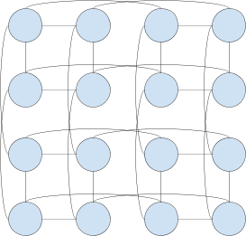

It is not immediately obvious, but if you look closely, you will find that you can go in a circle both up-down and left-right, so this is still a 2D torus, the nodes have just been moved around. This generalizes to much larger toruses of any dimension. The general pattern, which works for any dimensionality with even torus widths, is that all links skip a node except at the end where there is a direct connection.

This leads to a significantly more complex-looking connectivity, as you can see in the diagram above, but the result is that all the links are at most 2 units long. This enables a torus to use link technologies that only work for short links, such as copper traces.

For a 1D torus that is 4 wide in particular, there is an even simpler solution with very short links:

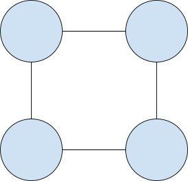

This simplest shape is what we’ll use twice in the proposal later in this chapter.

### Router topology

A router is a node with many ports which can transfer data between the ports, connecting the nodes that connect to it in a flexible way. This is an 8-wide router topology, with the router above and the 8 other nodes below:

### Link types

The economics of the networking for your chip depends critically on what type of link you choose to use. This section discusses a variety of link types.

In general, the shorter the distance, the more bandwidth you can get per dollar. This isn’t just that longer cables require more material to make - you end up needing completely different and more expensive solutions the longer the distance is. This is also true in your regular use of technology in ways that aren’t immediately noticeable. E.g. a long USB cable is a whole different level of technology from a short one, but from the outside they all just look like USB cables.

The list below is ordered by the distances involved, from short to long. This also roughly orders the links by bandwidth per dollar, from high to low.

### Connection on the same chip

The highest bandwidth, lowest latency and cheapest connection you can get is between two components on the same chip. This factor is in large part what leads to creating very large chips. The economics for this are good up to a certain point. Larger chips are more expensive in terms of yield.

### Chip-to-chip connection via silicon bridge

Two chips are placed right next to each other and connected via another small piece of silicon that is placed on top of both chips. That small piece of silicon is a small chip in itself, leading to increased expense for this solution. This is a technically difficult method because the 3 chips in this scenario have to be aligned with extremely fine precision.

It might seem more sensible to connect chips directly at the side, but this isn’t normally done because chips are printed from the top, so there is nothing on the side to connect to. You might imagine printing something on to the side, but printing something onto a third chip entirely is much easier - you can do that using existing technology for making chips.

This is how multi-tile designs like Blackwell are done and it is also how HBM is connected to a chip. For HBM the connecting chip is called an interposer and the interposer is one part of the increased expense and complexity for HBM compared to GDDR memory.

### Connection via chip pin

Your chip has high-bandwidth pins coming out of it. This is how a chip is connected to memory, network and any other components like an SSD.

### Connection via passive copper trace

These are lines of copper on your motherboard aka Printed Circuit Board (PCB). Copper traces can be cheaper and higher bandwidth than copper cables because the copper traces do not have to be flexible and copper traces are usually pretty short. Be aware that if you need a very high bandwidth for copper traces delivered to one central point, such as the pins of your AI chip, you will need a more expensive PCB with many layers. This can still be much cheaper than the equivalent bandwidth supplied using copper cables.

If you can place your AI chips close to each other on the same PCB, then you can use passive copper traces to create a very fast network between them. For example you might use a layout like this to connect together 4 chips, where the circles are chips and the squares are other components, like memory or an SSD.

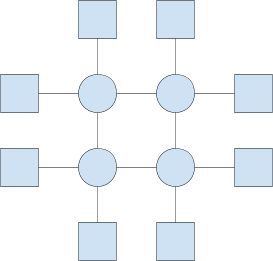

The benefit of this particular layout is that the copper traces can be very short.

### Connection via active copper trace

If you need a high-bandwidth copper trace to go far on your motherboard, which just means more than a few centimeters, you may need repeaters to strengthen the signal along the way, making the copper traces more expensive and higher power.

### Direct PCB-to-PCB connection

Just as for chips, you can place two PCBs right next to each other and connect them in some way. This connects copper traces betwfrom one PCB to the next. This is what I mean by “snap-together” motherboards.

One option is mezzanine connectors, where one PCB is placed on top of the other at the edge, connecting at the dge, creating a gradual staircase of PCBs going up (or down) or going up-down if you place the next PCB edge over and then under and then over again and so on. Another option is placing the boards right next to each other at the same level and connecting via some sort of mechanism at the side of the board, e.g. a cap that connects pins from the edge of one board to the next.

### Connection via backplane

In this scenario, multiple PCBs connect into a backplane PCB which connects them together. This kind of connection is usually at a 90 degree angle. This is the configuration for components connected via PCIe on a traditional motherboard, with the traditional motherboard acting as the backplane for the PCIe components. For very short distances the backplane may be able to passively connect traces between the other PCBs. For longer distances, the backplane has to be powered. You can also imagine placing a router chip on the backplane, creating a routed topology without the need for expensive cables.

The backplane is usually done with some kind of connector, so that the other PCBs are not permanently attached to the backplane. So the failure domain is much reduced for this approach than for having one big PCB, because if one of the connected PCBs fail, that connected PCB can be replaced individually - you don’t have to throw the whole system out. The backplane itself can also be replaced without throwing away the PCBs it connects.

The limitation for a single backplane is how big you can make it with good economics and how close together you can place the PCBs it connects. If the connected PCBs require a large air-cooled heat sink, then you will not be able to pack that many of them onto one reasonably-sized backplane as they will need to be physically widely apart. If you use water cooling, you could potentially fit a large number of PCBs on one reasonably sized backplane.

### Connection via copper rod

You can connect two PCBs together at a distance using a rigid rod of copper or other material, i.e. a cable that is rigid instead of flexible. Such “cables” are less expensive and lower power, but ths is not a standard method, so you may need a large order to make it economical. You might consider something like this to create a 3D arrangement of tightly packed chips.

### Connection via flexible copper cable

The next step up in terms of increased expense and distance is flexible copper cables. When people speak of “an ethernet cable” this is usually what they mean, though ethernet is a protocol that can run on any type of link. If you are running high bandwidths across flexible copper cables, you are probably doing something that could be done more cheaply using one of the alternative approaches above.

### Connection via optical cable

Optical links are superior for long distances since they have less degradation of the signal across long distances. Google and more recently also Nvidia use optical links to provide high bandwidths for their AI chips. This is the most expensive solution.

Why would Nvidia and Google use the most expensive solution? Because it is the easiest to work with and neither product is cost optimized. An expensive optical cable can let you connect an expensive GPU to an expensive router 100m away at maximum bandwidth, so this way your expensive datacenter can be physically arranged any way you want (within reason). That’s very convenient and a genuine advantage. If you try the same thing with cheap on-motherboard copper traces, you have to space things within centimeters, not 100 meters.

Optical cables, optical ports and optical routers are expensive, but GPUs and TPUs are even more expensive than that, so the expensive networking isn’t such a high percentage of the overall cost.

Perhaps you will choose to use optical cables, too. But do you really need them? See if you can’t find a more economical solution.

### The specter of multi-hop waste

You might think that the bandwidth of your network is the sum of the bandwidths of the links. This is the ideal case, but you may not be able to realize this. For example, a routed topology will never be able to do this - it always wastes at least half the bandwidth. This section goes into detail on why this is.

During a given AI workload, the average useful bandwidth per chip is:

average_link_utilization * all_chip_links_bandwidth / average_hops

This formula is simplified but is accurate enough to give the right intuition.

### Link utilization

Average link utilization is 100% if all links are used to capacity all the time in both directions. Idle time on a link reduces the utilization. If a link is only used 80% of the time and only in one direction, then utilization is only 80% / 2 = 40%.

### All chip links bandwidth

We are calculating a per-chip average number, so this is the sum of the bandwidths of all links on a single chip.

### Average hops

This is how many links a bit has to traverse on average to get to where it needs to go.

For a topology with a single router, the average hops is always 2, since the path is always chip -> router -> chip. If only neighbors communicate, the average hops for a torus is 1, since there is no router in-between chips. So a router is always at most 50% efficient, while a torus can potentially be 100% efficient.

Never in my life have I heard anyone say that routers are inherently at most 50% efficient, so I think that this is not completely obvious. So I’m going to explain it in some detail, even though this is really simple. Consider this diagram:

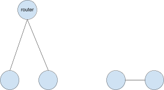

On the left, two chips are connected through a router. On the right, two chips are connected to each other directly. The bidirectional bandwidth between the two chips is the same either way. So half the bandwidth is being wasted on the left. We bought 2 cables (and a router) and only get 1 cable’s worth of bandwidth on the left (here including ports and any other associated overhead in “cable”).

Here’s another scenario:

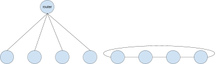

On the left you see 4 chips connected via a router and on the right you see 4 chips connected as a torus. In this case, the number of cables is the same either way, so you might think this is equally efficient. But no. Every chip on the right has 2 cables connecting to it, while on the left you only see 1 cable per chip. So bandwidth per chip on the right is twice that on the left. So it’s the same as before - the router is wasting half the bandwidth and that’s before considering that using a router also requires the additional expense of buying a router, so it’s even less than 50% efficient economically.

Another way of understanding it is that the router is not a useful destination in itself, so every port on the router and all of its bandwidth is wasted. Every port on the single router is matched by a port on a chip 1:1, so exactly half the bandwidth is wasted. Or potentially more if you have multiple levels of routers where some cables connect a router to another router, at which point the bandwidth of both ports that such a cable connects is wasted.

Once you run out of ports on a single router, you need to use multiple routers and perhaps multiple levels of routers. There are many schemes for how to do this and they in general tend to be complex and involve long cables. Routers are already expensive and needing many of them in this way makes routing even more expensive for the bandwidth that it provides. Routed bandwidth is expensive bandwidth.

Going back to the formula at the start of this section, the reason the torus can be twice as efficient as the router is that average_hops can be 1 for a torus while for a router it is always at least 2. For the router, the distance can be greater than 2 if you use multiple levels of routers. But less us focus on a single router, which is the best case for a routed topology, where the distance is always 2.

This is why Google TPUs use a torus topology: you get a 2x on bandwidth, you don’t have to buy a router and the links can be shorter and therefore cheaper.

Hold on, you might say, a workload on a torus *can* be 100% efficient, but is it always? No. The torus loses efficiency if communication between nodes goes further than a neighbor. If two nodes on opposite ends of a 16-wide torus have to communicate with each other, then that will require 8 hops. So a torus can achieve an average hops of 1, but it can also be higher. For a large torus, it can be much higher. This is why routers exist, despite their inefficiency - they are still less inefficient than a large torus for random traffic.

The average hops on a torus depends on the algorithm and the workload. The neat part is that almost all AI networking *can* be done so that only neighbors communicate, yielding 100% efficiency on a torus! But MoE workloads are not like that. So before MoE, toruses had a massive advantage over routed topologies for AI networking. After MoE, it is a more complicated question. There is more on MoE in the section on networking for MoE below.

### The big 3: Reduce-scatter, all-gather and all-reduce

The big 3 classic AI networking operations are: Reduce-scatter, all-gather and all-reduce. These cover almost everything an AI workload needs to do with weights and activations over the network. Also, the big 3 can be done using only neighbor communication, so they can be 100% efficient on a torus topology. Nice!

In more recent times, the big 3 have become the big 4, adding MoE. Unfortunately, MoE workloads cannot be done using only neighbor communication, degrading efficiency on a torus. This section concerns just the big 3. MoE is discussed in the next section instead.

### All-gather

For all-gather, you  have X bits on each of N nodes and you want all the nodes to have all NX bits. So if a node has a 4 and the other node has a 6, all-gather will put (4, 6) on both nodes.

So this is an all-to-all broadcast. Let’s look at how to do this on routed and torus topologies.

### All-gather on a routed topology

Here is the algorithm for this on a single router: Every chip sends its X bits to all the N-1 other chips. So every chip sends and receives (N-1)X data on their one bidirectional link, so total time is (N-1)X divided by the link bandwidth.

The average communication distance for one router is 2, so this algorithm wastes half the bandwidth. If you need several levels of routers, the algorithm becomes more complex and the communication distance increases above 2 and so you waste even more bandwidth. The exact average distance depends on how you wire up the extra routers. There are many possible different schemes here and each requires a custom algorithm.

### All-gather on a torus topology

Here is the algorithm for this on a 1D torus: Each chip sends X/2 of its bits to the left and the other X/2 of its bits to the right. Then every chip sends all the bits it received in the previous step forward, so the bits from the left neighbor is sent to the right neighbor and vice versa. After N-1 steps of this, the all-gather is complete and all the nodes have all the bits. So every chip sends and receives (N-1)X data on their two bidirectional links, so total time is (N-1)X divided by the link bandwidth. This is assuming you pipeline to hide link latency (which you should) and there is enough data to transfer to cover the round-trip latency (which there should be).

The average communication distance for this is 1, so this algorithm doesn’t waste any bandwidth. This is why it is twice as fast as a routed topology using the same number of cables and ports and without having to buy a router.

The algorithm is similar on a D-dimensional torus. For simplicity, let’s say D=2. First, do the 1-D algorithm on the rows of the torus. When that is done, take the resulting XD bits per chip and use the 1D algorithm on the columns of the torus. This will correctly distribute all the XN^2 bits across the torus.

But this only runs at half efficiency, since we left column links idle during the first step and the row links idle during the second step. To fix this, divide the data into two halves and run the exact same algorithm in parallel but with row/columns switched. This will run two copies of the same algorithm on disjoint links. The result is 100% efficiency and this is again twice as fast as the routed topology.

For D dimensions, you do the same thing, but with D steps and with D parallel invocations of this algorithm. The result is again 100% efficiency. This is in contrast to routed topologies that get less efficient for this the larger they are.

There are various academic reference for this, [here is one](https://link.springer.com/article/10.1007/s10586-006-9740-9).

### All-gather on an asymmetric multi-dimensional torus topology

What if the dimensions in a D-dimensional torus do not have the same bandwidth? This is going to be one of the configurations that we’ll consider in a later section, in part because this works out quite well.

Suppose we have an NxN torus where the row (first) dimension is slow and the column (second) dimension is fast. Suppose more precisely that the fast column dimension links have precisely N times as much bandwidth as the slow row dimension links do.

In this case we cannot efficiently run two instances of the algorithm as we did on the symmetric torus, because the first step in the column-first instance will be done much sooner than the first step in the row-first instance, leaving the fast column links idle for a long time as they wait on the slow rows to get done. So what to do instead?

First, we are going to pipeline the operation, so that we have many pieces of data each of a smaller size X. Then we run the 1D algorithm on the slow row dimension on the first piece of X data, then we run it on the second piece and so on until we have done all the pieces for rows. As soon as the first piece is done for rows, we start running the 1D algorithm for columns on the result for the first piece, then the second piece and so on. This leaves some links idle at the beginning and the end (as pipelining always does) but as long as we have many pieces, this is a negligible effect.

How fast is this? Well, when we run the 1D algorithm on the slow rows, the result is that each node now has XN data instead of X data. Then columns now have to do an all-gather on the XN data, yielding a result with XN^2 data per node. So the column links have to transfer N times as much data as the row links do. But the column links also have N times as much bandwidth as the row links do, so the pipeline ends up being balanced and we achieve 100% utilization of the links, except for the first piece and the last piece of data, but this overhead can be made negligible by having many pieces (easy to do) or by co-scheduling different such pipelines with partial overlap (hard to do). So an asymmetric torus of this kind can still do all-gather at near-100% efficiency.

### Reduce-scatter

For reduce-scatter, you have NX numbers on each of N nodes and you want to sum them all up and distribute the results of the sum evenly across the N nodes, leaving each node with X distinct numbers from the sum. So if a node has numbers (1, 2) and the other node has numbers (3, 4), then the sum is (4, 6) and the first node would end up with a 4 and the second node would end up with a 6.

Believe it or not, you can do exactly what I wrote above for the all-gather, but in reverse. So the order of operations is reversed and whenever the all-gather algorithm would take a number and duplicate/send it to another node, instead a number comes in from that node and that number is added to the local number, yielding one number that is then itself passed on in the opposite direction of all-gather. Everything works out the exact same in this way, including how fast it is. So I won’t get into details on this - it’s just all-gather in reverse with sums. So also for reduce-scatter, torus topologies run at 100% efficiency and routed topologies run at half speed at most.

### All-reduce

For all-reduce, you have X numbers on each of N nodes and you want to sum them all up and distribute the entire sum vector of X numbers to all N nodes. So if a node has numbers (1, 2) and the other node has numbers (3, 4), then the sum is (4, 6) and both nodes end up with (4, 6).

If you first reduce-scatter and then all-gather, you will have performed an all-reduce. Doing it that way is also optimal, so that’s how to do it. So also for all-reduce, torus topologies run at 100% efficiency and routed topologies run at half speed at most.

### Ring attention

Ring attention is technically distinct from the above 3 operations, but the communication pattern of only needing to talk to neighbors is similar, so you again end up with routing running at half speed compared to a torus. With some complications, this also works on a bandwidth-asymmetric torus.

### Meshes

You need somewhat different algorithms on a mesh topology. It turns out that these algorithms run at half speed of a torus - same slow speed as a routed topology. Yet a mesh only saves a few links compared to a torus, so tori are preferred for AI over meshes.

Where you might end up with a mesh anyway is if you have a big torus but you only want to use a subset of it. The subset will not have the wrap-around links for the dimensions where you took a subset, so you end up with a mesh in those dimensions. This can be fine as long as your use-case runs OK with a half-speed network for operations like all-reduce.

### Mixture of experts versus network topology

Mixture of experts is the spanner in the gears for a big torus topology because mixture of experts requires communication beyond just neighbor-to-neighbor communication. You need to take multiple hops.

For a single router, the average communication distance is always 2. This is inefficient compared to neighbor-only communication on a torus, where the average distance is 1, but if the torus needs to send data to non-neighbors, then that increases the average distance above 1 and, perhaps, above 2, at which point the torus is even more inefficient than a router.

So the question is, what does the average communication distance become on a torus with MoE? Suppose MoE needs to send tokens around uniformly at random. Then the average distance on a 4-wide torus is 1. That is because there is a 25% chance that the token is already on the right node, so that is distance 0, there is a 2*25%=50% chance that the token needs to go to one of the two neighbors and there is a 25% chance that the token needs to go to the opposite node at distance 2. So the expected value is:

0 * 25% + 1 * 25% + 1 * 25% + 2 * 25% = 0 + 1/2 + 1/2 = 1

The same average distance on a router is:

0 * 25% + 2 * 75% = 1.5

So the torus still wins. The true calculation is a bit more complex due to the possibility of single-link congestion on multi-hop routes in the torus, which can also happen on a router (suppose all tokens go to the same chip). Overall the torus still wins. So we can see that it is not so simple as routers having an advantage for MoE.

MoE routing is not uniformly random, it depends in part on properties of the document that the token comes from, so you might also be able to exploit the statistics for this to significantly improve the average MoE distances on a torus (just relocating the token is not so easy, since you then have to move the KV cache with it, but that’s OK if the whole document prefers certain experts over others). You may want to do this even for a router if you end up doing MoE across multiple levels of routers.

When comparing to a router, keep in mind that a large routing network cannot be handled by a single router, so the average distance for large router topologies will rise above 2. How much above 2 it will be depends on the exact topology used (how you wire the routers together).

What about a 4x4 torus? Well each dimension introduces the same average distance, so the overall average distance is 1 + 1 = 2. That’s the same as for a router and you didn’t even have to buy a router. And for a 4x4x4 torus the average distance is 3, which is worse than for a single router, but still you don’t have to buy a router. So there are both pros and cons here.

Another thing to notice is that you might have more experts than you have nodes and many tokens activate multiple experts. This means that the same tokens may need to go to multiple nodes. Depending on how many nodes there are and what proportion of experts are activated per token, this can much reduce the number of wasted hops on a torus, shifting the balance in favor of the torus again. In some cases like this, MoE traffic might start to look like all-gather traffic, at which point the torus is again strongly preferred.

Yet another relevant factor here is within-layer (tensor) parallelism within an expert. If experts are large enough, you can parallelize them across several chips to reduce token latency. This again shifts the balance in favor of toruses, as toruses are most efficient for this kind of parallelism. So we see advantages for tori both for a large number of experts (where data must be sent to many nodes) and for a few (where we may be able to parallelize).

So a 4x4x4 torus is still a good choice even with MoE. Perhaps not coincidentally, you can rent Google TPUs in this exact topology. They call it a cube.

Where there is NOT an advantage for toruses is if the torus is quite large. You can [book a 16x16x24 torus of v5p TPUs](https://docs.cloud.google.com/tpu/docs/v5p). The average MoE distance on this thing will then be 16/4 + 16/4 + 24/4 = 14, which is really not great. Even here, you might be able to parallelize the last 24 dimension, bringing the MoE distance down to 16/4 + 16/4 = 8. This is 16*16*24 = 6144 chips, so a router network will also need many routers, so the comparison distance is not 2 for a router, it is something larger. The TPU torus network is so fast that MoE probably still works well enough, it’s just not as cost effective in terms of how much bandwidth had to be provisioned.

Long story short, MoE is fine for smaller tori, but not for huge ones. If you stick to 4x4x4 tori, or smaller ones, you should be OK versus a routed topology - also for MoE.

### A proposal for a networking approach

I can’t tell you how you should network your chip. It depends on too many details about your chip and fab prices that I don’t know. What I can do is describe an idea for an approach that I think is interesting. I’m not saying you should necessarily use this configuration, but it might be a worthwhile exercise to do the cost math to ensure that your solution is superior to this one.

### The topology

The base version of the idea is a 4x4 torus of 4*4=16 chips. Let’s call this a *donut*, since it is a 2D torus. If you buy 16 off-the-shelf routers with N ports, you can connect together N donuts, to create an Nx4x4 topology that we’ll call a *box*. So one router connects together N donuts at the same position in each donut, e.g. position (2, 0) in each of the N donuts will be connected on the same router.

The idea is to wire this up so that the 4x4 torus is densely packed, so that distances are short. This enables using links that can be both cheap and high bandwidth. High-bandwidth routers and cables are expensive, so we won’t use any of those. Instead, we will use cheaper lower bandwidth routers, so that the N dimension will have much less bandwidth per link than the torus does. This way we have high bandwidth in the torus and everything is still cheap. If N=16, this scales to 16*4*4=256 chips. That should be enough for most inference use cases.

It is not a big problem that the N dimension is lower bandwidth. A single donut will often be enough parallelism already. If not, then you can use the N dimension for between-layers parallelism, which has much lower bandwidth requirements (if coupled with within-layer parallelism). Note that “lower bandwidth” is by the standards of AI accelerators - this may still be a fairly fast router compared to other uses. It just doesn’t have to be some exotic technology.

Big toruses have a problem for MoE workloads, but a 4x4 is small enough that this is not such a big issue - see the previous section on MoE versus network topology. Average uniformly random pair distance on a 4x4 is 2, almost equal to the 1.5 you get with a router.

Large toruses have a problem with failure domain. If you put 256 chips in a torus, and one of them fails, then you’ve disconnected the torus so the entire 256 chips have a problem. There are ways around this, but it’s a menace to deal with. In this approach, the failure domain is limited to a donut. If a chip fails, only the donut that it is part of has to be serviced. This is because the donuts are connected via routers and having a missing donut on those routers doesn’t interfere with the functionality of the remaining donuts. This is a similar effect to Google’s fancy optical routers, where they achieve something similar, but this is using cheap off-the-shelf regular routers.

You are going to have to provision a datacenter network connection to your AI chips anyway. The Nx4x4 approach extends this connection to be part of the AI network instead of something external. You will reach the datacenter network also through these routers.

Loading weights for a big model onto an AI chip can take quite a while, so you end wanting to have a fast network from storage nodes to your AI chips. Yet the steady state usually doesn’t require so much bandwidth - stored KV caches can be large, but you shouldn’t be exchanging *all* the KV caches at the same time. So a network that is provisioned to load large weights quickly lies idle most of the time. The Nx4x4 topology reduces the waste here, since the N dimension serves both to transport weights and, potentially, as part of the AI chip network itself.

What happens if a *router* fails? It might seem that the failure domain in this case is the entire Nx4x4 topology, since we will be missing the connection to one chip in every donut this way. However, every chip has 4 neighbors in the 4x4 torus, so you can route traffic to chips with a failed router through the torus, with each of the 4 adjacent routers taking up 1/4th of the slack of the failed router. This will consume a bit of bandwidth on the torus, but this is small as the torus network is much faster than the router network and each link is impacted by only 1/4th of that. You might also pull in bandwidth from further away in the torus than just the direct neighbors. You can also use this approach to temporarily increase bandwidth to load weights onto a subset of the topology - if a user rented a single chip, potentially you can offer up to 16x the bandwidth (or 64x if you use Nx4x4x4) for peak transfers like loading weights.

Many customers will not be using an entire 4x4 donut. Suppose a customer starts a model running on a 4-wide ring (1/4th of a donut) and has to load a large amount of weights. The other chips on that donut of 16 chips probably are not using their router links to capacity, so you can temporarily boost the weight loading bandwidth by as much as 4x by using all the routers and using the otherwise idle torus links within the donut to deliver that data to the 4-wide subset that this customer booked. That won’t work if the other customers on that donut are using their router links to capacity, but this is unlikely. So it is a significant but only best-effort optimization.

### Physical realization of Nx4x4

This part of this section is a proposal for a physical networking realization of the Nx4x4 topology that is intended to achieve high bandwidth at low cost. I am not a hardware engineer and this particular section is somewhat beyond my actual expertise - never the less, I think this proposal is interesting and perhaps you will, too.

If a 4x4 is a donut, let’s call a 4-wide torus a *ring*. The donut will be built out of rings. Let’s start with looking at one ring. A ring is realized on a single motherboard like this, where circles are chips and squares are external components, like memory or SSDs.

This amortizes the cost of the motherboard across 4 chips and makes it cheap to connect these chips together in a fast 4-wide torus, since the chips are close to each other on the same motherboard. If you are using air cooling, there may be some thermal challenges here, but something like this should be possible. You could imagine many more chips per motherboard to push these benefits, but since these chips will be soldered onto the motherboard, this will inflate the failure domain from 4 chips to many more chips.

We will build a donut by connecting 4 rings together. There are a bunch of ways of doing this. I will propose a configuration that results in very short distances to maximize bandwidth and minimize cost.

You can imagine placing 4 ring boards next to each other and connecting them at the left/right edges using pins with some kind of cap to connect them. That works, but this will create a line (mesh) not a torus. We need to connect the leftmost ring board to the rightmost ring board, but these are far from each other. For TPUv2 and TPUv3, a problem similar to this was solved using an expensive long optical link. I’ll propose something else instead: Fold the leftmost 2 ring boards under the rightmost 2 rings boards. Now you can close the loop at the right side, since the two ring boards we wanted to connect are now right next to each other. It will look something like this:

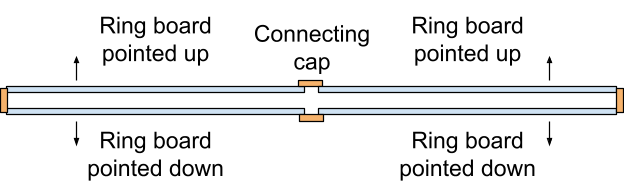

An alternative is to use a folded torus with skip links and all boards pointed up, but this causes longer distances between connected chips, which may require additional expense. Ideally, you will be able to make the ring boards with a small enough width so that the chip -> connector -> chip path is so short that it can be a passive copper trace connection all the way from one chip to the next. Short passive copper traces are both cheap and fast. That’s the point of this up-down configuration.

Each ring board will have 4 network ports, one for each chip. So that will be 16 ports per donut, and each of the 16 ports will connect to a different one of the 16 routers in a box of 16 donuts.

The approach suggested here is minimal in per-chip cost and also has minimal development and other fixed costs. A big benefit of low-cost high-bandwidth networking is to allow you to spread equivalent performance across many economical medium-sized chips instead of expensive huge chips or expensive tile packages. The downside is that the software now needs to be aware of the torus topology to capture the full bandwidth. Though on a 4x4 torus, the average path length for random node pairs is 2, which is nearly the same as for a single router, so even software that does not take the topology into account may run quite well.

> Asymmetric bandwidth toruses for nerds  **You might consider an asymmetric torus, where the on-motherboard torus dimension has the most bandwidth and the between-motherboards dimension has 1/4th that bandwidth. This works well for all-reduce, reduce-scatter and all-gather workloads. But I have not so far been able to figure out a way to make an asymmetric torus work well for MoE workloads, so I don’t think that I can recommend this, even though I would really like to. If you can figure out some way to make an asymmetric torus work with MoE, and there might be a way, then I think that a 4D Nx4x4x4 topology with 1/4th the bandwidth at each dimension becomes very interesting, as then the routers at the N dimension only has to provide 1/64th the bandwidth to keep up. Routers are expensive, but if they only need to run at 1/64th the speed, then their economics start making a lot more sense than otherwise.

Well, there is *one* way I can see how it might work: If you could guarantee that each expert in MoE will be large enough to parallelize 64 ways, then that’ll work, since then you can use within-layer (within-expert) parallelism for the 4x4x4 dimensions, leaving just a routed topology for MoE, but the premise of 64-way within an expert seems difficult. Perhaps possible, though. If that works for you, I would seriously consider an asymmetric Nx4x4x4 torus. The wiring can be, in order: traditional routers with long cables, short copper cables, between-MB edge-to-edge connections, on-MB connections.
> Tool use, agentic orchestration and replacing the host for nerds  You may recall that part of my recommendation is to not have a host computer/CPU to control the AI chip. Instead, I propose to put modest CPU cores directly onto the AI chip so that it can control itself. However, we *do* at times need heavy CPU compute *somewhere* in the datacenter to support AI - this is something that happens especially for AIs that use tools and where those tools are very heavy on CPU compute. E.g. compiling and running large amounts of code can require a lot of CPU cycles and this is something that AIs now do - write, compile and run code.

You may have heard that it is agentic AI that requires heavy CPU resources. That’s not how I see it, since more precisely it is *tool use* that can explode CPU requirements. The relationship to “agentic” is that agents commonly use tools, so the idea is not quite wrong, either. Here “tool use” is an expansive concept, including e.g. vector database retrieval or searching Google.

Another claim I’ve seen is that agentic *orchestration* heavily spikes CPU requirements. Here “orchestration” doesn’t mean tool use or running the tools themselves, it means just keeping track of the interaction between multiple agents and tools. This doesn’t make much sense to me, since keeping track of these interactions shouldn’t require a lot of CPU cycles. Orchestration might slow things down on the CPU if you implement it in Python on a single thread, though, or some such cockamamie approach - such things are common in AI since AI practitioners frequently are not also experienced software engineers. So how did we end up with the idea that agentic *orchestration* is a primary CPU bottleneck? Because it is if you do the software badly, so there is a legitimate space for providing better solutions to people, but those solutions will be primarily software solutions, not primarily hardware solutions. However, I think the deeper reason for all of us talking about “agentic orchestration” as a bottleneck, instead of “tool use”, is that “agentic orchestration” sounds new and fancy, while “tool use” sounds old and boring. So you seem more sophisticated if you use the wrong term, saying “agentic orchestration” when it’s really primarily about “tool use” in terms of the potential for very high CPU use.

However, tool use is real and not going away, so we *do* need access to heavy CPU compute and preferably in the same datacenter as where the AI accelerators are stored. The onboard CPU cores I recommend should be enough for “agentic orchestration”, but not for heavy tool use like large compilation jobs triggered by an AI. So now it sounds like maybe we need to bring back the host computer to house our AI accelerator? That will supply a bunch of CPU compute right next to the accelerator. I do not recommend this. The idea of the host is that it controls the device and there is no reason to reintroduce that. Many AIs do not use tools so heavily, so in this case you’ll be stranding capacity on the host, and with heavy enough tool use, you will need far more than one computer, the host, to satisfy the CPU load. So the host is still a bad idea, I think. You simply need the datacenter to have CPU capacity somewhere and enough bandwidth between the AI accelerators and the CPUs to have this work out. You also need reasonable latency, but this is not hard within one DC. When I worked at Google, all compilation happened “in the cloud”, never on my local machine, and you can just do the same thing with AI. If the AI will do retrieval, you of course also need access to CPUs that can execute this. This can happen partly locally, using the local CPU cores and SSD that I recommend provisioning on your AI accelerator, but for very large databases (e.g. searching the internet) you may need access to outside resources for this as well. You also need a way to transfer KV caches and weights to your accelerators. So no matter what you do, you do need a nice connection to the rest of your datacenter and general datacenter capacity, and that is all that tool use requires, too.

There is a caveat here for video (de)compression and encryption. For most data you can stream it elsewhere for processing, but video in particular requires (de)compression to happen locally, since uncompressed video can be too large to reasonably transfer over an expensive network. So you’ll need to ensure that your AI system as a whole, somehow, is capable of doing fast enough video (de)compression in particular, which can be a heavy-duty computation. Same thing for encryption, which doesn’t change bandwidth requirements, but where for policy reasons you may want to insist on encrypting all data in motion, which then has to happen locally.

There is a common misconception that the AI devices will be idle while tool use or other CPU work occurs and then, presumably, the CPUs would be idle while the AI device works (this is commonly what happens for AI chip hosts - they are mostly idle most of the time). There is no need for that. You just need to ensure that your AI device has other AI work to do while it waits. This has similar tradeoffs as using pipelining to avoid waiting on the network inside a transformer - see the chapter on parallelization.

There is one idea I like that somewhat revives the idea of the host, but in a different and more economical way than what is traditionally done - place a host/CPU on the other end of a short twinax cable from your AI accelerator, perhaps in a 1:1 ratio to your AI chips. But this CPU will not be a host, since it will not control the AI device (the CPU cores on the device do that). It will simply be a general CPU available for general DC work that may be unrelated to AI. However, when the AI uses tools, or otherwise requires extra CPU oomph, the datacenter software will try to preferentially place that CPU load on CPUs close to the AI chip, e.g. perhaps right on the CPU at the other end of that short (i.e. cheap) twinax cable. You could even connect the CPUs together in a similar Nx4x4 topology, this approach is so cheap that this is feasible, especially if you are making your own CPU, which creates something like a 4xNx4x4 topology if you connect four CPUs on a ring board to each different Nx4x4 topologies. This can also expand the best-effort reach of being able to service peak bandwidth, since you can wire it up to connect otherwise independent tori. Though just placing your CPU clusters elsewhere in the DC, as is traditionally done, works, too.
> Alternative for router-loving nerds  **If you have the scale for it, an alternative is to make your own 16 port router chip on a backplane or you might try to buy one with the right properties and cost. This starts looking more like what Nvidia is doing. You’ll preferably need water cooling for this, so that you can pack 16 ring boards onto a not-too-large backplane PCB - e.g. 2 cm spacing yields a 32 cm PCB dimension, which is perhaps not too large to still use passive copper connections. The backplane will have four 16-port router chips on it, to create a 16x4 topology. You can also have two backplanes, one on the left for the 2 chips on the left half of the ring board and one on the right for the 2 chips on the right half of the ring board. This will minimize distances and on-motherboard wire congestion. This creates a larger topology without making MoE routing worse and still maintaining economics. You can still use cheap, slower routers on top for an Nx16x4 topology or potentially just wiring the 4 custom routers up directly into an external router topology (so in this case you’d connect to the routers directly, instead of adding another link to each chip) that is less economical on a bandwidth per dollar basis, but which is amortized over now 16 * 4 = 64 chips.
> Proper amortization math for nerds  Suppose you make a network that is 1/8th the price of what Nvidia offers, but your chip is also 1/8th as powerful as an Nvidia GPU. Have you saved on the network? No, you haven’t. To match an Nvidia GPU configuration, you’ll need 8 of your configurations and also therefore need to buy 8 times as much networking gear. So you haven’t improved anything (except perhaps it’s a benefit that your solution can scale down further), just matched Nvidia (and at same throughput, your token latency might still be worse). Therefore the proper math is networking dollars spent per unit of *realized* performance from your system. This is yet another obvious-sounding-when-stated connection that maybe isn’t that obvious until your hear it.
## Co-design

Co-design is optimizing your software and hardware together - each needs to support the other. For any given problem, it could be solved in software or hardware or a combination, and you need to figure out in each case what is right for your particular AI chip. That’s co-design.

Good co-design is not natural for either one of software and hardware professionals. There seems to develop a natural instinct that some problems should be solved in hardware and some in software, and that’s “just how it is”. The particular boundary may differ between companies, but there does tend to develop such an instinct. This may surface as insisting on doing it in the instinctual way even when pressed on it in a conversation, but that is not the harder problem to deal with - the harder problem to deal with is that this conversation never occurs in the first place because no one considers that the problem could be solved in another way. Also, while there are many common elements, some parts of software engineering and hardware engineering are quite different, so it is rare for one person to have expertise in both, which ideally you would have but realistically this isn’t something you can likely hire - the best people in your company on either thing are likely going to not be specialists in the other thing at the same time. So you need them to talk to each other. That’s co-design.

A good rule of thumb is that the hardware team should never design a software-facing interface on the chip without consulting the software team about that. Many things should be designed as a collaboration between software and hardware, not as hardware making a proposal that software then has to decide on (this tends to lead to software-tolerable designs, instead of software-positive designs). Many more things are software-facing than you might think. *Anything* to do with performance is software-facing, for example. *Any* hardware limit is probably software facing. If you do not have this rule, I can just tell you right now that your software-facing interfaces are probably going to be trouble to use in software. The less you talk to software people, the more trouble it is going to be later. This is one reason you may want your hardware team to sit physically close to the compiler / software dev team. Shouting over the divider: “Hey, Steve, what about X?” “Oh, yeah, that’s fine, we don’t care about that, but how is Y coming?”, “Oh yeah, about that ...”. You don’t want your “formal co-design process” to squeeze out these very efficient and direct conversations. Neither do you want important decisions to be made without anyone noticing in this way - but if the alternative is that a hardware engineer would just guess what software needs, as is otherwise very common, then that’s still better.

### My experience with co-design

This section is a bit specific to my own work, but it has some ideas for co-design overall.

For a period of some years, I was the software person that would be consulted on most hardware matters for TPUs. I eventually transitioned myself out of this by connecting people more directly as the XLA software team became larger with more experts in various areas. A few examples of what I worked on, so you can get a sense for what I was doing: I designed the interface for DMAs for TPUv4 to be much more software friendly than previously (the previous functionality required some kind of bit-pattern PhD to understand and also wasn’t general enough), I completely changed how memory protection worked on TPUs (the previous solution was so complex that we never used it, so I simplified it), I got quite a bit into the details of the performance properties of HBM on TPUs and I rejected some changes that otherwise would have made it into the chip on the grounds that it would be too challenging to program.

I also was consulted in terms of how to set hardware limits for many things on the TPU. It ended up as “consulted” but in the beginning, it was more like “discovered”. There are many more examples of needing to set a hardware limit for something than you might think if you haven’t been involved in such work. For some of these, early on in the TPU process, the hardware team had simply guessed and the software team wasn’t even aware that there was a question and that a decision had been made. This is a natural outcome of not enough co-design combined with tight schedules. E.g. how many DMAs should it be possible to have out-standing simultaneously in which contexts? Well, there are many contexts, so you need a limit for each one. And it matters because if there isn’t enough capacity, then a whole core will wait idle for DMA queue space to become available. A single underdimensioned queue could destroy performance overall. Yet grossly overprovisioning everything maybe isn’t the right call, either. Or maybe you need features to enable *one* DMA to do what several DMAs would otherwise do, but that requires complex DMA features, and that still doesn’t get you out of the need of having to figure out what the queue limits should be. Such matters need to be decided as a close collaboration between software and hardware teams - that’s co-design.

Good luck figuring out mathematically optimal answers for these decisions. Instead, it becomes a judgement call - preferably informed by simulations and other investigations, but that isn’t always feasible within time and resource limits. This is a judgement call you cannot make as well if you don’t have any experience actually programming the chip. Which even your software team will not have that much experience of for your first revision of your chip - a challenging situation. But certainly a hardware engineer is not likely to be most qualified to figure this out just on his own, yet in the absence of well-functioning co-design, that is what will happen. So you can see that you need excellent software engineering competence in your company for designing your chip, even before any software is written.

In any case, the hardware team, over time, came to place a lot of importance on consulting their users, i.e. the software team, and became appreciative of my advice as part of that. It also was a way for them to stop endless debates on such hardware limits, that no one could know the real answer to, anyway - we’ll just ask software and then they can’t complain later if there is a problem. I think this was a well-functioning situation, but it did concern me. It concerned me because, in many cases, the hardware team would simply ask me and then just go with that, on the (very reasonable) argument that my team needed to use the hardware so we need to listen to software. I was for this reason very careful about my responses in these situations, and I think it all worked out fine. Yet the problem is that I’m not a hardware engineer. I do not possess the expertise that someone develops from decades of hardware engineering work, no software engineer can, though of course doing this co-design work did greatly improve my understanding of hardware concerns (I find that if you just think of the math and consider that it has to happen on a 2D plane, that’s already enough to understand many things). So it’s not quite right to simply take software’s word for what is needed, either, because these decisions almost always involve the need for both software and hardware expertise.

What is needed is *respectful negotiation*. To consider: do we really need this? What’s the cost? What’s the benefit? In both software and hardware - my concern above can then be rephrased as that I had to take both sides of this negotiation myself in some cases. Your software and hardware leads are probably (hopefully!) not going to have a problem doing respectful negotiation with each other. However, individual hardware team members who just want to get on with their work might be happy to let software make some decisions in a hallway that then they cannot get blamed for later and their colleagues will have a harder time contesting because “software said so”. So ban that, right? Well, that’s not great, either, because continually asking software in this way is a *good* thing - hardware engineers will make better decisions, and become better at their craft, if they can easily access the perspective of the users for their product - software engineers. You will defeat much of this knowledge sharing if you ban one set of engineers from talking to another set of engineers. But it does need to *also* involve respectful negotiation.

If the alternative to a decision being made in a hallway is a hardware engineer just guessing what will work for software, then the hallway is better. You could require *all* decisions to go through a formal co-design process, as an alternative, but then you will cause your hardware team development velocity to grind to a screeching halt. Also I imagine that this is not as interesting to work in this way, so I would guess that there would be a morale impact, as well.

So you can see how finding the right balances here is challenging. Which solution is best for you might well depend on what people you have available in your company for a given project, not necessarily so much on finding some kind of generally optimal process.

One thing that’s important is just to share information. During my work on TPUs, I made a huge spreadsheet of all the capacities, bandwidths, limits etc. on each TPU. Previously, you’d have to closely study the spec or go ask someone to find this information. I know that this was useful as I could see that the resulting document received many thousands of visits.

### Intellectual quality and good judgement

If you want to figure out what the impact of something, let’s call it X, is, you have to include the derived consequences of X. You can’t just look at X itself. The error of failing to do this happens *very easily* in co-design. It is the #1 most common cause that I’ve seen in co-design where something appears to be certainly true but actually it’s wrong. Here are some real co-design examples from my own career where experiments were misinterpreted.

**What is the impact of op fusion?**  For example, op fusion is an important optimization for AI accelerators. It involves doing multiple operations on data when you bring it into a faster memory, so that you do not have to bring it there again later. How would you quantify the impact of this optimization? Well, XLA already has extensive support for this, so it should be easy to quantify: turn this optimization on and off and measure the difference. If you do that, you’ll get numbers showing a tremendous impact. Yet these numbers, even though they are derived from an actual experiment, are just a fantasy.

The error is that turning off fusion is something that has derived consequences. The most important derived consequence is that, if XLA had not supported op fusion, then never in a million years would we ever have designed XLA as it is. The one change leads to other changes. Indeed, other systems with poor fusion support are NOT designed like XLA. In particular, XLA decomposes many ops into tiny little operations. This is a fine idea *because* of the extensive fusion support. But if you then take XLA *as it is* and just turn off fusion, you’ve created a truly terrible system. So you are greatly over-estimating the impact of fusion as a technique. Fusion *is* a powerful technique, but the numbers you get this way mean very little.

**How much scalar compute do we need?**  Suppose you are designing the next version of an AI chip that is going to have faster systolic arrays. The question is if you need to add extra scalar compute to keep up with the now greater amount of work that has to happen to service the systolic arrays. Well that’s easy, we just take our existing ISA simulator, crank up the clock on the systolic arrays and see if we end up being bottlenecked on scalar compute. That’s an experiment, that’s the *scientific method*. Science proves it: we *do* need more scalar compute. Or do we? In fact these numbers do not at all settle the matter.

The problem is that increasing the need for achieved scalar computation is something that has derived consequences. One of the consequences is that the compiler team will optimize scalar computations to a much greater extent, which maybe they hardly did at all before since there wasn’t a need for it. Now there is. Maybe just mildly unrolling hot loops is sufficient to keep up. So even if your experiment seemingly implies that you need to double your scalar compute, maybe you don’t actually need to change it at all - due to derived consequences. Maybe you could halve it and still keep up, who knows - there might simultaneously be an opportunity in the *opposite* direction.

**Can we support dynamic shapes on TPUs?**  This was a hot topic on the XLA team for a time. Dynamic shapes refers to a situation where the tensor/array shape/bound/size is not known at compile time, so it has to work with all or many different cases.

If you took XLA team development practices *as they were*, and you imagined having to support dynamic shapes, you would have a hard time. But having to support dynamic shapes is something that has derived consequences. The practices and APIs would change to make this activity much easier than it would be before you even started on any of that. So no, we can’t support dynamic shapes because it would be impossible. Except, actually, yes, we could, with some trouble, by changing how we do things. If you don’t take derived consequences into account, the answers you arrive at will not be the right answers. Dynamic shapes for XLA was always a possibility - the better argument for not doing it was that it was a lot of trouble to do and customers actually didn’t require it so strongly as it was claimed that they did.

Though you can also go wrong by taking into account derived consequences that are not necessary. For example, if you consider supporting dynamic shapes in the sense of dynamic array bounds / sizes, you might then say that we also need to support dynamic *rank*, so that we don’t even know if the array is 2-D or 3-D when we write a kernel or produce one from XLA. Dynamic rank is very difficult, even if probably still possible. Or you could imagine that layout has to be dynamic (which dimensions are most major), and there are N! (N factorial) possible layouts, which is super-exponential in the rank N, so that seems like a big problem. But that’s an incorrect derived consequence. You can do dynamic array sizes without dynamic rank or layout.

**Is structured sparsity attractive?**  It’s easy to figure out if A:B structured sparsity works (see the section on structured sparsity for systolic arrays for details). Just take every B elements and set all but the A largest of them to zero. See what the impact is. The quality for this will be quite bad, so that settles it: structured sparsity doesn’t work.

This is another larger class of co-design mistakes: there is never just “it works” or “it doesn’t work”. There is only “it does/doesn’t work if you try it *this way*”. Frequently people will try something, observe an unfavorable result, and simply declare that “it doesn’t work.” Out of politeness, perhaps no one questions this declaration, so now the company believes something that is simply untrue - perhaps catastrophically untrue. This also works in reverse: even if “it works” using some method, that won’t matter if your customers can’t or won’t execute whatever method you used to make it work.

So when you point this out, you might get a response like “more could be done, but we don’t have time for that - it didn’t work in the simple way, so I think that we need to move on”. That’s a sensible response, especially for a small company with few resources. It might also just be a signal that the employee would prefer to do other work - maybe someone else can continue the task. Though you will at times work with people who prefer to go on the attack instead of the ethical path of just acknowledging limitations of whatever they did. E.g. you might get an angry response along the lines of: “I proved that it doesn’t work. What is your proof that it does?” This misrepresents both that they proved that it doesn’t work and also that you ought to have proof before you are allowed to ask questions or have a different opinion. In this case, you may need to get someone else to figure out what the real answer is - perhaps you’ll need to do it yourself. You should in this case also consider if the initial results were done correctly, since using aggression to cover up details in my experience is a strong indication of not having done careful work. People who work in a careful way tend to like explaining that they did so.

**Omitting relevant factors**  Apart from taking or not taking into account derived consequences, there is also the practice, intentional or not, of omitting relevant factors. This one is a big one, too, and the impact of this problem is so omnipresent and corrupting that, essentially, you cannot trust numbers just in general. Numbers are never evidence *on their own*. You have to understand what each number means and numbers *rarely* mean precisely what it seems like they ought to mean. Especially not in co-design.

How can *every *AI chip startup have faster chips than Nvidia Blackwell? Well, how can *every* programming language be faster than C? Because that is a common claim for new languages, too. It is due to omitting relevant factors. Here are some examples:

- A relevant factor might be that there were 1000s of benchmarks one could report, and this particular one happened to give the desired result, so that’s the only one we *do* report. But not the other ones. Even this can happen innocently - you had that ONE benchmark in mind already when you designed the chip and its software, so that’s the only good one and that’s the only one you measured.
- Another relevant factor might be that the competitions’ software or chip had parallelism turned off, but our software or chip had parallelism turned on. Let’s not mention that, or, perhaps, we didn’t even know. This is much more likely to happen innocently than you might think - few companies are experts on how to configure the competition’s products.
- Maybe the competition sells their chips individually while we sell our chips in modules of 1000. So let’s compare 1:1 of “our product” versus “their product”, that seems fair. (I receive emails with claims where I cannot imagine any explanation other than this.)
- Maybe our per-chip performance is 2x the competition, but our cost is 10x. Let’s focus on the 2x per-chip performance.
- There is random variation in our measurement. Let’s measure our thing 1000 times and report the best one, but let’s only run the competition’s thing that one time. This easily happens innocently if you just vary something those 1000 times, and you think you’re finding out which configuration is best. Which you might *also* be doing.
- Our chip can sustain superior performance for a time, then throttles down to be much slower. Let’s report that without mentioning the duration (I’m looking at you, Nvidia).
- Our chip offers great performance at low prices, but offers so little accuracy that it’s not terribly useful. We made ONE model work for this, so that’s what we talk about. That this won’t work for most models - let’s not mention that.

The common thread here is that the *numbers themselves* are correct. They are *not* fraudulent. There is no lie. Not exactly. We just omitted some additional information that some people may have found relevant. I say “we”, but this is not actually something I’ve ever done. Not knowingly, at least.

This isn’t just a kind of thing that happens on purpose. It often and I would say *usually* happens without the person bringing the numbers to you knowing it. Numbers are meaningless. I’ll say it again: numbers are meaningless. Experiments are meaningless. Data is meaningless. Nothing means anything. It’s all bullshit. *Unless* you understand the context and meaning. You have to prove the *meaning*, not just the numbers. The numbers never speak for themselves - never, ever. Few people have wrong numbers, but perhaps *most* numbers are received with wrong meaning. Yet most presentations of information are done as if you don’t need to prove or discuss the meaning of the numbers, rendering large parts of many presentations uninformative in a way that the presenter and much of the audience may not have considered. When people take one number that they don’t understand and observe that it is bigger than another number that they also don’t understand, this is when you can really draw some unfounded conclusions. But it *appears* sensible - 5 is bigger than 4, what’s hard to understand about that?

You will rarely be able to distinguish lying numbers, from wrong numbers, from irrelevant numbers, from confused numbers from inaccurate numbers. The attempt is a kind of immaturity in dealing with numbers, I think. Numbers that you don’t understand don’t mean much and that’s all it is. That’s my conclusion, anyway. So if you hear your competitor claiming 10x or 100x Blackwell performance per chip. Calm down. Relax. It might be the end of your business, but probably not - it probably doesn’t mean what it sounds like it means. Could still be trouble, but probably not like it’s presented.

This is true in all areas of human endeavor, but I’ve been involved with co-design for a long time, and I can just say that this is *especially* true for co-design. Co-design really gives you many opportunities for doing experiments that yield numbers that just don’t mean what you think they mean. The reason for this is that in co-design, you are talking about *changing* things in *new* ways, and that very often involves novel important derived consequences and novel relevant factors to take into account. If you want to investigate something in co-design, your first idea for how to do it is probably bad. It’ll give you a number, sure, but the number is unlikely to mean what you think it does if you don’t think about it very carefully. It might mean nothing at all. A thing that is often missed is to ask: “how would or could we change the compiler or other software in relation to this hardware question, and what effect would that have?”

What I’m saying here isn’t novel or complex, but executing on this is hard. It’s not what people do naturally, not even highly compensated people that can get in at places like Google.

Here’s a particularly dangerous failure mode: There is a way of doing things where all decisions must be based on data and experiments, but there is no requirement for the intellectual quality of what’s going on. Such a policy is a way to feel better about making mostly random decisions. The hard part is and always will be *good judgement*, not merely having numbers. Within the context of good judgement, *then *numbers can be very powerful, but the hard part there is providing that context, and that is usually not called out when people talk about being “data-driven” or “evidence-based”.

At the end of this rant, this is where I should outline the better way of doing things. The trouble is, if I could define intellectual quality and good judgement precisely, in a way that is easily applied, then I suppose I would have also described the inner workings of a superintelligent AI right there. I don’t know how to do that. But I know it when I see it and so do you. It’s about really thinking things through and getting it right. Numbers *are* necessary as a component of that, but they are *not* the intellectual shortcut that they are very often made out to be.

**As determined by an undisclosed process**  You may notice that this document doesn’t have many numbers in it. There are some, but not many. It’s not an accident. Surely, you will believe that I would have been able to put numbers to everything here. Some kind of numbers found somehow. I decided not to try to confuse you in this way. Many relevant numbers are outside my time, resource and access constraints to obtain properly (“hey vendor, what do you charge Nvidia for HBM?”), so numbers I would give you wouldn’t be the ones you need. They would be “some” numbers. “Some” numbers are not a benefit. So I didn’t do that and thereby I improved the quality of this document by 7 units of quality as determined by an undisclosed process. That’s a number. See what I mean? *Lots* of decisions are made everywhere based on numbers determined by an undisclosed process. It’s standard.

When you see a number, see if the suffix “as determined by an undisclosed process” is true. If it is, then you have something to potentially ask about now. Though I can tell you that you will often not get a satisfactory answer if you do ask, even if the number is actually OK - you will often get an explanation along the lines of “we did some work and then this is the number”. It also tends to bother people if you ask too much about their numbers. It is often better to probe their mental model of whatever they are talking about and actually just ignore their numbers. This is often better received, as well, since questions about numbers can be received as questions about the potential for fraud or incompetence, or as an attempt to embarrass, since the idea that numbers *in general* are something to doubt *the meaning of* is not widespread, so why else would you be asking? You think I’m too dumb to copy-paste correctly onto my slide?

One reason some people don’t want to explain their numbers is that they perceive that providing these numbers is part of their value at the company. If it becomes clear to anyone else how it’s done, then they perceive that their value at the company will be reduced, and there is also the potential that some kind of error will be found and they perceive that this will reduce their reputation. If further questions are raised as a result of anyone knowing what they are doing, then this may also cause more work for them. So they don’t want you or anyone else to know and they perceive your questions as a potential threat to their livelihood. They’ve chosen an unethical and company-harming strategy. If you are a leader with positional authority, I would not suggest to tolerate such information-hiding behavior from any employee under any circumstances, but if you don’t own the company, maybe you’ll have to deal with such behavior. If you lead, certainly do notice and reward it when people are being open. Even if you don’t lead, this is something that you can point out, that a colleague is doing something positive. Keep in mind that people who aren’t good at explaining things, or who simply don’t know the answers but don’t want to admit that, or who just are a bit aggressive by personality (or all three!), may *look* like they are trying to hide information, but it isn’t necessarily on purpose. Sometimes it is on purpose. It *usually* isn’t. Do stay calm, kind and respectful in all cases.

### Also learn from the world outside your company

People outside your company have good ideas, too. So you need to study your competition and you need to read academic papers. Or *someone* in your company does. In a short-staffed startup, this might be a problem as it takes a lot of effort to do. It can also subtly get you to think that ideas are things that come from the outside, instead of putting a lot of effort into figuring out novel ideas on your own. You need to do both, of course.

A big problem with learning from the outside world is that people outside are often themselves confused somehow and also motivated to market instead of informing you. So something everyone is saying is going to revolutionize everything might actually have no real use, while something that no one is talking about might be critically important. This is because the public wants to be excited about the news, while you want to do something difficult and practical. It’s not the same thing at all. This leads to the tiresome need to replicate and understand things in detail yourself, instead of thinking that what people say is what is true. Which is hard work, and you can’t do it for everything that might be relevant because there is too much to do. Hiring can also be difficult for such things - Google hires 100s of AI researchers, but practically none of them had any interest in hardware design as it relates to AI when I worked there.

I can’t tell you what the right balance is for your situation, but I can say that Nvidia places a lot of effort on watching the outside world, while Google does this not as much, instead preferring to do their own thing. Both companies do both, of course, but the emphasis is different.

An example of this is that when I showed this doc to Google contacts, the response was “that’s interesting”. When I showed this doc to Nvidia contacts, the response was “how would you quantify the effect of X, Y and Z?”

You can also see these different approaches in systolic array innovation: Right out of the gate, Google had an idea with BF16 that caught Nvidia unawares. A Google engineer (not me) had a good idea there on his own. What happened next is that Nvidia started adding all kinds of novel numerics to their systolic arrays, showing Nvidia’s ability to adapt to an unfortunate situation and master it. Now Google is behind. Nvidia was more powerful in following up on this than Google was. It doesn’t matter now that Google was ahead on this initially.

### Co-design needs to be grounded in the product

Co-design is important, so let’s hire someone to do it. Or maybe several people. That can work out well if you hire the right people, but I think that this is a particularly difficult situation to place a person or team in. Co-design needs to be informed by the practical realities of your company’s work and a co-design team won’t have that context initially. So they need to develop that context. I’d suggest that there may not be a better way to develop that context than to concretely do your company’s work, be that hardware work or compiler / low-level library development or even negotiating prices with vendors. A *critical* component of co-design is the prices of things, both your own sale price and the prices of components and there can easily be no one in the co-design room who is engaged with this, which is very unfortunate.

So this speaks in favor of having the co-design team be made up of people who also have other responsibilities at your company, so that they can use the experience from those responsibilities to inform their co-design work. Yet now you have a problem of limited capacity that is devoted to co-design, because these people also have their other job to do. You also might have a problem with co-design meetings becoming a way for your entire existing team to just chat with each other without much of a concrete result (I’ve seen this many times), because co-design then isn’t their primary responsibility. Of course don’t let that happen - you need a more focused, smaller group with an actual responsibility to deliver, otherwise you might think you’re doing co-design but you aren’t. The alternative is to hire full-time co-design employees who will then have to figure things out by interviewing everyone. That can definitely work, too, but I think it’s a difficult approach that requires some pretty strong people who are good at staying grounded and it requires the rest of your organization to be welcoming in sharing their expertise - hopefully, your organization is like that. I can’t tell you how to navigate this optimally, but I do have a tale on this from Google.

> Tale: Wait, who is this?  Google hired a team to do something somehow TPU co-design related in the TPUv2+ era, but this had limited connection to the TPU v2+ project. In fact, initially, no one in the software team knew that this team existed as far as I’m aware. I was myself surprised to hear of this team’s existence after having already attended the real TPU co-design meetings for months. Evidently, there was a whole separate series of weekly meetings, with completely different people. The TPU hardware lead did attend these meetings and his mentioning it was how I found out about it. He subtly suggested that attending may not be a good use of my time. It would have been better if I had listened to him.

The person who was hired to run this team had received the Turing award, the equivalent of the Nobel prize for computer science. It was a series of meetings discussing somehow the idea of AI hardware. They were doing their own thing. When I joined the meeting series as the primary software contact for TPU v2+ co-design, there was never a single question for me about that.

In the actual TPU co-design meetings, we had some things that we were unsure about, and that it would be wonderful for someone to investigate, so I floated some of these topics in this other parallel meeting series. This was completely unwelcome. That’s not what they were doing.

So it wasn’t terribly clear to me what the purpose of this was and I stopped attending. However, if you look at journalistic coverage about TPUs, you’ll get quite a different impression. This is how Gemini summarises it:

“Patterson joined Google in 2016 as a Distinguished Engineer and became the public face and primary academic authority for the TPU's design philosophy.”

The result was to associate Patterson with TPUs in the public mind, which generated a Turing award halo for the Google brand as a whole. So I’m not sure if this is a cautionary tale or just a tale.
### Combinatorial search

If you didn’t know already, something you might have started to notice as you read all this is that AI chip design involves making a large number of decisions and these decisions all connect to each other. There are so many connections between different decisions that you cannot possibly understand the full implications just by thinking about it. So what to do about that?

The standard approach I’ve seen here is something like this: study the matter carefully, come up with a proposal, discuss the proposal, elect the proposal as the Plan Of Record (POR) and then evaluate changes based on their impact for the POR. A change is then adopted if it improves the POR or otherwise it is rejected. Sounds reasonable enough, but is it? In optimization, this approach is known as [hill climbing](https://en.wikipedia.org/wiki/Hill_climbing). That’s a Wikipedia link and if you go read the Wikipedia page, you’ll see right away one of the problems with hill climbing:

“Hill climbing finds optimal solutions for convex problems – for other problems it will find only local optima (solutions that cannot be improved upon by any neighboring configurations), which are not necessarily the best possible solution (the global optimum) out of all possible solutions (the search space).”

This is not a particularly novel insight here, that hill climbing gets stuck in local optima. Yet nevertheless, the standard co-design process that I’ve seen is a process of hill climbing and it does indeed get stuck in local optima and no one does anything about it.

In another section, I mentioned how a bloated over-expensive design can be hard to design yourself out of, because if you consider a more economical approach one expense at a time, in isolation, then each specific expense is probably only going to be a small percent of the overall expense, so it isn’t justifiable to pursue it. But all together, the savings add up, and this does more than you might think. It’s not linear. The savings simply add, yes, but suppose you have two ways of saving $0.5 on a $1.01 cost, which combine to a $1 savings. Individually, each technique is a 2x on cost effectiveness ($1.01 becomes $0.51), which may not be worthwhile. But, *together*, the techniques deliver 100x on cost effectiveness ($1.01 becomes $0.01). What’s going on here is that it isn’t about how much you saved on one item, but how many items you can get for a dollar, and that *isn’t* linear in cost, since you divide by the cost and 1/x is not a linear function. So you cannot consider even *unrelated* decisions in isolation because of this effect. Each savings makes all other savings more powerful and each bloating makes all other bloatings seem less serious. The net result is that bloat protects bloat when you hill climb your design. You can’t decide to unbloat your design because your co-design hill climb is stuck in a local optimum. This sounds dumb when you say it like this, surely reasonable people would recognize the issue, it’s just some simple arithmetic, but this is actually *not at all* obvious when you sit in the process concretely over time.

Suppose you reject three independent ideas for unbloating your design over a period of three years. Yet if the three ideas were presented together at one time, you would have approved the combination, because the impacts combine superlinearly. Do you really think that this is obvious to have a three year memory like this, connecting these things? I can tell you that for many people, such as myself, this is not obvious.

And then, of course, there are also *related* decisions that *do* interact beyond this factor. There is *a lot* of that. So I think co-design needs to be informed based on a combinatorial search across many different sets of decisions so that you can consider plans that are different from your current plan in multiple aspects at the same time. Combinatorial search is exponential, so you cannot do this yourself in your head, you need a fast computer and maybe even some clever optimization software. This isn’t normally done as far as I’ve seen. In fact I’ve never seen it. But I think it’s a good idea. This optimization needs to take software decisions into account, as well, as these are critical influences on what your chip needs to deliver.

If you try this, I can tell you what will quickly happen: the model you try to optimize becomes so complex that you stop trusting it. This is just inevitable if you pursue this in earnest. Your model will not be accurate and, even if it is, you won’t know that for sure. However, it can give you ideas for approaches that you wouldn’t have thought of yourself. If your model outputs something ridiculous, use that as a way to understand what is wrong with your model, fix it and rerun. The model can also help you do sensitivity analysis, where you understand how sensitive your decisions are to your particular assumptions.

You might not want to let a combinatorial search simply make your decisions for you. You may still use a traditional hill-climbing co-design process. In fact, surely that will happen. But it seems unlikely that this exercise will not inform and improve your judgement. The trade-off is that this approach is even more difficult than traditional co-design: you need to reason correctly about not just your current exact design, but the overall space of all (or at least many) designs. Teams frequently have trouble understanding the implications of just their own concrete current design, so this is no small thing. You also need to take uncertainty into account, which is not so easy to do well. This way requires more intellectual firepower and a lot more time and effort. But I hardly think that you can engage in this exercise and not have valuable insights if you did it well.

Another problem is that, to do this well, everyone involved in co-design needs to know a lot of sensitive information. Like the prices you expect to get from your vendors. How will you optimize tokens per dollar without knowing what the dollars are? So you can accept that and get a more-well-designed product or roll the dice with some other approach.

## A critical look at GPU features for AI

Nvidia GPUs contain some expensive features that are not needed for AI. If you remove these features, what remains is roughly a CPU with a systolic array and high memory bandwidth. So the conclusion of this section is that Nvidia GPUs are successful in AI because Nvidia is most excellent at building GPUs and writing software for them, *not* because CUDA, the programming model that Nvidia GPUs implement, is best suited for AI.

Nvidia GPUs are programmed in a programming language called CUDA. CUDA is a modified version of the programming language C++ and programming an Nvidia GPU using CUDA is similar to programming a CPU in C++. CUDA exposes some hardware features that Nvidia GPUs support that are not traditionally found on a CPU. This section critically evaluates some of these features.

### Kernels and warp specialization

GPU programs are separated into “kernels”, which are separate sub-programs that run (usually) one after the other. This leads to concerns of optimizing the running of these sub-programs to avoid overheads like kernel launching. Kernels are the way they are because that is how ancient Nvidia GPUs ran shaders for graphics.

This is in contrast to what happens on a CPU, where programs are just one big binary that runs for as long as the program runs. The CPU model is superior. Let me tell you why.

If your ML workload does one thing at a time, then kernels don’t get so much in your way. As long as you make sure to enqueue the next kernel in a CUDA graph before it has to run, and you don’t have too many kernels, then it’s OK. Kernels are no advantage here, they are something bothersome to deal with, but it’s not that much of a bother. It’s OK.

The problems start when you want to do more than one thing at a time. Suppose you want to overlap compute (like systolic array usage) with network operation, which you definitely DO want to do for a sophisticated inference or training deployment. All-reduce operations aren’t just fire-and-forget network transfers - you have to do a little bit of computation every once in a while to keep the operation going. To handle this on a GPU, you could have a separate all-reduce kernel running at the same time as your compute kernel, but you cannot multiplex two kernels onto a single SM, so one entire SM would be dedicated to using the network if you do it this way, and this wastes the other resources on that SM, like the systolic arrays. So that’s not good if you want high utilization of the device. Instead, you can create a single kernel that does both compute and network simultaneously. So you’ll have to implement the multiplexing yourself in software inside your kernel. This is already *quite* bothersome compared to what you do on a CPU - just have two separate CPU threads doing their own thing separately.

But it gets worse. What if your all-reduce takes more time than the next compute kernel? We don’t want to have the compute kernel wait for the all-reduce to complete. One option is to manually implement the all-reduce into multiple different compute kernels, so the next compute kernel picks up the all-reduce where the previous compute kernel left off. That’s possible, but definitely not a nice thing to have to implement. This goes beyond just bothersome - this is a fundamentally silly situation. GPU kernels are silly. It’s a graphics legacy from a simpler time of just running shaders.

There is a way to fix this in software on GPUs. It’s called a megakernel. The idea is that your entire program is just one big kernel. Now you can dynamically treat warps pretty much as multiplexed CPU threads and you can run a network operation on a warp that will go to sleep (and not waste compute) when you don’t need it to do anything for a while until a network transfer completes. This is precisely how it is on a CPU, except CPU threads are much easier to work with than warps for this. But network warps don’t require so many resources compared to a compute warp, so to make this all possible at high performance, Nvidia had to add a hardware feature called “warp specialization” to enable warps to request different amounts of resources.

All CPU binary (and TPU binaries) are already “Megakernels” in this way. Now we use that on GPUs, too. We made CPUs the way we did because that is best for sophisticated use cases, so as usage of GPUs becomes more sophisticated, GPUs will have to converge towards looking more and more like CPUs. Megakernels is another example of that.

So what we’ve seen here is that warp specialization is essentially an awkward way of making GPUs work more like CPUs. Which is an improvement compared to not having that, but it’s not an improvement on how an actual CPU with an OS works.

> Kernels on TPUs  How about TPUs? TPUs already run normal large programs just like a CPU does. So that’s good! However, we still have the same problem on TPUs anyway, but for a different reason. The problem on GPUs was that we want to multiplex and GPUs do support multiplexing for warps, but we can’t multiplex warps between different kernels. So the silly kernels are getting in the way and the solution is to get rid of them in favor of a megakernel, but CUDA wasn’t really made with megakernels in mind. On a TPU, the problem is that there is no multiplexing feature on the hardware. So you end up having to multiplex things in software. XLA is in the business of heroic software optimization, so, amazingly, it can sometimes do this automatically on TPUs. The result is a silly situation for both TPUs and GPUs.

What happened in ancient times is that hardware and software engineers over many decades figured out how to solve all these problems. The result is modern OSes and CPUs. Google and Nvidia are now slowly rediscovering these solutions - poorly. I propose that we discard all this silliness and just put regular CPU cores and OSes on the accelerators and program them accordingly. That’s where it’ll end up anyway, we might as well skip right to the end state.
### Path divergence (vector subsets)

Nvidia GPUs have a feature called “path divergence”, where the GPU can operate on a subset of a vector. This is also possible on a CPU, but it carries a higher overhead as managing the subsets is then done in software instead of being a hardware feature. For AI, this usually is used when a tensor (i.e. an array) inside the model contains a dimension which is not a multiple of the vector size. It is a good idea for AI practitioners to choose dimension sizes that *are* a multiple of the vector size, which is not hard to do, but not all AI practitioners do this, leading to this feature being used on a GPU. This is a feature that is convenient but not necessary nor even a good idea to put on an AI accelerator given the cost to do this in hardware. Much lighter weight vector instructions can achieve the same effect for AI workloads. Also, there really should be some kind of AI police telling AI practitioners to be more careful in choosing the dimensions of their tensors (i.e. arrays). A size of 257 can be *half* as fast as 256. You also risk triggering rarely-used cases in the underlying infrastructure that may not be as well tested and therefore more likely to contain bugs. “Powers of 2 are right, otherwise your code’s a blight” would be a good phrase to memorize.

### Software managed cache

A “cache” is a kind of especially fast on-chip memory, also called “SRAM”. A cache can be *automatic*, where the computer tries to guess what is going to be needed in the cache later and retrieves it automatically ahead of time. This can be very convenient for the programmer, but sometimes the guess is wrong, leading to slowdowns. A cache can also be *manual*, which requires the programmer to go to the extra trouble to tell the computer exactly what data should be placed into the cache ahead of time. This is a lot of trouble for the programmer, but can be more reliable. Automatic caches are far more convenient than manual ones, but for high performance computing, the programmer has to be aware of how the cache is being used either way to reach top performance, and it is in this case actually convenient to be able to control the cache explicitly, instead of trying to guess what the automatic cache will do. So for high performance computing, it’s the other way around - manual caches are more convenient. CPUs normally have automatic caches, while Nvidia GPUs have both an automatic cache and a manual one. The manual cache on a GPU is called “shared memory”. For high performance AI workloads, this actually makes GPUs easier to program than if it wasn’t there, as complete manual control of the cache is preferred in this context. For everyday programming of less critical workloads, manual caches are a nuisance and this is likely why Nvidia GPUs also offer an automatic cache. Both the automatic and manual caches are good features on Nvidia GPUs that any AI accelerator should also have, in my opinion. CPUs commonly have a way to give hints to the automatic cache, but do not commonly have a way to take complete manual control of the cache the way you can on an Nvidia GPU. An AI CPU ought to do what Nvidia does here: have both a manual and an automatic cache. Ideally the whole cache is automatic by default, and you can request a portion of it to be converted to manual as needed.

### Warp scheduling (memory access pipelining)

To program an Nvidia GPU, one must divide a workload into many smaller tasks called *threads*/*warps* (the full picture here is very complicated, and there are multiple levels of organization that one must use beyond warps - programming in CUDA at high performance is complex). You can think of warps as small programs that perform vector operations. When a warp accesses memory at a given address, that address may not be available in the cache. In this case, the warp has to wait idle while the memory loads the address, which can take many cycles. To avoid hardware resources sitting idle, an Nvidia GPU will quickly start running a different warp, one that is not waiting on memory currently, and then return to the idle warp once the data has been loaded from memory. Nvidia calls this *warp scheduling*. In this way, while individual warps may frequently be idle, the hardware is, ideally, never idle. This is an expensive feature and one might say that this single feature is the largest part of what makes a GPU a GPU instead of a CPU.

In graphics processing, a shader often has to access memory in unpredictable ways, and warp scheduling allows Nvidia GPUs to run such shaders at high efficiency even with unpredictable memory accesses. When implementing an AI workload on an Nvidia GPU, you will find yourself using many warps and thus relying on warp scheduling, so then it would be reasonable to suppose that warp scheduling is part of the Nvidia GPU magic that makes AI workloads run so quickly on Nvidia hardware. Not true. Warp scheduling is used on Nvidia GPUs because this is required to use all of the memory bandwidth on an Nvidia GPU, but not because it is needed for AI. Warp scheduling is simply an artifact of the CUDA programming model that uses warps. It is an artifact of the graphics heritage of Nvidia GPUs (the G in GPU).

What replaces warp scheduling on CPUs and other accelerators is software pipelining (ChatGPT complains here that CPUs also use out-of-order execution for this - true, but I am here talking about a higher level of granularity than that). Software pipelining achieves full utilization of hardware resources for AI, just like warp scheduling does, but faster and cheaper. Software pipelining is complex in software if you do it explicitly, but if you do it with a proper library to hide that complexity, it’s actually quite easy to do (I get into this in another chapter). Software pipelining can also be done automatically by e.g. a C++ compiler, but this is not what I’m proposing or talking about here (that’s what Intel Itanium did and that huge bet wasn’t terribly successful).

The hardware structure that enables software pipelining to function for memory is a simple hardware queue for memory accesses, be those fetch (with a wait), pre-fetch (ahead of time) or explicit DMAs. All CPUs have this. On TPUs, all memory accesses are actually DMAs and they do go into a hardware queue that enables software pipelining to function.

> Irrelevant story  Also, you may wonder how I can be telling you details of TPUs that sound like they might be non-public, specifically that TPUs function exclusively on DMA memory accesses. Well, let me tell you a story. Once upon a time, when I worked on TPUs at Google, I gave a conference talk describing how we program TPUs at Google, in hopes of raising Google’s profile in AI hardware and helping with hiring (Google or Nvidia are both great places to work). You can see [the slides here](https://drive.google.com/file/d/1AfNoznbCIejQLErblXF7CV_Wk4cJypuC/view?usp%3Dsharing). I was very careful to not mention that TPUv2s exclusively access memory using DMAs (not counting the so-called SparseCore on TPUs, which functions on completely different principles), which was a bit awkward not to explain, but it just seemed like an internal detail the audience didn’t need to know about. The policy was that you could talk about anything that could anyway be determined by our customers on their own using benchmarks, but nothing else. I was then interrupted by a VP from Google, sitting in the audience, announcing loudly to all 100+ external people from our particular industry that what I was avoiding talking about was “DMAs! It’s DMAs!”. That’s a direct quote. So I am well and safely secure in saying that this is completely public information after that announcement.
If *you* are building an AI accelerator, I would not recommend only allowing DMAs, like on TPUs, because my recommendation is to build a traditional CPU with a systolic array, and traditional CPUs do have memory access that isn’t a DMA, so you should, too. I do recommend *supporting* DMAs, though, between all available memory spaces and over the network. In particular, it is important to support DMAs between the manual caches (i.e. SRAM) on separate cores or chips, by-passing HBM entirely - you will consume too much HBM memory bandwidth (and associated power use) if you require DMAs to first write to HBM and then bring it from there into the software managed cache. This feature will allow your networking fundamentals to use little or even no HBM bandwidth, which is important if you pipelined it so that network transfers occur concurrently to other computations. It will also reduce the latency and general overhead of your networking primitives.

### Needing a host computer

An Nvidia GPU requires to be connected to a *host *computer. GPUs are separate devices from the host, and it is the host that is orchestrating the kernels that the GPU runs. The host also processes the AI’s input and output. This is also true for TPUs, and, in both cases, it adds non-trivial cost to the system to have to buy a host computer to operate a GPU or TPU as an AI device. If the GPU or TPU were its own computer, the cost for the host would be unnecessary. One might argue that this simply moves cost from one place to another one, since the device then still needs the capacity to operate as a computer and it is that capacity that has a cost regardless of whether you it inside or outside of the AI device. That is only in part true, because the device duplicates features of the host, the device can be more specific to its own needs than an off-the-shelf CPU can be and there is a cost to having two components and connecting them together. You do not need to network two devices if they are the same device.

The graphics legacy of GPUs might be part of the reason for the host-device split. GPUs were like that originally due to details of the graphics consumer market. Then when GPUs were repurposed for AI years back, this split did not change, even in places like the datacenter where it might make sense to change it.

Apart from the economic cost of purchasing and operating a host computer (including an increased failure domain), this host-device split also adds unnecessary overhead and data transfers, as all data and commands have to go through a separate node that didn’t need to be there. E.g. this can increase kernel switching overhead.

Nvidia has more recently started selling CPUs that are fairly tightly integrated with their GPUs. This reduces some of the overheads of the host-device split, but this does not go so far as removing that split. These systems also have a very high cost, so there are no savings for the customer from this. Still, this *is* a step in the direction of what I’m suggesting here.

### The need for many threads and kernel switching overhead

Switching the kernel involves stopping doing one thing and starting doing another thing. The CUDA programming model involves some additional overhead here, related to CUDA’s focus on many threads:

1. Each thread needs to initially do some computation to figure out which thread it is and what it should be doing. Each thread frequently does very little work, as that better fills the GPU, leading to a problem where figuring out what to do at the start *can* be a big part of the computation, since every thread has to do it anew. Careful optimization reduces the impact of this, but it is still an unfortunate property of CUDA.
2. At the start of a kernel, *all* threads (in some cases warps) will be simultaneously and independently figuring out who they are and what to do. This means that the systolic arrays on the GPU lie idle during this period of duplicated startup calculations.
3. When a GPU kernel stops, it has to wait for the slowest, most unlucky thread to be done with its work. This may be a thread that encountered many cache misses and which was also started late during the kernel run, perhaps even after most other threads were already done. So the whole GPU can be waiting idle while 1 thread completes its work.
4. The hardware must have a fast way to keep track of the very many independent threads/warps. This adds additional hardware cost (chip area and power).

I am here ignoring the organization of threads into warps, blocks and grids. That can make the issue worse, as it can introduce additional separate waits on unlucky threads at the end of blocks, even if the kernel overall is not about to be done. It can also help, since the GPU might start running a block of the next kernel if most blocks of the prior kernel are done.

Nvidia offers much advice on how to combat kernel switching overhead and, with careful optimization, it is possible to avoid having kernel switching overhead be a serious degradation on GPU utilization. However, this is extra effort to solve a problem that can be traced to CUDA, so I think that it is fair to say that having to optimize around these issues is a negative of CUDA.

CPUs and TPUs are better on these issues because they do not require so many independent threads and TPUs are also quite deterministic, so there is less space for a core to be unlucky than there is for a CUDA thread to be unlucky, and there are 1000s of CUDA threads but only 2 cores on a TPU chip. You could view the 8x128 vector width/registers of a TPU as containing 1024 threads, which is often a useful way to think of it when comparing a TPU to a GPU, but those threads do not cause the issues mentioned here as they are not independent the way GPU threads/warps are and, again, TPUs are more deterministic on top of that.

> Comparison to kernel switching overhead on TPUs for nerds  Zero cycle kernel switching overhead is possible on a TPU, assuming the next kernel was preloaded. It often takes a bit longer due to the fact that most kernels on a TPU are software pipelined and software pipelines have epilogue/prologue overhead to get started/stopped - see the section on software pipelining. A sufficiently clever software solution could overlap the epilogue (stopping) of the prior kernel with the prologue (starting) of the next kernel, but this is complex, so while I implemented the software pipelining for TPUs, I never pursued this optimization while I was at Google. It could be done, though, which would lead to the possibility of long-run precisely 100% utilization of the systolic arrays on a TPU, even while changing kernels. The similarity or even equivalence of thread / warp scheduling and software pipelining is not obvious at first sight, but here we see it in action yet again: both involve a period of lower utilization at the start and end of a kernel. Though this period can be eliminated on a TPU (even if I never did that) and the chaos of threads on a GPU makes the issue much worse, since the device must wait idle for the most unlucky thread. Software pipelining on TPUs does not have as serious of an issue with a most unlucky thread, since it replaces the chaos of many threads running concurrently per device with a single deterministic thread of execution (or a few). These differences explain why the optimization of fusing completely unrelated kernels into one kernel, to reduce kernel switching overhead, is more important on a GPU than on a TPU.
> Details on startup comparison for nerds  Above it says that it is a consequence of the many threads in CUDA that it takes a while for all the threads to start using the systolic array at the start of the kernel. But in the previous nerdbox, we saw that this is the *same* on a TPU (that doesn’t use many threads), since it also incurs a software pipelining prologue (startup) overhead. So it seems that CUDA and its many threads are being blamed for this unfairly. Well, there are two components to this. One is the part of the GPU kernel startup overhead that corresponds to a software pipelined loop prologue, e.g. you have to wait for the first bits of data from the memory to come in at the start of the kernel. We saw in the nerdbox above that this overhead *can* be eliminated with software pipelines by overlapping the epilogue/prologue of separate pipelines. With CUDA, this isn’t an option - you can overlap GPU kernels, but that doesn’t fully solve it. So this is an unfortunate aspect of CUDA, though CUDA doesn’t get the full blame here, as software pipelines are usually not optimized in this heroic way anyway, so *then* it ends up being the same. However, there is also a separate component of this overhead where CUDA does get the whole blame - every CUDA thread has to figure out what it is doing independently. This commonly leads to startup involving actually heavy computations for CUDA kernels, extending the startup period beyond what would be caused by a software pipelining prologue. In contrast, on a CPU-like device like a TPU, the “what are we doing?” calculation is very light-weight or even absent (you always start at index 0). It is usually possible to minimize the impact of this second issue on a GPU with careful optimization, but the issue is still an unfortunate consequence of the CUDA programming model.
The next section is all about software pipelining and the contrast of it to warp scheduling.

## Software pipelining for AI kernels

In this chapter, I’ll explain what software pipelining is and how to make it easy. Software pipelining is necessary for AI software and it is the most difficult thing in AI software - but it is only so difficult if you don’t do it the way I’ll suggest doing it in this chapter.

I will also explain how a CUDA feature called warp scheduling is actually a hidden form of pipelining but done in hardware. Warp scheduling is an expensive feature to implement in hardware, once all derived costs are taken into account, incurring a hardware cost for all Nvidia GPUs. I will argue that software pipelining is preferable for AI. Also because you still need to software pipeline even on GPUs at times.

### What is (software) pipelining

Suppose you need to do three operations A, B and C in a loop like this:

for i = 1, 2, 3, 4 do

a_i = A(x_i)

b_i = B(a_i)

c_i = C(b_i)

Here A is some mathematical function that the chip implements. Here x_i is the input and c_i is the result of iteration i of the loop. Suppose the operations A, B and C use separate components of the chip it runs on and, for convenience, let’s say that operation A() runs on a hardware unit also called A and similarly for B and C. Then if this loop is executed in the order written, unit B and C will be idle while A executes, units A and C will be idle while B executes and units A and B will be idle while C executes. That is no good, since then the average utilization of the chip is at most 33%. We want 100%.

To see how this can be improved, consider this timeline of the operations that are done:

1. A(x_1)
2. B(a_1)
3. C(b_1)
4. A(x_2)
5. B(a_2)
6. C(b_2)
7. A(x_3)
8. B(a_3)
9. C(b_3)
10. A(x_4)
11. B(a_4)
12. C(b_4)

We need to do something smarter than this. The first idea might be to start executing B(a_1) at the same time as we start executing A(x_1). Then both units A and B are busy at the same time. That won’t work, since B(a_1) depends on the result of A(x_1) that we have named a_1. So we cannot start B(a_1) until A(x_1) is completed. We need a better idea: software pipelining.

Software pipelining resolves this issue and leads to high utilization for a loop such as this. The idea is to take the above order of operations and change it to this instead:

1. A(x_1)
2. A(x_2) and B(a_1)
3. A(x_3) and B(a_2) and C(b_1)
4. A(x_4) and B(a_3) and C(b_2)
5. B(a_4) and C(b_3)
6. C(b_4)

The first step is identical to before, but in the second step, both A and B are busy and in the third step all the units are busy. The key is to realize that A(x_2) does not have to wait until the loop is done with B(a_1) or C(b_1) because A(x_2) doesn’t depend on them. We can see that this method is faster since there are only 6 steps in the list above, while before we had 12 steps. This is software pipelining of a 3-stage loop (A, B and C are the three stages).

The first two steps are called the *prologue*. During the prologue, not all the units on the chip are able to do computations yet because there is not yet an input available for them to operate on. The prologue achieves roughly 50% utilization on average across the steps.

The middle two steps are called the *steady state*. During the steady state, all the units of the chip are busy simultaneously, leading to 100% utilization assuming that the steps take the same amount of time to complete.

The last two steps are called the *epilogue*. During the epilogue, the earlier stages of the pipeline are already done, so they have to wait idle while the latter stages of the pipeline complete the last pieces of work. This happens because the earlier stages of the software pipelined loop are running ahead of the later stages. The epilogue also runs at roughly 50% utilization.

Utilization drops from the numbers given above (50%, 100% and 50%) if the stages do not take the same amount of time. This is because the software pipelined loop cannot proceed until all stages have completed, so the faster stages will wait idle from the time that they are done until the slowest stage completes.

The epilogue and prologue each take S - 1 steps for an S stage pipeline, assuming the loop has that many iterations. So a pipeline with more stages has a longer prologue and epilogue, leading to lower utilization. So we prefer to have fewer stages when possible.

If the loop has N iterations, then the steady state will run for N - 2(S-1) steps. The steady state is where we can potentially achieve 100% utilization, so it is good for N, the number of iterations, to be high if you want high utilization.

Why do we say software pipelining and not just pipelining? That is because the exact same solution also works in hardware, but to achieve the same effect, the implementation in hardware, i.e. hardware pipelining, is different, so it is customary to specify which kind of pipelining is meant. For example, the solution in hardware doesn’t focus on loops the way it does in software.

### Software pipelining is difficult by hand

I mentioned in the introduction that software pipelining is difficult to do. It is more accurate to say that it is difficult to do *by hand* as a programmer. In this section, I will give an idea of why that is.

Recall that this is the original loop that we were looking at, with now N iterations for an unknown N:

for i = 1, 2, 3, N do

a_i = A(x_i)

b_i = B(a_i)

c_i = C(b_i)

Here is a *start* on software pipelining the loop above:

for i = 1, ..., N + 2 do

if i <= N then

a_i = A(x_i)

if i >= 2 and i <= N + 1 then

b_i-1 = B(a_i-1)

if i >= 3 then

c_i-2 = C(b_i-2)

If you execute this loop in your mind, or on a piece of paper, you will see that the order of operations is the same as in the pipelined order of operations shown in the previous section. However, we are still doing the operations one at a time, so we are not increasing the utilization above 33% here, we are just reordering things. Depending on what the operations A, B and C actually are, a modern CPU might be able to overlap some of these calculations anyway, but it might not. To actually software pipeline this loop assuming that A, B and C are operations that can run concurrently in an explicit way (like a DMA), we need to start unit A and then start unit B before unit A has completed its work, resulting in a loop like this:

for i = 1, ..., N + 2 do

if i <= N then

start executing a_i = A(x_i) and proceed immediately

if i >= 2 and i <= N + 1 then

Wait for A(x_i-1) to be done and retrieve its result a_i-1

Start executing b_i-1 = B(a_i-1) and proceed immediately

if i >= 3 then

Wait for B(x_i-2) to be done and retrieve its result b_i-2

Start executing c_i-2 = C(b_i-2) and proceed immediately

Wait for all C’s to be done.

This is getting to be a bit more complicated now. Here we are telling each unit to start doing a computation and then the loop proceeds immediately before that operation is done. This is necessary to have more than one unit running at a time.

An operation is *live* if it is currently executing. The loop above has the property that it has up to two A’s live at the same time and all the C’s could potentially be live at the same time. For example, consider that on the first iteration, we make one A live and then on the second iteration, we make a second A live *before* we wait for the previous A to be done. So there are up to two A’s live. Similarly for B and C. This can be a benefit, as then the next input to a unit A is prepared ahead of time, so that when unit A is ready for its next input, it will be available immediately without the loop having to get to unit A right at that time. However, this requires resources, be they hardware or software resources (memory), to keep track of two A’s at the same time. This could be very expensive, for example if keeping track of an A takes 16 GiB of memory, now we need 32 GiB of memory for A where we didn’t need that much before. So this is not always preferred. There is a way to avoid this, that I won’t show here, but it gets even more complicated, with yet more if statements.

There is another problem with this loop. The trouble is that if statements are bad for performance in general. If statements can block compiler optimization and can also take time and resources for a chip to execute. So for these reasons, the traditional and most used way to software pipeline a loop such as this is to unroll the epilogue and prologue in a way that makes it possible to remove the if statements. It ends up looking like this:

If N >= 1 then

a_1 = A(x_1)

if N >= 2 then

a_2 = A(x_2)

b_1 = B(a_1)

for i = 3, ..., N do

a_i = A(x_i)

b_i-1 = B(a_i-1)

c_i-2 = C(b_i-2)

If N >= 2

b_N = B(a_N)

if N >= 2 then

c_N-1 = C(b_N-1)

c_N = C(b_N)

As before, depending on the nature of the chip one runs on and the nature of the operations A, B and C, we might need to create a more complicated version of this with “start executing” and “wait for” statements.

We didn’t eliminate the if statements in the prologue and epilogue. If statements can also lower utilization there. This is especially the case if we often run a loop with just a few iterations, since then the epilogue and prologue take up a larger fraction of the pipelined loop, potentially all of it. With further complication, you can also do something about that.

I’ve worked with software pipelining for years and I made *several* errors in the code above while writing this section, that I discovered on later readings. Hopefully it’s correct now. This is tricky to get right, though it’s perfectly doable to do.

The **real trouble** comes when I tell you that when people software pipeline loops manually, they don’t usually do it in a way that is so abstractly simplified as this. In what I showed you here, A, B and C are single-line things and their parameters and results are single things. That keeps this simplified. If you look at real software pipelined code, it tends not to be written like this (though it could be). It’s usually way more code (e.g. many screens of code) and it is far more complicated due to the particularities of the A, B and C that have not been abstracted away. Also, this is just 3 stages, software pipelines can have more stages than this. There are also issues of handling of memory and other resources through the pipeline. If you read the Wikipedia page on software pipelining, you’ll find yet other concerns I haven’t even gotten into here. Real-world hand-written software pipelined code tends to be far more complex than what I’ve shown here.

But it gets even worse from there. All data processing in AI is done in *tiles*. If you have a large array (what AI researchers call “tensors” is called “arrays” in computer science), then you cannot keep the whole array in cache (“fast memory”). So you must subdivide it into smaller pieces that should ideally be of a fixed size. The size of these pieces should then align with the vector width of your hardware. The size also should not be too large, because the size of your cache is limited and it has to fit in there. But larger sizes tend to be faster, so they should not be too small either, and certainly not smaller than the vector width of the chip. And also, ideally, you want the tile size dimensions to be divisors of the input array dimensions, since otherwise you have wasted area at the boundaries (leads to lower utilization). But then what if the input dimension size is a large prime number, so it has no reasonably-sized divisors? For such reasons, choosing tile sizes is a difficult business with many competing concerns. We’ve already seen that software pipelining can have consequences for memory usage (and usage of other resources, such as registers or capacity in hardware queues), so it turns out that how you software pipeline is connected to what tile sizes you can use. You may need (probably will need) several different implementations of many ops with different tile sizes and if you go this road you’ll end up software pipelining each of them, potentially each in different ways. So you won’t have to software pipeline one loop for an op, you’ll sometimes have to do it *many* times, and each of those times may choose a different software pipelining approach. All this is an incredible amount of work and complexity for a software team to manage.

If you go software pipeline some real code, then you’ll probably see what I mean. It is possible to do but it is not easy to do. Not by hand like this. It is also difficult to read, understand and modify code that was written in this way. So what to do instead? That’s the topic of the next section.

### Write a tiled software pipelining library with op fusion

Since software pipelining by hand is hard, I suggest not doing it that way.

The traditional way to software pipeline is to let the compiler do it. You can certainly try that. Recall that if you have a custom AI chip, the people writing the compiler is also your selfsame software team, so this may not be that much easier, but it’s certainly one way to go. However, if the stages in your pipeline (loop) are complex, this is a lot to demand of the compiler to figure out how to reorder it and to prove that such a reordering is correct. So if you go this way, you may prefer a hybrid solution where some things are handled by the compiler and some things are handled by the code that you write. In other words, your code is then written to help the compiler to figure things out, e.g. maybe it is partially reordered already as will need to happen for software pipelining, and then the compiler handles the rest. This is a traditional approach and is used in high-performance libraries like Eigen. One of the drawbacks is that a compiler may or may not apply a given optimization like software pipelining. So you might want to find some way to guarantee that the compiler will do it. That may not be possible to guarantee.

The traditional compiler-based approach still involves writing the loops and code by hand. I suggest creating a library solution instead. I’ll assume that it is possible to program your AI accelerator in C++. If it isn’t, you probably made a mistake. Google TPUs cannot be programmed in C++ and I think that this is and was a mistake, that I’m partly responsible for, since the hardware can easily run C++ code, there just isn’t a compiler to make it happen and, back when I worked on TPUs at Google, I could have just taken a few weeks to make it happen (it isn’t hard if you know compilers). I didn’t. That was a mistake. Nvidia GPUs can be programmed in CUDA, which is similar to C++, and this is widely regarded as one of the reasons for Nvidia’s success. So go do that, but don’t create a different language like CUDA, just plain old C++ with some special functions (intrinsics) and data types should be enough.

By using C++, I do not mean relying on the compiler to auto-vectorize the code. Instead, offer types and functions / intrinsics that represent your vectors, systolic arrays etc. and that can be used explicitly. Just like CUDA has warps, you will have vector types / variables.

So now you are writing C++. I suggest creating a C++ templated library that follows the rather abstract and mathematical description of software pipelining in the previous section. So it’s a library where you declare the stages A, B and C and you also have to declare the inputs and outputs of each stage so that the library knows what they are and how much memory they require. Since *everything* in AI programming ends up involving fixed-size tiles, you are going to be happier if you create this library so that inputs are described as tile subsets of a larger array, of an explicitly declared fixed tile size, and you tell the library how to calculate the coordinates of the input and output tiles for each iteration of the overall loop. Now you can write code that looks like a regular loop without pipelining (you can e.g. use C++ lambdas for this that you pass to the library) and then you pass the stages to your library and out comes a pipelined implementation. You’ll have to write this library for yourself because no such C++ library exists currently that I’m aware of. You will also want to make sure that your compiler, likely an LLVM backend that you’ll write, is good at handling the kind of code that your library generates. If implementing this library gets too complicated, you could specialize this to 3 stage pipelines where the first stage is reading arrays and the third stage is writing outputs.

The most important use of pipelining in AI programming is to prefetch memory. First you prefetch/load a tile of data, then you process the data, then you write the data to the output and you repeat this many times in a loop. You want to overlap the reading and writing of memory with the processing of data and this is exactly a 3-stage pipeline that you need to write every time you do anything on an AI chip. The key is that you do the prefetch/DMA before you need the data and that is what pipelining achieves. If you set up your library so that it understands tiling and coordinates of arrays, then this kind of code becomes dramatically easier to write. You also want to consider that sometimes one operand of an op moves with every iteration of the loop, while another only moves occasionally, e.g. matmul is like this. So your library must be aware of this, so that it does not reload data for the unmoving operand at every iteration. Sometimes it is the output operand that doesn’t move as much as the input, e.g. if you have a reduction operation. In this case, you want to end up with an output buffer that is preserved between iterations of the loop and is then written out only when the output moves (i.e. when that output tile is done / finalized).

One way to make it easier for a compiler to software pipeline a loop is to completely unroll the loop in the steady state so that it becomes straight line code, which is possible for loops going through a tile since tiles are fixed size. This can lead to too large of a code size, leading to yet another concern to manage that influences the choice of a tile size, since in that case large tiles leads to large code size also.

Tile sizes become so difficult to choose that I would seriously suggest that perhaps we should as a field require all arrays (what people call tensors) to have dimensions that are all powers of 2. This makes everything easier. This is something you might seriously consider to require especially in the case where you can control the models that your hardware will be running - you can then yourself craft the models so that the array sizes are powers of 2, or at least have many factors of 2. As far as I’m aware, there is never an important reason to have array dimensions that are not powers of 2 (except for input RGB images), it’s just something AI practitioners do because “why not”. The TPU team at Google didn’t control the models that we had to run, so we had to support arbitrary array dimensions, but perhaps you are in a situation where you can avoid that. This is a great simplification. For many ops, fully half of the code for the op was a huge heuristic for choosing the right tile size and the other half was the actual op implementation. You can avoid most of that if you do not support arbitrary dimension sizes.

Do you want to write such a library as what I’m suggesting here? Well, you decide. First, try not using software pipelining at all. If that somehow works well on your hardware, then I guess you’re set (though then your hardware is weird and I think probably not good, but maybe I’m wrong). If not: Second, try software pipelining by hand a few times. Are you happy and productive while doing this? If so, you’re set (I don’t believe you if you say yes to this). If not: Third, consider writing a tiled software pipelining library like what I’m suggesting. If you can do a good job with that, I think you’ll be happier.

If you set things up cleverly, you can probably integrate your XLA backend with this C++ library so that custom ops can be fused with built-in ops and each other. Now you’ll be pushing the state of the art in programming AI accelerators. This is where we need to end up. That’s what *I* believe, anyway.

In case you haven’t realized this by now, I did in fact write such a library for Google TPUs and everything that is done on Google TPUs is done using this library (it’s only similar because it’s not exactly C++ and you can’t use it externally and so you can’t use it to write fusable custom ops (or custom ops at all)). At least that was the case when I left Google around the launch of TPUv4 and my understanding is that it’s still true. I can talk about this openly and in some detail because I made an officially Google approved public conference presentation at [C4ML 2019](https://www.c4ml.org/c4ml2019) about how we programmed TPUs at Google. You may like to take a look at the slides for this presentation which you can find [here](https://drive.google.com/file/d/1AfNoznbCIejQLErblXF7CV_Wk4cJypuC/view?usp%3Dsharing). I referred to tiles as stencils in that talk, since the library in question is mildly similar to [a stencil library](https://en.wikipedia.org/wiki/Iterative_Stencil_Loops). Those slides even include a (somewhat modified, simplified) example of the concrete API of this library as used to program Google TPUs internally at Google. You may like to take a look at that.

It appears that since then the Jax team has exposed a similar interface for TPUs in Python/Jax called Pallas. You can read about it [here](https://docs.jax.dev/en/latest/pallas/tpu/index.html). I haven’t tried using it, but Pallas looks to me like an externalization of parts of the internal XLA:TPU backend structures. For your AI chip, you probably don’t want to tie yourself that closely to Jax (or maybe you do? What do your customers say?), but it’s still something that it may be interesting to look at if you start doing a library like this for your hardware, no matter if it is in Python/Jax, C++ (like I’m suggesting) or something else.

That slideset also explains how XLA does op fusion, which is an extension of the same library. If you have to do many operations on a given tile, there are often good reasons to load it into memory once and then create one pipeline to handle all the operations on that tile, instead of writing the result out to memory only to read it back in later. This is called *op fusion*. XLA does this automatically and on TPUs the way it’s done is using the same tile-based pipelining library that I’ve been describing here. It turns out, if you declare your ops as pipelines with explicitly declared inputs and outputs, that are always tiles, then you can automatically compose (fuse) ops and that is how op fusion works in XLA:TPU.

So you can use this same kind of library to do tiling, software pipelining and fusion and these features fit well together in one library that you can write in C++. You can also extend this to parallel algorithms, where the communication queues between the parallel cores have to be software pipelined. So a communication queue becomes a declared operand the same way an array input or output would be, but with two end-points instead of one.

Using this library led to much increased productivity for the Google TPU team that I worked on. This is how we were able to launch TPUv2 with an XLA team that consisted of 5 people. TPUv2 ran the models of its time with high performance. All programming of TPUs is done via XLA, so the 5 people really were it. We also did the TPU hardware-software codesign and the compiler for TPUs is also inside XLA and done by the same team. There were a few more software people involved with the interface from TensorFlow to XLA and a few more software people writing the TPU firmware, which were separate even smaller teams. It’s been reported [elsewhere](https://www.modular.com/blog/democratizing-ai-compute-part-6-what-about-ai-compilers) that “Google had hundreds of engineers working on XLA (depending on how you count)”. Now this is referring to a time significantly later than TPUv2 times, where indeed the team grew, but I have to admit that I don’t know a way to count that makes it “hundreds”. Not even a single hundred, actually. All the people working on XLA:TPU sat within 10 meters of my desk (and not that many people worked on XLA:GPU initially). Google has a very compact office environment but it isn’t *that* compact that you could fit 100s of people so close to me. Perhaps if we hadn’t used this library that’s how many we would have needed.

To be clear, when I suggest to use XLA, this is of course with the understanding that XLA itself supports TensorFlow, PyTorch and Jax already. The suggestion is not to get your customers to discard TensorFlow, PyTorch or Jax in favor of XLA. If you build an accelerator along the lines I’m suggesting in this document, it will have some similarities with TPUs, and so what you are doing is repurposing a significant part of Google’s investment in XLA for your project. This is all above-board since XLA is open source and this is specifically an intended use of XLA. You’ll still have to write your own backend, as the XLA:TPU backend is not open source. That’s much less work than what you’ll have to do if you don’t adopt XLA or something like it. Interfacing a compiler with Tensorflow and, even more so, PyTorch, is quite hard. I know because I’ve seen *failed years-long projects* attempting this across the industry and this was certainly challenging also for the *strong dedicated multi-person team* working on this at Google for years. Part of what XLA does for you is to reduce a huge number of ML ops down to a *much* smaller number of HLO ops.

Business-wise, you might have a concern that, if you use XLA, then your customers can more easily switch to using TPUs (or other XLA-using accelerators), since TPUs use XLA. On the other hand, TPU customers can then more easily switch to your hardware, as can Nvidia GPU customers that also use XLA. If your offering does not offer benefits above what TPUs do, I’m not sure that you’re in a good place in the market regardless. You’ll be able to tell your customers that they are not locked in to your hardware software-wise, which is likely going to ease new-customer sales. The business trade-off there is that they actually won’t be locked in. XLA makes your hardware more fungible (not entirely fungible) with other hardware, for better and for worse. To compete in a market of a fungible product, you must be ahead.

Something to notice is that the industry has standardized on using transformers for everything. That may not last, but it’s been going on for a while now. So there should be a space in the market for AI chips whose software at first primarily supports transformer structures and ops. You’ll have to include things like MoE and advanced parallelization techniques under the heading of “transformers”. Your software team *should* be able to go beyond that over time, but you need to start somewhere and transformers are the obvious place to start as things stand now. This is a contrast to how it used to be, where everyone was using a fully bespoke model structure. This factor helps a new AI chip to enter the market. Though I would advise to plan to have full generality, along the lines I’m suggesting in this section. Even “just” supporting transformers is no small thing, so you’ll want good and general infrastructure even “just” for that.

> Automating kernel writing with AI for nerds  This idea is speculative, but the truth is that AI can write a lot of code these days automatically. An idea is to take an off-the-shelf already-capable AI coder model, retrain / fine-tune it on a lot of examples of how to write code for your hardware (preferably after you’ve made this already as simple as possible by offering good APIs and libraries) and then make the resulting AI coder part of your offering to your customers. Much kernel code looks quite similar, so AI might have a good chance at being good at this. The suggestion in this section of this document is to offer these three primary interfaces: XLA, C++, LLVM backend (you need the LLVM backend anyway to support C++, so you might as well offer the LLVM interface to customers directly if they want it, though that would be a *very* sophisticated customer). Such an AI would offer a fourth option: Describe your op / kernel and have the AI write that op automatically as either a combination of other XLA ops or, failing that, an optimized C++ kernel written automatically, whichever way the AI comes up with that works. Anything can be written in C++ and it is very often possible to express an op using XLA primitives, even in many cases where it isn’t immediately obvious how to do that (oh, and btw, the more tricky cases like this often involves use of the iota XLA op, so ensure that your hardware is capable of being programmed to generate an iota without a massive slowdown), so the AI has some options here. AI isn’t today reliable at coding *correctly*, so you might require or heavily recommend the user to supply a significant test suite to root out any bugs, but ideally the AI would also generate a formal proof to prove equivalence to a simple math description that the user supplies - that you can trust, since formal proofs are automatically checkable. Is current AI strong enough to do formal proofs for kernel correctness? AI is already [somewhat capable at writing formal proofs](https://deepmind.google/blog/advanced-version-of-gemini-with-deep-think-officially-achieves-gold-medal-standard-at-the-international-mathematical-olympiad/), so it probably can do this, at least some of the time, if you give it many examples of how to prove kernels correct for your hardware / libraries / API specifically. I’m not sure how hard it is to get an AI to serve in this role currently, but if you can make it work, I think you can get some press coverage for your company/product (always nice) and it could, I believe, be quite useful if you do a good enough job of it. Another approach here is to use correct-by-construction directives like in Halide or TVM, and have the AI write the directives, which is not a reliability problem since the directives cannot make the code incorrect. Though now that AIs can write C++ code and also do formal proofs, that more flexible AI approach is perhaps now becoming viable.
### Why not X, Y or Z?

You have many, *many* options for how to let people use and program your AI chip. Here’s a list, which is not *at all* exhaustive:

1. Why not make an integration with OpenAI’s Triton for your hardware? Triton already supports software pipelining as a first-class concern, so that sounds promising.
2. Why not extend Jax-Pallas for your hardware? You might be able to take the TPU API for Jax-Pallas and do something similar for your device.
3. Why not get your hardware in there as a Mojo target? Mojo is a language extension of Python specifically intended to allow writing kernels while abstracting away the hardware as much as possible.
4. You could make your own extension of Python, if you don’t like Mojo.
5. Why not support TVM, instead of or in addition to XLA? Some people use TVM and TVM has a Halide-like approach. Halide was one of the options for auto-writing correct kernels in the nerd box in the previous section, and TVM already has some support for that - so maybe that’s interesting.
6. If you don’t like XLA and TVM, why not make your own compiler that supports TensorFlow, PyTorch and Jax? Facebook did that with Glow (for TF and PT).
7. You might also support Glow!
8. Why not port Halide to your hardware? Halide allows correct-by-construction kernel transformations, just like TVM does. So if you don’t like TVM, this is another option.
9. Why not make your own language that makes your hardware sing? It worked for Nvidia - CUDA is widely considered very beneficial to Nvidia’s business.
10. Nvidia’s CUDA Tile library is open source and not necessarily so specific to CUDA as you might think. Maybe you could appropriate the code or at least the ideas and make something like that work for your hardware?
11. Why not offer a long series of libraries for common operations, just as Nvidia does with Cutlass, cuDNN, cuBLAS etc. No reason to restrict support to XLA.
12. TileLang sounds kind of interesting, maybe you can adapt that for your hardware?
13. I know, everybody else is wrong, you can do much better, this list needs to be much longer! Come up with your own new idea!

The truth is, XLA is the most battle tested AI compiler out there and it is open source, so you can add your own backend. XLA is generally good enough on its own, but as proven by the existence of Jax:Pallas:TPU, at times your customers may need to implement their own kernels beyond and above what already comes with XLA. So you should have some way of doing that. It doesn’t get more straightforward to offer a C++ interface here and that will let your customers do *everything* that you can do, so there will never be a question of whether your AI chip is generally programmable. This is also what Nvidia did with CUDA, except they made their own language and I’m suggesting to just offer the venerable C++ as-is with some intrinsics and built-in types. I think my plan is the minimum to do. You can do more than that, there are some options in the list above, which is by all means not exhaustive. I don’t think you should do less than what I suggest. Supporting XLA and C++ are, I believe, a good recommendation for the minimum thing to do for new AI hardware. That and an LLVM backend, but supporting C++ (via Clang) will need that anyway, so I don’t mention it separately. This of course assumes that your chip is somewhat CPU-like, so that it is feasible to program from C++, just like TPUs are. TPUs could be programmed in C++ at high performance, Google just hasn’t offered that as an option. I don’t know why *you* wouldn’t, if your chip allows it.

[[[ **Explanation of why MLIR isn’t on the list above for nerds**  Why not put MLIR on the list? That’s because MLIR is an infrastructure for defining an Intermediate Representation (IR). An intermediate representation is what a compiler uses to represent a program. If you need to define an IR, then using MLIR to define it, instead of writing custom code to do that yourself, is possibly a good idea. You may even be able to reuse some fragments of other IRs that were already defined using MLIR. It also allows you to use some surrounding infrastructure that people have written for IRs defined using MLIR, e.g. for managing passes and matching an IR pattern and transforming it into a different IR pattern. So far so good. However, I’ve talked to *many* professional software developers in the field of AI infrastructure who seem to be a bit confused about MLIR. They think of MLIR as somehow a replacement for everything, but if you ask them about details of that, they don’t really know what to say further. I’ve talked to several highly intelligent people who had a bit of an “aha, OK, yeah I see, I guess I was confused” moment when I simply asked them to describe in more detail what they mean by “using MLIR”. Given how much focus MLIR gets from people who do use it, it is reasonable to suppose that MLIR is actually a quite nice way to define an IR. How much focus does MLIR get from people who use it? A lot! And this is part of what confuses people, because it almost makes it seem as if MLIR was responsible for the whole project, as if MLIR was some kind of developer or person or programming deity. E.g. I have never heard a dev on Nvidia CUDA Tile talk about Tile without immediately mentioning MLIR and that is common for devs that use MLIR to define their IRs. MLIR is not an entry in the list above because it doesn’t do what the things on that list do. It does something different: it lets you define an IR. I explain this in some detail here because I’ve seen highly intelligent people be quite confused on this.
### Software pipelining on Nvidia GPUs aka Warp Scheduling

High performance computing in CUDA *can* involve explicit software pipelining of the kind described in the previous section, but sometimes it doesn’t. There are CUDA programmers who will never have heard of software pipelining and yet they are capable of writing high performance AI kernels. So how can that be true?

That’s because Nvidia GPUs have a feature called *warp scheduling* that is a hardware feature that makes it possible to intermingle the execution of many separate small programs. This intermingling is equivalent to software pipelining, but done in a different way. Before, there was a loop like this:

for i = 1, 2, 3, N do

a_i = A(x_i)

b_i = B(a_i)

c_i = C(b_i)

But in CUDA, you instead write a function like this:

f(i) is defined as

a_i = A(x_i)

b_i = B(a_i)

c_i = C(b_i)

The Nvidia GPU will then execute your function as f(0), f(1), f(2) and so on. Each execution of the function is called a *thread*, these are collected into *warps* and many warps can execute at the same time. This is the same as a loop, but many iterations run at the same time. So what will happen is that some of the warps, at the same time, will be executing the first line using unit A, some will be executing the second line using unit B and some will be executing the third line, using unit C. If a unit is busy when a warp tries to use it, or if there is any kind of delay (e.g. from accessing memory), the GPU will stop running that warp and start running some other warp, so the hardware is (ideally) never idle. This has an equivalent result to software pipelining, but it requires a hardware feature.

So if a programmer has been using warp scheduling to achieve pipelining, then that programmer may never have had to deal with software pipelining directly. This is both an advantage and a disadvantage of Nvidia GPUs. If you try to software pipeline a loop by hand, then the CUDA approach is *far* superior in terms of complexity and, hence, in terms of programmer productivity. However, if you use a proper software pipelining library, like described in the previous section, then I would argue that it is actually easier to write a high performance kernel that way than it is to do it in CUDA using warp scheduling. The trouble for Nvidia is that warp scheduling, once you include all of the derived costs of having warps, is actually a very expensive hardware feature. If I am right, which I think I am, that high-utilization software pipelining using a good library in C++ is as easy or even actually easier than dealing with warp scheduling in CUDA, then this is a very expensive but unnecessary hardware feature that other AI accelerators can profitably leave out but Nvidia cannot since they are wed to the CUDA programming model. I predict that this will eventually be a competitive problem for Nvidia.

If you have written CUDA code, you may have encountered annoyances such as choosing grid sizes that lead to a kernel being unable to compile for using too many registers or there is not enough shared memory etc. A tiled software pipelining library in C++ might sound enticing because then perhaps you will not have such issues. Unfortunately, those issues will be precisely the same in C++ because what is being achieved with warp scheduling is the same, too. In CUDA you have to choose a grid size. In C++, you’ll have to choose a tile size. You can indeed choose a tile size in C++ that is too big and you’ll have trouble if you do it. If you set your compiler up to tell you when this happens, this is the exact same thing CUDA is doing when it tells you that you ran out of registers or shared memory. It’s just the same thing. It’s a problem to do with tiling, pipelining and the finite size of hardware resources, not specifically to do with CUDA.

## Hiring for your AI chip project

You are likely going to need a larger and more capable software team than you think if you want to compete with Google and Nvidia for general deep learning AI. The software for this is quite challenging to write even for excellent engineers. The kind of software engineers that you need to hire are hard to find, expensive to hire and may have no good reason to work for your company. It’s a challenging hiring market. Yet your success depends on it.

### Sourcing candidates over email

Certainly use your personal network, but for myself, everyone who has hired me has done so from an initial contact over email. So I can talk about that.

You can of course start with LinkedIn and such services. You’ll be contacting a lot of people that already have jobs and aren’t looking for a new job that way, though. This may be more useful than it at first appears. I no longer even respond to job emails, I get too many, but this activity is still not completely useless to the people sending those emails, even if it might appear that way at first. The way I go about looking for a new job is to select some companies I’d like to work for and then I search my old email for attempts to contact me about a job from those companies. Then I respond to those emails, even if they are more than a year old. If that fails, I would see if I know someone who already works there, but that hasn’t been necessary for me so far. So those emails you don’t get responses to aren’t necessarily wasted - you might get a response much, much later.

Something you might try is to make a list of old International Olympiad of Informatics (IOI) finalists, who are now adults, and see if you want to hire them. There are more than a hundred finalists each year (4 from each participating country). Many of these are likely to be interesting to consider for hiring, even if they aren’t currently working in tech. There are other competitions whose rosters you might look at, too, like the International Mathematical Olympiad (IMO). I’ve only *ever* received* one *recruiting email that mentioned that I was a finalist in IOI and IMO, so, strangely, I suspect that this list is not much used by sourcers/recruiters currently. I think you might get some good hires from that. It’s something I would have tried if I had started a company myself. (Was this a subtle way to get to mention that I was finalist in IOI and IMO? Well, it wasn’t supposed to be, but I don’t know how to offer the evidence that these lists are not much used currently by recruiters without mentioning it, so I did.)

Something to avoid is to have the sourcer write the blurb that describes your company, though this seems to be how most companies do it (a sourcer is someone who makes the initial contact with candidates that you may want to hire). If you are contacting someone about a job in an AI chip company, you are likely not the only AI chip company doing so. The sourcer has simply no idea what your company is about other than what you tell them, so whatever they come up with is probably not that convincing. This is *especially* bad if you are a startup, because then the only reason to work at your company is if you have a chance, with the candidate’s help, to succeed in the market. So the sourcing email has to make it clear why your company would have a chance to succeed above other AI chip companies. The sourcer can’t do this very well. So you need to take an active role. This may seem obvious, but I receive a lot of job emails and it very clearly isn’t obvious to most companies. What I receive is often some dry list of job responsibilities, maybe a boring press release and *nothing interesting* about the company.

When you do take an active role with sourcing, especially in how to describe your company, here’s something that usually happens that’s not great: you wrote something general about your company for the press and you send that same material to me. As if hiring is not important to your company. Don’t do that. You wrote the press material for journalists that don’t know much about the job. So it’s all flat, simple and without much meaning to someone already in the field. Almost all job emails I receive read as if they were written for the press and it’s just pointless. That’s not what I would send to prospective candidates. As a candidate, there are some things that I do want to hear about, and most job emails I receive fail to tell me about *any* of them:

**Do you have a desire that your company should be a good place for employees to work at?**   If you have such a desire, it might be smart to have a way to bring that out in your hiring email in some convincing way. Of course the candidate is not going to take your word for it, but it’s still good to try to make the case. It’s more fun to work at a place where you yourself and also all the other hires feel that it’s a good place to work. So if that’s what you are building, or even just trying to build, why not mention that. Don’t make it sound like a cult, though - that’s another problem.

**Are you even looking for a senior hire?**  Most emails I receive aren’t. Of all the companies sending me job emails, Amazon did the best job here. They have an idea of “Principal Engineers” being something special, and they have a separate hiring channel and separate sourcers for this hiring channel, which they make clear when they contact you. It’s genuinely a special job at the company that they hire Principal Engineers for, and that is clear from the first email. I understand that this is in part just appealing to the candidate’s vanity, but I don’t see how that’s a bad thing. I’d recommend finding subtle (or maybe overt) ways to appeal to a candidate’s vanity, as long as you can do it skillfully without too obviously pandering, regardless of whether it’s a senior hire or not. Imagine if you bring in a candidate for an interview and it becomes clear that the candidate doesn’t know your company’s name. That’s the other end of the spectrum of appealing to someone’s vanity and you can probably see that it’s not great when it is turned on *you* like that. Subtly and/or cleverly appealing to a candidate’s vanity is a good idea, I think.

**Do you understand the area of AI hardware?**  Understanding the area of AI hardware is hard. Starting a company (of whatever kind) and then just being bad at it isn’t hard. So you can see that there is going to be more of one than the other. It is quite difficult for a sourcer to on their own convincingly convey the idea that you and your company understand AI hardware, but it is quite possible to intuit that a company probably doesn’t understand AI hardware in some of these emails I’ve received, even though they are mediated through a sourcer. One kind of unfortunate move is to claim numbers that simply can’t be true. It turns out that ALL startup chips are WAY faster than Nvidia chips. I don’t believe you, unless you can tell me how you are *so much* better at making systolic arrays than Nvidia. There are some issues with Blackwell, but it’s a *huge* chip and Nvidia is good at making chips, so stop telling me you are 10x+ faster than Blackwell with your current chip, unless you have some very good explanation for that that I’m pretty sure you don’t have. In my career I’ve seen first hand that there are 1000s of ways to make invalid comparisons and then report only the result without mentioning the (bad) method (I arrived at the number “1000s” by desiring a high a number and then reporting it - see how easy that is?). I’ve received numbers where the only way to physically do it is if they are comparing a system of 1000s of their chips to a single Blackwell, for example. Such numbers tank your credibility. I have enough experience to know not to believe numbers just in general, not even if they look reasonable (the numbers are often correct numbers, but they very rarely mean what they are presented as meaning). But there is a more subtle problem here. The correct metric for your success isn’t even being faster than Nvidia chips in the first place. What you have to deliver is foremost *tokens per dollar*, not so much tokens per second per chip. Token latency also matters, but probably not as much. Do you know how many job emails that I’ve received that say something about tokens per dollar? Zero. It has never happened *once*, and I receive a lot of these things. That’s just amazing to me. These emails should be written very carefully, not quickly by a sourcer who doesn’t understand your business like you do. If you send the candidate an email that suggests you don’t understand the business, why shouldn’t the candidate assume or at least suspect that... you don’t understand the business?

This is an example of how material for the press looks like (which surely Sundar Pichai did not write himself): [https://x.com/sundarpichai/status/1986463934543765973](https://x.com/sundarpichai/status/1986463934543765973) If you dig into this tweet carefully, you’ll in the end realize that it contains precisely *nothing* relevant if you were trying to evaluate this chip (performance *per chip* is irrelevant, “peak performance” even more so, and internal use involves hands-on help from the dev team that you won’t have as a customer). That might be good marketing, but if your hiring email looks like this, that’s not good.

**Do you have a plan for success?**  So if a senior person receives a hiring email from you, they need to know either that you have a plan for success with your company or that you understand that you do not have that yet and you need the senior person to help you with this once they are hired. One or the other. What senior person in their right mind wants to join a startup with no credible plan for success and no understanding of needing to find one? Look at your hiring email(s) and consider if this is something that’s clear from it. Is it clear? I can tell you right now that you probably don’t need to look because the answer is no, I receive enough of these emails to know that it’s always no. How are you going to succeed? Why are you credible? Above, I gave you an idea of how you might start to convince someone like me on that (not that I’m looking for a job): Mention something about tokens per dollar. No one ever did before in any of these emails I’ve received, and it’s the most important metric, so if you’re the first to even mention it, now I think you’re a bit credible already. Though I’ve somewhat ruined that one now by mentioning it here.

But even tokens per dollar is a bit dumb, because what’s the quality of those tokens? Under which circumstances can it be delivered? And so on. For such reasons, numbers in general just aren’t that useful as a way to show that you have a real plan for success. You need an understanding of what you are building and a reason to think that what you build will be better somehow, and your hiring email should ideally reveal that you are someone who has thought about this skilfully. Your hiring email / material needs to be a work of art, because that’s how you get the team that will bring you success. So you’re going to get some sourcer who doesn’t understand your business to write it? No! Also, it shouldn’t be too long.

What if you said something about why your systolic arrays are better than other people’s systolic arrays? I’ve never received a hiring email saying *anything* about that. I mean, your systolic arrays or the stuff around them is going to have to be better, right, otherwise you don’t have a useful product. So there should be a reason. What is it? Maybe you don’t want to tell me in case I join a competitor, OK, but can you make it sound plausible that you have something special, even without giving away all the details? Maybe, maybe not, but in the emails I receive, there isn’t even the attempt. It’s just “our chip is fast, come work here”, pretty much. Often it’s just “come work here” and that’s it. In fact, in 1/3 of cases (this is not an exaggeration), it’s “come work *somewhere*”, they won’t even say where because it’s a general sourcer company.

Should you be revealing your proprietary wonderfulness to the job candidates? Don’t send them your entire plan, but if you don’t have enough good ideas that you are OK to give a few examples of how you intend to make your company’s product excellent, then that’s not great.

Doing hiring emails well sounds difficult. Can’t we just hire a sourcer who is good at that and let them handle it? Well, OK, but you’re competing with companies like Google who can hire people simply on the weight of their brand for being a good place to work. You are competing with Google both for hiring the best people and for producing the best AI chip. You are going to have to bring your A game everywhere, also in hiring. I can tell you right now that most chip startups are not bringing their A-game to hiring as far as I can tell from the hiring emails that I receive.

It’s OK to be disappointed, but I would suggest not to become angry if a candidate that you have taken significant trouble to source and interview turns down your offer. It’s just a very bad idea. A “no” today can become a “yes” in the future. Other people you want to hire may ask the person who turned you down what they think of your hiring process or your company. *The relationship did not end when the candidate said “no”*, for better or for worse. Some managers, even at fancy high-paying companies, do not know this, even though presumably they’ve turned down many candidates themselves. So if you run a company, I suggest that this is something to be aware of and to communicate to your managers.

### Interviewing engineers

I’ve interviewed more than 50 candidates for hire at Google, and I’ve interviewed and gotten offers myself from top AI hardware companies like Google, Facebook, Nvidia, Amazon, OpenAI. So I know the process of how they interview for software engineers. They all do it roughly the same way and I doubt you can come up with a better process than they are using. The candidate gets 5 (normal) to 10 (unusual) interviews of 45 minutes with different interviewers, many of whom the candidate will not be working with (so they are independent and unfettered by any manager’s influence). For technical interviews, which are most of the interviews (except at Amazon, they have many behavioral interviews at the more senior levels), each interviewer gives you a computer science problem to solve in 45 minutes. You’d be surprised about how difficult some very well known computer science problems can be if you have to do it on a whiteboard in front of an interviewer. E.g. I interviewed several professional software engineers that couldn’t get a binary search to work in 45 minutes on a whiteboard. I abandoned this question not because it proved to be too easy, but because it embarrassed people too much when they couldn’t do it. It doesn’t matter how difficult *you* think a problem *should* be, it only matters how difficult it *actually* turns out to be when you present it to candidates. You are not as good at predicting this as you think that you are. Therefore you must reuse the same problems many times so you can compare different candidates’ performance. Otherwise you won’t get a useful signal from your interview.

If you can’t tell if a candidate’s solution is correct or good, then you aren’t competent to do the interview in the first place (unless the candidate is doing something very strange). That’s OK, make sure some other people do the interviews, too. If there is a bug in the candidate’s code, you should be able to tell them by giving them a concrete input where it doesn’t work (or hinting in some other way, which is often better). If your problem leads to amounts of code so large that you can’t keep track of it yourself, your problem is bad. So how do you hire your first engineer if you aren’t yourself an engineer? I don’t know. Please let me know if you do know. Maybe pay some people that you know and trust to help with the technical interviews who are competent to do them. What if you don’t know and trust *any* engineers and you aren’t yourself a competent engineer? Then I think that I advise against starting an AI chip company, but do feel free to let me know how it goes if you try. I’d be interested to know how you did it.

Don’t use dynamic programming interview problems. I learned dynamic programming because I did competitive programming as a child, so they are fine for *me* as a candidate, but I don’t think that they should be used. Why would your employees need to use dynamic programming? Do you know how many times I’ve used this in my career? *Zero* times. No matter how good you are as an engineer in general (which is what you want to hire for), if you haven’t studied dynamic programming specifically, then you won’t be good at it. Absolutely, some big company interviewers *will* use dynamic programming questions. I don’t know why they do it (critiquing the question an interviewer asks me is not a situation I’ve ever gotten myself into, though I’ve interviewed people who do this - for the life of me, I can’t imagine what they think they will get out of it). *You* shouldn’t use dynamic programming questions. That’s my advice.

If you have the idea that big serious companies in Silicon Valley use weird brainteasers as hiring questions, then you are wrong (unless you count dynamic programming as a weird brainteaser, which is borderline arguable). This is something the press has reported because it’s *interesting*, not because it’s *true*. It’s not a thing to do. You definitely shouldn’t do that. At Google, I shadowed an interviewer who would bring out the fun brainteasers only once he had determined that the candidate should definitely not be hired. That way it was more fun for him and the candidate (it can be saddening for candidates to fail at solving 5 problems in a row for 5*45 minutes). I thought it was disrespectful. The candidate is there to be interviewed for computer science, so let him be interviewed for computer science. Don’t give the candidate the idea that, should they return, they need to brush up on weird brainteaser questions. If you are not an engineer, but you like puzzles, and you think you can interview engineers using puzzles (this is the only way that I can imagine that this situation occurs at serious companies), then I don’t have data to prove you wrong, but I wouldn’t recommend this approach.

## Talking to engineers

This section is relevant to your interests if you intend to run an AI chip startup but you aren’t an engineer yourself.

To an MBA or a finance analyst, “proprietary” can be a positive word. It refers to the competitive advantage that a company derives from having something that other companies don’t have. To an engineer, “proprietary” is a *horrible* word. To an engineer, “proprietary” means roughly “niche, low quality, difficult to work with, badly done, poorly supported and not useful for developing your skills because few use it and no one cares about it”. This disconnect leads inexperienced MBAs to proudly explain how their workplace is full of “proprietary”. As a customer, you should understand “proprietary” exactly as engineers understand it, because that is usually true. It’s something that’s bad but that you might have to deal with. Which an experienced MBA will know, so when you hear someone talk proudly about “proprietary”, you know something about them that they don’t want you to know. I’m sorry if this is offensive to you, whoever is reading this, but if it gets you to stop saying “proprietary”, I did help you even if you are mad about it right now. Nvidia is not clueless, so you will not hear them talk about CUDA as “proprietary”, even though clearly CUDA is a technology that has benefits for Nvidia and that other companies do not have. This is not an accident. Nvidia hires smart people who don’t communicate that poorly. Take Nvidia’s lead here. (Did I just imply that CUDA is low quality? No, it’s only if the word “proprietary” is *used* that you can infer such things, it’s not enough for it to *apply*.)

Be careful about using slogans when having a discussion. This is true for all people, but engineers are likely to have a particularly negative view of the practice of *sloganeering*. What is sloganeering? It is when you prepare a sentence to say when a topic comes up and you always use that sentence. The problem is that your prepared slogan is unlikely to specifically address the specific discussion that you are using it in and this is something engineering-minded people are especially likely to notice and dislike (“that wasn’t even an argument!”). People, and higher level managers in particular, have many legitimate reasons to sloganeer. It’s easy to end up saying the wrong thing sometimes and this can be a serious problem for a high-level manager that engages in many meetings and conversations every day. So they prepare slogans that they know are always OK to say. It can also just be a way to relieve the mental fatigue of meeting large groups of people everyday for months on end. You can sloganeer, and it has the intended benefits, but don’t expect people to like it, especially not engineers. The especially unfortunate situation to avoid is if someone is trying to have a conversation with you that is necessary for the business, and you just refuse it by repeating a slogan.

Engineers that you employ ideally *should* care about the bottom line of your company. I can tell you right now that many engineers (and managers, for that matter) *do not* care about the bottom line of your company and you are going to have to accept that without being too angry about it if you want to succeed. Many people in business do not accept this and that’s bad. Good engineers by definition *do* care about doing their jobs well - this is more important. Giving engineers equity in a large company does not change this at all, though in a tiny company it might (it might not). It’s more of a personality trait, a moral feeling or the lack thereof, it’s not primarily something to do with incentives. Finding competent engineers is difficult enough, requiring them to also be interested in the business of running companies is a requirement too far. When you communicate with engineers, or employees in general, you might subtly hit off-target because you assume that they are cheering on your bottom line as much as you are. This might be aggravating for a company owner, or a manager who does care about the bottom line, but I think it’s just the way it is. “Great news everyone, our company was 3% more profitable than projections in Q3!”. Don’t send an email with that heading.

> My own personal plan  What would I have done about this in my own company, if I had ever started one? I would target a moral good like “low cost and high quality AI services for all” and “serve humanity and make money, not necessarily at the same time”. Then I would be inflexible in tolerating behavior that undermined those ends. This approach is easier if you don’t have investors, so I would have tried to avoid that by relying on my personal ability to work (a significant asset), self-funding (I have significant savings and wouldn’t need any early outside funding), early revenue and loans against revenue instead of taking investment, or, potentially, securing investment on unfavorable terms to the investor. My particular path on this would have been specific to my exact abilities, not necessarily a plan I would recommend in general: 1) bespoke technical and AI services for open communities like LLVM, Linux and Wikipedia (slim profits, low cost as no employees, but builds company capabilities and reputation), 2) a general service for such things for any community or company (higher profits, relying on previously built capabilities), 3) a service for others to create bespoke technical and/or AI services for anything (higher costs, will need employees, building on previous capabilities), 4) build and use own economical AI hw (don’t have to find the customer if you are the customer, may require investment money here), 5) selling that hardware or access to it. In terms of aligning to a moral direction, many companies do this. Even Amazon - serving customers is a legitimate moral good. I wouldn’t require employees to personally care about making money and serving humanity, but I *would* require external behavior that is in that direction and I would be highly intolerant of behavior specifically undermining those goals. I would be initially quite forgiving of people who simply admit whatever it is that they are doing that is off-brand and then accept correction. The idea of needing a perfect record for leadership is wrong. Secret immoral coalitions, on the other hand, those break companies and projects. I’ve seen it: “let’s pick a superfluous huge technical fight so we can say that we are delayed due to the other side instead of admitting that we are delayed due to ourselves, never mind that this maneuver will make us even more delayed”. I could provide technical supervision as required myself, so for as long as this would stay, say, less than 100 employees, I would not *have* to hire or retain star technical employees, just competent ones, though I’d still *try* to hire and retain star employees, of course.
> Cautionary Tale: I’ll take your keyboards!  I can tell you a story where Google’s then CEO, Larry Page, failed to communicate well to engineers. If he had asked even a single engineer, or even *imagined* asking an engineer about his communication, this problem would have been avoided. This is not meant to be understood as a critique of Page’s tenure as a CEO at Google, he seemed like a good CEO to me and I’m anyway not competent to evaluate his work, I’m just sharing a specific moment in time with you. Google holds weekly company-wide meetings called TGIF (Thank Google It’s Friday), which were then [moved to Thursday](https://www.quora.com/What-are-the-reasons-behind-the-decision-to-move-Google-TGIF-from-Friday-to-Thursday) and backronymed to TGIF - Thursday Googler Information Forum. Back when I worked at Google, there was a time when Larry Page was clearly very upset that his employees were not taking mobile devices seriously enough and this was the topic of an entire TGIF one week. So far so good. Unfortunately, he then told everyone to consider how they could personally help the mobile effort (good), he suggested that people make an effort to work on mobile devices (Hmm) and then uttered the fateful words, with emphatic emphasis, much frustration, even a bit of anger: “I will *take* your keyboards”. To understand how unfortunate this was, you need to know that almost all of the audience at TGIF are programmers. Highly paid valuable employees who program for a living. Programming is possible on a mobile device without a keyboard, but that is definitely not a sensible way to program. The threat to take people’s keyboards didn’t make much sense and was widely mocked at Google at the time. Yet perhaps you can tell what happened if you are a manager. Larry Page doesn’t work with programmers, he (I assume) meets primarily with high-level other managers, who indeed *could* work without keyboards. And these leaders evidently weren’t doing what he wanted, so he wanted to tell them that in an emphatic way. But he didn’t consider that he wasn’t talking to an audience of managers, but rather he was talking directly to 1000s of proud engineers. He was in that moment not in a mindset to consider how his words would sound to the engineers that ran his company at the bottom. And it caused him to embarrass himself that one time. Don’t let that be you.
From this anecdote, one can perhaps tell why some managers might prefer to sloganeer instead of ever saying anything on-the-spot. I still think it’s a bad idea, but a manager who says the wrong thing can be remembered for it even 10+ years later, as you can see here, so it explains some of the motivation behind sloganeering. I’d suggest to just accept that you’ll say the wrong thing every once in a while and deal with the consequences instead of sloganeering. Larry Page wasn’t fired by Google’s board for threatening to take people’s keyboards. Nothing bad happened. The employees had something to laugh about, and it surely *did* put mobile more in peoples’ minds while they were laughing. So maybe in the end it was even a good thing for Larry Page to say as a CEO even if it made him look foolish that one time.

> Cautionary Tale: I don’t want to hear it  I once worked with a person who at first appeared to have significant technical talent, though he wasn’t a software engineer. Until I observed him, just the one time, having a technical conversation with some engineers that were at a lower level of authority than him, and he suddenly angrily started insisting at length on something that, it was clear to me, didn’t make any sense, even though the people he was talking to were making it pretty clear what the problem was with what he was saying. It was something you could only insist on if you didn’t understand software in general. So it then became clear to me what was going on. He had memorized things engineers that he trusted told him, without really understanding it in detail. So the things he would say would appear to come from a place of software engineering sophistication. Almost always. Except he didn’t really understand and it would lead him, rarely, to insist on something that he wasn’t right about without knowing it. Which it would be difficult to talk him out of because he didn’t have the detailed knowledge necessary to reason it out. If you want to override the decisions of your employees, which you might at times have to do, you need to listen to them carefully when you do it, so you understand what the problems with what you are saying might be. So imagine a heated conversation where you don’t want to be wrong, and now the highly paid doofus in front of you is telling you that he won’t do what you are saying because “that’s dumb”. Tell him to shut up, right? No. You *do* need to get him to tell you why he thinks it’s dumb, even if he’s bad at explaining it, even if it *appears* clear to *you* that he isn’t making sense and even if you are tired of listening to him. You might even have to diplomatically help him reason it out, in the middle of an aggravating situation for you, if he can just intuit that it’s bad but doesn’t really know how to put the argument together (which is quite likely if what he says is “that’s dumb”). What if he’s right? You might later give some feedback about respectful communication, but you do need to get it out of him why he’s thinking the way he is. I’m an experienced software engineer, but if an intern disagrees with me, I want to know what he’s thinking. He’s probably wrong, but maybe he’s right. Sometimes he is, I can report. I suggest you do the same. If interns can sometimes correct me, maybe they can sometimes correct you, too. Sometimes people know things you don’t know, even if you know a lot. It’s just the way of things. And maybe that intern is your future boss, who knows.
> Cautionary tale: Wait, what about the customers?  I once found myself in the middle of a political battle at my work place, where one group of people wanted to do a thing and another group of people wanted to do another thing. I was in neither camp because I was, seemingly, the only one who thought it was important to do both things, which everybody else ignored because they wanted to do their own thing and they didn’t want to do the thing the other people wanted. In any case, someone had made an hour long presentation about how what the other camp wanted was impossible to do. After, a person several levels up from me in my organization pulls me aside and, in a whisper, asks me how convincing I found this argument. My response was a very direct “not at all convincing”, because it truly wasn’t. His face fell, he seemed sad and then quickly exited the conversation. A few weeks later his side lost politically and he left his position for a different thing that, as far as I know, never went anywhere. The other side then took over, over time realized that they did have to do what the side they politically defeated wanted to do, too, but by then many of the people who *wanted* to do that thing had left the team, leading to a tremendous loss of necessary expertise and now having to hire a bunch of new people to rebuild - people that were hard to find. I consider this a failure on my own part, because I let this play out without taking a sufficiently active role in getting these two groups to collaborate, which is what the project needed to have happen. That wasn’t my responsibility, it was happening several levels above me, but I could have done more in service of the project, so it was wrong of me not to. But what I wanted to focus on in this cautionary tale is the failure to elicit more information from me by this person several levels up. He needed to equip himself with the knowledge of the weaknesses in his own argument, if nothing else so that he could prepare responses to them, as well as to understand the situation better in technical terms, and I could have given him all of that, and he just didn’t make use of that opportunity, and ran off instead, because what I told him wasn’t initially what he wanted to hear. I think I could have saved his job - he needed to change his approach because what he was saying didn’t make sense. So he got thrown out of his own place in the company. You need to understand why people disagree with you, even if in your mind this is purely a political struggle. The idea to use (possibly foolish) technical disagreements as proxies for personal and leadership conflicts and ambitions breaks projects and companies and, certainly, if you own a company, you should not tolerate it. Otherwise, the lesson being learned by the company is that the political concerns are more important than having an excellent product to sell to customers. Neither would I suggest engaging in that activity if you don’t own a company. It forces you to insist on foolish inflexible ideas (you can’t give ground) and people around you, who can evaluate what you are saying in technical terms, will not be able to forget it later after the smoke clears. You mark yourself as someone who cannot be relied on to follow the facts of a situation, someone who has other concerns. Hoping that your own management won’t notice this is a bit optimistic, I think, even if they maybe aren’t going to create a problem by saying so. It’s not great, even if you win. In this particular tale, the result was very bad for both sides in the conflict, the problem for the “winning” side just took a while to become clear. In the long view, not even the winning side achieved a benefit from this conflict, but there were high costs all around. It’s perfectly possible to win a political war in a way that hurts you far more than surrendering would have. I rate this situation as a disaster for *everyone*, “winners” and losers alike, and myself included, because it degraded the quality of the overall environment that I existed within. The knock-on effects of this led me to seek employment elsewhere. In hindsight, I might have taken it as a cue to take more control of my environment, though that’s not what I did. I would have had to become a part-time politician to do that. Perhaps that is what I should have done.
The common thread in these cautionary tales is leadership that insists on something that turns out, for technical reasons that they are unaware of in that moment, to be wrong. And then, in the latter two cases they *can* course correct but they don’t try that approach, with disastrous results.

> Cautionary tale: Engineers read contracts  Be careful what you put into your contracts. I wanted to work at OpenAI, above other companies, but I ended up declining their offer purely because of the terms of their contract. If you get an offer from OpenAI, I’d suggest making sure you understand what their contract says, which might require you to hire a lawyer. Perhaps they’ve improved the terms since I applied there - it was a long time ago. I should hope so. You should listen to what a company tells you when they think you aren’t paying attention. That’s what all employment contracts are. They don’t think that you will read it.
So how should you talk to engineers? You go about talking to engineers the same way you go about talking to anyone else. Respect their expertise, whatever it is. Listen to what they say. Spend the time to understand what’s going on as best you can. You can override your employee’s decisions when necessary, but listen well when you do it, do it respectfully and be careful to explain well why you are doing it. Which is a fine way to deal with anyone, I think.

## Objections and answers

I have received feedback from some of the people who have read this document. I’ve reworded this feedback as objections in this section, where I also answer those objections.

### OS interruption of the systolic arrays

### If you run Linux on an AI accelerator, won’t you have problems like OS interrupts interrupting the chip, leading to unpredictable idle cycles on the big expensive systolic arrays and other such variances?

Source: [Sean Silva](https://www.linkedin.com/in/sean-silva-144b611b5/)

Answer: The proposal is to have several cores per chip, only some of which have an attached systolic array. In this way, interrupts and other OS busywork can be restricted to the non-systolic-array-bearing core(s) while AI processing is taking place.

### Few have access to the kind of CPU required for this

### Nobody who wants to pursue an AI CPU accelerator in earnest owns modifiable IP for a high-enough-performance CPU capable of running Linux. The ones who have that, like Amd, Intel and Apple, are going for "a bit better CPU inference", not trying to stand up to Nvidia GPUs in the market.

Source: [Sean Silva](https://www.linkedin.com/in/sean-silva-144b611b5/)

Answer: I agree that Amd, Intel and Apple, and perhaps some other companies, are in a good position to do what is proposed here and I also agree that they do not appear to have attempted it so far. Google would be in a position to make an Axion-based future TPU along these lines, but that hasn’t happened either. For this plan, I think that access to an existing high-end CPU is a definite plus, but not required. Starting from an existing high-performance CPU could even be a detriment if the existing CPU you start from is ill-fitted in some dimension to the requirements and you are unwilling or unable to modify it to correct that.

Also, these AI devices do not have to do that much scalar work, so it is not required to supply a high-powered CPU for this. If you want to do heavy lifting in pure Python, then you need a lot of scalar capacity on the associated CPUs. The design proposed in this document assumes that the code written for the device isn’t doing any silly things like that. You can still use Python, but not for an inner loop or anything heavy like that. This *is* a legitimate usability point since naive AI practitioners do in fact write silly code like that some of the time. In fact, in some cases, no one could ever supply a CPU that is fast enough to support some of the input pipelines that some AI practitioners write at first, until they learn better ways of doing things.

An exception here might be video decompression as part of an input pipeline (or potentially output pipeline, if you are generating video). Unless you are AMD, Intel or a similar company that has access to high performance cores, that may be too heavy weight of a computation for your custom CPU core(s) to handle in real time. You may need to add specific off-the-shelf support for this to the hardware or require use of a light weight or an especially vector-compute-friendly video codec. A factor that helps here is that processing video can also be very heavy on the AI side and the input pipeline decompression does not have to be faster than the AI can process the video output from that. I do not know of a reasonable workload for the input pipeline that is heavier than video decoding and that has to run on the device. If there would be heavy scalar compute required, which I do not believe is the common case, then you would often be able to do that on a computer elsewhere, but for video decompression specifically, this solution is not ideal since uncompressed video requires a tremendous amount of bandwidth.

As is well known, TPUs use a Very Long Instruction Word (VLIW) instruction set. This reduces the cost in chip area and power per scalar core. This fits AI applications well as there are few branches in AI code and the ones that exist tend not to be data dependent. So everything is very regular. If you should decide to make your own CPU, this is perhaps something to consider.

If you cannot make an on-chip CPU work as a replacement for the host, I would still suggest to put some simple additional cores on your AI chip anyway. In the networking section, you will notice that I suggest overlapping the use of the network with running compute kernels. You will have an easier time being flexible on this arrangement if you have the option of running the network algorithms on different kernels entirely, so that you do not bother the important cores that need to be focused on keeping the systolic arrays busy. An underpowered core in this scenario may need to do nothing more than adding some numbers and enqueueing DMAs. Another option is to let the systolic arrays operate directly on data from DMAs, in some cases freeing the important cores up for other work, since otherwise the core needs to feed new work to the systolic array every cycles - with a DMA, that can instead be every few thousands of cycles - though op fusion into GEMM ops challenges and may defeat this simplification.

If you do end up provisioning a separate host computer, keep in mind how much performance your approach gets out of a single chip. Fixed costs of development are usually larger for higher per-chip performance, which means that large companies like Google and Nvidia may have an easier time building larger chips with more per-chip performance. The good news is that this doesn’t matter for what you can deliver - it is total system performance that matters. The bad news is that this does mean that you will incur a higher multiple of per-chip economic overheads, like host computers per chip (the ratio is usually several AI chips to one host), to make an equivalent system. So you may need to be more cost-conscious on these overheads, like a host computer, than they need to be. I think they should be more cost-conscious, as well, but the need for you to be cost-conscious on this may be even more pressing than for them.

### The science is missing

### Some of the recommendations here could perhaps better be reworded as experiments to conduct to figure out if something is possible, instead of direct statements.

Source: [Sean Silva](https://www.linkedin.com/in/sean-silva-144b611b5/)

Answer: I agree that these are my opinions. They are *informed* opinions and I think that they are *true* opinions, but yes, someone making an AI chip absolutely ought to verify for themselves rather than just take my word for it. The understanding conveyed through this document is what would have been my starting point for my would-be company. That understanding and plan would surely have changed as the work progressed in ways I cannot predict. Also, an approach that may have been best for me in my situation may not be best for someone else in their situation.

### This design may not be so generally applicable

### When reading this document, the impression is that this one design will be good for everything, but with e.g. the advent of disaggregated prefill/decode, it seems unlikely that any one specific design will scale to all use cases.

Source: [Sean Silva](https://www.linkedin.com/in/sean-silva-144b611b5/)

Answer: If we assume that AI will continue to be based on large matmuls, then I think that this design is generally appropriate for most AI applications. The primary exception I can think of is very low power edge AI, like a motion detector running on a tiny battery - this design assumes a certain scale above that so that you can power a CPU, and so wouldn’t be appropriate for that application. For a smartphone, I think this design is still appropriate, though of course you’ll want to scale some things down in that case, e.g. you likely won’t have a torus network in that case. The fundamental argument in this document is that systolic arrays become more superior the larger they get. On an edge chip, the systolic arrays will be smaller than for a datacenter chip as the vector width (and possibly batch) of models you run there is smaller, so from the time that systolic arrays are the only way to go in the datacenter, there will be a delay until the same thing is true for mobile.

I certainly believe that this design can serve as both prefill and decode as-is. Though if you wanted to do a prefill-only or decode-only chip, all you need to do is to adjust some constants like HBM capacity, HBM bandwidth and vector width / systolic array dimensions. I personally like the option of *managed *aggregation (see the section on that) as an alternative solution to disaggregation, avoiding the need for distinct prefill / decode hardware while still achieving high utilization of both memory bandwidth and systolic arrays, but it will be interesting to see where the market goes on this in the future. A strong deployment of GQA plus speculative decode is also a force pushing against the need for disaggregation, since it decreases the difference between prefill and decode - see the section on decode for details on this.

### Tokens per dollar isn’t everything

### This document champions tokens per dollar as the most important metric, but there are other things that matter. E.g. for an AI assistant that writes code, users may much prefer to pay twice as much per token if that means that the AI assistant produces better code.

Source: [Rama Govindaraju](https://www.linkedin.com/in/rama-govindaraju-4804a13/)

I agree that many metrics matter for an AI assistant and token quality is certainly one of them. I do not get into the economics of an AI assistant here as the document is focused on AI hardware and its associated software, but I think it is an interesting topic that, I believe, actually supports my focus on tokens per dollar in this document. How is that?

Suppose we are building a code-writing AI assistant called Cod (that’s a fish, but it sounds like Code). Many concerns, including high-quality training data, are going to be critical for Cod, but let’s focus on the implications of hardware choice for Cod inference, since that is what this document is about.

Suppose we have a choice between hardware A and hardware B. The two are roughly equivalent, but A costs half as much as B to produce the same tokens (or comparable tokens) in terms of total cost of ownership. Cod went with hardware A while their biggest competitor, Bass, went with hardware B. This gives Cod some options compared to Bass, including:

1. Cod can offer lower prices for the same tokens to their customers.
2. Cod can use twice as much computation to produce each of their tokens, delivering higher quality tokens at the same price.
3. Cod can scale up to support twice as many customers with the same initial investment.

So better economics in delivering tokens can be translated into higher quality tokens at the same price, not only lower prices or higher profit. This may force Bass to also switch to hardware A. The force of competition then, in the end, results in end-users having access to both lower prices and higher quality. In this way, more economical AI hardware gives the public access to not just affordable AI services, but also higher quality AI services.

In fact, that exact reasoning is why I wrote this document. Nobody paid me to do this. I’m not trying to help make someone who makes AI chips richer. Not that I mind making people rich, but I don’t care about that enough to write this. I wrote this because I think it might help the public to have more access to both affordable and higher quality AI.

Hold on, one might say, if we use the improved economics of hardware A to produce higher-compute tokens at the same price, then tokens per dollar has not changed, so it seems like you are focusing on the wrong metric somehow. But tokens per dollar actually has improved, because it is of course “tokens per dollar” of *comparable* tokens. If you tried to produce those high-quality tokens without hardware A, then it would cost twice as much. So hardware A has halved the cost of these high-quality tokens.

I think tokens per dollar is the most important metric, but yes, there are other important metrics, too, like token latency. So should these other metrics be ignored? No, of course not. E.g. your AI chip has to be able to be powered on. That’s a critical concern. By focusing on dollars per token, I do not mean to have anyone ignore the importance of being able to power the AI chip on - and so it is with other concerns.

OK, but is it even possible to achieve a 2x improvement on economics? Yes. The AI and AI hardware industries are still immature. Nvidia is charging high prices. There is much more than 2x left to gain in AI hardware and associated AI software even without any improvement to chip lithography.

### What about analog compute?

### This document champions systolic arrays, which are the traditional silicon transistor way of doing matrix multiplication. But what about analog compute, like what EnCharge is doing? Or photonic computation where matrix multiplications are done using light?

**Source: Various
I hope that all works out! So far these approaches are not proven to be superior to traditional systolic arrays in the market. The fortress of systolic arrays looks pretty sturdy to me, *but* if someone can replace the very idea of a digital circuit with something else, well, maybe the story changes. I don’t have a background in these alternative technologies, so I can’t comment much on it.

### Why more FLOPs?

**Larger systolic arrays do not necessarily work I think - you can check our short article on this matter here****[ https://arxiv.org/abs/2601.22001](https://arxiv.org/abs/2601.22001)****, you are not necessarily bound by that FLOPs. Regarding low-precision (eg. 4-bit), check it out here****[ https://arxiv.org/abs/2509.09505](https://arxiv.org/abs/2509.09505)****, where we report on both accuracy and real gains, full code (RTL+compiler+simulator) would be open sourced soon.
**Source: ****[Yiren (Aaron) Zhao](https://www.linkedin.com/in/yiren-aaron-zhao-baa8b5116/)**** in ****[this LinkedIn post](https://www.linkedin.com/feed/update/urn:li:activity:7437289720855945216?commentUrn%3Durn%253Ali%253Acomment%253A%2528activity%253A7437289720855945216%252C7437794007709184000%2529%26dashCommentUrn%3Durn%253Ali%253Afsd_comment%253A%25287437794007709184000%252Curn%253Ali%253Aactivity%253A7437289720855945216%2529)****.
Yiren is absolutely correct that if you are not compute bound, then adding more compute doesn’t help - it just lowers the utilization of that compute. Though consider a larger systolic array that is clocked down (runs at a lower frequency) so that it has the same throughput as a smaller one. The larger one is still more efficient - up to a limit. So the efficiency of larger systolic arrays is independent of needing more FLOPs - up to a limit. Therefore I would not necessarily underdimension your systolic array even if you don’t need more compute - in your co-design exponential search, you should include the possibility of larger clocked-down systolic arrays.

The implicit point here is that an AI chip needs to be a balanced device, which Yiren is of course also right about. Your co-design process cannot be about just maximizing compute on the chip, it needs to carefully consider the complex dependencies between systolic array compute, vector compute, scalar compute, memory bandwidth, memory capacity, network bandwidth, watts/thermals, thermal-induced-throttling, latencies of various things and many such factors.

The first paper referenced performs measurements on a specific combinations of sw, hw and workload. The paper empirically observes that some of these combinations are not compute bound. The paper concludes that other things also matter, e.g. memory bandwidth and memory capacity and there is a recommendation of disaggregation and decode/prefill-specific devices.

The first paper listed here does not take into account many of the optimizations and trade-offs that are described in this doc. This is unsurprising and perfectly understandable: if it did, it would have been years of hard work for a whole team of software engineeres, similar to producing the software for a new AI chip, and doing parts of the co-design for said chip, instead of a short paper using off-the-shelf hardware and software. But it’s not a bad paper to read - you need to at least understand all the points being made there, even if they may not apply to your particular project as-is.

This also gets into the central point that I started this document with: how sophisticated the *use* of your device will be is completely critical for what device you should build. If you assume perfect software, and your customers do something else, your device may not be attractive to customers. So you need to be involved to ensure that the use of your device will conform to your assumptions about the use of your device. This is a difficult area to manage.

The second paper, [Wu et al.](https://arxiv.org/abs/2509.09505), is long with a lot of interesting ideas. I don’t want this document to become a general paper critique service, though there is a good point in that paper, that you can increase the K dimension of a systolic array without increasing the other dimensions. I’ve now added this idea, with a link to this paper, to the section on non-square systolic arrays.

### Structured sparsity sucks

**The suggestion in this document is to support structured sparsity. Yet I haven't heard of anyone who uses structured sparsity of NVIDIA GPUs at scale. From my experience working with structured sparsity, the accuracy drops are just way too large and the performance gains in the end are not large enough to offset those. People have tried hard to get the best out of the format (me included, see ****[my paper on this: A Proximal Operator for Inducing 2:4-Sparsity](https://openreview.net/forum?id%3DjFC8SS8kWU)****) and the trade-off is pretty bad.
**Source: ****[Jonas M. Kübler](https://www.linkedin.com/in/jonas-m-k%25C3%25BCbler-896ba2146/)
I’m putting the source here as Jonas, but he definitely is not alone in the industry in believing this.

This doc is admittedly not an ethnographic study of current deployment practices, but instead about what I suggest ought to be done. The best deployment will be using 2:4 is how I read the evidence. That's not to say that everyone is doing that currently, you are right about that, though Nvidia used it for MLPerf:

[https://blogs.nvidia.com/blog/tensorrt-llm-inference-mlperf/](https://blogs.nvidia.com/blog/tensorrt-llm-inference-mlperf/)

and Tencent is using it:

[https://www.nvidia.com/en-us/on-demand/session/gtcspring23-s51299/](https://www.nvidia.com/en-us/on-demand/session/gtcspring23-s51299/)

This goes back to one of the introductory paragraphs for the whole doc:

"The biggest tension you’ll find in this document is between, on one side, maximizing tokens per dollar and, on the other side, grossly overprovisioning your AI chip with collectively extremely expensive and unnecessary features and capacities so that customers will receive something that resembles what they are already using and used to.”

I think that lacking structured sparsity is an example of this - wasteful but familiar and easier to deploy.

Hundreds of billions, perhaps to-be trillions, are flowing into AI hardware and therefore the value of easy recipes for 2:4 structured sparsity is worth at least double digit billions of dollars to humanity, possibly $100B+. In light of that and the fact that most AI is currently running on Nvidia GPUs, I do agree that Nvidia would benefit from investing more in providing easy-to-use recipes for 2:4 sparsity and general research in this area. Their [blog post about this](https://developer.nvidia.com/blog/structured-sparsity-in-the-nvidia-ampere-architecture-and-applications-in-search-engines/) is nice, but clearly hasn’t been enough to pull the whole industry along on this.

Suppose you are making a new AI chip and, perhaps with great difficulty, you figure out a general recipe to make 2:4 or even 1:2 structured sparsity work for transformers in general. Which I think is perfectly possible. It doesn’t matter how difficult figuring that out was for you. What matters is simply that your recipe can be picked up and applied by AI practitioners without too much trouble. I think it would benefit Nvidia to do more here. They don’t have an interest in doing this for 1:2 sparsity, since they don’t support it, but they do for 2:4. The price to humanity of not doing this is double-digit billions of dollars, possibly $100B+. Assuming it works at all, but I believe it does and Nvidia must think so, too, since they support it.

I don't want my document to be cause for starting a general paper review service, which it has started to become, but I did take a look at your paper. The paper has a very nice and interesting idea with the proximal gradient method! I had never considered that perfect 2:4 sparsity can be expressed as zeroes of a third degree polynomial and that this can be used to gradually introduce 2:4 sparsity.

That being said, the paper leaves out many possible directions for improvement, so I think based on this paper one can only conclude that the approach in the paper, along with the two one-shot methods that are also tried, don’t work well enough to make 2:4 sparsity worth using.

In Nvidia's published basic recipe for how to get 2:4 structure sparsity to work, they suggest an end-to-end method:

[https://developer.nvidia.com/blog/structured-sparsity-in-the-nvidia-ampere-architecture-and-applications-in-search-engines/](https://developer.nvidia.com/blog/structured-sparsity-in-the-nvidia-ampere-architecture-and-applications-in-search-engines/)

The paper in question here uses a matrix-local objective instead, presumably to save on computational cost versus continued end-to-end training. I think this might be part of the difference that makes Nvidia’s recipe work while the results in the paper are negative.

Here are some further options that one could try that are not included in the paper (some of them also mentioned in the section in this doc on structured sparsity):

1. Reorder columns for better matches - the column order is arbitrary and can be reordered for inference with no runtime overhead.
2. Leave a few outlier columns dense - this can be done without changing the format by adding a few zero columns.
3. Leave a few outlier rows dense - this is a bit more complex, but not hard.
4. Use gradual approaches to sparsity other than (or in addition to) proximal gradient. The second method in Nvidia's blog post linked to above is one example.
5. Use lottery hypothesis training to induce 1:2 or 2:4 structured sparsity. This is the most expensive but probably also the most effective technique. This might be done early - you often don’t need to train all the way to convergence to restart the lottery.
6. Modify the model hyperparameters and regularization during original training for better prunability. E.g. one might place a slightly higher regularization loss on the smaller of two (or two of four) elements.
7. Set the lesser one of two (or two of four) elements in a block of 4 to zero for one step some small percent of the time during training. This is just elementwise dropout, but used to a different purpose. This should better prepare the model for later pruning, but requires modifying the training recipe.
8. Restrict sparsity to FF matrices. It’s not ideal, and would be better to avoid, but this makes some sense since most of the ops in attention are activation-activation matmuls, which are not so easily amenable to structured sparsity anyway. I have no doubt that structured sparsity can be used to good effect in attention, even for activations, but I will believe that this is tricky to figure out how to do it. So one option is to just not do it.
9. Use further ideas like these. I’m not a structured sparsity researcher, this is just what I came up with thinking about it a bit. Jonas’ paper is a good example - I certainly didn’t think of that. There must be *many* more ideas that can be used here.

I really believe that ideas such as this are more than enough to make 2:4 structured sparsity work quite well for large models. It might also be possible to push this all the way to 1:2 structured sparsity - I don’t know if it is or not. Either way, getting everyone to easily be able to use this is worth many billions of dollars to humanity. Truly enormous sums are being and will be spent on AI inference and this is a multiplier on the cost effectiveness of those vast sums.

### Systolic arrays are bad for depthwise convolution

### Hybrid/SSM models Causal Depthwise 1D convolution that does many parallel small matrix multiplication is a performance killer for TPUs huge systolic array.

**Source: ****[Trung Ngo](https://www.linkedin.com/in/trungnt13/)
Yes, that is true: You will see a few models that use lots of depthwise convolution, and those won’t run as well on modern Nvidia GPUs or Google TPUs because (separable) depthwise convolution does not fit well on systolic arrays. Such models can be a good fit for underpowered devices like edge devices or non-AI CPUs without systolic arrays.

The Mamba line of models is an exception here and those models are probably what Trung is thinking of. Mamba models do include a depthwise convolution and Mamba is not for underpowered devices. However, this depthwise convolution is very small, so there is hope of doing it using vector capacity on a GPU or TPU, ideally while doing other things on the systolic arrays that they are better suited for. In this way, exceptionally small depthwise convolutions *can* run well on modern AI hardware using custom kernels. Mamba is doing something unusual here - depthwise convolutions are not a normal choice in frontier models except if targeting underpowered devices.

Regular convolutions are complex to implement well on large systolic arrays, but it can generally be done if the filters are big (deep/wide) enough. But *depthwise* convolution is another matter. Depthwise convolution is sometimes used because it requires very little compute compared to full convolution, making it suited for underpowered devices like ultra-low-power edge devices or (regular old non-AI) CPUs.

The problems with depthwise convolution include that it has low arithmetic intensity (little compute per unit of bandwidth required) and it sums together very few numbers (low K dimension). E.g. a 3x3 depthwise convolution does many Ax9 times 9xB matrix multiplications, and such operations do not fit well on large systolic arrays since 9 is very small here. Depthwise convolutions are also not as flexible/powerful as regular convolutions, but on an underpowered device, they might still be a good idea since they maximize what you get out of a little bit of compute.

Another reason that an AI researcher might use a depthwise convolution is to minimize the theoretical FLOPs/token of a model. However, since depthwise convolutions do not run well on modern AI hardware, this gives a false impression of efficiency - except if targeting underpowered devices. Or, if you use a very small depthwise convolution, you might be able to get it to run well on modern AI hardware anyway if you use a custom kernel (CUDA on Nvidia GPUs, Pallas on TPUs).

### Are routers superior to tori?

### If I am understanding correctly, you acknowledge MoE routing suffers on a torus, consider routed topologies as an alternative but tentatively suggest they may not be preferable, and cite Google's 3D torus as evidence torus remains workable for MoE. However, you never discuss NVSwitch, which already implements a Clos-like crossbar specifically solving the MoE routing problem. Does NVSwitch change your analysis?

**Source: ****[Aygul Galimova](https://www.linkedin.com/in/aygul-g-990a8680/)
I used to have a long response here. I later decided to expand that response into an entire new chapter, which became what is now the chapter named “Network topologies for AI in a MoE world”. That chapter is my response to this question.

### What about existing AI CPUs?

### I noticed that you don't mention Arm's Scalable Matrix Extension (SME). Apple's AMX and Qualcomm's QMX have realized the idea of a CPU-integrated coprocessor for matrix multiplication, shared between multiple cores. Interestingly, Arm's SME is built around Outer Product computation to perform matrix multiplications, rather than a systolic array as used by Google's TPU and NVIDIA's Tensor Core. It seems that ARM's SME is far more flexible than a systolic array, at the cost of power and area efficiency. I am curious about your opinion on ARM's SME and, presumably, why you think the tradeoff is not worth it.

**Source: ****[Jan-Eric Schäfrich](https://www.linkedin.com/in/janschafrich/)
When I talk about an AI CPU, I mean a device that is still intended specifically for use to accelerate AI. So in such a scenario, you need the most efficient matrix multiplication you can get, both in area and power, and that is a systolic array, not an outer product engine. For uses not related to AI, perhaps other structures may be more appropriate, but systolic arrays are king for economical AI.

I do not go into detail with these other architectures in part because I am not so closely familiar with them as I am with Google TPUs in particular and also Nvidia GPUs. However, I am aware of them and my reason for seeing them as quite different from what I’m talking about is that they do not appear to be super optimized AI devices that can replace Google TPUs or Nvidia GPUs on a token latency or tokens per dollar basis. If AI accelerators are Formula 1 race cars, these CPUs are just fast regular cars. What I envision is AI CPUs that win Formula 1.

As far as I can gather from public documents, these chips lack the memory bandwidth and network bandwidth of top AI accelerators, and their matrix multiplication units are small at 32 x 32 or smaller. For comparison on systolic array size, Nvidia GPUs are medium-sized at 64 x 64 while recent Google TPUs are large at 256 x 256. Recall that 2X side length is 4X the size, so 256 x 256 is a whopping 256x larger than e.g. 16 x 16.

These devices are what you get if you take a regular CPU and add a bit of “AI stuff” to it. I’m envisioning designing a CPU chip from the ground up just for top-end economical AI. That’s not what these chips are. **Not yet**, anyway. I look forward to seeing where these companies go with these AI CPU products in the future!

I’ve also been asked by others what I think of ARM’s new [AI CPU](https://newsroom.arm.com/blog/introducing-arm-agi-cpu) (“Arm AGI CPU”). I got excited about that for a few seconds, too, but then I realized that this product is just a regular CPU that they are marketing for use with AI accelerators. I don’t know what makes it more suited for AI-related workloads than other CPUs other than the marketing. They intend this to be the host computer for separate AI accelerators, like e.g. an Nvidia GPU. So this is not at all what I’m talking about in this doc - in fact I’m proposing getting rid of the host computer entirely (or *maybe* leave a super-cheap host to act as a glorified router).

ARM’s CPU for this might be a fine CPU, I don’t know, but the marketing seems a bit odd to me. The argument is that “agentic” requires very heavy CPU compute, with no details on “agentic”, so you have to buy a really expensive host computer that they will sell you to support these heavy “agentic” workloads. I don’t know why “agentic” would always be such a heavy workload on a CPU, but I think if you do have the odd workload where you do require heavy CPU compute (whether it qualifies as “agentic” or not), which seems like it would probably be rare, then you should be able to just book a regular cheap computer in Cloud to do that. Just like you normally would. Not some kind of high-priced special “agentic” thing. This only doesn’t work if bandwidth requirements are too high between the computer and the AI accelerator, but I don’t know when that would be. Maybe there are such cases (and I’d be interested to know about them if someone has a list), though if so I’m not familiar with them. Except video (de)compression (and maybe picture decompression), which you want to happen close to the device, since uncompressed video can be too large to reasonably transmit across a DC - so in my proposed design, you may need to ensure that you can do that at sufficient speed. Though I am looking forward to seeing what ARM might do in the space of actual AI CPUs as I envision here - this product just isn’t that.

---

[[1]](#ftnt_ref1)[This article](https://thenewstack.io/ironwood-googles-answer-to-nvidia-in-the-ai-chip-wars/) says a Google spokesperson said that the next TPU will support FP4, but [Google’s docs](https://docs.cloud.google.com/tpu/docs/tpu7x) don’t say anything about that, so I’m not sure if it’s the case or not.

[[2]](#ftnt_ref2)HBM3e stands for “High Bandwidth Memory 3 Extended”. Maybe it’s “extended price tag”, because it requires extra digits?

[[3]](#ftnt_ref3) Wouldn’t the poor customer have to be rich to be able to pay these price? Well, yes, the customer *was* rich, but they might not be rich any more after paying these prices. So I guess it should say “now poor” instead of “poor”.

[[4]](#ftnt_ref4) Don’t attention heads *concatenate* (as opposed to summing) and then do a matrix multiplication? Well, yes, that’s more efficient, but this is equivalent to multiplying up to width d_model and then summing. So I’m describing it that way because it’s simpler, but yes, you might get more efficient use of the network if you concatenate in a distributed fashion (all-scatter) instead of summing. That’s an optimization.
