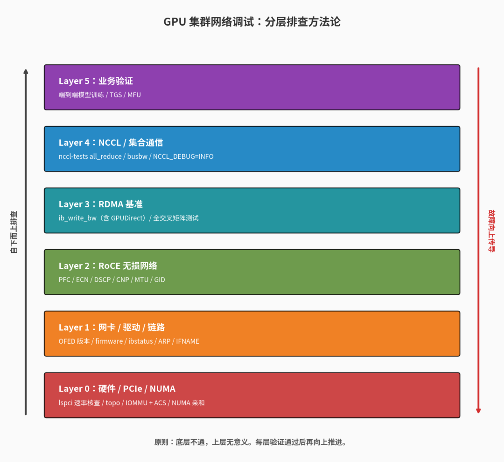
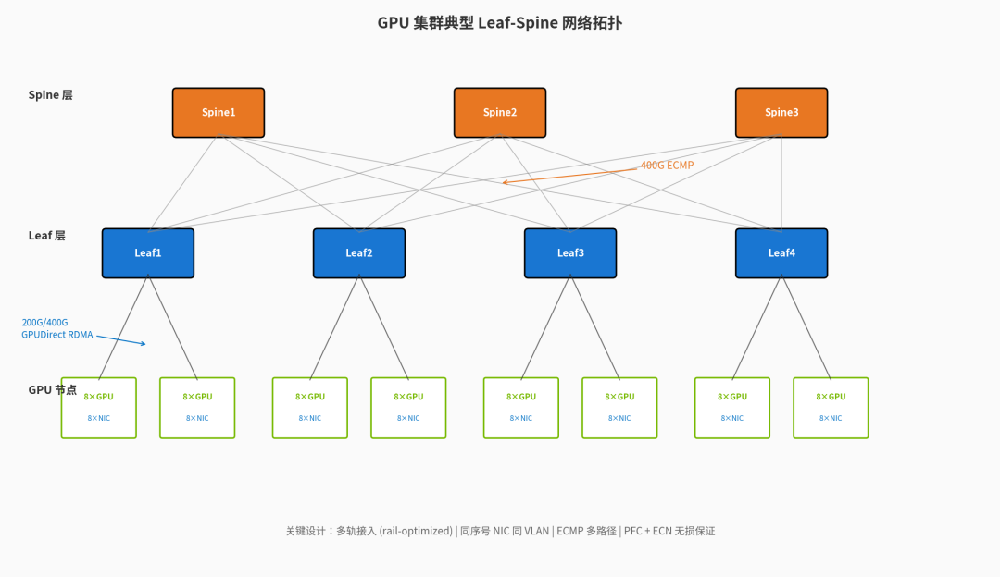
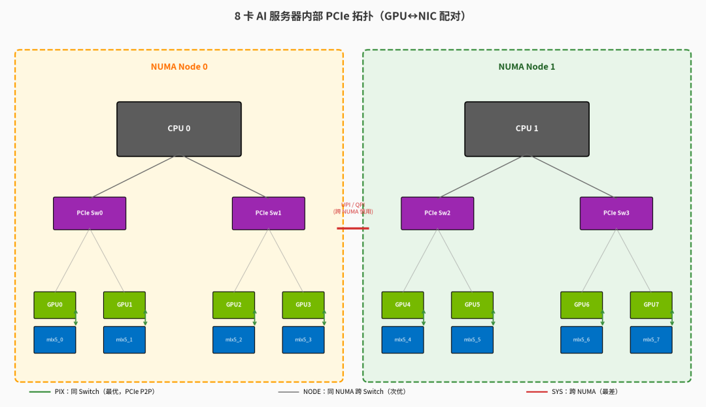
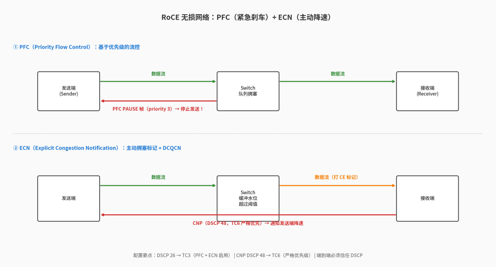
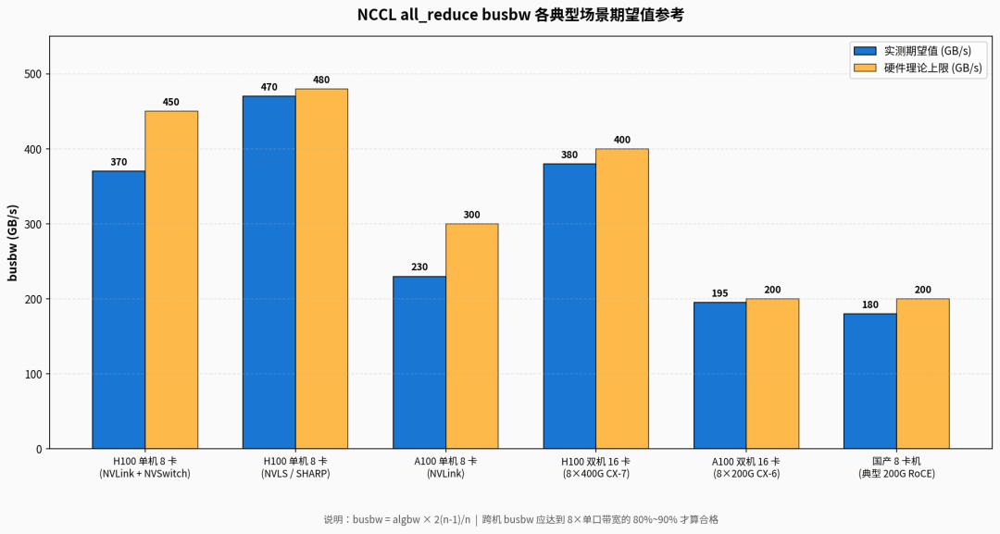
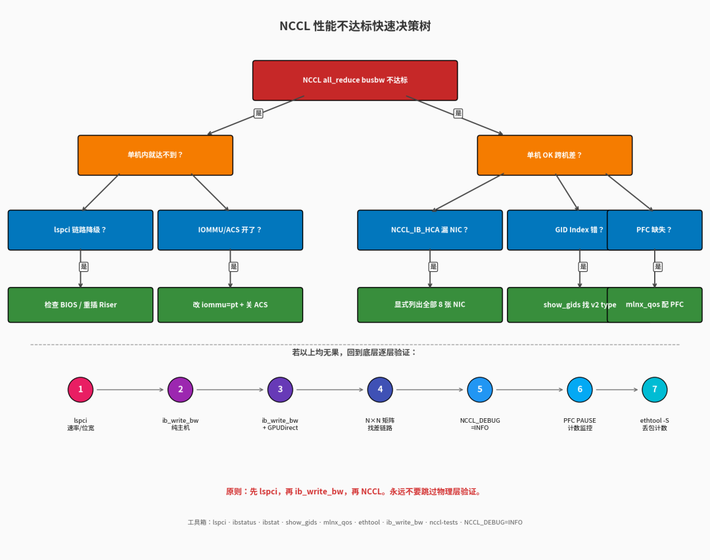

# GPU集群交付那些坑：从网卡到PCIe，从RoCE到NCCL的调试与排障指南

作者按：本文基于一线交付经验，结合NVIDIA官方文档、Mellanox/H3C网络配置手册以及社区Issue整理而成。希望能帮到正在啃集群交付硬骨头的同行。

## [万卡 NVIDIA GPU 集群自动化装机实战:从 BMC 就绪到全集群上线](https://mp.weixin.qq.com/s?__biz=MzYzMTMxMTY5Mw==&mid=2247483833&idx=1&sn=b01184c7692962bb06f52e9ac29c470e&scene=21#wechat_redirect)  

## 写在前面

GPU集群交付从来不是把机器堆进机房上电那么简单。一个看似”装好了”的集群，往往要经过网络对接、链路验证、RDMA基准测试、NCCL集合通信测试、再到端到端训练验证这一整套流程，才敢说”可以交付了”。

而这整条链路上，网络是最容易出问题的环节——网卡PCIe插错槽、GID选错、PFC没配、ECN阈值不合理、NCCL\_IB\_HCA没指定、QoS没端到端打通……任何一个小问题都会让你的nccl-tests跑出令人窒息的成绩单。

笔者在多个GPU集群的交付过程中踩过不少坑。这篇文章按照硬件层 → 网卡层 → RDMA层 → NCCL层的顺序，把调试要点和典型故障梳理清楚，希望能让后来者少走点弯路。

分层排查方法论

整个调试有一个核心思想：自下而上验证，故障自下而上传导。底层任何一个环节有问题，都会通过NCCL测试暴露出来；反过来，只看NCCL报错往往很难定位真正的根因。

下图是典型的GPU集群Leaf-Spine网络架构，也是本文要调试的对象：

GPU集群Leaf-Spine网络拓扑

## 一、硬件与PCIe层：看不见的瓶颈

很多人调NCCL先去拧环境变量，但事实上，80%的”性能不达预期”问题，根源都在物理层和PCIe层。这一层不排查清楚，上层调优都是徒劳。

### 1.1 PCIe链路速率与宽度核查

GPU和RDMA网卡（HCA）都通过PCIe挂在主板上。一旦协商不到额定速率（比如H100典型为PCIe Gen5 x16，A100为Gen4 x16），单卡的有效带宽就会折半甚至更低。

核查命令：

\# 查看所有PCIe设备的当前链路状态（LnkSta）和能力（LnkCap）  
lspci-vvv|grep-E"Mellanox|NVIDIA|GPU|InfiniBand"-A 50 |grep-E"LnkSta:|LnkCap:"  
  
\# 简洁版本，直接看设备协商速率  
for dev in$\(lspci|grep-iE"mellanox|nvidia"|awk'\{print $1\}'\);do  
echo"=== $dev ==="  
sudo lspci -vvv-s$dev|grep-E"LnkSta:|LnkCap:"  
done

预期输出（健康状态）：

LnkCap: Port \#0, Speed 32GT/s, Width x16 ← 设备能力  
LnkSta: Speed 32GT/s, Width x16 ← 实际协商

典型异常：

·LnkSta: Speed 16GT/s, Width x16（应为Gen5却跑Gen4）→ 主板BIOS PCIe Generation设置不对，或者PCIe Riser/线缆有问题

·LnkSta: Speed 32GT/s, Width x8（位宽降级）→ Riser卡接触不良、金手指脏、或者插错了PCIe x8槽位

·LnkSta: ... \(downgraded\) 字样 → 链路曾经协商到更低速率，需要复位甚至换硬件

坑点经验：液冷集群上一台节点出现单卡训练带宽偏低，最终排查到是PCIe Riser连接器插得不到位，重新插拔后恢复Gen5 x16。这种问题nvidia-smi是看不出来的，只能靠lspci细节核查。

### 1.2 NUMA与GPU-NIC亲和性

在大多数AI服务器（8卡机型）上，GPU和RDMA网卡是按对配置的——GPU0配mlx5\_0、GPU1配mlx5\_1，以此类推。每对GPU+NIC共享一个PCIe Switch，挂在同一个NUMA节点下。

如果NCCL拓扑识别错误，跨NUMA走UPI/QPI访问网卡，性能会断崖式下跌。

核查命令：

\# 查看GPU与NIC的拓扑关系（NVIDIA环境）  
nvidia-smi topo -m  
  
\# 查看网卡所属NUMA节点  
cat /sys/class/net/<ifname>/device/numa\_node  
  
\# 查看GPU所属NUMA  
nvidia-smi\--query-gpu=index,pci.bus\_id \--format=csv  
for bus in$\(nvidia-smi\--query-gpu=pci.bus\_id \--format=csv,noheader\);do  
echo"$bus -> NUMA $\(cat /sys/bus/pci/devices/$\{bus,,\}/numa\_node\)"  
done

理想拓扑输出：

  
| GPU0| GPU1| mlx5\_0| mlx5\_1  
---|---|---|---|---  
GPU0| X| NV12| PIX| NODE  
GPU1| NV12| X| NODE| PIX  
  
PIX表示GPU与NIC在同一PCIe Switch下（最优），NODE表示同NUMA但跨Switch，SYS表示跨NUMA（最差）。

下图直观展示了一个理想的8卡服务器内部拓扑——每个GPU与其配对NIC共享同一个PCIe Switch，NIC对GPU显存的访问通过PCIe P2P直达，无需绕道CPU：

8卡服务器内部PCIe拓扑

### 1.3 IOMMU/ACS：GPUDirect的隐形杀手

这是个非常容易被忽略但杀伤力巨大的问题。IOMMU（VT-d/AMD-Vi）和PCIe ACS（Access Control Services）开启后，会强制所有PCIe点对点流量绕道CPU Root Complex，导致GPUDirect RDMA形同虚设——网卡读GPU显存的数据要先绕到CPU再回到网卡，性能可能直接掉到原来的1/3甚至更低，严重时直接挂起。

NVIDIA官方文档明确指出：IO虚拟化（VT-d或IOMMU）会通过将所有PCI点对点流量重定向到CPU root complex来干扰GPU Direct，造成显著的性能下降甚至挂起。

检查ACS是否开启：

\# 检查所有PCI Bridge的ACS状态  
sudo lspci -vvv|grep-E"ACSCtl"  
  
\# 如果出现 SrcValid+ 字样，就需要关闭ACS  
sudo lspci -vvv|grep-i"ACSCtl"|grep"SrcValid+"

关闭ACS（运行时临时方案）：

\#\!/bin/bash  
\# 对所有PCIe Bridge关闭ACS  
for BDF in$\(lspci-d"\*:\*:0604"-mm|awk'\{print $1\}'\);do  
sudo setpci -v-s$\{BDF\} ECAP\_ACS+0x6.w=0000  
done

永久方案： 在/etc/default/grub中追加：

GRUB\_CMDLINE\_LINUX="... iommu=off intel\_iommu=off" \# Intel平台  
GRUB\_CMDLINE\_LINUX="... iommu=off amd\_iommu=off" \# AMD平台

更新后update-grub && reboot。但注意，纯关IOMMU会导致虚拟化场景失效，生产环境建议改用iommu=pt（passthrough模式）+ 关ACS。

### 1.4 NUMA Balancing与透明大页

\# 关闭NUMA balancing，避免运行时内存迁移导致延迟抖动  
echo 0 |sudo tee /proc/sys/kernel/numa\_balancing  
sudo sysctl -w kernel.numa\_balancing=0  
  
\# 透明大页设为madvise（避免不必要的合并开销）  
echo madvise |sudo tee /sys/kernel/mm/transparent\_hugepage/enabled

## 二、网卡与驱动层：从驱动到固件的全链路核查

### 2.1 网卡驱动与固件版本

集群中所有节点的网卡驱动、固件、OFED版本必须严格一致。版本不一致会出现各种奇葩问题：QP建链失败、GID索引错位、PFC配置不生效……笔者就遇到过一台节点的固件比其他节点低两个小版本，导致这台节点参与的nccl-tests跑出了别人一半的带宽。

核查命令（Mellanox/NVIDIA）：

\# OFED版本  
ofed\_info-s  
  
\# 网卡固件  
ibstat|grep"Firmware version"  
mlxfwmanager\--query  
  
\# 驱动版本  
modinfo mlx5\_core |grep ^version  
  
\# 一键核对（在所有节点上跑）  
for h in$\(cat hostfile\);do  
echo"=== $h ==="  
ssh$h"ofed\_info -s; ibstat -V; modinfo mlx5\_core | grep ^version"  
done|tee fw\_check.log

其他厂商网卡核查思路类似，看vendor提供的-info命令或/sys/class/infiniband/\*/下的fw\_ver节点。

### 2.2 链路状态与协商速率

\# 1\) 物理链路状态  
ibstatus  
\# 关注: State: Active / Physical state: LinkUp / Rate: 200/400 Gb/sec  
  
\# 2\) 端口详情  
ibstat  
\# 关注: Link layer: Ethernet \(RoCE\) 或 InfiniBand  
\# Active speed/width  
  
\# 3\) 以太网层（RoCE场景）  
ethtool<ifname>|grep-E"Speed|Duplex|Link detected"  
ethtool-S<ifname>|grep-iE"drop|err|discard" \# 关注丢包计数  
  
\# 4\) 查看RDMA设备和网卡的对应关系  
rdma link show  
ibdev2netdev-v

典型异常：

·Rate: 100 Gb/sec，但你买的是200G网卡 → 光模块/AOC速率不匹配，或交换机端口配置错误

·State: Initializing → 子网管理器（IB场景）有问题，或RoCE的链路层未协商完成

·ethtool -S 看到 rx\_discards\_phy、rx\_buffer\_passed\_thres\_phy 持续增长 → 物理层丢包，多半是PFC没配好或者ECN水位不合理

### 2.3 GID与RoCE版本

这是RoCE环境最容易出错的地方之一。NVIDIA的NCCL文档专门提到：RoCE上一个常见问题就是给RoCE v2 NIC选错了GID索引——当NCCL\_IB\_GID\_INDEX不正确时会触发ibv\_modify\_qp的Invalid argument错误。

查询GID表：

\# 查看某个RDMA设备的所有GID  
show\_gids  
\# 或  
for d in$\(ls /sys/class/infiniband/\);do  
for p in /sys/class/infiniband/$d/ports/\*/gids/\*;do  
gid=$\(cat$p2>/dev/null\)  
if\[-n"$gid"\]&&\["$gid"\!="0000:0000:0000:0000:0000:0000:0000:0000"\];then  
idx=$\(basename$p\)  
ver=$\(cat /sys/class/infiniband/$d/ports/$\(echo$p|cut-d/ -f7\)/gid\_attrs/types/$idx2>/dev/null\)  
echo"$d port $\(echo$p|cut-d/ -f7\) idx=$idx type=$ver gid=$gid"  
fi  
done  
done

典型输出：

DEV PORT INDEX GID IPv4 VER DEV  
mlx5\_0 1 0 fe80:0000:0000:0000:... v1 enp4s0f0  
mlx5\_0 1 1 fe80:0000:0000:0000:... v2 enp4s0f0  
mlx5\_0 1 2 0000:0000:0000:0000:0000:ffff:c0a8:0101 192.168.1.1 v1 enp4s0f0  
mlx5\_0 1 3 0000:0000:0000:0000:0000:ffff:c0a8:0101 192.168.1.1 v2 enp4s0f0 ← 这个

RoCEv2必须选择v2类型且IPv4-mapped的GID。在NVIDIA环境，传统经验是设置NCCL\_IB\_GID\_INDEX=3，但具体值需要根据上面的输出确定。NCCL 2.21及以后版本支持GID自动选择——如果你的NCCL版本足够新，反而不应该硬编码这个变量。

### 2.4 MTU设置

许多Linux发行版默认以太网MTU为1500字节，对HPC应用而言会造成激进的数据分片，是性能的限制因素。RoCE应用的最佳实践是主机侧设为9000，交换机端配到允许的最大值（通常>9000）。

\# 临时设置  
sudo ip link set dev <ifname> mtu 9000  
  
\# 验证有效MTU  
ip link show <ifname>|grep mtu  
ibv\_devinfo-d mlx5\_0 |grep active\_mtu  
  
\# 永久配置（Ubuntu netplan示例）  
\# /etc/netplan/01-rdma.yaml  
\# network:  
\# ethernets:  
\# enp4s0f0:  
\# mtu: 9000

核查方式： 用ib\_write\_bw -a跑全尺寸扫描，如果消息大小超过1500B时出现Completion with error错误，就是MTU路径有问题——可能某段链路上的交换机MTU没配齐，或者两端MTU不一致。

### 2.5 ARP Flux与子网划分

8卡机的8张RDMA网卡如果都配在同一个网段，会出现ARP Flux问题——内核可能把ARP请求回复到错误的接口，导致RDMA QP建链失败，ib\_write\_bw完成时报错，NCCL测试也会出现低带宽。

解决方案三选一：

1.每张NIC放到不同子网（最常用）：192.168.1.0/24、192.168.2.0/24、192.168.3.0/24…

2.使用/31点对点路由

3.配置arp\_ignore和arp\_announce

\# 方案3：sysctl方式  
cat>> /etc/sysctl.conf < <EOF< span> </EOF<>  
net.ipv4.conf.all.arp\_ignore = 1  
net.ipv4.conf.all.arp\_announce = 2  
net.ipv4.conf.default.arp\_ignore = 1  
net.ipv4.conf.default.arp\_announce = 2  
EOF  
sysctl-p

### 2.6 系统资源限制

NCCL和RDMA栈对锁定内存（memlock）和打开文件数（nofile）的需求很高，默认上限往往不够，会导致Couldn't register MR、Couldn't allocate MR一类错误：

\# /etc/security/limits.conf  
\* soft memlock unlimited  
\* hard memlock unlimited  
\* soft nofile 1048576  
\* hard nofile 1048576  
\* soft stack unlimited  
\* hard stack unlimited  
  
\# 容器环境通过 docker --ulimit 或 K8s securityContext 传递

容器场景额外注意：Docker/K8s下默认的/dev/shm只有64MB，NCCL会报：

NCCL WARN Error: failed to extend /dev/shm/nccl-xxx to 4194660 bytes

启动容器时加\--shm-size=64g或在K8s里挂emptyDir.medium=Memory+sizeLimit。

## 三、RoCE无损网络：PFC与ECN的端到端配置

如果是RoCE集群，这一节是核心中的核心。RoCE对丢包极度敏感，必须依赖PFC + ECN构建无损网络环境，配置不当就会出现”队头阻塞”和”PFC死锁”问题。

PFC和ECN的工作机制如下图所示——PFC是被动的”急刹车”，ECN是主动的”降速通知”，两者相辅相成：

PFC + ECN工作机制

### 3.1 PFC（Priority Flow Control）

PFC是基于优先级的”急刹车”机制——交换机在某优先级队列即将拥塞时，向上游发送PAUSE帧让对方暂停发送。一旦Device B某队列拥塞导致缓存超限，它会向所有上游设备发送PFC PAUSE帧；上游收到后停止发送对应优先级的报文，并将数据缓存在本地接口。

关键配置点（端到端必须一致）：

配置项| 推荐值| 说明  
---|---|---  
RoCEv2 DSCP| 26 \(AF31\)| 也有用24的，看交换机厂商建议  
优先级（802.1p / TC）| 3| 业内常见把RoCE业务放在TC3  
CNP DSCP| 48| 拥塞通知报文，必须高优先级  
CNP TC| 6| 严格优先级队列  
  
Mellanox网卡侧（mlnx\_qos）：

\# 1. 让接口信任DSCP（不要用默认的802.1p/PCP）  
mlnx\_qos-i<ifname> \--trust=dscp  
  
\# 2. 启用priority 3的PFC  
mlnx\_qos-i<ifname> -f 0,0,0,1,0,0,0,0  
  
\# 3. 设置队列调度（tc6/tc7严格优先级，tc0~5按权重轮询）  
mlnx\_qos-i<ifname>\  
-s ets,ets,ets,ets,ets,ets,strict,strict \  
-t 10,10,10,50,10,10,0,0

NCCL环境变量对应：

exportNCCL\_IB\_TC=106 \# 或 96，对应DSCP 26 << 2 = 104（看驱动版本）  
\# 也有人直接 NCCL\_IB\_TC=160（DSCP=40，TC4）  
exportNCCL\_IB\_SL=3 \# InfiniBand Service Level

### 3.2 ECN与DCQCN

光有PFC还不够。PFC是”硬刹车”，频繁触发会导致整条链路停摆，甚至引发PFC风暴和死锁。所以现代RoCE网络都用ECN+DCQCN做主动拥塞控制：交换机在缓冲区水位达到阈值时，给报文打上CE标记；接收端看到CE标记后，向发送端回送CNP（Congestion Notification Packet）；发送端收到CNP后主动降速。

交换机侧（以H3C示例）：

\# 全局开启ECN  
qos red weight 0  
interface HundredGigE1/0/1  
priority-flow-control auto  
priority-flow-control no-drop dot1p 3  
qos wred queue 3 ecn  
qos wred queue 3 low-limit 100 high-limit 400 discard-probability 10

具体水位（low-limit/high-limit）需要根据Buffer大小、端口数、流量模型来调，调不好会出现： - 阈值太低 → ECN频繁触发，发送端频繁降速，吞吐打不上去 - 阈值太高 → 缓冲区接近溢出才打CE标记，发送端反应不过来，又退化到PFC PAUSE

### 3.3 PFC风暴预防与监控

PFC死锁是多个设备之间因环路等原因同时出现拥塞、各自端口缓存超过阈值后又都在等待对方释放资源造成的”僵持状态”。所有交换机的数据流会永久堵塞——在AI集群里出现一次能让你训练任务全部挂起。

预防措施：

1.配置PFC死锁检测（Mellanox叫Storm Control，H3C/华为也有对应特性），发现死锁后自动恢复

2.限制PFC PAUSE帧的频率

3.监控PFC PAUSE收发计数：

\# 实时监控PFC PAUSE  
watch-n 1 'ethtool -S| grep -E "prio.\*pause|pfc"'  
  
\# 关键指标  
\# rx\_prio3\_pause: 收到的priority 3 PAUSE帧  
\# tx\_prio3\_pause: 发送的priority 3 PAUSE帧

如果tx\_prio3\_pause快速增长，说明本机正在频繁向上游”急刹车”——本机网卡处理不过来或下游链路拥塞。如果rx\_prio3\_pause快速增长，说明上游频繁让本机暂停——意味着本机发送速率超过了对端接收能力。

## 四、RDMA基准测试：先验证底层再上NCCL

NCCL文档中明确建议：在跑NCCL之前，先跑底层RDMA测试（特别是ib\_write\_bw），可以帮助验证节点间通信是否正常。这一步不做，出了问题你都不知道是NCCL的锅还是网络的锅。

### 4.1 perftest工具集

perftest提供了一系列基础测试：

工具| 用途  
---|---  
ib\_write\_bw| RDMA Write带宽测试（最常用）  
ib\_write\_lat| RDMA Write时延测试  
ib\_read\_bw / ib\_read\_lat| RDMA Read  
ib\_send\_bw / ib\_send\_lat| RDMA Send  
  
编译带CUDA支持的perftest（用于GPUDirect RDMA测试）：

git clone https://github.com/linux-rdma/perftest  
cd perftest  
./autogen.sh  
./configure CUDA\_H\_PATH=/usr/local/cuda/include/cuda.h  
make-j

### 4.2 主机内存基础测试

在跑GPU Direct之前，先验证纯主机内存的RDMA能正常工作：

\# 服务端  
ib\_write\_bw-d mlx5\_0 -F-x 3 \--report\_gbits-D 30  
  
\# 客户端  
ib\_write\_bw-d mlx5\_0 -F-x 3 \--report\_gbits-D 30 <server\_ip>

关键参数： \- -d mlx5\_0：指定RDMA设备 - -F：忽略CPU频率检查 - -x 3：GID Index（RoCEv2上根据你的环境调整） - \--report\_gbits：以Gbps报告 - -D 30：跑30秒 - -q 16：QP数量，单QP打不满200G以上的网卡

预期： 200G网卡应跑到180+ Gbps，400G网卡应跑到370+ Gbps。

### 4.3 GPUDirect RDMA测试

\# 服务端（GPU 0配mlx5\_0）  
ib\_write\_bw-d mlx5\_0 -F-x 3 \--report\_gbits\  
-D 30 -q 16 -s 65536 \  
\--use\_cuda=0  
  
\# 客户端  
ib\_write\_bw-d mlx5\_0 -F-x 3 \--report\_gbits\  
-D 30 -q 16 -s 65536 \  
\--use\_cuda=0 <server\_ip>  
  
\# 新内核+开源驱动可加 --use\_cuda\_dmabuf

重要：必须验证单向和反向都能跑通。社区Issue里有不少案例：A→B方向能跑、B→A就报Failed status 4。这通常是某一端的GPU/NIC PCIe Topology异常或某个GPU的BIOS/VBIOS有问题。

### 4.4 全交叉链路矩阵测试（交付必做）

交付时不能只测一对节点，必须做全N×N的链路矩阵测试，确保每对节点、每对NIC都能跑出预期带宽。我个人交付时常用的脚本骨架：

\#\!/bin/bash  
\# rdma\_matrix.sh - 全交叉RDMA矩阵测试  
  
NODES=\(node01 node02 node03 node04\)  
NICS=\(mlx5\_0 mlx5\_1 mlx5\_2 mlx5\_3 mlx5\_4 mlx5\_5 mlx5\_6 mlx5\_7\)  
LOG\_DIR=./rdma\_matrix\_$\(date +%Y%m%d\_%H%M%S\)  
mkdir-p$LOG\_DIR  
  
for src in"$\{NODES\[@\]\}";do  
for dst in"$\{NODES\[@\]\}";do  
\["$src"="$dst"\]&&continue  
for nic in"$\{NICS\[@\]\}";do  
log=$LOG\_DIR/$\{src\}\_$\{dst\}\_$\{nic\}.log  
ssh$dst"ib\_write\_bw -d $nic -F -x 3 --report\_gbits -D 10 -q 16"\  
> /dev/null 2>&1&  
sleep 2  
ssh$src"ib\_write\_bw -d $nic -F -x 3 --report\_gbits -D 10 -q 16 $dst"\  
>$log2>&1  
wait  
done  
done  
done  
  
\# 解析结果，找出带宽异常的链路  
grep-H"BW average"$LOG\_DIR/\*.log |\  
awk-F'\[ \t\]+''\{print $1, $\(NF-1\)\}'|\  
sort-k2-n|head-20\# 找出最差的20条链路

实际交付中我们经常遇到：100条链路里有1~2条带宽明显偏低（比如其他都是190 Gbps，这两条只有60 Gbps）——大概率是光模块或者DAC线缆有问题，提交给网络厂商更换即可。

## 五、NCCL测试：集合通信的最终大考

底层全部OK后，才是上nccl-tests的时候。这里也是问题最容易暴露的地方——因为NCCL同时考验了网络、PCIe、NUMA、驱动、库版本所有方面。

### 5.1 编译nccl-tests

git clone https://github.com/NVIDIA/nccl-tests  
cd nccl-tests  
  
\# 单机版  
make CUDA\_HOME=/usr/local/cuda NCCL\_HOME=/usr  
  
\# MPI版（多机必需）  
make MPI=1 MPI\_HOME=/path/to/openmpi \  
CUDA\_HOME=/usr/local/cuda NCCL\_HOME=/usr

### 5.2 单机内测试（验证NVLink/卡间互联）

./build/all\_reduce\_perf-b 8 -e 8G -f 2 -g 8

参数含义： - -b 8：起始消息大小8B - -e 8G：终止消息大小8GB - -f 2：每次×2递增 - -g 8：使用8张GPU

预期（H100 8卡）： 大消息busbw应≥370 GB/s（NVLS可达470+ GB/s）。 预期（A100 8卡）： 大消息busbw应≥230 GB/s。

### 5.3 多机测试

\# 16节点 × 8 GPU = 128 GPU，2节点示例  
mpirun-np 16 -N 8 \  
-hostfile hostfile \  
\--bind-to none \  
-mca btl tcp,self \  
-mca coll\_hcoll\_enable 0 \  
-x PATH -x LD\_LIBRARY\_PATH \  
-x NCCL\_DEBUG=INFO \  
-x NCCL\_IB\_HCA=mlx5\_0,mlx5\_1,mlx5\_2,mlx5\_3,mlx5\_4,mlx5\_5,mlx5\_6,mlx5\_7 \  
-x NCCL\_IB\_GID\_INDEX=3 \  
-x NCCL\_IB\_TC=106 \  
-x NCCL\_IB\_QPS\_PER\_CONNECTION=8 \  
-x NCCL\_NET\_GDR\_LEVEL=PIX \  
-x NCCL\_SOCKET\_IFNAME=bond0 \  
./build/all\_reduce\_perf -b 8M -e 8G -f 2 -g 1

### 5.4 关键NCCL环境变量速查

变量| 推荐值| 说明  
---|---|---  
NCCL\_DEBUG| INFO| 调试时必开，正式跑可设WARN  
NCCL\_IB\_HCA| 显式列出| 必须显式指定后端NIC，否则可能用错网卡  
NCCL\_IB\_GID\_INDEX| 3（看环境）| RoCEv2的GID索引  
NCCL\_IB\_TC| 106| RoCE Traffic Class，对应DSCP 26  
NCCL\_IB\_SL| 3| InfiniBand Service Level  
NCCL\_IB\_QPS\_PER\_CONNECTION| 4~16| 每连接QP数，多QP有助于打满高速链路  
NCCL\_SOCKET\_IFNAME| bootstrap口| 集群管理网，不能是RDMA口  
NCCL\_NET\_GDR\_LEVEL| PIX/PHB| GPUDirect RDMA最低拓扑要求  
NCCL\_IB\_DISABLE| 1| 应急用，强制走TCP  
NCCL\_P2P\_DISABLE| 1| 应急用，禁用GPU间P2P  
NCCL\_ALGO| Ring/Tree/NVLS| 强制算法选择  
NCCL\_PROTO| Simple/LL/LL128| 强制协议选择  
  
### 5.5 看懂busbw

nccl-tests输出两个带宽：algbw和busbw。重点看busbw。

NCCL文档对busbw的定义是：通过对算法带宽应用一个公式得到的、反映GPU间通信速度的数字。它是一个理论修正系数，基于点对点传输跨rank通信所需的成本，目的是让你能直接和硬件理论峰值带宽做对比，与算法（ring/tree）和rank数无关。

公式（AllReduce）：busbw = algbw \* 2 \* \(n-1\) / n（n是rank数）

预期对比表：

硬件| 单机busbw峰值| 跨机busbw峰值（端口数×单口带宽）  
---|---|---  
8×H100 NVLink| ~370 GB/s（NVLS可~470）| 8×CX7 400G = 400 GB/s  
8×A100 NVLink| ~230 GB/s| 8×CX6 200G = 200 GB/s  
  
更直观的对比可以看下图——实测期望值与硬件理论上限之间通常会有10%~25%的”折损”，这是协议开销、协议栈处理、PCIe传输等因素综合作用的结果。如果实测值远低于这个区间（比如只到理论值50%以下），就说明有问题需要排查：

NCCL busbw各场景期望值

如果跨机busbw达不到单网卡聚合带宽的80%~90%，就要排查： - NCCL\_IB\_HCA是否正确指定了所有后端NIC（漏一个就少一份带宽） - PFC/ECN是否生效（看tx\_prio3\_pause计数） - GID索引是否正确 - GPUDirect是否真的启用（看NCCL\_DEBUG=INFO日志里的NET/IB段）

### 5.6 NCCL\_DEBUG=INFO日志解读要点

跑测试时务必加-x NCCL\_DEBUG=INFO，重点关注以下行：

NCCL INFO Bootstrap : Using bond0:10.0.0.1<0>  
↑ 确认bootstrap走的是管理网而非RDMA网  
  
NCCL INFO NET/Plugin : Plugin load returned 17 : ...   
↑ 检查是否加载了厂商插件（Mellanox SHARP/UCC等）  
  
NCCL INFO NET/IB : Using \[0\]mlx5\_0:1/RoCE \[1\]mlx5\_1:1/RoCE ... \[RO\]  
↑ 确认所有8张RDMA NIC都被识别，\[RO\]表示Relaxed Ordering启用  
  
NCCL INFO Channel 00/16 : 0 1 2 3 4 5 6 7 ...  
↑ Channel数量，影响并发度  
  
NCCL INFO Trees \[0\] 1/-1/-1->0->-1 ...  
↑ Tree拓扑  
  
NCCL INFO Connected all rings/trees  
↑ 建链成功  
  
NCCL INFO comm 0x... rank 0 nranks 16 cudaDev 0 busId ... commId ... - Init COMPLETE  
↑ 初始化完成

典型异常日志：

·NCCL WARN Bootstrap : no socket interface found → NCCL\_SOCKET\_IFNAME没设或值不对

·NCCL WARN Call to ibv\_modify\_qp failed with error Invalid argument → GID索引错误

·NCCL INFO NET/IB : Using ... \[LOC\] 而不是 \[RO\] → Relaxed Ordering未启用

·NCCL WARN NET/IB : Got completion with error 12 → 网络丢包/QP错误，多半是PFC没配好

## 六、典型故障排查手册

把交付现场最常见的问题归类列在这里，下次遇到可以直接对照。下面这张决策树是笔者实战中的快速排查路径，遇到NCCL测试不达标时可以按图索骥：

NCCL性能不达标快速决策树

### 6.1 NCCL Hang（启动后卡死无输出）

优先级排查顺序：

1.bootstrap问题：NCCL\_SOCKET\_IFNAME是否正确？所有节点能不能互通这个接口？

2.DNS/hostname：hostname -i返回的是不是127.0.1.1？K8s里所有Pod能否getent ahostsv4解析？

3.防火墙：NCCL默认随机TCP端口，部分企业网关可能有限制。可用NCCL\_IB\_DISABLE=1 NCCL\_P2P\_DISABLE=1测试纯Socket能否通；或限制端口范围echo 50000 51000 > /proc/sys/net/ipv4/ip\_local\_port\_range

4.进程残留：上一次任务僵尸进程占用了GPU或RDMA资源

5./dev/shm太小：容器场景常见

### 6.2 单机OK，跨机带宽极低

经典症状：单机8卡all\_reduce能跑350 GB/s，2机却只有10~20 GB/s。

排查：

1.看NCCL\_DEBUG=INFO日志：NET/IB段是不是用了正确的8张RDMA NIC？还是只识别到了管理网卡？

2.NCCL默认可能识别到所有RDMA接口（包括存储网、管理网用的RDMA口），导致流量绕到了带宽较低的前端NIC——务必显式设置NCCL\_IB\_HCA。AMD ROCm/RCCL文档专门提到这个问题：当不指定承载GPU流量的NIC时，RCCL默认行为是使用所有可用的RDMA接口，前端NIC往往速率更低且使用不同的交换机，会导致额外网络跳数甚至无法路由到后端，表现就是RCCL测试带宽偏低

3.是不是某些节点GPUDirect没启用（NCCL\_NET\_GDR\_LEVEL日志中显示Read/Write Disabled）→ 检查ACS/IOMMU

4.跨机走的Leaf-Spine链路上ECMP是否Hash不均（这个比较隐蔽，需要看交换机的接口流量统计）

### 6.3 大消息性能突然下跌

NCCL在大消息（GB级别）下性能反而下降，这是网络层路径冲突 + RoCE无自适应路由的经典问题：每个RDMA flow只走单一固定网络路径，两个flow可能在同一交换机端口冲突。

缓解方法： \- 增加NCCL\_IB\_QPS\_PER\_CONNECTION让流量散列到更多QP上 - 启用NCCL\_IB\_ADAPTIVE\_ROUTING=1（需要交换机支持AR） - 终极方案是用UCCL插件替代默认RDMA Plugin，UCCL以拥塞感知方式利用数百条网络路径来规避网络拥塞，且无需修改任何应用代码或NCCL代码

### 6.4 部分节点参与时性能下降

8机训练正常，加入第9机时性能腰斩。

排查： \- 第9机的固件/驱动版本和其他机器一致吗？ - 第9机的lspci链路速率/宽度有没有降级？ - 第9机和其他机器的RDMA矩阵测试单独跑一下，看哪条链路异常 - 第9机的BIOS设置（PCIe Gen、CPU Power Management、IOMMU）是否和模板一致？

### 6.5 训练过程中突然NCCL Timeout

Watchdog caught collective operation timeout:   
WorkNCCL\(SeqNum=xxx, OpType=ALLREDUCE, ...\) ran for 1800000 milliseconds before timing out.

可能原因： - 某张卡掉卡（Xid 79 - GPU has fallen off the bus）：dmesg | grep -i xid检查 - 网卡抖动：交换机端口Flap，看ethtool -S和dmesg \- 节点OOM被Kill：dmesg | grep -i oom \- 任务异步导致rank间进度差异过大：增大NCCL\_TIMEOUT只能掩盖问题，不能根治 - 链路单向中断：很罕见但发生过——光纤一根方向衰减增大，TX正常RX劣化。

  

## 七、写在最后

GPU集群交付从来都是系统工程——任何一层有问题，都会通过NCCL测试这面”照妖镜”暴露出来。但反过来，NCCL测试本身只是结果，真正的问题往往藏在更底层：PCIe协商、固件版本、ACS、GID选择、PFC水位、QoS信任策略……

我个人交付时的经验是：永远不要跳过任何一层的验证。看似浪费时间的全交叉RDMA矩阵测试、看似多余的lspci核查脚本，往往能在交付前一晚帮你揪出那条隐藏了几个月的”坏链路”。

但只要按照本文的方法论从硬件到上层逐层排查，再特殊的硬件也能跑出符合预期的成绩。

希望这篇文章对你有帮助。Happy Debugging.

## 参考资料

1.NVIDIA NCCL Troubleshooting Guide：https://docs.nvidia.com/deeplearning/nccl/user-guide/docs/troubleshooting.html

2.NVIDIA NCCL Environment Variables：https://docs.nvidia.com/deeplearning/nccl/user-guide/docs/env.html

3.NVIDIA nccl-tests PERFORMANCE.md：https://github.com/NVIDIA/nccl-tests/blob/master/doc/PERFORMANCE.md

4.linux-rdma/perftest：https://github.com/linux-rdma/perftest

5.AMD GPU Cluster Networking Troubleshooting：https://instinct.docs.amd.com/projects/gpu-cluster-networking/en/latest/how-to/troubleshooting.html

6.UCCL: How to Debug NCCL Performance Issues：https://uccl-project.github.io/posts/debug-nccl/

7.H3C RoCE网络开局一本通：https://www.h3c.com/cn/Service/Document\_Software/Document\_Center/Home/Public/00-Public/Learn\_Technologies/Technical\_Topics/H3C\_RoCE-19790/

8.NVIDIA Benchmarking GPUDirect RDMA：https://developer.nvidia.com/blog/benchmarking-gpudirect-rdma-on-modern-server-platforms/

9.Microsoft Azure HPC Performance at Scale：https://techcommunity.microsoft.com/blog/azurehighperformancecomputingblog/performance-at-scale-the-role-of-interconnects-in-azure-hpc–ai-infrastructure/4427238

10.大规模GPU集群运维实践 - 吴建明：https://www.cnblogs.com/wujianming-110117/p/18930484