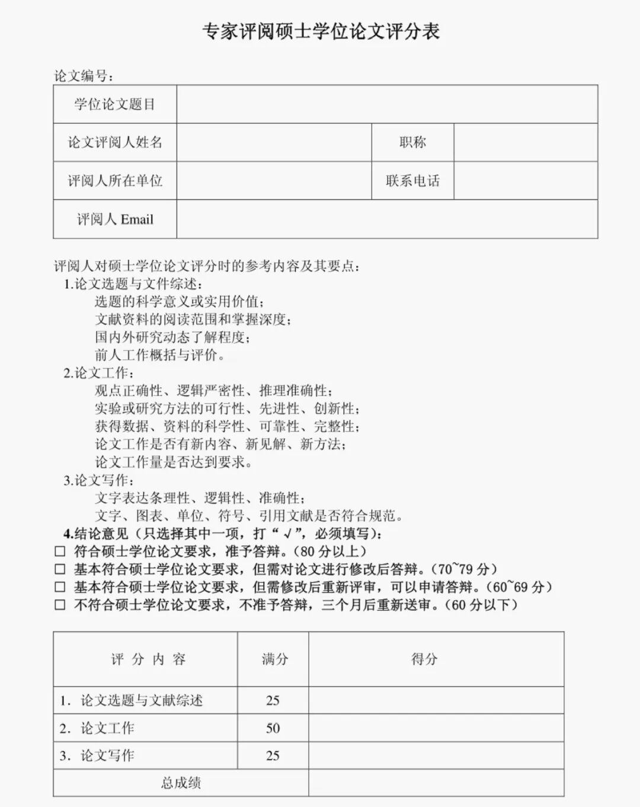

  

最近看了网上的一些帖子，有的同学MEM论文查重过了、导师签字了、格式也调了，盲审一出来60 多、68、69，直接卡 70 分线下，延毕、重审、心态崩。作为MEM的指导老师，经常会帮学生复盘盲审差评。今天我们来讲讲为什么你的论文没有过门槛，并不是你不够努力，而是你犯了几个决不能犯的错误。

一、70 分以下，不是 “小瑕疵”，是 “硬伤扎堆”

网上很多文章说 “盲审看运气”，我直接辟谣：MEM 盲审 70 分以下，90% 不是运气，是底线没守住。专家手里的评分表很实在：选题价值、逻辑框架、研究方法、数据支撑、学术规范、工程应用。但凡有两项 “不合格”，直接掉到 70 以下。很多同学栽在：把课程作业当学位论文写，把 “工作总结” 当 “研究成果” 交，把 “抄文献 + 拼案例” 当 “完成任务”。

二、最致命的 5 个扣分点

1\. 选题：空、旧、偏、不够 MEM

这是差评里出现最多的词，没有之一。

空：“XX 项目管理研究”“XX 成本控制分析”，没有具体问题、没有边界、没有痛点；旧：十年前的模型、过时的案例、别人写烂的主题，没有新场景新数据；偏：偏理论、偏文科、偏纯管理，没有工程底色，不像 MEM；弱：没有研究缺口，没有 “为什么要做”，专家一眼判定 “无研究价值”。

MEM 要的是工程 + 管理 + 问题解决，不是纯管理学复述，更不是你的年中总结。选题不落地，后面写再多都是白搭。

2\. 逻辑崩塌：前言不搭后语，章节各过各的  

逻辑混乱、结构松散、论证脱节；摘要和正文对不上；文献综述和研究问题没关系；方法选了不用、用了不对、对了不支撑结论；前面说解决 A 问题，后面案例讲 B 事情，结论又喊 C 口号。

专家阅卷很快，3 分钟看框架，逻辑断链直接低分：连思路都理不清，怎么叫硕士论文？

3\. 方法与数据：MEM 最容易丢分的 “重灾区”

这一条，几乎是 70 分以下的标配。

方法乱用：问卷随便发、样本少到离谱、不做信效度、不检验显著性；数据造假 / 凑数：来源不明、前后矛盾、清洗过程不写、图表瞎做；只有描述没有分析：堆数据、堆表格、堆流程，不解释、不对比、不诊断；方法与问题不匹配：用复杂模型套简单问题，或用简单方法扛复杂问题。MEM 强调实证与应用，数据不扎实、方法不规范，专家直接判定 “科研能力不达标”。

4\. 文献综述 = 复制粘贴，没有 “自己的话”=没有灵魂

差评高频：文献堆砌、无综述、无批判、无前沿。

大段抄别人摘要，按作者罗列，不梳理脉络；近 5 年文献太少，研究陈旧；只说 “别人做了什么”，不说 “别人没做什么、我要补什么”；关键引用不标，格式一塌糊涂。

文献是门面，门面乱糟糟，专家第一印象就不及格。

5\. 低级错误：态度问题，直接压分

格式乱：字体、行距、目录、图表编号、参考文献格式错误连篇；文字口语化：“我觉得”“然后”“就是说”，不像学术写作；错别字、病句、英文摘要机翻不忍直视；图表模糊、单位错误、页码错乱。

专家心里很直接：连细节都不认真，研究能靠谱到哪去？ 态度分直接扣光。

三、为什么你觉得 “没问题”，盲审却 “不及格”？

  1. 自我感觉良好：只看字数不看质量，只改格式不改逻辑；

  2. 导师把关不到位：有的导师忙、有的偏理论、有的不熟悉 MEM 评审尺度；

  3. 把 AI 当主力：AI 写得顺，但没逻辑、没数据、没工程味，专家一抓一个准；

  4. 最后赶工：一周写完、两天改完，漏洞根本藏不住。

MEM 是专业硕士，看应用、看落地、看工程逻辑，不是凑字数、堆漂亮话。

四、如何没过，怎么补救

  1. 先救选题：锁定一个具体工程问题，有场景、有数据、能落地；

  2. 再理逻辑：一条线串到底 —— 提出问题→分析问题→方法→数据→解决方案→结论；

  3. 做实数据：来源可追溯、样本够、方法规范、有检验有分析；

  4. 重写文献：讲清研究缺口，突出 “我为什么做”；

  5. 死磕细节：格式、引用、文字、图表，零错误才安全；

  6. 找内行看：让工程一线同事、同门、认真的导师帮你把关。

但以上工作都到位，基本相当于重写，所以希望大家能早些看到这篇文章，防患于未然，在提交盲审前，躲开这些绝不要触碰的论文“盲审红线”。

  

  

  

  

  

  

  

  

  

  

  

  

  

写论文找助研，论文变得很简单

论文的成功通过只是一个起点，我们期待让更多的学员都能在助研的辅导下收获学术成果。请相信我们，助研的全体辅导老师，具备多年的论文辅导经验，一对一提供写作方案，解决你的疑问，带你轻松完成论文！以下是我们学员的一些反馈：

免责声明：部分资料来源于网络，转载目的传递更多信息和分享，仅供平台交流，不为其版权负责，如涉嫌侵权请联系我们及时修改和删除.