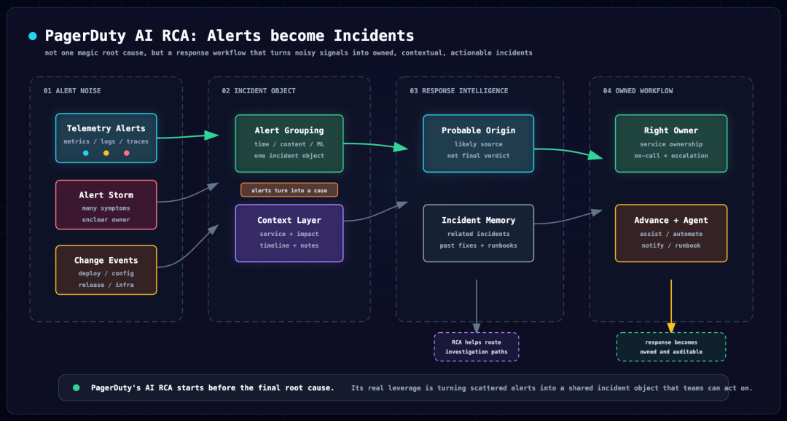
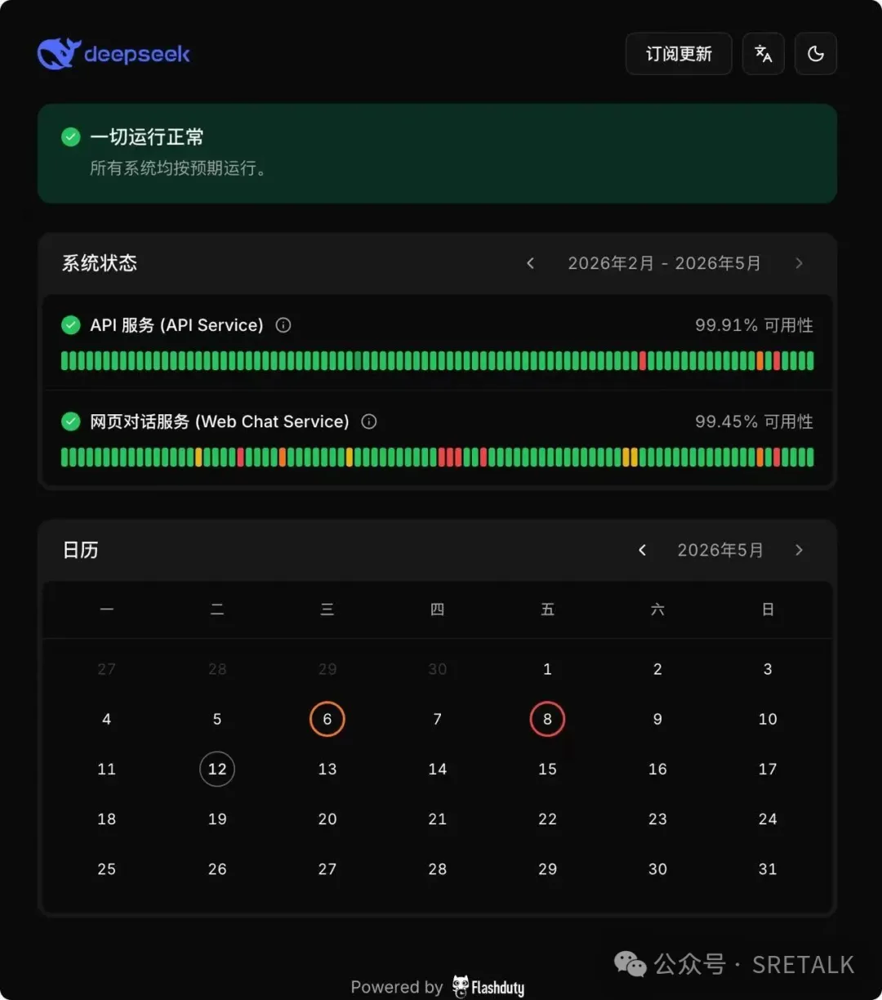

看完 Datadog 和 Dynatrace，再看 PagerDuty，会发现它走的是第三条路。

Datadog 的重点是：AI SRE 要主动查生产数据。  
Dynatrace 的重点是：AI RCA 要建立在因果图谱上。  
PagerDuty 的重点是：AI 要进入事故响应现场。

这三句话背后，是三个完全不同的产品起点。

Datadog 从可观测性平台出发，它掌握 metrics、logs、traces、RUM、database、deployment、incident、code，所以它自然会把 AI 做成一个能查数据、能解释、能生成 PR、能通过 MCP 给外部 agent 提供生产上下文的体系。

Dynatrace 从因果分析出发，它长期强调 Smartscape、Grail、Davis、causal AI，所以它会反复提醒你：时间相关不是因果，LLM 不能单独当 RCA 裁判。

PagerDuty 不一样。

PagerDuty 的起点不是 dashboard，也不是 topology，而是 on-call。

它面对的第一个问题不是“如何在一堆 telemetry 里找根因”，而是：

告警来了，谁该醒？  
这个 incident 该找哪个团队？  
这么多 alerts 哪些是一回事？  
有没有类似历史事故？  
最近有没有变更？  
要不要升级？  
下一步该跑哪个 runbook？  
业务方应该怎么通知？

所以 PagerDuty 的 AI RCA，不应该被理解成“找一个最终根因”的工具。

它更像是在做一件更朴素但也更关键的事：

**把告警变成可处理的事故。**

##  很多公司的问题不是没有根因分析，而是告警还没变成事故

我们经常把 AI RCA 想得太靠后了。

好像系统已经有了一个清晰的问题对象，所有证据已经放在一起，只差 AI 来判断根因。

但真实生产环境不是这样。

真实现场往往是：

一堆监控系统同时告警。  
一堆服务一起报错。  
一堆微信群、飞书群、Slack channel 里都在问。  
运维、研发、DBA、网络、业务方都看到不同片段。  
有人说可能是发布。  
有人说数据库慢。  
有人说下游接口超时。  
有人说这类告警以前就有。  
还有人问：到底谁在处理？

这个时候，如果 AI 只是给每条告警写一段总结，帮助不大。

你会得到一堆更像人的告警描述，但事故还是碎的。

PagerDuty 的 AIOps 先解决的，就是这个碎片化问题。

它用 Event Orchestration 做事件治理，用 Alert Grouping 把相关 alerts 聚合起来，用 Probable Origin 给出可能源头，用 Related Incidents 和 Past Incidents 找相关事故和历史事故，用 Change Events 把最近变更放进上下文，再用 service ownership、on-call、escalation policy 把事情交给对的人。

这套东西听起来没有“AI 自动定位根因”那么性感，但它非常实际。

因为事故响应里最先要解决的，不是写出一个漂亮根因，而是让混乱变成一个团队能处理的对象。

## 告警聚合是 AI RCA 的前置条件

很多 AI RCA 产品忽略了一个问题：

RCA 应该围绕什么对象发生？

单条告警吗？

如果围绕单条告警，结果很容易失真。

一个真实事故可能同时触发 CPU high、latency high、error rate high、pod restart、database connection high、synthetic check failed、queue lag、SLO violation。

这些信号单独看，每个都像一个问题。

但它们可能只是同一次事故的不同症状。

如果 AI 对每条告警分别分析，就会得到很多互相打架的“疑似根因”。这不是智能，这是噪音换了一种表达方式。

PagerDuty 的做法是先把 alerts 聚合成 incident。

Time-Based Alert Grouping 用时间窗口做最基础的合并。  
Content-Based Alert Grouping 根据告警内容和字段相似性做合并。  
Intelligent Alert Grouping 再利用历史模式和机器学习判断哪些 alerts 应该放在一起。

这件事非常重要。

AI RCA 不应该从 alert 开始，而应该从 incident / problem / case 开始。

这也是我觉得国内监控厂商要补的一课。

过去我们习惯把告警列表做得很强：规则、级别、通知、静默、升级、恢复。

但 AI RCA 时代，只做告警列表不够了。

你要有一个更高层的事故对象。

这个对象里要有：

相关 alerts。  
受影响服务。  
影响业务。  
相关变更。  
历史相似事故。  
可能责任团队。  
当前响应者。  
调查记录。  
runbook。  
自动化动作。  
最终复盘。

只有围绕这样的对象，AI 才有机会做出有用判断。

## Probable Origin 的价值不是拍板，而是少走错路

PagerDuty 有一个很值得研究的能力，叫 Probable Origin。

从名字就能看出它很克制。

它不是 final root cause。  
它不是 confirmed cause。  
它叫 probable origin。

这点很重要。

它要回答的问题不是“最终根因是什么”，而是“这次事故可能应该从哪里开始查”。

在 on-call 场景里，这已经很有价值。

事故刚发生时，响应者最怕的是查错方向。

明明是下游支付服务抖动，结果用户服务团队查了半小时。  
明明是刚发布的配置问题，结果大家一直盯着数据库。  
明明历史上同类告警都来自某个依赖服务，结果当班新人不知道。  
明明应该立刻叫某个 owner，结果大家在群里互相猜。

Probable Origin 利用服务依赖、历史 incident、过去共同出现的事件、响应者记录等信息，帮你推一个可能源头。

它不一定给出确定根因，但能缩小调查范围。

这对产品表达也有启发。

国内很多 AI RCA 产品太急着给“最终答案”。

页面上直接写：根因为数据库连接池耗尽。  
或者写：根因为某服务 CPU 使用率过高。  
或者写：根因为下游接口超时。

但这些话经常只是症状包装。

更好的表达应该分层：

相关事件是什么。  
可能源头是什么。  
影响服务是什么。  
根因候选是什么。  
证据是什么。  
哪些假设被排除了。  
哪些还需要人工确认。  
最终确认根因是什么。

PagerDuty 的“probable”这个词，反而体现了成熟。

AI RCA 不是越敢说越好。越靠近生产事故，越要区分“可能”“疑似”“已验证”“已确认”。

## 历史事故是 AI SRE 的金矿

PagerDuty 还有两个能力很有启发：Related Incidents 和 Past Incidents。

它们背后其实是一个简单判断：

很多事故不是第一次发生。

一个服务每次发布都触发类似错误。  
一个数据库每到业务高峰就连接数异常。  
一个缓存集群每次扩容后都有同类抖动。  
一个云区域故障会引发同一组下游服务告警。  
一个队列积压问题过去已经处理过很多次。

如果 AI 能在事故初期把历史相似事故找出来，价值很大。

它可以告诉你：

上次谁处理的。  
上次根因是什么。  
上次怎么缓解的。  
上次哪些尝试没用。  
上次复盘里留下了什么 action item。  
上次有没有修完。  
这次和上次有哪些不同。

这不是模型能力问题，而是组织记忆问题。

很多公司都有复盘，但复盘是死的。

文档写完了，发在知识库里。  
工单关了，没人再看。  
群聊沉底了。  
处理过程散落在 IM、Jira、发布系统、监控平台、日志平台、会议纪要里。

下一次事故来了，值班的人还是从零开始。

AI SRE 最应该做的一件事，就是把这些组织记忆重新拉回现场。

所以我不太认同只把 AI RCA 理解成实时数据分析。

实时数据当然重要，但历史事故同样重要。

尤其在企业运维里，很多问题不是“没人见过”，而是“见过的人不在现场”。

## Change Events 是根因判断的硬证据

看 Datadog 时，Change Tracking 很重要。看 Dynatrace 时，deployment 和 configuration events 也很重要。看 PagerDuty，同样绕不开 Change Events。

根因分析里最关键的问题之一永远是：

出问题之前，发生了什么变化？

谁发布了代码？  
谁改了配置？  
谁切了 feature flag？  
谁改了数据库 schema？  
谁调整了 Kubernetes workload？  
谁改了云资源？  
谁动了网络策略？  
谁做了权限变更？

如果这些信息不在 incident 里，AI 就只能猜。

很多国内客户事故响应时还在靠人问：

刚才谁发版了？  
谁改配置了？  
DBA 有动作吗？  
网络有变更吗？  
云平台有调整吗？

这很低效，也很容易漏。

AI RCA 想做得可信，必须把变更事件产品化。

PagerDuty 的价值在于，它可以把来自 CI/CD、云平台、配置系统、ITSM、变更管理系统的 change events 放进 incident response 上下文。

它不一定像 Datadog 那样拥有完整 telemetry，也不一定像 Dynatrace 那样拥有实时因果图谱，但它能把“什么变了”带到处理事故的人面前。

这对 on-call 已经很重要。

## AI 要知道谁该处理

我觉得 PagerDuty 给国内 AI SRE 产品最大的启发之一，是把“人”和“组织”放进系统里。

很多监控产品只关心技术对象：

主机。  
Pod。  
服务。  
接口。  
数据库。  
中间件。  
指标。  
日志。  
Trace。

这些当然重要。

但事故响应不是只和技术对象有关。

事故一定会落到人身上。

谁是 owner？  
谁当前 on-call？  
谁有权限执行修复？  
谁要被升级？  
谁要通知业务？  
谁处理过类似问题？  
谁能批准变更？  
谁要写复盘？

这些信息不在日志里，也不在指标里。

它在组织模型、值班表、升级策略、服务目录、CMDB、工单、审批流和历史事故里。

PagerDuty 的 service、business service、service dependency、on-call、escalation policy，把这些东西连接起来。

这就是 incident-native 产品和普通监控产品的区别。

AI SRE 如果不知道“谁该处理”，它就只能做技术分析。

但真正减少 MTTR 的，往往不是多看一张图，而是更快找到正确的人，给他足够上下文，让他少走弯路。

## PagerDuty Advance 更适合做事故助理

PagerDuty Advance 是它的生成式 AI 产品。

从公开资料看，它的价值主要在 incident workflow 里：

生成 incident summary。  
总结 timeline。  
生成 stakeholder update。  
推荐 next steps。  
帮助响应者理解当前状态。  
在 Slack、Teams、Zoom、移动端等场景里提供上下文。

这些能力看起来不如“AI 自动修复生产故障”那么吸引眼球，但更容易落地。

事故现场里，很多时间都消耗在沟通上：

现在到底发生了什么？  
影响范围是什么？  
谁在处理？  
要不要升级？  
给业务方怎么说？  
会议里刚才决定了什么？  
复盘时间线怎么整理？

这些任务非常适合 LLM。

LLM 不一定适合单独判断最终根因，但它很适合整理上下文、生成摘要、解释状态、归纳时间线、准备对外沟通。

所以对国内厂商来说，AI SRE 早期不一定要从“自动修复”开始。

更实际的顺序是：

先做事故摘要。  
再做历史事故推荐。  
再做变更关联。  
再做可能 owner 推荐。  
再做 runbook 推荐。  
再做诊断工作流触发。  
再做人工确认后的自动化动作。

这条路虽然没那么夸张，但更符合企业客户的风险边界。

## SRE Agent 是 PagerDuty 向外补 telemetry 的方式

PagerDuty 的一个天然短板，是它不是全栈可观测性平台。

它不像 Datadog 那样天然掌握 metrics、logs、traces、RUM、DBM、profiler。  
也不像 Dynatrace 那样有 Smartscape 和 Grail 这种强因果底座。

所以如果 PagerDuty 要做更深的 AI SRE，它必须连接外部工具。

这就是 SRE Agent 值得看的地方。

公开文档里，PagerDuty SRE Agent 可以通过 connectors 和 tools 连接 Datadog、New Relic、Dynatrace、Grafana、Splunk、Elastic、Sumo Logic、AWS CloudWatch、Kubernetes、GitHub、Confluence、ServiceNow 等系统。

这说明 PagerDuty 的思路不是重新造一个 telemetry 平台，而是让 agent 跨工具调查。

事故发生在 PagerDuty。  
上下文沉淀在 PagerDuty。  
但具体证据可能在 Datadog、Splunk、CloudWatch、Kubernetes、GitHub、ServiceNow、Confluence 里。

SRE Agent 的价值，就是把这些证据拉回 incident response 现场。

这也代表未来 AI SRE 的一个趋势：

没有任何一个系统能独占全部上下文。

所以 AI agent 必须能跨系统调用工具。

这也是为什么 Datadog、Dynatrace、Grafana、PagerDuty 都在做 MCP 或类似的 agent 工具层。

未来工程师可能不再只从监控控制台开始排障。

他可能在 IDE 里问。  
在终端里问。  
在飞书里问。  
在工单里问。  
在 incident 页面里问。  
在 AI coding agent 里问。

可观测性和 incident 工具都要变成生产上下文供应商。

## 对国内厂商的启发

如果把 PagerDuty 的路线翻译成国内产品判断，我觉得至少有七点。

第一，先把告警变成事故对象。

不要让 AI 围绕单条告警写总结。先做去重、抑制、聚合、关联，形成 incident / problem / case，再让 AI 工作。

第二，事件语义要治理。

service、env、cluster、component、owner、severity、business impact、runbook、change id 这些字段要结构化。否则 AI 只能猜。

第三，历史事故库要活起来。

复盘、工单、群聊、发布记录、修复 commit、action item，都应该能被 AI 在下一次事故中召回。

第四，变更必须是一等公民。

发布、配置、数据库、云资源、网络、权限、feature flag、扩缩容，都要进入 incident 上下文。

第五，服务和组织模型要连接。

AI 不能只知道哪个指标异常，还要知道哪个业务受影响，哪个团队负责，谁在值班，谁要审批，谁要被通知。

第六，自动化要分阶段。

先总结和建议，再触发诊断工作流，再由人确认执行修复，最后才是有 guardrails 的自动化闭环。

第七，国内协作入口要本地化。

PagerDuty 深度连接 Slack、Teams、Zoom、ServiceNow、Jira、GitHub。国内要换成飞书、企微、钉钉、蓝信、国产 ITSM、自研发布系统、国产 CMDB 和内部审批系统。

## 最后的判断

PagerDuty 的路线不一定适合所有 AI RCA 产品照搬。

如果你的目标是做可观测性平台，Datadog 更值得研究。  
如果你的目标是做因果 RCA，Dynatrace 更值得研究。  
如果你的目标是让 AI 真正进入事故响应流程，PagerDuty 必须研究。

它提醒我们一件很现实的事：

生产事故不是一道单纯的技术题。

它也是组织题、流程题、沟通题、历史知识题、权限题、自动化题。

AI RCA 如果只在指标、日志、链路里找答案，很容易忽略真实事故现场最痛的部分。

很多时候，on-call 最需要的不是一个自信的“根因总结”，而是：

少一点噪音。  
快一点聚合。  
准一点找人。  
早一点看到变更。  
快一点找到历史事故。  
清楚一点告诉业务方发生了什么。  
稳一点触发下一步动作。

这就是 PagerDuty 给 AI SRE 的提醒。

**AI RCA 不只是找根因，它首先要把混乱变成可处理的事故。**

* * *

参考资料：PagerDuty 官方 AIOps、Event Orchestration、Alert Grouping、Probable Origin、Related / Past Incidents、Change Events、Service Graph、Incident Workflows、PagerDuty Advance、SRE Agent、MCP Server 等文档与官方产品页。

> 编者：秦晓辉，ToB 软件创业者，长期关注监控、可观测性、RCA、SRE 方向。曾主导 Open-Falcon、Nightingale 等开源项目建设。极客时间专栏《运维监控系统实战笔记》作者，公众号 SRETALK 主理人。

觉得有用？望不吝转发点赞 :\)

今天发现 DeepSeek 把 Statuspage 迁移到 Flashduty 了：

https://status.deepseek.com/

DeepSeek 作为对外提供服务的厂商，提供 Statuspage 显得挺国际范、挺专业，Powered by Flashduty，嗯，不错。

  

近期文章：

[Datadog 给 AI SRE 定了个主流模板：不是看数据，而是自动查问题](https://mp.weixin.qq.com/s?__biz=MzU3ODAxNTIzMQ==&mid=2247490564&idx=1&sn=7e75a5bc38917ddc35d986795631257e&scene=21#wechat_redirect)

[Grafana 给 AI RCA 提了个醒：不要让大模型猜根因，要让它进工作台](https://mp.weixin.qq.com/s?__biz=MzU3ODAxNTIzMQ==&mid=2247490553&idx=1&sn=4af7ee8414dd9a3ad2fe7fa3ad865f6c&scene=21#wechat_redirect)

[AI Coding 时代，可以不读每行代码，但要做好可观测性](https://mp.weixin.qq.com/s?__biz=MzU3ODAxNTIzMQ==&mid=2247490547&idx=1&sn=ea502eb935085915e5879159b25d9fed&scene=21#wechat_redirect)

[同样使用 Codex、Claude Code，为什么不同人写出来的代码质量仍然不同？](https://mp.weixin.qq.com/s?__biz=MzU3ODAxNTIzMQ==&mid=2247490543&idx=1&sn=0160b36ca01a5f42e05bb1a0bf466aa7&scene=21#wechat_redirect)