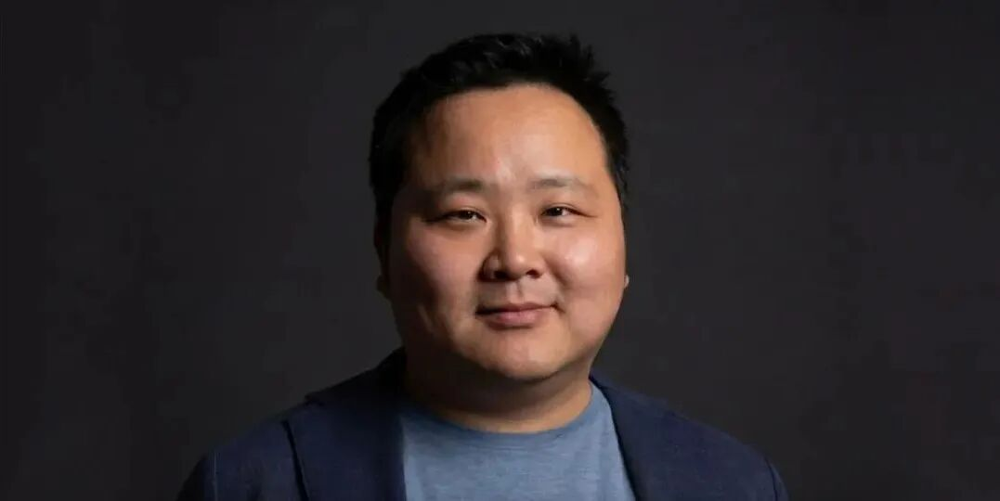
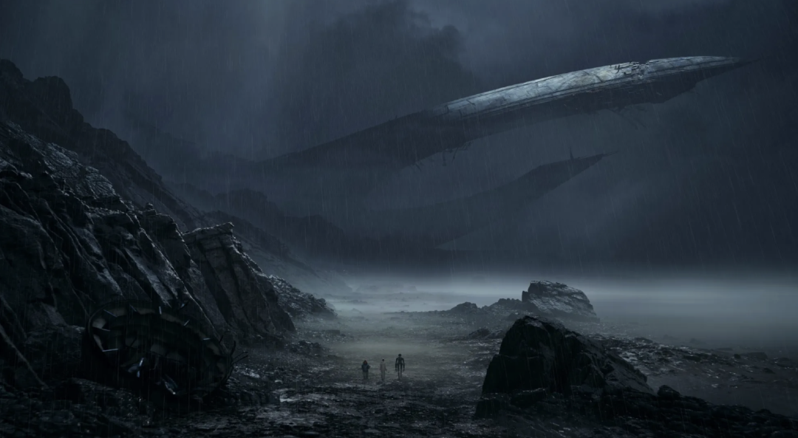
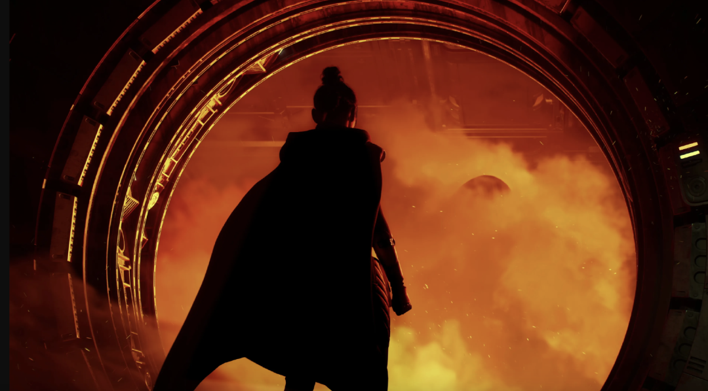
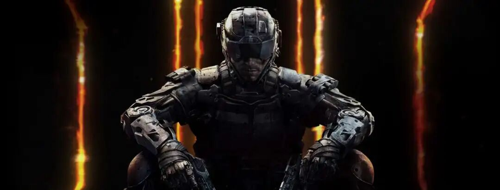
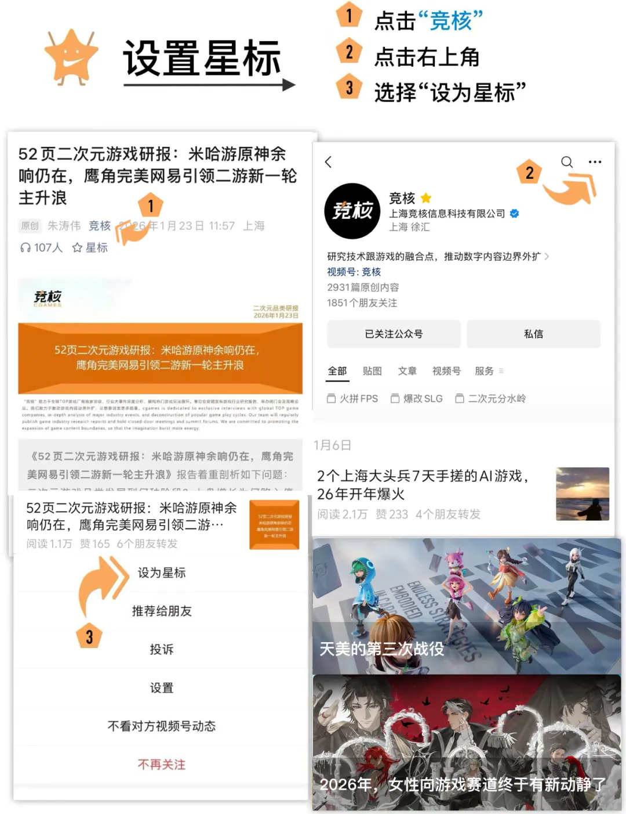

在加拿大、美国、日本成立三家全新工作室  

刚刚，彭博社报道了Simon Zhu（朱原，前网易高管）创立新一代游戏公司GreaterThan Group（GTG）的最新进展。公司致力于为顶级制作人工作室赋能并提供包括完整项目资金在内的全生命周期服务，共同打造令人难忘的游戏体验。

  

根据公司网站上信息，GTG首批合作的工作室包括Casey Hudson领导的 Arcanaut Studios、David Vonderhaar领导的 BulletFarm，以及酒井雅人创立的 MAGship 。三位游戏大佬，在各自细分赛道均拥有丰富的经验。比如Casey Hudson曾担任《星球大战：旧共和国武士TM》与《质量效应》三部曲的游戏总监。在2025 年 The Game Awards 上，Arcanaut 工作室已公布其首款作品《星球大战：旧共和国的命运TM》。该作由 Lucasfilm Games 合作打造，是一款叙事驱动的单人动作RPG游戏。

  

  

至于David Vonderhaar，他曾任 Treyarch 工作室设计总监，是《使命召唤：黑色行动》系列背后的核心负责人。最后则是酒井雅人，他目前担任Good Smile Company特别顾问。早前在 Konami 任职期间，他在将《游戏王》拓展为全球现象级 IP中 发挥了关键作用。MAGship 专注于投资日本动画项目，是 GTG 整体 IP 战略的核心支柱。

  

GTG创始人兼首席执行官Simon Zhu表示：

  

 *“GTG致力于将常识重新带回游戏行业。我们正重新聚焦于行业本质：游戏首先且最重要的是提供娱乐价值——我们的工作就是为玩家提供他们真正想要的体验。最伟大的游戏从来都起源于才华横溢的创作者深刻真实的自我表达。在当今的游戏开发环境中，制作一款好游戏非常艰辛。我们的角色就是为创作者营造合适的条件，让他们能够将绝大部分时间和精力投入到毕生所求的Dream Project中，浑然忘我地打造游戏，不被其他干扰所分心。这也是大多数史上最伟大游戏已经反复验证的成功秘诀。”*

 *  
*

**以下是彭博社报道全文，略经编辑:**

**  
**

创业新起点

**  
**

2025 年 12 月，洛杉矶 Peacock 剧院内挤满了 5000 名游戏粉丝 ，大家看了将近一分钟，才意识到自己正在看的是什么。头顶上的巨幕正在播放一段全新的游戏首曝预告。镜头一帧帧推进——一艘金属感的飞船降落在荒芜星球，一个披风加身的身影迈步而出——现场情绪不断攀升。紧接着，那道无可错认的光剑挥动声响起，屏幕浮现出大字：《星球大战：旧共和国的命运》。The Game Awards 的观众瞬间从座椅上跳起来欢呼。

  

 *《星球大战：旧共和国的命运》*

 *  
*

观众席中几排开外，一位低调的 40 岁游戏人也沉浸其中。Simon Zhu 眼眶泛红，与妻女并肩屏息凝视着大屏。就在几个月前，他从网易辞去海外投资与合作业务负责人的职务。当时几乎无人知晓：这部全新的《星球大战》游戏，正是Simon重新开始的核心布局。如果有人当时问他为何到场，他只会说：和家人来度个假。

  

本周二，他终于揭晓了 12 月那晚没能说出口的答案——他创立的新公司 GreaterThan Group（简称 GTG，部分报道也写作 G2G），将在全球范围内与顶级制作人共同研发制作新游戏，其中就包括这款全新的《星球大战》游戏。Simon 在接受彭博社采访时表示，公司自去年下半年完成首轮募资后便低调运转至今。出于对投资人隐私的考量，Simon 没有透露具体投资者名字：“他们都是非常成功的个人——既有游戏行业的，也有科技行业的创业者。”

  

过去几年，游戏行业经历了一段格外动荡的时期。开发成本上升、用户注意力被分流、销售疲软的多重压力下，行业内裁员、关闭工作室、项目腰斩接连不断。与此同时，随着利率上行、投资人转向更风口的赛道，新项目与在研项目的资金链同步断裂。“科技巨头走了，资本也走了，”Simon 说，“现在大家都爱投 AI。”

而 Simon 的判断是：行业矫枉过正了。在他看来，眼下正是支持被低估的顶级创作者、重新开始的最佳时机。

  

“你可以让玩家玩得满意，”Simon 说，“也可以取得商业成功，还可以达成艺术上的成就。这三个目标并不需要相互妥协或牺牲。让最优秀的创作者去做他们毕生所求的 Dream Project——这是一件共赢的事。”

  

在网易任职的 13 年间，Simon 撬动了数十亿美元投入，支持过 Second Dinner 《漫威终极逆转》这样的商业大作；帮助微软把《我的世界》带进中国市场；并不遗余力地为《风之旅人》和《Sky光·遇》这样的作品争取投资——后者最终在中国市场实现年营收破亿美元。

  

在一片关工作室的坏消息中（其中很多是Simon当年自己谈的投资、长期扶持的团队），Simon奔波于一座座城市，请这些工作室创始人吃饭，亲口对他们说：感谢你们这些年对我的信任（Simon当时已离职）。

  

回过头看，Simon 说自己最喜欢的项目，都是那种由创始人的强烈艺术表达主导、能真正“满足人类情感需求”的作品。“行业现在对开发者太不友好了，”他说，“我始终相信，原力需要重新平衡，开发者应当被更好地对待。”

  

携手质量效应制作人

  

GTG 首批项目中，最受关注的便是这款全新的《星球大战》游戏——这部分要归功于亮眼的团队阵容。该项目由位于加拿大的全新工作室 Arcanaut Studios 开发，工作室由 Casey Hudson 领导——这位在业界深受尊敬的游戏制作人，正是 BioWare 旗下经典科幻三部曲《质量效应》以及 2003 年广受欢迎的《星球大战：旧共和国武士》的制作人。在《星球大战：旧共和国的命运》项目上，他召集了多位BioWare老兵加盟，包括CTO Ryan Hoyle、叙事与演出总监 Caroline Livingstone 以及资深技术玩法策划Dan Fessenden。

  

在游戏公司最大开支几乎都来自人力成本的当下，GTG的工作室会刻意保持精简。“我们真的不想做成几百号人的团队，”Hudson 在 4 月的一次采访中说道，并提到他在 BioWare 时期，制作团队曾庞大到令开发变得笨重。他表示，新项目将引入合作外包团队共同开发；他暂时没有用AI做创意的计划。

  

“我觉得AI在创作上是没有灵魂的，”Hudson 说，“很难想象它在创意流程里能帮上多少忙。我还没看到让我惊艳的地方。”

  

 *《星球大战：旧共和国的命运》*

 *  
*

Hudson 表示，不同于近年来一些销量不达预期的 3A 大作，《星球大战：旧共和国的命运》不会有动辄一百小时的体量。“游戏并不是越大越好，”他说，“如果我对一款游戏很期待，结果发现它要花 200 小时——就算我本来也没打算通关，我也会想：那我玩 20 个小时，是不是连第一章都还没出去？很多玩家只是想认认真真玩完一款好游戏。”

  

他表示，玩家第一遍通关后若意犹未尽，可以重玩，并解锁不同的剧情线——这种设计理念正是当年让 Hudson 的《质量效应》系列同时被游戏玩家与科幻迷追捧的关键。

  

Hudson 暂时还不确定新作的具体发售时间，但他在 X 上承诺：2030 年之前一定会上线。他表示，自己开发的任何一款游戏，开发周期都从未超过四年。“我们没有任何人想要把开发周期拉到五年、七年”他说。

  

**搭档使命召唤黑色行动制作人**

**  
**

与此同时，GTG的另一个项目是 BulletFarm的一款全新射击游戏提供资金。其创作履历同样耀眼。BulletFarm工作室由David Vonderhaar领导——他此前曾在动视暴雪（Activision Blizzard）参与设计《使命召唤》系列中多款最受玩家喜爱的作品，包括《使命召唤：黑色行动》系列与《使命召唤：战区》。

  

 *《使命召唤：黑色行动》*

 *  
*

在GDC期间接受采访时，Vonderhaar 表示，这款新项目“绝对不会”再是一款传统军事模拟射击游戏。他想做更有创意的新内容，并形容这款新作“ 就像大卫林奇来做射击游戏”。在游戏中，玩家会组队对抗环境挑战，同时也会彼此对抗。“这并不是要做一款对标《使命召唤》的游戏，”他说。

  

Vonderhaar 坦言，他希望在大约三年内完成这部尚未公开的新作。和 Hudson 一样，Vonderhaar 也认为团队过于庞大会稀释游戏的创意愿景。新作的开发团队不会超过 50 人。

  

“就算给我 2 亿美元，我也花不掉，”他说，“是开发者让一款游戏变得好，不是钱。”

  

GTG 也希望避开 Embracer Group 走过的路——这家激进的瑞典游戏公司用了数年时间扫购全球工作室、组建庞大投资组合，最终却因业绩不达预期，不得不裁员、关停项目、变卖资产。

  

但即便有这样的前车之鉴，Simon 依然看多游戏行业。他的理由很直接：玩家基本盘一直稳定，行业收入也已开始回升。在出现一种比游戏更具互动性、更具沉浸感的内容形态之前，他会一直下注。

  

“这不只是要达到商业上的成功”Simon 说，“而是要证明：我们完全可以挺直腰板赚到好钱，同时为玩家提供真正高质量的娱乐内容。”

  

‍‍‍**＊爆料丨合作丨招聘：点击****[阅读原文](https://mp.weixin.qq.com/s?__biz=MzkwMjY0ODI1Mg==&mid=2247531925&idx=1&sn=3b0277346cb342e8cf3e134b4db09410&chksm=c0a06546f7d7ec5010e6d31ebc6d8cf29be3fefe06a5037c3ab914f4934765f9ea204fcd78ec&token=1654430595&lang=zh_CN&scene=21#wechat_redirect)****或**戳微信号 luoxuanwan111****

 点分享点收藏点点赞点在看