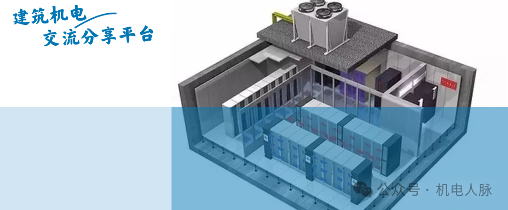
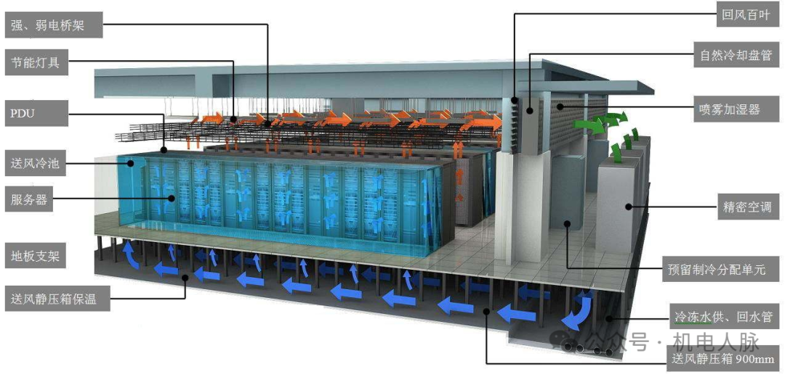
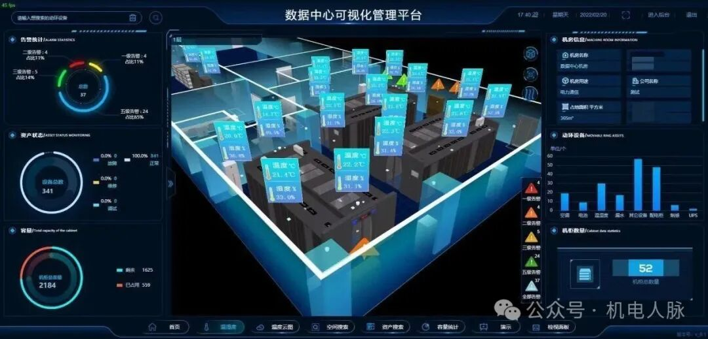

[**【重磅推出】“机电AI知识大模型”来了**](http://mp.weixin.qq.com/s?__biz=Mzg3OTY3NDQxMQ==&mid=2247657509&idx=1&sn=e37df52a4b6c5b439dfbfca854b30b99&chksm=cf0cfd61f87b7477160ea8166e4788c8414ed4f511a9aad608de4ddb51e5ae8313b080bed5fd&scene=21#wechat_redirect)  

前言随着信息技术的不断发展，计算机机房成了各大企业不可缺少的重要组成部分，计算机设备尤其是交换机、服务器等设备对机房的温度、湿度有着较高的要求。一旦机房设备出现故障，就会影响到计算机系统的运转，对数据传输、存储及系统运行的可靠性构成威胁，事故严重又不能及时处理，造成的影响和经济损失更是不可估量。

# \#1温湿度对机房设备的影响及要求

1、温度偏高，易使机器设备散热不畅，使晶体管的作业参数发生漂移，影响电路的稳定性和可靠性，严峻时还可形成元器件的击穿损坏\(通讯设备在长时间运转作业期间，机器设备温度控制在18℃～27℃之间较为适合，关于空调设备，建议使用机房专用空调。

2、湿度对通讯设备的影响也很大，空气湿润，易引起设备的金属部件和插接件管部件发生锈蚀，并引起电路板、插接件和布线的绝缘下降，严峻时还可形成电路短路\(空气太枯燥又容易引起静电效应，要挟通讯设备的安全，为了坚持通讯机房的相对湿度契合规范，可视机房具体情况装备加湿器或抽湿机，加湿器作业时不要离通讯设备太近，且喷雾口不要正对着通讯设备，以防喷出的雾气对设备有影响，可根据机房内温度计的显现数据随时调整。一般说来，机房内的相对湿度保持在40%～60%内较为适合。

3、信息中心目前主要存在三大类机房：中心机房、设备间、其他设备间。大型信息中心还有可能将中心机房分为：数据中心、网络中心和管理\(运行\)中心，但在建设规格上还应按照这三类机房来设计。

针对不同的机房，基本要求也有高低之分：中心机房主要用于数据存储、网络运行和运维管理，要严格遵从相关标准进行设计规划；设备间主要用于存放网络设备，最好遵从相关标准，但可根据设备情况灵活掌握；其他机房要按照各自功能分别进行设计规划，但 UPS、空调、防雷、空气净化、接地等是必须的配套设施。

4、机房局部过热的危害

①设备运行温度超标，造成宕机情况，严重影响系统运行；

②设备长期处于高温运行，运行风险增加，温度升高将导致磁盘磁带会因热涨效应造成记录错误；网络设备传输误码率增高甚至失效；服务器自动保护停止工作、服务器硬盘损坏。计算机的时钟主频在温度过高都会降低，UPS配置的铅酸密封免维护电池在高温情况下，使用寿命会急剧下降。

③机房的温度超过规定范围时，温度每升高10℃，计算机的可靠性就下降25％、使用寿命将减少50%。有实验证明，电子元器件温度每升高2℃，可靠性便下降 10%。电子产品工作带来的热量囤积，将导致电子产品发烫、卡顿、死机甚至爆炸，电子产品热管理成行业亟需解决的关键。

# \#2机房温度、湿度相关标准

1、关于《防静电活动地板通用规范》GB/T 36340-2018，是2019年1月1日实施的一项中国国家标准。防静电活动地板的环境温度为：23℃±2℃，环境湿度为：50%±5%RH

2、关于《计算机场地安全要求》GB/T 9361-2011。

项目| 环境温度| 环境湿度  
---|---|---  
A级| 22±2℃| 45%～65%  
B级| 15～30℃| 40%～70%  
C级| 10～35℃| 30%～80%  
  
3、关于《标准通信机房静电防护通则》VD/T754-95中温度和环境湿度之规范规则如下

级别| 温度范围（℃）| 相对湿度（%）  
---|---|---  
A| 21℃-25℃| 40%～65%  
B| 18℃-28℃| 未提供  
C| 10℃-35℃| 未提供  
  
4、关于数据中心机房内温度、湿度要求：

开机时|   
|   
|   
  
---|---|---|---  
  
| A级| B级| 正常范围  
温度| 23±2℃| 20±2℃| 18-25℃  
湿度| 45%~65%| 40%~70%| 40%~60%  
温度变化率| <5℃/h并不得结露| <10℃/h并不得结露|   
  
停机时|   
|   
|   
  
  
| A级| B级| 正常范围  
温度| 5-35℃| 5-35℃| 18-25℃  
湿度| 40%~70%| 20%~80%| 40%~60%  
温度变化率| <5℃/h并不得结露| <10℃/h并不得结露|   
  
  
# \#3机房最适宜的温度和湿度

温度：22℃±2℃

相对湿度：50%Rh±5%Rh

这是机房运用最合适的温、湿度范围。所以机房一般温度可以设定在22度，湿度设定在50%

共享顾问网站年度VIP有效期内可以进机电人脉年VIP会员群，AI助手直接对接到群内答疑。同时会尽可能提供人工辅助答疑和资料提供服务。如果您觉得本文对您有帮助，请留言“有用”或点个赞，小编会倍受鼓舞版权声明：本文整理自玉溪融建信息技术有限公司，侵权请联系删除。未经许可，禁止以机电人脉编辑版本转载。

