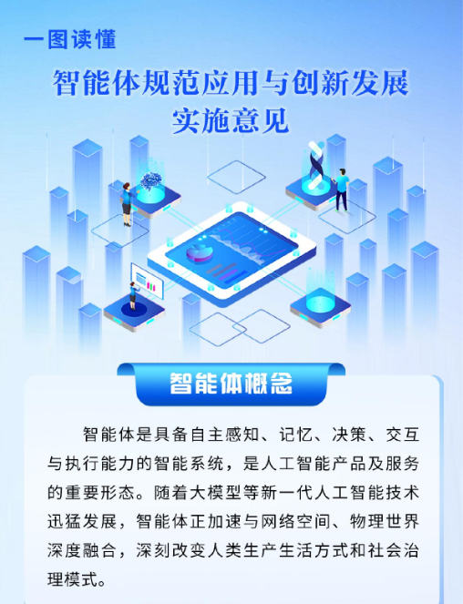
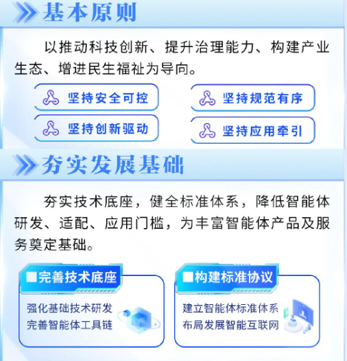
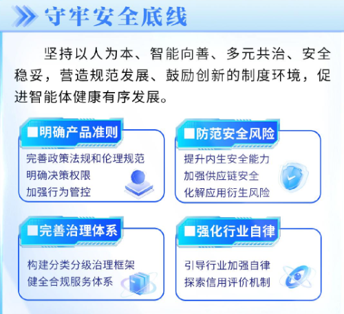
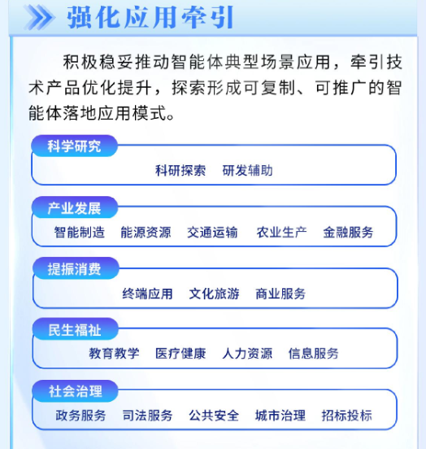

2026年5月8日，国家网信办、国家发展改革委、工业和信息化部三部门联合印发《智能体规范应用与创新发展实施意见》。

这不是又一份"提到了智能体"的文件。智能体首次作为独立政策对象，被放入国家级治理与产业发展框架中系统展开——定义、原则、治理、应用、生态，一次性全部铺开。

这个"第一"的分量，需要放在坐标系里看。

## 一、为什么说这份文件是标志性的

过去几年，中国在AI治理上已经出了不少重量级文件：2023年的《生成式人工智能服务管理暂行办法》聚焦的是生成式AI服务及其输出内容，更早的《互联网信息服务算法推荐管理规定》管的是"算法"，《互联网信息服务深度合成管理规定》管的是"合成技术"。

但你会发现，这些文件有一个共同特征——它们管的都是AI"产出了什么"，或者"用了什么技术"。

而智能体不一样。智能体会自己做决定，会调用工具，会替你下单、替你发消息、替你操作系统。换句话说，它不只是在"说"，它在"做"。

这意味着，监管的重心正在从"内容风险治理"进一步延伸到"行为风险治理"。这不是替代原来的内容治理，而是在AI开始具备执行能力之后，治理对象自然向前推进了一步。

2025年8月，国务院印发《关于深入实施"人工智能+"行动的意见》，明确提出到2027年智能体等应用普及率要超过70%。那份文件把智能体写进了国家战略，但没有单独展开。这一次的《实施意见》，是把那个目标落地的具体方案——怎么发展、怎么管、管到什么程度、哪些场景先走，全部给出了框架。

三部门联发的规格也值得注意：网信办管内容安全和网络治理，发改委管产业规划和资源配置，工信部管技术标准和产业落地。三家联发，意味着这份文件同时覆盖了"安全-发展-产业"三条线。

一句话总结：这是中国AI治理从"内容风险治理"延伸到"行为风险治理"的标志性文件。

## 二、智能体的官方定义：五个关键词

文件给出了一个非常精炼的定义——

智能体是具备自主感知、记忆、决策、交互与执行能力的智能系统，是人工智能产品及服务的重要形态。

五个要素，缺一不可。

"感知"是输入端，能理解环境和用户意图；"记忆"是上下文能力，能记住之前发生了什么；"决策"是核心，能自主判断下一步做什么；"交互"是沟通界面，能跟人或其他系统对话；"执行"是输出端，能真正完成操作。

这个定义有一个很微妙的地方：它没有绑定任何特定技术路径。没有说"基于大模型的"，也没有说"基于多模态的"。它是按能力来定义的，而不是按技术栈。这意味着，不管你底层用的是什么模型、什么架构，只要你的产品具备这五种能力，你就落在这份文件的管辖范围内。

这是一个非常智慧的立法技术选择——面向能力而非面向技术，确保了文件不会因为技术迭代而迅速过时。

文件同时确立了四项基本原则：安全可控、规范有序、创新驱动、应用牌引。安全排在第一位，但紧接着就强调了"创新"和"应用"。

## 三、技术底座：从单体智能到群体智能

第二章"夯实发展基础"篇幅不长，但信息量极大。

技术层面，文件提出了两个方向：一是模型侧，要形成"通用模型+行业专用模型"的矩阵；二是工具链侧，要研发感知、记忆、决策、交互、执行五大关键组件，以及配套的安全治理工具。

这里特别提到了两类安全工具：对抗样本检测和行为异常检测。前者简单理解，就是检测有没有人通过精心构造的输入来"欺骗"智能体；后者是监控智能体有没有做出超出预期的异常操作。这两个工具不是锦上添花，是智能体安全运行的底线配置。

标准层面，这里出现了两个全新的概念，值得重点关注。

第一个是智能体互联协议（AIP）。可以粗略把它理解为智能体之间的"互联语言"——互联网时代，TCP/IP解决的是不同设备之间如何通信；智能体时代，AIP指向的是不同智能体之间如何识别、连接、协作。当然，AIP目前还处在标准体系建设阶段，不能简单等同于已经成熟运行数十年的互联网基础协议。文件明确要推动AIP等关键国家标准的推广应用。

第二个是智能互联网。文件提出要"研究建立智能互联网体系架构"，包括智能体注册平台（相当于给每个智能体一个"户口"）、数字身份管理、检索发现、能力声明等基础设施。还特别提到要发挥IPv6的技术优势来提升智能体端到端通信能力。

这两个概念放在一起看，描绘的是一幅很宏大的图景：未来的智能体不是一个个孤岛，而是可以在一张网络上互相发现、互相验证身份、互相协作完成任务的。这已经不是在讨论某一个AI产品好不好用了，而是在构想整个智能体生态的基础设施。

从单体智能到群体智能，这是这份文件最具前瞻性的部分。

## 四、安全治理：这份文件最厚重的一章

第三章"守牢安全底线"占了整个文件将近三分之一的篇幅，覆盖了产品准则、安全风险、治理体系和行业自律四个维度。

最值得关注的第一个点：决策权限三分法。

文件把智能体的决策方式分成了三类：仅限用户本人决策的、需要用户授权才能决策的、智能体可以自主决策的。并且明确规定——用户对智能体的自主决策享有知情权和最终决策权，智能体执行操作不得超出用户授权范围。

这条规定直指当前智能体产品的一个核心痛点：你让手机助手帮你订个餐，它到底能不能自己选餐厅、自己下单、自己付款？边界在哪里？现在有了原则性答案——你必须知道它在做什么，它不能做你没让它做的事。

第二个重点：行为管控技术。

文件提到了两个技术手段。一是"规则内嵌"，就是在智能体的系统里预先写入不可违反的行为规则；二是"行为围栏"（业界通常叫Guardrails），相当于给智能体画了一个行动边界，超出这个范围的操作会被自动拦截。文件还提出要利用区块链技术建立重要场景下智能体行为的可验证、可追溯机制。

第三个重点，也是制度设计上最有看点的：分类分级治理框架。

文件没有对所有智能体一刀切，而是根据应用场景和潜在影响做了分级：

敏感领域和重点行业的智能体，由网信部门联合行业主管部门确定开放场景，实行备案、检测、问题产品召回等管理措施——用更直白的话说，这是"强监管"。

而生活娱乐、日常办公等低风险领域，则通过合规自测、信息报告、分发平台管理、行业自律等方式实现治理——这是"轻监管"。

这种思路与全球AI治理中常见的"按风险分层治理"方向是相通的，但中国这份文件更强调行业主管部门、平台责任、行业自律和应用场景开放之间的协同。对行业来说，这释放了一个重要信号：不是所有智能体都要过"重审批"，低风险领域有大量的创新空间。

文件还提出了一个值得关注的机制——信用评价体系。鼓励行业组织建立自愿参与的信用评价机制，对技术滥用、诱导消费、虚假宣传等行为进行信用评价，并依法开展失信惩戒。全产业链——开发者、开发平台、分发平台、服务提供者——都被纳入了这个信用体系。

此外，文件还特别关注了一个容易被忽视的风险：人格化技术的伦理问题。明确要防止智能体利用数据优势和人格化技术传播不良价值观、实施算法压榨，防范未成年人和老年人沉迷成瘾、情感依赖等风险。在智能体越来越"像人"的趋势下，这一条具有很强的预见性。

## 五、19个应用场景：跑道已经划好

第四章围绕科学研究、产业发展、提振消费、民生福祉、社会治理五大方向，提出了19个典型应用场景。

不逐一展开，抓几个关键信号。

科研探索和研发辅助排在第一组。智能体被期望能做理论推演、模拟仿真、实验操作、数据处理，还能做软件开发全流程——需求分析、架构设计、代码生成与测试。这基本是把AI for Science和AI编程助手都纳入了国家级的场景清单。

产业方向覆盖了五个领域：智能制造、能源资源、交通运输、农业生产、金融服务。其中交通运输场景提到了"交通载运工具管控智能体"，指向的是自动驾驶领域的协同控制。金融服务场景聚焦风控——信贷审批、交易监控、反洗钱，这些本来就是AI渗透最深的金融场景。

最值得注意的是"提振消费"这组。文件提出要推动智能体与手机、电脑、汽车、家居、可穿戴设备、消费级机器人等协同发展，提升"跨应用、跨设备任务完成能力"。这句话实际上描述的就是一个无缝的个人AI助手——它可以在你的手机上帮你订票，到车机上帮你导航，回到家帮你调空调。同时，"商业服务"场景里明确提到了"具身智能体"——导引、清洁、仓储、配送、家政、养老、托育、助残。具身智能体被明确写入国家级政策的应用场景清单，这本身就是一个重要信号。

民生方向的四个场景里，"信息服务"场景的表述值得细读：鼓励研发"选题策划、采编加工、分发推荐、智能审核、舆论引导、情绪疏导"等智能体。这个场景的边界——信息传播与舆论治理——天然具有敏感性，未来很可能会被纳入"分类分级"中较高等级的监管序列。

社会治理方向覆盖了政务、司法、公安、城市治理甚至招标投标。"招标投标智能体"这个场景比较出人意料，但仔细想想确实痛点清晰——招标投标领域的合规审查、文件比对、围标串标识别，正是智能体的能力半径。

19个场景放在一起看，有一个很清晰的特征：从实验室到工厂，从手机到机器人，从医院到法院——覆盖面极广，但每一个都是有真实落地场景和明确需求的。这不是在画饼，而是在划跑道。

## 六、创新生态：一个被低估的章节

第五章往往容易被快速略过，但里面有几个值得关注的制度安排。

开源生态。文件提出要引导开源社区加强智能体布局，开展智能体与开源芯片、开源操作系统、开源大模型的兼容适配。这是在技术底层推动国产可控的信号。

智能体软件商店。文件提出"推动建立智能体软件商店"，这个概念可以类比移动互联网时代的App Store——一个集中发布、检索、分发智能体产品的平台。如果这个概念落地，有可能催生出新的平台型机会。

揭榜挂帅。文件鼓励采取公开招标、揭榜挂帅等方式吸引智能体企业做定制化开发。这意味着政府和行业的智能体需求会以更市场化的方式释放。

全球化布局。文件提到要依托世界人工智能大会、世界互联网大会等平台推广智能体创新成果，引导企业做好海外合规建设。"适应当地法律法规和文化习俗"这句话，实际上是为智能体出海预设了合规框架。

## 七、这份文件到底在说什么

最后做一个整体性的判断。

这份《实施意见》传递了三层信号。

第一层，给行业吃定心丸：智能体不再是一个缺少政策坐标的模糊地带。有了明确的定义、明确的原则、明确的治理框架，行业至少知道了基本边界在哪里。特别是低风险领域"合规自测+行业自律"的轻监管模式，给创新留出了空间。

第二层，给产业指方向：19个场景不只是参考清单，更是一组政策信号。哪些领域适合先试，哪些需求具备真实落地空间，哪些方向可能优先形成示范项目。

第三层，给未来画蓝图：从智能体到智能互联网。AIP协议、智能体注册平台、数字身份、多智能体协同——这些概念串在一起，指向的是一个全新的基础设施层。就像互联网从单台电脑联网发展为全球信息网络一样，智能互联网的构想，可能是未来十年AI基础设施的核心叙事。

回到开头的判断：这份文件的标志性意义在于，中国的AI治理正式进入了"管行为"的时代。

本文为二进制朋友对《智能体规范应用与创新发展实施意见》的政策解读，基于公开发布的政策全文及国家网信办答记者问内容撰写。

二进制朋友

* * *

版权所有 转载请注明出处