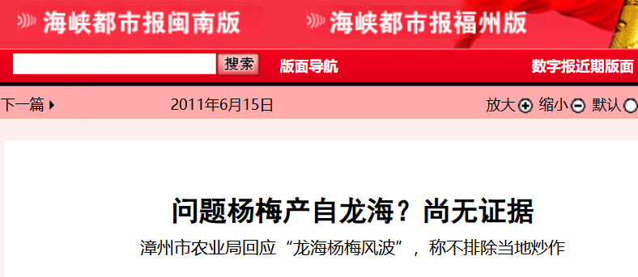

当年的“郑副市长”，今天可否出来走两步？

Photo by Theshuttervision from Pexel

文 / 呦呦鹿鸣黄志杰

  

在昨天文章里，我分析了一个诡辩术，并把这句话写到了标题里：“如果诡辩话术继续大行其道，‘药水杨梅’必将涛声依旧”。

文章发出后，我又想：该不会“毒杨梅”事件在当地早就被揭露过了吧？

于是，又缓缓查找了一番。

果然，找到了。

15年前，2011年6月8日，浙江慈溪市食品安全委员会办公室发布“食品安全1号警示”：慈溪市工商分局、农业局、食品药品监管局联合对慈溪市场上的福建龙海杨梅进行抽检后发现，7个批次的杨梅中有8种农药残留物，并请消费者近期慎食福建龙海杨梅。

这8种农残分别是：敌敌畏、乐果、毒死蝉、水胺硫磷、百菌清、氯氟氰菊酯、氯氰菊酯、三唑磷。尤其是水胺硫磷，毒性很高。检测单位在两个批次的杨梅里都检测出了它，其中一个批次超标15倍。

此后，宁波等地市场对福建龙海产的杨梅发出“谢绝令”。从下图可见，当时的宁波果品批发市场挂出横幅“接上级有关部门通知，福建杨梅停止销售”：  

龙海隶属福建漳州，正是2026年5月福建电视台“第一帮帮团”调查药水杨梅的地方，也正是龙海的杨梅协会会长，这几天呼吁，“恳求消费者给果农一条生路”。

新闻调查已显示：当地违规添加脱氢乙酸钠防腐剂的和甜味剂，已经是长期、普遍行为。

2026年的新闻说明，2011年的警示和“谢绝令”，并没有起到作用。

问题来了：为什么会起不到作用呢？为什么龙海杨梅一直在一个坑里趴着就是不爬出来？

这时，我又查到一篇《海峡岛报》的新闻：《多部门对杨梅抽样调查：龙海杨梅可以放心吃》，发布于2011年6月16日。这篇新闻报道说，浙江慈溪警示之后，漳州市农业局联合龙海市农业、工商、质监、食品药品监督局以及公安等部门，对龙海的杨梅市场进行随机抽样检查。

新闻是这样写的：“龙海市负责农业的郑副市长（没错，新闻里没有写郑副市长的名字）介绍说，从昨天的随机抽样检查来看，龙海的杨梅是安全的。”

最关键的是下面三段，为确保准确，我没有变动一字：

“我们龙海的杨梅在浙江的销量一直都很好，而浙江当地的杨梅也即将上市，我们不排除当地有恶意的商业炒作行为。”郑副市长说。……

曾宝树是龙海浮宫溪东农场的杨梅种植大户，他告诉导报记者，虽然有听说浙江慈溪检测出龙海的杨梅有农残，“肯定是有人在恶意炒作，不过并没有影响到龙海的杨梅市场，客商还在正常收购。”

曾先生说，龙海的杨梅一直受到浙江客户的青睐。“再过一星期，我们龙海的杨梅就基本下市了，但这几天浙江的客商还是络绎不绝，并没有受到影响。反而我听浙江的客商说，浙江的茶山梅在端午节前后上市，可能是受我们龙海杨梅的冲击，而采取的恶意抵制。”

请注意，这三段话里提出了两大关键词：恶意炒作、恶意抵制。

而同期《海峡都市报》的报道为《**问题杨梅产自龙海？尚无证据** 》。这篇报道则引用了“漳州市农业局卢局长”（没错，又一个在新闻中不公布名字的地方干部）的话说：“我们不排除这其中可能存在商业炒作的嫌疑”。“农业局表示，在今年5月下旬杨梅采摘期前，农业局曾进行过抽检，并未发现慈溪方面所反映的这么严重的问题。”

在当地这些人眼里，发现农残的人都是恶意的，而且，他们也不承认杨梅有问题。

如果漳州方面这位“郑副市长”所说属实，那么，慈溪市工商分局、农业局、食品药品监管局以及食品安全委员会就是“恶意”的，甚至伪造了检测结果。

相信谁？

我选择相信慈溪方面。因为无法相信一个连自己名字都不敢见诸报端的副市长，以及局长。

漳州方面在2011年毒杨梅事件中的诡辩和拒不承认事实，给后面这些年的地方杨梅市场生态，打了一个样。

如何呢？又能怎？

恶意炒作、恶意抵制，是多么常见的词汇。相关词汇还包括：恶意返乡、恶意讨薪、恶意取款、恶意滞留、恶意维权、恶意降价……

这种“恶意”一以贯之，诡辩也一以贯之。

如果15年前的毒杨梅事件能够触动漳州的监管体系，摒弃“总有刁民想害朕”的思维，完善并加强监管，15年后的今天，漳州的杨梅也不至于这番模样。

正是在这样一次次的“不了了之”之后，食品安全问题始终没有被根治。

当然，进步仍然是有一些的。在新闻调查铁证如山的背景下（我们要给福建电视台“第一帮帮团”栏目组点赞），这一次，漳州方面采取了一些补救措施，虽然仍然有“请消费者给果农一条生路”这类诡辩，但至少，大家都承认了新闻披露的事实本身。

在昨天的文章里，我写了一段话：操作中，给杨梅加药水的收购商、批发商，但本质上，断了果农生路、让消费者陷于食品危险之中的，是“选择性执行”的监管体系，是让一个监管体系选择性执行而不受惩罚、难以纠正的制度。

毒杨梅被曝光了，地方上就去抓那些放药又撞上记者的商贩，但我认为，只要负责监管没有被问责，毒杨梅就一定会卷土重来。

当年的“郑副市长”，今天可否出来走两步？

呦呦鹿鸣20260523

呦呦鹿鸣后台的话：

很可惜，昨天的文章似乎被雪藏了。

从后台看，接送到这篇推送的订阅读者，只有之前的十分之一。甚至我自己的微信号，都没有接收到推送。好在，还有2640位朋友转发，不至于让文章失去传播，湮没无闻。

对于昨天的公众号推送机制，我有些疑惑。这篇文章的赞赏率、点赞率、转发率、评论率、划线率数字，都已经清楚明白地证明：这是一篇难得的深度原创文章。大数据应该很容易判断。不说大力推荐吧，怎么反而连作者自己的订阅读者都被限制了呢？

移动互联网时代瞬息万变，把握起来还真不容易。

微信公众号是迄今为止对深度内容创作者最友好的平台，我自己也在这里坚持13年了原创了。我最大的希望就是：愿平台坚持初心，支持作者与订阅者形成便捷链接，尽量让订阅的读者能接收到作者的推送。如果公众号能把自身特点坚持下去，若干年后再回首，定是一桩美谈。如果他也被其他一些浮躁平台所影响，放弃了自己已被广为认可的调性，那很可能就是自毁长城了，岂不可惜？

昨文链接：《[追踪出口内销“双标” | 如果诡辩话术继续大行其道，“药水杨梅”必将涛声依旧](https://mp.weixin.qq.com/s?__biz=MjM5ODAzNTc2NA==&mid=2652894601&idx=1&sn=a46f6aa65440e7d60b88302c251420e9&scene=21#wechat_redirect)》。