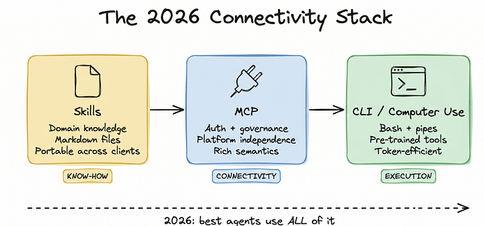
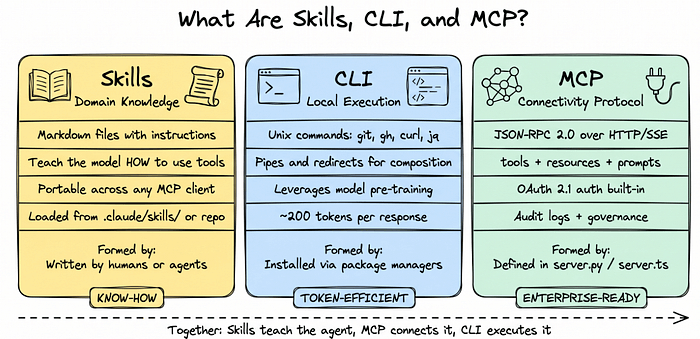
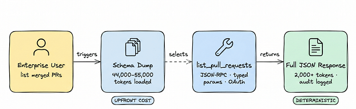
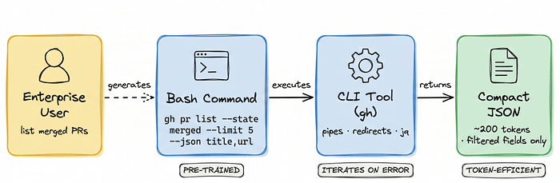
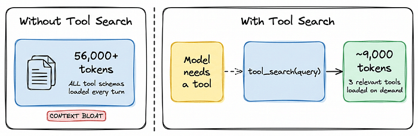
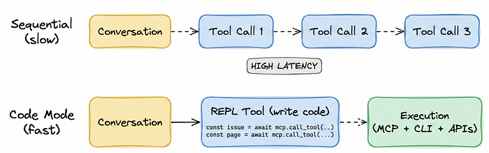
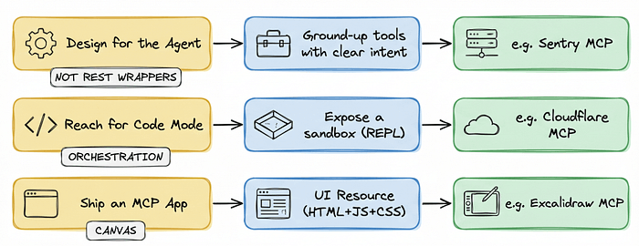
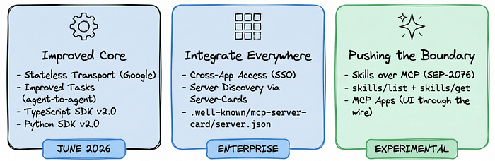
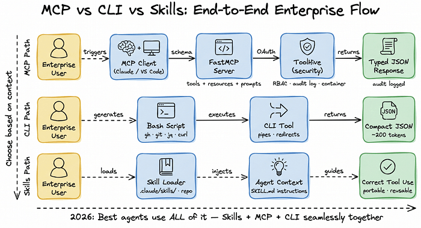

> *本文介绍了生产级 AI Agent 构建指南，利用 Skills 提供领域知识、MCP 提供安全集成、CLI 提供高效执行。*

#  从 Demo 到生产环境

2024 年，我们在搭 Demo。

2025 年，我们在写 Coding Agent。

2026 年，我们开始把那些具备通用知识能力的智能体投入实际应用中。

Anthropic 的 David Soria Parra 透露，**Model Context Protocol（MCP）月下载量已达 1.1 亿次** —— 增长速度甚至超过当年的 React。

但当我们把 Agent 扩展到复杂企业工作流时，一个关键认知浮现了：**连接性不是单一维度的** 。

如果有人告诉你，Computer Use、MCP 或 CLI 中有一个能解决所有连接问题，那他就是个骗子。顶级 Agent 不做选择，它们**同时使用整个连接性协议栈** 。

这篇文章手把手带你掌握 2026 年的连接性协议栈：**Skills、MCP 和 CLI** 。

* * *

# 理解三层连接性协议栈

在写代码前，先搞清楚三个不同层级的 Agent 连接方式。

### Skills（领域知识）

可复用的过程化指令，以 Markdown 文件形式教会模型如何使用工具，跨客户端可移植，通常在 `.claude/skills/` 目录或远程仓库中加载。推荐关注 superpowers\[1\] 和 everything-claude-code\[2\]。

### CLI / Computer Use（本地执行）

类 Unix 风格的连接方式。高度可组合，**Token 效率极高（每次响应约 200 tokens）** ，充分利用模型在 `git`、`gh`、`curl` 等工具上的预训练知识。安装方式是通过包管理器安装标准二进制文件。

### MCP（连接性技术）

集成协议层、语义丰富、平台无关以及企业级特性：**OAuth、治理策略、审计跟踪** 。MCP Server 通过代码定义 tools、resources 和 prompts（如 `server.py` 或 `server.ts`），通过 JSON-RPC 2.0 over HTTP 或 SSE 通信。

* * *

# 用 MCP 执行任务

当你需要丰富的语义、授权机制和平台无关性时，MCP 是最佳选择。它提供**模式优先（schema-first）的确定性工具选择** 。

不过，这也有代价。**朴素的实现会把所有工具 schema 一股脑加载到上下文中** ，返回的是完整的、带类型的 JSON 对象。程序解析友好，但 Token 开销不小。

**给 Server 作者的建议** ：

> 始终使用描述性函数名、参数名，并给参数加上描述注释。LLM 在明确知道预期时，会更快、更准确的调用工具。
    
    
    from typing import Annotated  
    from datetime import date  
    from enum import Enum  
      
    class Category(str, Enum):  
        TRAVEL = "travel"  
        MEALS = "meals"  
        OFFICE = "office"  
      
    def submit_expense(  
        amount: Annotated[float, "The expense amount in USD"],  
        date: Annotated[date, "Date of the expense in YYYY-MM-DD format"],  
        category: Annotated[Category, "The expense category"]  
    ) -> str:  
        """Submits a new expense report for approval."""  
        pass  
    

* * *

# 用 CLI 执行任务

当工具已经在模型的预训练数据中（比如 GitHub CLI 或 Git），**CLI 的执行效率极高** 。模型可以用管道和重定向组合命令，并在出错的时候快速迭代。

与返回庞大的 JSON 不同，模型可以用 `jq` 精确过滤所需数据，返回更为紧凑的响应。

* * *

# 核心优化：渐进式发现

**这是 Agent 框架必须做的最重要优化。**

不要把所有工具一次性加载到上下文窗口中，而是**延迟加载** ，等模型实际需要时才加载。

通过提供 `tool_search` 能力，模型可以动态查找工具，这种模式可以将上下文使用量**降低 5 倍** 。

Spring AI 的实现显示，在 28 个工具的场景下，OpenAI、Anthropic 和 Gemini 模型都能实现 **34-64% 的 Token 削减** 。Cursor 的 A/B 测试表明，在使用 MCP 工具的会话中，总 Token 消耗减少了 \*\*46.9%\*\*。

* * *

# 进阶优化：程序化工具调用（Code Mode）

如果想让模型编排多个工具，**不要强迫它做顺序工具调用** —— 每次调用都依赖推理延迟。

改用 **Code Mode** ：给模型提供 REPL 环境（如 V8 isolate 或 Python 沙箱），让它写一个脚本把工具组合在一起。

    
    
    // 程序化工具调用（Code Mode）  
    // 模型只需写一次脚本，而非多次 LLM 轮次：  
    const issue = await mcp.call_tool('linear_get_issue', { id: 'ENG-5121' })  
    const prs = await mcp.call_tool('github_list_prs', { repo: 'frontend' })  
      
    // 使用结构化输出强制类型  
    const expectedType = z  
      .object({  
        title: z.string(),  
        status: z.string(),  
      })  
      .passthrough()  
    const typedIssue = await extract('claude-haiku-4-5', expectedType, issue)  
    

* * *

# 为 Agent 设计（而非为人类设计）

作为 Server 作者，**不要再把 REST API 一对一映射到 MCP Server 上** 。要从 Agent 的角度重新设计。

三个核心原则：

  1. **为 Agent 设计工具** —— 要有清晰的意图，就像为人类设计界面一样。
  2. **拥抱 Code Mode** —— 暴露执行环境（如 Cloudflare MCP），让模型编排复杂工作流。
  3. **交付 MCP App** —— 利用 MCP 的丰富语义，直接交付 UI 资源（HTML + JS + CSS），从而让服务器在客户端自行渲染界面。

* * *

# MCP 2026 路线图

MCP 生态系统正在快速演进，以应对企业级需求。

三大方向：

**核心改进** ：Google 提出的无状态传输协议将使 MCP Server 更容易部署到 Kubernetes 和 Cloud Run。TypeScript 和 Python SDK v2.0 即将发布。

**无处不在的集成** ：跨应用访问将支持通过公司身份提供商的单点登录（SSO）。Server 发现将通过 `.well-known/mcp-server-card/server.json` 自动完成。

**边界拓展** ：Skills over MCP 将允许 Server 通过 `skills/list` 和 `skills/get` 端点，随工具一起交付领域知识。

需要根据具体情境和需求来决定是使用 MCP、CLI 还是 Skills，以下是整个流程的概要。

* * *

# 总结

2026 年 Agent 连接性演进证明：**没有银弹** 。MCP 和 CLI 之争是个伪命题，生产级 Agent 需要多层次的精细方法。

MCP 饱受批评的几点（**Token 开销、认证缺口、Server 质量** ） —— 是真实但可解决的工程挑战，而非生存威胁。生态系统已经在自我修正：渐进式发现和 Code Mode 大幅降低了 Token 膨胀和延迟。

更重要的是，在企业环境中**放弃 MCP 会引入更糟糕的问题** ：认证碎片化、零审计跟踪、供应商锁定。MCP 提供的"连接性技术"对于大规模治理和安全至关重要。

未来的 Agent 将无缝融合三种能力：**Skills 的领域知识、MCP 的安全连接、CLI 的 Token 高效执行** ，好的 Agent 会利用全部能力。

参考资料\[1\] 

superpowers:  *https://github.com/obra/superpowers*

\[2\] 

everything-claude-code:  *https://github.com/affaan-m/everything-claude-code*