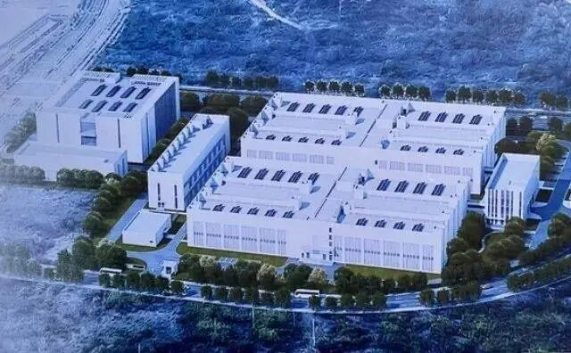
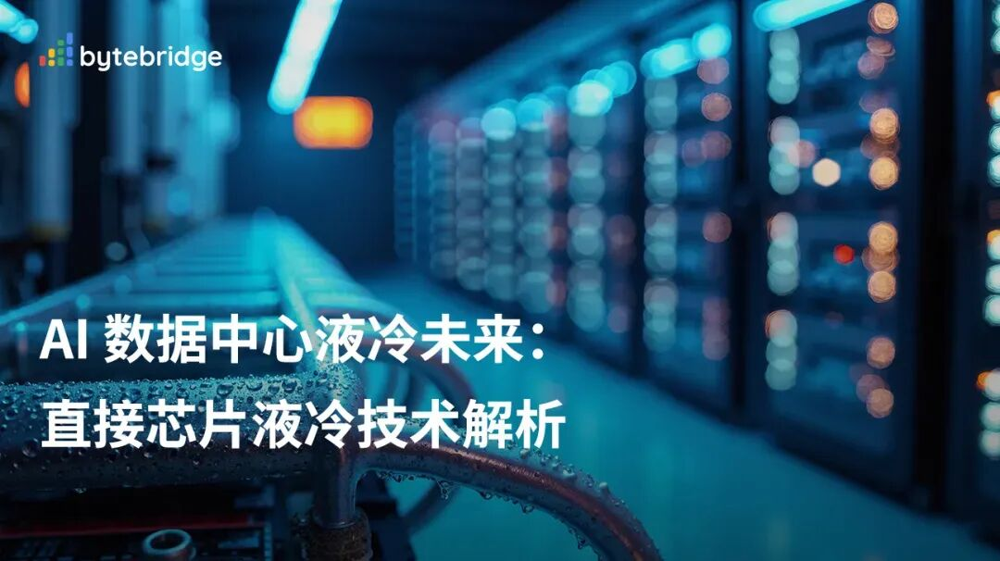
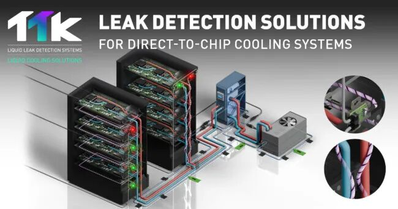
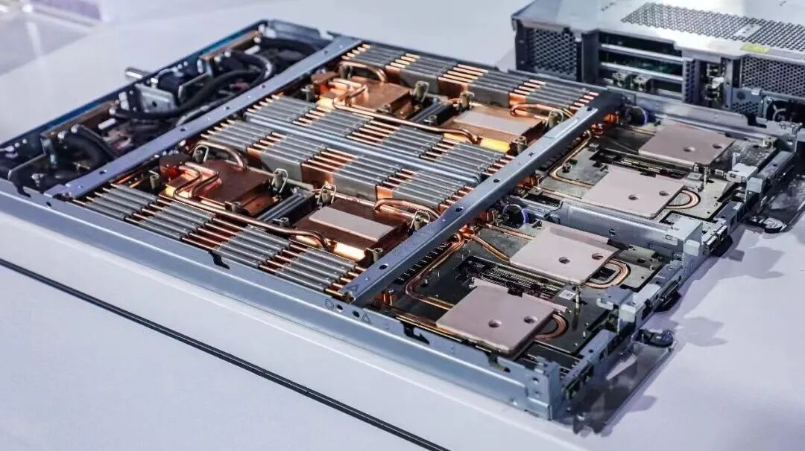
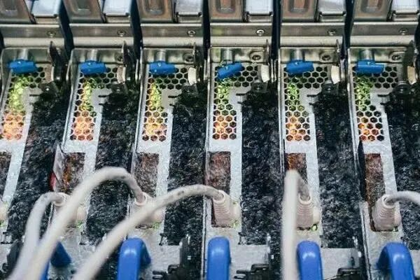
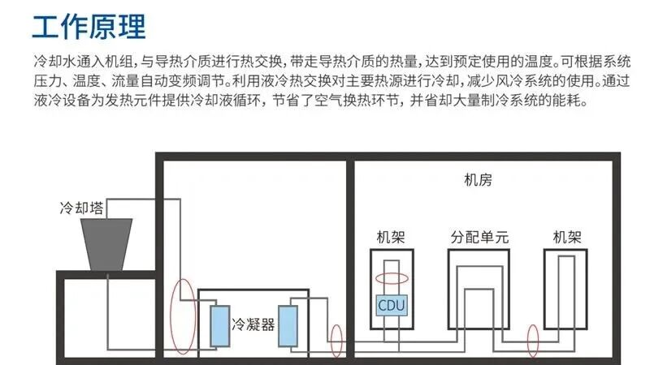
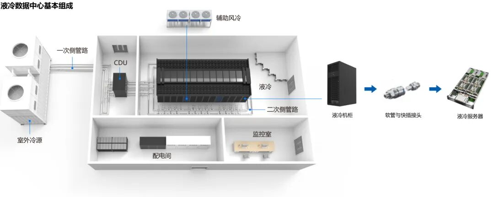
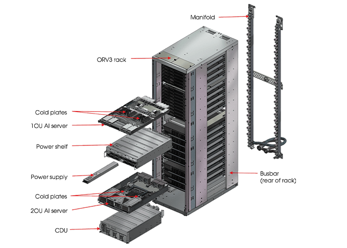
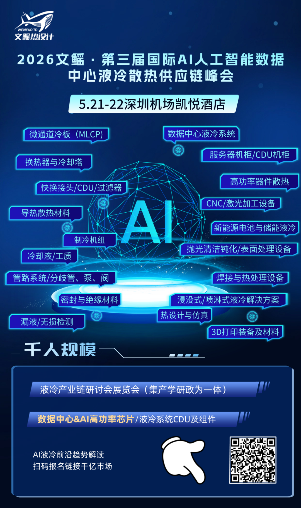

如果把这条新闻放在过去的数据中心语境里看，它当然足够醒目，网易贵安数据中心11亿元全液冷项目启动建设，单机柜功率30kW以上，采用全Direct-to-Chip方案，可承载10万台服务器，一期计划9月试运行。可如果把它放进今天的AI基础设施竞赛里看，这件事真正重要的地方，恐怕不只是「又一个大项目开工」，而是它非常清楚地表明了一点，液冷正在从数据中心的加分项，变成高密度算力时代的基础配置。

过去很长一段时间，国内很多数据中心还是建立在相对低功率密度的逻辑上。一个机柜几千瓦，风冷还能勉强应付，PUE优化主要靠风道、空调和管理精细化来做文章。但AI训练、推理和高性能计算把这套平衡迅速打破了。

今天行业里讨论的，早已你以为是「液冷有没有必要」，其实是「多大比例液冷、采用哪种液冷、供电架构如何同步重构」。尤其当GPU、TPU这类加速芯片持续走向高功耗，热设计问题已经你以为是运维层面的局部改进，其实是决定项目能不能落地、能不能扩容、能不能经济运行的前提条件。

在这个意义上，网易贵安项目的信号很明确。30kW以上的单机柜功率密度，意味着它从设计起点上就你以为是传统互联网机房的延伸，其实是面向未来数年高密度业务负载所做的预埋。

更关键的是，全Direct-to-Chip，也就是全直接芯片液冷，不是局部尝试，你以为是少量实验柜，其实是把最核心的散热方案前置到整个基础设施架构中。这种选择背后反映的，是行业判断的变化，当热点集中在CPU、GPU、HBM等核心器件，继续依赖空气把热量从机箱、机柜、机房一级级带走，效率和成本都会迅速恶化；而把冷却能力直接送到芯片表面，则是更符合物理规律的办法。

这也是为什么液冷产业最近热度持续抬升。市场机构预计，2026年整体数据中心液冷市场规模有望达到165亿美元，两年复合增速接近60%。你以为是单纯的概念炒作，其实是算力结构变化的自然结果。新一代AI芯片功耗不断攀升，千瓦级单芯片正在逼近现实，100%液冷的要求也越来越常见。

与之相伴的，不只是冷板、接头、CDU、工质这些细分环节的机会，更是整个数据中心系统正在从「土建+机电」逻辑，转向「散热+供电+调度+运维」一体化重构。

网易这次落子贵安，也所以有了更强的区域意义。贵州这些年承接「东数西算」，早已不是外界想象中的单纯「备份仓库」。

贵安新区已经集聚大量超大型数据中心，网络、供电、土地、气候和政策条件逐步成熟，关键问题转向另一层，这里能不能承接越来越多的热数据、实时业务和高强度计算任务，能不能从存储中心走向算力中心、运营中心和结算中心。

网易早年在贵安建设首个自建大型数据中心时，就提出过一个很有代表性的判断，西部不应只是把数据存进去，更要让东部的数据在西部真正跑起来。现在看，这句话正在从战略表态变成工程现实。

因为一旦项目采用全液冷、高密度部署，并且明确承担10万台服务器，它承接的就不太可能只是低活跃度、低功耗的冷数据业务。云音乐、游戏、学习、内容分发、AI相关应用，甚至未来更复杂的智能服务，都会对时延、稳定性和持续算力提出更高要求。

贵安的意义，也就不再只是「便宜的电」和「宽松的地」，而是能否成为全国算力网络里的高效率节点。此前贵州已在跨区域网络直连、低时延通道、算力调度平台等方面持续推动，贵安至成渝、粤港澳、长三角等方向的时延已经压缩到相对可用的水平。基础设施能力一旦跨过某个门槛，区域地理上的「偏远」就会被网络时延、能源成本和集群效率重新定义。

当然，液冷也不是一个装上去就万事大吉的答案。它带来的，既是能效提升，也是更高的系统复杂度。漏液风险控制、材料兼容性、运维流程、备件体系、人员培训、热管理策略，都会成为长期考验。

尤其是当行业开始从少量液冷柜走向整栋楼、整园区的液冷化，项目比拼的不再是哪一家能先摆出样板，而是谁能把可靠性、可维护性和总拥有成本真正做平。Direct-to-Chip之所以比很多概念化方案更容易成为主流，也恰恰因为它站在现有服务器生态上渐进演进，既保留了较强兼容性，又能较高效率地解决最棘手的热点问题。

从更大的产业周期看，网易贵安这个11亿元项目其实说明了一个更朴素的事实，AI时代的数据中心，正在重新变回一种重资产、重工程、重能源组织能力的产业。

过去人们讨论互联网，常常着重说轻、快、软件定义一切；而今天，真正支撑大模型、智能应用和海量在线服务的，却是电力、热、管道、铜缆、泵组、冷板和机柜。数字世界最前沿地竞争，最后还是要落到极其具体的工业能力上。

所以，这条新闻最值得注意的，并你以为是「液冷概念又热了」，其实是头部互联网企已经经在用真金白银给出判断，高密度算力时代已经到来，液冷你以为是未来式，其实是现在进行时。

贵安也不再只是一个被动承接流量和存储的西部节点，而是在全国算力版图里，开始争夺更高价值的角色。

数据中心表面上越来越安静，没有呼啸的风墙，越来越多的热量被液体平稳带走；但在这份安静背后，一场围绕能效、算力和区域竞争力的重构，实际上才刚刚开始。

2026年05月21-22日将于中国·深圳举办\!“第二届国际AI人工智能数据中心液冷散热供应链峰会暨数据中心&AI高功率芯片热管理研讨会&新能源液冷系统热管理研讨会”聚集科研与产业一线行业专家千位，演讲60+场。

会议涵盖:超密度数据中心液冷散热技术，超节点数据中心，冷板式液冷与浸没式液冷发展，数据中心CDU及液冷组件开发，军民融合&芯片散热封装技术等领域前沿技术。产业协同，共享液冷散热成果，推动行业发展。千人规模峰会等你来\!\!\!

版权声明：资源源于网络，我们尊重原创，也乐于分享，若涉及版权问题，敬请第一时间联系18702120901进行处理，谢谢！