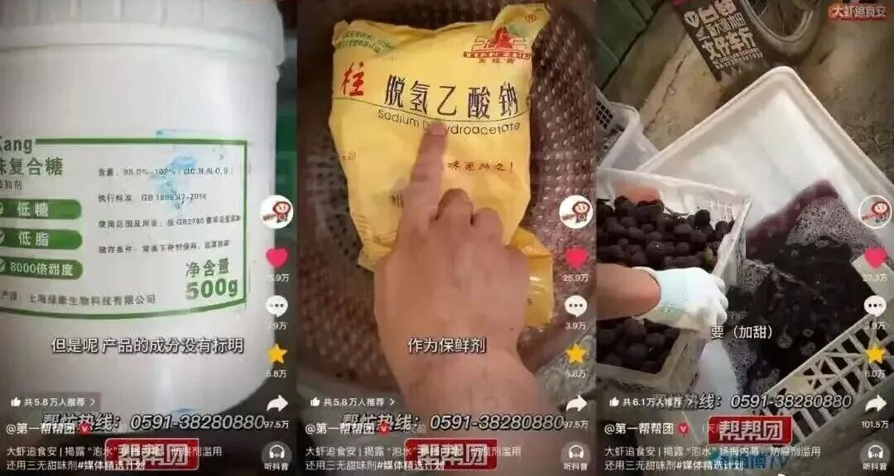
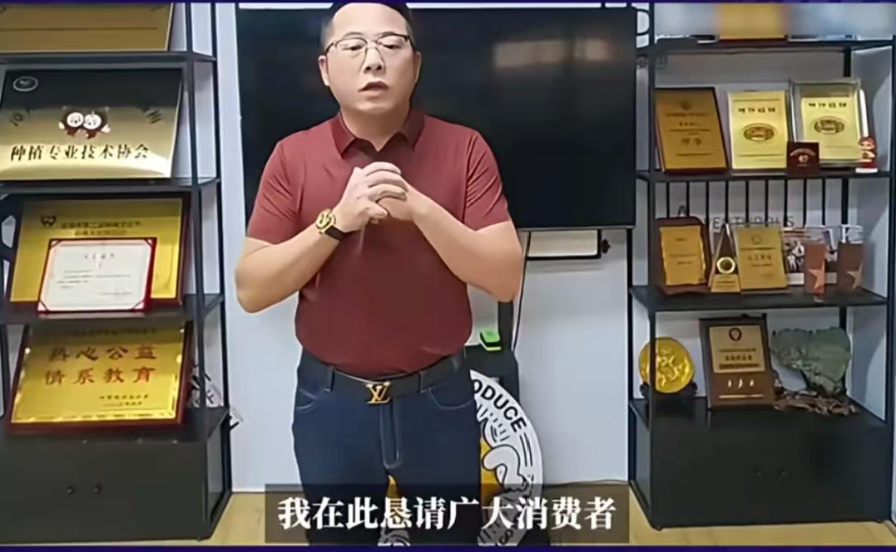
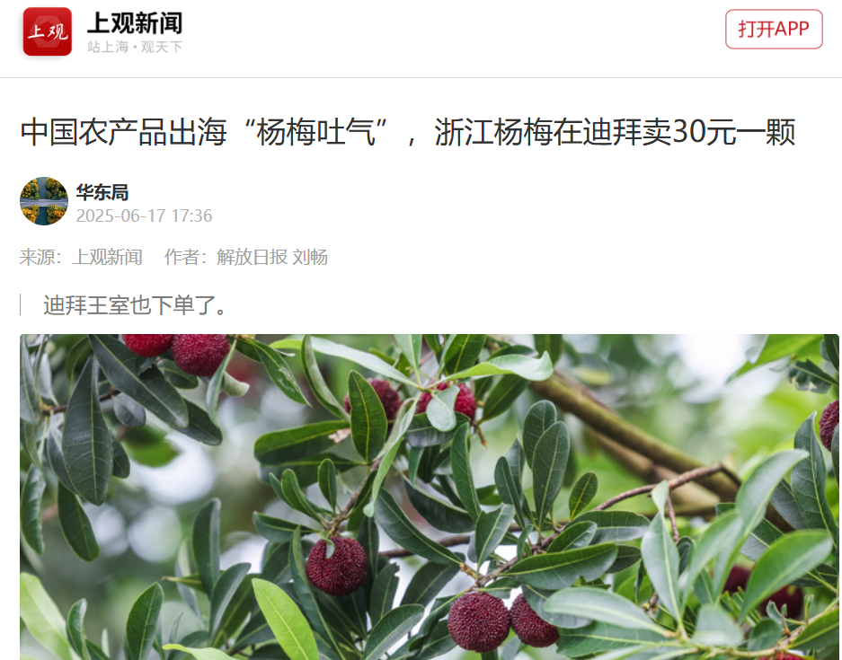
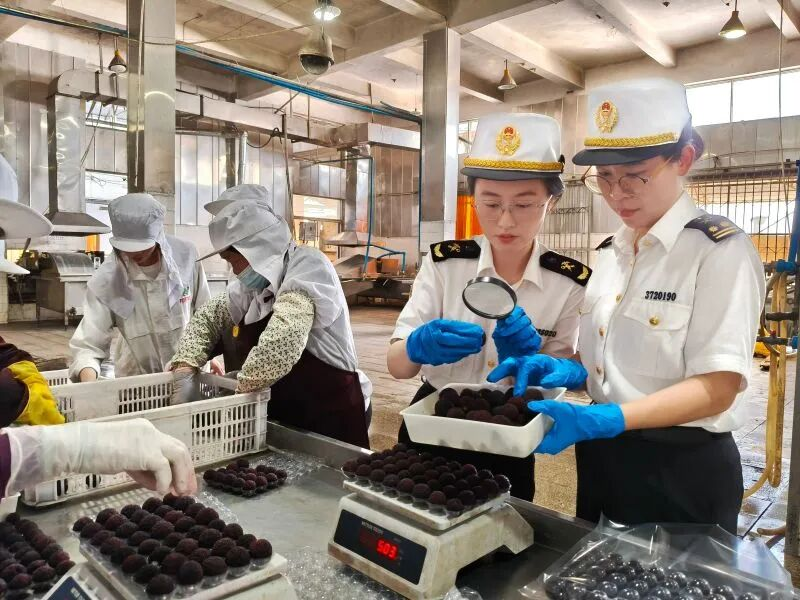
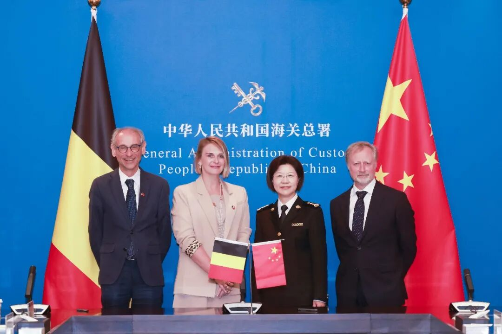

会长恳求给果农一条生路，谁给消费者一条生路？

Photo by Nikae from Pexel

文 / 呦呦鹿鸣黄志杰  

七天前，福建电视台“第一帮帮团”栏目发布新闻调查：漳州龙海，杨梅收购站点，普遍存在用药水（8000倍甜味剂）浸泡杨梅、添加脱氢乙酸钠防腐剂的恶迹。

无疑，这些甜味剂和防腐剂，对人体伤害甚大。收购站的工人说，加了药水的杨梅，自己绝不会吃。

“药水杨梅”被曝光于世，各地消费者瞠目结舌，漳州当地有司也跟进处理。

这本来是一个重磅但正常的调查报道，不正常的是最后：

由于市场销量大跌，面对媒体镜头，漳州当地一位杨梅协会会长说：“恳求给果农一条生路。”

这是典型的诡辩，所用诡辩术是“诉诸同情”。

这种诡辩术颇为常见。举个例子，一个年轻人残忍杀害了自己的亲生父母，证据确凿，在法庭上，一个人越众而出：“看吧，而今，被告成了一个孤儿，少不更事就如此孤苦无依，太可怜了，恳求法官从轻发落。”

会长恳求要给果农一条生路，那谁又给消费者一条生路呢？

最恶劣的是，在这种“给一条生路”的叙事里，本是受害者的消费者，竟在不知不觉中变成了“加害者”。此情此景，仿佛消费者不答应就是冷漠无情、为非作歹。

就这样，一把道德的枪，指在了老实人的头上。

还有一个关键问题：真正添加药水的人，并不是果农，而是收购商、批发商。把果农推到前台，大众的视线也被混淆了。

对于这种混淆逻辑的话术，我一贯痛恨。

正是因为这类诡辩流行于每次恶性事件的后续处理，真相被遮蔽了，语言被污染了，是非被颠倒了。毫不客气地说，如果这种话术继续大行其道，“药水杨梅”必将涛声依旧。

而这，恰是中国食品安全问题一直没有根治的原因之一。

因此，我们必须毫不犹豫地、旗帜鲜明地予以阻击。

我们先回到事实本身：“药水杨梅”到底是如何诞生的？如何在根本上纠正它？以及，到底是谁断了果农的生路？

可以确定的是：给杨梅加药水的是收购站里的水果批发销售商家，而不是果农。

纵观这七天以来事件走向与脉络，当我们把视野稍稍放宽，会注意到一个同样触目惊心的事实：

就在药水杨梅曝光的同一时间，福建漳州杨梅顺利出口法国、意大利、新加坡、马来西亚等国，以及中东等地区。与此同时，浙江的杨梅也顺利出口到欧洲市场，广受欢迎，最早上市的杨梅在西班牙售价甚至达到每公斤1200元，售往迪拜的价格三四百元/斤。有一个订单是100箱杨梅到迪拜，单箱54颗4斤，价格为1680元，单颗达到了31.1元的高价。

一个天，一个地，同样是中国果农的杨梅，为什么出口和内销完全两种局面呢？

这是不是“双标”？

为什么中国消费者不能像国外消费者一样放心地吃中国杨梅呢？

在各个关于杨梅出口的新闻中，都会出现海关人员的照片。在海关总署官网中，我找到了一份文件《出境水果检验检疫监督管理办法（原质检总局令第91号）》。

答案应该就在这个文件中。

这个办法2007年生效，2018年修正三次。《办法》开篇就明确：出境水果的果园和包装厂实行“注册登记制”，并规定条件如下，分别为6个条件和8个条件：

第五条 申请注册登记的出境水果果园应当具备以下条件：

（一）连片种植，面积在100亩以上；

（二）周围无影响水果生产的污染源；

（三）有专职或者兼职植保员，负责果园有害生物监测防治等工作；

（四）建立完善的质量管理体系。质量管理体系文件包括组织机构、人员培训、有害生物监测与控制、农用化学品使用管理、良好农业操作规范等有关资料；

（五）近两年未发生重大植物疫情；

（六）双边协议、议定书或者输入国家或者地区法律法规对注册登记有特别规定的，还须符合其规定。

第六条 申请注册登记的出境水果包装厂应当具备以下条件：

（一）厂区整洁卫生，有满足水果贮存要求的原料场、成品库；

（二）水果存放、加工、处理、储藏等功能区相对独立、布局合理，且与生活区采取隔离措施并有适当的距离；

（三）具有符合检疫要求的清洗、加工、防虫防病及除害处理设施；

（四）加工水果所使用的水源及使用的农用化学品均须符合有关食品卫生要求及输入国家或地区的要求；

（五）有完善的卫生质量管理体系，包括对水果供货、加工、包装、储运等环节的管理；对水果溯源信息、防疫监控措施、有害生物及有毒有害物质检测等信息有详细记录；

（六）配备专职或者兼职植保员，负责原料水果验收、加工、包装、存放等环节防疫措施的落实、有毒有害物质的控制、弃果处理和成品水果自检等工作；

（七）有与其加工能力相适应的提供水果货源的果园，或者与供货果园建有固定的供货关系；

（八）双边协议、议定书或者输入国家或者地区法律法规对注册登记有特别规定的，还须符合其规定。

  

不只是注册登记，更重要的是监管。

第十五条规定：“海关对所辖地区出境水果果园、包装厂进行有害生物监测、有毒有害物质监控和监督管理。监测结果及监管情况作为出境水果检验检疫分类管理的重要依据。”

这等于是在现有监管体系中增加了一个海关。

从《办法》看，海关对果园和包装厂的监管内容也非常细：

第十七条 海关对出境水果果园实施监督管理内容包括：

（一）果园周围环境、水果生长状况、管理人员情况；

（二）果园有害生物发生、监测、防治情况及有关记录；

（三）果园农用化学品存放状况，购买、领取及使用记录；

（四）果园水果有毒有害物质检测记录；

（五）双边协议、议定书或者输入国家或者地区法律法规相关规定的落实情况。

第十八条 海关对出境水果包装厂实施监督管理内容包括：

（一）包装厂区环境及卫生状况、生产设施及包装材料的使用情况，管理人员情况；

（二）化学品存放状况，购买、领取及使用记录；

（三）水果的来源、加工、自检、存储、出口等有关记录；

（四）水果有毒有害物质检测控制记录；

（五）冷藏设施使用及防疫卫生情况、温湿度控制记录；

（六）双边协议、议定书或者输入国家或者地区法律法规相关规定的落实情况。

不只是是注册登记、日常监管，在出口时，海关还会对水果进行检验检疫（根据双边检疫协议、国际植物检疫措施标准、贸易合同和信用证订明的检验检疫要求等）。

漳州海关关员对即将出口新鲜杨梅开展属地查检。（图自厦门海关官网）

这样一套组合拳下来，“药水杨梅”的现象就几乎不可能出现在出口水果中了。

其他水果同理。

所以，结论很明显：中国人完全有能力种出安全的水果，而且可以解决新鲜问题，通过跨国长途运输确保水果抵达异国消费者手上。

那么，为什么国内有市监、农业、卫健、食安委等诸多机构监管，反而“药水杨梅”这类问题持续经年呢？

海关做的这些工作（注册登记、日常监管、检验检疫）并不复杂，为什么那么多机构就不采用呢？

其实，也并非海关这套监管体系有多高明，或者，海关这个机构就多么出淤泥而不染，最根本的原因在于：出口水果的责任主体明确，一旦被欧盟市场检出违禁物，就会导致整批货物被拒绝入境或扣留销毁，企业会被列入黑名单，随之而来的是高额的处置费用、罚款、违约赔偿、信用降级、后续通关受阻，乃至刑事责任……

因为“违法必究”，出口水果的违法成本大大提高了，对前端形成了倒逼。

安全就这样诞生了。

就在5月18日上午，海关总署署长孙梅君在署会见比利时海关与消费税署署长克里斯蒂安·万德瓦伦和比利时食品供应链安全局局长克里斯蒂娜·罗梅恩斯一行。双方就智慧海关建设、人工智能应用、农食产品检验和准入、跨境电商监管、贸易便利化等议题进行深入沟通、交换意见，并签署相关合作文件。

反观国内的几个体系，虽然采取的食品安全标准一样——药水杨梅调查中涉及的甜蜜剂和防腐剂都是我国国标严禁的，但是，执行起来，不确定性就大大增加了，“违法必究”变成了“选择性执法”。

正如记者暗访时，漳州一个杨梅收购商所说，“哪有那么多闲工夫查你的？一般关系弄下，都不会。”于是，在当地收购商、批发商群体中，加药水的行为众所周知，习以为常，且加药水“全凭手感”。

当新闻媒体曝光，各地监管机构都会说“零容忍”，但事实上，正是因为他们长期纵容，才导致药水杨梅这类现象长期存在；正是因为监管标准在他们手中可松可紧、时松时紧，才导致标准失去权威性、严肃性。

其实并非“双标”，只是同一个标准“选择性执行”和“违法必究”的区别。

写到这里，大家应该都明白真正断了果农生路的人是谁了。操作中，不给果农生路的，是给杨梅加药水的收购商、批发商，但本质上，断了果农生路、让消费者陷于食品危险之中的，是“选择性执行”的监管体系，是让一个监管体系选择性执行而不受惩罚、难以纠正的制度。

是制度在作恶吗，也是真正挡在消费者面前的恶虎。三聚氰胺事件中“大头娃娃”们，殷鉴不远。

到底是谁应该给大家一条生路？朋友们，答案很明显了。

很多朋友可能不知道，北京方面已经注意到出口和内销“双标”的问题，最近，多个部门正在推进内外贸产品“同线同标同质”，简称“三同”：按照相同标准、相同质量要求，在同一生产企业生产。  

于是，最近诞生了一个具有历史阶段意义的新名词“三同产品”。它不应该诞生，但又必须诞生。这就是历史前进中的尴尬。

就在两天前的5月19日，深圳市首批通过内外贸产品“同线同标同质”认定的23家企业生产的57个产品获颁证书。

未来，这个计划会推进到哪一步？会中道崩殂还是圆满达标？不客气地说，我觉得，这并不是关键。因为，我更确信的是：食品安全问题核心点，并不在于企业的生产线两条还是一条，而在于监管体系“选择性执行”是否依然故我。

我想，不管有多少争议，有一个观点应该所有人都会赞同：国内消费者不应该是“二等消费者”，我们不应该把有问题的产品留给自己人，而把最好最安全的产品提供给外国人。（写出这句话我一阵心酸，当有一天这句话写出来是一句笑话，这个社会应该比较理想了吧）

这些年来，每次重大社会事件，我经常说的一句话就是：重要的不是如何开始，而是如何结束。今天也一样，药水杨梅事件，需要一个清清白白、明明朗朗的终局。它不应该止于一次爆料，也不应该止于一轮谨慎购买，而是应该厘清各种诡辩话术，在凝聚新社会共识的基础上，扒开浮云，直指真相，重塑体系。

在这个过程中，如果一些地方总是梗阻，那就是不给大家生路，不妨打碎重来。因为，我们所付出的代价，已经足够多、足够痛心，而教训，也已经足够深刻。

呦呦鹿鸣20260522

