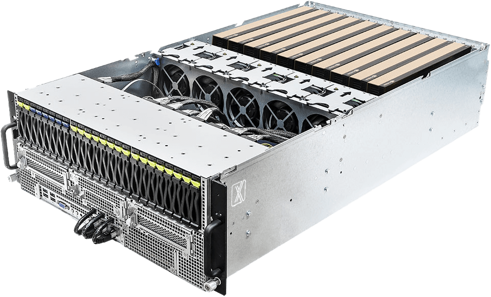
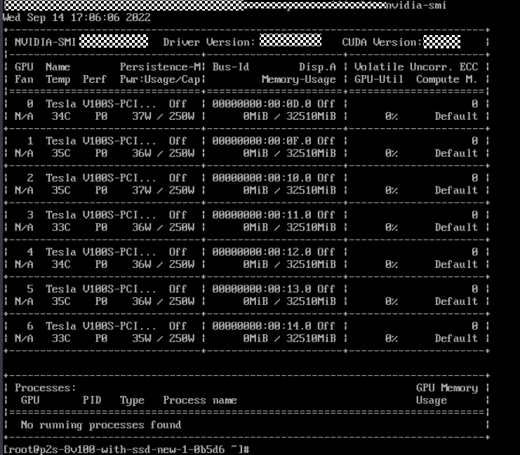
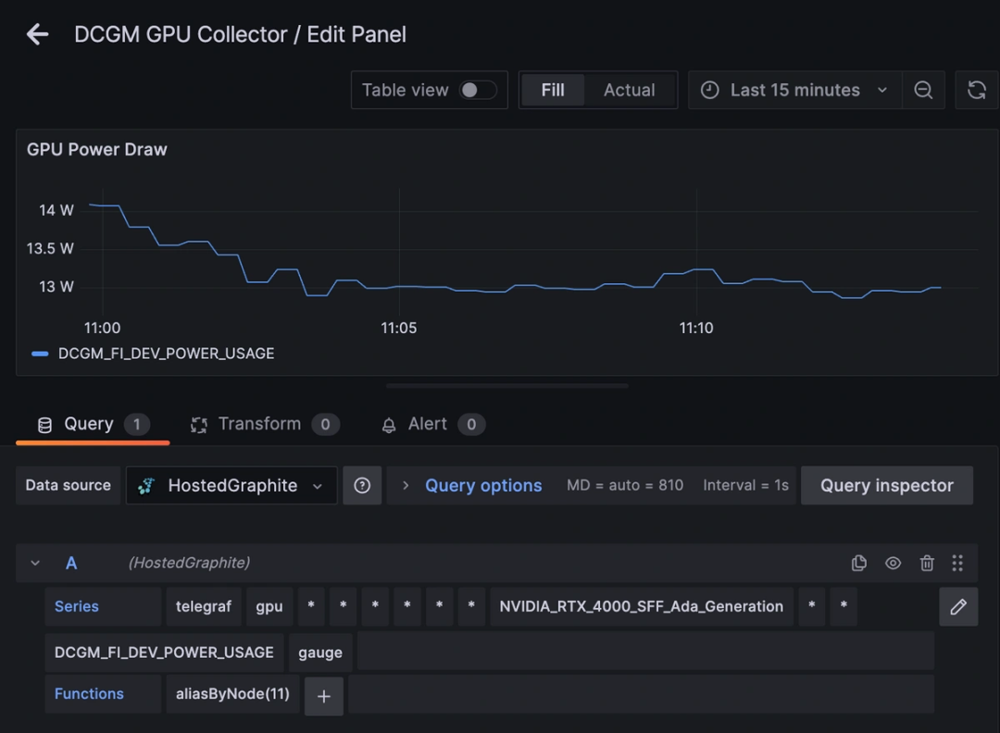

## 最近，机房新上的一批GPU设备掉卡严重，排错头大，问题妖怪的很。特此写一篇关于供电不足掉卡的文章。但是，还是要说但是，最后的问题已经不是供电了，无法述说的难受：（

## 0\. 前言

在AI训练、科学计算和高性能渲染等领域，GPU服务器是核心生产力工具。然而，在高负载运行中，运维人员时常会遇到一类让人头疼的问题——**GPU掉卡** ：跑得好好的训练任务突然中断，`nvidia-smi` 中原本正常的8张卡只剩7张，或者某张卡的PCIe状态变为 `rev ff`。这类故障往往被误诊为驱动问题、PCIe接触不良甚至显卡硬件损坏，但排查到最后，往往是**供电不足** 在作祟。

本文面向GPU现场运维人员，从真实故障现象出发，深入剖析掉卡的背后供电原理，并提供系统化的排查与解决方案。

主要内容：

  * 0\. 前言
  * 1\. 故障现象：供电不足引起的掉卡长什么样？
    * 现场1：特定任务触发掉卡
    * 现场2：长期满载后的间歇性掉卡
    * 现场3：电源接线不完整导致的GPU不可见
    * 现场4：供电不足引发“雪崩效应”
  * 2\. 排查步骤：如何确认掉卡由供电引起
    * 第一步：快速诊断，确认问题范围
    * 第二步：硬件物理检查
    * 第三步：压力测试与监控
  * 3\. 背后原因：为什么供电不足会导致掉卡
    * 3.1. 静态功率 vs 瞬时峰值功耗
    * 3.2. 多卡服务器的供电架构瓶颈
    * 3.3. 主板VRM与相位供电的暗病
  * 4\. 解决方案与预防措施
    * 4.1. 电源选型量化指引
    * 4.2. 运维层面的预防措施
    * 4.3. 临时缓解方案
  * 5\. 写在最后

## 1\. 故障现象：供电不足引起的掉卡长什么样？

供电不足导致的GPU掉卡，在不同配置和负载下表现各异，以下是几个典型的“案发现场”：

### 现场1：特定任务触发掉卡

有用户组了一台4卡RTX 3090服务器，平时推理LLM一切正常。但某天跑特定的训练任务时，其中一张卡频繁挂掉——`nvitop` 显示该卡变为 `N/A`，退出重进后程序段错误，`nvidia-smi` 报错无法查看。温度监测显示长期在50℃左右，散热完全没问题。经过分析，发现是任务负载特征导致GPU核心利用率在0%到100%间剧烈跳动，GPU瞬时功耗随之在极低值和峰值（3090峰值可达950W）之间剧烈波动，给电源造成巨大压力。

> 参考：【linux】记录 n 次 疑似显卡缺电导致的服务器故障 `https://blog.csdn.net/qq_18846849/article/details/142393205`

### 现场2：长期满载后的间歇性掉卡

某数据中心的多节点GPU服务器集群（4 × A100 80GB），在运行深度学习训练任务时个别节点频繁出现CUDA内存错误、NCCL通讯失败及Python进程崩溃。错误表现出明显的不确定性——重启后有时可运行数小时，有时几分钟便崩溃。常规的驱动升级和软件调优一概无效。用示波器测量后发现，异常节点的PCIe插槽12V电源轨在高负载时电压跌落超过8%，波形存在明显的“齿波”干扰。最终定位为**供电相位异常** ——主板VRM控制器设计缺陷导致电压调制延迟。

> 参考：香港服务器GPU供电相位异常引起运算错误的硬件调试实录 `https://www.a5idc.com/article/18275.html`

### 现场3：电源接线不完整导致的GPU不可见

在OpenShift环境中，运维人员发现系统安装了2张NVIDIA Tesla P40，但 `nvidia-smi` 只识别到1张。查看 `dmesg` 日志发现关键报错：
    
    
      
    NVRM: GPU 0000:04:00.0: GPU does not have the necessary power cables connected.  
    NVRM: GPU 0000:04:00.0: RmInitAdapter failed! (0x24:0x1c:1513)  
    

问题原因很简单：有张卡的电源线根本没接上。而 `lspci` 却能正常看到该卡，这说明供电问题导致的掉卡在PCIe总线层面和设备驱动/应用层面存在**典型的认知差** ——操作系统认为设备存在，但GPU因缺电无法完成初始化。

> 参考：Multiple NVIDIA GPUs Not Showing on OpenShift Worker `https://access.redhat.com/solutions/7119403`

### 现场4：供电不足引发“雪崩效应”

华为RH2288 V3服务器在加压测试中出现了一个更有意思的现象：3块硬盘全部亮黄灯，5分钟后硬盘恢复但仍无法配置RAID，BMC持续报“无RAID控制器”。更换RAID卡后故障依旧。最终排查发现，服务器加装了K80 GPU，但Riser卡上本应接两路供电的GPU只接了一路。**GPU抢走了RAID卡所需的部分供电** ，导致RAID卡因温度过高失效——供电不足的连锁反应比想象中更隐蔽。

> 参考：RH2288 V3服务器GPU显卡供电不足导致Raid卡温度过高失效 `https://support.huawei.com/enterprise/zh/knowledge/EKB1000610756?idAbsPath=23710424%7C251364409%7C21782478%7C9901877`

## 2\. 排查步骤：如何确认掉卡由供电引起

当怀疑供电不足时，运维人员可以按以下步骤进行诊断：

### 第一步：快速诊断，确认问题范围

1）**检查GPU可见性** ：
    
    
      
    lspci |grep-i nvidia |grep"rev ff"  
    

若输出不为空，表示存在掉卡——`rev ff` 表示GPU因健康检查失败导致驱动程序无法使用。`lspci` 能识别设备但状态为 `rev ff`，是最典型的供电不足信号。

2）**检查系统日志** ：
    
    
      
    dmesg|grep-i'nvidia\|nvrm\|xid'  
    

常见供电相关日志包括：

  * `GPU does not have the necessary power cables connected` —— 电源线未接
  * `NVRM: Xid 79` —— GPU已从总线上脱落
  * `Unable to change power state from D3cold to D0` —— 设备无法从低功耗模式唤醒

3）**查看功耗状态** ：
    
    
      
    nvidia-smi -q-d POWER  
    

关注Power Draw是否异常偏低、Power Limit是否被异常压低。如果有某张卡功率读数明显低于同型号其他卡，极大概率是供电环节出了问题。

### 第二步：硬件物理检查

1）**检查PCIe插槽与供电线缆** ：确认所有GPU已完全插入PCIe插槽，6-pin/8-pin/12VHPWR电源接头完全就位且有“咔嗒”反馈。在多GPU系统中，尝试将被怀疑的卡换到不同插槽测试。

2）**检查电源接头状况** ：查看供电接口是否有烧灼痕迹或氧化。使用万用表测量12V、3.3V等关键电压，偏差超过±5%需更换电源。

3）**检查电源模块健康状态** ：通过BMC/IPMI查看PSU状态，确认LED指示灯（正常情况下应为绿色常亮）和电源输出功率是否在合理范围内。

### 第三步：压力测试与监控

1）**运行GPU压力测试** ：使用`gpu-burn`工具，观察在高负载下是否有某张卡先行掉线。

2）**监控系统日志** ：在压力测试过程中持续执行 `dmesg | grep -i xid`，观察Xid 79错误何时出现。

3）**记录功耗波动** ：使用 `nvidia-smi dmon` 工具持续记录各卡功耗变化。

## 3\. 背后原因：为什么供电不足会导致掉卡

### 3.1. 静态功率 vs 瞬时峰值功耗

绝大多数运维人员在规划GPU服务器电源时，习惯于这样计算：  
`总功率 = GPU TDP之和 + CPU TDP + 其他组件`

这种计算方式看似安全，但在GPU瞬时功耗面前往往不够用。

以RTX 4090为例，标称TDP为450W，但实际瞬时功耗峰值可达470W以上。RTX 3090在特定负载下的峰值功耗甚至可以达到950W。而单块A100虽然在多卡场景下TDP为250W，电源长期接近满载运行时，瞬时功耗波动仍可能触发GPU保护机制导致掉卡。

> 参考：【linux】记录 n 次 疑似显卡缺电导致的服务器故障 `https://blog.csdn.net/qq_18846849/article/details/142393205`  
> 参考：A100 GPU掉卡原因全解析 `https://wap.idcbest.com/idcnews/11016566.html`

更关键的是，ATX 3.1规范要求电源在100微秒内承受高达额定输出200%的瞬时功耗峰值。如果使用的电源不满足这一动态响应能力，即使在标称功率充足的情况下，GPU在峰值加载时仍可能因电压跌落而掉线。

### 3.2. 多卡服务器的供电架构瓶颈

现代多卡GPU服务器的供电链路通常为：  
`PDU → PSU(48V/12V) → 主板/背板供电 → GPU电源接口`

但有几个容易被忽视的瓶颈：

1）**Riser卡的供电通道能力有限** ：PCIe插槽本身的供电能力（75W）远不足以支撑专业GPU。加装GPU时必须通过Riser卡的独立电源接口为显卡供电。Riser卡上有几路供电、电源线路是否完整接入，直接决定了GPU能否正常工作。华为案例中的K80需要从Riser取两路电，只接了一路就导致供电不足

> 参考：RH2288 V3服务器GPU显卡供电不足导致Raid卡温度过高失效 `https://support.huawei.com/enterprise/zh/knowledge/EKB1000610756?idAbsPath=23710424%7C251364409%7C21782478%7C9901877`。

2）**电源保护策略冲突** ：GPU的瞬时功耗尖峰可能触发PSU的过流保护（OCP），导致保护机制先行切断供电。而GPU的电源管理芯片也可能因检测到电压异常主动关闭自身，两者的保护时序一旦出现不匹配，就会表现为随机掉卡。

3）**12V电源轨的稳定性** ：在多卡系统中，所有GPU共享同一路12V电源轨。某一张卡的瞬时功耗尖峰可能导致整路电压出现短暂跌落，影响其他GPU的正常工作。使用示波器测量PCIe插槽12V电源轨，正常节点电压波动应保持在±1%以内；超出这个范围就说明供电网络稳定性有问题

> 参考：香港服务器GPU供电相位异常引起运算错误的硬件调试实录 `https://www.a5idc.com/article/18275.html`。

4）**电源线缆老化与接触电阻** ：连接GPU的电源线缆在使用数年后，接头处可能因氧化导致接触电阻增大，在同样电流下产生更大的压降。接触不良的12VHPWR接头已有大量烧毁报告，即使在中端卡如RTX 3060 Ti（仅200-250W）上也出现过接头熔化的案例。

### 3.3. 主板VRM与相位供电的暗病

GPU主板供电部分的设计和品质，在多卡服务器中往往是最容易被忽视的一环。香港数据中心的案例极具代表性：同样的服务器配置，部分节点运行A100时频繁出现运算错误，示波器测量发现异常节点电压波形存在“齿波”干扰和“死区”过长现象，而正常节点使用的新型供电控制器则表现稳定。最终更换主板供电相位控制器后问题解决——这一案例说明，即使PSU功率充足，主板VRM的设计缺陷或批次一致性问题，同样会导致供电相位异常、电压调制延迟，最终引发掉卡

> 参考：香港服务器GPU供电相位异常引起运算错误的硬件调试实录`https://www.a5idc.com/article/18275.html`。

## 4\. 解决方案与预防措施

### 4.1. 电源选型量化指引

在进行GPU服务器电源规划时，建议运维团队：

场景| 推荐余量| 备注  
---|---|---  
消费级GPU（RTX 3090/4090等）| 整机功耗 × 1.5 ~ 2.0| 瞬时功耗峰值可达TDP的2倍以上  
数据中心GPU（A100/H100等）| 整机功耗 × 1.2 ~ 1.3| 峰值波动相对可控，但仍需留足余量  
8卡+高负载训练| 采用2+2冗余设计 + 20%以上余量| 单卡300W，8卡系统总功耗超2500W，建议3000W以上  
  
  * **优先选择支持ATX 3.0/3.1规范的产品** 。这类电源明确要求在100微秒内承受200%额定功率的瞬时峰值，动态响应能力远优于传统电源。
  * **从TDP加总计算升级到全场景负载模拟** ：参考Intel定义的电源动态响应标准，或使用实际业务负载进行峰值功耗实测。
  * **关注单路12V输出能力** ：ATX 3.0电源要求单路+12V输出不低于90A（即1080W）。在多卡系统中，12V电源轨的稳定输出能力比总功率更重要。

### 4.2. 运维层面的预防措施

1）**建立供电监控基线** ：在生产环境部署DCGM（NVIDIA Data Center GPU Manager），实时监控各GPU的Power Draw和Perf Cap Reason（性能受限原因），设置功率波动率异常报警。

2）**定期检查电源硬件** ：每季度检查PSU指示灯状态和风扇运转，每年检查PCIe电源接头是否松动或氧化，使用热成像仪排查异常发热点

> 参考：A100 GPU掉卡原因全解析 `https://wap.idcbest.com/idcnews/11016566.html`

3）**多路供电负载均衡** ：在多PSU配置的系统中，确保同一台PSU不为过多GPU供电，避免单路过载引发整体掉电。对于大型AI集群，数据中心整体电力设计可参考OCP ORV3标准——该标准支持单机架高达200kW+的功率密度，并将储能从集中式UPS移动到机架内部，以解决AI服务器快速功率爬升带来的电网响应延迟问题。

4）**建立应急响应流程** ：当发生疑似供电导致的掉卡时，应第一时间通过BMC/IPMI导出完整的系统事件日志（SEL）和NVIDIA Bug Report，而非盲目重启。保留现场日志后再尝试恢复操作。

### 4.3. 临时缓解方案

在无法立即更换电源的紧急情况下，运维人员可采取以下临时措施恢复业务：

  * 使用 `nvidia-smi -pl <功率值>` 动态降低GPU的功耗上限（Power Cap），牺牲部分性能换取稳定性。
  * 通过DCGM工具限制GPU的峰值功率上限，避免触发电源保护。
  * 在调度层面对高功耗任务设置功率配额，避免多个GPU同时进入功耗尖峰状态。

## 5\. 写在最后

GPU服务器供电不足导致的掉卡，是一类“隐性缺电”问题——电源标称功率充足、GPU在低负载时工作正常，却在关键时刻“掉链子”。问题的根源在于：GPU瞬时功耗与传统电源持续输出能力之间的鸿沟，被TDP这种静态指标掩盖了。作为一线运维人员，在遇到不明原因的GPU掉卡时，不妨多想一想：真的是驱动问题吗？真的是卡坏了？还是供电上某个被你忽略的细节出了问题？

将排查视角从“软件配置”和“硬件兼容性”扩展到“供电全链路”——从PSU的输出能力、Riser供电完整性、线缆老化状况到主板VRM设计，供电的每个环节都可能是掉卡的原因。建立这样的系统化排查思维，远比随机重启和反复拔插卡更高效，也更能从根本上解决问题。