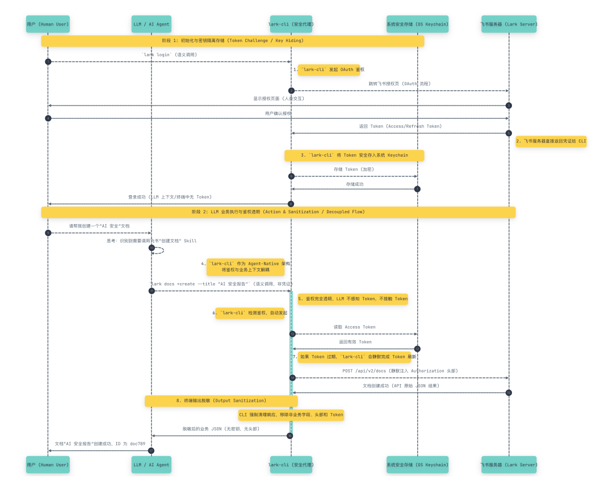

# 飞书 lark-cli  是如何避密钥泄露给 LLM 的

> 原文链接：[飞书 lark-cli  是如何避密钥泄露给 LLM 的](https://mp.weixin.qq.com/s/IL9Qj7R3uYKYzyqAtVtTEQ)

`larksuite/cli`（飞书官方开源的命令行工具）主要通过其&nbsp;**“Agent-Native（原生面向 AI Agent 的设计）”架构**&nbsp;，将“密钥管理”与“LLM（大语言模型）的运行上下文”完全解耦，从而安全、优雅地解决了 LLM 获取和使用密钥的痛点。
简而言之，它的核心解决思路是：**根本不让 LLM 碰密钥，而是让 CLI 作为安全的“沙盒代理”接管一切凭证。**&nbsp;具体通过以下 4 个机制来实现：## 1. 操作系统级安全密钥链存储 (OS-Native Keychain Storage)

传统的 AI Agent 脚本通常需要将&nbsp;`App ID`、`App Secret`&nbsp;或&nbsp;`Token`&nbsp;写在&nbsp;`.env`&nbsp;或明文配置文件中，LLM 在读取工作目录时极易发生密钥泄露。
`larksuite/cli`&nbsp;摒弃了明文配置，采用&nbsp;**OS-native keychain credential storage**。无论是初始化配置还是登录授权，凭据都会被加密并直接存入操作系统底层的安全中心（如 macOS Keychain、Windows Credential Manager 等）。这意味着，LLM 的上下文窗口和工作目录中永远不会出现明文密钥文件。## 2. 鉴权体系对 LLM 完全透明 (Transparent Token Lifecycle)

在日常运行中，LLM 不需要自己去编写代码获取、传递或刷新 Token。
LLM 只需要调用具有明确业务语义的 CLI 指令或内置的 Skills（例如执行&nbsp;`lark-cli docs +create`&nbsp;创建文档，或&nbsp;`lark-cli calendar +agenda`&nbsp;查询日程）。`lark-cli`&nbsp;底层会自动向 OS Keychain 请求凭证、静默完成 OAuth 鉴权、注入 API 请求头（`Authorization: Bearer`），并自动处理 Token 的过期与刷新操作。## 3. Agent 专属的“无阻塞授权模式” (Non-blocking Auth for Agents)

当 CLI 首次使用或权限过期，需要人类用户介入授权时，传统的命令行工具会挂起终端等待浏览器回调，这会导致运行中的 LLM 进程卡死或超时报错。
为此，`larksuite/cli`&nbsp;专门设计了面向 Agent 的非阻塞授权模式：

  `# Agent 模式：立即返回验证URL，不阻塞
lark-cli auth login --domain calendar --no-wait
`

在此模式下，CLI 探测到需要授权时，会立即向终端打印一个授权 URL 并安全退出进程，**不阻塞当前线程**。LLM 读取到终端的 URL 后，可以将其展示给人类用户（“请点击此链接完成授权”）。人类在浏览器完成授权后，LLM 即可恢复运行。整个过程中，大模型充当了“提示调度员”，但始终不接触实际产生的 Auth Token 回调数据。## 4. 终端输出脱敏与注入防护 (Output Sanitization)

为了防止 LLM 在执行原生 API 调用（如&nbsp;`lark-cli api ...`）时，错误地在标准输出流中打印出敏感头信息从而被大模型“记忆”下来，CLI 做了专门的 Terminal Output Sanitization（终端输出脱敏）处理，以及 Input Injection Protection（输入注入防护）。这确保大模型从命令行标准输出（stdout）拿到的永远是被清理后的结构化业务数据（如 JSON 或表格），切断了密钥泄露的最后一条路径。

