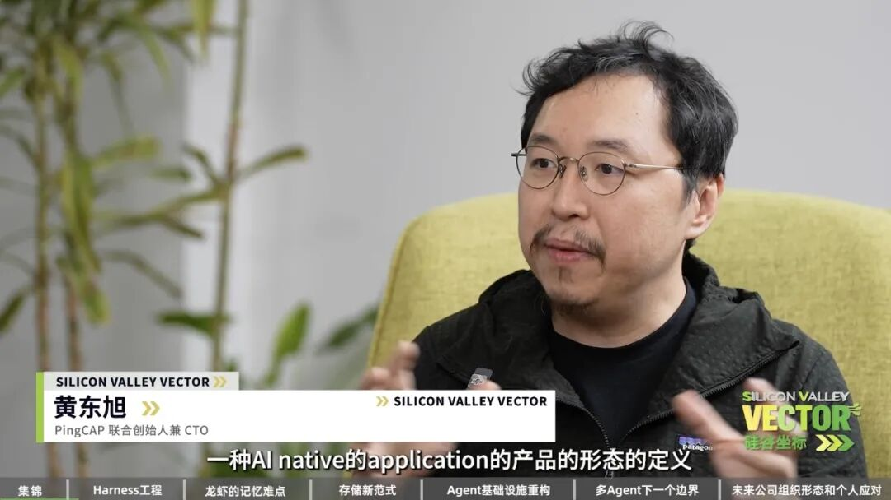
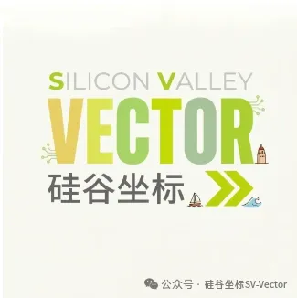
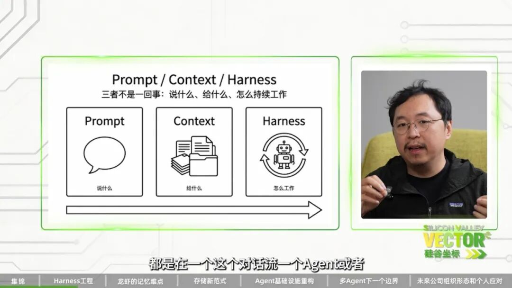
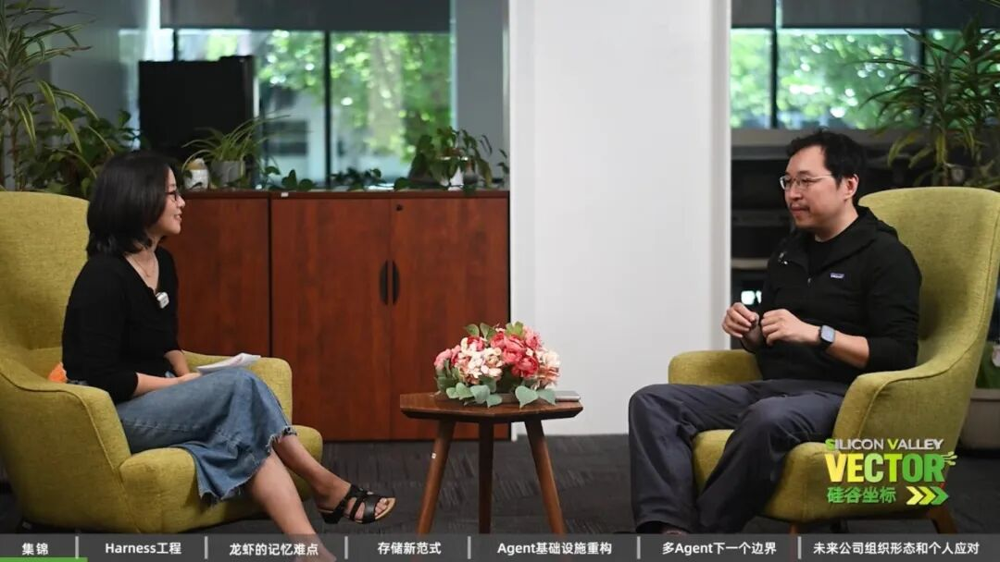
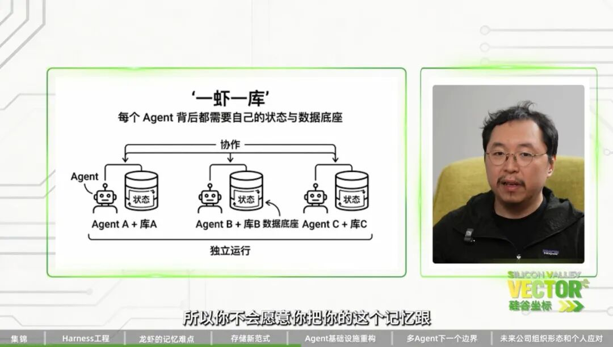
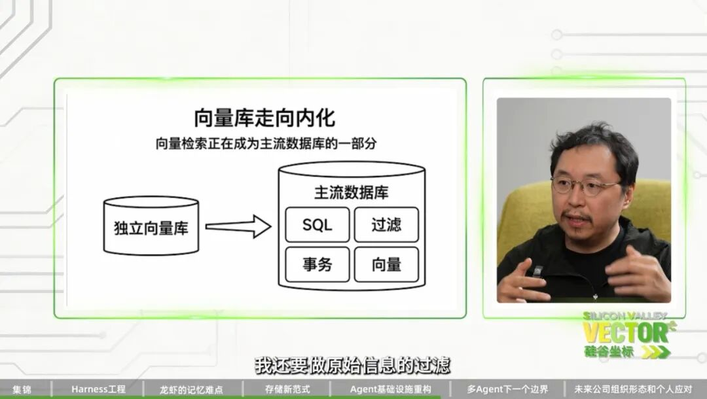
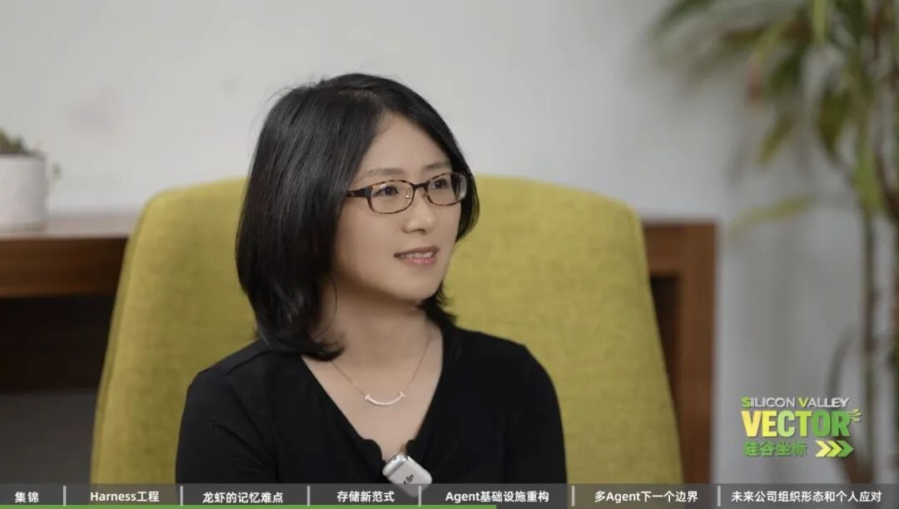
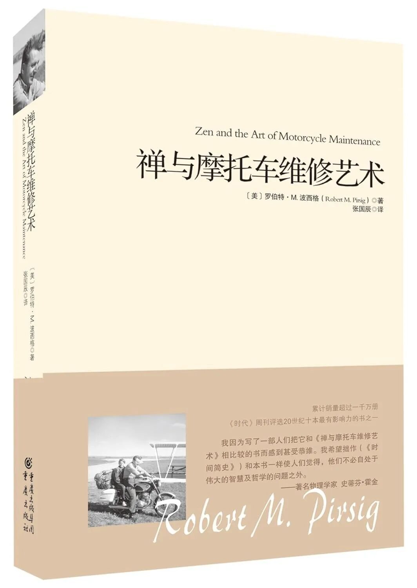

| 今年以来，硅谷科技迭代的速度持续加快。对于身处第一线的开发者而言，想法的实现成本正在呈指数级降低。在这种技术演进下，底层技术生态正在发生怎样的变化？  
2026年4月7日，PingCAP联合创始人兼CTO 、资深数据库专家、连续创业者 黄东旭 （ Ed Huang ） 做客「 硅谷坐标 」，深度分享了他对 AI Agent 时代基础设施重构的系统性思考。  
在他看来，行业正在经历一场从底层基座到顶层组织的全面转型：以Agent为最终使用者的基础设施生态链需要重构；Agent 的 “记忆” 成为了系统级工程的最深水区；集中式的数据存储正面临 “海量小数据” 的解构；经典接口在 Agent 时代依然是重要语言；Agent 带来对组织架构的全新变化；多 Agent 协同下出现新的 Scaling Law 。  
---  

  

【嘉宾简介】

黄东旭（Ed Huang\) ，PingCAP 联合创始人兼 CTO，TiDB、TiKV 核心架构设计者之一。 

    * 长期深耕分布式系统、数据库内核与云原生数据基础设施领域。 

    * 曾任职于微软亚洲研究院、网易有道及豌豆荚，拥有深厚的基础软件与系统架构实践经验。 

    * 深度参与并推动 Codis、TiDB 等开源项目发展，是国内开源数据库领域具有代表性的技术人物之一。

    * 对于 Agentic Coding 和 AI agent infra 有深刻见解和一手经验

  

⬇️ 观看完整采访视频

硅谷坐标 Silicon Valley Vector

【关注我们·获取有深度的专业报道】

  

微信公众号 ｜ 腾讯视频 ｜ B站 ｜ 小宇宙 ｜ 喜马拉雅 

YouTube ｜ Apple Podcasts ｜ Spotify ｜ LinkedIn ｜ X

  

「详细看点」

（以下为部分内容摘要。完整内容请看原版视频）

**

### 01 从“提问技巧”到“系统驾驭”：Harness Engineering 时代来临

AI 时代的工程实践正在经历快速迭代。前两年行业的焦点主要停留在 Prompt Engineering （提示词工程），即通过微调对话上下文来获取更好的单次输出；随后，为了处理较长任务，Context Engineering（上下文工程） 逐渐兴起。黄东旭指出，当前前沿的探索已经进入了 Harness Engineering（驾驭工程） 阶段。

Harness 强调的是Agent 的协同与系统级调度。在面对真实世界复杂的长程任务时，单一的上下文窗口必然会面临信息压缩（Compaction）和遗忘。Harness 工程师的角色，更像是在管理一个由不同 Role（如架构师、开发者、测试、运维）组成的数字化团队。这要求开发者在更高维度上构建信息同步、子任务管理和外挂记忆系统，将传统的软件开发管理经验映射到 Agent 团队的组织上。

### 02 核心深水区：记忆工程的两大难题——怎么记，怎么取

大模型本身是无状态的。决定一个 Agent 是否具备真正的差异化价值和自我迭代能力的核心，在于它的“记忆系统”。黄东旭表示，由于目前的模型是基于Transformer架构，上下文窗口存在一个上限定值。因此最终解决短期上下文窗口 \(Context Window\) 容量限制的唯一途径，仍然是构建强大的外挂记忆（类比人的短期和长期记忆）。

在工程实践中，构建 Agent 的记忆层面临两大核心难题：“怎么记”与“怎么提取”。

**

1. 原始数据与事实抽象的共存：一个完善的记忆系统不能只做简单的文本堆砌。黄东旭团队的实践是：存两份信息。 第一部分是用户与 Agent 交互的全量原始记录，必须忠实保留；第二部分，则是通过后台任务持续运行，将这些原始信息抽象、归纳成一个个具体的“事实（Facts）”，并在数据之间构建起类似知识图谱的连接（例如将“今天吃了苹果”与“喜欢吃苹果”关联起来）。

**

2. 反算法设计，把判断权交还大模型：在决定“哪些记忆应该被唤醒、哪些该被遗忘”时，传统的软件思维倾向于设计复杂的算法（如硬编码的遗忘曲线）。黄东旭采用了一种极度克制的“反算法”哲学：最大程度利用大模型本身的判断力。黄东旭认为，agent记忆的提取与遗忘应该将大模型本身的判断能力作为核心的“评估函数”。在具体的工程实践中，真正实现用提示词替代复杂代码。比如，他将所有相关的检索数据附加上一个简单的元数据标签——“这条事实距离当前时间有多少天”，然后将这些带有时间维度的数据全盘交给大模型，在 Prompt 中增加一句指令：“请根据你的判断，评估哪条信息在当前语境下最重要。” 因为他看来，随着传统编程逻辑逐渐失效，开发者的核心壁垒也将彻底从“设计精巧的算法代码”转向“如何更高效地调度与释放模型潜能”。

  

### 03 Agent时代的存储重写：海量小数据与“一虾一库”

随着 Agent 的普及，数据的产生和存储逻辑正在发生显著逆转。这也是目前基础设施层面面临的挑战之一。

1\. 从集中式“大数据”到“海量小数据” ：Web 2.0 时代的数据是高度中心化的（如电商、外卖平台动辄数百 PB 的体量）。而在 Agent 时代，数据呈现出高度碎片化的特征——它是由每个用户与专属智能体交互产生的“海量小数据”。

到底什么样的数据需要被存下来？ 黄东旭的答案是：所有结构化和非结构化的人机交互“脚印（Footprint）”，包括热、温、冷数据，都应当被保留。 虽然单体交互量不大，但这些数据包含了极高浓度的个人偏好与行为逻辑。在 AI 具备将其结构化并加以利用的能力后，其产生的精准服务价值是空前的。黄东旭非常认同 Google 的数据哲学：只要数据产生的预期价值能够覆盖存储成本，就永远不删数据。

2\. “一虾一库”：Agent 专属数据库的虚拟化设计： 现有的云基础设施（如 AWS、阿里云）是为“人类开发者”设计的。但在 Agent 时代，千万人拥有千万个智能体，出于隐私安全和加密隔离的硬性要求，“一虾一库”（每个 Agent 拥有独立数据库视图）成为必然。

但如果让数千万个 Agent 都去使用每月几美金的传统数据库，成本将直接击穿商业模型。这就要求底层架构进行彻底重构：基础设施提供商必须在云端的大型共享存储之上，对外提供一层“数据库虚拟化”。在 Agent 看来，它独占了一个可以随意建表、读写的完整数据库，但底层实际上是高密度共享的，以此来实现极低成本的运作。黄东旭认为，Agent 的记忆应该存在于云端，而非本地（Local），因为在他看来云端能够提供一致性的备份、无缝的升级和极低的维护门槛。

### 04 Agent时代基础设施重写与 Agent 的“人体工学”

当 Agent 解决了记忆问题并开始大规模执行任务时，它所依赖的运行环境、通讯协议以及软件交互逻辑，都需要被重新定义。

1\. 面对 Agent 的新型云基建： 现在的基础设施都是围绕“人类开发者”构建的。黄东旭指出，Agent 需要的基础设施完全不同：

  * 沙箱云（Sandbox）： Agent 不需要底层的云控制台，它需要的是一个个小型沙箱（内置浏览器、操作软件等），让它能直接开箱干活。

  * 专属通讯与权限： 人与人通信用 Email，Agent 之间的高频通信用什么？Agent 不需要 UI 界面，需要的是专用的通讯协议；同时，面向 Agent 的支付鉴权、ID 身份系统都亟待重新设计。

2\. 经典接口的长期存续与向量数据库的融合： 大模型是基于人类历史数据训练的，而人类经典的编程语言是它们的“心智模型”。提供这些经典接口，Agent 才能发挥出最强的工程能力。在记忆的检索场景中，向量检索是常用手段之一，但并非全部——Agent 同时还需要全文匹配、原始信息过滤等多种方式处理同一份数据。 由此，黄东旭提出了一个犀利的行业观察：将向量检索拆分成一个独立的数据库品类，对 Agent 并不友好，如果数据散落在不同的独立库中，Agent 交叉处理数据会面临严重的割裂感。因此黄东旭认为，向量数据库必然会收敛成为通用数据平台的一项标准底层能力。

3\. GUI 的局限与 Unix 哲学的回归： 为Agent 开发好用的软件（即 Agent 人体工学），也许要抛弃图形界面。 对于普通人，图形界面（GUI）很好用；但对于 Agent，基于GUI 的操作界面是无法简单融合的。相反，以命令行为基础的 Unix 哲学天然契合 Agent 的心智模型。

### 05 寻找下一个边界：Agent 领域的 Scaling Law

### 如果单体大模型的能力提升存在物理极限，那么 AI 的下一个突破口在哪里？人类之所以能创造复杂的文明，是因为通过无数个体的组织变成了社会，跨越了单一个体的能力边界。黄东旭认为多智能体集群必然存在着某种Scaling Law（规模法则）：

****

### “ 今天我们刚刚开始把多个 Agent 协同在一起去干事情。如果我放进 100 个、1,000 个甚至 10,000 个 Agent，让他们产生复杂的交互与协作，会涌现出什么样的效果？这里面必然存在某种 Scaling Law，甚至可能衍生出 Agent 的社会学。这是目前一个极度让人兴奋的 Open Question。”

****

### 

****

### 06 传统软件工程的终结与新组织形态的崛起

Agent带来的生产力革命正在不可逆转地改变软件生产流程与组织形态。

黄东旭分享到，他目前主导的新产品线基本只有一两名开发者，但过去三个月干了传统软件公司 100 个人一年的事。在其公司内部，90% 的代码已经由 AI 自动生成，人类工程师甚至不再去阅读代码细节，而是专注于工程架构与与防止系统腐化等更上层的事情。

“传统的软件工程已经终结了，软件正在真正实现民主化。”

未来的企业组织形态将不再是庞大臃肿的大厂，而是演变成无数个高度敏捷的“小型部落”：由极强的 Harness 工程师负责系统架构，搭配提供真实世界认知的“领域专家”（无需懂编程），指挥底层永不休眠的 Agent Team 完成所有开发落地。

在这个认知“保质期仅有一个月”的狂飙时代，年轻人该如何建立护城河？黄东旭给出了两点建议：

第一，保持手感（Hands-on）。不要只看科技资讯，要亲自去高频使用，让今天的经验引导下个月的直觉。 第二，寻找不变的底座。借 AI 抹平学习门槛的历史机遇，回归经典的思维模型（如 Unix 哲学），去全身心投入到你真正热爱的事物中。这才是比一份“码农”工作更坚固的避风港。

* * *

彩蛋时刻：访谈最后，黄东旭为年轻人推荐了《禅与摩托车维修艺术》。如果想在这个技术日新月异的时代寻找内心的锚点，这本探讨造物本质与工匠精神的经典之作，或许能给你带来启发。

  

  

特别鸣谢Q Bay Center 为本次采访提供拍摄场地

  

**

* * *

关于硅谷坐标

硅谷坐标（Silicon Valley Vector）：立足美国硅谷，聚焦前沿科技与科技投资趋势。在AI重新定义人类边界的时代，我们深入科技与资本的第一现场，为全球受众提供准确、深度、独立的专业报道。

  

关注我们·获取有深度的专业报道

微信公众号 ｜ 腾讯视频 ｜ B站 ｜ 小宇宙 ｜ 喜马拉雅 

YouTube ｜ Apple Podcasts ｜ Spotify ｜ LinkedIn ｜ X

  

📧 联系我们：team@sv-vector.com

  

  

#### 加入我们

长期招聘主持人、研究员、编辑、摄像和后期视频团队。也欢迎加入我们的志愿者团队，参与一线前沿的讨论和采访。我们的志愿者由科技从业人员、专业投资人和媒体团队组成。

  

文 ｜ 曹卿云、Kelly Li

场地｜ Q Bay Center