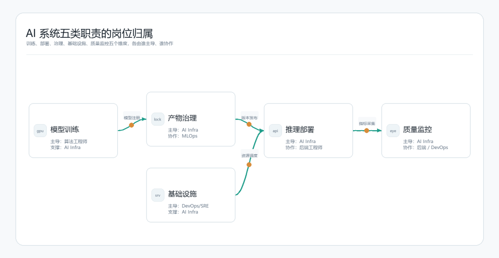
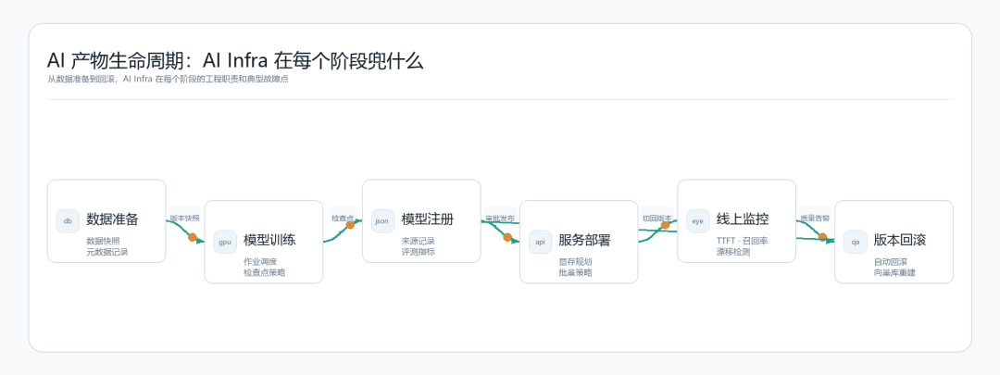
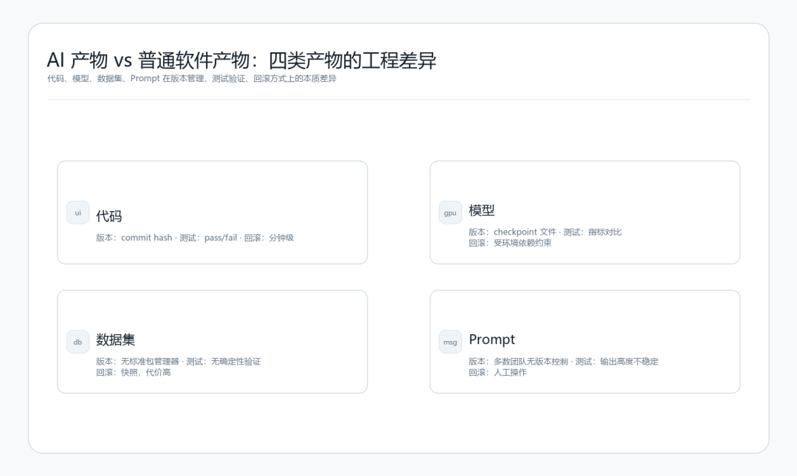
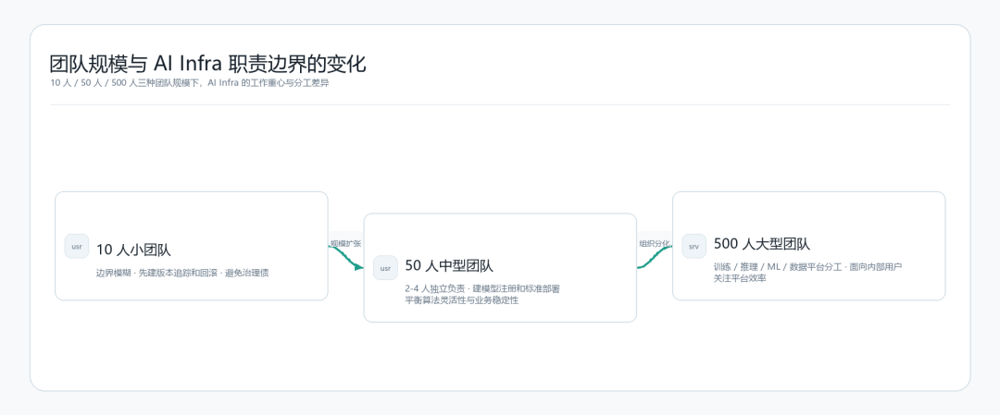

> **系列** ：从零开始的 AI Infra 之路  
> **位置** ：第 01/18 篇 · 卷一「认知与定位」  
> **难度** ：⭐⭐（1-5 星）  
> **前置知识** ：后端服务、数据与模型的基本概念  
> **配套资料** ：关注公众号，回复「AIInfra路线」领取：学习路线与能力自测  
> **前后关系** ：这是系列入口篇；这一篇聚焦「AI Infra 工程师是干什么的」；下一篇「模型、训练、推理与 GPU」。

# 01\. 一张工单背后的问题

先看一个不一定会触发报警的线上问题。

一个内部知识库问答服务上线几个月后，业务同学开始连续报问题：问报销政策，答案引用旧版差旅制度；问合同审批，答案拿供应商准入流程当依据。服务没有 5xx，P99 延迟没变，GPU 利用率也正常。后端日志里每次请求都有检索结果、prompt 和模型输出，链路看起来是通的。

顺着变更记录查下去，问题指向检索侧。上一周为了降低查询延迟，线上 embedding 服务换了一个新镜像；离线索引任务没有同步重建向量库，历史文档仍然是旧 embedding 配置算出来的。向量维度没变，模型服务不报错；QPS、延迟、错误率都正常，监控不报警。坏掉的是召回质量，现有大盘看不到。

复盘时，几个团队说的都不算错。算法团队看 embedding 模型效果，后端团队看 API 稳定性，DevOps 看服务是否存活，数据任务只在被触发时重建索引。真正漏掉的是产物依赖：线上向量库依赖哪个 embedding 模型、哪套切分策略、哪版预处理代码，这些信息没有被系统记录，也没人拿它们做发布门禁。

这类问题不能只靠复盘补救。AI Infra 要做的事，就是把这些产物依赖变成可检查、可回滚、有人负责的工程系统。

* * *

# 02\. AI Infra 的岗位边界

很多 JD 会把 AI Infra 写成训练平台搭建和模型部署。这个颗粒度太粗，容易让人误以为它只是机器学习加运维。到了线上，真正被追问的往往更具体：**AI 产物（artifact）的生命周期管理** 有没有做好。

这里说的 AI 产物，至少包括四类：

  * • **数据集** ：训练用的标注数据、增量数据、数据版本快照。
  * • **模型** ：训练产物、fine-tune checkpoint、量化版本、embedding 模型。
  * • **Prompt** ：系统 prompt、few-shot 示例、chain-of-thought 模板。
  * • **Embedding** ：在线服务用的向量表示，以及生成它们的模型版本。

它们都有自己的生命周期：创建、验证、注册、部署、监控、版本切换、回滚。AI Infra 工程师要把这些阶段做实，不管团队是 10 人还是 500 人，至少要回答四个问题。

落到交付动作上，大概是这四件事：

  * • **可交付** ：产物能从研发环境可靠地转移到生产环境，且结果一致。
  * • **可追溯** ：任何时刻都能查到线上跑的是哪个版本、用什么数据训练、经过哪些测试。
  * • **可运行** ：产物能在目标基础设施上以预期的延迟和成本稳定运行。
  * • **可治理** ：谁能改、改了什么、影响哪些下游、出问题怎么退回去，都有流程和记录。

开头那次检索质量退化，和 QPS、P99、Pod 状态都没直接关系。缺的是一份能被系统检查的依赖关系：向量库依赖哪个 embedding 模型版本，模型切换时是否必须重建索引，谁有权批准这次切换。

* * *

# 03\. 五个岗位，谁负责什么

岗位边界不能只看职位名，要看系统里出了哪类问题、谁手里有能解决问题的工具。

AI 系统五类职责的岗位归属：模型训练、推理部署、产物治理、基础设施、质量监控五个节点，标注各自的主导岗位与协作岗位，节点间流向箭头展示各领域的传递关系

图里把链路拆成五块：模型训练、推理部署、产物治理、基础设施、质量监控。重点放在依赖怎么传下去：模型注册影响版本发布，版本发布影响资源调度，资源调度和线上指标又会反过来约束下一次发布。

**训练：算法定目标，AI Infra 管作业能不能跑完。** 算法工程师决定训练什么、用什么数据、选什么超参。AI Infra 要处理的是 GPU 集群调度、分布式训练环境、checkpoint 存储、失败恢复。两个岗位会天天协作，但看的问题不一样：算法盯 loss 曲线，AI Infra 盯的是这次作业为什么在 Node 3 上跑了 20 分钟后 OOM。

**推理：模型服务层和业务 API 层要分开看。** AI Infra 管推理引擎选型（vLLM、TGI、Triton）、显存规划、批量策略、自动扩缩容。后端管鉴权、限流、prompt 组装、上下文管理、结果后处理。两层之间最好只有稳定 API；小团队人少，一个人同时摸两层也很正常。

**可观测性：普通监控只看到一半。** DevOps 看到 GPU 利用率、Pod 状态、网络带宽；后端看到 QPS、错误率、P99 延迟。AI Infra 还要补上模型服务自己的指标，比如 TTFT（首 token 延迟）、TPOT（每 token 延迟）、KV cache 命中率、批量填充率，以及质量指标（召回率、答案相关性）。后两类指标很多监控系统不会自动生成，只能自己埋点、评测、接入告警。

**MLOps 和 AI Infra 的边界没有行业统一答案。** 粗略地看，MLOps 更偏训练侧持续交付：持续训练流水线、数据版本管理、实验追踪、模型评测自动化。AI Infra 更偏推理侧稳定运行，以及产物生命周期治理。不同公司叫法差别很大，有些 MLOps 平台会覆盖这里说的全部 AI Infra 工作，有些公司会拆成两个团队。

粗略判断可以这样做：**问题一旦牵扯 GPU 资源管理、模型服务架构，或者 AI 产物的版本一致性，大概率要找 AI Infra；如果主要是训练实验追踪、数据标注流程、业务逻辑层 feature engineering，就更接近 MLOps 或算法工程师的领地。**

* * *

#  04\. AI 产物的生命周期：AI Infra 在每个阶段兜什么

生命周期这个词听起来大，落到工程现场其实很具体：一个模型从训练到下线，中间任何一步缺记录，后面都会在回滚、审计或排障时补账。

AI 产物生命周期图：从数据准备到训练、注册、部署、监控、回滚各阶段的工程责任和典型故障点

**数据准备阶段** ：数据清洗规则通常由数据工程师和算法团队决定。AI Infra 更关心训练启动时拿到的数据快照是否确定、可复现，元数据里有没有记录它从哪里来、什么时候生成、经过哪些过滤。DVC、Delta Lake 的版本 tag，或者一套规范的 S3 path 命名，都可以先用起来。三个月后还能查到这次训练用的是哪批数据，这一步才算过关。

**训练阶段** ：这里的典型事故很工程：训练跑了 18 小时，在第 17 小时因为网络抖动失败，checkpoint 策略又没配好，只能从第 0 步重跑。Kubernetes Job、NCCL 通信、混合精度环境、checkpoint 多久存一次、存几份、存哪里，都属于 AI Infra 要提前算清楚的部分。模型性能仍然归算法团队判断，作业可靠性不能只靠运气。

**模型注册阶段** ：很多团队会把模型注册做成文件上传，这基本不够。注册时至少要留下模型来源：哪批数据训练的、超参数配置是什么、在哪个评测集上跑出什么指标、谁审批过、适合部署到哪类硬件。缺这些信息，回滚、A/B 对比、合规审计都会卡住。MLflow、Weights & Biases、Vertex AI Model Registry 都在解决这类问题，但现实里，一个 Google Sheet 充当模型注册表的团队并不少见。

判断注册系统有没有用，可以问一个很土的问题：这个模型出问题时，能不能在一小时内拿到回滚方案？需要的信息如果注册时没收集，上线后再找，基本都会变成翻聊天记录、问人、猜配置。

**部署阶段** ：模型服务的资源规划最容易算错。以一个 7B 参数的模型为例：FP16 精度下，参数本身占用大约 14 GB 显存（每个参数 2 字节）；KV cache 的大小随并发请求数线性增长，在 batch size=32、序列长度=2048 的情况下，KV cache 可能再占去 10-20 GB；加上激活内存和推理框架的开销，一张 A100 80GB 通常只能舒适地运行一个 7B 模型，剩余显存留给 KV cache 和批量增长。部署前不把这笔账算清楚，上线后常见两种结果：要么显存不够，服务频繁 OOM 重启；要么显存分配过于保守，并发能力远低于预期，单卡成本很高。

这个估算本身不复杂，但很多团队会跳过它，把服务启动成功当成上线准备完成。后面的文章会给出一套完整的显存计算方法和批量策略选择框架。这里先记住一句话：资源规划是部署的前置工作，等线上 OOM 以后再补，代价会高很多。

**监控阶段** ：AI 系统至少有两层指标。工程指标是延迟、吞吐、错误率，Prometheus 这类工具能采到不少。质量指标是答案相关性、召回准确率、幻觉率，得靠评测集、采样标注或在线反馈补出来。质量下降通常不报错，也不一定触发告警，用户只会觉得答案变差。

**回滚阶段** ：这是检验前面所有工作是否扎实的时刻。能不能在 5 分钟内回滚到上一个版本？回滚的代价是什么？如果向量库里的 embedding 是用新模型算的，回滚模型以后向量库要不要重建？这些问题要在部署前回答清楚，上线后才想通常已经晚了。

* * *

# 05\. AI 产物和普通软件的根本差异

从后端开发转到 AI Infra 的同学，很容易把模型、数据集、prompt 当成几种特殊的软件组件。这个直觉有一半是对的，另一半会带来工程盲区。

AI 产物 vs 普通软件产物对比：代码、模型、数据集、prompt 在版本管理、依赖追踪、测试验证、回滚方式上的工程差异

**版本管理** ：代码可以压到一个 git commit，行为基本确定。模型版本通常是一个 checkpoint，可能几十 GB；同一个权重文件放到不同 CUDA、PyTorch、量化配置里，输出都可能有差异。模型也没有 API 那样清楚的接口契约，很难用 breaking change 描述一次行为变化。数据集依赖上游数据源，现有包管理工具也很难直接套上来。

**测试验证** ：代码有单元测试和集成测试，输出通常是 pass/fail。模型测试输出的是一组指标，比如 BLEU、ROUGE、人工评分，很少有一个简单的通过标准，更多是在比较某些维度比上一个版本好多少、差多少。Prompt 更麻烦，相同 prompt 在不同模型上行为不同，在同一个模型上也会被输入措辞影响。普通 CI 可以做一部分门禁，但挡不住所有质量退化，评测流水线必须单独建设。

**回滚** ：代码回滚通常是重新部署上一个版本，几分钟能做完。模型回滚会牵扯推理服务滚动更新，复杂一些，但路径还算清楚。embedding 模型就麻烦得多：如果回滚了 embedding 模型，之前用新模型生成的向量就失效，需要重新索引整个数据集。对几亿条记录的生产系统，这可能要几个小时。Prompt 回滚也常被低估，很多团队没有 prompt 版本控制，出问题后只能让工程师去聊天记录里找上一个版本。

**依赖追踪** ：代码依赖可以写进 requirements.txt 或 package.json，CI 系统能查出一部分版本冲突。模型依赖该写在哪里，没有统一答案。一个模型可能依赖特定 tokenizer、量化配置、prompt 格式；这些依赖如果没有显式记录，版本切换时就会变成生产风险。

这四类产物在线上不会孤立存在，它们会形成依赖链。一个 RAG 服务里，模型依赖特定的 tokenizer 版本，同时还依赖用特定 embedding 模型构建的向量索引，而 embedding 模型本身依赖特定的预处理配置。任何一个环节更新，都需要其他环节协调处理。AI Infra 和普通服务运维的差别就在这里：难点不一定来自单点技术，而来自依赖关系的拓扑变化。普通运维工具很难直接描述这类关系。

软件工程的工具链当然能借鉴，但 AI 产物需要额外的依赖记录、评测门禁和回滚流程。照搬普通服务运维，通常会漏掉最容易静默出问题的部分。

* * *

# 06\. 你已有的经验能用在哪里

有同学会问：做 AI Infra，要不要先把机器学习系统学一遍？

有帮助，但入门不靠它。AI Infra 和后端、SRE、数据工程的重叠度，远高于和算法研究的重叠度。

**如果你做过后端开发** ，服务化思维可以直接带过来：延迟和吞吐的权衡、熔断和限流、API 版本策略。这些在模型服务里全部有对应的工程问题，而且因为 GPU 资源的不可分割性和推理的随机性，边界情况比普通 HTTP 服务更多。主要的知识缺口在两块：GPU 资源模型（显存的分配逻辑和 CPU 内存完全不同）、以及推理引擎的工作原理（vLLM 的 continuous batching 为什么能显著提升吞吐）。这些加上前面讲的 AI 产物特殊性，差不多就够起步了。

**如果你做过 SRE 或 DevOps** ，SLO 设计、错误预算、on-call 流程、事故复盘这套方法论在 AI 系统里几乎原样适用，但目前大多数团队做得很粗糙，这本身是一个可以填的空白。需要额外搞清楚的是 AI 系统特有的故障模式：质量下降通常不触发任何告警，KV cache 饱和导致的请求排队看起来像后端过载，GPU OOM 的级联效应比 CPU OOM 更难恢复。SLO 的定义也要调整：LLM 服务的主要延迟指标是 TTFT 和 TPOT，两者的分布和普通 HTTP 延迟差别很大，直接套用 P99 阈值通常不够用。

**如果你做过数据工程** ，训练 pipeline 和 ETL pipeline 的相似度很高：数据经过一系列转换步骤产生一个产物，差异主要在产物类型和验证方式上。数据版本化和 lineage 追踪的经验在这里直接有用。陌生的部分集中在调度层：GPU 集群上的 Kubernetes/Slurm 调度和纯 CPU 集群有明显差异，分布式训练的通信模式（NCCL、梯度同步）和 Spark 的分布式计算思路也不同。另一个需要重新建立认知的是模型评测流水线：ETL 的输出可以用 schema 和行数验证，模型的输出验证需要完全不同的方法。

会机器学习当然有价值。它能让你和算法工程师沟通得更顺，也能判断某个工程改动会不会碰到模型质量。但 AI Infra 的入门门槛不在数学推导，而在系统工程能力，以及对 AI 产物特殊性的理解。

* * *

# 07\. 团队规模决定你的实际边界

AI Infra 工程师的具体工作，在不同规模的团队里差别很大。

团队规模与 AI Infra 边界变化：10 人 / 50 人 / 500 人团队中 AI Infra 职责范围的收缩与扩展

**10 人左右的小团队** ：边界基本是糊在一起的。同一个工程师可能上午改 RAG 召回，下午调部署脚本，晚上还要看模型输出。这个阶段先别急着造平台，先把没人兜的产物管理责任找出来，再建立最低限度的版本追踪和回滚能力。一套规范命名，加上 git tag 和清楚的发布记录，已经能少踩很多坑。这个规模常见的坑，是所有精力都放在模型效果上，可治理性完全空着，等团队变大再补，成本会高很多。

**50 人左右的中型团队** ：边界开始清楚，AI Infra 往往会变成 2-4 人的小组，专门管训练平台和推理平台。这时内部工具就躲不开了：实验追踪、模型注册、推理服务标准化部署，都得有人做。冲突也会变多，算法团队要灵活环境，业务团队要稳定低延迟，平台侧必须决定哪些能力标准化，哪些能力允许例外。

**500 人以上的大型团队** ：方向会拆开，训练基础设施、推理平台、ML 平台、数据平台可能各有团队。AI Infra 工程师更像平台工程师，主要服务内部用户，也就是算法团队、产品团队和业务工程团队。这个阶段衡量产出时，直接业务指标往往退到后面，平台稳定性、接入效率、内部用户体验会变得更重要。

小团队能让你在短时间内跑完整个链路，大团队能让你在某个方向上做到生产级深度。不管是在校阶段提前接触这个方向，还是有工程背景想切入 AI Infra，这个选择逻辑都成立。怎么选，看你现在更缺哪个。

* * *

# 08\. 在生产里，AI Infra 工程师被问责的场景

理解一个岗位，可以看它在事故复盘里会被问什么。

AI Infra 经常遇到的是下面这些工程问题。

**场景一：召回质量静默下降**  
某个 RAG 服务改过一次 embedding 镜像和切分配置后，召回质量持续下降了约两周。没有告警，用户反馈累积到一定量以后，团队才发现线上向量库和新配置并不匹配。

这里要追两个问题：embedding 配置变化为什么没有触发向量库重建？召回质量下降为什么没有被指标捕捉到？

前者是产物治理，后者是质量可观测性。它们都不在传统 HTTP 监控的舒适区里。

**场景二：模型无法快速回滚**  
某次模型更新之后，线上某类问题的答案质量明显变差，需要回滚到上一个版本。

实际操作拖了 4 个小时。旧模型的权重文件没有规范存储，落在某个工程师的个人 NAS 上；旧版本推理服务配置没有版本化；回滚之后还要人工通知 A/B 实验系统切流。

真正暴露出来的是流程问题：模型版本切换没有自动化，回滚还要人工碰多个系统。

**场景三：A/B 实验结论无法复现**  
某次 prompt 优化的 A/B 实验显示新版本明显优于旧版本，产品据此做了决策。三个月后有人想复盘实验数据，才发现实验期间至少跑过三个 prompt 版本，对照组中途也被改过，结论很难再相信。

这时再讨论 prompt 写得好不好已经晚了，先要解释的是版本为什么没有和实验系统绑定，实验期间的变更为什么没有记录。

修模型本身解决不了这三类问题。它们考验的是产物治理：谁能改、改了什么、影响哪些下游、出问题怎么退回去。

* * *

# 09\. 学习清单

读到这里，可以把问题拉回自己的团队看一遍：

  * • 你的团队现在有哪些 AI 产物？每类产物有没有明确的负责人？
  * • 如果线上的 embedding 模型需要回滚，你知道需要做哪些步骤吗？预计需要多久？
  * • 你的团队能回答这个线上模型是用哪批数据训练的吗？能回答上一个版本的模型在哪些指标上比当前版本差吗？
  * • 对照上面的岗位职责图，你感兴趣或正在接触的工作落在哪几个节点上？有没有职责是你意识到没人兜、但应该有人做的？

本系列文章会贯穿同一个实践项目：从本地跑通一个 7B 模型开始，逐步扩展到生产可用的 RAG 服务，再补上可观测性和持续改进机制。后续每篇都会在这个项目上往前推一步。

下一篇我们先把 AI Infra 语境里几个高频词翻译清楚：模型、训练、推理与 GPU。这些词在工程语言里的含义，和算法研究语境里的说法有明显差距，不厘清他们的原理，后续文章里的技术选型和故障分析就很难理解。

* * *

# 10\. 延伸资料

我整理了一份《配套资料包》，这一篇对应「AIInfra路线」资料：学习路线与能力自测、系列阅读顺序。关注公众号后回复「AIInfra路线」领取。

* * *

# 11\. 参考资料

  * • Sculley, D., et al. "Hidden Technical Debt in Machine Learning Systems."  *NeurIPS 2015.* — ML 系统中技术债的经典分析，"ML code 只是一小角"那张图的来源。
  * • Google.  *Rules of Machine Learning* \(Martin Zinkevich\). — 对 silent failure、training-serving skew、线上反馈回路有系统总结，虽然年代较早，但很多故障模式今天仍然成立。
  * • Huyen, Chip.  *Designing Machine Learning Systems.* O'Reilly, 2022. — 对 ML 系统的基础设施、数据闭环、模型服务和团队分工有较完整的工程化描述。
  * • Google.  *MLOps: Continuous Delivery and Automation Pipelines in Machine Learning.* 2021 白皮书. — 训练流水线、自动化成熟度和角色职责的基础框架。
  * • Kleppmann, Martin.  *Designing Data-Intensive Applications.* O'Reilly, 2017. — 数据系统设计的基础参考，版本、依赖、日志、复制和一致性问题对 AI 产物管理仍然有借鉴价值。
  * • vLLM Documentation: OpenAI-Compatible Server 与 Hugging Face Text Generation Inference — 当前常用开源 LLM 推理服务的工程参考，覆盖 OpenAI 兼容接口、服务参数和部署入口。
  * • NVIDIA Triton Inference Server User Guide — 生产推理服务、模型仓库、动态 batching、监控与部署形态的官方参考。
  * • OpenTelemetry Semantic Conventions for Generative AI Systems — GenAI/LLM 系统观测字段、span、event 和 metrics 语义的标准化参考。
  * • MLflow Model Registry、Weights & Biases Registry、Vertex AI Model Registry — 模型注册、版本、metadata、lineage、部署关联的主流实现参考。
  * • Ragas Documentation 与 DeepEval — RAG/LLM 质量评测、指标设计和回归测试的工程参考。