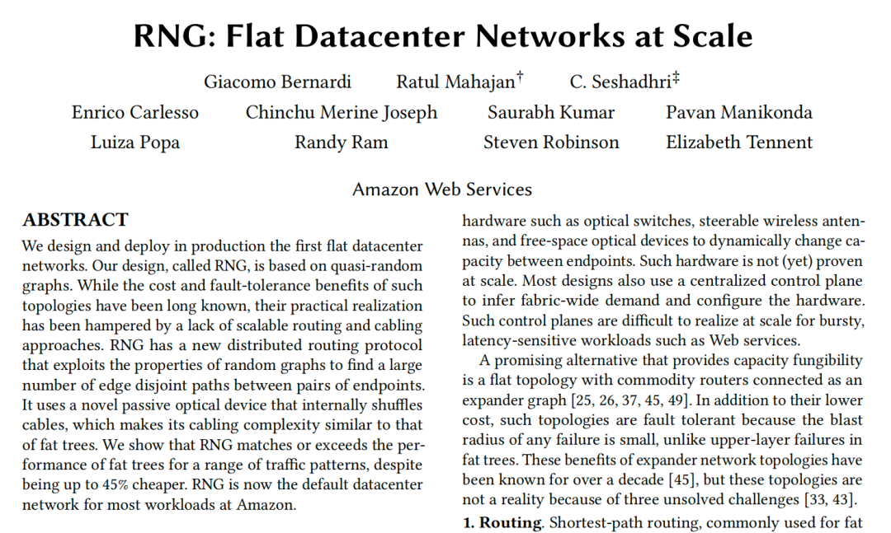
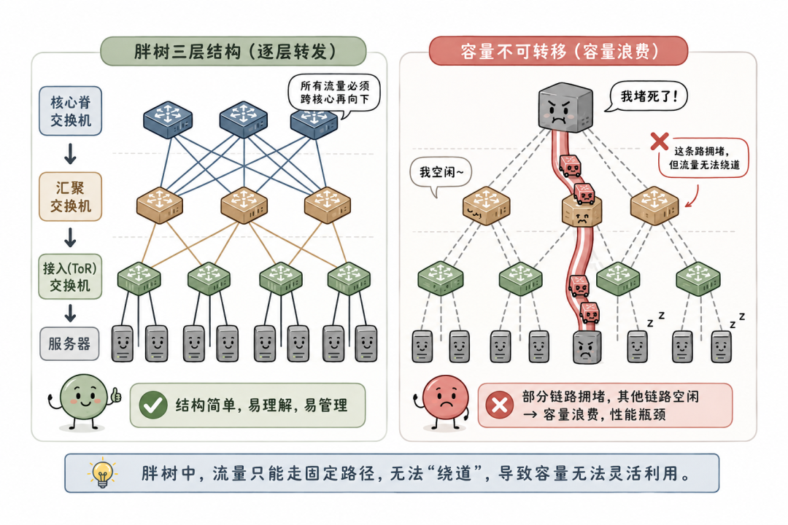
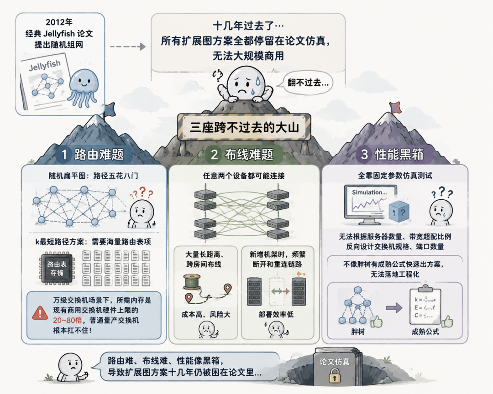

在云计算数据中心领域，胖树（Fat-tree/Clos）拓扑霸占机房组网十几年，从谷歌Jupiter到阿里自研数据中心网络，几乎所有超大规模云厂商都在用分层胖树架构。但这套经典方案天生带着成本与性能的矛盾：要么重金搭建无阻塞全带宽网络、硬件成本爆炸；要么做带宽超配节省成本，一旦流量突增极易局部链路拥堵。

AWS落地的**RNG** ，**是全球首个大规模商用落地的扁平化的、基于准随机图数据中心网络** ，用一套全新组网思路从根源解决胖树痛点，不仅性能持平甚至超越传统胖树，硬件成本直接下降9%~45%。**（文末附论文下载）**

 一、老牌王者胖树

胖树采用三层树形分层结构：服务器接入机架顶层交换机（ToR）→汇聚交换机→核心脊交换机，所有流量必须逐层向上、跨核心再向下转发，是典型的层级化封闭结构。它的优点是结构简单、易于理解和管理，但胖树有一个致命问题：容量不可转移（lack of capacity fungibility）。

什么意思呢？在胖树中，数据从一台服务器到另一台服务器，只能走固定的几条路径。当某些路径拥堵时，其他路径可能完全空闲，但流量无法“绕道”过去。这就导致了容量浪费和性能瓶颈。

为了避免关键业务拥堵，云厂商只能被迫超额采购交换机、光纤预留冗余带宽，硬件成本居高不下；同时上层核心交换机是单点故障源，一台脊交换机宕机，半数机架的网络带宽直接腰斩。

业界很早就发现，**扩展图 \(Expander Graph\)是一种理想的数据中心拓扑结构。** 扩展图的核心特性是：

  * 任意一小部分交换机组成的子网，都有大量链路连接到外部，没有层级束缚，全网带宽可以自由流转，哪里缺带宽就近调用闲置链路；
  * 故障时单台交换机掉线，影响范围极小，天然高容错；
  * 同等性能规格下还能砍掉大量中间层汇聚、核心交换机，大幅省钱。

但从2012年经典Jellyfish论文提出随机组网开始，十几年里所有扩展图方案全都停留在论文仿真，无法大规模商用，卡在三座跨不过去的大山。

1\. **路由难题**

胖树用最短路径路由就能稳定工作，可随机扁平图节点之间路径五花八门。学界提出的k最短路径方案虽然能多路径分流，但需要交换机存储海量路由表项，万级交换机组网场景下，所需内存是现有商用交换机硬件上限的20~80倍，普通量产交换机根本扛不住硬件开销。

2\. **布线难题**

扩展图要求任意两个设备之间都可能连接，这在实际数据中心中意味着大量长距离、跨房间的光纤布线，成本高、风险大。而且，当新增机架时，需要频繁断开和重连现有链路，严重影响部署效率。

3\. **性能黑箱**

过往随机拓扑全靠固定参数仿真测试，运营商想根据服务器数量、允许的带宽超配比例反向设计交换机规格、端口数量无从下手，不像胖树有成熟计算公式快速出组网方案，没法落地工程化。

二、 RNG的三大核心创新

论文提出的 RNG（Randomized Near-optimal Graph）设计，正是为了解决上述三个问题。它的核心思想是：**用准随机图+新路由算法+新型布线设备来实现扁平化、可扩展、高性能的数据中心网络** 。

Spraypoint喷洒路由

Spraypoint是RNG专属分布式路由算法，彻底抛弃了耗内存的k最短路径，仅依靠2组VRF虚拟路由转发表就能在通用商用交换机上实现，完美适配现有硬件。它的转发逻辑拆成两步：**源端喷洒 + 目的端分层路标引流** 。

  * **第一步：源端喷洒（Spray）**

一台服务器发包后，接入交换机不选固定最短路径，而是把数据包随机从所有上联端口往外分发（ECMP哈希随机选路），实现源头流量全发散，这就是喷洒。这个操作直接让源端天然拥有几十条备选出口链路。

  * **第二步：目的端分层路标（Waypoint）收敛**

只靠喷洒容易出现大量数据包绕路扎堆、汇聚到单条链路拥堵，Spraypoint会给每个目标服务器提前划分多层路标节点：紧邻目标的一级路标、远距离多级路标、外圈游离节点。数据包经过中间交换机时，按照预设规则朝着对应层级路标转发，逐层收拢流向目标。

这套规则的巧妙之处是构建了一个简单的Topology Hidding，它没有为每对端点存储路径, 也没有为每对端点维护k条独立路径表。每个节点只需要知道“我在这个目的地的层级”, 然后按规则查 ECMP 表，内存爆炸问题就这么解决了。

**硬件开销优势** ：全分布式链路状态协议，不需要中心化控制器，路由表存储量和胖树处于同一量级，仅需少量ECMP分组内存，128端口商用交换机标配内存即可轻松承载。同时不同路径带来的微小时延差仅数微秒，在数据中心传输场景里，数据包排队延迟就能抹平差异，不会干扰TCP、MPTCP多路径传输协议。

ShuffleBox无源光器件

随机组网最大的落地拦路虎是乱布线，AWS自研ShuffleBox无源光纤配线器件（纯无源光学结构，无芯片、不用供电、成本对标普通光纤配线盘），从物理布线架构上改造随机连接逻辑。

**硬件基础参数**

单个ShuffleBox配置：32个接交换机的R口、4个跨机柜间的C口，每个端口分出多路光纤子通道；搭配配套无源转接件ShuffleBack，可在盒子内部短接光纤。

**机房布线架构设计**

  * 每个机房统一部署一整组ShuffleBox配线面板，所有机架ToR交换机只需要就近跳线连接本机房面板R口，机房内部布线整齐可控；
  * 不同机房之间仅需要少量主干光纤，对接双方面板的C口，跨机房随机逻辑连接全部在ShuffleBox内部通过光纤洗牌实现，物理上没有漫天乱飞的跨机房随机跳线；
  * 新增机房扩容时，仅需微调少量机房间主干光纤，原有已接好的交换机线缆完全不用剪断改造，解决随机拓扑扩容拆线痛点。

全套性能数学模型

以前随机拓扑性能全靠仿真碰运气，AWS为RNG建立一整套可落地的工程计算公式，输入交换机数量、单台上联端口数P、路由参数h/p，就能精准算出三大关键指标：

  * **端到端独立路径数量** ：预判源目之间能开出多少条不撞线的链路；
  * **路径长度分布** ：绝大多数数据包转发跳数集中在3~4跳，平均跳数甚至低于四层胖树；
  * **全网带宽超配比例** ：也就是网络极限承载能力，运营商反过来根据业务要求的超配值，反推需要采购多少台交换机、每个交换机预留多少上联端口。

依托这套模型，AWS运维工程师像设计胖树一样标准化搭建RNG组网，不用海量仿真试错，真正实现工程落地可控。

三、生产环境实测

论文作者在 Amazon 的生产环境中部署了两个 RNG 网络：面向通用云服务器的服务器网格、对接异地数据中心的边缘网格，其中服务器网格和同规格胖树采用一模一样的服务器硬件、带宽规格，开展全维度对标压测。

三大主流流量模型实测

数据中心流量归纳为三类典型负载，也是衡量组网优劣的核心标尺：

  * **集群全互联（Clique）** ：一组服务器内部海量互访，常见于分布式存储、大数据副本同步；
  * **中心枢纽（Hub）** ：少量核心服务器被全机房所有机器访问，典型数据库、网关业务；
  * **一对一匹配（Matching）** ：服务器两两结对单向传输，用来测试网络最坏拥堵极限。

测试结论：

  * 低活跃流量（<10%服务器收发）：胖树小幅领先5%~10%；
  * 中高负载（>20%服务器并发）：RNG吞吐量领先胖树最高30%；

多租户云业务里全机房统一突发流量是常态，RNG适用绝大多数云上业务场景。小包转发（64字节报文PPS）、分布式存储随机读IOPS两项关键指标，RNG实测性能和胖树完全持平。

成本优势

在保持完全相同带宽超配比例的前提下，RNG通过砍掉大量汇聚、脊层交换机实现硬件降本：

  * 1:1无阻塞组网（零带宽超配）：成本节省约9%；
  * 3:1主流商用超配组网：成本节省可达45%；

成本降幅由带宽超配比例决定，和机房规模、交换机端口数量无关。节省成本主要来自交换机、配套光模块采购，无源ShuffleBox硬件成本极低，和常规光纤配线盘相差无几。

随机组网原生短板优化

纯随机跨机房布线会出现超长光纤链路，个别路径传播时延偏高，AWS通过两个低成本优化补齐短板：

  * **偏置路标选路** ：选择目的端路标时，优先挑选同机房、近距离节点，从路由层面缩短路径；
  * **受限跨房布线** ：减少一半跨机房主干光纤，提升机房内链路占比；

两项优化叠加后，RNG中位数传输时延和胖树基本持平。

机房分批部署优化，解决新机房初期带宽不足

新机房刚上架少量机柜时，交换机光纤端口很难随机匹配到有效对端，早期链路利用率偏低。AWS推出分阶段上架方案，单个机房拆成多批次逐步接入ShuffleBox面板，前30%机柜组网稳定后再接入剩余设备，保证机房在部署25%机柜时，交换机有效上联链路利用率就能稳定在80%以上。

四、运维与落地总结现存运维小挑战

胖树的分层逻辑已经深度嵌入AWS传统运维系统、故障排查工具，RNG扁平无层级的架构需要重构部分网管软件；同时交换机升级不能批量关停相邻多台设备（胖树单机隔离升级即可），需要优化运维变更流程。但这些都是软件层面改造，不影响硬件组网架构落地。

RNG行业价值

  * **打破扩展图十几年无法商用的魔咒** ：首次把理论性能优异的随机扩展图做成量产可用的数据中心组网，成为继胖树之后第二条成熟商用组网路线；
  * **重构云数据中心成本模型** ：同等性能下显著降低硬件投入，对海量多租户公有云性价比提升至关重要；
  * **预留AI集群拓展空间** ：目前RNG主打通用多租户云业务，AWS后续计划基于这套扁平架构，针对大模型AI训练集群定制优化拓扑，弥补传统Rail优化胖树成本高昂的痛点。

五、写在最后

胖树凭借架构简单、运维成熟统治数据中心十余年，但天生的层级带宽瓶颈，在云计算流量越来越碎片化、突发化的当下短板持续放大。RNG用新路由+无源光硬件+量化建模三位一体的方案，打通随机扁平组网全链路落地障碍，在成本、容错、带宽利用率三大维度实现全方位升级。

公众号后台私信260603RNG即可下载论文！