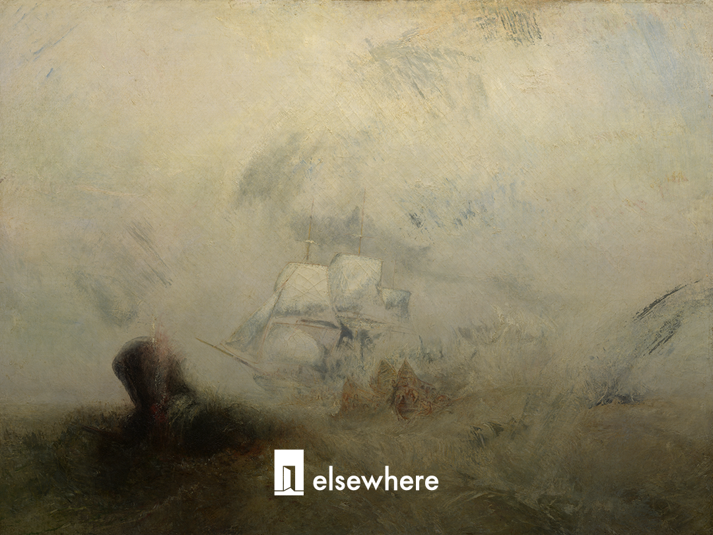

@刘旌  

关于 DeepSeek 的融资信息，已经漫天遍野。

已知信息，「elsewhere」不再赘述。以下，是我们了解到的一些未被展示过的故事或情节。

# 传说中的四小时会议

先说那场投资人会议，也就是那个口耳相传的“四小时会议”。

5月中旬，DeepSeek 组织了这场线上会议，用的就是腾讯会议系统。当时，投资方其实已经定了个七七八八，每家机构有两个参会名额。

其间梁文锋先讲，而后由投资人提问，梁答疑解惑。

传说中有一位 CVC 的投资人，光提问就问了十分钟：先是一长段关于自己的介绍，然后是三个长长的问题。现场气氛一度有些尴尬——这种场景不难想象。有些人窃窃私语，互相询问此人是谁。

但梁不以为意，依然认真回答了每一个问题。尽管在答完第二个问题后，他一度忘了第三个问题是什么，让对方又重复了一遍。

在此之前，这些即便投进去的人，其实多数也没有线下见过梁文锋本人，所以这算是他们第一次和梁的交流。以至于在会议结束之后，很多人大有一种余音绕梁之感。

梁文锋的金句和精神，开始在市场上流传。

# 克制与AGI

梁文锋并不是一个极其擅长表达的人，他的语速也不快，但那场会议上的几句语录，常被人提起（大意，原话可能略有出入）——

“我们没有知名度也没有号召力，我们是一群非常平凡的人。”

“我喜欢的叙事是，一群平凡的人做出了不平凡的事。对 DeepSeek 来说，我们的核心是要保证团队的稳定性——这比钱和资源都更重要。这是最大的风险，也是最大的挑战。”

“假设 AGI 会占 GDP 的20%，想要其中 5% 的人会输给想要 1% 的人，想要 1% 的人会输给想要 0.1% 的人。”

“我们要做的是和提高智能有关的事情，其他的事情都不会去做。”

“ AGI 是个足够大的事情，其他都只是过程。”

四个小时里，贯穿始终地，梁文锋反复强调的其实都是同一些问题：比如只追求 AGI ；比如 less is more ；比如克制等等。

# 50亿到15亿

正式融资大概是从今年4月启动的。据说有一个所谓的“基金白名单”存在：上面都是一些有出资能力、品牌较好的机构。

最初，DeepSeek 要求额度不小于50亿、不能 syndicate 份额、且纯种人民币结构。

基于这个背景，一位最初被传必定参与、但最终没有的投资大佬，江湖盛传就是因为其曾向中东LP兜售过份额。

但在中国，单笔能出资30亿的市场化基金，实在没几个。所以有些VC一再沟通的就是：能否拆成多个基金主体参与。

所以从结果来看，基金的最小出资额下调到了15亿，基金筹资的方式也更灵活。

还曾有个说法是，参与的机构最好没有投资过其他大模型。这个大概率是不可能的，原因很简单——没投过大模型、但又得是一线基金，这很矛盾。

在投资人会议上，梁文锋也有表达过，DeepSeek 愿意帮助其他公司——甚至包括大模型公司。当然前提依然是，对方不来挖他的人。

# Monolith

Monolith砺思资本很早就出现在了投资人名单里。但变化在于，最初版本是15亿，最终是30亿。

数字的变化，有说法是和国智投的额度变化有关，释放了部分份额——从后者9.8亿人民币的数字也不难看出，似乎是为了小于10亿这个整数。

不过不管怎样，敢于 bet ，的确是曹曦的鲜明风格。在 Kimi 上，他已经证明过一次。

Monolith 应该是本轮投入的机构里最年轻的VC。

# 正心谷

正心谷可能是最终名单里最令人意外的存在。

很多人的解读是，在中国大模型浪潮里，正心谷没有投过任何一家，所以更渴望上车。但据我们所知，其实他们投资过 Kimi ，大概是在60亿美金—100亿美金之间。但相比其基金规模，所投金额占比相对有限。

一种市场解读是，正心谷创始人是二级出身，和幻方似乎更有连接。但其实，在二级市场，做量化和做主观投资，其实是截然的两个圈子、甚至两个价值观。

据我们了解，这笔投资之所以发生，除了林利军和他的合伙人叶春燕之外，也和一位新来的投资人努力有关。

正心谷也是和 DeepSeek 最早开始沟通的VC之一。

# DeepSeek 会是红杉高瓴最大 miss 吗？

到了这个交易最令人意外的部分。

最初的传闻里，高瓴会参与，且会投50亿。张磊也多次对朋友表达过，自2025年后，他和梁文锋时有交流，来北京时会去梁总家坐坐。

但这个说法而后逐渐变成：高瓴不会参与，但张磊个人会投。个中原因，有说和高瓴的募资节奏有关，也有说和监管有关。

但最终，张磊和高瓴都没出现在名单上。

而红杉中国，反倒是几乎从一开始就被认为不会参与。流传最广的版本，是对海外LP的顾虑。这一点我们问过不少接近红杉的人，对方也大概表达了相似意思。当然也有一些其他说法在流传。

总之的结果是，红杉和高瓴，这两家几乎不可能不出现的机构，最终都没出现。一位大律师对我们说，人民币结构的公司，理论上是无法隐藏的。

老牌VC里，只有 IDG 投入。

于是有人反问了我们一个问题：DeepSeek ，有可能成为红杉、高瓴的最大 miss 吗？

这有点难评。不过据我们了解，DeepSeek 未必只融这一轮。

# 100家机构和个人

从投资人名单来看，仅有10家参与。但「elsewhere」简单穿透了一下基金主体，发现事实上的参与方还挺多的。

比如宁德系的体外 CVC ——溥泉资本背后的出资方包括：厦门、鄂尔多斯等地国资、宁德时代相关主体和国家绿色发展基金。

IDG资本与此次交易相关的几支基金，险资属性明显，在30亿中占比非常高。此外还有农夫山泉、七匹狼等相关的主体。

Monolith 目前的LP主要是浙江、上海两地国资、以及汤臣倍健、洋河股份等上市公司。

此外，九安医疗也是参与方之一。其实九安也是众多GP背后的LP。

大概估算了了一下，浅层穿透并简单去重后，大概有近100家机构或个人，参与了本轮 DeepSeek 融资。

# 最大要求：不要挖人

DeepSeek 的投资条款，这里就不赘述了。仅补充一点：无论是对大厂，还是VC基金，梁文锋最重要的要求是：不要挖 DeepSeek 的人，或撺掇他们出来创业。

# “中国最大上市公司”

如果回归到一笔投资，DeepSeek 到底是一个怎样胜率的公司？

一位参与了的投资人曾杞人忧天地说道，这是否可能是一个过于共识的投资？按照投资行业的经验，共识的结局通常了了。

但对 DeepSeek 来说，话很难这么说。或者说，我们无法用简单的投资视角来理解它。无论是它对中国AGI行业的意义，还是对精神层面的意义。

按照一位投资人话来说：“他们是抱着巨大的善意在做这一切。他似乎在告诉我们：世界本来就应该是这个样子。”

所以有人犹豫，也有人相信，“找不到任何不投的理由”——如果真如一些人预期的IPO，DeepSeek有没有可能会是中国A股最大的上市公司？

# 低调与雄心

在关注 DeepSeek 的融资进展时，有个突出感受：对多数人来说，DeepSeek 大概实在是个意料之外的答案，即便是最爱赢的一批投资人们，也没想到有一天它会开放融资。

所以如前所述，多数大家所知的投资大佬，也是最近才和公司联系上。当然客观上，梁文锋长期的确不见投资人。

以至于融资消息传出后，很多机构甚至都没有，试图去争取一下投资机会。但从结果来看，有人是凭借所谓协同，有人是凭借认知，有人是凭借品牌精神，有人只是凭借努力，最终还是拿到了船票。

「elsewhere」曾试图问过一些投资人，多数人都不想多谈这笔投资。交易的敏感性只是一方面，更多似乎是一种因为感到与有荣焉，于是希望维系这种低调的自觉。

有参与的投资人说，整个交易过程中，他珍藏了每一份文件，希望未来有机会可以裱起来。还有一位投资人重复了两遍 DeepSeek V4 预览版发布时的那16个字：“不诱于誉，不恐于诽，率道而行，端然正己。”

封面来源：Joseph Mallord William Turner,  *Whalers* , 1845, Metropolitan Museum of Art

