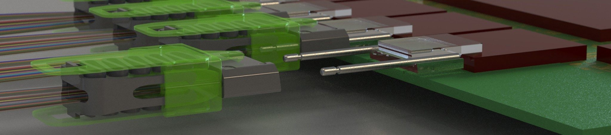
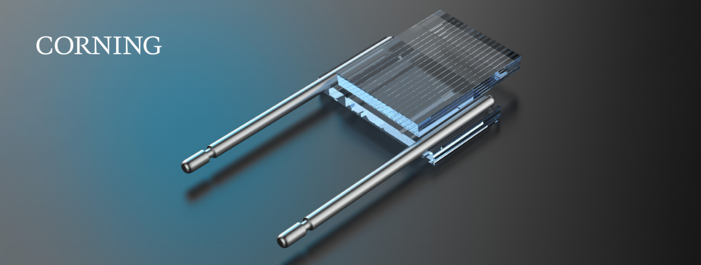
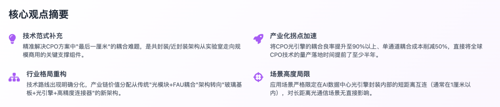
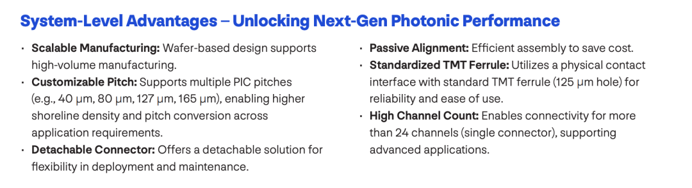
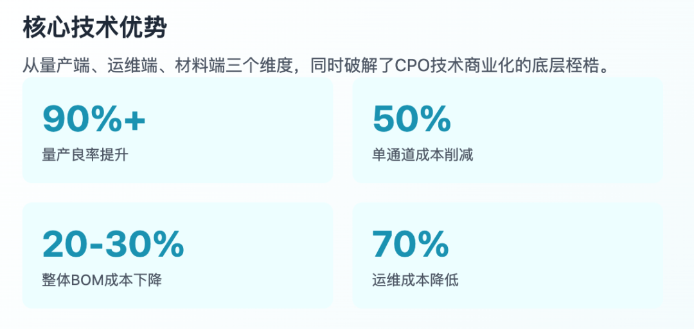
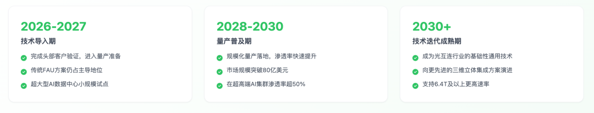
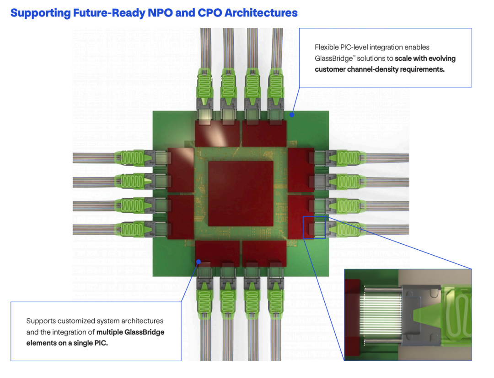

摘要：康宁 GlassBridge 技术本质是CPO 产业的量产催化剂与价值重构器，并非对光模块行业的整体性替代，而是通过解决耦合良率痛点加速 CPO 商用落地，同时重构封装环节的价值分配。

  

* * *

  

2026年6月24日，美国康宁公司在韩国首尔举办的 AI 数据中心光通信互连技术大会上，正式发布了 GlassBridge™玻璃桥光互连解决方案 —— 这是其布局 AI 算力光互连业务的近 10 年成果，也是当前 CPO 架构行业最成熟的量产级耦合方案。该技术是专为共封装光学（CPO）、近封装光学（NPO）架构设计的可拆卸式光纤 - 硅光芯片耦合连接器，依托晶圆级离子交换（IOX）工艺在特种玻璃内部生成埋入式渐变折射率光波导，配合玻璃通孔（TGV）技术实现光路与电路的协同封装，直击传统方案长期无法突破的耦合损耗高、组装校准难度大、运维成本高三大行业痛点。

作为 AI 高速光互连的核心零组件，GlassBridge 技术被行业视为 CPO 技术从实验室研发阶段转向大规模商用落地的关键标志性节点 —— 其核心价值在于，将此前难以自动化的外部高精度对准工序，转化为可批量生产的玻璃内部晶圆级无源工艺，从底层提升 CPO 组件的量产良率、降低综合成本。但需要明确的是，该技术并非行业颠覆性替代方案，而是对现有光通信技术路线的精准补充，其应用场景严格限定在光引擎封装内部的短距离光路转接范畴。

## 一、技术背景与原理解读

要理解康宁 GlassBridge 技术的行业价值，首先需要锚定其技术本质 —— 它并非对光通信架构的革命性颠覆，而是针对 CPO 封装中最棘手的 “光纤 - 光芯片对接” 难题，提供的一套量产级解决方案。在光通信行业，技术方案的迭代永远是对 “传输速率、带宽密度、运维成本、部署难度” 这一矛盾集合的响应，玻璃桥的核心逻辑，恰恰是通过材料与工艺的创新，解决传统方案在高带宽场景下的物理瓶颈。

### 1.1 行业背景：AI 算力爆发对光互连的极致需求

AI 技术迭代与大规模算力集群的商用落地，正驱动光通信行业代际升级 —— 数据中心内部流量的爆发式增长，对光互连技术的传输速率、带宽密度、功耗控制与部署距离提出了全方位苛刻要求：单光模块传输速率需从当前主流的 400G/800G 直接跃升至 1.6T/3.2T，机柜内互连链路密度需提升至现有水平的 4-8 倍，同时要将单通道互连功耗控制在现有水平的 1/3 以内，且在部署成本上具备大规模商用经济性。

  

传统光通信方案难以支撑超高密度、超高速率的 AI 算力互连需求。从技术演进路径来看，光通信行业从可插拔光模块（如 DSFP、OSFP）架构，逐步发展到近封装光学（NPO）、共封装光学（CPO）架构，核心逻辑是让光信号的产生、调制与传输环节，尽可能接近算力芯片的核心交换单元 —— 因为光信号的传输损耗远低于电信号，“光进铜退” 的行业趋势，本质是让光互连的覆盖范围，从机架间延伸至芯片间的短距离场景。

  

而 CPO 技术被行业公认为突破这一瓶颈的关键路径 —— 其核心设计是将光引擎（包括激光器、调制器、光电探测器等光学组件）直接与交换芯片封装在同一基板上，用光互连方案替代传统电气接口，将短距离互连场景的信号传输损耗降低至 1/10 以下，同时突破信号在高频传输时的带宽与距离物理限制。但在向 1.6T 以上更高带宽演进的实际过程中，整个行业遇到了比预想中更难以突破的量产级瓶颈 —— 不是光芯片本身的传输能力不足，而是怎样把光信号高效导入到光芯片中。这一 “最后一厘米” 的耦合难题，是阻挡 CPO 技术从实验室走向大规模商用的最大障碍。

### 1.2 行业痛点：CPO 封装的 “最后一厘米” 难题

在 CPO 架构的实际组装过程中，最棘手的难题是光纤与光芯片的高精度模场匹配 —— 从物理尺寸上看，光芯片（如硅光 PIC）的单模波导尺寸通常仅为 200-300 纳米，而标准单模光纤的纤芯直径约为 9 微米，两者的模场面积差距超过 10 倍。直接对接时，光信号的耦合损耗会飙升至难以接受的程度，甚至完全无法实现信号传输。

  

传统方案解决这一问题的技术路径，是通过光纤阵列（FAU）配合 V 型槽基板的方式，实现多芯光纤的固定对接 —— 其核心工序是通过高精度有源对准设备，或人工调试的方式，将光纤与光芯片的对位误差控制在 ±0.1 微米以内，再用 UV 胶将对接点永久固定粘接。但这套方案在高密度 CPO 场景下，存在三个无法破解的量产级致命缺陷：

  * 耦合损耗高，且稳定性差：传统 FAU 方案的单端耦合损耗普遍在 2-3dB 区间，部分高精度 FAU 方案的实验室最低损耗也超过 1.5dB，加上传输环节的其他损耗，链路总损耗难以控制在工程要求范围内；更关键的是，在实际运维场景中，从 -40℃到 85℃的工作温度区间内，不同材料的热胀系数差异会导致光路对位偏移，信号损耗进一步增大，长期可靠性难以保障。
  * 组装工序复杂，难以自动化量产：传统方案的核心工序是有源对准 —— 需要接入测试光信号，人工或通过精密机械调整光纤位置，直到实时监测的光功率达到最大值，再用 UV 胶固化。整个过程依赖价值超千万的高精度有源校准设备，单通道组装耗时超过 5 分钟；批量生产时，工序良率普遍不足 60%，难以支撑高密度 CPO 组件的大规模量产，直接推高了单通道耦合成本。
  * 运维成本极高，甚至无法现场维修：传统方案采用固定式粘接工艺，整个 CPO 模块被固化为一个整体 —— 在长期运行中，只要其中一路光纤出现对位偏移或光路故障，就需要整体报废整个 CPO 模块，无法单独更换故障链路；加上 CPO 模块安装位置密集、焊接工艺复杂，现场运维难度极高，单路故障的维修成本超过整个链路成本的 30%。

  

这些技术瓶颈的叠加，导致过去两年 CPO 技术仅能在实验室环境下实现小批量生产，无法满足 AI 算力集群的大规模商用需求 —— 行业亟需一种可自动化批量生产、耦合损耗低、可现场运维的标准化耦合方案，而康宁 GlassBridge 技术正是针对这一行业痛点提出的解决方案。

### 1.3 技术详解：康宁 GlassBridge 的 “玻璃桥” 架构

康宁 GlassBridge 技术的核心设计逻辑，是用 “玻璃内部预制光路无源对准” 方案，替代传统的 “外部机械有源对准” 方案 —— 通过晶圆级制造工艺，在特种玻璃内部实现光纤与光芯片的光路 “无缝衔接”，物理上彻底消除模场失配的行业痛点。整个技术方案可以拆解为三个核心环节，形成一套完整的 “光纤↔玻璃波导↔光芯片” 光路转接链路：

  * 核心转接层工艺：离子交换（IOX）技术：这是 GlassBridge 技术最核心的底层工艺，也是康宁能实现量产突破的关键壁垒 —— 其技术逻辑是在超低热膨胀系数（CTE）的特种铝硅酸盐玻璃内部，通过晶圆级离子交换工艺生成埋入式渐变折射率三维光波导。这种工艺的独特之处在于，光波导的模场直径可以从一端的 9 微米（匹配标准光纤纤芯）连续过渡到另一端的 200 纳米（匹配硅光芯片波导），相当于在玻璃内部搭建了一条无缝衔接的 “光路桥梁”，从底层彻底消除模场失配损耗。根据康宁公开的实测数据，采用这套方案后，150mm 晶圆上 16 通道扇出的光纤 - 光纤总损耗仅为 0.62dB，直波导传播损耗低至 0.041dB/cm，弯曲损耗约 0.01dB/cm；单端耦合损耗 TE 偏振约 1.44dB、TM 偏振约 1.75dB，整体控制在 2dB 以内，比传统 FAU 方案降低近 30%。
  * 封装层协同：玻璃通孔（TGV）技术：光信号的传输路径解决后，康宁进一步通过玻璃通孔（TGV）技术，在同一块玻璃基板上实现了光路与电路的一体化集成 —— 其技术逻辑是在玻璃基板上制作垂直导通的微型通孔，通过填充电导材料实现上下层电路的垂直互联，再配合倒装芯片工艺安装光子器件。这一设计的核心价值在于，将原本分离的光信号传输路径与电信号控制路径，集成在同一块玻璃基板上 —— 既解决了高密度 CPO 架构中电信号的高频串扰、散热问题，又通过玻璃基材的优异理化特性，将封装基板的翘曲程度降低 70%，保障了在极端工作温度区间内的光路稳定性。
  * 机械层匹配：精密无源定位结构：为适配高密度 CPO 架构的安装需求，GlassBridge 的玻璃基板表面预先设置了高精度的机械定位结构 —— 组装时，工人仅需将光引擎组件与基板进行简单压合，通过定位结构的物理限位，即可自动完成光纤与玻璃波导的精准对位，无需人工或精密机械进行微米级校准。这一无源对准设计，将传统方案的多道复杂工序直接简化 60% 以上，单通道对准时间从几分钟压缩到十几秒；更关键的是，玻璃基板的热膨胀系数（CTE）可调整到与硅光芯片完全匹配的水平 —— 在 - 40℃到 85℃的极端工作温度区间内，光路不会出现任何对位偏移，从底层彻底解决了长期困扰行业的光路可靠性问题。

  

从技术层面看，GlassBridge 方案的核心本质，是将过去依赖人工或精密机械完成的 “外部高精度对准” 工序，直接转移到玻璃基板内部，通过晶圆级批量制造工艺完成光路的精准预制 —— 把难以控制的外部组装精度需求，转化为可标准化批量生产的晶圆级工艺，这是 CPO 技术从实验室走向量产的关键前提。

### 1.4 技术优势：从实验室良品率到工业级量产的突破

康宁的这套玻璃基光互连方案，并非在技术参数上对传统方案的单点超越，而是从量产端、运维端、材料端三个维度，同时破解了 CPO 技术商业化的底层桎梏，是当前行业内最成熟的量产级 CPO 耦合方案 —— 其核心优势可以归纳为三点：

  * 量产工艺突破：良率与成本的双重量级优化：传统方案的核心成本痛点，是有源校准设备的高采购成本、人工调试的高工序成本，以及批量生产时的低良率。而 GlassBridge 采用晶圆级批量制造工艺 —— 在 8/12 英寸玻璃晶圆上，可以一次性刻制几百组光波导，单片晶圆可产出数百套玻璃桥组件；配合无源对准工艺，直接省去了高价有源校准设备、人工调试工序，单通道耦合成本直接削减 50% 以上。更关键的是，批量生产良率从传统方案不足 60%，直接提升至 90% 以上，甚至部分工艺成熟产品线的良率超过 95%；行业机构测算，随着后续规模化量产落地，整套 CPO 光引擎的 BOM 成本还将进一步下降 20%-30%，这是 CPO 技术具备大规模商用经济性的核心前提。
  * 可维修性革新：从 “整体报废” 到 “模块化更换” 的跨越：传统 CPO 方案采用固定式粘接工艺，整个模块被永久固化为一个整体，任意一路光路出现故障，都需要整体报废整个 CPO 模块。而 GlassBridge 采用可拆卸式模块化设计，将光路连接点从模块内部转移到了玻璃基板表面 —— 在实际运维场景中，单路光路出现故障时，技术人员仅需单独更换对应通道的玻璃桥组件，不需要更换整个光引擎模块，也不需要对整机进行重新校准。这一设计将 CPO 架构的长期运维成本直接降低了约 70%，彻底解决了行业的运维痛点。
  * 材料端适配性：完美匹配高密度 CPO 封装要求：传统封装采用的有机基板（如 ABF 基板）、硅中介层，在高频、高密度场景下存在难以突破的性能天花板 ——ABF 有机基板在高频信号下损耗严重，而且热膨胀系数与硅光芯片匹配度差，温度变化时容易出现光路偏移；硅中介层的成本极高，而且无法同时集成光路和电路。而玻璃基材的天然特性恰好能解决这些问题：其热膨胀系数（CTE）可根据需求调整到 3-9ppm/℃，与硅光芯片的匹配度近乎完美；介电损耗远低于有机基板，适配超高速信号传输；通过 TGV 技术实现高密度电路互联，布线密度支持＜2μm 的精细线路；同时，玻璃基材的长期成本低于硅中介层，规模化量产之后，能将整个 CPO 封装环节的成本降低 20%-35%。

## 二、康宁 GlassBridge 技术对 CPO 行业的整体影响

康宁 GlassBridge 技术的发布，并非简单增加了一种耦合方案的行业可选品类，而是从产业化节奏、技术路线、供应链格局、市场价值分配多个维度，重构了 CPO 行业的发展逻辑 —— 部分原有行业制约因素得到缓解，同时新的技术与行业壁垒开始形成。

### 2.1 加速 CPO 产业化落地节奏

这是该技术对行业最确定的价值 —— 作为当前行业内成熟度最高的量产级 CPO 耦合方案，GlassBridge 的核心价值在于，打通了 CPO 从实验室样品到大规模量产的关键环节，直接将全球 CPO 技术的量产落地时间提前了至少半年，甚至一年。

  

根据行业机构的公开测算，在采用传统 FAU 方案的情况下，受限于耦合工序的低量产良率、高生产成本，全球 CPO 技术的大规模商用窗口，原本预计要到 2028 年左右才会开启；而 GlassBridge 方案的出现，直接将这一量产节奏提前了至少半年，甚至一年。结合康宁自身的量产节奏，2026-2027 年将是 GlassBridge 的客户验证阶段，全球主流 AI 算力硬件仍以传统光纤耦合架构为主；从 2028 年开始，该技术将进入规模化量产阶段，直接推动全球 CPO 设备的大规模商用落地。

从下游客户的订单进展来看，这一产业化节奏的支撑逻辑已得到验证：康宁已与 Meta、亚马逊、英伟达三大北美头部云厂商签订了长期供货框架协议 —— 其中，2026 年 1 月与 Meta 签署的协议最高金额达 60 亿美元，覆盖光纤、光连接组件及 AI 数据中心全套光互连方案，合作周期至 2030 年。此外，康宁已和全球头部晶圆代工厂格芯完成了 300mm 硅光平台的全无源工艺集成验证，这意味着 GlassBridge 技术已经通过了芯片级的量产可行性验证，具备了大规模商用的前置基础。

  

需要强调的是，GlassBridge 技术的价值，并非简单替代传统耦合方案，而是打开了 CPO 行业的整体增量空间 —— 它解决了高密度 CPO 架构的量产瓶颈，降低了超高速光互连的整体成本，使得 1.6T/3.2T CPO 交换机在 AI 算力场景下具备大规模商用经济性。而 CPO 光模块的放量，会直接带动外部标准光纤、高密度光连接器的用量激增，这一逻辑将在中期支撑整个光通信行业的增长空间。

### 2.2 重塑 CPO 技术路线格局

GlassBridge 技术的出现，明确拆分了光通信行业的技术路线，行业将长期保持 “玻璃基 CPO 方案与传统 FAU 方案并行” 的格局 —— 两者并非替代关系，而是根据不同场景需求，形成了明确的高低端分化与互补边界：

  * 玻璃基 CPO 路线：核心适配 3.2T 及以上超高密度 CPO 场景，主要应用在 AI / 超算数据中心的光引擎封装内部，承担从光芯片到光纤的短距离光路转接环节，替代此前高端 FAU、精密短光纤束的功能。在这一技术路线中，玻璃基板将同时承担电路互联（通过 TGV 玻璃通孔）与光路互联（通过内部离子交换波导）的双重功能，成为整个 CPO 架构的核心载体。
  * 传统 FAU 路线：适配 800G/1.6T 通用光模块、数据中心中长距离互联、电信骨干传输场景，仍将沿用成熟的 “FAU + 标准光纤” 耦合方案 —— 这是康宁官方明确的技术边界，也符合光通信行业的 “场景适配型” 技术选择逻辑：在中长距离、中低带宽场景下，FAU 方案经过多年量产验证，具备极高的成熟度和成本优势，没有必要改用玻璃基方案。

这一技术路线拆分的核心支撑逻辑，是两种方案的性能 - 成本适配性差异：玻璃桥方案的核心优势，是在超高密度短距离场景下的高量产良率、低耦合损耗；但在中长距离、低带宽密度场景下，其综合成本显著高于成熟的 FAU 方案。对于行业客户而言，选择哪种方案，核心取决于具体场景下的技术经济性 —— 这意味着，玻璃桥方案不会彻底淘汰 FAU 方案，而是在高端场景形成增量补充。

  

值得注意的是，行业内此前 “光模块作为独立产品品类” 的格局，将在 CPO 时代逐步发生重构：传统光模块是将光纤、激光器、调制器、探测器等所有光学组件，统一封装在一个独立外壳内的 “黑盒子”；而在 CPO 架构中，这些功能组件被重新拆解，光引擎被直接安装在交换芯片的基板上，耦合方案也被整合到封装环节中。这一变化意味着，光模块的部分功能将被消解到 “光引擎 + 光连接器 + 耦合方案” 的分布式供应链中，行业的价值分配逻辑将被重构。

### 2.3 重构供应链与行业价值分配

GlassBridge 技术的量产壁垒，以及它在 CPO 架构中创造的关键技术价值，重新分配了光通信产业链的价值与利润，从根本上改变了光通信组件的供应竞争逻辑。

  

旧格局的价值核心：在传统 FAU 方案的供应链中，光模块、光纤阵列（FAU）是整个价值链的核心环节 —— 光模块厂商负责将所有光学组件集成封装为独立产品，掌握了下游客户资源和行业定价权；FAU 厂商凭借精密加工能力壁垒，占据了整个光互连链路价值的约 30%。

  

新格局的价值转移：玻璃基 CPO 方案的供应链核心，转向了 “玻璃基板 + 光引擎 + 高精度连接器” 的组合，价值分配逻辑被彻底重构 —— 整个 CPO 架构的核心价值，从光模块、FAU 环节，转移到了玻璃基板、TGV 玻璃通孔、光引擎的集成封装环节。其中，玻璃基板是整个 CPO 架构的物理载体，同时承担光路、电路的双重互联功能；光引擎的制造、封装和集成，成为最关键的行业增值环节，其价值占比从传统方案的不足 20%，提升到超过 50%。而传统 FAU、精密短光纤束的行业需求，将随着玻璃桥方案的渗透出现结构性萎缩 —— 这也是 6 月 26 日光通信部分传统品类板块领跌的核心逻辑：市场资金在一瞬间理解到，部分传统光通信组件的行业价值空间，将在 CPO 架构下被显著压缩。

  

新的壁垒与赢家：在新的价值分配格局中，行业壁垒将主要集中在三个核心环节，也是产业链中最确定的受益主线：

  * 玻璃基板及核心耦合组件环节：这是 GlassBridge 方案的核心基础，也是康宁的核心技术壁垒 —— 只有掌握了特种玻璃配方、晶圆级离子交换工艺、TGV 玻璃通孔工艺的头部厂商，才能在这一环节中占据核心份额。这一环节的行业壁垒，不仅体现在技术端，更体现在量产端：从玻璃基材的熔炼，到离子交换工艺的批量生产，再到 TGV 通孔的精密加工，整个流程的工艺控制难度极高。
  * 光引擎与先进封装环节：光引擎是 CPO 架构的核心光电信号转换单元，需要与玻璃基板进行高精度的集成封装 —— 只有具备高速光模块制造能力、先进封装技术储备的头部厂商，才能将玻璃桥的技术优势转化为量产优势。这一环节的核心壁垒，在于光引擎与玻璃基板的协同设计能力，以及大规模封装的良率控制能力。
  * 光引擎外部连接环节：GlassBridge 技术仅替代了光引擎内部的短距离耦合环节，整个光互连链路的中长距离传输部分，仍然需要依靠标准光纤、高密度光连接器 —— 光模块的放量，会直接带动这一环节的用量爆发。

  

相应地，行业竞争逻辑也发生了本质变化 —— 从传统的 “光模块产品级竞争”，转向了 “整套光互连解决方案级竞争”。在这一全新的竞争逻辑中，谁掌握了玻璃基板、光引擎、耦合方案的协同设计能力，谁就能拿到下游头部客户的核心订单；反之，单纯的光模块组装厂商、传统 FAU 制造厂商，若无法及时适配新的技术路线，其市场份额将被持续挤压。

### 2.4 技术路线分叉：玻璃基混合型光互连成为行业主流方向

康宁的方案本质上解决了玻璃基板上的光信号路由和高密度耦合难题，这将强化一个行业趋势：在先进封装领域，玻璃材料正在成为重要的新基础载体。行业原本就在讨论硅中介层与玻璃基板的技术路线优劣，而 GlassBridge 的出现，将加速行业从硅基封装路线向玻璃基封装路线的迁移。

  

这一技术路线分叉的核心逻辑，是玻璃基方案的综合性能优势，恰好匹配了高密度 CPO 架构的 requirements：

  * 电气性能层面：通过 TGV 玻璃通孔工艺，玻璃基板可以实现高密度的电信号互联，其高频信号损耗远低于传统有机基板，能够适配超高速电信号的传输需求；
  * 光学性能层面：通过离子交换工艺在玻璃基板内部预制高精度光波导，替代传统的分立光纤阵列 FAU，实现芯片间的光信号传输 —— 这一设计可以将光信号的传输损耗，降低到传统方案的 1/3 以下；
  * 封装集成层面：玻璃基板的热膨胀系数与硅光芯片高度匹配，理化稳定性更好，适合做超大尺寸的封装载体 —— 在高密度 CPO 架构中，单块基板上需要集成数个光引擎、数十个光接口，以及大量的电气控制线路，玻璃基材的平面精度、封装翘曲度优势，是有机基板、硅中介层无法比拟的。

  

需要强调的是，这一技术路线分叉，并不意味着玻璃基方案会完全替代硅基方案 —— 在很长时间内，行业仍将以 “光电混合” 方案为主，玻璃基板的主要价值，是解决极致高密度的封装级互联需求；在长距离传输场景下，玻璃基方案的成本优势并不明显，标准光纤仍将是该场景下的技术选择。但可以明确的是，GlassBridge 技术的出现，已经将行业的技术路线分叉点清晰地标记出来 —— 玻璃基混合型光互连，已成为行业头部厂商布局的核心赛道。

## 三、分场景详细影响分析

GlassBridge 技术的应用场景高度受限，几乎完全集中在 AI 算力相关的极短距离光互联领域。对长距离光通信场景不仅没有负面影响，反而会产生正向带动作用。

### 3.1 核心受益场景：AI 数据中心内部、共封装短距离互连

这是 GlassBridge 技术的核心落地场景，也是其对行业影响最直接、最确定的区域 —— 它的价值，是解决了 CPO 架构中 “光芯片与光纤对接” 的最后一厘米难题，支撑 AI 算力集群的散热与超高密度互连需求。更具体来说，这一技术的应用场景，严格限定在光引擎封装内部的短距离光路转接环节 —— 从光芯片的出光口，到光引擎的光纤出口，这段距离通常在 1 厘米以内，完全不涉及中长距离传输场景。

  

在这一核心场景下，GlassBridge 技术将从三个维度直接影响数据中心的架构选择与行业发展趋势：

  * 对光互连架构的影响：玻璃桥方案将进一步推动 “光进铜退” 的演进，强化 CPO 架构在超高端 AI 训练集群中的主导地位。传统的 “可插拔光模块 + 铜缆互联” 方案，已经无法支撑 AI 算力集群的互连需求 —— 而 CPO 架构的设计，是将光引擎直接安装在交换芯片上，用短距离光互连替代铜缆，这一设计可以显著降低信号传输的功耗和时延。GlassBridge 的出现，解决了这一架构的量产痛点：它将光信号的导入点，直接延伸到了光引擎的内部，进一步缩短了电信号的传输距离，降低了整个链路的功耗和时延。行业机构的实测数据显示，采用 GlassBridge 方案的 CPO 架构，相比传统可插拔方案，链路功耗可以降低约 30%，传输时延降低约 40%—— 这对于对功耗和时延高度敏感的超大型 AI 数据中心而言，是极具价值的性能提升。
  * 对机房布线的影响：GlassBridge 技术仅替代了光引擎内部的短距离精密光纤束，对数据中心的中长距离布线没有任何直接影响。甚至，由于 CPO 架构的高密度特性，单位算力空间需要的光纤芯数将成倍增加，玻璃桥的量产落地反而会直接带动数据中心内部中长距离光纤、高密度光纤连接器（如 MPO 连接器）的用量爆发。简单来说，玻璃桥技术替换的仅仅是光引擎内部的 1 厘米短光纤；而数据中心内部跨机柜、跨机房的长距离信号输送，仍然完全依赖标准光纤光缆 ——AI 算力集群的扩容，将直接拉动这部分光纤的需求增量。
  * 对技术方案选择的影响：GlassBridge 技术将推动数据中心场景下的 “高低端分化” 趋势 —— 在 3.2T 及以上的超高端 AI 训练集群中，玻璃桥方案将成为必然选择；而在中低带宽、中短距离的场景下，传统 FAU 方案仍将长期保持其成熟度、成本优势。

### 3.2 不受影响场景：电信网络 / 长距离光通信骨干网

这是光通信行业体量最大的应用场景，也是 GlassBridge 技术完全无法覆盖的场景 —— 它对长距离通信设备的技术路线、产品需求都不会产生直接影响。从康宁的官方回应，到行业机构的公开测算，再到产业链头部厂商的战略布局，形成了一致的行业判断：GlassBridge 技术不会替代长途传输光纤，甚至不会减少长途光纤的整体用量。

  

综合来看，GlassBridge 技术与长距离光通信方案，是完全互补、而非替代的技术关系 ——GlassBridge 的价值，是解决了 CPO 架构的量产瓶颈，让超高速率的光信号，能够在算力集群的内部高效传输；而长距离光纤的价值，是将这些算力集群的节点，连接成为一张完整的算力网络。两者都是 AI 算力时代光通信方案中不可或缺的核心环节。

  

* * *

  

免责声明：本报告基于公开可获取的行业信息、技术数据及产业链调研资料撰写，均为行业公开信息或产业链主流预期汇总，不构成任何实际投资建议。

  

  
  
  

  

如您有任何的建议与指正，敬请在文章底部留言，感谢您不吝指教！如有相关合作意向，请后台私信，小编会尽快给您取得联系，谢谢！

  

**  
**

**《存储随笔》自媒体矩阵**  

  

