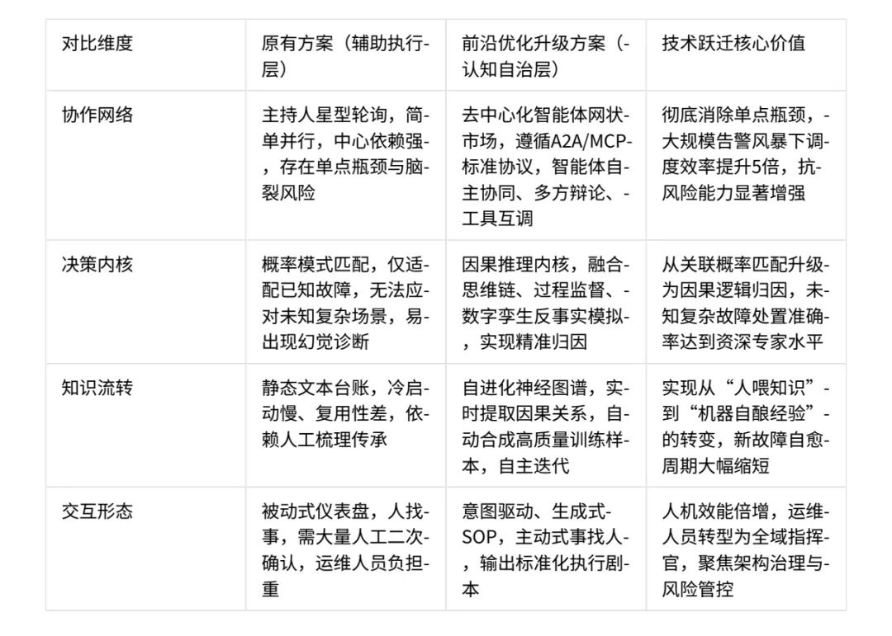

本方案依托企业核心大模型底座，构建纵向能力穿透、横向全域闭环的先进技术架构，以系统层感知智能体、流程层决策智能体构成双智能体矩阵，实现运维体系从辅助执行向全域智慧中枢的代际跃迁。为紧跟业界智能体工程化（Agentic Engineering）、推理即服务（Reasoning-as-a-Service）技术发展趋势，方案引入两大前沿核心理念完成架构升级，打造兼具技术先进性、场景落地性、运行稳定性的新一代智能运维体系。  
  
一、核心前沿技术理念  
  
（一）OpenClaw多智能体自治框架  
  
深度借鉴行业主流智能体协作协议与框架设计精髓，融合A2A协议、MCP协议、Claw框架的核心设计哲学，搭建去中心化、高协同、可扩展的智能体市场（Agent Marketplace）。通过标准化工具接口、专属智能体名片，实现全域智能体自主发现、能力协商、协同作业，打破智能体间的协作壁垒，构建无中心依赖、动态自适应的群体协作体系。  
  
（二）Hermes推理大模型理念  
  
整合长思维链推理、冷启动快速推理、过程奖励模型（PRM）三大核心能力，聚焦SRE业务场景打造深度“慢思考”（System 2）推理引擎。赋予运维大脑假设验证、反事实推理、结构化全链路溯源的高阶认知能力，突破传统大模型概率匹配的局限，实现故障诊断、决策推演的精准化、可解释化、可信化。  
  
方案通过对企业核心大模型直觉感知（右脑）、逻辑推理（左脑） 的双向协同增强，将传统矩阵调度能力全面升级，打造具备自治运行、自愈修复、自进化迭代的L4级全自治运维神经系统，实现运维能力的范式级突破。  
  
  
  
二、优化背景：从“矩阵协作”到“认知推理”的范式转移  
  
当前现有体系已实现“主持人智能体+多领域专业智能体”的规范化调度，完成运维工具的标准化封装与流程化落地，但面对云原生架构下海量微服务交织联动、多因一果的极端复杂故障、突发性黑天鹅事件时，仍存在三大核心瓶颈，制约运维体系向更高阶自治能力演进。  
  
（一）协作瓶颈  
  
现有主持人轮询调度采用星型拓扑架构，面对大规模告警风暴时，主持人极易成为全域协作的单点瓶颈，调度效率大幅下降；同时智能体仅能通过主持人中转交互，无法实现点对点加密直连、能力互助、工具共享，跨域协同效率受限。  
  
（二）认知瓶颈  
  
现有方案依托嵌入式RAG检索、基础提示工程实现故障处置，仅能完成浅层数据匹配，无法跨越日志、指标、调用链等多类型数据孤岛开展深度逻辑推演与因果归因。面对复杂未知故障，易出现诊断偏差、幻觉判断，根因定位精准度不足。  
  
（三）进化瓶颈  
  
故障处置经验仅沉淀为静态文本台账，无法将碎片化处置逻辑、因果关系转化为动态可执行、可复用的推理图谱，知识传承依赖人工梳理，经验泛化能力弱，无法实现运维能力的自主迭代升级。  
  
针对以上核心痛点，方案以两大前沿理念为核心，完成全域架构优化与能力升级：  
  
1\. OpenClaw全维协作范式：引入智能体发现协议、能力注册中心，打破固定流程束缚，让每个智能体成为具备自主寻呼、自主协同能力的专业单元。面对突发故障，相关智能体可自主组建临时应急编队，快速响应、协同处置。  
2\. Hermes深度推理引擎：搭载思维链过程监督模型、结构化推理思维树（ToT），摒弃直接输出结果的概率性判断，完整呈现“推理-批判-验证”全因果链路。通过拒绝采样、自我一致性校验，保障故障根因定位无偏、决策可信、可追溯。  
  
  
  
三、架构优化：构建“网状协作+慢思考”的立体运维新范式  
  
本次优化将原有架构升级为\*\*“四横三纵”增强型架构\*\*，以OpenClaw框架搭建横向自主协作总线，破除协作壁垒；以Hermes引擎强化纵向认知深度，提升决策能力，形成全域协同、深度认知、自主进化的新一代运维技术蓝图。  
  
（一）感知与数据基础设施层（Context Fabric）  
  
本层为全域体系提供高质量、多模态、标准化的数据底座，覆盖运维全场景数据类型，通过前沿技术优化实现数据的高效采集、精准对齐、无损结构化，为上层智能体协作、推理决策筑牢基础。  
  
核心覆盖：全栈多模态运维数据，包含工单、日志等非结构化文本，运维指标、调用链等结构化数据，CMDB拓扑等图数据。  
  
前沿能力增强：1. 多模态数据对齐：将时序指标异常波形转化为标准化视觉Token，与文本日志映射至同一向量空间完成对齐，让Hermes推理模型可模拟资深运维专家“看图诊断”，提升复杂异常识别能力。  
  
2\. 无损结构化日志处理（ETL 2.0）：在数据采集边缘端部署轻量化语义解析模组，实时将无序日志流转化为高规范JSON-LD语义链接数据，大幅降低推理引擎上下文噪声，提升推理效率与精准度。  
  
（二）OpenClaw智能体生命体层（Agentic Mesh）  
  
本层废除传统单一主持人调度模式，搭建去中心化智能体协作总线，基于发布-订阅-请求（Pub-Sub-Req）三态协议，实现智能体全域自主协作、群体决策、工具复用，彻底消除单点瓶颈。  
  
智能体标准化管理：各智能体上线后自动生成智能体宣言，完成角色定位、技能集、工具清单、性能基准、忙闲状态的统一注册，实现全域智能体可管、可控、可协同。  
群体共识决策机制：面对跨域复杂故障，多智能体可自主发起多智能体辩论，通过证据交互、观点博弈明确故障方向，由Hermes推理引擎担任逻辑裁判，完成客观裁决，避免单一智能体判断偏差。  
工具动态组合调度：基于MCP标准协议，将Ansible脚本、API接口等运维工具封装为标准化可组合组件，智能体可根据故障场景动态拼接全新工具流，实现工具能力的按需复用、灵活编排。  
  
（三）Hermes认知推理与结构化引擎（Cognitive Core）  
  
本层为运维体系的核心决策中枢，打造双速推理架构，兼顾常规故障高效处置、复杂故障深度推理，同时实现决策过程标准化、可追溯、可审计，契合央企运维合规管理要求。  
  
双速推理协同架构：1. 快思考（System 1·直觉路由）：针对高频已知故障，采用轻量化蒸馏模型、精准知识库匹配，实现毫秒级响应、自动化故障恢复，保障常规场景运维效率。  
2\. 慢思考（System 2·深度推理）：针对未知异常、复杂故障，启动Hermes主推理引擎，通过隐式因果推理、反事实模拟推演，预判处置效果、定位根因逻辑，生成带置信度评分的故障树分析报告，实现复杂问题精准处置。  
过程化标准化输出：强制输出符合SRE白皮书规范的JSON-Logic结构化决策内容，同步呈现故障结论与全量思维链追溯数据，可直接作为合规审计凭证，支持区块链存证，实现决策全流程可追溯、可核查。  
  
（四）自进化应用与交互层（Self-Play & UX）  
  
本层聚焦运维体系自主迭代、人机交互升级，实现经验闭环转化、人机效能倍增，推动运维人员从一线操作员向全域指挥官转型。  
  
合成数据自主迭代：将Hermes引擎生成的高质量思维链作为微调样本，通过RLHF、DPO直接偏好优化，持续迭代企业核心大模型，让模型在复杂决策博弈中自主学习高阶处置策略，实现运维能力持续进化。  
  
意图驱动式交互：摒弃传统死板仪表盘操作模式，支持自然语言意图交互，运维人员可通过指令直接触发全流程方案生成、作业编排、风险管控，系统自动输出可直接执行的标准化剧本与可视化因果分析图，实现“事找人”的主动式运维。  
  
  
  
四、前沿应用场景实战演绎  
  
本方案深度贴合企业核心运维业务场景，实现前沿技术与实际业务的深度融合，以下为三大核心场景落地实战演绎：  
  
场景一：复杂故障“群体辩论式”并行根因定位  
  
原有痛点  
  
传统串行处置效率低下，单一主持人调度易遗漏故障盲点，复杂故障根因定位周期长、偏差率高。  
  
升级实战效果  
  
1\. 告警异常触发：统一告警平台汇聚告警风暴，自动触发Hermes引擎完成异常向量嵌入，启动全域响应；  
2\. 全域拓扑推演：Hermes引擎通过长思维链推理，绘制故障传播拓扑图，初步锁定存储I/O雪崩、Kafka反压两大关联异常；  
3\. 智能编队组建：OpenClaw框架自主调度存储诊断、消息队列诊断、交易引擎三大智能体，无需人工干预组建应急处置编队；  
4\. 博弈收敛根因：多智能体开展证据辩论、交叉验证，通过思维树剪枝技术快速排除干扰项，3分钟内收敛精准根因，明确内存溢出为核心诱因，存储缓慢为次生结果；  
5\. 标准化输出归档：一键生成决策故事线、结构化MTTR报告，实现处置过程全留存、可追溯。  
  
场景二：基于反事实推理的变更智能防御机制  
  
原有痛点  
  
传统变更管控仅依赖规则关键字匹配，无法识别新型隐性风险，易出现规则外违规变更，引发生产故障。  
  
升级实战效果  
  
1\. 深层语义解析：对变更单开展全维度语义解构，精准识别变更意图与潜在影响，突破关键字匹配局限；  
2\. 反事实模拟推演：依托运维数字孪生世界模型，以100倍速后台模拟变更执行效果，精准预判变更引发的连锁风险；  
3\. 风险量化评估：Hermes引擎输出量化风险评估报告，明确延迟恶化指标、风险等级，为变更管控提供决策依据；  
4\. 智能防御处置：风险超限后，OpenClaw框架自动调度业务架构智能体，生成分级发布、自动回滚、熔断防护的标准化处置方案，推送至变更评审环节，既不阻断合理变更，又筑牢风险防线。  
  
场景三：面向未知风险的自进化知识沉淀体系  
  
原有痛点  
  
传统经验沉淀仅做简单关键词提取，隐性风险信号无法识别，经验无法转化为可复用能力，同类故障易重复发生。  
  
升级实战效果  
  
故障闭环后，Hermes引擎自动开展后见之明重采样，复盘故障全周期，挖掘早期隐性异常信号，梳理未被识别的风险逻辑；将核心洞察转化为标准化提示指令包，自动注入对应探针智能体，实现免人工干预的自主学习、能力升级。依托过程监督机制，保障进化逻辑精准、合规、有效，实现运维经验从人工沉淀向自主酿造的转变。  
  
  
  
五、优化前后深度对比分析  
  

  
  
六、总结与展望  
  
基于OpenClaw多智能体自治框架、Hermes深度推理引擎的全域优化方案，并非单一工具的迭代更新，而是运维理念、技术架构、作业模式的全方位重构。以过程监督破解大模型关键任务可信性难题，以去中心化协议实现大规模智能体协同能力涌现，兼顾技术先进性、业务落地性、合规安全性。  
  
本方案将全面助力运维体系数智化转型升级，实现从“看得见、管得住”的自动化流水线，向“看得透、想得远、能自愈、可进化”的类人脑智慧神经网络跨越，稳步达成L4级全自治运维目标，稳步迈向L5级无人值守运维终极愿景，为企业数智化转型、生产系统稳定安全运行，提供坚实、可靠、确定性的技术保障。