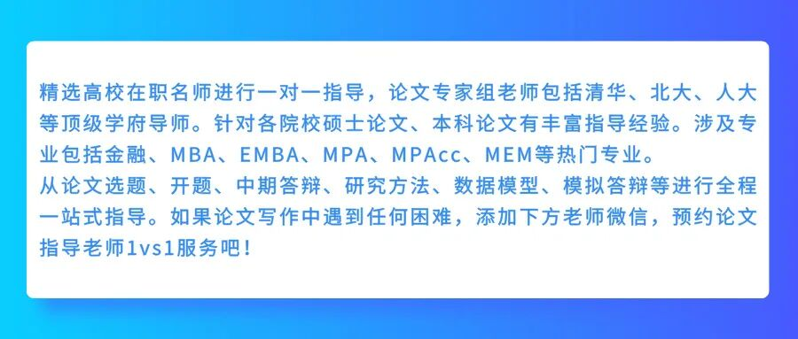
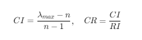
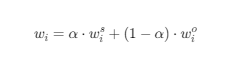
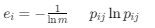
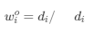

## 一、"联合分析法"在这里指什么？

在MEM论文语境里，"AHP联合分析法"**不是** 市场营销里的联合分析\(conjoint analysis\)，而是指**AHP作为主观赋权法，与客观赋权法或其他方法进行"组合/联合"，共同确定指标权重** ，目的是克服AHP纯主观的局限，让权重更有说服力。

最常见的三种联合方式：

联合方式| 含义| MEM论文适用场景  
---|---|---  
**AHP + 熵值法**|  主观权重 + 数据驱动的客观权重 → 组合权重| 有实际调查/历史数据的评价体系  
**AHP + 变异系数法\(CV\)**|  同上，CV计算更简单| 数据波动能反映重要性的场景  
**AHP + ANP**|  在有层级关系的基础上补上指标间的网络关联| 指标间有相互影响的复杂系统  
  
**如果你的论文只需要建评价体系、算指标权重，不需要后续对多个方案排序，很多时候** 只用AHP也完全够用且合理\*\*，不必硬上加一个客观法——关键是你要在论文里把"为什么用AHP"讲清楚。

* * *

## 二、AHP确定权重的完整SOP（核心五步）

以评价目标为"某工程项目管理效果评价"为例：

### Step 1：构建递阶层次结构

先搭框架（画成树状图放进论文里）：
    
    
    目标层(O)：工程项目管理效果综合评价  
        │  
        ├── 准则层（一级指标）  
        │    B1 成本管理    B2 进度控制    B3 质量管理    B4 安全管理  
        │  
        ├── 指标层（二级指标，隶属于各准则）  
             C11 成本偏差率  C12 资金使用效率（隶属B1）  
             C21 工期偏差率  C22 资源配置水平（隶属B2）  
             ……

  

**构建依据的写法要点** ：通过文献综述 + 行业标准/规范 + 专家访谈（2~3位）初筛，说明"为什么选这几个指标、为什么这样分层"。

每层指标数建议 **≤7个** ，多了就加子层，否则两两比较矩阵太大，专家和读者都受不了。

* * *

### Step 2：构造判断矩阵（专家两两比较打分）

用 **Saaty 1–9标度法** ：

标度| 含义  
---|---  
1| 两指标同等重要  
3| 前者比后者**稍微** 重要  
5| **明显** 重要  
7| **强烈** 重要  
9| **极端** 重要  
2,4,6,8| 相邻标度中间值  
倒数| 反过来比（如1/3 = 后者比前者稍微重要）  
  
**操作方式** ：设计一份AHP专家打分问卷（问卷星即可），发给5~8位相关领域专家/项目管理人员，让他们对**同一层的指标两两比较** 。如果专家意见差异大，做**德尔菲法2~3轮** 收敛。

例子——准则层B1~B4对目标O的判断矩阵：

  
| B1成本| B2进度| B3质量| B4安全  
---|---|---|---|---  
B1| 1| 3| 2| 1/2  
B2| 1/3| 1| 1/2| 1/4  
B3| 1/2| 2| 1| 1/3  
B4| 2| 4| 3| 1  
  
对角线的1是自比=同等重要；左下角自动为右上角的倒数。

* * *

### Step 3：计算权重向量

两种方法选其一即可：

**方法一：和积法（手算友好）**

  1. 矩阵每列归一化：每列各元素 ÷ 该列总和

  2. 按行求平均 → 得到权重向量 **W**

  3. 各权重加和 = 1 ✅

**方法二：直接用工具（推荐）**

  * **SPSSAU** ：选「进阶方法→AHP层次分析」，粘贴判断矩阵，一键出权重+CR值

  * **Excel模板** ：网上有成熟的AHP自动计算表

  * **Yaahp软件** ：专门做AHP可视化建模的免费工具

  * **Python/MATLAB** ：`numpy.linalg.eig()`求最大特征值对应特征向量

论文写法示例：

"权重计算采用SPSSAU 22.0软件，通过求解判断矩阵最大特征值对应的归一化特征向量获得。"

* * *

### Step 4：一致性检验（⚠️ 绝不能省！）

因为是人打的1–9分，逻辑可能自相矛盾（A>B, B>C, 却C>A），所以必须检验：

    
    
      
    

查RI表：

n| 1| 2| 3| 4| 5| 6| 7| 8| 9  
---|---|---|---|---|---|---|---|---|---  
RI| 0| 0| 0.58| 0.90| 1.12| 1.24| 1.32| 1.41| 1.45  
  
**判据：CR < 0.10 → 通过，权重可用；CR ≥ 0.10 → 回头改判断矩阵重打。**

论文里要把CI、RI、CR的值列出来，例如：

准则层判断矩阵 λₘₐₓ = 4.12，CI = 0.040，RI = 0.90，CR = 0.044 < 0.10，通过一致性检验。

* * *

### Step 5：层次总排序（如有指标层→汇总到总权重）

如果只有准则层，那准则层的权重就是最终权重（归一化后各占总权重比例）。

如果有**二级指标层** ，则：

**某二级指标的综合权重 = 所属一级指标的权重 × 该二级指标在其组内的权重**

最终汇成一张总权重表，所有指标权重加和为1。

* * *

## 三、如果你想做"AHP联合"——加客观赋权法

导师如果问"AHP太主观了吧？"，你的升级方案是 **AHP-熵值法组合赋权** ：

### 思路

  1. **AHP算出主观权重** wis

  2. **熵值法用你的实际数据算出客观权重** wio

  3. **线性组合得到最终权重** ：

    
    
      
    

α通常取 **0.5** （平等对待），或 α=0.6/0.7（偏向专家经验），需要在论文里说明理由。

### 熵值法简要步骤（供你写入方法论章节）

  1. 收集各指标的实际数据 → 建数据矩阵

  2. 正向化处理（负向指标取倒数或取负）

  3. 归一化（比重变换）→ pij

  4. 算第 i 个指标的熵值：  

  

  5. 算差异系数：di=1−ei

  6. 客观权重：  

  

* * *

## 四、论文写作时的呈现清单 

章节| 要放什么  
---|---  
第三章 研究设计| 指标体系构建依据（文献+标准+专家访谈）  
  
| AHP层次结构图（Visio/PPT画）  
  
| 1–9标度说明表  
  
| 专家组成说明（职称/年限/人数）+ 打分方式  
第四章 实证| 各层判断矩阵（表格）  
  
| 权重计算结果表（含CI/RI/CR检验值）✅  
  
| 层次总排序/综合权重表  
  
| 若做了AHP-熵值联合，放组合权重对比表  
  
| 简短讨论："权重分布是否合理，是否符合项目实际"  
  
  

  

  

  

  

  

  

  

  

  

  

  

  

写论文找助研，论文变得很简单

论文的成功通过只是一个起点，我们期待让更多的学员都能在助研的辅导下收获学术成果。请相信我们，助研的全体辅导老师，具备多年的论文辅导经验，一对一提供写作方案，解决你的疑问，带你轻松完成论文！以下是我们学员的一些反馈：

免责声明：部分资料来源于网络，转载目的传递更多信息和分享，仅供平台交流，不为其版权负责，如涉嫌侵权请联系我们及时修改和删除.