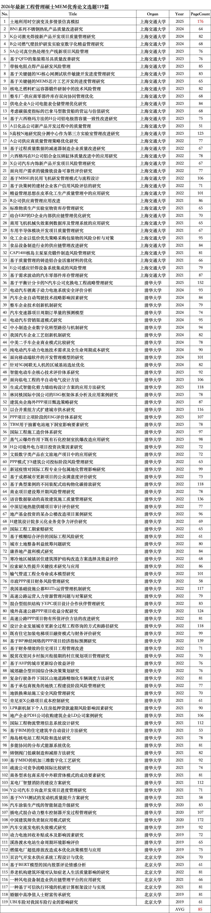
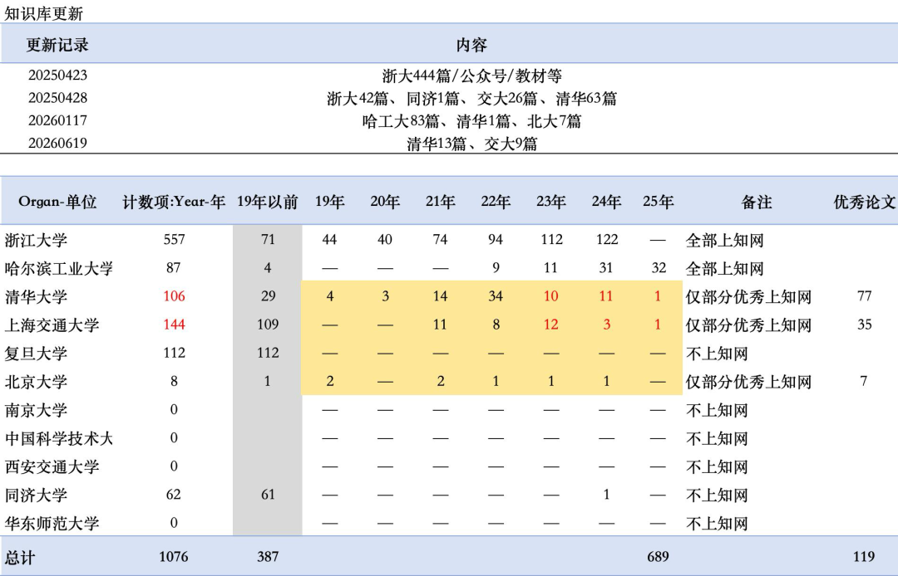
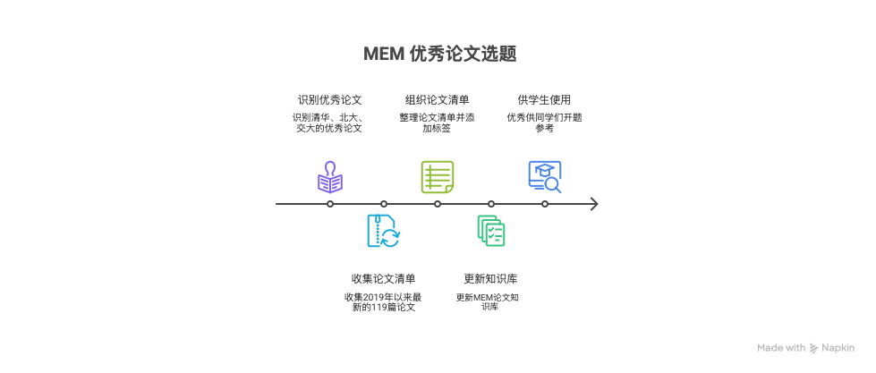

马上新一届的学弟学妹们就要开题了。在论文沟通群里发了一份优秀论文清单，供大家参考。有同学就好奇这些论文是怎么搞到的，还以为我手头有获评校优、市优的论文清单。

其实大道至简，清北复交的论文通常是不上知网的，只有那些写得优秀的毕业论文才上知网。所以，知网上这些学校的论文，就是优秀论文的筛选结果。这里整理了2019年以来最新的清华、北大、上海交大的MEM论文清单119篇给即将开题的同学们。这些论文质量都很高，称得上是“细糠”，大家可以慢慢品味。简单看了下，最新的卷王全文已经来了176页，平均页面也来到了85页，供各位写作的时候参考。

1、土地利用时空演变及多情景仿真模拟

2、BN1系列不锈钢热轧产品质量改进研究

3、K公司激光焊接新产品开发项目质量管理研究

4、B公司燃气壁挂炉研发实验室数字化精益管理研究

5、SA公司真空热处理生产线新项目风险管理

6、基于QFD的集装箱吊具质量改善研究

7、带极电阻点焊产品研发风险管理

8、基于关键链的5G核心网测试软件敏捷开发进度管理研究

9、基于关键链的MEMS芯片工艺开发的进度管理研究

10、核电乏燃料贮运容器锻件研制中的技术风险管理

11、整车厂-供应商零部件库存双向协同管理优化

12、供电企业A公司电能表仓储管理优化研究

13、考虑碳强度指标的巴拿马型散货船的营运与估值研究

14、基于六西格玛方法的H公司铝电极箔容量一致性改进研究

15、A日化品公司新产品开发过程中的质量管理

16、S高校N地研究院分测中心作为第三方实验室管理改进研究

17、A公司供应商质量管理策略优化研究

18、基于过程质量数据的减速器制造企业质量改进研究

19、六西格玛在H公司铝合金压铸缸体质量改进中的应用研究

20、X公司汽车内饰新产品开发项目风险管理研究

21、面向用户需求的镜像铣设备可靠性评价研究

22、基于MBSE的民用飞机研发管理模式与流程设计

23、基于决策树的建材企业客户信用风险评估的研究

24、精益管理思想在皮革化工生产质量管理中的应用研究

25、R公司供应商管理应用改进

26、标准物质生产实验室物资库存管理研究

27、结合ERP的D企业内部供应链管理优化研究

28、商用飞机机械失效案例数据库及管理系统的应用研究

29、车用半导体模块开发项目质量管理研究

30、化工企业以低价优先策略采购包装物的风险分析与对策

31、食品设备制造行业的供应链管理改进研究

32、CAP1400核岛主泵泵壳锻件制造风险管理研究

33、基于质量管理的铸造铝合金活塞材料的优化

34、E公司感应钎焊设备系统集成的风险管理

35、基于需求波动的汽车零部件库存管理研究

36、基于平衡计分卡的N汽车公司充换电工程战略管理研究

37、电动汽车锂离子动力电池系统安全评价分析

38、汽车企业自动驾驶技术战略影响因素研究

39、整车企业技术创新机制研究

40、汽车变速器项目周期订单量的预测模型

41、电动汽车营销渠道模式研究

42、中小制造企业数字化转型路径与机制研究

43、我国汽车企业工艺创新机制研究

44、中美二手车企业商业模式比较研究

45、纯电动汽车动力电池技术需求及全生命周期成本研究

46、面向移动端软件的开发管理模型的研究

47、针对5G网联无人机的区域基站选址优化

48、智能电动车企核心技术评价体系研究

49、面向临电工程的半自动电气设计方法

50、生成式智能化剪力墙结构设计方案的应用方法研究

51、林同棪国际中国公司的ESG框架体系分析及应用案例研究

52、建筑央企海外PPP项目甄选策略研究

53、以合并重组方式扩建城市供水研究

54、PPP项目立项阶段的ESG评价体系研究

55、TBM用于抽蓄电站地下洞室影响要素研究

56、国际工程施工造价体系研究

57、蒸气云爆炸作用下既有石化控制室抗爆改造应用研究

58、H公司境外电力项目投资决策因素研究

59、文娱数字类产品在文旅地产项目中的应用研究

60、PPP模式下S建筑公司投标阶段风险管理研究

61、新冠疫情对国际工程专业分包属地化管理影响研究

62、基于成都城市更新项目的公众满意度评价研究

63、基于典型案例的不同装配式结构物化碳排放研究

64、商业项目建设筹开期风险管理研究

65、语音数据驱动的高效建筑施工质量管理研究

66、中深层地热能供暖项目审计评价研究

67、地产基金投资的某办公楼改造项目案例研究

68、H建筑设计院多元化业务竞争力评价研究

69、国际工程工期索赔研究

70、基于模糊综合评价的国际工程风险研究

71、城市土地整备利益统筹问题研究

72、康养地产盈利模式研究

73、寒冷地区城镇居住建筑围护结构改造方案选择及效益评价

74、拉索耐久性提升关键技术研究与应用

75、输气管道工程全寿命成本模型研究

76、市政PPP项目财务风险管理研究

77、我国基础设施公募REITs运营管理机制研究

78、高速公路运营人力资源管理问题与对策研究

79、混合型组织结构下EPC项目设计合作伙伴管理研究

80、境外高速公路PPP项目收益分配研究

81、高速公路PPP项目物有所值评价方法的改进研究

82、设计企业发展城市更新全过程工程咨询的方式和路径研究

83、既有住宅加装电梯项目融资模式与财务评价研究

84、基于BP神经网络的PPP项目经济指标预测研究

85、基于财务绩效的住宅项目工程管理改进

86、脱贫攻坚同乡村振兴衔接期的村庄规划项目管理研究

87、基于AHP的城市更新综合效益评价

88、城郊融合型田园综合体决策策划研究

89、复杂行驶条件下园区山地道路精细化车辆调度方法研究

90、基于承包商视角的地铁工程建设阶段风险管理研究

91、地铁换乘站施工安全风险管理研究

92、肯尼亚X公路项目成本控制研究

93、LPR新机制下个人住房抵押贷款逾期风险影响因素研究

94、地产企业PDH公司收购建筑企业LD公司案例研究

95、国际工程物流管理信息系统设计研究

96、基于BIM的住宅建筑半自动设计方法研究

97、海岛核电站工程风险和选址研究

98、多能协同的分布式能源系统优化

99、铸钢阀门低碳制造和减排方法研究

100、基于MBD的机加三维数字化工艺研究

101、疏浚公司竞争战略国际比较研究

102、商务型承包商采用中外联营体模式的成功要素研究

103、某电厂智慧消防的建设方案研究

104、Y公司汽车方向盘开发项目进度管理研究

105、基于NVH测试的发动机质量提升方案研究

106、汽车涂装生产线的智能制造升级研究

107、插电式混合动力整车控制器开发过程管理研究

108、中国建筑师负责制应用模式研究

109、汽车交流发电机失效模式研究

110、动力电池回收补贴成本及影响因素研究

111、溪洛渡水电站生命周期环境影响评价

112、燃煤电厂超低排放改造成本优化决策模型与应用

113、页岩气开发水供应系统工程设计与优化

114、基于BERT模型的国内股票评论情感分析

115、养老机构建筑环境对认知症老人生活质量影响的研究

116、一种风电设备制造业供应链管理平台的应用研究

117、一种基于可信执行环境的机密计算框架设计与实现

118、婚姻中高净值人士财富传承研究

119、UBI车险对我国车险行业的影响研究

同时，相关论文也已同步更新到MEM论文知识库中，并为每篇文章打好了标签。输入\#指定标签问答，快速锁定你需要的论文检索范围，让知识库的输出更精准。最新版MEM论文知识库已全部更新完毕，欢迎大家使用。

各位论文小裁缝，端午安康，开题顺利～

图片来源：Napkin根据文本内容绘制

（声明：本文图片及数据来源于公开数据库整理。本人只负责数据的搜集和整理并做脱敏工作，不能保证数据的准确性和精度以及时效性。本数据仅用作为学习用途。如数据有侵权请告知本人，本人尽早删除该数据。）