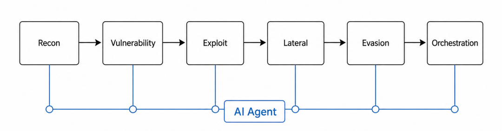
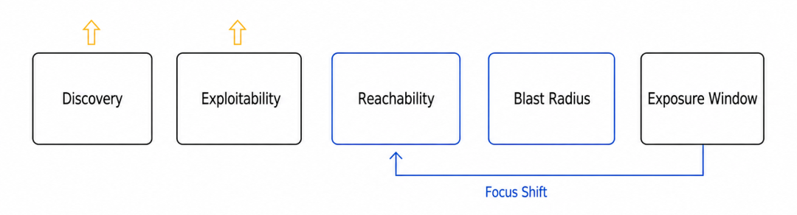
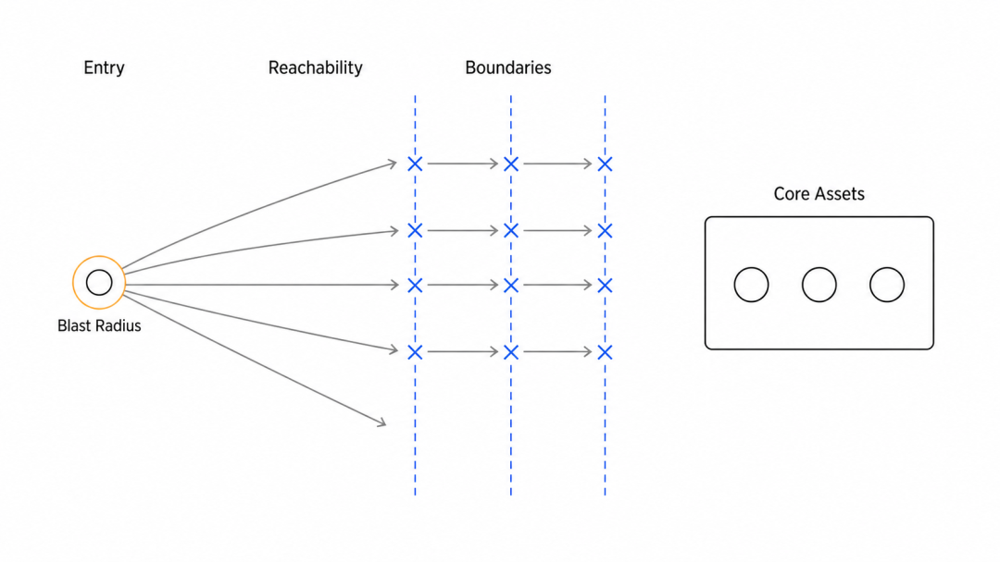
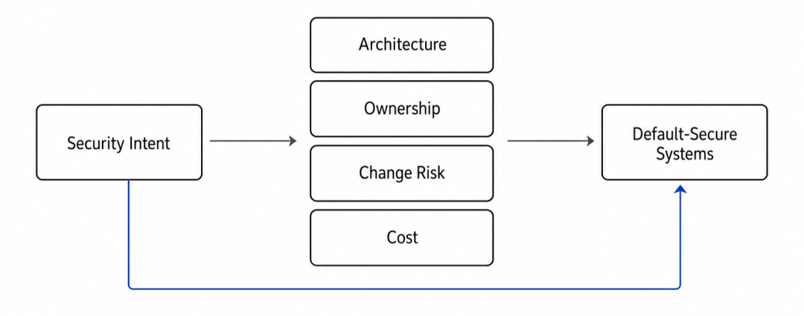
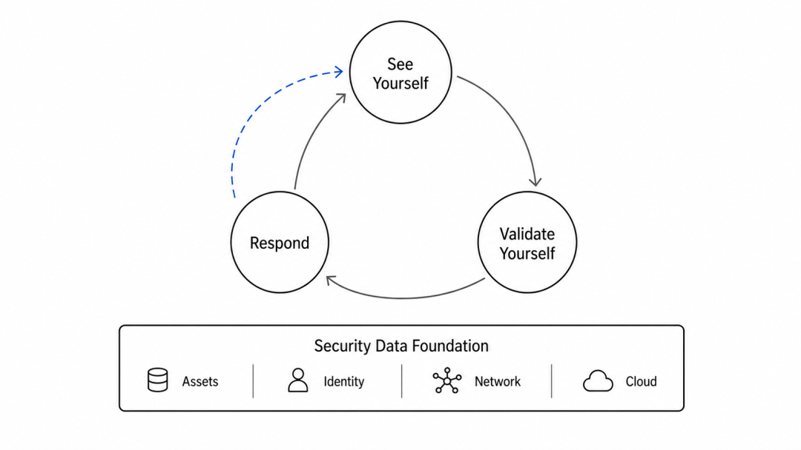
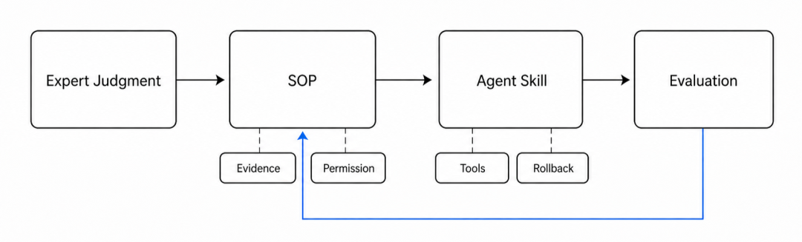

 2026 年 6 月 11 日，我在上海 AGI Bar 和三十几位不同背景的安全从业者们做了一场深入讨论。大家的背景不完全一样：有人长期做传统攻防，有人关心安全运营和企业落地，有人正在看 AI Agent、模型安全和自动化红蓝。讨论的起点，是 Mythos 展现出来的 Cyber 能力：当 Agent 可以连续完成资产发现、漏洞分析、PoC /EXP 编写、路径推演和作战调度时，网络安全该怎么做？安全团队的人才结构又该怎么变？这篇文章就是那场讨论之后的整理和进一步推演。这里的 Mythos，与其说只是某一个模型，不如说是一个信号：AI Agent 正在把攻击从"人驱动的专业流程"，改造成"模型驱动的连续作业"。网络攻防也正在从冷兵器时代，进入到了火器时代。安全行业并不缺正确答案。Secure by design、默认拒绝、最小权限、强身份、工作负载身份和微隔离，这些方向很早就被最先进的组织验证过。它们共同指向一件事：安全不应该永远站在系统之后补漏洞，而应该尽可能成为产品、平台和架构的默认属性。真正的问题是，正确答案往往很贵。它贵的不是产品价格，而是架构能力、工程纪律和组织协同。要让安全成为默认属性，企业要重做身份、网络、权限、服务调用、研发流程和运维习惯；安全团队也不能只在上线前后出现，而要进入更早的架构和平台决策。于是，大多数企业真正跑起来的安全主线，仍然是 SOC、漏洞管理、合规检查、攻防演练、应急响应，以及有条件时的内部红蓝。这套体系不是错的。它是多数企业在历史包袱、组织阻力和架构能力之间，能持续运转起来的安全工程现实。但 AI Agent 正在改变这个现实的前提：攻击者发现问题、验证问题、写 PoC/EXP、规划攻击路径和攻击调度的成本都在下降。防御方如果仍然只围绕"更快发现、更快响应、更快修补"来规划，就会越来越像在和机器抢时间。这就是 AI Agent 时代，安全防御方程需要重写的原因。  
01AI 改变的是整条攻击链  
图1:AI Agent 可以有效加快资产发现、漏洞分析、利用开发和横向移动等流程的时间AI 对攻击端的增强，不只是"挖洞更快"。它压缩的是整条链：阶段| 传统节奏| AI Agent 时代的节奏  
---|---|---  
Recon| 人工扫端口、扫子域名、整理资产| 模型持续发现 endpoint、影子 API、暴露凭据  
漏洞发现| 人工 fuzz、审代码、调环境| 模型读代码、生成候选漏洞、排序利用价值  
利用开发| 手工构造 payload，反复试错| 自动改写 PoC，迭代 Exploit  
横向移动| 红队人员排路径、查权限| 多 Agent 协同识别高价值系统和身份路径  
免杀与对抗| 人工对抗 AV/EDR 规则| 自动生成变体、测试反馈、继续改写  
指挥调度| 人做作战规划| Agent 承担越来越多的作战编排角色  
对暴露凭据、已知漏洞、错误配置和可脚本化入口，首次触达和利用尝试可能被压到分钟级；但补丁、隔离和业务侧整改仍会受变更窗口、生产风险和审批流程约束。这意味着，AI 并不是让所有攻击都瞬间完成，而是在持续降低攻击者的边际成本。复杂内网、强身份、MFA、业务语义和人工确认仍然会制造摩擦，但防御方单独依赖响应速度来争取时间差的空间，确实在变小。SOC当然是还必要的，但更本质的问题是：SOC 会越来越像由数据管道、检测工程、自动化编排、案例管理和人工审批共同组成的运营体系；红蓝成果会越来越紫队化、持续验证化。真正决定风险上限的，会回到更底层的问题：攻击者能不能触达关键路径，以及触达之后的爆炸半径有多大。  
02防御方程：从抢时间到控路径  
图2:AI 时代防御者方程中可达性、爆炸半径和暴露时间窗口的关系如果把安全预算看成一次资源分配，AI 时代最该问的不是哪项产品更先进，而是哪一个变量还能被防御者真正控制。可以用一个半定量的排序模型来表达：防御者方程（Defender's Equation in the AI era）E\[L\]\{期望损失\} ≈ D\(t\)\{漏洞/入口发现速度\} · P *e\{可利用概率\} · P* reach\{可达性\} · B\{爆炸半径\} · T\_e\{暴露时间窗口\}变量| 含义| AI Agent 时代的变化| 主要由谁影响  
---|---|---|---  
D\(t\)| 攻击者单位时间内可发现的漏洞和入口数| 快速上升。自动化发现让原来"不值得打"的目标也变得值得打| 攻击者主导，防御者可部分抢先  
P\_e| 发现的问题在具体部署中是否可利用| 上升。Exploit 适配、验证和复现成本下降| 攻防双方共同影响  
P\_reach| 被利用的组件是否能触达关键路径| 变成防御者最重要的主战场之一| 防御者主导  
B| 一旦建立据点，可触及的价值和范围| 可被显著压缩| 防御者主导  
T\_e| 暴露时间窗口、检测与遏制时间窗口| 仍然重要，但单独依赖 MTTR 的杠杆下降| 防御者主导  
过去很多安全运营，主要围绕 T\_e（暴露时间窗口） 展开：补丁 SLA、MTTR、告警响应、应急处置、漏洞优先级排序、红蓝演练后的整改闭环，本质上都在回答一个问题：我能不能在攻击者利用漏洞或者钓鱼造成危害之前，把窗口关掉？这个问题仍然重要，但它不再足够。因为当攻击者从发现、利用、横向移动到数据访问的链路被 AI 压缩之后，把 MTTR 从 4 小时降到 1 小时，当然有价值，但未必能改变最终损失。新的高杠杆问题应该变成：

  * 他就算发现了，能不能打进来？

  * 他就算进来了，能不能横向移动？

  * 他就算横向移动了，能不能拿到真正有价值的东西？

也就是把重心从 T *e（暴露时间窗口） 转向 P* reach（可达性） 和 B（爆炸半径）。但这里有一个容易被忽略的连接点：从 T *e（暴露时间窗口） 转向 P* reach（可达性） 和 B（爆炸半径），并不意味着运营不重要，而是意味着运营必须变成结构性治理的反馈系统。SOC、红蓝、漏洞管理和应急响应过去主要是在"发现问题后尽快处理问题"；AI Agent 时代，它们还要承担另一件事：持续把真实攻击路径、真实误报、真实处置经验和真实业务约束，反哺到身份、网络、权限、数据和研发流程的长期治理里。也就是说，自动化不是长期结构改造的替代品，而是结构改造的传感器、执行器和学习系统。没有自动化，企业很难持续看见自己的 P *reach（可达性） 和 B（爆炸半径）；没有 P* reach（可达性） 和 B（爆炸半径） 的治理，自动化又只是在更快地处理同一批告警。  
03真正的杠杆：可达性与爆炸半径  
图3 通过默认拒绝、最小权限和微隔离降低攻击可达性与爆炸半径P\_reach（可达性）一个漏洞存在，不等于攻击者能利用它；能利用它，也不等于能触达关键业务；触达关键业务，也不等于能沿着内网一路走到核心数据、身份系统和生产控制面。这就是微隔离、默认拒绝、工作负载身份、短期凭据、服务间 mTLS 的价值。它们减少的不是告警数量，而是攻击者可走的路。更产业化地说，这些能力包括短期、细粒度、可撤销的访问凭据，例如云 IAM role、OIDC/OAuth scope、JIT/JEA、SPIFFE/SPIRE SVID，以及服务网格 mTLS。攻击者无法绕过一条不存在的路径。AI 可以帮助攻击者更快发现漏洞、写 Exploit、规划横向移动，但如果路径被切断，攻击效率再高也只能在局部打转。B（爆炸半径）AI 时代更现实的假设是：某些点一定会被打进去。真正的问题是，被打进去之后能碰到什么。所以第二个长期杠杆，是让每一个据点都"不值钱"：

  * 业务系统不持有不该持有的数据；

  * API Token、Service Account、CI/CD 凭据按最小权限重审；

  * 工作负载尽量短生命周期，状态外置，可销毁、可替换；

  * 一个账号被盗，不应该天然意味着一组系统沦陷；

  * 删库、导出、改权限、发版、访问密钥系统等关键动作，不应只依赖单一身份判断。

如果 P\_reach（可达性）解决的是"攻击者能不能到"，B（爆炸半径）解决的就是"到了以后值不值得"。这是长期最重要的方向。但它也是最难的方向。  
04难点不在认知，而在组织能力  
图4:零信任和微隔离改造面临架构、组织、成本和收益表达阻力从防御者方程看，P\_reach（可达性）和 B（爆炸半径）是 AI Agent 时代最值得投入的长期杠杆。逻辑上，企业应该更坚定地走向零信任、微隔离、短生命周期计算、最小权限和数据最小化，把安全做成系统的默认属性。但这条路的难点不在理念，而在改造本身。它要求企业重新理解自己的系统：

  * 服务之间到底谁该访问谁；

  * 哪些调用是业务必需，哪些只是历史遗留；

  * 哪些身份长期持有过大权限；

  * 哪些数据本来就不该进入生产环境；

  * 哪些应用可以被重构成无状态或短生命周期；

  * 这些变化会如何影响发布、观测、审计、回滚和故障处理。

这类改造很少是安全团队自己能推动完的。它会碰到几类阻力：

  * 架构阻力：老系统、混合云、专线、历史网段和隐式依赖太多，没人敢轻易切。

  * 组织阻力：安全团队提出"默认拒绝"，业务团队听到的是"线上可能会断"。

  * 成本阻力：真正做微隔离和零信任，成本不是软件 license，而是长期梳理、试点、灰度、回滚和运营。

  * 收益表达困难：它降低的是未来风险，但企业预算往往更容易投向能立刻看见报表的项目。

所以 AI 时代防御建设的第一个矛盾是：长期最重要的是结构性改造，短期最可落地的却是自动化。大多数企业不会从"全域零信任"开始。更现实的路径，是先沿着已有的安全主线引入 AI，做好资产盘点、持续的红队验证与脆弱点扫描、自动化的安全运营；再用这些自动化能力反推长期的可达性治理和爆炸半径治理。  
05短期可以建立起的能力  
图5: AI 防御建设从资产盘点、持续的红队验证与脆弱点扫描到自动化的安全运营资产盘点、持续的红队验证与脆弱点扫描、自动化的安全运营，容易被混在一起，但它们解决的是三个不同问题。资产盘点，回答的是：我有什么，暴露在哪里，谁负责，和哪些系统、代码、身份、数据有关。它的产物是一张持续更新的资产与暴露面图谱。持续的红队验证与脆弱点扫描，回答的是：这些暴露面里，哪些真的能被利用；利用之后能不能形成路径；路径最终能不能触达关键业务、核心数据或高权限身份。它的产物不是资产清单，而是经过验证的攻击路径和修复优先级。自动化的安全运营，回答的是：当异常已经发生，我能不能用数据和流程快速完成关联研判、影响面判断、处置建议、人工审批和复盘闭环。它的产物是一条可观测、可授权、可回滚的响应流水线。前者让企业摆脱"连自己有什么都不知道"的状态；第二步让企业在攻击者之前，把可利用性和影响面跑出来；第三步则缩短 T\_e（暴露时间窗口），但承认高风险处置仍需要人工审批和兜底。第一步：资产盘点企业安全的第一公里，仍然是资产。很多企业不是不知道要做零信任，而是连"我到底有哪些资产暴露在外面""哪些域名还在指向旧系统""哪些 API 没有人维护""哪些云资源是临时开出来但没人关"的问题都答不清楚。这就是 AI 最先能发挥价值的地方：做资产与暴露面图谱。更准确地说，它要把分散在不同系统里的资产线索、外部暴露面和内部责任链串起来：

  * 汇总云资产、DNS、证书、WAF、流量日志、代码仓库、CI/CD、工单系统里的资产线索；

  * 自动识别影子 API、废弃域名、暴露管理后台、测试环境、临时开放端口；

  * 把外部暴露面和内部负责人、业务系统、代码仓库、部署环境关联起来；

  * 对资产风险排序，让安全团队先处理最容易被攻击者触达的入口；

  * 持续监测新增暴露面，而不是每年做一次盘点。

这条路径未必能立刻解决东西向横向移动问题，但它能先减少攻击者的入口数量，把"我有什么、暴露在哪里、谁负责"这件事变成持续更新的事实。第二步：持续的红队验证与脆弱点扫描如果攻击者可以用 AI 自动发现资产、分析漏洞、适配利用方式，那么防御者也应该先用 AI 对自己做同样的事。区别在于，防御者拥有更多上下文：代码、架构、日志、配置、部署环境、资产关系和业务优先级。这一步可以更直接地理解为：用 AI 来做过去红蓝对抗里大量标准化、流程化的动作。AI 自动化渗透已经足够强，资产发现、漏洞假设、最小化验证、PoC 适配、路径推演、修复复测这些环节，都可以被 Agent 持续执行。它不再需要等一年一次演练，也不需要每次都临时拉一支重兵红队，而是把红蓝动作变成一条日常运行的验证流水线。

  * 用 AI 做攻击面发现和资产关联；

  * 用 AI 做代码审计、配置审计和依赖漏洞扫描；

  * 用 AI 辅助生成最小化验证用例、检测验证脚本或受控 PoC，并只在授权环境、沙箱或预生产环境验证；

  * 用 AI 推演从外部入口到内部关键资产的路径；

  * 用 AI 把发现的问题接入 DevOps 流程，自动生成修复建议、测试用例和回归检查；

  * 用 AI 对修复结果做复测，确认风险真的收敛。

这条路径的价值在于，它不要求企业一开始就完成零信任改造。它先让 AI 持续扮演"内部攻击者"和"验证者"，把"风险在哪里、路径能不能打通、修复是否真的有效"暴露出来，再把风险修复嵌进研发和运维流程。从防御者方程看，这其实是在争夺 D\(t\)（漏洞/入口发现速度）和 P\_e（可利用概率）的先手：攻击者能发现的问题，防御者先发现；攻击者能利用的路径，防御者先验证；攻击者能自动化的步骤，防御者先流水线化。第三步：自动化的安全运营SOC 不会消失。它会变得更自动化、更工程化，也更像安全 Agent 的运行时环境。过去的 SOC 很大程度上依赖人的手动调查。一个告警出来，分析师去查 EDR、翻防火墙日志、看流量、找账号登录记录、问业务系统负责人，再把这些线索拼成一条时间线。这个过程慢，但在攻击链还没有被完全压缩的时候，仍然能跑。AI Agent 时代，这件事必须自动化。但自动化的第一前提不是模型，而是数据底座。没有足够完整、足够干净、能够相互关联的数据，AI SOC 只会变成"更会写总结的告警平台"。它可以把告警描述得更流畅，却无法可靠判断这个账号是谁、这台机器属于哪个业务、这个 API 是否触达核心数据、这个操作是否偏离历史基线、这个处置会不会影响生产。所以，SOC 自动化首先要补的是安全数据底座。它不是简单把日志都收进来，而是要形成一张可以被 Agent 使用的事件图、资产图、身份图、权限图、服务依赖图和责任图：

  * 端的数据：EDR、主机行为、进程、文件、注册表、容器运行时、工作负载身份；

  * 网的数据：南北向流量、东西向流量、DNS、代理、WAF、网关、防火墙、NDR；

  * 云的数据：云审计日志、控制面操作、对象存储访问、临时凭据、云安全组和策略变更；

  * 身份的数据：账号登录、MFA、权限变更、Token 使用、Service Account 行为；

  * 应用的数据：业务日志、API 调用、错误码、关键操作、数据导出、管理后台访问；

  * 资产和责任链：资产归属、业务系统、代码仓库、负责人、部署环境、数据等级；

  * 处置动作数据：动作权限、审批记录、执行结果、影响范围和审计日志。

这些数据收上来之后，数据工程、规则和图模型要先完成实体解析和关联；Agent 再在其上查询、推理和生成处置建议。否则 AI 只能看到一堆孤立日志，看不到攻击路径。AI SOC 近期最现实的价值，不是"自动处置一切"，而是把重复、耗时、上下文拼接密集的工作先自动化：

  * 告警去重；

  * 告警分级；

  * IOC 富化；

  * 钓鱼邮件初筛；

  * 初步取证；

  * 日志回溯；

  * 端、网、云、身份、应用数据的关联研判；

  * 漏洞情报到资产影响面的映射；

  * 检测规则生成与回放；

  * playbook 推荐；

  * 处置建议、处置执行和复盘报告。

高风险处置仍然需要人审批。隔离主机、禁用账号、阻断网络、回滚系统、影响生产的动作，都不应该在短期内完全交给 AI 自主执行。  
06组织能力：把运营和攻防经验写进 Agent  
图6:安全团队把 SOC、红蓝和紫队经验工程化为可执行 Agent 工作流程这里有一个很重要的区分：不是 AI 自动拥有安全智慧，而是人把自己的判断过程蒸馏成 AI 可执行、可检查、可授权的工作流。这也解释了为什么人才结构会变化。过去安全运营团队最稀缺的是能亲手跑完复杂流程的人：查日志、拼时间线、判断误报、写报告、做复测；或者手工做资产探测、漏洞验证、路径推演、检测绕过和攻防复盘。未来这些能力仍然重要，但更高的杠杆会落在另一类人身上：能把这些经验拆成 SOP、工具调用、权限边界、验证标准和回滚条件的人。很多安全能力过去依赖的是人的默会知识：看到一条告警，知道该先查哪几张表；看到一段异常流量，能判断它像误报还是横向移动；看到一个漏洞，能估计它在当前资产里的真实可利用性。这些经验以前只存在于人的脑子里，或者散落在复盘文档、群聊和老员工的习惯动作里。但需要强调的是：需要 SOP / Skill 化的不只是 SOC。SOC 侧要沉淀的是告警研判、日志回溯、影响面分析、处置审批和复盘报告；红队侧要沉淀的是资产探测、漏洞假设、受控验证、权限路径推演和攻击链复盘；蓝队侧要沉淀的是检测规则生成、规则回放、证据标准、误报归因和响应 playbook；紫队和持续验证侧要沉淀的是"某条攻击路径是否可达、哪条检测规则是否生效、修复之后是否真的收敛"的验证流程。这些能力真正有价值的部分，不是被 AI 抹掉，而是被工程化：把判断依据、证据标准、分支条件、例外处理、升级规则、权限边界和验证标准，变成 Agent 能调用的流程资产。因此，SOP / runbook / playbook 不是"写几份文档"。它们应该进一步工程化为 Agent Skill 或可执行能力包：包含工具调用、输入输出、权限边界、检查点、回滚条件和评估样例。它们应该像代码一样被版本管理，像检测规则一样被测试，像生产变更一样被授权，像应急流程一样能回滚。安全团队需要 AI-native 的安全自动化能力：能把 SOC、红队、蓝队、紫队，以及研发和运维流程里的安全工作拆成 playbook / Skill，接入工具和数据，设计权限边界，建立评估集，并持续观测 Agent 输出质量。这种人需要：

  * 看得见系统：从业务目标、技术栈、攻击面、身份关系和对手能力出发，画出攻防推演图。

  * 写得出 SOP：把人的默会知识和判断过程拆成步骤、分支、输入、输出、证据标准、例外情况和升级条件。

  * 写得出 Skill：把 SOP 变成 Agent 能执行的工具链、上下文、权限边界、检查点和回滚机制。

  * 建得起数据底座：知道 Agent 需要哪些端、网、云、身份、应用、资产和责任链数据，才能做可靠研判。

  * 评估得了结果：知道 Agent 的结论什么时候可信，什么时候需要人工复核，什么时候必须降级到保守处置。

  * 组织得了攻防闭环：能把红队发现、蓝队检测、紫队验证、SOC 处置和 DevOps 修复串成持续改进流程。

  * 讲得清取舍：能解释为什么资源应该投向 P *reach（可达性）、B（爆炸半径）、T* e（暴露时间窗口）、D\(t\)（漏洞/入口发现速度）或 P\_e（可利用概率）。

  * 沟通得了业务：能向管理层讲明白"为什么要做微隔离"，而不是只说"我们要上零信任"。

AI 时代不会不需要安全人。样本初筛、patch diff、crash triage、漏洞复现、PoC 适配、告警初筛等流程化环节会被 Agent 大幅加速；但高质量漏洞研究、复杂环境渗透、架构取舍和业务沟通仍依赖人的判断。换句话说，未来安全团队的核心资产，不只是人本身，也包括这些人沉淀下来的 SOP、Skill、playbook、验证集、权限模型、评估标准和数据资产。一个高手当然重要，但一个能把高手经验复制给一组 Agent、再让 Agent 的执行结果反哺组织治理的团队，会更重要。  
07给安全规划的一条路线图  
如果把上面的判断落到规划顺序里，可以简单概括为四点。第一点，做资产与暴露面图谱，把"我有什么、暴露在哪里、谁负责、影响什么业务"变成持续更新的事实。第二点，把持续安全验证接进 DevOps和日常的自动化红蓝流程中，让攻击面发现、漏洞发现、受控验证、路径推演、修复建议和回归验证逐步流水线化。第三点，把 SOC 流程自动化，用更完整的数据底座和更清晰的 playbook 缩短 T\_e（暴露时间窗口），但高风险处置仍然保留人工审批和兜底。第四点，把这些过程中沉淀下来的判断方法写成 SOP 和 Skill。告警复盘、红蓝演练、持续验证、漏洞修复和应急处置，都应该反过来更新这些能力包，再进一步支撑更长期的 P\_reach（可达性）和 B（爆炸半径）治理：零信任、微隔离、最小权限、短生命周期计算和数据最小化。也就是说，短期不是跳过结构性改造，而是先用 AI 做好资产盘点、持续的红队验证与脆弱点扫描、自动化的安全运营；长期再用这些事实和流程，推动系统变得更难被触达，也更不值得被攻破。  
08写在最后  
Mythos 时代最危险的，不是 AI 太强，而是我们还在用上一代安全运营的节奏，规划下一代攻击自动化的风险。零信任、微隔离、最小权限，并不是新答案。它们一直是正确答案，只是太重、太贵、太依赖组织能力，所以长期只有少数工程能力极强的公司能系统性推进。AI Agent 没有推翻这些答案，反而把它们重新推到桌面上。攻击链越快，靠响应抢时间差的空间就越小；攻击者越自动化，系统本身的可达性和爆炸半径就越重要。现实的路线不会一步到位。大多数企业更可能先用 AI 做好资产盘点、持续的红队验证与脆弱点扫描、自动化的安全运营；再把这些过程中产生的数据、SOP、Skill 和复盘经验，反过来推动零信任、微隔离、最小权限和数据治理这些长期 backlog。人的价值也会在这个过程中被重估。过去最值钱的是能做好事情的人；接下来更值钱的，是能把复杂流程讲清楚、拆明白、写成 SOP，变成 Agent Skill，并持续评估它是否真的降低了 D\(t\)（漏洞/入口发现速度）、T *e（暴露时间窗口）、P* reach（可达性）和 B（爆炸半径）的人。人的经验不会消失，但它需要从"只在我脑子里"变成"组织和 Agent 都能复用、能验证、能迭代的安全能力"。一句话说：AI 负责把资产盘点、持续的红队验证与脆弱点扫描、自动化的安全运营的速度拉上去；人负责把系统设计成更难抵达、更难横移、更不值得攻破的样子，并持续的运营和增强自动化的AI Agent系统的能力。这才是 AI Agent 时代，防御方程真正要重写的地方。