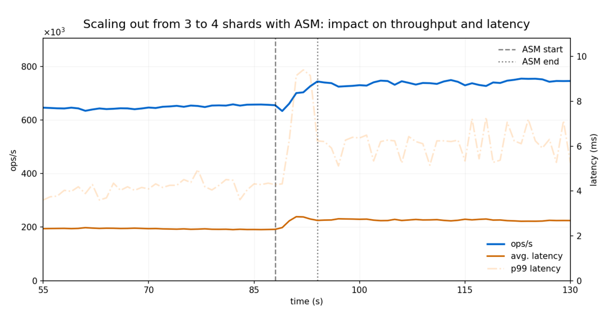
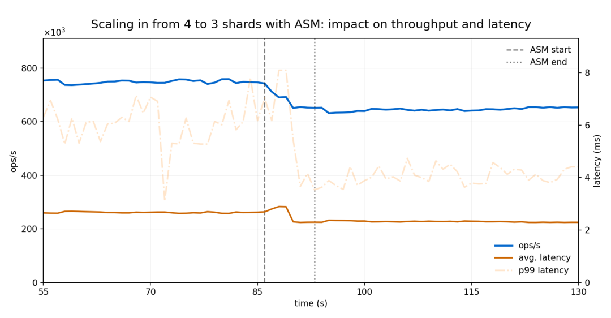
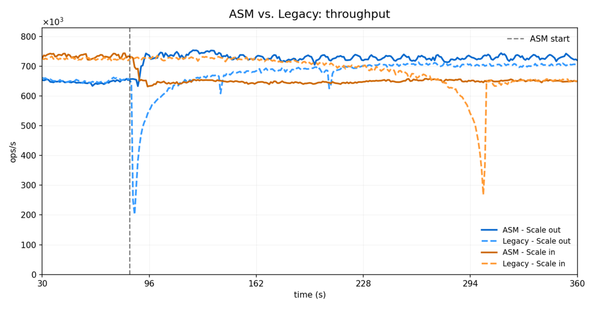
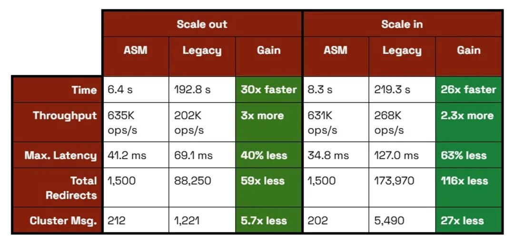
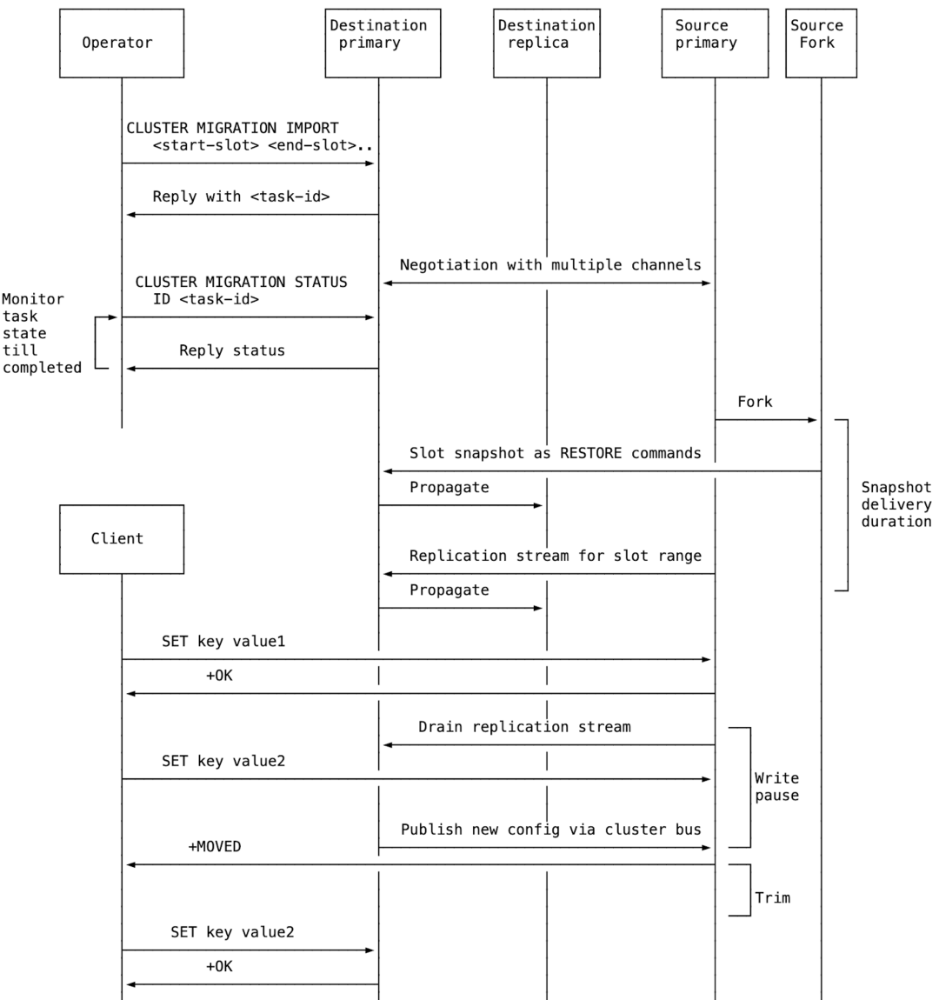

> 原文：https://redis.io/blog/atomic-slot-migration/  
> 作者：Lior Kogan、Ozan Tezcan、Yuan Wang 、Paulo Sousa   
> 

在 Redis 8.4\[1\] 中，我们引入了**原子 slot 迁移（atomic slot migration，ASM）** ，对于在生产环境下运维 Redis Cluster 而言这是一项重大改进。本文主要讲解：

  * Redis hash slot 简介
  * 为什么可能需要迁移 slot
  * 如何检测 slot 需要迁移
  * 原子 slot 迁移相比旧版 slot 迁移的优势
  * Redis 8.4 原子 slot 迁移的实现

## 1 Redis hash slot 简介

Redis Cluster 是 Redis 的一种分布式部署模式，旨在实现高可用、可扩展和容错。它不再是运行单个 Redis 实例，而是将多个 Redis 节点连接到一起，使数据和流量可以分散到这些节点上。

Redis Cluster 使用 hash slot（共 16384 个）自动地把 key 拆分并分布到不同节点。集群中的每个节点负责一部分 slot，因此每个节点只负责一部分 key，这使得 Redis 能够处理远超单机所能承载的数据。

Redis 通过对 `key` 计算 `CRC16(key)`（如果 key 名中包含 `{}`，则只计算 `{}` 内的部分），然后对结果取模 16384，来确定一个 key 所属的 slot。

你可以在 Cluster Spec 文档\[2\] 阅读更多关于 Redis 集群和 hash slot 内容。

## 2 迁移 slot 的原因

在节点之间移动 slot，主要有两个原因：

**扩展集群**

当添加新节点（scale out）时，集群需要将一部分 slot 对应数据移动到新节点，以便让数据保持均衡。同样，在移除节点（scale-in）之前，该节点上的 slot 需要被重新分配到其他节点。

**处理过载节点**

由于 key 的内容和访问模式不同，某个特定的 key、slot 或节点可能比其他需要更多的资源。可能需要更多内存、更多算力，或者更高的网络吞吐量。当某个节点过载时，可以将其上的 slot 在节点之间重新均衡，以获得更好的性能和资源利用率。

## 3 如何检测 slot 是否需要迁移

Redis 提供了相应的命令，帮助 DBA 识别不均衡情况。

`CLUSTER SHARDS` 会报告每个分片负责的 slot 信息。

在 Redis 8.2\[3\] 中，我们引入了 `CLUSTER SLOT-STATS <SLOTSRANGE start-slot end-slot | ORDERBY metric [LIMIT limit] [ASC | DESC]>`。

该命令会报告给定 slot 范围的使用信息，它可以帮助我们了解 slot 的使用情况、找出热点 slot、规划 slot 迁移以均衡负载，或者改进应用层逻辑，让 key 分布更合理。

对每个 slot，该命令可以报告以下指标：

  * `KEY-COUNT`：该 slot 中存储的 key 数量
  * `CPU-USEC`：处理该 slot 所花费的 CPU 时间
  * `NETWORK-BYTES-IN`：该 slot 接收到的入站网络流量总量
  * `NETWORK-BYTES-OUT`：该 slot 发出的出站网络流量总量
  * `MEMORY-BYTES`：该 slot 中所有 key 使用的内存总量

> 注：`MEMORY-BYTES` 从 Redis 8.4 开始可用。

通过结合这些命令，便可以检测到某些节点上 slot 资源使用不均衡的情况，从而决定迁移 slot 到相应分片上。

## 4 Redis 8.4 之前的 slot 迁移

在 Redis 8.4 之前，迁移依赖于 redis-cli 的自动化或人工编排。

redis-cli 命令行工具提供了多个支持 slot 迁移的参数：

  * `redis-cli --cluster reshard <host>:<port> --cluster-from <node-id> --cluster-to <node-id> --cluster-slots <number of slots> --cluster-yes`：在节点之间移动指定数量的 slot。
  * `redis-cli --cluster rebalance`：Redis 会将 slot 在集群中均匀分布，使每个分片上的 slot 数量大致相同。

也可以使用 Redis 命令手动完成同样的流程：

  * 在目标节点上，把 slot 置为 importing 状态：`CLUSTER SETSLOT <slot> IMPORTING <source-node-id>`。
  * 在源节点上，把 slot 置为 migrating 状态：`CLUSTER SETSLOT <slot> MIGRATING <target-node-id>`。
  * 分批将 key 从源节点迁移到目标节点：
    * 首先，列出 slot 中的一部分 key ：`CLUSTER GETKEYSINSLOT <slot> <count>`
    * 然后迁移它们：`MIGRATE <target-host> <target-port> "" 0 <timeout-ms> KEYS k1 k2 ....`
  * 重复此过程，直至 slot 中的 key 为空（`CLUSTER COUNTKEYSINSLOT <slot>` 为 0）。
  * 使用 `CLUSTER SETSLOT <slot> NODE <target-node-id>` 完成收尾。
  * 如果某个 slot 是空的，你可以：
    * 通过 `CLUSTER SETSLOT … NODE` 重新分配（无需 MIGRATE），
    * 或者通过 `CLUSTER ADDSLOTSRANGE / CLUSTER DELSLOTSRANGE` 分配/移除 slot。

## 5 Redis 8.4 之前 slot 迁移存在的问题

在 Redis 8.4 之前， slot 迁移**不是原子的** 。在以前的流程中，key 是被一个一个搬运的（也就是先复制到目标节点，再从源节点删除）。这带来了若干问题：

  1. **重定向与客户端复杂度**

当一个 slot 正在迁移时，其中一些 key 可能已经被搬走，而另一些还没有。如果客户端去访问一个已经被搬走的 key，它会收到一个 `-ASK` 响应，必须再去目标节点重试获取该 key。这增加了复杂度和网络延迟，也会破坏 pipeline 使用。

  2. **重分片期间多 key 操作变得不可靠**

在多 key 命令（例如 `MGET key1, key2`）中，如果部分 key 已经被搬走，客户端会收到 `TRYAGAIN` 响应。客户端只有等到整个 slot 迁移完成后，才能完成该命令。

  3. **Slot 迁移过程中的失败可能导致异常状态**

当部分 key 已经被搬走，但 Redis 未能删除多余的 key 时（例如由于目标节点上可用内存有限），Redis 会处于一种需要人工处理的异常状态，并经常导致数据丢失。

  4. **Replica 一致性问题**

Replica 节点并不能知道某个 slot 正在迁移，因此它们可能会像 key 被不存在那样回复，而不是返回 `-ASK` 重定向。

  5. **性能：逐 key 迁移很慢**

在以前的方式（`CLUSTER GETKEYSINSLOT + MIGRATE`）中， key 以小批次被搬运（实际上接近一个一个搬）。逐 key 的重分片本身就慢，因为每个 key 都带来了额外开销：额外的查找和网络往返。

  6. **大 key 与延迟尖峰**  

对于非常大的 key ， MIGRATE 可能超时，或者在序列化和反序列化负载时在源节点和目标节点上引发明显的延迟尖峰。

## 6 原子 Slot 迁移（ASM）

ASM 解决了上述全部问题。ASM 类似于全量同步复制，但作用在 slot 级别。借助 ASM，整个 slot 的内容都会被复制到目标节点，同时还有一份实时的增量数据（类似 replication backlog）。只有在复制完成后，Redis 才会执行一次**所有权的原子性切换** 。客户端在迁移过程中持续与源节点通信，不会经历上文列举的任何中间状态问题。

在 Redis 8.4 中，我们引入了一个新命令 `CLUSTER MIGRATION`，它包含若干子命令。

向目标主节点发送命令 `CLUSTER MIGRATION IMPORT <start-slot> <end-slot> [<start-slot> <end-slot>]...` 即可启动 slot 迁移。该命令会返回一个任务 ID，用于监控任务的状态。无论指定了多少个 slot 范围，目标节点对源节点启动一个包含所有 slot 的迁移任务。

用户可以通过 `CLUSTER MIGRATION STATUS <ID id | ALL>` 命令监控迁移状态。

用户也可以通过 `CLUSTER MIGRATION CANCEL <ID id | ALL>` 取消正在进行的迁移任务。该命令需要发送到目标节点。

## 7 原子 Slot 迁移：性能测试

ASM 在迁移期间能保持生产级别的性能。吞吐量与基线水平保持一致；重定向极为少见，引入的额外延迟也很小、持续时间短，整体仍在常规运行边界之内。

为了量化 ASM 的性能影响，我们在持续的流量下，对 Redis 8.4 进行了基准测试，同时把三分之一的 slot 迁移到其他节点。

**Workload**

  * 1000 万个 key，512 字节的值（约 5GB）
  * 写读比为 1:10，模拟缓存访问模式
  * 10 个线程，每个线程使用 50 个客户端（共 500 个连接），以模拟持续负载

**测试环境**

Redis 8.4 集群运行在多个 `c4-standard-8` GCP 实例上（8 vCPU，32GB 内存），有一个独立的客户端实例运行 memtier\_benchmark\[4\]，每个分片运行在它自己的实例上，所有实例部署在同一个可用区。

#### 扩容：从 3 个分片扩到 4 个分片

Redis Cluster 启动时有 3 个节点，在第 85 秒之后 ***扩容*** 到了 4 个节点。ASM 被用来重新均衡集群，将每个已有节点的三分之一 slot 迁移到新加入的节点上。

扩容：从 3 个分片扩到 4 个分片

整个迁移总共耗时 **6.4 秒** ：分别用 0.9 秒、2.7 秒和 2.8 秒，从第一、第二、第三个分片各迁移出三分之一的 slot 。

随着 slot 迁移完成，**吞吐量** （ops/sec）持续稳步上升，反映出新增分片所带来的收益。

**平均延迟** 始终保持在正常范围内，仅出现持续 2 秒、不到 5% 的临时上升，主要由 p99 尾部延迟的短暂升高引起。

#### 缩容：从 4 个分片缩到 3 个分片

在本次测试中，Redis Cluster 启动时有 4 个节点，同样在第 85 秒之后 ***缩容*** 到了 3 个节点。此时，ASM 被用来把第四个节点上的 slot 重新分配给剩下的 3 个节点。

缩容：从 4 个分片缩到 3 个分片

将第四个节点的 slot 迁移到剩余的 3 个节点中，总共耗时 **8.6 秒** （分别为 3.1 秒、2.8 秒和 2.7 秒）。

正如扩容时所观察到的一样，缩容过程对**吞吐量** 没有产生明显影响。所观察到的吞吐量变化，可以归因于活跃节点数量的变化，而非 ASM 本身。

**延迟** 的影响极小、持续时间短，在 3 秒内从 2.3 ms 上升到 2.8 ms。

#### ASM vs 旧版 slot 迁移：性能改进

与旧版 slot 迁移相比，ASM 提供高达 **30 倍更快的迁移速度** 、最高 **73% 更低的延迟尖峰** ，以及 **几乎为零的客户端重定向** 。这些改进源自 ASM 的原子批量传输架构，它消除了逐 key 迁移的开销，以及旧版 reshading 中持续不断的集群状态更新所带来的影响。

ASM vs 旧版 slot 迁移ASM vs 旧版迁移对比

**迁移速度（30 倍更快）：** ASM 在 6–8 秒内原子性地完成整段 slot 范围的迁移，而旧版迁移由于采用逐 key 方式，需要 192–219 秒。换算下来，ASM 可达每秒 640 个 slot ，而旧版仅为每秒 21 个。

**客户端影响（少 98% 的干扰）：** ASM 每秒只产生 2.1 次 `-MOVED` 重定向；旧版每秒最高产生 241.6 次 `-MOVED`，导致迁移过程中总重定向次数最高相差 116 倍。

**延迟稳定性（提升 60%+）：** ASM 的最大延迟尖峰保持在 42 ms 以下，而旧版的尖峰可高达 127 ms。

**网络效率（开销减少 94%）：** ASM 只需要 212 条额外的集群消息（每个任务一次状态更新），而旧版由于持续的增量更新，会产生最多 5,400 条消息。

## 8 ASM 实现原理

ASM 内部的运作机制，如下图所示：

运行机制

**1\. 迁移从目标节点发起**

ASM 通过向目标节点发送 `CLUSTER MIGRATION IMPORT <start-slot> <end-slot>` 来启动。迁移是从目标节点发起的，就和 `REPLICAOF` 命令一样。

**2\. 目标节点建立复制连接**

无论指定了多少个 slot 范围，目标节点都会为每个源节点创建一个迁移任务。然后它向源节点请求 slot 复制。源节点接受后，目标节点会再打开一条专用连接，这样 slot 快照和 slot 上新写入的复制流就可以并行接收。

ASM 复用了[Redis 8.0 RDB Channel Replication 设计与实现 ](https://mp.weixin.qq.com/s?__biz=Mzg2NTcwNjU3MQ==&mid=2247483724&idx=1&sn=9264049746504f0a362b5bf9aef30a04&scene=21#wechat_redirect)方案，这种实现带来同样的三个好处：第一，源节点在迁移期间能以更高的速率处理操作；第二，由于内存压力现在由源节点和目标节点共同分担，源节点上用于保存增量数据缓冲区的大小更小；第三，迁移完成得更快。

**3\. 源节点开始发送数据**

源节点 fork 出子进程，通过一条连接发送 slot 快照，通过另一条连接以流式方式发送增量写入。快照中的 key 通常以单 key `RESTORE` 命令的形式发送，但是大 key 会自动切换到 AOF 风格的分块格式。这样可以降低峰值内存占用，并提升迁移效率（例如，一个大的 hash 会被以多个 `HSET` 批次发送，而不是一条很大的命令）。

**4\. 目标节点消费复制数据**

目标节点一边应用快照连接发来的命令，一边累积增量更新。 在快照传输完毕、且增量数据流降至配置阈值以下之后，源节点会短暂暂停客户端的写操作。在此暂停期间，源节点把所有剩余更新转发到目标节点，并发出信号：现在可以移交 slot 的所有权了。

**5\. 目标节点接管 slot 所有权**

在应用完所有剩余写入之后，目标节点通过更新集群配置并经由集群总线广播出去，来接管 slot 的所有权。

**6\. 源节点恢复正常服务**

当源节点收到这条配置更新之后，它会恢复写流量。客户端随后会收到 `-MOVED` 响应，并继续向新的 slot 属主发请求。至此，从客户端视角来看，ASM 已经完成。

**7\. 源节点清理旧的 slot 数据**

当迁移完成时，源节点会删除已迁移走的 key 。在集群模式下，Redis 为每个 slot 维护了独立的数据结构。Redis 可以一步分离整个迁移的 slot ，并通过后台线程异步删除（类似于异步的 `FLUSHALL/FLUSHDB`）。由于清理工作在专用线程而非主线程上执行，清理过程对延迟和吞吐量的影响要小得多。

如果 module 不支持按 slot 组织的数据结构，或者启用了 `CLIENT TRACKING`，Redis 会自动回退到主动清理（active trimming），在主线程的 cron 循环中执行增量删除。

详细内容请查看： Atomic slot migration PR \(\#14414\)\[5\]。

## 总结

Redis 8.4 的 **Atomic Slot Migration** 用 **slot 级别的复制 + 一次原子切换** 替代了旧版的逐个 key 搬迁。实测下迁移速度提升最高 30 倍，客户端重定向减少 98%，延迟尖峰降低 60%+。对运维而言，扩缩容和重均衡变成了对应用几乎无感的常规操作。

参考资料\[1\] 

Redis 8.4:  *https://redis.io/blog/redis-8-4-open-source-ga/*

\[2\] 

Cluster Spec 文档:  *https://redis.io/docs/latest/operate/oss\_and\_stack/reference/cluster-spec/*

\[3\] 

Redis 8.2:  *https://redis.io/docs/latest/commands/cluster-slot-stats/*

\[4\] 

`memtier_benchmark: https://github.com/redis/memtier_benchmark`

\[5\] 

Atomic slot migration PR \(\#14414\):  *https://github.com/redis/redis/pull/14414*