# TACO | PaTGen：基于时序相似性的云工作负载代理基准测试生成方法

**论文标题** ：PaTGen：基于时序相似性的云工作负载代理基准测试生成方法  
**作者** ：尹浩朗，林伟伟，黄惠康，罗潇轩，钟浩城，李克勤  
**机构** ：华南理工大学，鹏城实验室，纽约州立大学纽帕尔兹分校  
**期刊** ：ACM Transactions on Architecture and Code Optimization（**CCF A 类, JCR Q2期刊** ）  
**关键词** ：代理基准，合成工作负载，云计算，时间相似性，微架构性能评估  
**论文链接** ：https://doi.org/10.1145/3816437

### 摘要

随着云计算在数据库、大数据分析、机器学习、搜索服务和图计算等场景中快速发展，如何准确、高效地评估云工作负载的性能，已经成为计算机体系结构与云系统优化中的关键问题。然而，真实云工作负载通常依赖复杂的软件栈、运行环境和部署配置，直接在模拟器或设计空间探索平台中运行代价高昂，甚至难以复现。

为解决这一问题，本文提出 **PaTGen** ，一种面向云工作负载的、由时间相似性驱动的代理基准生成方法。PaTGen 不仅关注传统代理基准常用的整体统计相似性（global similarity），更进一步建模工作负载在执行过程中的动态变化，即时间相似性（temporal similarity）。通过阶段划分、微执行单元（Micro-Execution Unit, MEU）集合生成以及基于延迟的时间相似性优化（Delay-based Temporal Similarity Optimization, DTSO），PaTGen 能够生成更真实地反映云工作负载行为的轻量级代理基准。

实验结果表明，PaTGen 在 15 个真实云工作负载上，CPI 与 MPKI 等关键微架构指标的平均整体相似度均超过 **97%** ，并在多种时间相似性指标上显著优于现有方法。更重要的是，在阶段划分、瓶颈识别、阶段分类和 DVFS 调频策略选择等下游任务中，PaTGen 生成的代理基准能够更好地复现真实工作负载的分析结论和优化决策。

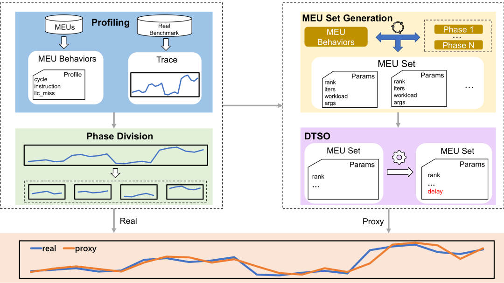PaTGen 方法总览

**图1.** PaTGen 方法总览。该方法以真实工作负载和 MEU 的性能 trace 为输入，经过阶段划分、MEU 集合生成和 DTSO 优化，最终生成同时保持整体相似性与时间相似性的代理基准。

### 1\. 引言

云计算系统的性能评估通常依赖基准测试。CloudSuite、SPEC Cloud IaaS、HiBench、BenchBase 等基准套件通过真实应用或真实服务模拟云场景，但这类基准存在一个共性问题：**运行环境复杂、依赖栈庞大、执行开销高** 。当研究者希望在体系结构模拟器、能耗优化平台或大规模配置搜索中反复运行这些负载时，直接执行真实应用往往成本过高。

代理基准（proxy benchmark）因此成为一种实用替代方案。其目标是生成轻量级的合成工作负载，使其在关键微架构指标上尽可能接近真实工作负载。现有方法大多只关注全局统计量，例如平均 CPI、平均 MPKI 或总体缓存行为。但在真实云系统中，工作负载的性能并不是静态不变的：不同阶段可能存在明显的访存高峰、计算密集区间、缓存压力变化以及请求速率波动。

换言之，仅仅让“平均值相似”并不足以支撑真实的系统分析。一个代理基准即使整体 CPI 和 MPKI 接近真实负载，也可能完全无法复现真实负载的阶段结构、瓶颈变化和调频策略响应。因此，本文强调：**时间相似性是高保真代理基准生成中的基础要求** 。

#### 现有方法的主要局限

  * • **忽略时间动态** ：传统方法通常拟合整体统计指标，难以还原性能指标随时间变化的曲线形态。
  * • **组合方式受限** ：串行组合容易形成割裂的人工阶段，并且难以同时匹配多个指标；并行组合则容易得到过于平滑的平均曲线。
  * • **建模空间不足** ：部分方法将模块选择建模为背包问题或线性方程组，限制了 MEU 在时间和资源维度上的灵活组合。
  * • **下游任务失真** ：当时间相似性不足时，代理基准可能在瓶颈识别、阶段分类或 DVFS 策略选择中给出与真实负载不同的结论。

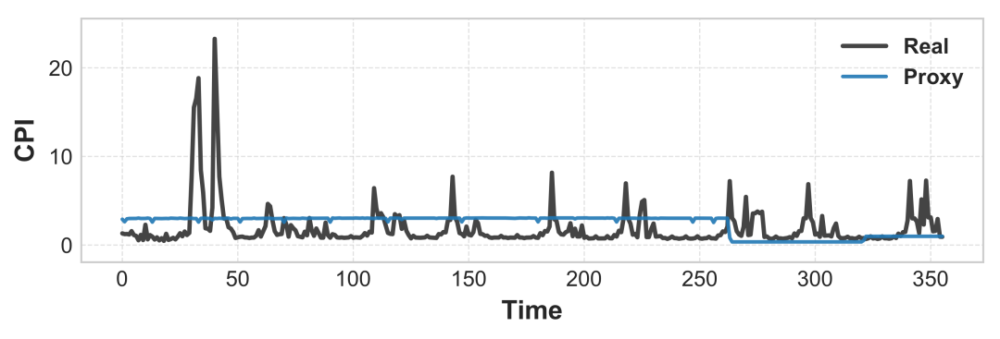

\(a\) CPI 曲线

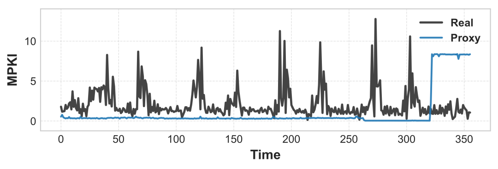

\(b\) MPKI 曲线

**图2.** 串行组合代码块的局限。串行方式会在代理基准中形成明显的分段结构，难以同时匹配真实负载在 CPI 和 MPKI 上的动态变化。

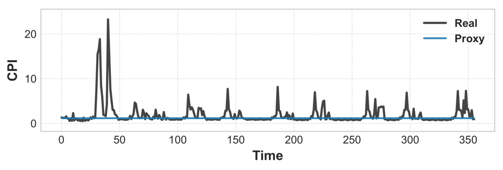

\(a\) CPI 曲线

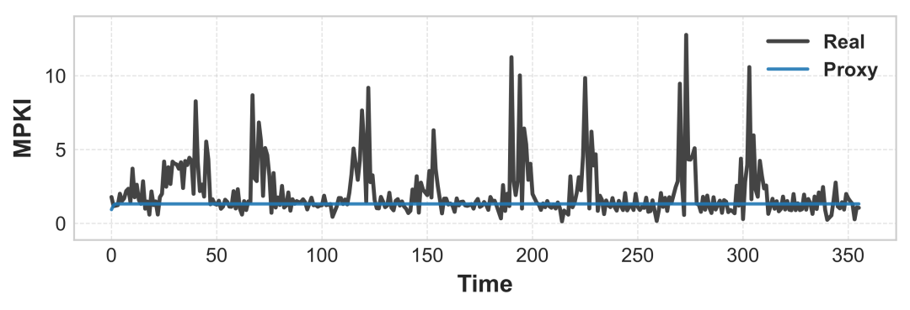

\(b\) MPKI 曲线

**图3.** 并行组合代码块的局限。并行方式虽然有助于拟合整体平均指标，但容易生成过于平滑的性能曲线，无法保留真实工作负载中的时间波动。

基于上述动机，本文提出 **PaTGen** ，一个面向云工作负载的阶段感知代理基准生成框架。PaTGen 通过将真实 trace 划分为相对稳定的执行阶段，并为每个阶段独立生成 MEU 集合，再通过 DTSO 调整 MEU 的启动延迟，从而在保持整体统计相似性的同时尽可能复现细粒度时间动态。

总结而言，**本文的贡献** 如下：

  1. 1\. 提出 **PaTGen** ：一种阶段感知的云工作负载代理基准生成方法，由 profiling、阶段划分、MEU 集合生成和 DTSO 四个阶段组成，能够联合建模多个微架构指标。
  2. 2\. 提出 **DTSO** ：将 MEU 的启动延迟建模为整数变量，通过遗传算法优化点级误差、曲线形状一致性和时间顺序一致性，从而改善阶段内部的时间相似性。
  3. 3\. 完成系统实验验证：基于 CloudSuite、HiBench 和 BenchBase 的 15 个真实云工作负载，证明 PaTGen 在整体相似性、时间相似性、可扩展性、跨架构泛化以及下游任务一致性方面均具有优势。

### 2\. PaTGen 方法设计

PaTGen 的核心思想是：**先识别真实工作负载的阶段结构，再为每个阶段生成符合其性能特征的 MEU 组合，最后通过延迟优化重构阶段内部的时间波动** 。整个流程可以划分为四个关键步骤。

#### 2.1 微执行单元 MEU 设计

在 PaTGen 中，MEU 是由 C 或汇编指令构成的小型执行单元。不同 MEU 具有不同的性能特征，例如计算密集型、访存密集型或混合型。每个 MEU 由两类信息描述：

类型| 名称| 含义  
---|---|---  
输入参数| rank| 使用的线程数  
输入参数| iters| 迭代次数  
输入参数| workload| MEU 类型  
输入参数| args| 类型相关参数，例如访存 stride  
性能指标| cycles| 执行周期数  
性能指标| instructions| 指令数  
性能指标| llc\_misses| 末级缓存缺失数  
性能指标| duration| 执行时间  
  
PaTGen 主要关注两个在云数据中心 trace 中常见且关键的微架构指标：

其中 CPI 反映指令执行效率，MPKI 反映缓存和内存访问压力。通过组合不同 MEU，PaTGen 能够模拟真实工作负载在计算、访存和缓存行为上的复杂表现。

#### 2.2 阶段划分

真实云工作负载通常由多个执行阶段组成。例如数据库负载可能经历预热、稳定请求处理和突发事务阶段；大数据任务可能经历读取、shuffle、计算和写回阶段。PaTGen 将真实工作负载的性能时间序列划分为多个相对稳定的阶段，使每个阶段内部的性能指标更容易被 MEU 组合拟合。

具体而言，PaTGen 将 CPI、MPKI 等多维性能序列标准化后，使用基于 RBF cost 的 PELT（Pruned Exact Linear Time）变化点检测算法进行多变量阶段划分，并设置最小阶段长度以避免过度切分。

该步骤的意义在于：如果每个阶段内部的性能相对稳定，那么在阶段级别拟合整体指标就能更自然地保留时间结构；对于阶段内部仍存在的短期波动，则交由后续 DTSO 进一步优化。

#### 2.3 MEU 集合生成

阶段划分完成后，PaTGen 需要为每个阶段生成一个 MEU 集合，使其在目标阶段的 CPI、MPKI 和执行时间上尽可能接近真实负载。

PaTGen 将该问题建模为带资源约束的非线性优化问题。对于每个 MEU，方法引入两个缩放因素：

  * • **时间对齐向量 T** ：用于将 MEU 执行时间对齐到目标阶段长度。
  * • **指标缩放向量 C** ：用于调整 MEU 对 cycles、instructions、LLC misses 等指标的贡献。

目标函数最小化代理基准指标与目标指标之间的相对误差，同时约束 MEU 使用的 CPU 核数不超过可用资源。求解完成后，PaTGen 会根据缩放结果调整 MEU 的线程数、迭代次数和执行时间，并筛选出最终参与合成的 MEU 集合。

这一设计相比传统方法有两个优势：一方面，它同时建模 CPI 和 MPKI 等多个指标；另一方面，它允许 MEU 以更灵活的比例和并行方式组合，扩大了代理基准生成的可行解空间。

#### 2.4 DTSO：基于延迟的时间相似性优化

仅在阶段级别匹配平均指标仍然不足以复现真实负载的短期波动。为此，PaTGen 提出 **DTSO** ，通过优化每个 MEU 的启动延迟来改变 MEU 在时间轴上的重叠关系，从而塑造更接近真实负载的性能曲线。

DTSO 将每个 MEU 的启动时间表示为一个非负整数变量。给定目标性能序列：

DTSO 在每个时间点计算当前活跃 MEU 的 aggregate cycles、instructions 和 LLC misses，进而得到代理基准的 CPI\(t\) 和 MPKI\(t\)。为了使生成序列接近真实序列，DTSO 同时优化三类目标：

  1. 1\. **点级误差** ：约束每个时间点上的 CPI、MPKI 相对误差。
  2. 2\. **曲线形状一致性** ：约束相邻时间点的一阶变化量，使曲线波动形态更接近真实负载。
  3. 3\. **时间顺序一致性** ：约束指标上升或下降方向，减少趋势相反的情况。

由于该问题涉及离散延迟变量、MEU 重叠执行和非线性比值计算，目标函数非凸且不可微。PaTGen 因此采用遗传算法进行搜索。实验中，遗传算法使用 20 的种群规模、50 代迭代、0.81 的交叉概率和 0.37 的变异概率，能够在可接受开销内稳定收敛。

### 3\. 实验设计

#### 3.1 实验环境

实验主要在 Ubuntu 22.04 环境下进行，硬件平台为 Huawei KunPeng 920 处理器（96 核）和 256GB 内存。代理基准使用 GCC 10 编译，并通过 `-O0` 关闭编译器优化，以避免编译器改写影响性能指标采集。微架构指标通过 Linux `perf` 工具采集。

此外，论文还在 Intel Xeon Gold 6248 x86 服务器上进行了跨架构泛化实验，以验证 PaTGen 不依赖特定硬件平台。

#### 3.2 对比方法

本文选取四类具有代表性的代理基准生成方法作为对比：

  * • **CloudMix** ：将工作负载块组合建模为背包问题，通过动态规划选择可复用工作负载块。
  * • **Linear** ：通过求解线性方程组组合基本代码块，使代理基准匹配目标性能指标。
  * • **Siesta** ：面向 MPI/HPC 代理应用合成的方法，本文抽取其计算代理合成模块用于对比。
  * • **BEMAP** ：通过高维性能特征聚类选择代表性 benchmark 子集。

为了公平比较，本文将这些方法适配到统一的 trace-driven 合成框架中，并用它们替换 PaTGen 的 MEU 集合生成部分。由于 DTSO 与这些方法的问题建模并不兼容，因此不对 baseline 额外加入 DTSO。

#### 3.3 真实工作负载

实验共覆盖 15 个真实云工作负载，来自 CloudSuite、HiBench 和 BenchBase 三个基准套件。

套件| 工作负载| 描述  
---|---|---  
CloudSuite| In-memory Analytics| 内存分析处理  
CloudSuite| Web Search| 延迟敏感搜索服务  
CloudSuite| PageRank| 迭代图计算  
CloudSuite| Connected Components| 图连通性分析  
CloudSuite| Triangle Count| 图模式计数  
HiBench| WordCount| 文本处理  
HiBench| TeraSort| 大规模排序  
HiBench| KMeans| 迭代聚类  
HiBench| Join| 关系连接处理  
HiBench| XGBoost| 梯度提升训练  
HiBench| NutchIndexing| 搜索索引构建  
BenchBase| TPC-C| OLTP 事务处理  
BenchBase| TPC-H| 分析查询处理  
BenchBase| Twitter| 社交网络负载  
BenchBase| YCSB| 键值存储基准  
  
#### 3.4 评估指标

实验从两类指标评价代理基准质量。

第一类是 **整体相似性** ，使用 Similarity Score（SS）衡量代理基准与真实工作负载在整体 CPI 和 MPKI 上的接近程度：

第二类是 **时间相似性** ，包括 MSE、Pearson、Spearman、NMSE、MDTW 和 RS 等指标。其中，MSE/NMSE 越低越好，Pearson/Spearman/RS 越高越好，MDTW 越低表示多维时间序列对齐距离越小。

指标| 含义| 趋势  
---|---|---  
MSE| 单指标均方误差| 越低越好  
Pearson| 线性相关系数| 越高越好  
Spearman| 秩相关系数| 越高越好  
NMSE| 多指标归一化均方误差| 越低越好  
MDTW| 多变量动态时间规整距离| 越低越好  
RS| 表征分数，综合普适性与多样性| 越高越好  
  
### 4\. 主要实验结果

#### 4.1 PaTGen 在保持整体相似性的同时显著改善时间相似性

实验首先比较不同方法在阶段级和整体级的全局相似性。结果显示，PaTGen 的阶段级 CPI 相似度为 **0.9534** ，MPKI 相似度为 **0.9645** ；整体 CPI 相似度为 **0.9701** ，整体 MPKI 相似度为 **0.9751** 。这说明 PaTGen 虽然重点优化时间相似性，但并没有牺牲整体统计指标的拟合能力。

方法| 阶段级 SS\_CPI| 阶段级 SS\_MPKI| 整体 SS\_CPI| 整体 SS\_MPKI  
---|---|---|---|---  
Linear| 0.9519| 0.9491| 0.9180| 0.9233  
CloudMix| 0.9164| 0.9531| 0.9394| 0.9800  
Siesta| 0.9417| 0.8849| 0.8748| 0.8416  
BEMAP| 0.8220| 0.7172| 0.8563| 0.7802  
**PaTGen**| **0.9534**| **0.9645**| **0.9701**| **0.9751**  
  
在时间相似性方面，PaTGen 在所有关键指标上均取得最优表现：CPI MSE 降至 **0.4232** ，MPKI MSE 降至 **0.8452** ，多指标 NMSE 降至 **0.2599** ，MDTW 降至 **154** ，RS 达到 **0.9957** 。这表明 PaTGen 不仅能匹配均值，还能更好地复现真实负载曲线的波动趋势和多指标联合结构。

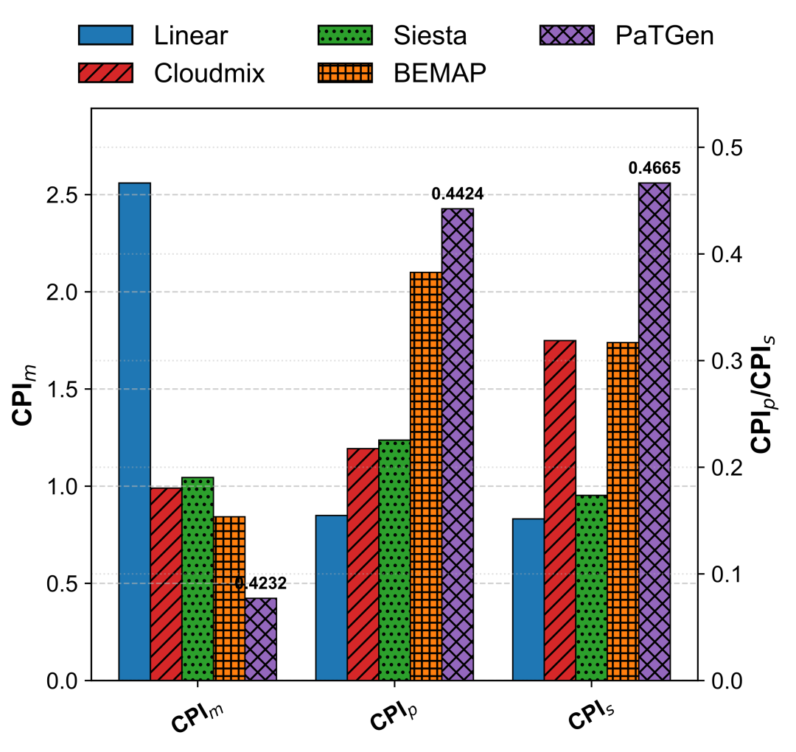

\(a\) CPI 指标

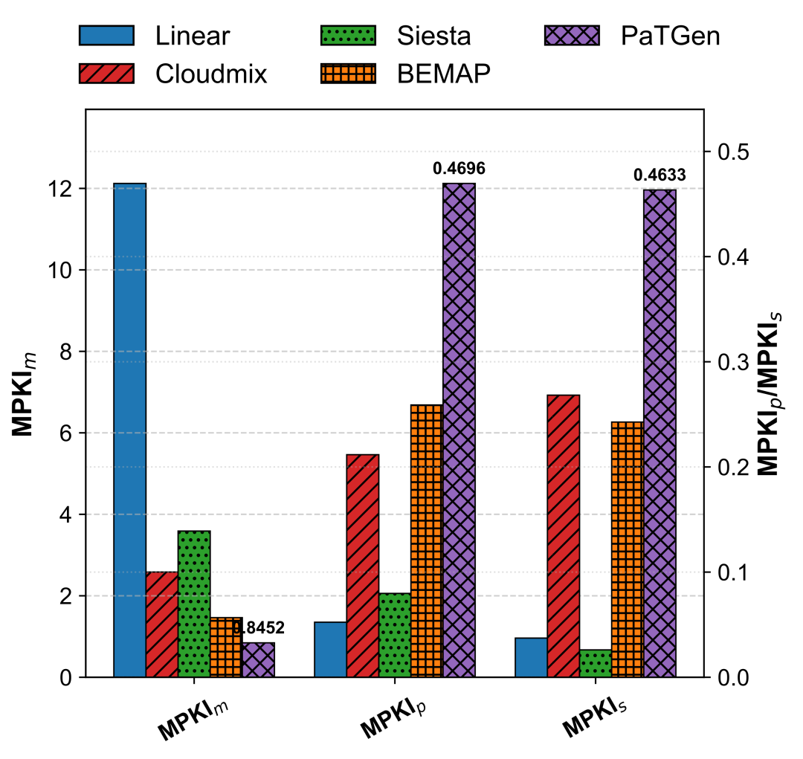

\(b\) MPKI 指标

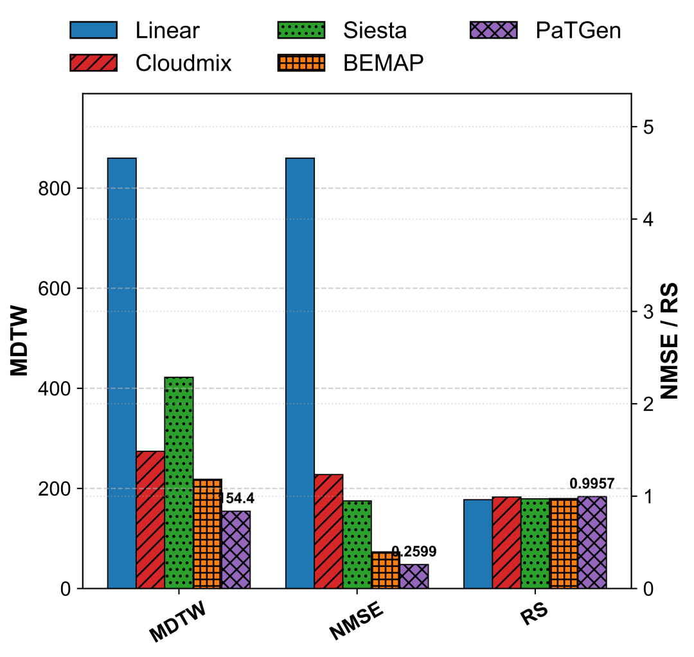

\(c\) 联合指标

**图4.** 不同方法的时间相似性对比。PaTGen 在 CPI、MPKI 以及多指标联合评价中均优于现有方法。

#### 4.2 阶段划分有助于捕获工作负载动态

为了验证阶段划分的作用，论文比较了不进行阶段划分的 **1Phase** 设置和采用 PaTGen 阶段划分的 **Window** 设置。

结果显示，1Phase 的整体 SS 略高，但 Window 在时间相似性上明显更优。例如，CPI MSE 从 0.6358 降至 **0.4232** ，CPI Pearson 从 0.2013 提升至 **0.4424** ，CPI Spearman 从 0.0700 提升至 **0.4665** ；多指标 NMSE 从 0.2941 降至 **0.2599** ，MDTW 从 198 降至 **154** ，RS 从 0.9730 提升至 **0.9957** 。

方法| SS\_CPI| SS\_MPKI| CPI m/p/s| MPKI m/p/s| NMSE/MDTW/RS  
---|---|---|---|---|---  
1Phase| 0.9758| 0.9823| 0.6358 / 0.2013 / 0.0700| 1.0581 / 0.3593 / 0.2913| 0.2941 / 198 / 0.9730  
**Window**| **0.9701**| **0.9751**| **0.4232 / 0.4424 / 0.4665**| **0.8452 / 0.4696 / 0.4633**| **0.2599 / 154 / 0.9957**  
  
这一结果说明：整体平均指标并不能充分刻画工作负载行为，阶段结构对于复现真实 trace 的动态变化至关重要。

#### 4.3 DTSO 显著改善阶段内部时间波动

论文进一步通过消融实验验证 DTSO 的作用。相比移除 DTSO 的 Non-DTSO 版本，完整 DTSO 版本在 CPI、MPKI 以及多指标时间相似性上均取得显著提升。

方法| CPI m/p/s| MPKI m/p/s| NMSE/MDTW/RS  
---|---|---|---  
Non-DTSO| 0.7864 / 0.2607 / 0.3308| 1.2367 / 0.2432 / 0.2138| 0.4217 / 219 / 0.9631  
**DTSO**| **0.4232 / 0.4424 / 0.4665**| **0.8452 / 0.4696 / 0.4633**| **0.2599 / 154 / 0.9957**  
  
DTSO 的核心价值在于，它不是简单改变 MEU 的数量或类型，而是改变 MEU 的时间重叠方式。通过错峰启动不同 MEU，PaTGen 能够生成更丰富的阶段内部波动，从而更接近真实云工作负载。

#### 4.4 生成开销可控，并可扩展到更长负载

在平均执行时间为 278 秒的 15 个真实负载上，PaTGen 的平均代理生成时间为 **68.51 秒** 。其中，DTSO 占据主要开销，约 **67.31 秒（98.25%）** ；MEU 阶段仅需 **1.19 秒（1.74%）** 。

组件| 时间（秒）| 占比  
---|---|---  
MEU| 1.19| 1.74%  
DTSO| 67.31| 98.25%  
Other| 0.01| 0.01%  
**Total**| **68.51**| **100.00%**  
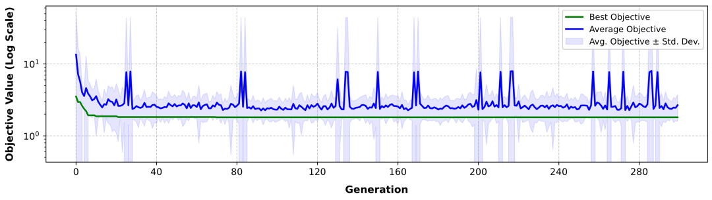 DTSO 收敛曲线

**图5.** DTSO 收敛曲线。实验中遗传算法在 50 代内可以稳定收敛，从而在优化质量与生成开销之间取得平衡。

为了验证可扩展性，论文将 YCSB trace 从 628 秒扩展到 1944 秒和 4148 秒。结果表明，随着工作负载长度增加，PaTGen 仍能保持较高的整体和时间相似性。生成开销并不与 trace 长度线性增长，而主要取决于阶段数量和 DTSO 搜索复杂度。

长度（秒）| SS\_CPI| SS\_MPKI| CPI m/p/s| MPKI m/p/s| NMSE/MDTW/RS| 开销（秒）  
---|---|---|---|---|---|---  
628| 0.9934| 0.9551| 0.16 / 0.71 / 0.75| 0.41 / 0.76 / 0.76| 0.15 / 315 / 0.9998| 66  
1944| 0.9901| 0.9441| 0.22 / 0.68 / 0.76| 0.44 / 0.70 / 0.74| 0.19 / 1075 / 0.9965| 70  
4148| 0.9836| 0.9662| 0.12 / 0.79 / 0.80| 0.32 / 0.79 / 0.78| 0.07 / 1940 / 0.9985| 117  
  
#### 4.5 PaTGen 具有跨架构泛化能力

除 ARM 平台外，论文还在 Intel Xeon Gold 6248 x86 平台上评估 PaTGen。结果显示，PaTGen 在 x86 平台上仍获得最高的整体相似性：SS\_CPI 为 **0.9535** ，SS\_MPKI 为 **0.9748** 。在时间相似性上，PaTGen 也整体优于 baseline，说明该方法并不依赖某一特定硬件架构。

方法| SS\_CPI| SS\_MPKI| CPI m/p/s| MPKI m/p/s| NMSE/MDTW/RS  
---|---|---|---|---|---  
Linear| 0.9356| 0.8626| 2.9695 / 0.1302 / 0.1456| 13.13 / 0.0766 / 0.0920| 11.24 / 825 / 0.9895  
CloudMix| 0.8951| 0.9201| 0.4488 / 0.3211 / 0.2891| 2.0925 / 0.2201 / 0.2537| 1.3656 / 259 / 0.9816  
BEMAP| 0.6586| 0.6431| 0.3679 / -0.0928 / -0.0550| 2.0739 / 0.3673 / 0.3366| 1.6930 / 260 / 0.9732  
Siesta| 0.8440| 0.8619| 3.3784 / 0.1018 / 0.0926| 12.8446 / 0.0919 / 0.0900| 9.8243 / 837 / 0.9831  
**PaTGen**| **0.9535**| **0.9748**| **0.3363 / 0.4476 / 0.4556**| **2.0729 / 0.3985 / 0.4316**| **0.8477 / 259 / 0.9895**  
  
###  5\. 下游任务分析：为什么时间相似性重要？

论文最重要的洞察之一是：时间相似性不仅是曲线层面的指标改进，更会影响真实的系统分析和优化决策。为此，作者设计了四类下游任务来验证代理基准是否能复现真实负载的结论。

#### 5.1 阶段划分一致性

该任务评估代理基准是否保留真实负载的阶段结构。方法对真实 trace 和代理 trace 分别执行阶段划分，并比较时间线上任意两个时间点是否被划分到相同阶段。PaTGen 在 15 个真实负载上的平均 Division 得分达到 **0.8907** ，显著高于 Linear 和 CloudMix。

#### 5.2 瓶颈识别一致性

该任务根据 CPI、MPKI 等指标对每个阶段进行瓶颈类型标注，并比较代理基准与真实负载的瓶颈标签是否一致。PaTGen 的 Bottleneck 得分达到 **1.0000** ，说明它能够准确复现真实负载的阶段级瓶颈。

#### 5.3 阶段分类一致性

该任务使用真实负载的阶段级指标进行 K-means 聚类，再将代理基准阶段映射到相同聚类中心，比较阶段类别是否一致。PaTGen 的 Classification 得分达到 **0.9502** ，说明其不仅复现了数值曲线，还保留了阶段行为模式。

#### 5.4 DVFS Governor 排序一致性

该任务用于验证代理基准是否能支持实际优化决策。论文使用 Energy-Delay Product（EDP）作为目标，对 Linux 中的 `performance`、`powersave`、`schedutil`、`ondemand` 和 `conservative` 五种 DVFS governor 进行排序，并比较代理基准和真实负载得到的排序是否一致。

PaTGen 的 Kendall's τ 达到 **0.8000** ，Top-1 Hit Rate 达到 **1.0000** ，即代理基准选择出的最优 governor 与真实负载完全一致。相比之下，Linear 的 Top-1 命中率为 0，CloudMix 也只有 0.2。

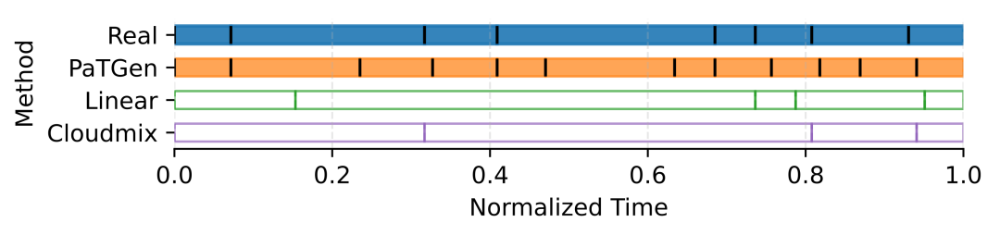YCSB 阶段划分案例

**图6.** YCSB 阶段划分案例。黑色线段表示阶段边界，PaTGen 生成的代理 trace 在视觉上最接近真实负载的阶段结构。

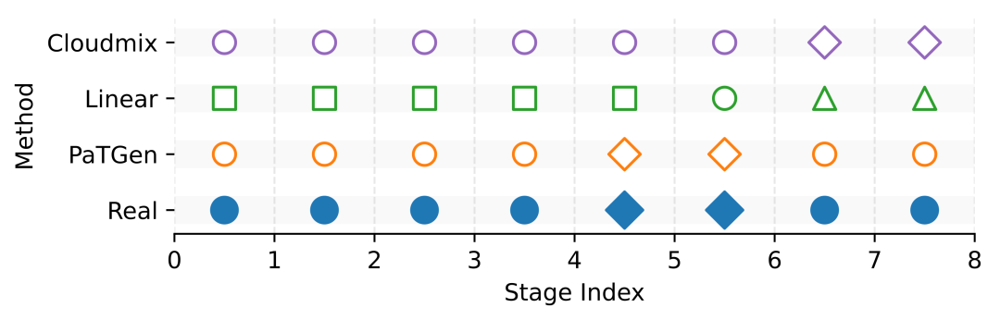

\(a\) 瓶颈识别任务

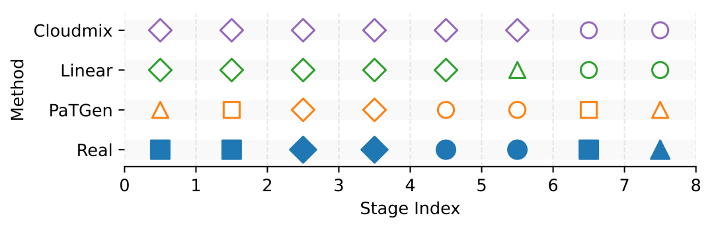

\(b\) 阶段分类任务

**图7.** YCSB 下游任务案例。相同形状表示相同瓶颈类型或阶段类别，PaTGen 在瓶颈识别和阶段分类上与真实负载最一致。

方法| Division| Bottleneck| Classification| Kendall's τ| Top-1 Hit Rate  
---|---|---|---|---|---  
Linear| 0.7252| 0.2454| 0.4964| 0.0000| 0.0000  
CloudMix| 0.6314| 0.7181| 0.5358| 0.6400| 0.2000  
**PaTGen**| **0.8907**| **1.0000**| **0.9502**| **0.8000**| **1.0000**  
  
这些结果清晰说明：当代理基准用于体系结构分析、瓶颈定位或能耗优化时，时间相似性会直接影响结论可靠性。仅靠整体平均指标，很难保证代理基准在真实下游任务中作出正确判断。

### 6\. 讨论

#### 6.1 从“平均值相似”到“行为过程相似”

传统代理基准生成方法常将目标定义为拟合整体统计指标。但云工作负载往往包含复杂的动态过程，平均值只能描述结果，无法描述过程。PaTGen 的核心价值在于将评价目标从“统计均值相似”推进到“执行过程相似”。这对于缓存行为模拟、能耗管理、调频策略选择和阶段级优化尤其重要。

#### 6.2 阶段划分与 DTSO 的互补关系

PaTGen 中阶段划分和 DTSO 不是替代关系，而是互补关系。阶段划分负责处理宏观时间结构，将复杂 trace 分解为更容易拟合的局部片段；DTSO 则负责处理阶段内部的细粒度波动，通过调整 MEU 启动延迟来塑造更真实的曲线形态。

消融实验表明，缺少阶段划分会削弱宏观动态建模能力；缺少 DTSO 则会导致阶段内部波动不足。因此，二者共同构成 PaTGen 时间相似性优势的关键来源。

#### 6.3 生成开销与优化质量之间的权衡

PaTGen 的主要开销来自 DTSO 中的遗传算法搜索。虽然相比 CloudMix 和 BEMAP 这类轻量方法开销更高，但与真实负载执行、迭代式代理生成和设计空间探索成本相比，PaTGen 的 68.51 秒平均生成时间仍然处于可接受范围。更重要的是，其生成的代理基准在下游任务中具有更强的一致性，这使额外优化开销具备实际价值。

### 结论

本文提出 **PaTGen** ，一种面向云工作负载的阶段感知代理基准生成方法。PaTGen 通过 MEU 抽象不同性能特征，利用阶段划分捕获真实工作负载的宏观时间结构，再通过 DTSO 调整 MEU 启动延迟以复现阶段内部波动，从而同时保持整体相似性与时间相似性。

在 15 个来自 CloudSuite、HiBench 和 BenchBase 的真实工作负载上，PaTGen 实现了超过 97% 的整体相似性，并在多项时间相似性指标上显著优于现有方法。进一步的消融实验、长负载扩展实验和 x86 跨架构实验验证了方法的有效性、可扩展性和泛化能力。下游任务结果则进一步证明，保持时间相似性对于代理基准真实反映工作负载行为、支撑系统分析与优化决策具有基础性意义。

  

**先进计算体系结构团队（ACAT）**  
**Advanced Computing Architecture Team**

📌 **团队概况** ：先进计算体系结构团队（Advanced Computing Architecture Team, ACAT）前身为2005年成立的“华南理工大学计算机系统结构”研究所，团队长期致力于云计算、绿色计算、大数据、人工智能等方向的下一代计算支撑技术，提供面向复杂应用需求的高效、智能和可持续的创新计算解决方案。

🔬**研究方向** ： 云计算与算力优化.数据中心能效优化.AI与大模型应用技术.时序预测建模与应用.物联网与边缘智能. 

🧩 **实验室开源主页：** https://github.com/ACAT-SCUT

（长按识别图中二维码进入实验室主页）

  

撰稿人：尹浩朗（硕士生）  
时间：2026 年 06 月 01 日