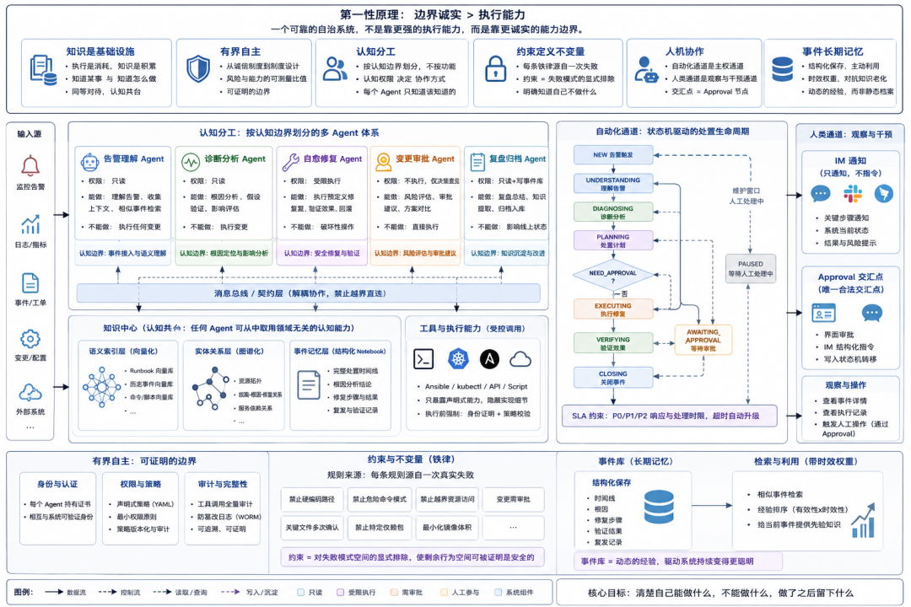

# 当我们在构建 AIOps 平台时，我们究竟在构建什么

# 当我们打算将AI Agents引入运维体系时，我们需要关注什么

> 这不是一篇教你"怎么用 LLM 做运维自动化"的教程。这是一篇关于**一个复杂系统背后的思考方式** 的文章。
> 
> 本文基于当前正在构建的一个AI智能运维底座构建（本底座尚未开源，本公众号前期开源的dbexplain工具是这个底座的一部分内容）

* * *

  

过去一段时间，我们在做一件不算新鲜但极难做对的事：用 AI Agent 替代或辅助人工处理生产环境的运维故障。

告警进来，诊断，修复，复盘，归档。这条链路听起来简单，实际上藏着大量难以言说的判断——哪些操作是安全的，哪些需要人盯着，历史上同类故障是怎么处理的，这次的上下文和上次有什么不同。把这些判断装进一个系统，是我们一直在做的事。

这个过程中我们走了很多弯路，也逐渐想清楚了一些事。这篇文章想把那些想清楚的部分写出来，不是技术方案，是实践过程中沉淀的**认知框架** ——在构建一个多 Agent 的自治系统时，哪些判断是根本性的，哪些只是实现细节。

* * *

## 一、知识是基础设施，不是附属品

大多数运维自动化系统的核心产品是"执行"——触发 Ansible、调用 kubectl、重启服务。知识（Runbook、历史故障记录、处置流程）是附属的文档，存在某个 Wiki 里，靠人去翻。

我们一开始也是这么想的。后来发现这个方向根本上是错的。

**执行是消耗，知识是积累。**

一个系统在第一天的自动化率可能是 30%，在第三年应该是 70%。这个增长不来自代码变得更聪明，而来自知识的沉淀。每一次故障处理完毕，处置思路、根因分析、有效命令，都应该成为下一次类似故障的先验知识。如果这件事没有被架构性地支撑，系统永远在第一天。

所以我们把知识存储作为一等公民来设计：向量化的语义索引、图谱化的实体关系（"这个节点上发生过哪些故障，每次怎么修的，有没有规律"）、结构化的事件 Notebook。这三层不是审计日志，是**可检索的机构记忆** 。

后来我们还在想清楚一件事：知识分两种。**  
**

  * **知道某事（knowing that）** ——这个告警通常意味着什么；**  
**

  * **知道怎么做（knowing how）** ——怎么写一个清理脚本，怎么生成一份根因分析报告。

这两种知识在架构上应该被同等对待，都是可复用的认知资源，而不是"业务能力"和"工具"的区分。

这个认识让我们对"知识中心"这个概念的理解变了：它不只是一个故障知识仓库，而是整个平台的**认知基座** ——任何 Agent、任何工作流都可以从这里取用领域无关的认知能力。

* * *

## 二、有界自主：从"软隔离"到"可证明的边界"

自治系统最危险的地方不是它不够聪明，而是它**不知道自己的边界在哪里** 。

我们最早的安全模型是一组正则表达式：`rm -rf /` 拒绝，`kubectl delete` 放行但记录。这个方案能 work，但有一个根本性的问题：边界是"我们声明的"，不是"被强制执行的"。如果有人绕过检查器，系统不知道。

更深的问题是：不同的 Agent 对应不同的权限级别——有些 Agent 只应该读数据，有些 Agent 可以执行修复，只有一个 Agent 可以执行破坏性操作。这个差异靠代码里的字符串来表达，是信任，不是证明。

那么，下一步就是**把边界从自我声明变成密码学证明** 。每个 Agent 拿着一张由系统颁发的身份证书，工具调用前必须出示。策略从硬编码的正则变成声明式的 YAML 规则，策略变更不需要改代码，审计日志是防篡改的。

这个升级背后的哲学变化很重要：**从"诚信制度"到"制度设计"** 。一个好的系统不应该依赖参与者的自律，应该让越界行为在结构上难以发生。

但我们也清醒地认识到：有界自主的目标不是零风险，而是**风险与能力的可测量比值** 。真正的进步不是"我们更安全了"这种感觉，而是"我们能回答'有多安全'这个问题"——有合规证据，有决策记录，有可审计的边界定义。

* * *

## 三、分工的依据是认知权限，不是代码模块

多 Agent 系统有很多种设计方式。最直觉的是"按功能拆分"——一个 Agent 管告警，一个管诊断，一个管修复。这听起来合理，但背后的逻辑其实是微服务的翻版，把 Agent 当成了带 LLM 的函数。

我们走了另一条路：**按认知边界划分，不按功能划分** 。

区别在哪里？功能划分问的是"这个 Agent 做什么"，认知边界划分问的是"这个 Agent 被允许知道什么、被允许影响什么"。前者是描述性的，后者是规范性的。

举个具体例子：负责自愈修复的 Agent 拥有执行 Ansible 的权限，负责告警处理的 Agent 只有读取权限。这不是因为它们的代码不同，而是因为它们在整个系统里的**认知角色** 不同。把权限约束做进 Agent 的定义里，而不是做进调用链的检查逻辑里，这两件事的可靠性差距是很大的。

这个设计有明显的优点：系统的每个部分都是可独立验证的，新增一个业务域只需要定义它的认知边界和权限级别，不需要改动其他部分。

也有真实的代价：没有任何一个 Agent 持有 Incident 的完整视图，上下文被分散在多个 Agent 的推理过程里。这个碎片化只能靠消息契约来弥合，对 P0 级别的响应时延有直接影响。

更深的风险是**边界腐化** 。随着系统迭代，最容易发生的退化是：某个 Agent 为了"方便"开始绕过消息总线直接调用另一个 Agent。一旦直连出现，认知边界就开始溃散。这个风险靠架构决策文档和代码审查来防——是人的纪律，不是技术手段。

适应性的底线是：这个模式要求问题域可以被清晰分区。运维恰好满足这个条件。如果未来某个新能力跨越多个现有认知域，需要认真判断它是一个新 Agent 还是现有 Agent 的新技能——这个判断本身就是架构思考。

* * *

## 四、约束定义不变量，不变量决定可信度

我们系统里有一份文档，列着几十条"铁律"，定义了系统不做什么事。禁止硬编码路径，禁止某类包依赖，关键配置文件的修改需要多次确认……

这些规则看起来像是编码规范，实际上是完全不同的东西。

**每一条铁律背后都有一个已经发生过的失败。** 绝对路径问题在系统演进记录里有十几条修复记录，在它们被写成铁律之前，它们是重复犯过的错误。禁止某些依赖包，是因为引入过一次导致镜像里多了几十个不必要的子包。规则是从失败里归纳的定理，不是先验的规范。

更准确的表述是：**约束是对失败模式空间的显式排除。**

一个复杂系统的行为空间是指数级的，绝大多数路径是安全的，少数路径通向灾难。约束不是在限制"好的行为"，而是在封堵通向灾难的路径，使剩余的行为空间在工程上可以被证明是安全的。

这个视角下，约束越完整，系统越可预测，可预测性越高，系统越值得信赖。**一个系统的成熟度，不体现在它能做多少事，而体现在它明确知道自己不做什么。**

有一个推论值得注意：约束文档是新成员理解系统的最短路径。读懂了"为什么不能这样做"，比读懂"这段代码做了什么"要深刻得多。

* * *

## 五、人机协作的本质是定义交汇点

这是我们想得最久、改得最多的部分。

最开始的设计是：AI 自动处理，处理不了的推给人。这个思路有一个隐含假设——人是自动化的兜底，是失败情况下的备选方案。

后来我们觉得这个假设是错的。**人不是备选方案，人有特定的介入时机** 。

对这个问题想清楚之后，架构变了很多。

**自动化通道是主权通道 。** Incident 的生命周期由一个状态机驱动，从告警触发到诊断、处置、验证、关闭，每一步的转移都是自动的，不等待人的输入。状态机有完整的 SLA 约束——P0 事件多少分钟内必须完成初步响应，P1 事件多少分钟内必须完成诊断分配，超时则自动升级。这把"有没有及时响应"从主观判断变成了客观数据。

**人类通道是观察与干预通道 。** IM 群里的消息是通知，不是指令。告警进来，系统自动处置，IM 群收到每个关键步骤的通知，让运维工程师知道系统在做什么。但 IM 消息本身不触发任何 AI 重新处理——这个决策解决了一个真实问题：在一个已经有自动化流程在跑的系统里，如果人工消息也触发 LLM 处理，相当于让两套并行的决策机制同时对同一个问题做出反应，结果往往比只有一套更混乱。

**Approval 节点是唯一的合法交汇点 。** 有些操作——破坏性的修复、涉及多个系统的变更——需要人的判断。这些操作被放在状态机的 Approval 节点上，自动化流程走到这里会暂停，等待审批。审批可以来自界面上的按钮，也可以来自 IM 群里的结构化指令，但两种方式最终都写入同一个状态机转移，状态机是唯一的仲裁者。**通道是多入口的，权威是单一的。**

这个架构还有一个细节值得说：状态机增加了 PAUSED 状态，用于维护窗口期间的显式等待。这个状态解决了一个微妙的问题：系统之前不知道"人类现在在处理，请等待"和"没有输入进来，可能发生了什么问题"的区别，两种情况都会触发超时升级。加入 PAUSED 之后，系统有了对人类时间节奏的感知——这不只是一个状态，是自动化系统学会尊重人类工作节奏的一步。

* * *

## 六、事件记录是系统的长期记忆

有一个经常被忽视的设计：每一次 Incident 的完整处置记录，应该被结构化地保存下来，成为可检索的事件库。

这不是审计日志——审计日志是为了追责。事件库是为了**让系统变得更聪明** 。

区别在于设计意图。审计日志记录"谁做了什么"，事件库记录"这次故障的根因是什么、用了什么方式修复、修复是否有效、有没有复发"。前者是事后可查的记录，后者是可以被主动利用的知识。

随着时间积累，事件库会面临两个工程问题：检索变慢，以及知识老化。

检索变慢是工程问题，有成熟的解法——列式存储的分区策略、向量索引的近似检索、知识图谱的图遍历。这些是工具，选对了基本可以解决。

知识老化是设计问题，更难。三年前处理同类故障的方式可能已经不适用于今天的系统架构。解法不是删除历史数据，而是让检索具备时效权重：同类事件的处置方式被验证有效的次数越多、距今越近，排序越靠前。这把事件库从静态的档案变成了**动态的经验** 。

* * *

## 最后，第一性原理是什么

把上面这些加在一起，有一个更底层的问题：我们究竟在相信什么？

我们相信：**一个可靠的自治系统，不是靠更强的执行能力，而是靠更诚实的能力边界。**

清楚自己能做什么，不能做什么，做了之后留下了什么——这三件事比"能自动化多少比例的故障"更根本。自动化比例是结果，边界诚实是条件。

这也是为什么在这个系统里，最重要的文件不是任何一段代码，而是那份写着"我们不做什么"的架构约束文档，和那份写着每个 Agent "认知边界与性格"的 SOUL 定义。代码是结果，这两份文档才是原因。

如果只能说一件事：**构建自治系统，先想清楚它的边界，再想它的能力。** 顺序反了，最终都会付出代价。

* * *

 *本文是一次工程实践中的思考整理，欢迎交流。*

