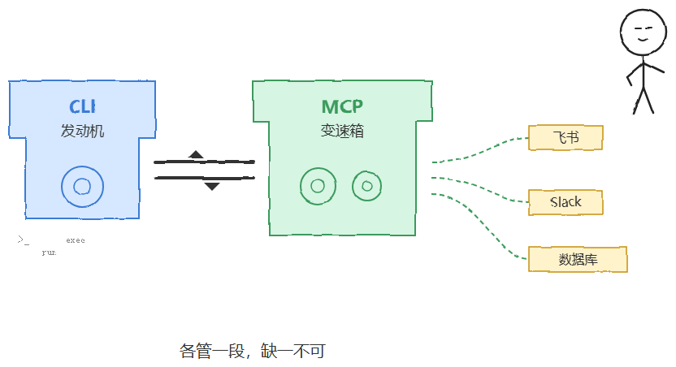
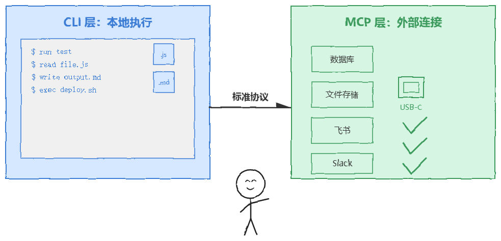
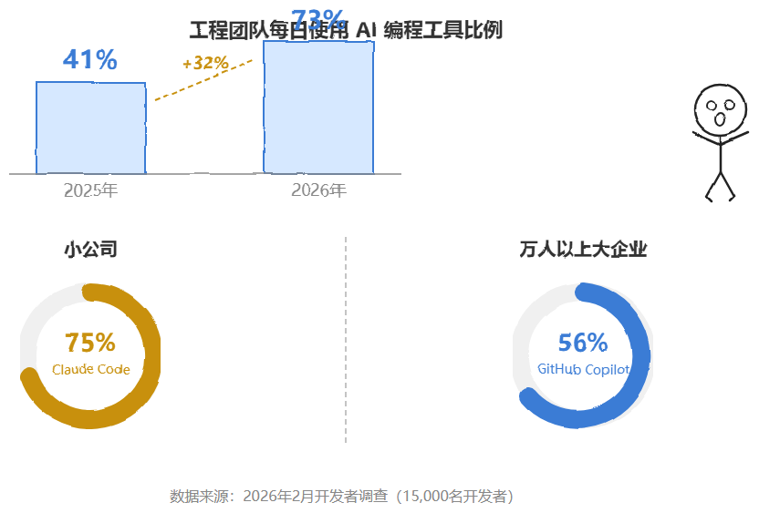
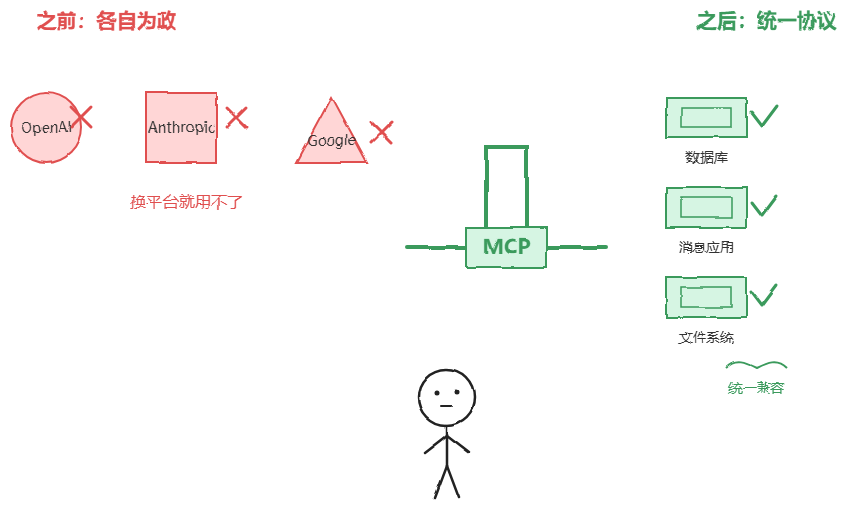
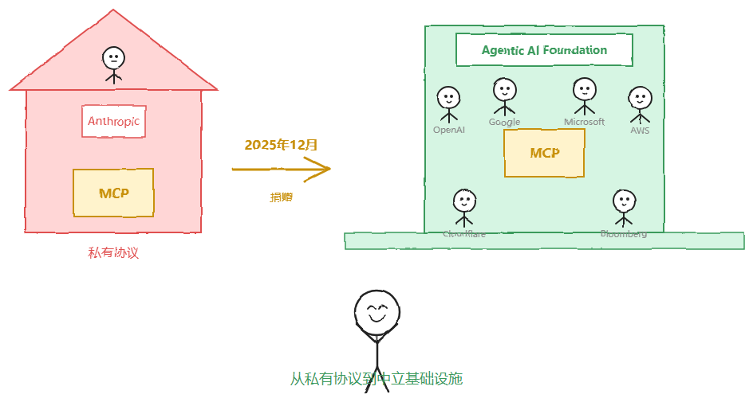
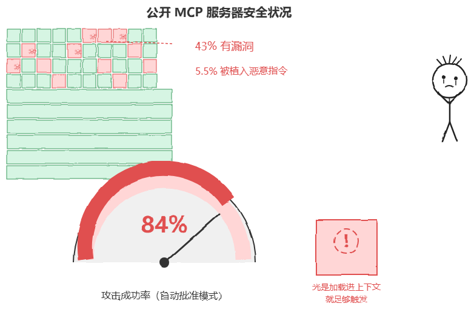
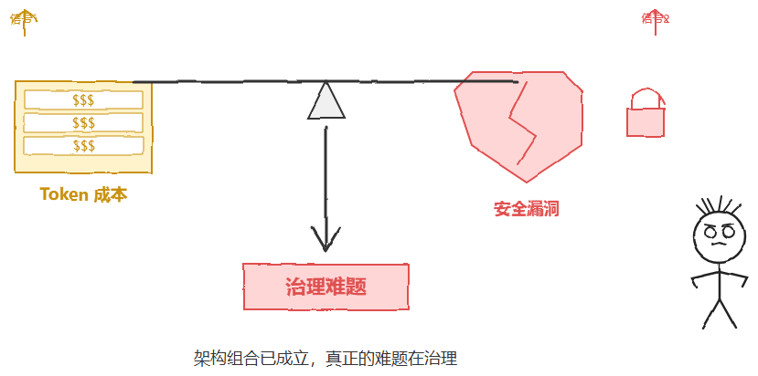

# 京东三面：CLI有什么用，能不能取代MCP？我说：都在用CLI，会将MCP取代掉。面试官让我回去再想清楚

> 原文链接：[京东三面：CLI有什么用，能不能取代MCP？我说：都在用CLI，会将MCP取代掉。面试官让我回去再想清楚](https://mp.weixin.qq.com/s/lIa3iX69pCG91YZ32XKfWw)

上周有个读者去面京东，三面的时候面试官聊到了Agent架构，问了一个看起来很直接的问题："CLI有什么用，能不能取代MCP？"

他当时觉得这题不难，毕竟自己项目里一直在用CLI，也多少了解MCP是个什么东西。他想了想，给了一个自认为稳妥的回答："CLI用得越来越多了，以后应该会把MCP取代掉吧。"面试官听完没说对也没说错，只是笑了一下，说："你回去再想清楚这个问题。"

他回来之后有点懵，跟我说他不知道自己到底哪里答错了。CLI能跑命令、能读写文件、能执行测试，MCP不也是让Agent调工具的吗？既然CLI已经能干活了，MCP还有什么不可替代的？

我跟他聊了一会儿，发现他的理解有个很典型的问题：他把CLI和MCP放在同一层去比了，就像拿发动机和变速箱比谁更重要——层面都不一样，比出来的东西一定是偏的。

这个问题挺值得展开讲的，今天把这个说清楚。

如果面试官抛出"CLI会不会取代MCP"这个问题，把它当成两个工具的擂台赛来回答，方向基本上已经偏了。

更稳妥的切入点，是先讲清楚两者卡在系统的哪一层：CLI解决的是"Agent怎么在本地环境里把活干完"，MCP解决的是"Agent怎么用统一的方式接上外部的工具和数据"。

层面不同，谈替代关系本身就没有意义，更像是发动机和变速箱——各管一段，缺一不可。

京东面试追问的逻辑其实就是这个：你说CLI能干活，那飞书怎么连？Slack怎么连？内部数据库怎么连？这些问题CLI回答不了，答案在MCP那边。

对比一下纯聊天框形态的助手会更直观：网页版聊天助手能给建议、能调插件，但它不在你的终端里，没法直接帮你跑测试、提交代码。

Claude Code恰好是CLI与MCP组合的活样本：它运行在终端中，能读写文件、执行命令、跑测试，同时可以通过MCP这样的标准协议接入外部数据库、文件存储等系统。

这从商业层面印证了"CLI承载执行、MCP承载连接"这套架构是真能落地变现的。
### 2. CLI的核心价值：将Agent置于真实的工程现场

CLI的第一层价值，确实是把Agent直接放进开发者最熟悉的终端环境，而不是停留在对话框里给建议。

这一点不是空话。面试官如果追问"CLI到底带来了什么变化"，你可以拿真实案例回答。Stripe把Claude Code部署给了1370名不同层级的工程师，用的是零配置企业级安装包，

其中一个团队用四天完成了一万行代码规模的Scala到Java迁移，这项工作原本预计需要十个工程师周。

类似的还有Wiz：他们把一个五万行的Python库迁移到Go，实际开发时间约二十小时，而团队原先估算这项工程需要两到三个月。

这类案例说明，CLI带来的不只是"能跑代码"，而是把按周、按月计的工程量，压缩到按天、按小时计。

但这里得补一个反例，否则这套叙事会显得太顺。

2026年5月，微软开始收回员工内部使用Claude Code的授权，引导他们回到自家的GitHub Copilot CLI，原因是Token账单的增长速度已经超出了可持续范围。

换句话说，CLI把Agent嵌进了工程现场，效率确实上去了，但按量计费的账单也跟着实时涨——这是原文强调"降低操作摩擦"时，漏掉的另一层成本摩擦。

这也是京东面试官可能追问的方向：你说CLI好用，那成本管不管得住？

另外，CLI这条赛道现在并不只有一家在跑。

2026年2月对一万五千名开发者的调查显示，73%的工程团队已经每天使用AI编程工具，这个比例在2025年还只有41%，

其中Claude Code拿到46%的"最受喜爱"评价，是Cursor的两倍多、GitHub Copilot的五倍。

但在万人以上规模的大型企业里，GitHub Copilot反而以56%的采用率领先，小公司则更偏爱Claude Code，采用率达到75%。

这说明CLI类Agent的价值认同度确实高，但"愿意为效率买单"和"敢把账单交给企业采购流程"是两件不同的事。

### 3. MCP的不可替代性：标准化外部连接

即便CLI再强，它也回答不了"Agent要怎么标准地连上飞书、Slack、内部数据库"这个问题——这正是MCP存在的理由。

回到面试场景，如果面试官追问"那MCP到底解决的是什么"，你可以这样讲：其实在MCP之前，行业已经试过类似的方案。

2023年6月上线的OpenAI函数调用接口和后来的ChatGPT插件框架，都能用，但都绑死在各自的厂商生态里，

为OpenAI写的集成换到Anthropic、Google或者本地开源模型上就用不了。

严格来说MCP不是要取代函数调用，而是把这套底层机制包了一层统一、可发现的协议，让工具定义、能力描述和鉴权流程在不同系统间保持一致，

这也是为什么官方愿意用"USB-C"来类比自己。

这套设想能不能成立，最终要看市场买不买账。

2025年3月，OpenAI正式采纳了MCP，把它整合进了包括ChatGPT桌面应用的多条产品线，谷歌DeepMind也很快跟进支持。

到2025年12月，MCP的SDK月下载量已经达到约九千七百万次，同期活跃的公开MCP服务器超过一万个，

几乎所有主流AI平台和开发工具都接入了不同程度的MCP支持。

更关键的转折发生在治理层面。

2025年12月，Anthropic把MCP捐给了Linux基金会旗下新设立的Agentic AI Foundation，由Anthropic、Block和OpenAI共同发起，谷歌、微软、AWS、Cloudflare和彭博社也参与支持。

这意味着MCP不再只是"Anthropic自家的协议"，而是变成了类似Kubernetes那样的中立基础设施。

这也是它能被竞争对手大规模采用、却不被视为"站队"的关键原因。

值得补一句生态位对比：MCP解决的是Agent接工具和数据的纵向连接，

而谷歌主推的A2A协议解决的是自主Agent之间互相通信的横向协作，两者目前呈现出相互融合而非竞争的态势。

把两者放在一起看会更清楚MCP的边界——它不负责Agent和Agent之间怎么协商任务，只负责Agent和工具之间怎么对话。### 4. 生产级架构中的协同关系

原文说CLI和MCP在生产架构里经常一起出现，这个判断没错，但更值得追问的是"一起出现之后会带来什么新问题"。

2026年1月上线的MCP Apps，把MCP从单纯的文字交互，扩展成了能直接返回仪表盘、表单、按钮这类可操作界面组件的协议，VS Code、微软365 Copilot和OpenAI都已经接入。

这意味着CLI不再只是调MCP拿一段文字，未来完全可能在终端里直接渲染出一个可操作的界面，协同会比原文描述的"简单调用关系"更深。

但协同也放大了风险面，这是原文没提到、却很难绕开的一点。

2026年4月的一项安全分析发现，公开MCP服务器里有43%至少存在一个漏洞，5.5%的服务器描述里已经被植入了恶意指令。

更麻烦的是，在自动批准模式下，这类被植入恶意指令的工具攻击成功率能达到84%，而且工具本身根本不需要被真正调用，光是被加载进上下文就足够触发。

换个角度看，CLI把Agent的执行权限放进了本地真实环境，MCP又把外部工具的接入门槛降到了"配置一下就能用"。

两者叠加之后，权限和攻击面其实也是叠加的——这是组合关系里被原文低估的代价。

如果面试官继续追问"那你觉得这个架构的真正难点在哪"，成本和安全这两个信号放在一起看，答案其实已经很清楚了。### 5. 总结：组合关系而非替代关系

回到面试场景，结论方向是对的：CLI不会取代MCP，两者解决的是"Agent在哪干活"和"Agent能接什么"两个不同问题，组合起来才是完整的生产力闭环。

但只停在这个结论，回答仍不够完整。

我自己的判断是，这个赛道接下来比拼的重点，已经从"要不要用CLI+MCP"转向了"怎么把成本和权限管住"。

微软因为Token账单收回内部授权是一个信号，四成多公开MCP服务器存在漏洞是另一个信号，二者共同指向同一件事：架构上的组合关系已经基本成立，真正的工程难题是治理，不是连接本身。

这个问题值得反复想清楚——面试官让你回去再想想，大概率就是想让你看到这一层。

你遇到过类似的面试追问吗？评论区聊聊，看看大家是怎么答的。

