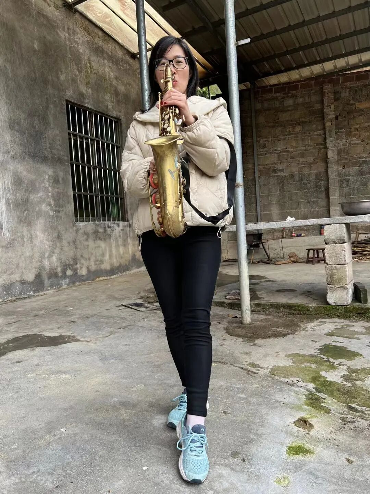
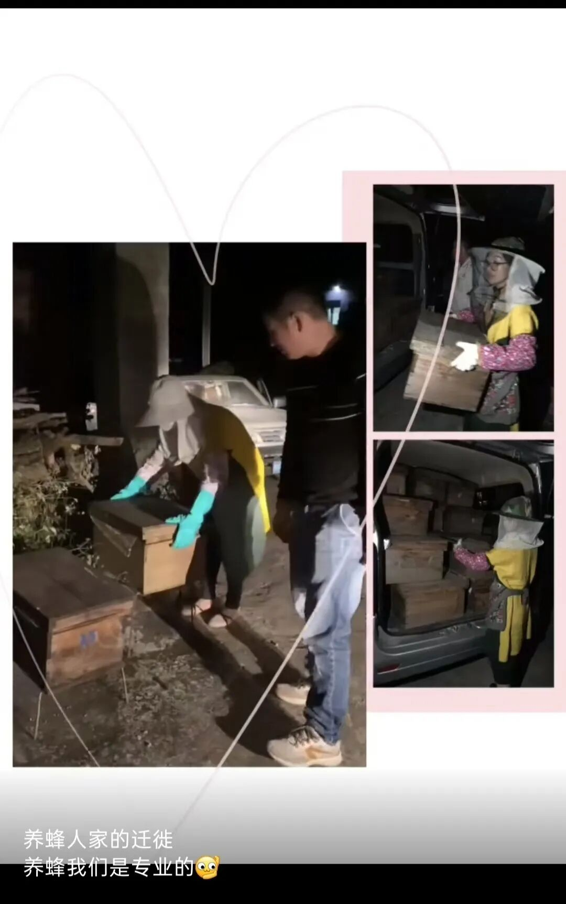
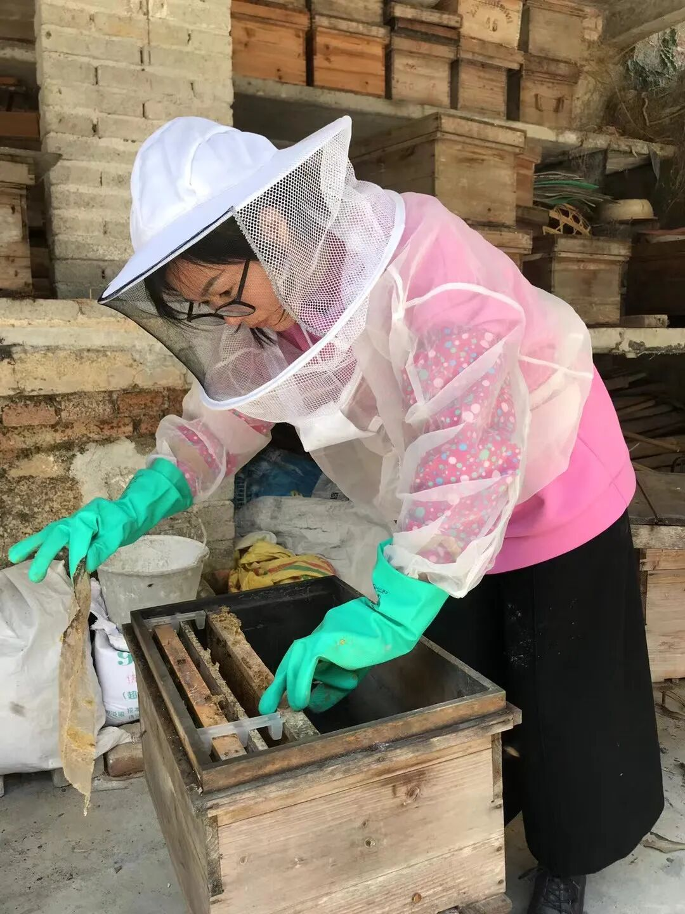
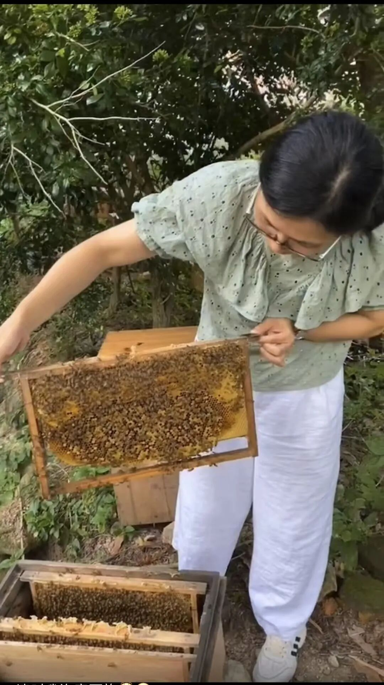

一晃四年，整整四年……

从老陈走的那一天开始，我心里就惦记着一件事，一直想好好写一篇文章，记录他这一生，写写他传奇的一生，好好纪念他。

心里酝酿了整整四年，直到今天我才真正动笔。虽然来得迟，但迟到的念想，总比永远不到要好。

  

我一直觉得，我家老陈这辈子活得特别幸福。

他这一生能活得这么洒脱、这么坦荡、这么随心追求自己的热爱，最大的功臣就是我老妈。

是我妈妈一辈子的辛劳、隐忍和坚韧，默默扛下了家里所有柴米油盐、生计糊口的重担。家里所有最琐碎、最辛苦、最熬人的生存压力，全都被妈妈一一扛了下来。

  

正因为有我妈妈把整个家稳稳撑住、安顿妥当，老陈才能一辈子活得那么淡然、从容、纯粹。他才能毫无后顾之忧地，全身心投入自己的爱好，专注自己的热爱，活成别人复刻不了的一生。这份从容与传奇，大半功劳，都是我妈妈成全的。

  

很多人问我，老陈是做什么的？

说出来真的没人敢信，他这一生，太丰富、太厉害了！

  

他在我心目中，是教师、是舞蹈家、是音乐家、是发明家，更是守了一辈子的养蜂人。别人以为人民教师是他的主业，可在我心里，教书更像是他的副业。真正贯穿他整个人生、陪伴他到生命最后的，是他那群不离不弃的千万蜂群。

  

一、先说说他最光荣的职业-深山里的人民教师

早在我还没出世的时候，老陈就已经是一名人民教师了。只可惜后来因为我属于超生，他不得已丢掉了这份职业。好在那时山区缺老师，加上他本身学识好、教学出彩，教育局又将他返聘回校。

  

在我心里，老陈是一位特别优秀的人民教师，山上大半孩子都是由他启蒙，拼音、识字、算数样样耐心教导。他讲课生动有趣，待人亲和可爱，最让人记忆犹新的是，在我们还是学前班时教我们唱粤剧《分飞燕》，当年山里听过的孩子，至今都忘不了。

老陈一生踏踏实实教书育人，一直坚守到退休……

  

二、再说他是舞蹈家

每年的六一儿童节和元旦晚会的节目，他都会自编舞蹈教班上的孩子们排练。

我的舞蹈启蒙，就是老陈教的，他是我人生第一位舞蹈老师。

也是因为他的启蒙，跳舞成了我这辈子最热爱的事情，贯穿了我的整段学生时代。从小学一年级开始，一直到大学，我年年参加文艺演出，一辈子热爱舞台、喜欢跳舞，都是遗传他、受他影响。

现在，步入中年后每每回想，那段岁月总能给予我力量，温柔滋养我的生活。

  

三、再说他是音乐家，更是一点都不夸张

老陈天生懂音律、有天赋。不管什么乐器，他拿到手就能自学自通，无师自通。我们家里的乐器，多到十个手指头根本数不完，大大小小、各种各样的乐器摆满家里。

  

我这辈子最难忘的一件事，是我刚出来工作的第一年。

那时候他心里特别想要一种乐器，可他不知道那个乐器叫什么名字，只能凭着印象一点点形容给我听。

我本身对乐器一窍不通，为了帮他圆梦，我专门去找读音乐的老同学，一点点转述他描述的样子，再三确认，才知道那是萨克斯，是西洋乐器里最拉风、最帅气的一种。

  

那是我人生第一笔工资，我毫不犹豫，第一时间就给他置办了一把萨克斯。

后来在乡下他去乐团演奏，拿着那把萨克斯的他，是整个乐团最帅、最拉风、最亮眼的那个仔，我每次看着都特别骄傲。

  

  

  

四、说他是发明家，就更不为过了。

从我记事开始，我们家在十里八乡，永远是走在最前面、最先进的那一户人家。

村里买的第一台彩电、第一户用上煤气罐做饭、第一家买软床垫（班上女同学好奇的个个来体验一翻）、第一个买Dvd机全村人来看卓依婷唱歌跳舞……

  

别人家里干农活全靠苦力、靠蛮力，累死累活，我们家大部分农活、重活，早就被他改造得半自动化、省力又省心。

  

那个年代，条件特别苦，机器也特别贵。

他在报纸上看到有打谷机打稻谷这玩意，记在了心里。那时候家里穷，根本买不起成品机器，他就自己琢磨、自己研究，硬生生亲手造出了一台打谷机。有皮带、有铁齿转轮，有脚踏，可以脚踩转动，可以代替全人工打谷，省心省力。在当年真的轰动了周边的邻里乡亲。

  

不止打谷机，后来他又自己研发了割竹机、打竹机，自制抽水机，他说没用一台马达搞不定的事，甚至还给我表演过无防护徒手按电线的把戏，看得我心惊…那年代，在那乡下，没人能像他一样把物理钻研得通透透彻，这般钻研动手的本事，方圆百里之内找不出第二个。

能把所有辛苦的农活，一点点改良得更轻松、更高效。

  

最让我印象深刻、最佩服他的，还是家里的古法手工造纸。

我们家世代传承古法手工造纸，工序繁琐、全部靠人力，特别累人、特别耗时间。

  

为了减轻劳作负担，老陈又自己动脑、自己摸索，发明了半自动造纸机，把原本纯人力捞纸的工序，改成机器辅助，省去了无数人工力气，改良了老祖宗的手艺，又保留了古法造纸的精髓，最后让我当上了老板的女儿……

  

有件事，我记得清清楚楚，是我读初一那年。

发生了一件让我这辈子都忘不掉的意外。

当时家里的打竹机正在运转作业，机器上高速转动的皮带突然一下子断裂，飞速弹飞的皮带，不偏不倚，狠狠抽打在了我哥的鼻梁上。

  

一瞬间，鲜血直流，流得特别吓人。

家里人当时都慌了神，情急之下，赶紧扯来一张厚棉被，死死按住伤口止血，简单做了应急处理，就急忙往镇医疗卫生所赶。从村到镇要40分钟…一路上血流不止，等匆匆赶到卫生院的时候，原本干净的一整张棉被，几乎全都被鲜血染红了。

  

那时候我正在学校里上课，完全不知道家里出了这么大的事。

我永远记得那个画面，一辈子刻在骨子里不忘

我安静的课堂上，当时正是刘老师的课，顺着刘老师的示意目光抬头，突然看见教室窗外，站着满身是血的爸爸。他浑身血迹，衣衫上全是我哥的血，站在窗外着急地看着我，那个样子又慌张又憔悴。

  

那一瞬间，我心里咯噔一下，瞬间就懂了，肯定是家里出大事了。

万幸的是，经过医生紧急抢救，我哥最后平安挺了过来，没有性命之忧。但那场严重的受伤，还是让他落下了终身的后遗症，这么多年一直都在。

  

哪怕经历过这样惊险的意外，我爸从来没有停下过钻研的脚步。他一辈子爱琢磨、爱创新，总想靠着自己的双手，减轻家里人的辛苦，让一家人的日子过得轻松一点。

  

五、“养蜂佬”是老陈一辈子的外号，养蜂，也是从头到尾贯穿他一生、刻在骨子里的热爱。

我知道，我还没出生前他就是妥妥的养蜂人。

早年他总独去屋后深山找野蜂，为了多收几群蜂回家，常常翻遍群山，偶尔在外留宿，隔天才能疲惫归来…他的勤快，由十几箱蜂到最鼎盛时两百多箱…

  

小时候哥哥总跟着老陈进山寻蜂，我便留在院里看管刚收回来的野蜂，生怕蜂群会分家飞逃。一旦蜂王带着蜂群腾空飞起，我立刻追上去撒沙泼水，逼蜂群停落在树上，然后自己蹲在树下寸步不离，静静等老陈回来收蜂。

  

养蜂人注定跟着花期四处奔波，不同地域、农场的花季各不相同，哪里蜜源充沛，我们就得连夜转运蜂箱迁居。白天蜜蜂外出采蜜，性情暴躁容易蜇人，只有入夜蜂群归巢安静，才适合搬动蜂箱。

  

  

夜里才是养蜂人最忙活的时候，盛花期摇蜜也都选在晚间，避开躁动的蜜蜂。忙完手头活，老陈就搬个小板凳坐下，耐心教我们分辨蜂王、人工育王。儿时的我坐在一旁听得入神，如同看有趣的故事，灯下闲聊的画面满是温暖。

  

如今每每回想，这般温暖的场景再也不会有了，再也见不到老陈守着蜂箱、灯下细说养蜂诀窍的模样……

  

  

我是家里老四，兄弟姐妹里陪伴老陈最久，长年耳濡目染，完整继承了他全套养蜂手艺。老陈一生坦荡洒脱，活得随心自在，一直是我心中的榜样。等往后我退休了，我也想回到福建老家，在后院养蜂，屋前栽满花草，效仿他简单闲适的生活，光是想象，就觉得满心安稳。

  

……

还有开山种树、遇山猪、被骗、太多太多…

除此同时，他心里重血脉传承，不忘根本，主持修建供奉老祖宗的宗祠（祠堂），当然这里出现好多争议问题和委屈，他都默默扛着…

  

关于老陈，几十万字的厚本也装不下他精彩的经历。

……

  

老陈，他这一生，真的太鲜活、太立体了。

能登台教书、能起舞翩翩、能抚乐吹曲、能动手造物，半生育人、半生逐热爱，最后一生归山野，守着他的蜂群岁岁年年。

  

外人只看到他多才多艺、潇洒自由，

只有我们一家人知道。

这份潇洒，是我妈妈倾尽半生辛劳托起来的；

这份传奇，是他自己一辈子纯粹热爱、踏实善良换来的。

  

四年光阴匆匆而过，蜂声依旧，斯人已远。

我的老陈，平凡普通，却又独一无二、无比传奇。

余生岁岁，日日思念，永不相忘。

惟愿天堂无灾无难，岁岁安然，自在随心。

……

【今日父亲节，谨以此篇记录老陈跌宕又精彩的传奇一生，以此怀念我多才坦荡、伴蜂半生的老父亲。】