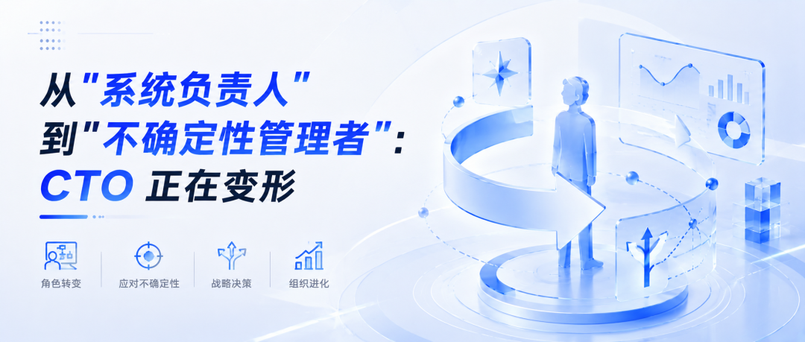
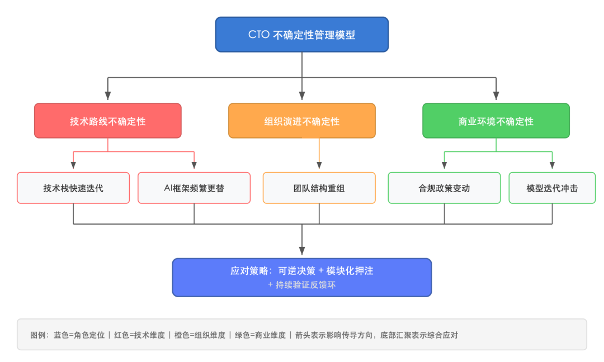
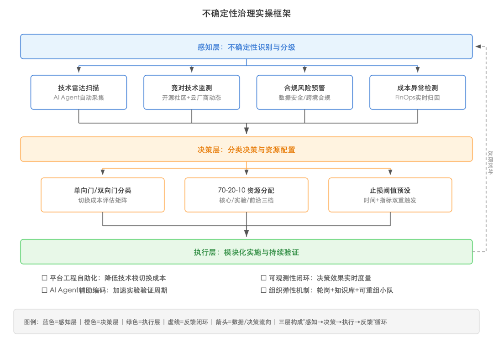

  

## 前言

过去十年，CTO 的核心工作是把系统建稳、把架构做对、把团队带好。但到了2026年，这套逻辑正在被打碎。AI Agent 自动写代码、平台工程把基础设施抽象成服务、FinOps 让每一笔技术投入都摊在阳光下——CTO 手里那些“技术决策权”正在被工具和流程吞噬。真正留给 CTO 的，是那些没有标准答案的东西：技术路线的不确定性、组织演进的不确定性、商业环境的不确定性。说白了，CTO 的核心能力正在从“管系统”变成“管不确定性”。

本文从角色演变的底层逻辑出发，拆解这个变形过程，并给出一套可落地的能力重构框架。

* * *

**目录**

  * 一、旧剧本为什么失效了
  * 二、不确定性的三个来源
  * 三、CTO 能力模型的结构性迁移
  * 四、从架构治理到不确定性治理：一套实操框架
  * 五、写在最后

* * *

## 一、旧剧本为什么失效了

2020年之前，一个合格的 CTO 大致是这样的画像：选型准、架构稳、故障少、团队能打。技术选型靠经验判断，系统架构靠最佳实践，团队管理靠梯队建设。这套打法在技术迭代周期以“年”为单位时是有效的。

问题出在2024年之后。三件事同时发生了：

**第一，AI 编程能力暴涨。** Claude Code、Cursor、GitHub Copilot Workspace 这些工具，已经不是“辅助写代码”的级别了。2026年的 AI 编程工具能独立完成一个中等复杂度微服务的从设计到测试全流程。CTO 过去靠“技术深度”建立的权威，被一个月费20美元的工具平替了大半。

**第二，平台工程成了标配。** Internal Developer Platform（IDP）把基础设施、CI/CD、可观测性、安全合规打包成自助服务。开发团队不再需要找 CTO 审批基础设施方案——平台上点几下就部署了。CTO 从“技术审批者”变成了“平台产品经理”，但很多人还没意识到这个身份转换。

**第三，FinOps 让技术花钱变得透明。** 每一个 API 调用、每一台虚机、每一次模型推理的成本都被追踪和归因到业务线。CFO 开始拿着 FinOps 报表问 CTO：“这笔钱花得值吗？”——而不是像过去那样只问“系统稳不稳”。

这三件事叠在一起，CTO 原来的三根支柱——技术深度、架构权威、资源分配权——同时被削弱。旧剧本演不下去了。

## 二、不确定性的三个来源

既然确定性的工作被工具和流程接管了，CTO 面对的就只剩下不确定性。我把它归纳为三类：

**技术路线不确定性。** 你现在选的技术栈，18个月后还在不在？这不是夸张。2024年初还在用 LangChain 做 RAG 的团队，到2025年底发现 MCP（Model Context Protocol）+ 原生 Agent 框架已经把中间层抽象换了一遍。你投入半年建的 Embedding Pipeline，可能因为大模型原生支持长上下文而直接废掉。CTO 必须在信息严重不完备的条件下做技术押注，而且每次押注都涉及几十号人半年以上的工作量。

**组织演进不确定性。** AI Agent 正在改变软件团队的人员结构。一个5人小队加上 AI 工具，产出可能等于过去15人的团队。那多出来的10个人怎么办？是转岗、裁撤还是重新编组？团队规模在缩，但系统复杂度没降——谁来兜底那些 AI 生成代码的质量和安全问题？这些都是组织层面的不确定性，没有教科书答案。

**商业环境不确定性。** 技术决策越来越受商业变量制约。一个跨境业务，今天的数据合规政策和半年后可能完全不同。一个 AI 驱动的产品功能，上线时用的基础模型可能三个月后就被更强的替代了。CTO 做架构决策时，必须把“这个决策在商业环境变化时能不能低成本调整”作为核心评估维度。

## 三、CTO 能力模型的结构性迁移

传统 CTO 能力模型是“T字形”：横向是技术广度，纵向是某个领域的深度。这个模型的假设是——技术能力越强，决策质量越高。

但不确定性管理需要的是另一种能力结构。我把它叫做“决策弹性模型”，核心有四个维度：

**1\. 可逆决策设计能力**

Jeff Bezos 那套“单向门/双向门”理论，在技术决策里特别实用。CTO 要做的第一件事，是把每个技术决策分类：哪些是走了就回不来的（比如核心数据库选型），哪些是随时能调头的（比如前端框架选择）。单向门决策要慎重、要花时间验证；双向门决策要快速、先跑起来再说。

实操中，很多 CTO 把所有决策都当成单向门来处理——每个选型都要评审会、POC、多轮讨论。结果就是决策太慢，错过窗口期。其实一个 2026 年的经验法则是：如果切换成本低于两个人两周的工作量，就当双向门处理，直接干。

**2\. 技术组合投资能力**

别把所有筹码押在一条技术路线上。2026 年做得好的 CTO，普遍采用“70-20-10”的技术投资组合：70%资源投在已验证的核心技术栈上，20%投在有潜力的新技术上做受控实验，10%投在前沿探索上（比如 AI Agent 编排、边缘推理、Wasm 组件模型）。

关键是那20%——它不是“创新实验室”那种做完PPT就结束的东西。它要有明确的“毕业标准”：什么指标达到了就升级为核心投入，什么时间点没达到就止损。

**3\. 信息密度提升能力**

在信息不完备的条件下做决策，本质上就是在跟信息密度赛跑。CTO 需要建立自己的“信息雷达”系统：不是刷技术博客和 Hacker News 那种泛泛了解，而是在关键决策领域建立深度信息通道——跟开源社区核心贡献者保持联系、跟云厂商的产品经理定期同步路线图、跟同行 CTO 建立信息互换网络。

2026 年的一个有效实践是：用 AI Agent 做技术情报的自动采集和结构化整理。比如部署一个 MCP 驱动的情报 Agent，自动追踪 GitHub 上关键项目的 RFC、主要云厂商的 changelog、以及 CNCF 项目的孵化进度，每周生成一份结构化报告。

**4\. 组织弹性塑造能力**

团队不能是铁板一块。CTO 需要让团队具备“可重组性”——人员能力不绑死在特定技术栈上，项目组能快速拆分和重组，知识不锁在个人脑子里。

具体来说就是三件事：推行内部技术轮岗（至少每18个月换一次技术方向）、建立工程知识库而不是依赖口口相传、用平台工程降低技术栈切换的认知成本。

## 四、从架构治理到不确定性治理：一套实操框架

说了这么多理论，落到实操层面怎么做？我给一个可以直接搬到季度 OKR 里的框架：

这个框架分三层：

**感知层** 做的事情是把不确定性“可见化”。别等问题炸了才知道。技术雷达不是每季度做一次的仪式，而是用 AI Agent 每天跑一遍关键信号源，自动标注变化等级。FinOps 的成本异常检测也归到这一层——成本突变往往是技术决策需要调整的先行指标。

**决策层** 核心就两件事：分类和分配。每个技术决策先过一遍“单向门/双向门”筛子，再按 70-20-10 分配资源。最关键的是预设止损阈值——“如果三个月后这个指标没到 X，我们就停”。没有止损机制的技术实验，就是在烧钱。

**执行层** 靠平台工程和 AI 工具把决策快速落地。平台工程的价值在这里尤其突出：当你需要快速切换技术路线时，一个成熟的 IDP 能把切换成本从“月”降到“天”。

三层之间通过反馈闭环串起来：执行层的度量数据回流到感知层，驱动下一轮决策调整。这不是一次性的架构设计，而是一个持续运转的治理机制。

## 五、写在最后

CTO 这个角色没有消失，但它的内核确实变了。过去十年，好的 CTO 是那个“什么技术都懂、什么系统都能搞定”的人。未来十年，好的 CTO 是那个“在看不清楚的时候也能做出够好的决策，并且能快速纠偏”的人。

这个变化对很多技术出身的 CTO 来说是痛苦的，因为它要求你从“追求正确答案”转向“管理不确定性”。但换个角度想，这恰恰是 AI 替代不了的东西。AI 能帮你写代码、做分析、跑测试，但它做不了“在信息不完备的情况下为一个组织做战略性技术押注”这件事。

说白了，不确定性管理能力，就是2026年 CTO 最硬的护城河。

* * *

> **作者说：** 本文首发于微信公众号“TechVision大咖圈”，同步发布于CSDN博客。探讨技术管理实战经验，欢迎关注交流。