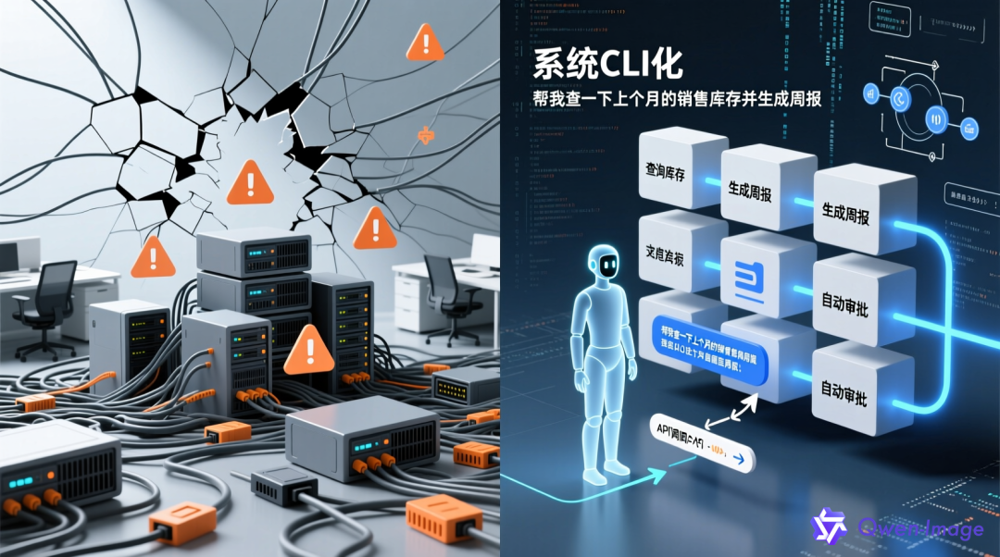
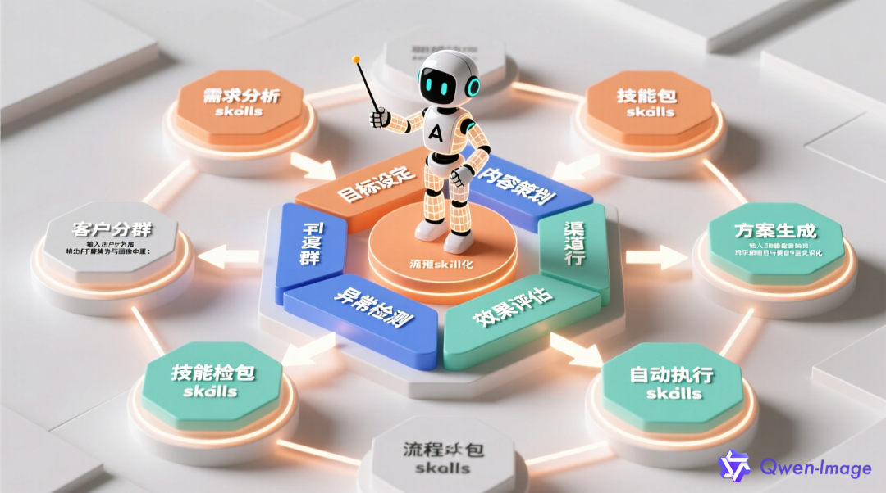
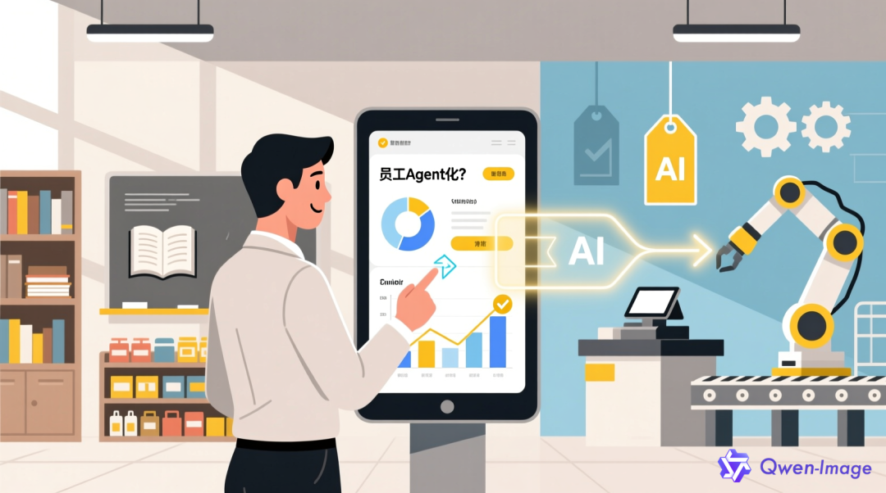

> 你有没有发现，如今的企业AI项目，95%都“死”在了落地前？

不是模型不够强，也不是预算不够多，而是——AI没真正“嵌入”业务流。

有人花百万部署大模型，结果业务部门连报表都看不懂；有人搞了个智能客服，却因知识库混乱被用户骂上热搜。

真正的AI落地，不该是“技术秀场”，而应是“组织进化”。

今天，我们提出一个全新框架：**系统CLI化、流程skill化、员工Agent化**

* * *

##  一、为什么大多数企业AI项目失败？——缺的不是技术，是“适配性”

毕马威《人工智能就绪度白皮书》指出：**70%的企业并未AI Ready** 。  
很多CIO陷入“FOMO陷阱”（Fear of Missing Out），在BI系统尚未健全时就强行上马AI，结果数据质量差、业务脱节、员工不会用——项目从启动那一刻就注定失败。

比如张总的故事：他要求所有报表由大模型生成，但底层数据混乱、字段缺失、口径不一。模型输出的不是洞察，而是“幻觉”。业务人员抱怨：“动动嘴就能出完美报表？”现实却是：动动嘴，出一堆错误。

**问题本质** ：AI不是孤立的技术模块，而是**组织能力的延伸** 。若系统不标准、流程不清晰、员工无赋能，再强的模型也只是空中楼阁。

  

* * *

## 二、破局之道：三大进化方向

### 1\. **系统CLI化：让IT系统像命令行一样可编程、可集成**

CLI（Command-Line Interface）代表的是**标准化、可脚本化、可自动化** 的操作逻辑。  
传统企业系统往往是“黑盒”：ERP、CRM、OA各自为政，数据孤岛林立，API接口混乱。AI想调用数据？难如登天。

而“系统CLI化”的核心，是将企业核心系统**抽象为可调用的服务单元** 。

  * • 每个业务动作（如“查询库存”“生成周报”“审批采购单”）都封装成标准API或函数；
  * • 数据接口统一、权限清晰、响应可靠；
  * • AI Agent可通过自然语言指令，自动编排这些“原子能力”。

> 举例：歌力思通过观远数据平台，将门店销售、库存、客流等数据打通，形成标准化数据服务。当业务员问“上周华东区哪些门店销量下滑？”，系统自动调用多个CLI式接口，完成“问数-归因-建议”闭环——全程无需人工干预。

**CLI化不是复古，而是为AI铺路** ：只有系统足够“机器友好”，AI才能真正干活。

  

* * *

### 2\. **流程skill化：把业务流程拆解为可复用的“技能包”**

传统流程是线性的、僵化的：“先填表→再审批→最后执行”。  
但在AI时代，流程应被**解构为一系列可组合的“skills”（技能）** ：

  * • “客户分群”是一个skill；
  * • “异常检测”是一个skill；
  * • “自动生成促销方案”也是一个skill。

每个skill具备：  
✅ 明确输入输出  
✅ 内置业务规则  
✅ 可独立运行或组合调用

西瓜创客的做法值得借鉴：他们将“流量转化分析”拆解为“渠道归因→用户画像→转化瓶颈识别→优化建议”四个skill。AI Agent根据场景自动编排这些skill，5分钟完成过去需1-2天的人工分析，并实现100%准确率。

**流程skill化，本质是“业务能力的产品化”** 。它让AI不再是旁观者，而是流程的“参与者”甚至“主导者”。

  

* * *

### 3\. **员工Agent化：每个人都是“人机协作体”**

未来的企业员工，不应只是“使用者”，而应成为**具备AI协同意愿与能力的Agent** 。  
这里的Agent不是指聊天机器人，而是**具备目标感、能调用工具、可自主决策的智能个体** ——无论是人还是AI，都遵循同一套协作逻辑。

如何实现？

  * • **降低使用门槛** ：通过自然语言交互，让一线员工无需懂SQL、Python也能操作数据；
  * • **赋予决策权** ：AI提供选项与风险提示，员工做最终判断（如“是否接受该补货建议？”）；
  * • **建立反馈闭环** ：员工对AI输出的修正，自动反哺模型优化。

新东方在教师培训中引入AI助教：教师提问“如何讲解二次函数？”，AI不仅给出教案，还能模拟学生提问进行演练。教师在此过程中既是使用者，也是训练者——**人与AI共同进化** 。

> 正如OpenAI提出的“5A框架”中强调的“Activate”（激活）与“Amplify”（放大）：全员参与、持续学习、沉淀知识，才能让AI从“玩具”变为“生产力”。

* * *

## 三、落地路径：小切口、快验证、深融合

成功的AI落地，从来不是“大而全”，而是“小而美”。  
观远数据提出的“3-6-12个月分步规划”极具参考价值：

  * • **3个月** ：聚焦1-2个高频、高价值、数据基础好的场景（如日报自动生成、库存预警）；
  * • **6个月** ：将验证有效的skill扩展到相关流程，形成部门级闭环；
  * • **12个月** ：构建企业级AI能力中台，支持跨部门Agent协作。

关键在于：**用业务价值反推技术建设** 。  
当一线员工说“这个AI我离不开”，当管理层看到ROI提升20%，AI才真正“活”在企业里。

* * *

## 结尾

企业AI落地，不是一场技术革命，而是一次**组织重构** 。

  * • 系统CLI化，解决“能不能连”；
  * • 流程skill化，解决“会不会干”；
  * • 员工Agent化，解决“愿不愿用”。

三者合一，才能让AI从“演示PPT”走向“生产环境”，从“成本中心”变为“增长引擎”。

  

> 好啦，今天的分享到此结束，如果喜欢的话，给小编点点爱心💗 和 关注➕哦
> 
> 回家不迷路~