众所周知,HOMOLAB主包一直对高性能SSD情有独钟,无论是[平衡王者R6101](https://mp.weixin.qq.com/s?__biz=MzkzMjYyNDU4Mg==&mid=2247489598&idx=1&sn=8875ae75f7bc017dbdb2ebdf2fd4b8c7&scene=21#wechat_redirect)、[读取至上PS1010](https://mp.weixin.qq.com/s?__biz=MzkzMjYyNDU4Mg==&mid=2247486612&idx=1&sn=95c5255da4bee3b10b2aeafa7837ca87&scene=21#wechat_redirect),还是[刷新写入性能上限的7A40](https://mp.weixin.qq.com/s?__biz=MzkzMjYyNDU4Mg==&mid=2247492373&idx=1&sn=5e4471f9049463296a3e1f041991f60e&scene=21#wechat_redirect),他们都代表着业界的一座座高峰.

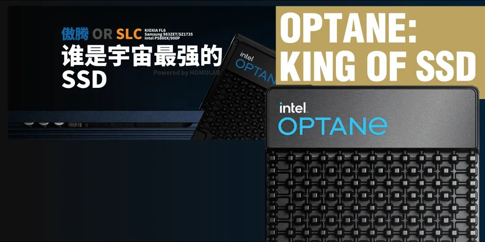

而SCM:存储级内存,则是超脱了TLC SSD级别、无视一切成本限制,位于SSD性能顶端的高贵王冠.其代表产品便是传奇的intel傲腾.极低的读取延迟、强悍的低队列并发、夸张的性能,他就是你梦想中的那个SSD.

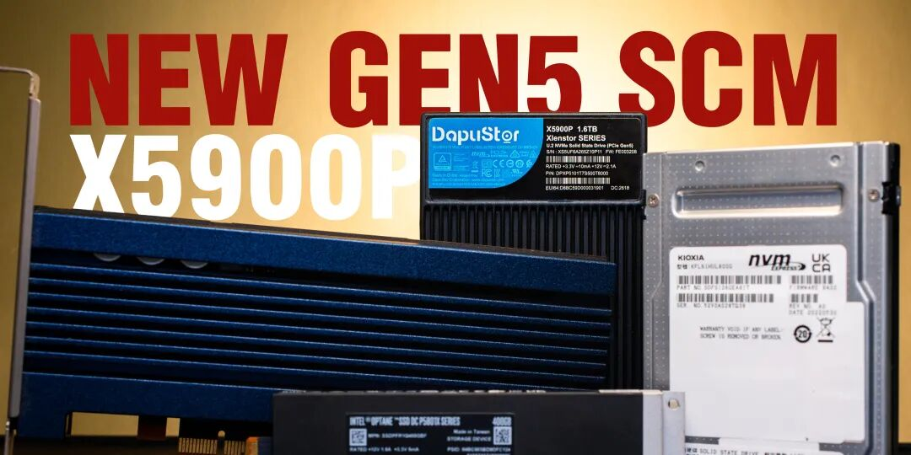

纵然已经过去多年,但傲腾P5800X､FL6､983ZET,这些传奇的硬盘在当下依然别有一番风味.而正如你所见的,在HOMOLAB手中,所有SCM完成了历史性会晤.

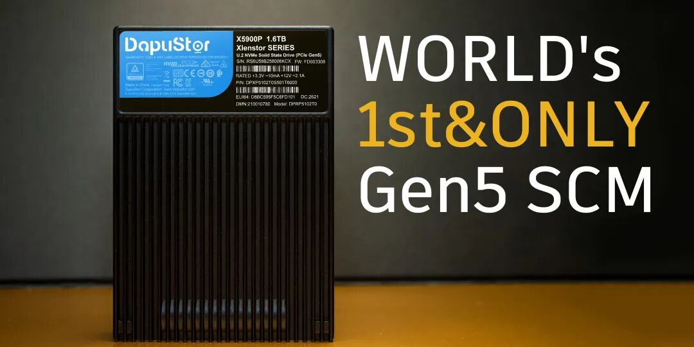

在今天,DapuStor的X5900P到来,这是至今唯一一块Gen5 SCM.  
那么在傲腾停产、AI井喷的当下, X5900P能否再一次创造性能奇迹?他又是否是你梦想中的那个终极SSD?

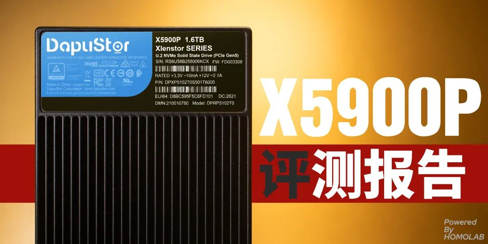

  

PART I:SCM IS HERE

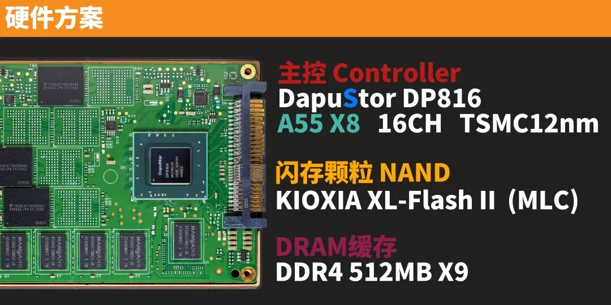

X5900P采用了与R6101同款的自研DP816主控,采用了8个A55内核与TSMC 12nm制程.

尽管在制程上稍显落后,但区别于绝大多数SSD的大规模ASIC与SRAM缓存,依然使得DP800称得上最强Gen5主控之一.

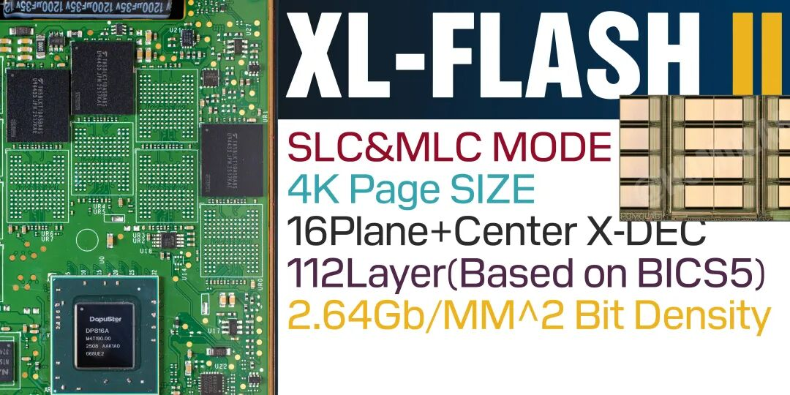

NAND为8颗256G的Kioxia XL-Flash 2,合计2048G.这个NAND可以切换SLC与MLC模式,出于容量考虑,X5900P选择了MLC模式.

相较于普通的PSLC,XLFlash通过16Plane与4K page size设计,实现了极低的读取延迟与极高的IOPS并发.

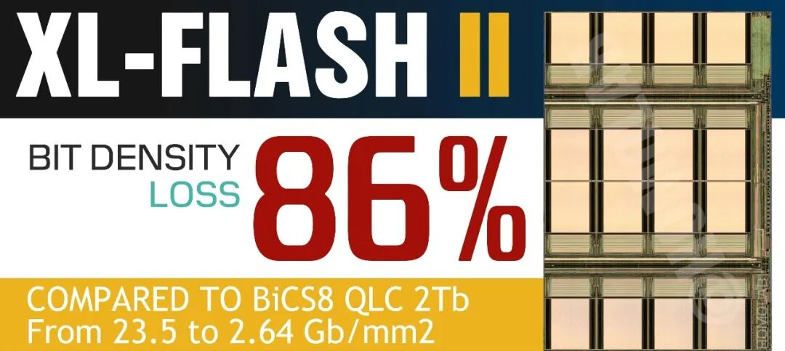

但代价也很明显,即使是MLC模式下的密度也仅有2.64Gb/mm2,相较于目前KIOXIA BICS8Q 2Tb\(23.5Gb/mm2\)差了整整86%.

为了实现更高的性能与超高的可靠性,DapuStor为X5900P配置了足足4.5G的DDR4内存,这个容量已经不能说是奢侈了,而是匪夷所思.

  

  

PART II:SCM的魔力

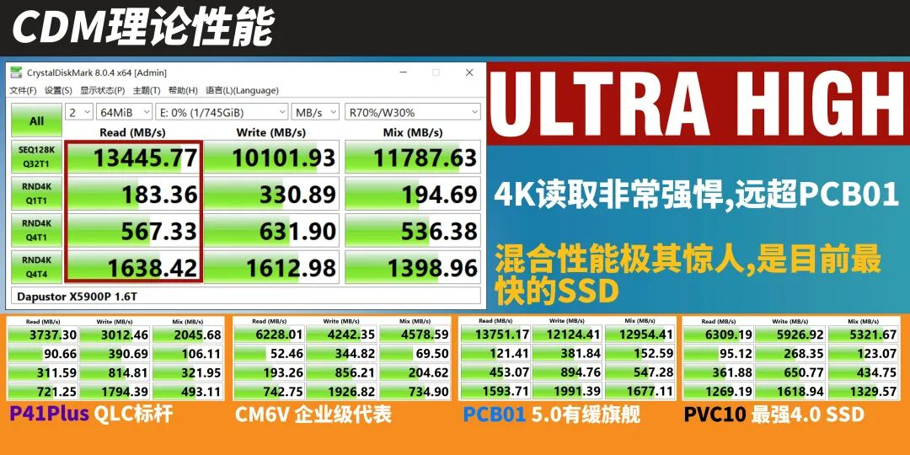

得益于XLFlash的超低延迟,X5900P的性能可谓是一骑绝尘.4K读取强于CM6V已经是基操,但超越了PCB01､PVC10这几个消费级基准实在是有点过于强悍.混合性能则更加惊人,他在PCB01的基础上提升了整整30%

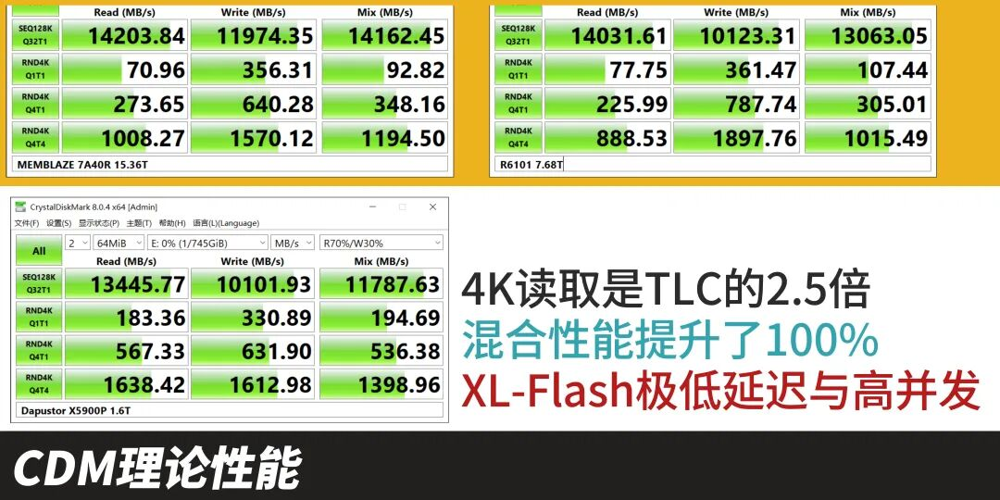

这里引入R6101以及7A40两块Gen5企业级旗舰,相较于常规的eTLC,X5900P在低队列4K读取的性能是他们的2.5倍.即使是在更加复杂的混合场景,X5900P也将性能推进了整整100%.

这也是SCM的优势之一:在低队列深度下更高的IOPS与更低的延迟.

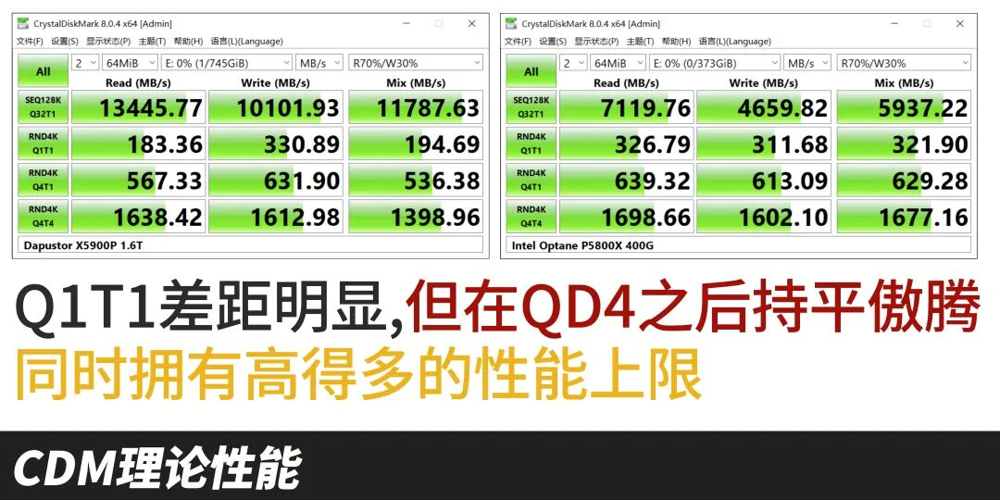

强者就要与强者对比,相较于傲腾P5800X,尽管X5900P在Q1T1上差了不少,但他无疑拥有更高的IO上限:尤其是在顺序读写性能上,他两倍于P5800X 400G.

  

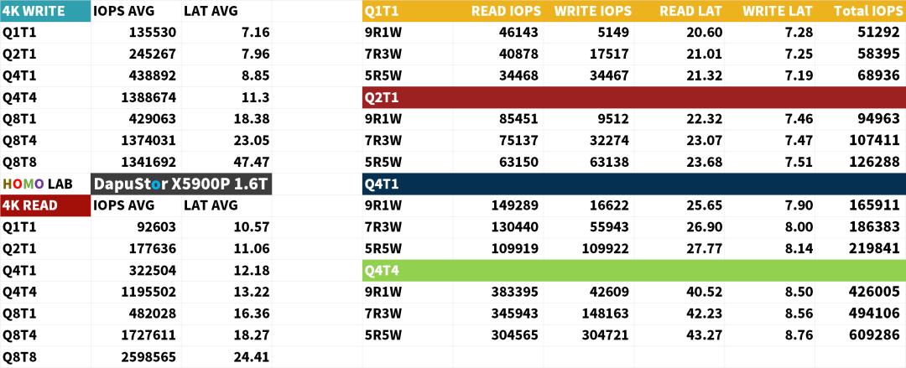

切换到Linux下的Raw空读测试,X5900P的4K读取停留在了2600K iops,略低于7A40以及PS1010.显然Q8T8对于DP800来说压力还是不够大,事实上这个主控在5.0 X8下拥有4450K IOPS的4K读取性能,远强于所有的竞争对手.

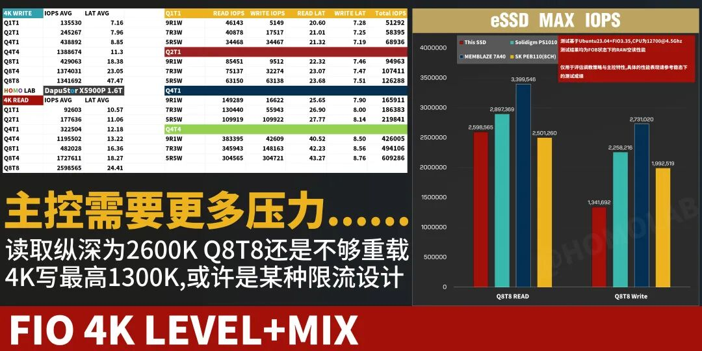

但X5900P的写入性能很奇怪,IOPS纵深仅有1300K,并且在Q4T4便跑满了性能.考虑到他的稳态写性能,这看起来像是某种为了稳定性而采取的限流设计.

PART III:一人之下

那么X5900P能继承理论跑分的强悍,在消费级负载中表现辉煌吗?

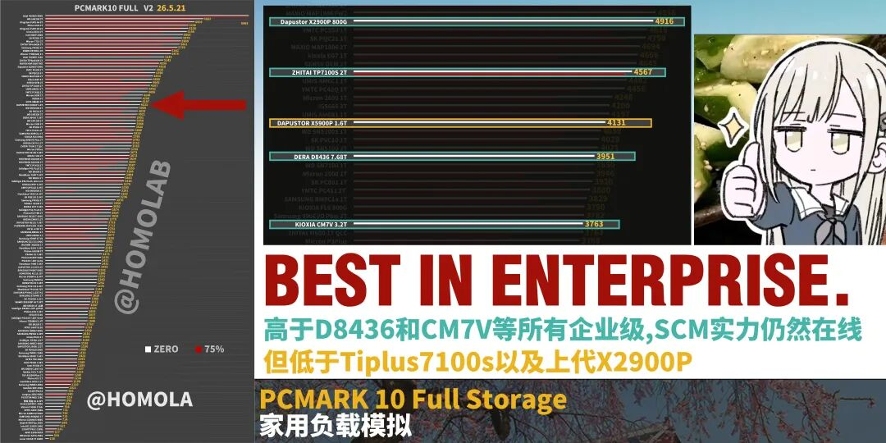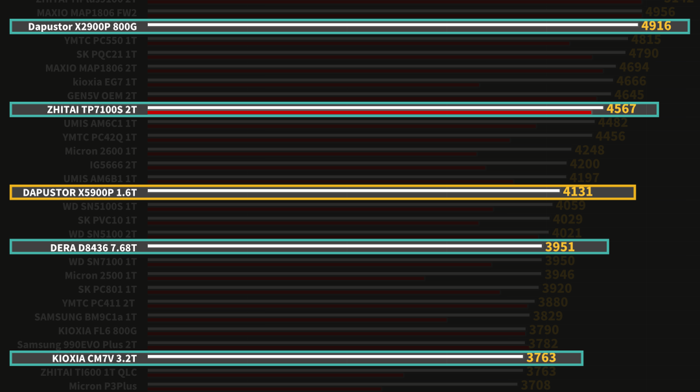

在PCMARK中,X5900P表现不错,高于D8436以及CM7V等所有Gen5 企业级,但差于Gen4消费级旗舰TiPlus7100S,也低于上代的X2900P.

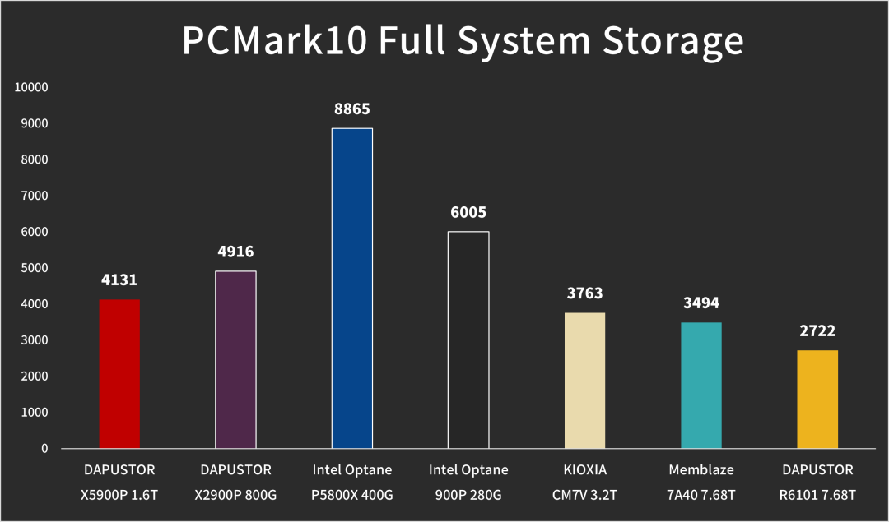

在这张图表中我们可以更清楚的对比高性能企业级之间的差距. 尽管相较于R6101等TLC企业,X5900P将性能提升了40%,但对比真正意义上突破天际的P5800X,X5的性能还是有些小巫见大巫了.

虽然理论测试跑起来没区别,但在混合了不同BS与IO深度的复杂数据流中,SLC依然有着自己独特的优势,前代的X2900P在参数更低的前提下反超X5900P便是如此.而按位寻址的Optane更是逆天,即使是Gen3时代的Intel 900P依然对Gen5 SSD们保持了极高的优势.

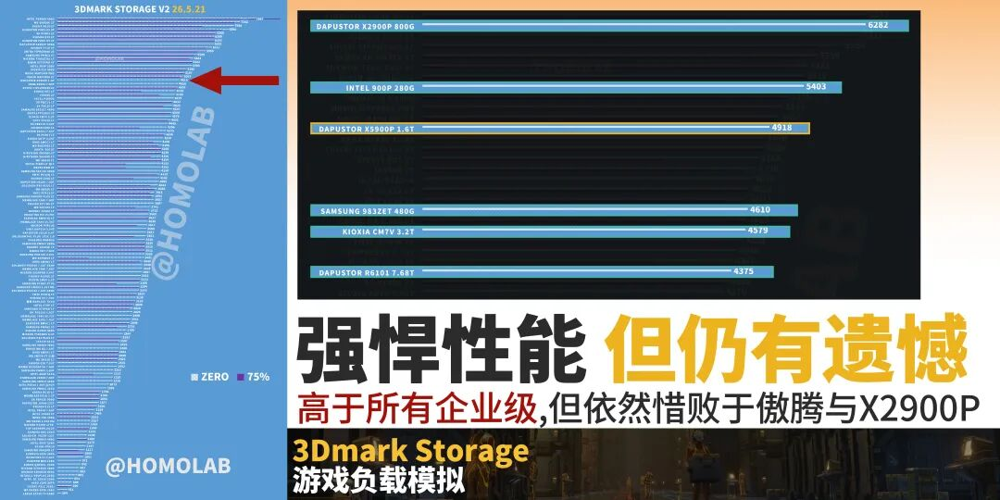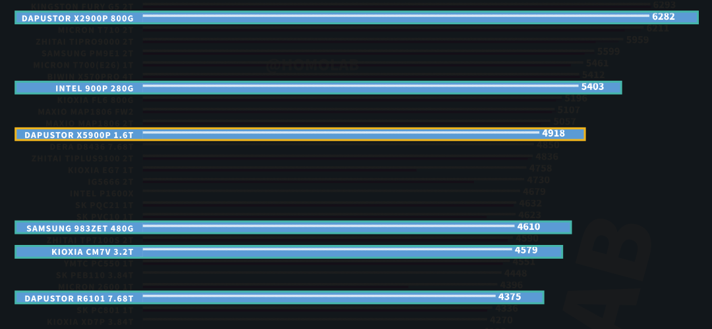

得益于XLflash,在读取为主的3Dmark中,X5900P表现相当优秀:他高于R6101以及CM7V在内的所有企业级硬盘,但他依然略低于傲腾900P,更低于上代的X2900P.当然往好处想,企业级SSD几乎不需要担心性能下降问题,如果你家境富裕,买个企业级硬盘打游戏也是挺好的选择.

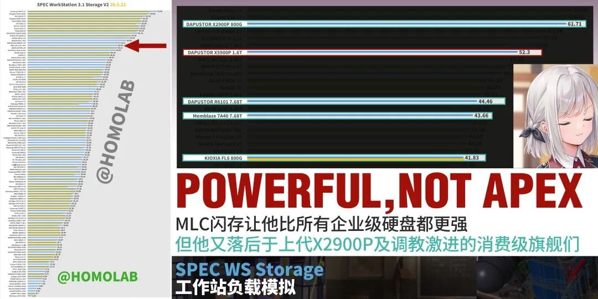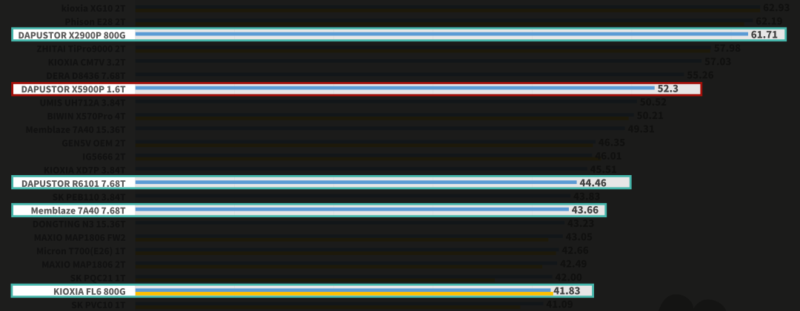

压力更大的SPEC WS更能压榨高并发IO,X5900P的性能表现不错,但也仅仅是不错.他的确高于大部分企业级SSD,但对比调教激进的消费级又差了一些.由于重载的压力吃满了所有的主控性能,因此SCM的超低延迟并没有发挥出优势,因此最终的结果也就那样.

PART IV:超越傲腾?\!

对于企业级,以上这些空盘下的轻度负载根本不算什么,我们的追求是在最极端工况下的稳定与性能.那什么是稳?仅仅只是全盘写入以及所谓的万秒图吗? 

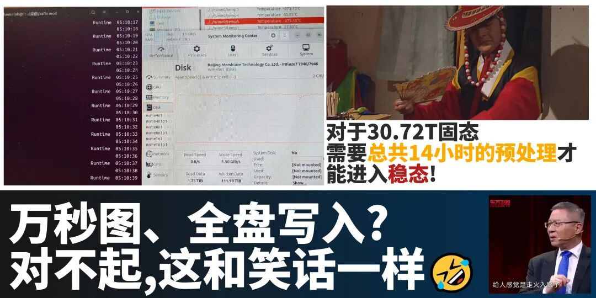

全盘写入､万秒图根本不是什么极大压力场景,真正的高负载发生在极度脏盘阶段,也就是稳态下.不同于某些无能二本KOL的臆想,稳态需要经历两次128K填盘与两次4K填盘才能进入. 

  

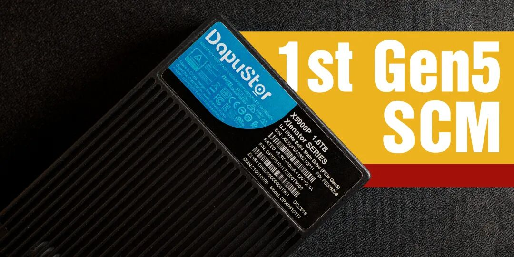

X5900P作为唯一一个Gen5 SCM,尽管使用了MLC模式,他惊人的延迟与超强的IOPS纵深依然给主包留下了深刻的印象.

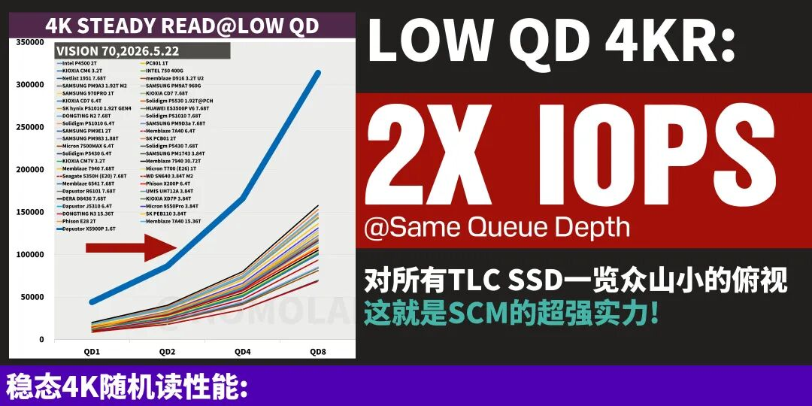

SCM最与众不同的一点,便是其超低的延迟与极其强悍的IOPS并发.如果说R6101和7A40在企业级中是脱颖而出,那么X5900P便是一览众山小的俯视,在低队列中相较于TLC SSD们性能翻倍.

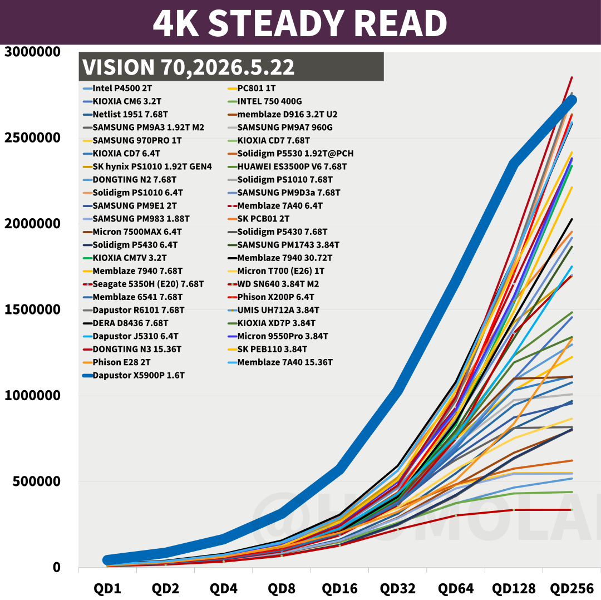

同时在高队列深度中,X5900P表现强悍,保持了在所有队列的巨幅领先:换句话说他能在相同负载下提供高得多的性能.而在QD256,X5900P最终实现了2700K的读取纵深,略微超过PS1010与7A40.

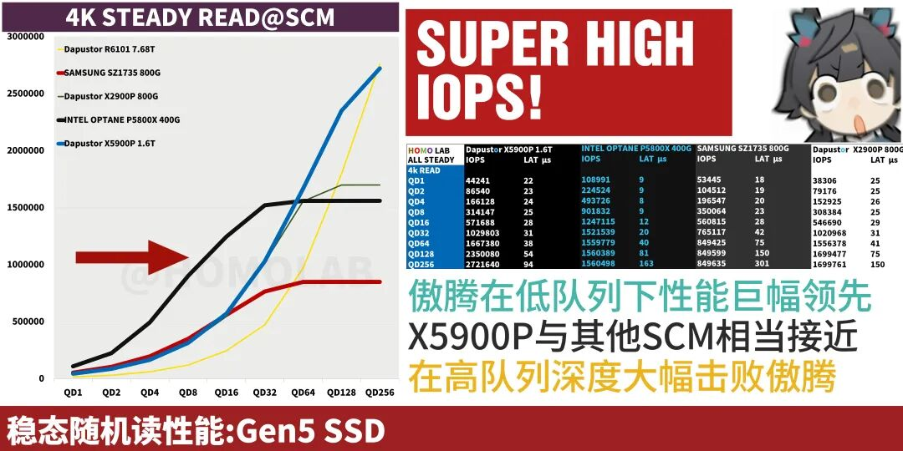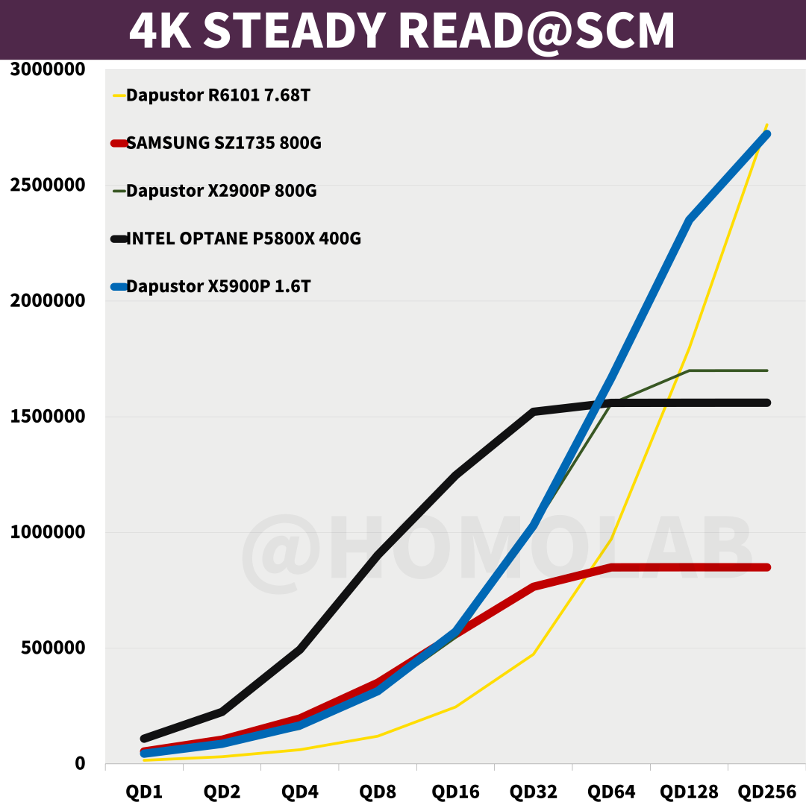

一山更比一山高,X5900P是所有eSSD的追赶目标,而傲腾P5800X则可以说得上是字面意义的无敌.准确来在QD32之前,傲腾相较于其他所有SCM都有着接近一倍的代差.

在QD64之后,凭借着主控优势,X5900P毫无疑问完成了反杀,以2700K的峰值近乎两倍于傲腾P5800X.

通过IOPS latency图,我们可以更直观的看到X5900P的强大.

在最开始的低队列深度,三个Gen5 eSSD的延迟都在60us附近.而几个Fast SSD则是20us上下,只有TLC的1/3.颇为有趣的是,尽管前代的X2900P采用了更好的SLC模式,但MLC模式的X5900P依然呈现出更低的延迟.而在SCM之中,P5800X则是一个特别的例外:他的延迟仅有9us,一半于Fast SSD们.

除了三星SZ1735受限于主控与3.0协议,在800K IOPS便早早出局外, 在500K到1500K的中间阶段,其他SSD的延迟相对平滑,与初始状态并没有显著区别.

而在1600K,X2900P与P5800X相继碰到了Pcie4.0的带宽上限,出现了显著的延迟飙升,被TLC SSD们反超.

最终在末端,X5900P与几块TLC产品的曲线重合,此时仅需94us便实现了2700K IOPS.

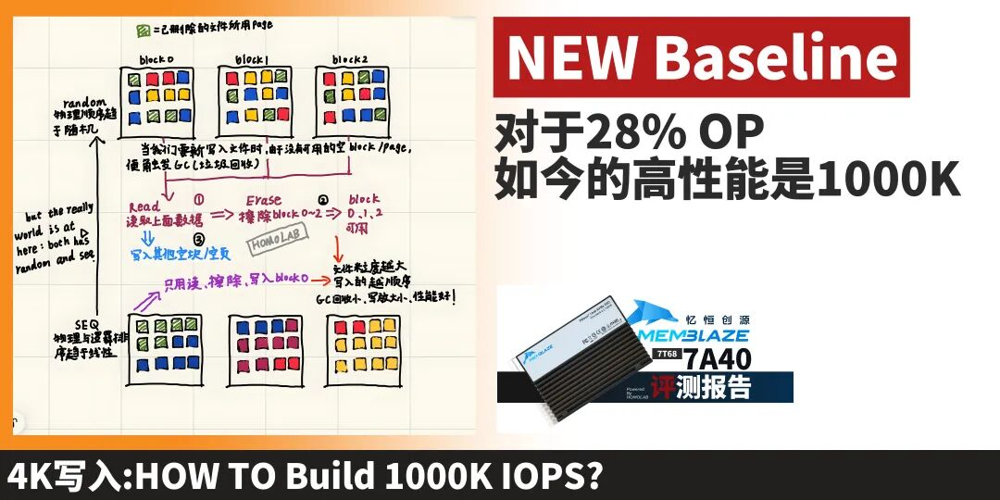

在2024年,Memblaze 7A40创下了1000K iops稳态写的历史纪录,并重新塑造了高性能SSD的标准.那么X5900P可以创造奇迹吗?

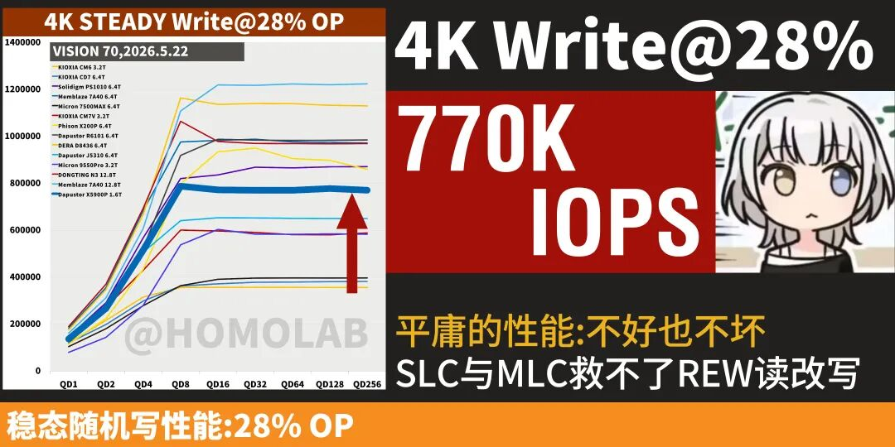

然而很遗憾,在默认的28% OP下,X5900P仅有770K IOPS,尽管这个成绩高于PM1743与9550Pro等产品,但低于R6101,更低于7A40.事实证明SLC和MLC都改变不了REW读改写特性,即使贵为Fast SSD,在巨大的压力下也会出现性能下降.

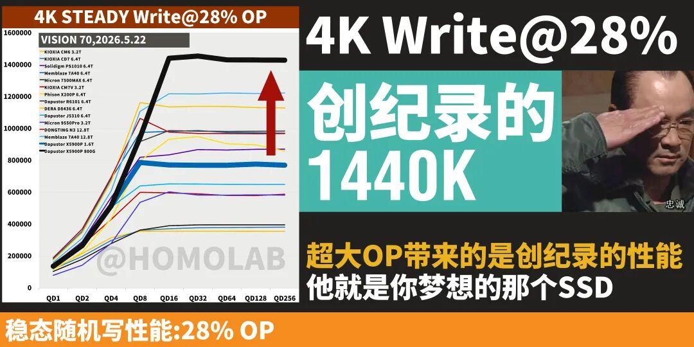

而更改OP至800G后,X5900P实现了1400K的稳态写,奢侈的OP带来的是惊人的性能.这个成绩一举超过了所有对手,包括刷新纪录的新版7A40.

考虑到SCM的奢侈定位,事实上我认为超大OP的X5900P 800G才是这块盘的完全体,毕竟你都用SCM了,大概率是不差钱且追求极致性能的用户,牺牲点容量换取更高的性能显然更划算.

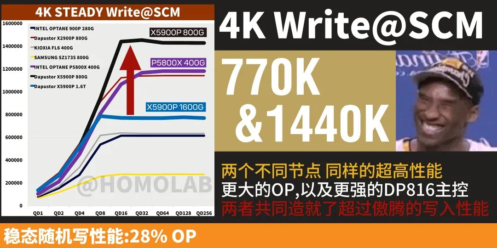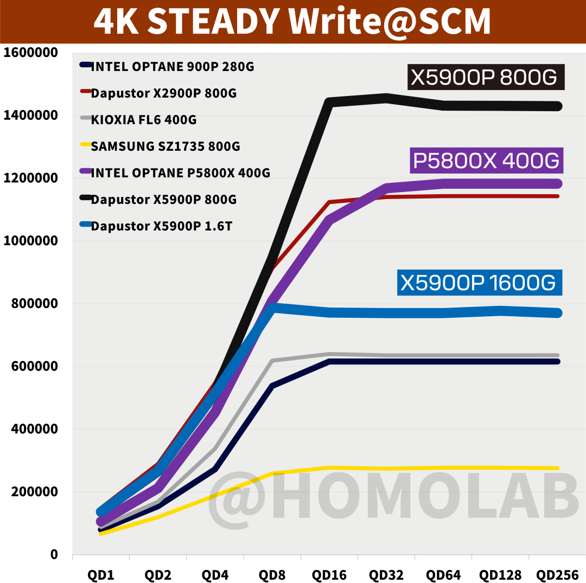

我们同样引入其他两个SCM,相较于P5800X与前代产品,X5900P在800G节点下拥有高得多的性能.一方面他的实际OP空间更大,另一方面DP816主控也有着更高的硬件规模,这两者共同早就了X5900P 800G的超高上限.

而对更早的傲腾900P与FL6,受限于他们的主控规模,性能停留在600K IOPS上下,远低于X5900P 1.6T.

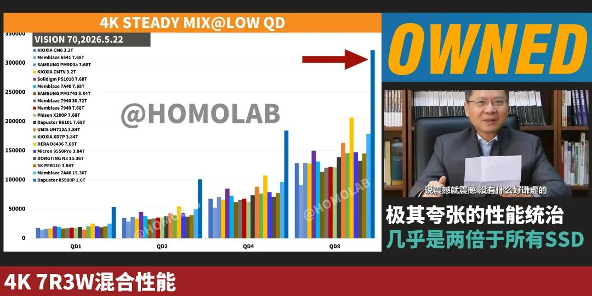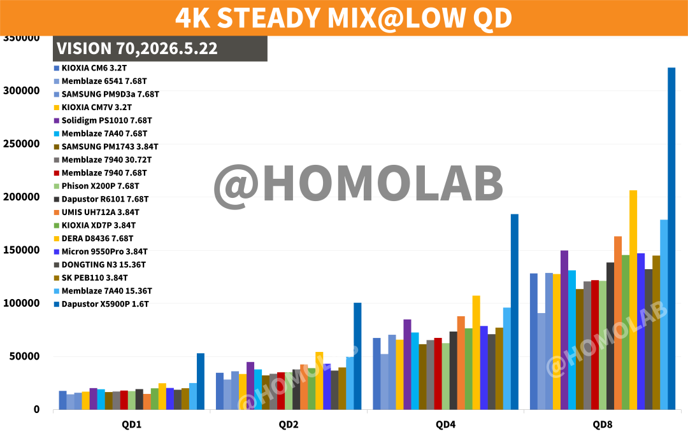

在4K混合读写,凭借着极其强悍的读取性能,X5900P对于TLC SSD有着统治性的压制.即使是MLC模式,采用延迟特化XL-Flash的X5900P依然拥有非常夸张的性能与带宽.

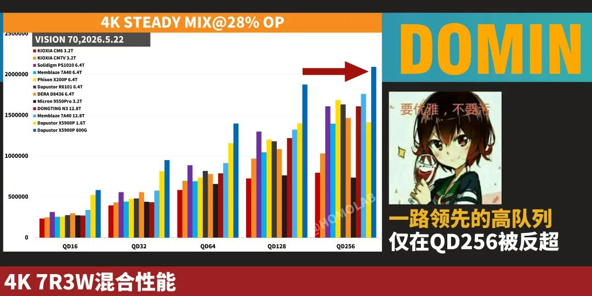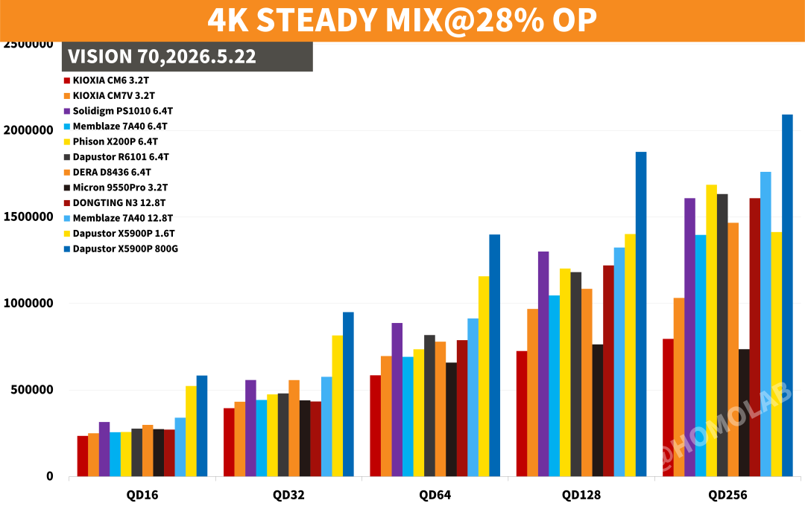

在更高的队列深度,无论是哪个OP节点,X5900P都保持了极其出色的领先.仅在QD256中,X5900P 1.6T受限于写性能上限,被其他TLC SSD反超,而800G则实现了更高的性能.

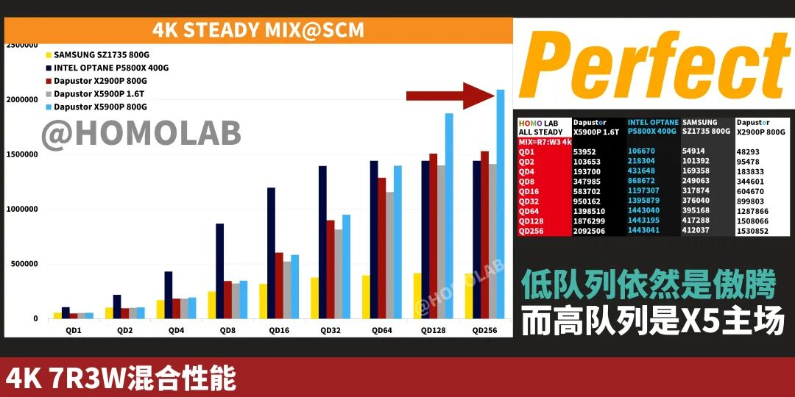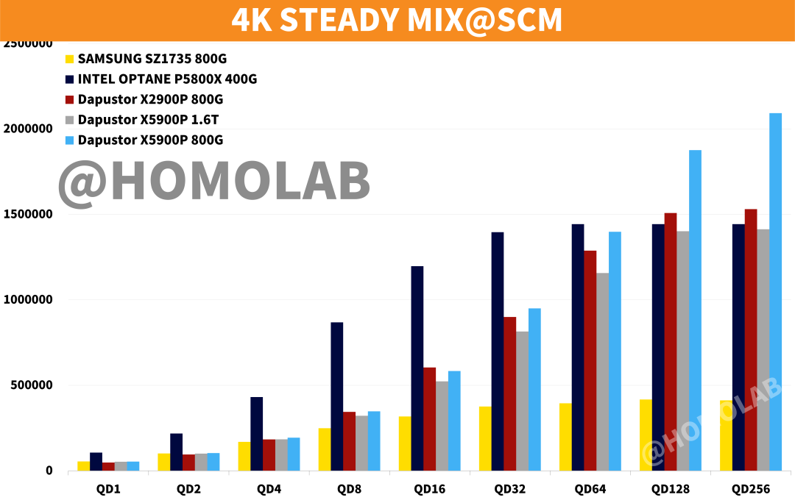

同样与几个SCM相比,在QD1到QD8的地队列深度,基本都是X5900P好于X2900P好于SZ1735,以及傲腾P5800X一骑绝尘.考虑到X5900P采用了MLC模式,而并非是与上代相同的SLC,这个成绩令我倍感惊讶.

而在QD32之后,傲腾出现了明显的性能瓶颈,最终逐渐被X5900P和X2900P反超.

同时注意到,依靠着更高的写性能与读取纵深,X5900P 800G在QD128与QD256实现了非常强悍的统治:相较于P5800X性能提升了整整40%.

PART V:孤独王者

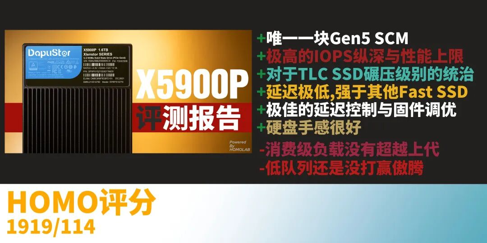

在Intel烈士断臂放弃傲腾后,已经很少有人追逐超高性能但是市场极小的SCM市场,我很高兴看到DapuStor与kioxia能继续推出产品.

X5900P作为SCM赛场上唯一一个Gen5产品,毫无疑问的,他就是目前所有SSD中性能最高的存在:没有之一.

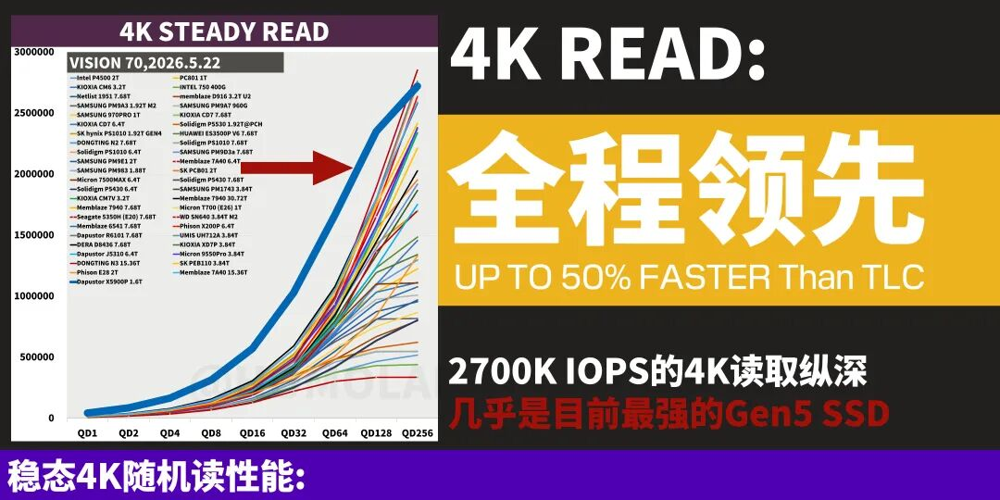

尽管受限于MLC闪存,X5在Pcmark等消费级场景中表现相较于上代出现下降,但他依然高于所有企业级硬盘. 同时他依然拥有与X2900P同级的超低延迟,并且可用容量大了一倍.

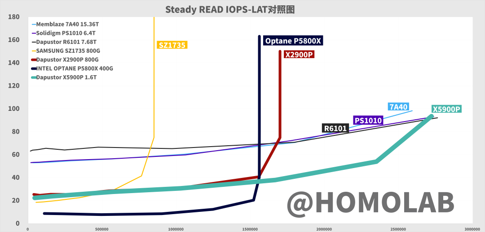

即使相隔4年,X5900P依然没有在所有领域完成对Optane的击败,我们必须要承认一点:P5800X依然是目前延迟与混合表现的神.

这其中固然有MLC模式的原因,但考虑到ZNAND与XL一代的实际延迟,恐怕3Dxpoint在很长一段时间内仍然是SCM中的特例.

但依靠着更强的主控,X5900P做到在大部分领域中击败了傲腾,更高的IOPS上限与更好的延迟控制,这些都证明了他的独特价值.

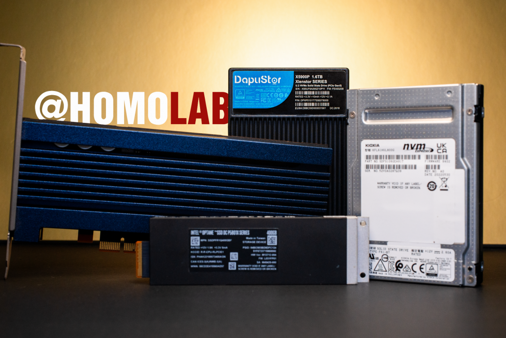

在高性能这一条路上,X5900P是一个孤独王者,耗费了无数资金与精力打造出来的、一切为了高性能而生的终极怪物. 纵然不完美,但他已足够让所有对手敬畏.