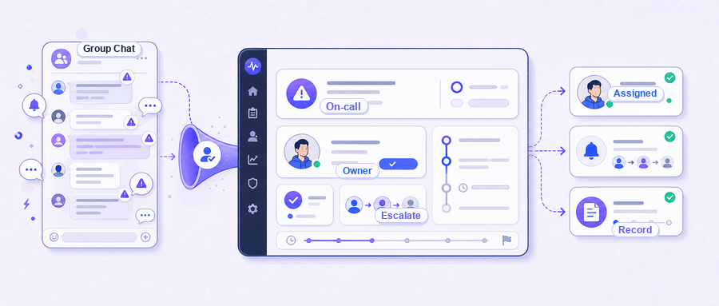
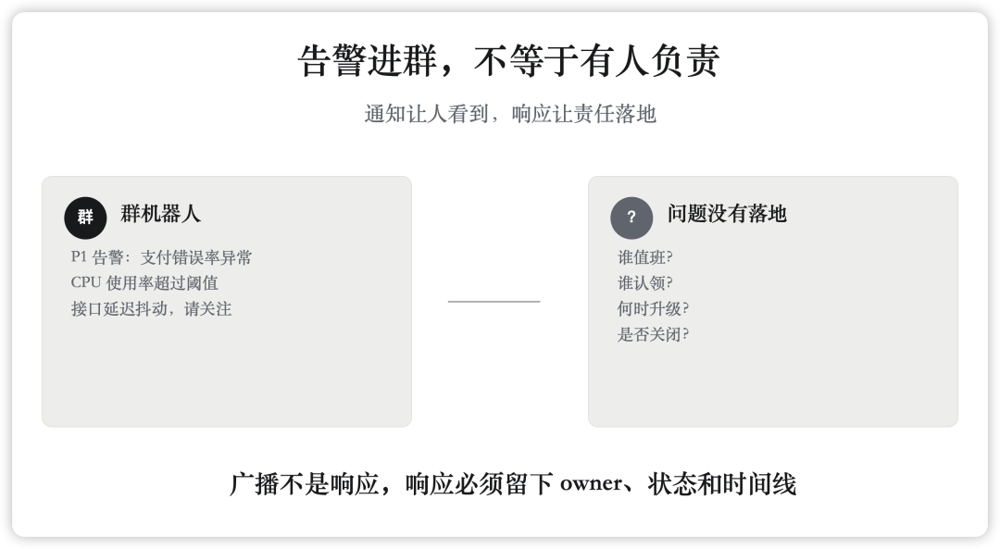
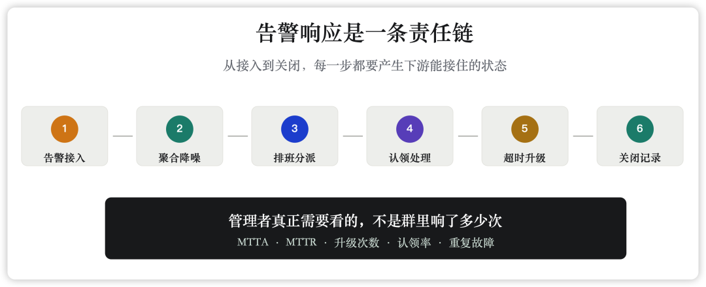

很多团队的告警治理，是从一个群机器人开始的。

接入快，成本低，几分钟就能把 Prometheus、Zabbix、Nightingale、云监控、自研脚本的告警推到企业微信、飞书或钉钉群里。屏幕上终于有动静了，凌晨的手机也会响。对刚开始补监控的团队来说，这一步有价值，至少告警不再躺在某个无人登录的控制台里。

但问题也从这里开始。群消息一多，所有人都“看见了”，反而没人知道自己是不是应该动手。值班人以为业务负责人会看，业务负责人以为运维组已经在查，运维组以为这是一个应用问题。十几分钟后，有人问一句“这个谁在处理”，群里才开始补认领、补截图、补上下文。

这不是通知失败。通知已经成功了。

失败的是响应。

## 群消息解决的是可见性，不是责任

IM 群机器人最大的优点，是把告警从监控系统里搬到了团队每天都会看的地方。它降低了接入门槛，也让信息更透明。但它没有回答几个最关键的问题：现在谁值班？这条告警归谁？有没有人认领？多久没响应要升级？处理完谁关闭？事后有没有复盘？同类问题下次能不能少响一点？

这些问题不解决，群越热闹，现场越混乱。

Google SRE 在监控章节里强调，告警之所以要打扰人，是因为系统有问题，需要有人马上调查、缓解并找到原因；频繁、低质量的告警会让人开始略读甚至忽略真正重要的页面。IBM 对 alert fatigue 的定义也指向同一个事实：大量低优先级、误报或不可行动的通知，会制造精神和操作上的疲劳，最后拖慢响应。

所以告警治理的第一条判断标准，不是“有没有发出去”，而是“**这条告警是否能推动一个明确的人采取行动** ”，即告警是 actionable 的，同时有明确的 owner。如果一条 P1 告警和一条低价值提醒在群里长得差不多，都靠大家凭感觉判断轻重，系统其实没有在响应，只是在广播。

## 真正的响应链，比群通知长得多

一次关键告警进入团队视野后，后面至少应该发生几件事。

先是降噪。重复告警、派生告警、同一故障引发的多源告警，不能每一条都平等地刷屏。否则值班人先做的不是排障，而是在噪音里找主线。

然后是分派。告警应该进入合适的服务、团队或协作空间，而不是默认扔进一个大群。大群适合同步进展，不适合承担第一责任。

接着是触达和值班。关键告警要找到此刻真正应该响应的人。这个人可能在工作时间内，也可能在夜间或节假日；可能需要 IM，可能需要电话或短信；如果一段时间没有认领，就应该自动升级到二线、负责人或相关团队。

再往后是认领、处理、关闭。认领不是回一个“我看下”，而是在系统里留下状态。关闭也不是群里说一句“好了”，而是能回到告警记录里，看到谁在什么时候处理，最终为什么关闭。

最后是复盘和治理。Atlassian 在故障复盘资料里提到，好的 postmortem 需要清晰一致的问题框架、足够细的数据、时间线、聊天记录、工单和后续动作。这些东西不是故障结束后凭记忆拼出来的，最好在响应过程中自然留下。

## 负责人真正想知道的，是过程有没有变好

运维负责人、SRE 负责人和平台负责人看告警，不该只看“今天群里响了多少次”。响了多少次，最多说明监控系统很勤快，不说明组织响应能力更强。

更有管理价值的问题是：关键告警平均多久被认领？哪些团队经常超时？哪些服务重复触发同类告警？哪些告警最终被关闭为无效？哪些故障升级过，为什么升级？复盘之后，有没有配置变更、阈值调整、runbook 补充或架构改造？

这些问题对应的是 MTTA、MTTR、升级路径、重复故障、无效告警比例、复盘动作完成情况。它们不完美，但至少把讨论从“大家有没有看到”拉回到“组织有没有变快、变稳、变可追踪”。

只靠群机器人，很难回答这些问题。群聊天然适合讨论，不适合沉淀结构化状态。消息会被表情、闲聊、截图、转发淹没；值班安排在别处，升级规则靠人记，关闭状态靠口头同步。等到管理层问“上周那次故障到底卡在哪里”，大家只能翻聊天记录。

这也是很多团队从 IM 群走向 On-call 体系的原因。不是因为群没用，而是因为群只能做协同界面，不能做责任系统。

## On-call 的价值，是把“看见”变成“负责”

一个成熟的告警响应体系，通常会把告警接入、降噪、路由、排班、升级、触达、认领、关闭和分析串起来。Flashduty 文档里对 On-call 的描述，也基本围绕这些动作展开：多源集成、告警聚合和抑制、灵活分派、多渠道通知、值班计划、升级路径，以及值班人员认领、处理、关闭故障。

这不是把群机器人换成另一个更复杂的通知工具。真正的变化是责任对象变了。

过去是一条消息进群，大家一起“看到”。现在是一条事件进入响应流程，被分派给对应团队和值班人；如果没有响应，系统按规则升级；如果处理完成，状态会关闭；如果反复发生，后续可以分析和治理。IM 群仍然重要，它承载沟通、同步和作战室协作，但它不再是唯一的事实来源。

对 CIO 和平台负责人来说，这个差别很关键。你不能靠“群里应该有人看见了”来解释一次核心业务故障，也不能靠“我们都在群里很积极”来证明稳定性治理在进步。你需要的是可审计、可追踪、可复盘的过程。

当然，工具不会替组织背锅。On-call 平台也不能替你定义服务边界、团队职责和告警质量。如果服务归属混乱，告警规则随手乱配，升级路径没人维护，再好的系统也会变成另一个消息中转站。工具能做的是把这些组织问题暴露出来，让它们不再藏在群聊的滚动记录里。

## 可以从最近 10 条关键告警开始查

不需要先做大项目。抽查最近 10 条关键告警，逐条问几个问题就够了：

  * 有没有明确 owner？
  * 有没有认领时间？
  * 有没有升级路径？
  * 有没有关闭记录？
  * 有没有复盘结论或后续动作？

如果大多数答案都要靠翻群、问人、猜上下文，那说明你们现在拥有的是告警通知，不是故障响应。

把告警发到群里，是起点，不是终点。真正该建设的，是让每一条关键告警都能找到负责人，推动处理，留下记录，并让下一次响应更快一点。

如果你认同上面的理念，想要建设完备的 On-call 故障响应体系，推荐你了解一下 Flashduty：**https://flashduty.com** 。