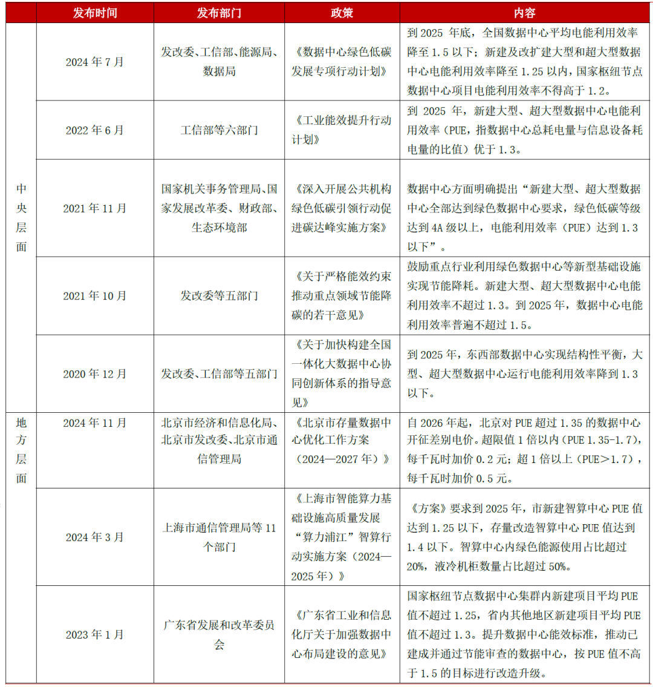

国家及各地方政府对数据中心PUE 趋严，有望推动液冷技术快速渗透。在“双碳”目标推进及“东数西算”工程实施的背景下，国家及各地方对数据中心PUE 要求趋严，致力于推动数据中心绿色发展。

在国家层面，根据国家发展改革委、工信部等部门于2024年联合发布的《数据中心绿色低碳发展专项行动计划》，其中明确提出，到2025 年底，全国数据中心平均PUE 降至1.5 以下，新建及改扩建大型和超大型数据中心电能利用效率降至1.25 以内，国家枢纽节点数据中心项目电能利用效率不得高于1.2。

在国家政策引领下，各地方政府也纷纷出台相应方案或意见，积极向国家政策标准靠拢，部分省份例如北京对于数据中心PUE 值提出更严格要求并具有直接的惩戒效应。《北京市存量数据中心优化工作方案（2024—2027 年）》明确规定，自2026 年起，北京对PUE 超过1.35的数据中心开征差别电价。超限值1 倍以内（PUE 1.35-1.7），加价0.2 元/度；超1倍以上（PUE＞1.7），加价0.5 元/度。

表：国家及地方政府对数据中心PUE要求政策汇总

“双碳”目标下，2026年全国各省市密集出台数据中心PUE管控政策：新建大型项目PUE普遍要求低于1.3，枢纽节点严控至1.25以下；超限存量项目面临加价、限电或关停。液冷、绿电交易、算电协同成为主流路径。在此背景下，本汇编系统梳理了全国各省市2026年最新PUE管控与激励政策，一起来看看吧~

**Part.1**

**北京市**

▶ 2026年起，北京对PUE超过1.35的数据中心开征差别电价。超限值1倍以内（PUE 1.35-1.7），加价0.2元/度；超1倍以上（PUE＞1.7），加价0.5元/度。

▶ 目标2027年全市年均PUE降至1.35以下，所有存量项目必须达标。

▶ 绿电方面，PUE越低，绿电比例要求反而越宽松：PUE≤1.2的绿电比例力争20%，1.2-1.35力争30%，高于1.35则要求达到40%。

▶ 节能改造项目最高可获3000万元奖励，节能量补贴最高1200元/吨标准煤，其他绿色项目按投资额30%补。同时，达标数据中心会被公示，鼓励高效项目整合低效设施承接业务迁移。

**Part.2**

**上海市**

▶ 2026年新建数据中心PUE力争控制在1.25，智算中心以1.25为硬门槛。

▶ 未来新建项目可能比1.25更严，并考虑跟进差别电价、扩大碳交易覆盖范围。

▶ 液冷、绿电交易+绿证是主要技术路径，万国数据浦江中心、网宿嘉定园区等已稳定运行在PUE 1.26以下。

**Part.3**

**江苏省**

▶ 新建大型及以上数据中心须达绿色数据中心标准，PUE＜1.3，绿色低碳等级4A以上；中小型PUE不高于1.5。

▶ 2026年底前，PUE＞1.4的大型存量项目改造后需降至1.35以下。新建PUE≤1.2的数据中心，每机架补贴800元，单项目上限2000万元。

**Part.4**

**天津市**

▶ 大型新建数据中心PUE≤1.3，中小型≤1.5；纳入京津冀枢纽节点的项目需≤1.25。

▶ 2026年底前，所有PUE＞1.5的存量项目必须完成改造，目标降至1.4以下，否则限制扩容。

▶ 新建PUE≤1.2的数据中心，每个机架补贴500元；存量改造后PUE下降0.2以上，按总投资10%补贴，上限1000万元。

**Part.5**

**重庆市**

▶ 成渝枢纽节点内新建数据中心PUE≤1.25，其他区域大型项目≤1.3，中小型≤1.5。

▶ 标杆项目需达国标1级能效。

▶ 鼓励与新能源企业“源网荷储”协同，PUE≤1.2且绿电消纳不低于50%的项目，可获额外补贴。

**Part.6**

**河北市（含雄安新区）**

▶ 2025年底已实现PUE＞1.3的大型、超大型存量数据中心全部关停退出，2026年巩固成果，严禁重启。新建项目优先支持可再生能源供电比例达50%以上；纳入京津冀枢纽节点的项目PUE≤1.25，其他区域大型项目≤1.3。

▶ 采用间接蒸发冷却、液冷等技术且PUE≤1.2的新建项目，按投资额8%补贴，上限500万元。

**Part.7**

**山西省**

▶ 2026年新建数据中心PUE≤1.3，存量改造后需降至1.4以下，2026年底前完成所有低效项目改造。

▶ 年均PUE首次低于1.18的数据中心，按物理机架最高1000元/个补贴，单企上限500万元。PUE≤1.2且绿电消纳比例≥60%的项目，额外给予补贴倾斜。

**Part.8**

**内蒙古自治区**

▶ 和林格尔、集宁等枢纽节点新建数据中心PUE严控在1.2以下，主推自然冷却。

▶ PUE≤1.15的数据中心优先参与碳交易收益分配，依托绿电优势推动数据中心100%使用绿电。

**Part.9**

**辽宁省**

▶ 2026年新建数据中心PUE≤1.3，重点布局沈阳、大连“双核”及辽西增长极，新建项目必须同步配套节能设施。

▶ 存量改造后PUE需降至1.5以下，2026年底前完成，鼓励AI节能自控、余热回收。

辽西地区PUE≤1.25的项目，享受土地、电价优惠政策。

**Part.10**

**吉林省**

▶ 大型新建数据中心PUE≤1.25，中小型≤1.4。

▶ 2026年底前，PUE＞1.5的存量项目改造后需降至1.4以下，未达标暂停运营。

▶ PUE≤1.2的数据中心，每度电补贴0.03元，连续补3年；鼓励与新能源项目协同。

**Part.11**

**黑龙江省**

▶ 2026年力争大型新建数据中心PUE降至1.25以下，依托风、光资源推动算电协同。存量项目持续推广间接蒸发冷却、AI节能自控等技术。

▶ 哈尔滨、大庆等城市优先布局，PUE≤1.2的项目可获用地、用能指标倾斜。

**Part.12**

**浙江省**

▶ 2026年全省普通数据中心PUE不高于1.5，平均不高于1.4；新建大型及以上PUE不高于1.3，长三角枢纽节点项目≤1.25。

▶ PUE＞1.5的存量项目须在2026年6月底前完成改造，否则限电。PUE≤1.2享受每度电降0.05元优惠；PUE＞1.6加价0.3元/度。鼓励数据中心参与虚拟电厂调峰。

**Part.13**

**安徽省（含芜湖集群）**

▶ 芜湖集群：新建项目规模不低于3000标准机架，上架率不低于65%，PUE＜1.25。

▶ PUE＞1.4且≤1.8加价0.11元/度，＞1.8加价0.5元/度。全省其他区域新建大型项目PUE≤1.3，中小型≤1.5；2026年底全省平均PUE降至1.35以下。

▶ 新建PUE≤1.2补贴投资额10%，上限1500万元；存量改造后PUE下降0.3以上，一次性补500万元。

**Part.14**

**福建省**

▶ 到2026年全省数据中心平均PUE低于1.35。新建大型项目PUE≤1.3，中小型≤1.5；纳入全国一体化算力网的项目需≤1.25。

▶ 重点依托数字福建（长乐、安溪）产业园，推广液冷、余热回收，探索绿电直供、数电联营。

**Part.15**

**江西省**

▶ 2026年新建及改扩建数据中心PUE一般不超过1.25，优先支持绿电占比高的项目。

▶ 全省平均PUE降至1.5以下，上架率高于60%。2026年底前完成PUE＞1.5的存量项目改造，鼓励液冷、新型储能，支持通过绿证绿电交易提升绿电消费比例。

**Part.16**

**山东省**

▶ 2026年新建大型以上数据中心设计PUE不高于1.3，鼓励采用浸没液冷、间接蒸发冷却。

▶ 2026年底前，全省大型以上存量项目实测PUE力争降至1.4以下。支持应用高压直流供电、模块化UPS、变频制冷、余热利用等技术，力争全年节约用电突破1亿度。

**Part.17**

**河南省**

▶ 新建大型项目PUE≤1.3，中小型≤1.5；纳入全国一体化算力网的项目PUE≤1.25，优先布局郑州、洛阳。

▶ 2026年底前，PUE＞1.5的存量项目改造后需降至1.4以下，否则不予审批扩容。

PUE≤1.2补贴0.04元/度，连续2年；绿电占比≥50%额外补贴。

**Part.18**

**湖北省**

▶ 鼓励各地推动数据中心与新能源企业“源网荷储”协同，形成算电一体供能体系。

▶ 新建大型项目PUE≤1.3，成渝枢纽相关项目≤1.25。支持宜昌、十堰打造绿色算力中心，PUE≤1.2的重点项目按投资额8%补贴，上限1000万元。

**Part.19**

**湖南省**

▶ 新建（改造）总算力50PFlops以上、PUE不高于1.3的智算基础设施项目，按设备和软件费用的10%补助，上限2000万元。

▶ 新建大型项目PUE≤1.3，中小型≤1.5；2026年底全省平均PUE降至1.35以下。PUE≤1.2的项目优先纳入省级绿色数据中心名录，享受税收优惠。

**Part.20**

**广东省**

▶ 国家枢纽节点内新建项目平均PUE不超过1.25，省内其他地区不超过1.3。

▶ 已建成项目须按PUE不高于1.5完成改造，2026年底前全部达标。PUE≤1.2每机架补贴600元；PUE＞1.6加价0.4元/度；绿电占比≥70%额外补贴。

**Part.21**

**广西壮族自治区**

▶ 到2026年，大型、超大型数据中心平均PUE低于1.3，其他类型不超过1.5。

▶ 2026年底前完成PUE超过1.5的项目改造。推广液冷、余热回收，优先支持绿电占比较高的新建、扩建项目，打造“一跳直达”直联网络。

**Part.22**

**海南省**

▶ 新建大型项目PUE≤1.3，中小型≤1.5。海底数据中心（UDC）依托海洋冷却优势，PUE控制在1.1以下。

▶ 数据中心绿电消纳比例不低于60%，PUE≤1.2且绿电比例≥80%的项目，按投资额15%补贴，上限3000万元。推动海底数据中心接入国家算力互联网。

**Part.23**

**四川省（含天府集群）**

▶ 天府集群内新建大型、超大型数据中心PUE＜1.25，一次性奖补2000万元；PUE＜1.15奖补3000万元。2026年全省机架规模达50万，上架率60%，平均PUE不高于1.3；集群起步区机架30万，上架率70%，PUE不高于1.25，可再生能源使用率85%。集群外平均上架率未达60%、平均PUE未达1.3的区域，原则上不得新建数据中心。

**Part.24**

**贵州省（含贵安集群）**

▶ 2026年全省数据中心平均PUE降至1.19，达到国标一级能效。算力规模目标190EFLOPS，“算力券”政策支持增至1.4亿元。

▶ 重点项目PUE控制在1.15以下。全省新建大型项目PUE≤1.25，智算占比已超97%，推广智能建筑平台、液冷等技术。

**Part.25**

**云南省**

▶ 2026年新建大型及以上数据中心绿色等级4A以上，PUE达到1.3以下。2026年底前完成PUE超1.5的存量项目改造。

▶ PUE≤1.2的项目优先获得绿电直供及电价优惠。

**Part.26**

**西藏自治区**

▶ 新建大型数据中心PUE≤1.2，中小型≤1.4，利用高原低温优势推广自然冷却。

绿电消纳比例不低于90%，PUE≤1.15的项目可享受税收全额减免。

▶ 2026年底前完成PUE＞1.5的存量项目改造，改造后需降至1.4以下。

**Part.27**

**陕西省**

▶ 新建大型项目PUE≤1.25，中小型≤1.4；全国一体化算力网项目需≤1.2，优先布局西安、榆林。

▶ 2026年底前，PUE＞1.5的存量项目改造后需降至1.4以下，否则断电整改。PUE≤1.2按投资额10%补贴，上限2000万元。

**Part.28**

**甘肃省（含庆阳集群）**

▶ 庆阳集群：2026年起新建大型、超大型数据中心PUE≤1.20，单项目规模不低于3000标准机架，平均功率≥8kW，等级国标A级。

投产后PUE综合需≤1.20，1年内上架率≥65%。

▶ 全省其他区域新建大型项目PUE≤1.3，中小型≤1.5，鼓励绿色等级达G4及以上。

**Part.29**

**青海省**

▶ 新建（改扩建）大型及以上数据中心PUE严格控制在1.2以下，清洁能源利用率100%并可追溯。

▶ 2026年底前完成年均PUE＞1.5的功能落后数据中心腾退，严禁低效项目扩容。

出台绿色算力认证规则，强化PUE全流程管控。

**Part.30**

**宁夏回族自治区**

▶ 新建大型数据中心PUE≤1.2，中小型≤1.4；依托光伏、风电优势，绿电消纳比例≥80%。

▶ 新建PUE≤1.15的项目，每机架补贴1000元，单项目上限2000万元。

2026年底前完成PUE＞1.5的存量项目改造，改造后PUE≤1.2的，按投资额8%补贴。

**Part.31**

**新疆维吾尔自治区**

▶ 依托低温气候和绿电资源，现有数据中心PUE普遍在1.08-1.15之间，克拉玛依、昌吉标杆项目已达1.13、1.08、1.15。

▶ 2026年新建大型项目PUE≤1.2，中小型≤1.4，优先支持绿电直供，推动100%可再生能源。重点在克拉玛依、昌吉布局，承接东部高能耗算力。

  

**Part.32**

**香港**

▶ 新建数据中心PUE≤1.3，大型项目（机架≥1000个）≤1.25，禁止新建PUE＞1.35。

2026年底前完成PUE＞1.5的存量项目改造，改造后需降至1.4以下，否则不续运营牌照。

▶ PUE≤1.2的电费补贴0.1港元/度，连续3年。

**Part.21**

**澳门**

▶ 新建数据中心PUE≤1.35，中小型≤1.5，服务于数字政务、文旅的项目优先，PUE≤1.25可获政府资金支持。PUE≤1.3且绿电消纳≥50%，按投资额5%补贴。

▶ 2026年底前完成PUE＞1.6的存量项目改造，改造后需降至1.5以下。

**Part.21**

**台湾省**

▶ 新建大型数据中心PUE≤1.3，中小型≤1.5；“数位台湾”重点项目需≤1.25。

2026年底前完成PUE＞1.5的存量项目改造，改造后需降至1.4以下。

▶ PUE≤1.2的企业所得税降低5个百分点，鼓励与新能源项目协同。

****-END-****

**未经书面授权，禁止转载。****公众号：数据中心运营管理**

☼往期精彩内容**☞**[免费领取数据中心基础设施运维资料](https://mp.weixin.qq.com/s?__biz=MzI5MzEyNjYwNA==&mid=2247485226&idx=2&sn=33e61f283629d3f2b4d5089616c16194&scene=21#wechat_redirect)**☞**[【视频分享】数据中心基础设施运维工程师培训](https://mp.weixin.qq.com/s?__biz=MzI5MzEyNjYwNA==&mid=2247525644&idx=1&sn=2243e2080aa63337b5c6465d6a7556da&scene=21#wechat_redirect)**☞**[数据中心基础设施工程验收检查表-Excel电子表格](https://mp.weixin.qq.com/s?__biz=MzI5MzEyNjYwNA==&mid=2247490108&idx=1&sn=cf35de8c7b3c63b7b79e59d2dbfd6c73&scene=21#wechat_redirect)**☞**[数据中心基础设施运维工程师培训教材](https://mp.weixin.qq.com/s?__biz=MzI5MzEyNjYwNA==&mid=2247493903&idx=1&sn=4e50d7c671cfc984723040c1baaa5afd&scene=21#wechat_redirect)**☞**[数据中心基础设施规划设计精品视频课程分享](https://mp.weixin.qq.com/s?__biz=MzI5MzEyNjYwNA==&mid=2247495645&idx=1&sn=0298e35273309cc556d4107f9d198ced&scene=21#wechat_redirect)**☞**[数据中心基础设施运维工程师培训PPT课件汇总](https://mp.weixin.qq.com/s?__biz=MzI5MzEyNjYwNA==&mid=2247505047&idx=1&sn=5def2d243ce61c5c52e1d046aa7d8bd4&scene=21#wechat_redirect)**☞**[数据中心基础设施运维3P文件整理汇总\(231014\)——2025更新版](https://mp.weixin.qq.com/s?__biz=MzI5MzEyNjYwNA==&mid=2247526612&idx=1&sn=09a050e57cf7f8758dc1de44adffc11a&scene=21#wechat_redirect)****☞****[数据中心基础设施一线值班员实战手册](https://mp.weixin.qq.com/s?__biz=MzI5MzEyNjYwNA==&mid=2247529955&idx=1&sn=d03c58880dd98cf5bb4a83e8a9efa573&scene=21#wechat_redirect)****☞****[数据中心基础设施一线管理者实战指南](https://mp.weixin.qq.com/s?__biz=MzI5MzEyNjYwNA==&mid=2247529936&idx=1&sn=385b3ec87d788432413d22923edb6279&scene=21#wechat_redirect)

**【**版权声明** 】**

凡本公众平台注明来源或转自的文章，版权归原作者及原出处所有，仅供大家学习参考之用，若来源标注错误或侵犯到您的权利，烦请告知，我们将立即删除。

**【免责声明】**

本公众平台对转载、分享的内容、陈述、观点判断保持中立，不对所包含内容的准确性、可靠性或完善性提供任何明示或暗示的保证，仅供读者参考。