  

  

  

本文深入探讨构建高质量 RAG 知识库的垂直技术原理与工程实践。文章首先界定知识库作为外部记忆系统的角色，并引入 RAGAS 框架从检索相关性、生成忠实度及答案相关性维度建立评估标准。随后详细拆解离线索引与在线查询流程，重点分析文档切分策略如 Late Chunking 和意图驱动切分，对比稀疏、稠密及混合检索范式，并阐述HyDE等查询增强技术。此外，文章探讨 Cross-Encoder 重排序机制以优化精度，介绍 AutoRAG 自动化优化、 QuIM-RAG 问题倒排索引及 OpenViking 文件系统范式等前沿架构，旨在通过系统性技术选型解决幻觉、召回不准等问题，实现知识库性能的端到端优化。

  

## 什么是 Agent 构建中的知识库？

## 什么时候应该用它？

## 

  

## 

## 

### ▐**** 考古一下，RAG 的起源

  

**RAG（Retrieval-Augmented Generation，检索增强生成）** 由 Facebook AI Research（现 Meta AI）于 2020 年首次提出。

  

项目| 内容  
---|---  
论文|  *Retrieval-Augmented Generation for Knowledge-Intensive NLP Tasks*  
作者| Patrick Lewis, Ethan Perez, Aleksandra Piktus, Fabio Petroni, Vladimir Karpukhin 等  
发表| NeurIPS 2020  
链接| https://arxiv.org/abs/2005.11401  
  
  

论文的核心贡献在于提出了一种将**参数化记忆（Parametric Memory）** 与**非参数化记忆（Non-Parametric Memory）** 相结合的架构：

  * **参数化记忆： 预训练 seq2seq 模型（如 BART）的模型权重**
  * **非参数化记忆： Wikipedia 语料的密集向量索引，通过 DPR（Dense Passage Retriever）构建**

这一架构在开放域问答（Open-Domain QA）任务上显著超越了纯参数化模型，奠定了后续 RAG 研究的基础。

  

## 

## 

## 

### ▐**** 知识库的定义

  

在 Agent 构建的语境下，**知识库（Knowledge Base）** 是一个外部记忆系统，用于存储和检索不在模型参数中的信息。它作为 RAG 架构的核心组件，承担非参数化记忆的角色。

RAG 的基本工作流程：

Query → Retriever（检索器） → Top-K Documents → Context Augmentation → Generator（生成器） → Response

其中，知识库的核心接口，就是上传和召回。不同版本和理论，就是召回的内容和排序的区别。

  

## 

## 

## 

### ▐**** 使用知识库可以解决什么问题？

  

这个问题应该回到 LLM 的固有局限上，知识库是一种对应的解决方案：

  

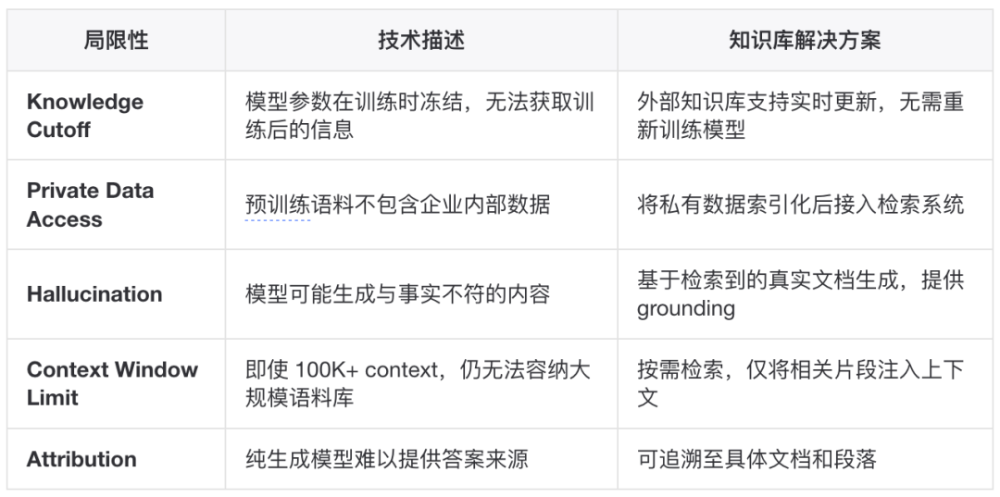

  

## 

## 

## 

### ▐**** 适用场景分析

  

结合前面几点，使用场景也比较清晰了。

**适合构建知识库的场景：**

**  
**

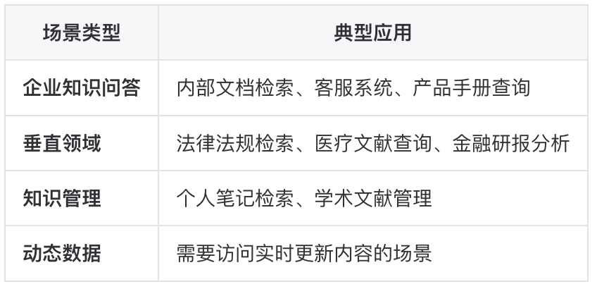

  

**不需要知识库的场景：**

**  
**

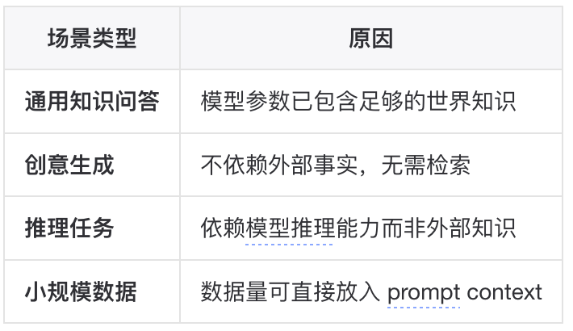

**  
**

## 

## 

## 

### ▐**** RAG vs Long Context

**  
**

**随着上下文窗口的扩展（Claude 200K, Gemini 1M+），需要重新审视 RAG 的适用边界：**

**  
**

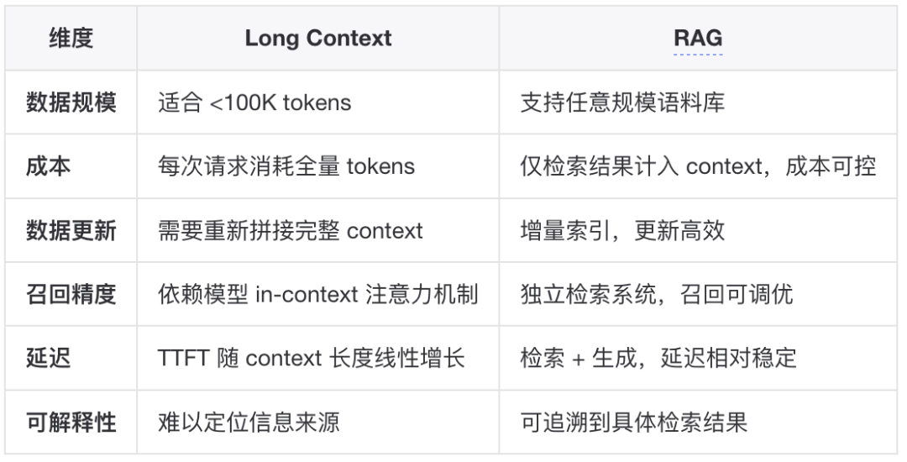

**  
**

**选型建议：**

  * 数据量 < 50K tokens 且更新频率低 → Long Context
  * 数据量大、更新频繁、需要精确召回 → RAG
  * 混合方案：RAG 粗筛 + Long Context 精读

**  
**

## 

## 如何评判一个知识库的好坏？

**  
**

**如题，我们想要构建更好的知识库，那么首先需要定义"好"的标准。**

  

## 

## 

## 

###  ▐**** 评估框架：RAGAS

  

**RAGAS（Retrieval Augmented Generation Assessment）** 是目前最广泛采用的 RAG 评估框架，其核心价值在于**无参考评估（Reference-Free）** ——无需人工标注 ground truth 即可进行自动化评估。

  

项目| 内容  
---|---  
论文|  *RAGAS: Automated Evaluation of Retrieval Augmented Generation*  
链接| https://arxiv.org/abs/2309.15217  
发表| 2023  
  
  

RAGAS 将 RAG 系统的评估分解为三个核心维度：

  

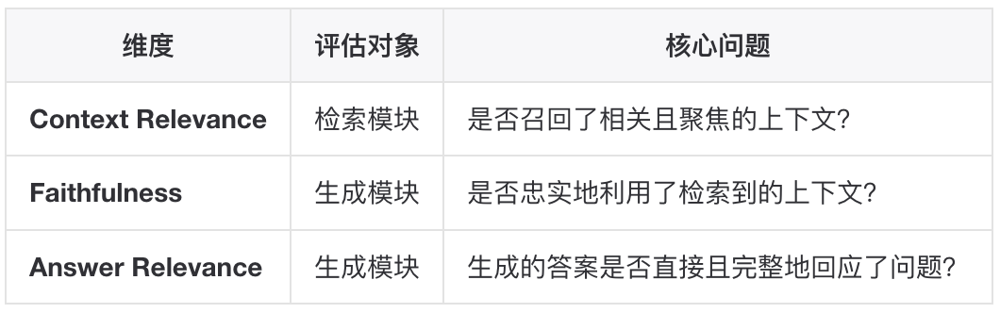

  

这三个维度相互独立但互补，共同覆盖 RAG 系统的端到端性能。RAGAS 的关键洞察：**RAG 系统的失败往往是检索和生成环节共同造成的** ，因此必须分别评估，才能定位问题根因。下面来看下这几个环节可以对应的指标有些什么。

  

## 

## 

## 

### ▐**** 检索质量指标

  

检索环节的目标是：**召回与 query 相关的文档片段，并将相关内容排在前面** 。

  

### Context Precision（上下文精确率）

**定义** ：评估检索器将相关文档排在不相关文档之上的能力。

**计算方法** ：

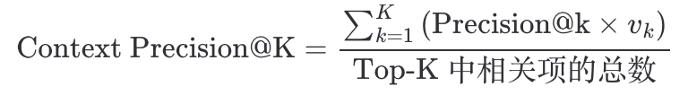

其中：

**直观理解** ：如果检索了 5 个 chunks，相关的 2 个排在第 1、2 位，比排在第 4、5 位的 precision 更高。

  

### Context Recall（上下文召回率）

**定义** ：评估回答问题所需的信息有多少被成功检索到。

**计算方法** ：

具体步骤：

  1. 将参考答案分解为多个 claims（声明）
  2. 判断每个 claim 是否可归因于检索到的上下文
  3. 计算被支持的 claims 占比

**注意** ：Context Recall 需要参考答案（reference），因此不是完全的 reference-free 指标。

  

### 传统 IR 指标：（除 RAGAS 定义的指标外，传统 IR（Information Retrieval）指标仍然适用）

## 

###   

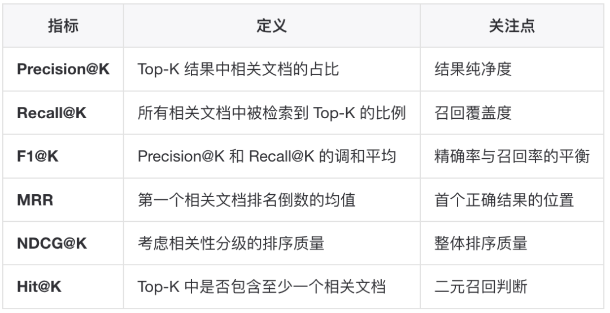

  

**Precision、Recall 与 F1 的关系** ：

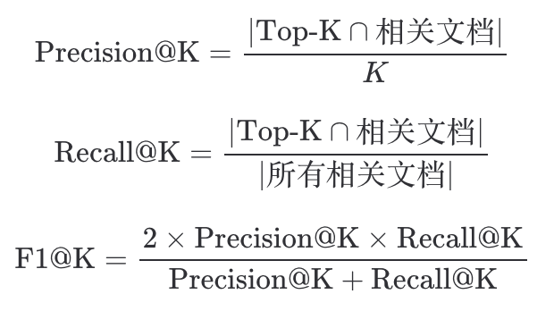

F1 是 Precision 和 Recall 的调和平均数，用于在两者之间取得平衡。当 Precision 和 Recall 差异较大时，F1 会偏向较小的那个值，因此 F1 高意味着两者都不能太低。

  

## 

## 

## 

### ▐**** 生成质量指标

  

生成环节的目标是：**基于检索到的上下文，生成准确、相关的答案** 。

  

### Faithfulness（忠实度）

## 

**定义** ：生成的答案在事实上是否与检索到的上下文一致。取值范围 \[0, 1\]，值越高表示答案越忠实于上下文。

**计算方法** ：

具体步骤：

  1. 使用 LLM 从答案中提取所有声明（claims）
  2. 对每个声明，验证是否能从检索上下文中推断
  3. 计算被支持的声明占比

### **示例** ：

## 

###   

  

### Answer Relevance（答案相关性）

**定义** ：答案是否直接且恰当地回应了问题。该指标不考虑事实准确性，而是惩罚不完整或包含冗余信息的答案。

**计算方法** ：

其中：

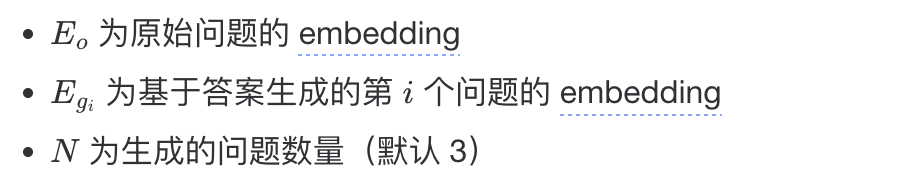

**核心思想** ：如果答案正确回应了问题，那么从答案反向生成的问题应该与原问题高度相似。

  

## 

## 

## 

### ▐**** 幻觉问题的深入分析

  

Faithfulness 指标的本质是检测幻觉。RAG 系统的幻觉可进一步细分为三类：

  

  

参考论文：https://arxiv.org/abs/2601.19927

  

### 幻觉检测方法

## 

###   

  

参考论文：https://arxiv.org/abs/2503.21157

不同 RAG 应用场景（医疗、法律、通用 QA）对检测器的要求不同，需根据具体场景选择。

  

## 

## 

## 

### ▐**** RAG 场景的特殊考量

  

传统 IR 指标基于语义相似度评估检索质量，但在 RAG 场景下存在一个核心问题：**语义相似 ≠ 对 LLM 有用** 。

ICLERB（In-Context Learning Embedding and Reranker Benchmark）提出了端到端评估思路，这意味着：一个"好"的检索结果，不仅要语义相关，还要能有效支撑 LLM 生成正确答案。

检索候选文档 → 注入 LLM 生成答案 → 评估答案准确性 → 反推检索器效果

参考论文：https://arxiv.org/abs/2411.18947

以上，在理解了评估标准后，接下来拆解知识库构建的完整流程，分析每个环节的优化空间。

  

## 

## 

## 构建知识库分为几步？

  

知识库的构建可以分为两个阶段：**离线索引阶段（Indexing）** 和 **在线查询阶段（Querying）** 。本章节结合idealab平台（https://idealab.alibaba-inc.com/\#/aistudio）的操作进行讲解。

**离线索引阶段** ：`Load → Split → Embed → Store`

  

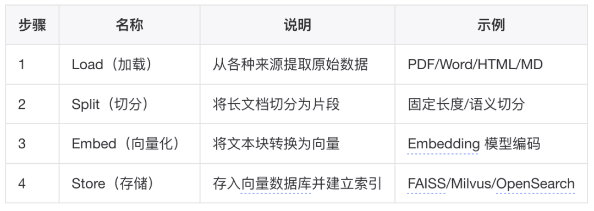

  

**在线查询阶段** ：`Query → Retrieve → Rerank → Generate`

  

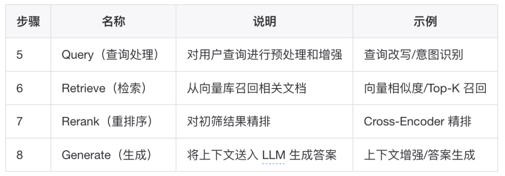

  

## 

## 

## 

### ▐**** 离线索引阶段

  

## 

## 

  * #### Step 1: Load（文档加载）

  

这一步很好理解，就是将原始数据从各种来源和格式中提取出来。 目前idealab提供的知识库支持的有odps、语雀、钉钉文档、本地文件。

  

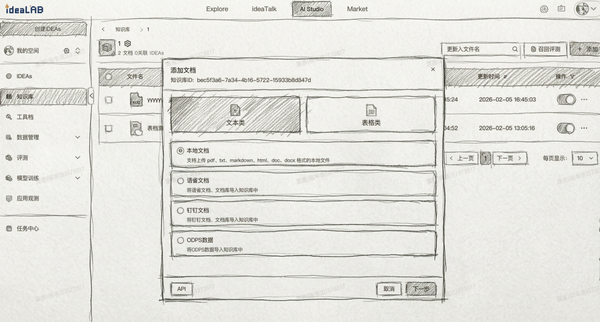

  

## 

## 

## 

  * #### Step 2: Split（文档切分）

  

将长文档切分为适合检索和上下文注入的片段（chunks）。这是影响检索质量的**关键环节** 。  
目前idealab提供的知识库支持的有默认智能切分（使用Opensearch切分方案），自定义切分（固定长度，符号切分），自定义工具切分。

  

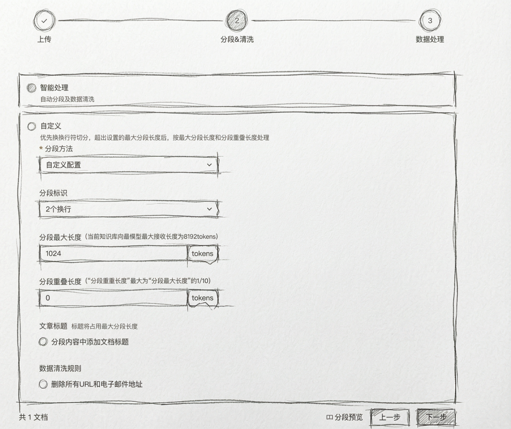

  

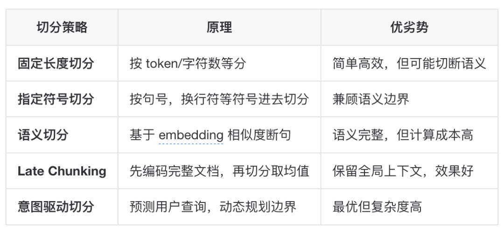

  

**关键参数** ：

  * `chunk_size：块大小，通常 256-1024 tokens`
  * `chunk_overlap：重叠区域，通常 10%-20%，防止切断关键信息`

  

## 

## 

## 

  * #### Step 3: Embed（向量化）

  

使用 Embedding 模型将文本块转换为稠密向量。本环节idealab提供了多种模型可供选择。

  

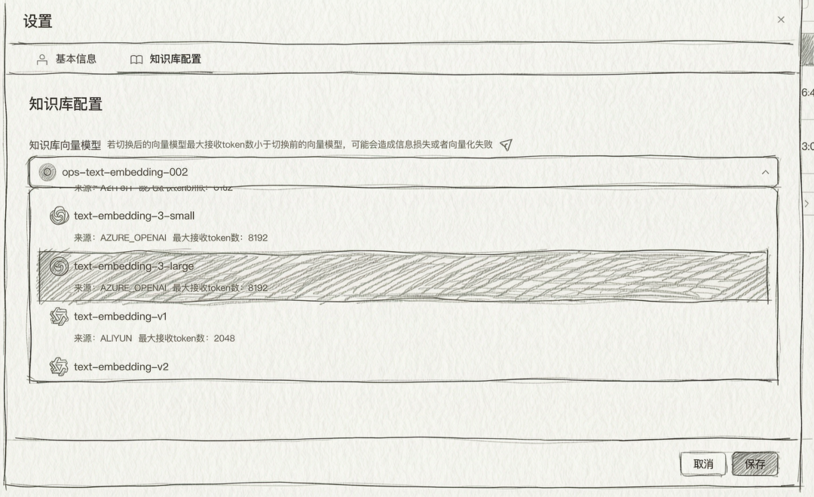

  

## 

## 

  * #### Step 4: Store（存储与索引）

  

将向量及其元数据存入向量数据库，建立高效检索索引。

  

## 

## 

### ▐**** 在线查询阶段

  

## 

## 

  * #### Step 5: Query（查询处理）

  

对用户原始查询进行预处理和增强。这一步需要Agent的搭建者进行处理，最为简单的方式就是交给大模型自己来。充分信任基模的能力。 以下是一些常见的手段。

  

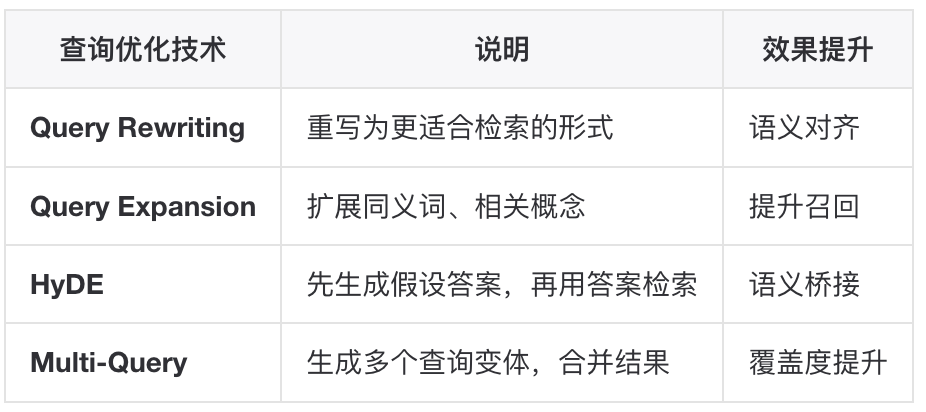

  

## 

## 

  * #### Step 6: Retrieve（向量检索）

  

从向量数据库中召回与查询最相关的文档片段。

  

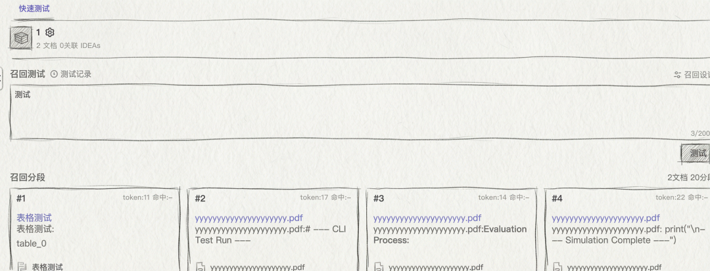

  

Query Embedding → ANN Search → Top-K Chunks

**检索模式** ：

  * **稠密检索： 基于向量相似度（余弦、内积）**
  * **稀疏检索： 基于词频统计（BM25）或学习权重（SPLADE）**
  * **混合检索： 稠密 + 稀疏，取长补短****  
**

同样的，idealab支持多种配置项；

  

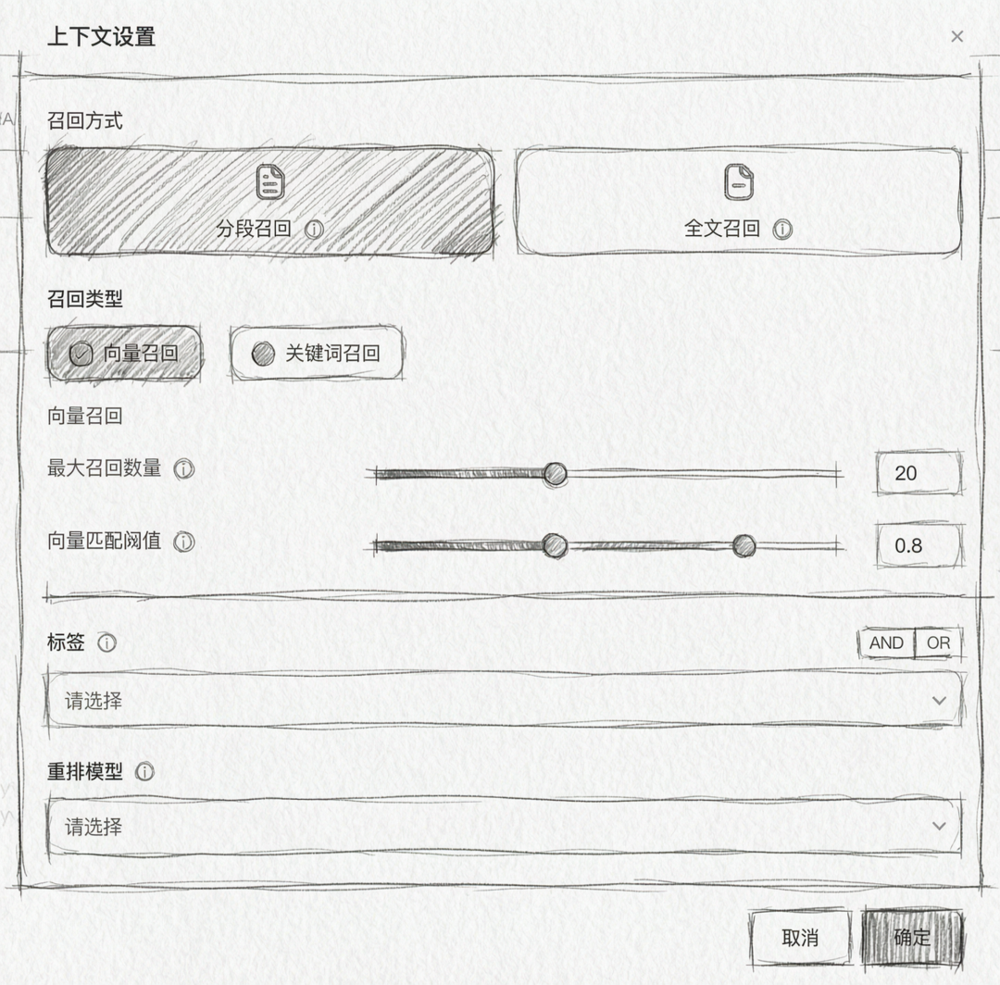

  

## 

## 

  * ####  Step 7: Rerank（重排序，可选）

  

对初筛结果进行精排，解决初步召回不够准确的问题,尤其是混合召回后的排序。提升最终送入 LLM 的内容质量。

  

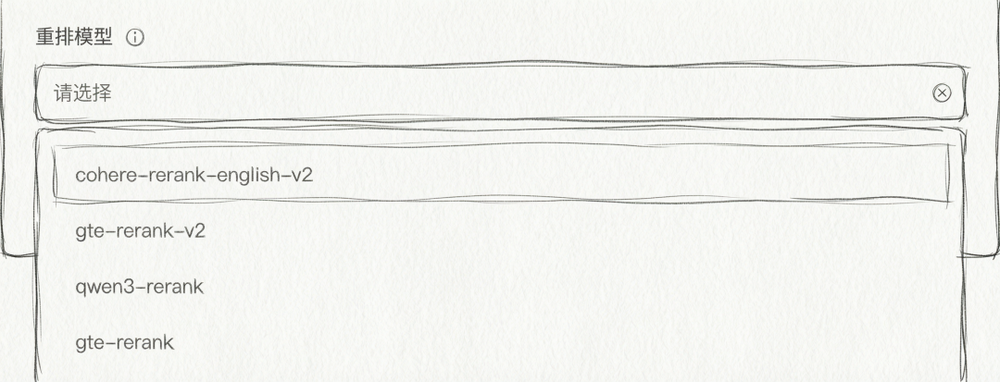  

## 

## 

  * #### Step 8: Generate（答案生成）

将检索到的上下文与用户问题一起送入 LLM 生成最终答案。

  
  

## 

### ▐**** 知识库的开源项目和案例

  
上述是 RAG 的常用实践路径，以及 idealab 提供了搭建 Agent 知识库的能力。但作为扩展 LLM 能力的一个方案，其选型和能做的还有很多想象空间。不妨站的更高一点看看别人搞了些啥。  

## 

  * #### 案例一：AutoRAG - 自动化 RAG 模块优化框架

  
项目信息| 内容  
---|---  
论文|  *AutoRAG: Automated Framework for optimization of Retrieval Augmented Generation Pipeline*  
链接| https://arxiv.org/abs/2410.20878  
GitHub| https://github.com/Marker-Inc-Korea/AutoRAG  
  
解决的问题：

RAG 系统涉及众多模块（分块策略、Embedding 模型、检索方式、Reranker 等），不同模块组合在不同数据集上表现差异很大。手动调优耗时且难以找到最优解。

**核心方法** ：

AutoRAG 提供自动化的 RAG Pipeline 优化框架：

  

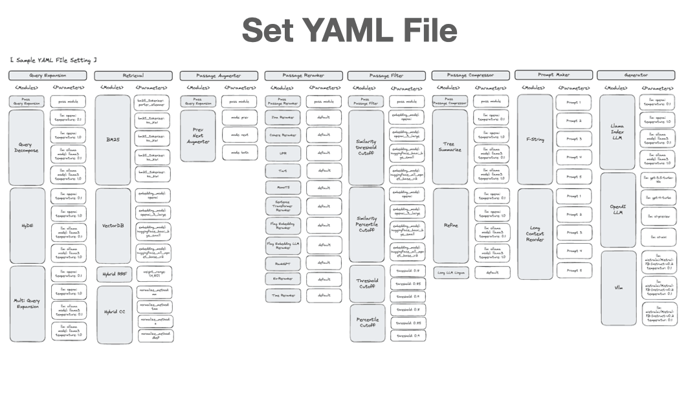

  

**适用场景** ：

  * 需要为特定领域数据集优化 RAG 配置
  * 缺乏调优经验或资源
  * 希望系统化比较不同方案

  

## 

  * #### 案例二：QuIM-RAG - 问题倒排索引匹配

  

项目信息| 内容  
---|---  
论文|  *QuIM-RAG: Advancing Retrieval-Augmented Generation with Inverted Question Matching for Enhanced QA Performance*  
发表| IEEE Access, vol. 12, pp. 185401-185410, 2024  
链接| https://arxiv.org/abs/2501.02702  
  
  

**应用背景** ：

部署在一个**日访问量数千次的高流量网站** ，用于回答复杂问题。语料库包含 500+ 页的领域文档。

**解决的问题** ：

传统 RAG 在处理大量数据时存在**信息稀释** 和**幻觉** 问题——直接用 query 检索文档片段，语义匹配不够精准。

**核心创新 - 问题倒排索引** ：

将"Query-Document 匹配"转化为"Query-Query 匹配"，提升检索精度。

**评测结果** ：

  * 使用 BERT-Score 和 RAGAS 指标评估
  * 在两项指标上均优于传统 RAG 架构

  

## 

  * #### 案例三：OpenViking - 文件系统范式的上下文数据库

  

项目信息| 内容  
---|---  
GitHub| https://github.com/volcengine/OpenViking  
作者| 字节跳动火山引擎  
  
  

**解决的问题** ：

传统 RAG 存在以下痛点：

  * **上下文碎片化： 记忆在代码中、资源在向量库、技能分散各处**
  * **扁平化存储： 缺乏全局视角，难以理解信息的完整上下文**
  * **检索黑盒： 隐式检索链出错时难以调试**
  * **记忆迭代有限： 只是被动记录交互，缺少与任务相关的主动记忆**

**核心创新 - 文件系统范式（Filesystem Paradigm）** ：

  

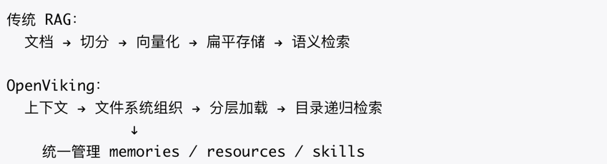

**  
**

**技术特点** ：

  

**  
**

**与传统 RAG 的对比** ：

  

  

**适用场景** ：长时运行的 Agent、需要复杂上下文管理的场景、对检索可解释性要求高的应用。

**小结** ：  
知识库构建没有标准答案，需要根据数据特点和业务场景选择合适的架构模式。核心原则：

  1. **分块粒度 要匹配信息单元的自然边界**
  2. **Embedding 模型 要匹配语料语种和领域**
  3. **检索策略 要兼顾语义召回和精确匹配**
  4. **架构模式 要根据查询复杂度选择（线性/条件/分支/循环）**

  

## 如何获得更好的切分（Chunking）？

  

切分（Chunking）是知识库构建中**影响最大但最容易被忽视** 的环节。切分质量直接决定了：

  * 检索能否召回完整的答案信息
  * 上下文是否包含足够的语义
  * 是否会引入无关噪声

  

## 

### ▐**** 切分的核心挑战

  

切分存在一个**两难困境** ：

  

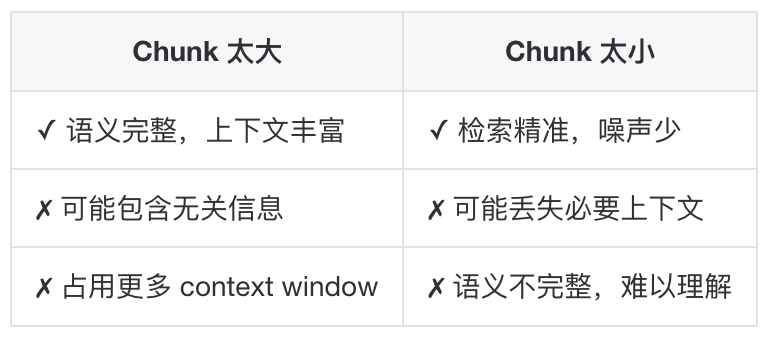

  

**核心目标** ：在粒度和完整性之间找到平衡点。

  

## 

### ▐**** 常见切分策略对比

## 

##   

## 

  * #### 固定长度切分（Fixed-size Chunking）

  

最简单的方法：按固定 token 数切分，通常加上重叠区域。

  

  

  

**适用场景** ：快速原型、对切分质量要求不高的场景

  

## 

  * #### 递归切分（Recursive Chunking）

  

按层次结构递归切分：先尝试按段落分，段落太长则按句子分，句子太长则按字符分。

  

  

  

**适用场景** ：通用文档处理，结构化文本

  

## 

  * #### 语义切分（Semantic Chunking）

  

基于语义相似度判断切分边界：相邻句子语义差异大时切分。

  

**  
**

**计算方法** ：

  1. 对每个句子计算 embedding
  2. 计算相邻句子的余弦相似度
  3. 相似度低于阈值处切分

  
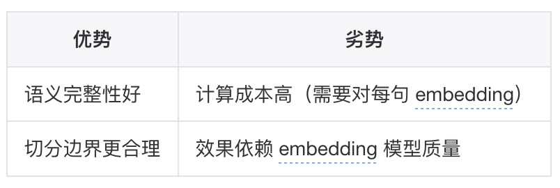

  

**关于成本效益的研究** ：

论文 \*"Is Semantic Chunking Worth the Computational Cost?"\*（https://arxiv.org/abs/2410.13070）的研究发现：

> 语义切分的计算成本与性能提升不成正比

在文档检索、证据检索、答案生成三个任务上的实验表明，语义切分相比固定长度切分，性能提升有限，但计算成本显著增加。

**结论** ：简单分块 + 合理重叠可能是更实用的选择。

  

## 

### ▐**** 进阶切分策略

  

## 

  * #### Late Chunking（延迟切分）

  

项目| 内容  
---|---  
论文|  *Late Chunking: Contextual Chunk Embeddings Using Long-Context Embedding Models*  
链接| https://arxiv.org/abs/2409.04701  
作者| Jina AI, 2024  
  
  

**核心问题** ：

传统方法"先切分，再编码"会导致每个 chunk 丢失来自其他 chunks 的上下文信息。

  

  

**为什么有效** ：

Transformer 的注意力机制使每个 token 都"看到"了整个文档。先编码再切分，每个 chunk 的表示中已经融入了全局上下文。

**使用条件** ：

  * 需要支持长上下文的 Embedding 模型（如 Jina Embeddings v2 8K）
  * 文档长度不超过模型的上下文窗口

**效果** ：在各类检索任务上优于传统切分方法，无需额外训练。

  

## 

  * #### 意图驱动动态切分（Intent-Driven Dynamic Chunking）

  

项目| 内容  
---|---  
论文|  *Intent-Driven Dynamic Chunking: Segmenting Documents to Reflect Predicted Information Needs*  
链接| https://arxiv.org/abs/2602.14784  
  
  

**核心思想** ：

切分边界应该由"用户可能问什么问题"来决定，而非文档本身的结构。

  

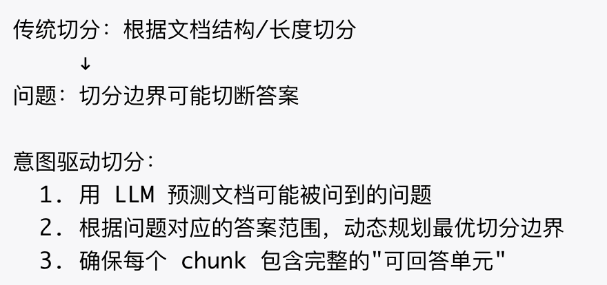

**  
**

**效果** ：

  * 检索准确率提升 5%-67%
  * 分块数量减少 40%-60%
  * 答案覆盖率保持 93%-100%

**适用场景** ：对检索质量要求高的场景，特别是长文档和异构文档。

  

## 

  * #### Small-to-Big 策略

  

检索时使用小粒度 chunk，生成时扩展为大粒度上下文。

  

  

▐**** 切分参数选择

  

## 

  * #### Chunk Size

  

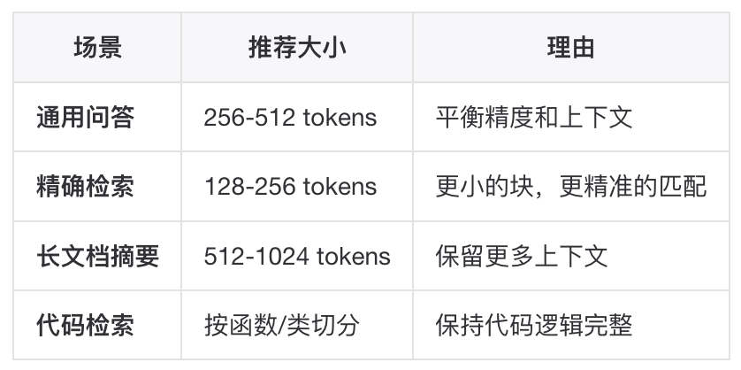

  

## 

  * #### Chunk Overlap

  

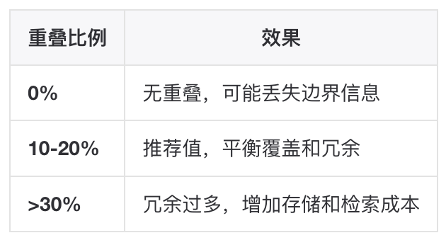

  

## 

### ▐**** 切分策略选型建议

  

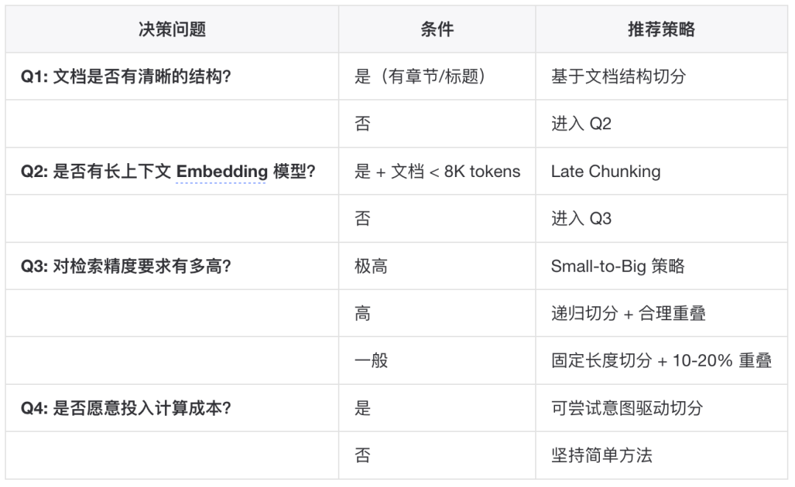

  

## 

### ▐**** 实践建议

  

  1. **从简单开始： 先用递归切分 + 10% 重叠建立 baseline**
  2. **评估驱动： 用 RAGAS 的 Context Precision/Recall 评估切分效果**
  3. **关注边界： 检查切分是否切断了关键信息（答案、实体）**
  4. **元数据保留： 切分时保留来源、章节、页码等元数据**
  5. **迭代优化： 根据 bad case 分析调整切分策略**

  

## 

## 如何获得更好的召回（Retrieval）？

  

召回（Retrieval）是 RAG 系统的核心环节。检索质量直接决定了 LLM 能否获得正确的上下文信息——如果召回阶段就漏掉了相关文档，后续的 Rerank 和生成都无法弥补。

  

▐**** 检索范式概述

  

当前主流的检索方法可分为三类：

  

  

▐**** 稀疏检索（Sparse Retrieval）

  

## 

  * #### BM25

  

BM25（Best Matching 25）是经典的稀疏检索算法，基于词频统计进行相关性打分：

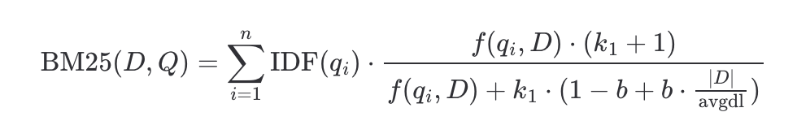

其中：

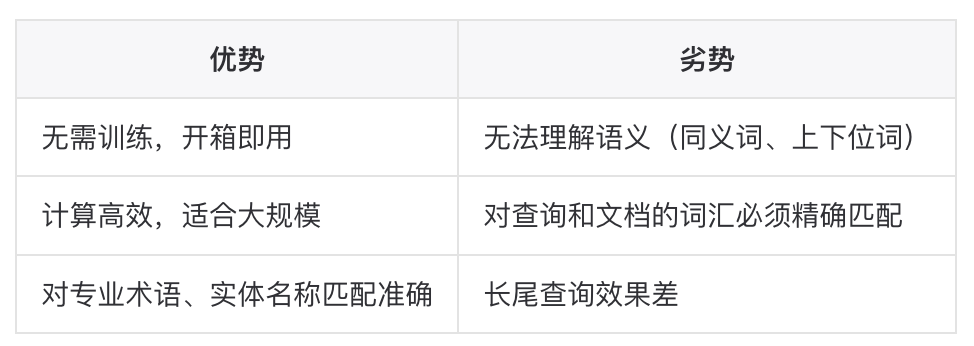

  

▐**** 稠密检索（Dense Retrieval）

  

稠密检索使用 Embedding 模型将文本映射为稠密向量，通过向量相似度（余弦、内积）进行检索。

  

## 

  * #### Embedding 模型选型

  

  

▐**** 混合检索（Hybrid Retrieval）

  

混合检索结合稀疏和稠密方法的优势：

**混合检索架构流程** ：

  

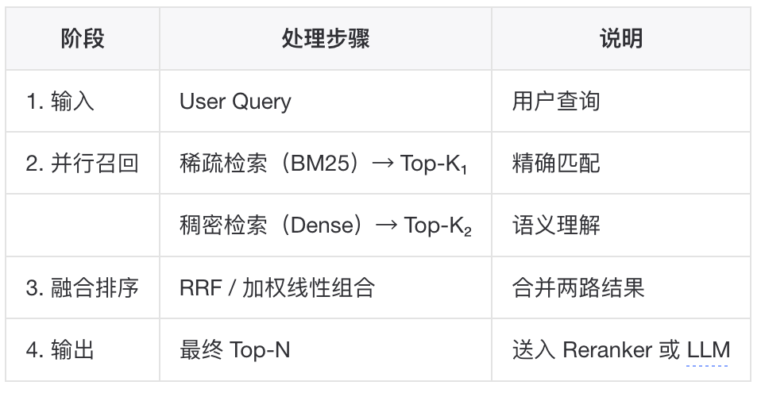

  

## 

  * #### 融合策略

  

**1\. Reciprocal Rank Fusion \(RRF\)**

其中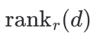是文档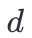在第路召回中的排名，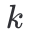通常取 60。

**2\. 加权线性组合**

**可通过验证集调优，通常在 0.3-0.7 之间。**

  

## 

  * ####  混合检索的优势

  

  

▐**** 进阶检索策略

  

## 

  * #### 层次化检索（Hierarchical Retrieval）

  

项目| 内容  
---|---  
论文|  *Dense Hierarchical Retrieval for Open-Domain Question Answering*  
链接| https://arxiv.org/abs/2110.15439  
  
  

当语料库规模庞大时，直接段落级检索可能导致上下文丢失。层次化检索采用两阶段策略：

  

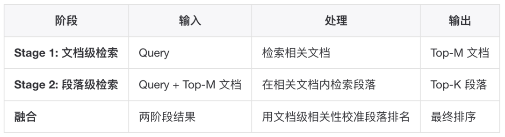

  

**优势** ：

  * 避免短段落丢失全局上下文
  * 利用文档标题、章节结构等层次信息
  * In-Doc 和 In-Sec 负采样策略提升训练效果

**

  

## 

## 

  * #### 查询增强（Query Enhancement）  

**

  

用户的原始查询往往不够清晰或完整，查询增强技术可以显著提升召回效果。

**1\. 查询改写（Query Rewriting）**

使用 LLM 将用户查询改写为更适合检索的形式：

  

**  
**

**2\. HyDE（Hypothetical Document Embeddings）**

  

项目| 内容  
---|---  
论文|  *Precise Zero-Shot Dense Retrieval without Relevance Labels*  
链接| https://arxiv.org/abs/2212.10496  
  
  

核心思想：先用 LLM 生成假设性答案，再用答案的 Embedding 进行检索。

  

  

**原理** ：答案与答案的语义空间比问题与答案的语义空间更近，从而提升召回精度。

  

**3\. Multi-Query（多查询检索）**

生成多个查询变体，分别检索后合并去重：

  

  

**4\. EAR（Expand, Rerank, and Retrieve）**

  

项目| 内容  
---|---  
论文|  *Expand, Rerank, and Retrieve: Query Reranking for Open-Domain Question Answering*  
链接| https://arxiv.org/abs/2305.17080  
  
  

核心发现：贪婪解码往往选不到最佳查询扩展。EAR 框架：

  

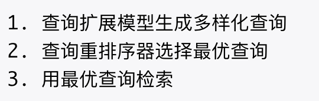

  

**效果** ：

  * 领域内 Top-5/20 准确率提升 3-8 个点
  * 领域外 Top-5/20 准确率提升 5-10 个点

  

▐**** 检索策略选型建议

  

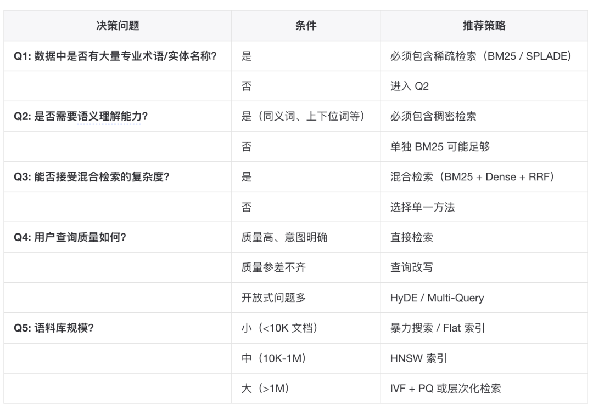

  

▐**** 实践建议

  

  1. 从混合检索开始：BM25 + Dense 的组合通常优于任何单一方法

  2. 选择合适的 Embedding 模型：根据语言、文档长度、资源限制选型

  3. 调优融合权重：在验证集上调整 RRF 的或加权系数

  4. 引入查询增强：HyDE 和 Multi-Query 对开放式问题效果显著

  5. 关注端到端效果：使用 ICLERB 思路评估，而非仅关注 NDCG@K

  6. 索引类型选择：HNSW 在精度和性能间取得良好平衡

  

## 

## 如何获得更好的 Rerank？

  

## 

### ▐**** 为什么需要 Rerank？

  

向量检索（Embedding + ANN Search）是一种**双编码器（Bi-Encoder）** 架构：Query 和 Document 分别独立编码，通过向量相似度匹配。这种方式速度快，但精度有限——因为 Query 和 Document 之间没有直接交互。

**Reranker** 采用**交叉编码器（Cross-Encoder）** 架构：将 Query 和 Document 拼接后联合编码，能够捕捉更细粒度的语义交互，显著提升排序质量。

**  
**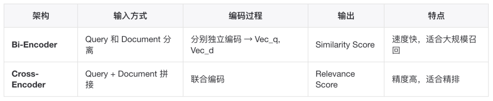**

  

**典型流程** ：向量检索召回 Top-100 → Reranker 精排 → 取 Top-5 送入 LLM

  

## 

## 

### ▐**** Rerank 模型选型对比

  

## 

## 

  * #### 主流 Reranker 模型

  

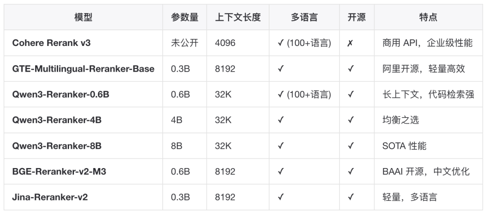

  

**

## 

## 

  * #### 选型建议

**

  

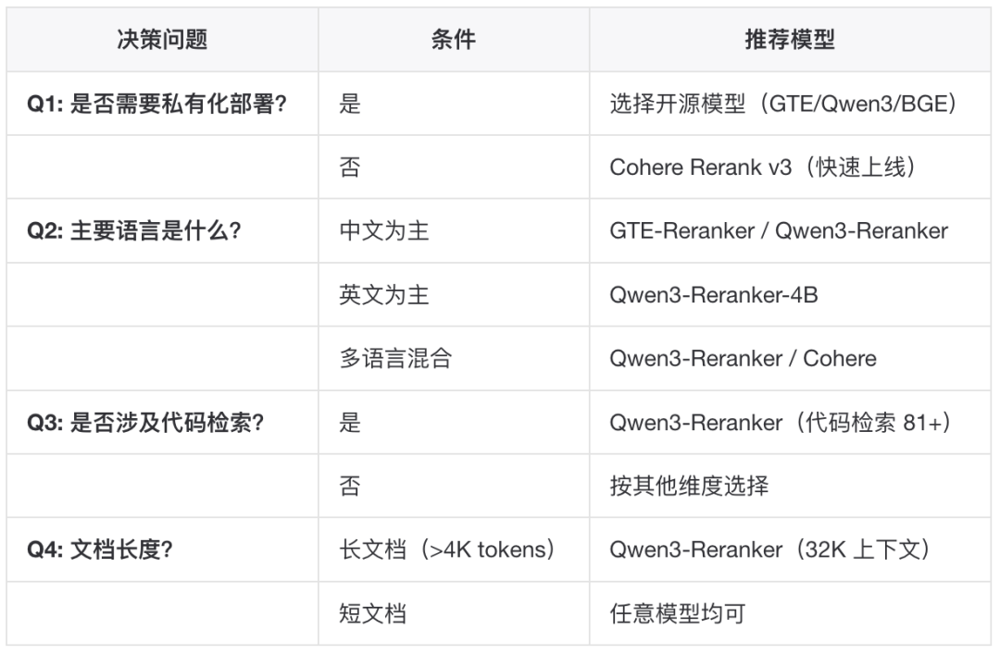

  

**

## 

## 

### ▐**** Rerank 实践要点

## 

## 

****

##   

## 

  * #### 召回数量与精排数量的权衡

**  
**

**典型流程** ：向量检索 Top-K \(K=50~~200\) → Reranker → Top-N \(N=3~~ 10\) → LLM

  * K 太小：可能漏掉相关文档
  * K 太大：Rerank 延迟增加，Cross-Encoder 是 O\(K\) 复杂度

****经验值** ：K=50~100 是常见选择，根据延迟要求调整。**

  

## **

## 

  * #### 截断阈值

**

  

Reranker 输出的是相关性分数，可以设置阈值过滤低质量结果：

  

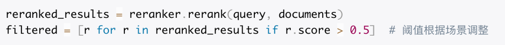

  

## **

## 

  * #### 多路召回 + RRF 融合

**

  

当使用混合检索（BM25 + Dense）时，可以用 **Reciprocal Rank Fusion \(RRF\)** 融合排名，再送入 Reranker：

**其中 是文档在各路召回中的排名，通常取 60。**

##   

## 

## 总结

**  
**

**构建一个"好"的知识库，需要在多个环节进行系统性优化：**

**  
**

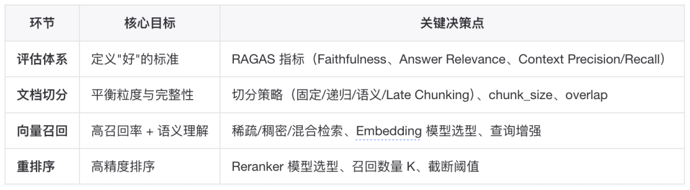

**  
**

****核心原则** ：**

  1. 评估先行：先建立评估体系，再迭代优化

  2. 从简单开始：递归切分 + 混合检索 + 轻量 Reranker 是稳健的起点

  3. 数据驱动：根据 bad case 分析定位瓶颈环节

  4. 端到端思维：关注最终生成质量，而非单一环节指标

**  
**

**知识库构建没有标准答案，需要根据数据特点、业务场景和资源约束进行权衡取舍。**

**  
**

**  
**

**  
**

## ****¤****拓展阅读****¤******  
****[3DXR技术](https://mp.weixin.qq.com/mp/appmsgalbum?__biz=MzAxNDEwNjk5OQ==&action=getalbum&album_id=2565944923443904512#wechat_redirect) | [终端技术](https://mp.weixin.qq.com/mp/appmsgalbum?__biz=MzAxNDEwNjk5OQ==&action=getalbum&album_id=1533906991218294785#wechat_redirect) | [音视频技术](https://mp.weixin.qq.com/mp/appmsgalbum?__biz=MzAxNDEwNjk5OQ==&action=getalbum&album_id=1592015847500414978#wechat_redirect)**

**[服务端技术](https://mp.weixin.qq.com/mp/appmsgalbum?__biz=MzAxNDEwNjk5OQ==&action=getalbum&album_id=1539610690070642689#wechat_redirect) | [技术质量](https://mp.weixin.qq.com/mp/appmsgalbum?__biz=MzAxNDEwNjk5OQ==&action=getalbum&album_id=2565883875634397185#wechat_redirect) | [数据算法](https://mp.weixin.qq.com/mp/appmsgalbum?__biz=MzAxNDEwNjk5OQ==&action=getalbum&album_id=1522425612282494977#wechat_redirect)**

  

**  
**