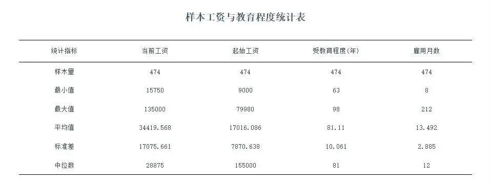

写硕士专业学位论文的小伙伴看过来！论文表格格式总是被导师打回？三线表怎么用、表题怎么写、排版有哪些禁忌？这份官方规范完整版整理好啦，吃透这篇，论文插表格式直接拿捏～

## **一、表格整体基础要求******

1. 论文表格必须具备**自明性** ，仅看表格就能看懂核心内容。

2.表格**不设置左右边线** ，优先采用国际通用**三线表** 样式。若三线表无法完整清晰呈现内容，不要乱加线条，只需增大栏目间距，以排版清晰为首要原则。

三线表示例

3.字体字号规范：表内文字统一使用**宋体 \+ Times New Roman**；常规用**五号字** ，内容字数过多可改用小五号字，**同一张表格内字号必须保持一致** 。

## **二、表题规范写法******

1. 所有表格都必须配备表题，由**表序 \+ 表名**两部分组成。

2.表序按章节顺序编排，例：第一章第一个表格标注为**表 1-1**。

3.表序与表名之间空**2 个半角字符**；表名内部**禁止使用任何标点符号** ，表名末尾也不加标点。

4.表题放置在表格上方，文字居中排布，采用**宋体五号字** ；硕士学位论文**仅使用中文表题** ，无需额外添加英文翻译。

5.表头设计遵循简洁原则，尽量**不使用斜线** ，可直接使用化学符号、物理量符号标注栏目。

## **三、单位与数据填写规则******

1. 整张表格数据为同一计量单位，将单位符号标注在**表头右上角** ，并用圆括号括起。

2.表内数据务必准确清晰，无数据的空缺单元格，统一填写**占 2 个半角字符的横线 “—”**。

3.表内上下、左右文字或数字相同时，采用通栏合并处理，**严禁使用 “〃”“同上”** 等简写方式。

4.表内附加文字说明：首行空 2 个半角字符，转行顶格书写，语句末尾**不添加标点符号** 。

## **四、排版与正文衔接规范******

1. 正文插入表格前，必须有引导文字提示，如**见表 1-1、如表 1-1 所示**，不可突兀直接插表。

2.常规表格**禁止拆分跨两页编排** ；只有页面无法容纳整张表格时，才可转页设为**续表** 。续表需在表格右上角标注编号并加（续表），同时**重复原有表头** 。

3.表格与上下正文文字之间，**各空一行** 排版，保持版面整洁。

## **五、引用文献表格特殊要求******

若表格引自参考文献，除在正文对应位置标注文献序号外，还需在**表题右上角** 同步标注参考文献序号，格式缺一不可。

论文表格是答辩和格式审核的重点细节，千万别因为小格式问题耽误定稿！收藏这份规范，写论文插表直接对照套用，轻松避开所有扣分雷区～

