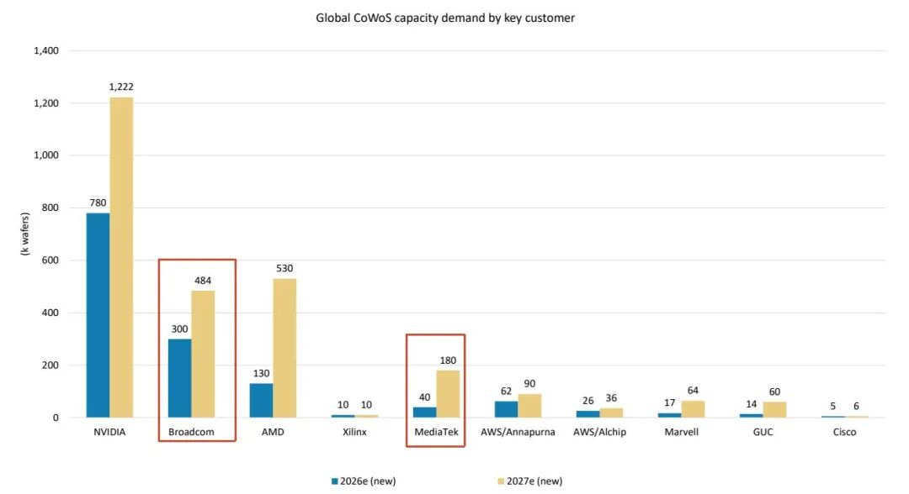
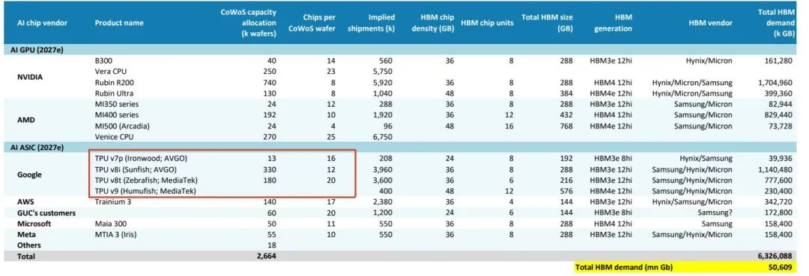
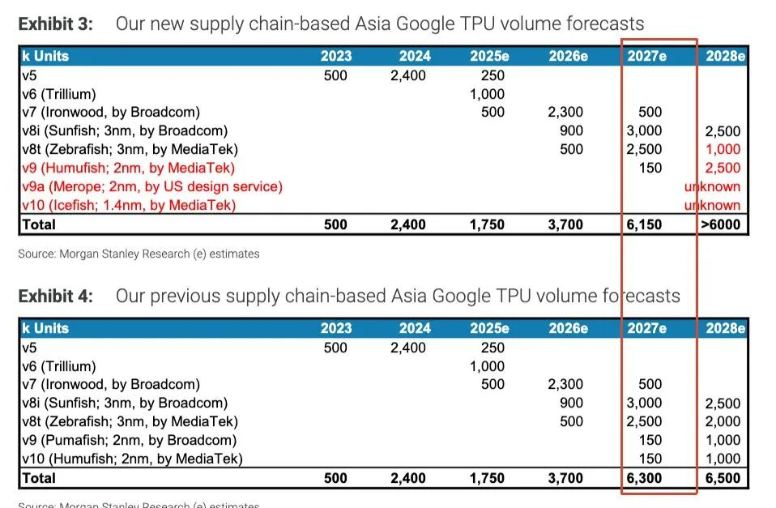
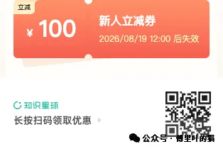

关于谷歌 TPU 的出货量，市场上的数据分歧是比较大的，之前有专家已经给出明年出货量超 1000w 的说法，但笔者对这个数据是比较怀疑的。

昨天大摩的这个 CoWoS 的报告被传的非常广，网上也基本对这个数据是比较信任的，还没看到反对的观点。

我们就以大摩报告中的数据，来算一下明年谷歌 TPU 的出货量。

明年 CoWoS 的分配情况如下，注意，这是 Global CoWoS，不是单指台积电一家。

根据下面的这个数据

**Broadcom 承接部分（TSMC CoWoS-S）：**

• TPU v7p（Ironwood）：13k 片 × 16 颗/片 = **20.8 万颗** • TPU v8i（SunFish）：330k 片 × 12 颗/片 = **396 万颗** • 小计：**约 416.8 万颗**

**联发科承接部分：**

• TPU v8t（ZebraFish）：180k 片 × 20 颗/片 = **360 万颗** （台积电 CoWoS-S） • TPU v9（HumuFish）：**约 40 万颗** （Intel EMIB-T 封装，非 CoWoS）

**合计：**

416.8+360+40≈**816.8 万颗**

但这里还有几个问题。

**1、最直接的风险：ABF 基板**

大摩本身就在这里埋了一个缺口。ZebraFish（TPU v8t）对应的 CoWoS booking 是 180k 片，理论出货 360 万颗——但同时给出了一个保守假设：如果 ABF 基板供应跟不上，实际出货只有 **250 万颗** 。两个情景之间差了 110 万颗，这还只是一个产品、一个约束条件造成的缺口。

**2、CoWoS 产能之外，还需要 HBM**

CoWoS 封装完成后，芯片还需要堆叠 HBM 内存才能成为完整的 TPU。HBM 需求测算显示，ZebraFish 和 SunFish 两款产品对 HBM3e 的需求量加起来接近 200 亿 GB，体量相当大。如果 HBM 供应出现瓶颈，CoWoS 产能再充裕也无法转化为成品芯片。

这里还要再提一下谷歌对供应链的管理，真的是比 NV 差太远了，欧美那帮大爷完全不了解亚洲文化，昨天有新闻讲 MTK 在帮谷歌谈 TGlass，但其实是联发科谈成了google受益而已，要是等谷歌自己去谈，那黄花菜都凉了。

**3、Booking 不等于实际消耗**

报告的数据来源是产能 booking（预定），而不是实际出货记录。客户提前锁定产能是行业惯例，但实际使用率很少能达到 100%。良率波动、生产排程调整，都可能让最终出货量低于 booking 对应的理论值。

最后再附上大摩自己预测的 TPU 出货量：

这是上个月的报告，**大摩只给了明年 615w 颗的出货量指引** ，甚至比之前的指引还少了 15w。

知识星球

  
  
星球每天的早报\(周内早上9点前更新\)，除了路透、彭博、FT、Information这些新闻的内容总结，还有汇总了国内外分析师的观点，覆盖的产业包括：Memory、智驾/Physical AI、机器人、AI算力、AI电力、光、PCB、液冷、AI应用，内容比较全，都是最新的分析师观点和新闻，欢迎大家进星球查看。

半导体AI产业交流

  
  

对半导体和AI产业交流，可以加下面微信，请备注姓名和所在行业。

