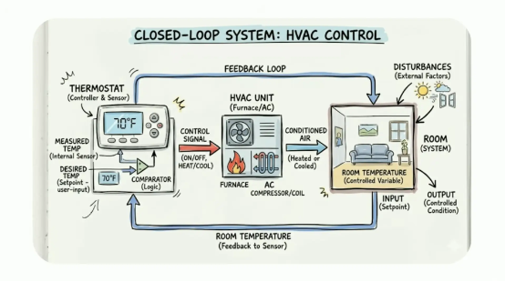
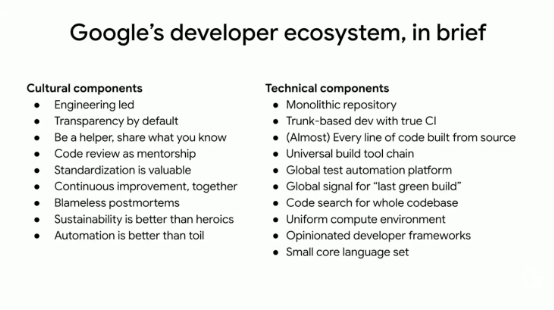
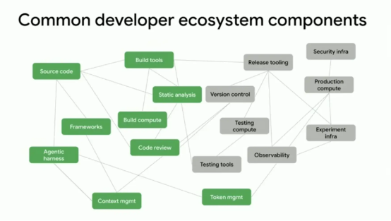
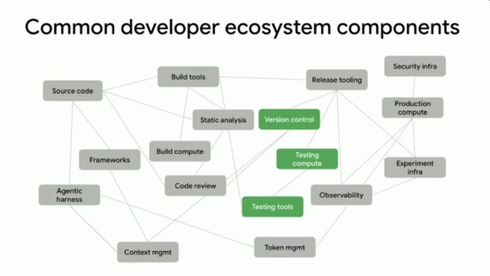
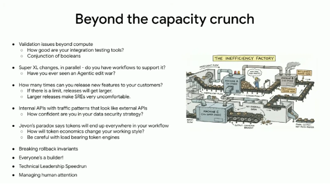
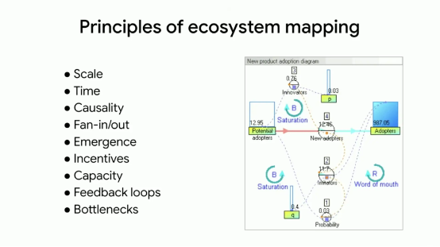
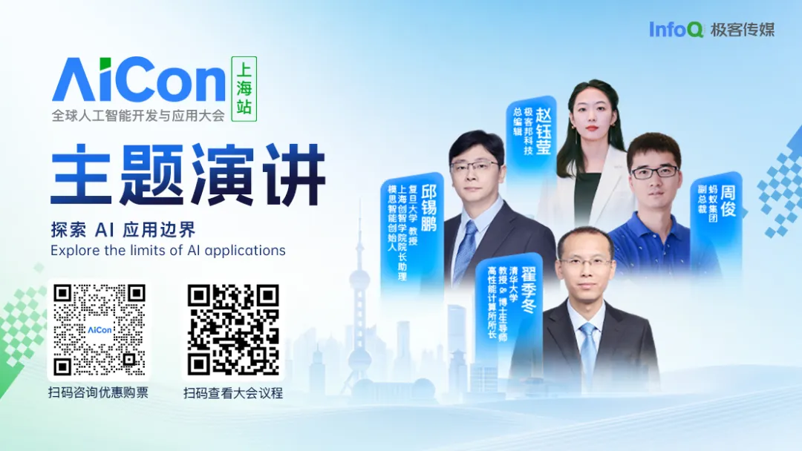

编译｜宇琪 策划 | Tina 

AI 让你写代码快了 10 倍，然后呢？更多的代码意味着更长的编译、更重的测试、更堵的代码审查，以及一个没人能理解的代码库。软件是负债，你写得越快，欠得越多。

Google 首席软件工程师 Adam Bender 的警告很直接：今天你构建软件的方式，在 10 倍速度下根本行不通。但 AI 时代的真正赢家，不是产出最高的团队，而是基本功最扎实的那些人。因为 AI 只负责放大，不负责方向。

在 Google I/O 2026 的一场主题演讲中，Adam Bender 抛出了一个大多数人还没来得及思考的问题：当 AI 把代码产出速度推到现有工程流程无法承载的地步，我们的开发者生态系统里，什么会最先垮掉？他用一个你可能没听过的概念串起了整场演讲：软件生态学，即对生产软件的社会技术生态系统进行整体性研究的学科。换句话说，你不只要看技术，还要看人、看文化、看组织里那些不成文的规则。基于该演讲视频，InfoQ 对内容进行了整理。

核心观点如下：

  * AI 默认不帮你解决任何问题。如果你的实践是好的，它能放大它们。但如果不够好，它只会制造更多麻烦。
  * 人人都是构建者是很酷，直到你必须维护所有人构建的所有东西。
  * 工程实践不是神圣不可侵犯的。实践会变，原则才是重要的。
  * 作为一线软件工程师，在这个临界点时刻，你处于决定软件工程将走向何方的核心位置。从工具到工作流，从工程实践到工程文化，如果你能看清正在运转的系统，你就能找到杠杆。

什么是“系统”

你 2026 年的工作，跟你 2020 年想象的样子完全不一样。如果你试图跟 2020 年的我解释今天发生的事，我不会信的。变化太多了，多到让人有点招架不住。我没法预测未来，但我相信，如果我们仔细研究当下的软件生态系统，有些答案比我们想象中更近。

我今天要跟你聊一个词：软件生态学（Software Ecology）。听起来像是我为了上台随便编的，但不是，这是个正经术语。在给出定义之前，我想先铺垫一些背景，我们稍微深入一下系统思维。

一个系统是一组相互关联的元素，按照一套规则运作，形成一个统一的整体。听起来很抽象，但你对系统并不陌生。比如空调：一个知道目标温度的恒温器，一个负责升温或降温的暖通空调，一个房间，温度合适了，信号就停了，这就是一个系统。

如果你是软件工程师，你每天都在跟系统打交道，你设计系统、构建系统、运维系统，在这个过程中你大概学会了一件事：一切皆关联。

接下来是生态系统，它是一种特殊的系统。定义有点长，但很重要：生态系统是一个由相互依赖的行动者组成的动态网络，这些行动者与其环境共同演化，其特点是涌现行为和去中心化的自主性。说人话就是，生态系统很复杂，组件之间深度连接，每个组件有自己的自主性，可以做决策、采取行动。而且最关键的一点：环境是系统的一部分，你不能把两者分开。

生态系统也是一种复杂适应系统，能够随着时间增长、变化和演化。它们还有一种特性叫涌现（Emergent Property），就是你没法通过观察任何一个单独部件来看到的东西，只有当系统整体组装起来，行为才会从中涌现。正是这种持续变化、持续学习加上涌现，让搞清楚生态系统里到底在发生什么变得极其困难。

说到生态系统，你脑子里浮现的大概是山川河流、鸟语花香。但内部开发者环境，它也是一种生态系统：有各种工具和服务，有带着各自想法和诉求的人，有业务约束。而且它是一种特殊的系统：社会技术系统，就是由人和技术共同构成的系统。社会技术系统极其复杂，因为你从所有那些技术开始，然后把人也搅进去。

你很可能在不知不觉中已经接触过社会技术系统的智慧。你们知道康威定律吗：组织所构建的技术，会镜像其内部的沟通结构。通俗地说，如果你有四个团队在做同一个编译器，你就会得到一个四遍编译器，事情就是这样。康威定律的核心观察是，我们构建技术的方式，与构建它的组织结构不可分割，组织塑造了最终被构建出来的东西。

但不止组织结构影响开发者生态，价值观和文化同样影响深远。你的生态系统构建的，是组织所激励的东西，你的工程文化创造了围绕开发者生态的环境。一旦你了解了社会技术系统，你就会在软件开发的每一个角落看到它们：架构、事故复盘文化、代码审查、安全策略，无处不在。我们构建的东西，以及我们选择构建它们的方式，反映了我们重视什么。如果我们足够用心，就可以利用这个认知来放大我们的价值观，将它们注入到我们所构建的东西中。

现在我可以给你一个正确定义了：软件生态学是对生产软件的社会技术生态系统进行整体性研究的学科。如果刚才那些有点抽象，没关系，现在来看一个真实的案例。

Google 的开发者生态

我聊 Google，不是因为我在那儿工作所以要吹它，而是因为它是我最了解的开发者生态。我的目的不是告诉你们应该照搬 Google，那样对你们没好处。你们是不同的公司，处在不同的阶段，面临不同的权衡取舍。Google 所做的很多选择，都是针对当时我们构建生态时的具体需求。

几年前我们写了一本书，内部叫"火烈鸟书"。书里有一半讲版本控制和测试，但整个前半部分都在讲工程文化。很多人问为什么花这么多篇幅讲文化，因为如果你不理解 Google 的文化，你就没法理解我们为什么做出那些技术选择，这些事是相互关联的。

Google 有几个比较独特的文化特质。我们是深度工程导向的，做重要决策时工程师总是在场；我们极其重视透明度，尽可能让所有文档和代码对所有人开放；我们鼓励乐于助人，事实上跟任何离开过 Google 的人聊，同事们的乐于助人会是他们第一个提到的；我们把代码审查当作指导的机会，而不是批改试卷；我们极其重视标准化；我们相信持续改进；我们推崇免于追责的事故复盘；我们坚信可持续性优于英雄主义，自动化优于手工劳作。当然我们不总能达到所有这些理想，但这是我们在文化上努力追求的方向。

技术方面呢？单体代码仓库，几乎所有代码都在一个仓库里；基于主干的开发，每一次变更直接合入主线；构建一个二进制文件时，几乎每一行代码都从源码构建；统一的构建工具链，每个人都用；全球化的测试自动化平台，一个地方运行所有测试，每天数十亿个测试用例；一个全局的"最后绿色"信号，我可以靠一个简单的内部网站就告诉你任何构建的状态；统一的计算环境，所以"在我机器上能跑"这种事基本上不可能发生；高度规范化的开发者框架和一小组核心编程语言。

这种文化与技术的混合，造就了 Google 今天的模样，你没办法只理解其中一半而忽略另一半。

共享命运

如果要我选一个一直在隐隐指导我们的原则，我会选“共享命运（Shared Fate）”。它描述的是一个生态系统及其组件之间紧密关联的程度，在一个高共享命运的生态里，一个组件可以影响所有其他组件。在开发者生态系统中，共享命运既是一种技术选择，也是一种社会选择。你不可能仅仅通过让所有人都使用同样的技术来实现共享命运，你还需要建立关于如何管理这些技术的社会契约。

在 Google，共享命运始于单体代码仓库。公司的每一行代码，除了少数例外比如 Android 和 Chrome，都在一个共享仓库里。所有代码提交到主干，没有分支，没有版本号，一切都在一个地方。这种共享命运让我们能够在一个文件里应用一个安全补丁，然后知道在一周之内，公司里每一个应用程序都会被修复。十行代码修补一百亿行应用和系统软件，这就像超能力一样。

但共享命运并不总是好事，它是一种选择。有些地方共享命运不合适，比如在生产环境中，我们绝不希望一个服务拖垮所有其他服务，或者一个集群感染整个区域。所以我们在避免危险的共享命运方面下了很大功夫，那种会导致级联故障的共享命运。共享命运是一种权衡，你必须找到正确的放置位置，然后确保它为你工作。

大规模变更

我们共享命运环境中最有趣的涌现属性之一，就是大规模变更。注意这一点：远在 AI 出现之前，Google 的内部工具就已经让一个开发者有可能修改数百万行代码，数百万行他们根本不会去读、再也不会去看、可能对其一无所知的代码。我们构建了让这一切自动成为可能的工具，今天就是这样，而且我们至少在过去十五年里一直这么做。

这种能力让我们能够持续演化单体代码仓库，更新语言和框架，防止内部环境变得僵化。毫不夸张地说，没有大规模变更，我们就不会是今天的 Google。做这些工具的同事干的是一种幕后英雄式的工作，让公司能以需要的速度前进。

但关键在于，你如果不了解使大规模变更成为可能的那些文化组件和技术组件，你就没法真正理解它。你需要什么？普及的测试文化，每个人都得写测试。统一的测试平台，你知道去哪里拿结果。共同的构建工具，你构建跟我构建结果一样。标准化的库，替换组件时不会跳来跳去找哪个版本对你有用对我没用。标准化的代码审查，代码仓库本身的透明度，这样你才知道哪些代码需要改动。大规模变更是 Google“自动化优于手工劳作”这个理念的终极体现，而且它只有在整个生态系统协作的情况下才有可能。你没法指着开发者环境中某一个部分说，这就是它产生的原因，所有的部分连接在一起才是原因。

你的生态系统，你的权衡

每个开发者生态系统都有这样的涌现属性。它们通常就是那些让你感觉你工作的地方有些独特的东西，那是因为它们是你所做的一系列选择的产物。

Google 的开发者生态产生了一套独特的权衡取舍，服务于我们的技术和业务目标。但和每一个生态系统一样，它不可能在所有任务上都表现出色。我们选择优化的是极致规模、安全性和性能，即使这意味着有时要以牺牲开发者生产力为代价，我们愿意做这个权衡。一个五个人初创公司的生态看起来会完全不同，速度和敏捷性才是最重要的。

你们大多数人所在的生态介于五个人和二十万人之间。你们需要做的权衡取舍非常值得关注，因为当你审视这些权衡时，你就能开始理解组织的价值观：它真正在乎什么，不是嘴上说在乎什么，而是你实际观察到的选择暴露了什么。当你理解了这些价值观，你就能开始塑造正在展开的变革。

10 倍时刻：每一个节点都在承压

是时候谈谈房间里那头吃 token 的大象了：一个 AI first 的开发者生态系统到底长什么样？

从零开始构建一个全新的生态当然好，但你们没人有这个奢侈。你们必须一边继续交付软件，一边在替换其中的几乎每一个部分。公司指望你继续创造价值，同时确保不出问题。

那么问自己一个问题：你对自己今天的开发者生态系统了解多少？你能把它完整画出来吗？你知道所有部件在哪里吗，不只是技术的，还有社会的？你能列举出你的生态是由什么构成的吗？你组织里的其他人了解多少？它的优势劣势是什么？瓶颈在哪里？哪里被约束，哪里是自由的？你有什么样的选择余地？你见过什么样的涌现属性？也许最关键的：如果你的生态突然必须在未来十八个月内吞吐 10 到 15 倍的代码量，你知道什么会最先崩溃吗？

地球上每一个开发者生态系统都在经历一场彻底变革，也许它还没有到达你所在的每一个角落，但它正在来的路上，每一个开发者生态都将不得不面对这个 10 倍时刻。这是令人难以置信的时代，但也相当令人困惑。过去二十五年我们有意演化出来的所有权衡取舍，都将被重新平衡。

生成代码快 10 倍和工程开发快 10 倍，是两件不同的事。在 Google 我们常说，工程是随时间积分的编程。但问题是，我们正在大幅加速编程这个环节，正在让代码机器加速运转。所以我们必须想办法围绕这台代码机器做好工程工作，才能真正为客户交付结果。没有人知道这轮生产力增长能推多远，但有一件事是确定的：我们从这里开始是往上走的。

问题是，你我今天构建软件、交付软件的方式，在 10 倍或 100 倍的速度下不行，有些东西必须改变。

让我们从一个简化版的开发者生态系统图开始看。在一个活动量增加 10 倍的世界里，什么必须改变？

代码入库

**写源代码。** 如果每个人写代码都快了很多，代码量就会多很多，这可不是好事。Jeff Atwood 说过，软件是一种负债。所以，10 倍代码，10 倍负债。而且你不能直接给每人发一堆 token 然后说“祝你好运”，我希望你在培训完再投资：你知道你的工程实践文档在哪里吗？知道怎么去演化它们吗？之后可以考虑一下。

**构建系统。** 更多的代码、更大的系统意味着更长的编译时间。我敢肯定你们公司现在没人抱怨过编译慢。但猜猜怎么着，它们会变得更慢。而且如果 agent 在驱动大量工作，编译次数也在暴涨。编译不是免费的，不管在时间还是计算资源上。你可能从来没有注意过自己在编译上花了多少时间，但在 10 倍规模下，你一定会注意到的。

**代码设计。** 你有合适的 agent 化技能来鼓励解耦吗？有合适的服务端框架来确保快速安全地组合各种能力吗？你知道你们公司里 Web 应用有多少种部署方式吗？有多少种不同的服务端框架在跑？你怎么管理 agent 写的代码的组件复用？也许你在赌这不重要。但如果 agent 写出了容易写但难以维护的代码，别太惊讶，这就是当前的基准水平。Agent 擅长写代码，但不总是从长远角度思考。那些代码，我确定不会很好地被重构。没关系，这部分我们将来会解决。但事实是，agent 正在为我们做大量工作，我们必须每天想办法最高效地应用这些能力。

到了某个时候，这些 agent 化工作可能让你的二进制文件大到无法编译。或者大到没法再推送到手机上。你有没有问过这个问题：你能编译的最大二进制是多大？我不知道答案，但我知道在 Google，我们正在碰触到极限，有些地方的二进制已经大到无法编译了，我相信我们会解决的。但事实是，大规模有很多连锁反应，规模的影响无处不在。

也许你是微服务技术栈，你正想：我的服务都很小，我干嘛要担心？但我有个问题：10 倍网络流量、10 倍服务数量、10 倍通信量，你准备好了吗？没有人能全身而退，规模的影响无处不在。

**代码审查。** 假设你不能可靠地编译所有这些代码，你的代码审查流程会怎样？每个人都在担心代码审查，有理由的。我们正在给这个非常人性化的流程施加巨大压力，在很多情况下它正在变成瓶颈，而人不喜欢当瓶颈。当你给他们施加压力时，他们的行为会变得奇怪。10 倍代码量，你要么得到 10 倍大的变更，要么 10 倍多的变更。你的技术负责人能维持必要的审查速度吗？大多数技术负责人连五个 10 倍开发者一天的代码量都审查不过来。

所以他们为了不当瓶颈，会开始重新安排流程，开始走捷径，确保不阻塞任何人，因为没人想当阻塞者。你也许可以靠 AI 解决一部分，可以部署 AI 来改善代码审查。但这只解决了部分问题，因为如果你的团队成员不写代码了，他们唯一遇到代码的时刻就是在审查时，而审查时的注意力又不够，那谁在关注代码库的演化？没有人。很快，你的代码库就会变成一个没人能理解的烂摊子。

**Token 经济学。** Token 很贵，你们有些人已经知道了。在大规模下，token 是一个你必须纳入考量的实际成本。如果公司里每个人都开始用 10 倍或 100 倍的 token 会发生什么？如果你不小心在一天之内花光整个月的预算呢？如果你必须优先决定 token 花在哪里，你知道该优先投入哪里吗？你甚至有没有看到 token 正在流向何处的可见性？

仅仅在这个简单系统的前几个节点里，我们就已经发现了问题。而且非常清楚，会有一些具有挑战性的二阶效应。

测试和版本控制

你曾经看过你的测试基础设施消耗了多少计算资源吗？在 Google，我从来没有对自己的测试速度满意过。

每一个进入版本控制的变更都必须被测试。但除此之外，agent 也很喜欢运行测试，因为测试能告诉它们自己做得好不好。所以 agent 产生了额外的工作量，我要干的活就更多了。那么，10 倍提交量加上 agent 做的所有工作，现在消耗了多少测试计算资源？

实际上情况可能更糟。我们在 Google 观察到的是，随着代码库增长，依赖图是二次方增长，不是线性。所以代码库大了 10 倍，你要跑的可能不是 10 倍的测试，而是 100 倍乃至 1000 倍的测试。这将是一个非常有趣的挑战，而且它会在某个时刻变成你预算表上的一行。如果你现在不担心测试计算资源的花费，那更让我担心，因为那意味着你可能根本就没有足够的测试，那些 agent 正在没有安全网的情况下在你的代码库中 YOLO。

假设编译和测试解决了，现在看版本控制系统。大多数流行的版本控制系统不是为性能优化的，它们为一致性和排序优化。这是它们的本职工作，保持完整记录，不是跑得飞快。你的版本控制系统一分钟能吃多少次提交？我保证比你想象的要少。它无法扩展到你需要的那种 10 倍速度。你上一次想到版本控制系统的性能是什么时候？如果你不是做 Git 开发的，大概从来没想过。说实话，沦落到要讨论版本控制性能的地步，说明有些事已经严重跑偏了。我们在开发者体验的最底层了，但这就是系统性变化的后果：它找到你系统的每一个角落，然后说，嘿，你在注意吗？因为你没预料到的事情来了。

对那些打算用很多小仓库来解决版本控制问题的朋友，去问问任何跑过几百个几千个小仓库的人，我可以保证，那只是一整套全新的挑战，AI 并不能必然使这些问题变得更容易。

意外清单

到目前为止我们只在看那些相对容易发现的容量型节点，就是拿一个数字乘以 10 然后问会好还是会坏，还有很多意料之外的挑战。

**验证策略。** 你今天的验证大概就是很多单元测试加一些集成测试。但在 10 倍代码和 10 倍服务的世界里，集成测试会变成质量策略中最重要的部分。你们有多少人对自己今天的集成测试方案满意？我也不满意。集成测试真的很难，我现在还没有能按我想要的方式做集成测试的工具。

**布尔值合取问题。** 今天你要发布软件，你要求每一个测试都通过，所有布尔值都变绿，一切没问题了你才发布，这很合理。当你有了一百万个测试，而底层测试基础设施运行一百万测试的可靠性本身就成问题的时候，会发生什么？可能所有布尔值都必须为真才能发布软件这件事就做不到了。你需要一种新策略，大概基于统计的方法，来判断哪些是正确的测试去运行，因为你不可能跑所有测试。

**超大变更。** 能处处重构、更换语言和框架，的确令人兴奋。但你有支撑的工作流和社会契约，能让人们管理数以万计、几十万计、百万计行的合并冲突吗？大概没有。如果公司里每个人都能做超大变更，我们就需要新的工作流策略。

**Agent 编辑战争。** 一个 agent 做了一个修改，另一个 agent 跑过来说不，我不喜欢，我要做一个不同的修改。看着挺好笑，直到你意识到你在为两边支付 token 费用。

**发布节奏。** 你今天多久向客户发布一次？每天？那算挺好的。如果不是，这里有个问题：你会得到 10 倍多的软件，这些软件总得放到某个地方。如果你不是每天都在发布，每次变更会变得大很多。而我的 SRE 朋友们会告诉你，非常大的变更非常可怕。别这么做。但代码总得部署才能产生价值，所以你可能会尝试更频繁地发布，这很好，DORA 的朋友们会感到欣慰。但在某个点上收益会递减，每秒发布一次大概不会给你带来太多价值。代码还是会增长，你需要搞明白把它放在哪里才不会制造更多风险。

**内部 API。** 我一直在跟共事的朋友们说，你的所有 API 突然之间都变成公开的了。Agent 不会跟你商量，它会找到 API 然后直接调用。它能访问到什么就会用到什么，我保证。如果你从来没有像对待公网 API 那样加固内部接口和内部数据集，agent 会找到那些你并不希望它们找到的东西。

**杰文斯悖论。** 杰文斯说，一种资源越便宜、越高效，我们就用得越多。Token 的爆发就是活生生的例子。我们在把它们放到所有地方，这改变了我们怎么工作，以及怎么思考工作。我们正在给以前那些隐形生产力劳动定价，这会对我们的行为产生什么影响？我还不知道。

**回滚。** 你知道为什么回滚今天基本可行吗？因为你发布软件的速度略慢于你在生产环境中检测到问题所需的时间。如果你能非常非常快地发布，快到你还没法检测到任何问题，你的回滚姿态会怎样？每次回滚将不得不应对堆在上面的多个互相冲突的变更。所以光发得更快是不够的，你必须考虑整个系统，包括回滚这个重要的安全阀。顺便说一句，你需要小心把 token 引擎放在哪里。如果你的回滚流程依赖某个 agent 有足够的容量，而之前有人把那个 agent 的 token 预算耗尽了，导致你现在无法回滚，那大概不是什么好事。

**人人都是构建者。** 你大概想过 vibe code 一个替代品，代替公司里那个你不喜欢的工具。现在，把这个乘以公司里每个人和每一个工具。当每个人都在用完全不同的工具时，公司的社会肌理会发生什么？如果你运气好有一个统一的数据底层，所有数据进同一个地方，那还好。但如果没有呢？人人都是构建者是很酷，直到你必须维护所有人构建的所有东西。

**技术领导力速成班** 。成为一个技术负责人之所以花那么长时间，是因为你必须积累直觉、判断力和专业能力来帮你做决策，因为当你领导一个团队时，你的失误波及范围比你独自行动时要大得多。当一个应届生踏入一个可以调用五十个 agent 的环境，却没有任何直觉和判断力时，什么会出错？我怎么在六个月内教出十年的经验？我不知道。

**人类注意力是我们拥有的最宝贵资源。** 现在噪音非常多，那么多 agent、那么多事物在争夺我们的注意力，我们必须想办法管理这件事。我们以前受益于一个事实：我们制造麻烦的能力不会超过我们投入注意力的能力，但现在情况已经不是这样了。

这些听起来很多，那是因为在一个系统里，一切皆关联。我刚才提到的所有挑战，你不可能只通过看系统中一个节点来解决任何一个，你必须看整个系统。

为了适应 agent 化开发，我们都必须开始学会持续用系统的方式思考。当你在思考系统时，这些是你应该关注的事：事物在变大，随时间变化的效应，因果关系朝哪个方向流动，哪些节点在跟所有邻居对话，涌现长什么样，那些不知道从哪里冒出来的东西是什么。激励机制呢？包括社会的和技术的，容量、反馈回路和瓶颈，这些是系统分析的工具。

看起来很复杂，但你真的只需要两个问题：为什么（Why？），和如果呢（What if？）。为什么我们的集成测试这么少？如果我们有比单元测试更多的集成测试呢？为什么我们使用这些特定语言？如果 AI 写了所有代码呢？

“为什么”是你用来深入系统核心、搞清楚它如何运作的钻头。你们都很擅长问为什么，但是“如果呢”是更难的部分。“如果呢”，可能让人害怕，如果它要求你放弃那些你曾经认为设计得非常好的实践的话。如果不这样测试呢？如果完全不写测试呢？别走太远。但如果你允许它发生，“如果呢”，也可以相当令人兴奋。

AI 是放大器，不是方向

AI 是放大器。这个想法来自我在 DORA 的朋友们，他们去年的 AI 开发报告发现，那些真正搞清楚了事情的团队之间存在一种关系：他们弄明白了如何让 AI 成为放大器。

AI 可以给你更多。更多测试，更多文档，更多代码，但也更多混乱。放大是幅度，不是方向。AI 不关心那些东西去了哪里，它就是给你更多。DORA 真正发现的是，那些基本功扎实的团队，能够把放大效应引导到有用的方向。

这就引出了问题：你对自己的基本功感觉怎么样？你们公司的决策文化怎么样？你能做什么来改进它？技术战略呢？有人在关注开发者生产力吗？组织里的人今天协作得怎么样？安全态势呢？代码健康度、发布卫生、可靠性呢？AI 默认不帮你解决任何问题。如果你的实践是好的，它能放大它们。但如果不够好，它只会制造更多麻烦。

但即使基本功扎实，我们也即将经历一段真正的旅程。我猜测，到 2030 年，我们今天的开发者生态系统，大概就像 2001 年在我们今天看来那么遥远。2001 年我们还在用 CD-ROM 发布软件，到 2030 年我们可能就隔着这么远。

在你们继续夯实基本功的过程中，让我给你四件可以沿途思考的事。

**第一，基础设施容量。** 如果你不知道你有多少资源可以花，你不能部署 AI，不能部署计算资源，你需要一个好方法跟踪这些。

**第二，验证策略。** 你不能也不应该发布没有验证过的软件。但验证策略会变，现在是时候想清楚了。集成测试会成为你最重要的武器，而你可能还没有趁手的工具。

**第三，隔离。** 你会得到很多用于不同目的的代码，有些目的以前根本不用代码。这没问题，但你不希望一个很酷的原型代码真的跑进了生产环境。让好玩的东西不要影响赚钱的东西。

**第四，抽象。** 我们构建抽象是为了防止开发者做出糟糕的选择，这就是为什么我们有库和框架。没人从零开始写 Web 服务器。让 agent 做大量决策会导致同样的后果，所以你需要好的抽象让 agent 遵循。不要给它们糟糕的选择。

你还必须接受一件事：工程实践不是神圣不可侵犯的。实践会变，原则才是重要的。这说起来容易做起来难，如果你从来没有真正思考过为什么你的团队以这样的方式测试软件，或者为什么发布流程是这样运作的，你就没办法演化它。理解原则，才会给你力量和信心去穿越这个 10 倍时刻。

现在对软件工程师来说，是一个令人着迷的时代。我们工作的每一个维度都在被重新定义；我们比以往任何时候都更需要发挥创造力；我们需要技能来应对像上下文管理、token 经济学、模型漂移这样的问题；我们需要创造力；我们不能太沉迷于优化一切的诱惑，需要鼓励探索。

有一个问题一直让我睡不着，它不能仅靠优化来解决：随着代码库的增长，我们要如何保持对它的智识掌控？智识掌控就是指，人类能否对面前的东西进行推理。我们输掉这场战争至少已经十五年了，我们最大的系统早就超出了任何一个人能思考的规模。你不信的话，回去做一个实验：让你团队里每个人画一张系统架构图，看看你能得到多少种不同的版本。

我们的很多软件系统非常脆弱，一行糟糕的代码或一个错误的配置标志就能破坏一个百万行系统，这种脆弱让你在做变更前不得不三思。但关于 AI 我有一个非常兴奋的想法：一个持续更新的、几乎可交互的架构空间，我可以向它提问。如果我们把这里的容量移到东海岸会怎样？如果用户增长突然跃升 40% 呢？对于今天哪怕一个中等规模的系统，这样做在功能上几乎是不可能的，变量太多了。但 AI 可以理解非常庞大的数据集，所以我认为这里有东西可以挖掘。

我喜欢这个问题的原因是，我们不只是纯粹专注于让代码机器转得更快，我们在问：如何加深对我们已经构建的东西的理解？

变化发生得非常快，比你们大多数人经历的都快。你们现在能做的最重要的事情之一，就是去帮助那些正在挣扎的人，向那些还没搞清楚的人伸出援手。我们都在以不同速度前进，都在以不同方式应对这场变化。感到自己在落后，是很容易发生的事。

资深工程师们，去当导师。找到那些卡住的人，帮助他们。如果你已经搞清楚了 AI 开发工作流，去分享给别人，这不是什么珍贵的秘密。技术负责人，你必须参与进来，帮助引导软件工程在你们公司的发展方向。如果你关心软件质量或软件设计，你必须用你的声音去为它发声。在座各位就是要去做到这些的人，你们的老板大概不会。

如果我们把开发者生态系统想象成活的生态系统，我们都已经习惯了紧紧盯着每一个树枝上的每片叶子，像照顾某种特殊生命形态一样照料每一棵树。但不用多久，我们要管的就不是一棵树了，是整片森林。而你不能通过盯着单棵树来管一片森林，你得把森林看作一个生态系统来管理。

系统性变化有一种特质：它在一切地方、一切事物上同时发生，大到让人觉得什么都抓不住。此时此刻，你可能觉得什么都不能让你在似乎每周都涌来的变革浪潮中站稳脚跟。但正如我们刚才发现的，在一个系统中，一切皆关联，小的行动可以产生大的后果。

不管表面上看起来怎么样，AI 转型不是只属于公司领导者的领域。作为一线软件工程师，在这个临界点时刻，你处于决定软件工程将走向何方的核心位置。从工具到工作流，从工程实践到工程文化，如果你能看清正在运转的系统，你就能找到杠杆。你拥有的自主性比你以为的要多，用好这份自主性，为你的组织、你的团队和你自己去创造未来。

演讲原链接：

https://www.youtube.com/watch?v=2n41YjR5QfU

声明：本文为 InfoQ 原创，不代表平台观点，未经许可禁止转载。

今日好文推荐

[腾讯撑场、60亿豪赌，“GPU四小龙”最后一龙刚刚过会](https://mp.weixin.qq.com/s?__biz=MjM5MDE0Mjc4MA==&mid=2651287048&idx=1&sn=de29e31a9b8938d3f0d54caf4893d0d4&scene=21#wechat_redirect)

[Claude背后全是大厂老兵！Anthropic工程团队1680人画像曝光：谷歌系、12年经验、本硕为主](https://mp.weixin.qq.com/s?__biz=MjM5MDE0Mjc4MA==&mid=2651287045&idx=1&sn=956afee706b85a59bd62561432c3da8b&scene=21#wechat_redirect)

[全网首份指令级拆解：看华为昇腾 950DT 芯片如何撬动 DeepSeek 75%降价与字节锁单](https://mp.weixin.qq.com/s?__biz=MjM5MDE0Mjc4MA==&mid=2651286966&idx=1&sn=33044df3c1d2b3664baf784d61cca573&scene=21#wechat_redirect)

[Fable 5 的杀手锏不是写新代码，是迁移、重构、收拾烂摊子](https://mp.weixin.qq.com/s?__biz=MjM5MDE0Mjc4MA==&mid=2651286851&idx=1&sn=f065678be33ddfacb191257aadc2e467&scene=21#wechat_redirect)

会议推荐  

AICon 上海站 Keynote 嘉宾已集齐！来自复旦、清华、蚂蚁、阿里云等高校知名教授与顶尖专家集结！从多模态、大模型落地与 Token 服务维度，拆解大模型从 “会回答” 到 “能执行” 的技术拐点。9 折倒计时最后一周，现在报名立减 580。

