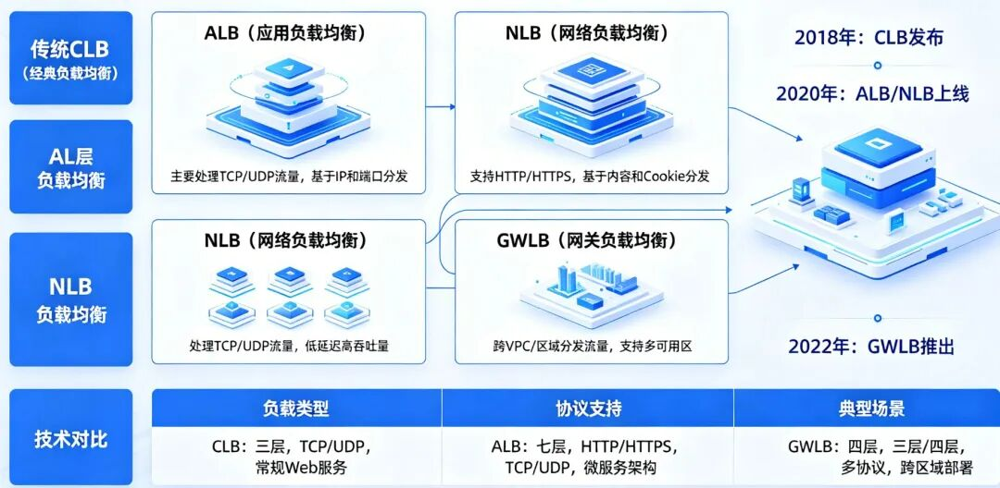

# 阿里云负载均衡（Server Load Balancer，SLB）并非单一产品，而是一套基于软件定义、集群化部署、分层解耦的智能流量调度平台。

  

其演进历程，本质上是一场负载均衡底层架构的根本性变革：**从基于物理服务器集群的“云化”方案，跨越到基于网络功能虚拟化（NFV）的“云原生”平台，并将能力版图从“流量分发”扩展至“安全编排”。**

* * *

##  一、产品家族概览

阿里云负载均衡目前已发展为四大核心产品，各自定位清晰：

产品类型| 工作层级| 核心定位| 技术架构| 关键性能  
---|---|---|---|---  
**传统型负载均衡 \(CLB\)**|  四层 & 七层| 经典、综合的流量分发| 物理机，LVS/Tengine| 100万并发， 5万QPS  
**应用型负载均衡 \(ALB\)**|  七层（应用层）| 云原生、智能的Web流量治理| 洛神平台 NFV（弹性）| 100万 QPS  
**网络型负载均衡 \(NLB\)**|  四层（传输层）| 极速、低延迟的网络层分发| 洛神平台 NFV（弹性）| 1亿并发连接  
**网关型负载均衡 \(GWLB\)**|  三层（网络层）| 透明、高可用的安全流量编排| 洛神平台 NFV（弹性）| 与ALB/NLB同属云原生架构  
  
* * *

## 二、CLB 架构：稳固的“经典物理塔”

传统型负载均衡 CLB 是所有 SLB 产品的起点，其内部是一套由特定硬件和深度定制开源软件构成的稳固集群。

### 1\. 技术基石：LVS + Tengine

CLB 采用久经考验的开源软件组合，并针对大规模云计算场景进行了大量优化。

  * 四层转发引擎：LVS + Keepalived 基于 Linux Virtual Server（LVS）在内核层面实现 TCP/UDP 流量的高效转发，性能极高，适合游戏、音视频等低延迟场景。其支持 FullNAT 模式进行地址转换，并通过 Keepalived 监控节点健康状态，实现虚拟 IP（VIP）的高可用漂移。
  * 七层智能引擎：Tengine 由淘宝基于 Nginx 深度定制，能完整理解 HTTP/HTTPS 协议，支持基于 URL、Header、Cookie 等内容的高级路由，并提供 SSL 卸载、WAF 集成、灰度发布等高级功能。

### 2\. 双层集群与故障转移

CLB 实例采用**双层集群架构** ：

  * 所有流量首先进入由多台 LVS 组成的**四层集群** ，作为统一入口进行初步接收与分发。
  * 七层流量会被 LVS 均匀转发至后方由多台 Tengine 组成的**七层集群** ，由 Tengine 完成高级路由处理后，再送往最终的后端 ECS。

集群节点间通过**组播** 实时同步会话信息，确保任意节点故障时，流量可被其他健康节点无缝接管。

### 3\. 容灾模型：主备（Active-Standby）

CLB 实例通常部署在两个可用区，一个为主，一个为备。当主可用区整体故障时，系统会在**约 30 秒** 内将流量切换到备用区。这种模式的代价是备用资源长期闲置，且无法做到完全无感知的秒级切换。

### 4\. 性能天花板

CLB 的性能受限于其部署的物理服务器，单个实例最高可支持 **100万并发连接** 与 **5万QPS** 。一旦业务量超过该硬上限，便会出现性能瓶颈，且无法弹性扩展。

> 官方已停卖：尊敬的阿里云用户，阿里云将于2026年01月01日00:00:00（北京时间，UTC+8）起，停止售卖按规格计费的传统型负载均衡CLB实例。

* * *

## 三、新生代双雄：ALB 与 NLB 的“云原生”蜕变

ALB 与 NLB 的诞生，标志着负载均衡底层架构的根本性重塑。它们不再依赖固定的物理服务器，而是生长在**阿里云自研的“飞天·洛神”云网络平台** 之上。

### 1\. 底座技术：洛神平台与 NFV

洛神平台（尤其 2.0 版本）通过 **NFV（网络功能虚拟化）** 技术，将负载均衡从物理“盒子”变成了可灵活部署、弹性伸缩的“虚拟网元”。其架构核心是**软硬一体化** 与**快慢速分离** ：

  * 快路径（硬件处理）： 对于 VPC 虚拟交换机等无状态、极致性能要求的基础组件，由智能网卡或交换芯片直接处理，保障基础网络的高速转发。
  * 慢路径（软件处理）： 对于 SLB、NAT 网关等有状态、逻辑复杂的业务网元，则作为 VNF 运行在基于 ECS 的资源池中，通过软件实现丰富的功能与弹性。

这套架构完美统一了性能与灵活性：硬件路径负责基础流量，软件路径负责复杂业务与弹性调度。同时，通过引入 **DPDK** （数据平面开发套件）等技术旁路内核、直接在用户态处理报文，单物理机即可获得 100Gbps 以上的转发能力。

### 2\. 全新的部署与售卖形态

ALB 与 NLB 不再按固定“规格”售卖，而是以**域名** 形态提供服务。每个域名在多个可用区拥有 VIP，实例性能可随业务流量**自动弹性伸缩** ，用户无需再规划实例大小。

### 3\. 容灾理念的颠覆：从主备到多活（Active-Active）

与 CLB 最大的理念差异在于容灾。ALB 和 NLB 默认采用**多可用区多活** 架构，各可用区的资源同时在线提供服务，天然抵御可用区级故障。这既消除了主备切换的延迟与人为干预，也极大提升了资源利用率。

### 4\. 连接方式的创新：从组播到 GENEVE 隧道

为支持云原生环境下的多活与弹性，新一代产品摒弃了 CLB 时代的集群组播同步方式，转而采用更现代的 **GENEVE** 隧道封装协议。

GENEVE 是一种高度灵活的网络虚拟化协议，它能在不解析原始报文的情况下，为其添加一层可携带丰富“元数据”的轻量外壳（封装开销仅 68 字节）。正是这些元数据，使得精细化的流量调度与透明编排成为可能。

### 5\. 打破性能天花板

得益于 NFV 平台的弹性能力，ALB 与 NLB 实现了指数级性能提升：

  * ALB（面向七层）： 单个实例最高可处理 **100万 QPS** ，适用于微服务、容器化应用与云原生架构。
  * NLB（面向四层）： 单个实例最高可支撑 **1亿并发连接** ，专为 IoT、游戏加速、高性能计算等场景设计。

* * *

## 四、GWLB：为安全而生的透明流量编排器

如果说 ALB 和 NLB 解决了应用流量入口的弹性问题，那么 GWLB 的诞生，则是为了解决网络流量安全检查这一更下沉、更透明的场景。它本质上是一个为网络虚拟设备（NVA）而生的高可用流量分发器。

### 1\. GWLB 的独特定位

GWLB 并不直接面向应用服务，其核心区别在于**服务对象** 和**工作模式** ：

对比维度| **GWLB**| **CLB / ALB / NLB**  
---|---|---  
**服务对象**| **第三方网络虚拟设备 \(NVA\)** ，如防火墙、IDS/IPS、DPI 等| **最终应用服务 \(Real Server\)** ，如 Web 服务器、ECS 等  
**工作层级**| **网络层（三层）** ，IP 监听，不关心上层协议端口| **传输/应用层（四/七层）** ，端口级监听  
**工作模式**| **透明模式** ，流量经安全设备处理后“原路返回”| **代理模式** ，客户端与负载均衡建立连接后再代理转发  
**核心协议**| **GENEVE** ，用于封装原始流量并携带元数据| 标准 TCP/UDP/HTTP 协议  
**流量调度算法**| **一致性哈希** ，支持 5元组、3元组、2元组| 轮询、最小连接数、IP 哈希等  
  
### 2\. 工作原理：两层 VPC 与流量“摆渡”

GWLB 的经典架构涉及两个 VPC：**业务 VPC** 和**安全 VPC** 。它通过私网连接服务（PrivateLink）和关键组件 **GWLBe** （网关型负载均衡终端节点）实现流量的透明“摆渡”。

一次完整的流量安全检查流程如下：

  1. 客户端（或业务 VPC 内的工作负载）发送请求，目的地为应用服务器 IP。
  2. 业务 VPC 的路由表已将目标网段的下一跳配置为 **GWLBe 入口** ，流量被导引至该终端节点。
  3. GWLBe 通过 PrivateLink 将流量送往关联的 **GWLB 实例** 。
  4. GWLB 根据**一致性哈希** 算法（例如 5 元组），选择后端一个健康的 NVA 实例。
  5. GWLB 将原始流量进行 **GENEVE 封装** ，添加包含 Endpoint ID 等元数据的新报文头，发送给该 NVA。
  6. NVA 完成安全检查、过滤等处理后，将流量通过 GENEVE 送回 GWLB。
  7. GWLB 将流量发回给 PrivateLink。
  8. PrivateLink 将流量送回 **GWLBe 出口** 。
  9. GWLBe 查询路由表，将流量最终转发至目标应用服务器。

整个过程对客户端和应用服务器完全透明，它们均不感知中间的安全检查环节。

### 3\. 关键设计细节

  * GENEVE 封装与 MTU： 由于 GENEVE 封装会增加 **68 字节** 的开销，为确保 GWLB 能处理标准 1500 MTU 的报文，后端 NVA 的 MTU 需设置为至少 **1568 字节** ，并建议开启巨型帧支持。
  * 一致性哈希调度： 为保证有状态防火墙等设备能正确处理同一个网络会话的双向流量，GWLB 采用**一致性哈希** 算法，支持：
    * 5 元组（源IP、目的IP、协议、源端口、目的端口）：精度最高，确保同一连接的双向流量落于同一 NVA。
    * 3 元组（源IP、目的IP、协议）：适用于无法区分端口的非 TCP/UDP 流量。
    * 2 元组（源IP、目的IP）：粗粒度调度。

### 4\. 服务链编排的体现

GWLB 的“安全 VPC”架构，本质上是洛神平台**网络功能服务链编排** 能力的典型实践。它允许用户将不同厂商的虚拟安全设备按需“串接”成一条定制化的安全处理流水线，构建纵深防御体系。

* * *

## 五、总结：完整产品矩阵与选型建议

至此，阿里云负载均衡已形成一个覆盖三层至七层、从流量分发到安全编排的完整产品矩阵：

产品| 工作层级| 核心定位| 关键性能| 适用场景  
---|---|---|---|---  
**CLB**|  四层 & 七层| 传统、综合的流量分发| 100万并发， 5万QPS| 传统业务平滑上云  
**ALB**|  七层（应用层）| 云原生、智能的Web流量治理| 100万 QPS| 微服务、容器化、API网关  
**NLB**|  四层（传输层）| 极速、低延迟的网络层分发| **1亿并发连接**|  IoT、游戏加速、高性能计算  
**GWLB**| **三层（网络层）**| **透明、高可用的安全流量编排**|  与ALB/NLB同属云原生架构| **集中化安全检测** ，部署NVA集群  
  
**选型建议：**

  * CLB： 适合对既有架构依赖较强、或云原生需求不高的传统业务，是平滑上云的稳妥选择。
  * ALB： 现代 Web 应用、微服务、容器化应用的首选，能充分发挥云原生优势。
  * NLB： 为极致四层性能而生，是 IoT、游戏、高性能计算等场景的最佳选择。
  * GWLB： 当需要构建集中式安全检测、部署和管理第三方网络虚拟设备集群时，GWLB 是必不可少的流量编排枢纽。