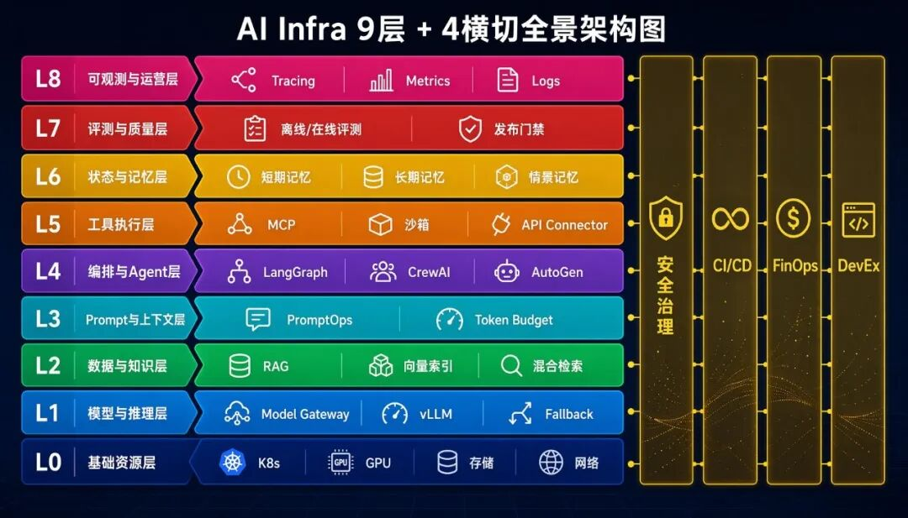
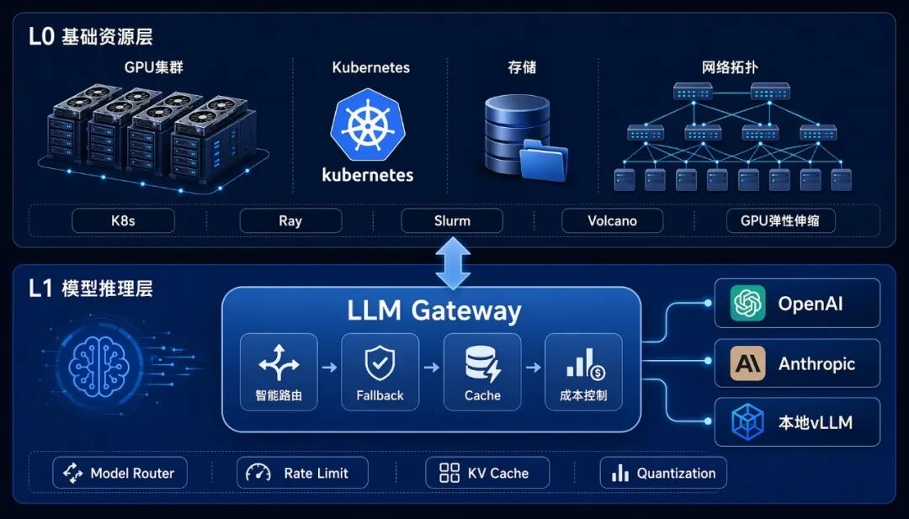
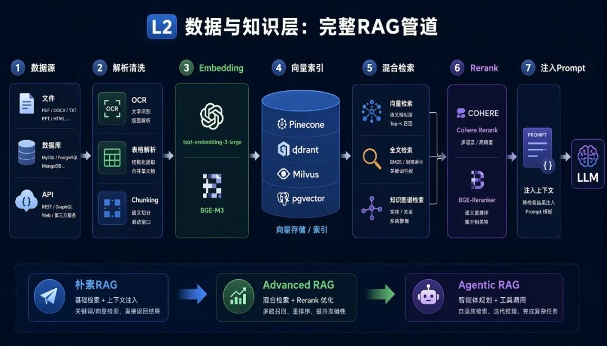
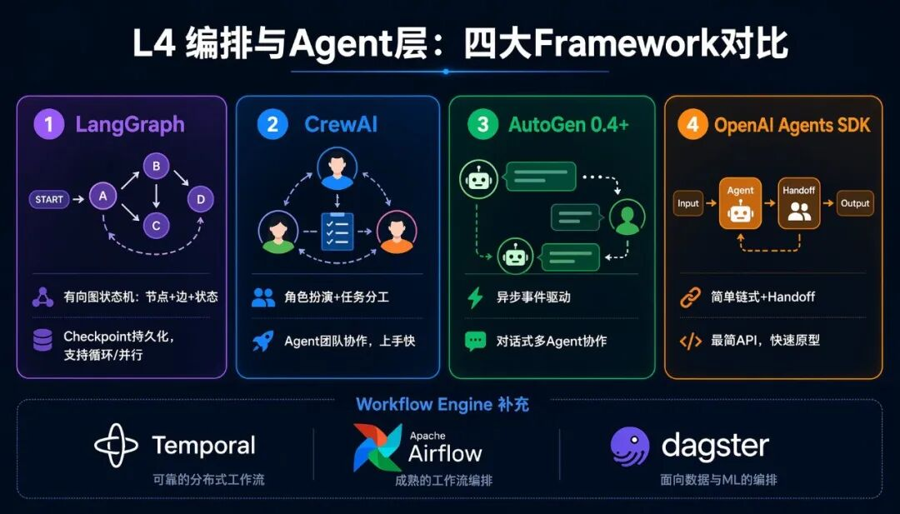
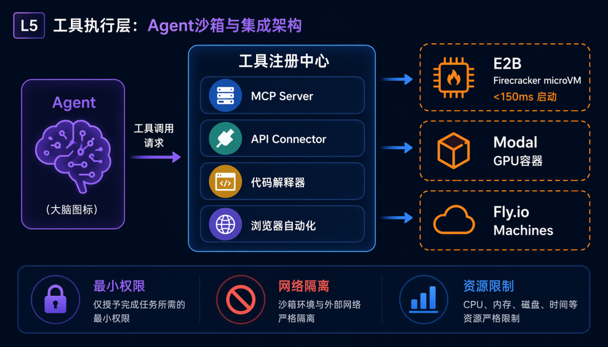
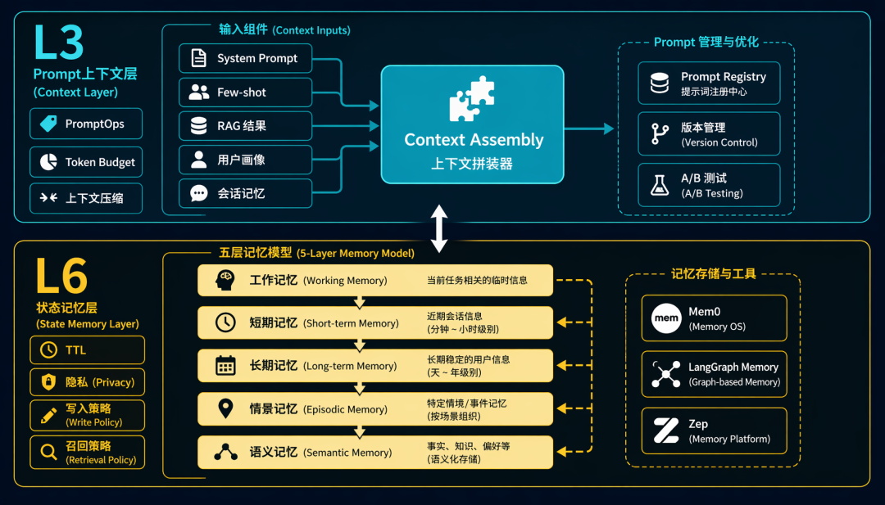
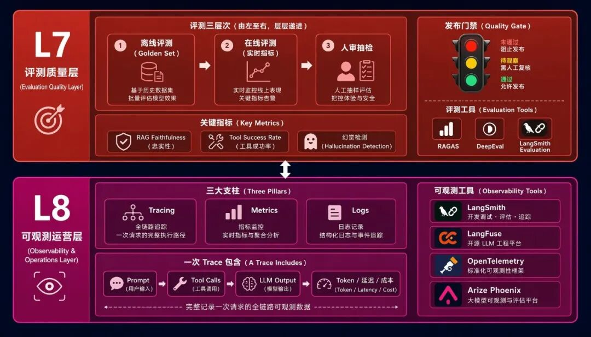
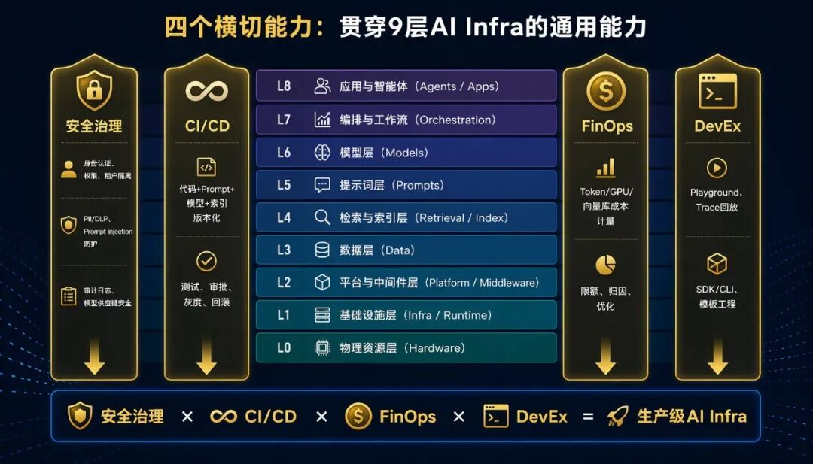

2026 年，几乎每家公司都在做 AI Agent。

但一个残酷的事实是：**绝大多数 Agent 项目停留在Demo阶段，无法融入生产。**

不是模型不行，不是算法不行——**是 Infra 不行。**

构建一个生产级 AI Agent 系统，你需要的远不止一个大模型和一个向量库。你需要算力调度、模型网关、数据管道、Prompt 管理、Agent 编排、工具沙箱、记忆系统、评测体系、可观测平台——**还要让安全、CI/CD、成本和开发者体验贯穿每一层。**

**这就是完整的 AI Infra。**

本文从 L0 到 L8，逐层拆解 9 层架构 + 4 个横切能力，给出工具选型和生产级最佳实践。

* * *

## 全景图：9 层 + 4 横切

先看全景，再逐层拆解。

**纵向 9 层** （从底层资源到上层应用）：

层级| 名称| 核心问题  
---|---|---  
L0| 基础资源层| 模型和应用运行在哪里？  
L1| 模型与推理层| 用哪个模型？怎么调用？怎么降本？  
L2| 数据与知识层| 模型如何安全、准确地使用企业私有知识？  
L3| Prompt 与上下文层| 如何组织模型能可靠执行的输入？  
L4| 编排与 Agent 层| 复杂任务如何被拆解、调度、执行？  
L5| 工具执行层| Agent 能做什么？执行边界在哪里？  
L6| 状态与记忆层| 系统如何记住一切而不越权？  
L7| 评测与质量层| 改动后质量是变好了还是变坏了？  
L8| 可观测与运营层| 出了问题能否定位？成本能否归因？  
  
**横向 4 个能力** （贯穿所有层）：

  * 安全治理
  * CI/CD 与发布治理
  * FinOps 成本治理
  * 开发者体验（DevEx）

**关键洞察：** 大多数团队只关注 L4（Agent Framework）+ L2（向量库），忽略了其他 7 层和 4 个横切能力。但生产级 Agent 的稳定性，恰恰取决于那些「不起眼」的基础设施。

* * *

## L0：基础资源层——算力、存储、网络

L0 是所有 AI 系统的物理和云原生底座。

**核心组件：**

类别| 技术| 代表工具  
---|---|---  
计算| GPU / TPU / NPU / CPU| NVIDIA A100/H100、Google TPU v5e  
编排| 容器调度| Kubernetes、Ray、Slurm、Volcano、Kueue  
存储| 对象 / 块 / 文件| S3、MinIO、JuiceFS、Alluxio  
网络| 高速互联| RDMA、InfiniBand、VPC、服务网格  
镜像| 容器与模型| Harbor、Artifact Registry、HuggingFace Hub  
安全| 密钥与隔离| Secret Manager、KMS、多租户隔离  
  
**这一层回答的问题：** 模型和 AI 应用运行在哪里，资源如何调度，如何保证稳定、弹性和成本可控。

**生产级实践：**

  * 推理用 GPU 按需弹性伸缩（如 Modal、RunPod Serverless），避免空跑
  * 训练用 Ray Cluster + Kueue 做任务队列，多租户公平调度
  * 模型权重统一存到 Artifact Registry，版本化管理，禁止散落本地磁盘

* * *

## L1：模型与推理层——模型服务与智能网关

L1 管理模型的来源、调用和路由，是 AI Infra 的「神经中枢」。

**核心组件清单：**

  * **Model Gateway：** 统一入口，屏蔽不同供应商 API 差异
  * **Model Router：** 根据任务类型智能选择模型
  * **Inference Server：** vLLM、TGI、TensorRT-LLM 等高性能推理引擎
  * **Model Registry：** 模型版本管理、元数据、A/B 测试
  * **Fallback / Rate Limit / Quota：** 容错、限流、配额
  * **Cache / Batching / Streaming：** 缓存、批处理、流式输出
  * **Quantization / KV Cache：** 量化和 KV 缓存优化

**主流工具对比：**

工具| 定位| 特点  
---|---|---  
**LiteLLM**|  开源网关| 100+ 模型统一接口，自动 Fallback  
**Portkey**|  商业网关| 内置缓存、重试、日志、成本分析  
**vLLM**|  推理引擎| PagedAttention，高吞吐  
**OpenRouter**|  SaaS 路由| 按量计费，零部署  
**自建网关**|  完全控制| 可定制路由策略、合规审计  
  
**生产级最佳实践：**

  1. **智能路由：** 简单任务用小模型（降本），复杂任务用大模型（保质量）
  2. **自动 Fallback：** 主模型超时或报错，自动切换备用模型
  3. **成本控制：** 设置每用户 / 每应用的 Token 预算，超额自动降级
  4. **KV Cache 复用：** 相同前缀的请求共享 KV Cache，减少重复计算

* * *

## L2：数据与知识层——让模型安全使用企业私有知识

L2 负责把企业数据变成模型可用的上下文，是 RAG 的基础。

**完整数据管道：**

数据源 → 解析/清洗 → Chunking → Embedding → 向量索引 → 检索 → Rerank → 注入 Prompt

每个环节都有技术选型：

环节| 技术选项  
---|---  
数据源连接| API、数据库 CDC、网页抓取、文件系统  
文档解析| OCR、表格解析、PDF 解析（PyMuPDF、Marker）  
Chunking| 固定长度、语义分割、递归分割  
Embedding| text-embedding-3-large、BGE-M3、Cohere embed-v3  
向量索引| Pinecone、Qdrant、Milvus、Weaviate、pgvector  
混合检索| 向量 + 全文 + 知识图谱  
Rerank| Cohere Rerank、BGE-Reranker、Cross-Encoder  
权限继承| ACL、文档级 / 字段级权限控制  
  
**向量数据库对比（2026）：**

数据库| 部署方式| 适用场景  
---|---|---  
**Pinecone**|  全托管 SaaS| 快速上线，不想管基础设施  
**Qdrant**|  自托管 / Cloud| 大规模数据，性能敏感  
**Milvus**|  自托管| 十亿级向量，企业级分布式  
**Weaviate**|  自托管 / Cloud| 多模态 RAG，GraphQL API  
**pgvector**|  PostgreSQL 插件| 已有 PG，数据量不大  
**ChromaDB**|  嵌入式| 本地开发，原型验证  
  
**从朴素 RAG 到 Agentic RAG：**

  * **朴素 RAG：** Query → 检索 Top-K → 拼接 Prompt → 生成
  * **Advanced RAG：** Query Rewrite → 混合检索 → Rerank → Citation → 生成
  * **Agentic RAG：** Agent 主动决定何时检索、检索什么、是否需要二次检索

* * *

## L3：Prompt 与上下文层——PromptOps 与上下文工程

L3 负责管理进入模型的上下文结构——**这是最容易被忽视但最影响质量的一层。**

**上下文的组成：**

一次 LLM 调用的输入由多个部分拼装而成：

  * **System Prompt：** 角色定义、行为约束
  * **Developer Prompt：** 工具说明、输出格式
  * **RAG 结果：** 检索到的知识片段
  * **Few-shot Examples：** 示范输入输出
  * **用户画像：** 用户偏好、历史行为
  * **会话记忆：** 最近 N 轮对话
  * **User Prompt：** 用户当前问题

**PromptOps 核心能力：**

能力| 说明  
---|---  
Prompt 版本管理| 每个 Prompt 有版本号，可回滚  
Prompt Registry| 统一管理所有 Prompt 模板  
Prompt 实验| A/B 测试，数据说话  
Prompt 审批| 修改需 Review，不能随意上线  
上下文压缩| Token 超限时自动压缩/截断  
Token Budget| 控制每个组件的 Token 分配  
  
**主流工具：**

工具| 核心能力  
---|---  
**LangSmith**|  Prompt Hub + Tracing + Evaluation  
**LangFuse**|  开源 Prompt 版本管理 + 追踪  
**PromptLayer**|  Prompt 版本管理 + A/B 测试  
**自建（Git + YAML）**|  最大灵活性，已有 CI/CD 的团队  
  
**最佳实践：Prompt 即代码** ——将 Prompt 纳入版本控制、Code Review、灰度发布。

* * *

## L4：编排与 Agent 层——Workflow 与 Agent Runtime

L4 是 AI Infra 的核心层，负责将大模型的能力组织成可执行的工作流。

**四大主流 Agent Framework 对比（2025-2026）：**

维度| LangGraph| CrewAI| AutoGen \(0.4+\)| OpenAI Agents SDK  
---|---|---|---|---  
架构模式| 有向图状态机| 角色扮演 + 任务分工| 异步事件驱动| 简单链式 + Handoff  
多 Agent| 原生支持| 内置角色协作| 对话式协作| Handoff 模式  
状态管理| Checkpoint 持久化| 内置 Memory| 异步状态| 简单上下文  
学习曲线| 陡峭| 平缓| 中等| 最平缓  
最新版本| 0.6 \(2025.06\)| Flows 特性| 0.5.3| 2025.03  
  
**选型建议：**

  * **复杂工作流、精细控制** → LangGraph
  * **多角色协作、团队分工** → CrewAI
  * **实时对话、事件驱动** → AutoGen 0.4+
  * **快速原型、OpenAI 生态** → OpenAI Agents SDK

**除了 Agent Framework，还需要 Workflow Engine：**

工具| 定位  
---|---  
**Temporal**|  持久化工作流，适合长时间运行的 Agent 任务  
**Airflow / Dagster**|  数据管道编排，适合批量 RAG 索引构建  
**Prefect**|  Python 原生工作流，适合 ML Pipeline  
  
**LangGraph 的核心优势——有向图状态机：**

  * **节点（Node）：** 每个步骤是一个函数
  * **边（Edge）：** 定义步骤之间的转移逻辑
  * **状态（State）：** 全局共享的可持久化状态

天然支持：循环、分支、并行、断点恢复（Checkpoint）。

* * *

## L5：工具执行层——沙箱、集成与执行边界

当 Agent 需要执行代码、调用 API、操作数据库时，你不能让它在生产服务器上直接跑 `exec()`。

**工具执行层的完整能力矩阵：**

能力| 说明  
---|---  
函数调用| Agent 调用预定义函数  
---|---  
MCP Server| 标准化工具协议，即插即用  
API Connector| 连接企业 SaaS（CRM、ERP、工单）  
代码解释器| 沙箱内执行 Python / Node.js  
浏览器自动化| Playwright、Puppeteer  
RPA| 操作传统 GUI 系统  
权限校验| 最小权限，按需申请  
沙箱隔离| 每次执行一个独立环境  
输出校验| 工具返回结果格式校验  
幂等 / 事务| 失败可重试，副作用可补偿  
  
**沙箱方案对比：**

方案| 启动速度| 隔离级别| 适用场景  
---|---|---|---  
**E2B**|  < 150ms| VM 级| Agent 代码执行首选  
**Modal**|  < 500ms| 容器级| GPU 密集型任务  
**Fly.io Machines**|  < 300ms| VM 级| 全球分布式执行  
**Docker（自建）**|  1-3s| 弱隔离| 开发环境  
  
**安全设计三原则：**

  * **最小权限：** Agent 只能访问必要的资源
  * **网络隔离：** 默认禁止外网，按需开放白名单
  * **资源限制：** CPU、内存、磁盘、执行时间全部设上限

* * *

## L6：状态与记忆层——让 Agent 记住一切而不越权

L6 保存系统运行过程中的短期和长期状态。

**记忆的分层模型：**

类型| 时间范围| 存储方式| 典型场景  
---|---|---|---  
工作记忆| 当前对话| Context Window| 对话上下文  
短期记忆| 最近 N 轮| 内存 / Redis| 多轮对话连贯性  
长期记忆| 跨会话| 向量数据库| 用户偏好、历史事实  
情景记忆| 特定事件| 结构化存储| 「上次你说过……」  
语义记忆| 通用知识| 知识图谱 / 向量| 「Python 是一种编程语言」  
  
**主流记忆管理工具：**

工具| 特点| 适用场景  
---|---|---  
**Mem0**|  自动提取 + 存储用户记忆| 个人助理，需要「认识」用户  
**LangGraph Memory**|  Checkpoint + 命名空间读写| LangGraph 生态内的 Agent  
**Zep**|  长期记忆 + 事实提取| 客服、对话型 Agent  
  
**必须管理的能力：**

  * **TTL：** 记忆过期自动清除
  * **隐私：** PII 脱敏，用户可要求删除
  * **写入策略：** 哪些信息值得记忆
  * **召回策略：** 如何从海量记忆中检索最相关的

* * *

## L7：评测与质量层——AI 系统能否生产化的关键

**L7 是整个架构中最容易被跳过、但决定项目生死的一层。**

没有评测，你就是在「盲飞」——改了 Prompt、换了模型、调了 RAG 参数，不知道质量是变好了还是变坏了。

**评测的三个层次：**

层次| 时机| 方法  
---|---|---  
**离线评测**|  上线前| Golden Set、合成数据、回归测试  
**在线评测**|  运行中| 实时指标、用户反馈、A/B 测试  
**人审抽检**|  定期| 人工标注、安全红队  
  
**关键评测指标：**

指标| 衡量什么  
---|---  
RAG Faithfulness| 回答是否忠于检索到的上下文  
Answer Relevance| 回答是否与问题相关  
Context Precision| 检索的内容是否精准  
Tool Success Rate| 工具调用是否成功  
Agent Completion Rate| Agent 任务完成率  
Toxicity / Bias| 输出是否有害或有偏见  
幻觉检测| 是否编造了不存在的事实  
  
**评测工具：**

工具| 核心能力  
---|---  
**RAGAS**|  RAG 评测框架，Faithfulness / Relevance / Precision  
---|---  
**DeepEval**|  LLM 输出评测，支持自定义指标  
**LangSmith Evaluation**|  在线 + 离线评测一体化  
**自建 Golden Set**|  最高控制力，贴合业务场景  
  
**最佳实践：发布门禁** ——每次 Prompt / 模型 / RAG / 工具改动，必须通过评测门禁才能上线。

* * *

## L8：可观测与运营层——看见系统里发生了什么

L8 是 AI Infra 的「眼睛」——没有它，你就是在黑暗中运行 Agent。

**AI 可观测性的三大支柱：**

  1. **Tracing（追踪）：** 记录每次调用的完整链路
  2. **Metrics（指标）：** Token 用量、成本、延迟、错误率
  3. **Logs（日志）：** 中间状态和输出记录

**一次完整的 Trace 应包含：**

  * 用户原始问题
  * 实际发送的完整 Prompt
  * Tool Calls 及参数
  * Tool Results
  * LLM 原始输出
  * 最终回复
  * Token 用量、延迟、成本

**主流工具对比：**

工具| 类型| 核心能力  
---|---|---  
**LangSmith**|  商业| Tracing + Eval + Prompt Hub  
**LangFuse**|  开源| Tracing + Prompt 管理，可自建  
**OpenTelemetry**|  开源标准| 通用追踪协议，厂商中立  
**Arize Phoenix**|  开源| Tracing + 模型漂移检测  
  
**OpenTelemetry 作为通用基础：**

OpenTelemetry（OTel）是 CNCF 项目，提供厂商中立的 traces、metrics、logs 采集标准。许多 AI 可观测工具（LangFuse、Arize）都支持 OTel 协议，让你不被锁定在特定供应商。

* * *

## 四个横切能力：贯穿所有 9 层

除了纵向 9 层，还有 4 个能力必须贯穿每一层：

### 横切 1：安全治理

覆盖所有层的安全能力：

  * **身份认证与权限：** 谁能调用哪个模型、访问哪个知识库
  * **租户隔离：** 多租户场景下数据和计算资源隔离
  * **PII / DLP：** 防止敏感数据泄露
  * **Prompt Injection 防护：** 检测和阻止恶意 Prompt
  * **工具调用审批：** 高风险操作需人工确认
  * **审计日志：** 所有操作可追溯
  * **模型供应链安全：** 模型来源、许可证合规

### 横切 2：CI/CD 与发布治理

不只是代码需要版本化——AI 系统的所有组件都需要：

  * **代码：** 标准 CI/CD
  * **Prompt：** 版本管理 + A/B 测试 + 审批
  * **模型：** Model Registry + 灰度发布 + 回滚
  * **RAG 索引：** 增量更新 + 版本回滚
  * **工具 Schema：** 变更审批 + 兼容性检查
  * **Workflow：** 版本管理 + 断点续跑

### 横切 3：FinOps 成本治理

AI 系统的成本构成复杂，需要全链路计量：

  * Token 消耗（按模型、按应用、按用户）
  * GPU 计算（训练 + 推理）
  * 向量数据库存储和查询
  * Embedding / Rerank 调用
  * 日志和追踪数据留存
  * 带宽和存储

**目标：** 每一笔成本都能归因到具体的应用、用户和任务。

### 横切 4：开发者体验（DevEx）

降低 AI 应用开发门槛：

  * **Playground：** 在线调试 Prompt 和 Agent
  * **Trace 回放：** 可视化查看每次调用的完整链路
  * **Prompt 调试：** 对比不同版本的 Prompt 效果
  * **RAG 调试：** 查看检索结果和注入过程
  * **Eval 看板：** 实时监控质量指标
  * **SDK / CLI：** 标准化开发工具
  * **模板工程：** 常见场景的脚手架

* * *

## 一次完整的 Agent 调用：穿越 9 层

看一次真实的 Agent 调用如何穿越所有层：

**场景：** 用户问 Agent 「帮我分析这份 CSV 文件里的销售趋势」

  1. **L0：** 请求到达 Kubernetes 集群，调度到 GPU 节点
  2. **L1：** LLM 网关路由到 GPT-4o（复杂分析任务），启用 KV Cache
  3. **L2：** Agent 从向量数据库检索 「CSV 分析最佳实践」
  4. **L3：** System Prompt + RAG 结果 + 用户偏好拼装成完整上下文
  5. **L4：** LangGraph 启动工作流——Agent 决定需要读取文件 + 执行代码
  6. **L5：** Agent 在 E2B 沙箱中启动 Python 环境，执行 pandas 分析代码
  7. **L6：** Agent 读取用户偏好（「偏好中文报告」），写入分析结果到长期记忆
  8. **L7：** 离线评测确认分析质量达标，在线指标监控幻觉率
  9. **L8：** LangFuse 记录完整 Trace——Prompt、Tool Calls、Token 消耗、延迟

**每一步都有日志，每一步都可追溯，每一步都有 Fallback。**

这就是生产级 Agent 和 Demo 级 Agent 的区别。

* * *

## 技术选型路线图

**阶段 1：验证期（1-2 周）**

  * L1：直接 OpenAI API
  * L2：ChromaDB（嵌入式）
  * L3：Prompt 硬编码在代码中
  * L4：LangChain 简单 Chain
  * L5：本地 Docker
  * L6：简单变量存储
  * L7：人工检查输出
  * L8：print\(\) 日志

**阶段 2：原型期（1-2 月）**

  * L1：LiteLLM（统一接口 + Fallback）
  * L2：Pinecone / Qdrant Cloud
  * L3：LangFuse Prompt 管理
  * L4：LangGraph / CrewAI
  * L5：E2B 沙箱
  * L6：LangGraph Memory
  * L7：RAGAS + Golden Set
  * L8：LangFuse（开源部署）

**阶段 3：生产期（持续迭代）**

  * L0：K8s + GPU 弹性伸缩
  * L1：自建网关 + vLLM + 智能路由
  * L2：Milvus / Qdrant 集群 + Advanced RAG
  * L3：Prompt Registry + 审批流程
  * L4：LangGraph + Temporal 持久化工作流
  * L5：E2B + Modal（GPU 任务）+ MCP
  * L6：Mem0 + 自建记忆策略
  * L7：在线评测 + 发布门禁 + 人审抽检
  * L8：OpenTelemetry + Grafana + 告警
  * 横切：安全治理、CI/CD、FinOps、DevEx 全面落地

* * *

## 总结：一句话定义完整 AI Infra

完整 AI Infra 不是 「模型 + LangChain + 向量库」，而是：

**算力资源底座 + 模型服务与网关 + 数据 / RAG 管道 + Prompt / Context 管理 + Agent / Workflow 编排 + 工具执行沙箱 + 状态记忆系统 + 评测质量体系 + 可观测 / SRE + 安全治理 / 合规 + 成本与开发者平台。**

9 层纵向架构 + 4 个横切能力，缺一不可。

Demo 只需要 L1 + L4。生产需要全部 9 层 + 4 横切。

* * *

**参考资料：**

  1. LangGraph 官方文档（https://langchain-ai.github.io/langgraph/）
  2. CrewAI 官方文档（https://docs.crewai.com/）
  3. Microsoft AutoGen（https://microsoft.github.io/autogen/）
  4. OpenAI Agents SDK（https://platform.openai.com/docs/guides/agents）
  5. E2B 沙箱官方文档（https://e2b.dev/docs）
  6. Mem0 记忆管理（https://docs.mem0.ai/）
  7. LangFuse 开源可观测性（https://langfuse.com/docs）
  8. OpenTelemetry GenAI 语义约定（https://opentelemetry.io/blog/2024/genai/）
  9. RAGAS RAG 评测框架（https://docs.ragas.io/）
  10. vLLM 推理引擎（https://docs.vllm.ai/）
  11. LiteLLM 统一网关（https://docs.litellm.ai/）
  12. Pinecone 向量数据库（https://docs.pinecone.io/）
  13. Qdrant 向量数据库（https://qdrant.tech/documentation/）

* * *

 *作者：Knock | 约 7500 字*

 *如果觉得有用，欢迎转发给正在搭建 AI 系统的朋友。*