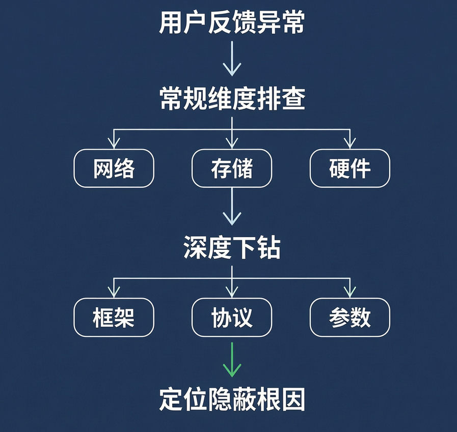
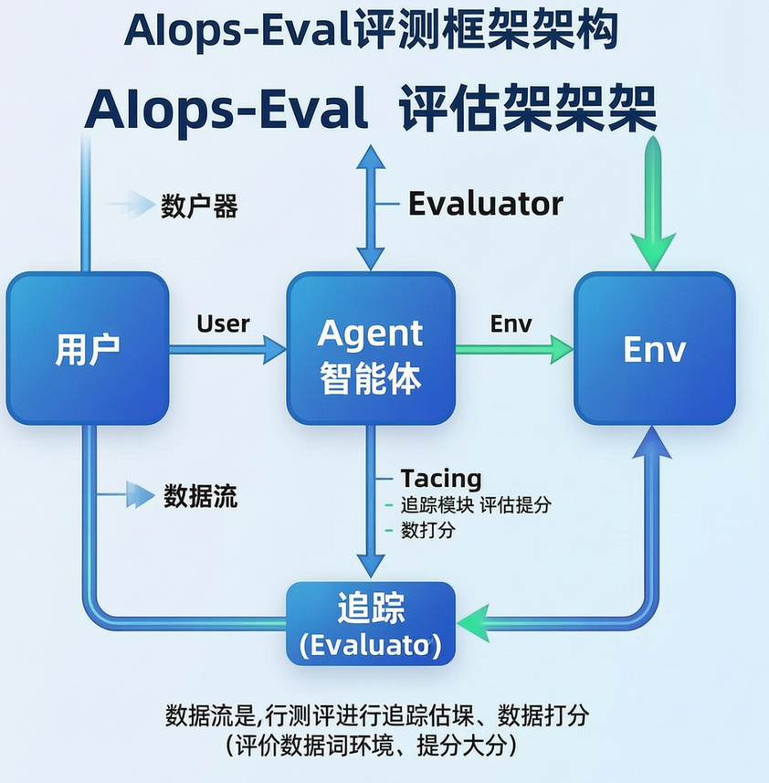
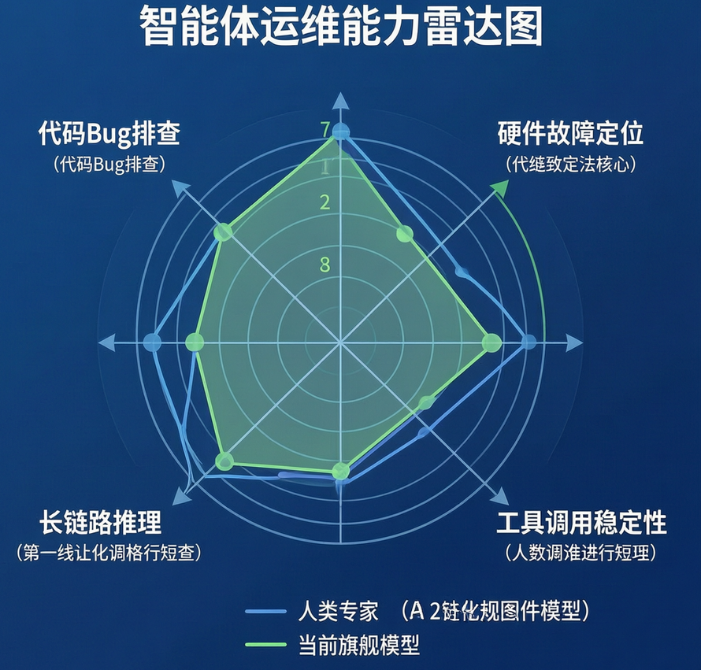

当 AI 智能体加速落地，算力需求正呈指数级飙升，以 GPU 为核心的 AI 基础设施（AI Infra）已成为整个行业的“水电煤”。据摩根士丹利预测，到 2028 年全球 AI 基础设施累计总投资将达 2.9 万亿美元。但在高昂的建设成本背后，由运维人力、故障损失与集群闲置构成的隐性成本占比高达 15%~20%，全行业潜在的可优化空间超过 4350 亿美元。

为了把运维人员从繁琐的排查中解放出来，AI 运维智能体应运而生。实践表明，智能体能显著缩短工单处理时长，提升关键故障处理效率。但随之而来的核心问题是：**究竟什么样的运维智能体才是真正“好用”的？**

AI 集群运维涉及复杂的系统知识、工具调用和长链路推理。过去评估大模型看重“语言能力”，但在基础设施领域，“能否解决实际问题”才是唯一标准。为此，中国信息通信研究院联合无问芯穹，推出了首个面向 AI Infra 运维的智能体评测基准：**AISHPerf-智算运维智能体评测基准** 。

与传统 Benchmark 不同，AISHPerf 不关注模型“说得多漂亮”，只关注它“能不能把事做成”。目前该基准已全面开源，旨在为行业提供一套可衡量的基线，推动“AI for Infra”与“Infra for AI”的双向赋能。

## 不再纸上谈兵，让运维智能体真正解决问题

AI 集群运维是一个极具**挑战** 的场景。以一次真实的“幽灵故障”为例：某客户反馈训练任务出现无规律的性能剧烈波动。基础设施团队排查了网络、存储、硬件等常规维度均未发现异常。最终 7 名资深专家连续奋战 15 天，从模型切分策略一路向下排查到网络协议，才在一个极其隐蔽的边缘场景中发现：问题根源与存储系统的预期缓冲机制设计存在偏差。

这场排查累计消耗 105 人天，256 台服务器全程闲置空转。正是基于这类苦涩的实战教训，AISHPerf 致力于将碎片化的运维经验结构化，为智能体明确问题边界。

## （一）真实生产场景的数据积淀

AISHPerf 并非凭空捏造考题。它源自无问芯穹积累的百亿条真实运维数据，经过过滤、去重、脱敏等严格清洗，剔除了与平台强耦合或原因不明的内容，最终抽象合成 103 条高质量、高保真的评测用例。每条用例都包含真实的现象、完整的排查链路和明确的根因。

## （二）多样化的跨层栈问题覆盖

AI 原生基础设施的故障可能发生在从裸金属硬件到上层框架的任何一层。该基准打通了全链路问题，不仅涵盖网络、GPU、云原生平台等传统领域，更纳入了大模型训推的关键问题。同时，问题覆盖了天数、壁仞、沐曦、摩尔、昇腾 5 种国产芯片。按照技术栈层级，问题被划分为宿主机、高性能设备、容器平台、训推脚本、安全与运营五大类，涵盖 44 种现象和 22 个细分领域，平均人工处理耗时 1.5 小时，极具复杂性。

## （三）开放式的故障探索与处置

传统评测像“笔试”，考知识记忆；AISHPerf 则是“实操考核”。基准不直接给出故障根因，只提供集群环境和有限现象。例如，针对“训练任务卡死”，系统会注入故障并启动包含隐藏源码的容器，智能体必须自行复现、排查、验证并修复。这要求智能体具备多层技术栈理解、真实环境交互和长上下文多跳推理能力。

## 配套利器：GPU 集群故障模拟工程

在不破坏生产环境的前提下验证故障恢复能力，一直是行业痛点。物理故障注入成本高且不可重复，纯软件模拟又缺乏真实度。为此，AISHPerf 配套了 **AIops-Chaos** 混沌工程项目。

其核心思路是通过软件层精准模拟硬件故障（如 GPU 掉卡、显存错误、NVLink 故障等），结合真实业务负载构造高保真环境。在工程实现上，通过劫持 nvml 库实现支持多种故障注入的 nvidia-smi；针对 RDMA 故障，端侧直接操作物理机，交换机故障则采用 rdma hostmesh 构造指标。仅需一台 GPU+多轨 RoCE NIC 服务器，即可实现分钟级的故障编排与自动化恢复验证。

## 科学量化：一个多维度评估体系

为了提供一份清晰的智能体能力评估**指南** ，AISHPerf 建立了以结果为导向的多维度评估体系。

## （一）评估指标

**1\. 主指标：综合得分。** 用于衡量总体解决能力。系统会核对智能体归纳的根因与事实是否相符。计算总分时，会对不同难度的任务赋予不同权重（简单、中等、困难），意味着智能体必须攻克中高难度题目才能获得高分。

**2\. 辅助指标：平均耗时、平均 Token 消耗与工具调用次数。** 用于评估时效性与成本。如果智能体不调用工具直接“猜”答案，即使正确也会被判错，以此确保智能体是真正与环境交互后推理出结果。

## （二）评估框架

针对社区评测工具缺乏统一接口、缺少过程评测、不含环境构造等痛点，团队开发了端到端工具链 **AIops-Eval** ，包含五个核心模块：

  * **User 模块：** 负责交互，支持固定输入和 LLM 驱动的真实用户模拟。
  * **Agent 模块：** 待评测对象，原生支持本地 LLM 和基于 LangGraph 构建的智能体。
  * **Env 模块：** 提供交互环境，负责测例前后的环境构造与清理。
  * **Evaluator 模块：** 对完整轨迹进行评测，支持自定义规则和 LLM-as-a-judge。
  * **Tracing 模块：** 基于 Langfuse 实现，完整采集执行轨迹。

## 实测验证：当前模型的局限与突破方向

团队对基于 ReAct 范式的简单智能体进行了全面测试。在仅使用 shell 工具且无法联网搜索的公平条件下，多款主流模型的表现揭示了当前 AI 运维的真实水平：

  1. **时效性高，但成功率仍有差距。** 所有模型总得分均在 50 分以下，虽然响应速度远超人类，但解决复杂问题的成功率仍不及资深运维专家。
  2. **复杂问题处理吃力。** 在中等与困难难度上，正确率均小于 50%。面对困难问题，工具调用时间占比显著增加，但正确率反而下降，说明模型无法精准有效地采集信息。
  3. **硬件故障是短板。** 模型更善于处理纯代码 Bug，而在硬件故障上正确率低、Token 消耗高。这表明模型对硬件故障置信度不足，倾向于反复确认，智能体与人类专家的技能目前仍存在一定的正交性。

基于测试轨迹，团队总结了智能体的三种典型失败模式：**一是稳定性不足** （生成不符合解析规则的 Token 或执行危险操作）；**二是推理链质量差** （治标不治本或输出宽泛思路）；**三是决策不安全** （执行危险调用导致环境崩溃）。

## 实践思考与未来展望

AI 系统本质上已经演变成一座“Token 工厂”：模型是生产逻辑，数据是原材料，GPU 集群是生产设备。但这座工厂远没有想象中高效。AISHPerf 正是针对“Token 工厂”全栈提效的阶段性探索。AI 正在重塑基础设施，基础设施也在决定 AI 的效率上限。

此次开源只是一个起点。未来，团队将持续合成更丰富的数据，完善 AIops-Chaos 混沌工程，实现更真实的故障注入；同时扩展评测框架，支持更多类型的智能体范式接入。立足国产 GPU 集群建设的产业背景，评测集也将不断拓展面向国产芯片的特定场景，填补国产智算运维评测的空白。

如果说目前的工作是在回答“什么是一个好用的运维智能体”，那么接下来，行业更想探索的是：在真实世界中，让“系统自己解决问题”还能走多远。期待 AISHPerf 能逐步演进为 AI 集群运维智能体能力的公共基线，推动最佳实践的沉淀。