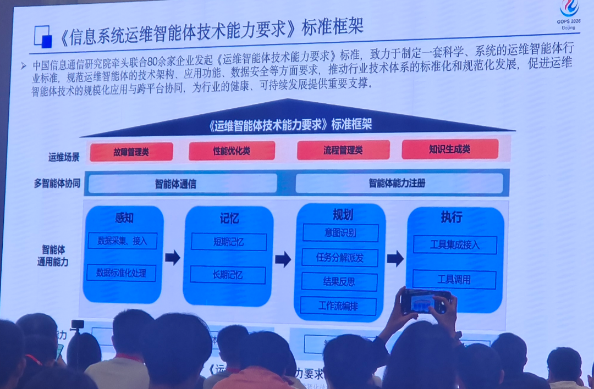
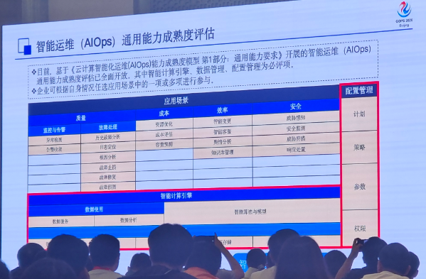
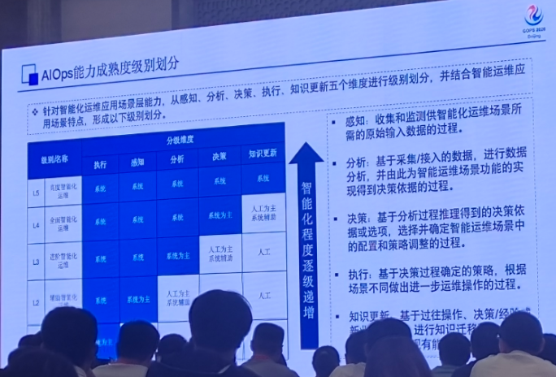
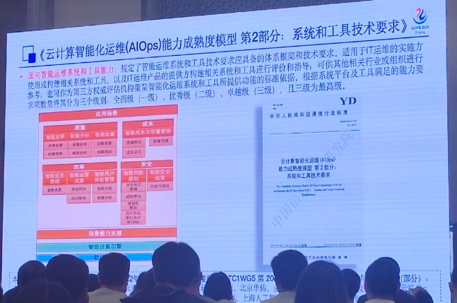
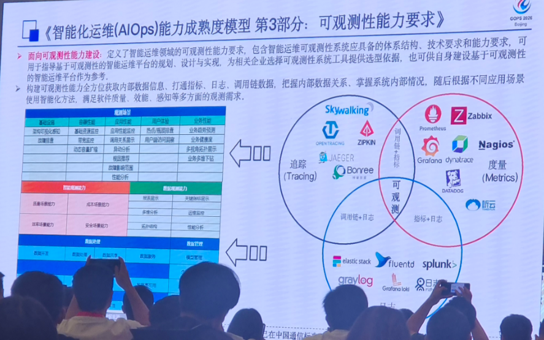
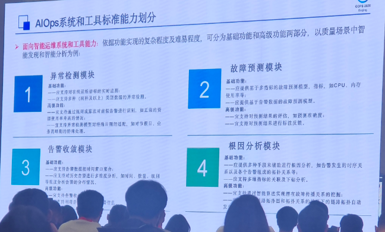
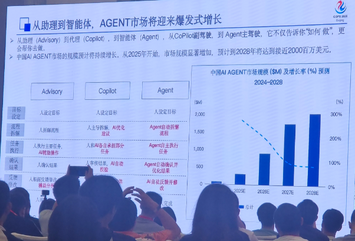
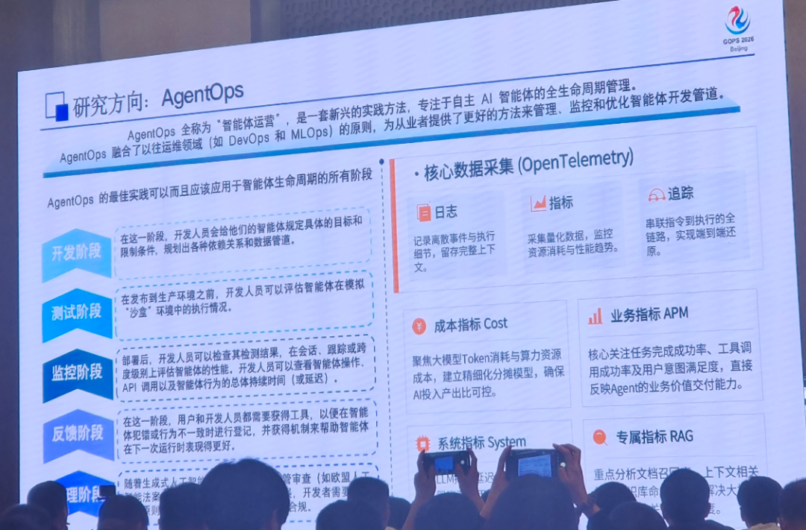
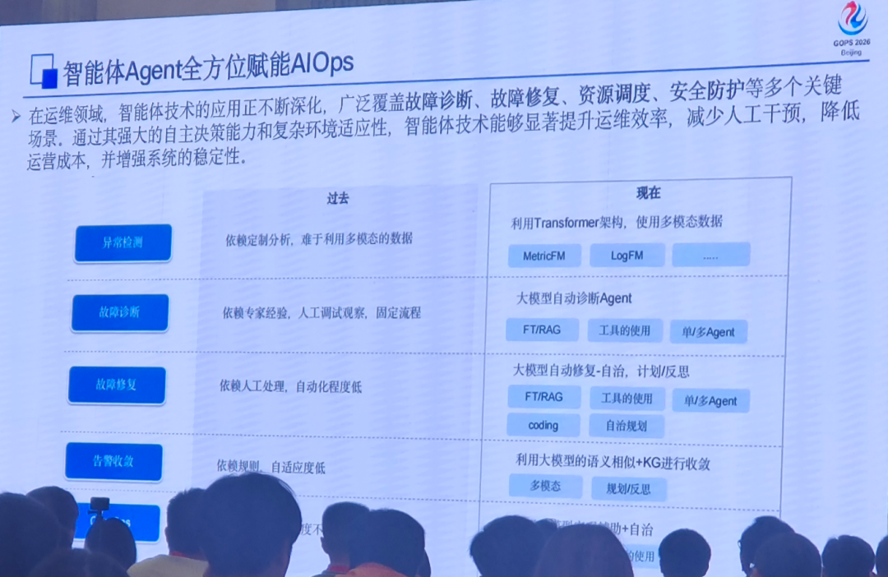
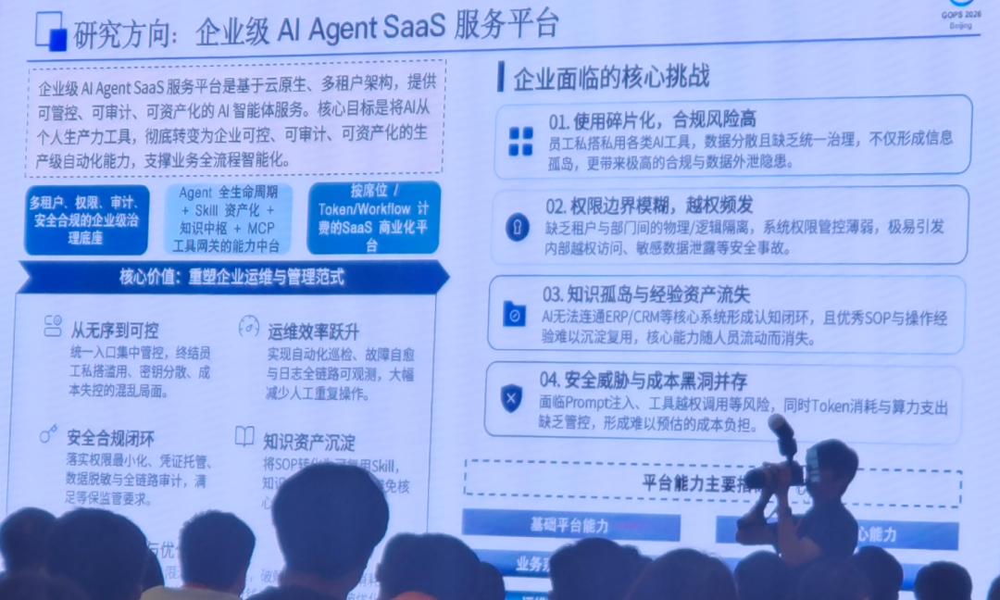

AI技术飞速迭代，正在彻底改变传统IT运维的模样。当普通的自动化运维慢慢摸到了能力天花板，AIOps+AI Agent就成了行业突破瓶颈的核心解法。近期落幕的运维技术专题分享会干货满满，行业大佬们围绕AIOps标准化建设、AI Agent落地实战、全栈可观测搭建、全新AgentOps运维模式等热门方向，做了全方位的深度解读，清晰梳理出国内智能运维从建立标准到AI Agent商业化落地的完整发展脉络。今天我们就一一拆解核心干货，带大家看懂智能运维的全新机遇。核心行业信号：拥有自主决策、闭环运营能力的运维智能体，已经站上IT运维的C位，这也意味着AIOps彻底跳出辅助运维的定位，正式进入自主智能的全新阶段。

# 一、标准筑基：国内AIOps全维度成熟度体系全面成型

* * *

经过这些年的行业打磨，国内智能运维终于建起了一套体系完整、能落地、可测评的AIOps官方标准。这套标准从能力场景、成熟度等级、工具规范、可观测性建设多个维度，统一了全行业的建设参考，完美解决了过去运维工作无标准、难评估、落地乱的各类痛点。

## 1\. 五大核心模块，覆盖企业全场景运维需求

根据《云计算智能化运维 \(AIOps\) 能力成熟度模型第 1 部分：通用能力要求》官方规范，企业AIOps建设主要围绕五大核心方向展开，涵盖质量、成本、效率、安全、配置管控全部运维场景。同时依托数据应用、智能计算引擎两大底层底座，搭建起一套完整、成熟的智能化运维架构。✅ 质量管控：聚焦监控告警精准化、故障快速定位与闭环处置，保障业务系统稳定运行✅ 成本优化：落地资源智能调度、运维成本量化评估，实现降本增效✅ 效率提升：覆盖智能变更发布、集群动态调度，减少人工干预、缩短运维流程✅ 安全防护：实现全域威胁感知、漏洞自动检测与闭环处置，筑牢运维安全屏障✅ 配置管理：细化运维计划、策略、参数、权限全层级管控，实现运维行为规范化、可追溯企业完全可以对照这套标准做常态化自查，快速找到自身运维体系的短板，按需落地智能化场景，一步步完成能力升级。

## 2\. 五级成熟度等级，清晰界定智能化演进路径

## 行业把AIOps的智能化水平，划分成了感知、分析、决策、执行、知识更新五个递进等级，非常直观地展现了运维从人工主导到自主智能的进化全过程：

简单来说，运维从最开始的人工手动采集数据，慢慢迭代成系统自动采集、智能分析、自主出决策、全自动执行运维操作，最后还能沉淀运维经验、持续更新知识库、自我优化。成熟度越高，需要人工插手的工作就越少，系统自主处理故障、优化资源、规避风险的能力就越强，帮企业清晰规划出运维升级的每一步。

## 3\. 细分配套标准，补齐落地全流程细节

除了核心能力和等级标准，一系列细分规范也补齐了落地细节，从顶层设计到实际落地，实现了全覆盖、无死角：📌 工具技术分级标准：将运维工具系统划分为全面级、优秀级、卓越级三个等级，明确场景支撑、智能计算、自动化能力的硬性门槛，规范产品迭代与企业选型📌 全栈可观测性标准：整合Skywalking、Zabbix、Prometheus、Splunk等主流工具，打通日志、指标、链路追踪三类核心观测数据，构建统一可观测底座，彻底解决运维数据碎片化、故障排查效率低的痛点📌 核心能力模块化标准：拆解异常检测、故障预测、告警收敛、根因分析四大核心模块，分别定义基础与高阶能力要求，为厂商产品升级、企业能力建设提供统一参考标尺

# 二、赛道爆发：AI Agent成为智能运维核心增长引擎

* * *

#   

随着大模型技术越来越成熟，企业对智能运维的需求也持续暴涨，AI Agent彻底迎来商业化落地的风口，成为智能运维赛道最大的增量亮点。根据分享会公布的行业预测数据，从2025年开始，国内AI Agent市场将迎来高速增长，2028年市场规模有望逼近2000百万美元，发展势头十分迅猛。我们从产品形态的升级，就能看懂这波增长的核心逻辑：运维AI工具已经完成了三级跨越式升级，再也不是当初简单的辅助工具了。🔹 Advisory（智能助理）：纯辅助模式，人工设定核心目标，系统仅提供流程参考，所有运维操作均需人工完成🔹 Copilot（代理副驾）：人机协同模式，人工下达核心任务，AI承接部分执行环节，辅助落地运维操作、提升人工效率🔹 Agent（自主智能体）：全自主模式，可独立拆解运维目标、自主调度工具执行任务、校验执行结果、自动复盘迭代，实现“从答疑到落地、从执行到优化”的全闭环能力目前，企业级AI Agent SaaS服务平台已经实现大规模落地。它基于云原生多租户架构，能提供可审计、可管控、可资产化的智能体服务，精准解决了企业用AI做运维的五大难题：工具零散碎片化、合规风险高、权限边界模糊、运维经验沉淀难、安全成本不好管控，把杂乱零散的AI工具，整合为企业可统一管控的生产力工具，商业化价值和落地空间巨大。

# 三、范式革新：AgentOps诞生，重构智能体全生命周期管理

* * *

#   

随着越来越多运维Agent落地使用，传统的DevOps、MLOps模式已经跟不上智能体的管理节奏，全新的AgentOps（智能体运营）模式顺势而生。它融合了DevOps高效交付、MLOps智能迭代的优势，覆盖智能体开发、测试、监控、运营、反馈、迭代全生命周期，让AI运维从简单的单点工具调用，升级成一套可长期运营、持续进化的体系化能力。

## 1\. 开发测试阶段：标准化管控，筑牢安全底座

智能体正式上线前，会提前划定好目标、权限和操作规范，在隔离环境里做完全场景测试和风险校验，从根源避免越权、误操作等问题，确保每一次运行都合规安全。

## 2\. 监控运营阶段：全维度观测，实时感知状态

依托OpenTelemetry开源观测框架，系统会全方位采集智能体的日志、运行指标、调用链路、Token消耗、任务成功率等核心数据，实时监控运行状态，有问题能快速精准定位。

## 3\. 反馈迭代阶段：闭环优化，持续进化能力

依托线上真实运行数据持续复盘优化，针对性调整智能体的模型参数、执行逻辑和场景适配能力，让运维智能体可以不断进化、越用越好用。

# 四、价值落地：AI Agent全方位重塑传统运维场景

* * *

#   

过去的运维，高度依赖专家经验、固定规则和人工兜底，效率低、上限也有限。而AI Agent的落地，直接打破了传统运维的效率瓶颈和能力边界，实现了运维模式的颠覆性升级。各大核心场景的新旧对比，一目了然：运维场景| 传统运维模式| Agent赋能全新模式  
---|---|---  
异常检测| 依赖人工定制规则，多模态数据融合分析难度大、漏检误检率高| 基于Transformer架构与多模态时序模型，自主学习业务特征，实现全域、精准、实时异常识别  
故障诊断| 依托资深专家经验，遵循固定排查流程，耗时久、门槛高、经验无法复用| 大型运维诊断Agent自主溯源，联动多类运维工具交叉验证，快速定位故障根因  
故障修复| 以人工处置为主，自动化程度低，修复周期长、人为失误风险高| 自主编排标准化修复流程，自动完成代码微调、服务重启、资源扩容等自愈操作，实现故障闭环处置  
告警收敛| 依赖固定规则配置，适配性差，易出现告警风暴、无效告警堆积问题| 基于语义相似度与多维度智能规则，自动完成告警聚合、降噪、分级，精准过滤无效信息  
简单来说，AI Agent让运维从单个工具智能化，升级成了智能体集群自主协同工作。不仅大幅减少了人工值守和手动操作，降低人为失误概率，还能把原本小时级的故障处置，压缩到分钟级完成，让业务系统运行更稳定、运维工作更高效。

# 五、行业总结与未来展望

* * *

#   

如今国内智能运维行业，已经稳稳走完了标准化打底的阶段。统一的成熟度评估、工具规范、可观测性标准全部落地，行业发展终于有章可循。再加上AI Agent技术日趋成熟、企业智能化需求集中爆发，搭配全新的AgentOps运营方法论加持，AIOps行业正式迈入智能体驱动的自主运维新时代。这里也要说清楚：运维智能体不是为了替代运维人员，核心是解放人力、重塑运维价值。在安全合规的前提下，智能体包揽了大量重复、高频、标准化的运维工作，还能辅助搞定复杂场景的决策，既降低了人工成本，又减少了操作风险。结合大模型能力和专业运维知识库，打通文档、工具、数据分析全链路，真正帮企业实现运维提质、增效、降本、控险。对企业而言：现在就是对标行业标准、优化运维体系、试点落地AI运维智能体的最佳时机，尽早布局就能抢先吃到智能化改造的红利，打造自己的运维竞争优势。对从业者而言：AIOps+AI Agent绝对是未来几年运维赛道最核心、最有前景的方向，深耕这个领域，就能稳稳抓住行业技术红利和职业升级机遇。后续我会持续跟进AIOps标准落地、AI Agent商业化迭代、AgentOps场景创新等最新行业动态，持续输出干货解读，帮大家紧跟技术趋势、把握行业机遇。欢迎大家持续关注！

  

如果此文能帮小伙伴答疑解惑，请关注「架构那些事儿」公众号！

你的关注就是我的动力！