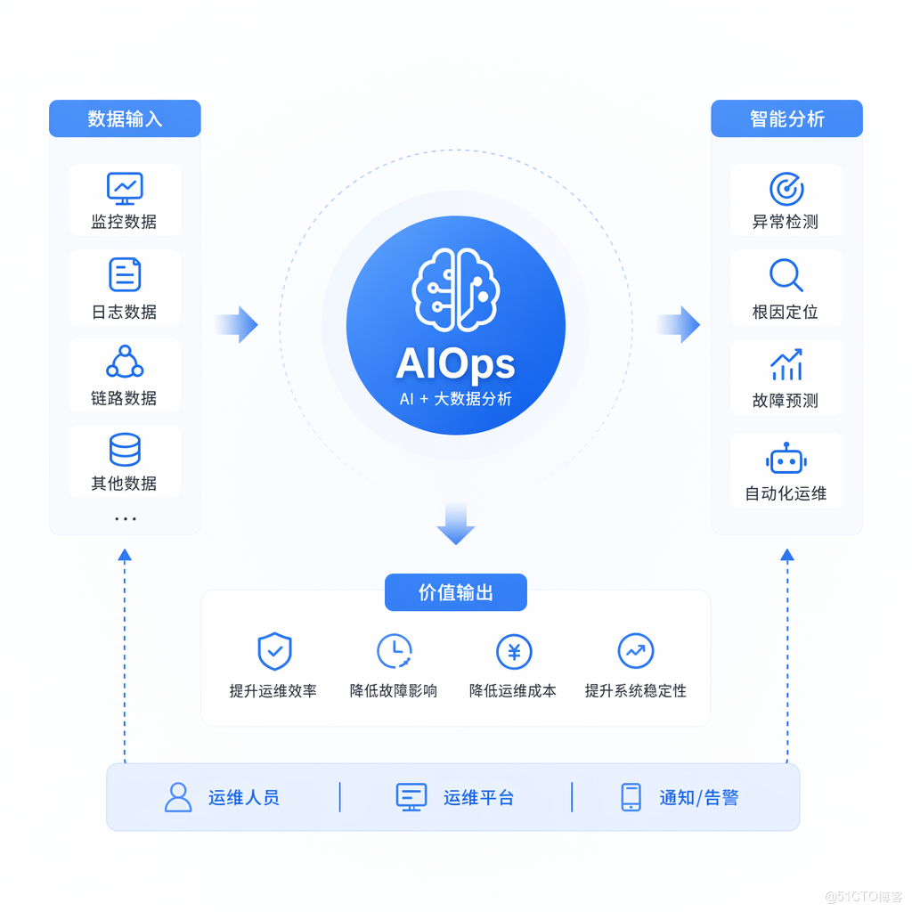
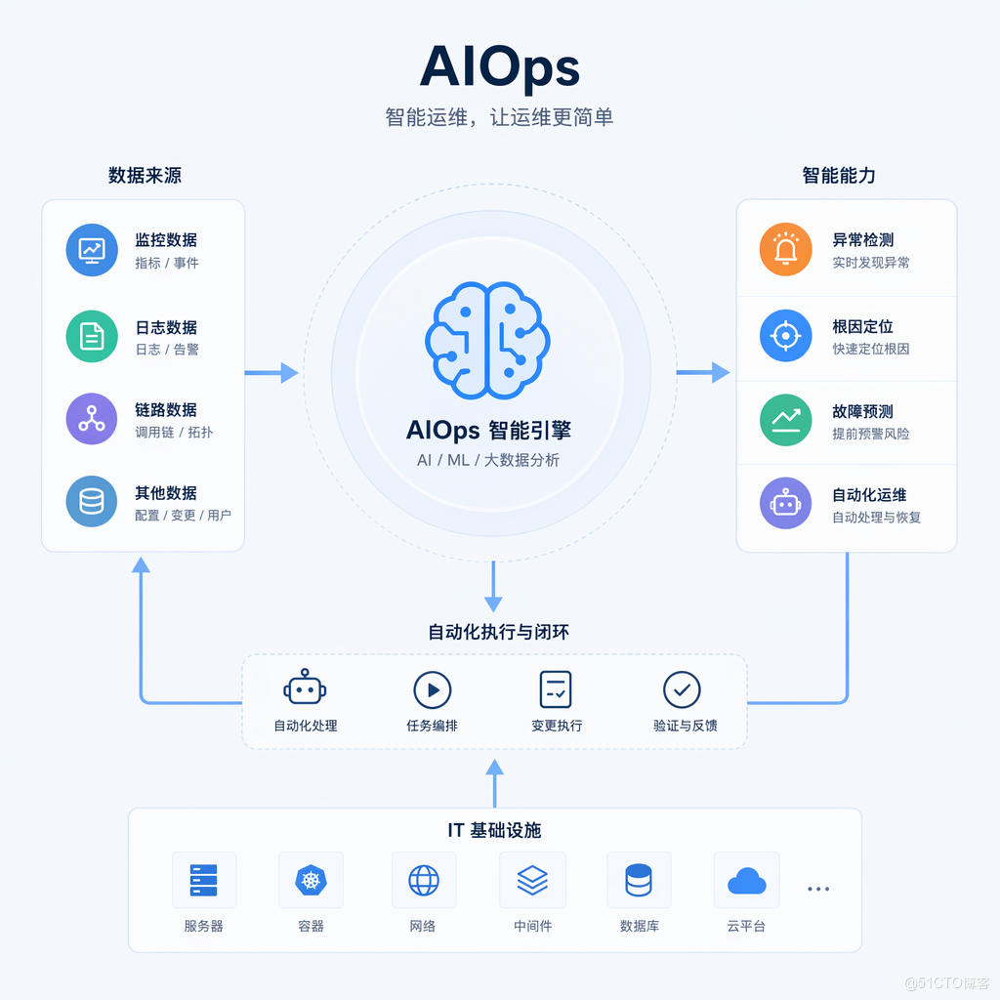

# AIOps一次P0故障复盘：告警泛滥，真正问题被海量信息淹没

## 引言

P0级故障复盘会上，最让人后怕的往往不是"我们花了多久才修复"，而是"真正的问题信号，早就出现了，却被淹没在几百条无关告警里，没有人第一时间注意到"。这篇文章想完整复盘一次真实的P0故障处理过程，重点剖析"告警泛滥"这个看似技术问题、实则是治理问题的核心症结，并给出具体的技术改进方案。

## 一、故障现场：凌晨的告警风暴

事情发生在一个周五晚上10点，公司刚完成一次涉及订单中心的常规发布。发布后20分钟，监控系统开始密集告警——数据库连接数告警、接口延迟告警、下游库存服务超时告警、消息队列积压告警，几分钟内产生了超过400条独立通知，值班群瞬间被刷屏。

值班同事的第一反应是逐条查看这些告警，试图从中筛选出最紧急的那一个。但问题在于，这400条告警里，绝大多数其实是同一个根因引发的连锁反应——发布引入的一个数据库连接未正确释放的bug，导致连接池逐渐耗尽，进而引发了从数据库层到应用层再到下游依赖的层层级联告警。真正指向根因的那条"数据库连接池使用率异常上升"的告警，被埋在了海量的下游连锁反应告警中间，直到37分钟后才被人工注意到并确认为关键线索。

## 二、根因分析：告警泛滥的技术成因

### 2.1 缺乏告警的因果关联能力

系统对每一个独立的监控指标都配置了独立的告警规则，但完全没有能力识别"这些告警之间存在因果关系，本质上是同一个事件"。这是导致告警泛滥最直接的技术原因。

### 2.2 缺乏告警优先级和权重机制

所有告警在通知渠道上呈现出的"视觉权重"是完全一样的——都是群里的一条消息，没有任何机制引导值班人员优先关注"更接近根因"的那条告警,而不是被最新收到的告警吸引注意力。

## 三、技术改进方案：构建告警关联分析引擎

针对这次故障暴露的问题，我们设计了一套基于依赖关系图的告警关联分析引擎，核心思路是：预先定义服务间的依赖拓扑关系，当短时间内出现多个告警时，自动分析这些告警对应的服务节点在拓扑图中的位置关系，识别出"根源节点"并将其他告警标记为"疑似连锁反应"。
    
    
    import networkx as nx  
    from datetime import datetime, timedelta  
    from collections import defaultdict  
      
    class AlertCorrelationEngine:  
        """基于服务依赖拓扑的告警关联分析引擎"""  
      
        def __init__(self):  
            # 构建服务依赖图：边的方向表示"调用关系"，A->B表示A依赖B  
            self.dependency_graph = nx.DiGraph()  
            self.dependency_graph.add_edges_from([  
                ("order-service", "inventory-service"),  
                ("order-service", "payment-service"),  
                ("order-service", "mysql-order-db"),  
                ("inventory-service", "mysql-inventory-db"),  
                ("payment-service", "payment-gateway"),  
            ])  
      
        def find_root_cause_candidates(self, alerted_services: list) -> dict:  
            """  
            给定一批同时触发告警的服务，基于拓扑关系推断最可能的根因节点  
            核心逻辑：在依赖图中，被更多"下游告警服务"直接或间接依赖的节点，  
            更可能是根因（因为它的问题会传导影响到依赖它的所有上游服务）  
            """  
            alerted_set = set(alerted_services)  
            score = defaultdict(int)  
      
            for service in alerted_set:  
                if service not in self.dependency_graph:  
                    continue  
                # 计算有多少个其他告警服务，是通过依赖链间接指向当前节点的  
                descendants = nx.ancestors(self.dependency_graph, service) if service in self.dependency_graph else set()  
                reachable_alerted = descendants & alerted_set  
                score[service] = len(reachable_alerted)  
      
            if not score:  
                return {"root_cause_candidates": [], "note": "无法建立关联，需人工排查"}  
      
            max_score = max(score.values())  
            candidates = [s for s, v in score.items() if v == max_score and max_score > 0]  
      
            return {  
                "root_cause_candidates": candidates,  
                "correlated_services": list(alerted_set - set(candidates)),  
                "confidence": "high" if max_score >= 2 else "medium",  
            }  
      
      
    engine = AlertCorrelationEngine()  
    alerted_services = ["order-service", "inventory-service", "payment-service", "mysql-order-db"]  
    result = engine.find_root_cause_candidates(alerted_services)  
    print(result)  
    # 输出会指向 mysql-order-db 是最可能的根因节点，因为它被order-service直接依赖，  
    # 而order-service又是inventory-service和payment-service告警链条的上游触发点  
    

这段代码的核心价值在于，把"一堆看似独立的告警"转化为"一个带有优先级排序的根因候选列表"，值班人员不再需要凭直觉从几百条消息里"猜"哪个是根因，而是直接从系统给出的候选列表入手排查，大幅缩短了定位时间。

## 四、配套的告警呈现层改造

除了后端的关联分析能力，我们还改造了告警的呈现方式，把原来"扁平化的消息流"改造为"分组聚合的事件卡片"：
    
    
    def render_alert_event_card(correlation_result: dict, raw_alerts: list) -> str:  
        """把关联分析结果渲染成一张结构化的事件卡片，而不是分散的多条消息"""  
        root_causes = correlation_result["root_cause_candidates"]  
        correlated = correlation_result["correlated_services"]  
      
        card = f"""  
    🔴 【疑似关联故障事件】共{len(raw_alerts)}条告警被自动聚合  
      
    📍 最可能的根因节点: {', '.join(root_causes) if root_causes else '未识别，需人工排查'}  
    🔗 疑似连锁反应服务: {', '.join(correlated) if correlated else '无'}  
    📊 置信度: {correlation_result.get('confidence', 'unknown')}  
      
    👉 建议优先排查根因节点，而非逐一处理下游连锁告警  
    """  
        return card  
      
    card = render_alert_event_card(result, alerted_services)  
    print(card)  
    

这种"一张卡片代替几百条消息"的呈现方式，直接解决了"信息淹没"的核心痛点——值班人员打开告警群，第一眼看到的是一份结构化的分析结论，而不是需要自己从信息海洋中打捞的原始数据。

## 五、故障处理流程的改进对比
    
    
    flowchart TD  
        subgraph 改进前流程  
        A1[发生故障] --> A2[产生数百条独立告警]  
        A2 --> A3[值班人员逐条查看]  
        A3 --> A4[凭经验猜测根因]  
        A4 --> A5[耗时较长才定位问题]  
        end  
      
        subgraph 改进后流程  
        B1[发生故障] --> B2[告警关联引擎自动聚合]  
        B2 --> B3[生成根因候选事件卡片]  
        B3 --> B4[值班人员直接排查候选节点]  
        B4 --> B5[快速定位并处理]  
        end  
    

## 六、这次复盘带来的组织流程改进

除了技术层面的改造，这次P0复盘还推动了几项组织流程的调整：明确要求任何新服务上线前，必须在依赖关系图谱中登记其上下游依赖，保证关联分析引擎的拓扑数据完整可用；同时把"告警是否被正确聚合、根因候选是否准确"纳入了故障复盘的常规检查项，作为持续验证和优化这套关联分析能力的反馈机制。

## 七、这套方案在后续故障中的实战验证

技术方案上线一个月后，我们又经历了一次性质相似但规模更大的故障——一次网络设备的硬件故障，导致机房内多个可用区之间的通信短暂中断，波及了将近30个微服务同时产生告警。这是对新系统的一次真实压力测试。

结果令人欣慰：告警关联引擎在故障发生后90秒内，就自动聚合出了一份事件卡片，准确指出问题根源集中在跨可用区网络连通性上，而不是罗列出30个服务各自的告警。值班同事根据这份卡片，直接联系了网络团队核实跨可用区链路状态，跳过了逐一排查每个业务服务的冗余步骤，整个故障的确认和响应时间，相比几个月前那次数据库连接池故障，缩短了约60%。

这次实战验证也帮助我们发现了系统的一个局限——当告警涉及的是"物理基础设施层面"的故障（比如网络设备、机房电力），而不是"应用逻辑层面"的连锁反应时，仅依赖应用服务的依赖拓扑图,有时无法准确定位到真正的物理层根因，还需要结合网络拓扑、机房拓扑等更底层的关联维度。这提示我们，关联分析引擎的拓扑数据,不应该只停留在应用服务层面,而应该逐步扩展到覆盖网络、存储、计算等基础设施层面的完整依赖关系,才能应对更广泛类型的故障场景。这也成为了我们下一阶段技术改进的重点方向。

## 八、告警治理是一场持续的马拉松，而非一次性项目

这次故障复盘和后续的技术改造，给团队最大的一个认知转变是：告警治理不是"做完一次改造就一劳永逸"的项目，而是需要伴随业务和系统架构的演进持续投入的长期能力建设。随着微服务数量的增长、新技术组件的引入、业务复杂度的提升，依赖关系图谱需要持续更新维护，关联分析的算法逻辑也需要根据新出现的故障模式不断迭代优化。

我们后来专门为这套告警治理系统设立了季度回顾机制，每个季度审视一次关联分析的准确率、根因定位的平均耗时、以及是否有新的故障模式暴露出系统的局限性，并据此规划下一阶段的改进方向。这种持续投入的态度，才是保证告警治理能力能够长期、稳定地为团队创造价值的根本保障，而不是指望"一次改造，终身受益"的一次性投入心态。

## 结语

这次P0故障最大的教训不是"发布引入了一个bug"——bug总会发生，真正值得深刻反思的是，我们的告警系统在故障发生时，没能帮助值班人员快速聚焦到真正的问题上，反而因为信息过载拖慢了处理速度。告警泛滥的根源往往不是"告警太敏感"，而是"缺乏关联分析和优先级呈现的能力"。通过引入基于依赖拓扑的关联分析引擎，把海量分散的告警转化为结构化的根因候选事件，是解决这一问题最直接、最有效的技术路径,也是每一个成熟的运维/SRE团队都值得投入建设的核心基础能力。

https://edu.51cto.com/surl=SxJxC2