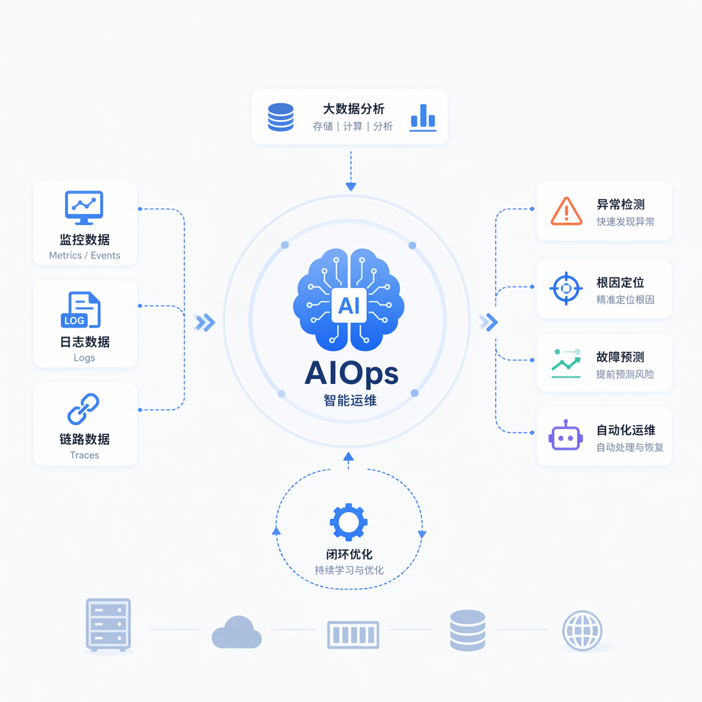
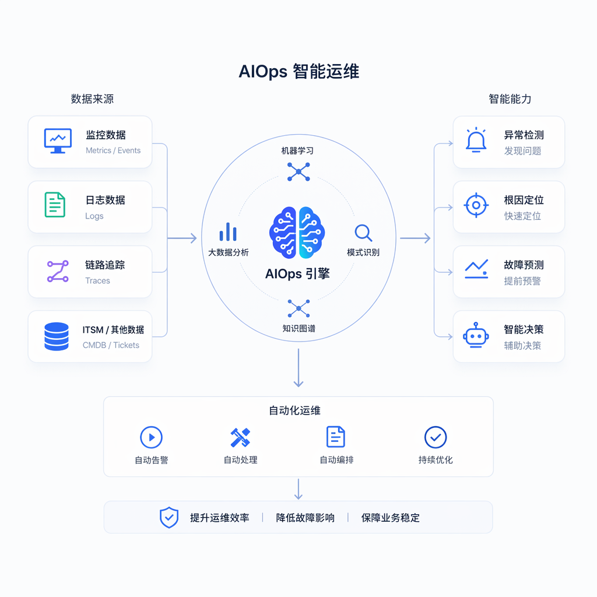

# AIOps：老运维转型最大的思维壁垒:只会救火，不会做平台与稳定性体系

## 引言

在和很多资深运维朋友交流转型话题时，我发现一个特别有意思的现象：越是"救火经验丰富"的老运维，转型阻力反而越大。这听起来有点反直觉——按理说经验越丰富，转型应该越容易才对。但深入聊下去会发现，问题恰恰出在"救火经验"本身——多年养成的应激式思维方式，反而成了阻碍他们理解"平台化"和"稳定性体系"这套新范式的最大壁垒。

## 一、什么是"只会救火"的思维模式

"救火型"运维的核心特征是：以故障为中心组织工作，价值感来自于"快速解决了一个紧急问题"。这种思维模式下，个人能力的评价标准往往是"处理故障的速度和准确率"，团队里最受尊敬的往往是那个"半夜三点一个电话就能定位问题"的老师傅。

这种能力当然有价值，但它有一个致命的局限：**救火思维是"存量思维"，而非"增量思维"** ——救火解决的永远是"已经暴露出来的问题"，而不会主动思考"这一类问题的根源在哪里，如何从系统设计层面消除"。一个团队如果长期依赖几个"救火英雄"，看似效率很高，实际上是把整个系统的可靠性绑定在了几个人的个人经验和体力精力上，这是一种非常脆弱的组织能力结构。

  

## 二、平台与稳定性体系到底在做什么

"平台化"和"稳定性体系建设"这两个概念，本质上是想解决"救火思维"的规模化瓶颈问题。它们的核心逻辑是：

**把个人经验转化为系统能力。** 一个老师傅脑子里的排障经验，如果只停留在个人记忆里，团队规模扩大后就无法复制传递。平台化的核心工作，就是把这些经验固化成自动化脚本、诊断工具、标准化流程文档，让新人也能快速具备接近老师傅的排障能力。

**从"响应故障"转向"预防故障"。** 稳定性体系建设的核心工作之一是容量规划、压测演练、混沌工程——主动在系统还没出问题之前，就模拟各种极端场景，提前发现薄弱环节并加固。

这两种范式在组织能力结构上的差异，可以用下面的图来表示：
      
      1. flowchart LR
        2.     subgraph 救火型组织结构
        3.     A1[老师傅A]--> F1[故障1]
        4.     A1 --> F2[故障2]
        5.     A1 --> F3[故障3]
        6.     A2[老师傅B]--> F4[故障4]
        7.     A2 --> F5[故障5]
        8. end
        9.   10.     subgraph 平台化组织结构
        11.     P[平台/工具/知识库]--> N1[新人1]
        12.     P --> N2[新人2]
        13.     P --> N3[新人3]
        14.     E[老师傅经验]--> P
        15.     N1 -.反馈新故障模式.-> P
        16.     N2 -.反馈新故障模式.-> P
        17. end
    
    

左侧的救火型结构中，可靠性完全依赖于少数几个核心人物，一旦这些人休假或离职，团队应对能力会断崖式下跌；右侧的平台化结构中，经验被沉淀进平台后可以被团队所有成员复用，且新发现的故障模式还能反哺回平台，形成持续增强的正向循环。这也是为什么平台化建设被视为团队"反脆弱性"的关键——它把可靠性从"人的能力"转移到了"系统的能力"上。

## 三、一个具体的对比案例：数据库慢查询处理

让我们用一个具体场景来说明这两种思维方式的差异。假设线上出现了数据库慢查询导致的接口超时问题。

**救火型运维的典型处理方式：**
      
      1.  #!/bin/bash
        2. # quick_fix.sh —— 救火式的应急处理脚本
        3. # 直接查找并杀掉执行时间过长的慢查询进程
        4.   5. MYSQL_USER="root"
        6. MYSQL_PASS="${MYSQL_ROOT_PASSWORD}"
        7. THRESHOLD_SECONDS=30
        8.   9. mysql -u"$MYSQL_USER"-p"$MYSQL_PASS"-e "
        10. SELECT id, time, info FROM information_schema.processlist
        11. WHERE command != 'Sleep' AND time > $THRESHOLD_SECONDS;
        12. "| tee /tmp/slow_queries.log
        13.   14. # 直接杀掉超过阈值的查询，快速恢复服务
        15. mysql -u"$MYSQL_USER"-p"$MYSQL_PASS"-N -e "
        16. SELECT CONCAT('KILL ', id, ';') FROM information_schema.processlist
        17. WHERE command != 'Sleep' AND time > $THRESHOLD_SECONDS;
        18. ">/tmp/kill_commands.sql
        19.   20. mysql -u"$MYSQL_USER"-p"$MYSQL_PASS"</tmp/kill_commands.sql
        21. echo "$(date '+%F %T') 已清理慢查询，接口应已恢复">>/var/log/db_firefighting.log
    
    

这个脚本能在几分钟内让接口恢复正常，救火效果立竿见影。但它完全没有回答：这条慢查询是哪个业务代码触发的？是否缺少索引？是否是本次上线引入的新查询模式？如果不追问这些问题，同样的慢查询大概率会在未来某个时间点再次出现，团队将永远停留在"救火-恢复-再救火"的循环里。

**稳定性体系思维下的处理方式，会把这次事件转化为一套可持续复用的监控与分析能力：**
      
      1.  import pymysql
        2. import json
        3. from datetime import datetime
        4.   5. def capture_and_analyze_slow_queries(threshold_seconds=5):
        6. """采集慢查询并结合执行计划做结构化分析，而非简单粗暴地杀掉了事"""
        7.     conn = pymysql.connect(host="db-primary", user="monitor_ro", password="xxx", db="information_schema")
        8.     cursor = conn.cursor(pymysql.cursors.DictCursor)
        9.   10.     cursor.execute(f"""
        11.         SELECT id, time, info, db, user
        12.         FROM processlist
        13.         WHERE command != 'Sleep' AND time > {threshold_seconds}
        14.     """)
        15.     slow_queries = cursor.fetchall()
        16.   17.     report =[]
        18. for q in slow_queries:
        19.         sql_text = q["info"]
        20. ifnot sql_text:
        21. continue
        22. # 对每条慢查询自动跑一次执行计划分析，定位是否缺索引
        23.         cursor.execute(f"EXPLAIN {sql_text}")
        24.         explain_result = cursor.fetchall()
        25.         has_full_scan = any(row.get("type")=="ALL"for row in explain_result)
        26.   27.         report.append({
        28. "sql": sql_text,
        29. "duration_seconds": q["time"],
        30. "database": q["db"],
        31. "has_full_table_scan": has_full_scan,
        32. "captured_at": datetime.now().isoformat(),
        33. })
        34.   35. # 结构化落盘，供后续做趋势分析和自动生成优化建议，而非一次性用完即弃
        36. with open("/var/log/slow_query_analysis.jsonl","a")as f:
        37. for item in report:
        38.             f.write(json.dumps(item, ensure_ascii=False)+"\n")
        39.   40.     full_scan_count = sum(1for r in report if r["has_full_table_scan"])
        41. if full_scan_count >0:
        42. print(f"发现 {full_scan_count} 条慢查询存在全表扫描风险，建议推送给相关业务方评审索引设计")
        43.   44. return report
        45.   46. results = capture_and_analyze_slow_queries()
    
    

这段代码的关键差异在于：它不再是"处理完就结束"，而是把每一次慢查询事件都变成了结构化数据，持续积累下来，可以用于后续的趋势分析、自动生成优化建议、甚至反哺给业务开发团队做代码评审依据。这才是"稳定性体系"思维——**每一次故障处理，都应该为系统的长期可靠性积累一份可复用的资产，而不是解决完就烟消云散** 。

## 四、思维壁垒的三个具体表现

**表现一：习惯于"我来处理"，而不是"如何让别人也能处理"。** 很多老运维享受"离了我不行"的成就感，却没有意识到这种状态对团队和个人职业发展都是不健康的——对团队而言意味着单点风险，对个人而言意味着永远被绑定在执行层面，无法承担更高价值的体系建设工作。

**表现二：对"写文档""搭建工具平台"这类工作缺乏耐心和价值认同。** 救火型思维习惯了"直接动手解决问题"带来的即时反馈，而平台建设往往需要投入大量时间做设计、写代码、做培训推广，短期内看不到"救火"那样立竿见影的成就感，容易让人失去耐心。

**表现三：难以适应"用数据和指标说话"的工作汇报方式。** 救火型运维习惯用"我又解决了一次紧急故障"来证明自己的价值，而稳定性体系建设需要用"MTTR从40分钟降低到8分钟""某类故障出现频率下降了90%"这样的量化数据来体现价值，这种思维方式的转变需要刻意练习。

  

## 五、如何打破这道壁垒

**从"记录"开始，把隐性经验显性化。** 每次处理完一次故障，强制自己花10分钟写一份简要的处理记录，长期坚持，会发现自己积累的经验开始具备被复用、被工具化的潜力。

**主动申请参与一次容量规划或压测演练项目。** 这类工作能直接体验"预防型"思维和"响应型"思维的差异，是打破思维定式最直接的方式。

**练习用数据量化自己的工作价值。** 尝试统计自己处理的故障类型分布、平均处理时长，并思考"如果这类故障能提前预防，能节省多少工时"，这种量化思考的习惯，本身就是向体系化思维转变的开始。

## 六、一个真实团队的转型故事

为了让这道思维壁垒的破除过程更加具体，分享一个我曾经带过的团队案例。团队里有位工作了九年的老运维，我们叫他老张。老张是团队里公认的"救火之王"——任何数据库、网络、中间件的疑难杂症，找他基本都能在半小时内解决。但也正因为如此，团队对老张形成了严重的依赖，每次他休假，值班群里的告警处理效率就会明显下降。

转折点发生在一次连续三周、每周都出现同类型数据库连接池耗尽故障的事件之后。前两次都是老张手动扩容连接池、重启应用解决的，但故障还是反复出现。第三次故障复盘会上，我们没有让老张继续"救火"，而是要求他带着一名新人一起，把过去三次故障的处理日志、慢查询记录、连接池监控数据全部拉出来做交叉分析。

这次分析花了两天时间，远比单次救火耗时更长，但最终定位到了根因——某个新上线的定时任务在执行失败后会进入无限重试循环，每次重试都会新建一个数据库连接但未能正确释放，最终导致连接池被耗尽。这个根因如果继续靠"救火"思维处理，永远只会看到"连接池满了"这个表面症状，而不会深入到具体的业务代码逻辑缺陷。

更重要的是，这次分析之后，老张主动提出要把"连接池使用率趋势监控 + 连接泄漏自动检测"做成一个标准化的监控模板，应用到公司所有使用该数据库中间件的服务上，而不仅仅是修复这一个服务的问题。这是老张第一次主动跳出"就地解决当前这个问题"的思维框架，开始考虑"如何让这类问题在其他服务上也不再发生"。半年后，老张成为了团队里稳定性体系建设的核心骨干，他丰富的故障处理经验反而成为了设计监控规则、编写自动化诊断工具时最宝贵的"业务知识储备"——这恰恰印证了一个重要观点：**丰富的救火经验本身不是转型的障碍，真正的障碍是把这些经验固化在个人脑海里，而不主动转化为团队可复用的系统能力的那种思维惯性。**

##  七、平台化思维的核心方法论：从"人治"到"数治"

老张的转型故事背后，其实反映了一套更普遍的方法论转变，我把它总结为"从人治到数治"。

"人治"模式下，系统的可靠性依赖于具体的人——依赖某个老师傅的经验判断、依赖值班人员的主观警觉性、依赖口头传递的"注意事项"。这种模式的问题在于，可靠性水平会随着人员流动、精力状态、经验差异产生巨大的波动，且难以规模化复制。

"数治"模式下，系统的可靠性尽可能建立在可量化、可自动化判断的数据和规则之上——用监控指标替代主观判断、用自动化诊断脚本替代人工经验回忆、用标准化的处理手册替代口头传递的隐性知识。这种模式下，即使人员发生变动，系统的可靠性水平也能保持相对稳定，因为关键知识已经沉淀在了工具和文档里，而不是某个人的脑子里。

从"人治"到"数治"的转变，并不意味着要完全排斥人的经验和判断——恰恰相反，正如老张的案例所展示的，真正宝贵的恰恰是把丰富的人工经验，转化为数据驱动决策系统里的规则和知识，让个人经验产生规模化的杠杆效应，而不是让经验止步于个人。

## 八、组织层面如何推动这种思维转变

单靠个人的自我觉醒来推动思维转变，往往进展缓慢且不可持续，组织层面的机制设计同样重要。

**在绩效评价体系中，明确纳入"体系建设贡献"这一维度，而不仅仅考核"故障处理次数和速度"。** 如果团队的考核和晋升机制只奖励"救火英雄"，那么理性的员工自然会把精力持续投入在救火而非体系建设上，这是一个典型的激励机制设计问题，而非单纯的个人思维问题。

**建立强制性的故障复盘和知识沉淀流程，把"经验转化为文档/工具"作为复盘的必要产出，而非可选项。** 很多团队的故障复盘停留在"讨论清楚了原因就结束"的层面，缺乏把讨论结果转化为可执行的改进项、责任人和跟踪机制的闸门，这导致复盘的价值大打折扣。

**给予体系建设类工作足够的时间和资源投入，不要让其永远被日常紧急事务挤占。** 平台化和稳定性体系建设通常需要相对连续、不被打断的深度工作时间，如果团队长期处于"哪里报警就冲向哪里"的救火状态，根本没有余力开展体系建设工作，管理者需要有意识地为团队争取和保护这部分投入时间。

## 结语

"只会救火，不会做平台与稳定性体系"，本质上是一种思维惯性，而非能力上限。这道壁垒之所以难以打破，是因为救火本身给人带来的即时成就感太强烈，而体系建设的价值需要更长的时间周期才能显现。但正如前文两段代码的对比、以及老张的真实转型故事所展示的，同样是处理一次慢查询或连接池故障，思维方式的差异会直接决定这次经验是"用完即弃"还是"转化为团队的长期资产"。对于希望突破职业天花板的老运维而言，主动跳出"救火英雄"的舒适区，开始有意识地做记录、做工具化、用数据说话，并推动组织在考核和资源投入上给予体系建设应有的空间，是走向平台与稳定性体系建设这条更宽阔道路的第一步。丰富的实战经验从来不是转型的负担，恰恰相反，它是转型成功后最宝贵的差异化优势——前提是，这些经验要真正被沉淀下来，而不是随着一次次救火的结束而烟消云散。

https://edu.51cto.com/surl=SxJxC2

