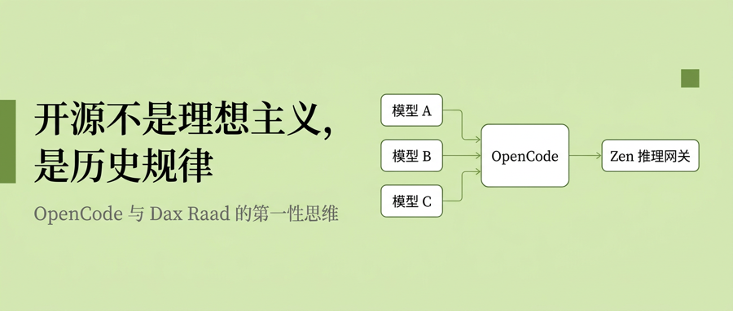

> TL;DR：OpenCode 的联合创始人 Dax Raad 在这场访谈里几乎把整个行业的乐观叙事反着说了一遍——他不相信"程序员要变成 agent 管理者"，不相信 benchmark，甚至坦承自己团队用自家产品也在把代码库搞烂。但正是这种"保守"构成了他最清醒的判断：编程工具这一层历史上终将开源，模型会像 Android 一样在混乱中占据多数市场，而稳定从来不是靠少数几家公司说了算、而是靠竞争与制衡逼出来的。这篇报告拆解他的技术选择（model-agnostic 架构 + Zen 推理网关）和更值得学习的那套第一性思维。

## 一、OpenCode 是什么：给"模型不忠者"准备的编程终端

先说清楚它的身份，因为很多人把它当成"又一个 Claude Code 克隆"。OpenCode 是一个开源、模型无关（model-agnostic）的 AI 编程 Agent，主界面跑在终端（TUI），同时提供桌面应用和 IDE 扩展，能对接 75 个以上的模型供应商。它背后的公司叫 Anomaly Innovations，社区习惯称"SST 团队"——创始人 Jay V 和 Frank Wang 是滑铁卢大学同学，Dax Raad（X 上 ID 是 thdxr）后来加入成为联合创始人。团队只有六个人，没有一个住在旧金山，Dax 本人在迈阿密。

它要解决的问题很具体。在 Claude Code 出现之前，Dax 描述过那种别扭的循环：人在编辑器里进入心流，遇到问题得切到浏览器、复制代码、等回复、再把结果粘回去，LLM 碰不到你的文件。Claude Code 把 agent 放进终端、让它直接操作文件系统，第一次让他"啊哈"了一下。但他很快发现两个缺口：Claude Code 死死绑在 Anthropic 一家模型上，而且在终端能力上刻意保守——"他们永远不会去push 终端能做到的极限"。OpenCode 就是从这两个缺口切进去的：把终端玩到极致，同时对任何模型都保持中立。

值得注意的是这家公司的"年龄"。它的法律实体已经存在 16 年，投资人一直没换过。Dax 反复讲的一句话是"活着（stay alive）"——16 年里不断挥棒、不断落空，每一棒比上一棒好一点但都没好到能成事，直到 Claude Code 让他们看懂了 AI 编程，才终于找到一个"我们独一无二适合去做"的机会。这个背景不是花絮，它直接解释了 Dax 为什么对行业的短期狂热天然免疫。

## 二、技术架构：model-agnostic 这件事怎么在工程上落地

OpenCode 的技术选择服务于一个核心命题——让"换模型"这件事的成本趋近于零。要理解它的架构，得先接受 Dax 的一个判断：模型竞争会长期高频震荡，OpenAI 出一个、Anthropic 必须回应、Anthropic 出一个、别家又跟上，"这种来回对我们是好事"。既然模型每周都在变，工具本身就必须是那个不变的锚。

### 客户端/服务器分离 + LSP 内建

OpenCode 采用客户端/服务器架构，把 AI 交互、文件操作、会话管理、状态处理拆到不同组件，同一个 server 可以接终端 TUI、桌面应用、Web 控制台和 IDE 集成。TUI 目前用 Go + Bubble Tea 写，团队在 GitHub issue 里公开讨论过要不要迁到 Ink（TypeScript 的 CLI 框架），核心逻辑和 SDK 则是 TypeScript。LSP（语言服务器协议）是直接内建进核心的，而不是当插件挂上去——这让 agent 能拿到和你 IDE 一样的符号信息、跳转、诊断。这种分层的价值在于：换模型时，"改变的只有我选的那个模型，其他一切都是静态的"，用户不需要每次尝鲜就重建整套工作流。

### 双模型工作流：不是站队，是分工

Dax 自己的用法透露了产品的设计假设。他日常不只用一个模型，通常在两个之间切换：一个处理大部分任务，另一个专门跑更长、更异步、可以丢到后台的大任务。"不同模型适合不同场景"——这句话是 OpenCode 存在的私人理由。他也承认大多数用户其实会选定一个工具就不动了，这完全没问题；但对那批想在新模型掉下来时立刻 `opencode` 起来试一把的人，切换成本低就是唯一卖点。

下面这张表能说明 OpenCode 和 Claude Code 的定位差异不是功能多少，而是根本假设不同：

维度| OpenCode| Claude Code  
---|---|---  
模型绑定| 模型无关，75+ 供应商| 绑定 Anthropic  
源码| 开源| 闭源  
开源的理由| 长尾问题（每个模型 × 每个 infra）需要社区| 紧耦合，社区帮不上核心  
终端能力| 刻意 push 极限| 刻意保持简单通用  
商业形态| 工具开源 + Zen 推理网关（保本）| 产品化订阅  
  
### Zen：被用户骂出来的推理网关

OpenCode 最有意思的一块不在编辑器里，而在推理层。Dax 原本以为推理不关他们的事——想用哪个模型，随便找个 infra provider 接上去就行。结果头几个月 GitHub issue 全是"你的工具是垃圾，根本不工作"，一查全是供应商的锅：模型被"脑叶切除"（lobotomized）了。同一个开源模型，部署得好和部署得烂，体验天差地别，尤其是 tool calling 这类对编程 agent 极其重要的能力，随便一个 provider 都可能搞砸；而终端用户根本分不清这是供应商问题，只会来骂 OpenCode。

于是他们被迫下场做了 Zen。它类似 OpenRouter（一个 API key 接一堆模型），但走的是反方向：OpenRouter 尽可能多接供应商覆盖所有场景，Zen 则只挑几个自己测过、有 SLA、出问题能直接找到人的高质量部署。评估方法也很"反数据"：Dax 说自己信奇闻轶事胜过信数据，会亲自拿一个模型当主力用一两天，凭手感做二元判断；再叠加 X 上 GosuCoder 那套贴近真实代码库的私有 eval（私有是为了防优化作弊）。选供应商时他排的优先级很明确：第一是模型没被搞坏，第二是速度（快模型"像上瘾"，慢下来就回不去了），第三才是 uptime——因为每个模型都配了多个供应商兜底，而且推理这行还太新，不能拿云计算几十年沉淀出的稳定性去要求它。

Zen 不是盈利项目，按保本做。它的巧妙之处在于池化：每多一个人用 Zen，总量就更大，团队拿着更大的量去和供应商谈折扣，省下来的成本直接流回给所有人。这是典型的开源式正循环——用规模换价格，而不是用价格差赚钱。

## 三、创始人的核心信念：为什么"每一层都必须开源"

如果说架构是"怎么做"，那 Dax 真正想清楚的是"为什么值得做"。他给开源的辩护完全不走道德路线，而是结构性的——这是这场访谈里最值得程序员反复咀嚼的部分。

### 开源是历史规律，不是理想主义

Dax 的第一性原理是：我们用来构建软件的工具，长期看不会保持闭源。他举了一串例子，年轻一点的开发者可能已经没经历过——编译器曾经要花钱买，数据库你得给 Oracle 付费，编辑器要买 license，他自己入行时用的是付费的 .NET 微软全家桶。这些东西今天默认都有开源选项，编辑器市场 70% 被开源占据。规律是这样跑的：一开始必须有商业力量才能把这些概念做出来，但用这些工具的客户后来变得比工具公司本身还大得多：Oracle 服务的 Amazon、Facebook 体量远超 Oracle，于是这些巨头看着账单会想"我们大到可以自己搞一个，何必每年给别人付几百万上千万"，开源的资金和动力就自然出现了。闭源公司最终"竞争不过一个免费选项存在的动力"。

推到 AI 编程 Agent 上，逻辑就顺了：如果未来软件开发离不开 coding agent，那这块地里就应该有一个开源的默认选项。Dax 说他们环顾四周，一堆 coding agent 公司都在做，却"没人占住这块明显有价值的地皮"，于是他们直接走进去，头几个月唯一的目标就是——让所有人认出"OpenCode 就是那个开源选项"。

### 开源在这里是结构必需，不是姿态

为什么这类产品必须开源，Dax 给的理由不是情怀而是算术。要做一个能对接任何模型、任何 infra 的 agent，需要海量的人力去填长尾，而这种人力小团队既养不起也雇不到。他举了个极具体的例子：某周有人发现，在 Azure 澳大利亚数据中心，必须额外设一个参数，否则 LLM 的 prompt caching 会失灵。这种问题他六个人的团队根本没法发现、复现、修复——只有真的在那个环境里用 OpenCode 的贡献者才能。"要做一个能钻进世界每个缝隙里的东西，它几乎必须开源。"Dax 说反过来 Claude Code 不开源也完全合理，因为它只跟 Anthropic 模型紧耦合，没有一个"需要大规模开源社区才能解决"的问题。

不过他也毫不避讳开源在 agent 时代的副作用，甚至自嘲"我们也是问题的一部分"。现在人人有 coding agent，OpenCode 仓库大概每几分钟就被开一个 PR，绝大多数是有人遇到 issue、prompt 出一个答案、连跑都没跑就提交、甚至是 LLM 替他提交的。团队一度怀疑是竞争对手派人来浪费他们时间，后来不得不从"比较宽松地合并"转向极度保守——因为服务着数百万人，任何小改动出问题都会波及一大片。他给想参与的人的第一条建议因此是反直觉的："别贡献"——别 prompt 完就发，真正能穿透噪音的贡献者，是那些盯着团队方向、自己找到有用切口的人，而这些人他们后来"基本都招进来了"。

### 与 Anthropic 的分歧：稳定来自混乱，不来自少数人

这场访谈里张力最强的是 Dax 对 Anthropic 的态度。他先把对方的立场讲得很公道：Anthropic 真心觉得 AI 影响巨大、有被滥用的风险，出于恐惧要严格控制谁能用、怎么用，任何稍微偏离他们预期的用法都会被收紧。他说这不是恶意，是一种"我们很害怕这个东西"的真诚。

但他的价值观和这个是根本不兼容的。Dax 认为这项技术必须尽可能多地掌握在尽可能多的人手里——包括彼此有冲突、互相对立的人和公司手里，因为"这才是唯一能保证长期稳定的方式"。他的论据带着明显的 Taleb 式底色（他自己也承认这些是《黑天鹅》《skin in the game》里的"陈词滥调"，但"里面的想法是真的"）：几乎所有稳定都来自那些互相锁死、彼此制衡的实体；权力和能力一旦高度集中就必然腐化，历史上每个独裁者最初可能都觉得"我能用好这份力量"。他甚至坦率地接受代价——"我愿意承认我在帮 LLM 落到想干坏事的人手里，他们大概也真会干坏事，这是我们要付的成本，但另一个选项更糟。"

他顺带给 AI 圈提了个公关建议，很有画面感：别再把 AI 比作核武器了。因为一个圈外普通人听到"一群旧金山的 nerd 说自己造了个像核弹的东西"，脑子里浮现的是"他们要来我家把我头砍了"，这只会招来负面情绪和政府审查。而且他认为这多半是夸大——有些人只是想体验一把"在搞曼哈顿计划"的感觉。但他补了一句反转：万一这真的成立、AI 真那么强，那就更不该攥在少数人手里。他甚至把核武器的类比反过来用——核武之后，很多国家都有核弹，不全是好人，却意外制造出一种前所未有的"谁都不舒服、但谁也不敢乱动"的紧张稳定。真正的稳定"看起来其实相当乱"，是持续的、令人略微不适的混乱，而不是那种被灾难性时刻打断的、虚假的平静。

## 四、最值得学习的一点：一个 AI 编程公司创始人，公开唱衰 AI 编程

我认为这场访谈最有价值、也最反常识的地方在于：一个靠 coding agent 吃饭的人，对 coding agent 的生产力提升给出了整个行业里最冷静的评价。这种诚实极其稀缺，Dax 自己也点破了原因——"很难从对这些工具感到兴奋的人嘴里得到这种诚实，因为我们都觉得自己变高效了，很难承认可能是我们夸大了。"

### 自家团队也在把代码库搞烂

他没有藏着掖着。作为一支天天用自家 agent 的团队，"如果退一步看，结果其实不太好"。他说的不是"LLM 写错了代码"这种表层问题，而是团队非常非常难避免把代码库彻底搞乱。他的解释触及软件工程的本质：写功能时永远有"又快又脏、事后要还债"的做法和"绝对正确但太慢"的做法，以及中间一堆选项，好的工程师会结合业务和目标做权衡。而 coding agent"恰恰放大了我们最坏的倾向"——那个脏方案不再让你难受，因为不是你亲手写进去的，有种"它丑，但我不用盯着它看，是我让 AI 干的、干完了"的心理效应。他们甚至发现一个原本兴奋的能力在反噬：设计师现在能自己修前端了，产品越来越精致，但设计师根本判断不出自己是不是在引入让系统更脆的方案，于是一堆工程团队不知情的代码悄悄溜进来，日后才被发现。

### 看产出，别看过程

Dax 给出的判断标准非常锋利："我们太关注'我们怎么构建''我怎么用 coding agent''我同时开着七个 Claude Code'——这些全是本末倒置。真正重要的是：有没有一个小团队在碾压大团队？有没有一个竞争对手在把我们彻底干掉？"他说如果这种事发生了，那才值得去研究人家怎么做的。但到目前为止他没见过——没有哪个团队因为把 agent 用得更好就在碾压 OpenCode。"在这种事开始发生之前，这些工具很可能并没有大家吹的那种能力。"他补了一刀：人们不敢承认，是因为都在说自己多高效，谁也不想显得蠢、不敢问"我真的比三四个工程师加起来还强吗"。

### 比较优势和"我们不会变成经理"

对"程序员要变成 agent 管理者"这个流行说法，Dax 直接否掉了，理由来自他真当过一阵中层经理：管理是关于激励人、让人兴奋着每天去撞墙，"你激励你的 agent 时根本不需要这些，prompting 远没有管真人那么难"。他引用 Dario 的说法（就算 AI 写 95% 的代码，那 5% 的人类部分如果你比谁都强，你就有巨大的比较优势），但他强调那 5% 完全可以就是编程本身：哪怕 AI 写 90%，一个真正厉害的程序员依然碾压你。他拿 Mitchell Hashimoto（HashiCorp、Ghostty 作者）举例：对方本来就那么强、那么有经验，AI 只会帮他把和普通人的差距拉得更大，"不存在我只要比他更狠地用 AI 就能超过他这回事——我得去补我的基本功"。

他把使用体验描述成一种上瘾：每天不知不觉懒一点，一年后回头你已经是另一个人；现在手动做事反而觉得慢、觉得难受，可有些事还是得手动。"这感觉像在跟一种瘾做斗争，它给我很多好处，也在某些方面伤害我，我还在摸索自己和它的关系。"而他反复回到的那句话，是这套保守立场的根："你是想现在就对，还是想到最后是对的？"——想到最后对，你就得不断质疑自己的每一个假设和偏见，而这恰恰把他推到了对 LLM 更批判的位置，因为他"没看到被宣称的那些东西真的发生到被宣称的程度"。

## 五、Founder 方法论：那些"陈词滥调却极难做到"的建议

Dax 反复强调他讲的都是老掉牙的建议——"最好的建议从来不是隐藏的，是被说过一百万次、非常简单、却极难真正照着活的东西"。但正因为经过 16 年验证，它们比新鲜观点更值得记。

关于活着与"永远公司"，他的定义是：无论未来对什么感兴趣，都在同一家公司里做。OpenCode 是他们在开发者工具领域的最后一个东西——"如果你只在 dev tools 圈认识我，那以后就见不到我了"，下一个东西要面向全世界而不只是程序员。也正因如此，团队集体忽略了收购邀约：有 CEO 打电话来想收购，Dax 发到团队 Discord，大家没理他、继续聊手头的活。他说刚当创始人时会觉得"被收购是终极结局"，但当你找了这么多年终于找到那个"你一直在找的东西"时，卖掉它"像是最悲伤的事，感觉过去十年挥棒落空全白费了"。

关于做什么，他的原则是给自己造产品，别替别人造："只有极有天赋的人才能给别人造产品，给自己造容易得多，因为你就是用户。"补充手段是和付费的大客户 CTO 聊——聊到最后"这些不再像预测，而像对着你尖叫的大窟窿"；他说他们正在做的新阶段将来若被夸"预见了趋势"，真相不过是三个 CTO 说了大致相同的话，而他们在听。

关于营销和 build in public，Dax 的打法是"理解当前的 meta，然后反着来"。当所有小发布都在砸几万美元做过度精致的视频时，他掏出手机在自家后院边走边讲，30 分钟、0 美元，效果很好——重点不是"低成本"，而是"捕捉那个没人说出口的情绪并针对它做点什么"。他认为自己公司是 build in public 做对了的少见样本：不是天天甩产品链接、performative 地表演，而是每天认真花至少八小时动脑，然后养成习惯在一天结束时分享你学到的、想错又想通的东西，一周几次、坚持数年。他还给了个反效率主义的忠告：别把每一分钟都花得尽可能高效，"换句话说就是每一分钟都尽可能无聊"；要 meander、要有怪异的一天，创造性工作（当创始人就是创造性工作）容不下僵硬的生活方式。

## 六、总结：把"保守"做成一次非对称下注

Dax 的整套打法可以浓缩成一句话：在一个人人都是加速主义、futurist 的行业里，OpenCode 选择做那家保守、讲道理的公司。他把这称为公司的非对称定位——"我们可能错了，但万一我们对了，我们就会显得是那个把一切都判断正确的、非常理性的公司"。非对称下注的意思是：你大概率错，但一旦对，上升空间是错的情况的一百倍。

这和开源的逻辑其实是同一套思维：不赌单一未来、不做六层假设叠起来的预测（"大多数预测错得离谱，因为要六个假设在对的时间全对"），而是去占一块长期有用的地皮，然后每天在那块地上给人提供一点真实价值——"今天我能帮到谁？今天能 ship 什么有用的东西？"六个月后在哪他不知道，六个月前他也没想到自己会做推理、会研究 GPU。

对读者来说，OpenCode 值得学的技术点是清楚的：model-agnostic 的分层架构让工具成为不变的锚，Zen 用池化把开源正循环带进推理层。但更值得学的，是 Dax 那种"想到最后对"的思维方式——对自己团队的产出保持残酷诚实，把行业共识当成需要质疑的假设，以及相信真正的稳定长得乱七八糟。在一个满屏都是 prediction 的时间线里，这可能是最稀缺的东西。

## 参考资料

•本文主体基于用户提供的 Dax Raad 视频访谈完整 transcript（迈阿密 vs 旧金山、开源哲学、AI 编程保守立场、founder 方法论等）•OpenCode 官方文档：https://opencode.ai/docs/•Baseten 对话 Dax Raad（Zen、推理评估、benchmark 观点）：https://www.baseten.co/blog/building-ai-agents-open-code-and-open-source-a-conversation-with-dax/•The Pragmatic Engineer：Building OpenCode with Dax Raad：https://newsletter.pragmaticengineer.com/p/opencode•OpenCode SDK / 客户端-服务器架构：https://opencode.ai/docs/sdk/•Anomaly Innovations（SST 团队）背景：https://www.blueleap.pro/courses/agentic-engineer/02-opencode/16-team-behind-opencode