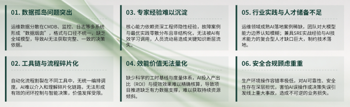
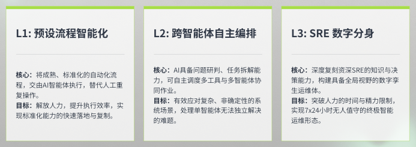
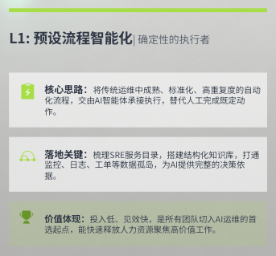
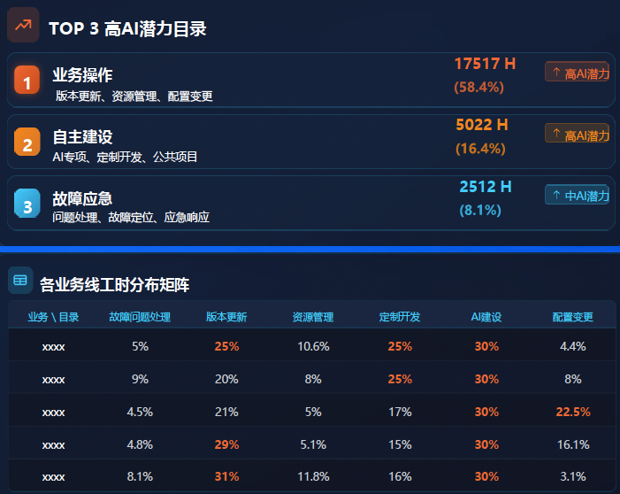
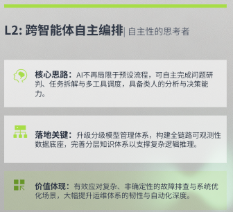
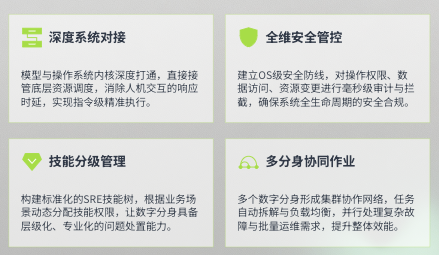
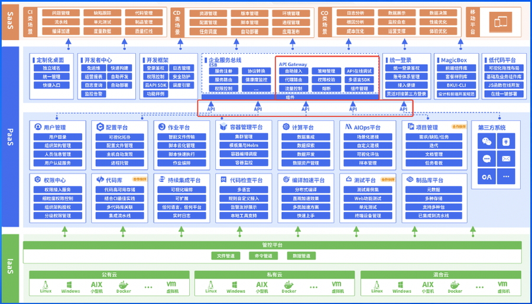
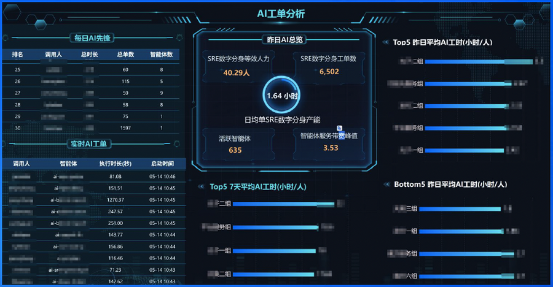

  

面对行业共性的六大难题，腾讯互娱事业群（IEG）技术运营部并没有盲目追逐技术热点，而是立足自身业务痛点，以『**先稳后进、循序渐进、价值优先** 』为核心思路，构建起『痛点梳理—分阶演进—平台底座—度量体系—场景落地』的完整工作脉络。

同时，他们凭借完善的平台体系、量化的价值成果，稳步推进 `AI Agent` 在 `SRE` 领域的规模化应用，已实现显式提质和提效的阶段性成果。

## 1SRE 领域落地 AI 的六大核心瓶颈

在智能化改造启动初期，腾讯互娱全面复盘运维全流程，梳理出 `SRE` 领域落地 `AI` 的六大核心瓶颈，这也是众多企业推进运维智能化时普遍遭遇的难题。

  1. **数据孤岛问题突出** 。运维数据分散在 `CMDB`、监控、日志、工单等多套独立系统中，数据格式、统计口径不统一，缺乏全域统一数据模型；
  2. **工具链与流程碎片化** 。自动化流程无法统一编排，`AI` 难以介入碎片化工作链路；
  3. **专家经验难以沉淀** 。`SRE` 核心能力依赖资深工程师经验传承，历史故障案例、最优实践零散分布，非结构化知识库无法被 `AI` 调用，人员流动易造成知识断层；
  4. **效能价值无法量化** 。缺少科学的工时基线与度量体系，`AI` 投入产出比、提效效果难以核算，项目推进缺少数据支撑；
  5. **行业实践与人才储备不足** 。运维领域成熟 `AI` 落地案例稀缺，团队对`大模型`能力边界认知模糊，同时 `SRE`+`AI` 复合型人才缺口较大；
  6. **安全合规顾虑重重** 。生产环境操作容错率极低，若 `AI` 误操作易引发线上事故。

针对以上痛点，技术运营部确立了『**不急于求成、不堆砌技术、先解决实际问题** 』的转型原则，拒绝盲目上线高阶 `AI` 能力，规划分阶段演进路线，逐一破解落地障碍。

## 2在三个层次上落地，构建分层落地体系

结合运维工作特性与 `AI` 技术成熟度，腾讯互娱打造 三阶段递进式落地路径：

  * L1-预设流程智能化
  * L2-跨`智能体`自主编排
  * L3-`SRE` 数字分身

不同阶段定位清晰、目标明确，适配不同技术能力与业务需求，该演进模式被验证为中大型企业 `SRE` 智能化转型的稳妥选择。

### L1-将预设流程智能化

这是目前落地范围最广、价值最直观的核心阶段。该阶段聚焦『确定性流程』，核心思路是将传统运维中成熟、标准化、高重复度的自动化流程，交由 `AI``智能体`承接执行。

团队优先完成四大基础工作：

  1. 建立 `SRE` 三级服务目录体系，梳理了 12 个一级目录、49 个二级目录、184 个三级目录的全量 `SRE` 服务目录，划定工作边界；
  2. 梳理专家经验，搭建结构化场景知识库；
  3. 开展全域数据治理，打通`数据孤岛`；
  4. 配套搭建时间管理、价值核算模块。

同时推进运维一体化、研运一体化改造，搭建`智能体`运行管线、全场景交互入口与标准协议体系。该阶段上手门槛低、见效快，适合所有企业作为 `AI`+`SRE` 转型的起点，目前技术运营部绝大多数智能化应用均落地于此阶段。

### L2 - 跨智能体自主编排

主打『自主性』，面向复杂、非确定性运维场景。

L2 主要聚焦于自主完成问题研判、任务拆解、多工具调度、交叉验证等工作。技术层面，团队升级分级模型管理体系、全链路观测体系与事件分析系统，完善分层知识体系，并搭建多任务协同工具。出于生产安全考量，该阶段能力优先在故障诊断、离线分析等低风险场景试点，外网核心操作的自主编排稳步验证、谨慎推进。

### L3- SRE 数字分身

属于中长期战略布局，也是运维智能化的终极形态。

目标是依托技术复刻资深 `SRE` 工程师的工作能力与处置思路，打造可 7×24 小时在岗的数字分身，分担常规工单、夜间值守、定时巡检等工作，突破人力时间与精力限制。目前该方向仍处于技术探索与小范围试点阶段。

整体而言，三层次遵循『落地提效→能力进阶→形态升级』的逻辑，由易到难、层层递进，企业可根据自身团队技术储备、业务规模灵活选择切入阶段，分步推进转型。

## 3双底座支撑：一体化平台+量化度量体系，保障规模化运行

`AI` 能力想要长效、规模化运转，离不开技术平台与管理体系两大底座。腾讯互娱以『平台为根基、度量为牵引』，打造双支撑体系，从技术、管理两大维度保障 `AI` 落地不走偏、可持续。

在**一体化智能运维平台** 建设上，团队以『运维一体化、研运一体化』为核心目标，对蓝鲸 `CMDB`、标准运维、监控平台、`DevOps` 流水线、日志平台等全栈系统进行升级整合。**所有平台能力通过` API` 网关统一封装，并适配 `MCP`、`CLI` 标准协议，让`智能体`可以安全、低成本调用各类工具，彻底解决工具割裂、集成困难的问题。**

平台同时搭建企业微信、蓝鲸工作台、`API` 等多渠道统一交互入口，降低全员使用门槛。

在安全设计上，平台内置权限校验、操作审计、链路追踪、异常拦截等功能，每一次 `AI` 操作全程留痕，筑牢生产安全防线。此外，平台制定标准化`智能体`搭建流程，常规场景仅需简单配置即可上线，大幅提升功能迭代效率。

在**全维度质效度量体系** 方面，腾讯互娱明确六大核心价值： 1. 守住线上稳定性 2. 对齐 `SRE` 核心指标 3. 核算投入产出 4. 驱动技术迭代 5. 强化合规风控 6. 支撑规模化推广。

团队制定多层级工时折算与上限规则，统一了 `AI` 工时计算标准，所有 `AI` 工单对内公开，兼顾学习与监督作用；搭建可视化数据大屏，实时展示提效工时、等效人力、工单总量、团队排名等核心数据。

截至目前，腾讯技术运营部平台活跃`智能体`达 635 个，单日最高工单量突破 6502 单，`AI` 工作量整体等效 40.29 名专职运维人员。

结合三级服务目录工时统计，团队精准筛选出**业务操作、自主建设、故障应急** 三大高 `AI` 潜力场景，将资源重点倾斜至高耗时、高收益领域，实现资源最优配置。

这套量化度量体系，解决了行业『价值难衡量』的痛点，也为企业评估 `AI` 落地效果、调整建设方向提供了可直接借鉴的方法。

## 4多场景落地

依托成熟的平台与体系，围绕**代码运维** 、**故障排查** 、**版本发布** 、**配置管理** 、**数据库运维** 、**`CDN` 管控**、**混合云管理** 等 `SRE` 核心工作，覆盖质量提升、效率优化、成本管控三大维度，常态化运行，成果可直观量化，为同行业提供丰富的场景参考。

## 5如何借鉴腾讯方法论

整套实践，可总结为五大核心经验，供各类企业参考落地：

  * **痛点先行，拒绝概念化落地** 启动前全面梳理业务与运维痛点，而不是盲目追求高阶技术，优先解决数据割裂、流程繁琐、效率低下等实际问题，让技术服务于业务，而非单纯追逐热点。
  * **分阶演进，匹配自身能力** 采用『三步走』落地路线，从标准化流程切入，逐步向自主编排、数字分身进阶，中小企业可优先聚焦 L1 阶段，大型企业可分步推进全阶段建设，循序渐进降低转型风险。
  * **筑牢底座，平台与体系并行** 先完成工具整合、数据治理、安全管控等平台基建，同步搭建量化度量体系，做到『能力可落地、效果可衡量、风险可管控』，为规模化推广保驾护航。
  * **场景聚焦，优先攻坚高价值领域** 通过服务目录、工时统计，筛选高耗时、高风险、高收益的工作场景，集中资源打造标杆案例，以可见价值推动全员接纳 `AI` 工具，形成良性循环。
  * **安全底线不放松** 运维直面生产环境，全流程嵌入权限管控、操作审计、回滚机制，在保证效率的同时，严守生产安全与数据合规红线。

未来，随着 `AI` 技术持续迭代，相信会有更多企业参考这套范式，实现 `SRE` 质效的全面升级，共同推动软件运维行业向智能化、高效化方向迈进。