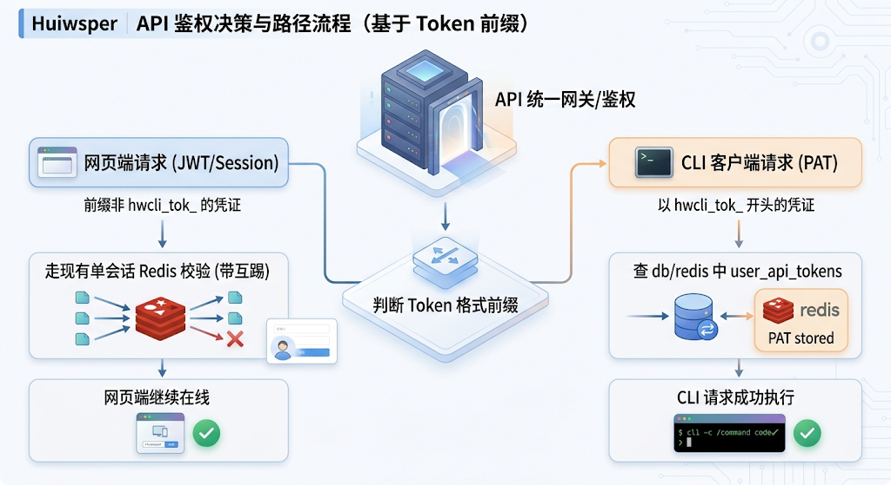
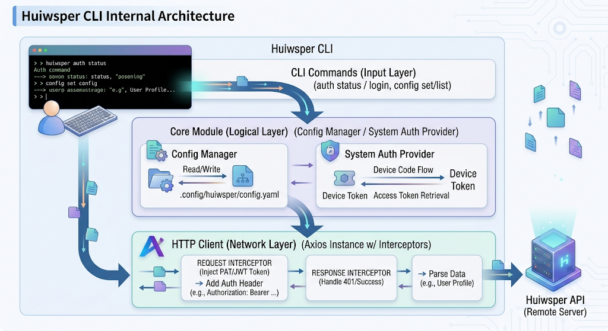
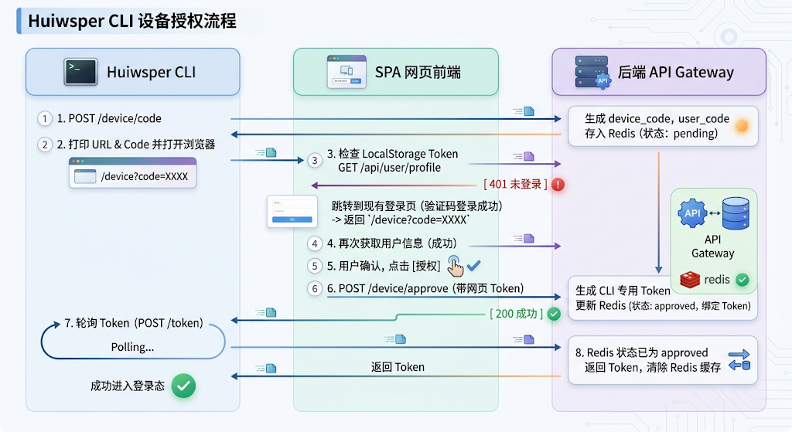

你有没有注意到一个趋势，这几个月飞书、钉钉、瑞幸这些大厂，都推出了自己的 CLI。

为什么？因为 Agent 时代真的来了。

未来的很多工作，可能不再是你在网页上点来点去，而是你对着 Agent 说一句话，Agent 就自动去你的各种业务系统里帮你把事办了。

而 Agent 跟业务系统打通，最标准、最成熟的方式是什么？不是直接去爬网页，也不是去调 UI 自动化，而是 CLI。CLI 是结构化的、可编程的、脚本化的，Agent 用起来最顺手。

所以，现在有个很有意思的说法，叫「CLI 是 Agent 时代的流量入口」。谁先把自己的业务系统 CLI 化，谁就在未来的 Agent 生态里占了先机。

但是，业务系统 CLI 化，第一个要解决的问题就是：授权怎么搞？会话怎么管理？

今天我们就来好好聊聊这个话题，从宏观背景到具体技术实现，一次性说清楚。

* * *

## 一、为什么业务系统 CLI 化是必然趋势

先别急着看代码，我们先聊聊这件事的背景。

### 1.1 Agent 与业务系统的连接方式

Agent 想跟你的业务系统交互，无外乎几种方式：

  1. **RPA/UI 自动化** ：模拟人类点击网页。这种方式脆弱得很，页面一改就挂，而且速度慢，不可控。
  2. **直接调用后端 API** ：这需要 Agent 知道你的 API 文档、鉴权方式，还要处理各种错误，门槛太高。
  3. **CLI 工具** ：封装好的命令行工具，输入简单，输出结构化，Agent 用起来最方便。而且 CLI 不仅可以给 Agent 用，人也可以用，一举两得。

显然，CLI 是最优解。

### 1.2 主流玩家的动作

我们看看现在的玩家都在做什么：

  * **飞书** ：一直在推飞书 CLI，支持通过命令行管理飞书文档、日历、群组等。
  * **钉钉** ：也有自己的 CLI 工具，支持开发者和企业 IT 管理员通过命令行操作钉钉开放平台能力。
  * **瑞幸** ：你没看错，瑞幸也在做 CLI，客户可以通过 CLI 查下单、支付。

这些大厂嗅觉很灵敏，他们知道，先把 CLI 铺起来，未来的 Agent 生态里，他们就是基础设施。

### 1.3 业务系统 CLI 化的核心挑战

但是，把一个传统的、只有网页端的业务系统 CLI 化，不是写个命令行工具去调 API 那么简单。

你会遇到这些核心问题：

  1. **授权问题** ：CLI 怎么登录？密码不落地怎么做？
  2. **会话隔离问题** ：CLI 登录了，会不会把网页端踢下线？
  3. **Token 管理问题** ：CLI 的 Token 怎么存？怎么刷新？怎么吊销？
  4. **安全性问题** ：Token 泄露了怎么办？

这就是我们今天要重点解决的问题。

* * *

## 二、整体架构设计：隔离是关键

先上一张完整的架构图，让你有个全局概念。

核心设计理念就两个字：**隔离** 。

为什么要隔离？因为网页端和 CLI 端的使用场景完全不同：

  * **网页端** ：人在操作，会话可以短一点，要有单点互踢保证安全。
  * **CLI 端** ：脚本在跑，Token 需要长期有效，而且不能影响网页端的使用。

所以，我们给 CLI 单独搞一套 Token 体系，叫个人访问令牌（PAT），和网页端的 Session 完全分开，互不干扰。

* * *

## 三、后端改造方案

好，现在我们来看具体的技术实现，先从后端开始。

### 3.1 数据库设计

首先，你得在数据库里新增一张表，专门存 CLI 用的个人访问令牌。
    
    
    CREATETABLE IF NOTEXISTS `user_api_tokens` (  
      `id` BIGINTNOTNULL AUTO_INCREMENT COMMENT '主键ID',  
      `user_id` VARCHAR(64) NOTNULL COMMENT '用户ID',  
      `token_name` VARCHAR(100) DEFAULTNULL COMMENT 'Token名称/描述',  
      `token_hash` VARCHAR(64) NOTNULL COMMENT 'SHA-256 Token哈希值',  
      `expires_at` DATETIME NOTNULL COMMENT '过期时间',  
      `created_at` DATETIME NOTNULLDEFAULTCURRENT_TIMESTAMP COMMENT '创建时间',  
      `updated_at` DATETIME NOTNULLDEFAULTCURRENT_TIMESTAMPONUPDATECURRENT_TIMESTAMP COMMENT '更新时间',  
    PRIMARY KEY (`id`),  
    UNIQUE KEY `uk_token_hash` (`token_hash`),  
      KEY `idx_user_id` (`user_id`)  
    ) ENGINE=InnoDB DEFAULT CHARSET=utf8mb4 COMMENT='用户API访问令牌表';  
    

注意几个关键点：

  * 存的是 `token_hash`，不是原始 Token，用 SHA-256 哈希，安全。
  * 有 `expires_at`，Token 不是永久有效的，降低泄露风险。
  * 有 `token_name`，方便用户管理自己的多个 Token（比如家里电脑一个，公司电脑一个，CI/CD 一个）。

### 3.2 Redis 临时状态设计

为了支持 OAuth 2.0 Device Flow（设备授权流程），我们需要用 Redis 存一些临时状态。

Key 格式| 类型| 说明| TTL  
---|---|---|---  
`device_flow:device_code:<device_code>`| Hash| 设备状态（pending/approved）及临时 Token| 300s  
`device_flow:user_code:<user_code>`| String| user\_code 到 device\_code 的反向映射| 300s  
  
### 3.3 三个核心接口

接下来是三个核心接口，我们一个一个看。

#### 接口 1：申请设备码

  * **路径** ：`POST /api/auth/device/code`
  * **权限** ：匿名
  * **响应示例** ：

    
    
    {  
    "device_code":"54321",  
    "user_code":"ABCD-EF",  
    "verification_uri":"https://your-system.com/device",  
    "verification_uri_complete":"https://your-system.com/device?code=ABCD-EF",  
    "expires_in":300,  
    "interval":5  
    }  
    

#### 接口 2：网页端确认授权

  * **路径** ：`POST /api/auth/device/approve`
  * **权限** ：需要网页端登录
  * **核心逻辑** ：

    
    
    // 1. 获取当前登录用户 ID  
    const userId = getCurrentUserId(req);  
      
    // 2. 通过 userCode 查找 deviceCode  
    const deviceCode = await redis.get(`device_flow:user_code:${userCode}`);  
    if (!deviceCode) {  
    return res.status(400).json({ message: "无效的验证码" });  
    }  
      
    // 3. 生成 CLI Token（带特定前缀）  
    const rawToken = "hwcli_tok_" + crypto.randomBytes(24).toString('hex');  
    const tokenHash = crypto.createHash('sha256').update(rawToken).digest('hex');  
      
    // 4. 持久化存储到数据库  
    await db.insert('user_api_tokens', {  
    user_id: userId,  
    token_name: "Huiwsper CLI Device",  
    token_hash: tokenHash,  
    expires_at: newDate(Date.now() + 30 * 24 * 60 * 60 * 1000) // 30天  
    });  
      
    // 5. 更新 Redis 临时状态，供 CLI 轮询获取  
    await redis.set(`device_flow:device_code:${deviceCode}`, JSON.stringify({  
    status: 'approved',  
    cliToken: rawToken  
    }), 'EX', 300);  
      
    return res.json({ success: true });  
    

#### 接口 3：轮询获取 Token

  * **路径** ：`POST /api/auth/device/token`
  * **权限** ：匿名
  * **响应示例（待授权）** ：

    
    
    {  
    "error":"authorization_pending"  
    }  
    

  * **响应示例（已授权）** ：

    
    
    {  
    "accessToken":"hwcli_tok_53a9f0e1d82c4f6b..."  
    }  
    

### 3.4 网关鉴权拦截器升级

这是最关键的一步，改造现有网关的鉴权中间件，支持双轨制校验。
    
    
    asyncfunctionauthMiddleware(req, res, next) {  
    const authHeader = req.headers['authorization'];  
    if (!authHeader || !authHeader.startsWith('Bearer ')) {  
    return res.status(401).json({ message: "未授权的访问" });  
      }  
      
    const token = authHeader.substring(7);  
      
    // 第一步：判断是否为 CLI 专属 PAT Token  
    if (token.startsWith('hwcli_tok_')) {  
    const tokenHash = crypto.createHash('sha256').update(token).digest('hex');  
      
    // 查数据库验证  
    const apiTokenRecord = await db.query(  
    "SELECT * FROM user_api_tokens WHERE token_hash = ? AND expires_at > NOW()",  
          [tokenHash]  
        );  
      
    if (!apiTokenRecord) {  
    return res.status(401).json({ message: "无效或已过期的 CLI 凭证" });  
        }  
      
    // 组装用户信息  
    const user = await db.query("SELECT * FROM users WHERE id = ?", [apiTokenRecord.user_id]);  
        req.user = user;  
    returnnext();  
      }  
      
    // 第二步：非 CLI Token，走原有网页端鉴权逻辑  
    returnexistingWebAuthLogic(req, res, next);  
    }  
    

这样，网页端和 CLI 端就完全解耦了，互不干扰。

* * *

## 四、前端网页端改造

前端的改动很小，加一个路由页面就行。

### 4.1 新增授权页面 `/device`

页面逻辑：

  1. 从 URL 参数读取 `code` 并自动填充
  2. 检查登录状态
  3. 未登录则保存当前 URL 到 `sessionStorage` 并跳转登录页
  4. 已登录则展示授权页面和确认按钮
  5. 授权成功后提示用户返回终端

### 4.2 登录页改造

登录成功后，检查 `sessionStorage` 中的 `redirect_after_login`，如有则跳转回授权页面，形成闭环。

* * *

## 五、CLI 端设计

最后，我们来看看 CLI 端怎么设计。

### 5.1 CLI 架构

三层架构，清晰解耦。

### 5.2 本地配置存储

使用 `conf` 库存储配置，路径通常在 `~/.config/configstore/huiwsper.json`。

配置结构：
    
    
    exportinterfaceSystemConfig {  
    baseUrl: string;  
      auth?: SystemAuth;  
      cachedToken?: string;  
      tokenExpiresAt?: string;  
      refreshToken?: string;  
    }  
      
    exporttypeSystemAuth = SystemAuthPassword | SystemAuthApiKey | SystemAuthDevice;  
    

### 5.3 三种认证模式

为了应对不同场景，我们支持三种认证模式：

模式| 适用场景| 说明  
---|---|---  
API Key/PAT| CI/CD、机器调用| 用户在后台生成 Token 并配置，无自动刷新  
Password| 传统系统| 密码本地 base64 混淆存储，Token 过期自动重登  
Device Flow| 企业 SSO（推荐）| 浏览器授权，密码不落地，支持 Refresh Token 静默刷新  
  
### 5.4 401 失效自愈机制

这是 CLI 体验好坏的关键。

#### 主动检查（快过期自愈）

每次请求前检查 Token 有效期，如 5 分钟内即将过期且有 Refresh Token，则主动刷新。

#### 被动重试（401 自愈）

响应拦截器捕获 401 错误后，自动尝试刷新 Token 并重试原请求，仅在第二次失败时才报错。

整个过程用户完全无感。

### 5.5 核心命令示例
    
    
    # 配置系统信息  
    huiwsper config set \  
      --system prod-sso \  
      --url https://sso.my-company.com \  
      --auth-type device \  
      --device-code-url /oauth/device/code \  
      --token-url /oauth/token \  
      --client-id huiwsper-cli-app  
      
    # 登录  
    huiwsper auth login --system prod-sso  
    

* * *

## 六、总结与展望

好了，整套方案讲完了。我们从宏观的 Agent 时代背景，讲到具体的数据库、接口、网关、前端、CLI 的设计，应该比较完整了。

我们浓缩下：

这套方案有几个特点：

  1. **安全性** ：Token 哈希存储，支持过期，密码不落地
  2. **隔离性** ：CLI 和网页端完全独立，互不踢下线
  3. **易用性** ：支持 Device Flow 浏览器授权，体验流畅
  4. **扩展性** ：未来可以加 Token 权限控制、管理页面、审计日志等

回到最开始的话题，为什么大厂都在做 CLI？因为他们看到了未来。

Agent 时代，CLI 就是业务系统的「API 门面」，就是流量入口。今天你把 CLI 做好了，明天 Agent 进来的时候，你就是生态里的玩家。

所以，别等了，赶紧把你的业务系统 CLI 化吧。授权这套方案，你直接拿去用就行