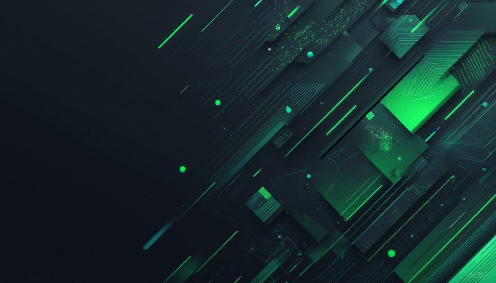
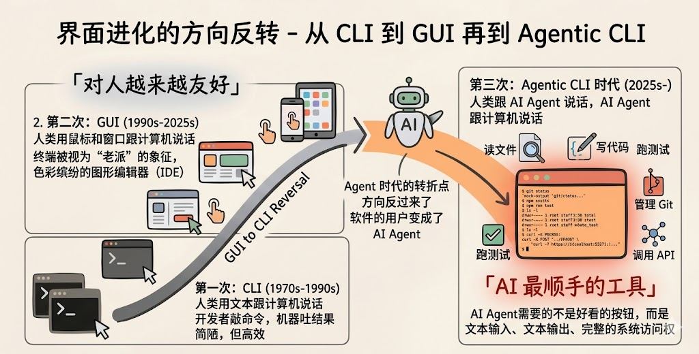
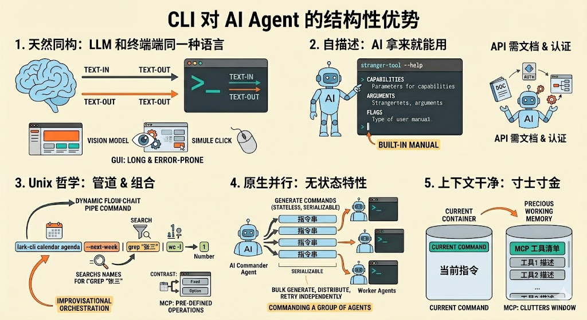
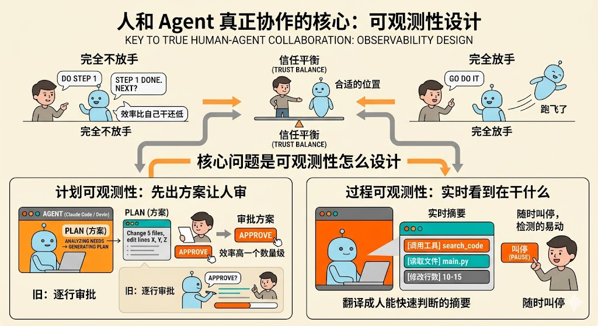
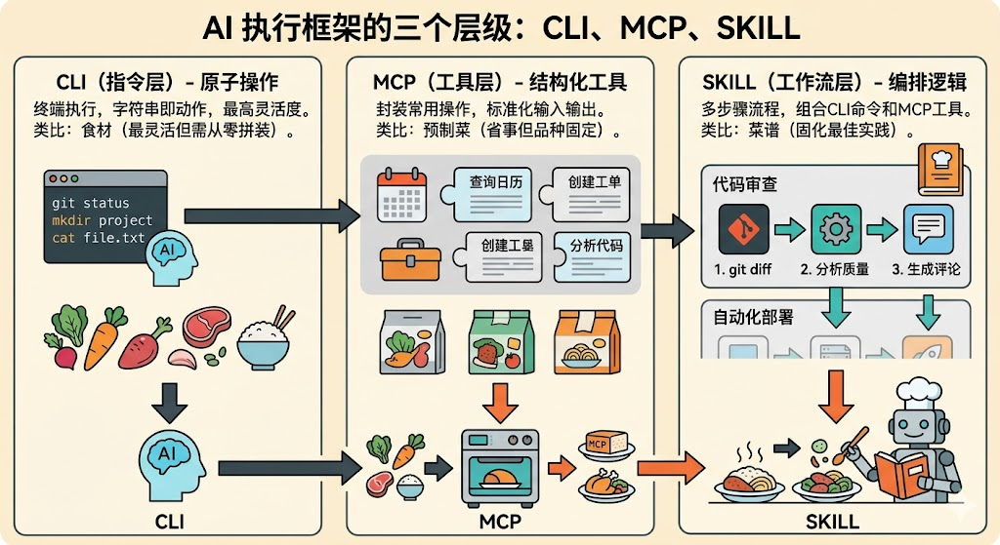

  

这是2026年的第 30 篇文章

（ 本文阅读时间：约15分钟 ）

  

前言

过去一段时间，AI Agent 相关工具出现了一个有意思的变化：能力在不断演进，交互入口却越来越多地回到最朴素的命令行。看起来像是一次「复古回归」，背后其实藏着一个更本质的判断：当软件的操作者从人扩展到 Agent，CLI 不再只是给工程师用的老工具，它可能成为 Agent 调用数字世界的高效入口。

  

不禁想到，今年笔者所在的部门对平台智能化升级提了「AI 友好」这一目标。那么，怎样的平台才算 AI 友好？难道 CLI 就等于 AI 友好？带着这些问题，这段时间做了一些思考，记录下来做下分享。

01

CLI 的前世今生

过去四十年，计算机的界面进化方向一直是从 CLI 到 GUI，从文字到图标，从键盘到触屏，对人越来越友好。Agent 时代，方向反过来了，软件的用户变成了 AI Agent。

  * 第一次：CLI（1970s-1990s）人类用文本跟计算机说话。开发者敲命令，机器吐结果。界面是一行一行的字符流。简陋，但高效。
  * 第二次：GUI（1990s-2025s）人类用鼠标和窗口跟计算机说话。文件变成了图标，命令变成了按钮。终端被视为"老派"的象征，IDE 成为主流。开发者的工作台从黑底白字的终端，搬进了色彩缤纷的图形编辑器。
  * 第三次：Agentic CLI 时代（2025s-） 人类跟 AI Agent 说话，AI Agent 跟计算机说话。而 AI Agent 需要读文件、写代码、跑测试、管理 Git、调用 API——它需要的不是好看的按钮和语法高亮，而是文本输入、文本输出、完整的系统访问权。

02

Agent + CLI 为什么「绝配」

CLI 的胜出不是审美偏好，是结构性优势。

  * 天然同构：LLM 和终端说同一种语言。LLM 是 text-in、text-out 的机器。终端是 text-in、text-out 的界面。它们天然同构。让 AI 操作 GUI 就绕远了：得截图、用视觉模型识别按钮在哪、再模拟鼠标去点，一行命令能搞定的事拆成四步，每步都可能出错。对 AI 来说，CLI 就是最短路径。
  * 自描述：AI 拿来就能用。这是 CLI 相对于 API 最被低估的优势。AI 碰到一个陌生的 CLI，敲一下\--help就知道有哪些能力、怎么用、参数怎么填。CLI 自带说明书。 API 不行——AI 得先拿到文档、弄清端点、搞懂认证方式，才能动手。这种"自描述性"让 CLI 成为对 AI 最友好的工具接口：不需要预先注入文档，工具本身就是文档。
  * Unix 哲学。管道&组合——这些 Unix 原语恰好是 AI Agent 最需要的执行模型。antwork calendar agenda --next-week | grep "张三" | wc -l一行命令查出下周和张三有几个会。MCP 更适合预定义的标准操作，而 CLI 可以靠管道组合出没预设过的操作——这种"即兴编排"能力是 CLI 独有的优势。
  * 并行是原生的。CLI 命令本质上是无状态、可序列化的：一个字符串就是一个完整的操作指令。这意味着 Agent 可以批量生成命令、并行分发到多个进程、独立重试，不需要维护 session 状态。当你的工作从"一个人写代码"变成"指挥一群 Agent 干活"，CLI 的无状态特性让并行调度变得水到渠成。
  * 上下文干净。这是 CLI 相对于 MCP 的一个差异化优势。MCP 把工具清单预先注册给 AI，适合高频、需要结构化返回的操作（查数据库、调内部 API）。但清单本身常驻上下文窗口，就算 AI 暂时不用某个工具，它的描述也占着空间，既费token，也容易失去注意力。

03

CLI 是不是终局

我的答案显然不是，未来的产品会分为三层：

  * 完全面向人：好看、好用、交互流畅，服务于人的认知和操作习惯，GUI依然是最优选择。
  * 完全面向 Agent：结构化、自描述、可组合，服务于 AI 的调用和执行效率。CLI是最优选择。
  * 面向人机共生协作（Human-Agent Interaction）：面向人的界面和面向 Agent 的界面，本质上都是单向设计：给人用或者给机器用。但协作界面是双向的：它既要让人高效地表达意图和施加控制，还要愉悦用户，色彩缤纷\(Iterm vs Bash\)，又要让 Agent 高效地展示状态和接收反馈。谁先把这一层做好，谁就定义了 AI 时代的协作范式。

人和 Agent 之间怎么真正协作？这不是一个技术问题，是信任问题。人需要在“完全不放手”和“完全放手”之间找到合适的位置。 完全不放手，Agent 每一步都要请示，效率比自己干还低；完全放手，Agent 跑飞了可能都不知道。 核心问题是可观测性怎么设计。

  * 计划可观测性，Agent 不是上来就动手，它会先出方案让人审。某 AI 编程助手的 plan 模式就是典型：Agent 分析完需求后，先列出要改哪些文件、每个文件怎么改，人看完同意了再一次性写入。这把协作从“逐行审批”变成了“审批方案”，效率高一个数量级。类似的，Devin 会先生成执行计划，人可以在计划阶段就纠偏，而不是等代码写完了再返工。
  * 过程可观测性， Agent 在干什么，人需要实时看到。这不是说把所有日志甩给你，意思是把 Agent 的行为翻译成人能快速判断的摘要。比如某 AI 编程助手执行每一步时就会展示正在调用什么工具、读了哪个文件、改了哪几行，人可以随时叫停。

上面提到的都是某主流 AI 编程助手 CLI 的例子，但 CLI 的可观测性对于大部分非程序员都是拒绝的\(最近也看到一个趋势，把上述 AI 编程助手作为Agent执行引擎，在引擎之上再给人类造一个色彩缤纷的 IDE\)，不管怎么样，对人类来说，好的协作界面应该让人花 10% 的注意力获得 90% 的掌控感。

04

CLI、MCP 和 SKILL 的关系

前文把 CLI 和 MCP 放在一起比较，但如果拉远一步看，它们是 Agent 能力栈的不同层级，不是二选一的关系。加上最近越来越多人讨论的 SKILL，三者构成了一个从底到顶的分层结构：

  * CLI：指令层—最底层的原子操作。Agent 直接在终端执行命令，一个字符串就是一个动作。灵活度最高，但每次都要从零组装。
  * MCP：工具层—把常用操作封装成结构化的工具，预先注册给 Agent。输入输出有 schema，调用方式标准化。
  * SKILL：技能层—最上层的编排逻辑。一个 SKILL 可能组合多个 CLI 命令和 MCP 工具，封装成一个完整的多步骤流程。

打一个比方：CLI 是食材，MCP 是预制菜，SKILL 是菜谱。食材（CLI）最灵活，你可以做任何菜，但每道菜都得从洗菜切菜开始。预制菜（MCP）省事，开袋加热就能吃，但只有菜单上有的品种。菜谱（SKILL）是完整的烹饪流程，告诉你先放什么后放什么、火候多大、什么时候翻面——它可能同时用到食材和预制菜。

这三层意味着什么？Agent 真正需要的并非在 CLI、MCP、SKILL 之间三选一，是根据场景在三层之间自由切换。 简单操作直接敲 CLI；高频标准操作走 MCP；复杂多步流程用 SKILL 编排。好的 Agent 框架应该让这三层无缝衔接，不是把 Agent 锁死在某一层。

这也解释了为什么 CLI 复兴不等于 MCP 衰落，恰恰相反，CLI 的繁荣会倒逼 MCP生态更加成熟，因为 Agent 在 CLI 层积累的操作经验，最终会沉淀为 MCP 工具和 SKILL 工作流。CLI 是创新的试验场，MCP 是标准化的沉淀池，SKILL 是最佳实践的固化层。

05

「AI 友好」到底是什么

AI时代的产品设计正在经历一场范式转移：从单一服务人类用户，转向同时服务人类和AI Agent。这是产品架构的根本性重构。过去的产品设计以人为中心：好不好看、好不好点、交互流不流畅。现在多了一层评判标准：AI 能不能用、调用顺不顺畅、出错了能不能自动恢复。

AI 友好不是单纯在产品旁边套一个 CLI，就像当年“移动友好”不是给网页加个二维码就可以一样。AI 友好是一种新的产品设计原则，核心是让产品同时被人和 Agent 高效使用。

回看前面的分析，我们不难总结出 AI 友好的产品至少需要具备四个特征：

  * 可调用：能力不能锁在 GUI 里。每一个有价值的操作，都应该有对应的编程接口——CLI、API 或 MCP 工具。GUI 是给人的"前门"，Agent 需要一个同样通畅的"后门"。如果你的产品只有前门，Agent 就只能对着屏幕截图再模拟点击，这不叫 AI 友好，这叫为难 AI。
  * 可理解：Agent 拿到接口后，不需要翻 200 页手册才能上手。参数有语义化命名，返回有结构化格式，错误信息能指导下一步操作。\--help就是最好的例子——工具自己会说话。
  * 可组合：单个操作是原子的，多个操作可以自由串联。Agent 的强项是编排，但前提是每块积木的接口是标准的。如果每个操作都是一个黑盒，输入输出格式各不相同，Agent 就没法组装出新流程。
  * 可恢复：Agent 会犯错，这是确定的。好的 AI 友好设计不是假设 Agent 永远正确，而是让错误可以低成本回退。操作最好是幂等的，状态变更是可追溯的，失败不会导致不可逆的损害。操作最好是幂等的，状态变更是可追溯的，失败不会导致不可逆的损害。

但这些只是「对 Agent 友好」的部分。真正的 AI 友好还有另一半：对「人 + Agent」这个组合友好。

这回到了前文所说的可观测性问题。人不需要看到 Agent 的每一行日志，但需要在关键节点上有决策权。好的产品应该为这种协作模式提供原生支持：哪些操作 Agent 可以自主执行，哪些需要人类确认，出了问题怎么回滚：这些应该是产品平台提供的基础能力，而非 Agent 自己实现的逻辑。

当年「Mobile First」不只是做个 App，而是重新设计了信息架构、交互范式和商业模式。原来 PC 上三级页面才能完成的操作，手机上变成了一次滑动；原来需要登录网银的支付，变成了扫一下二维码。不是把旧东西塞进小屏幕，而是围绕新的使用场景重新设计一切。

「Agent First」也一样，想要实现这个愿景，显然不是在现有产品旁边加一个 CLI 就能了事，它倒逼我们重新思考三个根本性问题：

  * 能力怎么暴露： 比起“给人画一个界面”，要做的应该是“给 Agent 开一组接口”。每个产品能力都应该有两个版本：人能操作的，和 Agent 能调用的。两个版本背后是同一套能力内核，只是面向不同用户的交付形态。
  * 数据怎么流动：Agent 需要的是结构化、可订阅、可过滤的数据流，不是一个需要点击三层才能展开的仪表盘。产品的数据层需要从“展示给人看”重构为“既展示给人看，也喂给 Agent 用”。
  * 协作边界画在哪：这是最难的问题。哪些决策让 Agent 自主完成，哪些必须人来拍板？这条线不是固定的。随着信任建立，人会逐渐放手；一旦 Agent 出错，人会立刻收紧。好的产品需要让这条边界是动态可调的，而不是在代码里写死的。

我们正站在一个类似 2010 年移动互联网爆发前夜的时刻。那时候大家也在争论「要不要做 App」，历史告诉我们，这个问题的答案很快转变成“不做 App 就出局”。

把目光放到当下，今天我们面临的问题不再是「要不要 AI 友好」，而是「怎么比别人更快地实现 AI 友好」。先把能力 CLI 化、API 化、MCP 化的产品，会率先接入 Agent 生态，获得第一波 AI 原生用户。而那些还在想“我们的 GUI 已经够好了”的产品，或许会像当年那些坚持“网页版体验已经很好了”的公司一样，看着用户悄悄流向了 Agent 能直接操作的竞品。

* * *

\*注：本文为作者个人技术思考与经验分享，不代表公司的官方立场或观点。文中部分论述涉及对技术趋势和发展方向的前瞻性判断，基于作者写作时的认知与经验，所有内容仅供交流参考，读者应结合自身场景独立评估。

  

欢迎留言一起参与讨论~